cola Report for GDS4273
==================

**Date**: 2019-12-25 21:23:58 CET, **cola version**: 1.3.2

----------------------------------------------------------------

<style type='text/css'>

body, td, th {
   font-family: Arial,Helvetica,sans-serif;
   background-color: white;
   font-size: 13px;
  max-width: 800px;
  margin: auto;
  margin-left:210px;
  padding: 0px 10px 0px 10px;
  border-left: 1px solid #EEEEEE;
  line-height: 150%;
}

tt, code, pre {
   font-family: 'DejaVu Sans Mono', 'Droid Sans Mono', 'Lucida Console', Consolas, Monaco, 

monospace;
}

h1 {
   font-size:2.2em;
}

h2 {
   font-size:1.8em;
}

h3 {
   font-size:1.4em;
}

h4 {
   font-size:1.0em;
}

h5 {
   font-size:0.9em;
}

h6 {
   font-size:0.8em;
}

a {
  text-decoration: none;
  color: #0366d6;
}

a:hover {
  text-decoration: underline;
}

a:visited {
   color: #0366d6;
}

pre, img {
  max-width: 100%;
}
pre {
  overflow-x: auto;
}
pre code {
   display: block; padding: 0.5em;
}

code {
  font-size: 92%;
  border: 1px solid #ccc;
}

code[class] {
  background-color: #F8F8F8;
}

table, td, th {
  border: 1px solid #ccc;
}

blockquote {
   color:#666666;
   margin:0;
   padding-left: 1em;
   border-left: 0.5em #EEE solid;
}

hr {
   height: 0px;
   border-bottom: none;
   border-top-width: thin;
   border-top-style: dotted;
   border-top-color: #999999;
}

@media print {
   * {
      background: transparent !important;
      color: black !important;
      filter:none !important;
      -ms-filter: none !important;
   }

   body {
      font-size:12pt;
      max-width:100%;
   }

   a, a:visited {
      text-decoration: underline;
   }

   hr {
      visibility: hidden;
      page-break-before: always;
   }

   pre, blockquote {
      padding-right: 1em;
      page-break-inside: avoid;
   }

   tr, img {
      page-break-inside: avoid;
   }

   img {
      max-width: 100% !important;
   }

   @page :left {
      margin: 15mm 20mm 15mm 10mm;
   }

   @page :right {
      margin: 15mm 10mm 15mm 20mm;
   }

   p, h2, h3 {
      orphans: 3; widows: 3;
   }

   h2, h3 {
      page-break-after: avoid;
   }
}
</style>


## Summary


All available functions which can be applied to this `res_list` object:


```r
res_list
```

```
#> A 'ConsensusPartitionList' object with 24 methods.
#>   On a matrix with 51941 rows and 103 columns.
#>   Top rows are extracted by 'SD, CV, MAD, ATC' methods.
#>   Subgroups are detected by 'hclust, kmeans, skmeans, pam, mclust, NMF' method.
#>   Number of partitions are tried for k = 2, 3, 4, 5, 6.
#>   Performed in total 30000 partitions by row resampling.
#> 
#> Following methods can be applied to this 'ConsensusPartitionList' object:
#>  [1] "cola_report"           "collect_classes"       "collect_plots"         "collect_stats"        
#>  [5] "colnames"              "functional_enrichment" "get_anno_col"          "get_anno"             
#>  [9] "get_classes"           "get_matrix"            "get_membership"        "get_stats"            
#> [13] "is_best_k"             "is_stable_k"           "ncol"                  "nrow"                 
#> [17] "rownames"              "show"                  "suggest_best_k"        "test_to_known_factors"
#> [21] "top_rows_heatmap"      "top_rows_overlap"     
#> 
#> You can get result for a single method by, e.g. object["SD", "hclust"] or object["SD:hclust"]
#> or a subset of methods by object[c("SD", "CV")], c("hclust", "kmeans")]
```

The call of `run_all_consensus_partition_methods()` was:


```
#> run_all_consensus_partition_methods(data = mat, mc.cores = 4, anno = anno)
```

Dimension of the input matrix:


```r
mat = get_matrix(res_list)
dim(mat)
```

```
#> [1] 51941   103
```

### Density distribution

The density distribution for each sample is visualized as in one column in the
following heatmap. The clustering is based on the distance which is the
Kolmogorov-Smirnov statistic between two distributions.


```r
library(ComplexHeatmap)
densityHeatmap(mat, top_annotation = HeatmapAnnotation(df = get_anno(res_list), 
    col = get_anno_col(res_list)), ylab = "value", cluster_columns = TRUE, show_column_names = FALSE,
    mc.cores = 4)
```

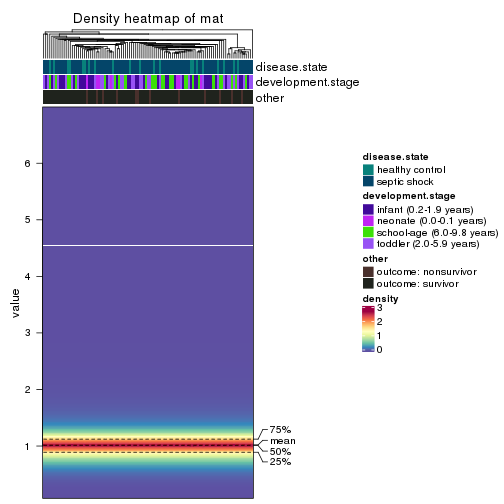


### Suggest the best k


Folowing table shows the best `k` (number of partitions) for each combination
of top-value methods and partition methods. Clicking on the method name in
the table goes to the section for a single combination of methods.

[The cola vignette](http://bioconductor.org/packages/devel/bioc/vignettes/cola/inst/doc/cola.html#toc_13)
explains the definition of the metrics used for determining the best
number of partitions.


```r
suggest_best_k(res_list)
```


|                            | The best k| 1-PAC| Mean silhouette| Concordance|   |Optional k |
|:---------------------------|----------:|-----:|---------------:|-----------:|:--|:----------|
|[SD:skmeans](#SD-skmeans)   |          2| 1.000|           0.963|       0.984|** |           |
|[CV:NMF](#CV-NMF)           |          2| 1.000|           0.958|       0.983|** |           |
|[MAD:skmeans](#MAD-skmeans) |          2| 1.000|           0.975|       0.989|** |           |
|[MAD:kmeans](#MAD-kmeans)   |          2| 0.979|           0.959|       0.983|** |           |
|[ATC:kmeans](#ATC-kmeans)   |          2| 0.979|           0.924|       0.972|** |           |
|[CV:mclust](#CV-mclust)     |          3| 0.968|           0.949|       0.981|** |           |
|[ATC:pam](#ATC-pam)         |          3| 0.954|           0.912|       0.966|** |           |
|[ATC:skmeans](#ATC-skmeans) |          4| 0.933|           0.913|       0.950|*  |2,3        |
|[SD:mclust](#SD-mclust)     |          3| 0.924|           0.920|       0.957|*  |           |
|[CV:skmeans](#CV-skmeans)   |          3| 0.900|           0.919|       0.964|*  |2          |
|[MAD:NMF](#MAD-NMF)         |          2| 0.890|           0.888|       0.944|   |           |
|[SD:NMF](#SD-NMF)           |          2| 0.880|           0.924|       0.967|   |           |
|[ATC:NMF](#ATC-NMF)         |          2| 0.863|           0.895|       0.959|   |           |
|[SD:kmeans](#SD-kmeans)     |          2| 0.786|           0.879|       0.944|   |           |
|[CV:pam](#CV-pam)           |          4| 0.717|           0.829|       0.906|   |           |
|[MAD:pam](#MAD-pam)         |          3| 0.712|           0.838|       0.925|   |           |
|[MAD:mclust](#MAD-mclust)   |          2| 0.675|           0.904|       0.950|   |           |
|[CV:kmeans](#CV-kmeans)     |          2| 0.670|           0.866|       0.935|   |           |
|[SD:pam](#SD-pam)           |          2| 0.608|           0.920|       0.947|   |           |
|[ATC:hclust](#ATC-hclust)   |          3| 0.596|           0.795|       0.898|   |           |
|[CV:hclust](#CV-hclust)     |          2| 0.557|           0.807|       0.910|   |           |
|[SD:hclust](#SD-hclust)     |          3| 0.505|           0.729|       0.862|   |           |
|[ATC:mclust](#ATC-mclust)   |          2| 0.483|           0.844|       0.896|   |           |
|[MAD:hclust](#MAD-hclust)   |          2| 0.192|           0.646|       0.773|   |           |

\*\*: 1-PAC > 0.95, \*: 1-PAC > 0.9


### CDF of consensus matrices

Cumulative distribution function curves of consensus matrix for all methods.


```r
collect_plots(res_list, fun = plot_ecdf)
```

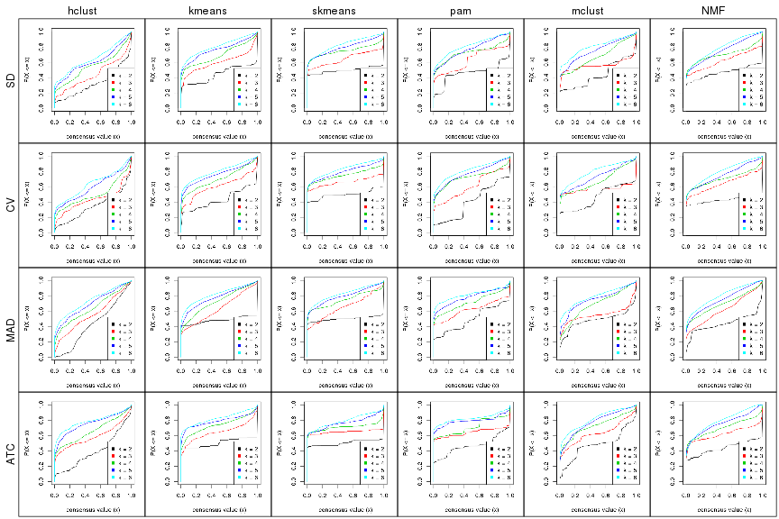


### Consensus heatmap

Consensus heatmaps for all methods. ([What is a consensus heatmap?](http://bioconductor.org/packages/devel/bioc/vignettes/cola/inst/doc/cola.html#toc_9))


<style type='text/css'>


.ui-helper-hidden {
	display: none;
}
.ui-helper-hidden-accessible {
	border: 0;
	clip: rect(0 0 0 0);
	height: 1px;
	margin: -1px;
	overflow: hidden;
	padding: 0;
	position: absolute;
	width: 1px;
}
.ui-helper-reset {
	margin: 0;
	padding: 0;
	border: 0;
	outline: 0;
	line-height: 1.3;
	text-decoration: none;
	font-size: 100%;
	list-style: none;
}
.ui-helper-clearfix:before,
.ui-helper-clearfix:after {
	content: "";
	display: table;
	border-collapse: collapse;
}
.ui-helper-clearfix:after {
	clear: both;
}
.ui-helper-zfix {
	width: 100%;
	height: 100%;
	top: 0;
	left: 0;
	position: absolute;
	opacity: 0;
	filter:Alpha(Opacity=0); 
}

.ui-front {
	z-index: 100;
}


.ui-state-disabled {
	cursor: default !important;
	pointer-events: none;
}


.ui-icon {
	display: inline-block;
	vertical-align: middle;
	margin-top: -.25em;
	position: relative;
	text-indent: -99999px;
	overflow: hidden;
	background-repeat: no-repeat;
}

.ui-widget-icon-block {
	left: 50%;
	margin-left: -8px;
	display: block;
}


.ui-widget-overlay {
	position: fixed;
	top: 0;
	left: 0;
	width: 100%;
	height: 100%;
}
.ui-accordion .ui-accordion-header {
	display: block;
	cursor: pointer;
	position: relative;
	margin: 2px 0 0 0;
	padding: .5em .5em .5em .7em;
	font-size: 100%;
}
.ui-accordion .ui-accordion-content {
	padding: 1em 2.2em;
	border-top: 0;
	overflow: auto;
}
.ui-autocomplete {
	position: absolute;
	top: 0;
	left: 0;
	cursor: default;
}
.ui-menu {
	list-style: none;
	padding: 0;
	margin: 0;
	display: block;
	outline: 0;
}
.ui-menu .ui-menu {
	position: absolute;
}
.ui-menu .ui-menu-item {
	margin: 0;
	cursor: pointer;
	
	list-style-image: url("data:image/gif;base64,R0lGODlhAQABAIAAAAAAAP///yH5BAEAAAAALAAAAAABAAEAAAIBRAA7");
}
.ui-menu .ui-menu-item-wrapper {
	position: relative;
	padding: 3px 1em 3px .4em;
}
.ui-menu .ui-menu-divider {
	margin: 5px 0;
	height: 0;
	font-size: 0;
	line-height: 0;
	border-width: 1px 0 0 0;
}
.ui-menu .ui-state-focus,
.ui-menu .ui-state-active {
	margin: -1px;
}


.ui-menu-icons {
	position: relative;
}
.ui-menu-icons .ui-menu-item-wrapper {
	padding-left: 2em;
}


.ui-menu .ui-icon {
	position: absolute;
	top: 0;
	bottom: 0;
	left: .2em;
	margin: auto 0;
}


.ui-menu .ui-menu-icon {
	left: auto;
	right: 0;
}
.ui-button {
	padding: .4em 1em;
	display: inline-block;
	position: relative;
	line-height: normal;
	margin-right: .1em;
	cursor: pointer;
	vertical-align: middle;
	text-align: center;
	-webkit-user-select: none;
	-moz-user-select: none;
	-ms-user-select: none;
	user-select: none;

	
	overflow: visible;
}

.ui-button,
.ui-button:link,
.ui-button:visited,
.ui-button:hover,
.ui-button:active {
	text-decoration: none;
}


.ui-button-icon-only {
	width: 2em;
	box-sizing: border-box;
	text-indent: -9999px;
	white-space: nowrap;
}


input.ui-button.ui-button-icon-only {
	text-indent: 0;
}


.ui-button-icon-only .ui-icon {
	position: absolute;
	top: 50%;
	left: 50%;
	margin-top: -8px;
	margin-left: -8px;
}

.ui-button.ui-icon-notext .ui-icon {
	padding: 0;
	width: 2.1em;
	height: 2.1em;
	text-indent: -9999px;
	white-space: nowrap;

}

input.ui-button.ui-icon-notext .ui-icon {
	width: auto;
	height: auto;
	text-indent: 0;
	white-space: normal;
	padding: .4em 1em;
}


input.ui-button::-moz-focus-inner,
button.ui-button::-moz-focus-inner {
	border: 0;
	padding: 0;
}
.ui-controlgroup {
	vertical-align: middle;
	display: inline-block;
}
.ui-controlgroup > .ui-controlgroup-item {
	float: left;
	margin-left: 0;
	margin-right: 0;
}
.ui-controlgroup > .ui-controlgroup-item:focus,
.ui-controlgroup > .ui-controlgroup-item.ui-visual-focus {
	z-index: 9999;
}
.ui-controlgroup-vertical > .ui-controlgroup-item {
	display: block;
	float: none;
	width: 100%;
	margin-top: 0;
	margin-bottom: 0;
	text-align: left;
}
.ui-controlgroup-vertical .ui-controlgroup-item {
	box-sizing: border-box;
}
.ui-controlgroup .ui-controlgroup-label {
	padding: .4em 1em;
}
.ui-controlgroup .ui-controlgroup-label span {
	font-size: 80%;
}
.ui-controlgroup-horizontal .ui-controlgroup-label + .ui-controlgroup-item {
	border-left: none;
}
.ui-controlgroup-vertical .ui-controlgroup-label + .ui-controlgroup-item {
	border-top: none;
}
.ui-controlgroup-horizontal .ui-controlgroup-label.ui-widget-content {
	border-right: none;
}
.ui-controlgroup-vertical .ui-controlgroup-label.ui-widget-content {
	border-bottom: none;
}


.ui-controlgroup-vertical .ui-spinner-input {

	
	width: 75%;
	width: calc( 100% - 2.4em );
}
.ui-controlgroup-vertical .ui-spinner .ui-spinner-up {
	border-top-style: solid;
}

.ui-checkboxradio-label .ui-icon-background {
	box-shadow: inset 1px 1px 1px #ccc;
	border-radius: .12em;
	border: none;
}
.ui-checkboxradio-radio-label .ui-icon-background {
	width: 16px;
	height: 16px;
	border-radius: 1em;
	overflow: visible;
	border: none;
}
.ui-checkboxradio-radio-label.ui-checkboxradio-checked .ui-icon,
.ui-checkboxradio-radio-label.ui-checkboxradio-checked:hover .ui-icon {
	background-image: none;
	width: 8px;
	height: 8px;
	border-width: 4px;
	border-style: solid;
}
.ui-checkboxradio-disabled {
	pointer-events: none;
}
.ui-datepicker {
	width: 17em;
	padding: .2em .2em 0;
	display: none;
}
.ui-datepicker .ui-datepicker-header {
	position: relative;
	padding: .2em 0;
}
.ui-datepicker .ui-datepicker-prev,
.ui-datepicker .ui-datepicker-next {
	position: absolute;
	top: 2px;
	width: 1.8em;
	height: 1.8em;
}
.ui-datepicker .ui-datepicker-prev-hover,
.ui-datepicker .ui-datepicker-next-hover {
	top: 1px;
}
.ui-datepicker .ui-datepicker-prev {
	left: 2px;
}
.ui-datepicker .ui-datepicker-next {
	right: 2px;
}
.ui-datepicker .ui-datepicker-prev-hover {
	left: 1px;
}
.ui-datepicker .ui-datepicker-next-hover {
	right: 1px;
}
.ui-datepicker .ui-datepicker-prev span,
.ui-datepicker .ui-datepicker-next span {
	display: block;
	position: absolute;
	left: 50%;
	margin-left: -8px;
	top: 50%;
	margin-top: -8px;
}
.ui-datepicker .ui-datepicker-title {
	margin: 0 2.3em;
	line-height: 1.8em;
	text-align: center;
}
.ui-datepicker .ui-datepicker-title select {
	font-size: 1em;
	margin: 1px 0;
}
.ui-datepicker select.ui-datepicker-month,
.ui-datepicker select.ui-datepicker-year {
	width: 45%;
}
.ui-datepicker table {
	width: 100%;
	font-size: .9em;
	border-collapse: collapse;
	margin: 0 0 .4em;
}
.ui-datepicker th {
	padding: .7em .3em;
	text-align: center;
	font-weight: bold;
	border: 0;
}
.ui-datepicker td {
	border: 0;
	padding: 1px;
}
.ui-datepicker td span,
.ui-datepicker td a {
	display: block;
	padding: .2em;
	text-align: right;
	text-decoration: none;
}
.ui-datepicker .ui-datepicker-buttonpane {
	background-image: none;
	margin: .7em 0 0 0;
	padding: 0 .2em;
	border-left: 0;
	border-right: 0;
	border-bottom: 0;
}
.ui-datepicker .ui-datepicker-buttonpane button {
	float: right;
	margin: .5em .2em .4em;
	cursor: pointer;
	padding: .2em .6em .3em .6em;
	width: auto;
	overflow: visible;
}
.ui-datepicker .ui-datepicker-buttonpane button.ui-datepicker-current {
	float: left;
}


.ui-datepicker.ui-datepicker-multi {
	width: auto;
}
.ui-datepicker-multi .ui-datepicker-group {
	float: left;
}
.ui-datepicker-multi .ui-datepicker-group table {
	width: 95%;
	margin: 0 auto .4em;
}
.ui-datepicker-multi-2 .ui-datepicker-group {
	width: 50%;
}
.ui-datepicker-multi-3 .ui-datepicker-group {
	width: 33.3%;
}
.ui-datepicker-multi-4 .ui-datepicker-group {
	width: 25%;
}
.ui-datepicker-multi .ui-datepicker-group-last .ui-datepicker-header,
.ui-datepicker-multi .ui-datepicker-group-middle .ui-datepicker-header {
	border-left-width: 0;
}
.ui-datepicker-multi .ui-datepicker-buttonpane {
	clear: left;
}
.ui-datepicker-row-break {
	clear: both;
	width: 100%;
	font-size: 0;
}


.ui-datepicker-rtl {
	direction: rtl;
}
.ui-datepicker-rtl .ui-datepicker-prev {
	right: 2px;
	left: auto;
}
.ui-datepicker-rtl .ui-datepicker-next {
	left: 2px;
	right: auto;
}
.ui-datepicker-rtl .ui-datepicker-prev:hover {
	right: 1px;
	left: auto;
}
.ui-datepicker-rtl .ui-datepicker-next:hover {
	left: 1px;
	right: auto;
}
.ui-datepicker-rtl .ui-datepicker-buttonpane {
	clear: right;
}
.ui-datepicker-rtl .ui-datepicker-buttonpane button {
	float: left;
}
.ui-datepicker-rtl .ui-datepicker-buttonpane button.ui-datepicker-current,
.ui-datepicker-rtl .ui-datepicker-group {
	float: right;
}
.ui-datepicker-rtl .ui-datepicker-group-last .ui-datepicker-header,
.ui-datepicker-rtl .ui-datepicker-group-middle .ui-datepicker-header {
	border-right-width: 0;
	border-left-width: 1px;
}


.ui-datepicker .ui-icon {
	display: block;
	text-indent: -99999px;
	overflow: hidden;
	background-repeat: no-repeat;
	left: .5em;
	top: .3em;
}
.ui-dialog {
	position: absolute;
	top: 0;
	left: 0;
	padding: .2em;
	outline: 0;
}
.ui-dialog .ui-dialog-titlebar {
	padding: .4em 1em;
	position: relative;
}
.ui-dialog .ui-dialog-title {
	float: left;
	margin: .1em 0;
	white-space: nowrap;
	width: 90%;
	overflow: hidden;
	text-overflow: ellipsis;
}
.ui-dialog .ui-dialog-titlebar-close {
	position: absolute;
	right: .3em;
	top: 50%;
	width: 20px;
	margin: -10px 0 0 0;
	padding: 1px;
	height: 20px;
}
.ui-dialog .ui-dialog-content {
	position: relative;
	border: 0;
	padding: .5em 1em;
	background: none;
	overflow: auto;
}
.ui-dialog .ui-dialog-buttonpane {
	text-align: left;
	border-width: 1px 0 0 0;
	background-image: none;
	margin-top: .5em;
	padding: .3em 1em .5em .4em;
}
.ui-dialog .ui-dialog-buttonpane .ui-dialog-buttonset {
	float: right;
}
.ui-dialog .ui-dialog-buttonpane button {
	margin: .5em .4em .5em 0;
	cursor: pointer;
}
.ui-dialog .ui-resizable-n {
	height: 2px;
	top: 0;
}
.ui-dialog .ui-resizable-e {
	width: 2px;
	right: 0;
}
.ui-dialog .ui-resizable-s {
	height: 2px;
	bottom: 0;
}
.ui-dialog .ui-resizable-w {
	width: 2px;
	left: 0;
}
.ui-dialog .ui-resizable-se,
.ui-dialog .ui-resizable-sw,
.ui-dialog .ui-resizable-ne,
.ui-dialog .ui-resizable-nw {
	width: 7px;
	height: 7px;
}
.ui-dialog .ui-resizable-se {
	right: 0;
	bottom: 0;
}
.ui-dialog .ui-resizable-sw {
	left: 0;
	bottom: 0;
}
.ui-dialog .ui-resizable-ne {
	right: 0;
	top: 0;
}
.ui-dialog .ui-resizable-nw {
	left: 0;
	top: 0;
}
.ui-draggable .ui-dialog-titlebar {
	cursor: move;
}
.ui-draggable-handle {
	-ms-touch-action: none;
	touch-action: none;
}
.ui-resizable {
	position: relative;
}
.ui-resizable-handle {
	position: absolute;
	font-size: 0.1px;
	display: block;
	-ms-touch-action: none;
	touch-action: none;
}
.ui-resizable-disabled .ui-resizable-handle,
.ui-resizable-autohide .ui-resizable-handle {
	display: none;
}
.ui-resizable-n {
	cursor: n-resize;
	height: 7px;
	width: 100%;
	top: -5px;
	left: 0;
}
.ui-resizable-s {
	cursor: s-resize;
	height: 7px;
	width: 100%;
	bottom: -5px;
	left: 0;
}
.ui-resizable-e {
	cursor: e-resize;
	width: 7px;
	right: -5px;
	top: 0;
	height: 100%;
}
.ui-resizable-w {
	cursor: w-resize;
	width: 7px;
	left: -5px;
	top: 0;
	height: 100%;
}
.ui-resizable-se {
	cursor: se-resize;
	width: 12px;
	height: 12px;
	right: 1px;
	bottom: 1px;
}
.ui-resizable-sw {
	cursor: sw-resize;
	width: 9px;
	height: 9px;
	left: -5px;
	bottom: -5px;
}
.ui-resizable-nw {
	cursor: nw-resize;
	width: 9px;
	height: 9px;
	left: -5px;
	top: -5px;
}
.ui-resizable-ne {
	cursor: ne-resize;
	width: 9px;
	height: 9px;
	right: -5px;
	top: -5px;
}
.ui-progressbar {
	height: 2em;
	text-align: left;
	overflow: hidden;
}
.ui-progressbar .ui-progressbar-value {
	margin: -1px;
	height: 100%;
}
.ui-progressbar .ui-progressbar-overlay {
	background: url("");
	height: 100%;
	filter: alpha(opacity=25); 
	opacity: 0.25;
}
.ui-progressbar-indeterminate .ui-progressbar-value {
	background-image: none;
}
.ui-selectable {
	-ms-touch-action: none;
	touch-action: none;
}
.ui-selectable-helper {
	position: absolute;
	z-index: 100;
	border: 1px dotted black;
}
.ui-selectmenu-menu {
	padding: 0;
	margin: 0;
	position: absolute;
	top: 0;
	left: 0;
	display: none;
}
.ui-selectmenu-menu .ui-menu {
	overflow: auto;
	overflow-x: hidden;
	padding-bottom: 1px;
}
.ui-selectmenu-menu .ui-menu .ui-selectmenu-optgroup {
	font-size: 1em;
	font-weight: bold;
	line-height: 1.5;
	padding: 2px 0.4em;
	margin: 0.5em 0 0 0;
	height: auto;
	border: 0;
}
.ui-selectmenu-open {
	display: block;
}
.ui-selectmenu-text {
	display: block;
	margin-right: 20px;
	overflow: hidden;
	text-overflow: ellipsis;
}
.ui-selectmenu-button.ui-button {
	text-align: left;
	white-space: nowrap;
	width: 14em;
}
.ui-selectmenu-icon.ui-icon {
	float: right;
	margin-top: 0;
}
.ui-slider {
	position: relative;
	text-align: left;
}
.ui-slider .ui-slider-handle {
	position: absolute;
	z-index: 2;
	width: 1.2em;
	height: 1.2em;
	cursor: default;
	-ms-touch-action: none;
	touch-action: none;
}
.ui-slider .ui-slider-range {
	position: absolute;
	z-index: 1;
	font-size: .7em;
	display: block;
	border: 0;
	background-position: 0 0;
}


.ui-slider.ui-state-disabled .ui-slider-handle,
.ui-slider.ui-state-disabled .ui-slider-range {
	filter: inherit;
}

.ui-slider-horizontal {
	height: .8em;
}
.ui-slider-horizontal .ui-slider-handle {
	top: -.3em;
	margin-left: -.6em;
}
.ui-slider-horizontal .ui-slider-range {
	top: 0;
	height: 100%;
}
.ui-slider-horizontal .ui-slider-range-min {
	left: 0;
}
.ui-slider-horizontal .ui-slider-range-max {
	right: 0;
}

.ui-slider-vertical {
	width: .8em;
	height: 100px;
}
.ui-slider-vertical .ui-slider-handle {
	left: -.3em;
	margin-left: 0;
	margin-bottom: -.6em;
}
.ui-slider-vertical .ui-slider-range {
	left: 0;
	width: 100%;
}
.ui-slider-vertical .ui-slider-range-min {
	bottom: 0;
}
.ui-slider-vertical .ui-slider-range-max {
	top: 0;
}
.ui-sortable-handle {
	-ms-touch-action: none;
	touch-action: none;
}
.ui-spinner {
	position: relative;
	display: inline-block;
	overflow: hidden;
	padding: 0;
	vertical-align: middle;
}
.ui-spinner-input {
	border: none;
	background: none;
	color: inherit;
	padding: .222em 0;
	margin: .2em 0;
	vertical-align: middle;
	margin-left: .4em;
	margin-right: 2em;
}
.ui-spinner-button {
	width: 1.6em;
	height: 50%;
	font-size: .5em;
	padding: 0;
	margin: 0;
	text-align: center;
	position: absolute;
	cursor: default;
	display: block;
	overflow: hidden;
	right: 0;
}

.ui-spinner a.ui-spinner-button {
	border-top-style: none;
	border-bottom-style: none;
	border-right-style: none;
}
.ui-spinner-up {
	top: 0;
}
.ui-spinner-down {
	bottom: 0;
}
.ui-tabs {
	position: relative;
	padding: .2em;
}
.ui-tabs .ui-tabs-nav {
	margin: 0;
	padding: .2em .2em 0;
}
.ui-tabs .ui-tabs-nav li {
	list-style: none;
	float: left;
	position: relative;
	top: 0;
	margin: 1px .2em 0 0;
	border-bottom-width: 0;
	padding: 0;
	white-space: nowrap;
}
.ui-tabs .ui-tabs-nav .ui-tabs-anchor {
	float: left;
	padding: .5em 1em;
	text-decoration: none;
}
.ui-tabs .ui-tabs-nav li.ui-tabs-active {
	margin-bottom: -1px;
	padding-bottom: 1px;
}
.ui-tabs .ui-tabs-nav li.ui-tabs-active .ui-tabs-anchor,
.ui-tabs .ui-tabs-nav li.ui-state-disabled .ui-tabs-anchor,
.ui-tabs .ui-tabs-nav li.ui-tabs-loading .ui-tabs-anchor {
	cursor: text;
}
.ui-tabs-collapsible .ui-tabs-nav li.ui-tabs-active .ui-tabs-anchor {
	cursor: pointer;
}
.ui-tabs .ui-tabs-panel {
	display: block;
	border-width: 0;
	padding: 1em 1.4em;
	background: none;
}
.ui-tooltip {
	padding: 8px;
	position: absolute;
	z-index: 9999;
	max-width: 300px;
}
body .ui-tooltip {
	border-width: 2px;
}

.ui-widget {
	font-family: Arial,Helvetica,sans-serif;
	font-size: 1em;
}
.ui-widget .ui-widget {
	font-size: 1em;
}
.ui-widget input,
.ui-widget select,
.ui-widget textarea,
.ui-widget button {
	font-family: Arial,Helvetica,sans-serif;
	font-size: 1em;
}
.ui-widget.ui-widget-content {
	border: 1px solid #c5c5c5;
}
.ui-widget-content {
	border: 1px solid #dddddd;
	background: #ffffff;
	color: #333333;
}
.ui-widget-content a {
	color: #333333;
}
.ui-widget-header {
	border: 1px solid #dddddd;
	background: #e9e9e9;
	color: #333333;
	font-weight: bold;
}
.ui-widget-header a {
	color: #333333;
}


.ui-state-default,
.ui-widget-content .ui-state-default,
.ui-widget-header .ui-state-default,
.ui-button,


html .ui-button.ui-state-disabled:hover,
html .ui-button.ui-state-disabled:active {
	border: 1px solid #c5c5c5;
	background: #f6f6f6;
	font-weight: normal;
	color: #454545;
}
.ui-state-default a,
.ui-state-default a:link,
.ui-state-default a:visited,
a.ui-button,
a:link.ui-button,
a:visited.ui-button,
.ui-button {
	color: #454545;
	text-decoration: none;
}
.ui-state-hover,
.ui-widget-content .ui-state-hover,
.ui-widget-header .ui-state-hover,
.ui-state-focus,
.ui-widget-content .ui-state-focus,
.ui-widget-header .ui-state-focus,
.ui-button:hover,
.ui-button:focus {
	border: 1px solid #cccccc;
	background: #ededed;
	font-weight: normal;
	color: #2b2b2b;
}
.ui-state-hover a,
.ui-state-hover a:hover,
.ui-state-hover a:link,
.ui-state-hover a:visited,
.ui-state-focus a,
.ui-state-focus a:hover,
.ui-state-focus a:link,
.ui-state-focus a:visited,
a.ui-button:hover,
a.ui-button:focus {
	color: #2b2b2b;
	text-decoration: none;
}

.ui-visual-focus {
	box-shadow: 0 0 3px 1px rgb(94, 158, 214);
}
.ui-state-active,
.ui-widget-content .ui-state-active,
.ui-widget-header .ui-state-active,
a.ui-button:active,
.ui-button:active,
.ui-button.ui-state-active:hover {
	border: 1px solid #003eff;
	background: #007fff;
	font-weight: normal;
	color: #ffffff;
}
.ui-icon-background,
.ui-state-active .ui-icon-background {
	border: #003eff;
	background-color: #ffffff;
}
.ui-state-active a,
.ui-state-active a:link,
.ui-state-active a:visited {
	color: #ffffff;
	text-decoration: none;
}


.ui-state-highlight,
.ui-widget-content .ui-state-highlight,
.ui-widget-header .ui-state-highlight {
	border: 1px solid #dad55e;
	background: #fffa90;
	color: #777620;
}
.ui-state-checked {
	border: 1px solid #dad55e;
	background: #fffa90;
}
.ui-state-highlight a,
.ui-widget-content .ui-state-highlight a,
.ui-widget-header .ui-state-highlight a {
	color: #777620;
}
.ui-state-error,
.ui-widget-content .ui-state-error,
.ui-widget-header .ui-state-error {
	border: 1px solid #f1a899;
	background: #fddfdf;
	color: #5f3f3f;
}
.ui-state-error a,
.ui-widget-content .ui-state-error a,
.ui-widget-header .ui-state-error a {
	color: #5f3f3f;
}
.ui-state-error-text,
.ui-widget-content .ui-state-error-text,
.ui-widget-header .ui-state-error-text {
	color: #5f3f3f;
}
.ui-priority-primary,
.ui-widget-content .ui-priority-primary,
.ui-widget-header .ui-priority-primary {
	font-weight: bold;
}
.ui-priority-secondary,
.ui-widget-content .ui-priority-secondary,
.ui-widget-header .ui-priority-secondary {
	opacity: .7;
	filter:Alpha(Opacity=70); 
	font-weight: normal;
}
.ui-state-disabled,
.ui-widget-content .ui-state-disabled,
.ui-widget-header .ui-state-disabled {
	opacity: .35;
	filter:Alpha(Opacity=35); 
	background-image: none;
}
.ui-state-disabled .ui-icon {
	filter:Alpha(Opacity=35); 
}


.ui-icon {
	width: 16px;
	height: 16px;
}
.ui-icon,
.ui-widget-content .ui-icon {
	background-image: url("images/ui-icons_444444_256x240.png");
}
.ui-widget-header .ui-icon {
	background-image: url("images/ui-icons_444444_256x240.png");
}
.ui-state-hover .ui-icon,
.ui-state-focus .ui-icon,
.ui-button:hover .ui-icon,
.ui-button:focus .ui-icon {
	background-image: url("images/ui-icons_555555_256x240.png");
}
.ui-state-active .ui-icon,
.ui-button:active .ui-icon {
	background-image: url("images/ui-icons_ffffff_256x240.png");
}
.ui-state-highlight .ui-icon,
.ui-button .ui-state-highlight.ui-icon {
	background-image: url("images/ui-icons_777620_256x240.png");
}
.ui-state-error .ui-icon,
.ui-state-error-text .ui-icon {
	background-image: url("images/ui-icons_cc0000_256x240.png");
}
.ui-button .ui-icon {
	background-image: url("images/ui-icons_777777_256x240.png");
}


.ui-icon-blank { background-position: 16px 16px; }
.ui-icon-caret-1-n { background-position: 0 0; }
.ui-icon-caret-1-ne { background-position: -16px 0; }
.ui-icon-caret-1-e { background-position: -32px 0; }
.ui-icon-caret-1-se { background-position: -48px 0; }
.ui-icon-caret-1-s { background-position: -65px 0; }
.ui-icon-caret-1-sw { background-position: -80px 0; }
.ui-icon-caret-1-w { background-position: -96px 0; }
.ui-icon-caret-1-nw { background-position: -112px 0; }
.ui-icon-caret-2-n-s { background-position: -128px 0; }
.ui-icon-caret-2-e-w { background-position: -144px 0; }
.ui-icon-triangle-1-n { background-position: 0 -16px; }
.ui-icon-triangle-1-ne { background-position: -16px -16px; }
.ui-icon-triangle-1-e { background-position: -32px -16px; }
.ui-icon-triangle-1-se { background-position: -48px -16px; }
.ui-icon-triangle-1-s { background-position: -65px -16px; }
.ui-icon-triangle-1-sw { background-position: -80px -16px; }
.ui-icon-triangle-1-w { background-position: -96px -16px; }
.ui-icon-triangle-1-nw { background-position: -112px -16px; }
.ui-icon-triangle-2-n-s { background-position: -128px -16px; }
.ui-icon-triangle-2-e-w { background-position: -144px -16px; }
.ui-icon-arrow-1-n { background-position: 0 -32px; }
.ui-icon-arrow-1-ne { background-position: -16px -32px; }
.ui-icon-arrow-1-e { background-position: -32px -32px; }
.ui-icon-arrow-1-se { background-position: -48px -32px; }
.ui-icon-arrow-1-s { background-position: -65px -32px; }
.ui-icon-arrow-1-sw { background-position: -80px -32px; }
.ui-icon-arrow-1-w { background-position: -96px -32px; }
.ui-icon-arrow-1-nw { background-position: -112px -32px; }
.ui-icon-arrow-2-n-s { background-position: -128px -32px; }
.ui-icon-arrow-2-ne-sw { background-position: -144px -32px; }
.ui-icon-arrow-2-e-w { background-position: -160px -32px; }
.ui-icon-arrow-2-se-nw { background-position: -176px -32px; }
.ui-icon-arrowstop-1-n { background-position: -192px -32px; }
.ui-icon-arrowstop-1-e { background-position: -208px -32px; }
.ui-icon-arrowstop-1-s { background-position: -224px -32px; }
.ui-icon-arrowstop-1-w { background-position: -240px -32px; }
.ui-icon-arrowthick-1-n { background-position: 1px -48px; }
.ui-icon-arrowthick-1-ne { background-position: -16px -48px; }
.ui-icon-arrowthick-1-e { background-position: -32px -48px; }
.ui-icon-arrowthick-1-se { background-position: -48px -48px; }
.ui-icon-arrowthick-1-s { background-position: -64px -48px; }
.ui-icon-arrowthick-1-sw { background-position: -80px -48px; }
.ui-icon-arrowthick-1-w { background-position: -96px -48px; }
.ui-icon-arrowthick-1-nw { background-position: -112px -48px; }
.ui-icon-arrowthick-2-n-s { background-position: -128px -48px; }
.ui-icon-arrowthick-2-ne-sw { background-position: -144px -48px; }
.ui-icon-arrowthick-2-e-w { background-position: -160px -48px; }
.ui-icon-arrowthick-2-se-nw { background-position: -176px -48px; }
.ui-icon-arrowthickstop-1-n { background-position: -192px -48px; }
.ui-icon-arrowthickstop-1-e { background-position: -208px -48px; }
.ui-icon-arrowthickstop-1-s { background-position: -224px -48px; }
.ui-icon-arrowthickstop-1-w { background-position: -240px -48px; }
.ui-icon-arrowreturnthick-1-w { background-position: 0 -64px; }
.ui-icon-arrowreturnthick-1-n { background-position: -16px -64px; }
.ui-icon-arrowreturnthick-1-e { background-position: -32px -64px; }
.ui-icon-arrowreturnthick-1-s { background-position: -48px -64px; }
.ui-icon-arrowreturn-1-w { background-position: -64px -64px; }
.ui-icon-arrowreturn-1-n { background-position: -80px -64px; }
.ui-icon-arrowreturn-1-e { background-position: -96px -64px; }
.ui-icon-arrowreturn-1-s { background-position: -112px -64px; }
.ui-icon-arrowrefresh-1-w { background-position: -128px -64px; }
.ui-icon-arrowrefresh-1-n { background-position: -144px -64px; }
.ui-icon-arrowrefresh-1-e { background-position: -160px -64px; }
.ui-icon-arrowrefresh-1-s { background-position: -176px -64px; }
.ui-icon-arrow-4 { background-position: 0 -80px; }
.ui-icon-arrow-4-diag { background-position: -16px -80px; }
.ui-icon-extlink { background-position: -32px -80px; }
.ui-icon-newwin { background-position: -48px -80px; }
.ui-icon-refresh { background-position: -64px -80px; }
.ui-icon-shuffle { background-position: -80px -80px; }
.ui-icon-transfer-e-w { background-position: -96px -80px; }
.ui-icon-transferthick-e-w { background-position: -112px -80px; }
.ui-icon-folder-collapsed { background-position: 0 -96px; }
.ui-icon-folder-open { background-position: -16px -96px; }
.ui-icon-document { background-position: -32px -96px; }
.ui-icon-document-b { background-position: -48px -96px; }
.ui-icon-note { background-position: -64px -96px; }
.ui-icon-mail-closed { background-position: -80px -96px; }
.ui-icon-mail-open { background-position: -96px -96px; }
.ui-icon-suitcase { background-position: -112px -96px; }
.ui-icon-comment { background-position: -128px -96px; }
.ui-icon-person { background-position: -144px -96px; }
.ui-icon-print { background-position: -160px -96px; }
.ui-icon-trash { background-position: -176px -96px; }
.ui-icon-locked { background-position: -192px -96px; }
.ui-icon-unlocked { background-position: -208px -96px; }
.ui-icon-bookmark { background-position: -224px -96px; }
.ui-icon-tag { background-position: -240px -96px; }
.ui-icon-home { background-position: 0 -112px; }
.ui-icon-flag { background-position: -16px -112px; }
.ui-icon-calendar { background-position: -32px -112px; }
.ui-icon-cart { background-position: -48px -112px; }
.ui-icon-pencil { background-position: -64px -112px; }
.ui-icon-clock { background-position: -80px -112px; }
.ui-icon-disk { background-position: -96px -112px; }
.ui-icon-calculator { background-position: -112px -112px; }
.ui-icon-zoomin { background-position: -128px -112px; }
.ui-icon-zoomout { background-position: -144px -112px; }
.ui-icon-search { background-position: -160px -112px; }
.ui-icon-wrench { background-position: -176px -112px; }
.ui-icon-gear { background-position: -192px -112px; }
.ui-icon-heart { background-position: -208px -112px; }
.ui-icon-star { background-position: -224px -112px; }
.ui-icon-link { background-position: -240px -112px; }
.ui-icon-cancel { background-position: 0 -128px; }
.ui-icon-plus { background-position: -16px -128px; }
.ui-icon-plusthick { background-position: -32px -128px; }
.ui-icon-minus { background-position: -48px -128px; }
.ui-icon-minusthick { background-position: -64px -128px; }
.ui-icon-close { background-position: -80px -128px; }
.ui-icon-closethick { background-position: -96px -128px; }
.ui-icon-key { background-position: -112px -128px; }
.ui-icon-lightbulb { background-position: -128px -128px; }
.ui-icon-scissors { background-position: -144px -128px; }
.ui-icon-clipboard { background-position: -160px -128px; }
.ui-icon-copy { background-position: -176px -128px; }
.ui-icon-contact { background-position: -192px -128px; }
.ui-icon-image { background-position: -208px -128px; }
.ui-icon-video { background-position: -224px -128px; }
.ui-icon-script { background-position: -240px -128px; }
.ui-icon-alert { background-position: 0 -144px; }
.ui-icon-info { background-position: -16px -144px; }
.ui-icon-notice { background-position: -32px -144px; }
.ui-icon-help { background-position: -48px -144px; }
.ui-icon-check { background-position: -64px -144px; }
.ui-icon-bullet { background-position: -80px -144px; }
.ui-icon-radio-on { background-position: -96px -144px; }
.ui-icon-radio-off { background-position: -112px -144px; }
.ui-icon-pin-w { background-position: -128px -144px; }
.ui-icon-pin-s { background-position: -144px -144px; }
.ui-icon-play { background-position: 0 -160px; }
.ui-icon-pause { background-position: -16px -160px; }
.ui-icon-seek-next { background-position: -32px -160px; }
.ui-icon-seek-prev { background-position: -48px -160px; }
.ui-icon-seek-end { background-position: -64px -160px; }
.ui-icon-seek-start { background-position: -80px -160px; }

.ui-icon-seek-first { background-position: -80px -160px; }
.ui-icon-stop { background-position: -96px -160px; }
.ui-icon-eject { background-position: -112px -160px; }
.ui-icon-volume-off { background-position: -128px -160px; }
.ui-icon-volume-on { background-position: -144px -160px; }
.ui-icon-power { background-position: 0 -176px; }
.ui-icon-signal-diag { background-position: -16px -176px; }
.ui-icon-signal { background-position: -32px -176px; }
.ui-icon-battery-0 { background-position: -48px -176px; }
.ui-icon-battery-1 { background-position: -64px -176px; }
.ui-icon-battery-2 { background-position: -80px -176px; }
.ui-icon-battery-3 { background-position: -96px -176px; }
.ui-icon-circle-plus { background-position: 0 -192px; }
.ui-icon-circle-minus { background-position: -16px -192px; }
.ui-icon-circle-close { background-position: -32px -192px; }
.ui-icon-circle-triangle-e { background-position: -48px -192px; }
.ui-icon-circle-triangle-s { background-position: -64px -192px; }
.ui-icon-circle-triangle-w { background-position: -80px -192px; }
.ui-icon-circle-triangle-n { background-position: -96px -192px; }
.ui-icon-circle-arrow-e { background-position: -112px -192px; }
.ui-icon-circle-arrow-s { background-position: -128px -192px; }
.ui-icon-circle-arrow-w { background-position: -144px -192px; }
.ui-icon-circle-arrow-n { background-position: -160px -192px; }
.ui-icon-circle-zoomin { background-position: -176px -192px; }
.ui-icon-circle-zoomout { background-position: -192px -192px; }
.ui-icon-circle-check { background-position: -208px -192px; }
.ui-icon-circlesmall-plus { background-position: 0 -208px; }
.ui-icon-circlesmall-minus { background-position: -16px -208px; }
.ui-icon-circlesmall-close { background-position: -32px -208px; }
.ui-icon-squaresmall-plus { background-position: -48px -208px; }
.ui-icon-squaresmall-minus { background-position: -64px -208px; }
.ui-icon-squaresmall-close { background-position: -80px -208px; }
.ui-icon-grip-dotted-vertical { background-position: 0 -224px; }
.ui-icon-grip-dotted-horizontal { background-position: -16px -224px; }
.ui-icon-grip-solid-vertical { background-position: -32px -224px; }
.ui-icon-grip-solid-horizontal { background-position: -48px -224px; }
.ui-icon-gripsmall-diagonal-se { background-position: -64px -224px; }
.ui-icon-grip-diagonal-se { background-position: -80px -224px; }


.ui-corner-all,
.ui-corner-top,
.ui-corner-left,
.ui-corner-tl {
	border-top-left-radius: 3px;
}
.ui-corner-all,
.ui-corner-top,
.ui-corner-right,
.ui-corner-tr {
	border-top-right-radius: 3px;
}
.ui-corner-all,
.ui-corner-bottom,
.ui-corner-left,
.ui-corner-bl {
	border-bottom-left-radius: 3px;
}
.ui-corner-all,
.ui-corner-bottom,
.ui-corner-right,
.ui-corner-br {
	border-bottom-right-radius: 3px;
}


.ui-widget-overlay {
	background: #aaaaaa;
	opacity: .3;
	filter: Alpha(Opacity=30); 
}
.ui-widget-shadow {
	-webkit-box-shadow: 0px 0px 5px #666666;
	box-shadow: 0px 0px 5px #666666;
} 
</style>
<script src='js/jquery-1.12.4.js'></script>
<script src='js/jquery-ui.js'></script>

<script>
$( function() {
	$( '#tabs-collect-consensus-heatmap' ).tabs();
} );
</script>
<div id='tabs-collect-consensus-heatmap'>
<ul>
<li><a href='#tab-collect-consensus-heatmap-1'>k = 2</a></li>
<li><a href='#tab-collect-consensus-heatmap-2'>k = 3</a></li>
<li><a href='#tab-collect-consensus-heatmap-3'>k = 4</a></li>
<li><a href='#tab-collect-consensus-heatmap-4'>k = 5</a></li>
<li><a href='#tab-collect-consensus-heatmap-5'>k = 6</a></li>
</ul>
<div id='tab-collect-consensus-heatmap-1'>
<pre><code class="r">collect_plots(res_list, k = 2, fun = consensus_heatmap, mc.cores = 4)
</code></pre>

<p>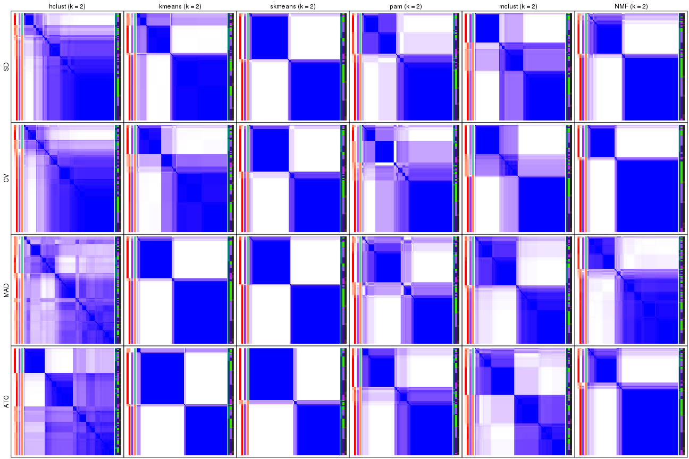</p>

</div>
<div id='tab-collect-consensus-heatmap-2'>
<pre><code class="r">collect_plots(res_list, k = 3, fun = consensus_heatmap, mc.cores = 4)
</code></pre>

<p>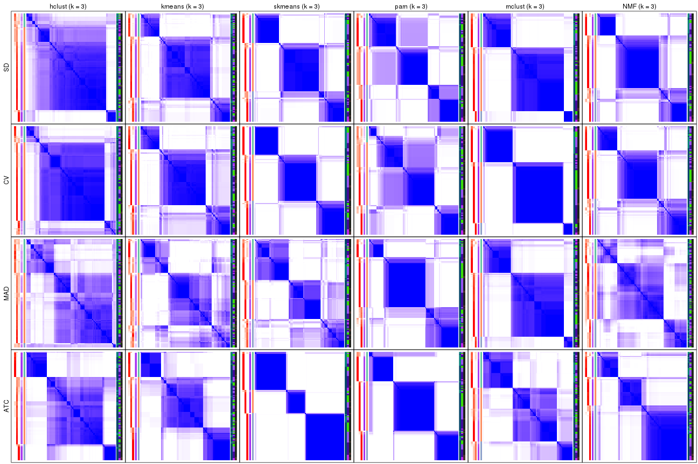</p>

</div>
<div id='tab-collect-consensus-heatmap-3'>
<pre><code class="r">collect_plots(res_list, k = 4, fun = consensus_heatmap, mc.cores = 4)
</code></pre>

<p>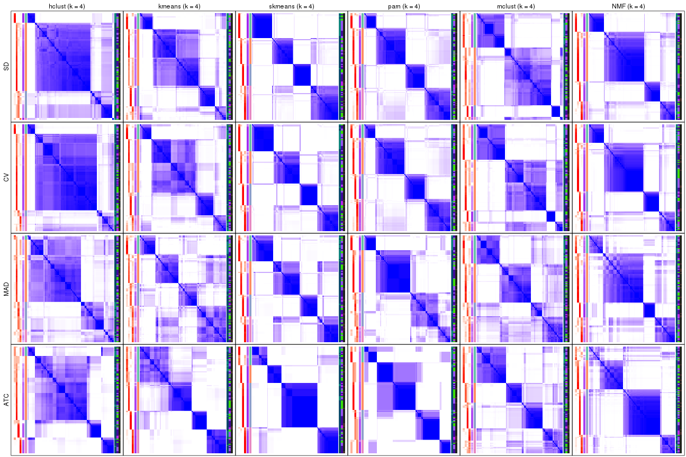</p>

</div>
<div id='tab-collect-consensus-heatmap-4'>
<pre><code class="r">collect_plots(res_list, k = 5, fun = consensus_heatmap, mc.cores = 4)
</code></pre>

<p>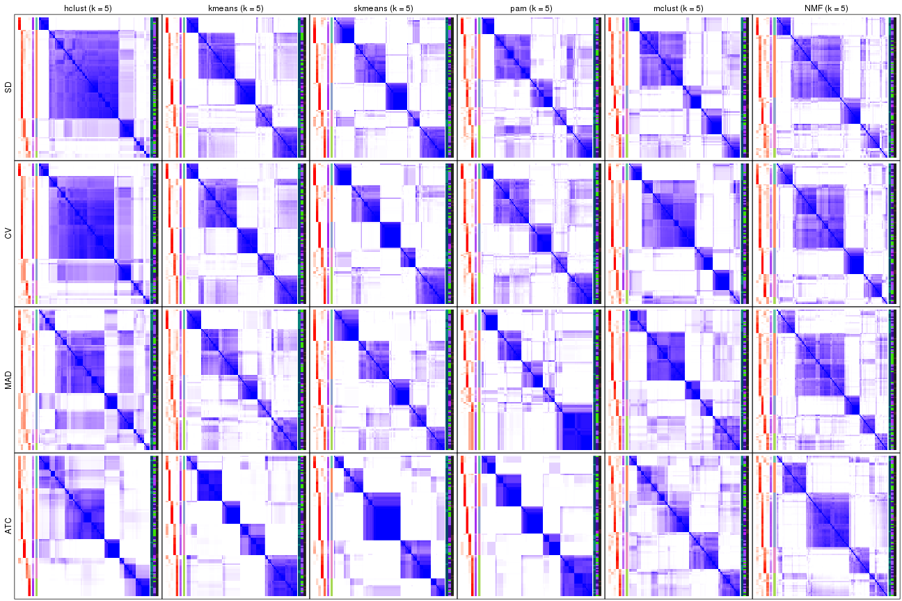</p>

</div>
<div id='tab-collect-consensus-heatmap-5'>
<pre><code class="r">collect_plots(res_list, k = 6, fun = consensus_heatmap, mc.cores = 4)
</code></pre>

<p>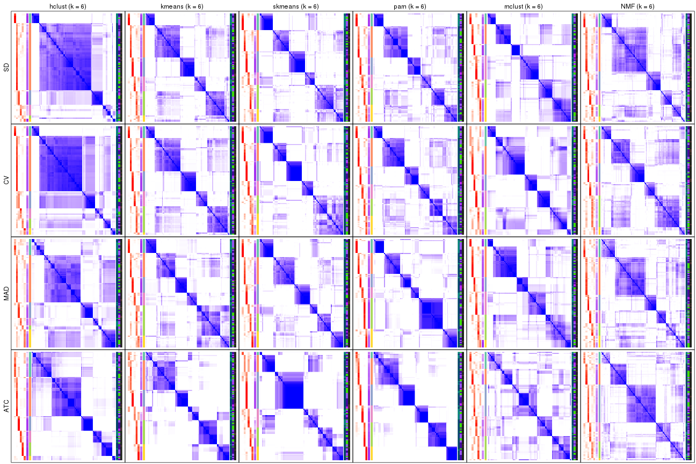</p>

</div>
</div>


### Membership heatmap

Membership heatmaps for all methods. ([What is a membership heatmap?](http://bioconductor.org/packages/devel/bioc/vignettes/cola/inst/doc/cola.html#toc_12))


<script>
$( function() {
	$( '#tabs-collect-membership-heatmap' ).tabs();
} );
</script>
<div id='tabs-collect-membership-heatmap'>
<ul>
<li><a href='#tab-collect-membership-heatmap-1'>k = 2</a></li>
<li><a href='#tab-collect-membership-heatmap-2'>k = 3</a></li>
<li><a href='#tab-collect-membership-heatmap-3'>k = 4</a></li>
<li><a href='#tab-collect-membership-heatmap-4'>k = 5</a></li>
<li><a href='#tab-collect-membership-heatmap-5'>k = 6</a></li>
</ul>
<div id='tab-collect-membership-heatmap-1'>
<pre><code class="r">collect_plots(res_list, k = 2, fun = membership_heatmap, mc.cores = 4)
</code></pre>

<p>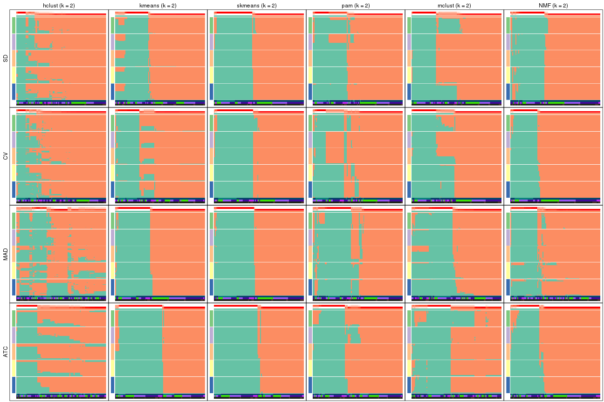</p>

</div>
<div id='tab-collect-membership-heatmap-2'>
<pre><code class="r">collect_plots(res_list, k = 3, fun = membership_heatmap, mc.cores = 4)
</code></pre>

<p>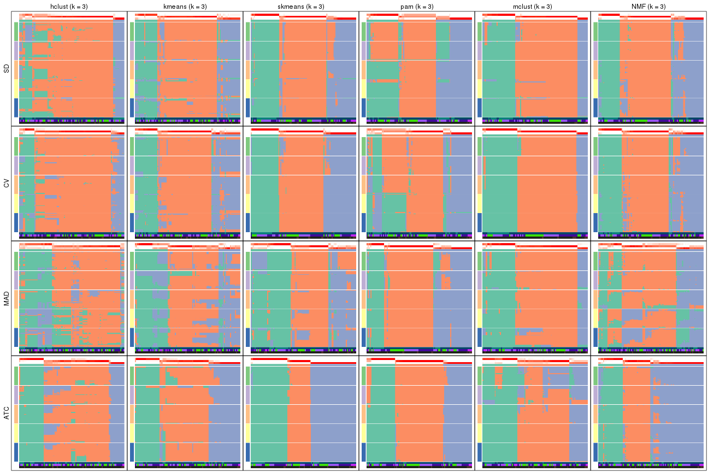</p>

</div>
<div id='tab-collect-membership-heatmap-3'>
<pre><code class="r">collect_plots(res_list, k = 4, fun = membership_heatmap, mc.cores = 4)
</code></pre>

<p>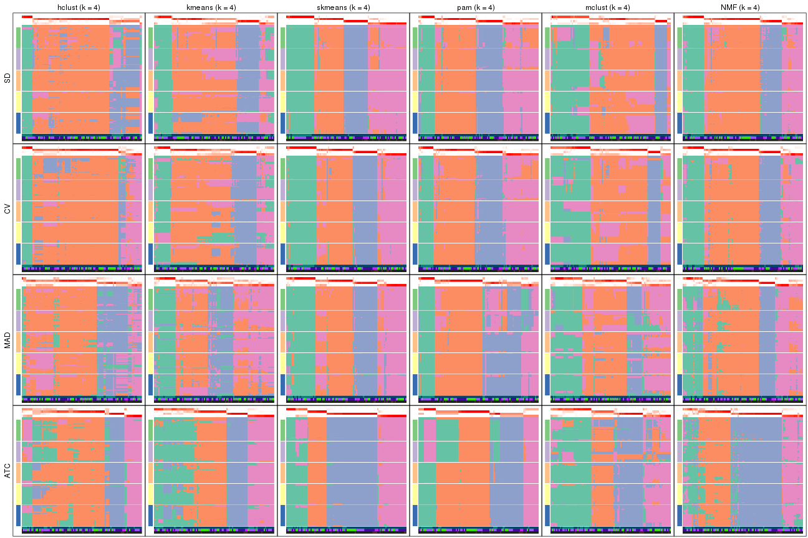</p>

</div>
<div id='tab-collect-membership-heatmap-4'>
<pre><code class="r">collect_plots(res_list, k = 5, fun = membership_heatmap, mc.cores = 4)
</code></pre>

<p>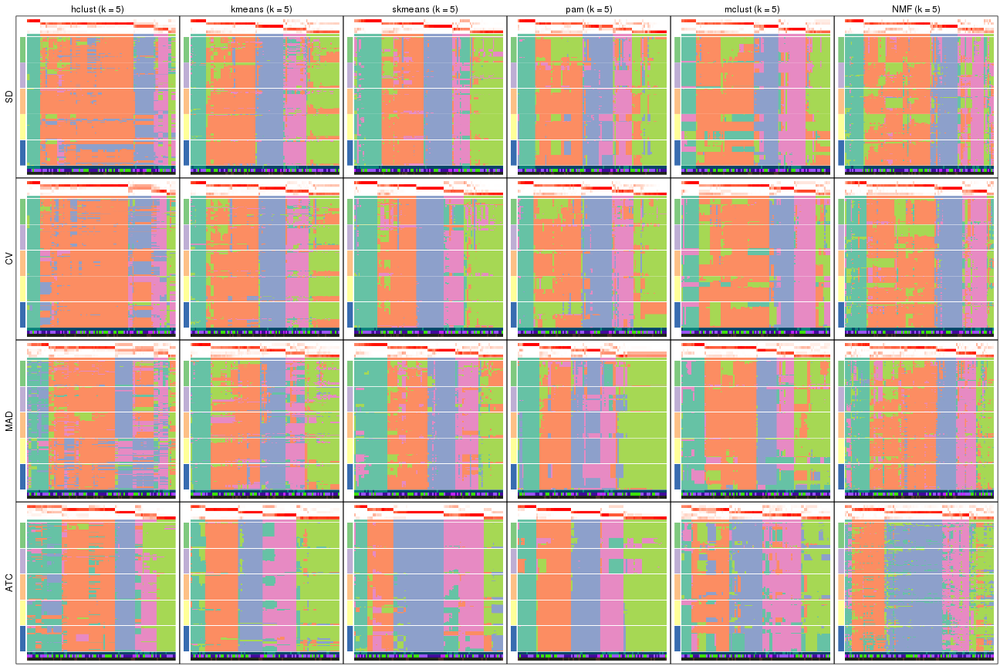</p>

</div>
<div id='tab-collect-membership-heatmap-5'>
<pre><code class="r">collect_plots(res_list, k = 6, fun = membership_heatmap, mc.cores = 4)
</code></pre>

<p>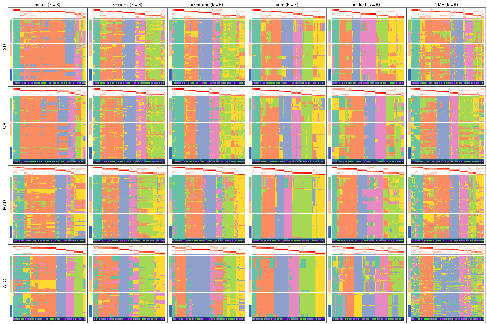</p>

</div>
</div>


### Signature heatmap

Signature heatmaps for all methods. ([What is a signature heatmap?](http://bioconductor.org/packages/devel/bioc/vignettes/cola/inst/doc/cola.html#toc_22))


Note in following heatmaps, rows are scaled.


<script>
$( function() {
	$( '#tabs-collect-get-signatures' ).tabs();
} );
</script>
<div id='tabs-collect-get-signatures'>
<ul>
<li><a href='#tab-collect-get-signatures-1'>k = 2</a></li>
<li><a href='#tab-collect-get-signatures-2'>k = 3</a></li>
<li><a href='#tab-collect-get-signatures-3'>k = 4</a></li>
<li><a href='#tab-collect-get-signatures-4'>k = 5</a></li>
<li><a href='#tab-collect-get-signatures-5'>k = 6</a></li>
</ul>
<div id='tab-collect-get-signatures-1'>
<pre><code class="r">collect_plots(res_list, k = 2, fun = get_signatures, mc.cores = 4)
</code></pre>

<p>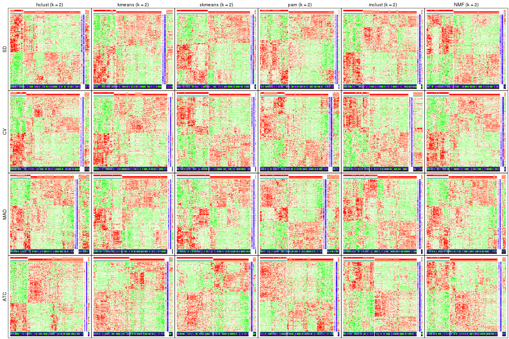</p>

</div>
<div id='tab-collect-get-signatures-2'>
<pre><code class="r">collect_plots(res_list, k = 3, fun = get_signatures, mc.cores = 4)
</code></pre>

<p>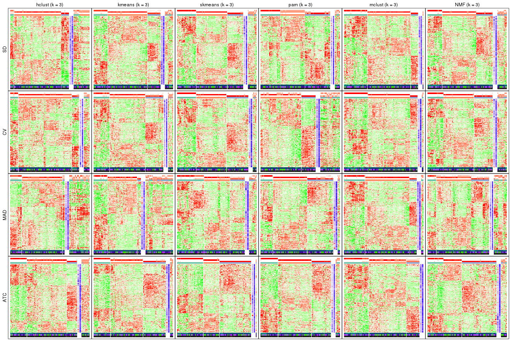</p>

</div>
<div id='tab-collect-get-signatures-3'>
<pre><code class="r">collect_plots(res_list, k = 4, fun = get_signatures, mc.cores = 4)
</code></pre>

<p>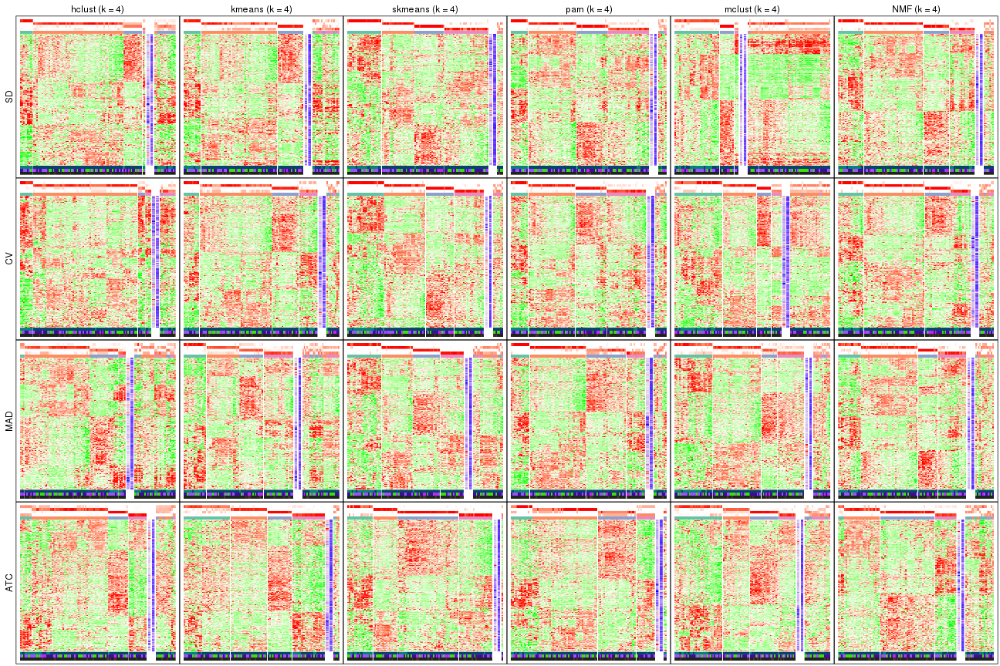</p>

</div>
<div id='tab-collect-get-signatures-4'>
<pre><code class="r">collect_plots(res_list, k = 5, fun = get_signatures, mc.cores = 4)
</code></pre>

<p>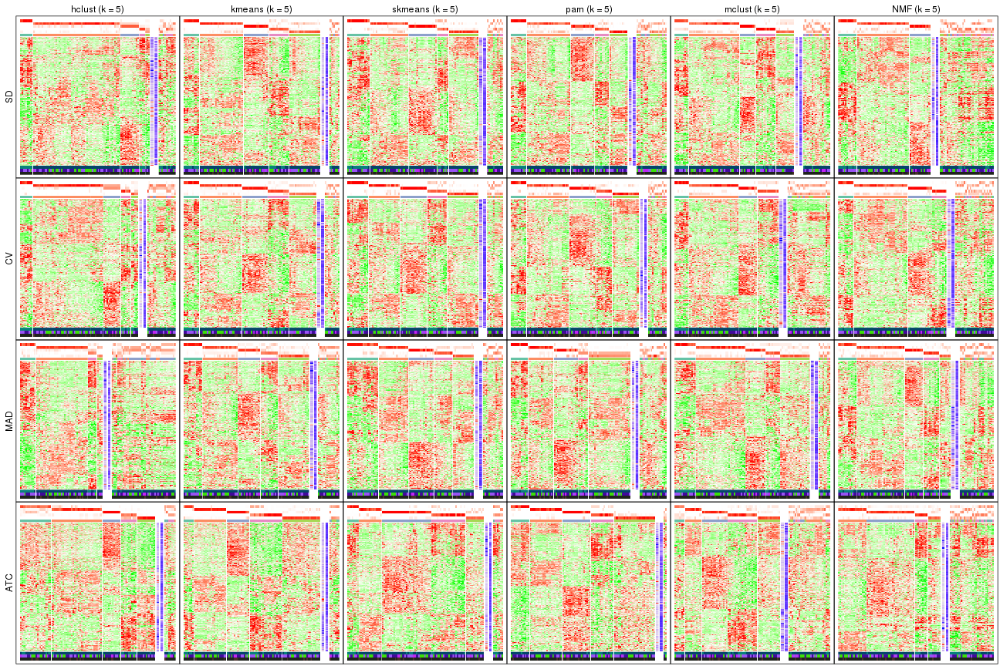</p>

</div>
<div id='tab-collect-get-signatures-5'>
<pre><code class="r">collect_plots(res_list, k = 6, fun = get_signatures, mc.cores = 4)
</code></pre>

<p>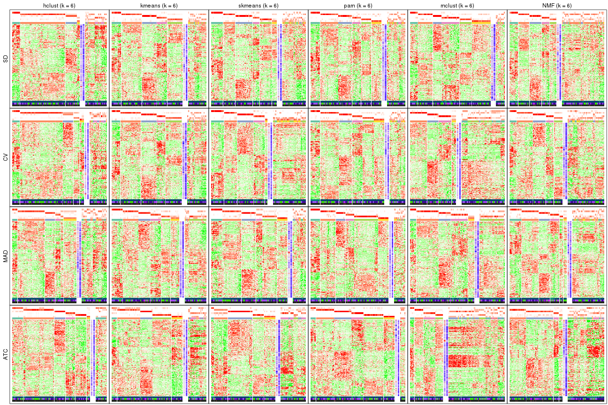</p>

</div>
</div>


### Statistics table

The statistics used for measuring the stability of consensus partitioning.
([How are they
defined?](http://bioconductor.org/packages/devel/bioc/vignettes/cola/inst/doc/cola.html#toc_13))


<script>
$( function() {
	$( '#tabs-get-stats-from-consensus-partition-list' ).tabs();
} );
</script>
<div id='tabs-get-stats-from-consensus-partition-list'>
<ul>
<li><a href='#tab-get-stats-from-consensus-partition-list-1'>k = 2</a></li>
<li><a href='#tab-get-stats-from-consensus-partition-list-2'>k = 3</a></li>
<li><a href='#tab-get-stats-from-consensus-partition-list-3'>k = 4</a></li>
<li><a href='#tab-get-stats-from-consensus-partition-list-4'>k = 5</a></li>
<li><a href='#tab-get-stats-from-consensus-partition-list-5'>k = 6</a></li>
</ul>
<div id='tab-get-stats-from-consensus-partition-list-1'>
<pre><code class="r">get_stats(res_list, k = 2)
</code></pre>

<pre><code>#&gt;             k 1-PAC mean_silhouette concordance area_increased  Rand Jaccard
#&gt; SD:NMF      2 0.880           0.924       0.967          0.468 0.525   0.525
#&gt; CV:NMF      2 1.000           0.958       0.983          0.427 0.575   0.575
#&gt; MAD:NMF     2 0.890           0.888       0.944          0.444 0.575   0.575
#&gt; ATC:NMF     2 0.863           0.895       0.959          0.438 0.560   0.560
#&gt; SD:skmeans  2 1.000           0.963       0.984          0.495 0.506   0.506
#&gt; CV:skmeans  2 0.901           0.953       0.979          0.497 0.503   0.503
#&gt; MAD:skmeans 2 1.000           0.975       0.989          0.499 0.501   0.501
#&gt; ATC:skmeans 2 1.000           0.955       0.983          0.505 0.496   0.496
#&gt; SD:mclust   2 0.616           0.828       0.907          0.437 0.600   0.600
#&gt; CV:mclust   2 0.689           0.826       0.911          0.464 0.497   0.497
#&gt; MAD:mclust  2 0.675           0.904       0.950          0.488 0.499   0.499
#&gt; ATC:mclust  2 0.483           0.844       0.896          0.482 0.503   0.503
#&gt; SD:kmeans   2 0.786           0.879       0.944          0.443 0.530   0.530
#&gt; CV:kmeans   2 0.670           0.866       0.935          0.431 0.600   0.600
#&gt; MAD:kmeans  2 0.979           0.959       0.983          0.479 0.520   0.520
#&gt; ATC:kmeans  2 0.979           0.924       0.972          0.504 0.496   0.496
#&gt; SD:pam      2 0.608           0.920       0.947          0.458 0.525   0.525
#&gt; CV:pam      2 0.455           0.754       0.870          0.405 0.541   0.541
#&gt; MAD:pam     2 0.608           0.780       0.914          0.496 0.506   0.506
#&gt; ATC:pam     2 0.697           0.898       0.951          0.468 0.535   0.535
#&gt; SD:hclust   2 0.552           0.826       0.916          0.323 0.672   0.672
#&gt; CV:hclust   2 0.557           0.807       0.910          0.343 0.650   0.650
#&gt; MAD:hclust  2 0.192           0.646       0.773          0.430 0.547   0.547
#&gt; ATC:hclust  2 0.382           0.807       0.848          0.395 0.639   0.639
</code></pre>

</div>
<div id='tab-get-stats-from-consensus-partition-list-2'>
<pre><code class="r">get_stats(res_list, k = 3)
</code></pre>

<pre><code>#&gt;             k 1-PAC mean_silhouette concordance area_increased  Rand Jaccard
#&gt; SD:NMF      3 0.727           0.804       0.920          0.330 0.747   0.558
#&gt; CV:NMF      3 0.738           0.803       0.918          0.509 0.698   0.508
#&gt; MAD:NMF     3 0.526           0.651       0.778          0.403 0.758   0.595
#&gt; ATC:NMF     3 0.867           0.863       0.941          0.423 0.728   0.548
#&gt; SD:skmeans  3 0.816           0.820       0.930          0.306 0.745   0.540
#&gt; CV:skmeans  3 0.900           0.919       0.964          0.328 0.742   0.532
#&gt; MAD:skmeans 3 0.569           0.734       0.846          0.315 0.781   0.584
#&gt; ATC:skmeans 3 1.000           0.963       0.986          0.282 0.816   0.644
#&gt; SD:mclust   3 0.924           0.920       0.957          0.285 0.808   0.692
#&gt; CV:mclust   3 0.968           0.949       0.981          0.223 0.872   0.757
#&gt; MAD:mclust  3 0.848           0.885       0.937          0.137 0.815   0.674
#&gt; ATC:mclust  3 0.610           0.814       0.862          0.312 0.719   0.517
#&gt; SD:kmeans   3 0.733           0.802       0.887          0.356 0.830   0.693
#&gt; CV:kmeans   3 0.619           0.808       0.895          0.405 0.714   0.548
#&gt; MAD:kmeans  3 0.480           0.534       0.757          0.328 0.791   0.619
#&gt; ATC:kmeans  3 0.729           0.855       0.922          0.281 0.641   0.407
#&gt; SD:pam      3 0.678           0.795       0.792          0.376 0.753   0.552
#&gt; CV:pam      3 0.584           0.593       0.800          0.501 0.843   0.721
#&gt; MAD:pam     3 0.712           0.838       0.925          0.246 0.756   0.566
#&gt; ATC:pam     3 0.954           0.912       0.966          0.367 0.684   0.474
#&gt; SD:hclust   3 0.505           0.729       0.862          0.373 0.928   0.894
#&gt; CV:hclust   3 0.528           0.795       0.902          0.271 0.898   0.845
#&gt; MAD:hclust  3 0.392           0.542       0.747          0.302 0.822   0.713
#&gt; ATC:hclust  3 0.596           0.795       0.898          0.488 0.817   0.714
</code></pre>

</div>
<div id='tab-get-stats-from-consensus-partition-list-3'>
<pre><code class="r">get_stats(res_list, k = 4)
</code></pre>

<pre><code>#&gt;             k 1-PAC mean_silhouette concordance area_increased  Rand Jaccard
#&gt; SD:NMF      4 0.773           0.829       0.919         0.1300 0.869   0.674
#&gt; CV:NMF      4 0.789           0.808       0.912         0.0967 0.843   0.613
#&gt; MAD:NMF     4 0.622           0.722       0.858         0.1220 0.678   0.363
#&gt; ATC:NMF     4 0.734           0.712       0.855         0.1265 0.882   0.700
#&gt; SD:skmeans  4 0.868           0.878       0.938         0.1627 0.788   0.475
#&gt; CV:skmeans  4 0.842           0.846       0.930         0.1382 0.839   0.571
#&gt; MAD:skmeans 4 0.797           0.747       0.893         0.1405 0.832   0.554
#&gt; ATC:skmeans 4 0.933           0.913       0.950         0.0984 0.876   0.673
#&gt; SD:mclust   4 0.543           0.476       0.787         0.2056 0.937   0.864
#&gt; CV:mclust   4 0.624           0.603       0.789         0.2008 0.916   0.806
#&gt; MAD:mclust  4 0.467           0.662       0.766         0.2419 0.787   0.545
#&gt; ATC:mclust  4 0.624           0.733       0.808         0.1524 0.816   0.550
#&gt; SD:kmeans   4 0.653           0.676       0.779         0.1578 0.893   0.753
#&gt; CV:kmeans   4 0.639           0.714       0.800         0.1544 0.904   0.763
#&gt; MAD:kmeans  4 0.534           0.604       0.736         0.1429 0.731   0.399
#&gt; ATC:kmeans  4 0.735           0.822       0.875         0.1406 0.789   0.487
#&gt; SD:pam      4 0.742           0.829       0.900         0.1536 0.930   0.789
#&gt; CV:pam      4 0.717           0.829       0.906         0.1930 0.746   0.466
#&gt; MAD:pam     4 0.684           0.728       0.833         0.1587 0.824   0.583
#&gt; ATC:pam     4 0.778           0.752       0.845         0.1172 0.949   0.856
#&gt; SD:hclust   4 0.450           0.703       0.828         0.2425 0.801   0.691
#&gt; CV:hclust   4 0.546           0.763       0.865         0.1547 0.973   0.953
#&gt; MAD:hclust  4 0.457           0.538       0.743         0.1458 0.882   0.776
#&gt; ATC:hclust  4 0.567           0.646       0.777         0.1254 0.945   0.881
</code></pre>

</div>
<div id='tab-get-stats-from-consensus-partition-list-4'>
<pre><code class="r">get_stats(res_list, k = 5)
</code></pre>

<pre><code>#&gt;             k 1-PAC mean_silhouette concordance area_increased  Rand Jaccard
#&gt; SD:NMF      5 0.598           0.531       0.752         0.0755 0.892   0.688
#&gt; CV:NMF      5 0.642           0.572       0.787         0.0692 0.912   0.739
#&gt; MAD:NMF     5 0.587           0.610       0.788         0.0791 0.813   0.514
#&gt; ATC:NMF     5 0.633           0.601       0.787         0.0818 0.884   0.650
#&gt; SD:skmeans  5 0.758           0.725       0.847         0.0581 0.929   0.730
#&gt; CV:skmeans  5 0.780           0.771       0.854         0.0588 0.905   0.653
#&gt; MAD:skmeans 5 0.703           0.715       0.822         0.0650 0.859   0.522
#&gt; ATC:skmeans 5 0.763           0.791       0.860         0.0764 0.844   0.539
#&gt; SD:mclust   5 0.593           0.645       0.776         0.1152 0.787   0.504
#&gt; CV:mclust   5 0.612           0.589       0.793         0.0759 0.818   0.557
#&gt; MAD:mclust  5 0.579           0.733       0.814         0.0935 0.931   0.757
#&gt; ATC:mclust  5 0.553           0.573       0.760         0.0606 0.920   0.711
#&gt; SD:kmeans   5 0.673           0.770       0.841         0.1004 0.831   0.546
#&gt; CV:kmeans   5 0.706           0.757       0.839         0.0887 0.834   0.543
#&gt; MAD:kmeans  5 0.656           0.662       0.775         0.0730 0.898   0.649
#&gt; ATC:kmeans  5 0.850           0.786       0.882         0.0693 0.905   0.664
#&gt; SD:pam      5 0.608           0.600       0.784         0.0589 0.820   0.460
#&gt; CV:pam      5 0.639           0.701       0.798         0.0639 0.833   0.490
#&gt; MAD:pam     5 0.752           0.661       0.822         0.0900 0.784   0.411
#&gt; ATC:pam     5 0.843           0.877       0.920         0.1103 0.822   0.490
#&gt; SD:hclust   5 0.490           0.745       0.821         0.1069 0.946   0.888
#&gt; CV:hclust   5 0.538           0.656       0.793         0.1813 0.835   0.700
#&gt; MAD:hclust  5 0.475           0.418       0.664         0.0901 0.797   0.556
#&gt; ATC:hclust  5 0.667           0.737       0.819         0.1447 0.771   0.476
</code></pre>

</div>
<div id='tab-get-stats-from-consensus-partition-list-5'>
<pre><code class="r">get_stats(res_list, k = 6)
</code></pre>

<pre><code>#&gt;             k 1-PAC mean_silhouette concordance area_increased  Rand Jaccard
#&gt; SD:NMF      6 0.601           0.474       0.713         0.0500 0.931   0.763
#&gt; CV:NMF      6 0.617           0.537       0.722         0.0608 0.840   0.497
#&gt; MAD:NMF     6 0.626           0.531       0.734         0.0631 0.899   0.647
#&gt; ATC:NMF     6 0.569           0.501       0.688         0.0455 0.913   0.690
#&gt; SD:skmeans  6 0.724           0.603       0.763         0.0445 0.931   0.688
#&gt; CV:skmeans  6 0.770           0.624       0.794         0.0459 0.906   0.593
#&gt; MAD:skmeans 6 0.737           0.698       0.810         0.0390 0.955   0.785
#&gt; ATC:skmeans 6 0.746           0.623       0.785         0.0381 0.946   0.785
#&gt; SD:mclust   6 0.669           0.704       0.821         0.0671 0.840   0.444
#&gt; CV:mclust   6 0.692           0.503       0.709         0.0887 0.808   0.423
#&gt; MAD:mclust  6 0.674           0.648       0.801         0.0515 0.879   0.560
#&gt; ATC:mclust  6 0.642           0.336       0.689         0.0506 0.845   0.461
#&gt; SD:kmeans   6 0.691           0.637       0.774         0.0551 0.926   0.699
#&gt; CV:kmeans   6 0.689           0.639       0.805         0.0511 0.936   0.745
#&gt; MAD:kmeans  6 0.696           0.595       0.760         0.0513 0.843   0.440
#&gt; ATC:kmeans  6 0.758           0.634       0.770         0.0469 0.938   0.731
#&gt; SD:pam      6 0.675           0.642       0.807         0.0581 0.876   0.525
#&gt; CV:pam      6 0.695           0.681       0.801         0.0585 0.877   0.521
#&gt; MAD:pam     6 0.824           0.759       0.876         0.0472 0.911   0.640
#&gt; ATC:pam     6 0.849           0.813       0.896         0.0425 0.971   0.861
#&gt; SD:hclust   6 0.444           0.678       0.778         0.0682 0.978   0.950
#&gt; CV:hclust   6 0.521           0.688       0.779         0.0721 0.910   0.773
#&gt; MAD:hclust  6 0.540           0.549       0.683         0.0589 0.910   0.719
#&gt; ATC:hclust  6 0.737           0.746       0.790         0.0407 0.992   0.964
</code></pre>

</div>
</div>

Following heatmap plots the partition for each combination of methods and the
lightness correspond to the silhouette scores for samples in each method. On
top the consensus subgroup is inferred from all methods by taking the mean
silhouette scores as weight.


<script>
$( function() {
	$( '#tabs-collect-stats-from-consensus-partition-list' ).tabs();
} );
</script>
<div id='tabs-collect-stats-from-consensus-partition-list'>
<ul>
<li><a href='#tab-collect-stats-from-consensus-partition-list-1'>k = 2</a></li>
<li><a href='#tab-collect-stats-from-consensus-partition-list-2'>k = 3</a></li>
<li><a href='#tab-collect-stats-from-consensus-partition-list-3'>k = 4</a></li>
<li><a href='#tab-collect-stats-from-consensus-partition-list-4'>k = 5</a></li>
<li><a href='#tab-collect-stats-from-consensus-partition-list-5'>k = 6</a></li>
</ul>
<div id='tab-collect-stats-from-consensus-partition-list-1'>
<pre><code class="r">collect_stats(res_list, k = 2)
</code></pre>

<p>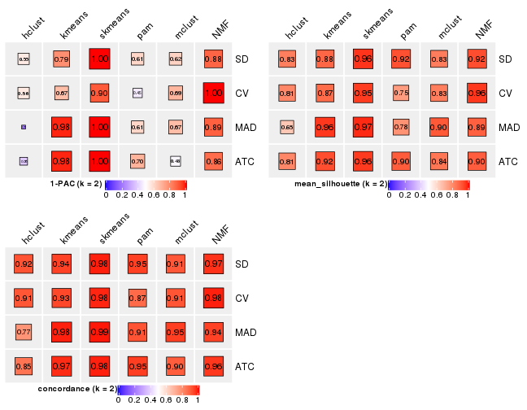</p>

</div>
<div id='tab-collect-stats-from-consensus-partition-list-2'>
<pre><code class="r">collect_stats(res_list, k = 3)
</code></pre>

<p>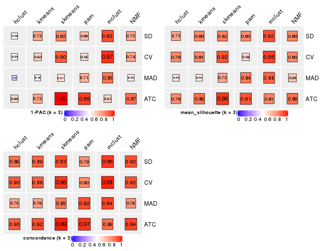</p>

</div>
<div id='tab-collect-stats-from-consensus-partition-list-3'>
<pre><code class="r">collect_stats(res_list, k = 4)
</code></pre>

<p>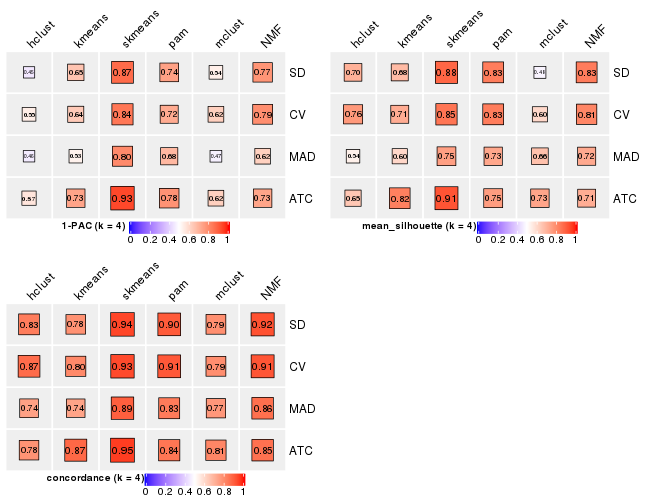</p>

</div>
<div id='tab-collect-stats-from-consensus-partition-list-4'>
<pre><code class="r">collect_stats(res_list, k = 5)
</code></pre>

<p>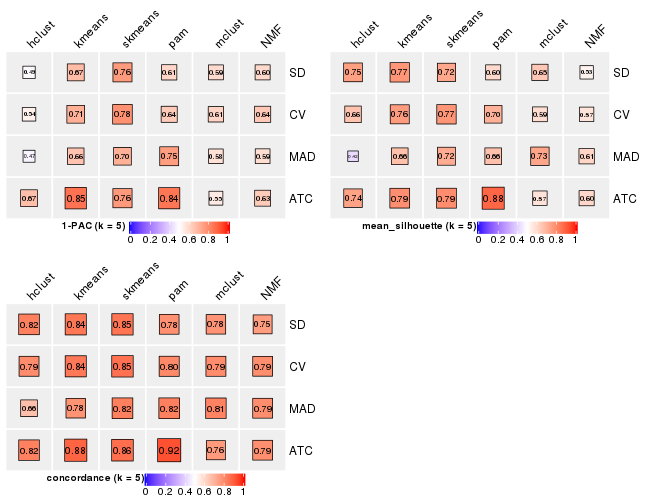</p>

</div>
<div id='tab-collect-stats-from-consensus-partition-list-5'>
<pre><code class="r">collect_stats(res_list, k = 6)
</code></pre>

<p>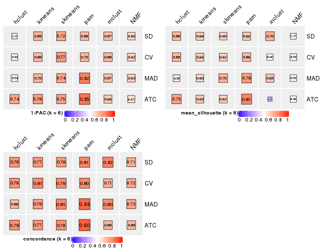</p>

</div>
</div>

### Partition from all methods


Collect partitions from all methods:


<script>
$( function() {
	$( '#tabs-collect-classes-from-consensus-partition-list' ).tabs();
} );
</script>
<div id='tabs-collect-classes-from-consensus-partition-list'>
<ul>
<li><a href='#tab-collect-classes-from-consensus-partition-list-1'>k = 2</a></li>
<li><a href='#tab-collect-classes-from-consensus-partition-list-2'>k = 3</a></li>
<li><a href='#tab-collect-classes-from-consensus-partition-list-3'>k = 4</a></li>
<li><a href='#tab-collect-classes-from-consensus-partition-list-4'>k = 5</a></li>
<li><a href='#tab-collect-classes-from-consensus-partition-list-5'>k = 6</a></li>
</ul>
<div id='tab-collect-classes-from-consensus-partition-list-1'>
<pre><code class="r">collect_classes(res_list, k = 2)
</code></pre>

<p>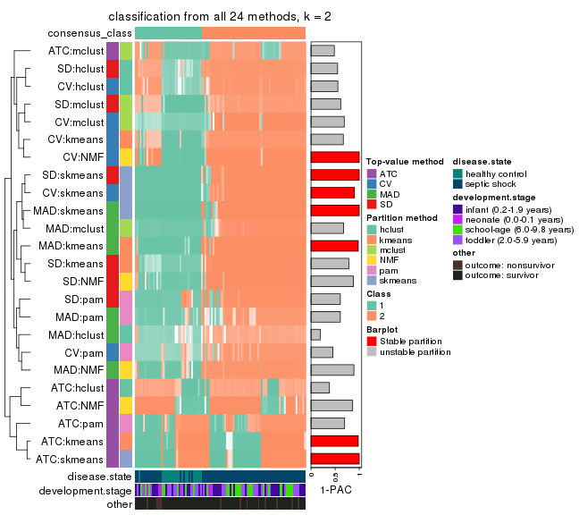</p>

</div>
<div id='tab-collect-classes-from-consensus-partition-list-2'>
<pre><code class="r">collect_classes(res_list, k = 3)
</code></pre>

<p>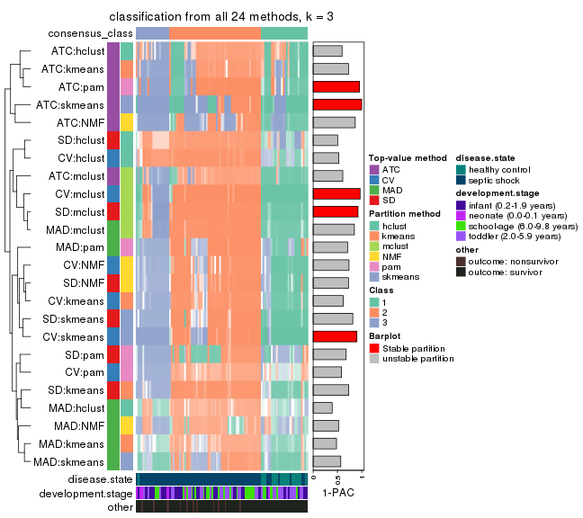</p>

</div>
<div id='tab-collect-classes-from-consensus-partition-list-3'>
<pre><code class="r">collect_classes(res_list, k = 4)
</code></pre>

<p>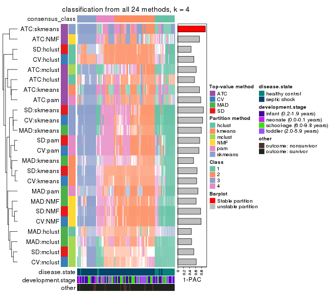</p>

</div>
<div id='tab-collect-classes-from-consensus-partition-list-4'>
<pre><code class="r">collect_classes(res_list, k = 5)
</code></pre>

<p>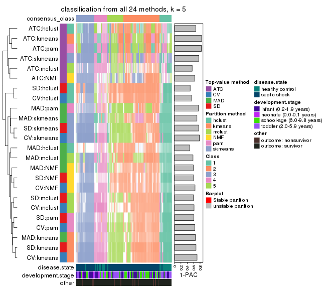</p>

</div>
<div id='tab-collect-classes-from-consensus-partition-list-5'>
<pre><code class="r">collect_classes(res_list, k = 6)
</code></pre>

<p>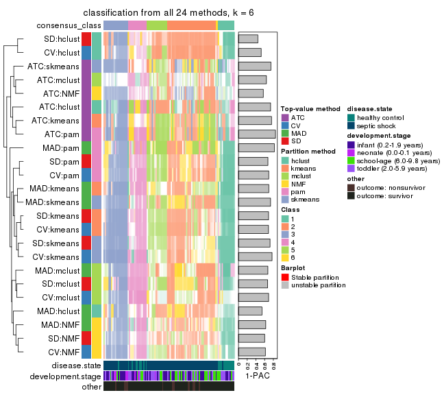</p>

</div>
</div>


### Top rows overlap


Overlap of top rows from different top-row methods:


<script>
$( function() {
	$( '#tabs-top-rows-overlap-by-euler' ).tabs();
} );
</script>
<div id='tabs-top-rows-overlap-by-euler'>
<ul>
<li><a href='#tab-top-rows-overlap-by-euler-1'>top_n = 1000</a></li>
<li><a href='#tab-top-rows-overlap-by-euler-2'>top_n = 2000</a></li>
<li><a href='#tab-top-rows-overlap-by-euler-3'>top_n = 3000</a></li>
<li><a href='#tab-top-rows-overlap-by-euler-4'>top_n = 4000</a></li>
<li><a href='#tab-top-rows-overlap-by-euler-5'>top_n = 5000</a></li>
</ul>
<div id='tab-top-rows-overlap-by-euler-1'>
<pre><code class="r">top_rows_overlap(res_list, top_n = 1000, method = &quot;euler&quot;)
</code></pre>

<p>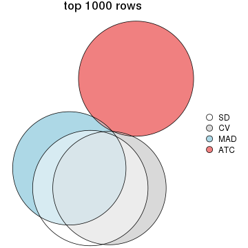</p>

</div>
<div id='tab-top-rows-overlap-by-euler-2'>
<pre><code class="r">top_rows_overlap(res_list, top_n = 2000, method = &quot;euler&quot;)
</code></pre>

<p>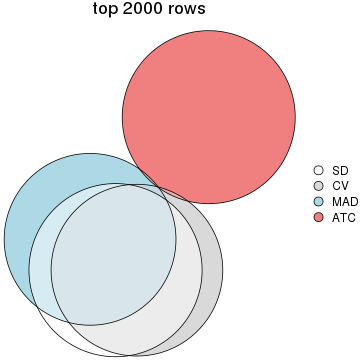</p>

</div>
<div id='tab-top-rows-overlap-by-euler-3'>
<pre><code class="r">top_rows_overlap(res_list, top_n = 3000, method = &quot;euler&quot;)
</code></pre>

<p>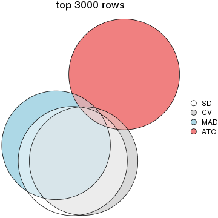</p>

</div>
<div id='tab-top-rows-overlap-by-euler-4'>
<pre><code class="r">top_rows_overlap(res_list, top_n = 4000, method = &quot;euler&quot;)
</code></pre>

<p>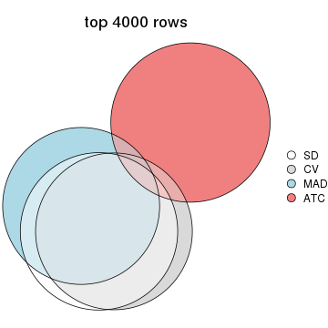</p>

</div>
<div id='tab-top-rows-overlap-by-euler-5'>
<pre><code class="r">top_rows_overlap(res_list, top_n = 5000, method = &quot;euler&quot;)
</code></pre>

<p>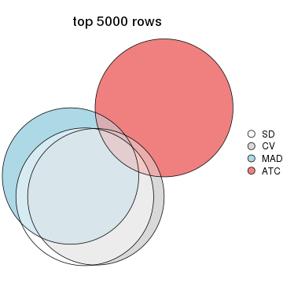</p>

</div>
</div>

Also visualize the correspondance of rankings between different top-row methods:


<script>
$( function() {
	$( '#tabs-top-rows-overlap-by-correspondance' ).tabs();
} );
</script>
<div id='tabs-top-rows-overlap-by-correspondance'>
<ul>
<li><a href='#tab-top-rows-overlap-by-correspondance-1'>top_n = 1000</a></li>
<li><a href='#tab-top-rows-overlap-by-correspondance-2'>top_n = 2000</a></li>
<li><a href='#tab-top-rows-overlap-by-correspondance-3'>top_n = 3000</a></li>
<li><a href='#tab-top-rows-overlap-by-correspondance-4'>top_n = 4000</a></li>
<li><a href='#tab-top-rows-overlap-by-correspondance-5'>top_n = 5000</a></li>
</ul>
<div id='tab-top-rows-overlap-by-correspondance-1'>
<pre><code class="r">top_rows_overlap(res_list, top_n = 1000, method = &quot;correspondance&quot;)
</code></pre>

<p>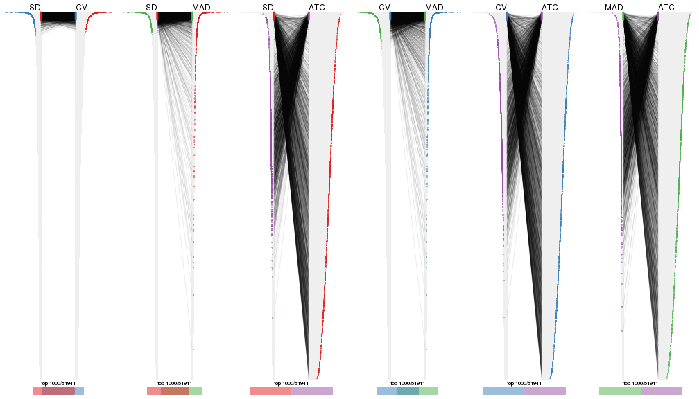</p>

</div>
<div id='tab-top-rows-overlap-by-correspondance-2'>
<pre><code class="r">top_rows_overlap(res_list, top_n = 2000, method = &quot;correspondance&quot;)
</code></pre>

<p>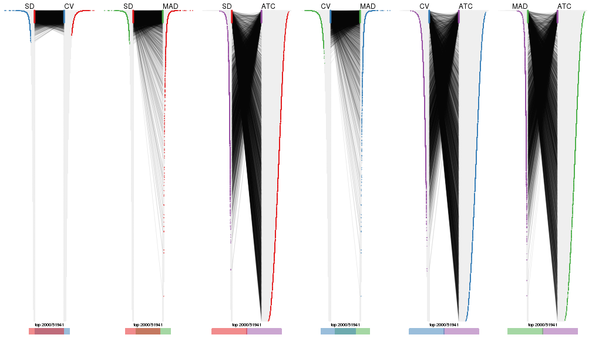</p>

</div>
<div id='tab-top-rows-overlap-by-correspondance-3'>
<pre><code class="r">top_rows_overlap(res_list, top_n = 3000, method = &quot;correspondance&quot;)
</code></pre>

<p>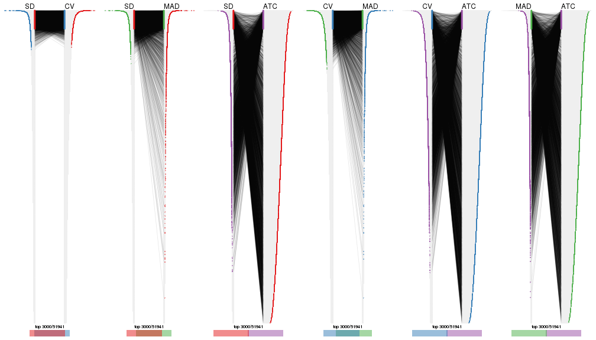</p>

</div>
<div id='tab-top-rows-overlap-by-correspondance-4'>
<pre><code class="r">top_rows_overlap(res_list, top_n = 4000, method = &quot;correspondance&quot;)
</code></pre>

<p>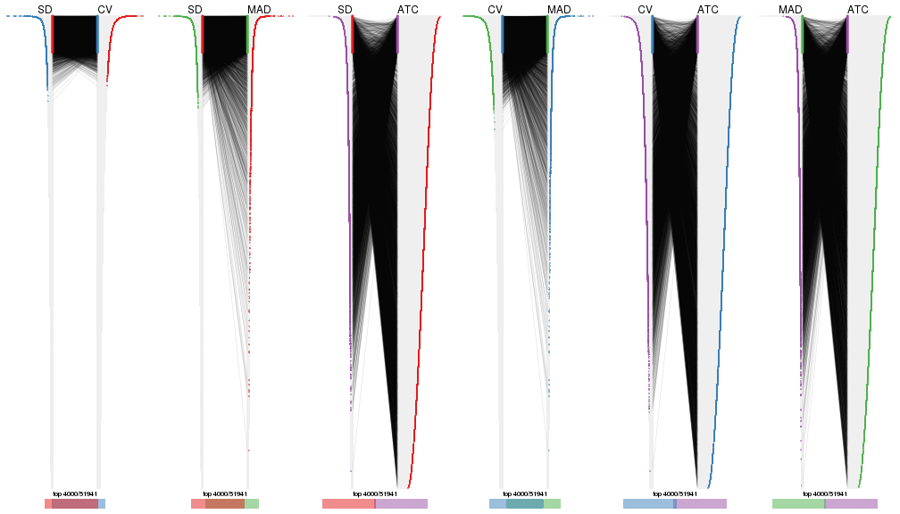</p>

</div>
<div id='tab-top-rows-overlap-by-correspondance-5'>
<pre><code class="r">top_rows_overlap(res_list, top_n = 5000, method = &quot;correspondance&quot;)
</code></pre>

<p>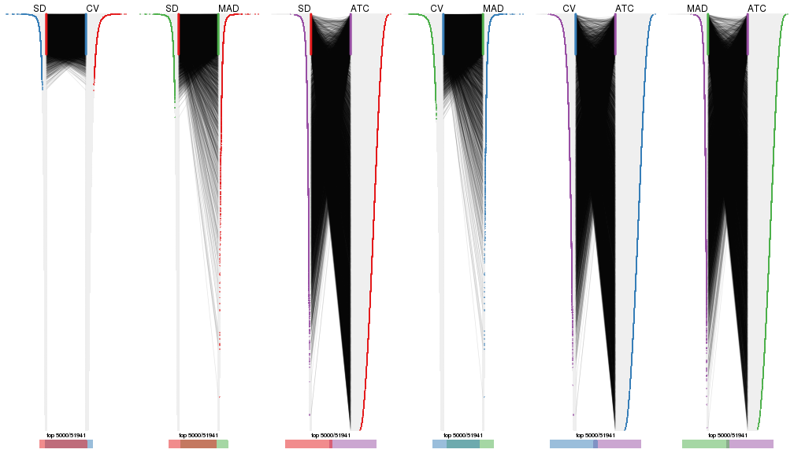</p>

</div>
</div>


Heatmaps of the top rows:


<script>
$( function() {
	$( '#tabs-top-rows-heatmap' ).tabs();
} );
</script>
<div id='tabs-top-rows-heatmap'>
<ul>
<li><a href='#tab-top-rows-heatmap-1'>top_n = 1000</a></li>
<li><a href='#tab-top-rows-heatmap-2'>top_n = 2000</a></li>
<li><a href='#tab-top-rows-heatmap-3'>top_n = 3000</a></li>
<li><a href='#tab-top-rows-heatmap-4'>top_n = 4000</a></li>
<li><a href='#tab-top-rows-heatmap-5'>top_n = 5000</a></li>
</ul>
<div id='tab-top-rows-heatmap-1'>
<pre><code class="r">top_rows_heatmap(res_list, top_n = 1000)
</code></pre>

<p>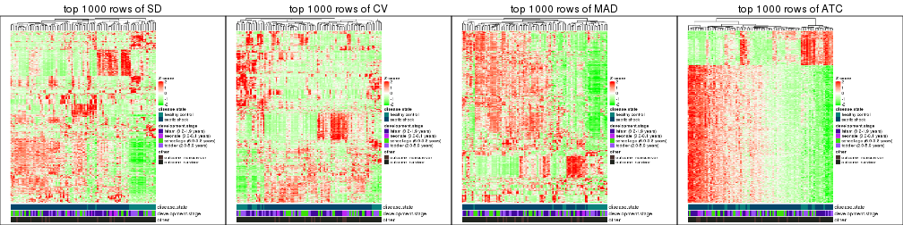</p>

</div>
<div id='tab-top-rows-heatmap-2'>
<pre><code class="r">top_rows_heatmap(res_list, top_n = 2000)
</code></pre>

<p>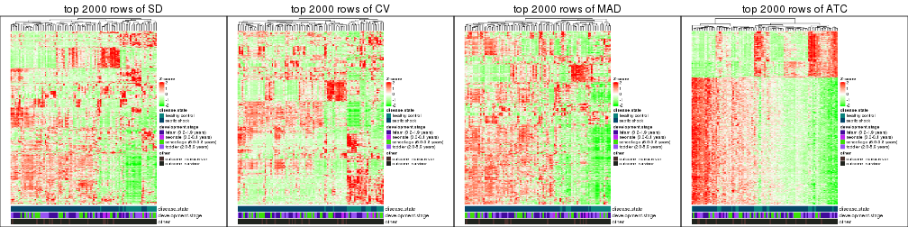</p>

</div>
<div id='tab-top-rows-heatmap-3'>
<pre><code class="r">top_rows_heatmap(res_list, top_n = 3000)
</code></pre>

<p>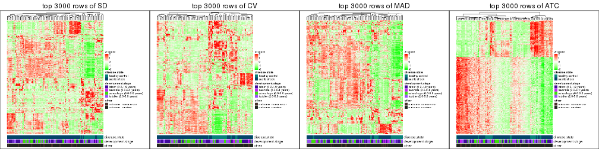</p>

</div>
<div id='tab-top-rows-heatmap-4'>
<pre><code class="r">top_rows_heatmap(res_list, top_n = 4000)
</code></pre>

<p>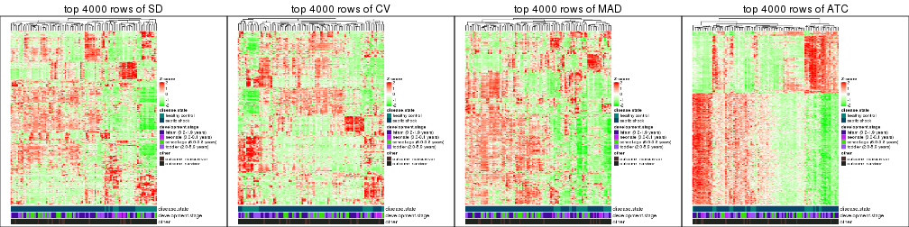</p>

</div>
<div id='tab-top-rows-heatmap-5'>
<pre><code class="r">top_rows_heatmap(res_list, top_n = 5000)
</code></pre>

<p>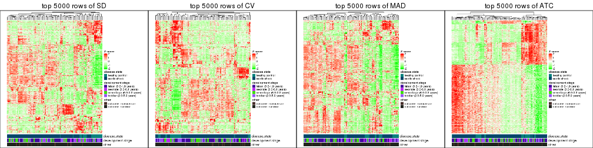</p>

</div>
</div>


### Test to known annotations


Test correlation between subgroups and known annotations. If the known
annotation is numeric, one-way ANOVA test is applied, and if the known
annotation is discrete, chi-squared contingency table test is applied.


<script>
$( function() {
	$( '#tabs-test-to-known-factors-from-consensus-partition-list' ).tabs();
} );
</script>
<div id='tabs-test-to-known-factors-from-consensus-partition-list'>
<ul>
<li><a href='#tab-test-to-known-factors-from-consensus-partition-list-1'>k = 2</a></li>
<li><a href='#tab-test-to-known-factors-from-consensus-partition-list-2'>k = 3</a></li>
<li><a href='#tab-test-to-known-factors-from-consensus-partition-list-3'>k = 4</a></li>
<li><a href='#tab-test-to-known-factors-from-consensus-partition-list-4'>k = 5</a></li>
<li><a href='#tab-test-to-known-factors-from-consensus-partition-list-5'>k = 6</a></li>
</ul>
<div id='tab-test-to-known-factors-from-consensus-partition-list-1'>
<pre><code class="r">test_to_known_factors(res_list, k = 2)
</code></pre>

<pre><code>#&gt;               n disease.state(p) development.stage(p) other(p) k
#&gt; SD:NMF      100         9.58e-11               0.1858   0.7059 2
#&gt; CV:NMF      101         7.92e-14               0.4649   0.0464 2
#&gt; MAD:NMF      97         9.99e-08               0.0619   1.0000 2
#&gt; ATC:NMF      98         1.48e-02               0.6046   0.3513 2
#&gt; SD:skmeans  101         9.92e-09               0.0116   0.7049 2
#&gt; CV:skmeans  102         1.54e-08               0.0919   0.6747 2
#&gt; MAD:skmeans 102         5.70e-08               0.0175   0.5734 2
#&gt; ATC:skmeans  99         4.23e-01               0.6820   0.3753 2
#&gt; SD:mclust   101         1.16e-13               0.2475   0.0599 2
#&gt; CV:mclust    90         7.48e-10               0.0756   0.0412 2
#&gt; MAD:mclust  101         1.34e-07               0.0190   0.5039 2
#&gt; ATC:mclust  101         2.13e-06               0.3473   0.3170 2
#&gt; SD:kmeans    94         8.69e-13               0.6174   0.0927 2
#&gt; CV:kmeans   102         6.19e-16               0.2501   0.0543 2
#&gt; MAD:kmeans  102         3.30e-10               0.0508   0.9555 2
#&gt; ATC:kmeans   98         2.76e-01               0.6956   0.3958 2
#&gt; SD:pam      102         1.97e-05               0.0379   0.9555 2
#&gt; CV:pam       94         1.31e-05               0.0237   1.0000 2
#&gt; MAD:pam      86         1.74e-06               0.0220   0.7514 2
#&gt; ATC:pam     101         6.68e-01               0.4062   0.1793 2
#&gt; SD:hclust    97         3.71e-20               0.0872   0.1708 2
#&gt; CV:hclust    96         8.70e-17               0.1235   0.1234 2
#&gt; MAD:hclust   88         3.21e-09               0.2340   1.0000 2
#&gt; ATC:hclust  101         2.79e-02               0.5659   0.3288 2
</code></pre>

</div>
<div id='tab-test-to-known-factors-from-consensus-partition-list-2'>
<pre><code class="r">test_to_known_factors(res_list, k = 3)
</code></pre>

<pre><code>#&gt;               n disease.state(p) development.stage(p) other(p) k
#&gt; SD:NMF       90         1.90e-13             0.004660   0.1596 3
#&gt; CV:NMF       90         1.01e-13             0.001385   0.1017 3
#&gt; MAD:NMF      85         1.11e-05             0.076048   0.8135 3
#&gt; ATC:NMF      95         2.96e-05             0.223732   0.1258 3
#&gt; SD:skmeans   91         1.21e-14             0.001450   0.0483 3
#&gt; CV:skmeans   98         8.30e-15             0.012671   0.0649 3
#&gt; MAD:skmeans  93         4.23e-09             0.198182   0.1811 3
#&gt; ATC:skmeans 102         1.08e-03             0.461874   0.3183 3
#&gt; SD:mclust   102         2.75e-13             0.117063   0.0594 3
#&gt; CV:mclust   101         1.37e-12             0.102526   0.0548 3
#&gt; MAD:mclust  100         7.38e-15             0.157108   0.0229 3
#&gt; ATC:mclust  103         2.65e-09             0.083725   0.0967 3
#&gt; SD:kmeans    92         1.06e-15             0.000678   0.1167 3
#&gt; CV:kmeans    96         7.68e-15             0.000971   0.1540 3
#&gt; MAD:kmeans   65         6.95e-12             0.021763   0.1445 3
#&gt; ATC:kmeans   99         6.39e-02             0.365935   0.2380 3
#&gt; SD:pam       96         4.85e-06             0.140038   0.5089 3
#&gt; CV:pam       76         1.00e+00             0.001065   0.5034 3
#&gt; MAD:pam     100         3.34e-14             0.059599   0.2784 3
#&gt; ATC:pam      97         3.96e-03             0.194572   0.1351 3
#&gt; SD:hclust    81         2.58e-18             0.682987   0.3354 3
#&gt; CV:hclust    95         3.63e-17             0.349802   0.1712 3
#&gt; MAD:hclust   75         6.65e-05             0.005649   0.4364 3
#&gt; ATC:hclust   92         1.02e-01             0.527731   0.2697 3
</code></pre>

</div>
<div id='tab-test-to-known-factors-from-consensus-partition-list-3'>
<pre><code class="r">test_to_known_factors(res_list, k = 4)
</code></pre>

<pre><code>#&gt;               n disease.state(p) development.stage(p) other(p) k
#&gt; SD:NMF       96         7.90e-12              0.04025   0.0394 4
#&gt; CV:NMF       93         8.25e-11              0.03818   0.0727 4
#&gt; MAD:NMF      90         3.04e-10              0.00440   0.0195 4
#&gt; ATC:NMF      83         3.47e-06              0.35582   0.2822 4
#&gt; SD:skmeans   99         8.15e-16              0.00833   0.1534 4
#&gt; CV:skmeans   96         1.08e-13              0.01844   0.0702 4
#&gt; MAD:skmeans  82         7.41e-13              0.02497   0.0731 4
#&gt; ATC:skmeans 102         7.13e-10              0.43173   0.3537 4
#&gt; SD:mclust    45         3.36e-04              0.52976   0.0286 4
#&gt; CV:mclust    75         1.12e-07              0.39825   0.1008 4
#&gt; MAD:mclust   91         3.02e-12              0.10916   0.0773 4
#&gt; ATC:mclust   85         3.02e-07              0.65512   0.1009 4
#&gt; SD:kmeans    85         5.07e-15              0.01338   0.3715 4
#&gt; CV:kmeans    94         2.54e-14              0.00539   0.1725 4
#&gt; MAD:kmeans   77         6.35e-13              0.00277   0.1634 4
#&gt; ATC:kmeans   99         3.95e-03              0.68110   0.6064 4
#&gt; SD:pam       97         8.95e-13              0.02597   0.3328 4
#&gt; CV:pam       95         1.54e-11              0.03690   0.3317 4
#&gt; MAD:pam      94         1.72e-14              0.00825   0.3953 4
#&gt; ATC:pam     101         1.17e-07              0.12494   0.1687 4
#&gt; SD:hclust    88         2.83e-17              0.02011   0.1684 4
#&gt; CV:hclust    92         8.31e-15              0.54893   0.3856 4
#&gt; MAD:hclust   74         1.70e-05              0.07244   0.6137 4
#&gt; ATC:hclust   89         5.01e-04              0.14935   0.4513 4
</code></pre>

</div>
<div id='tab-test-to-known-factors-from-consensus-partition-list-4'>
<pre><code class="r">test_to_known_factors(res_list, k = 5)
</code></pre>

<pre><code>#&gt;               n disease.state(p) development.stage(p) other(p) k
#&gt; SD:NMF       65         4.71e-11             0.000622   0.1521 5
#&gt; CV:NMF       76         1.55e-09             0.012188   0.1389 5
#&gt; MAD:NMF      79         8.67e-08             0.023465   0.0495 5
#&gt; ATC:NMF      72         2.24e-04             0.114191   0.4779 5
#&gt; SD:skmeans   92         2.44e-13             0.005856   0.1533 5
#&gt; CV:skmeans   92         6.59e-11             0.031276   0.1437 5
#&gt; MAD:skmeans  89         4.25e-14             0.004629   0.2497 5
#&gt; ATC:skmeans  96         1.19e-06             0.817874   0.6785 5
#&gt; SD:mclust    84         1.89e-13             0.107194   0.1273 5
#&gt; CV:mclust    73         1.92e-11             0.049620   0.0549 5
#&gt; MAD:mclust   95         5.03e-14             0.011134   0.1091 5
#&gt; ATC:mclust   74         3.56e-08             0.582653   0.1779 5
#&gt; SD:kmeans    96         7.75e-13             0.009664   0.1531 5
#&gt; CV:kmeans    93         2.07e-12             0.005035   0.1536 5
#&gt; MAD:kmeans   88         1.97e-12             0.019285   0.1173 5
#&gt; ATC:kmeans   96         3.68e-05             0.454861   0.5173 5
#&gt; SD:pam       82         8.65e-13             0.054105   0.2753 5
#&gt; CV:pam       90         9.77e-13             0.016498   0.1362 5
#&gt; MAD:pam      84         5.01e-12             0.007487   0.4314 5
#&gt; ATC:pam     101         9.13e-07             0.255962   0.2180 5
#&gt; SD:hclust    91         2.28e-16             0.005295   0.2033 5
#&gt; CV:hclust    83         1.47e-13             0.213102   0.2918 5
#&gt; MAD:hclust   58         6.40e-10             0.048739   0.2107 5
#&gt; ATC:hclust   95         1.21e-05             0.168243   0.4918 5
</code></pre>

</div>
<div id='tab-test-to-known-factors-from-consensus-partition-list-5'>
<pre><code class="r">test_to_known_factors(res_list, k = 6)
</code></pre>

<pre><code>#&gt;              n disease.state(p) development.stage(p) other(p) k
#&gt; SD:NMF      54         8.16e-07             0.013272   0.3874 6
#&gt; CV:NMF      61         1.83e-07             0.005383   0.2440 6
#&gt; MAD:NMF     66         8.77e-07             0.001472   0.0763 6
#&gt; ATC:NMF     61         8.20e-01             0.321505   0.4730 6
#&gt; SD:skmeans  76         8.20e-11             0.076060   0.2738 6
#&gt; CV:skmeans  65         3.46e-07             0.330490   0.1276 6
#&gt; MAD:skmeans 88         4.07e-14             0.011115   0.3566 6
#&gt; ATC:skmeans 74         9.81e-06             0.524852   0.8808 6
#&gt; SD:mclust   93         8.39e-12             0.231068   0.2786 6
#&gt; CV:mclust   53         1.13e-04             0.291833   0.0859 6
#&gt; MAD:mclust  74         4.06e-09             0.041079   0.0467 6
#&gt; ATC:mclust  38         6.76e-04             0.444790   0.2872 6
#&gt; SD:kmeans   82         3.25e-12             0.016027   0.1226 6
#&gt; CV:kmeans   81         1.12e-11             0.012007   0.1641 6
#&gt; MAD:kmeans  78         3.38e-10             0.008727   0.1348 6
#&gt; ATC:kmeans  82         3.55e-07             0.166913   0.7143 6
#&gt; SD:pam      82         3.66e-12             0.015402   0.2503 6
#&gt; CV:pam      85         5.01e-11             0.003376   0.2260 6
#&gt; MAD:pam     90         3.22e-12             0.026478   0.5361 6
#&gt; ATC:pam     97         6.36e-09             0.347140   0.2958 6
#&gt; SD:hclust   78         2.19e-15             0.000909   0.1728 6
#&gt; CV:hclust   83         9.86e-14             0.106667   0.4614 6
#&gt; MAD:hclust  74         3.54e-12             0.050883   0.0917 6
#&gt; ATC:hclust  90         2.48e-06             0.243453   0.5275 6
</code></pre>

</div>
</div>


 
## Results for each method


---------------------------------------------------


### SD:hclust


The object with results only for a single top-value method and a single partition method 
can be extracted as:

```r
res = res_list["SD", "hclust"]
# you can also extract it by
# res = res_list["SD:hclust"]
```

A summary of `res` and all the functions that can be applied to it:

```r
res
```

```
#> A 'ConsensusPartition' object with k = 2, 3, 4, 5, 6.
#>   On a matrix with 51941 rows and 103 columns.
#>   Top rows (1000, 2000, 3000, 4000, 5000) are extracted by 'SD' method.
#>   Subgroups are detected by 'hclust' method.
#>   Performed in total 1250 partitions by row resampling.
#>   Best k for subgroups seems to be 3.
#> 
#> Following methods can be applied to this 'ConsensusPartition' object:
#>  [1] "cola_report"             "collect_classes"         "collect_plots"          
#>  [4] "collect_stats"           "colnames"                "compare_signatures"     
#>  [7] "consensus_heatmap"       "dimension_reduction"     "functional_enrichment"  
#> [10] "get_anno_col"            "get_anno"                "get_classes"            
#> [13] "get_consensus"           "get_matrix"              "get_membership"         
#> [16] "get_param"               "get_signatures"          "get_stats"              
#> [19] "is_best_k"               "is_stable_k"             "membership_heatmap"     
#> [22] "ncol"                    "nrow"                    "plot_ecdf"              
#> [25] "rownames"                "select_partition_number" "show"                   
#> [28] "suggest_best_k"          "test_to_known_factors"
```

`collect_plots()` function collects all the plots made from `res` for all `k` (number of partitions)
into one single page to provide an easy and fast comparison between different `k`.

```r
collect_plots(res)
```

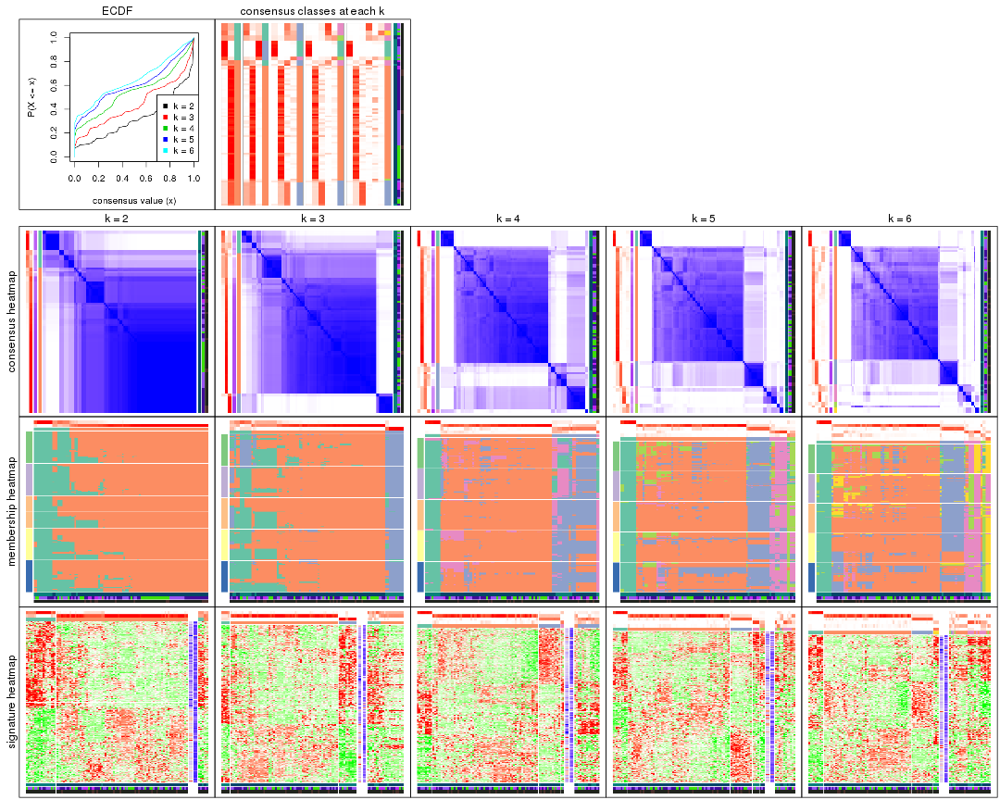

The plots are:

- The first row: a plot of the ECDF (empirical cumulative distribution
  function) curves of the consensus matrix for each `k` and the heatmap of
  predicted classes for each `k`.
- The second row: heatmaps of the consensus matrix for each `k`.
- The third row: heatmaps of the membership matrix for each `k`.
- The fouth row: heatmaps of the signatures for each `k`.

All the plots in panels can be made by individual functions and they are
plotted later in this section.

`select_partition_number()` produces several plots showing different
statistics for choosing "optimized" `k`. There are following statistics:

- ECDF curves of the consensus matrix for each `k`;
- 1-PAC. [The PAC
  score](https://en.wikipedia.org/wiki/Consensus_clustering#Over-interpretation_potential_of_consensus_clustering)
  measures the proportion of the ambiguous subgrouping.
- Mean silhouette score.
- Concordance. The mean probability of fiting the consensus class ids in all
  partitions.
- Area increased. Denote $A_k$ as the area under the ECDF curve for current
  `k`, the area increased is defined as $A_k - A_{k-1}$.
- Rand index. The percent of pairs of samples that are both in a same cluster
  or both are not in a same cluster in the partition of k and k-1.
- Jaccard index. The ratio of pairs of samples are both in a same cluster in
  the partition of k and k-1 and the pairs of samples are both in a same
  cluster in the partition k or k-1.

The detailed explanations of these statistics can be found in [the _cola_
vignette](http://bioconductor.org/packages/devel/bioc/vignettes/cola/inst/doc/cola.html#toc_13).

Generally speaking, lower PAC score, higher mean silhouette score or higher
concordance corresponds to better partition. Rand index and Jaccard index
measure how similar the current partition is compared to partition with `k-1`.
If they are too similar, we won't accept `k` is better than `k-1`.

```r
select_partition_number(res)
```

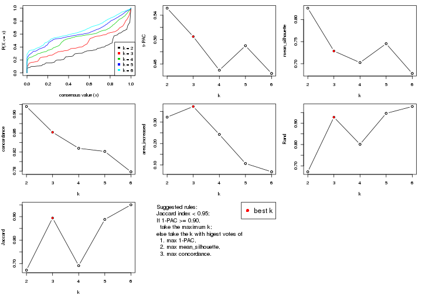

The numeric values for all these statistics can be obtained by `get_stats()`.

```r
get_stats(res)
```

```
#>   k 1-PAC mean_silhouette concordance area_increased  Rand Jaccard
#> 2 2 0.552           0.826       0.916         0.3232 0.672   0.672
#> 3 3 0.505           0.729       0.862         0.3728 0.928   0.894
#> 4 4 0.450           0.703       0.828         0.2425 0.801   0.691
#> 5 5 0.490           0.745       0.821         0.1069 0.946   0.888
#> 6 6 0.444           0.678       0.778         0.0682 0.978   0.950
```

`suggest_best_k()` suggests the best $k$ based on these statistics. The rules are as follows:

- All $k$ with Jaccard index larger than 0.95 are removed because increasing
  $k$ does not provide enough extra information. If all $k$ are removed, it is
  marked as no subgroup is detected.
- For all $k$ with 1-PAC score larger than 0.9, the maximal $k$ is taken as
  the best $k$, and other $k$ are marked as optional $k$.
- If it does not fit the second rule. The $k$ with the maximal vote of the
  highest 1-PAC score, highest mean silhouette, and highest concordance is
  taken as the best $k$.

```r
suggest_best_k(res)
```

```
#> [1] 3
```


Following shows the table of the partitions (You need to click the **show/hide
code output** link to see it). The membership matrix (columns with name `p*`)
is inferred by
[`clue::cl_consensus()`](https://www.rdocumentation.org/link/cl_consensus?package=clue)
function with the `SE` method. Basically the value in the membership matrix
represents the probability to belong to a certain group. The finall class
label for an item is determined with the group with highest probability it
belongs to.

In `get_classes()` function, the entropy is calculated from the membership
matrix and the silhouette score is calculated from the consensus matrix.


<script>
$( function() {
	$( '#tabs-SD-hclust-get-classes' ).tabs();
} );
</script>
<div id='tabs-SD-hclust-get-classes'>
<ul>
<li><a href='#tab-SD-hclust-get-classes-1'>k = 2</a></li>
<li><a href='#tab-SD-hclust-get-classes-2'>k = 3</a></li>
<li><a href='#tab-SD-hclust-get-classes-3'>k = 4</a></li>
<li><a href='#tab-SD-hclust-get-classes-4'>k = 5</a></li>
<li><a href='#tab-SD-hclust-get-classes-5'>k = 6</a></li>
</ul>

<div id='tab-SD-hclust-get-classes-1'>
<p><a id='tab-SD-hclust-get-classes-1-a' style='color:#0366d6' href='#'>show/hide code output</a></p>
<pre><code class="r">cbind(get_classes(res, k = 2), get_membership(res, k = 2))
</code></pre>

<pre><code>#&gt;           class entropy silhouette    p1    p2
#&gt; GSM647569     2  0.6531      0.779 0.168 0.832
#&gt; GSM647574     2  0.6623      0.774 0.172 0.828
#&gt; GSM647577     2  0.6531      0.779 0.168 0.832
#&gt; GSM647547     2  0.9087      0.445 0.324 0.676
#&gt; GSM647552     2  0.4298      0.869 0.088 0.912
#&gt; GSM647553     2  0.6623      0.774 0.172 0.828
#&gt; GSM647565     2  0.5408      0.827 0.124 0.876
#&gt; GSM647545     2  0.0000      0.925 0.000 1.000
#&gt; GSM647549     2  0.0000      0.925 0.000 1.000
#&gt; GSM647550     2  0.0000      0.925 0.000 1.000
#&gt; GSM647560     2  0.0000      0.925 0.000 1.000
#&gt; GSM647617     2  0.6623      0.774 0.172 0.828
#&gt; GSM647528     2  0.0000      0.925 0.000 1.000
#&gt; GSM647529     1  0.9944      0.366 0.544 0.456
#&gt; GSM647531     2  0.1633      0.915 0.024 0.976
#&gt; GSM647540     2  0.0000      0.925 0.000 1.000
#&gt; GSM647541     2  0.0000      0.925 0.000 1.000
#&gt; GSM647546     2  0.0376      0.924 0.004 0.996
#&gt; GSM647557     2  0.0672      0.923 0.008 0.992
#&gt; GSM647561     2  0.0000      0.925 0.000 1.000
#&gt; GSM647567     2  0.1633      0.914 0.024 0.976
#&gt; GSM647568     2  0.0000      0.925 0.000 1.000
#&gt; GSM647570     2  0.0000      0.925 0.000 1.000
#&gt; GSM647573     2  0.9087      0.445 0.324 0.676
#&gt; GSM647576     2  0.0000      0.925 0.000 1.000
#&gt; GSM647579     2  0.0376      0.924 0.004 0.996
#&gt; GSM647580     2  0.6623      0.774 0.172 0.828
#&gt; GSM647583     2  0.6531      0.779 0.168 0.832
#&gt; GSM647592     2  0.2423      0.904 0.040 0.960
#&gt; GSM647593     2  0.2423      0.904 0.040 0.960
#&gt; GSM647595     2  0.2236      0.906 0.036 0.964
#&gt; GSM647597     2  0.4022      0.872 0.080 0.920
#&gt; GSM647598     2  0.0000      0.925 0.000 1.000
#&gt; GSM647613     2  0.0000      0.925 0.000 1.000
#&gt; GSM647615     2  0.0000      0.925 0.000 1.000
#&gt; GSM647616     2  0.6531      0.779 0.168 0.832
#&gt; GSM647619     2  0.2423      0.904 0.040 0.960
#&gt; GSM647582     2  0.0376      0.924 0.004 0.996
#&gt; GSM647591     2  0.2236      0.906 0.036 0.964
#&gt; GSM647527     2  0.0000      0.925 0.000 1.000
#&gt; GSM647530     2  0.5294      0.833 0.120 0.880
#&gt; GSM647532     1  0.9922      0.390 0.552 0.448
#&gt; GSM647544     2  0.0000      0.925 0.000 1.000
#&gt; GSM647551     2  0.1414      0.916 0.020 0.980
#&gt; GSM647556     2  0.6712      0.768 0.176 0.824
#&gt; GSM647558     2  0.2236      0.908 0.036 0.964
#&gt; GSM647572     2  0.1843      0.912 0.028 0.972
#&gt; GSM647578     2  0.0000      0.925 0.000 1.000
#&gt; GSM647581     2  0.2236      0.908 0.036 0.964
#&gt; GSM647594     2  0.2948      0.894 0.052 0.948
#&gt; GSM647599     2  0.8016      0.653 0.244 0.756
#&gt; GSM647600     2  0.1414      0.916 0.020 0.980
#&gt; GSM647601     2  0.0000      0.925 0.000 1.000
#&gt; GSM647603     2  0.0000      0.925 0.000 1.000
#&gt; GSM647610     2  0.4431      0.875 0.092 0.908
#&gt; GSM647611     2  0.0000      0.925 0.000 1.000
#&gt; GSM647612     2  0.0000      0.925 0.000 1.000
#&gt; GSM647614     2  0.0000      0.925 0.000 1.000
#&gt; GSM647618     2  0.0376      0.924 0.004 0.996
#&gt; GSM647629     2  0.0000      0.925 0.000 1.000
#&gt; GSM647535     2  0.0000      0.925 0.000 1.000
#&gt; GSM647563     2  0.0000      0.925 0.000 1.000
#&gt; GSM647542     2  0.0000      0.925 0.000 1.000
#&gt; GSM647543     2  0.0000      0.925 0.000 1.000
#&gt; GSM647548     2  0.5408      0.827 0.124 0.876
#&gt; GSM647554     2  0.0000      0.925 0.000 1.000
#&gt; GSM647555     2  0.0000      0.925 0.000 1.000
#&gt; GSM647559     2  0.0000      0.925 0.000 1.000
#&gt; GSM647562     2  0.0000      0.925 0.000 1.000
#&gt; GSM647564     2  0.6623      0.774 0.172 0.828
#&gt; GSM647571     2  0.0000      0.925 0.000 1.000
#&gt; GSM647584     2  0.0672      0.922 0.008 0.992
#&gt; GSM647585     2  0.6712      0.768 0.176 0.824
#&gt; GSM647586     2  0.0000      0.925 0.000 1.000
#&gt; GSM647587     2  0.0000      0.925 0.000 1.000
#&gt; GSM647588     2  0.0000      0.925 0.000 1.000
#&gt; GSM647596     2  0.0000      0.925 0.000 1.000
#&gt; GSM647602     2  0.6623      0.774 0.172 0.828
#&gt; GSM647609     2  0.0000      0.925 0.000 1.000
#&gt; GSM647620     2  0.0000      0.925 0.000 1.000
#&gt; GSM647627     2  0.0000      0.925 0.000 1.000
#&gt; GSM647628     2  0.0000      0.925 0.000 1.000
#&gt; GSM647533     1  0.0000      0.779 1.000 0.000
#&gt; GSM647536     1  0.9922      0.390 0.552 0.448
#&gt; GSM647537     1  0.0000      0.779 1.000 0.000
#&gt; GSM647606     1  0.0000      0.779 1.000 0.000
#&gt; GSM647621     2  0.9850      0.094 0.428 0.572
#&gt; GSM647626     2  0.8661      0.556 0.288 0.712
#&gt; GSM647538     1  0.5946      0.745 0.856 0.144
#&gt; GSM647575     1  0.9427      0.593 0.640 0.360
#&gt; GSM647590     1  0.8443      0.696 0.728 0.272
#&gt; GSM647605     1  0.0000      0.779 1.000 0.000
#&gt; GSM647607     1  0.9427      0.593 0.640 0.360
#&gt; GSM647608     1  0.9460      0.588 0.636 0.364
#&gt; GSM647622     1  0.0000      0.779 1.000 0.000
#&gt; GSM647623     1  0.0000      0.779 1.000 0.000
#&gt; GSM647624     1  0.0000      0.779 1.000 0.000
#&gt; GSM647625     1  0.0000      0.779 1.000 0.000
#&gt; GSM647534     1  0.5946      0.745 0.856 0.144
#&gt; GSM647539     1  0.8499      0.693 0.724 0.276
#&gt; GSM647566     1  0.8443      0.698 0.728 0.272
#&gt; GSM647589     1  0.9460      0.588 0.636 0.364
#&gt; GSM647604     1  0.0000      0.779 1.000 0.000
</code></pre>

<script>
$('#tab-SD-hclust-get-classes-1-a').parent().next().next().hide();
$('#tab-SD-hclust-get-classes-1-a').click(function(){
  $('#tab-SD-hclust-get-classes-1-a').parent().next().next().toggle();
  return(false);
});
</script>
</div>

<div id='tab-SD-hclust-get-classes-2'>
<p><a id='tab-SD-hclust-get-classes-2-a' style='color:#0366d6' href='#'>show/hide code output</a></p>
<pre><code class="r">cbind(get_classes(res, k = 3), get_membership(res, k = 3))
</code></pre>

<pre><code>#&gt;           class entropy silhouette    p1    p2    p3
#&gt; GSM647569     2  0.6345     0.3637 0.400 0.596 0.004
#&gt; GSM647574     2  0.6215     0.2969 0.428 0.572 0.000
#&gt; GSM647577     2  0.6345     0.3637 0.400 0.596 0.004
#&gt; GSM647547     1  0.6713     0.3981 0.572 0.416 0.012
#&gt; GSM647552     2  0.4569     0.7712 0.068 0.860 0.072
#&gt; GSM647553     2  0.6386     0.3342 0.412 0.584 0.004
#&gt; GSM647565     2  0.4974     0.6451 0.236 0.764 0.000
#&gt; GSM647545     2  0.0592     0.8614 0.012 0.988 0.000
#&gt; GSM647549     2  0.0892     0.8572 0.020 0.980 0.000
#&gt; GSM647550     2  0.1964     0.8435 0.056 0.944 0.000
#&gt; GSM647560     2  0.0424     0.8620 0.008 0.992 0.000
#&gt; GSM647617     2  0.6373     0.3484 0.408 0.588 0.004
#&gt; GSM647528     2  0.0000     0.8614 0.000 1.000 0.000
#&gt; GSM647529     1  0.9877     0.4093 0.388 0.260 0.352
#&gt; GSM647531     2  0.2280     0.8381 0.052 0.940 0.008
#&gt; GSM647540     2  0.1964     0.8435 0.056 0.944 0.000
#&gt; GSM647541     2  0.0237     0.8618 0.004 0.996 0.000
#&gt; GSM647546     2  0.3412     0.7969 0.124 0.876 0.000
#&gt; GSM647557     2  0.1832     0.8489 0.036 0.956 0.008
#&gt; GSM647561     2  0.0892     0.8572 0.020 0.980 0.000
#&gt; GSM647567     2  0.3183     0.8319 0.076 0.908 0.016
#&gt; GSM647568     2  0.0237     0.8619 0.004 0.996 0.000
#&gt; GSM647570     2  0.0424     0.8621 0.008 0.992 0.000
#&gt; GSM647573     1  0.6713     0.3981 0.572 0.416 0.012
#&gt; GSM647576     2  0.2261     0.8384 0.068 0.932 0.000
#&gt; GSM647579     2  0.2448     0.8328 0.076 0.924 0.000
#&gt; GSM647580     2  0.6373     0.3484 0.408 0.588 0.004
#&gt; GSM647583     2  0.6345     0.3637 0.400 0.596 0.004
#&gt; GSM647592     2  0.2918     0.8303 0.044 0.924 0.032
#&gt; GSM647593     2  0.2313     0.8398 0.024 0.944 0.032
#&gt; GSM647595     2  0.2050     0.8418 0.020 0.952 0.028
#&gt; GSM647597     2  0.4652     0.7689 0.080 0.856 0.064
#&gt; GSM647598     2  0.0000     0.8614 0.000 1.000 0.000
#&gt; GSM647613     2  0.0237     0.8615 0.004 0.996 0.000
#&gt; GSM647615     2  0.0892     0.8612 0.020 0.980 0.000
#&gt; GSM647616     2  0.6345     0.3637 0.400 0.596 0.004
#&gt; GSM647619     2  0.2313     0.8398 0.024 0.944 0.032
#&gt; GSM647582     2  0.0829     0.8610 0.012 0.984 0.004
#&gt; GSM647591     2  0.2050     0.8418 0.020 0.952 0.028
#&gt; GSM647527     2  0.0000     0.8614 0.000 1.000 0.000
#&gt; GSM647530     2  0.5585     0.6335 0.204 0.772 0.024
#&gt; GSM647532     1  0.9850     0.4018 0.392 0.252 0.356
#&gt; GSM647544     2  0.0424     0.8613 0.008 0.992 0.000
#&gt; GSM647551     2  0.1482     0.8512 0.020 0.968 0.012
#&gt; GSM647556     2  0.6386     0.3378 0.412 0.584 0.004
#&gt; GSM647558     2  0.3267     0.7962 0.116 0.884 0.000
#&gt; GSM647572     2  0.3267     0.8008 0.116 0.884 0.000
#&gt; GSM647578     2  0.1163     0.8585 0.028 0.972 0.000
#&gt; GSM647581     2  0.3340     0.7928 0.120 0.880 0.000
#&gt; GSM647594     2  0.2527     0.8341 0.020 0.936 0.044
#&gt; GSM647599     2  0.8255     0.4466 0.196 0.636 0.168
#&gt; GSM647600     2  0.1482     0.8512 0.020 0.968 0.012
#&gt; GSM647601     2  0.0000     0.8614 0.000 1.000 0.000
#&gt; GSM647603     2  0.1289     0.8591 0.032 0.968 0.000
#&gt; GSM647610     2  0.5631     0.7303 0.164 0.792 0.044
#&gt; GSM647611     2  0.0424     0.8613 0.008 0.992 0.000
#&gt; GSM647612     2  0.0424     0.8620 0.008 0.992 0.000
#&gt; GSM647614     2  0.0237     0.8619 0.004 0.996 0.000
#&gt; GSM647618     2  0.0829     0.8610 0.012 0.984 0.004
#&gt; GSM647629     2  0.0424     0.8619 0.008 0.992 0.000
#&gt; GSM647535     2  0.0237     0.8618 0.004 0.996 0.000
#&gt; GSM647563     2  0.0424     0.8612 0.008 0.992 0.000
#&gt; GSM647542     2  0.0237     0.8619 0.004 0.996 0.000
#&gt; GSM647543     2  0.0237     0.8619 0.004 0.996 0.000
#&gt; GSM647548     2  0.4931     0.6487 0.232 0.768 0.000
#&gt; GSM647554     2  0.1964     0.8428 0.056 0.944 0.000
#&gt; GSM647555     2  0.0424     0.8620 0.008 0.992 0.000
#&gt; GSM647559     2  0.0424     0.8613 0.008 0.992 0.000
#&gt; GSM647562     2  0.0424     0.8613 0.008 0.992 0.000
#&gt; GSM647564     2  0.6373     0.3484 0.408 0.588 0.004
#&gt; GSM647571     2  0.1289     0.8591 0.032 0.968 0.000
#&gt; GSM647584     2  0.0892     0.8571 0.020 0.980 0.000
#&gt; GSM647585     2  0.6386     0.3378 0.412 0.584 0.004
#&gt; GSM647586     2  0.0000     0.8614 0.000 1.000 0.000
#&gt; GSM647587     2  0.0424     0.8613 0.008 0.992 0.000
#&gt; GSM647588     2  0.0747     0.8617 0.016 0.984 0.000
#&gt; GSM647596     2  0.0000     0.8614 0.000 1.000 0.000
#&gt; GSM647602     2  0.6373     0.3484 0.408 0.588 0.004
#&gt; GSM647609     2  0.0000     0.8614 0.000 1.000 0.000
#&gt; GSM647620     2  0.0237     0.8618 0.004 0.996 0.000
#&gt; GSM647627     2  0.0000     0.8614 0.000 1.000 0.000
#&gt; GSM647628     2  0.0000     0.8614 0.000 1.000 0.000
#&gt; GSM647533     3  0.0000     0.9307 0.000 0.000 1.000
#&gt; GSM647536     1  0.9850     0.4018 0.392 0.252 0.356
#&gt; GSM647537     3  0.0000     0.9307 0.000 0.000 1.000
#&gt; GSM647606     3  0.0000     0.9307 0.000 0.000 1.000
#&gt; GSM647621     1  0.8801     0.5445 0.560 0.292 0.148
#&gt; GSM647626     2  0.8784     0.0236 0.388 0.496 0.116
#&gt; GSM647538     3  0.7044     0.6217 0.168 0.108 0.724
#&gt; GSM647575     1  0.7588     0.6266 0.684 0.120 0.196
#&gt; GSM647590     1  0.4963     0.4465 0.792 0.008 0.200
#&gt; GSM647605     3  0.0000     0.9307 0.000 0.000 1.000
#&gt; GSM647607     1  0.7588     0.6266 0.684 0.120 0.196
#&gt; GSM647608     1  0.7542     0.6272 0.688 0.120 0.192
#&gt; GSM647622     3  0.0237     0.9301 0.004 0.000 0.996
#&gt; GSM647623     3  0.0237     0.9301 0.004 0.000 0.996
#&gt; GSM647624     3  0.0237     0.9301 0.004 0.000 0.996
#&gt; GSM647625     3  0.0237     0.9301 0.004 0.000 0.996
#&gt; GSM647534     3  0.7044     0.6217 0.168 0.108 0.724
#&gt; GSM647539     1  0.5072     0.4562 0.792 0.012 0.196
#&gt; GSM647566     1  0.5122     0.4431 0.788 0.012 0.200
#&gt; GSM647589     1  0.7542     0.6272 0.688 0.120 0.192
#&gt; GSM647604     3  0.0000     0.9307 0.000 0.000 1.000
</code></pre>

<script>
$('#tab-SD-hclust-get-classes-2-a').parent().next().next().hide();
$('#tab-SD-hclust-get-classes-2-a').click(function(){
  $('#tab-SD-hclust-get-classes-2-a').parent().next().next().toggle();
  return(false);
});
</script>
</div>

<div id='tab-SD-hclust-get-classes-3'>
<p><a id='tab-SD-hclust-get-classes-3-a' style='color:#0366d6' href='#'>show/hide code output</a></p>
<pre><code class="r">cbind(get_classes(res, k = 4), get_membership(res, k = 4))
</code></pre>

<pre><code>#&gt;           class entropy silhouette    p1    p2    p3    p4
#&gt; GSM647569     3  0.4741    0.58859 0.004 0.328 0.668 0.000
#&gt; GSM647574     3  0.4406    0.58596 0.000 0.300 0.700 0.000
#&gt; GSM647577     3  0.4741    0.58859 0.004 0.328 0.668 0.000
#&gt; GSM647547     3  0.6140    0.36023 0.000 0.252 0.652 0.096
#&gt; GSM647552     2  0.5757    0.68670 0.028 0.704 0.032 0.236
#&gt; GSM647553     3  0.4946    0.58691 0.004 0.308 0.680 0.008
#&gt; GSM647565     2  0.5932    0.53420 0.000 0.680 0.224 0.096
#&gt; GSM647545     2  0.1406    0.88022 0.000 0.960 0.024 0.016
#&gt; GSM647549     2  0.1820    0.87105 0.000 0.944 0.020 0.036
#&gt; GSM647550     2  0.3032    0.82557 0.000 0.868 0.124 0.008
#&gt; GSM647560     2  0.1042    0.88162 0.000 0.972 0.020 0.008
#&gt; GSM647617     3  0.4699    0.59078 0.004 0.320 0.676 0.000
#&gt; GSM647528     2  0.0000    0.88017 0.000 1.000 0.000 0.000
#&gt; GSM647529     3  0.8498   -0.24941 0.128 0.068 0.416 0.388
#&gt; GSM647531     2  0.3301    0.83733 0.000 0.876 0.076 0.048
#&gt; GSM647540     2  0.3142    0.81864 0.000 0.860 0.132 0.008
#&gt; GSM647541     2  0.1722    0.87623 0.000 0.944 0.048 0.008
#&gt; GSM647546     2  0.4018    0.69306 0.000 0.772 0.224 0.004
#&gt; GSM647557     2  0.3117    0.84734 0.000 0.880 0.028 0.092
#&gt; GSM647561     2  0.1724    0.87250 0.000 0.948 0.020 0.032
#&gt; GSM647567     2  0.5102    0.76677 0.000 0.764 0.136 0.100
#&gt; GSM647568     2  0.0707    0.87925 0.000 0.980 0.020 0.000
#&gt; GSM647570     2  0.1004    0.87981 0.000 0.972 0.024 0.004
#&gt; GSM647573     3  0.6140    0.36023 0.000 0.252 0.652 0.096
#&gt; GSM647576     2  0.2973    0.80334 0.000 0.856 0.144 0.000
#&gt; GSM647579     2  0.2921    0.81178 0.000 0.860 0.140 0.000
#&gt; GSM647580     3  0.4699    0.59078 0.004 0.320 0.676 0.000
#&gt; GSM647583     3  0.4741    0.58859 0.004 0.328 0.668 0.000
#&gt; GSM647592     2  0.4175    0.75769 0.000 0.784 0.016 0.200
#&gt; GSM647593     2  0.3591    0.78241 0.000 0.824 0.008 0.168
#&gt; GSM647595     2  0.3351    0.79559 0.000 0.844 0.008 0.148
#&gt; GSM647597     2  0.5355    0.65118 0.016 0.692 0.016 0.276
#&gt; GSM647598     2  0.0000    0.88017 0.000 1.000 0.000 0.000
#&gt; GSM647613     2  0.0376    0.88108 0.000 0.992 0.004 0.004
#&gt; GSM647615     2  0.1302    0.87629 0.000 0.956 0.044 0.000
#&gt; GSM647616     3  0.4741    0.58859 0.004 0.328 0.668 0.000
#&gt; GSM647619     2  0.3636    0.78037 0.000 0.820 0.008 0.172
#&gt; GSM647582     2  0.2142    0.87235 0.000 0.928 0.016 0.056
#&gt; GSM647591     2  0.3351    0.79559 0.000 0.844 0.008 0.148
#&gt; GSM647527     2  0.0000    0.88017 0.000 1.000 0.000 0.000
#&gt; GSM647530     2  0.5693    0.55082 0.000 0.688 0.240 0.072
#&gt; GSM647532     3  0.8426   -0.26032 0.132 0.060 0.416 0.392
#&gt; GSM647544     2  0.1109    0.88010 0.000 0.968 0.004 0.028
#&gt; GSM647551     2  0.2867    0.83578 0.000 0.884 0.012 0.104
#&gt; GSM647556     3  0.4677    0.58871 0.004 0.316 0.680 0.000
#&gt; GSM647558     2  0.3760    0.77390 0.000 0.836 0.136 0.028
#&gt; GSM647572     2  0.3764    0.75204 0.000 0.816 0.172 0.012
#&gt; GSM647578     2  0.1474    0.87569 0.000 0.948 0.052 0.000
#&gt; GSM647581     2  0.3948    0.76437 0.000 0.828 0.136 0.036
#&gt; GSM647594     2  0.3591    0.78145 0.000 0.824 0.008 0.168
#&gt; GSM647599     2  0.9261   -0.15275 0.136 0.388 0.332 0.144
#&gt; GSM647600     2  0.2867    0.83578 0.000 0.884 0.012 0.104
#&gt; GSM647601     2  0.0188    0.88037 0.000 0.996 0.004 0.000
#&gt; GSM647603     2  0.2483    0.86645 0.000 0.916 0.052 0.032
#&gt; GSM647610     2  0.7585    0.29522 0.012 0.528 0.288 0.172
#&gt; GSM647611     2  0.1109    0.87981 0.000 0.968 0.004 0.028
#&gt; GSM647612     2  0.0817    0.87912 0.000 0.976 0.024 0.000
#&gt; GSM647614     2  0.0592    0.87993 0.000 0.984 0.016 0.000
#&gt; GSM647618     2  0.2142    0.87235 0.000 0.928 0.016 0.056
#&gt; GSM647629     2  0.1042    0.88113 0.000 0.972 0.020 0.008
#&gt; GSM647535     2  0.0804    0.88110 0.000 0.980 0.012 0.008
#&gt; GSM647563     2  0.0657    0.88267 0.000 0.984 0.012 0.004
#&gt; GSM647542     2  0.0707    0.87925 0.000 0.980 0.020 0.000
#&gt; GSM647543     2  0.0707    0.87925 0.000 0.980 0.020 0.000
#&gt; GSM647548     2  0.5900    0.53756 0.000 0.684 0.220 0.096
#&gt; GSM647554     2  0.3196    0.81408 0.000 0.856 0.136 0.008
#&gt; GSM647555     2  0.0817    0.87912 0.000 0.976 0.024 0.000
#&gt; GSM647559     2  0.0921    0.87987 0.000 0.972 0.000 0.028
#&gt; GSM647562     2  0.0921    0.87987 0.000 0.972 0.000 0.028
#&gt; GSM647564     3  0.4699    0.59078 0.004 0.320 0.676 0.000
#&gt; GSM647571     2  0.2483    0.86645 0.000 0.916 0.052 0.032
#&gt; GSM647584     2  0.2676    0.84500 0.000 0.896 0.012 0.092
#&gt; GSM647585     3  0.4677    0.58871 0.004 0.316 0.680 0.000
#&gt; GSM647586     2  0.0000    0.88017 0.000 1.000 0.000 0.000
#&gt; GSM647587     2  0.0921    0.87987 0.000 0.972 0.000 0.028
#&gt; GSM647588     2  0.1211    0.87958 0.000 0.960 0.040 0.000
#&gt; GSM647596     2  0.0000    0.88017 0.000 1.000 0.000 0.000
#&gt; GSM647602     3  0.4699    0.59078 0.004 0.320 0.676 0.000
#&gt; GSM647609     2  0.0188    0.88037 0.000 0.996 0.004 0.000
#&gt; GSM647620     2  0.0804    0.88110 0.000 0.980 0.012 0.008
#&gt; GSM647627     2  0.0188    0.88037 0.000 0.996 0.004 0.000
#&gt; GSM647628     2  0.0188    0.88030 0.000 0.996 0.004 0.000
#&gt; GSM647533     1  0.1211    0.95724 0.960 0.000 0.000 0.040
#&gt; GSM647536     3  0.8426   -0.26032 0.132 0.060 0.416 0.392
#&gt; GSM647537     1  0.1211    0.95724 0.960 0.000 0.000 0.040
#&gt; GSM647606     1  0.0336    0.98067 0.992 0.000 0.000 0.008
#&gt; GSM647621     3  0.4389    0.25654 0.132 0.020 0.820 0.028
#&gt; GSM647626     3  0.6602    0.52563 0.112 0.264 0.620 0.004
#&gt; GSM647538     4  0.4957    1.00000 0.300 0.000 0.016 0.684
#&gt; GSM647575     3  0.6287    0.15655 0.092 0.004 0.648 0.256
#&gt; GSM647590     3  0.6677   -0.00952 0.096 0.000 0.540 0.364
#&gt; GSM647605     1  0.0469    0.97984 0.988 0.000 0.000 0.012
#&gt; GSM647607     3  0.6287    0.15655 0.092 0.004 0.648 0.256
#&gt; GSM647608     3  0.6230    0.16107 0.088 0.004 0.652 0.256
#&gt; GSM647622     1  0.0000    0.98061 1.000 0.000 0.000 0.000
#&gt; GSM647623     1  0.0000    0.98061 1.000 0.000 0.000 0.000
#&gt; GSM647624     1  0.0000    0.98061 1.000 0.000 0.000 0.000
#&gt; GSM647625     1  0.0000    0.98061 1.000 0.000 0.000 0.000
#&gt; GSM647534     4  0.4957    1.00000 0.300 0.000 0.016 0.684
#&gt; GSM647539     3  0.6626   -0.00581 0.092 0.000 0.544 0.364
#&gt; GSM647566     3  0.6658   -0.02764 0.092 0.000 0.532 0.376
#&gt; GSM647589     3  0.6230    0.16107 0.088 0.004 0.652 0.256
#&gt; GSM647604     1  0.0469    0.97984 0.988 0.000 0.000 0.012
</code></pre>

<script>
$('#tab-SD-hclust-get-classes-3-a').parent().next().next().hide();
$('#tab-SD-hclust-get-classes-3-a').click(function(){
  $('#tab-SD-hclust-get-classes-3-a').parent().next().next().toggle();
  return(false);
});
</script>
</div>

<div id='tab-SD-hclust-get-classes-4'>
<p><a id='tab-SD-hclust-get-classes-4-a' style='color:#0366d6' href='#'>show/hide code output</a></p>
<pre><code class="r">cbind(get_classes(res, k = 5), get_membership(res, k = 5))
</code></pre>

<pre><code>#&gt;           class entropy silhouette    p1    p2    p3    p4    p5
#&gt; GSM647569     3  0.3300     0.9151 0.000 0.204 0.792 0.000 0.004
#&gt; GSM647574     3  0.4041     0.8699 0.000 0.176 0.780 0.040 0.004
#&gt; GSM647577     3  0.3300     0.9151 0.000 0.204 0.792 0.000 0.004
#&gt; GSM647547     4  0.6948     0.2521 0.000 0.200 0.148 0.576 0.076
#&gt; GSM647552     2  0.6419     0.5997 0.020 0.608 0.148 0.008 0.216
#&gt; GSM647553     3  0.4000     0.8814 0.000 0.180 0.784 0.020 0.016
#&gt; GSM647565     2  0.6518     0.4531 0.000 0.612 0.092 0.220 0.076
#&gt; GSM647545     2  0.2300     0.8340 0.000 0.908 0.052 0.000 0.040
#&gt; GSM647549     2  0.2804     0.8254 0.000 0.888 0.048 0.008 0.056
#&gt; GSM647550     2  0.3109     0.7381 0.000 0.800 0.200 0.000 0.000
#&gt; GSM647560     2  0.1628     0.8380 0.000 0.936 0.056 0.000 0.008
#&gt; GSM647617     3  0.3300     0.9159 0.000 0.204 0.792 0.000 0.004
#&gt; GSM647528     2  0.0000     0.8412 0.000 1.000 0.000 0.000 0.000
#&gt; GSM647529     5  0.6751     0.5142 0.048 0.016 0.056 0.376 0.504
#&gt; GSM647531     2  0.4152     0.7836 0.000 0.816 0.060 0.036 0.088
#&gt; GSM647540     2  0.3274     0.7117 0.000 0.780 0.220 0.000 0.000
#&gt; GSM647541     2  0.2068     0.8315 0.000 0.904 0.092 0.000 0.004
#&gt; GSM647546     2  0.4046     0.5403 0.000 0.696 0.296 0.000 0.008
#&gt; GSM647557     2  0.3910     0.7872 0.000 0.808 0.040 0.012 0.140
#&gt; GSM647561     2  0.2663     0.8284 0.000 0.896 0.048 0.008 0.048
#&gt; GSM647567     2  0.4484     0.6513 0.000 0.668 0.308 0.000 0.024
#&gt; GSM647568     2  0.1357     0.8330 0.000 0.948 0.048 0.000 0.004
#&gt; GSM647570     2  0.1557     0.8335 0.000 0.940 0.052 0.000 0.008
#&gt; GSM647573     4  0.6914     0.2515 0.000 0.200 0.144 0.580 0.076
#&gt; GSM647576     2  0.3366     0.7010 0.000 0.784 0.212 0.000 0.004
#&gt; GSM647579     2  0.3642     0.6832 0.000 0.760 0.232 0.000 0.008
#&gt; GSM647580     3  0.3300     0.9159 0.000 0.204 0.792 0.000 0.004
#&gt; GSM647583     3  0.3300     0.9151 0.000 0.204 0.792 0.000 0.004
#&gt; GSM647592     2  0.5182     0.6773 0.000 0.708 0.164 0.008 0.120
#&gt; GSM647593     2  0.4719     0.7048 0.000 0.748 0.156 0.008 0.088
#&gt; GSM647595     2  0.4436     0.7209 0.000 0.768 0.156 0.008 0.068
#&gt; GSM647597     2  0.6357     0.5555 0.012 0.600 0.156 0.008 0.224
#&gt; GSM647598     2  0.0162     0.8420 0.000 0.996 0.000 0.000 0.004
#&gt; GSM647613     2  0.0451     0.8431 0.000 0.988 0.004 0.000 0.008
#&gt; GSM647615     2  0.2006     0.8271 0.000 0.916 0.072 0.000 0.012
#&gt; GSM647616     3  0.3300     0.9151 0.000 0.204 0.792 0.000 0.004
#&gt; GSM647619     2  0.4772     0.7023 0.000 0.744 0.156 0.008 0.092
#&gt; GSM647582     2  0.2983     0.8252 0.000 0.868 0.032 0.004 0.096
#&gt; GSM647591     2  0.4436     0.7209 0.000 0.768 0.156 0.008 0.068
#&gt; GSM647527     2  0.0000     0.8412 0.000 1.000 0.000 0.000 0.000
#&gt; GSM647530     2  0.5926     0.5323 0.000 0.644 0.024 0.216 0.116
#&gt; GSM647532     5  0.6719     0.5233 0.052 0.012 0.056 0.376 0.504
#&gt; GSM647544     2  0.0955     0.8432 0.000 0.968 0.000 0.004 0.028
#&gt; GSM647551     2  0.3484     0.7876 0.000 0.824 0.144 0.004 0.028
#&gt; GSM647556     3  0.3422     0.9103 0.000 0.200 0.792 0.004 0.004
#&gt; GSM647558     2  0.4637     0.7201 0.000 0.784 0.056 0.108 0.052
#&gt; GSM647572     2  0.3878     0.6364 0.000 0.748 0.236 0.000 0.016
#&gt; GSM647578     2  0.2248     0.8308 0.000 0.900 0.088 0.000 0.012
#&gt; GSM647581     2  0.4826     0.7060 0.000 0.772 0.052 0.108 0.068
#&gt; GSM647594     2  0.4719     0.7050 0.000 0.748 0.156 0.008 0.088
#&gt; GSM647599     3  0.7804     0.1762 0.112 0.336 0.452 0.024 0.076
#&gt; GSM647600     2  0.3484     0.7876 0.000 0.824 0.144 0.004 0.028
#&gt; GSM647601     2  0.0880     0.8419 0.000 0.968 0.032 0.000 0.000
#&gt; GSM647603     2  0.2676     0.8196 0.000 0.884 0.080 0.000 0.036
#&gt; GSM647610     2  0.6171     0.1432 0.000 0.464 0.416 0.004 0.116
#&gt; GSM647611     2  0.1753     0.8402 0.000 0.936 0.032 0.000 0.032
#&gt; GSM647612     2  0.1430     0.8324 0.000 0.944 0.052 0.000 0.004
#&gt; GSM647614     2  0.1121     0.8353 0.000 0.956 0.044 0.000 0.000
#&gt; GSM647618     2  0.2983     0.8252 0.000 0.868 0.032 0.004 0.096
#&gt; GSM647629     2  0.1408     0.8439 0.000 0.948 0.044 0.000 0.008
#&gt; GSM647535     2  0.0880     0.8425 0.000 0.968 0.032 0.000 0.000
#&gt; GSM647563     2  0.0740     0.8442 0.000 0.980 0.008 0.004 0.008
#&gt; GSM647542     2  0.1357     0.8330 0.000 0.948 0.048 0.000 0.004
#&gt; GSM647543     2  0.1357     0.8330 0.000 0.948 0.048 0.000 0.004
#&gt; GSM647548     2  0.6396     0.4665 0.000 0.620 0.080 0.224 0.076
#&gt; GSM647554     2  0.3210     0.7223 0.000 0.788 0.212 0.000 0.000
#&gt; GSM647555     2  0.1430     0.8324 0.000 0.944 0.052 0.000 0.004
#&gt; GSM647559     2  0.0794     0.8427 0.000 0.972 0.000 0.000 0.028
#&gt; GSM647562     2  0.0794     0.8427 0.000 0.972 0.000 0.000 0.028
#&gt; GSM647564     3  0.3300     0.9159 0.000 0.204 0.792 0.000 0.004
#&gt; GSM647571     2  0.2676     0.8196 0.000 0.884 0.080 0.000 0.036
#&gt; GSM647584     2  0.3073     0.8030 0.000 0.856 0.116 0.004 0.024
#&gt; GSM647585     3  0.3422     0.9103 0.000 0.200 0.792 0.004 0.004
#&gt; GSM647586     2  0.0000     0.8412 0.000 1.000 0.000 0.000 0.000
#&gt; GSM647587     2  0.0794     0.8427 0.000 0.972 0.000 0.000 0.028
#&gt; GSM647588     2  0.2069     0.8360 0.000 0.912 0.076 0.000 0.012
#&gt; GSM647596     2  0.0000     0.8412 0.000 1.000 0.000 0.000 0.000
#&gt; GSM647602     3  0.3300     0.9159 0.000 0.204 0.792 0.000 0.004
#&gt; GSM647609     2  0.0880     0.8419 0.000 0.968 0.032 0.000 0.000
#&gt; GSM647620     2  0.0880     0.8425 0.000 0.968 0.032 0.000 0.000
#&gt; GSM647627     2  0.0880     0.8419 0.000 0.968 0.032 0.000 0.000
#&gt; GSM647628     2  0.0162     0.8414 0.000 0.996 0.004 0.000 0.000
#&gt; GSM647533     1  0.1732     0.9249 0.920 0.000 0.000 0.000 0.080
#&gt; GSM647536     5  0.6719     0.5233 0.052 0.012 0.056 0.376 0.504
#&gt; GSM647537     1  0.1732     0.9249 0.920 0.000 0.000 0.000 0.080
#&gt; GSM647606     1  0.0290     0.9739 0.992 0.000 0.000 0.000 0.008
#&gt; GSM647621     4  0.7203     0.0894 0.108 0.000 0.384 0.436 0.072
#&gt; GSM647626     3  0.5762     0.7824 0.092 0.180 0.692 0.020 0.016
#&gt; GSM647538     5  0.6380     0.4613 0.188 0.000 0.072 0.104 0.636
#&gt; GSM647575     4  0.1965     0.5667 0.000 0.000 0.096 0.904 0.000
#&gt; GSM647590     4  0.4131     0.4673 0.004 0.000 0.064 0.788 0.144
#&gt; GSM647605     1  0.0404     0.9732 0.988 0.000 0.000 0.000 0.012
#&gt; GSM647607     4  0.1965     0.5667 0.000 0.000 0.096 0.904 0.000
#&gt; GSM647608     4  0.2127     0.5672 0.000 0.000 0.108 0.892 0.000
#&gt; GSM647622     1  0.0000     0.9740 1.000 0.000 0.000 0.000 0.000
#&gt; GSM647623     1  0.0000     0.9740 1.000 0.000 0.000 0.000 0.000
#&gt; GSM647624     1  0.0000     0.9740 1.000 0.000 0.000 0.000 0.000
#&gt; GSM647625     1  0.0000     0.9740 1.000 0.000 0.000 0.000 0.000
#&gt; GSM647534     5  0.6380     0.4613 0.188 0.000 0.072 0.104 0.636
#&gt; GSM647539     4  0.3975     0.4703 0.000 0.000 0.064 0.792 0.144
#&gt; GSM647566     4  0.4098     0.4600 0.000 0.000 0.064 0.780 0.156
#&gt; GSM647589     4  0.2127     0.5672 0.000 0.000 0.108 0.892 0.000
#&gt; GSM647604     1  0.0404     0.9732 0.988 0.000 0.000 0.000 0.012
</code></pre>

<script>
$('#tab-SD-hclust-get-classes-4-a').parent().next().next().hide();
$('#tab-SD-hclust-get-classes-4-a').click(function(){
  $('#tab-SD-hclust-get-classes-4-a').parent().next().next().toggle();
  return(false);
});
</script>
</div>

<div id='tab-SD-hclust-get-classes-5'>
<p><a id='tab-SD-hclust-get-classes-5-a' style='color:#0366d6' href='#'>show/hide code output</a></p>
<pre><code class="r">cbind(get_classes(res, k = 6), get_membership(res, k = 6))
</code></pre>

<pre><code>#&gt;           class entropy silhouette    p1    p2    p3    p4    p5    p6
#&gt; GSM647569     3  0.2912     0.9139 0.000 0.172 0.816 0.012 0.000 0.000
#&gt; GSM647574     3  0.3637     0.8835 0.000 0.164 0.780 0.056 0.000 0.000
#&gt; GSM647577     3  0.2912     0.9139 0.000 0.172 0.816 0.012 0.000 0.000
#&gt; GSM647547     4  0.3763     0.3737 0.000 0.172 0.060 0.768 0.000 0.000
#&gt; GSM647552     2  0.6275     0.3653 0.000 0.520 0.040 0.036 0.344 0.060
#&gt; GSM647553     3  0.3718     0.8887 0.000 0.164 0.780 0.052 0.000 0.004
#&gt; GSM647565     2  0.5094     0.4291 0.000 0.568 0.080 0.348 0.004 0.000
#&gt; GSM647545     2  0.2954     0.7827 0.000 0.868 0.044 0.060 0.028 0.000
#&gt; GSM647549     2  0.3317     0.7607 0.000 0.828 0.004 0.080 0.088 0.000
#&gt; GSM647550     2  0.3974     0.7019 0.000 0.768 0.172 0.008 0.048 0.004
#&gt; GSM647560     2  0.2158     0.7910 0.000 0.912 0.056 0.012 0.016 0.004
#&gt; GSM647617     3  0.2703     0.9151 0.000 0.172 0.824 0.000 0.000 0.004
#&gt; GSM647528     2  0.0363     0.7950 0.000 0.988 0.000 0.000 0.012 0.000
#&gt; GSM647529     4  0.6472     0.4097 0.012 0.000 0.016 0.448 0.336 0.188
#&gt; GSM647531     2  0.4022     0.7151 0.000 0.764 0.004 0.144 0.088 0.000
#&gt; GSM647540     2  0.4133     0.6782 0.000 0.748 0.192 0.008 0.048 0.004
#&gt; GSM647541     2  0.2881     0.7867 0.000 0.872 0.064 0.012 0.048 0.004
#&gt; GSM647546     2  0.4127     0.5183 0.000 0.672 0.304 0.016 0.004 0.004
#&gt; GSM647557     2  0.4652     0.7003 0.000 0.736 0.004 0.076 0.156 0.028
#&gt; GSM647561     2  0.3210     0.7642 0.000 0.836 0.004 0.072 0.088 0.000
#&gt; GSM647567     2  0.5697     0.5346 0.000 0.584 0.208 0.008 0.196 0.004
#&gt; GSM647568     2  0.1769     0.7857 0.000 0.924 0.060 0.012 0.004 0.000
#&gt; GSM647570     2  0.1889     0.7863 0.000 0.920 0.056 0.020 0.004 0.000
#&gt; GSM647573     4  0.3706     0.3737 0.000 0.172 0.056 0.772 0.000 0.000
#&gt; GSM647576     2  0.3627     0.6640 0.000 0.760 0.216 0.016 0.004 0.004
#&gt; GSM647579     2  0.4246     0.6433 0.000 0.720 0.232 0.012 0.032 0.004
#&gt; GSM647580     3  0.2703     0.9151 0.000 0.172 0.824 0.000 0.000 0.004
#&gt; GSM647583     3  0.2912     0.9139 0.000 0.172 0.816 0.012 0.000 0.000
#&gt; GSM647592     2  0.4902     0.2238 0.000 0.500 0.012 0.000 0.452 0.036
#&gt; GSM647593     2  0.4093     0.3917 0.000 0.584 0.012 0.000 0.404 0.000
#&gt; GSM647595     2  0.4057     0.4132 0.000 0.600 0.012 0.000 0.388 0.000
#&gt; GSM647597     5  0.4719    -0.2855 0.000 0.408 0.012 0.004 0.556 0.020
#&gt; GSM647598     2  0.0632     0.7968 0.000 0.976 0.000 0.000 0.024 0.000
#&gt; GSM647613     2  0.0806     0.7975 0.000 0.972 0.000 0.008 0.020 0.000
#&gt; GSM647615     2  0.2398     0.7767 0.000 0.888 0.080 0.028 0.004 0.000
#&gt; GSM647616     3  0.2912     0.9139 0.000 0.172 0.816 0.012 0.000 0.000
#&gt; GSM647619     2  0.4116     0.3773 0.000 0.572 0.012 0.000 0.416 0.000
#&gt; GSM647582     2  0.3899     0.7534 0.000 0.800 0.012 0.032 0.132 0.024
#&gt; GSM647591     2  0.4057     0.4132 0.000 0.600 0.012 0.000 0.388 0.000
#&gt; GSM647527     2  0.0363     0.7950 0.000 0.988 0.000 0.000 0.012 0.000
#&gt; GSM647530     2  0.4769     0.4510 0.000 0.604 0.004 0.336 0.056 0.000
#&gt; GSM647532     4  0.6496     0.4095 0.012 0.000 0.016 0.448 0.328 0.196
#&gt; GSM647544     2  0.1624     0.7940 0.000 0.936 0.000 0.004 0.040 0.020
#&gt; GSM647551     2  0.3766     0.6641 0.000 0.748 0.040 0.000 0.212 0.000
#&gt; GSM647556     3  0.2920     0.9084 0.000 0.168 0.820 0.004 0.000 0.008
#&gt; GSM647558     2  0.4401     0.6680 0.000 0.732 0.052 0.192 0.024 0.000
#&gt; GSM647572     2  0.4523     0.5802 0.000 0.704 0.240 0.012 0.020 0.024
#&gt; GSM647578     2  0.3013     0.7858 0.000 0.864 0.064 0.028 0.044 0.000
#&gt; GSM647581     2  0.4502     0.6509 0.000 0.720 0.048 0.204 0.028 0.000
#&gt; GSM647594     2  0.4123     0.3514 0.000 0.568 0.012 0.000 0.420 0.000
#&gt; GSM647599     3  0.8649    -0.0281 0.096 0.240 0.300 0.016 0.268 0.080
#&gt; GSM647600     2  0.3766     0.6641 0.000 0.748 0.040 0.000 0.212 0.000
#&gt; GSM647601     2  0.1007     0.7928 0.000 0.956 0.000 0.000 0.044 0.000
#&gt; GSM647603     2  0.3425     0.7679 0.000 0.844 0.080 0.008 0.036 0.032
#&gt; GSM647610     2  0.7412    -0.1337 0.000 0.332 0.252 0.012 0.328 0.076
#&gt; GSM647611     2  0.2039     0.7865 0.000 0.904 0.000 0.000 0.076 0.020
#&gt; GSM647612     2  0.1913     0.7854 0.000 0.920 0.060 0.012 0.004 0.004
#&gt; GSM647614     2  0.1285     0.7907 0.000 0.944 0.052 0.000 0.004 0.000
#&gt; GSM647618     2  0.3899     0.7534 0.000 0.800 0.012 0.032 0.132 0.024
#&gt; GSM647629     2  0.2124     0.7957 0.000 0.916 0.016 0.016 0.048 0.004
#&gt; GSM647535     2  0.1371     0.7946 0.000 0.948 0.004 0.004 0.040 0.004
#&gt; GSM647563     2  0.1381     0.7997 0.000 0.952 0.004 0.020 0.020 0.004
#&gt; GSM647542     2  0.1769     0.7857 0.000 0.924 0.060 0.012 0.004 0.000
#&gt; GSM647543     2  0.1769     0.7857 0.000 0.924 0.060 0.012 0.004 0.000
#&gt; GSM647548     2  0.4968     0.4393 0.000 0.576 0.068 0.352 0.004 0.000
#&gt; GSM647554     2  0.4163     0.6802 0.000 0.748 0.188 0.008 0.052 0.004
#&gt; GSM647555     2  0.1913     0.7854 0.000 0.920 0.060 0.012 0.004 0.004
#&gt; GSM647559     2  0.1480     0.7936 0.000 0.940 0.000 0.000 0.040 0.020
#&gt; GSM647562     2  0.1480     0.7936 0.000 0.940 0.000 0.000 0.040 0.020
#&gt; GSM647564     3  0.2845     0.9148 0.000 0.172 0.820 0.004 0.000 0.004
#&gt; GSM647571     2  0.3425     0.7679 0.000 0.844 0.080 0.008 0.036 0.032
#&gt; GSM647584     2  0.3156     0.7107 0.000 0.800 0.020 0.000 0.180 0.000
#&gt; GSM647585     3  0.2778     0.9094 0.000 0.168 0.824 0.000 0.000 0.008
#&gt; GSM647586     2  0.0363     0.7950 0.000 0.988 0.000 0.000 0.012 0.000
#&gt; GSM647587     2  0.1480     0.7936 0.000 0.940 0.000 0.000 0.040 0.020
#&gt; GSM647588     2  0.2906     0.7892 0.000 0.872 0.052 0.032 0.044 0.000
#&gt; GSM647596     2  0.0363     0.7950 0.000 0.988 0.000 0.000 0.012 0.000
#&gt; GSM647602     3  0.2845     0.9148 0.000 0.172 0.820 0.004 0.000 0.004
#&gt; GSM647609     2  0.1007     0.7928 0.000 0.956 0.000 0.000 0.044 0.000
#&gt; GSM647620     2  0.1225     0.7958 0.000 0.956 0.004 0.004 0.032 0.004
#&gt; GSM647627     2  0.1007     0.7928 0.000 0.956 0.000 0.000 0.044 0.000
#&gt; GSM647628     2  0.0291     0.7963 0.000 0.992 0.004 0.000 0.004 0.000
#&gt; GSM647533     1  0.2490     0.8986 0.892 0.000 0.012 0.000 0.044 0.052
#&gt; GSM647536     4  0.6496     0.4095 0.012 0.000 0.016 0.448 0.328 0.196
#&gt; GSM647537     1  0.2490     0.8986 0.892 0.000 0.012 0.000 0.044 0.052
#&gt; GSM647606     1  0.0000     0.9678 1.000 0.000 0.000 0.000 0.000 0.000
#&gt; GSM647621     4  0.6873     0.2196 0.092 0.000 0.304 0.496 0.028 0.080
#&gt; GSM647626     3  0.5234     0.7884 0.084 0.160 0.704 0.008 0.004 0.040
#&gt; GSM647538     5  0.8127     0.0609 0.136 0.000 0.164 0.080 0.420 0.200
#&gt; GSM647575     4  0.2631     0.3116 0.000 0.000 0.008 0.840 0.000 0.152
#&gt; GSM647590     6  0.3619     0.9864 0.004 0.000 0.000 0.316 0.000 0.680
#&gt; GSM647605     1  0.0146     0.9672 0.996 0.000 0.004 0.000 0.000 0.000
#&gt; GSM647607     4  0.2631     0.3116 0.000 0.000 0.008 0.840 0.000 0.152
#&gt; GSM647608     4  0.2869     0.3080 0.000 0.000 0.020 0.832 0.000 0.148
#&gt; GSM647622     1  0.0260     0.9680 0.992 0.000 0.000 0.000 0.000 0.008
#&gt; GSM647623     1  0.0260     0.9680 0.992 0.000 0.000 0.000 0.000 0.008
#&gt; GSM647624     1  0.0260     0.9680 0.992 0.000 0.000 0.000 0.000 0.008
#&gt; GSM647625     1  0.0260     0.9680 0.992 0.000 0.000 0.000 0.000 0.008
#&gt; GSM647534     5  0.8127     0.0609 0.136 0.000 0.164 0.080 0.420 0.200
#&gt; GSM647539     6  0.3499     0.9856 0.000 0.000 0.000 0.320 0.000 0.680
#&gt; GSM647566     6  0.3446     0.9808 0.000 0.000 0.000 0.308 0.000 0.692
#&gt; GSM647589     4  0.2869     0.3080 0.000 0.000 0.020 0.832 0.000 0.148
#&gt; GSM647604     1  0.0146     0.9672 0.996 0.000 0.004 0.000 0.000 0.000
</code></pre>

<script>
$('#tab-SD-hclust-get-classes-5-a').parent().next().next().hide();
$('#tab-SD-hclust-get-classes-5-a').click(function(){
  $('#tab-SD-hclust-get-classes-5-a').parent().next().next().toggle();
  return(false);
});
</script>
</div>
</div>

Heatmaps for the consensus matrix. It visualizes the probability of two
samples to be in a same group.


<script>
$( function() {
	$( '#tabs-SD-hclust-consensus-heatmap' ).tabs();
} );
</script>
<div id='tabs-SD-hclust-consensus-heatmap'>
<ul>
<li><a href='#tab-SD-hclust-consensus-heatmap-1'>k = 2</a></li>
<li><a href='#tab-SD-hclust-consensus-heatmap-2'>k = 3</a></li>
<li><a href='#tab-SD-hclust-consensus-heatmap-3'>k = 4</a></li>
<li><a href='#tab-SD-hclust-consensus-heatmap-4'>k = 5</a></li>
<li><a href='#tab-SD-hclust-consensus-heatmap-5'>k = 6</a></li>
</ul>
<div id='tab-SD-hclust-consensus-heatmap-1'>
<pre><code class="r">consensus_heatmap(res, k = 2)
</code></pre>

<p>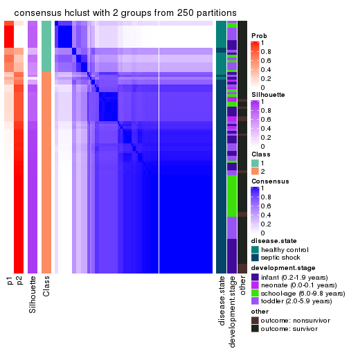</p>

</div>
<div id='tab-SD-hclust-consensus-heatmap-2'>
<pre><code class="r">consensus_heatmap(res, k = 3)
</code></pre>

<p>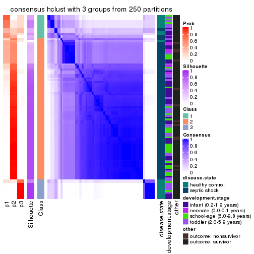</p>

</div>
<div id='tab-SD-hclust-consensus-heatmap-3'>
<pre><code class="r">consensus_heatmap(res, k = 4)
</code></pre>

<p>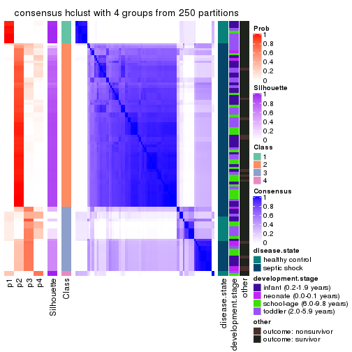</p>

</div>
<div id='tab-SD-hclust-consensus-heatmap-4'>
<pre><code class="r">consensus_heatmap(res, k = 5)
</code></pre>

<p>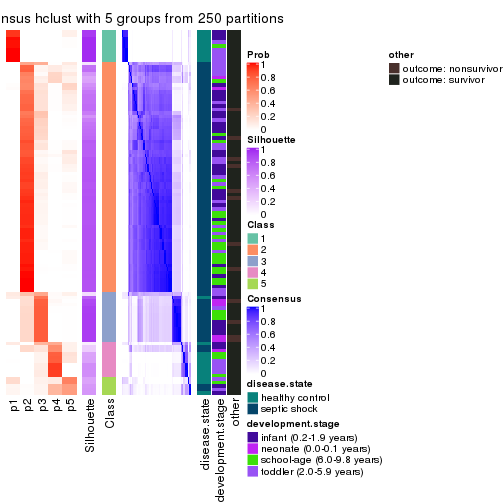</p>

</div>
<div id='tab-SD-hclust-consensus-heatmap-5'>
<pre><code class="r">consensus_heatmap(res, k = 6)
</code></pre>

<p>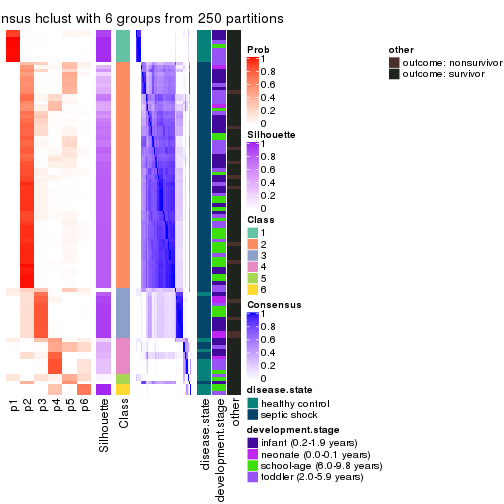</p>

</div>
</div>

Heatmaps for the membership of samples in all partitions to see how consistent they are:


<script>
$( function() {
	$( '#tabs-SD-hclust-membership-heatmap' ).tabs();
} );
</script>
<div id='tabs-SD-hclust-membership-heatmap'>
<ul>
<li><a href='#tab-SD-hclust-membership-heatmap-1'>k = 2</a></li>
<li><a href='#tab-SD-hclust-membership-heatmap-2'>k = 3</a></li>
<li><a href='#tab-SD-hclust-membership-heatmap-3'>k = 4</a></li>
<li><a href='#tab-SD-hclust-membership-heatmap-4'>k = 5</a></li>
<li><a href='#tab-SD-hclust-membership-heatmap-5'>k = 6</a></li>
</ul>
<div id='tab-SD-hclust-membership-heatmap-1'>
<pre><code class="r">membership_heatmap(res, k = 2)
</code></pre>

<p>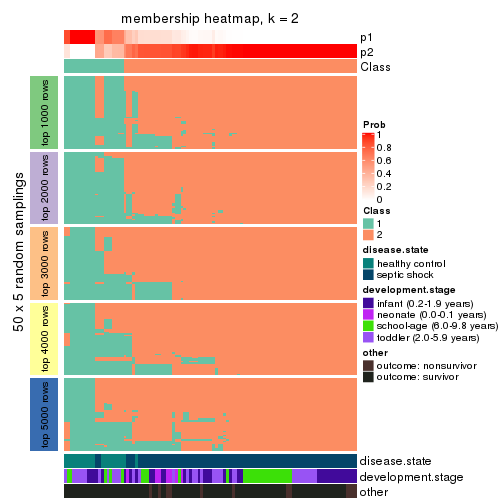</p>

</div>
<div id='tab-SD-hclust-membership-heatmap-2'>
<pre><code class="r">membership_heatmap(res, k = 3)
</code></pre>

<p>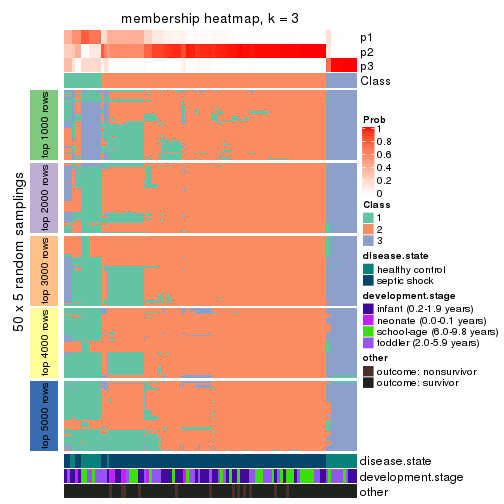</p>

</div>
<div id='tab-SD-hclust-membership-heatmap-3'>
<pre><code class="r">membership_heatmap(res, k = 4)
</code></pre>

<p>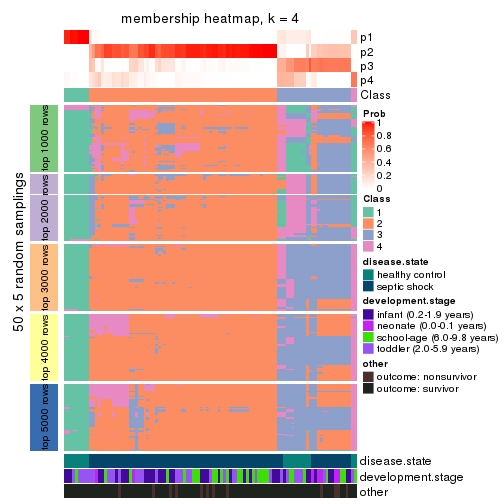</p>

</div>
<div id='tab-SD-hclust-membership-heatmap-4'>
<pre><code class="r">membership_heatmap(res, k = 5)
</code></pre>

<p>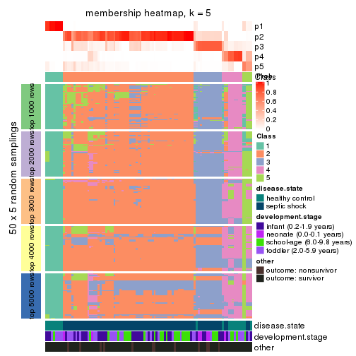</p>

</div>
<div id='tab-SD-hclust-membership-heatmap-5'>
<pre><code class="r">membership_heatmap(res, k = 6)
</code></pre>

<p>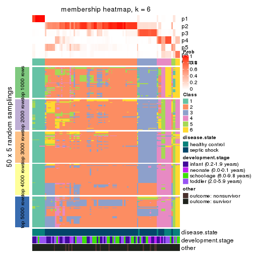</p>

</div>
</div>

As soon as we have had the classes for columns, we can look for signatures
which are significantly different between classes which can be candidate marks
for certain classes. Following are the heatmaps for signatures.


Signature heatmaps where rows are scaled:


<script>
$( function() {
	$( '#tabs-SD-hclust-get-signatures' ).tabs();
} );
</script>
<div id='tabs-SD-hclust-get-signatures'>
<ul>
<li><a href='#tab-SD-hclust-get-signatures-1'>k = 2</a></li>
<li><a href='#tab-SD-hclust-get-signatures-2'>k = 3</a></li>
<li><a href='#tab-SD-hclust-get-signatures-3'>k = 4</a></li>
<li><a href='#tab-SD-hclust-get-signatures-4'>k = 5</a></li>
<li><a href='#tab-SD-hclust-get-signatures-5'>k = 6</a></li>
</ul>
<div id='tab-SD-hclust-get-signatures-1'>
<pre><code class="r">get_signatures(res, k = 2)
</code></pre>

<p>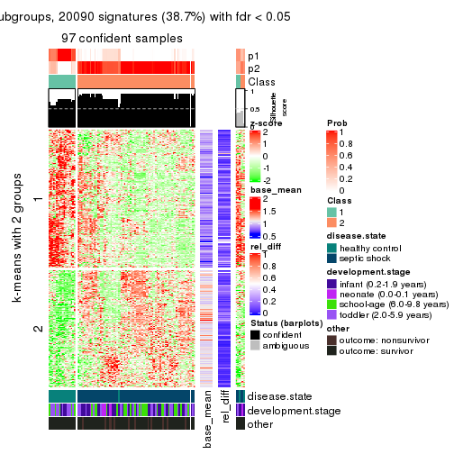</p>

</div>
<div id='tab-SD-hclust-get-signatures-2'>
<pre><code class="r">get_signatures(res, k = 3)
</code></pre>

<p>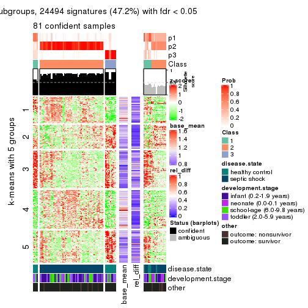</p>

</div>
<div id='tab-SD-hclust-get-signatures-3'>
<pre><code class="r">get_signatures(res, k = 4)
</code></pre>

<p>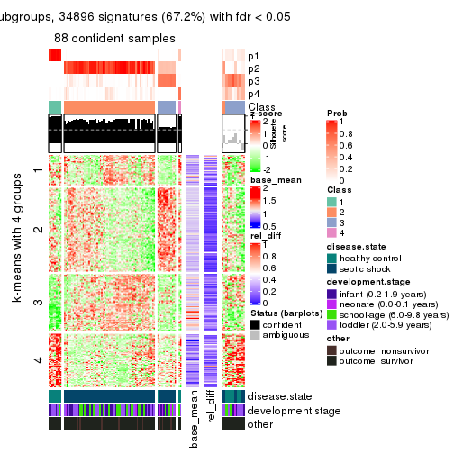</p>

</div>
<div id='tab-SD-hclust-get-signatures-4'>
<pre><code class="r">get_signatures(res, k = 5)
</code></pre>

<p>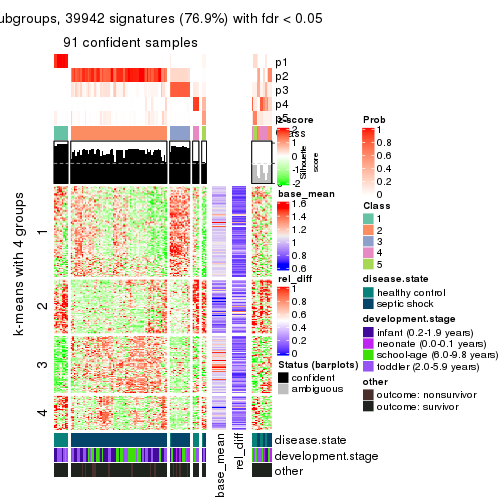</p>

</div>
<div id='tab-SD-hclust-get-signatures-5'>
<pre><code class="r">get_signatures(res, k = 6)
</code></pre>

<p>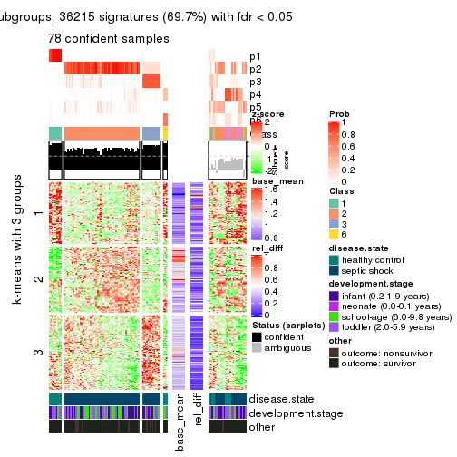</p>

</div>
</div>


Signature heatmaps where rows are not scaled:


<script>
$( function() {
	$( '#tabs-SD-hclust-get-signatures-no-scale' ).tabs();
} );
</script>
<div id='tabs-SD-hclust-get-signatures-no-scale'>
<ul>
<li><a href='#tab-SD-hclust-get-signatures-no-scale-1'>k = 2</a></li>
<li><a href='#tab-SD-hclust-get-signatures-no-scale-2'>k = 3</a></li>
<li><a href='#tab-SD-hclust-get-signatures-no-scale-3'>k = 4</a></li>
<li><a href='#tab-SD-hclust-get-signatures-no-scale-4'>k = 5</a></li>
<li><a href='#tab-SD-hclust-get-signatures-no-scale-5'>k = 6</a></li>
</ul>
<div id='tab-SD-hclust-get-signatures-no-scale-1'>
<pre><code class="r">get_signatures(res, k = 2, scale_rows = FALSE)
</code></pre>

<p>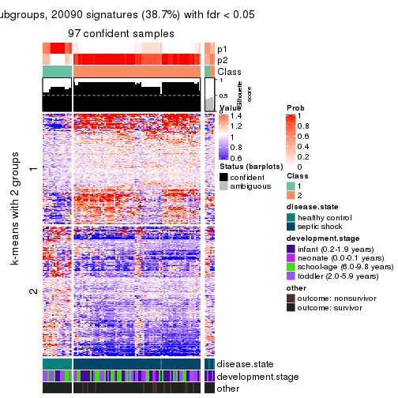</p>

</div>
<div id='tab-SD-hclust-get-signatures-no-scale-2'>
<pre><code class="r">get_signatures(res, k = 3, scale_rows = FALSE)
</code></pre>

<p>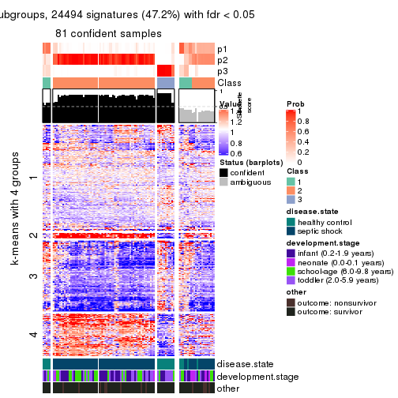</p>

</div>
<div id='tab-SD-hclust-get-signatures-no-scale-3'>
<pre><code class="r">get_signatures(res, k = 4, scale_rows = FALSE)
</code></pre>

<p>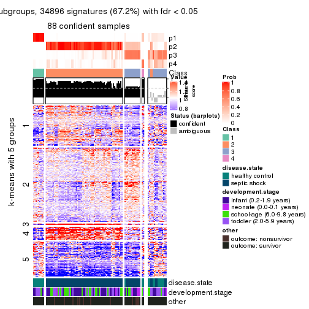</p>

</div>
<div id='tab-SD-hclust-get-signatures-no-scale-4'>
<pre><code class="r">get_signatures(res, k = 5, scale_rows = FALSE)
</code></pre>

<p>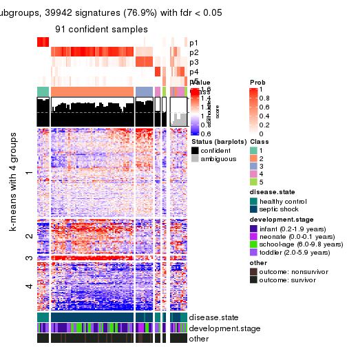</p>

</div>
<div id='tab-SD-hclust-get-signatures-no-scale-5'>
<pre><code class="r">get_signatures(res, k = 6, scale_rows = FALSE)
</code></pre>

<p>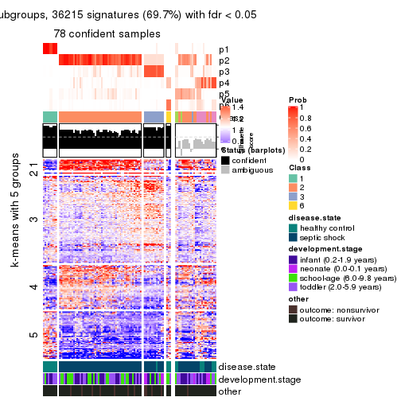</p>

</div>
</div>


Compare the overlap of signatures from different k:

```r
compare_signatures(res)
```

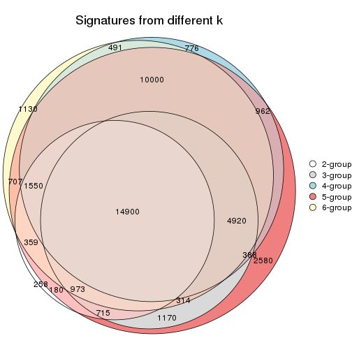

`get_signature()` returns a data frame invisibly. TO get the list of signatures, the function
call should be assigned to a variable explicitly. In following code, if `plot` argument is set
to `FALSE`, no heatmap is plotted while only the differential analysis is performed.

```r
# code only for demonstration
tb = get_signature(res, k = ..., plot = FALSE)
```

An example of the output of `tb` is:

```
#>   which_row         fdr    mean_1    mean_2 scaled_mean_1 scaled_mean_2 km
#> 1        38 0.042760348  8.373488  9.131774    -0.5533452     0.5164555  1
#> 2        40 0.018707592  7.106213  8.469186    -0.6173731     0.5762149  1
#> 3        55 0.019134737 10.221463 11.207825    -0.6159697     0.5749050  1
#> 4        59 0.006059896  5.921854  7.869574    -0.6899429     0.6439467  1
#> 5        60 0.018055526  8.928898 10.211722    -0.6204761     0.5791110  1
#> 6        98 0.009384629 15.714769 14.887706     0.6635654    -0.6193277  2
...
```

The columns in `tb` are:

1. `which_row`: row indices corresponding to the input matrix.
2. `fdr`: FDR for the differential test. 
3. `mean_x`: The mean value in group x.
4. `scaled_mean_x`: The mean value in group x after rows are scaled.
5. `km`: Row groups if k-means clustering is applied to rows.


UMAP plot which shows how samples are separated.


<script>
$( function() {
	$( '#tabs-SD-hclust-dimension-reduction' ).tabs();
} );
</script>
<div id='tabs-SD-hclust-dimension-reduction'>
<ul>
<li><a href='#tab-SD-hclust-dimension-reduction-1'>k = 2</a></li>
<li><a href='#tab-SD-hclust-dimension-reduction-2'>k = 3</a></li>
<li><a href='#tab-SD-hclust-dimension-reduction-3'>k = 4</a></li>
<li><a href='#tab-SD-hclust-dimension-reduction-4'>k = 5</a></li>
<li><a href='#tab-SD-hclust-dimension-reduction-5'>k = 6</a></li>
</ul>
<div id='tab-SD-hclust-dimension-reduction-1'>
<pre><code class="r">dimension_reduction(res, k = 2, method = &quot;UMAP&quot;)
</code></pre>

<p>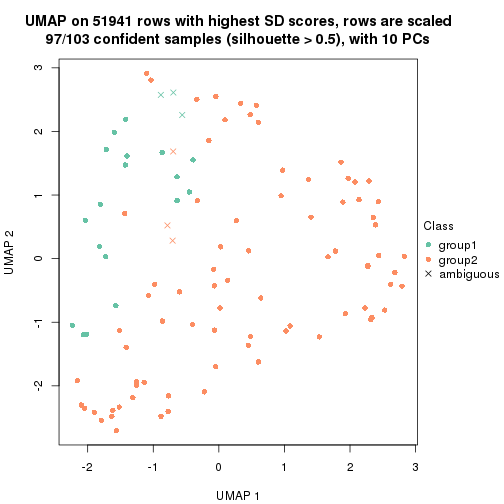</p>

</div>
<div id='tab-SD-hclust-dimension-reduction-2'>
<pre><code class="r">dimension_reduction(res, k = 3, method = &quot;UMAP&quot;)
</code></pre>

<p>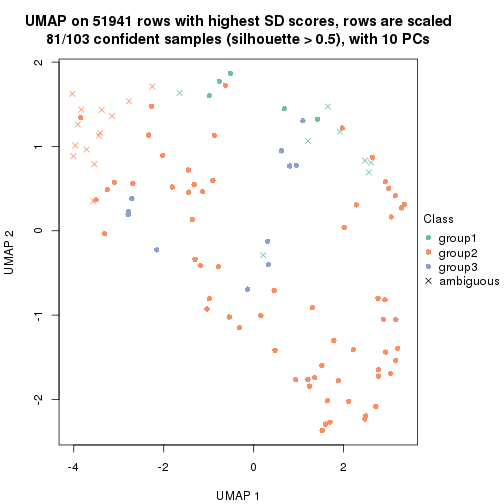</p>

</div>
<div id='tab-SD-hclust-dimension-reduction-3'>
<pre><code class="r">dimension_reduction(res, k = 4, method = &quot;UMAP&quot;)
</code></pre>

<p>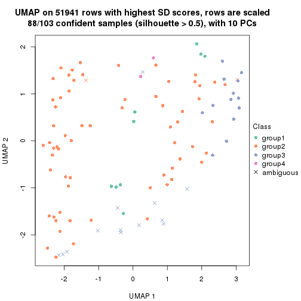</p>

</div>
<div id='tab-SD-hclust-dimension-reduction-4'>
<pre><code class="r">dimension_reduction(res, k = 5, method = &quot;UMAP&quot;)
</code></pre>

<p>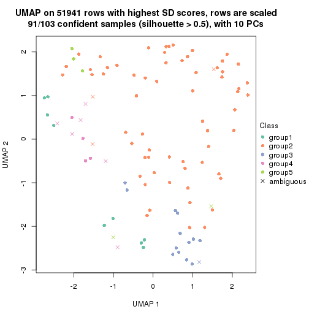</p>

</div>
<div id='tab-SD-hclust-dimension-reduction-5'>
<pre><code class="r">dimension_reduction(res, k = 6, method = &quot;UMAP&quot;)
</code></pre>

<p>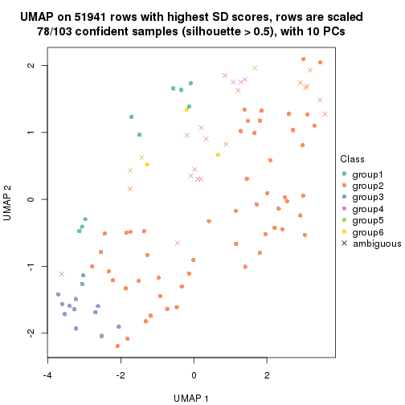</p>

</div>
</div>


Following heatmap shows how subgroups are split when increasing `k`:

```r
collect_classes(res)
```

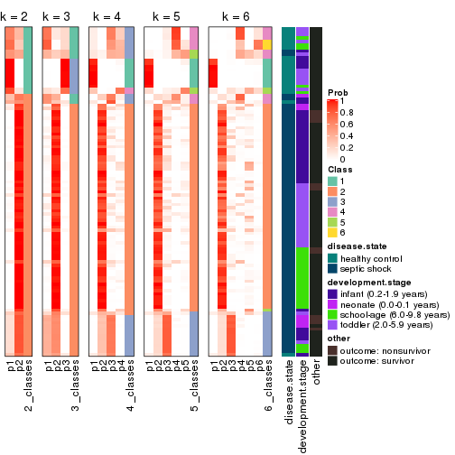


Test correlation between subgroups and known annotations. If the known
annotation is numeric, one-way ANOVA test is applied, and if the known
annotation is discrete, chi-squared contingency table test is applied.

```r
test_to_known_factors(res)
```

```
#>            n disease.state(p) development.stage(p) other(p) k
#> SD:hclust 97         3.71e-20             0.087188    0.171 2
#> SD:hclust 81         2.58e-18             0.682987    0.335 3
#> SD:hclust 88         2.83e-17             0.020106    0.168 4
#> SD:hclust 91         2.28e-16             0.005295    0.203 5
#> SD:hclust 78         2.19e-15             0.000909    0.173 6
```


If matrix rows can be associated to genes, consider to use `functional_enrichment(res,
...)` to perform function enrichment for the signature genes. See [this vignette](http://bioconductor.org/packages/devel/bioc/vignettes/cola/inst/doc/functional_enrichment.html) for more detailed explanations.


 

---------------------------------------------------


### SD:kmeans


The object with results only for a single top-value method and a single partition method 
can be extracted as:

```r
res = res_list["SD", "kmeans"]
# you can also extract it by
# res = res_list["SD:kmeans"]
```

A summary of `res` and all the functions that can be applied to it:

```r
res
```

```
#> A 'ConsensusPartition' object with k = 2, 3, 4, 5, 6.
#>   On a matrix with 51941 rows and 103 columns.
#>   Top rows (1000, 2000, 3000, 4000, 5000) are extracted by 'SD' method.
#>   Subgroups are detected by 'kmeans' method.
#>   Performed in total 1250 partitions by row resampling.
#>   Best k for subgroups seems to be 2.
#> 
#> Following methods can be applied to this 'ConsensusPartition' object:
#>  [1] "cola_report"             "collect_classes"         "collect_plots"          
#>  [4] "collect_stats"           "colnames"                "compare_signatures"     
#>  [7] "consensus_heatmap"       "dimension_reduction"     "functional_enrichment"  
#> [10] "get_anno_col"            "get_anno"                "get_classes"            
#> [13] "get_consensus"           "get_matrix"              "get_membership"         
#> [16] "get_param"               "get_signatures"          "get_stats"              
#> [19] "is_best_k"               "is_stable_k"             "membership_heatmap"     
#> [22] "ncol"                    "nrow"                    "plot_ecdf"              
#> [25] "rownames"                "select_partition_number" "show"                   
#> [28] "suggest_best_k"          "test_to_known_factors"
```

`collect_plots()` function collects all the plots made from `res` for all `k` (number of partitions)
into one single page to provide an easy and fast comparison between different `k`.

```r
collect_plots(res)
```

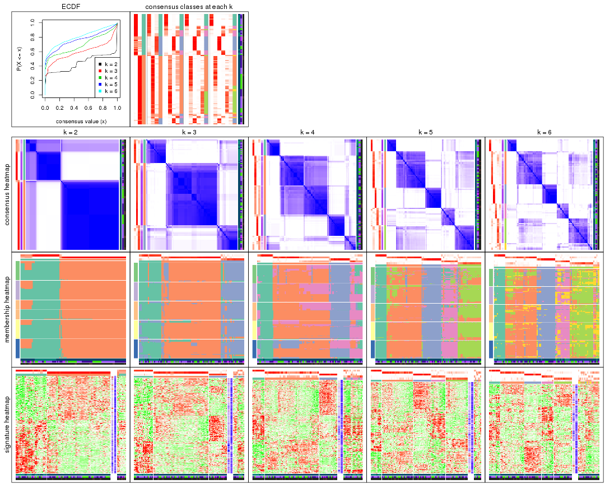

The plots are:

- The first row: a plot of the ECDF (empirical cumulative distribution
  function) curves of the consensus matrix for each `k` and the heatmap of
  predicted classes for each `k`.
- The second row: heatmaps of the consensus matrix for each `k`.
- The third row: heatmaps of the membership matrix for each `k`.
- The fouth row: heatmaps of the signatures for each `k`.

All the plots in panels can be made by individual functions and they are
plotted later in this section.

`select_partition_number()` produces several plots showing different
statistics for choosing "optimized" `k`. There are following statistics:

- ECDF curves of the consensus matrix for each `k`;
- 1-PAC. [The PAC
  score](https://en.wikipedia.org/wiki/Consensus_clustering#Over-interpretation_potential_of_consensus_clustering)
  measures the proportion of the ambiguous subgrouping.
- Mean silhouette score.
- Concordance. The mean probability of fiting the consensus class ids in all
  partitions.
- Area increased. Denote $A_k$ as the area under the ECDF curve for current
  `k`, the area increased is defined as $A_k - A_{k-1}$.
- Rand index. The percent of pairs of samples that are both in a same cluster
  or both are not in a same cluster in the partition of k and k-1.
- Jaccard index. The ratio of pairs of samples are both in a same cluster in
  the partition of k and k-1 and the pairs of samples are both in a same
  cluster in the partition k or k-1.

The detailed explanations of these statistics can be found in [the _cola_
vignette](http://bioconductor.org/packages/devel/bioc/vignettes/cola/inst/doc/cola.html#toc_13).

Generally speaking, lower PAC score, higher mean silhouette score or higher
concordance corresponds to better partition. Rand index and Jaccard index
measure how similar the current partition is compared to partition with `k-1`.
If they are too similar, we won't accept `k` is better than `k-1`.

```r
select_partition_number(res)
```

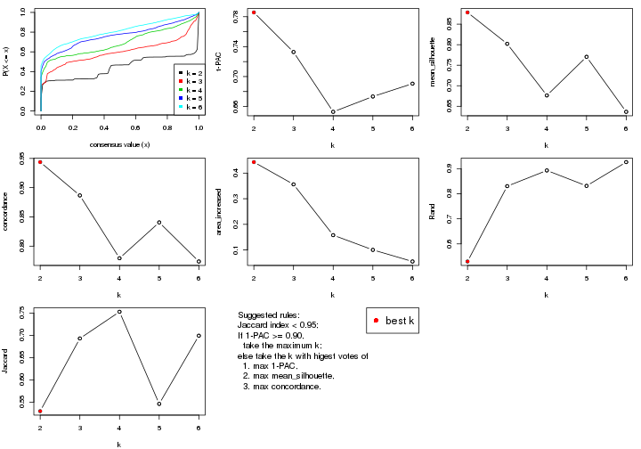

The numeric values for all these statistics can be obtained by `get_stats()`.

```r
get_stats(res)
```

```
#>   k 1-PAC mean_silhouette concordance area_increased  Rand Jaccard
#> 2 2 0.786           0.879       0.944         0.4429 0.530   0.530
#> 3 3 0.733           0.802       0.887         0.3560 0.830   0.693
#> 4 4 0.653           0.676       0.779         0.1578 0.893   0.753
#> 5 5 0.673           0.770       0.841         0.1004 0.831   0.546
#> 6 6 0.691           0.637       0.774         0.0551 0.926   0.699
```

`suggest_best_k()` suggests the best $k$ based on these statistics. The rules are as follows:

- All $k$ with Jaccard index larger than 0.95 are removed because increasing
  $k$ does not provide enough extra information. If all $k$ are removed, it is
  marked as no subgroup is detected.
- For all $k$ with 1-PAC score larger than 0.9, the maximal $k$ is taken as
  the best $k$, and other $k$ are marked as optional $k$.
- If it does not fit the second rule. The $k$ with the maximal vote of the
  highest 1-PAC score, highest mean silhouette, and highest concordance is
  taken as the best $k$.

```r
suggest_best_k(res)
```

```
#> [1] 2
```


Following shows the table of the partitions (You need to click the **show/hide
code output** link to see it). The membership matrix (columns with name `p*`)
is inferred by
[`clue::cl_consensus()`](https://www.rdocumentation.org/link/cl_consensus?package=clue)
function with the `SE` method. Basically the value in the membership matrix
represents the probability to belong to a certain group. The finall class
label for an item is determined with the group with highest probability it
belongs to.

In `get_classes()` function, the entropy is calculated from the membership
matrix and the silhouette score is calculated from the consensus matrix.


<script>
$( function() {
	$( '#tabs-SD-kmeans-get-classes' ).tabs();
} );
</script>
<div id='tabs-SD-kmeans-get-classes'>
<ul>
<li><a href='#tab-SD-kmeans-get-classes-1'>k = 2</a></li>
<li><a href='#tab-SD-kmeans-get-classes-2'>k = 3</a></li>
<li><a href='#tab-SD-kmeans-get-classes-3'>k = 4</a></li>
<li><a href='#tab-SD-kmeans-get-classes-4'>k = 5</a></li>
<li><a href='#tab-SD-kmeans-get-classes-5'>k = 6</a></li>
</ul>

<div id='tab-SD-kmeans-get-classes-1'>
<p><a id='tab-SD-kmeans-get-classes-1-a' style='color:#0366d6' href='#'>show/hide code output</a></p>
<pre><code class="r">cbind(get_classes(res, k = 2), get_membership(res, k = 2))
</code></pre>

<pre><code>#&gt;           class entropy silhouette    p1    p2
#&gt; GSM647569     1  0.9866      0.431 0.568 0.432
#&gt; GSM647574     1  0.9850      0.439 0.572 0.428
#&gt; GSM647577     1  0.9866      0.431 0.568 0.432
#&gt; GSM647547     1  0.9248      0.587 0.660 0.340
#&gt; GSM647552     2  0.2423      0.938 0.040 0.960
#&gt; GSM647553     1  0.1633      0.853 0.976 0.024
#&gt; GSM647565     2  0.1184      0.969 0.016 0.984
#&gt; GSM647545     2  0.0000      0.980 0.000 1.000
#&gt; GSM647549     2  0.0376      0.980 0.004 0.996
#&gt; GSM647550     2  0.0376      0.980 0.004 0.996
#&gt; GSM647560     2  0.0376      0.980 0.004 0.996
#&gt; GSM647617     1  0.9866      0.431 0.568 0.432
#&gt; GSM647528     2  0.0000      0.980 0.000 1.000
#&gt; GSM647529     1  0.0376      0.863 0.996 0.004
#&gt; GSM647531     2  0.0000      0.980 0.000 1.000
#&gt; GSM647540     2  0.0376      0.980 0.004 0.996
#&gt; GSM647541     2  0.0376      0.980 0.004 0.996
#&gt; GSM647546     2  0.4298      0.880 0.088 0.912
#&gt; GSM647557     2  0.0000      0.980 0.000 1.000
#&gt; GSM647561     2  0.0000      0.980 0.000 1.000
#&gt; GSM647567     2  0.9427      0.276 0.360 0.640
#&gt; GSM647568     2  0.0376      0.980 0.004 0.996
#&gt; GSM647570     2  0.0376      0.980 0.004 0.996
#&gt; GSM647573     1  0.1414      0.855 0.980 0.020
#&gt; GSM647576     2  0.0376      0.980 0.004 0.996
#&gt; GSM647579     2  0.0376      0.980 0.004 0.996
#&gt; GSM647580     1  0.9393      0.566 0.644 0.356
#&gt; GSM647583     1  0.9866      0.431 0.568 0.432
#&gt; GSM647592     2  0.0000      0.980 0.000 1.000
#&gt; GSM647593     2  0.0000      0.980 0.000 1.000
#&gt; GSM647595     2  0.0000      0.980 0.000 1.000
#&gt; GSM647597     2  0.9795      0.201 0.416 0.584
#&gt; GSM647598     2  0.0000      0.980 0.000 1.000
#&gt; GSM647613     2  0.0000      0.980 0.000 1.000
#&gt; GSM647615     2  0.0376      0.980 0.004 0.996
#&gt; GSM647616     1  0.9866      0.431 0.568 0.432
#&gt; GSM647619     2  0.0000      0.980 0.000 1.000
#&gt; GSM647582     2  0.0000      0.980 0.000 1.000
#&gt; GSM647591     2  0.0000      0.980 0.000 1.000
#&gt; GSM647527     2  0.0000      0.980 0.000 1.000
#&gt; GSM647530     2  0.0000      0.980 0.000 1.000
#&gt; GSM647532     1  0.0376      0.863 0.996 0.004
#&gt; GSM647544     2  0.0000      0.980 0.000 1.000
#&gt; GSM647551     2  0.0000      0.980 0.000 1.000
#&gt; GSM647556     1  0.9393      0.566 0.644 0.356
#&gt; GSM647558     2  0.0376      0.980 0.004 0.996
#&gt; GSM647572     2  0.1633      0.961 0.024 0.976
#&gt; GSM647578     2  0.0376      0.980 0.004 0.996
#&gt; GSM647581     2  0.0376      0.980 0.004 0.996
#&gt; GSM647594     2  0.0000      0.980 0.000 1.000
#&gt; GSM647599     1  0.0376      0.863 0.996 0.004
#&gt; GSM647600     2  0.0000      0.980 0.000 1.000
#&gt; GSM647601     2  0.0000      0.980 0.000 1.000
#&gt; GSM647603     2  0.0000      0.980 0.000 1.000
#&gt; GSM647610     2  0.0376      0.978 0.004 0.996
#&gt; GSM647611     2  0.0000      0.980 0.000 1.000
#&gt; GSM647612     2  0.0376      0.980 0.004 0.996
#&gt; GSM647614     2  0.0376      0.980 0.004 0.996
#&gt; GSM647618     2  0.0000      0.980 0.000 1.000
#&gt; GSM647629     2  0.0000      0.980 0.000 1.000
#&gt; GSM647535     2  0.0376      0.980 0.004 0.996
#&gt; GSM647563     2  0.0376      0.980 0.004 0.996
#&gt; GSM647542     2  0.0376      0.980 0.004 0.996
#&gt; GSM647543     2  0.0376      0.980 0.004 0.996
#&gt; GSM647548     2  0.1184      0.969 0.016 0.984
#&gt; GSM647554     2  0.0000      0.980 0.000 1.000
#&gt; GSM647555     2  0.0376      0.980 0.004 0.996
#&gt; GSM647559     2  0.0376      0.980 0.004 0.996
#&gt; GSM647562     2  0.0000      0.980 0.000 1.000
#&gt; GSM647564     1  0.9866      0.431 0.568 0.432
#&gt; GSM647571     2  0.0376      0.980 0.004 0.996
#&gt; GSM647584     2  0.0000      0.980 0.000 1.000
#&gt; GSM647585     1  0.7376      0.726 0.792 0.208
#&gt; GSM647586     2  0.0000      0.980 0.000 1.000
#&gt; GSM647587     2  0.0000      0.980 0.000 1.000
#&gt; GSM647588     2  0.0376      0.980 0.004 0.996
#&gt; GSM647596     2  0.0000      0.980 0.000 1.000
#&gt; GSM647602     1  0.9393      0.566 0.644 0.356
#&gt; GSM647609     2  0.0000      0.980 0.000 1.000
#&gt; GSM647620     2  0.0000      0.980 0.000 1.000
#&gt; GSM647627     2  0.0000      0.980 0.000 1.000
#&gt; GSM647628     2  0.0376      0.980 0.004 0.996
#&gt; GSM647533     1  0.0376      0.863 0.996 0.004
#&gt; GSM647536     1  0.0376      0.863 0.996 0.004
#&gt; GSM647537     1  0.0376      0.863 0.996 0.004
#&gt; GSM647606     1  0.0376      0.863 0.996 0.004
#&gt; GSM647621     1  0.0000      0.862 1.000 0.000
#&gt; GSM647626     1  0.0000      0.862 1.000 0.000
#&gt; GSM647538     1  0.0376      0.863 0.996 0.004
#&gt; GSM647575     1  0.0000      0.862 1.000 0.000
#&gt; GSM647590     1  0.0000      0.862 1.000 0.000
#&gt; GSM647605     1  0.0376      0.863 0.996 0.004
#&gt; GSM647607     1  0.0000      0.862 1.000 0.000
#&gt; GSM647608     1  0.0000      0.862 1.000 0.000
#&gt; GSM647622     1  0.0376      0.863 0.996 0.004
#&gt; GSM647623     1  0.0376      0.863 0.996 0.004
#&gt; GSM647624     1  0.0376      0.863 0.996 0.004
#&gt; GSM647625     1  0.0376      0.863 0.996 0.004
#&gt; GSM647534     1  0.0376      0.863 0.996 0.004
#&gt; GSM647539     1  0.0000      0.862 1.000 0.000
#&gt; GSM647566     1  0.0000      0.862 1.000 0.000
#&gt; GSM647589     1  0.0000      0.862 1.000 0.000
#&gt; GSM647604     1  0.0376      0.863 0.996 0.004
</code></pre>

<script>
$('#tab-SD-kmeans-get-classes-1-a').parent().next().next().hide();
$('#tab-SD-kmeans-get-classes-1-a').click(function(){
  $('#tab-SD-kmeans-get-classes-1-a').parent().next().next().toggle();
  return(false);
});
</script>
</div>

<div id='tab-SD-kmeans-get-classes-2'>
<p><a id='tab-SD-kmeans-get-classes-2-a' style='color:#0366d6' href='#'>show/hide code output</a></p>
<pre><code class="r">cbind(get_classes(res, k = 3), get_membership(res, k = 3))
</code></pre>

<pre><code>#&gt;           class entropy silhouette    p1    p2    p3
#&gt; GSM647569     3  0.3530     0.8158 0.068 0.032 0.900
#&gt; GSM647574     3  0.3116     0.7726 0.108 0.000 0.892
#&gt; GSM647577     3  0.3530     0.8158 0.068 0.032 0.900
#&gt; GSM647547     3  0.3412     0.7612 0.124 0.000 0.876
#&gt; GSM647552     2  0.3805     0.8813 0.024 0.884 0.092
#&gt; GSM647553     3  0.2261     0.7870 0.068 0.000 0.932
#&gt; GSM647565     3  0.7962     0.4461 0.072 0.352 0.576
#&gt; GSM647545     2  0.0424     0.9180 0.000 0.992 0.008
#&gt; GSM647549     2  0.0424     0.9180 0.000 0.992 0.008
#&gt; GSM647550     2  0.5254     0.6124 0.000 0.736 0.264
#&gt; GSM647560     2  0.2066     0.8897 0.000 0.940 0.060
#&gt; GSM647617     3  0.3434     0.8150 0.064 0.032 0.904
#&gt; GSM647528     2  0.0000     0.9192 0.000 1.000 0.000
#&gt; GSM647529     1  0.1753     0.8313 0.952 0.000 0.048
#&gt; GSM647531     2  0.1491     0.9179 0.016 0.968 0.016
#&gt; GSM647540     3  0.6126     0.3840 0.000 0.400 0.600
#&gt; GSM647541     2  0.0237     0.9188 0.000 0.996 0.004
#&gt; GSM647546     3  0.3879     0.7440 0.000 0.152 0.848
#&gt; GSM647557     2  0.1491     0.9179 0.016 0.968 0.016
#&gt; GSM647561     2  0.0661     0.9192 0.008 0.988 0.004
#&gt; GSM647567     3  0.4712     0.7525 0.044 0.108 0.848
#&gt; GSM647568     2  0.4605     0.7164 0.000 0.796 0.204
#&gt; GSM647570     2  0.0424     0.9180 0.000 0.992 0.008
#&gt; GSM647573     3  0.5327     0.5970 0.272 0.000 0.728
#&gt; GSM647576     2  0.6302    -0.0198 0.000 0.520 0.480
#&gt; GSM647579     3  0.5988     0.4103 0.000 0.368 0.632
#&gt; GSM647580     3  0.3530     0.8158 0.068 0.032 0.900
#&gt; GSM647583     3  0.3530     0.8158 0.068 0.032 0.900
#&gt; GSM647592     2  0.2846     0.9069 0.020 0.924 0.056
#&gt; GSM647593     2  0.2846     0.9069 0.020 0.924 0.056
#&gt; GSM647595     2  0.2846     0.9069 0.020 0.924 0.056
#&gt; GSM647597     1  0.7992     0.3451 0.592 0.328 0.080
#&gt; GSM647598     2  0.2384     0.9116 0.008 0.936 0.056
#&gt; GSM647613     2  0.0237     0.9188 0.000 0.996 0.004
#&gt; GSM647615     2  0.1964     0.8926 0.000 0.944 0.056
#&gt; GSM647616     3  0.3530     0.8158 0.068 0.032 0.900
#&gt; GSM647619     2  0.2846     0.9069 0.020 0.924 0.056
#&gt; GSM647582     2  0.2384     0.9116 0.008 0.936 0.056
#&gt; GSM647591     2  0.2982     0.9053 0.024 0.920 0.056
#&gt; GSM647527     2  0.0000     0.9192 0.000 1.000 0.000
#&gt; GSM647530     2  0.4443     0.8321 0.084 0.864 0.052
#&gt; GSM647532     1  0.1753     0.8411 0.952 0.000 0.048
#&gt; GSM647544     2  0.0424     0.9180 0.000 0.992 0.008
#&gt; GSM647551     2  0.2846     0.9069 0.020 0.924 0.056
#&gt; GSM647556     3  0.3530     0.8158 0.068 0.032 0.900
#&gt; GSM647558     2  0.0424     0.9180 0.000 0.992 0.008
#&gt; GSM647572     3  0.4235     0.7231 0.000 0.176 0.824
#&gt; GSM647578     2  0.6111     0.2729 0.000 0.604 0.396
#&gt; GSM647581     2  0.1015     0.9181 0.012 0.980 0.008
#&gt; GSM647594     2  0.2846     0.9069 0.020 0.924 0.056
#&gt; GSM647599     1  0.2796     0.8699 0.908 0.000 0.092
#&gt; GSM647600     2  0.2550     0.9096 0.012 0.932 0.056
#&gt; GSM647601     2  0.2384     0.9116 0.008 0.936 0.056
#&gt; GSM647603     2  0.1643     0.9158 0.000 0.956 0.044
#&gt; GSM647610     2  0.5406     0.7400 0.012 0.764 0.224
#&gt; GSM647611     2  0.1964     0.9132 0.000 0.944 0.056
#&gt; GSM647612     2  0.0424     0.9180 0.000 0.992 0.008
#&gt; GSM647614     2  0.1860     0.8954 0.000 0.948 0.052
#&gt; GSM647618     2  0.2550     0.9109 0.012 0.932 0.056
#&gt; GSM647629     2  0.1643     0.9158 0.000 0.956 0.044
#&gt; GSM647535     2  0.0000     0.9192 0.000 1.000 0.000
#&gt; GSM647563     2  0.0424     0.9180 0.000 0.992 0.008
#&gt; GSM647542     2  0.2261     0.8833 0.000 0.932 0.068
#&gt; GSM647543     2  0.2261     0.8833 0.000 0.932 0.068
#&gt; GSM647548     2  0.8071     0.1635 0.072 0.548 0.380
#&gt; GSM647554     2  0.5098     0.6959 0.000 0.752 0.248
#&gt; GSM647555     2  0.0892     0.9137 0.000 0.980 0.020
#&gt; GSM647559     2  0.0237     0.9188 0.000 0.996 0.004
#&gt; GSM647562     2  0.0848     0.9186 0.008 0.984 0.008
#&gt; GSM647564     3  0.3234     0.7949 0.020 0.072 0.908
#&gt; GSM647571     2  0.2261     0.8833 0.000 0.932 0.068
#&gt; GSM647584     2  0.2200     0.9125 0.004 0.940 0.056
#&gt; GSM647585     3  0.3530     0.8158 0.068 0.032 0.900
#&gt; GSM647586     2  0.1529     0.9166 0.000 0.960 0.040
#&gt; GSM647587     2  0.0424     0.9197 0.000 0.992 0.008
#&gt; GSM647588     2  0.0237     0.9188 0.000 0.996 0.004
#&gt; GSM647596     2  0.0747     0.9199 0.000 0.984 0.016
#&gt; GSM647602     3  0.3530     0.8158 0.068 0.032 0.900
#&gt; GSM647609     2  0.1964     0.9132 0.000 0.944 0.056
#&gt; GSM647620     2  0.1643     0.9158 0.000 0.956 0.044
#&gt; GSM647627     2  0.1643     0.9158 0.000 0.956 0.044
#&gt; GSM647628     2  0.0424     0.9180 0.000 0.992 0.008
#&gt; GSM647533     1  0.2796     0.8699 0.908 0.000 0.092
#&gt; GSM647536     1  0.1643     0.8403 0.956 0.000 0.044
#&gt; GSM647537     1  0.2796     0.8699 0.908 0.000 0.092
#&gt; GSM647606     1  0.2625     0.8709 0.916 0.000 0.084
#&gt; GSM647621     1  0.5785     0.5291 0.668 0.000 0.332
#&gt; GSM647626     3  0.3192     0.7730 0.112 0.000 0.888
#&gt; GSM647538     1  0.2537     0.8710 0.920 0.000 0.080
#&gt; GSM647575     1  0.5835     0.4781 0.660 0.000 0.340
#&gt; GSM647590     1  0.1964     0.8497 0.944 0.000 0.056
#&gt; GSM647605     1  0.2356     0.8690 0.928 0.000 0.072
#&gt; GSM647607     1  0.3619     0.7937 0.864 0.000 0.136
#&gt; GSM647608     3  0.6280     0.1358 0.460 0.000 0.540
#&gt; GSM647622     1  0.2796     0.8699 0.908 0.000 0.092
#&gt; GSM647623     1  0.2796     0.8699 0.908 0.000 0.092
#&gt; GSM647624     1  0.1964     0.8673 0.944 0.000 0.056
#&gt; GSM647625     1  0.2796     0.8699 0.908 0.000 0.092
#&gt; GSM647534     1  0.3573     0.8311 0.876 0.004 0.120
#&gt; GSM647539     1  0.7150     0.4418 0.616 0.036 0.348
#&gt; GSM647566     1  0.2878     0.8644 0.904 0.000 0.096
#&gt; GSM647589     3  0.5968     0.4216 0.364 0.000 0.636
#&gt; GSM647604     1  0.2356     0.8690 0.928 0.000 0.072
</code></pre>

<script>
$('#tab-SD-kmeans-get-classes-2-a').parent().next().next().hide();
$('#tab-SD-kmeans-get-classes-2-a').click(function(){
  $('#tab-SD-kmeans-get-classes-2-a').parent().next().next().toggle();
  return(false);
});
</script>
</div>

<div id='tab-SD-kmeans-get-classes-3'>
<p><a id='tab-SD-kmeans-get-classes-3-a' style='color:#0366d6' href='#'>show/hide code output</a></p>
<pre><code class="r">cbind(get_classes(res, k = 4), get_membership(res, k = 4))
</code></pre>

<pre><code>#&gt;           class entropy silhouette    p1    p2    p3    p4
#&gt; GSM647569     3  0.0469     0.8898 0.012 0.000 0.988 0.000
#&gt; GSM647574     3  0.1297     0.8682 0.020 0.000 0.964 0.016
#&gt; GSM647577     3  0.0657     0.8905 0.012 0.000 0.984 0.004
#&gt; GSM647547     4  0.5590     0.2012 0.020 0.000 0.456 0.524
#&gt; GSM647552     2  0.2654     0.6714 0.000 0.888 0.004 0.108
#&gt; GSM647553     3  0.0657     0.8905 0.012 0.000 0.984 0.004
#&gt; GSM647565     4  0.3236     0.4190 0.004 0.088 0.028 0.880
#&gt; GSM647545     2  0.5329     0.7154 0.000 0.568 0.012 0.420
#&gt; GSM647549     2  0.5320     0.7162 0.000 0.572 0.012 0.416
#&gt; GSM647550     2  0.7683     0.5096 0.000 0.400 0.216 0.384
#&gt; GSM647560     2  0.5526     0.7127 0.000 0.564 0.020 0.416
#&gt; GSM647617     3  0.0524     0.8900 0.008 0.000 0.988 0.004
#&gt; GSM647528     2  0.3933     0.7540 0.000 0.792 0.008 0.200
#&gt; GSM647529     4  0.4948     0.2632 0.440 0.000 0.000 0.560
#&gt; GSM647531     2  0.5016     0.7129 0.000 0.600 0.004 0.396
#&gt; GSM647540     3  0.2706     0.7975 0.000 0.020 0.900 0.080
#&gt; GSM647541     2  0.5231     0.7303 0.000 0.604 0.012 0.384
#&gt; GSM647546     3  0.0817     0.8731 0.000 0.000 0.976 0.024
#&gt; GSM647557     2  0.5028     0.7118 0.000 0.596 0.004 0.400
#&gt; GSM647561     2  0.4877     0.7408 0.000 0.664 0.008 0.328
#&gt; GSM647567     3  0.1843     0.8606 0.008 0.028 0.948 0.016
#&gt; GSM647568     2  0.5550     0.7051 0.000 0.552 0.020 0.428
#&gt; GSM647570     2  0.5337     0.7117 0.000 0.564 0.012 0.424
#&gt; GSM647573     4  0.4205     0.5283 0.056 0.000 0.124 0.820
#&gt; GSM647576     3  0.6292     0.3185 0.000 0.076 0.592 0.332
#&gt; GSM647579     3  0.2816     0.8065 0.000 0.036 0.900 0.064
#&gt; GSM647580     3  0.0657     0.8905 0.012 0.000 0.984 0.004
#&gt; GSM647583     3  0.0657     0.8905 0.012 0.000 0.984 0.004
#&gt; GSM647592     2  0.1118     0.7131 0.000 0.964 0.000 0.036
#&gt; GSM647593     2  0.0707     0.7211 0.000 0.980 0.000 0.020
#&gt; GSM647595     2  0.0707     0.7211 0.000 0.980 0.000 0.020
#&gt; GSM647597     2  0.6677     0.0394 0.348 0.552 0.000 0.100
#&gt; GSM647598     2  0.0000     0.7278 0.000 1.000 0.000 0.000
#&gt; GSM647613     2  0.4955     0.7377 0.000 0.648 0.008 0.344
#&gt; GSM647615     2  0.5550     0.7065 0.000 0.552 0.020 0.428
#&gt; GSM647616     3  0.0657     0.8905 0.012 0.000 0.984 0.004
#&gt; GSM647619     2  0.1022     0.7152 0.000 0.968 0.000 0.032
#&gt; GSM647582     2  0.0817     0.7214 0.000 0.976 0.000 0.024
#&gt; GSM647591     2  0.1474     0.7047 0.000 0.948 0.000 0.052
#&gt; GSM647527     2  0.3933     0.7540 0.000 0.792 0.008 0.200
#&gt; GSM647530     4  0.2973     0.4804 0.020 0.096 0.000 0.884
#&gt; GSM647532     4  0.4967     0.2521 0.452 0.000 0.000 0.548
#&gt; GSM647544     2  0.5279     0.7249 0.000 0.588 0.012 0.400
#&gt; GSM647551     2  0.0895     0.7205 0.000 0.976 0.004 0.020
#&gt; GSM647556     3  0.0469     0.8898 0.012 0.000 0.988 0.000
#&gt; GSM647558     2  0.5345     0.7109 0.000 0.560 0.012 0.428
#&gt; GSM647572     3  0.0921     0.8707 0.000 0.000 0.972 0.028
#&gt; GSM647578     3  0.7839    -0.2968 0.000 0.352 0.384 0.264
#&gt; GSM647581     2  0.5392     0.6869 0.000 0.528 0.012 0.460
#&gt; GSM647594     2  0.0707     0.7211 0.000 0.980 0.000 0.020
#&gt; GSM647599     1  0.1042     0.8551 0.972 0.000 0.020 0.008
#&gt; GSM647600     2  0.0779     0.7208 0.000 0.980 0.004 0.016
#&gt; GSM647601     2  0.0000     0.7278 0.000 1.000 0.000 0.000
#&gt; GSM647603     2  0.2329     0.7325 0.000 0.916 0.012 0.072
#&gt; GSM647610     2  0.3587     0.6308 0.000 0.856 0.104 0.040
#&gt; GSM647611     2  0.1022     0.7271 0.000 0.968 0.000 0.032
#&gt; GSM647612     2  0.5444     0.7096 0.000 0.560 0.016 0.424
#&gt; GSM647614     2  0.5444     0.7096 0.000 0.560 0.016 0.424
#&gt; GSM647618     2  0.1940     0.6912 0.000 0.924 0.000 0.076
#&gt; GSM647629     2  0.2281     0.7399 0.000 0.904 0.000 0.096
#&gt; GSM647535     2  0.4744     0.7501 0.000 0.704 0.012 0.284
#&gt; GSM647563     2  0.5320     0.7158 0.000 0.572 0.012 0.416
#&gt; GSM647542     2  0.5550     0.7051 0.000 0.552 0.020 0.428
#&gt; GSM647543     2  0.5558     0.7041 0.000 0.548 0.020 0.432
#&gt; GSM647548     4  0.2497     0.4875 0.020 0.040 0.016 0.924
#&gt; GSM647554     2  0.5106     0.5264 0.000 0.720 0.240 0.040
#&gt; GSM647555     2  0.5427     0.7144 0.000 0.568 0.016 0.416
#&gt; GSM647559     2  0.4978     0.7448 0.000 0.664 0.012 0.324
#&gt; GSM647562     2  0.4857     0.7436 0.000 0.668 0.008 0.324
#&gt; GSM647564     3  0.0188     0.8867 0.000 0.000 0.996 0.004
#&gt; GSM647571     2  0.5498     0.7197 0.000 0.576 0.020 0.404
#&gt; GSM647584     2  0.0000     0.7278 0.000 1.000 0.000 0.000
#&gt; GSM647585     3  0.0469     0.8898 0.012 0.000 0.988 0.000
#&gt; GSM647586     2  0.1389     0.7400 0.000 0.952 0.000 0.048
#&gt; GSM647587     2  0.3024     0.7497 0.000 0.852 0.000 0.148
#&gt; GSM647588     2  0.5244     0.7288 0.000 0.600 0.012 0.388
#&gt; GSM647596     2  0.2408     0.7488 0.000 0.896 0.000 0.104
#&gt; GSM647602     3  0.0657     0.8905 0.012 0.000 0.984 0.004
#&gt; GSM647609     2  0.0000     0.7278 0.000 1.000 0.000 0.000
#&gt; GSM647620     2  0.0817     0.7334 0.000 0.976 0.000 0.024
#&gt; GSM647627     2  0.0817     0.7334 0.000 0.976 0.000 0.024
#&gt; GSM647628     2  0.5337     0.7117 0.000 0.564 0.012 0.424
#&gt; GSM647533     1  0.0707     0.8605 0.980 0.000 0.020 0.000
#&gt; GSM647536     4  0.4967     0.2521 0.452 0.000 0.000 0.548
#&gt; GSM647537     1  0.0707     0.8605 0.980 0.000 0.020 0.000
#&gt; GSM647606     1  0.0707     0.8605 0.980 0.000 0.020 0.000
#&gt; GSM647621     4  0.6213     0.2491 0.464 0.000 0.052 0.484
#&gt; GSM647626     3  0.0592     0.8872 0.016 0.000 0.984 0.000
#&gt; GSM647538     1  0.1411     0.8490 0.960 0.000 0.020 0.020
#&gt; GSM647575     4  0.6102     0.3328 0.420 0.000 0.048 0.532
#&gt; GSM647590     1  0.4382     0.3760 0.704 0.000 0.000 0.296
#&gt; GSM647605     1  0.0707     0.8605 0.980 0.000 0.020 0.000
#&gt; GSM647607     1  0.5409    -0.2810 0.496 0.000 0.012 0.492
#&gt; GSM647608     4  0.7494     0.4279 0.236 0.000 0.264 0.500
#&gt; GSM647622     1  0.0707     0.8605 0.980 0.000 0.020 0.000
#&gt; GSM647623     1  0.0707     0.8605 0.980 0.000 0.020 0.000
#&gt; GSM647624     1  0.0000     0.8434 1.000 0.000 0.000 0.000
#&gt; GSM647625     1  0.0707     0.8605 0.980 0.000 0.020 0.000
#&gt; GSM647534     1  0.3942     0.6991 0.848 0.108 0.016 0.028
#&gt; GSM647539     4  0.4706     0.4892 0.248 0.000 0.020 0.732
#&gt; GSM647566     1  0.5291     0.3109 0.652 0.000 0.024 0.324
#&gt; GSM647589     4  0.7268     0.4424 0.172 0.000 0.312 0.516
#&gt; GSM647604     1  0.0707     0.8605 0.980 0.000 0.020 0.000
</code></pre>

<script>
$('#tab-SD-kmeans-get-classes-3-a').parent().next().next().hide();
$('#tab-SD-kmeans-get-classes-3-a').click(function(){
  $('#tab-SD-kmeans-get-classes-3-a').parent().next().next().toggle();
  return(false);
});
</script>
</div>

<div id='tab-SD-kmeans-get-classes-4'>
<p><a id='tab-SD-kmeans-get-classes-4-a' style='color:#0366d6' href='#'>show/hide code output</a></p>
<pre><code class="r">cbind(get_classes(res, k = 5), get_membership(res, k = 5))
</code></pre>

<pre><code>#&gt;           class entropy silhouette    p1    p2    p3    p4    p5
#&gt; GSM647569     3  0.0000     0.9391 0.000 0.000 1.000 0.000 0.000
#&gt; GSM647574     3  0.0693     0.9302 0.000 0.000 0.980 0.012 0.008
#&gt; GSM647577     3  0.0162     0.9386 0.000 0.000 0.996 0.000 0.004
#&gt; GSM647547     4  0.4004     0.6568 0.000 0.004 0.232 0.748 0.016
#&gt; GSM647552     5  0.3075     0.7042 0.000 0.048 0.000 0.092 0.860
#&gt; GSM647553     3  0.0451     0.9349 0.000 0.000 0.988 0.004 0.008
#&gt; GSM647565     4  0.5507     0.2048 0.000 0.456 0.000 0.480 0.064
#&gt; GSM647545     2  0.2153     0.8224 0.000 0.916 0.000 0.040 0.044
#&gt; GSM647549     2  0.2153     0.8224 0.000 0.916 0.000 0.040 0.044
#&gt; GSM647550     2  0.3241     0.7003 0.000 0.832 0.144 0.024 0.000
#&gt; GSM647560     2  0.1211     0.8212 0.000 0.960 0.016 0.024 0.000
#&gt; GSM647617     3  0.0000     0.9391 0.000 0.000 1.000 0.000 0.000
#&gt; GSM647528     2  0.3940     0.6685 0.000 0.756 0.000 0.024 0.220
#&gt; GSM647529     4  0.4373     0.7327 0.080 0.000 0.000 0.760 0.160
#&gt; GSM647531     2  0.5091     0.6150 0.000 0.672 0.000 0.084 0.244
#&gt; GSM647540     3  0.2299     0.8851 0.000 0.052 0.912 0.032 0.004
#&gt; GSM647541     2  0.1211     0.8218 0.000 0.960 0.000 0.024 0.016
#&gt; GSM647546     3  0.0000     0.9391 0.000 0.000 1.000 0.000 0.000
#&gt; GSM647557     2  0.5164     0.6034 0.000 0.660 0.000 0.084 0.256
#&gt; GSM647561     2  0.2864     0.7926 0.000 0.864 0.000 0.024 0.112
#&gt; GSM647567     3  0.4796     0.6866 0.000 0.024 0.736 0.044 0.196
#&gt; GSM647568     2  0.1018     0.8228 0.000 0.968 0.016 0.016 0.000
#&gt; GSM647570     2  0.1300     0.8280 0.000 0.956 0.000 0.028 0.016
#&gt; GSM647573     4  0.3345     0.7496 0.004 0.088 0.036 0.860 0.012
#&gt; GSM647576     3  0.5117     0.4761 0.000 0.340 0.616 0.036 0.008
#&gt; GSM647579     3  0.2813     0.8549 0.000 0.084 0.880 0.032 0.004
#&gt; GSM647580     3  0.0000     0.9391 0.000 0.000 1.000 0.000 0.000
#&gt; GSM647583     3  0.0162     0.9386 0.000 0.000 0.996 0.000 0.004
#&gt; GSM647592     5  0.3280     0.8290 0.004 0.160 0.000 0.012 0.824
#&gt; GSM647593     5  0.3231     0.8364 0.000 0.196 0.000 0.004 0.800
#&gt; GSM647595     5  0.3143     0.8336 0.000 0.204 0.000 0.000 0.796
#&gt; GSM647597     5  0.3100     0.6693 0.040 0.020 0.000 0.064 0.876
#&gt; GSM647598     5  0.3336     0.8277 0.000 0.228 0.000 0.000 0.772
#&gt; GSM647613     2  0.2362     0.8115 0.000 0.900 0.000 0.024 0.076
#&gt; GSM647615     2  0.1588     0.8228 0.000 0.948 0.016 0.028 0.008
#&gt; GSM647616     3  0.0162     0.9386 0.000 0.000 0.996 0.000 0.004
#&gt; GSM647619     5  0.3048     0.8334 0.000 0.176 0.000 0.004 0.820
#&gt; GSM647582     5  0.3993     0.8181 0.000 0.216 0.000 0.028 0.756
#&gt; GSM647591     5  0.3238     0.8064 0.000 0.136 0.000 0.028 0.836
#&gt; GSM647527     2  0.3940     0.6685 0.000 0.756 0.000 0.024 0.220
#&gt; GSM647530     4  0.5074     0.6576 0.000 0.132 0.000 0.700 0.168
#&gt; GSM647532     4  0.4247     0.7416 0.092 0.000 0.000 0.776 0.132
#&gt; GSM647544     2  0.3146     0.7820 0.000 0.844 0.000 0.028 0.128
#&gt; GSM647551     5  0.3779     0.8338 0.000 0.200 0.000 0.024 0.776
#&gt; GSM647556     3  0.0290     0.9362 0.000 0.000 0.992 0.000 0.008
#&gt; GSM647558     2  0.1568     0.8256 0.000 0.944 0.000 0.036 0.020
#&gt; GSM647572     3  0.1522     0.9065 0.000 0.044 0.944 0.012 0.000
#&gt; GSM647578     2  0.5072     0.4861 0.000 0.652 0.300 0.032 0.016
#&gt; GSM647581     2  0.2983     0.7958 0.000 0.868 0.000 0.056 0.076
#&gt; GSM647594     5  0.3123     0.8344 0.000 0.184 0.000 0.004 0.812
#&gt; GSM647599     1  0.1211     0.9465 0.960 0.000 0.000 0.016 0.024
#&gt; GSM647600     5  0.4042     0.8295 0.000 0.212 0.000 0.032 0.756
#&gt; GSM647601     5  0.3305     0.8305 0.000 0.224 0.000 0.000 0.776
#&gt; GSM647603     5  0.5273     0.5984 0.000 0.380 0.012 0.032 0.576
#&gt; GSM647610     5  0.4837     0.7960 0.004 0.172 0.036 0.036 0.752
#&gt; GSM647611     5  0.3487     0.8260 0.000 0.212 0.000 0.008 0.780
#&gt; GSM647612     2  0.0693     0.8262 0.000 0.980 0.008 0.012 0.000
#&gt; GSM647614     2  0.0912     0.8239 0.000 0.972 0.016 0.012 0.000
#&gt; GSM647618     5  0.3622     0.7995 0.000 0.136 0.000 0.048 0.816
#&gt; GSM647629     5  0.4886     0.5387 0.000 0.448 0.000 0.024 0.528
#&gt; GSM647535     2  0.2511     0.7878 0.000 0.892 0.000 0.028 0.080
#&gt; GSM647563     2  0.1300     0.8288 0.000 0.956 0.000 0.028 0.016
#&gt; GSM647542     2  0.0912     0.8239 0.000 0.972 0.016 0.012 0.000
#&gt; GSM647543     2  0.1405     0.8222 0.000 0.956 0.016 0.020 0.008
#&gt; GSM647548     4  0.4588     0.6561 0.000 0.220 0.000 0.720 0.060
#&gt; GSM647554     5  0.6971     0.5466 0.000 0.244 0.196 0.036 0.524
#&gt; GSM647555     2  0.0693     0.8265 0.000 0.980 0.008 0.012 0.000
#&gt; GSM647559     2  0.3427     0.7201 0.000 0.796 0.000 0.012 0.192
#&gt; GSM647562     2  0.3993     0.6978 0.000 0.756 0.000 0.028 0.216
#&gt; GSM647564     3  0.0000     0.9391 0.000 0.000 1.000 0.000 0.000
#&gt; GSM647571     2  0.2374     0.8154 0.000 0.912 0.016 0.020 0.052
#&gt; GSM647584     5  0.3305     0.8290 0.000 0.224 0.000 0.000 0.776
#&gt; GSM647585     3  0.0290     0.9362 0.000 0.000 0.992 0.000 0.008
#&gt; GSM647586     2  0.4046     0.5354 0.000 0.696 0.000 0.008 0.296
#&gt; GSM647587     2  0.4292     0.6081 0.000 0.704 0.000 0.024 0.272
#&gt; GSM647588     2  0.1661     0.8262 0.000 0.940 0.000 0.036 0.024
#&gt; GSM647596     2  0.4047     0.4964 0.000 0.676 0.000 0.004 0.320
#&gt; GSM647602     3  0.0000     0.9391 0.000 0.000 1.000 0.000 0.000
#&gt; GSM647609     5  0.3550     0.8244 0.000 0.236 0.000 0.004 0.760
#&gt; GSM647620     5  0.4436     0.5838 0.000 0.396 0.000 0.008 0.596
#&gt; GSM647627     2  0.4538    -0.0559 0.000 0.540 0.000 0.008 0.452
#&gt; GSM647628     2  0.0609     0.8279 0.000 0.980 0.000 0.020 0.000
#&gt; GSM647533     1  0.1082     0.9593 0.964 0.000 0.000 0.008 0.028
#&gt; GSM647536     4  0.4343     0.7399 0.096 0.000 0.000 0.768 0.136
#&gt; GSM647537     1  0.1195     0.9579 0.960 0.000 0.000 0.012 0.028
#&gt; GSM647606     1  0.0324     0.9694 0.992 0.000 0.000 0.004 0.004
#&gt; GSM647621     4  0.4037     0.7279 0.188 0.000 0.008 0.776 0.028
#&gt; GSM647626     3  0.0613     0.9326 0.004 0.000 0.984 0.008 0.004
#&gt; GSM647538     1  0.3267     0.8305 0.844 0.000 0.000 0.112 0.044
#&gt; GSM647575     4  0.3115     0.7616 0.120 0.012 0.004 0.856 0.008
#&gt; GSM647590     4  0.5216     0.2546 0.436 0.000 0.000 0.520 0.044
#&gt; GSM647605     1  0.0290     0.9679 0.992 0.000 0.000 0.000 0.008
#&gt; GSM647607     4  0.3013     0.7415 0.160 0.000 0.000 0.832 0.008
#&gt; GSM647608     4  0.3682     0.7561 0.088 0.000 0.064 0.836 0.012
#&gt; GSM647622     1  0.0451     0.9696 0.988 0.000 0.000 0.004 0.008
#&gt; GSM647623     1  0.0451     0.9696 0.988 0.000 0.000 0.004 0.008
#&gt; GSM647624     1  0.0451     0.9696 0.988 0.000 0.000 0.004 0.008
#&gt; GSM647625     1  0.0324     0.9700 0.992 0.000 0.000 0.004 0.004
#&gt; GSM647534     5  0.6173    -0.1479 0.396 0.000 0.000 0.136 0.468
#&gt; GSM647539     4  0.3572     0.7666 0.084 0.044 0.000 0.848 0.024
#&gt; GSM647566     4  0.4639     0.6501 0.236 0.000 0.000 0.708 0.056
#&gt; GSM647589     4  0.3804     0.7482 0.052 0.004 0.100 0.832 0.012
#&gt; GSM647604     1  0.0162     0.9690 0.996 0.000 0.000 0.000 0.004
</code></pre>

<script>
$('#tab-SD-kmeans-get-classes-4-a').parent().next().next().hide();
$('#tab-SD-kmeans-get-classes-4-a').click(function(){
  $('#tab-SD-kmeans-get-classes-4-a').parent().next().next().toggle();
  return(false);
});
</script>
</div>

<div id='tab-SD-kmeans-get-classes-5'>
<p><a id='tab-SD-kmeans-get-classes-5-a' style='color:#0366d6' href='#'>show/hide code output</a></p>
<pre><code class="r">cbind(get_classes(res, k = 6), get_membership(res, k = 6))
</code></pre>

<pre><code>#&gt;           class entropy silhouette    p1    p2    p3    p4    p5    p6
#&gt; GSM647569     3  0.0000    0.92997 0.000 0.000 1.000 0.000 0.000 0.000
#&gt; GSM647574     3  0.1007    0.90215 0.000 0.000 0.956 0.044 0.000 0.000
#&gt; GSM647577     3  0.0000    0.92997 0.000 0.000 1.000 0.000 0.000 0.000
#&gt; GSM647547     4  0.3546    0.66398 0.000 0.008 0.128 0.808 0.000 0.056
#&gt; GSM647552     6  0.4161    0.12407 0.000 0.012 0.000 0.004 0.376 0.608
#&gt; GSM647553     3  0.0547    0.91895 0.000 0.000 0.980 0.020 0.000 0.000
#&gt; GSM647565     2  0.5128    0.32566 0.000 0.636 0.000 0.240 0.008 0.116
#&gt; GSM647545     2  0.2866    0.70102 0.000 0.868 0.000 0.012 0.060 0.060
#&gt; GSM647549     2  0.3076    0.69610 0.000 0.856 0.000 0.016 0.064 0.064
#&gt; GSM647550     2  0.3638    0.63942 0.000 0.828 0.068 0.008 0.020 0.076
#&gt; GSM647560     2  0.1707    0.71023 0.000 0.928 0.000 0.004 0.012 0.056
#&gt; GSM647617     3  0.0000    0.92997 0.000 0.000 1.000 0.000 0.000 0.000
#&gt; GSM647528     2  0.5034    0.31793 0.000 0.520 0.000 0.000 0.404 0.076
#&gt; GSM647529     4  0.4997    0.43983 0.032 0.000 0.000 0.492 0.020 0.456
#&gt; GSM647531     6  0.5932    0.11150 0.000 0.412 0.000 0.020 0.124 0.444
#&gt; GSM647540     3  0.4298    0.74947 0.000 0.108 0.768 0.008 0.012 0.104
#&gt; GSM647541     2  0.2537    0.69140 0.000 0.880 0.000 0.008 0.024 0.088
#&gt; GSM647546     3  0.0000    0.92997 0.000 0.000 1.000 0.000 0.000 0.000
#&gt; GSM647557     6  0.5850    0.15325 0.000 0.396 0.000 0.016 0.124 0.464
#&gt; GSM647561     2  0.4906    0.56742 0.000 0.656 0.000 0.012 0.252 0.080
#&gt; GSM647567     3  0.5388    0.46027 0.000 0.056 0.560 0.004 0.024 0.356
#&gt; GSM647568     2  0.0820    0.72210 0.000 0.972 0.000 0.012 0.000 0.016
#&gt; GSM647570     2  0.2538    0.72279 0.000 0.892 0.000 0.020 0.040 0.048
#&gt; GSM647573     4  0.2465    0.71241 0.000 0.040 0.008 0.896 0.004 0.052
#&gt; GSM647576     2  0.5663    0.12599 0.000 0.532 0.356 0.008 0.012 0.092
#&gt; GSM647579     3  0.4634    0.71399 0.000 0.128 0.736 0.008 0.012 0.116
#&gt; GSM647580     3  0.0000    0.92997 0.000 0.000 1.000 0.000 0.000 0.000
#&gt; GSM647583     3  0.0000    0.92997 0.000 0.000 1.000 0.000 0.000 0.000
#&gt; GSM647592     5  0.3837    0.61180 0.000 0.044 0.000 0.008 0.768 0.180
#&gt; GSM647593     5  0.3548    0.66242 0.000 0.068 0.000 0.000 0.796 0.136
#&gt; GSM647595     5  0.3587    0.66074 0.000 0.068 0.000 0.000 0.792 0.140
#&gt; GSM647597     6  0.4413   -0.05898 0.012 0.000 0.000 0.008 0.488 0.492
#&gt; GSM647598     5  0.2237    0.67908 0.000 0.068 0.000 0.000 0.896 0.036
#&gt; GSM647613     2  0.4296    0.63621 0.000 0.732 0.000 0.012 0.196 0.060
#&gt; GSM647615     2  0.1434    0.71804 0.000 0.948 0.000 0.020 0.008 0.024
#&gt; GSM647616     3  0.0000    0.92997 0.000 0.000 1.000 0.000 0.000 0.000
#&gt; GSM647619     5  0.3624    0.66289 0.000 0.060 0.000 0.000 0.784 0.156
#&gt; GSM647582     5  0.4434    0.65078 0.000 0.116 0.000 0.000 0.712 0.172
#&gt; GSM647591     5  0.3738    0.58556 0.000 0.040 0.000 0.000 0.752 0.208
#&gt; GSM647527     2  0.5034    0.31793 0.000 0.520 0.000 0.000 0.404 0.076
#&gt; GSM647530     6  0.6035   -0.31010 0.000 0.076 0.000 0.420 0.056 0.448
#&gt; GSM647532     4  0.4603    0.50977 0.040 0.000 0.000 0.544 0.000 0.416
#&gt; GSM647544     2  0.5114    0.57229 0.000 0.632 0.000 0.008 0.252 0.108
#&gt; GSM647551     5  0.4200    0.62679 0.000 0.072 0.000 0.000 0.720 0.208
#&gt; GSM647556     3  0.0260    0.92806 0.000 0.000 0.992 0.000 0.000 0.008
#&gt; GSM647558     2  0.2665    0.70870 0.000 0.884 0.000 0.024 0.032 0.060
#&gt; GSM647572     3  0.3042    0.82704 0.000 0.088 0.856 0.008 0.004 0.044
#&gt; GSM647578     2  0.6013    0.36503 0.000 0.592 0.236 0.008 0.040 0.124
#&gt; GSM647581     2  0.4035    0.62335 0.000 0.780 0.000 0.028 0.052 0.140
#&gt; GSM647594     5  0.4005    0.62148 0.000 0.056 0.000 0.004 0.748 0.192
#&gt; GSM647599     1  0.2476    0.87027 0.888 0.000 0.000 0.008 0.032 0.072
#&gt; GSM647600     5  0.4513    0.61105 0.000 0.084 0.000 0.004 0.700 0.212
#&gt; GSM647601     5  0.1444    0.68100 0.000 0.072 0.000 0.000 0.928 0.000
#&gt; GSM647603     5  0.5687    0.45669 0.000 0.284 0.000 0.008 0.548 0.160
#&gt; GSM647610     5  0.4777    0.53589 0.000 0.064 0.004 0.012 0.680 0.240
#&gt; GSM647611     5  0.3167    0.65191 0.000 0.096 0.000 0.000 0.832 0.072
#&gt; GSM647612     2  0.0870    0.72402 0.000 0.972 0.000 0.012 0.004 0.012
#&gt; GSM647614     2  0.1078    0.72490 0.000 0.964 0.000 0.012 0.008 0.016
#&gt; GSM647618     5  0.3652    0.60426 0.000 0.044 0.000 0.000 0.768 0.188
#&gt; GSM647629     5  0.5805    0.30566 0.000 0.408 0.000 0.008 0.444 0.140
#&gt; GSM647535     2  0.4624    0.60207 0.000 0.692 0.000 0.004 0.208 0.096
#&gt; GSM647563     2  0.4141    0.67923 0.000 0.760 0.000 0.008 0.140 0.092
#&gt; GSM647542     2  0.1078    0.72490 0.000 0.964 0.000 0.012 0.008 0.016
#&gt; GSM647543     2  0.1148    0.71997 0.000 0.960 0.000 0.016 0.004 0.020
#&gt; GSM647548     4  0.4920    0.41613 0.000 0.220 0.000 0.648 0.000 0.132
#&gt; GSM647554     5  0.7579    0.18369 0.000 0.204 0.172 0.008 0.408 0.208
#&gt; GSM647555     2  0.1340    0.72556 0.000 0.948 0.000 0.004 0.008 0.040
#&gt; GSM647559     2  0.5057    0.51362 0.000 0.612 0.000 0.004 0.288 0.096
#&gt; GSM647562     2  0.5200    0.48881 0.000 0.588 0.000 0.004 0.304 0.104
#&gt; GSM647564     3  0.0146    0.92895 0.000 0.000 0.996 0.000 0.000 0.004
#&gt; GSM647571     2  0.3419    0.69566 0.000 0.828 0.000 0.012 0.072 0.088
#&gt; GSM647584     5  0.3206    0.67539 0.000 0.068 0.000 0.000 0.828 0.104
#&gt; GSM647585     3  0.0260    0.92806 0.000 0.000 0.992 0.000 0.000 0.008
#&gt; GSM647586     5  0.4950    0.26861 0.000 0.344 0.000 0.000 0.576 0.080
#&gt; GSM647587     2  0.5261    0.12357 0.000 0.460 0.000 0.000 0.444 0.096
#&gt; GSM647588     2  0.3452    0.71086 0.000 0.828 0.000 0.020 0.052 0.100
#&gt; GSM647596     5  0.4356    0.32610 0.000 0.360 0.000 0.000 0.608 0.032
#&gt; GSM647602     3  0.0000    0.92997 0.000 0.000 1.000 0.000 0.000 0.000
#&gt; GSM647609     5  0.1501    0.68049 0.000 0.076 0.000 0.000 0.924 0.000
#&gt; GSM647620     5  0.4340    0.56711 0.000 0.200 0.000 0.000 0.712 0.088
#&gt; GSM647627     5  0.4382    0.54180 0.000 0.228 0.000 0.000 0.696 0.076
#&gt; GSM647628     2  0.2467    0.72567 0.000 0.896 0.000 0.020 0.036 0.048
#&gt; GSM647533     1  0.1908    0.89338 0.900 0.000 0.000 0.000 0.004 0.096
#&gt; GSM647536     4  0.4660    0.50712 0.044 0.000 0.000 0.540 0.000 0.416
#&gt; GSM647537     1  0.1700    0.90245 0.916 0.000 0.000 0.000 0.004 0.080
#&gt; GSM647606     1  0.0000    0.93850 1.000 0.000 0.000 0.000 0.000 0.000
#&gt; GSM647621     4  0.4242    0.69907 0.108 0.000 0.012 0.788 0.032 0.060
#&gt; GSM647626     3  0.0622    0.92036 0.000 0.000 0.980 0.000 0.008 0.012
#&gt; GSM647538     1  0.5177    0.63501 0.668 0.000 0.000 0.120 0.024 0.188
#&gt; GSM647575     4  0.1601    0.74555 0.028 0.004 0.004 0.944 0.004 0.016
#&gt; GSM647590     4  0.5547    0.53513 0.212 0.000 0.000 0.620 0.024 0.144
#&gt; GSM647605     1  0.0146    0.93741 0.996 0.000 0.000 0.004 0.000 0.000
#&gt; GSM647607     4  0.1693    0.74411 0.044 0.000 0.000 0.932 0.004 0.020
#&gt; GSM647608     4  0.1168    0.74529 0.028 0.000 0.016 0.956 0.000 0.000
#&gt; GSM647622     1  0.0260    0.93768 0.992 0.000 0.000 0.000 0.000 0.008
#&gt; GSM647623     1  0.0260    0.93768 0.992 0.000 0.000 0.000 0.000 0.008
#&gt; GSM647624     1  0.0260    0.93768 0.992 0.000 0.000 0.000 0.000 0.008
#&gt; GSM647625     1  0.0000    0.93850 1.000 0.000 0.000 0.000 0.000 0.000
#&gt; GSM647534     6  0.6877   -0.00385 0.260 0.000 0.000 0.120 0.140 0.480
#&gt; GSM647539     4  0.2883    0.72750 0.020 0.008 0.000 0.872 0.020 0.080
#&gt; GSM647566     4  0.5179    0.60012 0.104 0.000 0.000 0.660 0.024 0.212
#&gt; GSM647589     4  0.1168    0.74272 0.016 0.000 0.028 0.956 0.000 0.000
#&gt; GSM647604     1  0.0000    0.93850 1.000 0.000 0.000 0.000 0.000 0.000
</code></pre>

<script>
$('#tab-SD-kmeans-get-classes-5-a').parent().next().next().hide();
$('#tab-SD-kmeans-get-classes-5-a').click(function(){
  $('#tab-SD-kmeans-get-classes-5-a').parent().next().next().toggle();
  return(false);
});
</script>
</div>
</div>

Heatmaps for the consensus matrix. It visualizes the probability of two
samples to be in a same group.


<script>
$( function() {
	$( '#tabs-SD-kmeans-consensus-heatmap' ).tabs();
} );
</script>
<div id='tabs-SD-kmeans-consensus-heatmap'>
<ul>
<li><a href='#tab-SD-kmeans-consensus-heatmap-1'>k = 2</a></li>
<li><a href='#tab-SD-kmeans-consensus-heatmap-2'>k = 3</a></li>
<li><a href='#tab-SD-kmeans-consensus-heatmap-3'>k = 4</a></li>
<li><a href='#tab-SD-kmeans-consensus-heatmap-4'>k = 5</a></li>
<li><a href='#tab-SD-kmeans-consensus-heatmap-5'>k = 6</a></li>
</ul>
<div id='tab-SD-kmeans-consensus-heatmap-1'>
<pre><code class="r">consensus_heatmap(res, k = 2)
</code></pre>

<p>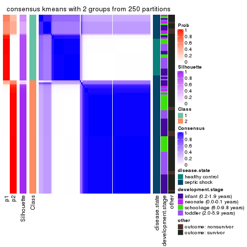</p>

</div>
<div id='tab-SD-kmeans-consensus-heatmap-2'>
<pre><code class="r">consensus_heatmap(res, k = 3)
</code></pre>

<p>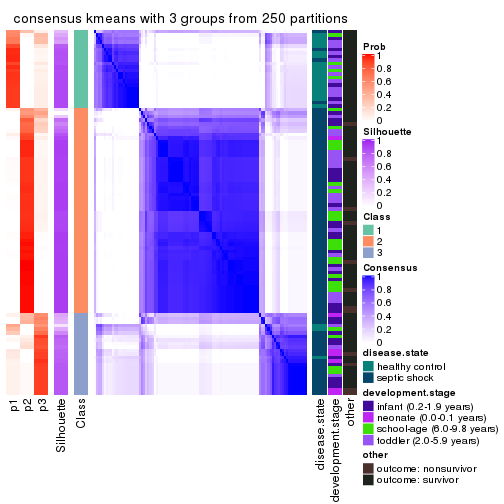</p>

</div>
<div id='tab-SD-kmeans-consensus-heatmap-3'>
<pre><code class="r">consensus_heatmap(res, k = 4)
</code></pre>

<p>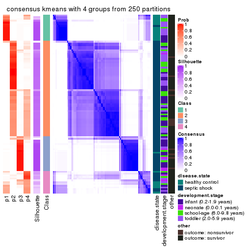</p>

</div>
<div id='tab-SD-kmeans-consensus-heatmap-4'>
<pre><code class="r">consensus_heatmap(res, k = 5)
</code></pre>

<p>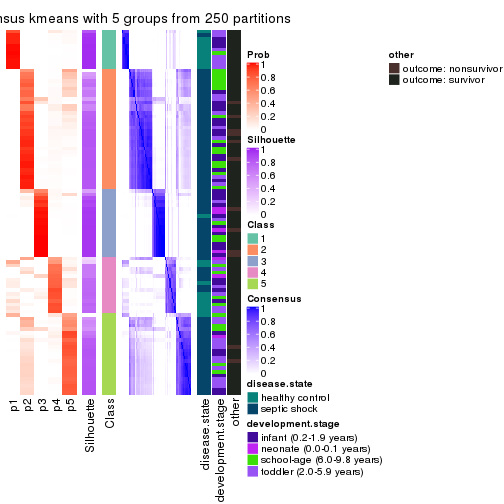</p>

</div>
<div id='tab-SD-kmeans-consensus-heatmap-5'>
<pre><code class="r">consensus_heatmap(res, k = 6)
</code></pre>

<p>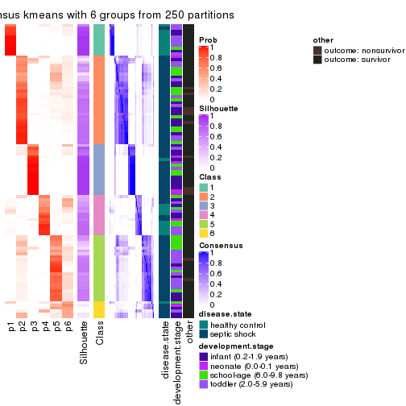</p>

</div>
</div>

Heatmaps for the membership of samples in all partitions to see how consistent they are:


<script>
$( function() {
	$( '#tabs-SD-kmeans-membership-heatmap' ).tabs();
} );
</script>
<div id='tabs-SD-kmeans-membership-heatmap'>
<ul>
<li><a href='#tab-SD-kmeans-membership-heatmap-1'>k = 2</a></li>
<li><a href='#tab-SD-kmeans-membership-heatmap-2'>k = 3</a></li>
<li><a href='#tab-SD-kmeans-membership-heatmap-3'>k = 4</a></li>
<li><a href='#tab-SD-kmeans-membership-heatmap-4'>k = 5</a></li>
<li><a href='#tab-SD-kmeans-membership-heatmap-5'>k = 6</a></li>
</ul>
<div id='tab-SD-kmeans-membership-heatmap-1'>
<pre><code class="r">membership_heatmap(res, k = 2)
</code></pre>

<p>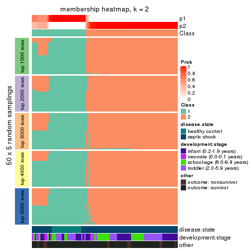</p>

</div>
<div id='tab-SD-kmeans-membership-heatmap-2'>
<pre><code class="r">membership_heatmap(res, k = 3)
</code></pre>

<p>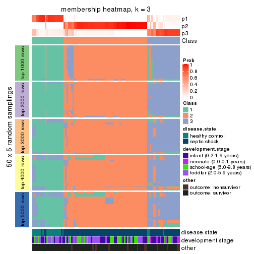</p>

</div>
<div id='tab-SD-kmeans-membership-heatmap-3'>
<pre><code class="r">membership_heatmap(res, k = 4)
</code></pre>

<p>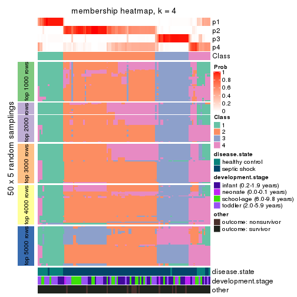</p>

</div>
<div id='tab-SD-kmeans-membership-heatmap-4'>
<pre><code class="r">membership_heatmap(res, k = 5)
</code></pre>

<p>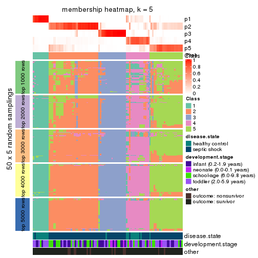</p>

</div>
<div id='tab-SD-kmeans-membership-heatmap-5'>
<pre><code class="r">membership_heatmap(res, k = 6)
</code></pre>

<p>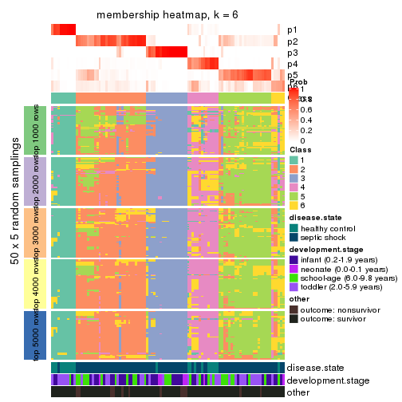</p>

</div>
</div>

As soon as we have had the classes for columns, we can look for signatures
which are significantly different between classes which can be candidate marks
for certain classes. Following are the heatmaps for signatures.


Signature heatmaps where rows are scaled:


<script>
$( function() {
	$( '#tabs-SD-kmeans-get-signatures' ).tabs();
} );
</script>
<div id='tabs-SD-kmeans-get-signatures'>
<ul>
<li><a href='#tab-SD-kmeans-get-signatures-1'>k = 2</a></li>
<li><a href='#tab-SD-kmeans-get-signatures-2'>k = 3</a></li>
<li><a href='#tab-SD-kmeans-get-signatures-3'>k = 4</a></li>
<li><a href='#tab-SD-kmeans-get-signatures-4'>k = 5</a></li>
<li><a href='#tab-SD-kmeans-get-signatures-5'>k = 6</a></li>
</ul>
<div id='tab-SD-kmeans-get-signatures-1'>
<pre><code class="r">get_signatures(res, k = 2)
</code></pre>

<p>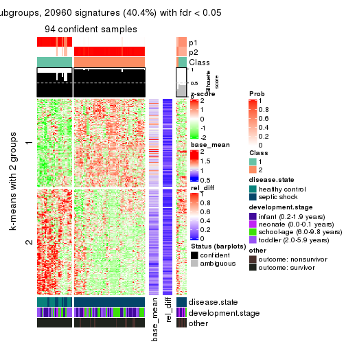</p>

</div>
<div id='tab-SD-kmeans-get-signatures-2'>
<pre><code class="r">get_signatures(res, k = 3)
</code></pre>

<p>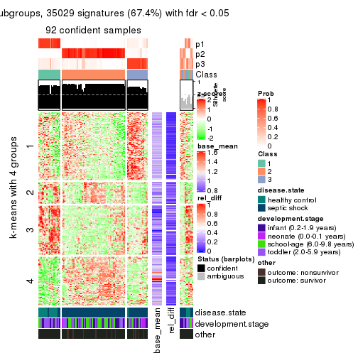</p>

</div>
<div id='tab-SD-kmeans-get-signatures-3'>
<pre><code class="r">get_signatures(res, k = 4)
</code></pre>

<p>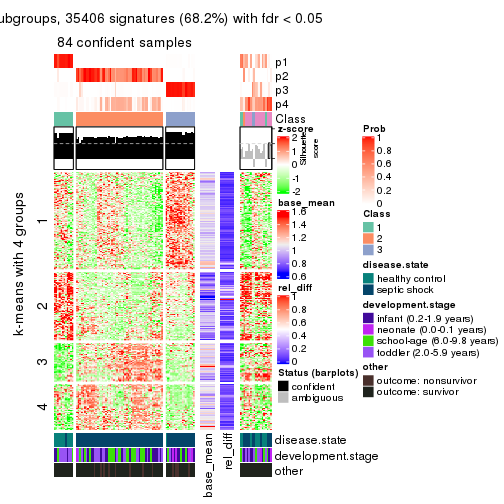</p>

</div>
<div id='tab-SD-kmeans-get-signatures-4'>
<pre><code class="r">get_signatures(res, k = 5)
</code></pre>

<p>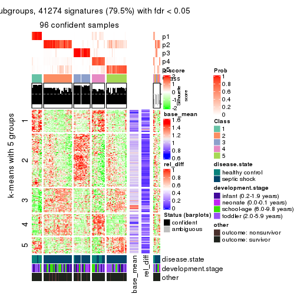</p>

</div>
<div id='tab-SD-kmeans-get-signatures-5'>
<pre><code class="r">get_signatures(res, k = 6)
</code></pre>

<p>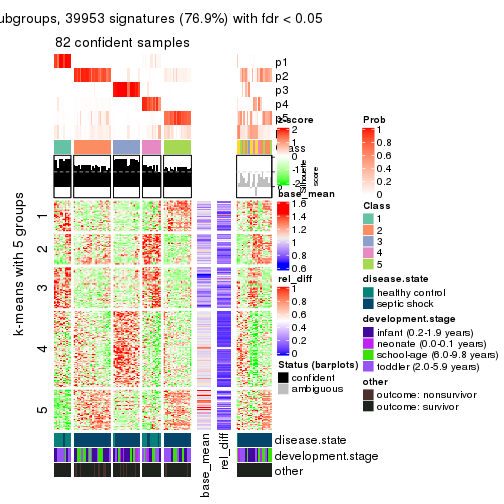</p>

</div>
</div>


Signature heatmaps where rows are not scaled:


<script>
$( function() {
	$( '#tabs-SD-kmeans-get-signatures-no-scale' ).tabs();
} );
</script>
<div id='tabs-SD-kmeans-get-signatures-no-scale'>
<ul>
<li><a href='#tab-SD-kmeans-get-signatures-no-scale-1'>k = 2</a></li>
<li><a href='#tab-SD-kmeans-get-signatures-no-scale-2'>k = 3</a></li>
<li><a href='#tab-SD-kmeans-get-signatures-no-scale-3'>k = 4</a></li>
<li><a href='#tab-SD-kmeans-get-signatures-no-scale-4'>k = 5</a></li>
<li><a href='#tab-SD-kmeans-get-signatures-no-scale-5'>k = 6</a></li>
</ul>
<div id='tab-SD-kmeans-get-signatures-no-scale-1'>
<pre><code class="r">get_signatures(res, k = 2, scale_rows = FALSE)
</code></pre>

<p>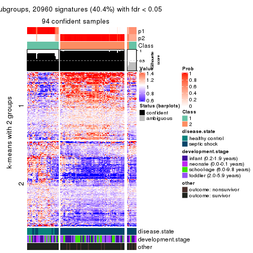</p>

</div>
<div id='tab-SD-kmeans-get-signatures-no-scale-2'>
<pre><code class="r">get_signatures(res, k = 3, scale_rows = FALSE)
</code></pre>

<p>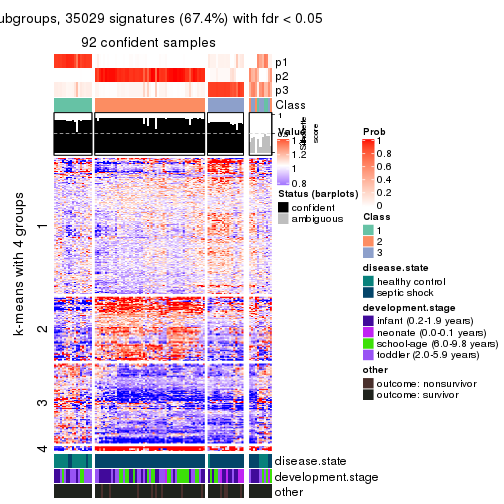</p>

</div>
<div id='tab-SD-kmeans-get-signatures-no-scale-3'>
<pre><code class="r">get_signatures(res, k = 4, scale_rows = FALSE)
</code></pre>

<pre><code>#&gt; Error in mat[ceiling(1:nr/h_ratio), ceiling(1:nc/w_ratio), drop = FALSE]: subscript out of bounds
</code></pre>

<p></p>

</div>
<div id='tab-SD-kmeans-get-signatures-no-scale-4'>
<pre><code class="r">get_signatures(res, k = 5, scale_rows = FALSE)
</code></pre>

<p>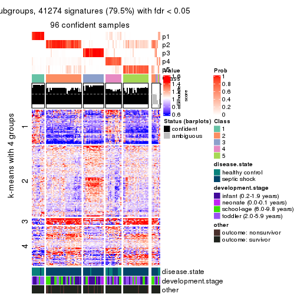</p>

</div>
<div id='tab-SD-kmeans-get-signatures-no-scale-5'>
<pre><code class="r">get_signatures(res, k = 6, scale_rows = FALSE)
</code></pre>

<p>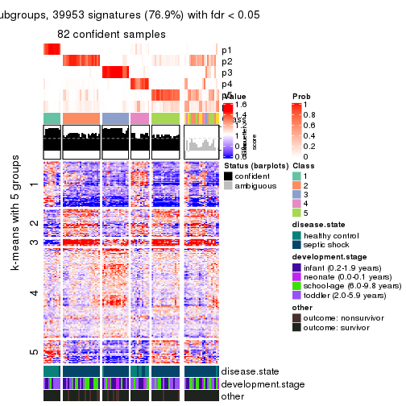</p>

</div>
</div>


Compare the overlap of signatures from different k:

```r
compare_signatures(res)
```

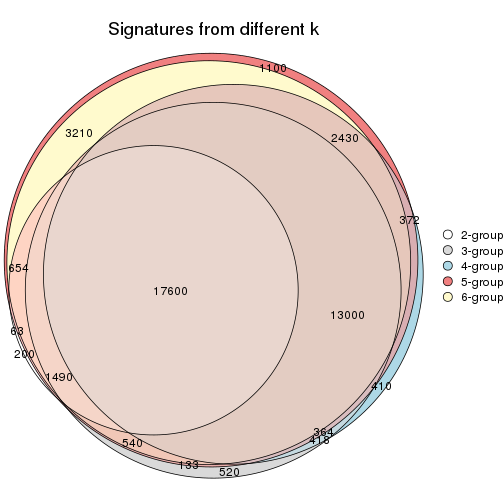

`get_signature()` returns a data frame invisibly. TO get the list of signatures, the function
call should be assigned to a variable explicitly. In following code, if `plot` argument is set
to `FALSE`, no heatmap is plotted while only the differential analysis is performed.

```r
# code only for demonstration
tb = get_signature(res, k = ..., plot = FALSE)
```

An example of the output of `tb` is:

```
#>   which_row         fdr    mean_1    mean_2 scaled_mean_1 scaled_mean_2 km
#> 1        38 0.042760348  8.373488  9.131774    -0.5533452     0.5164555  1
#> 2        40 0.018707592  7.106213  8.469186    -0.6173731     0.5762149  1
#> 3        55 0.019134737 10.221463 11.207825    -0.6159697     0.5749050  1
#> 4        59 0.006059896  5.921854  7.869574    -0.6899429     0.6439467  1
#> 5        60 0.018055526  8.928898 10.211722    -0.6204761     0.5791110  1
#> 6        98 0.009384629 15.714769 14.887706     0.6635654    -0.6193277  2
...
```

The columns in `tb` are:

1. `which_row`: row indices corresponding to the input matrix.
2. `fdr`: FDR for the differential test. 
3. `mean_x`: The mean value in group x.
4. `scaled_mean_x`: The mean value in group x after rows are scaled.
5. `km`: Row groups if k-means clustering is applied to rows.


UMAP plot which shows how samples are separated.


<script>
$( function() {
	$( '#tabs-SD-kmeans-dimension-reduction' ).tabs();
} );
</script>
<div id='tabs-SD-kmeans-dimension-reduction'>
<ul>
<li><a href='#tab-SD-kmeans-dimension-reduction-1'>k = 2</a></li>
<li><a href='#tab-SD-kmeans-dimension-reduction-2'>k = 3</a></li>
<li><a href='#tab-SD-kmeans-dimension-reduction-3'>k = 4</a></li>
<li><a href='#tab-SD-kmeans-dimension-reduction-4'>k = 5</a></li>
<li><a href='#tab-SD-kmeans-dimension-reduction-5'>k = 6</a></li>
</ul>
<div id='tab-SD-kmeans-dimension-reduction-1'>
<pre><code class="r">dimension_reduction(res, k = 2, method = &quot;UMAP&quot;)
</code></pre>

<p>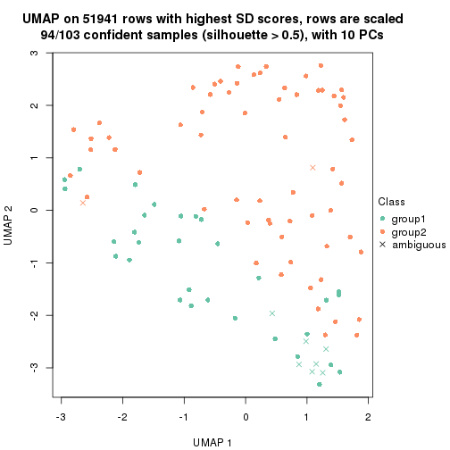</p>

</div>
<div id='tab-SD-kmeans-dimension-reduction-2'>
<pre><code class="r">dimension_reduction(res, k = 3, method = &quot;UMAP&quot;)
</code></pre>

<p>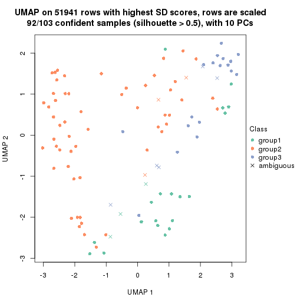</p>

</div>
<div id='tab-SD-kmeans-dimension-reduction-3'>
<pre><code class="r">dimension_reduction(res, k = 4, method = &quot;UMAP&quot;)
</code></pre>

<p>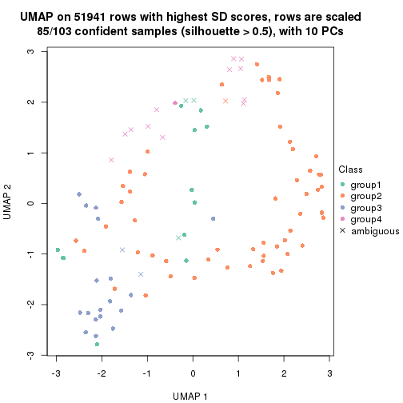</p>

</div>
<div id='tab-SD-kmeans-dimension-reduction-4'>
<pre><code class="r">dimension_reduction(res, k = 5, method = &quot;UMAP&quot;)
</code></pre>

<p>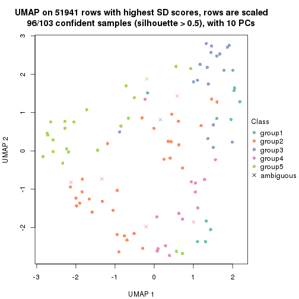</p>

</div>
<div id='tab-SD-kmeans-dimension-reduction-5'>
<pre><code class="r">dimension_reduction(res, k = 6, method = &quot;UMAP&quot;)
</code></pre>

<p>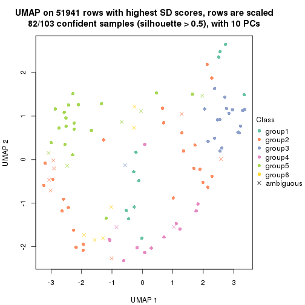</p>

</div>
</div>


Following heatmap shows how subgroups are split when increasing `k`:

```r
collect_classes(res)
```

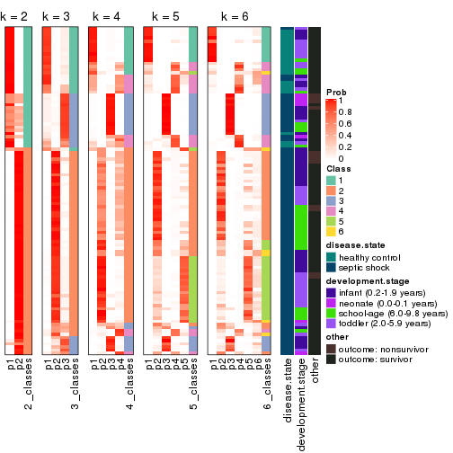


Test correlation between subgroups and known annotations. If the known
annotation is numeric, one-way ANOVA test is applied, and if the known
annotation is discrete, chi-squared contingency table test is applied.

```r
test_to_known_factors(res)
```

```
#>            n disease.state(p) development.stage(p) other(p) k
#> SD:kmeans 94         8.69e-13             0.617422   0.0927 2
#> SD:kmeans 92         1.06e-15             0.000678   0.1167 3
#> SD:kmeans 85         5.07e-15             0.013378   0.3715 4
#> SD:kmeans 96         7.75e-13             0.009664   0.1531 5
#> SD:kmeans 82         3.25e-12             0.016027   0.1226 6
```


If matrix rows can be associated to genes, consider to use `functional_enrichment(res,
...)` to perform function enrichment for the signature genes. See [this vignette](http://bioconductor.org/packages/devel/bioc/vignettes/cola/inst/doc/functional_enrichment.html) for more detailed explanations.


 

---------------------------------------------------


### SD:skmeans**


The object with results only for a single top-value method and a single partition method 
can be extracted as:

```r
res = res_list["SD", "skmeans"]
# you can also extract it by
# res = res_list["SD:skmeans"]
```

A summary of `res` and all the functions that can be applied to it:

```r
res
```

```
#> A 'ConsensusPartition' object with k = 2, 3, 4, 5, 6.
#>   On a matrix with 51941 rows and 103 columns.
#>   Top rows (1000, 2000, 3000, 4000, 5000) are extracted by 'SD' method.
#>   Subgroups are detected by 'skmeans' method.
#>   Performed in total 1250 partitions by row resampling.
#>   Best k for subgroups seems to be 2.
#> 
#> Following methods can be applied to this 'ConsensusPartition' object:
#>  [1] "cola_report"             "collect_classes"         "collect_plots"          
#>  [4] "collect_stats"           "colnames"                "compare_signatures"     
#>  [7] "consensus_heatmap"       "dimension_reduction"     "functional_enrichment"  
#> [10] "get_anno_col"            "get_anno"                "get_classes"            
#> [13] "get_consensus"           "get_matrix"              "get_membership"         
#> [16] "get_param"               "get_signatures"          "get_stats"              
#> [19] "is_best_k"               "is_stable_k"             "membership_heatmap"     
#> [22] "ncol"                    "nrow"                    "plot_ecdf"              
#> [25] "rownames"                "select_partition_number" "show"                   
#> [28] "suggest_best_k"          "test_to_known_factors"
```

`collect_plots()` function collects all the plots made from `res` for all `k` (number of partitions)
into one single page to provide an easy and fast comparison between different `k`.

```r
collect_plots(res)
```

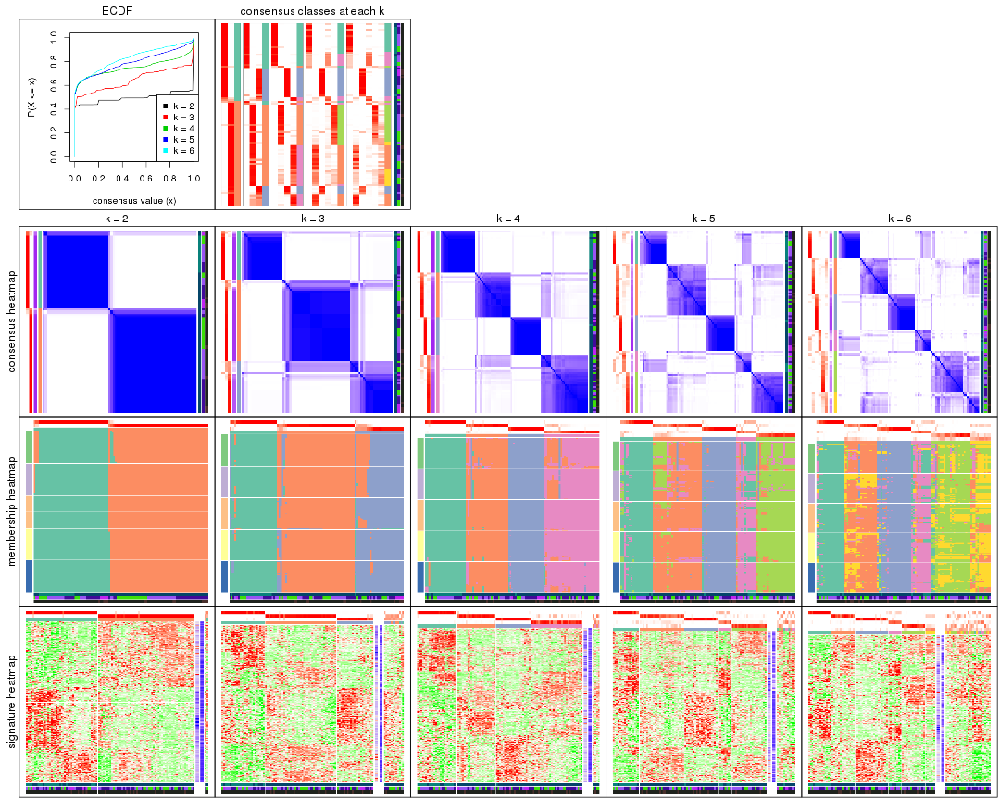

The plots are:

- The first row: a plot of the ECDF (empirical cumulative distribution
  function) curves of the consensus matrix for each `k` and the heatmap of
  predicted classes for each `k`.
- The second row: heatmaps of the consensus matrix for each `k`.
- The third row: heatmaps of the membership matrix for each `k`.
- The fouth row: heatmaps of the signatures for each `k`.

All the plots in panels can be made by individual functions and they are
plotted later in this section.

`select_partition_number()` produces several plots showing different
statistics for choosing "optimized" `k`. There are following statistics:

- ECDF curves of the consensus matrix for each `k`;
- 1-PAC. [The PAC
  score](https://en.wikipedia.org/wiki/Consensus_clustering#Over-interpretation_potential_of_consensus_clustering)
  measures the proportion of the ambiguous subgrouping.
- Mean silhouette score.
- Concordance. The mean probability of fiting the consensus class ids in all
  partitions.
- Area increased. Denote $A_k$ as the area under the ECDF curve for current
  `k`, the area increased is defined as $A_k - A_{k-1}$.
- Rand index. The percent of pairs of samples that are both in a same cluster
  or both are not in a same cluster in the partition of k and k-1.
- Jaccard index. The ratio of pairs of samples are both in a same cluster in
  the partition of k and k-1 and the pairs of samples are both in a same
  cluster in the partition k or k-1.

The detailed explanations of these statistics can be found in [the _cola_
vignette](http://bioconductor.org/packages/devel/bioc/vignettes/cola/inst/doc/cola.html#toc_13).

Generally speaking, lower PAC score, higher mean silhouette score or higher
concordance corresponds to better partition. Rand index and Jaccard index
measure how similar the current partition is compared to partition with `k-1`.
If they are too similar, we won't accept `k` is better than `k-1`.

```r
select_partition_number(res)
```

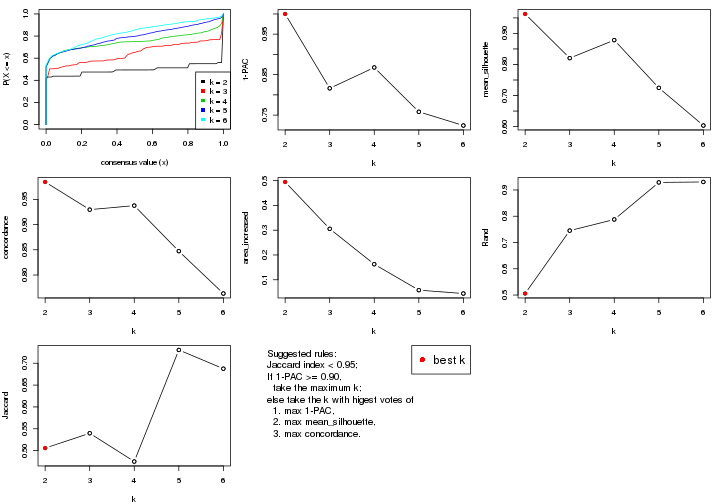

The numeric values for all these statistics can be obtained by `get_stats()`.

```r
get_stats(res)
```

```
#>   k 1-PAC mean_silhouette concordance area_increased  Rand Jaccard
#> 2 2 1.000           0.963       0.984         0.4946 0.506   0.506
#> 3 3 0.816           0.820       0.930         0.3056 0.745   0.540
#> 4 4 0.868           0.878       0.938         0.1627 0.788   0.475
#> 5 5 0.758           0.725       0.847         0.0581 0.929   0.730
#> 6 6 0.724           0.603       0.763         0.0445 0.931   0.688
```

`suggest_best_k()` suggests the best $k$ based on these statistics. The rules are as follows:

- All $k$ with Jaccard index larger than 0.95 are removed because increasing
  $k$ does not provide enough extra information. If all $k$ are removed, it is
  marked as no subgroup is detected.
- For all $k$ with 1-PAC score larger than 0.9, the maximal $k$ is taken as
  the best $k$, and other $k$ are marked as optional $k$.
- If it does not fit the second rule. The $k$ with the maximal vote of the
  highest 1-PAC score, highest mean silhouette, and highest concordance is
  taken as the best $k$.

```r
suggest_best_k(res)
```

```
#> [1] 2
```


Following shows the table of the partitions (You need to click the **show/hide
code output** link to see it). The membership matrix (columns with name `p*`)
is inferred by
[`clue::cl_consensus()`](https://www.rdocumentation.org/link/cl_consensus?package=clue)
function with the `SE` method. Basically the value in the membership matrix
represents the probability to belong to a certain group. The finall class
label for an item is determined with the group with highest probability it
belongs to.

In `get_classes()` function, the entropy is calculated from the membership
matrix and the silhouette score is calculated from the consensus matrix.


<script>
$( function() {
	$( '#tabs-SD-skmeans-get-classes' ).tabs();
} );
</script>
<div id='tabs-SD-skmeans-get-classes'>
<ul>
<li><a href='#tab-SD-skmeans-get-classes-1'>k = 2</a></li>
<li><a href='#tab-SD-skmeans-get-classes-2'>k = 3</a></li>
<li><a href='#tab-SD-skmeans-get-classes-3'>k = 4</a></li>
<li><a href='#tab-SD-skmeans-get-classes-4'>k = 5</a></li>
<li><a href='#tab-SD-skmeans-get-classes-5'>k = 6</a></li>
</ul>

<div id='tab-SD-skmeans-get-classes-1'>
<p><a id='tab-SD-skmeans-get-classes-1-a' style='color:#0366d6' href='#'>show/hide code output</a></p>
<pre><code class="r">cbind(get_classes(res, k = 2), get_membership(res, k = 2))
</code></pre>

<pre><code>#&gt;           class entropy silhouette    p1    p2
#&gt; GSM647569     1  0.0000      0.981 1.000 0.000
#&gt; GSM647574     1  0.0000      0.981 1.000 0.000
#&gt; GSM647577     1  0.0000      0.981 1.000 0.000
#&gt; GSM647547     1  0.0000      0.981 1.000 0.000
#&gt; GSM647552     1  0.7219      0.751 0.800 0.200
#&gt; GSM647553     1  0.0000      0.981 1.000 0.000
#&gt; GSM647565     1  0.7219      0.751 0.800 0.200
#&gt; GSM647545     2  0.0000      0.985 0.000 1.000
#&gt; GSM647549     2  0.0000      0.985 0.000 1.000
#&gt; GSM647550     2  0.0000      0.985 0.000 1.000
#&gt; GSM647560     2  0.0000      0.985 0.000 1.000
#&gt; GSM647617     1  0.0000      0.981 1.000 0.000
#&gt; GSM647528     2  0.0000      0.985 0.000 1.000
#&gt; GSM647529     1  0.0000      0.981 1.000 0.000
#&gt; GSM647531     2  0.0000      0.985 0.000 1.000
#&gt; GSM647540     2  0.0672      0.978 0.008 0.992
#&gt; GSM647541     2  0.0000      0.985 0.000 1.000
#&gt; GSM647546     1  0.0000      0.981 1.000 0.000
#&gt; GSM647557     2  0.0000      0.985 0.000 1.000
#&gt; GSM647561     2  0.0000      0.985 0.000 1.000
#&gt; GSM647567     1  0.0000      0.981 1.000 0.000
#&gt; GSM647568     2  0.0000      0.985 0.000 1.000
#&gt; GSM647570     2  0.0000      0.985 0.000 1.000
#&gt; GSM647573     1  0.0000      0.981 1.000 0.000
#&gt; GSM647576     2  0.0000      0.985 0.000 1.000
#&gt; GSM647579     2  0.2423      0.947 0.040 0.960
#&gt; GSM647580     1  0.0000      0.981 1.000 0.000
#&gt; GSM647583     1  0.0000      0.981 1.000 0.000
#&gt; GSM647592     2  0.0000      0.985 0.000 1.000
#&gt; GSM647593     2  0.0000      0.985 0.000 1.000
#&gt; GSM647595     2  0.0000      0.985 0.000 1.000
#&gt; GSM647597     2  0.9552      0.376 0.376 0.624
#&gt; GSM647598     2  0.0000      0.985 0.000 1.000
#&gt; GSM647613     2  0.0000      0.985 0.000 1.000
#&gt; GSM647615     2  0.0000      0.985 0.000 1.000
#&gt; GSM647616     1  0.0000      0.981 1.000 0.000
#&gt; GSM647619     2  0.0000      0.985 0.000 1.000
#&gt; GSM647582     2  0.0000      0.985 0.000 1.000
#&gt; GSM647591     2  0.0000      0.985 0.000 1.000
#&gt; GSM647527     2  0.0000      0.985 0.000 1.000
#&gt; GSM647530     2  0.0000      0.985 0.000 1.000
#&gt; GSM647532     1  0.0000      0.981 1.000 0.000
#&gt; GSM647544     2  0.0000      0.985 0.000 1.000
#&gt; GSM647551     2  0.0000      0.985 0.000 1.000
#&gt; GSM647556     1  0.0000      0.981 1.000 0.000
#&gt; GSM647558     2  0.0000      0.985 0.000 1.000
#&gt; GSM647572     1  0.0000      0.981 1.000 0.000
#&gt; GSM647578     2  0.7056      0.761 0.192 0.808
#&gt; GSM647581     2  0.0000      0.985 0.000 1.000
#&gt; GSM647594     2  0.0000      0.985 0.000 1.000
#&gt; GSM647599     1  0.0000      0.981 1.000 0.000
#&gt; GSM647600     2  0.0000      0.985 0.000 1.000
#&gt; GSM647601     2  0.0000      0.985 0.000 1.000
#&gt; GSM647603     2  0.0000      0.985 0.000 1.000
#&gt; GSM647610     2  0.7219      0.749 0.200 0.800
#&gt; GSM647611     2  0.0000      0.985 0.000 1.000
#&gt; GSM647612     2  0.0000      0.985 0.000 1.000
#&gt; GSM647614     2  0.0000      0.985 0.000 1.000
#&gt; GSM647618     2  0.0000      0.985 0.000 1.000
#&gt; GSM647629     2  0.0000      0.985 0.000 1.000
#&gt; GSM647535     2  0.0000      0.985 0.000 1.000
#&gt; GSM647563     2  0.0000      0.985 0.000 1.000
#&gt; GSM647542     2  0.0000      0.985 0.000 1.000
#&gt; GSM647543     2  0.0000      0.985 0.000 1.000
#&gt; GSM647548     1  0.9608      0.389 0.616 0.384
#&gt; GSM647554     2  0.0000      0.985 0.000 1.000
#&gt; GSM647555     2  0.0000      0.985 0.000 1.000
#&gt; GSM647559     2  0.0000      0.985 0.000 1.000
#&gt; GSM647562     2  0.0000      0.985 0.000 1.000
#&gt; GSM647564     1  0.0000      0.981 1.000 0.000
#&gt; GSM647571     2  0.0000      0.985 0.000 1.000
#&gt; GSM647584     2  0.0000      0.985 0.000 1.000
#&gt; GSM647585     1  0.0000      0.981 1.000 0.000
#&gt; GSM647586     2  0.0000      0.985 0.000 1.000
#&gt; GSM647587     2  0.0000      0.985 0.000 1.000
#&gt; GSM647588     2  0.0000      0.985 0.000 1.000
#&gt; GSM647596     2  0.0000      0.985 0.000 1.000
#&gt; GSM647602     1  0.0000      0.981 1.000 0.000
#&gt; GSM647609     2  0.0000      0.985 0.000 1.000
#&gt; GSM647620     2  0.0000      0.985 0.000 1.000
#&gt; GSM647627     2  0.0000      0.985 0.000 1.000
#&gt; GSM647628     2  0.0000      0.985 0.000 1.000
#&gt; GSM647533     1  0.0000      0.981 1.000 0.000
#&gt; GSM647536     1  0.0000      0.981 1.000 0.000
#&gt; GSM647537     1  0.0000      0.981 1.000 0.000
#&gt; GSM647606     1  0.0000      0.981 1.000 0.000
#&gt; GSM647621     1  0.0000      0.981 1.000 0.000
#&gt; GSM647626     1  0.0000      0.981 1.000 0.000
#&gt; GSM647538     1  0.0000      0.981 1.000 0.000
#&gt; GSM647575     1  0.0000      0.981 1.000 0.000
#&gt; GSM647590     1  0.0000      0.981 1.000 0.000
#&gt; GSM647605     1  0.0000      0.981 1.000 0.000
#&gt; GSM647607     1  0.0000      0.981 1.000 0.000
#&gt; GSM647608     1  0.0000      0.981 1.000 0.000
#&gt; GSM647622     1  0.0000      0.981 1.000 0.000
#&gt; GSM647623     1  0.0000      0.981 1.000 0.000
#&gt; GSM647624     1  0.0000      0.981 1.000 0.000
#&gt; GSM647625     1  0.0000      0.981 1.000 0.000
#&gt; GSM647534     1  0.0000      0.981 1.000 0.000
#&gt; GSM647539     1  0.0000      0.981 1.000 0.000
#&gt; GSM647566     1  0.0000      0.981 1.000 0.000
#&gt; GSM647589     1  0.0000      0.981 1.000 0.000
#&gt; GSM647604     1  0.0000      0.981 1.000 0.000
</code></pre>

<script>
$('#tab-SD-skmeans-get-classes-1-a').parent().next().next().hide();
$('#tab-SD-skmeans-get-classes-1-a').click(function(){
  $('#tab-SD-skmeans-get-classes-1-a').parent().next().next().toggle();
  return(false);
});
</script>
</div>

<div id='tab-SD-skmeans-get-classes-2'>
<p><a id='tab-SD-skmeans-get-classes-2-a' style='color:#0366d6' href='#'>show/hide code output</a></p>
<pre><code class="r">cbind(get_classes(res, k = 3), get_membership(res, k = 3))
</code></pre>

<pre><code>#&gt;           class entropy silhouette    p1    p2    p3
#&gt; GSM647569     3  0.0592     0.8254 0.012 0.000 0.988
#&gt; GSM647574     3  0.0592     0.8254 0.012 0.000 0.988
#&gt; GSM647577     3  0.0592     0.8254 0.012 0.000 0.988
#&gt; GSM647547     3  0.0592     0.8254 0.012 0.000 0.988
#&gt; GSM647552     1  0.0592     0.9453 0.988 0.012 0.000
#&gt; GSM647553     3  0.0592     0.8254 0.012 0.000 0.988
#&gt; GSM647565     3  0.4178     0.7216 0.000 0.172 0.828
#&gt; GSM647545     2  0.0592     0.9411 0.000 0.988 0.012
#&gt; GSM647549     2  0.0592     0.9411 0.000 0.988 0.012
#&gt; GSM647550     3  0.4235     0.6994 0.000 0.176 0.824
#&gt; GSM647560     3  0.6286     0.2373 0.000 0.464 0.536
#&gt; GSM647617     3  0.0592     0.8254 0.012 0.000 0.988
#&gt; GSM647528     2  0.0237     0.9435 0.000 0.996 0.004
#&gt; GSM647529     1  0.0000     0.9553 1.000 0.000 0.000
#&gt; GSM647531     2  0.0237     0.9435 0.000 0.996 0.004
#&gt; GSM647540     3  0.0000     0.8233 0.000 0.000 1.000
#&gt; GSM647541     2  0.0592     0.9411 0.000 0.988 0.012
#&gt; GSM647546     3  0.0237     0.8244 0.004 0.000 0.996
#&gt; GSM647557     2  0.0237     0.9435 0.000 0.996 0.004
#&gt; GSM647561     2  0.0237     0.9435 0.000 0.996 0.004
#&gt; GSM647567     1  0.6308     0.1127 0.508 0.000 0.492
#&gt; GSM647568     3  0.5016     0.6480 0.000 0.240 0.760
#&gt; GSM647570     2  0.0592     0.9411 0.000 0.988 0.012
#&gt; GSM647573     1  0.3619     0.8144 0.864 0.000 0.136
#&gt; GSM647576     3  0.0000     0.8233 0.000 0.000 1.000
#&gt; GSM647579     3  0.0237     0.8237 0.000 0.004 0.996
#&gt; GSM647580     3  0.0592     0.8254 0.012 0.000 0.988
#&gt; GSM647583     3  0.0592     0.8254 0.012 0.000 0.988
#&gt; GSM647592     2  0.0000     0.9435 0.000 1.000 0.000
#&gt; GSM647593     2  0.0000     0.9435 0.000 1.000 0.000
#&gt; GSM647595     2  0.0000     0.9435 0.000 1.000 0.000
#&gt; GSM647597     1  0.0592     0.9453 0.988 0.012 0.000
#&gt; GSM647598     2  0.0000     0.9435 0.000 1.000 0.000
#&gt; GSM647613     2  0.0237     0.9435 0.000 0.996 0.004
#&gt; GSM647615     3  0.6302     0.1867 0.000 0.480 0.520
#&gt; GSM647616     3  0.0592     0.8254 0.012 0.000 0.988
#&gt; GSM647619     2  0.0000     0.9435 0.000 1.000 0.000
#&gt; GSM647582     2  0.0000     0.9435 0.000 1.000 0.000
#&gt; GSM647591     2  0.0000     0.9435 0.000 1.000 0.000
#&gt; GSM647527     2  0.0237     0.9435 0.000 0.996 0.004
#&gt; GSM647530     1  0.6180     0.4799 0.660 0.332 0.008
#&gt; GSM647532     1  0.0000     0.9553 1.000 0.000 0.000
#&gt; GSM647544     2  0.0592     0.9411 0.000 0.988 0.012
#&gt; GSM647551     2  0.0000     0.9435 0.000 1.000 0.000
#&gt; GSM647556     3  0.0592     0.8254 0.012 0.000 0.988
#&gt; GSM647558     2  0.0592     0.9411 0.000 0.988 0.012
#&gt; GSM647572     3  0.0237     0.8244 0.004 0.000 0.996
#&gt; GSM647578     3  0.2356     0.7862 0.000 0.072 0.928
#&gt; GSM647581     2  0.0592     0.9411 0.000 0.988 0.012
#&gt; GSM647594     2  0.0000     0.9435 0.000 1.000 0.000
#&gt; GSM647599     1  0.0000     0.9553 1.000 0.000 0.000
#&gt; GSM647600     2  0.0000     0.9435 0.000 1.000 0.000
#&gt; GSM647601     2  0.0000     0.9435 0.000 1.000 0.000
#&gt; GSM647603     2  0.3551     0.8009 0.000 0.868 0.132
#&gt; GSM647610     2  0.7129     0.5744 0.104 0.716 0.180
#&gt; GSM647611     2  0.0000     0.9435 0.000 1.000 0.000
#&gt; GSM647612     2  0.5058     0.6136 0.000 0.756 0.244
#&gt; GSM647614     2  0.6286    -0.0252 0.000 0.536 0.464
#&gt; GSM647618     2  0.0000     0.9435 0.000 1.000 0.000
#&gt; GSM647629     2  0.0000     0.9435 0.000 1.000 0.000
#&gt; GSM647535     2  0.0592     0.9411 0.000 0.988 0.012
#&gt; GSM647563     2  0.0592     0.9411 0.000 0.988 0.012
#&gt; GSM647542     3  0.6260     0.2831 0.000 0.448 0.552
#&gt; GSM647543     3  0.6260     0.2831 0.000 0.448 0.552
#&gt; GSM647548     3  0.7932     0.3741 0.064 0.384 0.552
#&gt; GSM647554     2  0.6126     0.2458 0.000 0.600 0.400
#&gt; GSM647555     2  0.6252     0.0477 0.000 0.556 0.444
#&gt; GSM647559     2  0.0592     0.9411 0.000 0.988 0.012
#&gt; GSM647562     2  0.0424     0.9424 0.000 0.992 0.008
#&gt; GSM647564     3  0.0592     0.8254 0.012 0.000 0.988
#&gt; GSM647571     3  0.6267     0.2723 0.000 0.452 0.548
#&gt; GSM647584     2  0.0000     0.9435 0.000 1.000 0.000
#&gt; GSM647585     3  0.0592     0.8254 0.012 0.000 0.988
#&gt; GSM647586     2  0.0237     0.9435 0.000 0.996 0.004
#&gt; GSM647587     2  0.0237     0.9435 0.000 0.996 0.004
#&gt; GSM647588     2  0.0592     0.9411 0.000 0.988 0.012
#&gt; GSM647596     2  0.0000     0.9435 0.000 1.000 0.000
#&gt; GSM647602     3  0.0592     0.8254 0.012 0.000 0.988
#&gt; GSM647609     2  0.0000     0.9435 0.000 1.000 0.000
#&gt; GSM647620     2  0.0000     0.9435 0.000 1.000 0.000
#&gt; GSM647627     2  0.0000     0.9435 0.000 1.000 0.000
#&gt; GSM647628     2  0.0592     0.9411 0.000 0.988 0.012
#&gt; GSM647533     1  0.0000     0.9553 1.000 0.000 0.000
#&gt; GSM647536     1  0.0000     0.9553 1.000 0.000 0.000
#&gt; GSM647537     1  0.0000     0.9553 1.000 0.000 0.000
#&gt; GSM647606     1  0.0000     0.9553 1.000 0.000 0.000
#&gt; GSM647621     1  0.0000     0.9553 1.000 0.000 0.000
#&gt; GSM647626     3  0.6260     0.0150 0.448 0.000 0.552
#&gt; GSM647538     1  0.0000     0.9553 1.000 0.000 0.000
#&gt; GSM647575     1  0.0000     0.9553 1.000 0.000 0.000
#&gt; GSM647590     1  0.0000     0.9553 1.000 0.000 0.000
#&gt; GSM647605     1  0.0000     0.9553 1.000 0.000 0.000
#&gt; GSM647607     1  0.0000     0.9553 1.000 0.000 0.000
#&gt; GSM647608     1  0.0000     0.9553 1.000 0.000 0.000
#&gt; GSM647622     1  0.0000     0.9553 1.000 0.000 0.000
#&gt; GSM647623     1  0.0000     0.9553 1.000 0.000 0.000
#&gt; GSM647624     1  0.0000     0.9553 1.000 0.000 0.000
#&gt; GSM647625     1  0.0000     0.9553 1.000 0.000 0.000
#&gt; GSM647534     1  0.0237     0.9522 0.996 0.004 0.000
#&gt; GSM647539     1  0.0000     0.9553 1.000 0.000 0.000
#&gt; GSM647566     1  0.0000     0.9553 1.000 0.000 0.000
#&gt; GSM647589     1  0.2711     0.8716 0.912 0.000 0.088
#&gt; GSM647604     1  0.0000     0.9553 1.000 0.000 0.000
</code></pre>

<script>
$('#tab-SD-skmeans-get-classes-2-a').parent().next().next().hide();
$('#tab-SD-skmeans-get-classes-2-a').click(function(){
  $('#tab-SD-skmeans-get-classes-2-a').parent().next().next().toggle();
  return(false);
});
</script>
</div>

<div id='tab-SD-skmeans-get-classes-3'>
<p><a id='tab-SD-skmeans-get-classes-3-a' style='color:#0366d6' href='#'>show/hide code output</a></p>
<pre><code class="r">cbind(get_classes(res, k = 4), get_membership(res, k = 4))
</code></pre>

<pre><code>#&gt;           class entropy silhouette    p1    p2    p3    p4
#&gt; GSM647569     3  0.0000      0.989 0.000 0.000 1.000 0.000
#&gt; GSM647574     3  0.0000      0.989 0.000 0.000 1.000 0.000
#&gt; GSM647577     3  0.0000      0.989 0.000 0.000 1.000 0.000
#&gt; GSM647547     3  0.0469      0.980 0.000 0.000 0.988 0.012
#&gt; GSM647552     2  0.4535      0.640 0.240 0.744 0.000 0.016
#&gt; GSM647553     3  0.0000      0.989 0.000 0.000 1.000 0.000
#&gt; GSM647565     4  0.0000      0.865 0.000 0.000 0.000 1.000
#&gt; GSM647545     4  0.0592      0.864 0.000 0.016 0.000 0.984
#&gt; GSM647549     4  0.0592      0.862 0.000 0.016 0.000 0.984
#&gt; GSM647550     4  0.4679      0.476 0.000 0.000 0.352 0.648
#&gt; GSM647560     4  0.2300      0.841 0.000 0.016 0.064 0.920
#&gt; GSM647617     3  0.0000      0.989 0.000 0.000 1.000 0.000
#&gt; GSM647528     4  0.4776      0.541 0.000 0.376 0.000 0.624
#&gt; GSM647529     1  0.0336      0.982 0.992 0.008 0.000 0.000
#&gt; GSM647531     4  0.2345      0.835 0.000 0.100 0.000 0.900
#&gt; GSM647540     3  0.0000      0.989 0.000 0.000 1.000 0.000
#&gt; GSM647541     4  0.1637      0.856 0.000 0.060 0.000 0.940
#&gt; GSM647546     3  0.0000      0.989 0.000 0.000 1.000 0.000
#&gt; GSM647557     4  0.3907      0.705 0.000 0.232 0.000 0.768
#&gt; GSM647561     4  0.2408      0.839 0.000 0.104 0.000 0.896
#&gt; GSM647567     3  0.1940      0.918 0.076 0.000 0.924 0.000
#&gt; GSM647568     4  0.0469      0.867 0.000 0.012 0.000 0.988
#&gt; GSM647570     4  0.0592      0.867 0.000 0.016 0.000 0.984
#&gt; GSM647573     1  0.1637      0.932 0.940 0.000 0.000 0.060
#&gt; GSM647576     3  0.0188      0.986 0.000 0.000 0.996 0.004
#&gt; GSM647579     3  0.0000      0.989 0.000 0.000 1.000 0.000
#&gt; GSM647580     3  0.0000      0.989 0.000 0.000 1.000 0.000
#&gt; GSM647583     3  0.0000      0.989 0.000 0.000 1.000 0.000
#&gt; GSM647592     2  0.0000      0.914 0.000 1.000 0.000 0.000
#&gt; GSM647593     2  0.0336      0.915 0.000 0.992 0.000 0.008
#&gt; GSM647595     2  0.0707      0.912 0.000 0.980 0.000 0.020
#&gt; GSM647597     2  0.2401      0.843 0.092 0.904 0.000 0.004
#&gt; GSM647598     2  0.0336      0.915 0.000 0.992 0.000 0.008
#&gt; GSM647613     4  0.2149      0.847 0.000 0.088 0.000 0.912
#&gt; GSM647615     4  0.0188      0.866 0.000 0.004 0.000 0.996
#&gt; GSM647616     3  0.0000      0.989 0.000 0.000 1.000 0.000
#&gt; GSM647619     2  0.0000      0.914 0.000 1.000 0.000 0.000
#&gt; GSM647582     2  0.0000      0.914 0.000 1.000 0.000 0.000
#&gt; GSM647591     2  0.0817      0.910 0.000 0.976 0.000 0.024
#&gt; GSM647527     4  0.4776      0.541 0.000 0.376 0.000 0.624
#&gt; GSM647530     4  0.4875      0.719 0.160 0.068 0.000 0.772
#&gt; GSM647532     1  0.0000      0.988 1.000 0.000 0.000 0.000
#&gt; GSM647544     4  0.4431      0.651 0.000 0.304 0.000 0.696
#&gt; GSM647551     2  0.0336      0.915 0.000 0.992 0.000 0.008
#&gt; GSM647556     3  0.0000      0.989 0.000 0.000 1.000 0.000
#&gt; GSM647558     4  0.0188      0.864 0.000 0.004 0.000 0.996
#&gt; GSM647572     3  0.0000      0.989 0.000 0.000 1.000 0.000
#&gt; GSM647578     3  0.2973      0.870 0.000 0.020 0.884 0.096
#&gt; GSM647581     4  0.0707      0.861 0.000 0.020 0.000 0.980
#&gt; GSM647594     2  0.0707      0.912 0.000 0.980 0.000 0.020
#&gt; GSM647599     1  0.0000      0.988 1.000 0.000 0.000 0.000
#&gt; GSM647600     2  0.0336      0.915 0.000 0.992 0.000 0.008
#&gt; GSM647601     2  0.0336      0.915 0.000 0.992 0.000 0.008
#&gt; GSM647603     2  0.1284      0.903 0.000 0.964 0.012 0.024
#&gt; GSM647610     2  0.1637      0.877 0.000 0.940 0.060 0.000
#&gt; GSM647611     2  0.0592      0.910 0.000 0.984 0.000 0.016
#&gt; GSM647612     4  0.0592      0.867 0.000 0.016 0.000 0.984
#&gt; GSM647614     4  0.0592      0.867 0.000 0.016 0.000 0.984
#&gt; GSM647618     2  0.0592      0.908 0.000 0.984 0.000 0.016
#&gt; GSM647629     2  0.3486      0.750 0.000 0.812 0.000 0.188
#&gt; GSM647535     4  0.4585      0.599 0.000 0.332 0.000 0.668
#&gt; GSM647563     4  0.0592      0.867 0.000 0.016 0.000 0.984
#&gt; GSM647542     4  0.0592      0.867 0.000 0.016 0.000 0.984
#&gt; GSM647543     4  0.0188      0.866 0.000 0.004 0.000 0.996
#&gt; GSM647548     4  0.0336      0.863 0.000 0.008 0.000 0.992
#&gt; GSM647554     2  0.4855      0.314 0.000 0.600 0.400 0.000
#&gt; GSM647555     4  0.0592      0.867 0.000 0.016 0.000 0.984
#&gt; GSM647559     4  0.4761      0.556 0.000 0.372 0.000 0.628
#&gt; GSM647562     4  0.4477      0.642 0.000 0.312 0.000 0.688
#&gt; GSM647564     3  0.0000      0.989 0.000 0.000 1.000 0.000
#&gt; GSM647571     4  0.2973      0.807 0.000 0.144 0.000 0.856
#&gt; GSM647584     2  0.0336      0.915 0.000 0.992 0.000 0.008
#&gt; GSM647585     3  0.0000      0.989 0.000 0.000 1.000 0.000
#&gt; GSM647586     2  0.4697      0.318 0.000 0.644 0.000 0.356
#&gt; GSM647587     4  0.4916      0.448 0.000 0.424 0.000 0.576
#&gt; GSM647588     4  0.1637      0.851 0.000 0.060 0.000 0.940
#&gt; GSM647596     2  0.3486      0.721 0.000 0.812 0.000 0.188
#&gt; GSM647602     3  0.0000      0.989 0.000 0.000 1.000 0.000
#&gt; GSM647609     2  0.0592      0.913 0.000 0.984 0.000 0.016
#&gt; GSM647620     2  0.1022      0.905 0.000 0.968 0.000 0.032
#&gt; GSM647627     2  0.1302      0.897 0.000 0.956 0.000 0.044
#&gt; GSM647628     4  0.0592      0.867 0.000 0.016 0.000 0.984
#&gt; GSM647533     1  0.0000      0.988 1.000 0.000 0.000 0.000
#&gt; GSM647536     1  0.0000      0.988 1.000 0.000 0.000 0.000
#&gt; GSM647537     1  0.0000      0.988 1.000 0.000 0.000 0.000
#&gt; GSM647606     1  0.0000      0.988 1.000 0.000 0.000 0.000
#&gt; GSM647621     1  0.0000      0.988 1.000 0.000 0.000 0.000
#&gt; GSM647626     3  0.0000      0.989 0.000 0.000 1.000 0.000
#&gt; GSM647538     1  0.0000      0.988 1.000 0.000 0.000 0.000
#&gt; GSM647575     1  0.0000      0.988 1.000 0.000 0.000 0.000
#&gt; GSM647590     1  0.0000      0.988 1.000 0.000 0.000 0.000
#&gt; GSM647605     1  0.0000      0.988 1.000 0.000 0.000 0.000
#&gt; GSM647607     1  0.0000      0.988 1.000 0.000 0.000 0.000
#&gt; GSM647608     1  0.0000      0.988 1.000 0.000 0.000 0.000
#&gt; GSM647622     1  0.0000      0.988 1.000 0.000 0.000 0.000
#&gt; GSM647623     1  0.0000      0.988 1.000 0.000 0.000 0.000
#&gt; GSM647624     1  0.0000      0.988 1.000 0.000 0.000 0.000
#&gt; GSM647625     1  0.0000      0.988 1.000 0.000 0.000 0.000
#&gt; GSM647534     1  0.3172      0.802 0.840 0.160 0.000 0.000
#&gt; GSM647539     1  0.0921      0.964 0.972 0.000 0.000 0.028
#&gt; GSM647566     1  0.0000      0.988 1.000 0.000 0.000 0.000
#&gt; GSM647589     1  0.0336      0.982 0.992 0.000 0.008 0.000
#&gt; GSM647604     1  0.0000      0.988 1.000 0.000 0.000 0.000
</code></pre>

<script>
$('#tab-SD-skmeans-get-classes-3-a').parent().next().next().hide();
$('#tab-SD-skmeans-get-classes-3-a').click(function(){
  $('#tab-SD-skmeans-get-classes-3-a').parent().next().next().toggle();
  return(false);
});
</script>
</div>

<div id='tab-SD-skmeans-get-classes-4'>
<p><a id='tab-SD-skmeans-get-classes-4-a' style='color:#0366d6' href='#'>show/hide code output</a></p>
<pre><code class="r">cbind(get_classes(res, k = 5), get_membership(res, k = 5))
</code></pre>

<pre><code>#&gt;           class entropy silhouette    p1    p2    p3    p4    p5
#&gt; GSM647569     3  0.0000     0.9647 0.000 0.000 1.000 0.000 0.000
#&gt; GSM647574     3  0.0609     0.9515 0.000 0.000 0.980 0.020 0.000
#&gt; GSM647577     3  0.0000     0.9647 0.000 0.000 1.000 0.000 0.000
#&gt; GSM647547     4  0.4586     0.3267 0.004 0.016 0.336 0.644 0.000
#&gt; GSM647552     1  0.6350     0.2967 0.524 0.000 0.000 0.236 0.240
#&gt; GSM647553     3  0.0000     0.9647 0.000 0.000 1.000 0.000 0.000
#&gt; GSM647565     4  0.3534     0.4420 0.000 0.256 0.000 0.744 0.000
#&gt; GSM647545     2  0.3039     0.7506 0.000 0.836 0.000 0.152 0.012
#&gt; GSM647549     2  0.3163     0.7438 0.000 0.824 0.000 0.164 0.012
#&gt; GSM647550     2  0.4338     0.5520 0.000 0.696 0.280 0.024 0.000
#&gt; GSM647560     2  0.1549     0.7782 0.000 0.944 0.016 0.040 0.000
#&gt; GSM647617     3  0.0000     0.9647 0.000 0.000 1.000 0.000 0.000
#&gt; GSM647528     2  0.4972     0.5243 0.000 0.620 0.000 0.044 0.336
#&gt; GSM647529     1  0.3689     0.5811 0.740 0.000 0.000 0.256 0.004
#&gt; GSM647531     4  0.6513    -0.3291 0.000 0.384 0.000 0.424 0.192
#&gt; GSM647540     3  0.0579     0.9564 0.000 0.008 0.984 0.008 0.000
#&gt; GSM647541     2  0.0703     0.7813 0.000 0.976 0.000 0.024 0.000
#&gt; GSM647546     3  0.0000     0.9647 0.000 0.000 1.000 0.000 0.000
#&gt; GSM647557     2  0.6738     0.2769 0.000 0.376 0.000 0.368 0.256
#&gt; GSM647561     2  0.5478     0.6874 0.000 0.656 0.000 0.180 0.164
#&gt; GSM647567     3  0.4313     0.6138 0.260 0.000 0.716 0.008 0.016
#&gt; GSM647568     2  0.1197     0.7807 0.000 0.952 0.000 0.048 0.000
#&gt; GSM647570     2  0.1197     0.7823 0.000 0.952 0.000 0.048 0.000
#&gt; GSM647573     4  0.4456     0.5628 0.320 0.020 0.000 0.660 0.000
#&gt; GSM647576     3  0.1764     0.9036 0.000 0.064 0.928 0.008 0.000
#&gt; GSM647579     3  0.0579     0.9564 0.000 0.008 0.984 0.008 0.000
#&gt; GSM647580     3  0.0000     0.9647 0.000 0.000 1.000 0.000 0.000
#&gt; GSM647583     3  0.0000     0.9647 0.000 0.000 1.000 0.000 0.000
#&gt; GSM647592     5  0.0963     0.8647 0.000 0.000 0.000 0.036 0.964
#&gt; GSM647593     5  0.1444     0.8699 0.000 0.012 0.000 0.040 0.948
#&gt; GSM647595     5  0.1444     0.8699 0.000 0.012 0.000 0.040 0.948
#&gt; GSM647597     1  0.6158     0.2951 0.528 0.000 0.000 0.156 0.316
#&gt; GSM647598     5  0.2036     0.8681 0.000 0.024 0.000 0.056 0.920
#&gt; GSM647613     2  0.5074     0.7109 0.000 0.700 0.000 0.168 0.132
#&gt; GSM647615     2  0.2286     0.7633 0.000 0.888 0.000 0.108 0.004
#&gt; GSM647616     3  0.0000     0.9647 0.000 0.000 1.000 0.000 0.000
#&gt; GSM647619     5  0.1121     0.8660 0.000 0.000 0.000 0.044 0.956
#&gt; GSM647582     5  0.1197     0.8620 0.000 0.000 0.000 0.048 0.952
#&gt; GSM647591     5  0.2561     0.8000 0.000 0.000 0.000 0.144 0.856
#&gt; GSM647527     2  0.4972     0.5243 0.000 0.620 0.000 0.044 0.336
#&gt; GSM647530     4  0.1990     0.5263 0.004 0.040 0.000 0.928 0.028
#&gt; GSM647532     4  0.4300     0.1274 0.476 0.000 0.000 0.524 0.000
#&gt; GSM647544     2  0.5059     0.6207 0.000 0.668 0.000 0.076 0.256
#&gt; GSM647551     5  0.1444     0.8699 0.000 0.012 0.000 0.040 0.948
#&gt; GSM647556     3  0.0000     0.9647 0.000 0.000 1.000 0.000 0.000
#&gt; GSM647558     2  0.2605     0.7493 0.000 0.852 0.000 0.148 0.000
#&gt; GSM647572     3  0.0000     0.9647 0.000 0.000 1.000 0.000 0.000
#&gt; GSM647578     3  0.2824     0.8308 0.000 0.116 0.864 0.020 0.000
#&gt; GSM647581     2  0.3318     0.7328 0.000 0.800 0.000 0.192 0.008
#&gt; GSM647594     5  0.1444     0.8699 0.000 0.012 0.000 0.040 0.948
#&gt; GSM647599     1  0.0000     0.8345 1.000 0.000 0.000 0.000 0.000
#&gt; GSM647600     5  0.1522     0.8696 0.000 0.012 0.000 0.044 0.944
#&gt; GSM647601     5  0.0912     0.8698 0.000 0.012 0.000 0.016 0.972
#&gt; GSM647603     5  0.3780     0.7724 0.000 0.132 0.000 0.060 0.808
#&gt; GSM647610     5  0.2015     0.8546 0.020 0.004 0.008 0.036 0.932
#&gt; GSM647611     5  0.2193     0.8467 0.000 0.028 0.000 0.060 0.912
#&gt; GSM647612     2  0.1043     0.7816 0.000 0.960 0.000 0.040 0.000
#&gt; GSM647614     2  0.1043     0.7816 0.000 0.960 0.000 0.040 0.000
#&gt; GSM647618     5  0.3163     0.8136 0.000 0.012 0.000 0.164 0.824
#&gt; GSM647629     5  0.3642     0.7039 0.000 0.232 0.000 0.008 0.760
#&gt; GSM647535     2  0.4689     0.6107 0.000 0.688 0.000 0.048 0.264
#&gt; GSM647563     2  0.2036     0.7767 0.000 0.920 0.000 0.056 0.024
#&gt; GSM647542     2  0.0963     0.7817 0.000 0.964 0.000 0.036 0.000
#&gt; GSM647543     2  0.2230     0.7588 0.000 0.884 0.000 0.116 0.000
#&gt; GSM647548     4  0.2605     0.5377 0.000 0.148 0.000 0.852 0.000
#&gt; GSM647554     5  0.4994     0.3129 0.000 0.016 0.396 0.012 0.576
#&gt; GSM647555     2  0.0794     0.7808 0.000 0.972 0.000 0.028 0.000
#&gt; GSM647559     2  0.5062     0.5988 0.000 0.656 0.000 0.068 0.276
#&gt; GSM647562     2  0.5040     0.6050 0.000 0.660 0.000 0.068 0.272
#&gt; GSM647564     3  0.0000     0.9647 0.000 0.000 1.000 0.000 0.000
#&gt; GSM647571     2  0.3798     0.7375 0.000 0.808 0.000 0.064 0.128
#&gt; GSM647584     5  0.1444     0.8699 0.000 0.012 0.000 0.040 0.948
#&gt; GSM647585     3  0.0000     0.9647 0.000 0.000 1.000 0.000 0.000
#&gt; GSM647586     5  0.5091     0.2598 0.000 0.372 0.000 0.044 0.584
#&gt; GSM647587     2  0.5439     0.4229 0.000 0.560 0.000 0.068 0.372
#&gt; GSM647588     2  0.3888     0.7496 0.000 0.800 0.000 0.136 0.064
#&gt; GSM647596     5  0.3400     0.8027 0.000 0.136 0.000 0.036 0.828
#&gt; GSM647602     3  0.0000     0.9647 0.000 0.000 1.000 0.000 0.000
#&gt; GSM647609     5  0.0912     0.8698 0.000 0.012 0.000 0.016 0.972
#&gt; GSM647620     5  0.3608     0.7670 0.000 0.148 0.000 0.040 0.812
#&gt; GSM647627     5  0.3848     0.7361 0.000 0.172 0.000 0.040 0.788
#&gt; GSM647628     2  0.1121     0.7828 0.000 0.956 0.000 0.044 0.000
#&gt; GSM647533     1  0.0000     0.8345 1.000 0.000 0.000 0.000 0.000
#&gt; GSM647536     1  0.3684     0.5362 0.720 0.000 0.000 0.280 0.000
#&gt; GSM647537     1  0.0000     0.8345 1.000 0.000 0.000 0.000 0.000
#&gt; GSM647606     1  0.0000     0.8345 1.000 0.000 0.000 0.000 0.000
#&gt; GSM647621     1  0.4182    -0.0842 0.600 0.000 0.000 0.400 0.000
#&gt; GSM647626     3  0.1270     0.9207 0.052 0.000 0.948 0.000 0.000
#&gt; GSM647538     1  0.0000     0.8345 1.000 0.000 0.000 0.000 0.000
#&gt; GSM647575     4  0.4161     0.5353 0.392 0.000 0.000 0.608 0.000
#&gt; GSM647590     1  0.2179     0.7175 0.888 0.000 0.000 0.112 0.000
#&gt; GSM647605     1  0.0000     0.8345 1.000 0.000 0.000 0.000 0.000
#&gt; GSM647607     4  0.4210     0.5061 0.412 0.000 0.000 0.588 0.000
#&gt; GSM647608     4  0.4161     0.5353 0.392 0.000 0.000 0.608 0.000
#&gt; GSM647622     1  0.0000     0.8345 1.000 0.000 0.000 0.000 0.000
#&gt; GSM647623     1  0.0000     0.8345 1.000 0.000 0.000 0.000 0.000
#&gt; GSM647624     1  0.0000     0.8345 1.000 0.000 0.000 0.000 0.000
#&gt; GSM647625     1  0.0000     0.8345 1.000 0.000 0.000 0.000 0.000
#&gt; GSM647534     1  0.1041     0.8050 0.964 0.000 0.000 0.004 0.032
#&gt; GSM647539     4  0.4138     0.5406 0.384 0.000 0.000 0.616 0.000
#&gt; GSM647566     1  0.1544     0.7747 0.932 0.000 0.000 0.068 0.000
#&gt; GSM647589     4  0.4403     0.5404 0.384 0.000 0.008 0.608 0.000
#&gt; GSM647604     1  0.0000     0.8345 1.000 0.000 0.000 0.000 0.000
</code></pre>

<script>
$('#tab-SD-skmeans-get-classes-4-a').parent().next().next().hide();
$('#tab-SD-skmeans-get-classes-4-a').click(function(){
  $('#tab-SD-skmeans-get-classes-4-a').parent().next().next().toggle();
  return(false);
});
</script>
</div>

<div id='tab-SD-skmeans-get-classes-5'>
<p><a id='tab-SD-skmeans-get-classes-5-a' style='color:#0366d6' href='#'>show/hide code output</a></p>
<pre><code class="r">cbind(get_classes(res, k = 6), get_membership(res, k = 6))
</code></pre>

<pre><code>#&gt;           class entropy silhouette    p1    p2    p3    p4    p5    p6
#&gt; GSM647569     3  0.0000    0.91652 0.000 0.000 1.000 0.000 0.000 0.000
#&gt; GSM647574     3  0.2300    0.80195 0.000 0.000 0.856 0.144 0.000 0.000
#&gt; GSM647577     3  0.0000    0.91652 0.000 0.000 1.000 0.000 0.000 0.000
#&gt; GSM647547     4  0.3301    0.62389 0.000 0.024 0.188 0.788 0.000 0.000
#&gt; GSM647552     5  0.7461    0.08049 0.280 0.000 0.000 0.160 0.364 0.196
#&gt; GSM647553     3  0.0713    0.90119 0.000 0.000 0.972 0.028 0.000 0.000
#&gt; GSM647565     4  0.3956    0.40890 0.000 0.292 0.000 0.684 0.000 0.024
#&gt; GSM647545     2  0.4141    0.59069 0.000 0.740 0.000 0.040 0.016 0.204
#&gt; GSM647549     2  0.4859    0.52538 0.000 0.656 0.000 0.084 0.008 0.252
#&gt; GSM647550     2  0.6475    0.22894 0.000 0.464 0.268 0.032 0.000 0.236
#&gt; GSM647560     2  0.2094    0.68507 0.000 0.908 0.008 0.016 0.000 0.068
#&gt; GSM647617     3  0.0000    0.91652 0.000 0.000 1.000 0.000 0.000 0.000
#&gt; GSM647528     6  0.5605    0.58197 0.000 0.244 0.000 0.000 0.212 0.544
#&gt; GSM647529     1  0.5451    0.19955 0.532 0.000 0.000 0.328 0.000 0.140
#&gt; GSM647531     6  0.7342    0.13292 0.000 0.140 0.000 0.224 0.232 0.404
#&gt; GSM647540     3  0.3069    0.83860 0.000 0.020 0.852 0.032 0.000 0.096
#&gt; GSM647541     2  0.3658    0.58250 0.000 0.752 0.000 0.032 0.000 0.216
#&gt; GSM647546     3  0.0000    0.91652 0.000 0.000 1.000 0.000 0.000 0.000
#&gt; GSM647557     6  0.7367    0.11029 0.000 0.140 0.000 0.212 0.256 0.392
#&gt; GSM647561     6  0.6906    0.05961 0.000 0.352 0.000 0.060 0.220 0.368
#&gt; GSM647567     3  0.5582    0.63433 0.160 0.000 0.664 0.020 0.024 0.132
#&gt; GSM647568     2  0.0000    0.70940 0.000 1.000 0.000 0.000 0.000 0.000
#&gt; GSM647570     2  0.0891    0.71018 0.000 0.968 0.000 0.008 0.000 0.024
#&gt; GSM647573     4  0.3523    0.73302 0.180 0.040 0.000 0.780 0.000 0.000
#&gt; GSM647576     3  0.3822    0.74735 0.000 0.180 0.772 0.016 0.000 0.032
#&gt; GSM647579     3  0.3005    0.84263 0.000 0.016 0.856 0.036 0.000 0.092
#&gt; GSM647580     3  0.0000    0.91652 0.000 0.000 1.000 0.000 0.000 0.000
#&gt; GSM647583     3  0.0000    0.91652 0.000 0.000 1.000 0.000 0.000 0.000
#&gt; GSM647592     5  0.1663    0.64542 0.000 0.000 0.000 0.000 0.912 0.088
#&gt; GSM647593     5  0.0000    0.65436 0.000 0.000 0.000 0.000 1.000 0.000
#&gt; GSM647595     5  0.0260    0.65326 0.000 0.000 0.000 0.000 0.992 0.008
#&gt; GSM647597     5  0.6978   -0.00344 0.368 0.000 0.000 0.096 0.380 0.156
#&gt; GSM647598     5  0.2527    0.58821 0.000 0.000 0.000 0.000 0.832 0.168
#&gt; GSM647613     2  0.6312    0.06982 0.000 0.460 0.000 0.032 0.164 0.344
#&gt; GSM647615     2  0.0909    0.70474 0.000 0.968 0.000 0.012 0.000 0.020
#&gt; GSM647616     3  0.0000    0.91652 0.000 0.000 1.000 0.000 0.000 0.000
#&gt; GSM647619     5  0.0458    0.65559 0.000 0.000 0.000 0.000 0.984 0.016
#&gt; GSM647582     5  0.3383    0.53318 0.000 0.004 0.000 0.000 0.728 0.268
#&gt; GSM647591     5  0.2197    0.61528 0.000 0.000 0.000 0.056 0.900 0.044
#&gt; GSM647527     6  0.5605    0.58197 0.000 0.244 0.000 0.000 0.212 0.544
#&gt; GSM647530     4  0.3969    0.46925 0.000 0.012 0.000 0.700 0.012 0.276
#&gt; GSM647532     4  0.5346    0.33464 0.324 0.000 0.000 0.548 0.000 0.128
#&gt; GSM647544     6  0.4808    0.54780 0.000 0.272 0.000 0.000 0.092 0.636
#&gt; GSM647551     5  0.1204    0.64529 0.000 0.000 0.000 0.000 0.944 0.056
#&gt; GSM647556     3  0.0000    0.91652 0.000 0.000 1.000 0.000 0.000 0.000
#&gt; GSM647558     2  0.4299    0.58162 0.000 0.720 0.000 0.092 0.000 0.188
#&gt; GSM647572     3  0.0436    0.91263 0.000 0.004 0.988 0.004 0.000 0.004
#&gt; GSM647578     3  0.5824    0.51765 0.000 0.156 0.592 0.032 0.000 0.220
#&gt; GSM647581     2  0.5250    0.48070 0.000 0.612 0.000 0.116 0.008 0.264
#&gt; GSM647594     5  0.0972    0.65327 0.008 0.000 0.000 0.000 0.964 0.028
#&gt; GSM647599     1  0.0000    0.89745 1.000 0.000 0.000 0.000 0.000 0.000
#&gt; GSM647600     5  0.1411    0.64216 0.000 0.000 0.000 0.004 0.936 0.060
#&gt; GSM647601     5  0.2631    0.58055 0.000 0.000 0.000 0.000 0.820 0.180
#&gt; GSM647603     6  0.5665   -0.08169 0.000 0.108 0.000 0.012 0.420 0.460
#&gt; GSM647610     5  0.4321    0.51003 0.028 0.000 0.004 0.004 0.668 0.296
#&gt; GSM647611     5  0.4039    0.31861 0.000 0.008 0.000 0.000 0.568 0.424
#&gt; GSM647612     2  0.0260    0.70937 0.000 0.992 0.000 0.000 0.000 0.008
#&gt; GSM647614     2  0.0363    0.70857 0.000 0.988 0.000 0.000 0.000 0.012
#&gt; GSM647618     5  0.5077    0.27648 0.000 0.000 0.000 0.080 0.516 0.404
#&gt; GSM647629     5  0.5431    0.38441 0.000 0.228 0.000 0.024 0.628 0.120
#&gt; GSM647535     6  0.5888    0.42881 0.000 0.320 0.000 0.016 0.148 0.516
#&gt; GSM647563     2  0.4097   -0.06821 0.000 0.500 0.000 0.000 0.008 0.492
#&gt; GSM647542     2  0.0937    0.70011 0.000 0.960 0.000 0.000 0.000 0.040
#&gt; GSM647543     2  0.0603    0.70658 0.000 0.980 0.000 0.004 0.000 0.016
#&gt; GSM647548     4  0.1951    0.66361 0.000 0.076 0.000 0.908 0.000 0.016
#&gt; GSM647554     5  0.6820    0.16244 0.000 0.016 0.344 0.036 0.428 0.176
#&gt; GSM647555     2  0.2402    0.63868 0.000 0.868 0.000 0.012 0.000 0.120
#&gt; GSM647559     6  0.4873    0.55608 0.000 0.268 0.000 0.000 0.100 0.632
#&gt; GSM647562     6  0.4845    0.53876 0.000 0.280 0.000 0.000 0.092 0.628
#&gt; GSM647564     3  0.0000    0.91652 0.000 0.000 1.000 0.000 0.000 0.000
#&gt; GSM647571     2  0.3927    0.26363 0.000 0.644 0.000 0.000 0.012 0.344
#&gt; GSM647584     5  0.0547    0.65507 0.000 0.000 0.000 0.000 0.980 0.020
#&gt; GSM647585     3  0.0000    0.91652 0.000 0.000 1.000 0.000 0.000 0.000
#&gt; GSM647586     6  0.5495    0.48510 0.000 0.156 0.000 0.000 0.304 0.540
#&gt; GSM647587     6  0.5053    0.58998 0.000 0.204 0.000 0.000 0.160 0.636
#&gt; GSM647588     2  0.5865    0.26522 0.000 0.472 0.000 0.080 0.040 0.408
#&gt; GSM647596     5  0.4173    0.43540 0.000 0.044 0.000 0.000 0.688 0.268
#&gt; GSM647602     3  0.0000    0.91652 0.000 0.000 1.000 0.000 0.000 0.000
#&gt; GSM647609     5  0.2697    0.57451 0.000 0.000 0.000 0.000 0.812 0.188
#&gt; GSM647620     5  0.4870    0.04110 0.000 0.048 0.000 0.004 0.512 0.436
#&gt; GSM647627     5  0.4984   -0.04793 0.000 0.068 0.000 0.000 0.492 0.440
#&gt; GSM647628     2  0.1644    0.69153 0.000 0.920 0.000 0.004 0.000 0.076
#&gt; GSM647533     1  0.0000    0.89745 1.000 0.000 0.000 0.000 0.000 0.000
#&gt; GSM647536     1  0.5456    0.10830 0.500 0.000 0.000 0.372 0.000 0.128
#&gt; GSM647537     1  0.0000    0.89745 1.000 0.000 0.000 0.000 0.000 0.000
#&gt; GSM647606     1  0.0000    0.89745 1.000 0.000 0.000 0.000 0.000 0.000
#&gt; GSM647621     4  0.3867    0.32727 0.488 0.000 0.000 0.512 0.000 0.000
#&gt; GSM647626     3  0.2340    0.78762 0.148 0.000 0.852 0.000 0.000 0.000
#&gt; GSM647538     1  0.0363    0.88995 0.988 0.000 0.000 0.012 0.000 0.000
#&gt; GSM647575     4  0.3101    0.73271 0.244 0.000 0.000 0.756 0.000 0.000
#&gt; GSM647590     1  0.2135    0.76454 0.872 0.000 0.000 0.128 0.000 0.000
#&gt; GSM647605     1  0.0000    0.89745 1.000 0.000 0.000 0.000 0.000 0.000
#&gt; GSM647607     4  0.3175    0.72358 0.256 0.000 0.000 0.744 0.000 0.000
#&gt; GSM647608     4  0.3126    0.73019 0.248 0.000 0.000 0.752 0.000 0.000
#&gt; GSM647622     1  0.0000    0.89745 1.000 0.000 0.000 0.000 0.000 0.000
#&gt; GSM647623     1  0.0000    0.89745 1.000 0.000 0.000 0.000 0.000 0.000
#&gt; GSM647624     1  0.0000    0.89745 1.000 0.000 0.000 0.000 0.000 0.000
#&gt; GSM647625     1  0.0000    0.89745 1.000 0.000 0.000 0.000 0.000 0.000
#&gt; GSM647534     1  0.1346    0.86342 0.952 0.000 0.000 0.008 0.024 0.016
#&gt; GSM647539     4  0.3101    0.73271 0.244 0.000 0.000 0.756 0.000 0.000
#&gt; GSM647566     1  0.1814    0.80465 0.900 0.000 0.000 0.100 0.000 0.000
#&gt; GSM647589     4  0.3368    0.73400 0.232 0.000 0.012 0.756 0.000 0.000
#&gt; GSM647604     1  0.0000    0.89745 1.000 0.000 0.000 0.000 0.000 0.000
</code></pre>

<script>
$('#tab-SD-skmeans-get-classes-5-a').parent().next().next().hide();
$('#tab-SD-skmeans-get-classes-5-a').click(function(){
  $('#tab-SD-skmeans-get-classes-5-a').parent().next().next().toggle();
  return(false);
});
</script>
</div>
</div>

Heatmaps for the consensus matrix. It visualizes the probability of two
samples to be in a same group.


<script>
$( function() {
	$( '#tabs-SD-skmeans-consensus-heatmap' ).tabs();
} );
</script>
<div id='tabs-SD-skmeans-consensus-heatmap'>
<ul>
<li><a href='#tab-SD-skmeans-consensus-heatmap-1'>k = 2</a></li>
<li><a href='#tab-SD-skmeans-consensus-heatmap-2'>k = 3</a></li>
<li><a href='#tab-SD-skmeans-consensus-heatmap-3'>k = 4</a></li>
<li><a href='#tab-SD-skmeans-consensus-heatmap-4'>k = 5</a></li>
<li><a href='#tab-SD-skmeans-consensus-heatmap-5'>k = 6</a></li>
</ul>
<div id='tab-SD-skmeans-consensus-heatmap-1'>
<pre><code class="r">consensus_heatmap(res, k = 2)
</code></pre>

<p>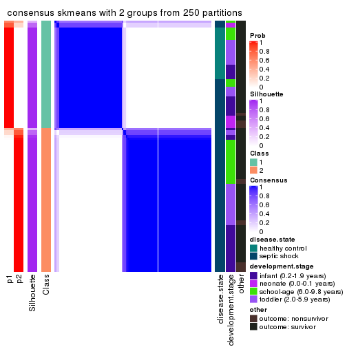</p>

</div>
<div id='tab-SD-skmeans-consensus-heatmap-2'>
<pre><code class="r">consensus_heatmap(res, k = 3)
</code></pre>

<p>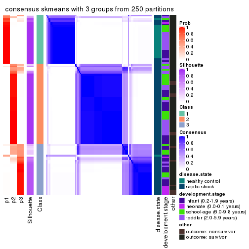</p>

</div>
<div id='tab-SD-skmeans-consensus-heatmap-3'>
<pre><code class="r">consensus_heatmap(res, k = 4)
</code></pre>

<p>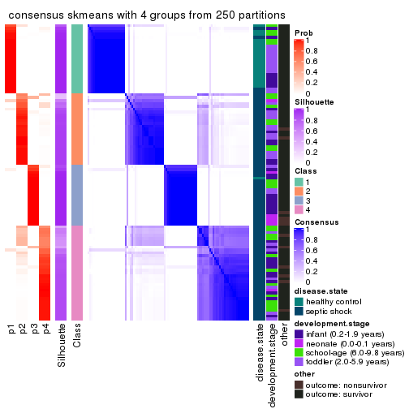</p>

</div>
<div id='tab-SD-skmeans-consensus-heatmap-4'>
<pre><code class="r">consensus_heatmap(res, k = 5)
</code></pre>

<p>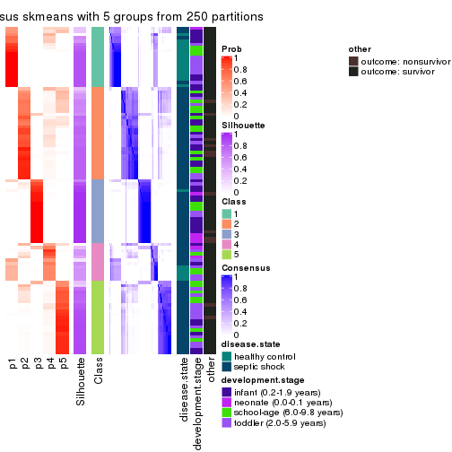</p>

</div>
<div id='tab-SD-skmeans-consensus-heatmap-5'>
<pre><code class="r">consensus_heatmap(res, k = 6)
</code></pre>

<p>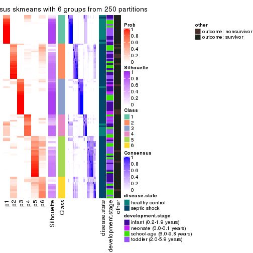</p>

</div>
</div>

Heatmaps for the membership of samples in all partitions to see how consistent they are:


<script>
$( function() {
	$( '#tabs-SD-skmeans-membership-heatmap' ).tabs();
} );
</script>
<div id='tabs-SD-skmeans-membership-heatmap'>
<ul>
<li><a href='#tab-SD-skmeans-membership-heatmap-1'>k = 2</a></li>
<li><a href='#tab-SD-skmeans-membership-heatmap-2'>k = 3</a></li>
<li><a href='#tab-SD-skmeans-membership-heatmap-3'>k = 4</a></li>
<li><a href='#tab-SD-skmeans-membership-heatmap-4'>k = 5</a></li>
<li><a href='#tab-SD-skmeans-membership-heatmap-5'>k = 6</a></li>
</ul>
<div id='tab-SD-skmeans-membership-heatmap-1'>
<pre><code class="r">membership_heatmap(res, k = 2)
</code></pre>

<p>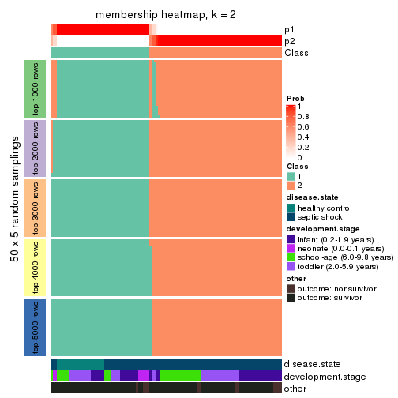</p>

</div>
<div id='tab-SD-skmeans-membership-heatmap-2'>
<pre><code class="r">membership_heatmap(res, k = 3)
</code></pre>

<p>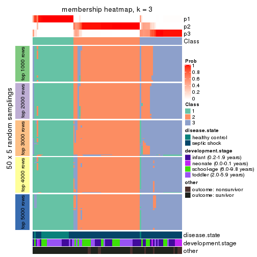</p>

</div>
<div id='tab-SD-skmeans-membership-heatmap-3'>
<pre><code class="r">membership_heatmap(res, k = 4)
</code></pre>

<p>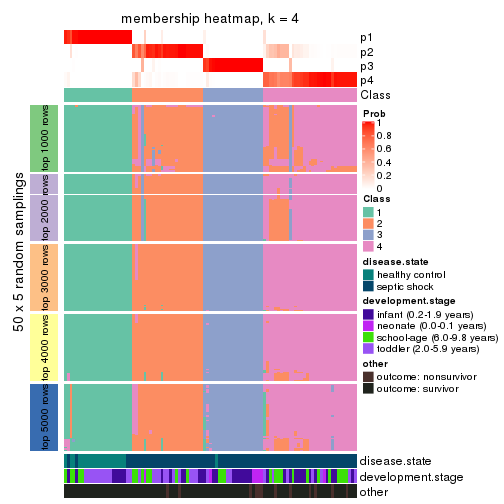</p>

</div>
<div id='tab-SD-skmeans-membership-heatmap-4'>
<pre><code class="r">membership_heatmap(res, k = 5)
</code></pre>

<p>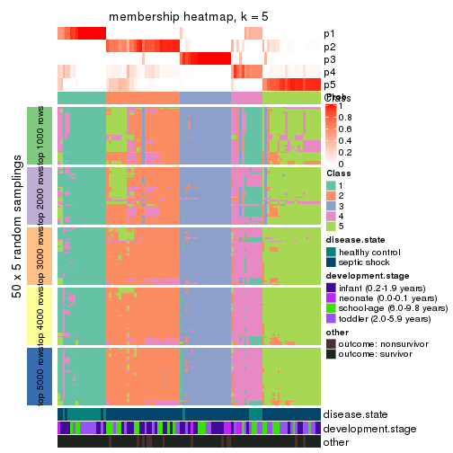</p>

</div>
<div id='tab-SD-skmeans-membership-heatmap-5'>
<pre><code class="r">membership_heatmap(res, k = 6)
</code></pre>

<p>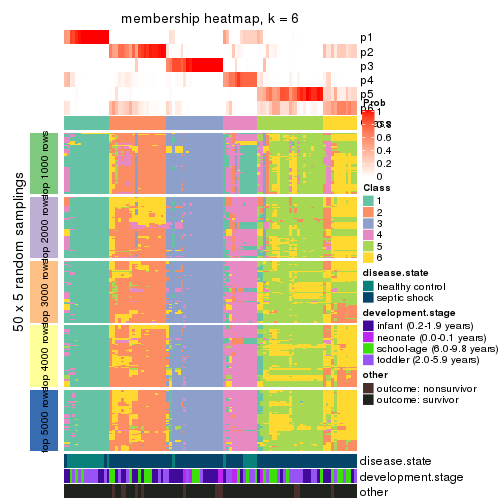</p>

</div>
</div>

As soon as we have had the classes for columns, we can look for signatures
which are significantly different between classes which can be candidate marks
for certain classes. Following are the heatmaps for signatures.


Signature heatmaps where rows are scaled:


<script>
$( function() {
	$( '#tabs-SD-skmeans-get-signatures' ).tabs();
} );
</script>
<div id='tabs-SD-skmeans-get-signatures'>
<ul>
<li><a href='#tab-SD-skmeans-get-signatures-1'>k = 2</a></li>
<li><a href='#tab-SD-skmeans-get-signatures-2'>k = 3</a></li>
<li><a href='#tab-SD-skmeans-get-signatures-3'>k = 4</a></li>
<li><a href='#tab-SD-skmeans-get-signatures-4'>k = 5</a></li>
<li><a href='#tab-SD-skmeans-get-signatures-5'>k = 6</a></li>
</ul>
<div id='tab-SD-skmeans-get-signatures-1'>
<pre><code class="r">get_signatures(res, k = 2)
</code></pre>

<p>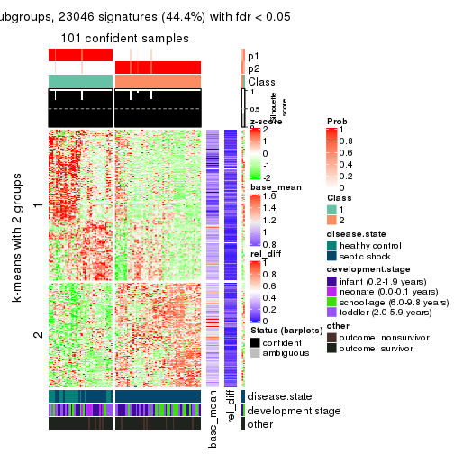</p>

</div>
<div id='tab-SD-skmeans-get-signatures-2'>
<pre><code class="r">get_signatures(res, k = 3)
</code></pre>

<p>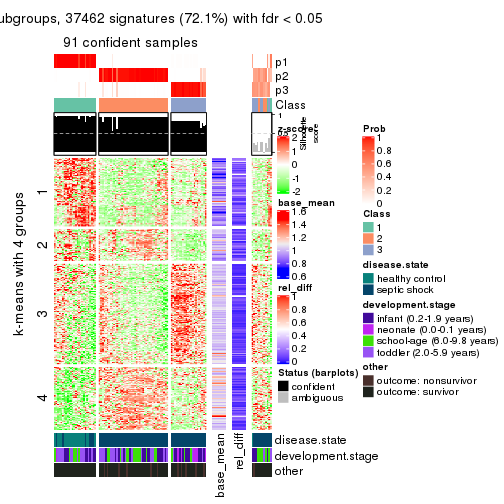</p>

</div>
<div id='tab-SD-skmeans-get-signatures-3'>
<pre><code class="r">get_signatures(res, k = 4)
</code></pre>

<p>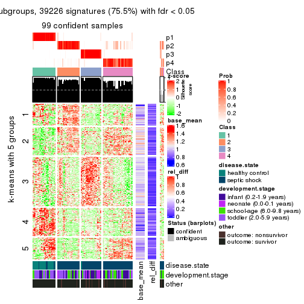</p>

</div>
<div id='tab-SD-skmeans-get-signatures-4'>
<pre><code class="r">get_signatures(res, k = 5)
</code></pre>

<p>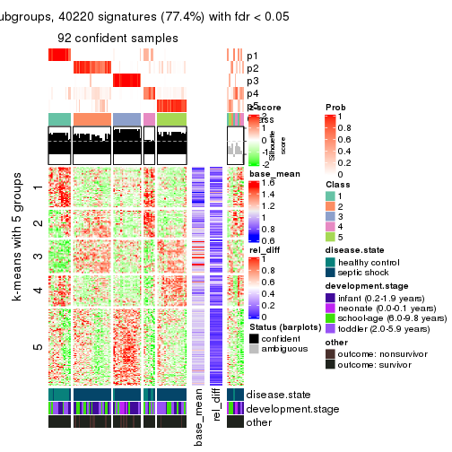</p>

</div>
<div id='tab-SD-skmeans-get-signatures-5'>
<pre><code class="r">get_signatures(res, k = 6)
</code></pre>

<p></p>

</div>
</div>


Signature heatmaps where rows are not scaled:


<script>
$( function() {
	$( '#tabs-SD-skmeans-get-signatures-no-scale' ).tabs();
} );
</script>
<div id='tabs-SD-skmeans-get-signatures-no-scale'>
<ul>
<li><a href='#tab-SD-skmeans-get-signatures-no-scale-1'>k = 2</a></li>
<li><a href='#tab-SD-skmeans-get-signatures-no-scale-2'>k = 3</a></li>
<li><a href='#tab-SD-skmeans-get-signatures-no-scale-3'>k = 4</a></li>
<li><a href='#tab-SD-skmeans-get-signatures-no-scale-4'>k = 5</a></li>
<li><a href='#tab-SD-skmeans-get-signatures-no-scale-5'>k = 6</a></li>
</ul>
<div id='tab-SD-skmeans-get-signatures-no-scale-1'>
<pre><code class="r">get_signatures(res, k = 2, scale_rows = FALSE)
</code></pre>

<p>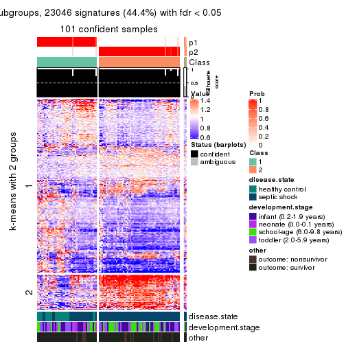</p>

</div>
<div id='tab-SD-skmeans-get-signatures-no-scale-2'>
<pre><code class="r">get_signatures(res, k = 3, scale_rows = FALSE)
</code></pre>

<pre><code>#&gt; Error in mat[ceiling(1:nr/h_ratio), ceiling(1:nc/w_ratio), drop = FALSE]: subscript out of bounds
</code></pre>

<p>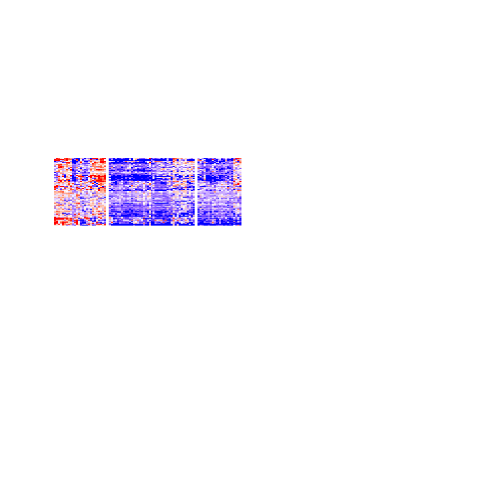</p>

</div>
<div id='tab-SD-skmeans-get-signatures-no-scale-3'>
<pre><code class="r">get_signatures(res, k = 4, scale_rows = FALSE)
</code></pre>

<p>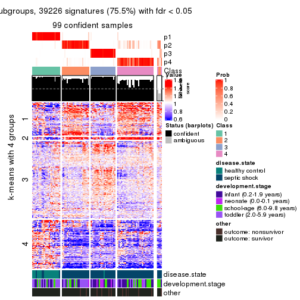</p>

</div>
<div id='tab-SD-skmeans-get-signatures-no-scale-4'>
<pre><code class="r">get_signatures(res, k = 5, scale_rows = FALSE)
</code></pre>

<p>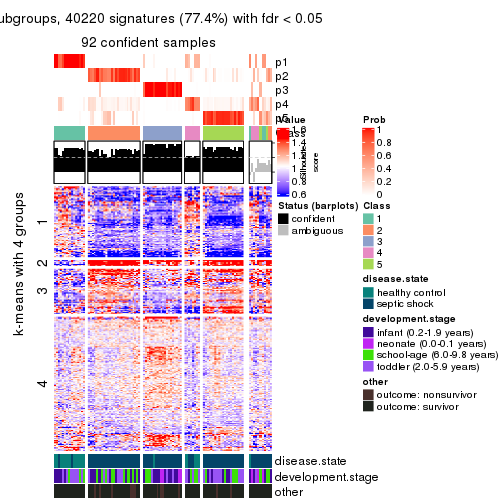</p>

</div>
<div id='tab-SD-skmeans-get-signatures-no-scale-5'>
<pre><code class="r">get_signatures(res, k = 6, scale_rows = FALSE)
</code></pre>

<p>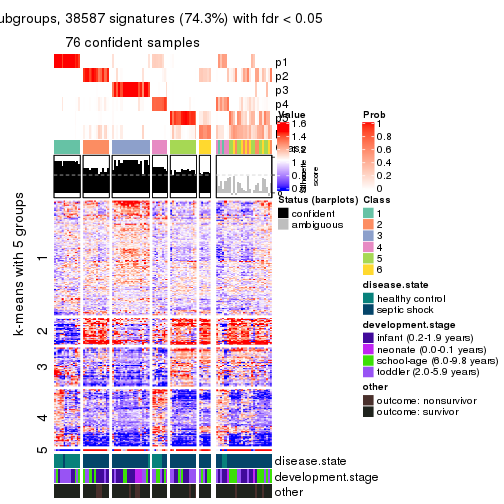</p>

</div>
</div>


Compare the overlap of signatures from different k:

```r
compare_signatures(res)
```

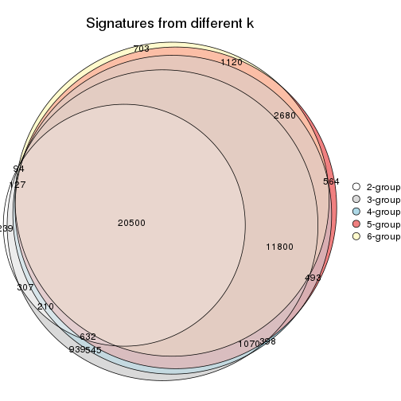

`get_signature()` returns a data frame invisibly. TO get the list of signatures, the function
call should be assigned to a variable explicitly. In following code, if `plot` argument is set
to `FALSE`, no heatmap is plotted while only the differential analysis is performed.

```r
# code only for demonstration
tb = get_signature(res, k = ..., plot = FALSE)
```

An example of the output of `tb` is:

```
#>   which_row         fdr    mean_1    mean_2 scaled_mean_1 scaled_mean_2 km
#> 1        38 0.042760348  8.373488  9.131774    -0.5533452     0.5164555  1
#> 2        40 0.018707592  7.106213  8.469186    -0.6173731     0.5762149  1
#> 3        55 0.019134737 10.221463 11.207825    -0.6159697     0.5749050  1
#> 4        59 0.006059896  5.921854  7.869574    -0.6899429     0.6439467  1
#> 5        60 0.018055526  8.928898 10.211722    -0.6204761     0.5791110  1
#> 6        98 0.009384629 15.714769 14.887706     0.6635654    -0.6193277  2
...
```

The columns in `tb` are:

1. `which_row`: row indices corresponding to the input matrix.
2. `fdr`: FDR for the differential test. 
3. `mean_x`: The mean value in group x.
4. `scaled_mean_x`: The mean value in group x after rows are scaled.
5. `km`: Row groups if k-means clustering is applied to rows.


UMAP plot which shows how samples are separated.


<script>
$( function() {
	$( '#tabs-SD-skmeans-dimension-reduction' ).tabs();
} );
</script>
<div id='tabs-SD-skmeans-dimension-reduction'>
<ul>
<li><a href='#tab-SD-skmeans-dimension-reduction-1'>k = 2</a></li>
<li><a href='#tab-SD-skmeans-dimension-reduction-2'>k = 3</a></li>
<li><a href='#tab-SD-skmeans-dimension-reduction-3'>k = 4</a></li>
<li><a href='#tab-SD-skmeans-dimension-reduction-4'>k = 5</a></li>
<li><a href='#tab-SD-skmeans-dimension-reduction-5'>k = 6</a></li>
</ul>
<div id='tab-SD-skmeans-dimension-reduction-1'>
<pre><code class="r">dimension_reduction(res, k = 2, method = &quot;UMAP&quot;)
</code></pre>

<p>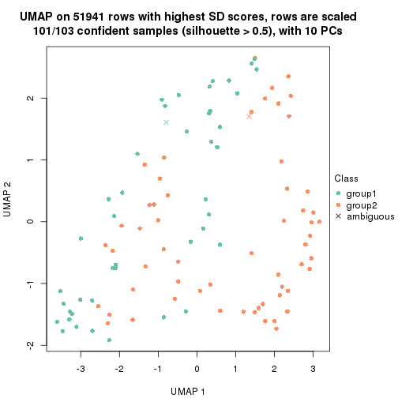</p>

</div>
<div id='tab-SD-skmeans-dimension-reduction-2'>
<pre><code class="r">dimension_reduction(res, k = 3, method = &quot;UMAP&quot;)
</code></pre>

<p>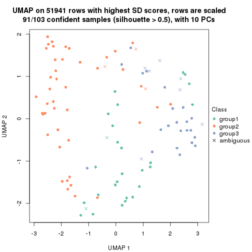</p>

</div>
<div id='tab-SD-skmeans-dimension-reduction-3'>
<pre><code class="r">dimension_reduction(res, k = 4, method = &quot;UMAP&quot;)
</code></pre>

<p>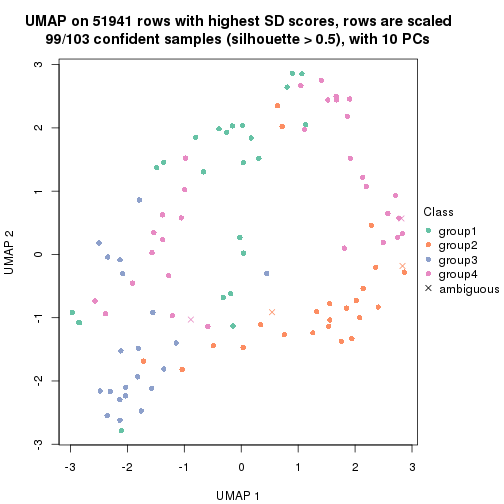</p>

</div>
<div id='tab-SD-skmeans-dimension-reduction-4'>
<pre><code class="r">dimension_reduction(res, k = 5, method = &quot;UMAP&quot;)
</code></pre>

<p>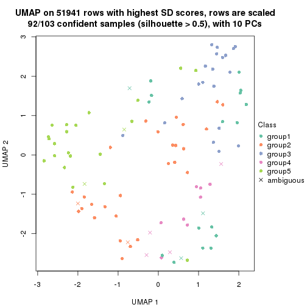</p>

</div>
<div id='tab-SD-skmeans-dimension-reduction-5'>
<pre><code class="r">dimension_reduction(res, k = 6, method = &quot;UMAP&quot;)
</code></pre>

<p>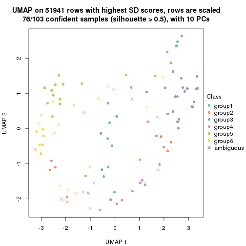</p>

</div>
</div>


Following heatmap shows how subgroups are split when increasing `k`:

```r
collect_classes(res)
```

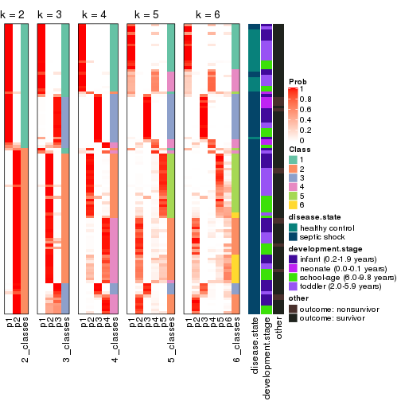


Test correlation between subgroups and known annotations. If the known
annotation is numeric, one-way ANOVA test is applied, and if the known
annotation is discrete, chi-squared contingency table test is applied.

```r
test_to_known_factors(res)
```

```
#>              n disease.state(p) development.stage(p) other(p) k
#> SD:skmeans 101         9.92e-09              0.01162   0.7049 2
#> SD:skmeans  91         1.21e-14              0.00145   0.0483 3
#> SD:skmeans  99         8.15e-16              0.00833   0.1534 4
#> SD:skmeans  92         2.44e-13              0.00586   0.1533 5
#> SD:skmeans  76         8.20e-11              0.07606   0.2738 6
```


If matrix rows can be associated to genes, consider to use `functional_enrichment(res,
...)` to perform function enrichment for the signature genes. See [this vignette](http://bioconductor.org/packages/devel/bioc/vignettes/cola/inst/doc/functional_enrichment.html) for more detailed explanations.


 

---------------------------------------------------


### SD:pam


The object with results only for a single top-value method and a single partition method 
can be extracted as:

```r
res = res_list["SD", "pam"]
# you can also extract it by
# res = res_list["SD:pam"]
```

A summary of `res` and all the functions that can be applied to it:

```r
res
```

```
#> A 'ConsensusPartition' object with k = 2, 3, 4, 5, 6.
#>   On a matrix with 51941 rows and 103 columns.
#>   Top rows (1000, 2000, 3000, 4000, 5000) are extracted by 'SD' method.
#>   Subgroups are detected by 'pam' method.
#>   Performed in total 1250 partitions by row resampling.
#>   Best k for subgroups seems to be 2.
#> 
#> Following methods can be applied to this 'ConsensusPartition' object:
#>  [1] "cola_report"             "collect_classes"         "collect_plots"          
#>  [4] "collect_stats"           "colnames"                "compare_signatures"     
#>  [7] "consensus_heatmap"       "dimension_reduction"     "functional_enrichment"  
#> [10] "get_anno_col"            "get_anno"                "get_classes"            
#> [13] "get_consensus"           "get_matrix"              "get_membership"         
#> [16] "get_param"               "get_signatures"          "get_stats"              
#> [19] "is_best_k"               "is_stable_k"             "membership_heatmap"     
#> [22] "ncol"                    "nrow"                    "plot_ecdf"              
#> [25] "rownames"                "select_partition_number" "show"                   
#> [28] "suggest_best_k"          "test_to_known_factors"
```

`collect_plots()` function collects all the plots made from `res` for all `k` (number of partitions)
into one single page to provide an easy and fast comparison between different `k`.

```r
collect_plots(res)
```

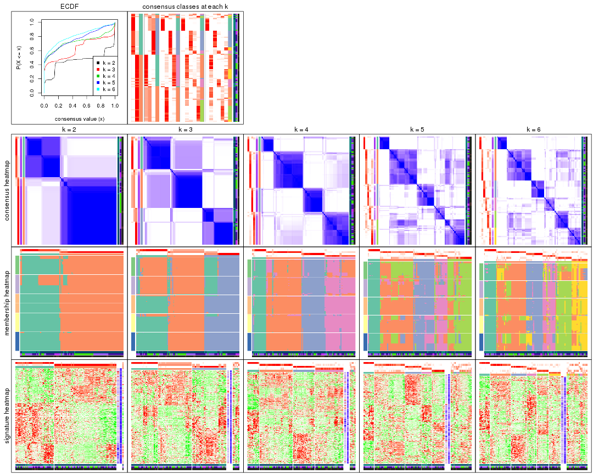

The plots are:

- The first row: a plot of the ECDF (empirical cumulative distribution
  function) curves of the consensus matrix for each `k` and the heatmap of
  predicted classes for each `k`.
- The second row: heatmaps of the consensus matrix for each `k`.
- The third row: heatmaps of the membership matrix for each `k`.
- The fouth row: heatmaps of the signatures for each `k`.

All the plots in panels can be made by individual functions and they are
plotted later in this section.

`select_partition_number()` produces several plots showing different
statistics for choosing "optimized" `k`. There are following statistics:

- ECDF curves of the consensus matrix for each `k`;
- 1-PAC. [The PAC
  score](https://en.wikipedia.org/wiki/Consensus_clustering#Over-interpretation_potential_of_consensus_clustering)
  measures the proportion of the ambiguous subgrouping.
- Mean silhouette score.
- Concordance. The mean probability of fiting the consensus class ids in all
  partitions.
- Area increased. Denote $A_k$ as the area under the ECDF curve for current
  `k`, the area increased is defined as $A_k - A_{k-1}$.
- Rand index. The percent of pairs of samples that are both in a same cluster
  or both are not in a same cluster in the partition of k and k-1.
- Jaccard index. The ratio of pairs of samples are both in a same cluster in
  the partition of k and k-1 and the pairs of samples are both in a same
  cluster in the partition k or k-1.

The detailed explanations of these statistics can be found in [the _cola_
vignette](http://bioconductor.org/packages/devel/bioc/vignettes/cola/inst/doc/cola.html#toc_13).

Generally speaking, lower PAC score, higher mean silhouette score or higher
concordance corresponds to better partition. Rand index and Jaccard index
measure how similar the current partition is compared to partition with `k-1`.
If they are too similar, we won't accept `k` is better than `k-1`.

```r
select_partition_number(res)
```

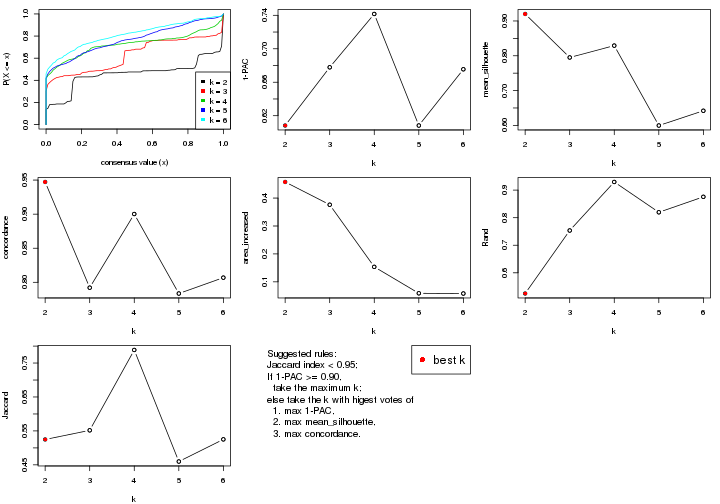

The numeric values for all these statistics can be obtained by `get_stats()`.

```r
get_stats(res)
```

```
#>   k 1-PAC mean_silhouette concordance area_increased  Rand Jaccard
#> 2 2 0.608           0.920       0.947         0.4577 0.525   0.525
#> 3 3 0.678           0.795       0.792         0.3762 0.753   0.552
#> 4 4 0.742           0.829       0.900         0.1536 0.930   0.789
#> 5 5 0.608           0.600       0.784         0.0589 0.820   0.460
#> 6 6 0.675           0.642       0.807         0.0581 0.876   0.525
```

`suggest_best_k()` suggests the best $k$ based on these statistics. The rules are as follows:

- All $k$ with Jaccard index larger than 0.95 are removed because increasing
  $k$ does not provide enough extra information. If all $k$ are removed, it is
  marked as no subgroup is detected.
- For all $k$ with 1-PAC score larger than 0.9, the maximal $k$ is taken as
  the best $k$, and other $k$ are marked as optional $k$.
- If it does not fit the second rule. The $k$ with the maximal vote of the
  highest 1-PAC score, highest mean silhouette, and highest concordance is
  taken as the best $k$.

```r
suggest_best_k(res)
```

```
#> [1] 2
```


Following shows the table of the partitions (You need to click the **show/hide
code output** link to see it). The membership matrix (columns with name `p*`)
is inferred by
[`clue::cl_consensus()`](https://www.rdocumentation.org/link/cl_consensus?package=clue)
function with the `SE` method. Basically the value in the membership matrix
represents the probability to belong to a certain group. The finall class
label for an item is determined with the group with highest probability it
belongs to.

In `get_classes()` function, the entropy is calculated from the membership
matrix and the silhouette score is calculated from the consensus matrix.


<script>
$( function() {
	$( '#tabs-SD-pam-get-classes' ).tabs();
} );
</script>
<div id='tabs-SD-pam-get-classes'>
<ul>
<li><a href='#tab-SD-pam-get-classes-1'>k = 2</a></li>
<li><a href='#tab-SD-pam-get-classes-2'>k = 3</a></li>
<li><a href='#tab-SD-pam-get-classes-3'>k = 4</a></li>
<li><a href='#tab-SD-pam-get-classes-4'>k = 5</a></li>
<li><a href='#tab-SD-pam-get-classes-5'>k = 6</a></li>
</ul>

<div id='tab-SD-pam-get-classes-1'>
<p><a id='tab-SD-pam-get-classes-1-a' style='color:#0366d6' href='#'>show/hide code output</a></p>
<pre><code class="r">cbind(get_classes(res, k = 2), get_membership(res, k = 2))
</code></pre>

<pre><code>#&gt;           class entropy silhouette    p1    p2
#&gt; GSM647569     1  0.6048      0.913 0.852 0.148
#&gt; GSM647574     1  0.6048      0.913 0.852 0.148
#&gt; GSM647577     1  0.6048      0.913 0.852 0.148
#&gt; GSM647547     1  0.6048      0.913 0.852 0.148
#&gt; GSM647552     1  0.8813      0.721 0.700 0.300
#&gt; GSM647553     1  0.6048      0.913 0.852 0.148
#&gt; GSM647565     2  0.0938      0.960 0.012 0.988
#&gt; GSM647545     2  0.0000      0.970 0.000 1.000
#&gt; GSM647549     2  0.0000      0.970 0.000 1.000
#&gt; GSM647550     2  0.0938      0.960 0.012 0.988
#&gt; GSM647560     2  0.0376      0.967 0.004 0.996
#&gt; GSM647617     1  0.6048      0.913 0.852 0.148
#&gt; GSM647528     2  0.0000      0.970 0.000 1.000
#&gt; GSM647529     2  0.6048      0.820 0.148 0.852
#&gt; GSM647531     2  0.0000      0.970 0.000 1.000
#&gt; GSM647540     1  0.6343      0.902 0.840 0.160
#&gt; GSM647541     2  0.0000      0.970 0.000 1.000
#&gt; GSM647546     1  0.6048      0.913 0.852 0.148
#&gt; GSM647557     2  0.0000      0.970 0.000 1.000
#&gt; GSM647561     2  0.0000      0.970 0.000 1.000
#&gt; GSM647567     1  0.6048      0.913 0.852 0.148
#&gt; GSM647568     2  0.0938      0.960 0.012 0.988
#&gt; GSM647570     2  0.0000      0.970 0.000 1.000
#&gt; GSM647573     2  0.1184      0.957 0.016 0.984
#&gt; GSM647576     1  0.6048      0.913 0.852 0.148
#&gt; GSM647579     1  0.6048      0.913 0.852 0.148
#&gt; GSM647580     1  0.6048      0.913 0.852 0.148
#&gt; GSM647583     1  0.6048      0.913 0.852 0.148
#&gt; GSM647592     2  0.0000      0.970 0.000 1.000
#&gt; GSM647593     2  0.0000      0.970 0.000 1.000
#&gt; GSM647595     2  0.0000      0.970 0.000 1.000
#&gt; GSM647597     2  0.5946      0.825 0.144 0.856
#&gt; GSM647598     2  0.0000      0.970 0.000 1.000
#&gt; GSM647613     2  0.0000      0.970 0.000 1.000
#&gt; GSM647615     2  0.0000      0.970 0.000 1.000
#&gt; GSM647616     1  0.6048      0.913 0.852 0.148
#&gt; GSM647619     2  0.0000      0.970 0.000 1.000
#&gt; GSM647582     2  0.0000      0.970 0.000 1.000
#&gt; GSM647591     2  0.0000      0.970 0.000 1.000
#&gt; GSM647527     2  0.0000      0.970 0.000 1.000
#&gt; GSM647530     2  0.0000      0.970 0.000 1.000
#&gt; GSM647532     2  0.9944      0.219 0.456 0.544
#&gt; GSM647544     2  0.0000      0.970 0.000 1.000
#&gt; GSM647551     2  0.0000      0.970 0.000 1.000
#&gt; GSM647556     1  0.6048      0.913 0.852 0.148
#&gt; GSM647558     2  0.0000      0.970 0.000 1.000
#&gt; GSM647572     1  0.6048      0.913 0.852 0.148
#&gt; GSM647578     2  0.8327      0.590 0.264 0.736
#&gt; GSM647581     2  0.0000      0.970 0.000 1.000
#&gt; GSM647594     2  0.0000      0.970 0.000 1.000
#&gt; GSM647599     1  0.0000      0.895 1.000 0.000
#&gt; GSM647600     1  0.9000      0.693 0.684 0.316
#&gt; GSM647601     2  0.0000      0.970 0.000 1.000
#&gt; GSM647603     2  0.0000      0.970 0.000 1.000
#&gt; GSM647610     2  0.5629      0.821 0.132 0.868
#&gt; GSM647611     2  0.0000      0.970 0.000 1.000
#&gt; GSM647612     2  0.0000      0.970 0.000 1.000
#&gt; GSM647614     2  0.0000      0.970 0.000 1.000
#&gt; GSM647618     2  0.0000      0.970 0.000 1.000
#&gt; GSM647629     2  0.0376      0.967 0.004 0.996
#&gt; GSM647535     2  0.0000      0.970 0.000 1.000
#&gt; GSM647563     2  0.0000      0.970 0.000 1.000
#&gt; GSM647542     2  0.0000      0.970 0.000 1.000
#&gt; GSM647543     2  0.0000      0.970 0.000 1.000
#&gt; GSM647548     2  0.0000      0.970 0.000 1.000
#&gt; GSM647554     2  0.6343      0.780 0.160 0.840
#&gt; GSM647555     2  0.0000      0.970 0.000 1.000
#&gt; GSM647559     2  0.0000      0.970 0.000 1.000
#&gt; GSM647562     2  0.0000      0.970 0.000 1.000
#&gt; GSM647564     1  0.6048      0.913 0.852 0.148
#&gt; GSM647571     2  0.0000      0.970 0.000 1.000
#&gt; GSM647584     2  0.0000      0.970 0.000 1.000
#&gt; GSM647585     1  0.6048      0.913 0.852 0.148
#&gt; GSM647586     2  0.0000      0.970 0.000 1.000
#&gt; GSM647587     2  0.0000      0.970 0.000 1.000
#&gt; GSM647588     2  0.0000      0.970 0.000 1.000
#&gt; GSM647596     2  0.0000      0.970 0.000 1.000
#&gt; GSM647602     1  0.6048      0.913 0.852 0.148
#&gt; GSM647609     2  0.0000      0.970 0.000 1.000
#&gt; GSM647620     2  0.0000      0.970 0.000 1.000
#&gt; GSM647627     2  0.0000      0.970 0.000 1.000
#&gt; GSM647628     2  0.0000      0.970 0.000 1.000
#&gt; GSM647533     1  0.0000      0.895 1.000 0.000
#&gt; GSM647536     2  0.6048      0.820 0.148 0.852
#&gt; GSM647537     1  0.0000      0.895 1.000 0.000
#&gt; GSM647606     1  0.0000      0.895 1.000 0.000
#&gt; GSM647621     1  0.0000      0.895 1.000 0.000
#&gt; GSM647626     1  0.0000      0.895 1.000 0.000
#&gt; GSM647538     1  0.0000      0.895 1.000 0.000
#&gt; GSM647575     2  0.3274      0.920 0.060 0.940
#&gt; GSM647590     1  0.0000      0.895 1.000 0.000
#&gt; GSM647605     1  0.0000      0.895 1.000 0.000
#&gt; GSM647607     2  0.6343      0.811 0.160 0.840
#&gt; GSM647608     1  0.4815      0.910 0.896 0.104
#&gt; GSM647622     1  0.0000      0.895 1.000 0.000
#&gt; GSM647623     1  0.0000      0.895 1.000 0.000
#&gt; GSM647624     1  0.0000      0.895 1.000 0.000
#&gt; GSM647625     1  0.0000      0.895 1.000 0.000
#&gt; GSM647534     1  0.1414      0.896 0.980 0.020
#&gt; GSM647539     2  0.0000      0.970 0.000 1.000
#&gt; GSM647566     1  0.1414      0.896 0.980 0.020
#&gt; GSM647589     1  0.5294      0.912 0.880 0.120
#&gt; GSM647604     1  0.0000      0.895 1.000 0.000
</code></pre>

<script>
$('#tab-SD-pam-get-classes-1-a').parent().next().next().hide();
$('#tab-SD-pam-get-classes-1-a').click(function(){
  $('#tab-SD-pam-get-classes-1-a').parent().next().next().toggle();
  return(false);
});
</script>
</div>

<div id='tab-SD-pam-get-classes-2'>
<p><a id='tab-SD-pam-get-classes-2-a' style='color:#0366d6' href='#'>show/hide code output</a></p>
<pre><code class="r">cbind(get_classes(res, k = 3), get_membership(res, k = 3))
</code></pre>

<pre><code>#&gt;           class entropy silhouette    p1    p2    p3
#&gt; GSM647569     3  0.0000      0.853 0.000 0.000 1.000
#&gt; GSM647574     3  0.0000      0.853 0.000 0.000 1.000
#&gt; GSM647577     3  0.0000      0.853 0.000 0.000 1.000
#&gt; GSM647547     1  0.6244      0.223 0.560 0.000 0.440
#&gt; GSM647552     3  0.4504      0.653 0.196 0.000 0.804
#&gt; GSM647553     3  0.0000      0.853 0.000 0.000 1.000
#&gt; GSM647565     1  0.1289      0.848 0.968 0.000 0.032
#&gt; GSM647545     1  0.0000      0.871 1.000 0.000 0.000
#&gt; GSM647549     1  0.0000      0.871 1.000 0.000 0.000
#&gt; GSM647550     1  0.2066      0.816 0.940 0.000 0.060
#&gt; GSM647560     1  0.0592      0.866 0.988 0.000 0.012
#&gt; GSM647617     3  0.0000      0.853 0.000 0.000 1.000
#&gt; GSM647528     2  0.6244      0.886 0.440 0.560 0.000
#&gt; GSM647529     2  0.6244      0.886 0.440 0.560 0.000
#&gt; GSM647531     2  0.6244      0.886 0.440 0.560 0.000
#&gt; GSM647540     3  0.0000      0.853 0.000 0.000 1.000
#&gt; GSM647541     1  0.0000      0.871 1.000 0.000 0.000
#&gt; GSM647546     3  0.0000      0.853 0.000 0.000 1.000
#&gt; GSM647557     2  0.6302      0.823 0.480 0.520 0.000
#&gt; GSM647561     2  0.6244      0.886 0.440 0.560 0.000
#&gt; GSM647567     3  0.0237      0.850 0.004 0.000 0.996
#&gt; GSM647568     1  0.0237      0.872 0.996 0.000 0.004
#&gt; GSM647570     1  0.0000      0.871 1.000 0.000 0.000
#&gt; GSM647573     1  0.2878      0.774 0.904 0.000 0.096
#&gt; GSM647576     3  0.0000      0.853 0.000 0.000 1.000
#&gt; GSM647579     3  0.0000      0.853 0.000 0.000 1.000
#&gt; GSM647580     3  0.0000      0.853 0.000 0.000 1.000
#&gt; GSM647583     3  0.0000      0.853 0.000 0.000 1.000
#&gt; GSM647592     2  0.6244      0.886 0.440 0.560 0.000
#&gt; GSM647593     2  0.6244      0.886 0.440 0.560 0.000
#&gt; GSM647595     2  0.6244      0.886 0.440 0.560 0.000
#&gt; GSM647597     2  0.6204      0.868 0.424 0.576 0.000
#&gt; GSM647598     2  0.6244      0.886 0.440 0.560 0.000
#&gt; GSM647613     1  0.0237      0.865 0.996 0.004 0.000
#&gt; GSM647615     1  0.1411      0.844 0.964 0.000 0.036
#&gt; GSM647616     3  0.0000      0.853 0.000 0.000 1.000
#&gt; GSM647619     2  0.6244      0.886 0.440 0.560 0.000
#&gt; GSM647582     2  0.6244      0.886 0.440 0.560 0.000
#&gt; GSM647591     2  0.6244      0.886 0.440 0.560 0.000
#&gt; GSM647527     2  0.6244      0.886 0.440 0.560 0.000
#&gt; GSM647530     1  0.0000      0.871 1.000 0.000 0.000
#&gt; GSM647532     1  0.7640      0.397 0.592 0.352 0.056
#&gt; GSM647544     1  0.0000      0.871 1.000 0.000 0.000
#&gt; GSM647551     2  0.6244      0.886 0.440 0.560 0.000
#&gt; GSM647556     3  0.0000      0.853 0.000 0.000 1.000
#&gt; GSM647558     1  0.0000      0.871 1.000 0.000 0.000
#&gt; GSM647572     3  0.0000      0.853 0.000 0.000 1.000
#&gt; GSM647578     1  0.7013      0.229 0.548 0.020 0.432
#&gt; GSM647581     1  0.0000      0.871 1.000 0.000 0.000
#&gt; GSM647594     2  0.6244      0.886 0.440 0.560 0.000
#&gt; GSM647599     3  0.6180      0.741 0.000 0.416 0.584
#&gt; GSM647600     2  0.9003      0.604 0.240 0.560 0.200
#&gt; GSM647601     2  0.6244      0.886 0.440 0.560 0.000
#&gt; GSM647603     2  0.6244      0.886 0.440 0.560 0.000
#&gt; GSM647610     2  0.8889      0.662 0.276 0.560 0.164
#&gt; GSM647611     2  0.6244      0.886 0.440 0.560 0.000
#&gt; GSM647612     1  0.0237      0.872 0.996 0.000 0.004
#&gt; GSM647614     1  0.0237      0.872 0.996 0.000 0.004
#&gt; GSM647618     2  0.6244      0.886 0.440 0.560 0.000
#&gt; GSM647629     2  0.6451      0.881 0.436 0.560 0.004
#&gt; GSM647535     2  0.6244      0.886 0.440 0.560 0.000
#&gt; GSM647563     1  0.0000      0.871 1.000 0.000 0.000
#&gt; GSM647542     1  0.0237      0.872 0.996 0.000 0.004
#&gt; GSM647543     1  0.0237      0.872 0.996 0.000 0.004
#&gt; GSM647548     1  0.0237      0.872 0.996 0.000 0.004
#&gt; GSM647554     2  0.9009      0.606 0.236 0.560 0.204
#&gt; GSM647555     1  0.0237      0.872 0.996 0.000 0.004
#&gt; GSM647559     2  0.6244      0.886 0.440 0.560 0.000
#&gt; GSM647562     1  0.0000      0.871 1.000 0.000 0.000
#&gt; GSM647564     3  0.0000      0.853 0.000 0.000 1.000
#&gt; GSM647571     1  0.0237      0.872 0.996 0.000 0.004
#&gt; GSM647584     2  0.6244      0.886 0.440 0.560 0.000
#&gt; GSM647585     3  0.0000      0.853 0.000 0.000 1.000
#&gt; GSM647586     2  0.6244      0.886 0.440 0.560 0.000
#&gt; GSM647587     2  0.6244      0.886 0.440 0.560 0.000
#&gt; GSM647588     2  0.6260      0.875 0.448 0.552 0.000
#&gt; GSM647596     2  0.6244      0.886 0.440 0.560 0.000
#&gt; GSM647602     3  0.0000      0.853 0.000 0.000 1.000
#&gt; GSM647609     2  0.6244      0.886 0.440 0.560 0.000
#&gt; GSM647620     2  0.6244      0.886 0.440 0.560 0.000
#&gt; GSM647627     2  0.6244      0.886 0.440 0.560 0.000
#&gt; GSM647628     1  0.0000      0.871 1.000 0.000 0.000
#&gt; GSM647533     3  0.6244      0.737 0.000 0.440 0.560
#&gt; GSM647536     2  0.5416      0.360 0.100 0.820 0.080
#&gt; GSM647537     3  0.6244      0.737 0.000 0.440 0.560
#&gt; GSM647606     3  0.6244      0.737 0.000 0.440 0.560
#&gt; GSM647621     3  0.5216      0.785 0.000 0.260 0.740
#&gt; GSM647626     3  0.0000      0.853 0.000 0.000 1.000
#&gt; GSM647538     3  0.6244      0.737 0.000 0.440 0.560
#&gt; GSM647575     1  0.2749      0.800 0.924 0.064 0.012
#&gt; GSM647590     3  0.6244      0.737 0.000 0.440 0.560
#&gt; GSM647605     3  0.6286      0.721 0.000 0.464 0.536
#&gt; GSM647607     1  0.7546      0.333 0.560 0.396 0.044
#&gt; GSM647608     3  0.0000      0.853 0.000 0.000 1.000
#&gt; GSM647622     3  0.6244      0.737 0.000 0.440 0.560
#&gt; GSM647623     3  0.6244      0.737 0.000 0.440 0.560
#&gt; GSM647624     3  0.6244      0.737 0.000 0.440 0.560
#&gt; GSM647625     3  0.6244      0.737 0.000 0.440 0.560
#&gt; GSM647534     2  0.4931      0.181 0.032 0.828 0.140
#&gt; GSM647539     1  0.0237      0.872 0.996 0.000 0.004
#&gt; GSM647566     2  0.9989     -0.474 0.316 0.356 0.328
#&gt; GSM647589     3  0.0000      0.853 0.000 0.000 1.000
#&gt; GSM647604     3  0.6280      0.724 0.000 0.460 0.540
</code></pre>

<script>
$('#tab-SD-pam-get-classes-2-a').parent().next().next().hide();
$('#tab-SD-pam-get-classes-2-a').click(function(){
  $('#tab-SD-pam-get-classes-2-a').parent().next().next().toggle();
  return(false);
});
</script>
</div>

<div id='tab-SD-pam-get-classes-3'>
<p><a id='tab-SD-pam-get-classes-3-a' style='color:#0366d6' href='#'>show/hide code output</a></p>
<pre><code class="r">cbind(get_classes(res, k = 4), get_membership(res, k = 4))
</code></pre>

<pre><code>#&gt;           class entropy silhouette    p1    p2    p3    p4
#&gt; GSM647569     3  0.0000     0.9407 0.000 0.000 1.000 0.000
#&gt; GSM647574     3  0.0000     0.9407 0.000 0.000 1.000 0.000
#&gt; GSM647577     3  0.0000     0.9407 0.000 0.000 1.000 0.000
#&gt; GSM647547     4  0.4981     0.1920 0.000 0.000 0.464 0.536
#&gt; GSM647552     3  0.7300     0.3737 0.000 0.276 0.528 0.196
#&gt; GSM647553     3  0.0921     0.9267 0.000 0.000 0.972 0.028
#&gt; GSM647565     4  0.0376     0.8042 0.000 0.004 0.004 0.992
#&gt; GSM647545     4  0.2149     0.8310 0.000 0.088 0.000 0.912
#&gt; GSM647549     4  0.2081     0.8312 0.000 0.084 0.000 0.916
#&gt; GSM647550     4  0.3910     0.8378 0.000 0.156 0.024 0.820
#&gt; GSM647560     4  0.3444     0.8396 0.000 0.184 0.000 0.816
#&gt; GSM647617     3  0.0000     0.9407 0.000 0.000 1.000 0.000
#&gt; GSM647528     2  0.0921     0.9155 0.000 0.972 0.000 0.028
#&gt; GSM647529     2  0.2813     0.8684 0.080 0.896 0.000 0.024
#&gt; GSM647531     2  0.3123     0.8159 0.000 0.844 0.000 0.156
#&gt; GSM647540     3  0.1389     0.9091 0.000 0.000 0.952 0.048
#&gt; GSM647541     4  0.3356     0.8392 0.000 0.176 0.000 0.824
#&gt; GSM647546     3  0.0188     0.9391 0.000 0.000 0.996 0.004
#&gt; GSM647557     2  0.4730     0.5238 0.000 0.636 0.000 0.364
#&gt; GSM647561     2  0.3311     0.8125 0.000 0.828 0.000 0.172
#&gt; GSM647567     3  0.1151     0.9211 0.000 0.024 0.968 0.008
#&gt; GSM647568     4  0.1118     0.8242 0.000 0.036 0.000 0.964
#&gt; GSM647570     4  0.3837     0.8308 0.000 0.224 0.000 0.776
#&gt; GSM647573     4  0.1398     0.7923 0.000 0.004 0.040 0.956
#&gt; GSM647576     3  0.3528     0.7610 0.000 0.000 0.808 0.192
#&gt; GSM647579     3  0.1389     0.9091 0.000 0.000 0.952 0.048
#&gt; GSM647580     3  0.0000     0.9407 0.000 0.000 1.000 0.000
#&gt; GSM647583     3  0.0000     0.9407 0.000 0.000 1.000 0.000
#&gt; GSM647592     2  0.0000     0.9159 0.000 1.000 0.000 0.000
#&gt; GSM647593     2  0.0000     0.9159 0.000 1.000 0.000 0.000
#&gt; GSM647595     2  0.0188     0.9155 0.000 0.996 0.000 0.004
#&gt; GSM647597     2  0.0000     0.9159 0.000 1.000 0.000 0.000
#&gt; GSM647598     2  0.0188     0.9165 0.000 0.996 0.000 0.004
#&gt; GSM647613     4  0.3649     0.8275 0.000 0.204 0.000 0.796
#&gt; GSM647615     4  0.1706     0.8190 0.000 0.036 0.016 0.948
#&gt; GSM647616     3  0.0000     0.9407 0.000 0.000 1.000 0.000
#&gt; GSM647619     2  0.0000     0.9159 0.000 1.000 0.000 0.000
#&gt; GSM647582     2  0.0817     0.9166 0.000 0.976 0.000 0.024
#&gt; GSM647591     2  0.2921     0.8165 0.000 0.860 0.000 0.140
#&gt; GSM647527     2  0.0921     0.9155 0.000 0.972 0.000 0.028
#&gt; GSM647530     4  0.2149     0.8310 0.000 0.088 0.000 0.912
#&gt; GSM647532     4  0.7117     0.2412 0.180 0.000 0.264 0.556
#&gt; GSM647544     4  0.3873     0.8281 0.000 0.228 0.000 0.772
#&gt; GSM647551     2  0.2973     0.8157 0.000 0.856 0.000 0.144
#&gt; GSM647556     3  0.0000     0.9407 0.000 0.000 1.000 0.000
#&gt; GSM647558     4  0.1211     0.8258 0.000 0.040 0.000 0.960
#&gt; GSM647572     3  0.0188     0.9391 0.000 0.000 0.996 0.004
#&gt; GSM647578     4  0.6280     0.5407 0.000 0.084 0.304 0.612
#&gt; GSM647581     4  0.2081     0.8312 0.000 0.084 0.000 0.916
#&gt; GSM647594     2  0.0000     0.9159 0.000 1.000 0.000 0.000
#&gt; GSM647599     1  0.4866     0.2993 0.596 0.000 0.404 0.000
#&gt; GSM647600     2  0.2089     0.8777 0.000 0.932 0.020 0.048
#&gt; GSM647601     2  0.0188     0.9165 0.000 0.996 0.000 0.004
#&gt; GSM647603     2  0.0921     0.9155 0.000 0.972 0.000 0.028
#&gt; GSM647610     2  0.2131     0.8819 0.000 0.932 0.036 0.032
#&gt; GSM647611     2  0.0817     0.9164 0.000 0.976 0.000 0.024
#&gt; GSM647612     4  0.3356     0.8392 0.000 0.176 0.000 0.824
#&gt; GSM647614     4  0.3837     0.8308 0.000 0.224 0.000 0.776
#&gt; GSM647618     2  0.0707     0.9169 0.000 0.980 0.000 0.020
#&gt; GSM647629     2  0.1474     0.8899 0.000 0.948 0.000 0.052
#&gt; GSM647535     2  0.0921     0.9155 0.000 0.972 0.000 0.028
#&gt; GSM647563     4  0.3873     0.8281 0.000 0.228 0.000 0.772
#&gt; GSM647542     4  0.3837     0.8308 0.000 0.224 0.000 0.776
#&gt; GSM647543     4  0.1211     0.8258 0.000 0.040 0.000 0.960
#&gt; GSM647548     4  0.1474     0.8203 0.000 0.052 0.000 0.948
#&gt; GSM647554     2  0.4205     0.7900 0.000 0.820 0.124 0.056
#&gt; GSM647555     4  0.3356     0.8392 0.000 0.176 0.000 0.824
#&gt; GSM647559     2  0.1302     0.9052 0.000 0.956 0.000 0.044
#&gt; GSM647562     4  0.3873     0.8281 0.000 0.228 0.000 0.772
#&gt; GSM647564     3  0.0000     0.9407 0.000 0.000 1.000 0.000
#&gt; GSM647571     4  0.3837     0.8308 0.000 0.224 0.000 0.776
#&gt; GSM647584     2  0.0000     0.9159 0.000 1.000 0.000 0.000
#&gt; GSM647585     3  0.0000     0.9407 0.000 0.000 1.000 0.000
#&gt; GSM647586     2  0.0921     0.9155 0.000 0.972 0.000 0.028
#&gt; GSM647587     2  0.0921     0.9155 0.000 0.972 0.000 0.028
#&gt; GSM647588     2  0.4643     0.6066 0.000 0.656 0.000 0.344
#&gt; GSM647596     2  0.0817     0.9166 0.000 0.976 0.000 0.024
#&gt; GSM647602     3  0.0000     0.9407 0.000 0.000 1.000 0.000
#&gt; GSM647609     2  0.0469     0.9171 0.000 0.988 0.000 0.012
#&gt; GSM647620     2  0.0817     0.9164 0.000 0.976 0.000 0.024
#&gt; GSM647627     2  0.0817     0.9164 0.000 0.976 0.000 0.024
#&gt; GSM647628     4  0.3873     0.8281 0.000 0.228 0.000 0.772
#&gt; GSM647533     1  0.0188     0.9095 0.996 0.000 0.000 0.004
#&gt; GSM647536     1  0.4656     0.7528 0.784 0.056 0.000 0.160
#&gt; GSM647537     1  0.0000     0.9107 1.000 0.000 0.000 0.000
#&gt; GSM647606     1  0.0000     0.9107 1.000 0.000 0.000 0.000
#&gt; GSM647621     3  0.5025     0.5901 0.252 0.000 0.716 0.032
#&gt; GSM647626     3  0.0000     0.9407 0.000 0.000 1.000 0.000
#&gt; GSM647538     1  0.0188     0.9095 0.996 0.000 0.000 0.004
#&gt; GSM647575     4  0.3796     0.7945 0.096 0.056 0.000 0.848
#&gt; GSM647590     1  0.0188     0.9095 0.996 0.000 0.000 0.004
#&gt; GSM647605     1  0.0000     0.9107 1.000 0.000 0.000 0.000
#&gt; GSM647607     4  0.4464     0.6638 0.208 0.000 0.024 0.768
#&gt; GSM647608     3  0.1118     0.9219 0.000 0.000 0.964 0.036
#&gt; GSM647622     1  0.0000     0.9107 1.000 0.000 0.000 0.000
#&gt; GSM647623     1  0.0000     0.9107 1.000 0.000 0.000 0.000
#&gt; GSM647624     1  0.0000     0.9107 1.000 0.000 0.000 0.000
#&gt; GSM647625     1  0.0000     0.9107 1.000 0.000 0.000 0.000
#&gt; GSM647534     2  0.7081     0.0289 0.416 0.472 0.108 0.004
#&gt; GSM647539     4  0.0188     0.8057 0.000 0.004 0.000 0.996
#&gt; GSM647566     1  0.7704     0.2122 0.432 0.000 0.336 0.232
#&gt; GSM647589     3  0.1022     0.9240 0.000 0.000 0.968 0.032
#&gt; GSM647604     1  0.0000     0.9107 1.000 0.000 0.000 0.000
</code></pre>

<script>
$('#tab-SD-pam-get-classes-3-a').parent().next().next().hide();
$('#tab-SD-pam-get-classes-3-a').click(function(){
  $('#tab-SD-pam-get-classes-3-a').parent().next().next().toggle();
  return(false);
});
</script>
</div>

<div id='tab-SD-pam-get-classes-4'>
<p><a id='tab-SD-pam-get-classes-4-a' style='color:#0366d6' href='#'>show/hide code output</a></p>
<pre><code class="r">cbind(get_classes(res, k = 5), get_membership(res, k = 5))
</code></pre>

<pre><code>#&gt;           class entropy silhouette    p1    p2    p3    p4    p5
#&gt; GSM647569     3  0.2773    0.76804 0.000 0.000 0.836 0.164 0.000
#&gt; GSM647574     3  0.4182    0.46449 0.000 0.000 0.600 0.400 0.000
#&gt; GSM647577     3  0.2773    0.76804 0.000 0.000 0.836 0.164 0.000
#&gt; GSM647547     4  0.3689    0.41306 0.000 0.004 0.256 0.740 0.000
#&gt; GSM647552     5  0.7289   -0.00145 0.000 0.196 0.364 0.036 0.404
#&gt; GSM647553     3  0.4161    0.48461 0.000 0.000 0.608 0.392 0.000
#&gt; GSM647565     4  0.4341    0.62907 0.000 0.364 0.000 0.628 0.008
#&gt; GSM647545     2  0.0865    0.68116 0.000 0.972 0.000 0.004 0.024
#&gt; GSM647549     2  0.1493    0.67249 0.000 0.948 0.000 0.028 0.024
#&gt; GSM647550     2  0.6388    0.59304 0.000 0.628 0.200 0.060 0.112
#&gt; GSM647560     2  0.5768    0.63925 0.000 0.672 0.164 0.024 0.140
#&gt; GSM647617     3  0.2773    0.76804 0.000 0.000 0.836 0.164 0.000
#&gt; GSM647528     2  0.4161    0.55210 0.000 0.608 0.000 0.000 0.392
#&gt; GSM647529     4  0.5800    0.03448 0.008 0.068 0.000 0.488 0.436
#&gt; GSM647531     5  0.4948    0.21708 0.000 0.436 0.000 0.028 0.536
#&gt; GSM647540     3  0.2661    0.69740 0.000 0.056 0.888 0.056 0.000
#&gt; GSM647541     2  0.6427    0.61431 0.000 0.632 0.164 0.060 0.144
#&gt; GSM647546     3  0.2813    0.76691 0.000 0.000 0.832 0.168 0.000
#&gt; GSM647557     2  0.3961    0.59082 0.000 0.760 0.000 0.028 0.212
#&gt; GSM647561     2  0.3508    0.56708 0.000 0.748 0.000 0.000 0.252
#&gt; GSM647567     3  0.4232    0.63427 0.000 0.032 0.804 0.048 0.116
#&gt; GSM647568     2  0.1410    0.65173 0.000 0.940 0.000 0.060 0.000
#&gt; GSM647570     2  0.2930    0.72529 0.000 0.832 0.000 0.004 0.164
#&gt; GSM647573     4  0.4168    0.68716 0.000 0.200 0.044 0.756 0.000
#&gt; GSM647576     3  0.4670    0.55936 0.000 0.200 0.724 0.076 0.000
#&gt; GSM647579     3  0.2661    0.69740 0.000 0.056 0.888 0.056 0.000
#&gt; GSM647580     3  0.2773    0.76804 0.000 0.000 0.836 0.164 0.000
#&gt; GSM647583     3  0.2773    0.76804 0.000 0.000 0.836 0.164 0.000
#&gt; GSM647592     5  0.0000    0.69167 0.000 0.000 0.000 0.000 1.000
#&gt; GSM647593     5  0.0000    0.69167 0.000 0.000 0.000 0.000 1.000
#&gt; GSM647595     5  0.0162    0.69097 0.000 0.004 0.000 0.000 0.996
#&gt; GSM647597     5  0.0000    0.69167 0.000 0.000 0.000 0.000 1.000
#&gt; GSM647598     5  0.0703    0.68374 0.000 0.024 0.000 0.000 0.976
#&gt; GSM647613     2  0.4843    0.55871 0.000 0.660 0.000 0.048 0.292
#&gt; GSM647615     2  0.3962    0.51353 0.000 0.800 0.112 0.088 0.000
#&gt; GSM647616     3  0.2773    0.76804 0.000 0.000 0.836 0.164 0.000
#&gt; GSM647619     5  0.0000    0.69167 0.000 0.000 0.000 0.000 1.000
#&gt; GSM647582     2  0.4307    0.33909 0.000 0.504 0.000 0.000 0.496
#&gt; GSM647591     5  0.2516    0.56470 0.000 0.140 0.000 0.000 0.860
#&gt; GSM647527     2  0.4161    0.55210 0.000 0.608 0.000 0.000 0.392
#&gt; GSM647530     2  0.1836    0.67005 0.000 0.932 0.000 0.032 0.036
#&gt; GSM647532     4  0.4034    0.64895 0.040 0.128 0.004 0.812 0.016
#&gt; GSM647544     2  0.3231    0.71909 0.000 0.800 0.000 0.004 0.196
#&gt; GSM647551     5  0.2605    0.56687 0.000 0.148 0.000 0.000 0.852
#&gt; GSM647556     3  0.0000    0.76141 0.000 0.000 1.000 0.000 0.000
#&gt; GSM647558     2  0.1792    0.64730 0.000 0.916 0.000 0.084 0.000
#&gt; GSM647572     3  0.0671    0.75739 0.000 0.004 0.980 0.016 0.000
#&gt; GSM647578     3  0.6587   -0.06943 0.000 0.380 0.496 0.060 0.064
#&gt; GSM647581     2  0.1907    0.66480 0.000 0.928 0.000 0.028 0.044
#&gt; GSM647594     5  0.0000    0.69167 0.000 0.000 0.000 0.000 1.000
#&gt; GSM647599     1  0.6242    0.34539 0.584 0.000 0.244 0.160 0.012
#&gt; GSM647600     5  0.1471    0.67455 0.000 0.024 0.020 0.004 0.952
#&gt; GSM647601     5  0.1121    0.67367 0.000 0.044 0.000 0.000 0.956
#&gt; GSM647603     2  0.5816    0.62658 0.000 0.608 0.164 0.000 0.228
#&gt; GSM647610     5  0.1493    0.68067 0.000 0.024 0.028 0.000 0.948
#&gt; GSM647611     5  0.4161   -0.00729 0.000 0.392 0.000 0.000 0.608
#&gt; GSM647612     2  0.3868    0.70095 0.000 0.800 0.000 0.060 0.140
#&gt; GSM647614     2  0.2930    0.72529 0.000 0.832 0.000 0.004 0.164
#&gt; GSM647618     5  0.4201   -0.07565 0.000 0.408 0.000 0.000 0.592
#&gt; GSM647629     5  0.5301    0.47577 0.000 0.056 0.164 0.056 0.724
#&gt; GSM647535     2  0.4126    0.56383 0.000 0.620 0.000 0.000 0.380
#&gt; GSM647563     2  0.3109    0.71783 0.000 0.800 0.000 0.000 0.200
#&gt; GSM647542     2  0.2930    0.72529 0.000 0.832 0.000 0.004 0.164
#&gt; GSM647543     2  0.1410    0.65173 0.000 0.940 0.000 0.060 0.000
#&gt; GSM647548     4  0.4734    0.63149 0.000 0.372 0.000 0.604 0.024
#&gt; GSM647554     5  0.7755    0.11054 0.000 0.292 0.292 0.056 0.360
#&gt; GSM647555     2  0.5768    0.64009 0.000 0.672 0.164 0.024 0.140
#&gt; GSM647559     2  0.4161    0.55210 0.000 0.608 0.000 0.000 0.392
#&gt; GSM647562     2  0.3109    0.71783 0.000 0.800 0.000 0.000 0.200
#&gt; GSM647564     3  0.0963    0.77045 0.000 0.000 0.964 0.036 0.000
#&gt; GSM647571     2  0.2930    0.72480 0.000 0.832 0.000 0.004 0.164
#&gt; GSM647584     5  0.0566    0.68861 0.000 0.012 0.000 0.004 0.984
#&gt; GSM647585     3  0.0703    0.76886 0.000 0.000 0.976 0.024 0.000
#&gt; GSM647586     2  0.4161    0.55210 0.000 0.608 0.000 0.000 0.392
#&gt; GSM647587     2  0.4161    0.55210 0.000 0.608 0.000 0.000 0.392
#&gt; GSM647588     2  0.6584    0.30589 0.000 0.580 0.068 0.084 0.268
#&gt; GSM647596     5  0.4201   -0.05781 0.000 0.408 0.000 0.000 0.592
#&gt; GSM647602     3  0.0162    0.76305 0.000 0.000 0.996 0.004 0.000
#&gt; GSM647609     5  0.3395    0.42955 0.000 0.236 0.000 0.000 0.764
#&gt; GSM647620     5  0.4262   -0.15988 0.000 0.440 0.000 0.000 0.560
#&gt; GSM647627     5  0.4262   -0.15988 0.000 0.440 0.000 0.000 0.560
#&gt; GSM647628     2  0.3231    0.71875 0.000 0.800 0.000 0.004 0.196
#&gt; GSM647533     1  0.0510    0.94274 0.984 0.000 0.000 0.016 0.000
#&gt; GSM647536     4  0.8204    0.30038 0.192 0.136 0.000 0.352 0.320
#&gt; GSM647537     1  0.0290    0.94618 0.992 0.000 0.000 0.008 0.000
#&gt; GSM647606     1  0.0000    0.94893 1.000 0.000 0.000 0.000 0.000
#&gt; GSM647621     4  0.4724    0.54744 0.164 0.000 0.104 0.732 0.000
#&gt; GSM647626     3  0.2773    0.76804 0.000 0.000 0.836 0.164 0.000
#&gt; GSM647538     1  0.0703    0.93833 0.976 0.000 0.000 0.024 0.000
#&gt; GSM647575     4  0.3305    0.68632 0.000 0.224 0.000 0.776 0.000
#&gt; GSM647590     1  0.0703    0.93833 0.976 0.000 0.000 0.024 0.000
#&gt; GSM647605     1  0.0000    0.94893 1.000 0.000 0.000 0.000 0.000
#&gt; GSM647607     4  0.4435    0.68337 0.056 0.164 0.012 0.768 0.000
#&gt; GSM647608     4  0.1965    0.60478 0.000 0.000 0.096 0.904 0.000
#&gt; GSM647622     1  0.0000    0.94893 1.000 0.000 0.000 0.000 0.000
#&gt; GSM647623     1  0.0000    0.94893 1.000 0.000 0.000 0.000 0.000
#&gt; GSM647624     1  0.0000    0.94893 1.000 0.000 0.000 0.000 0.000
#&gt; GSM647625     1  0.0000    0.94893 1.000 0.000 0.000 0.000 0.000
#&gt; GSM647534     5  0.7045    0.23180 0.148 0.000 0.104 0.168 0.580
#&gt; GSM647539     4  0.3039    0.68521 0.000 0.192 0.000 0.808 0.000
#&gt; GSM647566     3  0.6593    0.30459 0.172 0.024 0.560 0.244 0.000
#&gt; GSM647589     4  0.2179    0.59431 0.000 0.000 0.112 0.888 0.000
#&gt; GSM647604     1  0.0000    0.94893 1.000 0.000 0.000 0.000 0.000
</code></pre>

<script>
$('#tab-SD-pam-get-classes-4-a').parent().next().next().hide();
$('#tab-SD-pam-get-classes-4-a').click(function(){
  $('#tab-SD-pam-get-classes-4-a').parent().next().next().toggle();
  return(false);
});
</script>
</div>

<div id='tab-SD-pam-get-classes-5'>
<p><a id='tab-SD-pam-get-classes-5-a' style='color:#0366d6' href='#'>show/hide code output</a></p>
<pre><code class="r">cbind(get_classes(res, k = 6), get_membership(res, k = 6))
</code></pre>

<pre><code>#&gt;           class entropy silhouette    p1    p2    p3    p4    p5    p6
#&gt; GSM647569     3  0.0000     0.8553 0.000 0.000 1.000 0.000 0.000 0.000
#&gt; GSM647574     3  0.2883     0.6248 0.000 0.000 0.788 0.212 0.000 0.000
#&gt; GSM647577     3  0.0000     0.8553 0.000 0.000 1.000 0.000 0.000 0.000
#&gt; GSM647547     4  0.3756     0.4936 0.000 0.000 0.352 0.644 0.000 0.004
#&gt; GSM647552     5  0.5300     0.0353 0.000 0.000 0.116 0.000 0.540 0.344
#&gt; GSM647553     3  0.3198     0.5272 0.000 0.000 0.740 0.260 0.000 0.000
#&gt; GSM647565     4  0.5275     0.5387 0.000 0.168 0.000 0.600 0.000 0.232
#&gt; GSM647545     2  0.2597     0.5774 0.000 0.824 0.000 0.000 0.000 0.176
#&gt; GSM647549     2  0.2473     0.6080 0.000 0.856 0.000 0.000 0.008 0.136
#&gt; GSM647550     6  0.2909     0.6776 0.000 0.136 0.028 0.000 0.000 0.836
#&gt; GSM647560     6  0.3847     0.2041 0.000 0.456 0.000 0.000 0.000 0.544
#&gt; GSM647617     3  0.0000     0.8553 0.000 0.000 1.000 0.000 0.000 0.000
#&gt; GSM647528     2  0.2527     0.6897 0.000 0.832 0.000 0.000 0.168 0.000
#&gt; GSM647529     4  0.5031     0.1601 0.004 0.060 0.000 0.476 0.460 0.000
#&gt; GSM647531     2  0.7029     0.1227 0.000 0.400 0.000 0.120 0.344 0.136
#&gt; GSM647540     6  0.2491     0.6077 0.000 0.000 0.164 0.000 0.000 0.836
#&gt; GSM647541     6  0.2491     0.6680 0.000 0.164 0.000 0.000 0.000 0.836
#&gt; GSM647546     3  0.0458     0.8507 0.000 0.000 0.984 0.000 0.000 0.016
#&gt; GSM647557     2  0.4745     0.6462 0.000 0.676 0.000 0.000 0.188 0.136
#&gt; GSM647561     2  0.4595     0.6565 0.000 0.696 0.000 0.000 0.168 0.136
#&gt; GSM647567     3  0.4176     0.7138 0.000 0.000 0.716 0.000 0.064 0.220
#&gt; GSM647568     6  0.3101     0.5911 0.000 0.244 0.000 0.000 0.000 0.756
#&gt; GSM647570     2  0.0146     0.7116 0.000 0.996 0.000 0.000 0.000 0.004
#&gt; GSM647573     4  0.4795     0.6521 0.000 0.164 0.032 0.728 0.008 0.068
#&gt; GSM647576     6  0.1267     0.6465 0.000 0.000 0.060 0.000 0.000 0.940
#&gt; GSM647579     6  0.2527     0.6037 0.000 0.000 0.168 0.000 0.000 0.832
#&gt; GSM647580     3  0.0000     0.8553 0.000 0.000 1.000 0.000 0.000 0.000
#&gt; GSM647583     3  0.0000     0.8553 0.000 0.000 1.000 0.000 0.000 0.000
#&gt; GSM647592     5  0.2135     0.7958 0.000 0.128 0.000 0.000 0.872 0.000
#&gt; GSM647593     5  0.1814     0.8040 0.000 0.100 0.000 0.000 0.900 0.000
#&gt; GSM647595     5  0.1908     0.8037 0.000 0.096 0.000 0.000 0.900 0.004
#&gt; GSM647597     5  0.0790     0.7649 0.000 0.032 0.000 0.000 0.968 0.000
#&gt; GSM647598     5  0.2527     0.7697 0.000 0.168 0.000 0.000 0.832 0.000
#&gt; GSM647613     2  0.4940    -0.1867 0.000 0.532 0.000 0.000 0.068 0.400
#&gt; GSM647615     6  0.2762     0.6087 0.000 0.196 0.000 0.000 0.000 0.804
#&gt; GSM647616     3  0.0000     0.8553 0.000 0.000 1.000 0.000 0.000 0.000
#&gt; GSM647619     5  0.1957     0.8022 0.000 0.112 0.000 0.000 0.888 0.000
#&gt; GSM647582     2  0.5015     0.4013 0.000 0.564 0.000 0.000 0.352 0.084
#&gt; GSM647591     5  0.1814     0.7303 0.000 0.000 0.000 0.000 0.900 0.100
#&gt; GSM647527     2  0.2527     0.6897 0.000 0.832 0.000 0.000 0.168 0.000
#&gt; GSM647530     2  0.4940     0.5803 0.000 0.720 0.000 0.120 0.108 0.052
#&gt; GSM647532     4  0.3760     0.7081 0.008 0.000 0.040 0.816 0.108 0.028
#&gt; GSM647544     2  0.0000     0.7125 0.000 1.000 0.000 0.000 0.000 0.000
#&gt; GSM647551     5  0.2432     0.7373 0.000 0.024 0.000 0.000 0.876 0.100
#&gt; GSM647556     3  0.2854     0.7787 0.000 0.000 0.792 0.000 0.000 0.208
#&gt; GSM647558     6  0.3765     0.4090 0.000 0.404 0.000 0.000 0.000 0.596
#&gt; GSM647572     3  0.3043     0.7852 0.000 0.000 0.792 0.008 0.000 0.200
#&gt; GSM647578     6  0.3063     0.6712 0.000 0.068 0.092 0.000 0.000 0.840
#&gt; GSM647581     2  0.2831     0.6005 0.000 0.840 0.000 0.000 0.024 0.136
#&gt; GSM647594     5  0.1814     0.8040 0.000 0.100 0.000 0.000 0.900 0.000
#&gt; GSM647599     1  0.4534     0.3844 0.580 0.000 0.380 0.000 0.040 0.000
#&gt; GSM647600     5  0.3066     0.7863 0.000 0.124 0.000 0.000 0.832 0.044
#&gt; GSM647601     5  0.2730     0.7472 0.000 0.192 0.000 0.000 0.808 0.000
#&gt; GSM647603     2  0.2941     0.5752 0.000 0.780 0.000 0.000 0.000 0.220
#&gt; GSM647610     5  0.5476     0.4171 0.000 0.120 0.008 0.000 0.560 0.312
#&gt; GSM647611     2  0.3864     0.1534 0.000 0.520 0.000 0.000 0.480 0.000
#&gt; GSM647612     6  0.3706     0.5709 0.000 0.380 0.000 0.000 0.000 0.620
#&gt; GSM647614     2  0.0146     0.7116 0.000 0.996 0.000 0.000 0.000 0.004
#&gt; GSM647618     2  0.3867     0.1902 0.000 0.512 0.000 0.000 0.488 0.000
#&gt; GSM647629     6  0.5527     0.0606 0.000 0.136 0.000 0.000 0.380 0.484
#&gt; GSM647535     2  0.2527     0.6897 0.000 0.832 0.000 0.000 0.168 0.000
#&gt; GSM647563     2  0.0000     0.7125 0.000 1.000 0.000 0.000 0.000 0.000
#&gt; GSM647542     2  0.0146     0.7116 0.000 0.996 0.000 0.000 0.000 0.004
#&gt; GSM647543     6  0.3175     0.5856 0.000 0.256 0.000 0.000 0.000 0.744
#&gt; GSM647548     4  0.4932     0.5903 0.000 0.228 0.000 0.644 0.000 0.128
#&gt; GSM647554     6  0.3319     0.6663 0.000 0.052 0.096 0.000 0.016 0.836
#&gt; GSM647555     2  0.3390     0.4783 0.000 0.704 0.000 0.000 0.000 0.296
#&gt; GSM647559     2  0.2527     0.6897 0.000 0.832 0.000 0.000 0.168 0.000
#&gt; GSM647562     2  0.0000     0.7125 0.000 1.000 0.000 0.000 0.000 0.000
#&gt; GSM647564     3  0.2491     0.8122 0.000 0.000 0.836 0.000 0.000 0.164
#&gt; GSM647571     2  0.0146     0.7116 0.000 0.996 0.000 0.000 0.000 0.004
#&gt; GSM647584     5  0.2340     0.7870 0.000 0.148 0.000 0.000 0.852 0.000
#&gt; GSM647585     3  0.2597     0.8066 0.000 0.000 0.824 0.000 0.000 0.176
#&gt; GSM647586     2  0.2527     0.6897 0.000 0.832 0.000 0.000 0.168 0.000
#&gt; GSM647587     2  0.2527     0.6897 0.000 0.832 0.000 0.000 0.168 0.000
#&gt; GSM647588     6  0.3092     0.6294 0.000 0.060 0.000 0.000 0.104 0.836
#&gt; GSM647596     2  0.3782     0.3509 0.000 0.588 0.000 0.000 0.412 0.000
#&gt; GSM647602     3  0.2697     0.7940 0.000 0.000 0.812 0.000 0.000 0.188
#&gt; GSM647609     5  0.3804     0.1908 0.000 0.424 0.000 0.000 0.576 0.000
#&gt; GSM647620     2  0.3727     0.4014 0.000 0.612 0.000 0.000 0.388 0.000
#&gt; GSM647627     2  0.3727     0.4014 0.000 0.612 0.000 0.000 0.388 0.000
#&gt; GSM647628     2  0.0000     0.7125 0.000 1.000 0.000 0.000 0.000 0.000
#&gt; GSM647533     1  0.1480     0.9106 0.940 0.000 0.000 0.040 0.000 0.020
#&gt; GSM647536     4  0.5115     0.4361 0.016 0.004 0.000 0.564 0.372 0.044
#&gt; GSM647537     1  0.0458     0.9298 0.984 0.000 0.000 0.016 0.000 0.000
#&gt; GSM647606     1  0.0000     0.9346 1.000 0.000 0.000 0.000 0.000 0.000
#&gt; GSM647621     4  0.5693     0.6320 0.116 0.000 0.204 0.628 0.052 0.000
#&gt; GSM647626     3  0.0000     0.8553 0.000 0.000 1.000 0.000 0.000 0.000
#&gt; GSM647538     1  0.2186     0.8919 0.908 0.000 0.000 0.056 0.012 0.024
#&gt; GSM647575     4  0.0870     0.7124 0.000 0.012 0.000 0.972 0.012 0.004
#&gt; GSM647590     1  0.2186     0.8919 0.908 0.000 0.000 0.056 0.012 0.024
#&gt; GSM647605     1  0.0000     0.9346 1.000 0.000 0.000 0.000 0.000 0.000
#&gt; GSM647607     4  0.1109     0.7131 0.016 0.004 0.000 0.964 0.012 0.004
#&gt; GSM647608     4  0.2416     0.6938 0.000 0.000 0.156 0.844 0.000 0.000
#&gt; GSM647622     1  0.0000     0.9346 1.000 0.000 0.000 0.000 0.000 0.000
#&gt; GSM647623     1  0.0260     0.9331 0.992 0.000 0.000 0.000 0.000 0.008
#&gt; GSM647624     1  0.0000     0.9346 1.000 0.000 0.000 0.000 0.000 0.000
#&gt; GSM647625     1  0.0000     0.9346 1.000 0.000 0.000 0.000 0.000 0.000
#&gt; GSM647534     5  0.6880     0.3516 0.116 0.000 0.064 0.184 0.572 0.064
#&gt; GSM647539     4  0.4179     0.5467 0.000 0.048 0.000 0.736 0.012 0.204
#&gt; GSM647566     6  0.5203     0.4084 0.112 0.000 0.004 0.220 0.012 0.652
#&gt; GSM647589     4  0.2597     0.6831 0.000 0.000 0.176 0.824 0.000 0.000
#&gt; GSM647604     1  0.0000     0.9346 1.000 0.000 0.000 0.000 0.000 0.000
</code></pre>

<script>
$('#tab-SD-pam-get-classes-5-a').parent().next().next().hide();
$('#tab-SD-pam-get-classes-5-a').click(function(){
  $('#tab-SD-pam-get-classes-5-a').parent().next().next().toggle();
  return(false);
});
</script>
</div>
</div>

Heatmaps for the consensus matrix. It visualizes the probability of two
samples to be in a same group.


<script>
$( function() {
	$( '#tabs-SD-pam-consensus-heatmap' ).tabs();
} );
</script>
<div id='tabs-SD-pam-consensus-heatmap'>
<ul>
<li><a href='#tab-SD-pam-consensus-heatmap-1'>k = 2</a></li>
<li><a href='#tab-SD-pam-consensus-heatmap-2'>k = 3</a></li>
<li><a href='#tab-SD-pam-consensus-heatmap-3'>k = 4</a></li>
<li><a href='#tab-SD-pam-consensus-heatmap-4'>k = 5</a></li>
<li><a href='#tab-SD-pam-consensus-heatmap-5'>k = 6</a></li>
</ul>
<div id='tab-SD-pam-consensus-heatmap-1'>
<pre><code class="r">consensus_heatmap(res, k = 2)
</code></pre>

<p>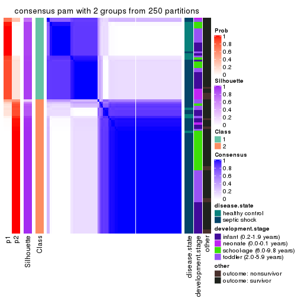</p>

</div>
<div id='tab-SD-pam-consensus-heatmap-2'>
<pre><code class="r">consensus_heatmap(res, k = 3)
</code></pre>

<p>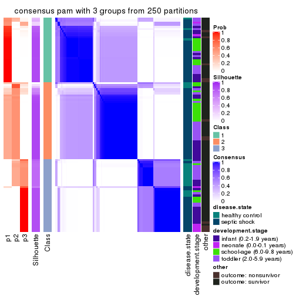</p>

</div>
<div id='tab-SD-pam-consensus-heatmap-3'>
<pre><code class="r">consensus_heatmap(res, k = 4)
</code></pre>

<p>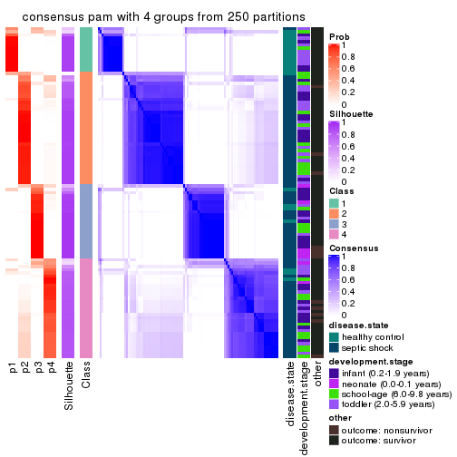</p>

</div>
<div id='tab-SD-pam-consensus-heatmap-4'>
<pre><code class="r">consensus_heatmap(res, k = 5)
</code></pre>

<p>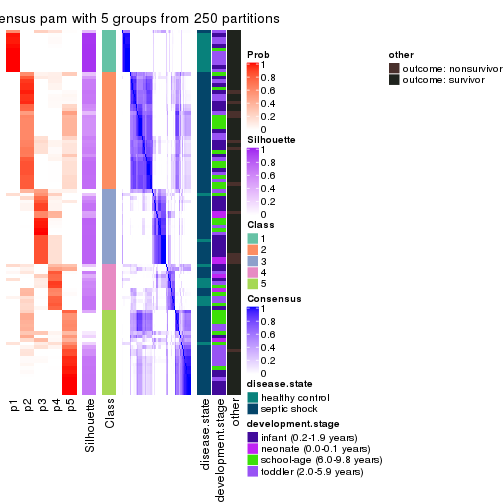</p>

</div>
<div id='tab-SD-pam-consensus-heatmap-5'>
<pre><code class="r">consensus_heatmap(res, k = 6)
</code></pre>

<p>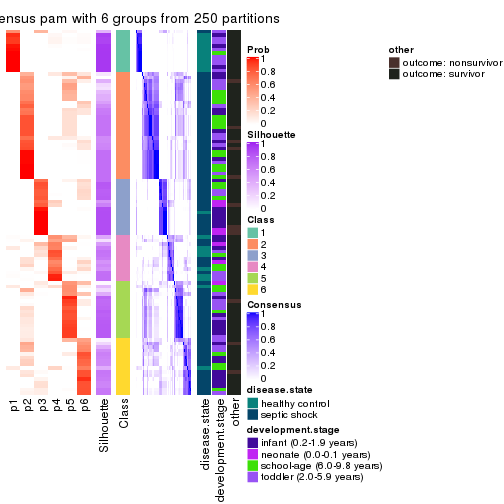</p>

</div>
</div>

Heatmaps for the membership of samples in all partitions to see how consistent they are:


<script>
$( function() {
	$( '#tabs-SD-pam-membership-heatmap' ).tabs();
} );
</script>
<div id='tabs-SD-pam-membership-heatmap'>
<ul>
<li><a href='#tab-SD-pam-membership-heatmap-1'>k = 2</a></li>
<li><a href='#tab-SD-pam-membership-heatmap-2'>k = 3</a></li>
<li><a href='#tab-SD-pam-membership-heatmap-3'>k = 4</a></li>
<li><a href='#tab-SD-pam-membership-heatmap-4'>k = 5</a></li>
<li><a href='#tab-SD-pam-membership-heatmap-5'>k = 6</a></li>
</ul>
<div id='tab-SD-pam-membership-heatmap-1'>
<pre><code class="r">membership_heatmap(res, k = 2)
</code></pre>

<p>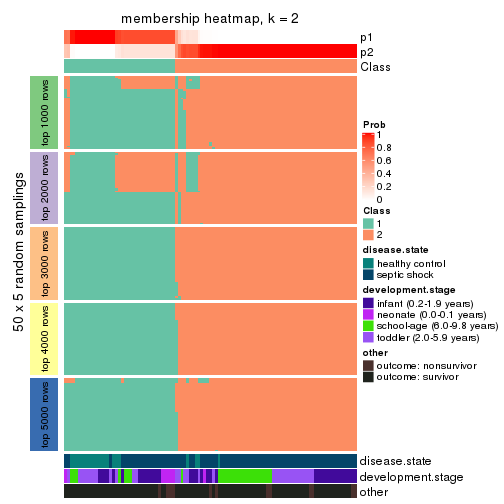</p>

</div>
<div id='tab-SD-pam-membership-heatmap-2'>
<pre><code class="r">membership_heatmap(res, k = 3)
</code></pre>

<p>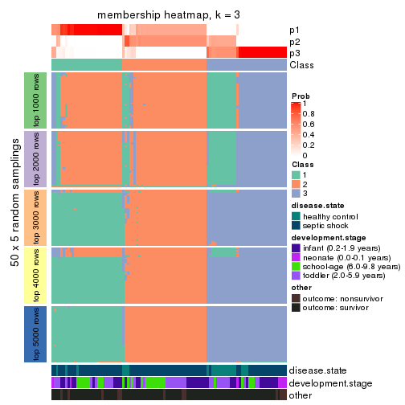</p>

</div>
<div id='tab-SD-pam-membership-heatmap-3'>
<pre><code class="r">membership_heatmap(res, k = 4)
</code></pre>

<p>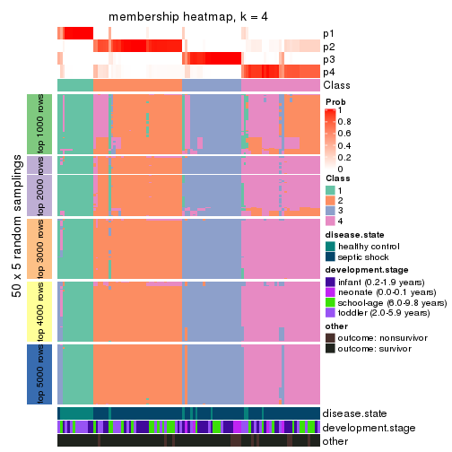</p>

</div>
<div id='tab-SD-pam-membership-heatmap-4'>
<pre><code class="r">membership_heatmap(res, k = 5)
</code></pre>

<p>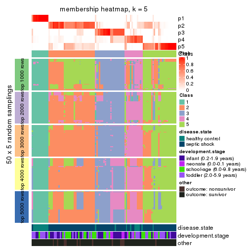</p>

</div>
<div id='tab-SD-pam-membership-heatmap-5'>
<pre><code class="r">membership_heatmap(res, k = 6)
</code></pre>

<p>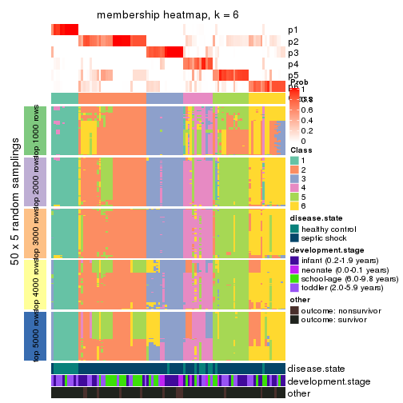</p>

</div>
</div>

As soon as we have had the classes for columns, we can look for signatures
which are significantly different between classes which can be candidate marks
for certain classes. Following are the heatmaps for signatures.


Signature heatmaps where rows are scaled:


<script>
$( function() {
	$( '#tabs-SD-pam-get-signatures' ).tabs();
} );
</script>
<div id='tabs-SD-pam-get-signatures'>
<ul>
<li><a href='#tab-SD-pam-get-signatures-1'>k = 2</a></li>
<li><a href='#tab-SD-pam-get-signatures-2'>k = 3</a></li>
<li><a href='#tab-SD-pam-get-signatures-3'>k = 4</a></li>
<li><a href='#tab-SD-pam-get-signatures-4'>k = 5</a></li>
<li><a href='#tab-SD-pam-get-signatures-5'>k = 6</a></li>
</ul>
<div id='tab-SD-pam-get-signatures-1'>
<pre><code class="r">get_signatures(res, k = 2)
</code></pre>

<p>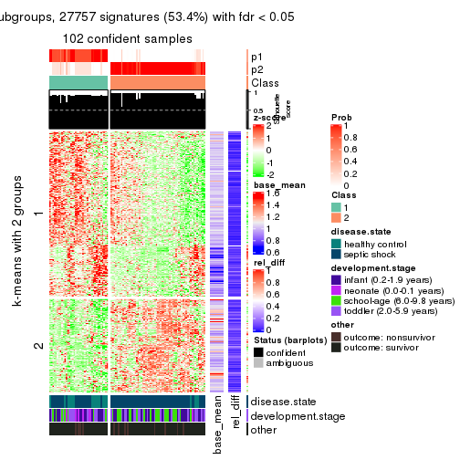</p>

</div>
<div id='tab-SD-pam-get-signatures-2'>
<pre><code class="r">get_signatures(res, k = 3)
</code></pre>

<p>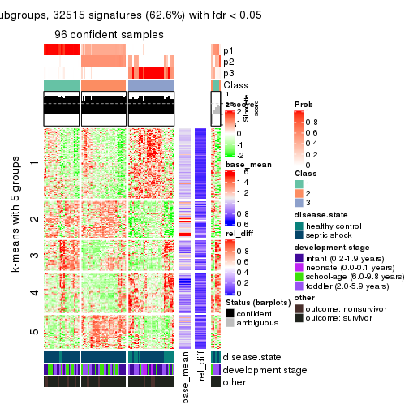</p>

</div>
<div id='tab-SD-pam-get-signatures-3'>
<pre><code class="r">get_signatures(res, k = 4)
</code></pre>

<p>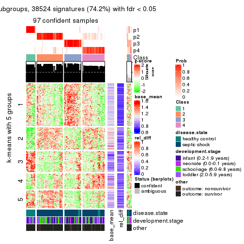</p>

</div>
<div id='tab-SD-pam-get-signatures-4'>
<pre><code class="r">get_signatures(res, k = 5)
</code></pre>

<p>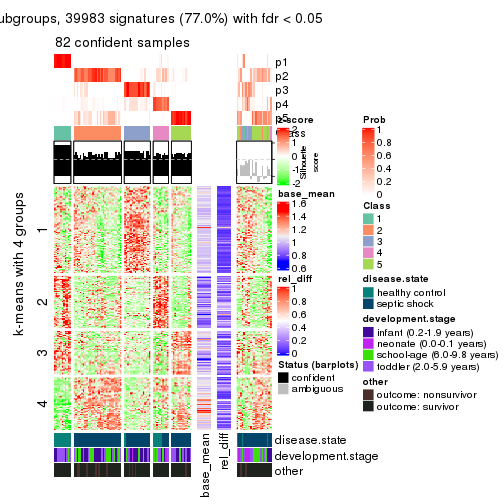</p>

</div>
<div id='tab-SD-pam-get-signatures-5'>
<pre><code class="r">get_signatures(res, k = 6)
</code></pre>

<p>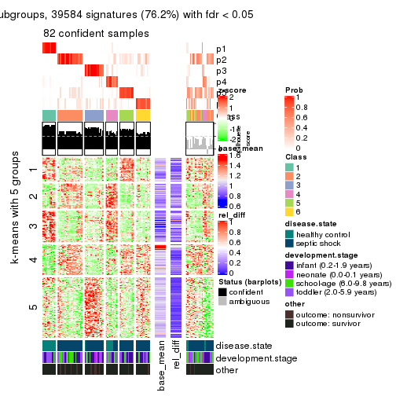</p>

</div>
</div>


Signature heatmaps where rows are not scaled:


<script>
$( function() {
	$( '#tabs-SD-pam-get-signatures-no-scale' ).tabs();
} );
</script>
<div id='tabs-SD-pam-get-signatures-no-scale'>
<ul>
<li><a href='#tab-SD-pam-get-signatures-no-scale-1'>k = 2</a></li>
<li><a href='#tab-SD-pam-get-signatures-no-scale-2'>k = 3</a></li>
<li><a href='#tab-SD-pam-get-signatures-no-scale-3'>k = 4</a></li>
<li><a href='#tab-SD-pam-get-signatures-no-scale-4'>k = 5</a></li>
<li><a href='#tab-SD-pam-get-signatures-no-scale-5'>k = 6</a></li>
</ul>
<div id='tab-SD-pam-get-signatures-no-scale-1'>
<pre><code class="r">get_signatures(res, k = 2, scale_rows = FALSE)
</code></pre>

<p>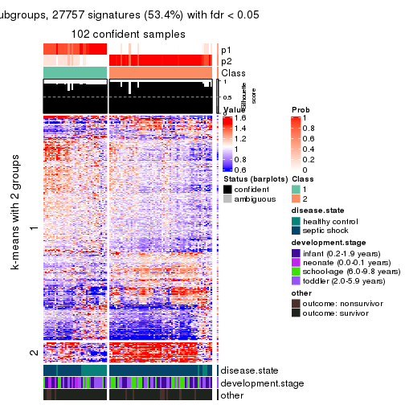</p>

</div>
<div id='tab-SD-pam-get-signatures-no-scale-2'>
<pre><code class="r">get_signatures(res, k = 3, scale_rows = FALSE)
</code></pre>

<p>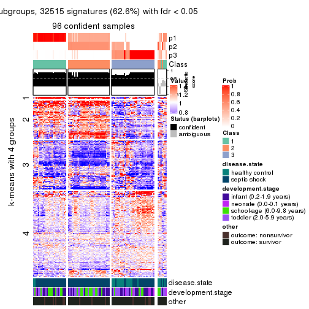</p>

</div>
<div id='tab-SD-pam-get-signatures-no-scale-3'>
<pre><code class="r">get_signatures(res, k = 4, scale_rows = FALSE)
</code></pre>

<p>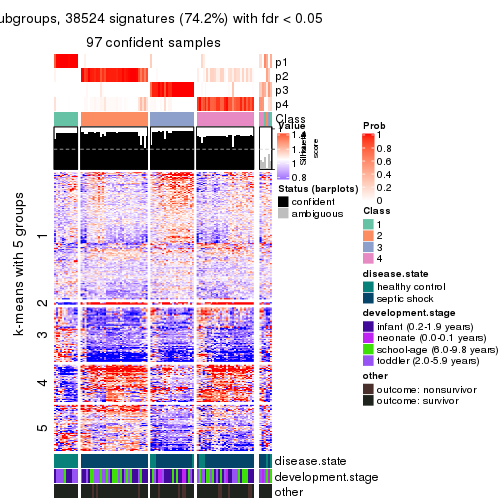</p>

</div>
<div id='tab-SD-pam-get-signatures-no-scale-4'>
<pre><code class="r">get_signatures(res, k = 5, scale_rows = FALSE)
</code></pre>

<p>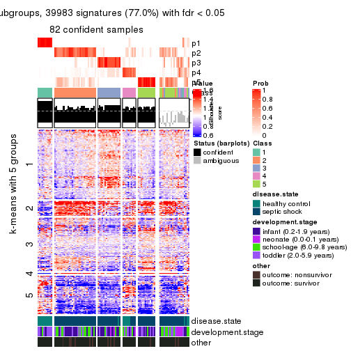</p>

</div>
<div id='tab-SD-pam-get-signatures-no-scale-5'>
<pre><code class="r">get_signatures(res, k = 6, scale_rows = FALSE)
</code></pre>

<p>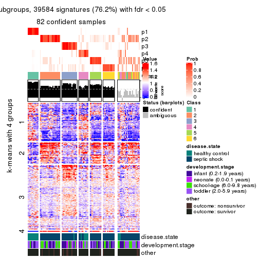</p>

</div>
</div>


Compare the overlap of signatures from different k:

```r
compare_signatures(res)
```

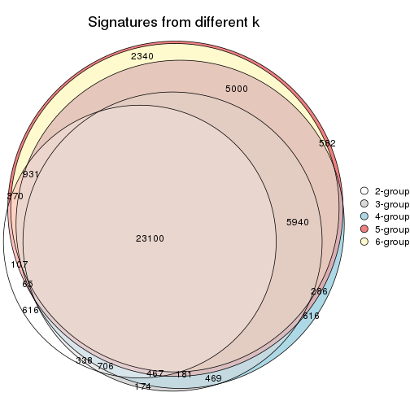

`get_signature()` returns a data frame invisibly. TO get the list of signatures, the function
call should be assigned to a variable explicitly. In following code, if `plot` argument is set
to `FALSE`, no heatmap is plotted while only the differential analysis is performed.

```r
# code only for demonstration
tb = get_signature(res, k = ..., plot = FALSE)
```

An example of the output of `tb` is:

```
#>   which_row         fdr    mean_1    mean_2 scaled_mean_1 scaled_mean_2 km
#> 1        38 0.042760348  8.373488  9.131774    -0.5533452     0.5164555  1
#> 2        40 0.018707592  7.106213  8.469186    -0.6173731     0.5762149  1
#> 3        55 0.019134737 10.221463 11.207825    -0.6159697     0.5749050  1
#> 4        59 0.006059896  5.921854  7.869574    -0.6899429     0.6439467  1
#> 5        60 0.018055526  8.928898 10.211722    -0.6204761     0.5791110  1
#> 6        98 0.009384629 15.714769 14.887706     0.6635654    -0.6193277  2
...
```

The columns in `tb` are:

1. `which_row`: row indices corresponding to the input matrix.
2. `fdr`: FDR for the differential test. 
3. `mean_x`: The mean value in group x.
4. `scaled_mean_x`: The mean value in group x after rows are scaled.
5. `km`: Row groups if k-means clustering is applied to rows.


UMAP plot which shows how samples are separated.


<script>
$( function() {
	$( '#tabs-SD-pam-dimension-reduction' ).tabs();
} );
</script>
<div id='tabs-SD-pam-dimension-reduction'>
<ul>
<li><a href='#tab-SD-pam-dimension-reduction-1'>k = 2</a></li>
<li><a href='#tab-SD-pam-dimension-reduction-2'>k = 3</a></li>
<li><a href='#tab-SD-pam-dimension-reduction-3'>k = 4</a></li>
<li><a href='#tab-SD-pam-dimension-reduction-4'>k = 5</a></li>
<li><a href='#tab-SD-pam-dimension-reduction-5'>k = 6</a></li>
</ul>
<div id='tab-SD-pam-dimension-reduction-1'>
<pre><code class="r">dimension_reduction(res, k = 2, method = &quot;UMAP&quot;)
</code></pre>

<p>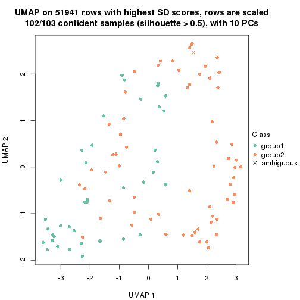</p>

</div>
<div id='tab-SD-pam-dimension-reduction-2'>
<pre><code class="r">dimension_reduction(res, k = 3, method = &quot;UMAP&quot;)
</code></pre>

<p>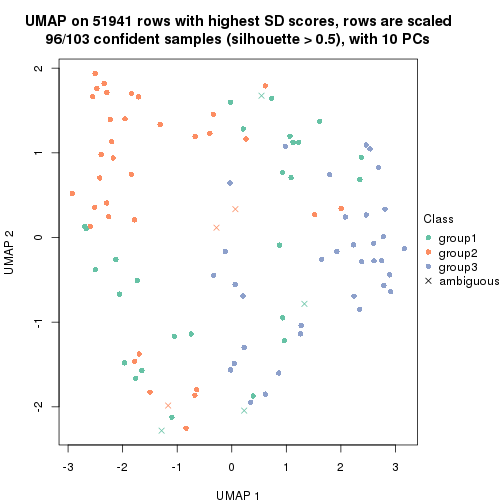</p>

</div>
<div id='tab-SD-pam-dimension-reduction-3'>
<pre><code class="r">dimension_reduction(res, k = 4, method = &quot;UMAP&quot;)
</code></pre>

<p>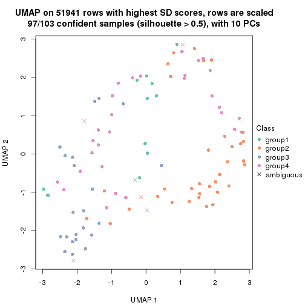</p>

</div>
<div id='tab-SD-pam-dimension-reduction-4'>
<pre><code class="r">dimension_reduction(res, k = 5, method = &quot;UMAP&quot;)
</code></pre>

<p>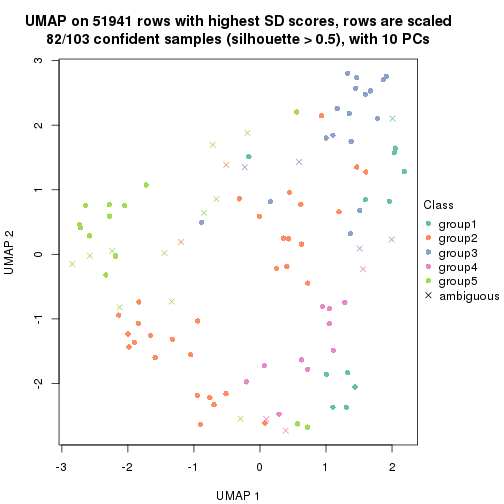</p>

</div>
<div id='tab-SD-pam-dimension-reduction-5'>
<pre><code class="r">dimension_reduction(res, k = 6, method = &quot;UMAP&quot;)
</code></pre>

<p>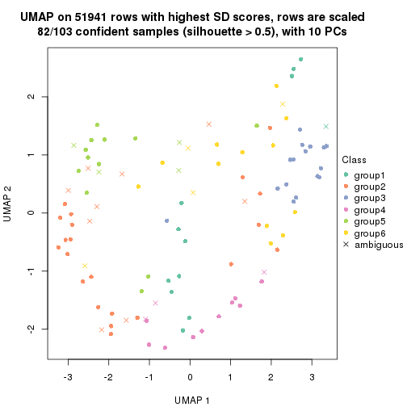</p>

</div>
</div>


Following heatmap shows how subgroups are split when increasing `k`:

```r
collect_classes(res)
```

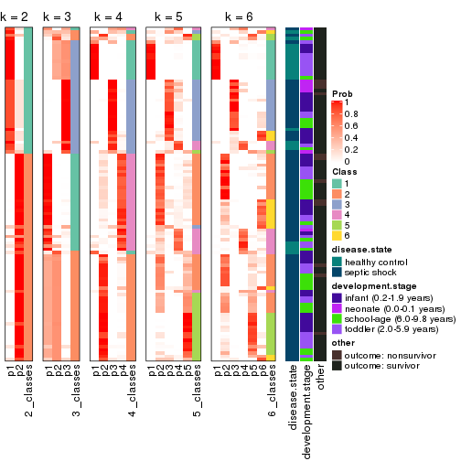


Test correlation between subgroups and known annotations. If the known
annotation is numeric, one-way ANOVA test is applied, and if the known
annotation is discrete, chi-squared contingency table test is applied.

```r
test_to_known_factors(res)
```

```
#>          n disease.state(p) development.stage(p) other(p) k
#> SD:pam 102         1.97e-05               0.0379    0.956 2
#> SD:pam  96         4.85e-06               0.1400    0.509 3
#> SD:pam  97         8.95e-13               0.0260    0.333 4
#> SD:pam  82         8.65e-13               0.0541    0.275 5
#> SD:pam  82         3.66e-12               0.0154    0.250 6
```


If matrix rows can be associated to genes, consider to use `functional_enrichment(res,
...)` to perform function enrichment for the signature genes. See [this vignette](http://bioconductor.org/packages/devel/bioc/vignettes/cola/inst/doc/functional_enrichment.html) for more detailed explanations.


 

---------------------------------------------------


### SD:mclust*


The object with results only for a single top-value method and a single partition method 
can be extracted as:

```r
res = res_list["SD", "mclust"]
# you can also extract it by
# res = res_list["SD:mclust"]
```

A summary of `res` and all the functions that can be applied to it:

```r
res
```

```
#> A 'ConsensusPartition' object with k = 2, 3, 4, 5, 6.
#>   On a matrix with 51941 rows and 103 columns.
#>   Top rows (1000, 2000, 3000, 4000, 5000) are extracted by 'SD' method.
#>   Subgroups are detected by 'mclust' method.
#>   Performed in total 1250 partitions by row resampling.
#>   Best k for subgroups seems to be 3.
#> 
#> Following methods can be applied to this 'ConsensusPartition' object:
#>  [1] "cola_report"             "collect_classes"         "collect_plots"          
#>  [4] "collect_stats"           "colnames"                "compare_signatures"     
#>  [7] "consensus_heatmap"       "dimension_reduction"     "functional_enrichment"  
#> [10] "get_anno_col"            "get_anno"                "get_classes"            
#> [13] "get_consensus"           "get_matrix"              "get_membership"         
#> [16] "get_param"               "get_signatures"          "get_stats"              
#> [19] "is_best_k"               "is_stable_k"             "membership_heatmap"     
#> [22] "ncol"                    "nrow"                    "plot_ecdf"              
#> [25] "rownames"                "select_partition_number" "show"                   
#> [28] "suggest_best_k"          "test_to_known_factors"
```

`collect_plots()` function collects all the plots made from `res` for all `k` (number of partitions)
into one single page to provide an easy and fast comparison between different `k`.

```r
collect_plots(res)
```

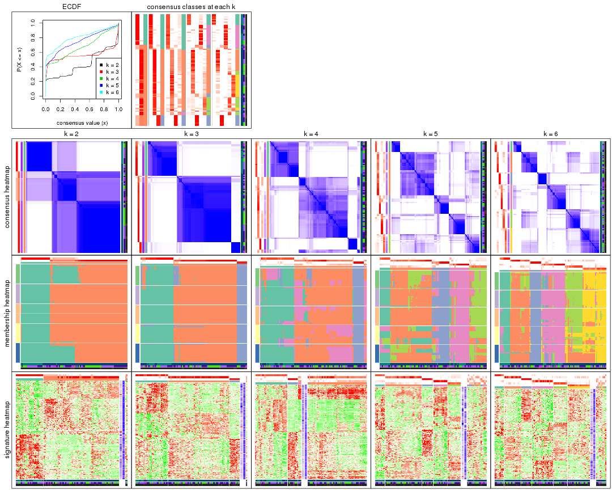

The plots are:

- The first row: a plot of the ECDF (empirical cumulative distribution
  function) curves of the consensus matrix for each `k` and the heatmap of
  predicted classes for each `k`.
- The second row: heatmaps of the consensus matrix for each `k`.
- The third row: heatmaps of the membership matrix for each `k`.
- The fouth row: heatmaps of the signatures for each `k`.

All the plots in panels can be made by individual functions and they are
plotted later in this section.

`select_partition_number()` produces several plots showing different
statistics for choosing "optimized" `k`. There are following statistics:

- ECDF curves of the consensus matrix for each `k`;
- 1-PAC. [The PAC
  score](https://en.wikipedia.org/wiki/Consensus_clustering#Over-interpretation_potential_of_consensus_clustering)
  measures the proportion of the ambiguous subgrouping.
- Mean silhouette score.
- Concordance. The mean probability of fiting the consensus class ids in all
  partitions.
- Area increased. Denote $A_k$ as the area under the ECDF curve for current
  `k`, the area increased is defined as $A_k - A_{k-1}$.
- Rand index. The percent of pairs of samples that are both in a same cluster
  or both are not in a same cluster in the partition of k and k-1.
- Jaccard index. The ratio of pairs of samples are both in a same cluster in
  the partition of k and k-1 and the pairs of samples are both in a same
  cluster in the partition k or k-1.

The detailed explanations of these statistics can be found in [the _cola_
vignette](http://bioconductor.org/packages/devel/bioc/vignettes/cola/inst/doc/cola.html#toc_13).

Generally speaking, lower PAC score, higher mean silhouette score or higher
concordance corresponds to better partition. Rand index and Jaccard index
measure how similar the current partition is compared to partition with `k-1`.
If they are too similar, we won't accept `k` is better than `k-1`.

```r
select_partition_number(res)
```

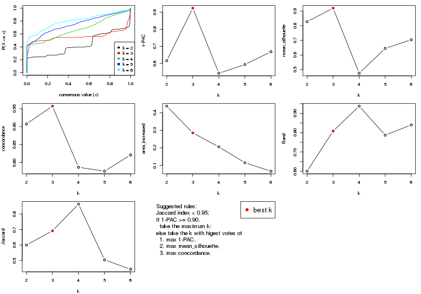

The numeric values for all these statistics can be obtained by `get_stats()`.

```r
get_stats(res)
```

```
#>   k 1-PAC mean_silhouette concordance area_increased  Rand Jaccard
#> 2 2 0.616           0.828       0.907         0.4372 0.600   0.600
#> 3 3 0.924           0.920       0.957         0.2851 0.808   0.692
#> 4 4 0.543           0.476       0.787         0.2056 0.937   0.864
#> 5 5 0.593           0.645       0.776         0.1152 0.787   0.504
#> 6 6 0.669           0.704       0.821         0.0671 0.840   0.444
```

`suggest_best_k()` suggests the best $k$ based on these statistics. The rules are as follows:

- All $k$ with Jaccard index larger than 0.95 are removed because increasing
  $k$ does not provide enough extra information. If all $k$ are removed, it is
  marked as no subgroup is detected.
- For all $k$ with 1-PAC score larger than 0.9, the maximal $k$ is taken as
  the best $k$, and other $k$ are marked as optional $k$.
- If it does not fit the second rule. The $k$ with the maximal vote of the
  highest 1-PAC score, highest mean silhouette, and highest concordance is
  taken as the best $k$.

```r
suggest_best_k(res)
```

```
#> [1] 3
```


Following shows the table of the partitions (You need to click the **show/hide
code output** link to see it). The membership matrix (columns with name `p*`)
is inferred by
[`clue::cl_consensus()`](https://www.rdocumentation.org/link/cl_consensus?package=clue)
function with the `SE` method. Basically the value in the membership matrix
represents the probability to belong to a certain group. The finall class
label for an item is determined with the group with highest probability it
belongs to.

In `get_classes()` function, the entropy is calculated from the membership
matrix and the silhouette score is calculated from the consensus matrix.


<script>
$( function() {
	$( '#tabs-SD-mclust-get-classes' ).tabs();
} );
</script>
<div id='tabs-SD-mclust-get-classes'>
<ul>
<li><a href='#tab-SD-mclust-get-classes-1'>k = 2</a></li>
<li><a href='#tab-SD-mclust-get-classes-2'>k = 3</a></li>
<li><a href='#tab-SD-mclust-get-classes-3'>k = 4</a></li>
<li><a href='#tab-SD-mclust-get-classes-4'>k = 5</a></li>
<li><a href='#tab-SD-mclust-get-classes-5'>k = 6</a></li>
</ul>

<div id='tab-SD-mclust-get-classes-1'>
<p><a id='tab-SD-mclust-get-classes-1-a' style='color:#0366d6' href='#'>show/hide code output</a></p>
<pre><code class="r">cbind(get_classes(res, k = 2), get_membership(res, k = 2))
</code></pre>

<pre><code>#&gt;           class entropy silhouette    p1    p2
#&gt; GSM647569     2  0.9491      0.606 0.368 0.632
#&gt; GSM647574     2  0.9491      0.606 0.368 0.632
#&gt; GSM647577     2  0.9491      0.606 0.368 0.632
#&gt; GSM647547     1  0.0000      0.986 1.000 0.000
#&gt; GSM647552     2  0.9580      0.587 0.380 0.620
#&gt; GSM647553     2  0.9608      0.580 0.384 0.616
#&gt; GSM647565     2  0.9909      0.456 0.444 0.556
#&gt; GSM647545     2  0.0000      0.860 0.000 1.000
#&gt; GSM647549     2  0.0000      0.860 0.000 1.000
#&gt; GSM647550     2  0.2043      0.849 0.032 0.968
#&gt; GSM647560     2  0.0000      0.860 0.000 1.000
#&gt; GSM647617     2  0.9491      0.606 0.368 0.632
#&gt; GSM647528     2  0.0000      0.860 0.000 1.000
#&gt; GSM647529     1  0.0000      0.986 1.000 0.000
#&gt; GSM647531     2  0.0672      0.856 0.008 0.992
#&gt; GSM647540     2  0.9393      0.619 0.356 0.644
#&gt; GSM647541     2  0.0000      0.860 0.000 1.000
#&gt; GSM647546     2  0.9491      0.606 0.368 0.632
#&gt; GSM647557     2  0.0672      0.856 0.008 0.992
#&gt; GSM647561     2  0.0000      0.860 0.000 1.000
#&gt; GSM647567     2  0.9491      0.606 0.368 0.632
#&gt; GSM647568     2  0.0000      0.860 0.000 1.000
#&gt; GSM647570     2  0.0000      0.860 0.000 1.000
#&gt; GSM647573     1  0.0000      0.986 1.000 0.000
#&gt; GSM647576     2  0.8713      0.681 0.292 0.708
#&gt; GSM647579     2  0.9460      0.610 0.364 0.636
#&gt; GSM647580     2  0.9491      0.606 0.368 0.632
#&gt; GSM647583     2  0.9491      0.606 0.368 0.632
#&gt; GSM647592     2  0.6887      0.766 0.184 0.816
#&gt; GSM647593     2  0.0000      0.860 0.000 1.000
#&gt; GSM647595     2  0.0000      0.860 0.000 1.000
#&gt; GSM647597     1  0.0376      0.981 0.996 0.004
#&gt; GSM647598     2  0.0000      0.860 0.000 1.000
#&gt; GSM647613     2  0.0000      0.860 0.000 1.000
#&gt; GSM647615     2  0.4431      0.821 0.092 0.908
#&gt; GSM647616     2  0.9491      0.606 0.368 0.632
#&gt; GSM647619     2  0.0000      0.860 0.000 1.000
#&gt; GSM647582     2  0.0000      0.860 0.000 1.000
#&gt; GSM647591     2  0.0000      0.860 0.000 1.000
#&gt; GSM647527     2  0.0000      0.860 0.000 1.000
#&gt; GSM647530     1  0.0000      0.986 1.000 0.000
#&gt; GSM647532     1  0.0000      0.986 1.000 0.000
#&gt; GSM647544     2  0.0000      0.860 0.000 1.000
#&gt; GSM647551     2  0.0000      0.860 0.000 1.000
#&gt; GSM647556     2  0.9491      0.606 0.368 0.632
#&gt; GSM647558     2  0.0000      0.860 0.000 1.000
#&gt; GSM647572     2  0.9491      0.606 0.368 0.632
#&gt; GSM647578     2  0.6887      0.766 0.184 0.816
#&gt; GSM647581     2  0.0672      0.856 0.008 0.992
#&gt; GSM647594     2  0.7219      0.750 0.200 0.800
#&gt; GSM647599     1  0.0000      0.986 1.000 0.000
#&gt; GSM647600     2  0.7219      0.751 0.200 0.800
#&gt; GSM647601     2  0.0000      0.860 0.000 1.000
#&gt; GSM647603     2  0.0672      0.858 0.008 0.992
#&gt; GSM647610     2  0.9393      0.619 0.356 0.644
#&gt; GSM647611     2  0.0000      0.860 0.000 1.000
#&gt; GSM647612     2  0.0000      0.860 0.000 1.000
#&gt; GSM647614     2  0.0000      0.860 0.000 1.000
#&gt; GSM647618     2  0.0000      0.860 0.000 1.000
#&gt; GSM647629     2  0.0000      0.860 0.000 1.000
#&gt; GSM647535     2  0.0000      0.860 0.000 1.000
#&gt; GSM647563     2  0.0000      0.860 0.000 1.000
#&gt; GSM647542     2  0.0000      0.860 0.000 1.000
#&gt; GSM647543     2  0.0000      0.860 0.000 1.000
#&gt; GSM647548     1  0.0000      0.986 1.000 0.000
#&gt; GSM647554     2  0.6712      0.771 0.176 0.824
#&gt; GSM647555     2  0.0000      0.860 0.000 1.000
#&gt; GSM647559     2  0.0000      0.860 0.000 1.000
#&gt; GSM647562     2  0.0000      0.860 0.000 1.000
#&gt; GSM647564     2  0.9491      0.606 0.368 0.632
#&gt; GSM647571     2  0.0000      0.860 0.000 1.000
#&gt; GSM647584     2  0.0000      0.860 0.000 1.000
#&gt; GSM647585     2  0.9491      0.606 0.368 0.632
#&gt; GSM647586     2  0.0000      0.860 0.000 1.000
#&gt; GSM647587     2  0.0000      0.860 0.000 1.000
#&gt; GSM647588     2  0.2603      0.844 0.044 0.956
#&gt; GSM647596     2  0.0000      0.860 0.000 1.000
#&gt; GSM647602     2  0.9491      0.606 0.368 0.632
#&gt; GSM647609     2  0.0000      0.860 0.000 1.000
#&gt; GSM647620     2  0.0000      0.860 0.000 1.000
#&gt; GSM647627     2  0.0000      0.860 0.000 1.000
#&gt; GSM647628     2  0.0000      0.860 0.000 1.000
#&gt; GSM647533     1  0.0000      0.986 1.000 0.000
#&gt; GSM647536     1  0.0000      0.986 1.000 0.000
#&gt; GSM647537     1  0.0000      0.986 1.000 0.000
#&gt; GSM647606     1  0.0000      0.986 1.000 0.000
#&gt; GSM647621     1  0.0000      0.986 1.000 0.000
#&gt; GSM647626     2  0.9580      0.587 0.380 0.620
#&gt; GSM647538     1  0.0000      0.986 1.000 0.000
#&gt; GSM647575     1  0.0000      0.986 1.000 0.000
#&gt; GSM647590     1  0.0000      0.986 1.000 0.000
#&gt; GSM647605     1  0.0000      0.986 1.000 0.000
#&gt; GSM647607     1  0.0000      0.986 1.000 0.000
#&gt; GSM647608     1  0.0000      0.986 1.000 0.000
#&gt; GSM647622     1  0.0000      0.986 1.000 0.000
#&gt; GSM647623     1  0.0000      0.986 1.000 0.000
#&gt; GSM647624     1  0.0000      0.986 1.000 0.000
#&gt; GSM647625     1  0.0000      0.986 1.000 0.000
#&gt; GSM647534     1  0.8861      0.400 0.696 0.304
#&gt; GSM647539     1  0.0000      0.986 1.000 0.000
#&gt; GSM647566     1  0.0000      0.986 1.000 0.000
#&gt; GSM647589     1  0.0000      0.986 1.000 0.000
#&gt; GSM647604     1  0.0000      0.986 1.000 0.000
</code></pre>

<script>
$('#tab-SD-mclust-get-classes-1-a').parent().next().next().hide();
$('#tab-SD-mclust-get-classes-1-a').click(function(){
  $('#tab-SD-mclust-get-classes-1-a').parent().next().next().toggle();
  return(false);
});
</script>
</div>

<div id='tab-SD-mclust-get-classes-2'>
<p><a id='tab-SD-mclust-get-classes-2-a' style='color:#0366d6' href='#'>show/hide code output</a></p>
<pre><code class="r">cbind(get_classes(res, k = 3), get_membership(res, k = 3))
</code></pre>

<pre><code>#&gt;           class entropy silhouette    p1    p2    p3
#&gt; GSM647569     3  0.0983      1.000 0.016 0.004 0.980
#&gt; GSM647574     1  0.4974      0.711 0.764 0.000 0.236
#&gt; GSM647577     3  0.0983      1.000 0.016 0.004 0.980
#&gt; GSM647547     1  0.2356      0.901 0.928 0.000 0.072
#&gt; GSM647552     2  0.1636      0.949 0.016 0.964 0.020
#&gt; GSM647553     1  0.4291      0.789 0.820 0.000 0.180
#&gt; GSM647565     1  0.5986      0.628 0.736 0.240 0.024
#&gt; GSM647545     2  0.0000      0.958 0.000 1.000 0.000
#&gt; GSM647549     2  0.0000      0.958 0.000 1.000 0.000
#&gt; GSM647550     2  0.0000      0.958 0.000 1.000 0.000
#&gt; GSM647560     2  0.0892      0.955 0.000 0.980 0.020
#&gt; GSM647617     3  0.0983      1.000 0.016 0.004 0.980
#&gt; GSM647528     2  0.0000      0.958 0.000 1.000 0.000
#&gt; GSM647529     1  0.0000      0.935 1.000 0.000 0.000
#&gt; GSM647531     2  0.0000      0.958 0.000 1.000 0.000
#&gt; GSM647540     2  0.5506      0.729 0.016 0.764 0.220
#&gt; GSM647541     2  0.0892      0.955 0.000 0.980 0.020
#&gt; GSM647546     2  0.6905      0.257 0.016 0.544 0.440
#&gt; GSM647557     2  0.0000      0.958 0.000 1.000 0.000
#&gt; GSM647561     2  0.0000      0.958 0.000 1.000 0.000
#&gt; GSM647567     2  0.5167      0.785 0.024 0.804 0.172
#&gt; GSM647568     2  0.0424      0.956 0.008 0.992 0.000
#&gt; GSM647570     2  0.0000      0.958 0.000 1.000 0.000
#&gt; GSM647573     1  0.2689      0.903 0.932 0.032 0.036
#&gt; GSM647576     2  0.1636      0.949 0.016 0.964 0.020
#&gt; GSM647579     2  0.2383      0.934 0.016 0.940 0.044
#&gt; GSM647580     3  0.0983      1.000 0.016 0.004 0.980
#&gt; GSM647583     3  0.0983      1.000 0.016 0.004 0.980
#&gt; GSM647592     2  0.2269      0.943 0.016 0.944 0.040
#&gt; GSM647593     2  0.1529      0.951 0.000 0.960 0.040
#&gt; GSM647595     2  0.1529      0.951 0.000 0.960 0.040
#&gt; GSM647597     1  0.1753      0.896 0.952 0.048 0.000
#&gt; GSM647598     2  0.0747      0.956 0.000 0.984 0.016
#&gt; GSM647613     2  0.0000      0.958 0.000 1.000 0.000
#&gt; GSM647615     2  0.0000      0.958 0.000 1.000 0.000
#&gt; GSM647616     3  0.0983      1.000 0.016 0.004 0.980
#&gt; GSM647619     2  0.1529      0.951 0.000 0.960 0.040
#&gt; GSM647582     2  0.1289      0.953 0.000 0.968 0.032
#&gt; GSM647591     2  0.1529      0.951 0.000 0.960 0.040
#&gt; GSM647527     2  0.0000      0.958 0.000 1.000 0.000
#&gt; GSM647530     1  0.5254      0.603 0.736 0.264 0.000
#&gt; GSM647532     1  0.0237      0.934 0.996 0.000 0.004
#&gt; GSM647544     2  0.0000      0.958 0.000 1.000 0.000
#&gt; GSM647551     2  0.1411      0.952 0.000 0.964 0.036
#&gt; GSM647556     3  0.0983      1.000 0.016 0.004 0.980
#&gt; GSM647558     2  0.0000      0.958 0.000 1.000 0.000
#&gt; GSM647572     2  0.5595      0.695 0.016 0.756 0.228
#&gt; GSM647578     2  0.4796      0.743 0.000 0.780 0.220
#&gt; GSM647581     2  0.0000      0.958 0.000 1.000 0.000
#&gt; GSM647594     2  0.4974      0.684 0.236 0.764 0.000
#&gt; GSM647599     1  0.0000      0.935 1.000 0.000 0.000
#&gt; GSM647600     2  0.1636      0.949 0.016 0.964 0.020
#&gt; GSM647601     2  0.1411      0.952 0.000 0.964 0.036
#&gt; GSM647603     2  0.1482      0.951 0.012 0.968 0.020
#&gt; GSM647610     2  0.4209      0.847 0.120 0.860 0.020
#&gt; GSM647611     2  0.1411      0.952 0.000 0.964 0.036
#&gt; GSM647612     2  0.0000      0.958 0.000 1.000 0.000
#&gt; GSM647614     2  0.0000      0.958 0.000 1.000 0.000
#&gt; GSM647618     2  0.0237      0.958 0.000 0.996 0.004
#&gt; GSM647629     2  0.1289      0.953 0.000 0.968 0.032
#&gt; GSM647535     2  0.0892      0.955 0.000 0.980 0.020
#&gt; GSM647563     2  0.0000      0.958 0.000 1.000 0.000
#&gt; GSM647542     2  0.0000      0.958 0.000 1.000 0.000
#&gt; GSM647543     2  0.0000      0.958 0.000 1.000 0.000
#&gt; GSM647548     1  0.5945      0.635 0.740 0.236 0.024
#&gt; GSM647554     2  0.1525      0.952 0.004 0.964 0.032
#&gt; GSM647555     2  0.0000      0.958 0.000 1.000 0.000
#&gt; GSM647559     2  0.0000      0.958 0.000 1.000 0.000
#&gt; GSM647562     2  0.0000      0.958 0.000 1.000 0.000
#&gt; GSM647564     3  0.0983      1.000 0.016 0.004 0.980
#&gt; GSM647571     2  0.0000      0.958 0.000 1.000 0.000
#&gt; GSM647584     2  0.1529      0.951 0.000 0.960 0.040
#&gt; GSM647585     3  0.0983      1.000 0.016 0.004 0.980
#&gt; GSM647586     2  0.0237      0.958 0.000 0.996 0.004
#&gt; GSM647587     2  0.0000      0.958 0.000 1.000 0.000
#&gt; GSM647588     2  0.0000      0.958 0.000 1.000 0.000
#&gt; GSM647596     2  0.0000      0.958 0.000 1.000 0.000
#&gt; GSM647602     3  0.0983      1.000 0.016 0.004 0.980
#&gt; GSM647609     2  0.1411      0.952 0.000 0.964 0.036
#&gt; GSM647620     2  0.1289      0.953 0.000 0.968 0.032
#&gt; GSM647627     2  0.1289      0.953 0.000 0.968 0.032
#&gt; GSM647628     2  0.0000      0.958 0.000 1.000 0.000
#&gt; GSM647533     1  0.0000      0.935 1.000 0.000 0.000
#&gt; GSM647536     1  0.0000      0.935 1.000 0.000 0.000
#&gt; GSM647537     1  0.0000      0.935 1.000 0.000 0.000
#&gt; GSM647606     1  0.0000      0.935 1.000 0.000 0.000
#&gt; GSM647621     1  0.1031      0.929 0.976 0.000 0.024
#&gt; GSM647626     1  0.2356      0.901 0.928 0.000 0.072
#&gt; GSM647538     1  0.0000      0.935 1.000 0.000 0.000
#&gt; GSM647575     1  0.1031      0.929 0.976 0.000 0.024
#&gt; GSM647590     1  0.0000      0.935 1.000 0.000 0.000
#&gt; GSM647605     1  0.0000      0.935 1.000 0.000 0.000
#&gt; GSM647607     1  0.1031      0.929 0.976 0.000 0.024
#&gt; GSM647608     1  0.1163      0.927 0.972 0.000 0.028
#&gt; GSM647622     1  0.0000      0.935 1.000 0.000 0.000
#&gt; GSM647623     1  0.0000      0.935 1.000 0.000 0.000
#&gt; GSM647624     1  0.0000      0.935 1.000 0.000 0.000
#&gt; GSM647625     1  0.0000      0.935 1.000 0.000 0.000
#&gt; GSM647534     1  0.0000      0.935 1.000 0.000 0.000
#&gt; GSM647539     1  0.1031      0.929 0.976 0.000 0.024
#&gt; GSM647566     1  0.0000      0.935 1.000 0.000 0.000
#&gt; GSM647589     1  0.2261      0.903 0.932 0.000 0.068
#&gt; GSM647604     1  0.0000      0.935 1.000 0.000 0.000
</code></pre>

<script>
$('#tab-SD-mclust-get-classes-2-a').parent().next().next().hide();
$('#tab-SD-mclust-get-classes-2-a').click(function(){
  $('#tab-SD-mclust-get-classes-2-a').parent().next().next().toggle();
  return(false);
});
</script>
</div>

<div id='tab-SD-mclust-get-classes-3'>
<p><a id='tab-SD-mclust-get-classes-3-a' style='color:#0366d6' href='#'>show/hide code output</a></p>
<pre><code class="r">cbind(get_classes(res, k = 4), get_membership(res, k = 4))
</code></pre>

<pre><code>#&gt;           class entropy silhouette    p1    p2    p3    p4
#&gt; GSM647569     3  0.0000     0.9405 0.000 0.000 1.000 0.000
#&gt; GSM647574     1  0.4454     0.6212 0.692 0.000 0.308 0.000
#&gt; GSM647577     3  0.0000     0.9405 0.000 0.000 1.000 0.000
#&gt; GSM647547     1  0.3004     0.8238 0.884 0.008 0.008 0.100
#&gt; GSM647552     2  0.5376     0.0254 0.176 0.736 0.088 0.000
#&gt; GSM647553     1  0.4250     0.6686 0.724 0.000 0.276 0.000
#&gt; GSM647565     1  0.4431     0.5073 0.696 0.304 0.000 0.000
#&gt; GSM647545     2  0.4643     0.4604 0.000 0.656 0.000 0.344
#&gt; GSM647549     2  0.4643     0.4604 0.000 0.656 0.000 0.344
#&gt; GSM647550     2  0.0817     0.4187 0.000 0.976 0.000 0.024
#&gt; GSM647560     2  0.0707     0.4165 0.000 0.980 0.000 0.020
#&gt; GSM647617     3  0.0000     0.9405 0.000 0.000 1.000 0.000
#&gt; GSM647528     2  0.4477     0.3437 0.000 0.688 0.000 0.312
#&gt; GSM647529     1  0.2469     0.8264 0.892 0.000 0.000 0.108
#&gt; GSM647531     2  0.4643     0.4604 0.000 0.656 0.000 0.344
#&gt; GSM647540     2  0.3610     0.1892 0.000 0.800 0.200 0.000
#&gt; GSM647541     2  0.0000     0.3999 0.000 1.000 0.000 0.000
#&gt; GSM647546     3  0.7803     0.1101 0.316 0.268 0.416 0.000
#&gt; GSM647557     2  0.4643     0.4604 0.000 0.656 0.000 0.344
#&gt; GSM647561     2  0.4585     0.4577 0.000 0.668 0.000 0.332
#&gt; GSM647567     2  0.7002    -0.0508 0.164 0.568 0.268 0.000
#&gt; GSM647568     2  0.3726     0.4755 0.000 0.788 0.000 0.212
#&gt; GSM647570     2  0.4643     0.4604 0.000 0.656 0.000 0.344
#&gt; GSM647573     1  0.2469     0.8264 0.892 0.000 0.000 0.108
#&gt; GSM647576     2  0.0707     0.4165 0.000 0.980 0.000 0.020
#&gt; GSM647579     2  0.4399     0.1562 0.020 0.768 0.212 0.000
#&gt; GSM647580     3  0.0000     0.9405 0.000 0.000 1.000 0.000
#&gt; GSM647583     3  0.0000     0.9405 0.000 0.000 1.000 0.000
#&gt; GSM647592     2  0.6414    -0.2760 0.240 0.636 0.000 0.124
#&gt; GSM647593     2  0.4855    -0.5990 0.000 0.600 0.000 0.400
#&gt; GSM647595     2  0.4855    -0.5990 0.000 0.600 0.000 0.400
#&gt; GSM647597     1  0.3764     0.7220 0.816 0.172 0.000 0.012
#&gt; GSM647598     4  0.4746     0.6792 0.000 0.368 0.000 0.632
#&gt; GSM647613     2  0.4843     0.4140 0.000 0.604 0.000 0.396
#&gt; GSM647615     2  0.2011     0.4398 0.000 0.920 0.000 0.080
#&gt; GSM647616     3  0.0000     0.9405 0.000 0.000 1.000 0.000
#&gt; GSM647619     2  0.4855    -0.5990 0.000 0.600 0.000 0.400
#&gt; GSM647582     2  0.1474     0.3316 0.000 0.948 0.000 0.052
#&gt; GSM647591     2  0.4855    -0.5990 0.000 0.600 0.000 0.400
#&gt; GSM647527     2  0.4477     0.3437 0.000 0.688 0.000 0.312
#&gt; GSM647530     1  0.3356     0.7193 0.824 0.176 0.000 0.000
#&gt; GSM647532     1  0.2469     0.8264 0.892 0.000 0.000 0.108
#&gt; GSM647544     2  0.4790     0.4312 0.000 0.620 0.000 0.380
#&gt; GSM647551     2  0.4761    -0.5723 0.000 0.628 0.000 0.372
#&gt; GSM647556     3  0.0000     0.9405 0.000 0.000 1.000 0.000
#&gt; GSM647558     2  0.4643     0.4604 0.000 0.656 0.000 0.344
#&gt; GSM647572     2  0.5694     0.2073 0.000 0.696 0.224 0.080
#&gt; GSM647578     2  0.3356     0.2206 0.000 0.824 0.176 0.000
#&gt; GSM647581     2  0.4643     0.4604 0.000 0.656 0.000 0.344
#&gt; GSM647594     1  0.7902    -0.3449 0.364 0.336 0.000 0.300
#&gt; GSM647599     1  0.3399     0.8027 0.868 0.000 0.092 0.040
#&gt; GSM647600     2  0.3764     0.0835 0.172 0.816 0.000 0.012
#&gt; GSM647601     4  0.4989     0.8154 0.000 0.472 0.000 0.528
#&gt; GSM647603     2  0.0000     0.3999 0.000 1.000 0.000 0.000
#&gt; GSM647610     2  0.5581    -0.1575 0.340 0.632 0.008 0.020
#&gt; GSM647611     4  0.5000     0.7765 0.000 0.500 0.000 0.500
#&gt; GSM647612     2  0.4431     0.4704 0.000 0.696 0.000 0.304
#&gt; GSM647614     2  0.4564     0.4657 0.000 0.672 0.000 0.328
#&gt; GSM647618     2  0.4564     0.3692 0.000 0.672 0.000 0.328
#&gt; GSM647629     2  0.0000     0.3999 0.000 1.000 0.000 0.000
#&gt; GSM647535     2  0.0188     0.4027 0.000 0.996 0.000 0.004
#&gt; GSM647563     2  0.4643     0.4604 0.000 0.656 0.000 0.344
#&gt; GSM647542     2  0.3311     0.4700 0.000 0.828 0.000 0.172
#&gt; GSM647543     2  0.2408     0.4511 0.000 0.896 0.000 0.104
#&gt; GSM647548     1  0.3610     0.6948 0.800 0.200 0.000 0.000
#&gt; GSM647554     2  0.0188     0.3989 0.000 0.996 0.004 0.000
#&gt; GSM647555     2  0.1637     0.4392 0.000 0.940 0.000 0.060
#&gt; GSM647559     2  0.4331     0.4689 0.000 0.712 0.000 0.288
#&gt; GSM647562     2  0.4843     0.4140 0.000 0.604 0.000 0.396
#&gt; GSM647564     3  0.0188     0.9372 0.004 0.000 0.996 0.000
#&gt; GSM647571     2  0.4008     0.4769 0.000 0.756 0.000 0.244
#&gt; GSM647584     2  0.4855    -0.5990 0.000 0.600 0.000 0.400
#&gt; GSM647585     3  0.0000     0.9405 0.000 0.000 1.000 0.000
#&gt; GSM647586     2  0.4522     0.3274 0.000 0.680 0.000 0.320
#&gt; GSM647587     2  0.4564     0.3685 0.000 0.672 0.000 0.328
#&gt; GSM647588     2  0.1867     0.4411 0.000 0.928 0.000 0.072
#&gt; GSM647596     2  0.4454     0.4459 0.000 0.692 0.000 0.308
#&gt; GSM647602     3  0.0000     0.9405 0.000 0.000 1.000 0.000
#&gt; GSM647609     2  0.4855    -0.5990 0.000 0.600 0.000 0.400
#&gt; GSM647620     2  0.2011     0.2952 0.000 0.920 0.000 0.080
#&gt; GSM647627     2  0.4925    -0.3856 0.000 0.572 0.000 0.428
#&gt; GSM647628     2  0.4643     0.4604 0.000 0.656 0.000 0.344
#&gt; GSM647533     1  0.3024     0.8190 0.852 0.000 0.000 0.148
#&gt; GSM647536     1  0.2469     0.8264 0.892 0.000 0.000 0.108
#&gt; GSM647537     1  0.3024     0.8190 0.852 0.000 0.000 0.148
#&gt; GSM647606     1  0.3024     0.8190 0.852 0.000 0.000 0.148
#&gt; GSM647621     1  0.0000     0.8326 1.000 0.000 0.000 0.000
#&gt; GSM647626     1  0.4049     0.7374 0.780 0.000 0.212 0.008
#&gt; GSM647538     1  0.3024     0.8190 0.852 0.000 0.000 0.148
#&gt; GSM647575     1  0.2469     0.8264 0.892 0.000 0.000 0.108
#&gt; GSM647590     1  0.3486     0.8298 0.812 0.000 0.000 0.188
#&gt; GSM647605     1  0.3024     0.8190 0.852 0.000 0.000 0.148
#&gt; GSM647607     1  0.2469     0.8264 0.892 0.000 0.000 0.108
#&gt; GSM647608     1  0.2469     0.8264 0.892 0.000 0.000 0.108
#&gt; GSM647622     1  0.3024     0.8190 0.852 0.000 0.000 0.148
#&gt; GSM647623     1  0.3024     0.8190 0.852 0.000 0.000 0.148
#&gt; GSM647624     1  0.3024     0.8190 0.852 0.000 0.000 0.148
#&gt; GSM647625     1  0.3024     0.8190 0.852 0.000 0.000 0.148
#&gt; GSM647534     1  0.4880     0.7742 0.812 0.052 0.096 0.040
#&gt; GSM647539     1  0.2469     0.8264 0.892 0.000 0.000 0.108
#&gt; GSM647566     1  0.3048     0.8252 0.876 0.000 0.016 0.108
#&gt; GSM647589     1  0.2469     0.8264 0.892 0.000 0.000 0.108
#&gt; GSM647604     1  0.3024     0.8190 0.852 0.000 0.000 0.148
</code></pre>

<script>
$('#tab-SD-mclust-get-classes-3-a').parent().next().next().hide();
$('#tab-SD-mclust-get-classes-3-a').click(function(){
  $('#tab-SD-mclust-get-classes-3-a').parent().next().next().toggle();
  return(false);
});
</script>
</div>

<div id='tab-SD-mclust-get-classes-4'>
<p><a id='tab-SD-mclust-get-classes-4-a' style='color:#0366d6' href='#'>show/hide code output</a></p>
<pre><code class="r">cbind(get_classes(res, k = 5), get_membership(res, k = 5))
</code></pre>

<pre><code>#&gt;           class entropy silhouette    p1    p2    p3    p4    p5
#&gt; GSM647569     3  0.0000     0.7737 0.000 0.000 1.000 0.000 0.000
#&gt; GSM647574     3  0.4074     0.3993 0.000 0.000 0.636 0.364 0.000
#&gt; GSM647577     3  0.0000     0.7737 0.000 0.000 1.000 0.000 0.000
#&gt; GSM647547     4  0.0000     0.7963 0.000 0.000 0.000 1.000 0.000
#&gt; GSM647552     5  0.5959     0.4251 0.008 0.132 0.008 0.212 0.640
#&gt; GSM647553     3  0.4300     0.1461 0.000 0.000 0.524 0.476 0.000
#&gt; GSM647565     4  0.4182     0.4114 0.004 0.352 0.000 0.644 0.000
#&gt; GSM647545     2  0.0324     0.7374 0.004 0.992 0.000 0.000 0.004
#&gt; GSM647549     2  0.0324     0.7370 0.004 0.992 0.000 0.004 0.000
#&gt; GSM647550     2  0.4338     0.6681 0.024 0.696 0.000 0.000 0.280
#&gt; GSM647560     2  0.4639     0.6097 0.024 0.632 0.000 0.000 0.344
#&gt; GSM647617     3  0.0000     0.7737 0.000 0.000 1.000 0.000 0.000
#&gt; GSM647528     2  0.4069     0.6601 0.096 0.792 0.000 0.000 0.112
#&gt; GSM647529     4  0.0290     0.7927 0.008 0.000 0.000 0.992 0.000
#&gt; GSM647531     2  0.1430     0.7194 0.004 0.944 0.000 0.052 0.000
#&gt; GSM647540     3  0.7099     0.3813 0.024 0.084 0.516 0.044 0.332
#&gt; GSM647541     2  0.4338     0.6681 0.024 0.696 0.000 0.000 0.280
#&gt; GSM647546     3  0.5178     0.6213 0.016 0.000 0.712 0.088 0.184
#&gt; GSM647557     2  0.1704     0.7092 0.004 0.928 0.000 0.068 0.000
#&gt; GSM647561     2  0.1638     0.7178 0.004 0.932 0.000 0.000 0.064
#&gt; GSM647567     5  0.8043     0.1027 0.020 0.112 0.252 0.136 0.480
#&gt; GSM647568     2  0.3745     0.7187 0.024 0.780 0.000 0.000 0.196
#&gt; GSM647570     2  0.0324     0.7373 0.004 0.992 0.000 0.000 0.004
#&gt; GSM647573     4  0.0000     0.7963 0.000 0.000 0.000 1.000 0.000
#&gt; GSM647576     2  0.5273     0.5860 0.024 0.608 0.024 0.000 0.344
#&gt; GSM647579     3  0.7369     0.3804 0.024 0.088 0.496 0.060 0.332
#&gt; GSM647580     3  0.0000     0.7737 0.000 0.000 1.000 0.000 0.000
#&gt; GSM647583     3  0.0000     0.7737 0.000 0.000 1.000 0.000 0.000
#&gt; GSM647592     5  0.6332     0.6518 0.096 0.080 0.000 0.180 0.644
#&gt; GSM647593     5  0.4343     0.7513 0.096 0.136 0.000 0.000 0.768
#&gt; GSM647595     5  0.4343     0.7513 0.096 0.136 0.000 0.000 0.768
#&gt; GSM647597     4  0.4305     0.1140 0.000 0.000 0.000 0.512 0.488
#&gt; GSM647598     5  0.5335     0.6226 0.096 0.260 0.000 0.000 0.644
#&gt; GSM647613     2  0.2074     0.6996 0.000 0.896 0.000 0.000 0.104
#&gt; GSM647615     2  0.4404     0.6560 0.024 0.684 0.000 0.000 0.292
#&gt; GSM647616     3  0.0000     0.7737 0.000 0.000 1.000 0.000 0.000
#&gt; GSM647619     5  0.4343     0.7513 0.096 0.136 0.000 0.000 0.768
#&gt; GSM647582     2  0.4283     0.6155 0.008 0.644 0.000 0.000 0.348
#&gt; GSM647591     5  0.4343     0.7513 0.096 0.136 0.000 0.000 0.768
#&gt; GSM647527     2  0.4069     0.6601 0.096 0.792 0.000 0.000 0.112
#&gt; GSM647530     4  0.4403     0.1808 0.004 0.436 0.000 0.560 0.000
#&gt; GSM647532     4  0.0000     0.7963 0.000 0.000 0.000 1.000 0.000
#&gt; GSM647544     2  0.2074     0.6996 0.000 0.896 0.000 0.000 0.104
#&gt; GSM647551     5  0.2843     0.7164 0.048 0.076 0.000 0.000 0.876
#&gt; GSM647556     3  0.0000     0.7737 0.000 0.000 1.000 0.000 0.000
#&gt; GSM647558     2  0.0162     0.7377 0.004 0.996 0.000 0.000 0.000
#&gt; GSM647572     3  0.7428     0.3230 0.024 0.124 0.480 0.040 0.332
#&gt; GSM647578     2  0.6732     0.4876 0.024 0.512 0.128 0.004 0.332
#&gt; GSM647581     2  0.1768     0.7071 0.004 0.924 0.000 0.072 0.000
#&gt; GSM647594     5  0.5382     0.4925 0.000 0.100 0.000 0.260 0.640
#&gt; GSM647599     4  0.5397    -0.1849 0.468 0.000 0.032 0.488 0.012
#&gt; GSM647600     5  0.4306     0.5689 0.012 0.100 0.000 0.096 0.792
#&gt; GSM647601     5  0.4698     0.7273 0.096 0.172 0.000 0.000 0.732
#&gt; GSM647603     2  0.4998     0.5963 0.024 0.596 0.000 0.008 0.372
#&gt; GSM647610     5  0.4097     0.5197 0.008 0.020 0.000 0.216 0.756
#&gt; GSM647611     5  0.4836     0.7139 0.096 0.188 0.000 0.000 0.716
#&gt; GSM647612     2  0.3368     0.7272 0.024 0.820 0.000 0.000 0.156
#&gt; GSM647614     2  0.3326     0.7274 0.024 0.824 0.000 0.000 0.152
#&gt; GSM647618     2  0.4455     0.5744 0.068 0.744 0.000 0.000 0.188
#&gt; GSM647629     5  0.4867    -0.2293 0.024 0.432 0.000 0.000 0.544
#&gt; GSM647535     2  0.4292     0.6762 0.024 0.704 0.000 0.000 0.272
#&gt; GSM647563     2  0.0451     0.7364 0.004 0.988 0.000 0.000 0.008
#&gt; GSM647542     2  0.3779     0.7173 0.024 0.776 0.000 0.000 0.200
#&gt; GSM647543     2  0.4223     0.6947 0.028 0.724 0.000 0.000 0.248
#&gt; GSM647548     4  0.2806     0.6534 0.004 0.152 0.000 0.844 0.000
#&gt; GSM647554     2  0.5916     0.3978 0.024 0.492 0.028 0.012 0.444
#&gt; GSM647555     2  0.3970     0.7071 0.024 0.752 0.000 0.000 0.224
#&gt; GSM647559     2  0.1195     0.7380 0.028 0.960 0.000 0.000 0.012
#&gt; GSM647562     2  0.2329     0.6854 0.000 0.876 0.000 0.000 0.124
#&gt; GSM647564     3  0.1043     0.7604 0.000 0.000 0.960 0.000 0.040
#&gt; GSM647571     2  0.3586     0.7229 0.020 0.792 0.000 0.000 0.188
#&gt; GSM647584     5  0.4386     0.7497 0.096 0.140 0.000 0.000 0.764
#&gt; GSM647585     3  0.0000     0.7737 0.000 0.000 1.000 0.000 0.000
#&gt; GSM647586     2  0.4698     0.5869 0.096 0.732 0.000 0.000 0.172
#&gt; GSM647587     2  0.4386     0.6277 0.096 0.764 0.000 0.000 0.140
#&gt; GSM647588     2  0.4086     0.6994 0.024 0.736 0.000 0.000 0.240
#&gt; GSM647596     2  0.2648     0.6750 0.000 0.848 0.000 0.000 0.152
#&gt; GSM647602     3  0.0000     0.7737 0.000 0.000 1.000 0.000 0.000
#&gt; GSM647609     5  0.4386     0.7497 0.096 0.140 0.000 0.000 0.764
#&gt; GSM647620     2  0.5821     0.1741 0.096 0.504 0.000 0.000 0.400
#&gt; GSM647627     2  0.5794     0.1118 0.096 0.520 0.000 0.000 0.384
#&gt; GSM647628     2  0.0290     0.7384 0.000 0.992 0.000 0.000 0.008
#&gt; GSM647533     1  0.2329     0.9509 0.876 0.000 0.000 0.124 0.000
#&gt; GSM647536     4  0.0000     0.7963 0.000 0.000 0.000 1.000 0.000
#&gt; GSM647537     1  0.2329     0.9509 0.876 0.000 0.000 0.124 0.000
#&gt; GSM647606     1  0.2648     0.9395 0.848 0.000 0.000 0.152 0.000
#&gt; GSM647621     4  0.1043     0.7717 0.040 0.000 0.000 0.960 0.000
#&gt; GSM647626     3  0.4440     0.1592 0.004 0.000 0.528 0.468 0.000
#&gt; GSM647538     1  0.2329     0.9509 0.876 0.000 0.000 0.124 0.000
#&gt; GSM647575     4  0.0000     0.7963 0.000 0.000 0.000 1.000 0.000
#&gt; GSM647590     4  0.1965     0.7086 0.096 0.000 0.000 0.904 0.000
#&gt; GSM647605     1  0.3424     0.8474 0.760 0.000 0.000 0.240 0.000
#&gt; GSM647607     4  0.0000     0.7963 0.000 0.000 0.000 1.000 0.000
#&gt; GSM647608     4  0.0000     0.7963 0.000 0.000 0.000 1.000 0.000
#&gt; GSM647622     1  0.2329     0.9509 0.876 0.000 0.000 0.124 0.000
#&gt; GSM647623     1  0.2329     0.9509 0.876 0.000 0.000 0.124 0.000
#&gt; GSM647624     1  0.3480     0.8350 0.752 0.000 0.000 0.248 0.000
#&gt; GSM647625     1  0.2329     0.9509 0.876 0.000 0.000 0.124 0.000
#&gt; GSM647534     4  0.6930     0.0207 0.340 0.000 0.024 0.464 0.172
#&gt; GSM647539     4  0.0000     0.7963 0.000 0.000 0.000 1.000 0.000
#&gt; GSM647566     4  0.0771     0.7833 0.004 0.000 0.020 0.976 0.000
#&gt; GSM647589     4  0.0000     0.7963 0.000 0.000 0.000 1.000 0.000
#&gt; GSM647604     1  0.2852     0.9253 0.828 0.000 0.000 0.172 0.000
</code></pre>

<script>
$('#tab-SD-mclust-get-classes-4-a').parent().next().next().hide();
$('#tab-SD-mclust-get-classes-4-a').click(function(){
  $('#tab-SD-mclust-get-classes-4-a').parent().next().next().toggle();
  return(false);
});
</script>
</div>

<div id='tab-SD-mclust-get-classes-5'>
<p><a id='tab-SD-mclust-get-classes-5-a' style='color:#0366d6' href='#'>show/hide code output</a></p>
<pre><code class="r">cbind(get_classes(res, k = 6), get_membership(res, k = 6))
</code></pre>

<pre><code>#&gt;           class entropy silhouette    p1    p2    p3    p4    p5    p6
#&gt; GSM647569     3  0.0000    0.93321 0.000 0.000 1.000 0.000 0.000 0.000
#&gt; GSM647574     4  0.3923    0.50949 0.008 0.000 0.372 0.620 0.000 0.000
#&gt; GSM647577     3  0.0000    0.93321 0.000 0.000 1.000 0.000 0.000 0.000
#&gt; GSM647547     4  0.0146    0.80854 0.000 0.000 0.004 0.996 0.000 0.000
#&gt; GSM647552     4  0.7266    0.06922 0.000 0.112 0.000 0.364 0.204 0.320
#&gt; GSM647553     4  0.3774    0.58225 0.008 0.000 0.328 0.664 0.000 0.000
#&gt; GSM647565     4  0.2454    0.74109 0.000 0.160 0.000 0.840 0.000 0.000
#&gt; GSM647545     2  0.0146    0.80847 0.000 0.996 0.000 0.000 0.004 0.000
#&gt; GSM647549     2  0.0000    0.80671 0.000 1.000 0.000 0.000 0.000 0.000
#&gt; GSM647550     6  0.3946    0.74404 0.000 0.168 0.000 0.000 0.076 0.756
#&gt; GSM647560     6  0.2094    0.74548 0.000 0.020 0.000 0.000 0.080 0.900
#&gt; GSM647617     3  0.0000    0.93321 0.000 0.000 1.000 0.000 0.000 0.000
#&gt; GSM647528     2  0.3390    0.64940 0.000 0.704 0.000 0.000 0.296 0.000
#&gt; GSM647529     4  0.0547    0.80526 0.020 0.000 0.000 0.980 0.000 0.000
#&gt; GSM647531     2  0.0458    0.80416 0.000 0.984 0.000 0.016 0.000 0.000
#&gt; GSM647540     6  0.1610    0.74040 0.000 0.000 0.000 0.000 0.084 0.916
#&gt; GSM647541     6  0.3667    0.74524 0.000 0.132 0.000 0.000 0.080 0.788
#&gt; GSM647546     3  0.6538    0.04615 0.000 0.000 0.396 0.208 0.032 0.364
#&gt; GSM647557     2  0.0692    0.80171 0.000 0.976 0.000 0.020 0.000 0.004
#&gt; GSM647561     2  0.1714    0.80760 0.000 0.908 0.000 0.000 0.092 0.000
#&gt; GSM647567     6  0.5352    0.52205 0.000 0.000 0.000 0.204 0.204 0.592
#&gt; GSM647568     6  0.3175    0.69831 0.000 0.256 0.000 0.000 0.000 0.744
#&gt; GSM647570     2  0.0000    0.80671 0.000 1.000 0.000 0.000 0.000 0.000
#&gt; GSM647573     4  0.0000    0.80870 0.000 0.000 0.000 1.000 0.000 0.000
#&gt; GSM647576     6  0.1913    0.74416 0.000 0.012 0.000 0.000 0.080 0.908
#&gt; GSM647579     6  0.1866    0.73934 0.000 0.000 0.000 0.008 0.084 0.908
#&gt; GSM647580     3  0.0000    0.93321 0.000 0.000 1.000 0.000 0.000 0.000
#&gt; GSM647583     3  0.0000    0.93321 0.000 0.000 1.000 0.000 0.000 0.000
#&gt; GSM647592     5  0.3843    0.73053 0.000 0.104 0.000 0.108 0.784 0.004
#&gt; GSM647593     5  0.2053    0.80849 0.000 0.108 0.000 0.000 0.888 0.004
#&gt; GSM647595     5  0.2053    0.80849 0.000 0.108 0.000 0.000 0.888 0.004
#&gt; GSM647597     4  0.4196    0.57356 0.028 0.000 0.000 0.640 0.332 0.000
#&gt; GSM647598     5  0.3266    0.61797 0.000 0.272 0.000 0.000 0.728 0.000
#&gt; GSM647613     2  0.2527    0.77893 0.000 0.832 0.000 0.000 0.168 0.000
#&gt; GSM647615     6  0.5077    0.55697 0.000 0.404 0.000 0.000 0.080 0.516
#&gt; GSM647616     3  0.0000    0.93321 0.000 0.000 1.000 0.000 0.000 0.000
#&gt; GSM647619     5  0.2053    0.80849 0.000 0.108 0.000 0.000 0.888 0.004
#&gt; GSM647582     5  0.5320    0.37762 0.000 0.352 0.000 0.000 0.532 0.116
#&gt; GSM647591     5  0.2100    0.80774 0.000 0.112 0.000 0.000 0.884 0.004
#&gt; GSM647527     2  0.3390    0.64940 0.000 0.704 0.000 0.000 0.296 0.000
#&gt; GSM647530     4  0.3287    0.68779 0.012 0.220 0.000 0.768 0.000 0.000
#&gt; GSM647532     4  0.0000    0.80870 0.000 0.000 0.000 1.000 0.000 0.000
#&gt; GSM647544     2  0.2562    0.77664 0.000 0.828 0.000 0.000 0.172 0.000
#&gt; GSM647551     5  0.3383    0.55437 0.000 0.004 0.000 0.000 0.728 0.268
#&gt; GSM647556     3  0.0000    0.93321 0.000 0.000 1.000 0.000 0.000 0.000
#&gt; GSM647558     2  0.0000    0.80671 0.000 1.000 0.000 0.000 0.000 0.000
#&gt; GSM647572     6  0.2294    0.73524 0.000 0.000 0.000 0.036 0.072 0.892
#&gt; GSM647578     6  0.1610    0.74040 0.000 0.000 0.000 0.000 0.084 0.916
#&gt; GSM647581     2  0.0547    0.80245 0.000 0.980 0.000 0.020 0.000 0.000
#&gt; GSM647594     5  0.5221    0.55276 0.012 0.116 0.000 0.240 0.632 0.000
#&gt; GSM647599     4  0.4746    0.55544 0.236 0.000 0.000 0.660 0.104 0.000
#&gt; GSM647600     5  0.5578    0.12704 0.000 0.004 0.000 0.124 0.484 0.388
#&gt; GSM647601     5  0.1957    0.80806 0.000 0.112 0.000 0.000 0.888 0.000
#&gt; GSM647603     6  0.1910    0.73183 0.000 0.000 0.000 0.000 0.108 0.892
#&gt; GSM647610     6  0.5820   -0.00872 0.000 0.000 0.000 0.184 0.400 0.416
#&gt; GSM647611     5  0.2003    0.80649 0.000 0.116 0.000 0.000 0.884 0.000
#&gt; GSM647612     6  0.3221    0.68866 0.000 0.264 0.000 0.000 0.000 0.736
#&gt; GSM647614     6  0.3351    0.66289 0.000 0.288 0.000 0.000 0.000 0.712
#&gt; GSM647618     2  0.3659    0.45732 0.000 0.636 0.000 0.000 0.364 0.000
#&gt; GSM647629     6  0.2969    0.62459 0.000 0.000 0.000 0.000 0.224 0.776
#&gt; GSM647535     6  0.4663    0.71225 0.000 0.252 0.000 0.000 0.088 0.660
#&gt; GSM647563     2  0.0458    0.81150 0.000 0.984 0.000 0.000 0.016 0.000
#&gt; GSM647542     6  0.3126    0.70427 0.000 0.248 0.000 0.000 0.000 0.752
#&gt; GSM647543     6  0.3221    0.70321 0.000 0.264 0.000 0.000 0.000 0.736
#&gt; GSM647548     4  0.2597    0.72993 0.000 0.176 0.000 0.824 0.000 0.000
#&gt; GSM647554     6  0.2416    0.70028 0.000 0.000 0.000 0.000 0.156 0.844
#&gt; GSM647555     6  0.3974    0.73397 0.000 0.224 0.000 0.000 0.048 0.728
#&gt; GSM647559     2  0.2482    0.78821 0.000 0.848 0.000 0.000 0.148 0.004
#&gt; GSM647562     2  0.2527    0.77893 0.000 0.832 0.000 0.000 0.168 0.000
#&gt; GSM647564     3  0.0363    0.92225 0.000 0.000 0.988 0.000 0.000 0.012
#&gt; GSM647571     6  0.3464    0.64254 0.000 0.312 0.000 0.000 0.000 0.688
#&gt; GSM647584     5  0.2100    0.80851 0.000 0.112 0.000 0.000 0.884 0.004
#&gt; GSM647585     3  0.0000    0.93321 0.000 0.000 1.000 0.000 0.000 0.000
#&gt; GSM647586     5  0.3868   -0.08515 0.000 0.496 0.000 0.000 0.504 0.000
#&gt; GSM647587     2  0.3330    0.66561 0.000 0.716 0.000 0.000 0.284 0.000
#&gt; GSM647588     6  0.4781    0.68813 0.000 0.296 0.000 0.000 0.080 0.624
#&gt; GSM647596     2  0.3765    0.35021 0.000 0.596 0.000 0.000 0.404 0.000
#&gt; GSM647602     3  0.0000    0.93321 0.000 0.000 1.000 0.000 0.000 0.000
#&gt; GSM647609     5  0.1957    0.80806 0.000 0.112 0.000 0.000 0.888 0.000
#&gt; GSM647620     5  0.2340    0.78421 0.000 0.148 0.000 0.000 0.852 0.000
#&gt; GSM647627     5  0.2854    0.72677 0.000 0.208 0.000 0.000 0.792 0.000
#&gt; GSM647628     2  0.2178    0.72100 0.000 0.868 0.000 0.000 0.000 0.132
#&gt; GSM647533     1  0.0363    0.84265 0.988 0.000 0.000 0.012 0.000 0.000
#&gt; GSM647536     4  0.0000    0.80870 0.000 0.000 0.000 1.000 0.000 0.000
#&gt; GSM647537     1  0.0363    0.84265 0.988 0.000 0.000 0.012 0.000 0.000
#&gt; GSM647606     1  0.2340    0.77918 0.852 0.000 0.000 0.148 0.000 0.000
#&gt; GSM647621     4  0.1714    0.77027 0.092 0.000 0.000 0.908 0.000 0.000
#&gt; GSM647626     4  0.4141    0.47610 0.016 0.000 0.388 0.596 0.000 0.000
#&gt; GSM647538     1  0.0547    0.84148 0.980 0.000 0.000 0.020 0.000 0.000
#&gt; GSM647575     4  0.0000    0.80870 0.000 0.000 0.000 1.000 0.000 0.000
#&gt; GSM647590     4  0.2048    0.74257 0.120 0.000 0.000 0.880 0.000 0.000
#&gt; GSM647605     1  0.3446    0.58207 0.692 0.000 0.000 0.308 0.000 0.000
#&gt; GSM647607     4  0.0000    0.80870 0.000 0.000 0.000 1.000 0.000 0.000
#&gt; GSM647608     4  0.0260    0.80689 0.008 0.000 0.000 0.992 0.000 0.000
#&gt; GSM647622     1  0.0363    0.84265 0.988 0.000 0.000 0.012 0.000 0.000
#&gt; GSM647623     1  0.0363    0.84265 0.988 0.000 0.000 0.012 0.000 0.000
#&gt; GSM647624     1  0.3833    0.21404 0.556 0.000 0.000 0.444 0.000 0.000
#&gt; GSM647625     1  0.0363    0.84265 0.988 0.000 0.000 0.012 0.000 0.000
#&gt; GSM647534     4  0.5534    0.52761 0.220 0.000 0.000 0.608 0.156 0.016
#&gt; GSM647539     4  0.0000    0.80870 0.000 0.000 0.000 1.000 0.000 0.000
#&gt; GSM647566     4  0.2118    0.77368 0.008 0.000 0.000 0.888 0.104 0.000
#&gt; GSM647589     4  0.0000    0.80870 0.000 0.000 0.000 1.000 0.000 0.000
#&gt; GSM647604     1  0.3101    0.68441 0.756 0.000 0.000 0.244 0.000 0.000
</code></pre>

<script>
$('#tab-SD-mclust-get-classes-5-a').parent().next().next().hide();
$('#tab-SD-mclust-get-classes-5-a').click(function(){
  $('#tab-SD-mclust-get-classes-5-a').parent().next().next().toggle();
  return(false);
});
</script>
</div>
</div>

Heatmaps for the consensus matrix. It visualizes the probability of two
samples to be in a same group.


<script>
$( function() {
	$( '#tabs-SD-mclust-consensus-heatmap' ).tabs();
} );
</script>
<div id='tabs-SD-mclust-consensus-heatmap'>
<ul>
<li><a href='#tab-SD-mclust-consensus-heatmap-1'>k = 2</a></li>
<li><a href='#tab-SD-mclust-consensus-heatmap-2'>k = 3</a></li>
<li><a href='#tab-SD-mclust-consensus-heatmap-3'>k = 4</a></li>
<li><a href='#tab-SD-mclust-consensus-heatmap-4'>k = 5</a></li>
<li><a href='#tab-SD-mclust-consensus-heatmap-5'>k = 6</a></li>
</ul>
<div id='tab-SD-mclust-consensus-heatmap-1'>
<pre><code class="r">consensus_heatmap(res, k = 2)
</code></pre>

<p>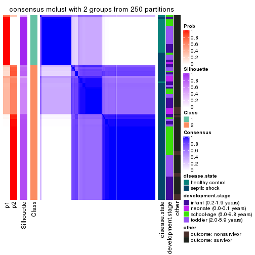</p>

</div>
<div id='tab-SD-mclust-consensus-heatmap-2'>
<pre><code class="r">consensus_heatmap(res, k = 3)
</code></pre>

<p>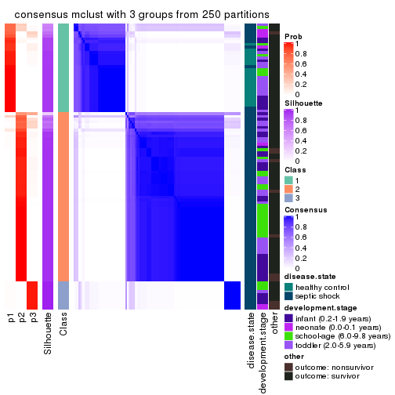</p>

</div>
<div id='tab-SD-mclust-consensus-heatmap-3'>
<pre><code class="r">consensus_heatmap(res, k = 4)
</code></pre>

<p>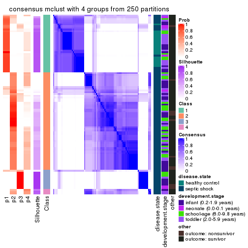</p>

</div>
<div id='tab-SD-mclust-consensus-heatmap-4'>
<pre><code class="r">consensus_heatmap(res, k = 5)
</code></pre>

<p>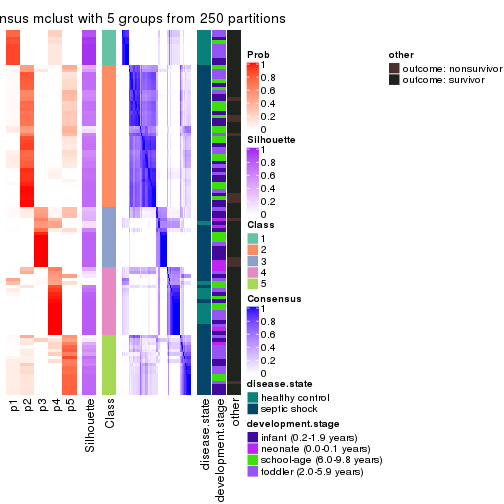</p>

</div>
<div id='tab-SD-mclust-consensus-heatmap-5'>
<pre><code class="r">consensus_heatmap(res, k = 6)
</code></pre>

<p>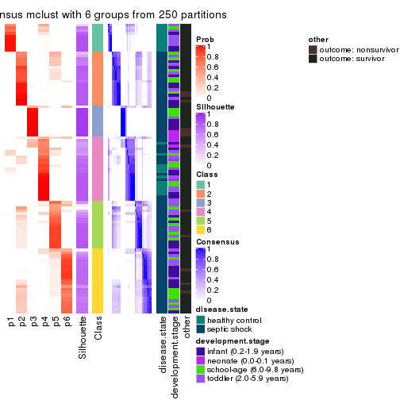</p>

</div>
</div>

Heatmaps for the membership of samples in all partitions to see how consistent they are:


<script>
$( function() {
	$( '#tabs-SD-mclust-membership-heatmap' ).tabs();
} );
</script>
<div id='tabs-SD-mclust-membership-heatmap'>
<ul>
<li><a href='#tab-SD-mclust-membership-heatmap-1'>k = 2</a></li>
<li><a href='#tab-SD-mclust-membership-heatmap-2'>k = 3</a></li>
<li><a href='#tab-SD-mclust-membership-heatmap-3'>k = 4</a></li>
<li><a href='#tab-SD-mclust-membership-heatmap-4'>k = 5</a></li>
<li><a href='#tab-SD-mclust-membership-heatmap-5'>k = 6</a></li>
</ul>
<div id='tab-SD-mclust-membership-heatmap-1'>
<pre><code class="r">membership_heatmap(res, k = 2)
</code></pre>

<p>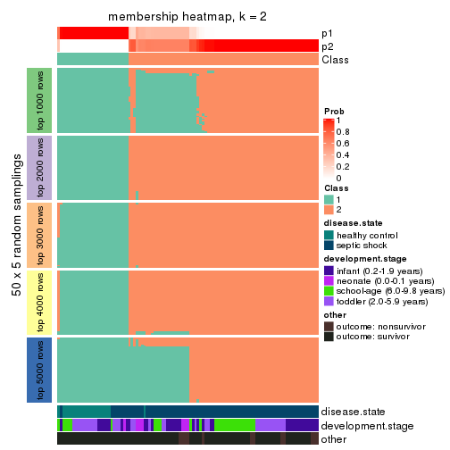</p>

</div>
<div id='tab-SD-mclust-membership-heatmap-2'>
<pre><code class="r">membership_heatmap(res, k = 3)
</code></pre>

<p>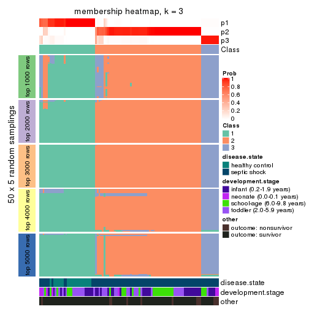</p>

</div>
<div id='tab-SD-mclust-membership-heatmap-3'>
<pre><code class="r">membership_heatmap(res, k = 4)
</code></pre>

<p>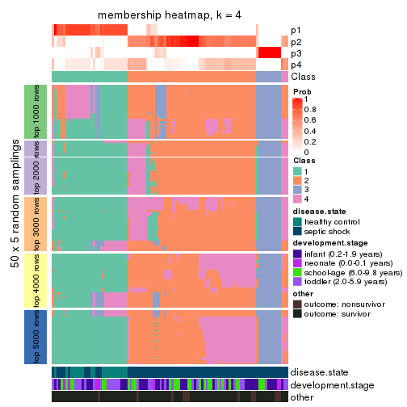</p>

</div>
<div id='tab-SD-mclust-membership-heatmap-4'>
<pre><code class="r">membership_heatmap(res, k = 5)
</code></pre>

<p>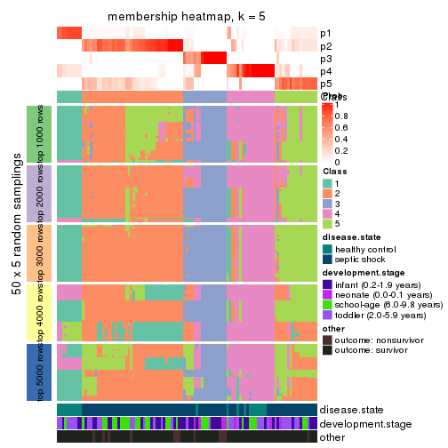</p>

</div>
<div id='tab-SD-mclust-membership-heatmap-5'>
<pre><code class="r">membership_heatmap(res, k = 6)
</code></pre>

<p>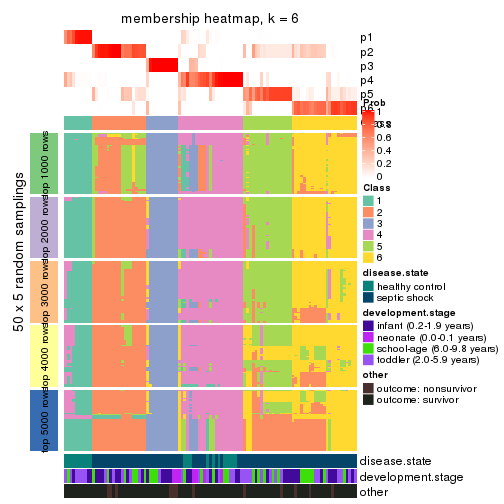</p>

</div>
</div>

As soon as we have had the classes for columns, we can look for signatures
which are significantly different between classes which can be candidate marks
for certain classes. Following are the heatmaps for signatures.


Signature heatmaps where rows are scaled:


<script>
$( function() {
	$( '#tabs-SD-mclust-get-signatures' ).tabs();
} );
</script>
<div id='tabs-SD-mclust-get-signatures'>
<ul>
<li><a href='#tab-SD-mclust-get-signatures-1'>k = 2</a></li>
<li><a href='#tab-SD-mclust-get-signatures-2'>k = 3</a></li>
<li><a href='#tab-SD-mclust-get-signatures-3'>k = 4</a></li>
<li><a href='#tab-SD-mclust-get-signatures-4'>k = 5</a></li>
<li><a href='#tab-SD-mclust-get-signatures-5'>k = 6</a></li>
</ul>
<div id='tab-SD-mclust-get-signatures-1'>
<pre><code class="r">get_signatures(res, k = 2)
</code></pre>

<p>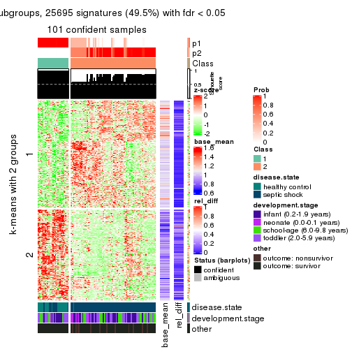</p>

</div>
<div id='tab-SD-mclust-get-signatures-2'>
<pre><code class="r">get_signatures(res, k = 3)
</code></pre>

<p>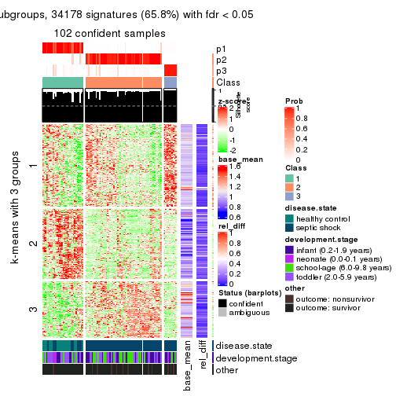</p>

</div>
<div id='tab-SD-mclust-get-signatures-3'>
<pre><code class="r">get_signatures(res, k = 4)
</code></pre>

<p>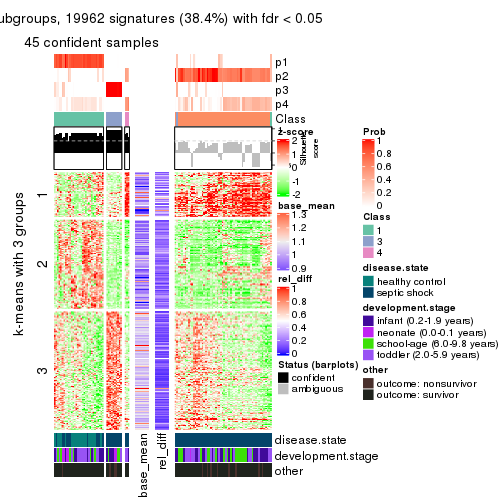</p>

</div>
<div id='tab-SD-mclust-get-signatures-4'>
<pre><code class="r">get_signatures(res, k = 5)
</code></pre>

<p>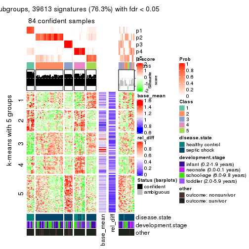</p>

</div>
<div id='tab-SD-mclust-get-signatures-5'>
<pre><code class="r">get_signatures(res, k = 6)
</code></pre>

<p>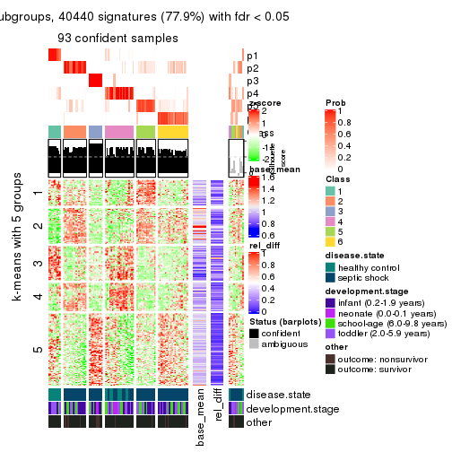</p>

</div>
</div>


Signature heatmaps where rows are not scaled:


<script>
$( function() {
	$( '#tabs-SD-mclust-get-signatures-no-scale' ).tabs();
} );
</script>
<div id='tabs-SD-mclust-get-signatures-no-scale'>
<ul>
<li><a href='#tab-SD-mclust-get-signatures-no-scale-1'>k = 2</a></li>
<li><a href='#tab-SD-mclust-get-signatures-no-scale-2'>k = 3</a></li>
<li><a href='#tab-SD-mclust-get-signatures-no-scale-3'>k = 4</a></li>
<li><a href='#tab-SD-mclust-get-signatures-no-scale-4'>k = 5</a></li>
<li><a href='#tab-SD-mclust-get-signatures-no-scale-5'>k = 6</a></li>
</ul>
<div id='tab-SD-mclust-get-signatures-no-scale-1'>
<pre><code class="r">get_signatures(res, k = 2, scale_rows = FALSE)
</code></pre>

<p>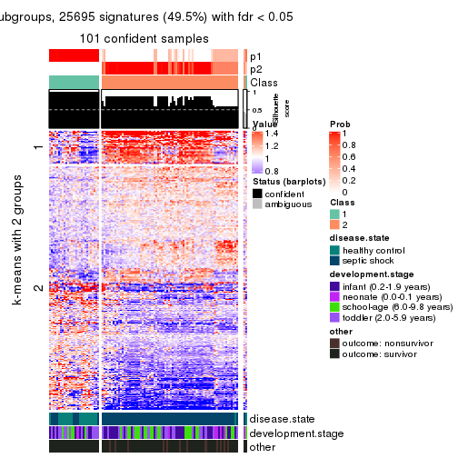</p>

</div>
<div id='tab-SD-mclust-get-signatures-no-scale-2'>
<pre><code class="r">get_signatures(res, k = 3, scale_rows = FALSE)
</code></pre>

<p>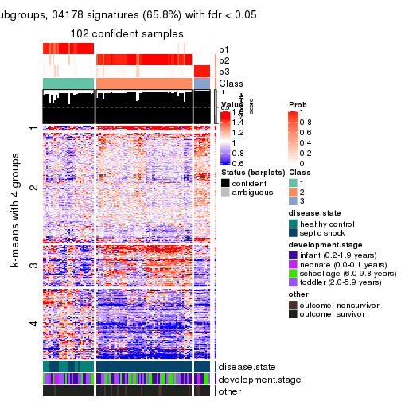</p>

</div>
<div id='tab-SD-mclust-get-signatures-no-scale-3'>
<pre><code class="r">get_signatures(res, k = 4, scale_rows = FALSE)
</code></pre>

<p>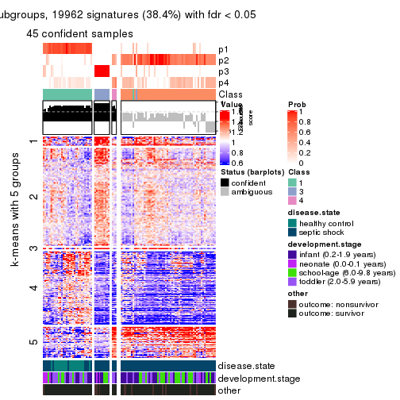</p>

</div>
<div id='tab-SD-mclust-get-signatures-no-scale-4'>
<pre><code class="r">get_signatures(res, k = 5, scale_rows = FALSE)
</code></pre>

<p>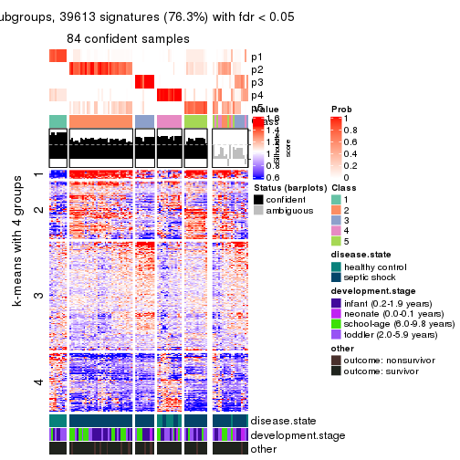</p>

</div>
<div id='tab-SD-mclust-get-signatures-no-scale-5'>
<pre><code class="r">get_signatures(res, k = 6, scale_rows = FALSE)
</code></pre>

<p>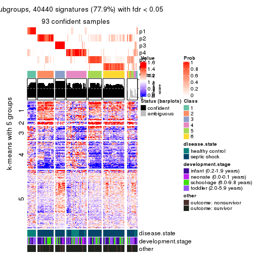</p>

</div>
</div>


Compare the overlap of signatures from different k:

```r
compare_signatures(res)
```

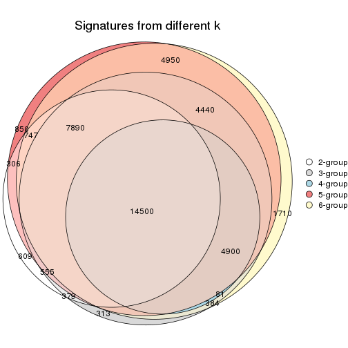

`get_signature()` returns a data frame invisibly. TO get the list of signatures, the function
call should be assigned to a variable explicitly. In following code, if `plot` argument is set
to `FALSE`, no heatmap is plotted while only the differential analysis is performed.

```r
# code only for demonstration
tb = get_signature(res, k = ..., plot = FALSE)
```

An example of the output of `tb` is:

```
#>   which_row         fdr    mean_1    mean_2 scaled_mean_1 scaled_mean_2 km
#> 1        38 0.042760348  8.373488  9.131774    -0.5533452     0.5164555  1
#> 2        40 0.018707592  7.106213  8.469186    -0.6173731     0.5762149  1
#> 3        55 0.019134737 10.221463 11.207825    -0.6159697     0.5749050  1
#> 4        59 0.006059896  5.921854  7.869574    -0.6899429     0.6439467  1
#> 5        60 0.018055526  8.928898 10.211722    -0.6204761     0.5791110  1
#> 6        98 0.009384629 15.714769 14.887706     0.6635654    -0.6193277  2
...
```

The columns in `tb` are:

1. `which_row`: row indices corresponding to the input matrix.
2. `fdr`: FDR for the differential test. 
3. `mean_x`: The mean value in group x.
4. `scaled_mean_x`: The mean value in group x after rows are scaled.
5. `km`: Row groups if k-means clustering is applied to rows.


UMAP plot which shows how samples are separated.


<script>
$( function() {
	$( '#tabs-SD-mclust-dimension-reduction' ).tabs();
} );
</script>
<div id='tabs-SD-mclust-dimension-reduction'>
<ul>
<li><a href='#tab-SD-mclust-dimension-reduction-1'>k = 2</a></li>
<li><a href='#tab-SD-mclust-dimension-reduction-2'>k = 3</a></li>
<li><a href='#tab-SD-mclust-dimension-reduction-3'>k = 4</a></li>
<li><a href='#tab-SD-mclust-dimension-reduction-4'>k = 5</a></li>
<li><a href='#tab-SD-mclust-dimension-reduction-5'>k = 6</a></li>
</ul>
<div id='tab-SD-mclust-dimension-reduction-1'>
<pre><code class="r">dimension_reduction(res, k = 2, method = &quot;UMAP&quot;)
</code></pre>

<p>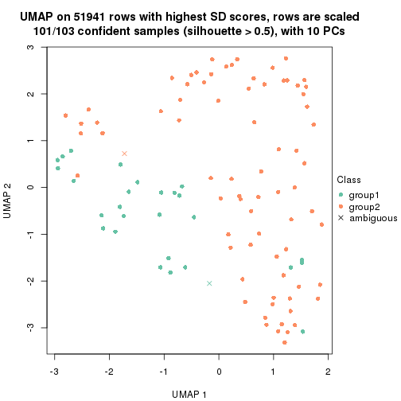</p>

</div>
<div id='tab-SD-mclust-dimension-reduction-2'>
<pre><code class="r">dimension_reduction(res, k = 3, method = &quot;UMAP&quot;)
</code></pre>

<p>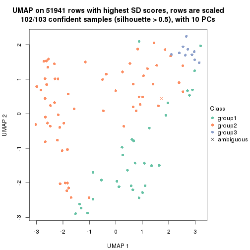</p>

</div>
<div id='tab-SD-mclust-dimension-reduction-3'>
<pre><code class="r">dimension_reduction(res, k = 4, method = &quot;UMAP&quot;)
</code></pre>

<p>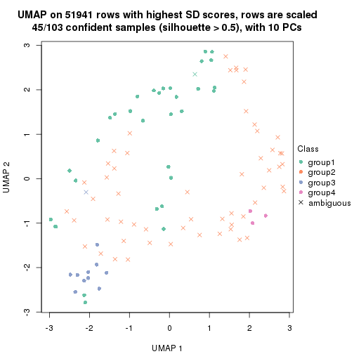</p>

</div>
<div id='tab-SD-mclust-dimension-reduction-4'>
<pre><code class="r">dimension_reduction(res, k = 5, method = &quot;UMAP&quot;)
</code></pre>

<p>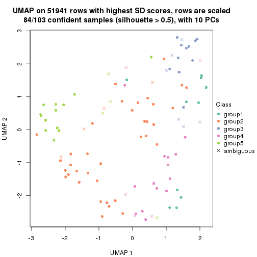</p>

</div>
<div id='tab-SD-mclust-dimension-reduction-5'>
<pre><code class="r">dimension_reduction(res, k = 6, method = &quot;UMAP&quot;)
</code></pre>

<p>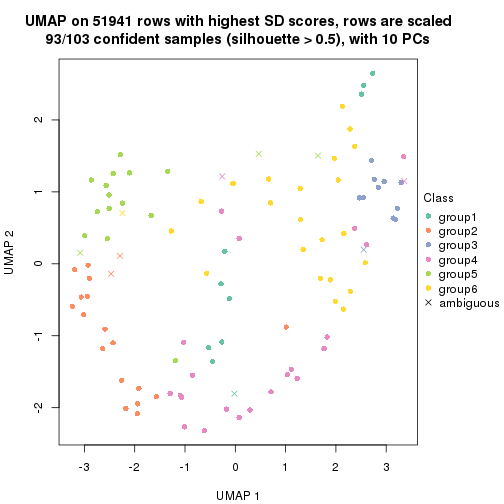</p>

</div>
</div>


Following heatmap shows how subgroups are split when increasing `k`:

```r
collect_classes(res)
```

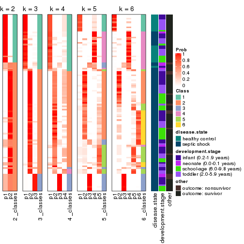


Test correlation between subgroups and known annotations. If the known
annotation is numeric, one-way ANOVA test is applied, and if the known
annotation is discrete, chi-squared contingency table test is applied.

```r
test_to_known_factors(res)
```

```
#>             n disease.state(p) development.stage(p) other(p) k
#> SD:mclust 101         1.16e-13                0.248   0.0599 2
#> SD:mclust 102         2.75e-13                0.117   0.0594 3
#> SD:mclust  45         3.36e-04                0.530   0.0286 4
#> SD:mclust  84         1.89e-13                0.107   0.1273 5
#> SD:mclust  93         8.39e-12                0.231   0.2786 6
```


If matrix rows can be associated to genes, consider to use `functional_enrichment(res,
...)` to perform function enrichment for the signature genes. See [this vignette](http://bioconductor.org/packages/devel/bioc/vignettes/cola/inst/doc/functional_enrichment.html) for more detailed explanations.


 

---------------------------------------------------


### SD:NMF


The object with results only for a single top-value method and a single partition method 
can be extracted as:

```r
res = res_list["SD", "NMF"]
# you can also extract it by
# res = res_list["SD:NMF"]
```

A summary of `res` and all the functions that can be applied to it:

```r
res
```

```
#> A 'ConsensusPartition' object with k = 2, 3, 4, 5, 6.
#>   On a matrix with 51941 rows and 103 columns.
#>   Top rows (1000, 2000, 3000, 4000, 5000) are extracted by 'SD' method.
#>   Subgroups are detected by 'NMF' method.
#>   Performed in total 1250 partitions by row resampling.
#>   Best k for subgroups seems to be 2.
#> 
#> Following methods can be applied to this 'ConsensusPartition' object:
#>  [1] "cola_report"             "collect_classes"         "collect_plots"          
#>  [4] "collect_stats"           "colnames"                "compare_signatures"     
#>  [7] "consensus_heatmap"       "dimension_reduction"     "functional_enrichment"  
#> [10] "get_anno_col"            "get_anno"                "get_classes"            
#> [13] "get_consensus"           "get_matrix"              "get_membership"         
#> [16] "get_param"               "get_signatures"          "get_stats"              
#> [19] "is_best_k"               "is_stable_k"             "membership_heatmap"     
#> [22] "ncol"                    "nrow"                    "plot_ecdf"              
#> [25] "rownames"                "select_partition_number" "show"                   
#> [28] "suggest_best_k"          "test_to_known_factors"
```

`collect_plots()` function collects all the plots made from `res` for all `k` (number of partitions)
into one single page to provide an easy and fast comparison between different `k`.

```r
collect_plots(res)
```

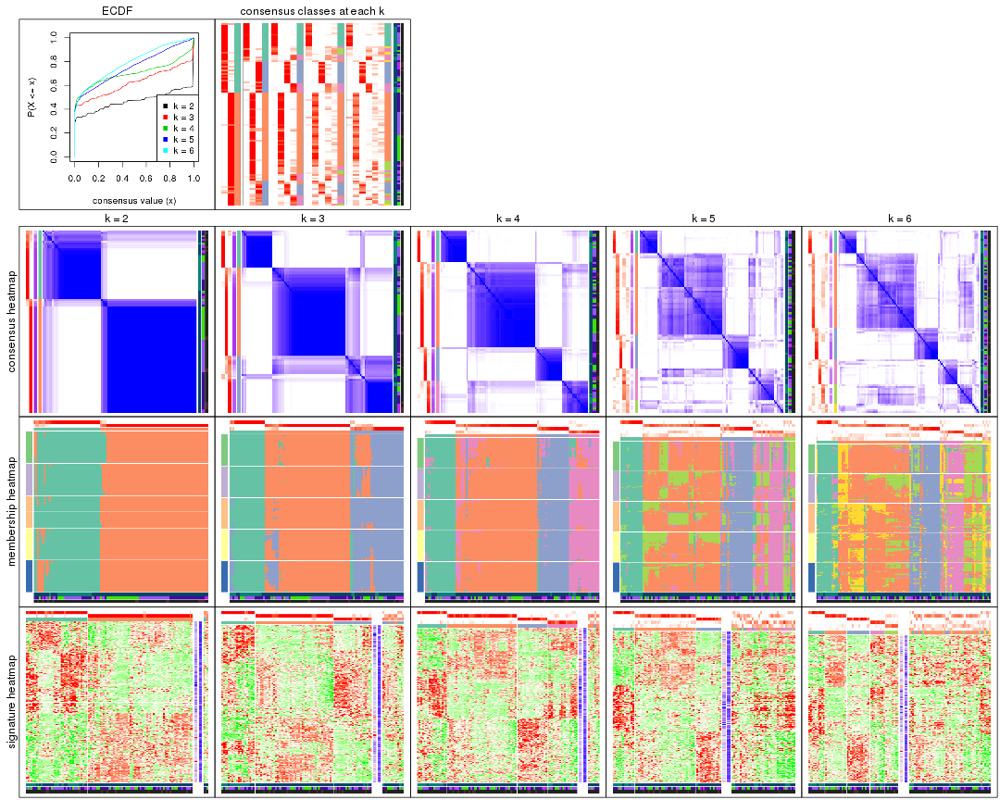

The plots are:

- The first row: a plot of the ECDF (empirical cumulative distribution
  function) curves of the consensus matrix for each `k` and the heatmap of
  predicted classes for each `k`.
- The second row: heatmaps of the consensus matrix for each `k`.
- The third row: heatmaps of the membership matrix for each `k`.
- The fouth row: heatmaps of the signatures for each `k`.

All the plots in panels can be made by individual functions and they are
plotted later in this section.

`select_partition_number()` produces several plots showing different
statistics for choosing "optimized" `k`. There are following statistics:

- ECDF curves of the consensus matrix for each `k`;
- 1-PAC. [The PAC
  score](https://en.wikipedia.org/wiki/Consensus_clustering#Over-interpretation_potential_of_consensus_clustering)
  measures the proportion of the ambiguous subgrouping.
- Mean silhouette score.
- Concordance. The mean probability of fiting the consensus class ids in all
  partitions.
- Area increased. Denote $A_k$ as the area under the ECDF curve for current
  `k`, the area increased is defined as $A_k - A_{k-1}$.
- Rand index. The percent of pairs of samples that are both in a same cluster
  or both are not in a same cluster in the partition of k and k-1.
- Jaccard index. The ratio of pairs of samples are both in a same cluster in
  the partition of k and k-1 and the pairs of samples are both in a same
  cluster in the partition k or k-1.

The detailed explanations of these statistics can be found in [the _cola_
vignette](http://bioconductor.org/packages/devel/bioc/vignettes/cola/inst/doc/cola.html#toc_13).

Generally speaking, lower PAC score, higher mean silhouette score or higher
concordance corresponds to better partition. Rand index and Jaccard index
measure how similar the current partition is compared to partition with `k-1`.
If they are too similar, we won't accept `k` is better than `k-1`.

```r
select_partition_number(res)
```

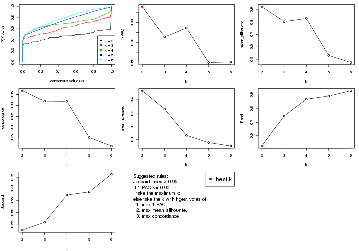

The numeric values for all these statistics can be obtained by `get_stats()`.

```r
get_stats(res)
```

```
#>   k 1-PAC mean_silhouette concordance area_increased  Rand Jaccard
#> 2 2 0.880           0.924       0.967         0.4677 0.525   0.525
#> 3 3 0.727           0.804       0.920         0.3305 0.747   0.558
#> 4 4 0.773           0.829       0.919         0.1300 0.869   0.674
#> 5 5 0.598           0.531       0.752         0.0755 0.892   0.688
#> 6 6 0.601           0.474       0.713         0.0500 0.931   0.763
```

`suggest_best_k()` suggests the best $k$ based on these statistics. The rules are as follows:

- All $k$ with Jaccard index larger than 0.95 are removed because increasing
  $k$ does not provide enough extra information. If all $k$ are removed, it is
  marked as no subgroup is detected.
- For all $k$ with 1-PAC score larger than 0.9, the maximal $k$ is taken as
  the best $k$, and other $k$ are marked as optional $k$.
- If it does not fit the second rule. The $k$ with the maximal vote of the
  highest 1-PAC score, highest mean silhouette, and highest concordance is
  taken as the best $k$.

```r
suggest_best_k(res)
```

```
#> [1] 2
```


Following shows the table of the partitions (You need to click the **show/hide
code output** link to see it). The membership matrix (columns with name `p*`)
is inferred by
[`clue::cl_consensus()`](https://www.rdocumentation.org/link/cl_consensus?package=clue)
function with the `SE` method. Basically the value in the membership matrix
represents the probability to belong to a certain group. The finall class
label for an item is determined with the group with highest probability it
belongs to.

In `get_classes()` function, the entropy is calculated from the membership
matrix and the silhouette score is calculated from the consensus matrix.


<script>
$( function() {
	$( '#tabs-SD-NMF-get-classes' ).tabs();
} );
</script>
<div id='tabs-SD-NMF-get-classes'>
<ul>
<li><a href='#tab-SD-NMF-get-classes-1'>k = 2</a></li>
<li><a href='#tab-SD-NMF-get-classes-2'>k = 3</a></li>
<li><a href='#tab-SD-NMF-get-classes-3'>k = 4</a></li>
<li><a href='#tab-SD-NMF-get-classes-4'>k = 5</a></li>
<li><a href='#tab-SD-NMF-get-classes-5'>k = 6</a></li>
</ul>

<div id='tab-SD-NMF-get-classes-1'>
<p><a id='tab-SD-NMF-get-classes-1-a' style='color:#0366d6' href='#'>show/hide code output</a></p>
<pre><code class="r">cbind(get_classes(res, k = 2), get_membership(res, k = 2))
</code></pre>

<pre><code>#&gt;           class entropy silhouette    p1    p2
#&gt; GSM647569     1  0.4815      0.863 0.896 0.104
#&gt; GSM647574     1  0.0672      0.932 0.992 0.008
#&gt; GSM647577     1  0.8763      0.614 0.704 0.296
#&gt; GSM647547     1  0.0000      0.935 1.000 0.000
#&gt; GSM647552     2  0.0000      0.982 0.000 1.000
#&gt; GSM647553     1  0.0000      0.935 1.000 0.000
#&gt; GSM647565     2  0.0000      0.982 0.000 1.000
#&gt; GSM647545     2  0.0000      0.982 0.000 1.000
#&gt; GSM647549     2  0.0000      0.982 0.000 1.000
#&gt; GSM647550     2  0.0000      0.982 0.000 1.000
#&gt; GSM647560     2  0.0000      0.982 0.000 1.000
#&gt; GSM647617     1  0.9881      0.282 0.564 0.436
#&gt; GSM647528     2  0.0000      0.982 0.000 1.000
#&gt; GSM647529     1  0.6438      0.795 0.836 0.164
#&gt; GSM647531     2  0.0000      0.982 0.000 1.000
#&gt; GSM647540     2  0.0000      0.982 0.000 1.000
#&gt; GSM647541     2  0.0000      0.982 0.000 1.000
#&gt; GSM647546     2  0.6887      0.755 0.184 0.816
#&gt; GSM647557     2  0.0000      0.982 0.000 1.000
#&gt; GSM647561     2  0.0000      0.982 0.000 1.000
#&gt; GSM647567     1  0.8661      0.627 0.712 0.288
#&gt; GSM647568     2  0.0000      0.982 0.000 1.000
#&gt; GSM647570     2  0.0000      0.982 0.000 1.000
#&gt; GSM647573     1  0.0376      0.934 0.996 0.004
#&gt; GSM647576     2  0.0000      0.982 0.000 1.000
#&gt; GSM647579     2  0.0000      0.982 0.000 1.000
#&gt; GSM647580     1  0.1414      0.925 0.980 0.020
#&gt; GSM647583     1  0.8144      0.688 0.748 0.252
#&gt; GSM647592     2  0.0000      0.982 0.000 1.000
#&gt; GSM647593     2  0.0000      0.982 0.000 1.000
#&gt; GSM647595     2  0.0000      0.982 0.000 1.000
#&gt; GSM647597     1  0.9754      0.359 0.592 0.408
#&gt; GSM647598     2  0.0000      0.982 0.000 1.000
#&gt; GSM647613     2  0.0000      0.982 0.000 1.000
#&gt; GSM647615     2  0.0000      0.982 0.000 1.000
#&gt; GSM647616     1  0.0000      0.935 1.000 0.000
#&gt; GSM647619     2  0.0000      0.982 0.000 1.000
#&gt; GSM647582     2  0.0000      0.982 0.000 1.000
#&gt; GSM647591     2  0.0000      0.982 0.000 1.000
#&gt; GSM647527     2  0.0000      0.982 0.000 1.000
#&gt; GSM647530     2  0.0000      0.982 0.000 1.000
#&gt; GSM647532     1  0.0376      0.934 0.996 0.004
#&gt; GSM647544     2  0.0000      0.982 0.000 1.000
#&gt; GSM647551     2  0.0000      0.982 0.000 1.000
#&gt; GSM647556     1  0.4562      0.870 0.904 0.096
#&gt; GSM647558     2  0.0000      0.982 0.000 1.000
#&gt; GSM647572     2  0.7139      0.736 0.196 0.804
#&gt; GSM647578     2  0.0000      0.982 0.000 1.000
#&gt; GSM647581     2  0.0000      0.982 0.000 1.000
#&gt; GSM647594     2  0.0000      0.982 0.000 1.000
#&gt; GSM647599     1  0.0000      0.935 1.000 0.000
#&gt; GSM647600     2  0.0000      0.982 0.000 1.000
#&gt; GSM647601     2  0.0000      0.982 0.000 1.000
#&gt; GSM647603     2  0.0000      0.982 0.000 1.000
#&gt; GSM647610     2  0.7883      0.668 0.236 0.764
#&gt; GSM647611     2  0.0000      0.982 0.000 1.000
#&gt; GSM647612     2  0.0000      0.982 0.000 1.000
#&gt; GSM647614     2  0.0000      0.982 0.000 1.000
#&gt; GSM647618     2  0.0000      0.982 0.000 1.000
#&gt; GSM647629     2  0.0000      0.982 0.000 1.000
#&gt; GSM647535     2  0.0000      0.982 0.000 1.000
#&gt; GSM647563     2  0.0000      0.982 0.000 1.000
#&gt; GSM647542     2  0.0000      0.982 0.000 1.000
#&gt; GSM647543     2  0.0000      0.982 0.000 1.000
#&gt; GSM647548     2  0.0000      0.982 0.000 1.000
#&gt; GSM647554     2  0.0000      0.982 0.000 1.000
#&gt; GSM647555     2  0.0000      0.982 0.000 1.000
#&gt; GSM647559     2  0.0000      0.982 0.000 1.000
#&gt; GSM647562     2  0.0000      0.982 0.000 1.000
#&gt; GSM647564     2  0.9754      0.252 0.408 0.592
#&gt; GSM647571     2  0.0000      0.982 0.000 1.000
#&gt; GSM647584     2  0.0000      0.982 0.000 1.000
#&gt; GSM647585     1  0.0000      0.935 1.000 0.000
#&gt; GSM647586     2  0.0000      0.982 0.000 1.000
#&gt; GSM647587     2  0.0000      0.982 0.000 1.000
#&gt; GSM647588     2  0.0000      0.982 0.000 1.000
#&gt; GSM647596     2  0.0000      0.982 0.000 1.000
#&gt; GSM647602     1  0.7376      0.749 0.792 0.208
#&gt; GSM647609     2  0.0000      0.982 0.000 1.000
#&gt; GSM647620     2  0.0000      0.982 0.000 1.000
#&gt; GSM647627     2  0.0000      0.982 0.000 1.000
#&gt; GSM647628     2  0.0000      0.982 0.000 1.000
#&gt; GSM647533     1  0.0000      0.935 1.000 0.000
#&gt; GSM647536     1  0.0000      0.935 1.000 0.000
#&gt; GSM647537     1  0.0000      0.935 1.000 0.000
#&gt; GSM647606     1  0.0000      0.935 1.000 0.000
#&gt; GSM647621     1  0.0000      0.935 1.000 0.000
#&gt; GSM647626     1  0.0000      0.935 1.000 0.000
#&gt; GSM647538     1  0.0000      0.935 1.000 0.000
#&gt; GSM647575     1  0.0000      0.935 1.000 0.000
#&gt; GSM647590     1  0.0000      0.935 1.000 0.000
#&gt; GSM647605     1  0.0000      0.935 1.000 0.000
#&gt; GSM647607     1  0.0000      0.935 1.000 0.000
#&gt; GSM647608     1  0.0000      0.935 1.000 0.000
#&gt; GSM647622     1  0.0000      0.935 1.000 0.000
#&gt; GSM647623     1  0.0000      0.935 1.000 0.000
#&gt; GSM647624     1  0.0000      0.935 1.000 0.000
#&gt; GSM647625     1  0.0000      0.935 1.000 0.000
#&gt; GSM647534     1  0.0000      0.935 1.000 0.000
#&gt; GSM647539     1  0.3431      0.895 0.936 0.064
#&gt; GSM647566     1  0.0000      0.935 1.000 0.000
#&gt; GSM647589     1  0.0000      0.935 1.000 0.000
#&gt; GSM647604     1  0.0000      0.935 1.000 0.000
</code></pre>

<script>
$('#tab-SD-NMF-get-classes-1-a').parent().next().next().hide();
$('#tab-SD-NMF-get-classes-1-a').click(function(){
  $('#tab-SD-NMF-get-classes-1-a').parent().next().next().toggle();
  return(false);
});
</script>
</div>

<div id='tab-SD-NMF-get-classes-2'>
<p><a id='tab-SD-NMF-get-classes-2-a' style='color:#0366d6' href='#'>show/hide code output</a></p>
<pre><code class="r">cbind(get_classes(res, k = 3), get_membership(res, k = 3))
</code></pre>

<pre><code>#&gt;           class entropy silhouette    p1    p2    p3
#&gt; GSM647569     3  0.0000     0.7929 0.000 0.000 1.000
#&gt; GSM647574     3  0.0000     0.7929 0.000 0.000 1.000
#&gt; GSM647577     3  0.0000     0.7929 0.000 0.000 1.000
#&gt; GSM647547     3  0.0000     0.7929 0.000 0.000 1.000
#&gt; GSM647552     2  0.0000     0.9417 0.000 1.000 0.000
#&gt; GSM647553     3  0.0000     0.7929 0.000 0.000 1.000
#&gt; GSM647565     3  0.4555     0.7093 0.000 0.200 0.800
#&gt; GSM647545     2  0.0000     0.9417 0.000 1.000 0.000
#&gt; GSM647549     2  0.0237     0.9389 0.000 0.996 0.004
#&gt; GSM647550     3  0.6026     0.4733 0.000 0.376 0.624
#&gt; GSM647560     2  0.3412     0.8201 0.000 0.876 0.124
#&gt; GSM647617     3  0.0000     0.7929 0.000 0.000 1.000
#&gt; GSM647528     2  0.0000     0.9417 0.000 1.000 0.000
#&gt; GSM647529     1  0.0000     0.9469 1.000 0.000 0.000
#&gt; GSM647531     2  0.0000     0.9417 0.000 1.000 0.000
#&gt; GSM647540     3  0.2165     0.7693 0.000 0.064 0.936
#&gt; GSM647541     2  0.0000     0.9417 0.000 1.000 0.000
#&gt; GSM647546     3  0.0000     0.7929 0.000 0.000 1.000
#&gt; GSM647557     2  0.0000     0.9417 0.000 1.000 0.000
#&gt; GSM647561     2  0.0000     0.9417 0.000 1.000 0.000
#&gt; GSM647567     3  0.8255     0.0521 0.428 0.076 0.496
#&gt; GSM647568     3  0.4931     0.6847 0.000 0.232 0.768
#&gt; GSM647570     2  0.4346     0.7351 0.000 0.816 0.184
#&gt; GSM647573     3  0.5067     0.7295 0.052 0.116 0.832
#&gt; GSM647576     3  0.5363     0.6346 0.000 0.276 0.724
#&gt; GSM647579     3  0.6225     0.3345 0.000 0.432 0.568
#&gt; GSM647580     3  0.0000     0.7929 0.000 0.000 1.000
#&gt; GSM647583     3  0.0000     0.7929 0.000 0.000 1.000
#&gt; GSM647592     2  0.2165     0.8838 0.064 0.936 0.000
#&gt; GSM647593     2  0.0000     0.9417 0.000 1.000 0.000
#&gt; GSM647595     2  0.0000     0.9417 0.000 1.000 0.000
#&gt; GSM647597     1  0.0237     0.9432 0.996 0.004 0.000
#&gt; GSM647598     2  0.0000     0.9417 0.000 1.000 0.000
#&gt; GSM647613     2  0.0000     0.9417 0.000 1.000 0.000
#&gt; GSM647615     2  0.3551     0.8086 0.000 0.868 0.132
#&gt; GSM647616     3  0.0000     0.7929 0.000 0.000 1.000
#&gt; GSM647619     2  0.0000     0.9417 0.000 1.000 0.000
#&gt; GSM647582     2  0.0000     0.9417 0.000 1.000 0.000
#&gt; GSM647591     2  0.0000     0.9417 0.000 1.000 0.000
#&gt; GSM647527     2  0.0000     0.9417 0.000 1.000 0.000
#&gt; GSM647530     2  0.2537     0.8728 0.080 0.920 0.000
#&gt; GSM647532     1  0.0237     0.9443 0.996 0.000 0.004
#&gt; GSM647544     2  0.0000     0.9417 0.000 1.000 0.000
#&gt; GSM647551     2  0.0000     0.9417 0.000 1.000 0.000
#&gt; GSM647556     3  0.0000     0.7929 0.000 0.000 1.000
#&gt; GSM647558     2  0.5560     0.5176 0.000 0.700 0.300
#&gt; GSM647572     3  0.0000     0.7929 0.000 0.000 1.000
#&gt; GSM647578     3  0.5760     0.5279 0.000 0.328 0.672
#&gt; GSM647581     2  0.0237     0.9389 0.000 0.996 0.004
#&gt; GSM647594     2  0.0892     0.9260 0.020 0.980 0.000
#&gt; GSM647599     1  0.0000     0.9469 1.000 0.000 0.000
#&gt; GSM647600     2  0.0000     0.9417 0.000 1.000 0.000
#&gt; GSM647601     2  0.0000     0.9417 0.000 1.000 0.000
#&gt; GSM647603     2  0.0000     0.9417 0.000 1.000 0.000
#&gt; GSM647610     2  0.3267     0.8217 0.116 0.884 0.000
#&gt; GSM647611     2  0.0000     0.9417 0.000 1.000 0.000
#&gt; GSM647612     2  0.6079     0.2812 0.000 0.612 0.388
#&gt; GSM647614     2  0.6095     0.2687 0.000 0.608 0.392
#&gt; GSM647618     2  0.0000     0.9417 0.000 1.000 0.000
#&gt; GSM647629     2  0.0000     0.9417 0.000 1.000 0.000
#&gt; GSM647535     2  0.0000     0.9417 0.000 1.000 0.000
#&gt; GSM647563     2  0.0000     0.9417 0.000 1.000 0.000
#&gt; GSM647542     3  0.5968     0.4948 0.000 0.364 0.636
#&gt; GSM647543     3  0.6267     0.2816 0.000 0.452 0.548
#&gt; GSM647548     3  0.6140     0.4041 0.000 0.404 0.596
#&gt; GSM647554     2  0.0892     0.9260 0.000 0.980 0.020
#&gt; GSM647555     2  0.5785     0.4408 0.000 0.668 0.332
#&gt; GSM647559     2  0.0000     0.9417 0.000 1.000 0.000
#&gt; GSM647562     2  0.0000     0.9417 0.000 1.000 0.000
#&gt; GSM647564     3  0.0000     0.7929 0.000 0.000 1.000
#&gt; GSM647571     3  0.6252     0.3039 0.000 0.444 0.556
#&gt; GSM647584     2  0.0000     0.9417 0.000 1.000 0.000
#&gt; GSM647585     3  0.0000     0.7929 0.000 0.000 1.000
#&gt; GSM647586     2  0.0000     0.9417 0.000 1.000 0.000
#&gt; GSM647587     2  0.0000     0.9417 0.000 1.000 0.000
#&gt; GSM647588     2  0.0000     0.9417 0.000 1.000 0.000
#&gt; GSM647596     2  0.0000     0.9417 0.000 1.000 0.000
#&gt; GSM647602     3  0.0000     0.7929 0.000 0.000 1.000
#&gt; GSM647609     2  0.0000     0.9417 0.000 1.000 0.000
#&gt; GSM647620     2  0.0000     0.9417 0.000 1.000 0.000
#&gt; GSM647627     2  0.0000     0.9417 0.000 1.000 0.000
#&gt; GSM647628     2  0.4346     0.7348 0.000 0.816 0.184
#&gt; GSM647533     1  0.0000     0.9469 1.000 0.000 0.000
#&gt; GSM647536     1  0.0000     0.9469 1.000 0.000 0.000
#&gt; GSM647537     1  0.0000     0.9469 1.000 0.000 0.000
#&gt; GSM647606     1  0.0000     0.9469 1.000 0.000 0.000
#&gt; GSM647621     1  0.5650     0.5328 0.688 0.000 0.312
#&gt; GSM647626     3  0.5760     0.3446 0.328 0.000 0.672
#&gt; GSM647538     1  0.0000     0.9469 1.000 0.000 0.000
#&gt; GSM647575     1  0.6267     0.1413 0.548 0.000 0.452
#&gt; GSM647590     1  0.0747     0.9351 0.984 0.000 0.016
#&gt; GSM647605     1  0.0000     0.9469 1.000 0.000 0.000
#&gt; GSM647607     1  0.3941     0.7825 0.844 0.000 0.156
#&gt; GSM647608     3  0.0000     0.7929 0.000 0.000 1.000
#&gt; GSM647622     1  0.0000     0.9469 1.000 0.000 0.000
#&gt; GSM647623     1  0.0000     0.9469 1.000 0.000 0.000
#&gt; GSM647624     1  0.0000     0.9469 1.000 0.000 0.000
#&gt; GSM647625     1  0.0000     0.9469 1.000 0.000 0.000
#&gt; GSM647534     1  0.0000     0.9469 1.000 0.000 0.000
#&gt; GSM647539     3  0.6373     0.2456 0.408 0.004 0.588
#&gt; GSM647566     1  0.0000     0.9469 1.000 0.000 0.000
#&gt; GSM647589     3  0.0000     0.7929 0.000 0.000 1.000
#&gt; GSM647604     1  0.0000     0.9469 1.000 0.000 0.000
</code></pre>

<script>
$('#tab-SD-NMF-get-classes-2-a').parent().next().next().hide();
$('#tab-SD-NMF-get-classes-2-a').click(function(){
  $('#tab-SD-NMF-get-classes-2-a').parent().next().next().toggle();
  return(false);
});
</script>
</div>

<div id='tab-SD-NMF-get-classes-3'>
<p><a id='tab-SD-NMF-get-classes-3-a' style='color:#0366d6' href='#'>show/hide code output</a></p>
<pre><code class="r">cbind(get_classes(res, k = 4), get_membership(res, k = 4))
</code></pre>

<pre><code>#&gt;           class entropy silhouette    p1    p2    p3    p4
#&gt; GSM647569     3  0.0000      0.911 0.000 0.000 1.000 0.000
#&gt; GSM647574     3  0.3123      0.805 0.000 0.000 0.844 0.156
#&gt; GSM647577     3  0.0000      0.911 0.000 0.000 1.000 0.000
#&gt; GSM647547     4  0.0188      0.849 0.004 0.000 0.000 0.996
#&gt; GSM647552     2  0.3392      0.829 0.020 0.856 0.000 0.124
#&gt; GSM647553     3  0.2011      0.870 0.000 0.000 0.920 0.080
#&gt; GSM647565     4  0.0707      0.851 0.000 0.020 0.000 0.980
#&gt; GSM647545     2  0.2814      0.831 0.000 0.868 0.000 0.132
#&gt; GSM647549     2  0.3801      0.737 0.000 0.780 0.000 0.220
#&gt; GSM647550     2  0.4106      0.804 0.000 0.832 0.084 0.084
#&gt; GSM647560     2  0.0804      0.902 0.000 0.980 0.008 0.012
#&gt; GSM647617     3  0.0000      0.911 0.000 0.000 1.000 0.000
#&gt; GSM647528     2  0.0000      0.906 0.000 1.000 0.000 0.000
#&gt; GSM647529     1  0.1474      0.927 0.948 0.000 0.000 0.052
#&gt; GSM647531     2  0.4830      0.421 0.000 0.608 0.000 0.392
#&gt; GSM647540     3  0.0469      0.906 0.000 0.012 0.988 0.000
#&gt; GSM647541     2  0.0921      0.897 0.000 0.972 0.000 0.028
#&gt; GSM647546     3  0.1302      0.894 0.000 0.000 0.956 0.044
#&gt; GSM647557     2  0.4761      0.470 0.000 0.628 0.000 0.372
#&gt; GSM647561     2  0.1118      0.893 0.000 0.964 0.000 0.036
#&gt; GSM647567     3  0.7356      0.178 0.368 0.164 0.468 0.000
#&gt; GSM647568     4  0.2271      0.835 0.000 0.076 0.008 0.916
#&gt; GSM647570     4  0.4134      0.671 0.000 0.260 0.000 0.740
#&gt; GSM647573     4  0.0188      0.849 0.004 0.000 0.000 0.996
#&gt; GSM647576     3  0.5496      0.654 0.000 0.160 0.732 0.108
#&gt; GSM647579     3  0.3726      0.688 0.000 0.212 0.788 0.000
#&gt; GSM647580     3  0.0000      0.911 0.000 0.000 1.000 0.000
#&gt; GSM647583     3  0.1474      0.889 0.000 0.000 0.948 0.052
#&gt; GSM647592     2  0.1661      0.874 0.052 0.944 0.000 0.004
#&gt; GSM647593     2  0.0188      0.905 0.000 0.996 0.000 0.004
#&gt; GSM647595     2  0.0000      0.906 0.000 1.000 0.000 0.000
#&gt; GSM647597     1  0.0524      0.946 0.988 0.008 0.000 0.004
#&gt; GSM647598     2  0.0000      0.906 0.000 1.000 0.000 0.000
#&gt; GSM647613     2  0.0336      0.904 0.000 0.992 0.000 0.008
#&gt; GSM647615     2  0.3219      0.802 0.000 0.836 0.000 0.164
#&gt; GSM647616     3  0.0000      0.911 0.000 0.000 1.000 0.000
#&gt; GSM647619     2  0.0188      0.905 0.000 0.996 0.000 0.004
#&gt; GSM647582     2  0.0000      0.906 0.000 1.000 0.000 0.000
#&gt; GSM647591     2  0.0336      0.905 0.000 0.992 0.000 0.008
#&gt; GSM647527     2  0.0000      0.906 0.000 1.000 0.000 0.000
#&gt; GSM647530     4  0.0524      0.851 0.004 0.008 0.000 0.988
#&gt; GSM647532     4  0.3266      0.728 0.168 0.000 0.000 0.832
#&gt; GSM647544     2  0.4843      0.302 0.000 0.604 0.000 0.396
#&gt; GSM647551     2  0.0000      0.906 0.000 1.000 0.000 0.000
#&gt; GSM647556     3  0.0000      0.911 0.000 0.000 1.000 0.000
#&gt; GSM647558     4  0.2589      0.813 0.000 0.116 0.000 0.884
#&gt; GSM647572     3  0.2216      0.852 0.000 0.000 0.908 0.092
#&gt; GSM647578     2  0.4981      0.165 0.000 0.536 0.464 0.000
#&gt; GSM647581     4  0.1940      0.838 0.000 0.076 0.000 0.924
#&gt; GSM647594     2  0.0188      0.906 0.004 0.996 0.000 0.000
#&gt; GSM647599     1  0.0188      0.951 0.996 0.000 0.000 0.004
#&gt; GSM647600     2  0.0000      0.906 0.000 1.000 0.000 0.000
#&gt; GSM647601     2  0.0188      0.905 0.000 0.996 0.000 0.004
#&gt; GSM647603     2  0.0188      0.905 0.000 0.996 0.000 0.004
#&gt; GSM647610     2  0.2300      0.857 0.064 0.920 0.000 0.016
#&gt; GSM647611     2  0.0188      0.905 0.000 0.996 0.000 0.004
#&gt; GSM647612     2  0.3024      0.803 0.000 0.852 0.000 0.148
#&gt; GSM647614     2  0.4961      0.107 0.000 0.552 0.000 0.448
#&gt; GSM647618     2  0.0707      0.899 0.000 0.980 0.000 0.020
#&gt; GSM647629     2  0.0000      0.906 0.000 1.000 0.000 0.000
#&gt; GSM647535     2  0.0000      0.906 0.000 1.000 0.000 0.000
#&gt; GSM647563     2  0.1211      0.892 0.000 0.960 0.000 0.040
#&gt; GSM647542     4  0.5471      0.632 0.000 0.268 0.048 0.684
#&gt; GSM647543     4  0.5916      0.591 0.000 0.272 0.072 0.656
#&gt; GSM647548     4  0.0188      0.850 0.000 0.004 0.000 0.996
#&gt; GSM647554     2  0.0188      0.906 0.000 0.996 0.004 0.000
#&gt; GSM647555     2  0.2831      0.839 0.000 0.876 0.004 0.120
#&gt; GSM647559     2  0.0469      0.902 0.000 0.988 0.000 0.012
#&gt; GSM647562     2  0.2149      0.861 0.000 0.912 0.000 0.088
#&gt; GSM647564     3  0.0000      0.911 0.000 0.000 1.000 0.000
#&gt; GSM647571     4  0.3668      0.767 0.000 0.188 0.004 0.808
#&gt; GSM647584     2  0.0000      0.906 0.000 1.000 0.000 0.000
#&gt; GSM647585     3  0.0000      0.911 0.000 0.000 1.000 0.000
#&gt; GSM647586     2  0.0000      0.906 0.000 1.000 0.000 0.000
#&gt; GSM647587     2  0.0336      0.904 0.000 0.992 0.000 0.008
#&gt; GSM647588     2  0.2589      0.840 0.000 0.884 0.000 0.116
#&gt; GSM647596     2  0.0000      0.906 0.000 1.000 0.000 0.000
#&gt; GSM647602     3  0.0000      0.911 0.000 0.000 1.000 0.000
#&gt; GSM647609     2  0.0000      0.906 0.000 1.000 0.000 0.000
#&gt; GSM647620     2  0.0000      0.906 0.000 1.000 0.000 0.000
#&gt; GSM647627     2  0.0000      0.906 0.000 1.000 0.000 0.000
#&gt; GSM647628     2  0.4564      0.497 0.000 0.672 0.000 0.328
#&gt; GSM647533     1  0.0000      0.953 1.000 0.000 0.000 0.000
#&gt; GSM647536     1  0.2868      0.858 0.864 0.000 0.000 0.136
#&gt; GSM647537     1  0.0000      0.953 1.000 0.000 0.000 0.000
#&gt; GSM647606     1  0.0000      0.953 1.000 0.000 0.000 0.000
#&gt; GSM647621     1  0.4522      0.559 0.680 0.000 0.000 0.320
#&gt; GSM647626     3  0.0188      0.910 0.004 0.000 0.996 0.000
#&gt; GSM647538     1  0.0000      0.953 1.000 0.000 0.000 0.000
#&gt; GSM647575     4  0.2760      0.773 0.128 0.000 0.000 0.872
#&gt; GSM647590     1  0.1867      0.911 0.928 0.000 0.000 0.072
#&gt; GSM647605     1  0.0000      0.953 1.000 0.000 0.000 0.000
#&gt; GSM647607     4  0.3356      0.725 0.176 0.000 0.000 0.824
#&gt; GSM647608     4  0.0921      0.842 0.028 0.000 0.000 0.972
#&gt; GSM647622     1  0.0000      0.953 1.000 0.000 0.000 0.000
#&gt; GSM647623     1  0.0000      0.953 1.000 0.000 0.000 0.000
#&gt; GSM647624     1  0.0188      0.951 0.996 0.000 0.000 0.004
#&gt; GSM647625     1  0.0000      0.953 1.000 0.000 0.000 0.000
#&gt; GSM647534     1  0.0376      0.948 0.992 0.004 0.000 0.004
#&gt; GSM647539     4  0.1792      0.820 0.068 0.000 0.000 0.932
#&gt; GSM647566     1  0.3486      0.792 0.812 0.000 0.000 0.188
#&gt; GSM647589     4  0.1940      0.816 0.000 0.000 0.076 0.924
#&gt; GSM647604     1  0.0000      0.953 1.000 0.000 0.000 0.000
</code></pre>

<script>
$('#tab-SD-NMF-get-classes-3-a').parent().next().next().hide();
$('#tab-SD-NMF-get-classes-3-a').click(function(){
  $('#tab-SD-NMF-get-classes-3-a').parent().next().next().toggle();
  return(false);
});
</script>
</div>

<div id='tab-SD-NMF-get-classes-4'>
<p><a id='tab-SD-NMF-get-classes-4-a' style='color:#0366d6' href='#'>show/hide code output</a></p>
<pre><code class="r">cbind(get_classes(res, k = 5), get_membership(res, k = 5))
</code></pre>

<pre><code>#&gt;           class entropy silhouette    p1    p2    p3    p4    p5
#&gt; GSM647569     3  0.0000    0.78986 0.000 0.000 1.000 0.000 0.000
#&gt; GSM647574     3  0.3480    0.64407 0.000 0.000 0.752 0.248 0.000
#&gt; GSM647577     3  0.0290    0.78938 0.000 0.000 0.992 0.008 0.000
#&gt; GSM647547     4  0.3586    0.39751 0.000 0.000 0.000 0.736 0.264
#&gt; GSM647552     5  0.7991    0.15589 0.128 0.256 0.000 0.184 0.432
#&gt; GSM647553     3  0.3561    0.60536 0.000 0.000 0.740 0.260 0.000
#&gt; GSM647565     4  0.2077    0.35297 0.000 0.008 0.000 0.908 0.084
#&gt; GSM647545     2  0.4151    0.58228 0.000 0.652 0.000 0.344 0.004
#&gt; GSM647549     2  0.4872    0.43968 0.000 0.540 0.000 0.436 0.024
#&gt; GSM647550     2  0.4400    0.68347 0.000 0.780 0.108 0.104 0.008
#&gt; GSM647560     2  0.3662    0.65524 0.000 0.744 0.000 0.252 0.004
#&gt; GSM647617     3  0.0000    0.78986 0.000 0.000 1.000 0.000 0.000
#&gt; GSM647528     2  0.1331    0.73143 0.000 0.952 0.000 0.040 0.008
#&gt; GSM647529     5  0.6323    0.19001 0.292 0.000 0.000 0.192 0.516
#&gt; GSM647531     4  0.6206    0.04132 0.000 0.172 0.000 0.532 0.296
#&gt; GSM647540     3  0.1121    0.76863 0.000 0.044 0.956 0.000 0.000
#&gt; GSM647541     2  0.3582    0.67285 0.000 0.768 0.000 0.224 0.008
#&gt; GSM647546     3  0.3366    0.63348 0.000 0.000 0.768 0.232 0.000
#&gt; GSM647557     4  0.6222    0.04721 0.000 0.216 0.000 0.548 0.236
#&gt; GSM647561     2  0.3992    0.64684 0.000 0.720 0.000 0.268 0.012
#&gt; GSM647567     2  0.6751   -0.04695 0.020 0.420 0.144 0.000 0.416
#&gt; GSM647568     4  0.4061    0.18646 0.000 0.240 0.004 0.740 0.016
#&gt; GSM647570     2  0.4760    0.46503 0.000 0.564 0.000 0.416 0.020
#&gt; GSM647573     4  0.3707    0.39550 0.000 0.000 0.000 0.716 0.284
#&gt; GSM647576     3  0.6957   -0.01295 0.000 0.320 0.348 0.328 0.004
#&gt; GSM647579     3  0.4313    0.38330 0.000 0.356 0.636 0.008 0.000
#&gt; GSM647580     3  0.0000    0.78986 0.000 0.000 1.000 0.000 0.000
#&gt; GSM647583     3  0.2377    0.73666 0.000 0.000 0.872 0.128 0.000
#&gt; GSM647592     2  0.5013    0.45370 0.232 0.684 0.000 0.000 0.084
#&gt; GSM647593     2  0.2074    0.69894 0.000 0.896 0.000 0.000 0.104
#&gt; GSM647595     2  0.2448    0.71241 0.000 0.892 0.000 0.020 0.088
#&gt; GSM647597     1  0.2597    0.82026 0.884 0.024 0.000 0.000 0.092
#&gt; GSM647598     2  0.0162    0.73104 0.000 0.996 0.000 0.004 0.000
#&gt; GSM647613     2  0.3452    0.66113 0.000 0.756 0.000 0.244 0.000
#&gt; GSM647615     2  0.4425    0.52281 0.000 0.600 0.000 0.392 0.008
#&gt; GSM647616     3  0.0963    0.78135 0.000 0.000 0.964 0.036 0.000
#&gt; GSM647619     2  0.3074    0.63499 0.000 0.804 0.000 0.000 0.196
#&gt; GSM647582     2  0.2376    0.73326 0.000 0.904 0.000 0.044 0.052
#&gt; GSM647591     2  0.3327    0.67789 0.000 0.828 0.000 0.028 0.144
#&gt; GSM647527     2  0.1168    0.73167 0.000 0.960 0.000 0.032 0.008
#&gt; GSM647530     4  0.3884    0.39048 0.004 0.000 0.000 0.708 0.288
#&gt; GSM647532     4  0.6385   -0.09243 0.296 0.000 0.000 0.504 0.200
#&gt; GSM647544     5  0.6245    0.09388 0.000 0.236 0.000 0.220 0.544
#&gt; GSM647551     2  0.3661    0.53713 0.000 0.724 0.000 0.000 0.276
#&gt; GSM647556     3  0.0290    0.78816 0.000 0.000 0.992 0.000 0.008
#&gt; GSM647558     4  0.4232    0.13324 0.000 0.312 0.000 0.676 0.012
#&gt; GSM647572     3  0.5771    0.14872 0.000 0.024 0.476 0.040 0.460
#&gt; GSM647578     3  0.5049   -0.02726 0.000 0.480 0.488 0.000 0.032
#&gt; GSM647581     4  0.1671    0.29439 0.000 0.076 0.000 0.924 0.000
#&gt; GSM647594     2  0.4701    0.34949 0.368 0.612 0.000 0.004 0.016
#&gt; GSM647599     1  0.1300    0.88559 0.956 0.016 0.000 0.000 0.028
#&gt; GSM647600     2  0.3003    0.63950 0.000 0.812 0.000 0.000 0.188
#&gt; GSM647601     2  0.0609    0.72702 0.000 0.980 0.000 0.000 0.020
#&gt; GSM647603     2  0.2773    0.65122 0.000 0.836 0.000 0.000 0.164
#&gt; GSM647610     2  0.5858    0.24091 0.124 0.568 0.000 0.000 0.308
#&gt; GSM647611     2  0.1608    0.71206 0.000 0.928 0.000 0.000 0.072
#&gt; GSM647612     2  0.4025    0.63075 0.000 0.700 0.000 0.292 0.008
#&gt; GSM647614     2  0.4251    0.60720 0.000 0.672 0.000 0.316 0.012
#&gt; GSM647618     2  0.4249    0.51896 0.000 0.688 0.000 0.016 0.296
#&gt; GSM647629     2  0.2969    0.71864 0.000 0.852 0.000 0.128 0.020
#&gt; GSM647535     2  0.0693    0.73158 0.000 0.980 0.000 0.012 0.008
#&gt; GSM647563     2  0.3060    0.71421 0.000 0.848 0.000 0.128 0.024
#&gt; GSM647542     2  0.4806    0.47870 0.000 0.572 0.004 0.408 0.016
#&gt; GSM647543     4  0.4706   -0.36009 0.000 0.488 0.004 0.500 0.008
#&gt; GSM647548     4  0.3876    0.38509 0.000 0.000 0.000 0.684 0.316
#&gt; GSM647554     2  0.3508    0.57190 0.000 0.748 0.000 0.000 0.252
#&gt; GSM647555     2  0.4484    0.61328 0.000 0.668 0.000 0.308 0.024
#&gt; GSM647559     2  0.4269    0.45427 0.000 0.684 0.000 0.016 0.300
#&gt; GSM647562     2  0.4982    0.24814 0.000 0.556 0.000 0.032 0.412
#&gt; GSM647564     3  0.0000    0.78986 0.000 0.000 1.000 0.000 0.000
#&gt; GSM647571     5  0.6227    0.06828 0.000 0.280 0.000 0.184 0.536
#&gt; GSM647584     2  0.1671    0.71208 0.000 0.924 0.000 0.000 0.076
#&gt; GSM647585     3  0.0162    0.78922 0.000 0.000 0.996 0.000 0.004
#&gt; GSM647586     2  0.0579    0.73129 0.000 0.984 0.000 0.008 0.008
#&gt; GSM647587     2  0.3835    0.55207 0.000 0.744 0.000 0.012 0.244
#&gt; GSM647588     2  0.5273    0.56994 0.000 0.680 0.000 0.156 0.164
#&gt; GSM647596     2  0.0579    0.73130 0.000 0.984 0.000 0.008 0.008
#&gt; GSM647602     3  0.0000    0.78986 0.000 0.000 1.000 0.000 0.000
#&gt; GSM647609     2  0.0703    0.72683 0.000 0.976 0.000 0.000 0.024
#&gt; GSM647620     2  0.0404    0.72842 0.000 0.988 0.000 0.000 0.012
#&gt; GSM647627     2  0.0451    0.73104 0.000 0.988 0.000 0.004 0.008
#&gt; GSM647628     2  0.4819    0.62462 0.000 0.724 0.000 0.164 0.112
#&gt; GSM647533     1  0.2377    0.83420 0.872 0.000 0.000 0.000 0.128
#&gt; GSM647536     4  0.6615   -0.19113 0.376 0.000 0.000 0.408 0.216
#&gt; GSM647537     1  0.1892    0.87124 0.916 0.000 0.000 0.004 0.080
#&gt; GSM647606     1  0.0404    0.90924 0.988 0.000 0.000 0.000 0.012
#&gt; GSM647621     5  0.6169    0.16716 0.392 0.000 0.000 0.136 0.472
#&gt; GSM647626     3  0.0404    0.78533 0.012 0.000 0.988 0.000 0.000
#&gt; GSM647538     1  0.3642    0.70513 0.760 0.000 0.000 0.008 0.232
#&gt; GSM647575     4  0.4300    0.20766 0.000 0.000 0.000 0.524 0.476
#&gt; GSM647590     1  0.4017    0.68692 0.788 0.000 0.000 0.148 0.064
#&gt; GSM647605     1  0.0290    0.90851 0.992 0.000 0.000 0.000 0.008
#&gt; GSM647607     4  0.6109    0.21207 0.172 0.000 0.000 0.556 0.272
#&gt; GSM647608     4  0.4706    0.35817 0.004 0.000 0.020 0.632 0.344
#&gt; GSM647622     1  0.0162    0.91034 0.996 0.000 0.000 0.004 0.000
#&gt; GSM647623     1  0.0324    0.91039 0.992 0.000 0.000 0.004 0.004
#&gt; GSM647624     1  0.0324    0.91012 0.992 0.000 0.000 0.004 0.004
#&gt; GSM647625     1  0.0162    0.90935 0.996 0.000 0.000 0.000 0.004
#&gt; GSM647534     5  0.6539   -0.00625 0.368 0.200 0.000 0.000 0.432
#&gt; GSM647539     4  0.4150    0.34183 0.000 0.000 0.000 0.612 0.388
#&gt; GSM647566     5  0.6187    0.02951 0.200 0.000 0.000 0.248 0.552
#&gt; GSM647589     4  0.5615    0.31039 0.000 0.000 0.096 0.584 0.320
#&gt; GSM647604     1  0.0290    0.90851 0.992 0.000 0.000 0.000 0.008
</code></pre>

<script>
$('#tab-SD-NMF-get-classes-4-a').parent().next().next().hide();
$('#tab-SD-NMF-get-classes-4-a').click(function(){
  $('#tab-SD-NMF-get-classes-4-a').parent().next().next().toggle();
  return(false);
});
</script>
</div>

<div id='tab-SD-NMF-get-classes-5'>
<p><a id='tab-SD-NMF-get-classes-5-a' style='color:#0366d6' href='#'>show/hide code output</a></p>
<pre><code class="r">cbind(get_classes(res, k = 6), get_membership(res, k = 6))
</code></pre>

<pre><code>#&gt;           class entropy silhouette    p1    p2    p3    p4    p5    p6
#&gt; GSM647569     3  0.0000     0.7708 0.000 0.000 1.000 0.000 0.000 0.000
#&gt; GSM647574     3  0.5378     0.4392 0.000 0.000 0.544 0.132 0.324 0.000
#&gt; GSM647577     3  0.1267     0.7591 0.000 0.000 0.940 0.000 0.060 0.000
#&gt; GSM647547     4  0.2092     0.6365 0.000 0.000 0.000 0.876 0.124 0.000
#&gt; GSM647552     5  0.5740    -0.0946 0.028 0.072 0.000 0.012 0.568 0.320
#&gt; GSM647553     3  0.4360     0.5886 0.000 0.000 0.680 0.060 0.260 0.000
#&gt; GSM647565     4  0.4128     0.1352 0.000 0.004 0.000 0.504 0.488 0.004
#&gt; GSM647545     5  0.4228     0.3544 0.000 0.392 0.000 0.020 0.588 0.000
#&gt; GSM647549     5  0.2933     0.6552 0.000 0.200 0.000 0.004 0.796 0.000
#&gt; GSM647550     2  0.4847     0.4768 0.000 0.700 0.144 0.008 0.144 0.004
#&gt; GSM647560     2  0.4109     0.3510 0.000 0.652 0.012 0.008 0.328 0.000
#&gt; GSM647617     3  0.0000     0.7708 0.000 0.000 1.000 0.000 0.000 0.000
#&gt; GSM647528     2  0.1644     0.5945 0.000 0.920 0.000 0.004 0.076 0.000
#&gt; GSM647529     6  0.6231     0.0715 0.148 0.000 0.000 0.244 0.056 0.552
#&gt; GSM647531     5  0.3192     0.5711 0.000 0.084 0.000 0.048 0.848 0.020
#&gt; GSM647540     3  0.1007     0.7528 0.000 0.044 0.956 0.000 0.000 0.000
#&gt; GSM647541     2  0.3265     0.4754 0.000 0.748 0.000 0.004 0.248 0.000
#&gt; GSM647546     3  0.3309     0.5892 0.000 0.000 0.720 0.000 0.280 0.000
#&gt; GSM647557     5  0.3139     0.5862 0.000 0.084 0.000 0.056 0.848 0.012
#&gt; GSM647561     2  0.3860     0.0399 0.000 0.528 0.000 0.000 0.472 0.000
#&gt; GSM647567     6  0.7337     0.1518 0.000 0.264 0.080 0.016 0.216 0.424
#&gt; GSM647568     5  0.5151     0.5724 0.000 0.284 0.012 0.088 0.616 0.000
#&gt; GSM647570     2  0.4933     0.2931 0.000 0.616 0.000 0.080 0.300 0.004
#&gt; GSM647573     4  0.1429     0.6680 0.004 0.000 0.000 0.940 0.052 0.004
#&gt; GSM647576     5  0.5032     0.6280 0.000 0.212 0.120 0.004 0.660 0.004
#&gt; GSM647579     3  0.4200     0.2586 0.000 0.392 0.592 0.000 0.012 0.004
#&gt; GSM647580     3  0.0000     0.7708 0.000 0.000 1.000 0.000 0.000 0.000
#&gt; GSM647583     3  0.3742     0.5379 0.000 0.000 0.648 0.004 0.348 0.000
#&gt; GSM647592     2  0.5362     0.3944 0.200 0.652 0.000 0.000 0.032 0.116
#&gt; GSM647593     2  0.4392     0.4987 0.000 0.720 0.000 0.000 0.144 0.136
#&gt; GSM647595     2  0.4589     0.4920 0.000 0.696 0.000 0.000 0.172 0.132
#&gt; GSM647597     1  0.6463     0.2204 0.512 0.104 0.000 0.004 0.076 0.304
#&gt; GSM647598     2  0.1461     0.6108 0.000 0.940 0.000 0.000 0.044 0.016
#&gt; GSM647613     2  0.3565     0.4067 0.000 0.692 0.000 0.004 0.304 0.000
#&gt; GSM647615     2  0.4561     0.1595 0.000 0.568 0.000 0.040 0.392 0.000
#&gt; GSM647616     3  0.2941     0.6788 0.000 0.000 0.780 0.000 0.220 0.000
#&gt; GSM647619     2  0.5088     0.4185 0.000 0.632 0.000 0.000 0.168 0.200
#&gt; GSM647582     2  0.4557     0.4738 0.000 0.660 0.000 0.000 0.268 0.072
#&gt; GSM647591     5  0.5159    -0.0278 0.000 0.444 0.000 0.004 0.480 0.072
#&gt; GSM647527     2  0.1588     0.5963 0.000 0.924 0.000 0.004 0.072 0.000
#&gt; GSM647530     4  0.2549     0.6356 0.008 0.000 0.000 0.884 0.036 0.072
#&gt; GSM647532     4  0.7461    -0.1177 0.136 0.000 0.000 0.328 0.228 0.308
#&gt; GSM647544     4  0.6234    -0.0357 0.000 0.336 0.000 0.456 0.020 0.188
#&gt; GSM647551     2  0.5563     0.3102 0.000 0.544 0.000 0.000 0.184 0.272
#&gt; GSM647556     3  0.1075     0.7528 0.000 0.000 0.952 0.000 0.000 0.048
#&gt; GSM647558     5  0.4408     0.5878 0.000 0.292 0.000 0.052 0.656 0.000
#&gt; GSM647572     3  0.6977     0.2580 0.000 0.128 0.512 0.144 0.008 0.208
#&gt; GSM647578     3  0.6267     0.0662 0.000 0.416 0.436 0.016 0.024 0.108
#&gt; GSM647581     5  0.4416     0.5855 0.000 0.124 0.000 0.160 0.716 0.000
#&gt; GSM647594     2  0.5453     0.1124 0.448 0.464 0.000 0.000 0.068 0.020
#&gt; GSM647599     1  0.1616     0.7608 0.940 0.020 0.000 0.000 0.012 0.028
#&gt; GSM647600     2  0.5111     0.4080 0.000 0.624 0.000 0.000 0.152 0.224
#&gt; GSM647601     2  0.1633     0.6046 0.000 0.932 0.000 0.000 0.044 0.024
#&gt; GSM647603     2  0.3740     0.4828 0.000 0.728 0.000 0.012 0.008 0.252
#&gt; GSM647610     2  0.6322    -0.0436 0.136 0.432 0.000 0.016 0.016 0.400
#&gt; GSM647611     2  0.1563     0.6063 0.000 0.932 0.000 0.000 0.012 0.056
#&gt; GSM647612     2  0.3719     0.4543 0.000 0.728 0.000 0.024 0.248 0.000
#&gt; GSM647614     2  0.4632     0.3887 0.000 0.668 0.000 0.072 0.256 0.004
#&gt; GSM647618     2  0.5681     0.1694 0.000 0.476 0.000 0.008 0.124 0.392
#&gt; GSM647629     2  0.3490     0.4844 0.000 0.724 0.000 0.000 0.268 0.008
#&gt; GSM647535     2  0.1401     0.6118 0.000 0.948 0.000 0.004 0.028 0.020
#&gt; GSM647563     2  0.2814     0.5439 0.000 0.820 0.000 0.008 0.172 0.000
#&gt; GSM647542     2  0.5201     0.2242 0.000 0.588 0.012 0.056 0.336 0.008
#&gt; GSM647543     5  0.4687     0.6143 0.000 0.280 0.036 0.024 0.660 0.000
#&gt; GSM647548     4  0.1563     0.6625 0.000 0.000 0.000 0.932 0.056 0.012
#&gt; GSM647554     2  0.5406     0.3387 0.000 0.568 0.000 0.000 0.160 0.272
#&gt; GSM647555     2  0.4034     0.3281 0.000 0.648 0.000 0.012 0.336 0.004
#&gt; GSM647559     2  0.4950     0.2864 0.000 0.592 0.000 0.036 0.024 0.348
#&gt; GSM647562     2  0.5796     0.2295 0.000 0.544 0.000 0.120 0.024 0.312
#&gt; GSM647564     3  0.0000     0.7708 0.000 0.000 1.000 0.000 0.000 0.000
#&gt; GSM647571     6  0.6630    -0.0277 0.000 0.344 0.000 0.268 0.028 0.360
#&gt; GSM647584     2  0.4631     0.4833 0.000 0.692 0.000 0.000 0.140 0.168
#&gt; GSM647585     3  0.0790     0.7613 0.000 0.000 0.968 0.000 0.000 0.032
#&gt; GSM647586     2  0.0692     0.6097 0.000 0.976 0.000 0.004 0.020 0.000
#&gt; GSM647587     2  0.4054     0.5066 0.000 0.736 0.000 0.020 0.024 0.220
#&gt; GSM647588     2  0.5828     0.4017 0.000 0.576 0.000 0.028 0.144 0.252
#&gt; GSM647596     2  0.2764     0.6086 0.020 0.872 0.000 0.000 0.084 0.024
#&gt; GSM647602     3  0.0000     0.7708 0.000 0.000 1.000 0.000 0.000 0.000
#&gt; GSM647609     2  0.1934     0.6010 0.000 0.916 0.000 0.000 0.044 0.040
#&gt; GSM647620     2  0.1088     0.6101 0.000 0.960 0.000 0.000 0.016 0.024
#&gt; GSM647627     2  0.0692     0.6098 0.000 0.976 0.000 0.000 0.020 0.004
#&gt; GSM647628     2  0.4602     0.4812 0.000 0.720 0.000 0.112 0.156 0.012
#&gt; GSM647533     1  0.4640     0.6032 0.684 0.000 0.000 0.012 0.064 0.240
#&gt; GSM647536     6  0.7704     0.0212 0.236 0.000 0.000 0.244 0.224 0.296
#&gt; GSM647537     1  0.4176     0.6465 0.732 0.000 0.000 0.004 0.064 0.200
#&gt; GSM647606     1  0.0820     0.7947 0.972 0.000 0.000 0.000 0.012 0.016
#&gt; GSM647621     4  0.6128    -0.0631 0.340 0.000 0.000 0.344 0.000 0.316
#&gt; GSM647626     3  0.0363     0.7683 0.012 0.000 0.988 0.000 0.000 0.000
#&gt; GSM647538     1  0.5138     0.4181 0.536 0.000 0.000 0.028 0.036 0.400
#&gt; GSM647575     4  0.1364     0.6687 0.016 0.000 0.000 0.952 0.012 0.020
#&gt; GSM647590     1  0.6118     0.3574 0.532 0.000 0.000 0.256 0.028 0.184
#&gt; GSM647605     1  0.0717     0.7929 0.976 0.000 0.000 0.000 0.008 0.016
#&gt; GSM647607     4  0.1745     0.6520 0.068 0.000 0.000 0.920 0.000 0.012
#&gt; GSM647608     4  0.1448     0.6672 0.016 0.000 0.000 0.948 0.012 0.024
#&gt; GSM647622     1  0.0000     0.7963 1.000 0.000 0.000 0.000 0.000 0.000
#&gt; GSM647623     1  0.0547     0.7965 0.980 0.000 0.000 0.000 0.000 0.020
#&gt; GSM647624     1  0.0881     0.7944 0.972 0.000 0.000 0.008 0.012 0.008
#&gt; GSM647625     1  0.0146     0.7959 0.996 0.000 0.000 0.000 0.004 0.000
#&gt; GSM647534     6  0.6796     0.0735 0.236 0.076 0.000 0.024 0.124 0.540
#&gt; GSM647539     4  0.3624     0.6055 0.024 0.012 0.000 0.820 0.024 0.120
#&gt; GSM647566     4  0.5642     0.3134 0.064 0.004 0.000 0.556 0.036 0.340
#&gt; GSM647589     4  0.1251     0.6662 0.000 0.000 0.024 0.956 0.012 0.008
#&gt; GSM647604     1  0.0291     0.7949 0.992 0.000 0.000 0.000 0.004 0.004
</code></pre>

<script>
$('#tab-SD-NMF-get-classes-5-a').parent().next().next().hide();
$('#tab-SD-NMF-get-classes-5-a').click(function(){
  $('#tab-SD-NMF-get-classes-5-a').parent().next().next().toggle();
  return(false);
});
</script>
</div>
</div>

Heatmaps for the consensus matrix. It visualizes the probability of two
samples to be in a same group.


<script>
$( function() {
	$( '#tabs-SD-NMF-consensus-heatmap' ).tabs();
} );
</script>
<div id='tabs-SD-NMF-consensus-heatmap'>
<ul>
<li><a href='#tab-SD-NMF-consensus-heatmap-1'>k = 2</a></li>
<li><a href='#tab-SD-NMF-consensus-heatmap-2'>k = 3</a></li>
<li><a href='#tab-SD-NMF-consensus-heatmap-3'>k = 4</a></li>
<li><a href='#tab-SD-NMF-consensus-heatmap-4'>k = 5</a></li>
<li><a href='#tab-SD-NMF-consensus-heatmap-5'>k = 6</a></li>
</ul>
<div id='tab-SD-NMF-consensus-heatmap-1'>
<pre><code class="r">consensus_heatmap(res, k = 2)
</code></pre>

<p>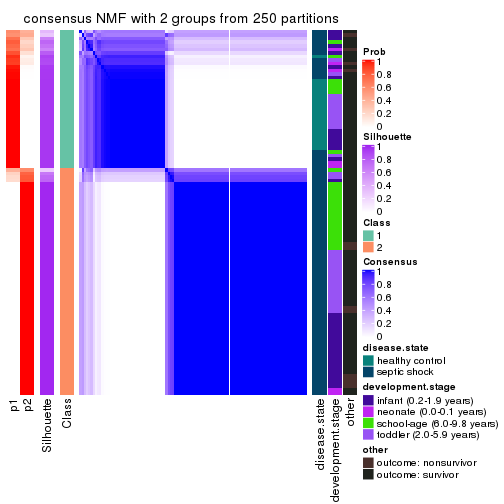</p>

</div>
<div id='tab-SD-NMF-consensus-heatmap-2'>
<pre><code class="r">consensus_heatmap(res, k = 3)
</code></pre>

<p>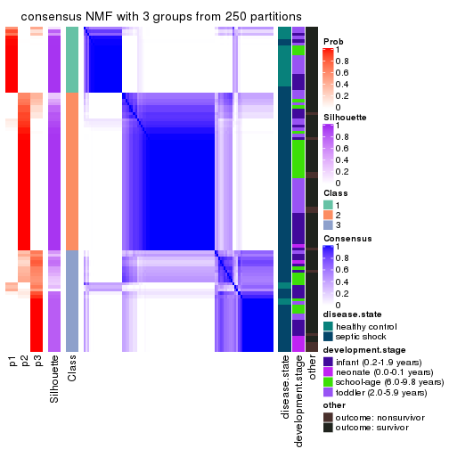</p>

</div>
<div id='tab-SD-NMF-consensus-heatmap-3'>
<pre><code class="r">consensus_heatmap(res, k = 4)
</code></pre>

<p>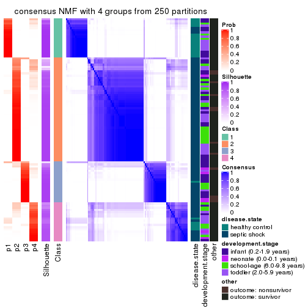</p>

</div>
<div id='tab-SD-NMF-consensus-heatmap-4'>
<pre><code class="r">consensus_heatmap(res, k = 5)
</code></pre>

<p>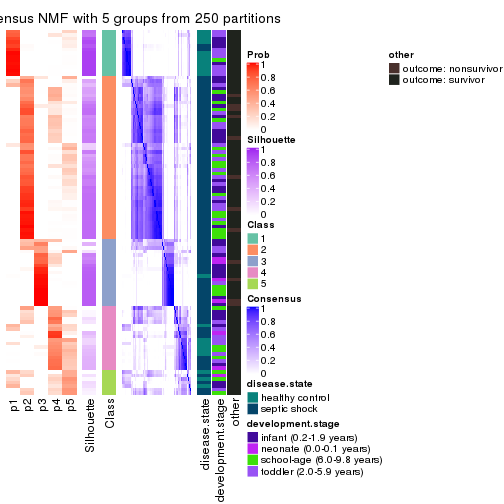</p>

</div>
<div id='tab-SD-NMF-consensus-heatmap-5'>
<pre><code class="r">consensus_heatmap(res, k = 6)
</code></pre>

<p>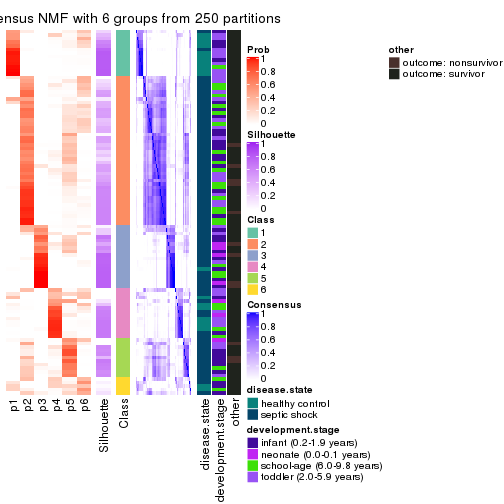</p>

</div>
</div>

Heatmaps for the membership of samples in all partitions to see how consistent they are:


<script>
$( function() {
	$( '#tabs-SD-NMF-membership-heatmap' ).tabs();
} );
</script>
<div id='tabs-SD-NMF-membership-heatmap'>
<ul>
<li><a href='#tab-SD-NMF-membership-heatmap-1'>k = 2</a></li>
<li><a href='#tab-SD-NMF-membership-heatmap-2'>k = 3</a></li>
<li><a href='#tab-SD-NMF-membership-heatmap-3'>k = 4</a></li>
<li><a href='#tab-SD-NMF-membership-heatmap-4'>k = 5</a></li>
<li><a href='#tab-SD-NMF-membership-heatmap-5'>k = 6</a></li>
</ul>
<div id='tab-SD-NMF-membership-heatmap-1'>
<pre><code class="r">membership_heatmap(res, k = 2)
</code></pre>

<p>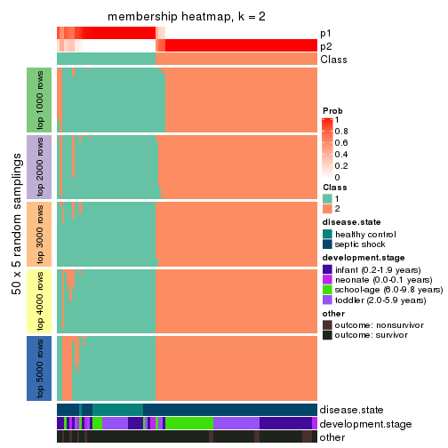</p>

</div>
<div id='tab-SD-NMF-membership-heatmap-2'>
<pre><code class="r">membership_heatmap(res, k = 3)
</code></pre>

<p>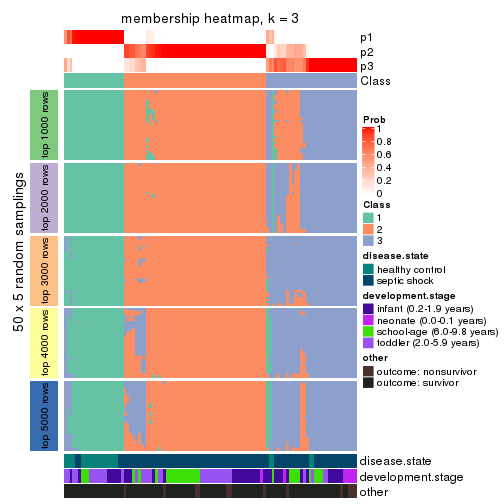</p>

</div>
<div id='tab-SD-NMF-membership-heatmap-3'>
<pre><code class="r">membership_heatmap(res, k = 4)
</code></pre>

<p>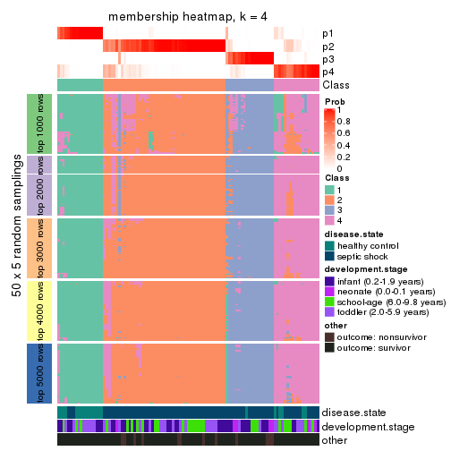</p>

</div>
<div id='tab-SD-NMF-membership-heatmap-4'>
<pre><code class="r">membership_heatmap(res, k = 5)
</code></pre>

<p>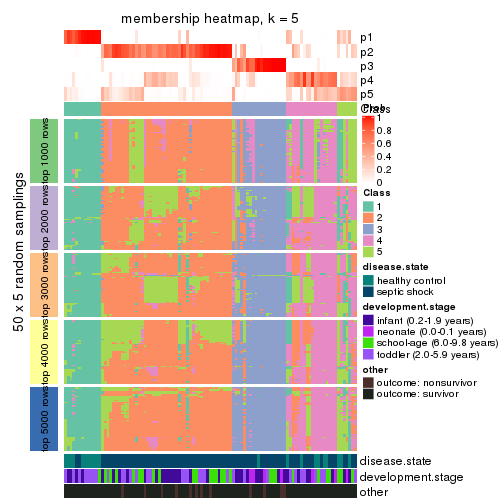</p>

</div>
<div id='tab-SD-NMF-membership-heatmap-5'>
<pre><code class="r">membership_heatmap(res, k = 6)
</code></pre>

<p>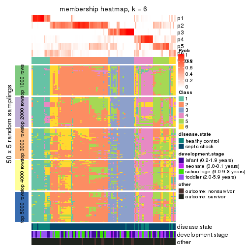</p>

</div>
</div>

As soon as we have had the classes for columns, we can look for signatures
which are significantly different between classes which can be candidate marks
for certain classes. Following are the heatmaps for signatures.


Signature heatmaps where rows are scaled:


<script>
$( function() {
	$( '#tabs-SD-NMF-get-signatures' ).tabs();
} );
</script>
<div id='tabs-SD-NMF-get-signatures'>
<ul>
<li><a href='#tab-SD-NMF-get-signatures-1'>k = 2</a></li>
<li><a href='#tab-SD-NMF-get-signatures-2'>k = 3</a></li>
<li><a href='#tab-SD-NMF-get-signatures-3'>k = 4</a></li>
<li><a href='#tab-SD-NMF-get-signatures-4'>k = 5</a></li>
<li><a href='#tab-SD-NMF-get-signatures-5'>k = 6</a></li>
</ul>
<div id='tab-SD-NMF-get-signatures-1'>
<pre><code class="r">get_signatures(res, k = 2)
</code></pre>

<p>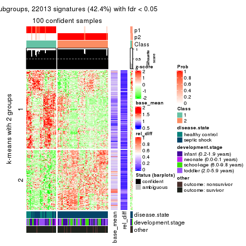</p>

</div>
<div id='tab-SD-NMF-get-signatures-2'>
<pre><code class="r">get_signatures(res, k = 3)
</code></pre>

<p>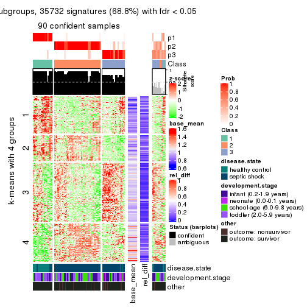</p>

</div>
<div id='tab-SD-NMF-get-signatures-3'>
<pre><code class="r">get_signatures(res, k = 4)
</code></pre>

<p>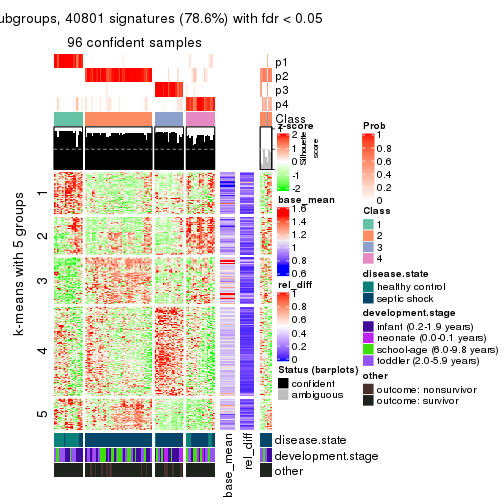</p>

</div>
<div id='tab-SD-NMF-get-signatures-4'>
<pre><code class="r">get_signatures(res, k = 5)
</code></pre>

<p>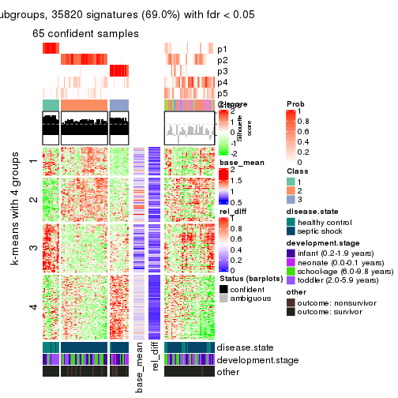</p>

</div>
<div id='tab-SD-NMF-get-signatures-5'>
<pre><code class="r">get_signatures(res, k = 6)
</code></pre>

<p>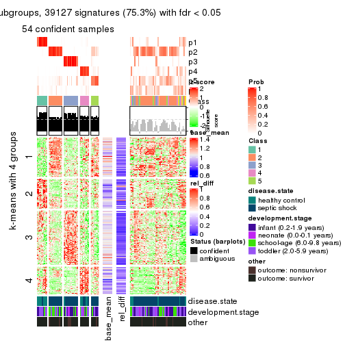</p>

</div>
</div>


Signature heatmaps where rows are not scaled:


<script>
$( function() {
	$( '#tabs-SD-NMF-get-signatures-no-scale' ).tabs();
} );
</script>
<div id='tabs-SD-NMF-get-signatures-no-scale'>
<ul>
<li><a href='#tab-SD-NMF-get-signatures-no-scale-1'>k = 2</a></li>
<li><a href='#tab-SD-NMF-get-signatures-no-scale-2'>k = 3</a></li>
<li><a href='#tab-SD-NMF-get-signatures-no-scale-3'>k = 4</a></li>
<li><a href='#tab-SD-NMF-get-signatures-no-scale-4'>k = 5</a></li>
<li><a href='#tab-SD-NMF-get-signatures-no-scale-5'>k = 6</a></li>
</ul>
<div id='tab-SD-NMF-get-signatures-no-scale-1'>
<pre><code class="r">get_signatures(res, k = 2, scale_rows = FALSE)
</code></pre>

<p>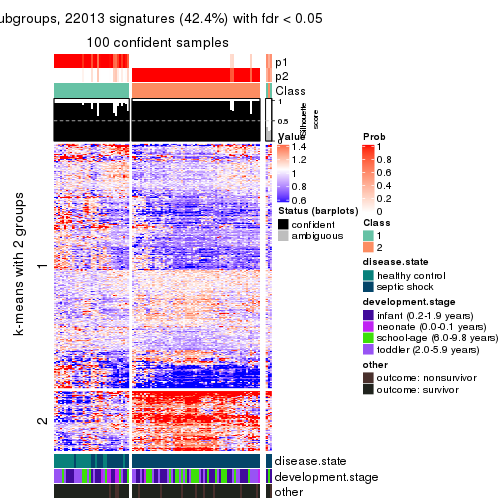</p>

</div>
<div id='tab-SD-NMF-get-signatures-no-scale-2'>
<pre><code class="r">get_signatures(res, k = 3, scale_rows = FALSE)
</code></pre>

<pre><code>#&gt; Error in mat[ceiling(1:nr/h_ratio), ceiling(1:nc/w_ratio), drop = FALSE]: subscript out of bounds
</code></pre>

<p>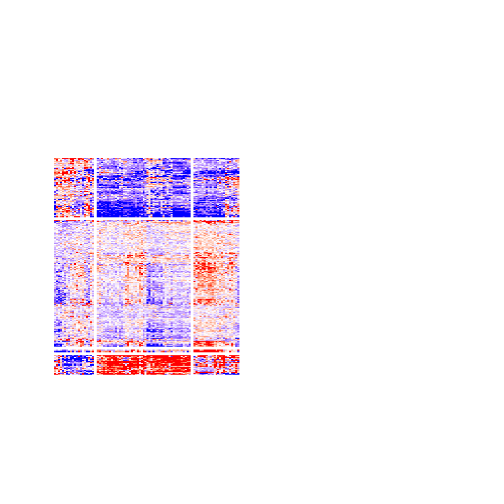</p>

</div>
<div id='tab-SD-NMF-get-signatures-no-scale-3'>
<pre><code class="r">get_signatures(res, k = 4, scale_rows = FALSE)
</code></pre>

<p>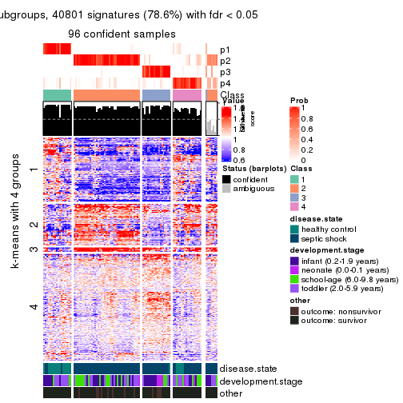</p>

</div>
<div id='tab-SD-NMF-get-signatures-no-scale-4'>
<pre><code class="r">get_signatures(res, k = 5, scale_rows = FALSE)
</code></pre>

<p>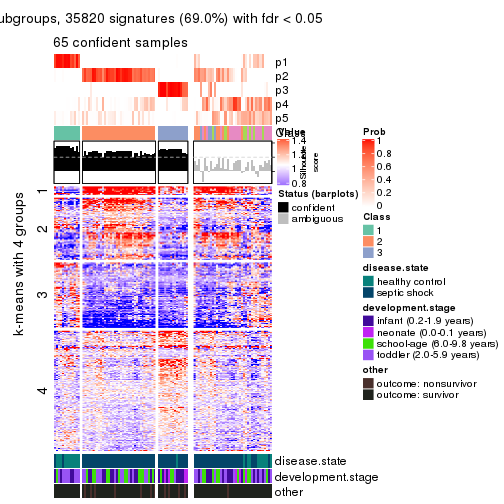</p>

</div>
<div id='tab-SD-NMF-get-signatures-no-scale-5'>
<pre><code class="r">get_signatures(res, k = 6, scale_rows = FALSE)
</code></pre>

<p>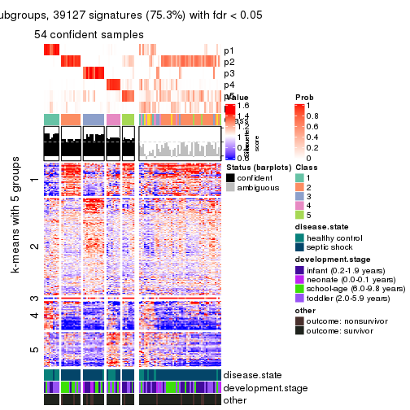</p>

</div>
</div>


Compare the overlap of signatures from different k:

```r
compare_signatures(res)
```

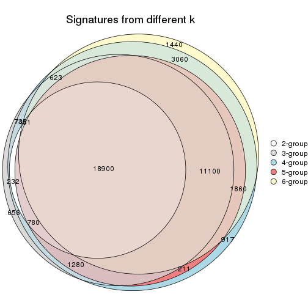

`get_signature()` returns a data frame invisibly. TO get the list of signatures, the function
call should be assigned to a variable explicitly. In following code, if `plot` argument is set
to `FALSE`, no heatmap is plotted while only the differential analysis is performed.

```r
# code only for demonstration
tb = get_signature(res, k = ..., plot = FALSE)
```

An example of the output of `tb` is:

```
#>   which_row         fdr    mean_1    mean_2 scaled_mean_1 scaled_mean_2 km
#> 1        38 0.042760348  8.373488  9.131774    -0.5533452     0.5164555  1
#> 2        40 0.018707592  7.106213  8.469186    -0.6173731     0.5762149  1
#> 3        55 0.019134737 10.221463 11.207825    -0.6159697     0.5749050  1
#> 4        59 0.006059896  5.921854  7.869574    -0.6899429     0.6439467  1
#> 5        60 0.018055526  8.928898 10.211722    -0.6204761     0.5791110  1
#> 6        98 0.009384629 15.714769 14.887706     0.6635654    -0.6193277  2
...
```

The columns in `tb` are:

1. `which_row`: row indices corresponding to the input matrix.
2. `fdr`: FDR for the differential test. 
3. `mean_x`: The mean value in group x.
4. `scaled_mean_x`: The mean value in group x after rows are scaled.
5. `km`: Row groups if k-means clustering is applied to rows.


UMAP plot which shows how samples are separated.


<script>
$( function() {
	$( '#tabs-SD-NMF-dimension-reduction' ).tabs();
} );
</script>
<div id='tabs-SD-NMF-dimension-reduction'>
<ul>
<li><a href='#tab-SD-NMF-dimension-reduction-1'>k = 2</a></li>
<li><a href='#tab-SD-NMF-dimension-reduction-2'>k = 3</a></li>
<li><a href='#tab-SD-NMF-dimension-reduction-3'>k = 4</a></li>
<li><a href='#tab-SD-NMF-dimension-reduction-4'>k = 5</a></li>
<li><a href='#tab-SD-NMF-dimension-reduction-5'>k = 6</a></li>
</ul>
<div id='tab-SD-NMF-dimension-reduction-1'>
<pre><code class="r">dimension_reduction(res, k = 2, method = &quot;UMAP&quot;)
</code></pre>

<p>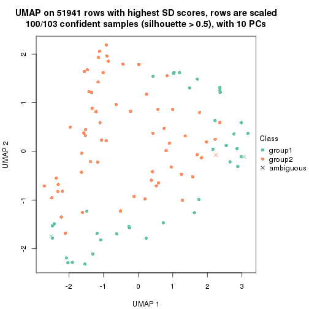</p>

</div>
<div id='tab-SD-NMF-dimension-reduction-2'>
<pre><code class="r">dimension_reduction(res, k = 3, method = &quot;UMAP&quot;)
</code></pre>

<p>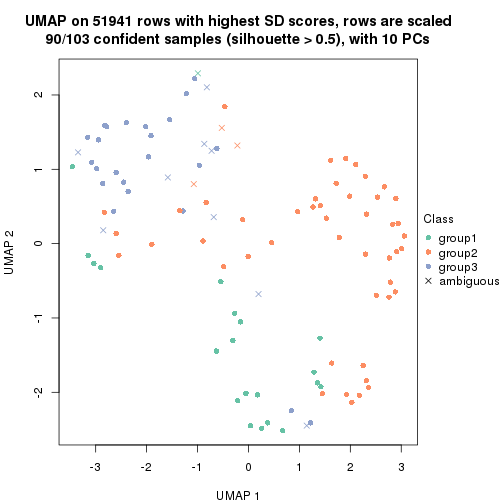</p>

</div>
<div id='tab-SD-NMF-dimension-reduction-3'>
<pre><code class="r">dimension_reduction(res, k = 4, method = &quot;UMAP&quot;)
</code></pre>

<p>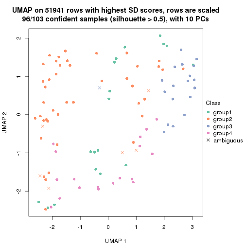</p>

</div>
<div id='tab-SD-NMF-dimension-reduction-4'>
<pre><code class="r">dimension_reduction(res, k = 5, method = &quot;UMAP&quot;)
</code></pre>

<p>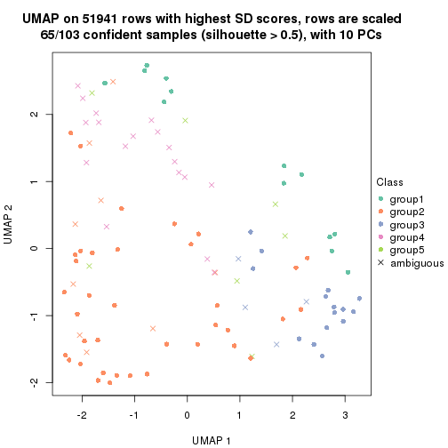</p>

</div>
<div id='tab-SD-NMF-dimension-reduction-5'>
<pre><code class="r">dimension_reduction(res, k = 6, method = &quot;UMAP&quot;)
</code></pre>

<p>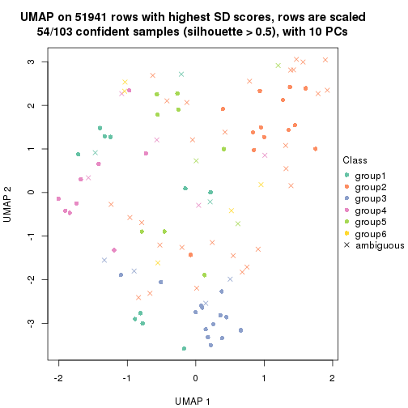</p>

</div>
</div>


Following heatmap shows how subgroups are split when increasing `k`:

```r
collect_classes(res)
```

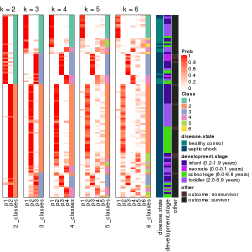


Test correlation between subgroups and known annotations. If the known
annotation is numeric, one-way ANOVA test is applied, and if the known
annotation is discrete, chi-squared contingency table test is applied.

```r
test_to_known_factors(res)
```

```
#>          n disease.state(p) development.stage(p) other(p) k
#> SD:NMF 100         9.58e-11             0.185797   0.7059 2
#> SD:NMF  90         1.90e-13             0.004660   0.1596 3
#> SD:NMF  96         7.90e-12             0.040254   0.0394 4
#> SD:NMF  65         4.71e-11             0.000622   0.1521 5
#> SD:NMF  54         8.16e-07             0.013272   0.3874 6
```


If matrix rows can be associated to genes, consider to use `functional_enrichment(res,
...)` to perform function enrichment for the signature genes. See [this vignette](http://bioconductor.org/packages/devel/bioc/vignettes/cola/inst/doc/functional_enrichment.html) for more detailed explanations.


 

---------------------------------------------------


### CV:hclust


The object with results only for a single top-value method and a single partition method 
can be extracted as:

```r
res = res_list["CV", "hclust"]
# you can also extract it by
# res = res_list["CV:hclust"]
```

A summary of `res` and all the functions that can be applied to it:

```r
res
```

```
#> A 'ConsensusPartition' object with k = 2, 3, 4, 5, 6.
#>   On a matrix with 51941 rows and 103 columns.
#>   Top rows (1000, 2000, 3000, 4000, 5000) are extracted by 'CV' method.
#>   Subgroups are detected by 'hclust' method.
#>   Performed in total 1250 partitions by row resampling.
#>   Best k for subgroups seems to be 2.
#> 
#> Following methods can be applied to this 'ConsensusPartition' object:
#>  [1] "cola_report"             "collect_classes"         "collect_plots"          
#>  [4] "collect_stats"           "colnames"                "compare_signatures"     
#>  [7] "consensus_heatmap"       "dimension_reduction"     "functional_enrichment"  
#> [10] "get_anno_col"            "get_anno"                "get_classes"            
#> [13] "get_consensus"           "get_matrix"              "get_membership"         
#> [16] "get_param"               "get_signatures"          "get_stats"              
#> [19] "is_best_k"               "is_stable_k"             "membership_heatmap"     
#> [22] "ncol"                    "nrow"                    "plot_ecdf"              
#> [25] "rownames"                "select_partition_number" "show"                   
#> [28] "suggest_best_k"          "test_to_known_factors"
```

`collect_plots()` function collects all the plots made from `res` for all `k` (number of partitions)
into one single page to provide an easy and fast comparison between different `k`.

```r
collect_plots(res)
```

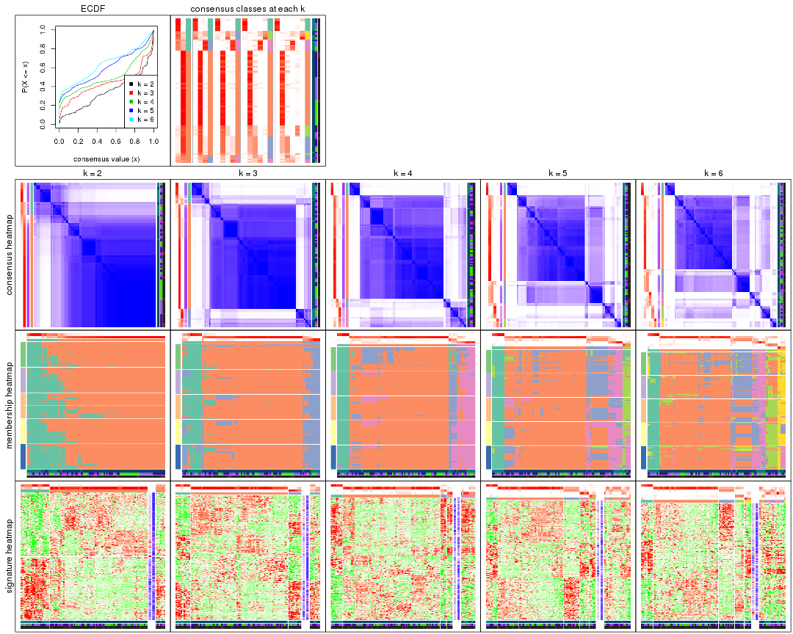

The plots are:

- The first row: a plot of the ECDF (empirical cumulative distribution
  function) curves of the consensus matrix for each `k` and the heatmap of
  predicted classes for each `k`.
- The second row: heatmaps of the consensus matrix for each `k`.
- The third row: heatmaps of the membership matrix for each `k`.
- The fouth row: heatmaps of the signatures for each `k`.

All the plots in panels can be made by individual functions and they are
plotted later in this section.

`select_partition_number()` produces several plots showing different
statistics for choosing "optimized" `k`. There are following statistics:

- ECDF curves of the consensus matrix for each `k`;
- 1-PAC. [The PAC
  score](https://en.wikipedia.org/wiki/Consensus_clustering#Over-interpretation_potential_of_consensus_clustering)
  measures the proportion of the ambiguous subgrouping.
- Mean silhouette score.
- Concordance. The mean probability of fiting the consensus class ids in all
  partitions.
- Area increased. Denote $A_k$ as the area under the ECDF curve for current
  `k`, the area increased is defined as $A_k - A_{k-1}$.
- Rand index. The percent of pairs of samples that are both in a same cluster
  or both are not in a same cluster in the partition of k and k-1.
- Jaccard index. The ratio of pairs of samples are both in a same cluster in
  the partition of k and k-1 and the pairs of samples are both in a same
  cluster in the partition k or k-1.

The detailed explanations of these statistics can be found in [the _cola_
vignette](http://bioconductor.org/packages/devel/bioc/vignettes/cola/inst/doc/cola.html#toc_13).

Generally speaking, lower PAC score, higher mean silhouette score or higher
concordance corresponds to better partition. Rand index and Jaccard index
measure how similar the current partition is compared to partition with `k-1`.
If they are too similar, we won't accept `k` is better than `k-1`.

```r
select_partition_number(res)
```

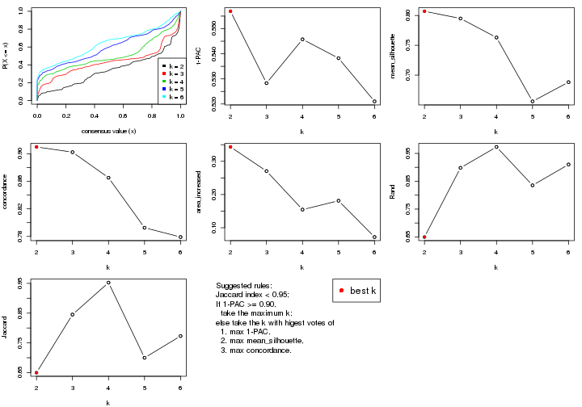

The numeric values for all these statistics can be obtained by `get_stats()`.

```r
get_stats(res)
```

```
#>   k 1-PAC mean_silhouette concordance area_increased  Rand Jaccard
#> 2 2 0.557           0.807       0.910         0.3432 0.650   0.650
#> 3 3 0.528           0.795       0.902         0.2706 0.898   0.845
#> 4 4 0.546           0.763       0.865         0.1547 0.973   0.953
#> 5 5 0.538           0.656       0.793         0.1813 0.835   0.700
#> 6 6 0.521           0.688       0.779         0.0721 0.910   0.773
```

`suggest_best_k()` suggests the best $k$ based on these statistics. The rules are as follows:

- All $k$ with Jaccard index larger than 0.95 are removed because increasing
  $k$ does not provide enough extra information. If all $k$ are removed, it is
  marked as no subgroup is detected.
- For all $k$ with 1-PAC score larger than 0.9, the maximal $k$ is taken as
  the best $k$, and other $k$ are marked as optional $k$.
- If it does not fit the second rule. The $k$ with the maximal vote of the
  highest 1-PAC score, highest mean silhouette, and highest concordance is
  taken as the best $k$.

```r
suggest_best_k(res)
```

```
#> [1] 2
```


Following shows the table of the partitions (You need to click the **show/hide
code output** link to see it). The membership matrix (columns with name `p*`)
is inferred by
[`clue::cl_consensus()`](https://www.rdocumentation.org/link/cl_consensus?package=clue)
function with the `SE` method. Basically the value in the membership matrix
represents the probability to belong to a certain group. The finall class
label for an item is determined with the group with highest probability it
belongs to.

In `get_classes()` function, the entropy is calculated from the membership
matrix and the silhouette score is calculated from the consensus matrix.


<script>
$( function() {
	$( '#tabs-CV-hclust-get-classes' ).tabs();
} );
</script>
<div id='tabs-CV-hclust-get-classes'>
<ul>
<li><a href='#tab-CV-hclust-get-classes-1'>k = 2</a></li>
<li><a href='#tab-CV-hclust-get-classes-2'>k = 3</a></li>
<li><a href='#tab-CV-hclust-get-classes-3'>k = 4</a></li>
<li><a href='#tab-CV-hclust-get-classes-4'>k = 5</a></li>
<li><a href='#tab-CV-hclust-get-classes-5'>k = 6</a></li>
</ul>

<div id='tab-CV-hclust-get-classes-1'>
<p><a id='tab-CV-hclust-get-classes-1-a' style='color:#0366d6' href='#'>show/hide code output</a></p>
<pre><code class="r">cbind(get_classes(res, k = 2), get_membership(res, k = 2))
</code></pre>

<pre><code>#&gt;           class entropy silhouette    p1    p2
#&gt; GSM647569     2  0.3431     0.8875 0.064 0.936
#&gt; GSM647574     2  0.9209     0.3789 0.336 0.664
#&gt; GSM647577     2  0.3431     0.8875 0.064 0.936
#&gt; GSM647547     2  1.0000    -0.2681 0.500 0.500
#&gt; GSM647552     2  0.0938     0.9163 0.012 0.988
#&gt; GSM647553     2  0.9286     0.3540 0.344 0.656
#&gt; GSM647565     2  0.9427     0.2815 0.360 0.640
#&gt; GSM647545     2  0.0000     0.9208 0.000 1.000
#&gt; GSM647549     2  0.0376     0.9198 0.004 0.996
#&gt; GSM647550     2  0.0000     0.9208 0.000 1.000
#&gt; GSM647560     2  0.0000     0.9208 0.000 1.000
#&gt; GSM647617     2  0.3431     0.8875 0.064 0.936
#&gt; GSM647528     2  0.0000     0.9208 0.000 1.000
#&gt; GSM647529     1  0.6801     0.7757 0.820 0.180
#&gt; GSM647531     2  0.0938     0.9175 0.012 0.988
#&gt; GSM647540     2  0.0000     0.9208 0.000 1.000
#&gt; GSM647541     2  0.0000     0.9208 0.000 1.000
#&gt; GSM647546     2  0.2948     0.8948 0.052 0.948
#&gt; GSM647557     2  0.0938     0.9163 0.012 0.988
#&gt; GSM647561     2  0.0376     0.9198 0.004 0.996
#&gt; GSM647567     2  0.1414     0.9134 0.020 0.980
#&gt; GSM647568     2  0.0000     0.9208 0.000 1.000
#&gt; GSM647570     2  0.0000     0.9208 0.000 1.000
#&gt; GSM647573     1  0.9983     0.3091 0.524 0.476
#&gt; GSM647576     2  0.1633     0.9113 0.024 0.976
#&gt; GSM647579     2  0.0938     0.9168 0.012 0.988
#&gt; GSM647580     2  0.3431     0.8875 0.064 0.936
#&gt; GSM647583     2  0.3431     0.8875 0.064 0.936
#&gt; GSM647592     2  0.5519     0.8149 0.128 0.872
#&gt; GSM647593     2  0.5178     0.8279 0.116 0.884
#&gt; GSM647595     2  0.5178     0.8279 0.116 0.884
#&gt; GSM647597     2  0.7453     0.6867 0.212 0.788
#&gt; GSM647598     2  0.0376     0.9197 0.004 0.996
#&gt; GSM647613     2  0.0376     0.9197 0.004 0.996
#&gt; GSM647615     2  0.0000     0.9208 0.000 1.000
#&gt; GSM647616     2  0.3431     0.8875 0.064 0.936
#&gt; GSM647619     2  0.5059     0.8324 0.112 0.888
#&gt; GSM647582     2  0.0000     0.9208 0.000 1.000
#&gt; GSM647591     2  0.5178     0.8279 0.116 0.884
#&gt; GSM647527     2  0.0000     0.9208 0.000 1.000
#&gt; GSM647530     1  0.8955     0.6784 0.688 0.312
#&gt; GSM647532     1  0.6801     0.7757 0.820 0.180
#&gt; GSM647544     2  0.0000     0.9208 0.000 1.000
#&gt; GSM647551     2  0.0376     0.9198 0.004 0.996
#&gt; GSM647556     2  0.3431     0.8875 0.064 0.936
#&gt; GSM647558     2  0.5294     0.8201 0.120 0.880
#&gt; GSM647572     2  0.1633     0.9113 0.024 0.976
#&gt; GSM647578     2  0.0000     0.9208 0.000 1.000
#&gt; GSM647581     2  0.5294     0.8201 0.120 0.880
#&gt; GSM647594     2  0.6247     0.7777 0.156 0.844
#&gt; GSM647599     2  0.7453     0.6950 0.212 0.788
#&gt; GSM647600     2  0.0376     0.9198 0.004 0.996
#&gt; GSM647601     2  0.0000     0.9208 0.000 1.000
#&gt; GSM647603     2  0.1414     0.9134 0.020 0.980
#&gt; GSM647610     2  0.5519     0.8219 0.128 0.872
#&gt; GSM647611     2  0.0000     0.9208 0.000 1.000
#&gt; GSM647612     2  0.0000     0.9208 0.000 1.000
#&gt; GSM647614     2  0.0000     0.9208 0.000 1.000
#&gt; GSM647618     2  0.0000     0.9208 0.000 1.000
#&gt; GSM647629     2  0.0000     0.9208 0.000 1.000
#&gt; GSM647535     2  0.0000     0.9208 0.000 1.000
#&gt; GSM647563     2  0.0000     0.9208 0.000 1.000
#&gt; GSM647542     2  0.0000     0.9208 0.000 1.000
#&gt; GSM647543     2  0.0000     0.9208 0.000 1.000
#&gt; GSM647548     2  0.9815     0.0578 0.420 0.580
#&gt; GSM647554     2  0.0000     0.9208 0.000 1.000
#&gt; GSM647555     2  0.0000     0.9208 0.000 1.000
#&gt; GSM647559     2  0.0000     0.9208 0.000 1.000
#&gt; GSM647562     2  0.0376     0.9195 0.004 0.996
#&gt; GSM647564     2  0.3431     0.8875 0.064 0.936
#&gt; GSM647571     2  0.1414     0.9134 0.020 0.980
#&gt; GSM647584     2  0.0376     0.9198 0.004 0.996
#&gt; GSM647585     2  0.3431     0.8875 0.064 0.936
#&gt; GSM647586     2  0.0000     0.9208 0.000 1.000
#&gt; GSM647587     2  0.0000     0.9208 0.000 1.000
#&gt; GSM647588     2  0.0000     0.9208 0.000 1.000
#&gt; GSM647596     2  0.0000     0.9208 0.000 1.000
#&gt; GSM647602     2  0.3431     0.8875 0.064 0.936
#&gt; GSM647609     2  0.0000     0.9208 0.000 1.000
#&gt; GSM647620     2  0.0000     0.9208 0.000 1.000
#&gt; GSM647627     2  0.0000     0.9208 0.000 1.000
#&gt; GSM647628     2  0.0000     0.9208 0.000 1.000
#&gt; GSM647533     1  0.0376     0.7797 0.996 0.004
#&gt; GSM647536     1  0.6801     0.7757 0.820 0.180
#&gt; GSM647537     1  0.0376     0.7797 0.996 0.004
#&gt; GSM647606     1  0.0376     0.7802 0.996 0.004
#&gt; GSM647621     2  0.9993    -0.1704 0.484 0.516
#&gt; GSM647626     2  0.4562     0.8639 0.096 0.904
#&gt; GSM647538     1  0.7950     0.7032 0.760 0.240
#&gt; GSM647575     1  0.9129     0.6684 0.672 0.328
#&gt; GSM647590     1  0.9087     0.6730 0.676 0.324
#&gt; GSM647605     1  0.0376     0.7802 0.996 0.004
#&gt; GSM647607     1  0.9129     0.6684 0.672 0.328
#&gt; GSM647608     1  0.9580     0.5821 0.620 0.380
#&gt; GSM647622     1  0.0376     0.7802 0.996 0.004
#&gt; GSM647623     1  0.1843     0.7816 0.972 0.028
#&gt; GSM647624     1  0.0376     0.7802 0.996 0.004
#&gt; GSM647625     1  0.1843     0.7816 0.972 0.028
#&gt; GSM647534     1  0.8081     0.6968 0.752 0.248
#&gt; GSM647539     1  0.9248     0.6553 0.660 0.340
#&gt; GSM647566     1  0.9358     0.6412 0.648 0.352
#&gt; GSM647589     1  0.9580     0.5821 0.620 0.380
#&gt; GSM647604     1  0.0376     0.7802 0.996 0.004
</code></pre>

<script>
$('#tab-CV-hclust-get-classes-1-a').parent().next().next().hide();
$('#tab-CV-hclust-get-classes-1-a').click(function(){
  $('#tab-CV-hclust-get-classes-1-a').parent().next().next().toggle();
  return(false);
});
</script>
</div>

<div id='tab-CV-hclust-get-classes-2'>
<p><a id='tab-CV-hclust-get-classes-2-a' style='color:#0366d6' href='#'>show/hide code output</a></p>
<pre><code class="r">cbind(get_classes(res, k = 3), get_membership(res, k = 3))
</code></pre>

<pre><code>#&gt;           class entropy silhouette    p1    p2    p3
#&gt; GSM647569     2  0.3784      0.831 0.004 0.864 0.132
#&gt; GSM647574     2  0.6680     -0.250 0.008 0.508 0.484
#&gt; GSM647577     2  0.3784      0.831 0.004 0.864 0.132
#&gt; GSM647547     3  0.5797      0.588 0.008 0.280 0.712
#&gt; GSM647552     2  0.1015      0.921 0.012 0.980 0.008
#&gt; GSM647553     3  0.6676      0.301 0.008 0.476 0.516
#&gt; GSM647565     3  0.6235      0.444 0.000 0.436 0.564
#&gt; GSM647545     2  0.0424      0.926 0.000 0.992 0.008
#&gt; GSM647549     2  0.0661      0.925 0.004 0.988 0.008
#&gt; GSM647550     2  0.0747      0.924 0.000 0.984 0.016
#&gt; GSM647560     2  0.0424      0.926 0.000 0.992 0.008
#&gt; GSM647617     2  0.3784      0.831 0.004 0.864 0.132
#&gt; GSM647528     2  0.0237      0.926 0.000 0.996 0.004
#&gt; GSM647529     1  0.8547      0.486 0.532 0.104 0.364
#&gt; GSM647531     2  0.1453      0.916 0.008 0.968 0.024
#&gt; GSM647540     2  0.0747      0.924 0.000 0.984 0.016
#&gt; GSM647541     2  0.0592      0.925 0.000 0.988 0.012
#&gt; GSM647546     2  0.3500      0.846 0.004 0.880 0.116
#&gt; GSM647557     2  0.1015      0.921 0.012 0.980 0.008
#&gt; GSM647561     2  0.0661      0.925 0.004 0.988 0.008
#&gt; GSM647567     2  0.1636      0.919 0.020 0.964 0.016
#&gt; GSM647568     2  0.0424      0.926 0.000 0.992 0.008
#&gt; GSM647570     2  0.0237      0.926 0.000 0.996 0.004
#&gt; GSM647573     3  0.5502      0.598 0.008 0.248 0.744
#&gt; GSM647576     2  0.2261      0.891 0.000 0.932 0.068
#&gt; GSM647579     2  0.1163      0.919 0.000 0.972 0.028
#&gt; GSM647580     2  0.3784      0.831 0.004 0.864 0.132
#&gt; GSM647583     2  0.3784      0.831 0.004 0.864 0.132
#&gt; GSM647592     2  0.3482      0.819 0.128 0.872 0.000
#&gt; GSM647593     2  0.3500      0.831 0.116 0.880 0.004
#&gt; GSM647595     2  0.3500      0.831 0.116 0.880 0.004
#&gt; GSM647597     2  0.5366      0.679 0.208 0.776 0.016
#&gt; GSM647598     2  0.0475      0.926 0.004 0.992 0.004
#&gt; GSM647613     2  0.0475      0.926 0.004 0.992 0.004
#&gt; GSM647615     2  0.0237      0.926 0.000 0.996 0.004
#&gt; GSM647616     2  0.3784      0.831 0.004 0.864 0.132
#&gt; GSM647619     2  0.3425      0.836 0.112 0.884 0.004
#&gt; GSM647582     2  0.0237      0.926 0.000 0.996 0.004
#&gt; GSM647591     2  0.3500      0.831 0.116 0.880 0.004
#&gt; GSM647527     2  0.0237      0.926 0.000 0.996 0.004
#&gt; GSM647530     1  0.9755      0.104 0.396 0.228 0.376
#&gt; GSM647532     1  0.8547      0.486 0.532 0.104 0.364
#&gt; GSM647544     2  0.0237      0.926 0.000 0.996 0.004
#&gt; GSM647551     2  0.0475      0.926 0.004 0.992 0.004
#&gt; GSM647556     2  0.3784      0.831 0.004 0.864 0.132
#&gt; GSM647558     2  0.3752      0.800 0.000 0.856 0.144
#&gt; GSM647572     2  0.1753      0.906 0.000 0.952 0.048
#&gt; GSM647578     2  0.0424      0.926 0.000 0.992 0.008
#&gt; GSM647581     2  0.3752      0.800 0.000 0.856 0.144
#&gt; GSM647594     2  0.4291      0.781 0.152 0.840 0.008
#&gt; GSM647599     2  0.6402      0.652 0.200 0.744 0.056
#&gt; GSM647600     2  0.0475      0.927 0.004 0.992 0.004
#&gt; GSM647601     2  0.0237      0.926 0.000 0.996 0.004
#&gt; GSM647603     2  0.0892      0.921 0.000 0.980 0.020
#&gt; GSM647610     2  0.3715      0.824 0.128 0.868 0.004
#&gt; GSM647611     2  0.0237      0.926 0.000 0.996 0.004
#&gt; GSM647612     2  0.0424      0.926 0.000 0.992 0.008
#&gt; GSM647614     2  0.0424      0.926 0.000 0.992 0.008
#&gt; GSM647618     2  0.0237      0.926 0.000 0.996 0.004
#&gt; GSM647629     2  0.0424      0.926 0.000 0.992 0.008
#&gt; GSM647535     2  0.0237      0.926 0.000 0.996 0.004
#&gt; GSM647563     2  0.0237      0.926 0.000 0.996 0.004
#&gt; GSM647542     2  0.0424      0.926 0.000 0.992 0.008
#&gt; GSM647543     2  0.0424      0.926 0.000 0.992 0.008
#&gt; GSM647548     3  0.6264      0.524 0.004 0.380 0.616
#&gt; GSM647554     2  0.0747      0.924 0.000 0.984 0.016
#&gt; GSM647555     2  0.0237      0.926 0.000 0.996 0.004
#&gt; GSM647559     2  0.0237      0.926 0.000 0.996 0.004
#&gt; GSM647562     2  0.0475      0.926 0.004 0.992 0.004
#&gt; GSM647564     2  0.3784      0.831 0.004 0.864 0.132
#&gt; GSM647571     2  0.0892      0.921 0.000 0.980 0.020
#&gt; GSM647584     2  0.0475      0.926 0.004 0.992 0.004
#&gt; GSM647585     2  0.3784      0.831 0.004 0.864 0.132
#&gt; GSM647586     2  0.0237      0.926 0.000 0.996 0.004
#&gt; GSM647587     2  0.0237      0.926 0.000 0.996 0.004
#&gt; GSM647588     2  0.0424      0.926 0.000 0.992 0.008
#&gt; GSM647596     2  0.0237      0.926 0.000 0.996 0.004
#&gt; GSM647602     2  0.3784      0.831 0.004 0.864 0.132
#&gt; GSM647609     2  0.0237      0.926 0.000 0.996 0.004
#&gt; GSM647620     2  0.0237      0.926 0.000 0.996 0.004
#&gt; GSM647627     2  0.0237      0.926 0.000 0.996 0.004
#&gt; GSM647628     2  0.0237      0.926 0.000 0.996 0.004
#&gt; GSM647533     1  0.0424      0.763 0.992 0.000 0.008
#&gt; GSM647536     1  0.8547      0.486 0.532 0.104 0.364
#&gt; GSM647537     1  0.0424      0.763 0.992 0.000 0.008
#&gt; GSM647606     1  0.1860      0.772 0.948 0.000 0.052
#&gt; GSM647621     3  0.8665      0.455 0.124 0.324 0.552
#&gt; GSM647626     2  0.5053      0.776 0.024 0.812 0.164
#&gt; GSM647538     1  0.7413      0.543 0.692 0.204 0.104
#&gt; GSM647575     3  0.1482      0.548 0.020 0.012 0.968
#&gt; GSM647590     3  0.1267      0.533 0.024 0.004 0.972
#&gt; GSM647605     1  0.1860      0.772 0.948 0.000 0.052
#&gt; GSM647607     3  0.1315      0.543 0.020 0.008 0.972
#&gt; GSM647608     3  0.3375      0.607 0.008 0.100 0.892
#&gt; GSM647622     1  0.1860      0.772 0.948 0.000 0.052
#&gt; GSM647623     1  0.1585      0.764 0.964 0.028 0.008
#&gt; GSM647624     1  0.1860      0.772 0.948 0.000 0.052
#&gt; GSM647625     1  0.1585      0.764 0.964 0.028 0.008
#&gt; GSM647534     1  0.7501      0.529 0.684 0.212 0.104
#&gt; GSM647539     3  0.0661      0.543 0.004 0.008 0.988
#&gt; GSM647566     3  0.1620      0.542 0.012 0.024 0.964
#&gt; GSM647589     3  0.3375      0.607 0.008 0.100 0.892
#&gt; GSM647604     1  0.1860      0.772 0.948 0.000 0.052
</code></pre>

<script>
$('#tab-CV-hclust-get-classes-2-a').parent().next().next().hide();
$('#tab-CV-hclust-get-classes-2-a').click(function(){
  $('#tab-CV-hclust-get-classes-2-a').parent().next().next().toggle();
  return(false);
});
</script>
</div>

<div id='tab-CV-hclust-get-classes-3'>
<p><a id='tab-CV-hclust-get-classes-3-a' style='color:#0366d6' href='#'>show/hide code output</a></p>
<pre><code class="r">cbind(get_classes(res, k = 4), get_membership(res, k = 4))
</code></pre>

<pre><code>#&gt;           class entropy silhouette    p1    p2    p3    p4
#&gt; GSM647569     2  0.5314      0.699 0.000 0.740 0.084 0.176
#&gt; GSM647574     4  0.6520      0.373 0.000 0.384 0.080 0.536
#&gt; GSM647577     2  0.5314      0.699 0.000 0.740 0.084 0.176
#&gt; GSM647547     4  0.4253      0.513 0.000 0.208 0.016 0.776
#&gt; GSM647552     2  0.1474      0.867 0.000 0.948 0.052 0.000
#&gt; GSM647553     4  0.6176      0.399 0.000 0.368 0.060 0.572
#&gt; GSM647565     4  0.5298      0.413 0.000 0.372 0.016 0.612
#&gt; GSM647545     2  0.0921      0.875 0.000 0.972 0.028 0.000
#&gt; GSM647549     2  0.1118      0.872 0.000 0.964 0.036 0.000
#&gt; GSM647550     2  0.3301      0.827 0.000 0.876 0.076 0.048
#&gt; GSM647560     2  0.0524      0.877 0.000 0.988 0.008 0.004
#&gt; GSM647617     2  0.5314      0.699 0.000 0.740 0.084 0.176
#&gt; GSM647528     2  0.0469      0.878 0.000 0.988 0.012 0.000
#&gt; GSM647529     3  0.7964      0.741 0.128 0.048 0.532 0.292
#&gt; GSM647531     2  0.1798      0.865 0.000 0.944 0.040 0.016
#&gt; GSM647540     2  0.3383      0.825 0.000 0.872 0.076 0.052
#&gt; GSM647541     2  0.3081      0.835 0.000 0.888 0.064 0.048
#&gt; GSM647546     2  0.5011      0.723 0.000 0.764 0.076 0.160
#&gt; GSM647557     2  0.1302      0.869 0.000 0.956 0.044 0.000
#&gt; GSM647561     2  0.1118      0.872 0.000 0.964 0.036 0.000
#&gt; GSM647567     2  0.4387      0.797 0.000 0.804 0.144 0.052
#&gt; GSM647568     2  0.0657      0.877 0.000 0.984 0.012 0.004
#&gt; GSM647570     2  0.0469      0.879 0.000 0.988 0.012 0.000
#&gt; GSM647573     4  0.3925      0.515 0.000 0.176 0.016 0.808
#&gt; GSM647576     2  0.4130      0.789 0.000 0.828 0.064 0.108
#&gt; GSM647579     2  0.3239      0.831 0.000 0.880 0.052 0.068
#&gt; GSM647580     2  0.5314      0.699 0.000 0.740 0.084 0.176
#&gt; GSM647583     2  0.5314      0.699 0.000 0.740 0.084 0.176
#&gt; GSM647592     2  0.4355      0.710 0.012 0.772 0.212 0.004
#&gt; GSM647593     2  0.3726      0.724 0.000 0.788 0.212 0.000
#&gt; GSM647595     2  0.3726      0.724 0.000 0.788 0.212 0.000
#&gt; GSM647597     2  0.5732      0.568 0.064 0.672 0.264 0.000
#&gt; GSM647598     2  0.0817      0.876 0.000 0.976 0.024 0.000
#&gt; GSM647613     2  0.0817      0.876 0.000 0.976 0.024 0.000
#&gt; GSM647615     2  0.0336      0.877 0.000 0.992 0.008 0.000
#&gt; GSM647616     2  0.5314      0.699 0.000 0.740 0.084 0.176
#&gt; GSM647619     2  0.3649      0.733 0.000 0.796 0.204 0.000
#&gt; GSM647582     2  0.0707      0.877 0.000 0.980 0.020 0.000
#&gt; GSM647591     2  0.3726      0.724 0.000 0.788 0.212 0.000
#&gt; GSM647527     2  0.0469      0.878 0.000 0.988 0.012 0.000
#&gt; GSM647530     3  0.7892      0.470 0.024 0.164 0.504 0.308
#&gt; GSM647532     3  0.7964      0.741 0.128 0.048 0.532 0.292
#&gt; GSM647544     2  0.0592      0.879 0.000 0.984 0.016 0.000
#&gt; GSM647551     2  0.1022      0.875 0.000 0.968 0.032 0.000
#&gt; GSM647556     2  0.5355      0.694 0.000 0.736 0.084 0.180
#&gt; GSM647558     2  0.3812      0.768 0.000 0.832 0.028 0.140
#&gt; GSM647572     2  0.2844      0.845 0.000 0.900 0.048 0.052
#&gt; GSM647578     2  0.1406      0.872 0.000 0.960 0.024 0.016
#&gt; GSM647581     2  0.3812      0.768 0.000 0.832 0.028 0.140
#&gt; GSM647594     2  0.4516      0.654 0.012 0.736 0.252 0.000
#&gt; GSM647599     2  0.7427      0.502 0.112 0.604 0.240 0.044
#&gt; GSM647600     2  0.1545      0.874 0.000 0.952 0.040 0.008
#&gt; GSM647601     2  0.0469      0.878 0.000 0.988 0.012 0.000
#&gt; GSM647603     2  0.1388      0.872 0.000 0.960 0.012 0.028
#&gt; GSM647610     2  0.5075      0.726 0.040 0.752 0.200 0.008
#&gt; GSM647611     2  0.0707      0.877 0.000 0.980 0.020 0.000
#&gt; GSM647612     2  0.0524      0.877 0.000 0.988 0.008 0.004
#&gt; GSM647614     2  0.0524      0.877 0.000 0.988 0.008 0.004
#&gt; GSM647618     2  0.0817      0.876 0.000 0.976 0.024 0.000
#&gt; GSM647629     2  0.1284      0.872 0.000 0.964 0.024 0.012
#&gt; GSM647535     2  0.0469      0.878 0.000 0.988 0.012 0.000
#&gt; GSM647563     2  0.0707      0.877 0.000 0.980 0.020 0.000
#&gt; GSM647542     2  0.0657      0.877 0.000 0.984 0.012 0.004
#&gt; GSM647543     2  0.0657      0.877 0.000 0.984 0.012 0.004
#&gt; GSM647548     4  0.5271      0.419 0.000 0.340 0.020 0.640
#&gt; GSM647554     2  0.3383      0.825 0.000 0.872 0.076 0.052
#&gt; GSM647555     2  0.0469      0.878 0.000 0.988 0.012 0.000
#&gt; GSM647559     2  0.0707      0.877 0.000 0.980 0.020 0.000
#&gt; GSM647562     2  0.0817      0.876 0.000 0.976 0.024 0.000
#&gt; GSM647564     2  0.5355      0.694 0.000 0.736 0.084 0.180
#&gt; GSM647571     2  0.1388      0.872 0.000 0.960 0.012 0.028
#&gt; GSM647584     2  0.1022      0.875 0.000 0.968 0.032 0.000
#&gt; GSM647585     2  0.5355      0.694 0.000 0.736 0.084 0.180
#&gt; GSM647586     2  0.0469      0.878 0.000 0.988 0.012 0.000
#&gt; GSM647587     2  0.0707      0.877 0.000 0.980 0.020 0.000
#&gt; GSM647588     2  0.1042      0.875 0.000 0.972 0.020 0.008
#&gt; GSM647596     2  0.0592      0.878 0.000 0.984 0.016 0.000
#&gt; GSM647602     2  0.5355      0.694 0.000 0.736 0.084 0.180
#&gt; GSM647609     2  0.0469      0.878 0.000 0.988 0.012 0.000
#&gt; GSM647620     2  0.0469      0.878 0.000 0.988 0.012 0.000
#&gt; GSM647627     2  0.0469      0.878 0.000 0.988 0.012 0.000
#&gt; GSM647628     2  0.0376      0.877 0.000 0.992 0.004 0.004
#&gt; GSM647533     1  0.2149      0.922 0.912 0.000 0.088 0.000
#&gt; GSM647536     3  0.7964      0.741 0.128 0.048 0.532 0.292
#&gt; GSM647537     1  0.2149      0.922 0.912 0.000 0.088 0.000
#&gt; GSM647606     1  0.0000      0.956 1.000 0.000 0.000 0.000
#&gt; GSM647621     4  0.8360      0.373 0.112 0.204 0.128 0.556
#&gt; GSM647626     2  0.6408      0.647 0.020 0.692 0.124 0.164
#&gt; GSM647538     3  0.3893      0.519 0.196 0.000 0.796 0.008
#&gt; GSM647575     4  0.1902      0.448 0.004 0.000 0.064 0.932
#&gt; GSM647590     4  0.2124      0.443 0.008 0.000 0.068 0.924
#&gt; GSM647605     1  0.0000      0.956 1.000 0.000 0.000 0.000
#&gt; GSM647607     4  0.1978      0.445 0.004 0.000 0.068 0.928
#&gt; GSM647608     4  0.1211      0.508 0.000 0.040 0.000 0.960
#&gt; GSM647622     1  0.0000      0.956 1.000 0.000 0.000 0.000
#&gt; GSM647623     1  0.1798      0.926 0.944 0.016 0.040 0.000
#&gt; GSM647624     1  0.0000      0.956 1.000 0.000 0.000 0.000
#&gt; GSM647625     1  0.1798      0.926 0.944 0.016 0.040 0.000
#&gt; GSM647534     3  0.4034      0.525 0.192 0.004 0.796 0.008
#&gt; GSM647539     4  0.1867      0.444 0.000 0.000 0.072 0.928
#&gt; GSM647566     4  0.2408      0.419 0.000 0.000 0.104 0.896
#&gt; GSM647589     4  0.1211      0.508 0.000 0.040 0.000 0.960
#&gt; GSM647604     1  0.0000      0.956 1.000 0.000 0.000 0.000
</code></pre>

<script>
$('#tab-CV-hclust-get-classes-3-a').parent().next().next().hide();
$('#tab-CV-hclust-get-classes-3-a').click(function(){
  $('#tab-CV-hclust-get-classes-3-a').parent().next().next().toggle();
  return(false);
});
</script>
</div>

<div id='tab-CV-hclust-get-classes-4'>
<p><a id='tab-CV-hclust-get-classes-4-a' style='color:#0366d6' href='#'>show/hide code output</a></p>
<pre><code class="r">cbind(get_classes(res, k = 5), get_membership(res, k = 5))
</code></pre>

<pre><code>#&gt;           class entropy silhouette    p1    p2    p3    p4    p5
#&gt; GSM647569     3  0.4256     0.7774 0.000 0.436 0.564 0.000 0.000
#&gt; GSM647574     3  0.6257     0.0545 0.000 0.168 0.512 0.320 0.000
#&gt; GSM647577     3  0.4256     0.7774 0.000 0.436 0.564 0.000 0.000
#&gt; GSM647547     4  0.5896     0.4814 0.000 0.128 0.308 0.564 0.000
#&gt; GSM647552     2  0.2172     0.7628 0.000 0.908 0.076 0.000 0.016
#&gt; GSM647553     3  0.6300    -0.0689 0.000 0.164 0.488 0.348 0.000
#&gt; GSM647565     4  0.6656     0.1093 0.000 0.308 0.252 0.440 0.000
#&gt; GSM647545     2  0.0771     0.8056 0.000 0.976 0.020 0.000 0.004
#&gt; GSM647549     2  0.1357     0.7905 0.000 0.948 0.048 0.000 0.004
#&gt; GSM647550     2  0.3210     0.5227 0.000 0.788 0.212 0.000 0.000
#&gt; GSM647560     2  0.0880     0.8009 0.000 0.968 0.032 0.000 0.000
#&gt; GSM647617     3  0.4256     0.7774 0.000 0.436 0.564 0.000 0.000
#&gt; GSM647528     2  0.0000     0.8085 0.000 1.000 0.000 0.000 0.000
#&gt; GSM647529     5  0.6598     0.7273 0.064 0.032 0.036 0.264 0.604
#&gt; GSM647531     2  0.2050     0.7786 0.000 0.920 0.064 0.008 0.008
#&gt; GSM647540     2  0.3210     0.5196 0.000 0.788 0.212 0.000 0.000
#&gt; GSM647541     2  0.3109     0.5505 0.000 0.800 0.200 0.000 0.000
#&gt; GSM647546     3  0.4294     0.7159 0.000 0.468 0.532 0.000 0.000
#&gt; GSM647557     2  0.2046     0.7688 0.000 0.916 0.068 0.000 0.016
#&gt; GSM647561     2  0.1357     0.7905 0.000 0.948 0.048 0.000 0.004
#&gt; GSM647567     2  0.4613     0.2828 0.000 0.620 0.360 0.000 0.020
#&gt; GSM647568     2  0.1341     0.7866 0.000 0.944 0.056 0.000 0.000
#&gt; GSM647570     2  0.0703     0.8069 0.000 0.976 0.024 0.000 0.000
#&gt; GSM647573     4  0.5512     0.5068 0.000 0.104 0.276 0.620 0.000
#&gt; GSM647576     2  0.4030    -0.0573 0.000 0.648 0.352 0.000 0.000
#&gt; GSM647579     2  0.3395     0.4554 0.000 0.764 0.236 0.000 0.000
#&gt; GSM647580     3  0.4256     0.7774 0.000 0.436 0.564 0.000 0.000
#&gt; GSM647583     3  0.4256     0.7774 0.000 0.436 0.564 0.000 0.000
#&gt; GSM647592     2  0.5654     0.3605 0.008 0.592 0.324 0.000 0.076
#&gt; GSM647593     2  0.5104     0.4074 0.000 0.632 0.308 0.000 0.060
#&gt; GSM647595     2  0.5104     0.4074 0.000 0.632 0.308 0.000 0.060
#&gt; GSM647597     2  0.6886     0.2169 0.040 0.508 0.316 0.000 0.136
#&gt; GSM647598     2  0.0451     0.8096 0.000 0.988 0.004 0.000 0.008
#&gt; GSM647613     2  0.0451     0.8096 0.000 0.988 0.004 0.000 0.008
#&gt; GSM647615     2  0.1121     0.7940 0.000 0.956 0.044 0.000 0.000
#&gt; GSM647616     3  0.4256     0.7774 0.000 0.436 0.564 0.000 0.000
#&gt; GSM647619     2  0.5086     0.4156 0.000 0.636 0.304 0.000 0.060
#&gt; GSM647582     2  0.0566     0.8089 0.000 0.984 0.012 0.000 0.004
#&gt; GSM647591     2  0.5104     0.4074 0.000 0.632 0.308 0.000 0.060
#&gt; GSM647527     2  0.0000     0.8085 0.000 1.000 0.000 0.000 0.000
#&gt; GSM647530     5  0.7383     0.4514 0.008 0.164 0.052 0.272 0.504
#&gt; GSM647532     5  0.6598     0.7273 0.064 0.032 0.036 0.264 0.604
#&gt; GSM647544     2  0.0693     0.8095 0.000 0.980 0.008 0.000 0.012
#&gt; GSM647551     2  0.1121     0.7960 0.000 0.956 0.044 0.000 0.000
#&gt; GSM647556     3  0.4242     0.7763 0.000 0.428 0.572 0.000 0.000
#&gt; GSM647558     2  0.4102     0.5817 0.000 0.796 0.080 0.120 0.004
#&gt; GSM647572     2  0.3596     0.5316 0.000 0.784 0.200 0.000 0.016
#&gt; GSM647578     2  0.1671     0.7655 0.000 0.924 0.076 0.000 0.000
#&gt; GSM647581     2  0.4102     0.5817 0.000 0.796 0.080 0.120 0.004
#&gt; GSM647594     2  0.5892     0.3277 0.008 0.580 0.312 0.000 0.100
#&gt; GSM647599     3  0.7104     0.3468 0.096 0.316 0.512 0.004 0.072
#&gt; GSM647600     2  0.1851     0.7856 0.000 0.912 0.088 0.000 0.000
#&gt; GSM647601     2  0.0000     0.8085 0.000 1.000 0.000 0.000 0.000
#&gt; GSM647603     2  0.2464     0.7323 0.000 0.888 0.096 0.000 0.016
#&gt; GSM647610     2  0.5723     0.1547 0.024 0.556 0.376 0.000 0.044
#&gt; GSM647611     2  0.0566     0.8089 0.000 0.984 0.012 0.000 0.004
#&gt; GSM647612     2  0.0880     0.7990 0.000 0.968 0.032 0.000 0.000
#&gt; GSM647614     2  0.0880     0.7990 0.000 0.968 0.032 0.000 0.000
#&gt; GSM647618     2  0.0693     0.8079 0.000 0.980 0.012 0.000 0.008
#&gt; GSM647629     2  0.1732     0.7618 0.000 0.920 0.080 0.000 0.000
#&gt; GSM647535     2  0.0609     0.8057 0.000 0.980 0.020 0.000 0.000
#&gt; GSM647563     2  0.0566     0.8089 0.000 0.984 0.012 0.000 0.004
#&gt; GSM647542     2  0.1341     0.7866 0.000 0.944 0.056 0.000 0.000
#&gt; GSM647543     2  0.1341     0.7866 0.000 0.944 0.056 0.000 0.000
#&gt; GSM647548     4  0.6555     0.3091 0.000 0.284 0.212 0.500 0.004
#&gt; GSM647554     2  0.3242     0.5141 0.000 0.784 0.216 0.000 0.000
#&gt; GSM647555     2  0.1121     0.7961 0.000 0.956 0.044 0.000 0.000
#&gt; GSM647559     2  0.0566     0.8089 0.000 0.984 0.012 0.000 0.004
#&gt; GSM647562     2  0.0693     0.8083 0.000 0.980 0.012 0.000 0.008
#&gt; GSM647564     3  0.4249     0.7778 0.000 0.432 0.568 0.000 0.000
#&gt; GSM647571     2  0.2519     0.7272 0.000 0.884 0.100 0.000 0.016
#&gt; GSM647584     2  0.1121     0.7960 0.000 0.956 0.044 0.000 0.000
#&gt; GSM647585     3  0.4262     0.7649 0.000 0.440 0.560 0.000 0.000
#&gt; GSM647586     2  0.0000     0.8085 0.000 1.000 0.000 0.000 0.000
#&gt; GSM647587     2  0.0566     0.8089 0.000 0.984 0.012 0.000 0.004
#&gt; GSM647588     2  0.1478     0.7778 0.000 0.936 0.064 0.000 0.000
#&gt; GSM647596     2  0.0162     0.8091 0.000 0.996 0.000 0.000 0.004
#&gt; GSM647602     3  0.4249     0.7778 0.000 0.432 0.568 0.000 0.000
#&gt; GSM647609     2  0.0000     0.8085 0.000 1.000 0.000 0.000 0.000
#&gt; GSM647620     2  0.0609     0.8057 0.000 0.980 0.020 0.000 0.000
#&gt; GSM647627     2  0.0000     0.8085 0.000 1.000 0.000 0.000 0.000
#&gt; GSM647628     2  0.0703     0.8022 0.000 0.976 0.024 0.000 0.000
#&gt; GSM647533     1  0.2732     0.8484 0.840 0.000 0.000 0.000 0.160
#&gt; GSM647536     5  0.6598     0.7273 0.064 0.032 0.036 0.264 0.604
#&gt; GSM647537     1  0.2732     0.8484 0.840 0.000 0.000 0.000 0.160
#&gt; GSM647606     1  0.0000     0.9433 1.000 0.000 0.000 0.000 0.000
#&gt; GSM647621     3  0.7346    -0.4602 0.096 0.008 0.436 0.388 0.072
#&gt; GSM647626     3  0.5703     0.7146 0.008 0.380 0.552 0.004 0.056
#&gt; GSM647538     5  0.2959     0.5823 0.112 0.000 0.016 0.008 0.864
#&gt; GSM647575     4  0.0613     0.5331 0.004 0.000 0.004 0.984 0.008
#&gt; GSM647590     4  0.1756     0.5193 0.008 0.000 0.036 0.940 0.016
#&gt; GSM647605     1  0.0000     0.9433 1.000 0.000 0.000 0.000 0.000
#&gt; GSM647607     4  0.0451     0.5305 0.004 0.000 0.000 0.988 0.008
#&gt; GSM647608     4  0.3942     0.5567 0.000 0.020 0.232 0.748 0.000
#&gt; GSM647622     1  0.0000     0.9433 1.000 0.000 0.000 0.000 0.000
#&gt; GSM647623     1  0.1430     0.9173 0.944 0.000 0.052 0.000 0.004
#&gt; GSM647624     1  0.0000     0.9433 1.000 0.000 0.000 0.000 0.000
#&gt; GSM647625     1  0.1430     0.9173 0.944 0.000 0.052 0.000 0.004
#&gt; GSM647534     5  0.3096     0.5852 0.108 0.000 0.024 0.008 0.860
#&gt; GSM647539     4  0.1648     0.5226 0.000 0.000 0.040 0.940 0.020
#&gt; GSM647566     4  0.2300     0.4968 0.000 0.000 0.040 0.908 0.052
#&gt; GSM647589     4  0.3942     0.5567 0.000 0.020 0.232 0.748 0.000
#&gt; GSM647604     1  0.0000     0.9433 1.000 0.000 0.000 0.000 0.000
</code></pre>

<script>
$('#tab-CV-hclust-get-classes-4-a').parent().next().next().hide();
$('#tab-CV-hclust-get-classes-4-a').click(function(){
  $('#tab-CV-hclust-get-classes-4-a').parent().next().next().toggle();
  return(false);
});
</script>
</div>

<div id='tab-CV-hclust-get-classes-5'>
<p><a id='tab-CV-hclust-get-classes-5-a' style='color:#0366d6' href='#'>show/hide code output</a></p>
<pre><code class="r">cbind(get_classes(res, k = 6), get_membership(res, k = 6))
</code></pre>

<pre><code>#&gt;           class entropy silhouette    p1    p2    p3    p4    p5    p6
#&gt; GSM647569     3  0.3765    0.76349 0.000 0.404 0.596 0.000 0.000 0.000
#&gt; GSM647574     3  0.5701    0.16382 0.000 0.144 0.616 0.204 0.036 0.000
#&gt; GSM647577     3  0.3765    0.76349 0.000 0.404 0.596 0.000 0.000 0.000
#&gt; GSM647547     4  0.6400    0.39520 0.000 0.104 0.388 0.440 0.068 0.000
#&gt; GSM647552     2  0.2135    0.76493 0.000 0.872 0.000 0.000 0.128 0.000
#&gt; GSM647553     3  0.5827    0.03832 0.000 0.128 0.600 0.228 0.044 0.000
#&gt; GSM647565     3  0.7052   -0.13251 0.000 0.280 0.332 0.324 0.064 0.000
#&gt; GSM647545     2  0.1075    0.84873 0.000 0.952 0.000 0.000 0.048 0.000
#&gt; GSM647549     2  0.1610    0.81609 0.000 0.916 0.000 0.000 0.084 0.000
#&gt; GSM647550     2  0.3287    0.55873 0.000 0.768 0.220 0.000 0.012 0.000
#&gt; GSM647560     2  0.0935    0.85548 0.000 0.964 0.032 0.000 0.004 0.000
#&gt; GSM647617     3  0.3899    0.76123 0.000 0.404 0.592 0.000 0.004 0.000
#&gt; GSM647528     2  0.0777    0.85897 0.000 0.972 0.004 0.000 0.024 0.000
#&gt; GSM647529     6  0.6429    0.72511 0.012 0.016 0.044 0.236 0.108 0.584
#&gt; GSM647531     2  0.2214    0.79621 0.000 0.892 0.012 0.004 0.092 0.000
#&gt; GSM647540     2  0.3190    0.56713 0.000 0.772 0.220 0.000 0.008 0.000
#&gt; GSM647541     2  0.3171    0.59754 0.000 0.784 0.204 0.000 0.012 0.000
#&gt; GSM647546     3  0.3955    0.69719 0.000 0.436 0.560 0.000 0.004 0.000
#&gt; GSM647557     2  0.2048    0.77456 0.000 0.880 0.000 0.000 0.120 0.000
#&gt; GSM647561     2  0.1610    0.81609 0.000 0.916 0.000 0.000 0.084 0.000
#&gt; GSM647567     2  0.5648    0.08343 0.000 0.536 0.240 0.000 0.224 0.000
#&gt; GSM647568     2  0.1349    0.84135 0.000 0.940 0.056 0.000 0.004 0.000
#&gt; GSM647570     2  0.1003    0.85818 0.000 0.964 0.020 0.000 0.016 0.000
#&gt; GSM647573     4  0.6141    0.41450 0.000 0.080 0.356 0.496 0.068 0.000
#&gt; GSM647576     2  0.3899    0.00611 0.000 0.628 0.364 0.000 0.008 0.000
#&gt; GSM647579     2  0.3373    0.49982 0.000 0.744 0.248 0.000 0.008 0.000
#&gt; GSM647580     3  0.3899    0.76123 0.000 0.404 0.592 0.000 0.004 0.000
#&gt; GSM647583     3  0.3765    0.76349 0.000 0.404 0.596 0.000 0.000 0.000
#&gt; GSM647592     5  0.3844    0.75440 0.004 0.312 0.008 0.000 0.676 0.000
#&gt; GSM647593     5  0.3881    0.78355 0.000 0.396 0.004 0.000 0.600 0.000
#&gt; GSM647595     5  0.3881    0.78355 0.000 0.396 0.004 0.000 0.600 0.000
#&gt; GSM647597     5  0.4424    0.60150 0.004 0.224 0.004 0.000 0.708 0.060
#&gt; GSM647598     2  0.1082    0.85902 0.000 0.956 0.004 0.000 0.040 0.000
#&gt; GSM647613     2  0.1082    0.85902 0.000 0.956 0.004 0.000 0.040 0.000
#&gt; GSM647615     2  0.1265    0.84930 0.000 0.948 0.044 0.000 0.008 0.000
#&gt; GSM647616     3  0.3765    0.76349 0.000 0.404 0.596 0.000 0.000 0.000
#&gt; GSM647619     5  0.3899    0.77340 0.000 0.404 0.004 0.000 0.592 0.000
#&gt; GSM647582     2  0.1007    0.85479 0.000 0.956 0.000 0.000 0.044 0.000
#&gt; GSM647591     5  0.3881    0.78355 0.000 0.396 0.004 0.000 0.600 0.000
#&gt; GSM647527     2  0.0777    0.85897 0.000 0.972 0.004 0.000 0.024 0.000
#&gt; GSM647530     6  0.7754    0.48513 0.000 0.136 0.056 0.240 0.120 0.448
#&gt; GSM647532     6  0.6429    0.72511 0.012 0.016 0.044 0.236 0.108 0.584
#&gt; GSM647544     2  0.1367    0.86015 0.000 0.944 0.012 0.000 0.044 0.000
#&gt; GSM647551     2  0.1714    0.81739 0.000 0.908 0.000 0.000 0.092 0.000
#&gt; GSM647556     3  0.3975    0.76031 0.000 0.392 0.600 0.000 0.008 0.000
#&gt; GSM647558     2  0.4375    0.60020 0.000 0.772 0.076 0.092 0.060 0.000
#&gt; GSM647572     2  0.3487    0.55112 0.000 0.756 0.224 0.000 0.020 0.000
#&gt; GSM647578     2  0.1812    0.81668 0.000 0.912 0.080 0.000 0.008 0.000
#&gt; GSM647581     2  0.4375    0.60020 0.000 0.772 0.076 0.092 0.060 0.000
#&gt; GSM647594     5  0.3822    0.72511 0.004 0.300 0.004 0.000 0.688 0.004
#&gt; GSM647599     5  0.6477    0.17982 0.024 0.160 0.308 0.000 0.492 0.016
#&gt; GSM647600     2  0.2724    0.81784 0.000 0.864 0.052 0.000 0.084 0.000
#&gt; GSM647601     2  0.0790    0.85906 0.000 0.968 0.000 0.000 0.032 0.000
#&gt; GSM647603     2  0.2558    0.78281 0.000 0.868 0.104 0.000 0.028 0.000
#&gt; GSM647610     5  0.6028    0.48677 0.000 0.340 0.176 0.000 0.472 0.012
#&gt; GSM647611     2  0.1267    0.85238 0.000 0.940 0.000 0.000 0.060 0.000
#&gt; GSM647612     2  0.0935    0.85157 0.000 0.964 0.032 0.000 0.004 0.000
#&gt; GSM647614     2  0.0935    0.85157 0.000 0.964 0.032 0.000 0.004 0.000
#&gt; GSM647618     2  0.1075    0.85246 0.000 0.952 0.000 0.000 0.048 0.000
#&gt; GSM647629     2  0.1866    0.81366 0.000 0.908 0.084 0.000 0.008 0.000
#&gt; GSM647535     2  0.0820    0.85967 0.000 0.972 0.016 0.000 0.012 0.000
#&gt; GSM647563     2  0.1152    0.85657 0.000 0.952 0.004 0.000 0.044 0.000
#&gt; GSM647542     2  0.1349    0.84135 0.000 0.940 0.056 0.000 0.004 0.000
#&gt; GSM647543     2  0.1349    0.84135 0.000 0.940 0.056 0.000 0.004 0.000
#&gt; GSM647548     4  0.7020    0.21285 0.000 0.260 0.284 0.388 0.068 0.000
#&gt; GSM647554     2  0.3314    0.55001 0.000 0.764 0.224 0.000 0.012 0.000
#&gt; GSM647555     2  0.1075    0.85121 0.000 0.952 0.048 0.000 0.000 0.000
#&gt; GSM647559     2  0.1124    0.85982 0.000 0.956 0.008 0.000 0.036 0.000
#&gt; GSM647562     2  0.1219    0.85538 0.000 0.948 0.004 0.000 0.048 0.000
#&gt; GSM647564     3  0.3993    0.76398 0.000 0.400 0.592 0.000 0.008 0.000
#&gt; GSM647571     2  0.2573    0.77380 0.000 0.864 0.112 0.000 0.024 0.000
#&gt; GSM647584     2  0.1714    0.81739 0.000 0.908 0.000 0.000 0.092 0.000
#&gt; GSM647585     3  0.3899    0.75581 0.000 0.404 0.592 0.000 0.004 0.000
#&gt; GSM647586     2  0.0777    0.85897 0.000 0.972 0.004 0.000 0.024 0.000
#&gt; GSM647587     2  0.1082    0.85671 0.000 0.956 0.004 0.000 0.040 0.000
#&gt; GSM647588     2  0.1643    0.82859 0.000 0.924 0.068 0.000 0.008 0.000
#&gt; GSM647596     2  0.0777    0.85996 0.000 0.972 0.004 0.000 0.024 0.000
#&gt; GSM647602     3  0.3993    0.76398 0.000 0.400 0.592 0.000 0.008 0.000
#&gt; GSM647609     2  0.0790    0.85906 0.000 0.968 0.000 0.000 0.032 0.000
#&gt; GSM647620     2  0.0820    0.85967 0.000 0.972 0.016 0.000 0.012 0.000
#&gt; GSM647627     2  0.0790    0.85906 0.000 0.968 0.000 0.000 0.032 0.000
#&gt; GSM647628     2  0.0777    0.85422 0.000 0.972 0.024 0.000 0.004 0.000
#&gt; GSM647533     1  0.3126    0.74104 0.752 0.000 0.000 0.000 0.000 0.248
#&gt; GSM647536     6  0.6429    0.72511 0.012 0.016 0.044 0.236 0.108 0.584
#&gt; GSM647537     1  0.3126    0.74104 0.752 0.000 0.000 0.000 0.000 0.248
#&gt; GSM647606     1  0.0000    0.90621 1.000 0.000 0.000 0.000 0.000 0.000
#&gt; GSM647621     3  0.6706   -0.43802 0.024 0.000 0.472 0.284 0.200 0.020
#&gt; GSM647626     3  0.5250    0.66345 0.000 0.352 0.556 0.000 0.084 0.008
#&gt; GSM647538     6  0.1053    0.60970 0.020 0.000 0.004 0.000 0.012 0.964
#&gt; GSM647575     4  0.0551    0.44925 0.000 0.000 0.004 0.984 0.004 0.008
#&gt; GSM647590     4  0.3804    0.41120 0.000 0.000 0.184 0.768 0.040 0.008
#&gt; GSM647605     1  0.0000    0.90621 1.000 0.000 0.000 0.000 0.000 0.000
#&gt; GSM647607     4  0.0405    0.44692 0.000 0.000 0.000 0.988 0.004 0.008
#&gt; GSM647608     4  0.4750    0.47382 0.000 0.016 0.316 0.628 0.040 0.000
#&gt; GSM647622     1  0.1124    0.90322 0.956 0.000 0.008 0.000 0.036 0.000
#&gt; GSM647623     1  0.2094    0.88454 0.900 0.000 0.020 0.000 0.080 0.000
#&gt; GSM647624     1  0.1124    0.90322 0.956 0.000 0.008 0.000 0.036 0.000
#&gt; GSM647625     1  0.2094    0.88454 0.900 0.000 0.020 0.000 0.080 0.000
#&gt; GSM647534     6  0.0914    0.61155 0.016 0.000 0.000 0.000 0.016 0.968
#&gt; GSM647539     4  0.4201    0.39648 0.000 0.000 0.216 0.728 0.044 0.012
#&gt; GSM647566     4  0.4700    0.37853 0.000 0.000 0.212 0.704 0.044 0.040
#&gt; GSM647589     4  0.4750    0.47382 0.000 0.016 0.316 0.628 0.040 0.000
#&gt; GSM647604     1  0.0000    0.90621 1.000 0.000 0.000 0.000 0.000 0.000
</code></pre>

<script>
$('#tab-CV-hclust-get-classes-5-a').parent().next().next().hide();
$('#tab-CV-hclust-get-classes-5-a').click(function(){
  $('#tab-CV-hclust-get-classes-5-a').parent().next().next().toggle();
  return(false);
});
</script>
</div>
</div>

Heatmaps for the consensus matrix. It visualizes the probability of two
samples to be in a same group.


<script>
$( function() {
	$( '#tabs-CV-hclust-consensus-heatmap' ).tabs();
} );
</script>
<div id='tabs-CV-hclust-consensus-heatmap'>
<ul>
<li><a href='#tab-CV-hclust-consensus-heatmap-1'>k = 2</a></li>
<li><a href='#tab-CV-hclust-consensus-heatmap-2'>k = 3</a></li>
<li><a href='#tab-CV-hclust-consensus-heatmap-3'>k = 4</a></li>
<li><a href='#tab-CV-hclust-consensus-heatmap-4'>k = 5</a></li>
<li><a href='#tab-CV-hclust-consensus-heatmap-5'>k = 6</a></li>
</ul>
<div id='tab-CV-hclust-consensus-heatmap-1'>
<pre><code class="r">consensus_heatmap(res, k = 2)
</code></pre>

<p>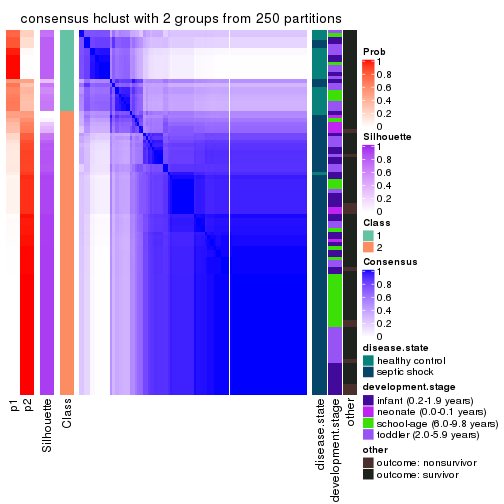</p>

</div>
<div id='tab-CV-hclust-consensus-heatmap-2'>
<pre><code class="r">consensus_heatmap(res, k = 3)
</code></pre>

<p>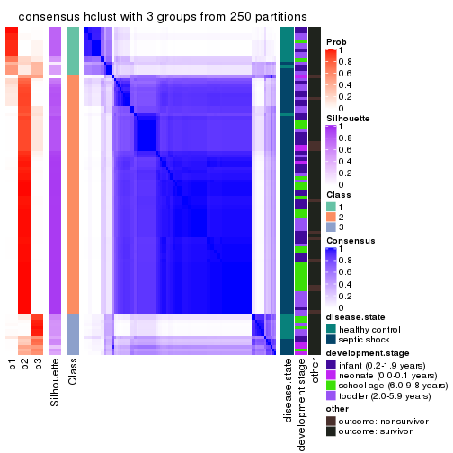</p>

</div>
<div id='tab-CV-hclust-consensus-heatmap-3'>
<pre><code class="r">consensus_heatmap(res, k = 4)
</code></pre>

<p>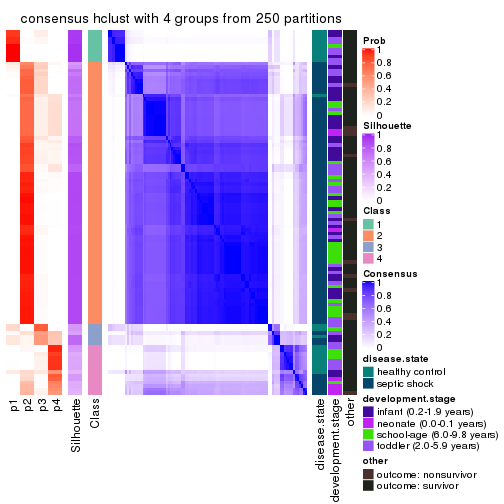</p>

</div>
<div id='tab-CV-hclust-consensus-heatmap-4'>
<pre><code class="r">consensus_heatmap(res, k = 5)
</code></pre>

<p>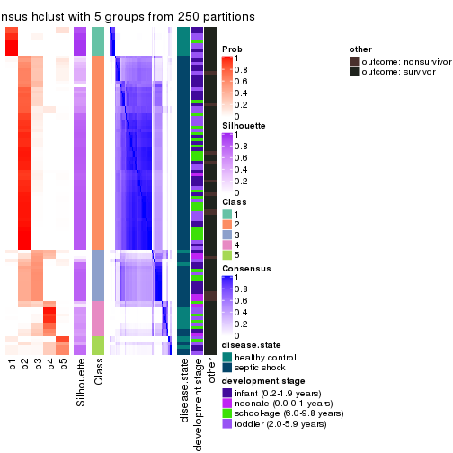</p>

</div>
<div id='tab-CV-hclust-consensus-heatmap-5'>
<pre><code class="r">consensus_heatmap(res, k = 6)
</code></pre>

<p>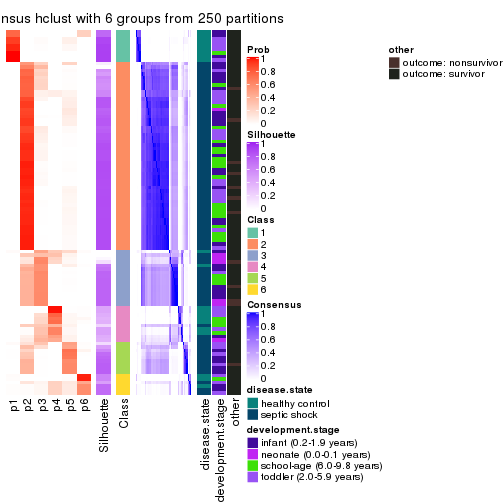</p>

</div>
</div>

Heatmaps for the membership of samples in all partitions to see how consistent they are:


<script>
$( function() {
	$( '#tabs-CV-hclust-membership-heatmap' ).tabs();
} );
</script>
<div id='tabs-CV-hclust-membership-heatmap'>
<ul>
<li><a href='#tab-CV-hclust-membership-heatmap-1'>k = 2</a></li>
<li><a href='#tab-CV-hclust-membership-heatmap-2'>k = 3</a></li>
<li><a href='#tab-CV-hclust-membership-heatmap-3'>k = 4</a></li>
<li><a href='#tab-CV-hclust-membership-heatmap-4'>k = 5</a></li>
<li><a href='#tab-CV-hclust-membership-heatmap-5'>k = 6</a></li>
</ul>
<div id='tab-CV-hclust-membership-heatmap-1'>
<pre><code class="r">membership_heatmap(res, k = 2)
</code></pre>

<p>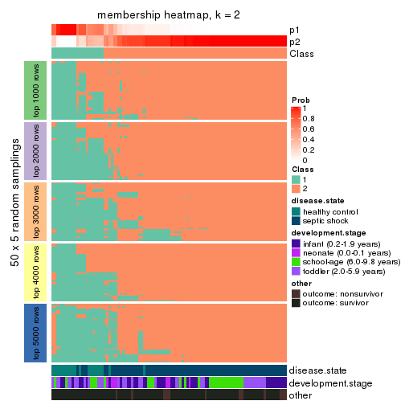</p>

</div>
<div id='tab-CV-hclust-membership-heatmap-2'>
<pre><code class="r">membership_heatmap(res, k = 3)
</code></pre>

<p>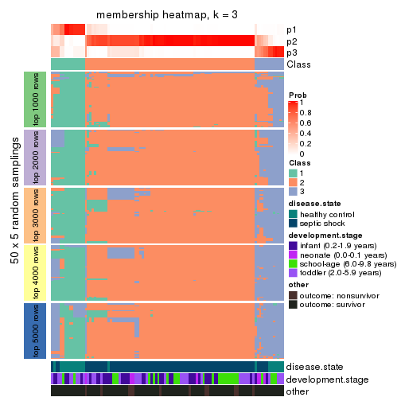</p>

</div>
<div id='tab-CV-hclust-membership-heatmap-3'>
<pre><code class="r">membership_heatmap(res, k = 4)
</code></pre>

<p>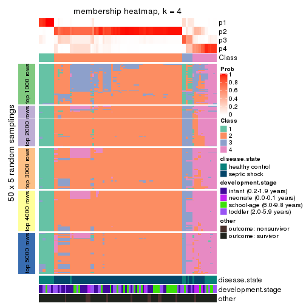</p>

</div>
<div id='tab-CV-hclust-membership-heatmap-4'>
<pre><code class="r">membership_heatmap(res, k = 5)
</code></pre>

<p>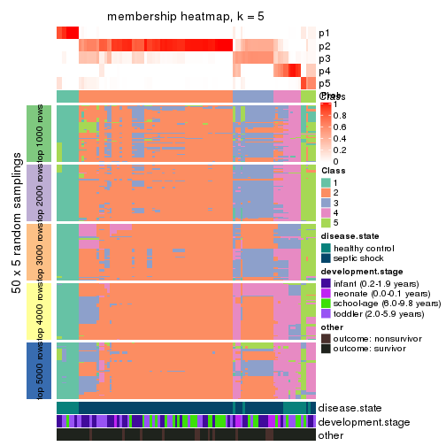</p>

</div>
<div id='tab-CV-hclust-membership-heatmap-5'>
<pre><code class="r">membership_heatmap(res, k = 6)
</code></pre>

<p>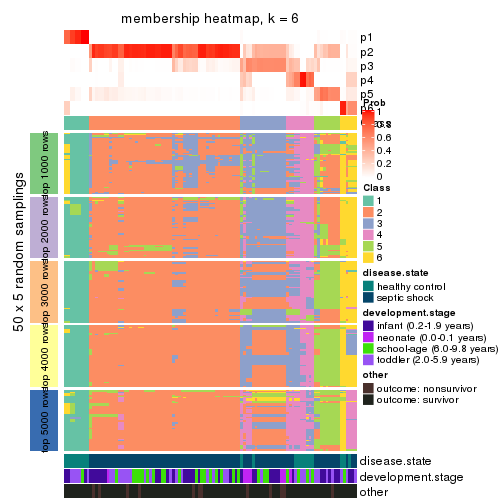</p>

</div>
</div>

As soon as we have had the classes for columns, we can look for signatures
which are significantly different between classes which can be candidate marks
for certain classes. Following are the heatmaps for signatures.


Signature heatmaps where rows are scaled:


<script>
$( function() {
	$( '#tabs-CV-hclust-get-signatures' ).tabs();
} );
</script>
<div id='tabs-CV-hclust-get-signatures'>
<ul>
<li><a href='#tab-CV-hclust-get-signatures-1'>k = 2</a></li>
<li><a href='#tab-CV-hclust-get-signatures-2'>k = 3</a></li>
<li><a href='#tab-CV-hclust-get-signatures-3'>k = 4</a></li>
<li><a href='#tab-CV-hclust-get-signatures-4'>k = 5</a></li>
<li><a href='#tab-CV-hclust-get-signatures-5'>k = 6</a></li>
</ul>
<div id='tab-CV-hclust-get-signatures-1'>
<pre><code class="r">get_signatures(res, k = 2)
</code></pre>

<p>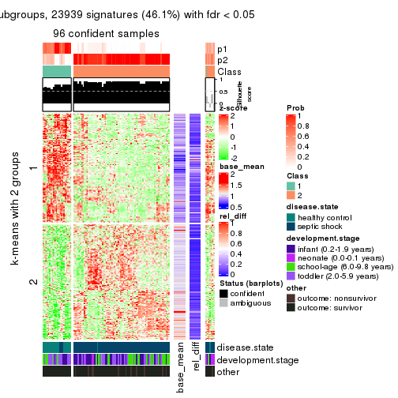</p>

</div>
<div id='tab-CV-hclust-get-signatures-2'>
<pre><code class="r">get_signatures(res, k = 3)
</code></pre>

<p>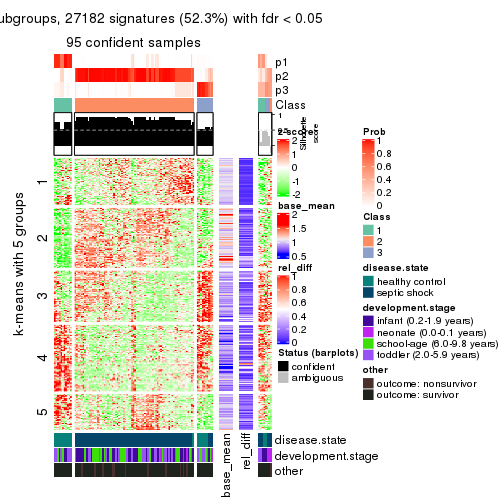</p>

</div>
<div id='tab-CV-hclust-get-signatures-3'>
<pre><code class="r">get_signatures(res, k = 4)
</code></pre>

<p>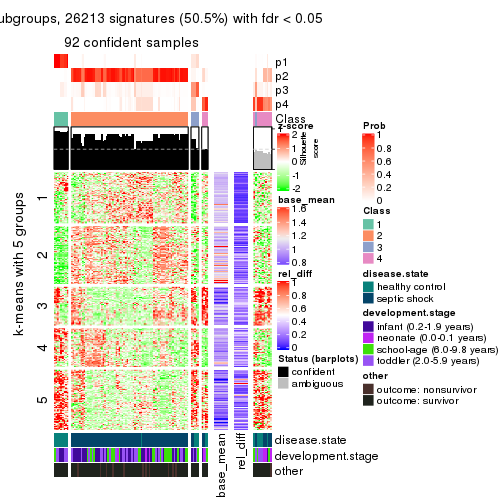</p>

</div>
<div id='tab-CV-hclust-get-signatures-4'>
<pre><code class="r">get_signatures(res, k = 5)
</code></pre>

<p>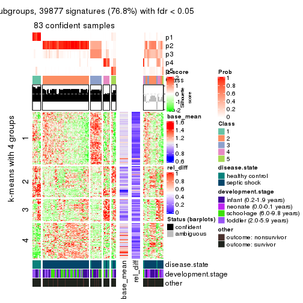</p>

</div>
<div id='tab-CV-hclust-get-signatures-5'>
<pre><code class="r">get_signatures(res, k = 6)
</code></pre>

<p>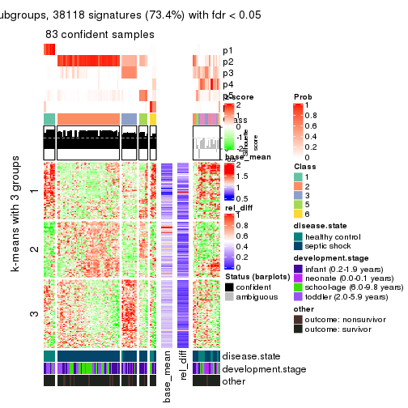</p>

</div>
</div>


Signature heatmaps where rows are not scaled:


<script>
$( function() {
	$( '#tabs-CV-hclust-get-signatures-no-scale' ).tabs();
} );
</script>
<div id='tabs-CV-hclust-get-signatures-no-scale'>
<ul>
<li><a href='#tab-CV-hclust-get-signatures-no-scale-1'>k = 2</a></li>
<li><a href='#tab-CV-hclust-get-signatures-no-scale-2'>k = 3</a></li>
<li><a href='#tab-CV-hclust-get-signatures-no-scale-3'>k = 4</a></li>
<li><a href='#tab-CV-hclust-get-signatures-no-scale-4'>k = 5</a></li>
<li><a href='#tab-CV-hclust-get-signatures-no-scale-5'>k = 6</a></li>
</ul>
<div id='tab-CV-hclust-get-signatures-no-scale-1'>
<pre><code class="r">get_signatures(res, k = 2, scale_rows = FALSE)
</code></pre>

<p>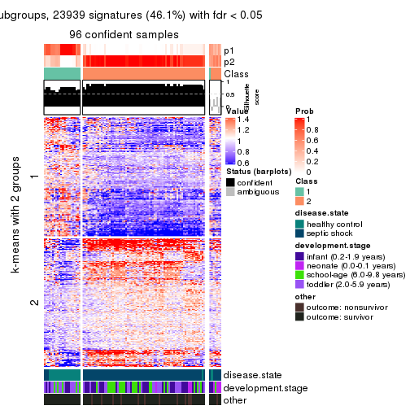</p>

</div>
<div id='tab-CV-hclust-get-signatures-no-scale-2'>
<pre><code class="r">get_signatures(res, k = 3, scale_rows = FALSE)
</code></pre>

<p>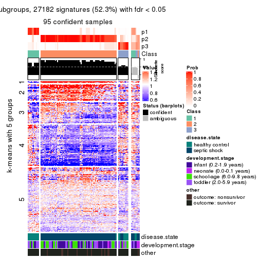</p>

</div>
<div id='tab-CV-hclust-get-signatures-no-scale-3'>
<pre><code class="r">get_signatures(res, k = 4, scale_rows = FALSE)
</code></pre>

<p>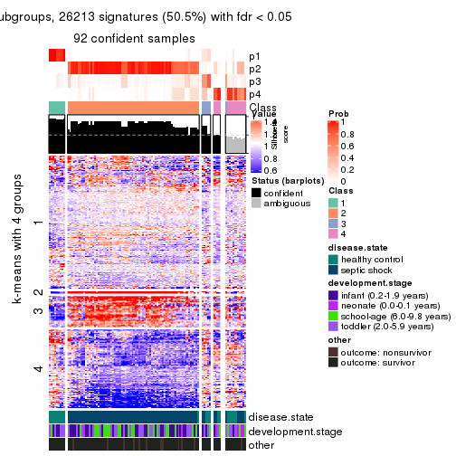</p>

</div>
<div id='tab-CV-hclust-get-signatures-no-scale-4'>
<pre><code class="r">get_signatures(res, k = 5, scale_rows = FALSE)
</code></pre>

<p>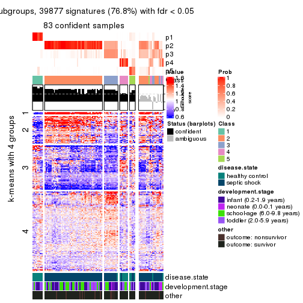</p>

</div>
<div id='tab-CV-hclust-get-signatures-no-scale-5'>
<pre><code class="r">get_signatures(res, k = 6, scale_rows = FALSE)
</code></pre>

<pre><code>#&gt; Error in mat[ceiling(1:nr/h_ratio), ceiling(1:nc/w_ratio), drop = FALSE]: subscript out of bounds
</code></pre>

<p></p>

</div>
</div>


Compare the overlap of signatures from different k:

```r
compare_signatures(res)
```

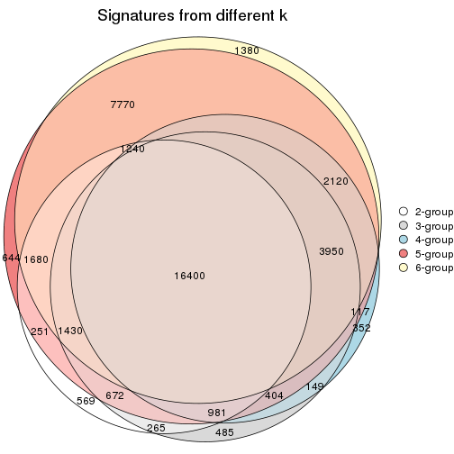

`get_signature()` returns a data frame invisibly. TO get the list of signatures, the function
call should be assigned to a variable explicitly. In following code, if `plot` argument is set
to `FALSE`, no heatmap is plotted while only the differential analysis is performed.

```r
# code only for demonstration
tb = get_signature(res, k = ..., plot = FALSE)
```

An example of the output of `tb` is:

```
#>   which_row         fdr    mean_1    mean_2 scaled_mean_1 scaled_mean_2 km
#> 1        38 0.042760348  8.373488  9.131774    -0.5533452     0.5164555  1
#> 2        40 0.018707592  7.106213  8.469186    -0.6173731     0.5762149  1
#> 3        55 0.019134737 10.221463 11.207825    -0.6159697     0.5749050  1
#> 4        59 0.006059896  5.921854  7.869574    -0.6899429     0.6439467  1
#> 5        60 0.018055526  8.928898 10.211722    -0.6204761     0.5791110  1
#> 6        98 0.009384629 15.714769 14.887706     0.6635654    -0.6193277  2
...
```

The columns in `tb` are:

1. `which_row`: row indices corresponding to the input matrix.
2. `fdr`: FDR for the differential test. 
3. `mean_x`: The mean value in group x.
4. `scaled_mean_x`: The mean value in group x after rows are scaled.
5. `km`: Row groups if k-means clustering is applied to rows.


UMAP plot which shows how samples are separated.


<script>
$( function() {
	$( '#tabs-CV-hclust-dimension-reduction' ).tabs();
} );
</script>
<div id='tabs-CV-hclust-dimension-reduction'>
<ul>
<li><a href='#tab-CV-hclust-dimension-reduction-1'>k = 2</a></li>
<li><a href='#tab-CV-hclust-dimension-reduction-2'>k = 3</a></li>
<li><a href='#tab-CV-hclust-dimension-reduction-3'>k = 4</a></li>
<li><a href='#tab-CV-hclust-dimension-reduction-4'>k = 5</a></li>
<li><a href='#tab-CV-hclust-dimension-reduction-5'>k = 6</a></li>
</ul>
<div id='tab-CV-hclust-dimension-reduction-1'>
<pre><code class="r">dimension_reduction(res, k = 2, method = &quot;UMAP&quot;)
</code></pre>

<p>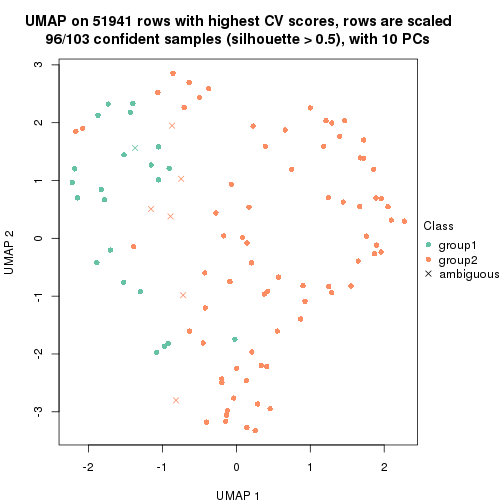</p>

</div>
<div id='tab-CV-hclust-dimension-reduction-2'>
<pre><code class="r">dimension_reduction(res, k = 3, method = &quot;UMAP&quot;)
</code></pre>

<p>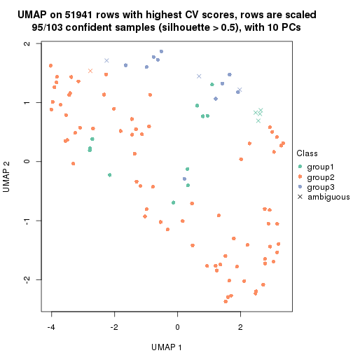</p>

</div>
<div id='tab-CV-hclust-dimension-reduction-3'>
<pre><code class="r">dimension_reduction(res, k = 4, method = &quot;UMAP&quot;)
</code></pre>

<p>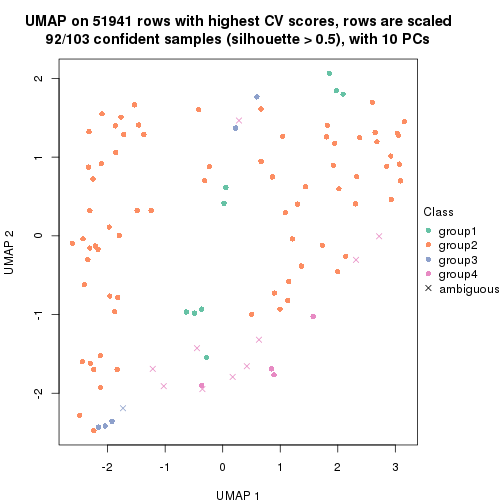</p>

</div>
<div id='tab-CV-hclust-dimension-reduction-4'>
<pre><code class="r">dimension_reduction(res, k = 5, method = &quot;UMAP&quot;)
</code></pre>

<p>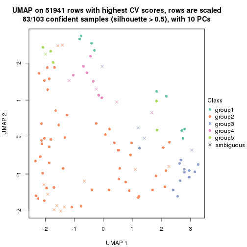</p>

</div>
<div id='tab-CV-hclust-dimension-reduction-5'>
<pre><code class="r">dimension_reduction(res, k = 6, method = &quot;UMAP&quot;)
</code></pre>

<p>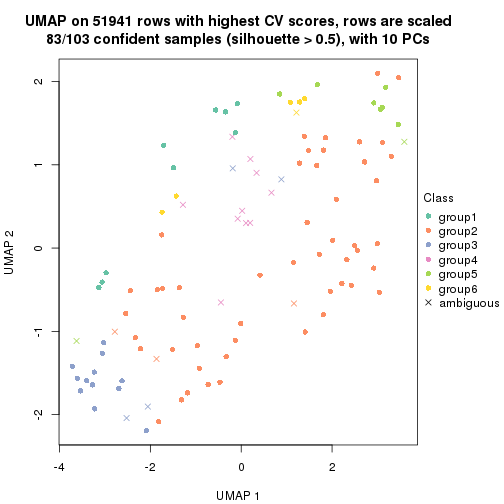</p>

</div>
</div>


Following heatmap shows how subgroups are split when increasing `k`:

```r
collect_classes(res)
```

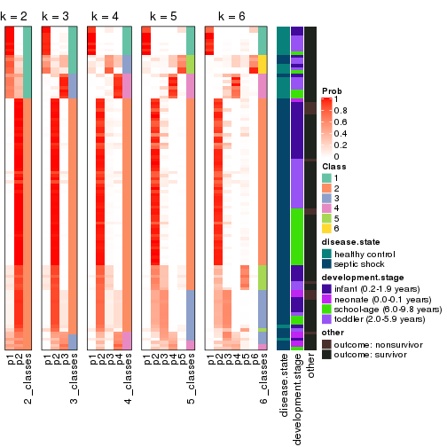


Test correlation between subgroups and known annotations. If the known
annotation is numeric, one-way ANOVA test is applied, and if the known
annotation is discrete, chi-squared contingency table test is applied.

```r
test_to_known_factors(res)
```

```
#>            n disease.state(p) development.stage(p) other(p) k
#> CV:hclust 96         8.70e-17                0.123    0.123 2
#> CV:hclust 95         3.63e-17                0.350    0.171 3
#> CV:hclust 92         8.31e-15                0.549    0.386 4
#> CV:hclust 83         1.47e-13                0.213    0.292 5
#> CV:hclust 83         9.86e-14                0.107    0.461 6
```


If matrix rows can be associated to genes, consider to use `functional_enrichment(res,
...)` to perform function enrichment for the signature genes. See [this vignette](http://bioconductor.org/packages/devel/bioc/vignettes/cola/inst/doc/functional_enrichment.html) for more detailed explanations.


 

---------------------------------------------------


### CV:kmeans


The object with results only for a single top-value method and a single partition method 
can be extracted as:

```r
res = res_list["CV", "kmeans"]
# you can also extract it by
# res = res_list["CV:kmeans"]
```

A summary of `res` and all the functions that can be applied to it:

```r
res
```

```
#> A 'ConsensusPartition' object with k = 2, 3, 4, 5, 6.
#>   On a matrix with 51941 rows and 103 columns.
#>   Top rows (1000, 2000, 3000, 4000, 5000) are extracted by 'CV' method.
#>   Subgroups are detected by 'kmeans' method.
#>   Performed in total 1250 partitions by row resampling.
#>   Best k for subgroups seems to be 2.
#> 
#> Following methods can be applied to this 'ConsensusPartition' object:
#>  [1] "cola_report"             "collect_classes"         "collect_plots"          
#>  [4] "collect_stats"           "colnames"                "compare_signatures"     
#>  [7] "consensus_heatmap"       "dimension_reduction"     "functional_enrichment"  
#> [10] "get_anno_col"            "get_anno"                "get_classes"            
#> [13] "get_consensus"           "get_matrix"              "get_membership"         
#> [16] "get_param"               "get_signatures"          "get_stats"              
#> [19] "is_best_k"               "is_stable_k"             "membership_heatmap"     
#> [22] "ncol"                    "nrow"                    "plot_ecdf"              
#> [25] "rownames"                "select_partition_number" "show"                   
#> [28] "suggest_best_k"          "test_to_known_factors"
```

`collect_plots()` function collects all the plots made from `res` for all `k` (number of partitions)
into one single page to provide an easy and fast comparison between different `k`.

```r
collect_plots(res)
```

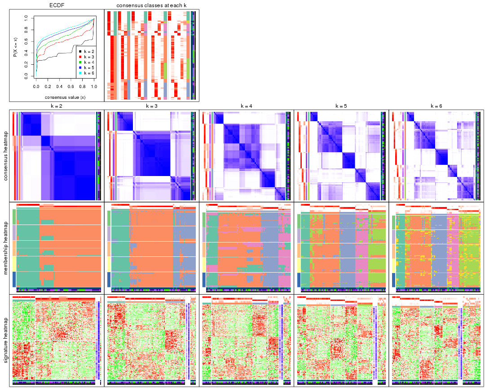

The plots are:

- The first row: a plot of the ECDF (empirical cumulative distribution
  function) curves of the consensus matrix for each `k` and the heatmap of
  predicted classes for each `k`.
- The second row: heatmaps of the consensus matrix for each `k`.
- The third row: heatmaps of the membership matrix for each `k`.
- The fouth row: heatmaps of the signatures for each `k`.

All the plots in panels can be made by individual functions and they are
plotted later in this section.

`select_partition_number()` produces several plots showing different
statistics for choosing "optimized" `k`. There are following statistics:

- ECDF curves of the consensus matrix for each `k`;
- 1-PAC. [The PAC
  score](https://en.wikipedia.org/wiki/Consensus_clustering#Over-interpretation_potential_of_consensus_clustering)
  measures the proportion of the ambiguous subgrouping.
- Mean silhouette score.
- Concordance. The mean probability of fiting the consensus class ids in all
  partitions.
- Area increased. Denote $A_k$ as the area under the ECDF curve for current
  `k`, the area increased is defined as $A_k - A_{k-1}$.
- Rand index. The percent of pairs of samples that are both in a same cluster
  or both are not in a same cluster in the partition of k and k-1.
- Jaccard index. The ratio of pairs of samples are both in a same cluster in
  the partition of k and k-1 and the pairs of samples are both in a same
  cluster in the partition k or k-1.

The detailed explanations of these statistics can be found in [the _cola_
vignette](http://bioconductor.org/packages/devel/bioc/vignettes/cola/inst/doc/cola.html#toc_13).

Generally speaking, lower PAC score, higher mean silhouette score or higher
concordance corresponds to better partition. Rand index and Jaccard index
measure how similar the current partition is compared to partition with `k-1`.
If they are too similar, we won't accept `k` is better than `k-1`.

```r
select_partition_number(res)
```

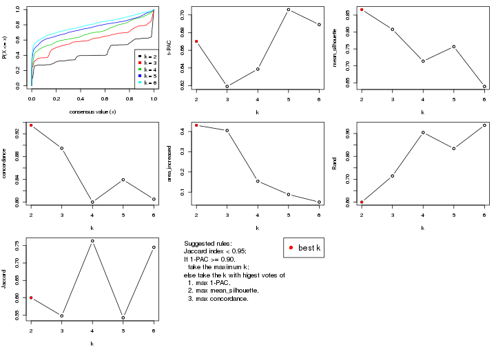

The numeric values for all these statistics can be obtained by `get_stats()`.

```r
get_stats(res)
```

```
#>   k 1-PAC mean_silhouette concordance area_increased  Rand Jaccard
#> 2 2 0.670           0.866       0.935         0.4309 0.600   0.600
#> 3 3 0.619           0.808       0.895         0.4051 0.714   0.548
#> 4 4 0.639           0.714       0.800         0.1544 0.904   0.763
#> 5 5 0.706           0.757       0.839         0.0887 0.834   0.543
#> 6 6 0.689           0.639       0.805         0.0511 0.936   0.745
```

`suggest_best_k()` suggests the best $k$ based on these statistics. The rules are as follows:

- All $k$ with Jaccard index larger than 0.95 are removed because increasing
  $k$ does not provide enough extra information. If all $k$ are removed, it is
  marked as no subgroup is detected.
- For all $k$ with 1-PAC score larger than 0.9, the maximal $k$ is taken as
  the best $k$, and other $k$ are marked as optional $k$.
- If it does not fit the second rule. The $k$ with the maximal vote of the
  highest 1-PAC score, highest mean silhouette, and highest concordance is
  taken as the best $k$.

```r
suggest_best_k(res)
```

```
#> [1] 2
```


Following shows the table of the partitions (You need to click the **show/hide
code output** link to see it). The membership matrix (columns with name `p*`)
is inferred by
[`clue::cl_consensus()`](https://www.rdocumentation.org/link/cl_consensus?package=clue)
function with the `SE` method. Basically the value in the membership matrix
represents the probability to belong to a certain group. The finall class
label for an item is determined with the group with highest probability it
belongs to.

In `get_classes()` function, the entropy is calculated from the membership
matrix and the silhouette score is calculated from the consensus matrix.


<script>
$( function() {
	$( '#tabs-CV-kmeans-get-classes' ).tabs();
} );
</script>
<div id='tabs-CV-kmeans-get-classes'>
<ul>
<li><a href='#tab-CV-kmeans-get-classes-1'>k = 2</a></li>
<li><a href='#tab-CV-kmeans-get-classes-2'>k = 3</a></li>
<li><a href='#tab-CV-kmeans-get-classes-3'>k = 4</a></li>
<li><a href='#tab-CV-kmeans-get-classes-4'>k = 5</a></li>
<li><a href='#tab-CV-kmeans-get-classes-5'>k = 6</a></li>
</ul>

<div id='tab-CV-kmeans-get-classes-1'>
<p><a id='tab-CV-kmeans-get-classes-1-a' style='color:#0366d6' href='#'>show/hide code output</a></p>
<pre><code class="r">cbind(get_classes(res, k = 2), get_membership(res, k = 2))
</code></pre>

<pre><code>#&gt;           class entropy silhouette    p1    p2
#&gt; GSM647569     2  0.9427      0.528 0.360 0.640
#&gt; GSM647574     2  0.9427      0.528 0.360 0.640
#&gt; GSM647577     2  0.9427      0.528 0.360 0.640
#&gt; GSM647547     2  0.9427      0.528 0.360 0.640
#&gt; GSM647552     2  0.1184      0.915 0.016 0.984
#&gt; GSM647553     1  0.8763      0.523 0.704 0.296
#&gt; GSM647565     2  0.6623      0.778 0.172 0.828
#&gt; GSM647545     2  0.0376      0.915 0.004 0.996
#&gt; GSM647549     2  0.0376      0.915 0.004 0.996
#&gt; GSM647550     2  0.0000      0.914 0.000 1.000
#&gt; GSM647560     2  0.0000      0.914 0.000 1.000
#&gt; GSM647617     2  0.9427      0.528 0.360 0.640
#&gt; GSM647528     2  0.1184      0.915 0.016 0.984
#&gt; GSM647529     1  0.0000      0.965 1.000 0.000
#&gt; GSM647531     2  0.1184      0.915 0.016 0.984
#&gt; GSM647540     2  0.0000      0.914 0.000 1.000
#&gt; GSM647541     2  0.0000      0.914 0.000 1.000
#&gt; GSM647546     2  0.6973      0.763 0.188 0.812
#&gt; GSM647557     2  0.1184      0.915 0.016 0.984
#&gt; GSM647561     2  0.1184      0.915 0.016 0.984
#&gt; GSM647567     2  0.9661      0.485 0.392 0.608
#&gt; GSM647568     2  0.0000      0.914 0.000 1.000
#&gt; GSM647570     2  0.0376      0.915 0.004 0.996
#&gt; GSM647573     1  0.0938      0.962 0.988 0.012
#&gt; GSM647576     2  0.0000      0.914 0.000 1.000
#&gt; GSM647579     2  0.0000      0.914 0.000 1.000
#&gt; GSM647580     2  0.9427      0.528 0.360 0.640
#&gt; GSM647583     2  0.9427      0.528 0.360 0.640
#&gt; GSM647592     2  0.1184      0.915 0.016 0.984
#&gt; GSM647593     2  0.1184      0.915 0.016 0.984
#&gt; GSM647595     2  0.1184      0.915 0.016 0.984
#&gt; GSM647597     1  0.6623      0.769 0.828 0.172
#&gt; GSM647598     2  0.1184      0.915 0.016 0.984
#&gt; GSM647613     2  0.1184      0.915 0.016 0.984
#&gt; GSM647615     2  0.0376      0.915 0.004 0.996
#&gt; GSM647616     2  0.9427      0.528 0.360 0.640
#&gt; GSM647619     2  0.1184      0.915 0.016 0.984
#&gt; GSM647582     2  0.1184      0.915 0.016 0.984
#&gt; GSM647591     2  0.1184      0.915 0.016 0.984
#&gt; GSM647527     2  0.1184      0.915 0.016 0.984
#&gt; GSM647530     1  0.7376      0.713 0.792 0.208
#&gt; GSM647532     1  0.0000      0.965 1.000 0.000
#&gt; GSM647544     2  0.0376      0.915 0.004 0.996
#&gt; GSM647551     2  0.1184      0.915 0.016 0.984
#&gt; GSM647556     2  0.9427      0.528 0.360 0.640
#&gt; GSM647558     2  0.0376      0.915 0.004 0.996
#&gt; GSM647572     2  0.6247      0.795 0.156 0.844
#&gt; GSM647578     2  0.0000      0.914 0.000 1.000
#&gt; GSM647581     2  0.0376      0.915 0.004 0.996
#&gt; GSM647594     2  0.5178      0.830 0.116 0.884
#&gt; GSM647599     1  0.0000      0.965 1.000 0.000
#&gt; GSM647600     2  0.1184      0.915 0.016 0.984
#&gt; GSM647601     2  0.1184      0.915 0.016 0.984
#&gt; GSM647603     2  0.0000      0.914 0.000 1.000
#&gt; GSM647610     2  0.2603      0.901 0.044 0.956
#&gt; GSM647611     2  0.1184      0.915 0.016 0.984
#&gt; GSM647612     2  0.0000      0.914 0.000 1.000
#&gt; GSM647614     2  0.0000      0.914 0.000 1.000
#&gt; GSM647618     2  0.1184      0.915 0.016 0.984
#&gt; GSM647629     2  0.0938      0.914 0.012 0.988
#&gt; GSM647535     2  0.0000      0.914 0.000 1.000
#&gt; GSM647563     2  0.0376      0.915 0.004 0.996
#&gt; GSM647542     2  0.0000      0.914 0.000 1.000
#&gt; GSM647543     2  0.0000      0.914 0.000 1.000
#&gt; GSM647548     2  0.6247      0.798 0.156 0.844
#&gt; GSM647554     2  0.0938      0.914 0.012 0.988
#&gt; GSM647555     2  0.0000      0.914 0.000 1.000
#&gt; GSM647559     2  0.0376      0.915 0.004 0.996
#&gt; GSM647562     2  0.0938      0.915 0.012 0.988
#&gt; GSM647564     2  0.7056      0.758 0.192 0.808
#&gt; GSM647571     2  0.0000      0.914 0.000 1.000
#&gt; GSM647584     2  0.1184      0.915 0.016 0.984
#&gt; GSM647585     2  0.9427      0.528 0.360 0.640
#&gt; GSM647586     2  0.1184      0.915 0.016 0.984
#&gt; GSM647587     2  0.1184      0.915 0.016 0.984
#&gt; GSM647588     2  0.0000      0.914 0.000 1.000
#&gt; GSM647596     2  0.1184      0.915 0.016 0.984
#&gt; GSM647602     2  0.9427      0.528 0.360 0.640
#&gt; GSM647609     2  0.1184      0.915 0.016 0.984
#&gt; GSM647620     2  0.1184      0.915 0.016 0.984
#&gt; GSM647627     2  0.1184      0.915 0.016 0.984
#&gt; GSM647628     2  0.0376      0.915 0.004 0.996
#&gt; GSM647533     1  0.0000      0.965 1.000 0.000
#&gt; GSM647536     1  0.0000      0.965 1.000 0.000
#&gt; GSM647537     1  0.0000      0.965 1.000 0.000
#&gt; GSM647606     1  0.0000      0.965 1.000 0.000
#&gt; GSM647621     1  0.0938      0.962 0.988 0.012
#&gt; GSM647626     1  0.1184      0.960 0.984 0.016
#&gt; GSM647538     1  0.0000      0.965 1.000 0.000
#&gt; GSM647575     1  0.0938      0.962 0.988 0.012
#&gt; GSM647590     1  0.0938      0.962 0.988 0.012
#&gt; GSM647605     1  0.0000      0.965 1.000 0.000
#&gt; GSM647607     1  0.0938      0.962 0.988 0.012
#&gt; GSM647608     1  0.1184      0.960 0.984 0.016
#&gt; GSM647622     1  0.0000      0.965 1.000 0.000
#&gt; GSM647623     1  0.0000      0.965 1.000 0.000
#&gt; GSM647624     1  0.0000      0.965 1.000 0.000
#&gt; GSM647625     1  0.0000      0.965 1.000 0.000
#&gt; GSM647534     1  0.1414      0.949 0.980 0.020
#&gt; GSM647539     1  0.0938      0.962 0.988 0.012
#&gt; GSM647566     1  0.0938      0.962 0.988 0.012
#&gt; GSM647589     1  0.1184      0.960 0.984 0.016
#&gt; GSM647604     1  0.0000      0.965 1.000 0.000
</code></pre>

<script>
$('#tab-CV-kmeans-get-classes-1-a').parent().next().next().hide();
$('#tab-CV-kmeans-get-classes-1-a').click(function(){
  $('#tab-CV-kmeans-get-classes-1-a').parent().next().next().toggle();
  return(false);
});
</script>
</div>

<div id='tab-CV-kmeans-get-classes-2'>
<p><a id='tab-CV-kmeans-get-classes-2-a' style='color:#0366d6' href='#'>show/hide code output</a></p>
<pre><code class="r">cbind(get_classes(res, k = 3), get_membership(res, k = 3))
</code></pre>

<pre><code>#&gt;           class entropy silhouette    p1    p2    p3
#&gt; GSM647569     3  0.4047     0.8364 0.004 0.148 0.848
#&gt; GSM647574     3  0.1585     0.7477 0.008 0.028 0.964
#&gt; GSM647577     3  0.4047     0.8364 0.004 0.148 0.848
#&gt; GSM647547     3  0.0424     0.7151 0.008 0.000 0.992
#&gt; GSM647552     2  0.1182     0.9098 0.012 0.976 0.012
#&gt; GSM647553     3  0.1267     0.7463 0.004 0.024 0.972
#&gt; GSM647565     3  0.4912     0.6992 0.008 0.196 0.796
#&gt; GSM647545     2  0.0592     0.9192 0.000 0.988 0.012
#&gt; GSM647549     2  0.0592     0.9192 0.000 0.988 0.012
#&gt; GSM647550     3  0.6299     0.2621 0.000 0.476 0.524
#&gt; GSM647560     2  0.4346     0.7177 0.000 0.816 0.184
#&gt; GSM647617     3  0.4047     0.8364 0.004 0.148 0.848
#&gt; GSM647528     2  0.0592     0.9192 0.000 0.988 0.012
#&gt; GSM647529     1  0.1643     0.9176 0.956 0.000 0.044
#&gt; GSM647531     2  0.0983     0.9176 0.004 0.980 0.016
#&gt; GSM647540     3  0.5760     0.6516 0.000 0.328 0.672
#&gt; GSM647541     2  0.0237     0.9198 0.000 0.996 0.004
#&gt; GSM647546     3  0.3816     0.8320 0.000 0.148 0.852
#&gt; GSM647557     2  0.1170     0.9163 0.008 0.976 0.016
#&gt; GSM647561     2  0.0592     0.9192 0.000 0.988 0.012
#&gt; GSM647567     3  0.6698     0.7211 0.036 0.280 0.684
#&gt; GSM647568     3  0.4887     0.7815 0.000 0.228 0.772
#&gt; GSM647570     2  0.1860     0.8925 0.000 0.948 0.052
#&gt; GSM647573     3  0.4002     0.5573 0.160 0.000 0.840
#&gt; GSM647576     3  0.4504     0.8159 0.000 0.196 0.804
#&gt; GSM647579     3  0.5760     0.6516 0.000 0.328 0.672
#&gt; GSM647580     3  0.4047     0.8364 0.004 0.148 0.848
#&gt; GSM647583     3  0.4047     0.8364 0.004 0.148 0.848
#&gt; GSM647592     2  0.0424     0.9191 0.008 0.992 0.000
#&gt; GSM647593     2  0.0237     0.9200 0.004 0.996 0.000
#&gt; GSM647595     2  0.0237     0.9200 0.004 0.996 0.000
#&gt; GSM647597     1  0.1337     0.9166 0.972 0.012 0.016
#&gt; GSM647598     2  0.0000     0.9206 0.000 1.000 0.000
#&gt; GSM647613     2  0.0592     0.9192 0.000 0.988 0.012
#&gt; GSM647615     2  0.4504     0.7161 0.000 0.804 0.196
#&gt; GSM647616     3  0.4047     0.8364 0.004 0.148 0.848
#&gt; GSM647619     2  0.0424     0.9191 0.008 0.992 0.000
#&gt; GSM647582     2  0.0237     0.9202 0.004 0.996 0.000
#&gt; GSM647591     2  0.0661     0.9175 0.008 0.988 0.004
#&gt; GSM647527     2  0.0592     0.9192 0.000 0.988 0.012
#&gt; GSM647530     2  0.8749     0.3422 0.276 0.572 0.152
#&gt; GSM647532     1  0.3686     0.8857 0.860 0.000 0.140
#&gt; GSM647544     2  0.0983     0.9175 0.004 0.980 0.016
#&gt; GSM647551     2  0.0237     0.9200 0.004 0.996 0.000
#&gt; GSM647556     3  0.4047     0.8364 0.004 0.148 0.848
#&gt; GSM647558     2  0.1860     0.8925 0.000 0.948 0.052
#&gt; GSM647572     3  0.3879     0.8311 0.000 0.152 0.848
#&gt; GSM647578     2  0.6309    -0.2470 0.000 0.504 0.496
#&gt; GSM647581     2  0.0747     0.9182 0.000 0.984 0.016
#&gt; GSM647594     2  0.2200     0.8787 0.056 0.940 0.004
#&gt; GSM647599     1  0.1753     0.9163 0.952 0.000 0.048
#&gt; GSM647600     2  0.0000     0.9206 0.000 1.000 0.000
#&gt; GSM647601     2  0.0000     0.9206 0.000 1.000 0.000
#&gt; GSM647603     2  0.0424     0.9185 0.000 0.992 0.008
#&gt; GSM647610     2  0.0983     0.9118 0.004 0.980 0.016
#&gt; GSM647611     2  0.0237     0.9202 0.004 0.996 0.000
#&gt; GSM647612     2  0.4504     0.7169 0.000 0.804 0.196
#&gt; GSM647614     2  0.4605     0.7037 0.000 0.796 0.204
#&gt; GSM647618     2  0.0475     0.9192 0.004 0.992 0.004
#&gt; GSM647629     2  0.0000     0.9206 0.000 1.000 0.000
#&gt; GSM647535     2  0.0000     0.9206 0.000 1.000 0.000
#&gt; GSM647563     2  0.0592     0.9192 0.000 0.988 0.012
#&gt; GSM647542     3  0.6291     0.2996 0.000 0.468 0.532
#&gt; GSM647543     2  0.6235     0.0336 0.000 0.564 0.436
#&gt; GSM647548     3  0.5578     0.6298 0.012 0.240 0.748
#&gt; GSM647554     2  0.4121     0.7184 0.000 0.832 0.168
#&gt; GSM647555     2  0.4002     0.7703 0.000 0.840 0.160
#&gt; GSM647559     2  0.0829     0.9190 0.004 0.984 0.012
#&gt; GSM647562     2  0.0983     0.9175 0.004 0.980 0.016
#&gt; GSM647564     3  0.3879     0.8356 0.000 0.152 0.848
#&gt; GSM647571     2  0.6148     0.3428 0.004 0.640 0.356
#&gt; GSM647584     2  0.0000     0.9206 0.000 1.000 0.000
#&gt; GSM647585     3  0.4047     0.8364 0.004 0.148 0.848
#&gt; GSM647586     2  0.0000     0.9206 0.000 1.000 0.000
#&gt; GSM647587     2  0.0829     0.9190 0.004 0.984 0.012
#&gt; GSM647588     2  0.0000     0.9206 0.000 1.000 0.000
#&gt; GSM647596     2  0.0592     0.9192 0.000 0.988 0.012
#&gt; GSM647602     3  0.4047     0.8364 0.004 0.148 0.848
#&gt; GSM647609     2  0.0000     0.9206 0.000 1.000 0.000
#&gt; GSM647620     2  0.0000     0.9206 0.000 1.000 0.000
#&gt; GSM647627     2  0.0000     0.9206 0.000 1.000 0.000
#&gt; GSM647628     2  0.1860     0.8925 0.000 0.948 0.052
#&gt; GSM647533     1  0.0747     0.9240 0.984 0.000 0.016
#&gt; GSM647536     1  0.3267     0.8968 0.884 0.000 0.116
#&gt; GSM647537     1  0.0747     0.9240 0.984 0.000 0.016
#&gt; GSM647606     1  0.0747     0.9240 0.984 0.000 0.016
#&gt; GSM647621     1  0.5465     0.7553 0.712 0.000 0.288
#&gt; GSM647626     3  0.4059     0.7012 0.128 0.012 0.860
#&gt; GSM647538     1  0.1289     0.9238 0.968 0.000 0.032
#&gt; GSM647575     1  0.5529     0.7582 0.704 0.000 0.296
#&gt; GSM647590     1  0.3686     0.8902 0.860 0.000 0.140
#&gt; GSM647605     1  0.0592     0.9229 0.988 0.000 0.012
#&gt; GSM647607     1  0.4235     0.8722 0.824 0.000 0.176
#&gt; GSM647608     3  0.6280    -0.2722 0.460 0.000 0.540
#&gt; GSM647622     1  0.0747     0.9240 0.984 0.000 0.016
#&gt; GSM647623     1  0.0747     0.9240 0.984 0.000 0.016
#&gt; GSM647624     1  0.0592     0.9235 0.988 0.000 0.012
#&gt; GSM647625     1  0.0747     0.9240 0.984 0.000 0.016
#&gt; GSM647534     1  0.3213     0.8798 0.912 0.060 0.028
#&gt; GSM647539     1  0.5621     0.7465 0.692 0.000 0.308
#&gt; GSM647566     1  0.3619     0.8919 0.864 0.000 0.136
#&gt; GSM647589     3  0.1643     0.6894 0.044 0.000 0.956
#&gt; GSM647604     1  0.0592     0.9229 0.988 0.000 0.012
</code></pre>

<script>
$('#tab-CV-kmeans-get-classes-2-a').parent().next().next().hide();
$('#tab-CV-kmeans-get-classes-2-a').click(function(){
  $('#tab-CV-kmeans-get-classes-2-a').parent().next().next().toggle();
  return(false);
});
</script>
</div>

<div id='tab-CV-kmeans-get-classes-3'>
<p><a id='tab-CV-kmeans-get-classes-3-a' style='color:#0366d6' href='#'>show/hide code output</a></p>
<pre><code class="r">cbind(get_classes(res, k = 4), get_membership(res, k = 4))
</code></pre>

<pre><code>#&gt;           class entropy silhouette    p1    p2    p3    p4
#&gt; GSM647569     3  0.1059     0.8699 0.016 0.012 0.972 0.000
#&gt; GSM647574     3  0.1004     0.8546 0.000 0.004 0.972 0.024
#&gt; GSM647577     3  0.1247     0.8705 0.016 0.012 0.968 0.004
#&gt; GSM647547     4  0.4978     0.3738 0.000 0.004 0.384 0.612
#&gt; GSM647552     2  0.1661     0.7488 0.000 0.944 0.004 0.052
#&gt; GSM647553     3  0.1114     0.8625 0.016 0.004 0.972 0.008
#&gt; GSM647565     4  0.4127     0.4422 0.000 0.124 0.052 0.824
#&gt; GSM647545     2  0.5220     0.7341 0.000 0.632 0.016 0.352
#&gt; GSM647549     2  0.5220     0.7341 0.000 0.632 0.016 0.352
#&gt; GSM647550     3  0.7359     0.2323 0.000 0.184 0.504 0.312
#&gt; GSM647560     2  0.7449     0.5937 0.000 0.464 0.180 0.356
#&gt; GSM647617     3  0.1247     0.8705 0.016 0.012 0.968 0.004
#&gt; GSM647528     2  0.3743     0.7883 0.000 0.824 0.016 0.160
#&gt; GSM647529     1  0.4655     0.3672 0.684 0.000 0.004 0.312
#&gt; GSM647531     2  0.4482     0.7674 0.000 0.728 0.008 0.264
#&gt; GSM647540     3  0.2032     0.8356 0.000 0.028 0.936 0.036
#&gt; GSM647541     2  0.5038     0.7622 0.000 0.684 0.020 0.296
#&gt; GSM647546     3  0.0657     0.8668 0.000 0.012 0.984 0.004
#&gt; GSM647557     2  0.4452     0.7682 0.000 0.732 0.008 0.260
#&gt; GSM647561     2  0.4535     0.7770 0.000 0.744 0.016 0.240
#&gt; GSM647567     3  0.4195     0.7171 0.016 0.160 0.812 0.012
#&gt; GSM647568     3  0.7729    -0.0516 0.000 0.228 0.400 0.372
#&gt; GSM647570     2  0.5284     0.7259 0.000 0.616 0.016 0.368
#&gt; GSM647573     4  0.4805     0.6328 0.132 0.000 0.084 0.784
#&gt; GSM647576     3  0.2706     0.8041 0.000 0.020 0.900 0.080
#&gt; GSM647579     3  0.2131     0.8343 0.000 0.032 0.932 0.036
#&gt; GSM647580     3  0.1247     0.8705 0.016 0.012 0.968 0.004
#&gt; GSM647583     3  0.1247     0.8705 0.016 0.012 0.968 0.004
#&gt; GSM647592     2  0.1398     0.7486 0.000 0.956 0.004 0.040
#&gt; GSM647593     2  0.0336     0.7651 0.000 0.992 0.000 0.008
#&gt; GSM647595     2  0.0469     0.7665 0.000 0.988 0.000 0.012
#&gt; GSM647597     1  0.6101     0.4401 0.628 0.308 0.004 0.060
#&gt; GSM647598     2  0.0188     0.7691 0.000 0.996 0.000 0.004
#&gt; GSM647613     2  0.4831     0.7655 0.000 0.704 0.016 0.280
#&gt; GSM647615     2  0.7392     0.5921 0.000 0.460 0.168 0.372
#&gt; GSM647616     3  0.1247     0.8705 0.016 0.012 0.968 0.004
#&gt; GSM647619     2  0.1118     0.7531 0.000 0.964 0.000 0.036
#&gt; GSM647582     2  0.0469     0.7681 0.000 0.988 0.000 0.012
#&gt; GSM647591     2  0.1302     0.7490 0.000 0.956 0.000 0.044
#&gt; GSM647527     2  0.3743     0.7883 0.000 0.824 0.016 0.160
#&gt; GSM647530     4  0.2561     0.5321 0.016 0.068 0.004 0.912
#&gt; GSM647532     4  0.5004     0.5449 0.392 0.000 0.004 0.604
#&gt; GSM647544     2  0.5220     0.7374 0.000 0.632 0.016 0.352
#&gt; GSM647551     2  0.0657     0.7662 0.000 0.984 0.004 0.012
#&gt; GSM647556     3  0.1059     0.8699 0.016 0.012 0.972 0.000
#&gt; GSM647558     2  0.5284     0.7259 0.000 0.616 0.016 0.368
#&gt; GSM647572     3  0.0657     0.8668 0.000 0.012 0.984 0.004
#&gt; GSM647578     3  0.6788     0.4249 0.000 0.188 0.608 0.204
#&gt; GSM647581     2  0.5298     0.7259 0.000 0.612 0.016 0.372
#&gt; GSM647594     2  0.1302     0.7490 0.000 0.956 0.000 0.044
#&gt; GSM647599     1  0.1059     0.8512 0.972 0.000 0.012 0.016
#&gt; GSM647600     2  0.0779     0.7717 0.000 0.980 0.004 0.016
#&gt; GSM647601     2  0.0000     0.7681 0.000 1.000 0.000 0.000
#&gt; GSM647603     2  0.4344     0.7437 0.000 0.816 0.108 0.076
#&gt; GSM647610     2  0.1733     0.7514 0.000 0.948 0.028 0.024
#&gt; GSM647611     2  0.0336     0.7661 0.000 0.992 0.000 0.008
#&gt; GSM647612     2  0.7356     0.6014 0.000 0.468 0.164 0.368
#&gt; GSM647614     2  0.7392     0.5921 0.000 0.460 0.168 0.372
#&gt; GSM647618     2  0.1389     0.7471 0.000 0.952 0.000 0.048
#&gt; GSM647629     2  0.2048     0.7791 0.000 0.928 0.008 0.064
#&gt; GSM647535     2  0.4214     0.7854 0.000 0.780 0.016 0.204
#&gt; GSM647563     2  0.5253     0.7308 0.000 0.624 0.016 0.360
#&gt; GSM647542     2  0.7658     0.5214 0.000 0.416 0.212 0.372
#&gt; GSM647543     2  0.7595     0.5426 0.000 0.428 0.200 0.372
#&gt; GSM647548     4  0.2197     0.5408 0.000 0.024 0.048 0.928
#&gt; GSM647554     2  0.4908     0.4031 0.000 0.692 0.292 0.016
#&gt; GSM647555     2  0.7371     0.6055 0.000 0.472 0.168 0.360
#&gt; GSM647559     2  0.4630     0.7784 0.000 0.732 0.016 0.252
#&gt; GSM647562     2  0.5090     0.7455 0.000 0.660 0.016 0.324
#&gt; GSM647564     3  0.0469     0.8665 0.000 0.012 0.988 0.000
#&gt; GSM647571     2  0.7506     0.5672 0.000 0.440 0.184 0.376
#&gt; GSM647584     2  0.0469     0.7712 0.000 0.988 0.000 0.012
#&gt; GSM647585     3  0.0927     0.8675 0.016 0.008 0.976 0.000
#&gt; GSM647586     2  0.1807     0.7815 0.000 0.940 0.008 0.052
#&gt; GSM647587     2  0.3695     0.7888 0.000 0.828 0.016 0.156
#&gt; GSM647588     2  0.4831     0.7683 0.000 0.704 0.016 0.280
#&gt; GSM647596     2  0.3390     0.7891 0.000 0.852 0.016 0.132
#&gt; GSM647602     3  0.1247     0.8705 0.016 0.012 0.968 0.004
#&gt; GSM647609     2  0.0000     0.7681 0.000 1.000 0.000 0.000
#&gt; GSM647620     2  0.1209     0.7768 0.000 0.964 0.004 0.032
#&gt; GSM647627     2  0.1635     0.7795 0.000 0.948 0.008 0.044
#&gt; GSM647628     2  0.5284     0.7259 0.000 0.616 0.016 0.368
#&gt; GSM647533     1  0.0524     0.8643 0.988 0.000 0.004 0.008
#&gt; GSM647536     4  0.5004     0.5449 0.392 0.000 0.004 0.604
#&gt; GSM647537     1  0.0336     0.8651 0.992 0.000 0.000 0.008
#&gt; GSM647606     1  0.0000     0.8674 1.000 0.000 0.000 0.000
#&gt; GSM647621     4  0.6139     0.5623 0.404 0.000 0.052 0.544
#&gt; GSM647626     3  0.1042     0.8567 0.020 0.000 0.972 0.008
#&gt; GSM647538     1  0.1902     0.8127 0.932 0.000 0.004 0.064
#&gt; GSM647575     4  0.5773     0.6291 0.320 0.000 0.048 0.632
#&gt; GSM647590     4  0.4941     0.5321 0.436 0.000 0.000 0.564
#&gt; GSM647605     1  0.0000     0.8674 1.000 0.000 0.000 0.000
#&gt; GSM647607     4  0.5203     0.5591 0.416 0.000 0.008 0.576
#&gt; GSM647608     4  0.6352     0.6347 0.260 0.000 0.108 0.632
#&gt; GSM647622     1  0.0000     0.8674 1.000 0.000 0.000 0.000
#&gt; GSM647623     1  0.0188     0.8664 0.996 0.000 0.004 0.000
#&gt; GSM647624     1  0.0592     0.8538 0.984 0.000 0.000 0.016
#&gt; GSM647625     1  0.0000     0.8674 1.000 0.000 0.000 0.000
#&gt; GSM647534     1  0.6351     0.4742 0.640 0.272 0.008 0.080
#&gt; GSM647539     4  0.4630     0.6401 0.196 0.000 0.036 0.768
#&gt; GSM647566     4  0.5229     0.5367 0.428 0.000 0.008 0.564
#&gt; GSM647589     4  0.6338     0.5863 0.120 0.000 0.236 0.644
#&gt; GSM647604     1  0.0000     0.8674 1.000 0.000 0.000 0.000
</code></pre>

<script>
$('#tab-CV-kmeans-get-classes-3-a').parent().next().next().hide();
$('#tab-CV-kmeans-get-classes-3-a').click(function(){
  $('#tab-CV-kmeans-get-classes-3-a').parent().next().next().toggle();
  return(false);
});
</script>
</div>

<div id='tab-CV-kmeans-get-classes-4'>
<p><a id='tab-CV-kmeans-get-classes-4-a' style='color:#0366d6' href='#'>show/hide code output</a></p>
<pre><code class="r">cbind(get_classes(res, k = 5), get_membership(res, k = 5))
</code></pre>

<pre><code>#&gt;           class entropy silhouette    p1    p2    p3    p4    p5
#&gt; GSM647569     3  0.0451    0.94916 0.000 0.004 0.988 0.000 0.008
#&gt; GSM647574     3  0.1211    0.93161 0.000 0.000 0.960 0.024 0.016
#&gt; GSM647577     3  0.0486    0.95027 0.000 0.004 0.988 0.004 0.004
#&gt; GSM647547     4  0.3308    0.82955 0.000 0.032 0.076 0.864 0.028
#&gt; GSM647552     5  0.3292    0.72834 0.000 0.120 0.004 0.032 0.844
#&gt; GSM647553     3  0.0579    0.94676 0.000 0.000 0.984 0.008 0.008
#&gt; GSM647565     4  0.5123    0.41327 0.000 0.376 0.016 0.588 0.020
#&gt; GSM647545     2  0.0566    0.76987 0.000 0.984 0.000 0.012 0.004
#&gt; GSM647549     2  0.0566    0.76987 0.000 0.984 0.000 0.012 0.004
#&gt; GSM647550     2  0.4880    0.51389 0.000 0.664 0.296 0.028 0.012
#&gt; GSM647560     2  0.2647    0.74744 0.000 0.892 0.076 0.024 0.008
#&gt; GSM647617     3  0.0324    0.95062 0.000 0.004 0.992 0.004 0.000
#&gt; GSM647528     2  0.3163    0.66832 0.000 0.824 0.000 0.012 0.164
#&gt; GSM647529     4  0.4930    0.74393 0.084 0.000 0.000 0.696 0.220
#&gt; GSM647531     2  0.4620    0.14486 0.000 0.592 0.000 0.016 0.392
#&gt; GSM647540     3  0.1908    0.92102 0.000 0.024 0.936 0.024 0.016
#&gt; GSM647541     2  0.1507    0.76624 0.000 0.952 0.012 0.024 0.012
#&gt; GSM647546     3  0.0486    0.95027 0.000 0.004 0.988 0.004 0.004
#&gt; GSM647557     2  0.4793   -0.00706 0.000 0.544 0.000 0.020 0.436
#&gt; GSM647561     2  0.2574    0.71495 0.000 0.876 0.000 0.012 0.112
#&gt; GSM647567     3  0.5552    0.26493 0.000 0.024 0.516 0.028 0.432
#&gt; GSM647568     2  0.3801    0.66509 0.000 0.808 0.152 0.028 0.012
#&gt; GSM647570     2  0.1116    0.76959 0.000 0.964 0.004 0.028 0.004
#&gt; GSM647573     4  0.2576    0.85158 0.012 0.048 0.008 0.908 0.024
#&gt; GSM647576     3  0.2522    0.87358 0.000 0.076 0.896 0.024 0.004
#&gt; GSM647579     3  0.1908    0.92102 0.000 0.024 0.936 0.024 0.016
#&gt; GSM647580     3  0.0486    0.95086 0.000 0.004 0.988 0.004 0.004
#&gt; GSM647583     3  0.0486    0.95027 0.000 0.004 0.988 0.004 0.004
#&gt; GSM647592     5  0.3720    0.82357 0.000 0.228 0.000 0.012 0.760
#&gt; GSM647593     5  0.3774    0.83244 0.000 0.296 0.000 0.000 0.704
#&gt; GSM647595     5  0.3774    0.83244 0.000 0.296 0.000 0.000 0.704
#&gt; GSM647597     5  0.3346    0.55791 0.108 0.008 0.000 0.036 0.848
#&gt; GSM647598     5  0.3969    0.82729 0.000 0.304 0.000 0.004 0.692
#&gt; GSM647613     2  0.1942    0.74546 0.000 0.920 0.000 0.012 0.068
#&gt; GSM647615     2  0.2012    0.75556 0.000 0.920 0.060 0.020 0.000
#&gt; GSM647616     3  0.0486    0.95027 0.000 0.004 0.988 0.004 0.004
#&gt; GSM647619     5  0.3607    0.83332 0.000 0.244 0.000 0.004 0.752
#&gt; GSM647582     5  0.4678    0.81296 0.000 0.300 0.004 0.028 0.668
#&gt; GSM647591     5  0.3766    0.83490 0.000 0.268 0.000 0.004 0.728
#&gt; GSM647527     2  0.3163    0.66832 0.000 0.824 0.000 0.012 0.164
#&gt; GSM647530     4  0.3578    0.81967 0.000 0.048 0.000 0.820 0.132
#&gt; GSM647532     4  0.4372    0.79560 0.072 0.000 0.000 0.756 0.172
#&gt; GSM647544     2  0.2927    0.74398 0.000 0.868 0.000 0.040 0.092
#&gt; GSM647551     5  0.4178    0.82895 0.000 0.292 0.004 0.008 0.696
#&gt; GSM647556     3  0.0771    0.94512 0.000 0.004 0.976 0.000 0.020
#&gt; GSM647558     2  0.1116    0.76959 0.000 0.964 0.004 0.028 0.004
#&gt; GSM647572     3  0.0740    0.94869 0.000 0.004 0.980 0.008 0.008
#&gt; GSM647578     2  0.5253    0.29278 0.000 0.564 0.396 0.024 0.016
#&gt; GSM647581     2  0.0955    0.76931 0.000 0.968 0.000 0.028 0.004
#&gt; GSM647594     5  0.3421    0.79791 0.000 0.204 0.000 0.008 0.788
#&gt; GSM647599     1  0.2103    0.91614 0.920 0.000 0.004 0.020 0.056
#&gt; GSM647600     5  0.4422    0.81782 0.000 0.300 0.004 0.016 0.680
#&gt; GSM647601     5  0.4088    0.82589 0.000 0.304 0.000 0.008 0.688
#&gt; GSM647603     2  0.5948   -0.03188 0.000 0.508 0.040 0.036 0.416
#&gt; GSM647610     5  0.4443    0.81231 0.000 0.212 0.016 0.028 0.744
#&gt; GSM647611     5  0.4275    0.82781 0.000 0.284 0.000 0.020 0.696
#&gt; GSM647612     2  0.2236    0.75124 0.000 0.908 0.068 0.024 0.000
#&gt; GSM647614     2  0.2104    0.75512 0.000 0.916 0.060 0.024 0.000
#&gt; GSM647618     5  0.4080    0.83172 0.000 0.252 0.000 0.020 0.728
#&gt; GSM647629     5  0.5253    0.54950 0.000 0.464 0.012 0.024 0.500
#&gt; GSM647535     2  0.1668    0.76162 0.000 0.940 0.000 0.032 0.028
#&gt; GSM647563     2  0.0898    0.76947 0.000 0.972 0.000 0.020 0.008
#&gt; GSM647542     2  0.3023    0.72432 0.000 0.868 0.096 0.028 0.008
#&gt; GSM647543     2  0.2845    0.72764 0.000 0.876 0.096 0.020 0.008
#&gt; GSM647548     4  0.2597    0.82837 0.000 0.092 0.000 0.884 0.024
#&gt; GSM647554     5  0.6917    0.49040 0.000 0.200 0.276 0.024 0.500
#&gt; GSM647555     2  0.2456    0.75252 0.000 0.904 0.064 0.024 0.008
#&gt; GSM647559     2  0.3012    0.71823 0.000 0.852 0.000 0.024 0.124
#&gt; GSM647562     2  0.3489    0.69997 0.000 0.820 0.000 0.036 0.144
#&gt; GSM647564     3  0.0486    0.95086 0.000 0.004 0.988 0.004 0.004
#&gt; GSM647571     2  0.4010    0.73524 0.000 0.828 0.068 0.044 0.060
#&gt; GSM647584     5  0.3966    0.80187 0.000 0.336 0.000 0.000 0.664
#&gt; GSM647585     3  0.0771    0.94512 0.000 0.004 0.976 0.000 0.020
#&gt; GSM647586     2  0.3563    0.60908 0.000 0.780 0.000 0.012 0.208
#&gt; GSM647587     2  0.3586    0.64715 0.000 0.792 0.000 0.020 0.188
#&gt; GSM647588     2  0.1299    0.76827 0.000 0.960 0.008 0.020 0.012
#&gt; GSM647596     2  0.3582    0.58161 0.000 0.768 0.000 0.008 0.224
#&gt; GSM647602     3  0.0486    0.95086 0.000 0.004 0.988 0.004 0.004
#&gt; GSM647609     5  0.4127    0.81876 0.000 0.312 0.000 0.008 0.680
#&gt; GSM647620     2  0.4659   -0.37714 0.000 0.500 0.000 0.012 0.488
#&gt; GSM647627     2  0.4547    0.00588 0.000 0.588 0.000 0.012 0.400
#&gt; GSM647628     2  0.0771    0.77024 0.000 0.976 0.000 0.020 0.004
#&gt; GSM647533     1  0.2237    0.92777 0.904 0.000 0.004 0.008 0.084
#&gt; GSM647536     4  0.4725    0.78245 0.076 0.000 0.004 0.732 0.188
#&gt; GSM647537     1  0.1990    0.93402 0.920 0.000 0.004 0.008 0.068
#&gt; GSM647606     1  0.0000    0.96215 1.000 0.000 0.000 0.000 0.000
#&gt; GSM647621     4  0.3322    0.84355 0.104 0.000 0.004 0.848 0.044
#&gt; GSM647626     3  0.0727    0.94677 0.004 0.000 0.980 0.004 0.012
#&gt; GSM647538     1  0.3323    0.88093 0.844 0.000 0.004 0.036 0.116
#&gt; GSM647575     4  0.1901    0.86151 0.056 0.012 0.000 0.928 0.004
#&gt; GSM647590     4  0.3262    0.83719 0.124 0.000 0.000 0.840 0.036
#&gt; GSM647605     1  0.0510    0.96045 0.984 0.000 0.000 0.000 0.016
#&gt; GSM647607     4  0.2068    0.85267 0.092 0.000 0.000 0.904 0.004
#&gt; GSM647608     4  0.2473    0.85532 0.032 0.004 0.040 0.912 0.012
#&gt; GSM647622     1  0.0000    0.96215 1.000 0.000 0.000 0.000 0.000
#&gt; GSM647623     1  0.0000    0.96215 1.000 0.000 0.000 0.000 0.000
#&gt; GSM647624     1  0.0162    0.96091 0.996 0.000 0.000 0.000 0.004
#&gt; GSM647625     1  0.0000    0.96215 1.000 0.000 0.000 0.000 0.000
#&gt; GSM647534     5  0.4268    0.37402 0.172 0.000 0.008 0.048 0.772
#&gt; GSM647539     4  0.2607    0.86095 0.040 0.032 0.000 0.904 0.024
#&gt; GSM647566     4  0.3494    0.84018 0.096 0.000 0.004 0.840 0.060
#&gt; GSM647589     4  0.2597    0.84614 0.012 0.008 0.060 0.904 0.016
#&gt; GSM647604     1  0.0510    0.96045 0.984 0.000 0.000 0.000 0.016
</code></pre>

<script>
$('#tab-CV-kmeans-get-classes-4-a').parent().next().next().hide();
$('#tab-CV-kmeans-get-classes-4-a').click(function(){
  $('#tab-CV-kmeans-get-classes-4-a').parent().next().next().toggle();
  return(false);
});
</script>
</div>

<div id='tab-CV-kmeans-get-classes-5'>
<p><a id='tab-CV-kmeans-get-classes-5-a' style='color:#0366d6' href='#'>show/hide code output</a></p>
<pre><code class="r">cbind(get_classes(res, k = 6), get_membership(res, k = 6))
</code></pre>

<pre><code>#&gt;           class entropy silhouette    p1    p2    p3    p4    p5    p6
#&gt; GSM647569     3  0.0146     0.9264 0.000 0.004 0.996 0.000 0.000 0.000
#&gt; GSM647574     3  0.1471     0.8809 0.000 0.000 0.932 0.064 0.000 0.004
#&gt; GSM647577     3  0.0146     0.9264 0.000 0.004 0.996 0.000 0.000 0.000
#&gt; GSM647547     4  0.2981     0.6691 0.000 0.052 0.040 0.868 0.000 0.040
#&gt; GSM647552     5  0.4408     0.3445 0.000 0.036 0.000 0.000 0.608 0.356
#&gt; GSM647553     3  0.0363     0.9202 0.000 0.000 0.988 0.012 0.000 0.000
#&gt; GSM647565     2  0.4606     0.0589 0.000 0.548 0.000 0.420 0.012 0.020
#&gt; GSM647545     2  0.2190     0.7447 0.000 0.900 0.000 0.000 0.060 0.040
#&gt; GSM647549     2  0.2190     0.7459 0.000 0.900 0.000 0.000 0.060 0.040
#&gt; GSM647550     2  0.4751     0.5922 0.000 0.700 0.204 0.004 0.012 0.080
#&gt; GSM647560     2  0.1477     0.7588 0.000 0.940 0.008 0.004 0.000 0.048
#&gt; GSM647617     3  0.0146     0.9264 0.000 0.004 0.996 0.000 0.000 0.000
#&gt; GSM647528     2  0.4831     0.2158 0.000 0.548 0.000 0.000 0.392 0.060
#&gt; GSM647529     6  0.5340    -0.3735 0.012 0.000 0.000 0.436 0.072 0.480
#&gt; GSM647531     2  0.5992     0.0582 0.000 0.420 0.000 0.000 0.340 0.240
#&gt; GSM647540     3  0.2822     0.8373 0.000 0.032 0.856 0.004 0.000 0.108
#&gt; GSM647541     2  0.2701     0.7373 0.000 0.864 0.000 0.004 0.028 0.104
#&gt; GSM647546     3  0.0291     0.9253 0.000 0.004 0.992 0.000 0.000 0.004
#&gt; GSM647557     2  0.6033    -0.0584 0.000 0.388 0.000 0.000 0.364 0.248
#&gt; GSM647561     2  0.4616     0.4967 0.000 0.648 0.000 0.000 0.280 0.072
#&gt; GSM647567     3  0.5950     0.0454 0.000 0.000 0.436 0.004 0.188 0.372
#&gt; GSM647568     2  0.1492     0.7504 0.000 0.940 0.036 0.000 0.000 0.024
#&gt; GSM647570     2  0.0508     0.7633 0.000 0.984 0.000 0.000 0.004 0.012
#&gt; GSM647573     4  0.1367     0.7188 0.000 0.012 0.000 0.944 0.000 0.044
#&gt; GSM647576     3  0.3633     0.7548 0.000 0.136 0.796 0.004 0.000 0.064
#&gt; GSM647579     3  0.3185     0.8142 0.000 0.048 0.832 0.004 0.000 0.116
#&gt; GSM647580     3  0.0291     0.9260 0.000 0.004 0.992 0.000 0.000 0.004
#&gt; GSM647583     3  0.0146     0.9264 0.000 0.004 0.996 0.000 0.000 0.000
#&gt; GSM647592     5  0.3313     0.6844 0.000 0.060 0.000 0.000 0.816 0.124
#&gt; GSM647593     5  0.3055     0.7259 0.000 0.096 0.000 0.000 0.840 0.064
#&gt; GSM647595     5  0.3150     0.7261 0.000 0.104 0.000 0.000 0.832 0.064
#&gt; GSM647597     5  0.4334    -0.0129 0.024 0.000 0.000 0.000 0.568 0.408
#&gt; GSM647598     5  0.2912     0.7388 0.000 0.116 0.000 0.000 0.844 0.040
#&gt; GSM647613     2  0.3646     0.6709 0.000 0.776 0.000 0.000 0.172 0.052
#&gt; GSM647615     2  0.0717     0.7636 0.000 0.976 0.008 0.000 0.000 0.016
#&gt; GSM647616     3  0.0146     0.9264 0.000 0.004 0.996 0.000 0.000 0.000
#&gt; GSM647619     5  0.2801     0.7112 0.000 0.068 0.000 0.000 0.860 0.072
#&gt; GSM647582     5  0.4140     0.7107 0.000 0.152 0.000 0.000 0.744 0.104
#&gt; GSM647591     5  0.2856     0.7138 0.000 0.076 0.000 0.000 0.856 0.068
#&gt; GSM647527     2  0.4831     0.2158 0.000 0.548 0.000 0.000 0.392 0.060
#&gt; GSM647530     4  0.5264     0.1865 0.000 0.016 0.000 0.556 0.068 0.360
#&gt; GSM647532     4  0.4953     0.0826 0.008 0.000 0.000 0.524 0.048 0.420
#&gt; GSM647544     2  0.3784     0.6821 0.000 0.776 0.000 0.000 0.144 0.080
#&gt; GSM647551     5  0.4183     0.7114 0.000 0.108 0.000 0.000 0.740 0.152
#&gt; GSM647556     3  0.0748     0.9214 0.000 0.004 0.976 0.000 0.004 0.016
#&gt; GSM647558     2  0.1261     0.7605 0.000 0.952 0.000 0.000 0.024 0.024
#&gt; GSM647572     3  0.1633     0.8930 0.000 0.024 0.932 0.000 0.000 0.044
#&gt; GSM647578     2  0.6034     0.4181 0.000 0.556 0.276 0.004 0.032 0.132
#&gt; GSM647581     2  0.2571     0.7412 0.000 0.876 0.000 0.000 0.064 0.060
#&gt; GSM647594     5  0.3699     0.5151 0.000 0.036 0.000 0.000 0.752 0.212
#&gt; GSM647599     1  0.3265     0.7738 0.844 0.004 0.004 0.008 0.040 0.100
#&gt; GSM647600     5  0.4425     0.7079 0.000 0.132 0.000 0.000 0.716 0.152
#&gt; GSM647601     5  0.2651     0.7369 0.000 0.112 0.000 0.000 0.860 0.028
#&gt; GSM647603     5  0.5731     0.3972 0.000 0.336 0.008 0.000 0.512 0.144
#&gt; GSM647610     5  0.3888     0.6567 0.000 0.064 0.004 0.004 0.780 0.148
#&gt; GSM647611     5  0.3270     0.7251 0.000 0.120 0.000 0.000 0.820 0.060
#&gt; GSM647612     2  0.0806     0.7634 0.000 0.972 0.008 0.000 0.000 0.020
#&gt; GSM647614     2  0.0806     0.7634 0.000 0.972 0.008 0.000 0.000 0.020
#&gt; GSM647618     5  0.3068     0.7217 0.000 0.088 0.000 0.000 0.840 0.072
#&gt; GSM647629     5  0.5261     0.5755 0.000 0.300 0.000 0.004 0.584 0.112
#&gt; GSM647535     2  0.4041     0.6943 0.000 0.764 0.000 0.004 0.096 0.136
#&gt; GSM647563     2  0.2511     0.7395 0.000 0.880 0.000 0.000 0.064 0.056
#&gt; GSM647542     2  0.0972     0.7626 0.000 0.964 0.008 0.000 0.000 0.028
#&gt; GSM647543     2  0.0972     0.7626 0.000 0.964 0.008 0.000 0.000 0.028
#&gt; GSM647548     4  0.3522     0.5392 0.000 0.172 0.000 0.784 0.000 0.044
#&gt; GSM647554     5  0.6979     0.2812 0.000 0.096 0.252 0.004 0.476 0.172
#&gt; GSM647555     2  0.1554     0.7618 0.000 0.940 0.008 0.004 0.004 0.044
#&gt; GSM647559     2  0.3996     0.6619 0.000 0.752 0.000 0.000 0.168 0.080
#&gt; GSM647562     2  0.4300     0.6160 0.000 0.712 0.000 0.000 0.208 0.080
#&gt; GSM647564     3  0.0291     0.9260 0.000 0.004 0.992 0.000 0.000 0.004
#&gt; GSM647571     2  0.2753     0.7487 0.000 0.872 0.008 0.000 0.048 0.072
#&gt; GSM647584     5  0.3522     0.7378 0.000 0.128 0.000 0.000 0.800 0.072
#&gt; GSM647585     3  0.0748     0.9214 0.000 0.004 0.976 0.000 0.004 0.016
#&gt; GSM647586     5  0.4868     0.2358 0.000 0.416 0.000 0.000 0.524 0.060
#&gt; GSM647587     2  0.5061     0.0811 0.000 0.496 0.000 0.000 0.428 0.076
#&gt; GSM647588     2  0.2964     0.7343 0.000 0.848 0.000 0.004 0.040 0.108
#&gt; GSM647596     5  0.4513     0.1924 0.000 0.440 0.000 0.000 0.528 0.032
#&gt; GSM647602     3  0.0291     0.9260 0.000 0.004 0.992 0.000 0.000 0.004
#&gt; GSM647609     5  0.2858     0.7374 0.000 0.124 0.000 0.000 0.844 0.032
#&gt; GSM647620     5  0.4455     0.6517 0.000 0.232 0.000 0.000 0.688 0.080
#&gt; GSM647627     5  0.4368     0.5573 0.000 0.296 0.000 0.000 0.656 0.048
#&gt; GSM647628     2  0.0405     0.7639 0.000 0.988 0.000 0.000 0.004 0.008
#&gt; GSM647533     1  0.3564     0.7276 0.724 0.000 0.000 0.000 0.012 0.264
#&gt; GSM647536     4  0.5032    -0.0496 0.008 0.000 0.000 0.484 0.052 0.456
#&gt; GSM647537     1  0.3314     0.7603 0.764 0.000 0.000 0.000 0.012 0.224
#&gt; GSM647606     1  0.0909     0.8761 0.968 0.000 0.000 0.000 0.012 0.020
#&gt; GSM647621     4  0.3358     0.6685 0.040 0.004 0.004 0.844 0.016 0.092
#&gt; GSM647626     3  0.0146     0.9235 0.000 0.000 0.996 0.000 0.000 0.004
#&gt; GSM647538     1  0.4868     0.3959 0.524 0.000 0.000 0.060 0.000 0.416
#&gt; GSM647575     4  0.0405     0.7266 0.008 0.000 0.000 0.988 0.000 0.004
#&gt; GSM647590     4  0.3843     0.6246 0.036 0.004 0.004 0.776 0.004 0.176
#&gt; GSM647605     1  0.0993     0.8755 0.964 0.000 0.000 0.000 0.012 0.024
#&gt; GSM647607     4  0.0912     0.7254 0.008 0.004 0.000 0.972 0.004 0.012
#&gt; GSM647608     4  0.0291     0.7262 0.004 0.000 0.004 0.992 0.000 0.000
#&gt; GSM647622     1  0.0146     0.8764 0.996 0.000 0.004 0.000 0.000 0.000
#&gt; GSM647623     1  0.0146     0.8764 0.996 0.000 0.004 0.000 0.000 0.000
#&gt; GSM647624     1  0.0551     0.8725 0.984 0.000 0.004 0.000 0.004 0.008
#&gt; GSM647625     1  0.0000     0.8767 1.000 0.000 0.000 0.000 0.000 0.000
#&gt; GSM647534     6  0.5369     0.2286 0.076 0.000 0.000 0.040 0.252 0.632
#&gt; GSM647539     4  0.2355     0.6887 0.004 0.008 0.000 0.876 0.000 0.112
#&gt; GSM647566     4  0.4111     0.4878 0.024 0.004 0.000 0.676 0.000 0.296
#&gt; GSM647589     4  0.0436     0.7250 0.000 0.004 0.004 0.988 0.000 0.004
#&gt; GSM647604     1  0.0993     0.8755 0.964 0.000 0.000 0.000 0.012 0.024
</code></pre>

<script>
$('#tab-CV-kmeans-get-classes-5-a').parent().next().next().hide();
$('#tab-CV-kmeans-get-classes-5-a').click(function(){
  $('#tab-CV-kmeans-get-classes-5-a').parent().next().next().toggle();
  return(false);
});
</script>
</div>
</div>

Heatmaps for the consensus matrix. It visualizes the probability of two
samples to be in a same group.


<script>
$( function() {
	$( '#tabs-CV-kmeans-consensus-heatmap' ).tabs();
} );
</script>
<div id='tabs-CV-kmeans-consensus-heatmap'>
<ul>
<li><a href='#tab-CV-kmeans-consensus-heatmap-1'>k = 2</a></li>
<li><a href='#tab-CV-kmeans-consensus-heatmap-2'>k = 3</a></li>
<li><a href='#tab-CV-kmeans-consensus-heatmap-3'>k = 4</a></li>
<li><a href='#tab-CV-kmeans-consensus-heatmap-4'>k = 5</a></li>
<li><a href='#tab-CV-kmeans-consensus-heatmap-5'>k = 6</a></li>
</ul>
<div id='tab-CV-kmeans-consensus-heatmap-1'>
<pre><code class="r">consensus_heatmap(res, k = 2)
</code></pre>

<p>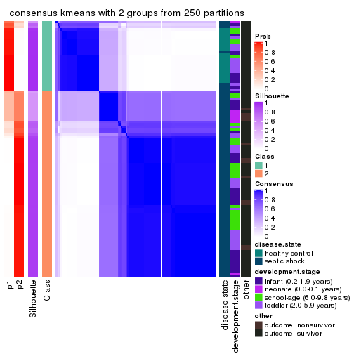</p>

</div>
<div id='tab-CV-kmeans-consensus-heatmap-2'>
<pre><code class="r">consensus_heatmap(res, k = 3)
</code></pre>

<p>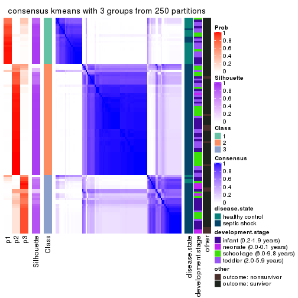</p>

</div>
<div id='tab-CV-kmeans-consensus-heatmap-3'>
<pre><code class="r">consensus_heatmap(res, k = 4)
</code></pre>

<p>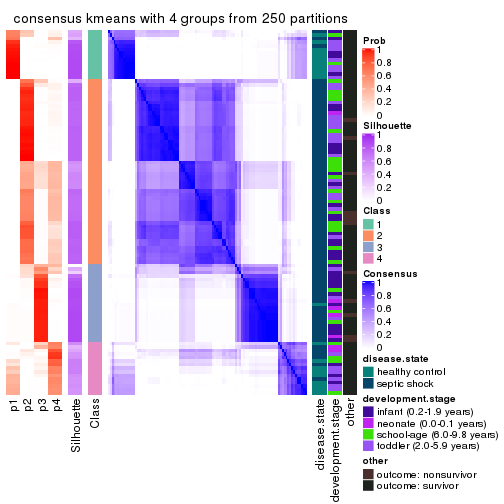</p>

</div>
<div id='tab-CV-kmeans-consensus-heatmap-4'>
<pre><code class="r">consensus_heatmap(res, k = 5)
</code></pre>

<p>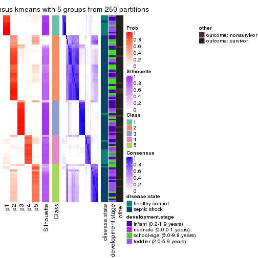</p>

</div>
<div id='tab-CV-kmeans-consensus-heatmap-5'>
<pre><code class="r">consensus_heatmap(res, k = 6)
</code></pre>

<p>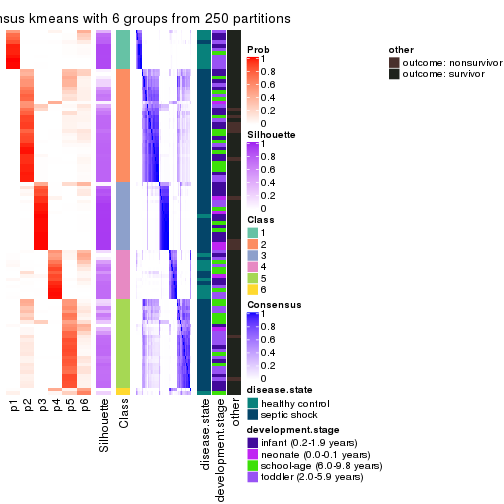</p>

</div>
</div>

Heatmaps for the membership of samples in all partitions to see how consistent they are:


<script>
$( function() {
	$( '#tabs-CV-kmeans-membership-heatmap' ).tabs();
} );
</script>
<div id='tabs-CV-kmeans-membership-heatmap'>
<ul>
<li><a href='#tab-CV-kmeans-membership-heatmap-1'>k = 2</a></li>
<li><a href='#tab-CV-kmeans-membership-heatmap-2'>k = 3</a></li>
<li><a href='#tab-CV-kmeans-membership-heatmap-3'>k = 4</a></li>
<li><a href='#tab-CV-kmeans-membership-heatmap-4'>k = 5</a></li>
<li><a href='#tab-CV-kmeans-membership-heatmap-5'>k = 6</a></li>
</ul>
<div id='tab-CV-kmeans-membership-heatmap-1'>
<pre><code class="r">membership_heatmap(res, k = 2)
</code></pre>

<p>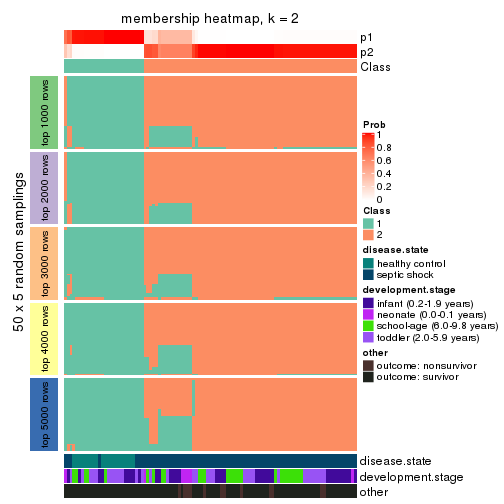</p>

</div>
<div id='tab-CV-kmeans-membership-heatmap-2'>
<pre><code class="r">membership_heatmap(res, k = 3)
</code></pre>

<p>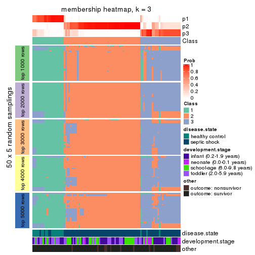</p>

</div>
<div id='tab-CV-kmeans-membership-heatmap-3'>
<pre><code class="r">membership_heatmap(res, k = 4)
</code></pre>

<p>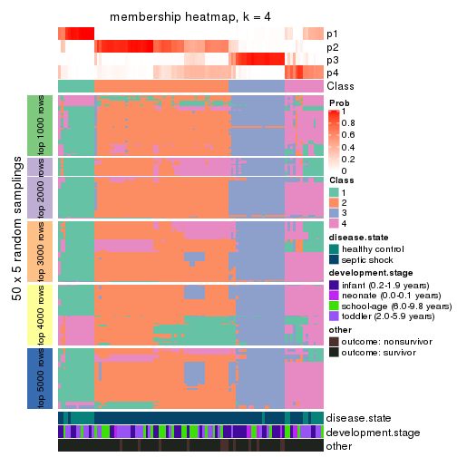</p>

</div>
<div id='tab-CV-kmeans-membership-heatmap-4'>
<pre><code class="r">membership_heatmap(res, k = 5)
</code></pre>

<p>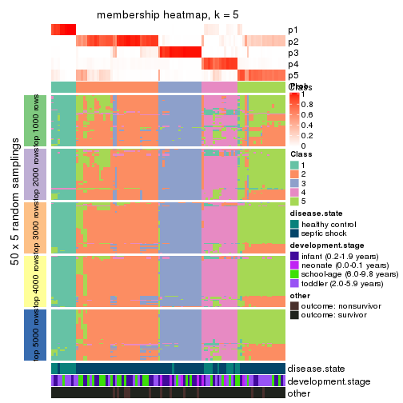</p>

</div>
<div id='tab-CV-kmeans-membership-heatmap-5'>
<pre><code class="r">membership_heatmap(res, k = 6)
</code></pre>

<p>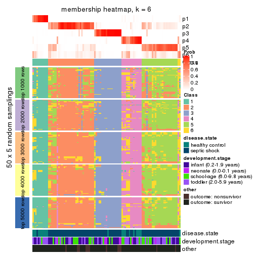</p>

</div>
</div>

As soon as we have had the classes for columns, we can look for signatures
which are significantly different between classes which can be candidate marks
for certain classes. Following are the heatmaps for signatures.


Signature heatmaps where rows are scaled:


<script>
$( function() {
	$( '#tabs-CV-kmeans-get-signatures' ).tabs();
} );
</script>
<div id='tabs-CV-kmeans-get-signatures'>
<ul>
<li><a href='#tab-CV-kmeans-get-signatures-1'>k = 2</a></li>
<li><a href='#tab-CV-kmeans-get-signatures-2'>k = 3</a></li>
<li><a href='#tab-CV-kmeans-get-signatures-3'>k = 4</a></li>
<li><a href='#tab-CV-kmeans-get-signatures-4'>k = 5</a></li>
<li><a href='#tab-CV-kmeans-get-signatures-5'>k = 6</a></li>
</ul>
<div id='tab-CV-kmeans-get-signatures-1'>
<pre><code class="r">get_signatures(res, k = 2)
</code></pre>

<p>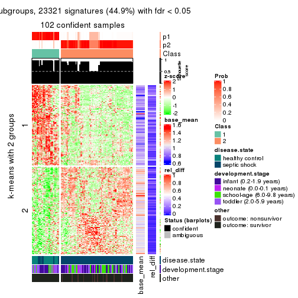</p>

</div>
<div id='tab-CV-kmeans-get-signatures-2'>
<pre><code class="r">get_signatures(res, k = 3)
</code></pre>

<p>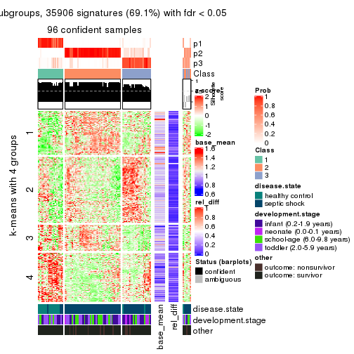</p>

</div>
<div id='tab-CV-kmeans-get-signatures-3'>
<pre><code class="r">get_signatures(res, k = 4)
</code></pre>

<p>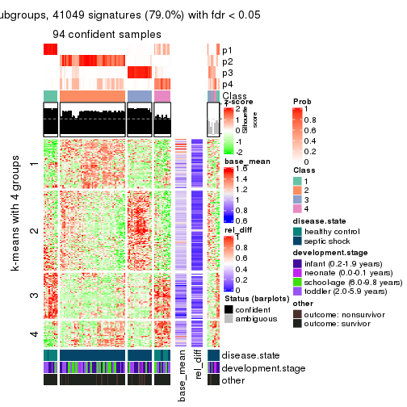</p>

</div>
<div id='tab-CV-kmeans-get-signatures-4'>
<pre><code class="r">get_signatures(res, k = 5)
</code></pre>

<p>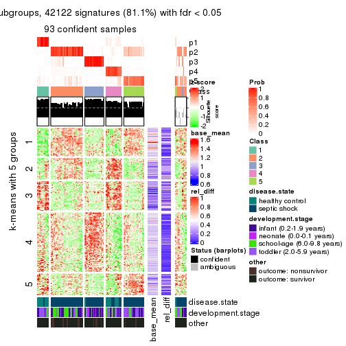</p>

</div>
<div id='tab-CV-kmeans-get-signatures-5'>
<pre><code class="r">get_signatures(res, k = 6)
</code></pre>

<p>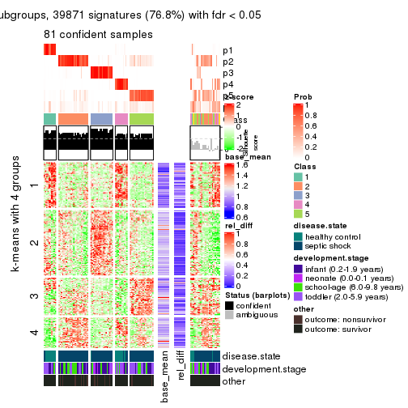</p>

</div>
</div>


Signature heatmaps where rows are not scaled:


<script>
$( function() {
	$( '#tabs-CV-kmeans-get-signatures-no-scale' ).tabs();
} );
</script>
<div id='tabs-CV-kmeans-get-signatures-no-scale'>
<ul>
<li><a href='#tab-CV-kmeans-get-signatures-no-scale-1'>k = 2</a></li>
<li><a href='#tab-CV-kmeans-get-signatures-no-scale-2'>k = 3</a></li>
<li><a href='#tab-CV-kmeans-get-signatures-no-scale-3'>k = 4</a></li>
<li><a href='#tab-CV-kmeans-get-signatures-no-scale-4'>k = 5</a></li>
<li><a href='#tab-CV-kmeans-get-signatures-no-scale-5'>k = 6</a></li>
</ul>
<div id='tab-CV-kmeans-get-signatures-no-scale-1'>
<pre><code class="r">get_signatures(res, k = 2, scale_rows = FALSE)
</code></pre>

<p>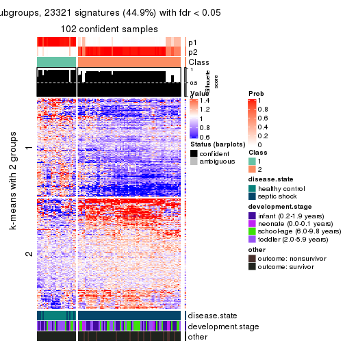</p>

</div>
<div id='tab-CV-kmeans-get-signatures-no-scale-2'>
<pre><code class="r">get_signatures(res, k = 3, scale_rows = FALSE)
</code></pre>

<p>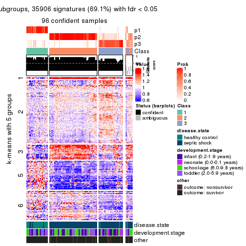</p>

</div>
<div id='tab-CV-kmeans-get-signatures-no-scale-3'>
<pre><code class="r">get_signatures(res, k = 4, scale_rows = FALSE)
</code></pre>

<p>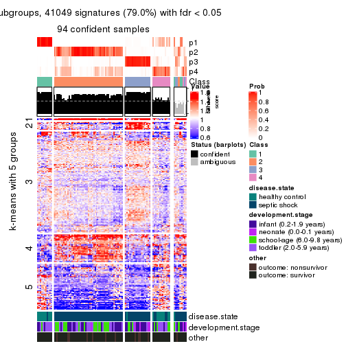</p>

</div>
<div id='tab-CV-kmeans-get-signatures-no-scale-4'>
<pre><code class="r">get_signatures(res, k = 5, scale_rows = FALSE)
</code></pre>

<p>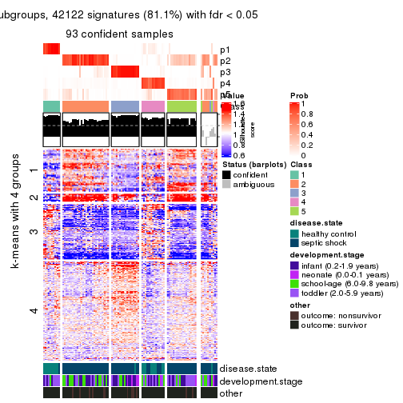</p>

</div>
<div id='tab-CV-kmeans-get-signatures-no-scale-5'>
<pre><code class="r">get_signatures(res, k = 6, scale_rows = FALSE)
</code></pre>

<p>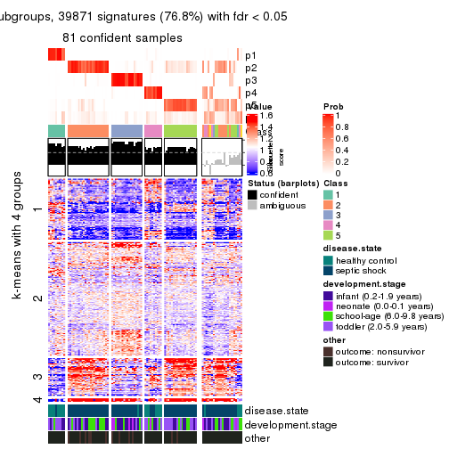</p>

</div>
</div>


Compare the overlap of signatures from different k:

```r
compare_signatures(res)
```

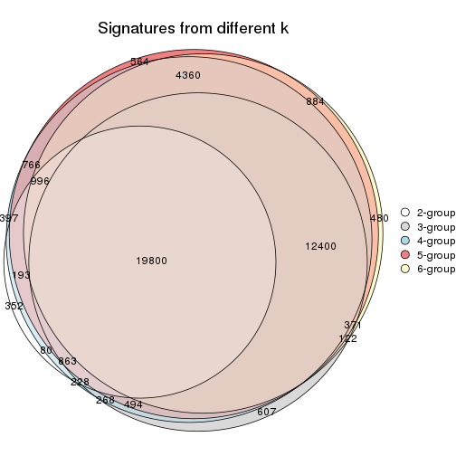

`get_signature()` returns a data frame invisibly. TO get the list of signatures, the function
call should be assigned to a variable explicitly. In following code, if `plot` argument is set
to `FALSE`, no heatmap is plotted while only the differential analysis is performed.

```r
# code only for demonstration
tb = get_signature(res, k = ..., plot = FALSE)
```

An example of the output of `tb` is:

```
#>   which_row         fdr    mean_1    mean_2 scaled_mean_1 scaled_mean_2 km
#> 1        38 0.042760348  8.373488  9.131774    -0.5533452     0.5164555  1
#> 2        40 0.018707592  7.106213  8.469186    -0.6173731     0.5762149  1
#> 3        55 0.019134737 10.221463 11.207825    -0.6159697     0.5749050  1
#> 4        59 0.006059896  5.921854  7.869574    -0.6899429     0.6439467  1
#> 5        60 0.018055526  8.928898 10.211722    -0.6204761     0.5791110  1
#> 6        98 0.009384629 15.714769 14.887706     0.6635654    -0.6193277  2
...
```

The columns in `tb` are:

1. `which_row`: row indices corresponding to the input matrix.
2. `fdr`: FDR for the differential test. 
3. `mean_x`: The mean value in group x.
4. `scaled_mean_x`: The mean value in group x after rows are scaled.
5. `km`: Row groups if k-means clustering is applied to rows.


UMAP plot which shows how samples are separated.


<script>
$( function() {
	$( '#tabs-CV-kmeans-dimension-reduction' ).tabs();
} );
</script>
<div id='tabs-CV-kmeans-dimension-reduction'>
<ul>
<li><a href='#tab-CV-kmeans-dimension-reduction-1'>k = 2</a></li>
<li><a href='#tab-CV-kmeans-dimension-reduction-2'>k = 3</a></li>
<li><a href='#tab-CV-kmeans-dimension-reduction-3'>k = 4</a></li>
<li><a href='#tab-CV-kmeans-dimension-reduction-4'>k = 5</a></li>
<li><a href='#tab-CV-kmeans-dimension-reduction-5'>k = 6</a></li>
</ul>
<div id='tab-CV-kmeans-dimension-reduction-1'>
<pre><code class="r">dimension_reduction(res, k = 2, method = &quot;UMAP&quot;)
</code></pre>

<p>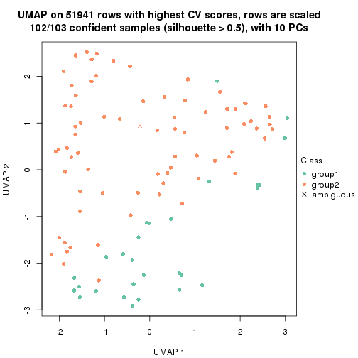</p>

</div>
<div id='tab-CV-kmeans-dimension-reduction-2'>
<pre><code class="r">dimension_reduction(res, k = 3, method = &quot;UMAP&quot;)
</code></pre>

<p>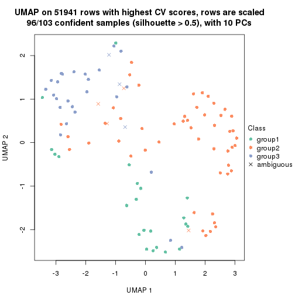</p>

</div>
<div id='tab-CV-kmeans-dimension-reduction-3'>
<pre><code class="r">dimension_reduction(res, k = 4, method = &quot;UMAP&quot;)
</code></pre>

<p>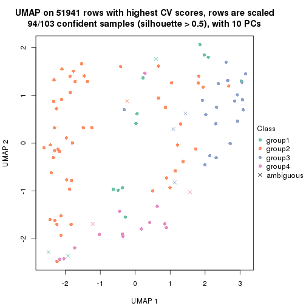</p>

</div>
<div id='tab-CV-kmeans-dimension-reduction-4'>
<pre><code class="r">dimension_reduction(res, k = 5, method = &quot;UMAP&quot;)
</code></pre>

<p>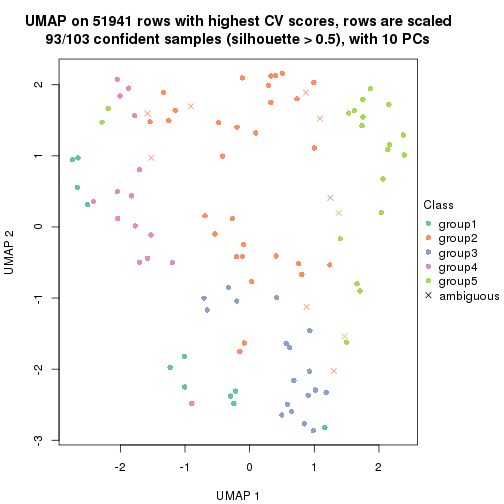</p>

</div>
<div id='tab-CV-kmeans-dimension-reduction-5'>
<pre><code class="r">dimension_reduction(res, k = 6, method = &quot;UMAP&quot;)
</code></pre>

<p>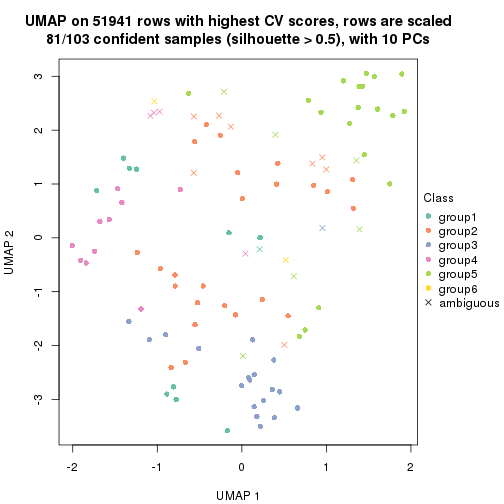</p>

</div>
</div>


Following heatmap shows how subgroups are split when increasing `k`:

```r
collect_classes(res)
```

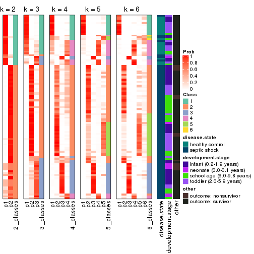


Test correlation between subgroups and known annotations. If the known
annotation is numeric, one-way ANOVA test is applied, and if the known
annotation is discrete, chi-squared contingency table test is applied.

```r
test_to_known_factors(res)
```

```
#>             n disease.state(p) development.stage(p) other(p) k
#> CV:kmeans 102         6.19e-16             0.250098   0.0543 2
#> CV:kmeans  96         7.68e-15             0.000971   0.1540 3
#> CV:kmeans  94         2.54e-14             0.005389   0.1725 4
#> CV:kmeans  93         2.07e-12             0.005035   0.1536 5
#> CV:kmeans  81         1.12e-11             0.012007   0.1641 6
```


If matrix rows can be associated to genes, consider to use `functional_enrichment(res,
...)` to perform function enrichment for the signature genes. See [this vignette](http://bioconductor.org/packages/devel/bioc/vignettes/cola/inst/doc/functional_enrichment.html) for more detailed explanations.


 

---------------------------------------------------


### CV:skmeans*


The object with results only for a single top-value method and a single partition method 
can be extracted as:

```r
res = res_list["CV", "skmeans"]
# you can also extract it by
# res = res_list["CV:skmeans"]
```

A summary of `res` and all the functions that can be applied to it:

```r
res
```

```
#> A 'ConsensusPartition' object with k = 2, 3, 4, 5, 6.
#>   On a matrix with 51941 rows and 103 columns.
#>   Top rows (1000, 2000, 3000, 4000, 5000) are extracted by 'CV' method.
#>   Subgroups are detected by 'skmeans' method.
#>   Performed in total 1250 partitions by row resampling.
#>   Best k for subgroups seems to be 3.
#> 
#> Following methods can be applied to this 'ConsensusPartition' object:
#>  [1] "cola_report"             "collect_classes"         "collect_plots"          
#>  [4] "collect_stats"           "colnames"                "compare_signatures"     
#>  [7] "consensus_heatmap"       "dimension_reduction"     "functional_enrichment"  
#> [10] "get_anno_col"            "get_anno"                "get_classes"            
#> [13] "get_consensus"           "get_matrix"              "get_membership"         
#> [16] "get_param"               "get_signatures"          "get_stats"              
#> [19] "is_best_k"               "is_stable_k"             "membership_heatmap"     
#> [22] "ncol"                    "nrow"                    "plot_ecdf"              
#> [25] "rownames"                "select_partition_number" "show"                   
#> [28] "suggest_best_k"          "test_to_known_factors"
```

`collect_plots()` function collects all the plots made from `res` for all `k` (number of partitions)
into one single page to provide an easy and fast comparison between different `k`.

```r
collect_plots(res)
```

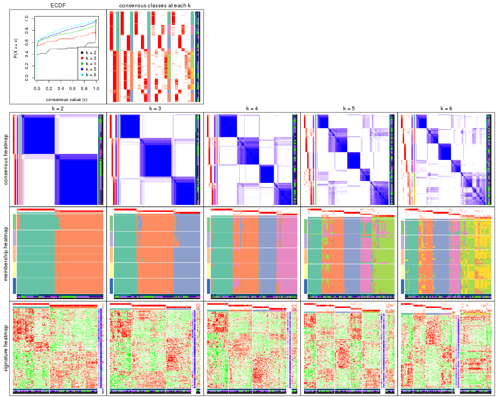

The plots are:

- The first row: a plot of the ECDF (empirical cumulative distribution
  function) curves of the consensus matrix for each `k` and the heatmap of
  predicted classes for each `k`.
- The second row: heatmaps of the consensus matrix for each `k`.
- The third row: heatmaps of the membership matrix for each `k`.
- The fouth row: heatmaps of the signatures for each `k`.

All the plots in panels can be made by individual functions and they are
plotted later in this section.

`select_partition_number()` produces several plots showing different
statistics for choosing "optimized" `k`. There are following statistics:

- ECDF curves of the consensus matrix for each `k`;
- 1-PAC. [The PAC
  score](https://en.wikipedia.org/wiki/Consensus_clustering#Over-interpretation_potential_of_consensus_clustering)
  measures the proportion of the ambiguous subgrouping.
- Mean silhouette score.
- Concordance. The mean probability of fiting the consensus class ids in all
  partitions.
- Area increased. Denote $A_k$ as the area under the ECDF curve for current
  `k`, the area increased is defined as $A_k - A_{k-1}$.
- Rand index. The percent of pairs of samples that are both in a same cluster
  or both are not in a same cluster in the partition of k and k-1.
- Jaccard index. The ratio of pairs of samples are both in a same cluster in
  the partition of k and k-1 and the pairs of samples are both in a same
  cluster in the partition k or k-1.

The detailed explanations of these statistics can be found in [the _cola_
vignette](http://bioconductor.org/packages/devel/bioc/vignettes/cola/inst/doc/cola.html#toc_13).

Generally speaking, lower PAC score, higher mean silhouette score or higher
concordance corresponds to better partition. Rand index and Jaccard index
measure how similar the current partition is compared to partition with `k-1`.
If they are too similar, we won't accept `k` is better than `k-1`.

```r
select_partition_number(res)
```

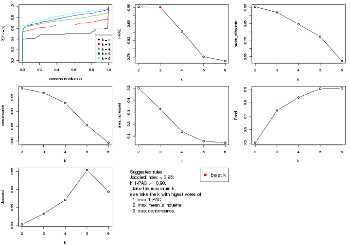

The numeric values for all these statistics can be obtained by `get_stats()`.

```r
get_stats(res)
```

```
#>   k 1-PAC mean_silhouette concordance area_increased  Rand Jaccard
#> 2 2 0.901           0.953       0.979         0.4971 0.503   0.503
#> 3 3 0.900           0.919       0.964         0.3276 0.742   0.532
#> 4 4 0.842           0.846       0.930         0.1382 0.839   0.571
#> 5 5 0.780           0.771       0.854         0.0588 0.905   0.653
#> 6 6 0.770           0.624       0.794         0.0459 0.906   0.593
```

`suggest_best_k()` suggests the best $k$ based on these statistics. The rules are as follows:

- All $k$ with Jaccard index larger than 0.95 are removed because increasing
  $k$ does not provide enough extra information. If all $k$ are removed, it is
  marked as no subgroup is detected.
- For all $k$ with 1-PAC score larger than 0.9, the maximal $k$ is taken as
  the best $k$, and other $k$ are marked as optional $k$.
- If it does not fit the second rule. The $k$ with the maximal vote of the
  highest 1-PAC score, highest mean silhouette, and highest concordance is
  taken as the best $k$.

```r
suggest_best_k(res)
```

```
#> [1] 3
#> attr(,"optional")
#> [1] 2
```

There is also optional best $k$ = 2 that is worth to check.

Following shows the table of the partitions (You need to click the **show/hide
code output** link to see it). The membership matrix (columns with name `p*`)
is inferred by
[`clue::cl_consensus()`](https://www.rdocumentation.org/link/cl_consensus?package=clue)
function with the `SE` method. Basically the value in the membership matrix
represents the probability to belong to a certain group. The finall class
label for an item is determined with the group with highest probability it
belongs to.

In `get_classes()` function, the entropy is calculated from the membership
matrix and the silhouette score is calculated from the consensus matrix.


<script>
$( function() {
	$( '#tabs-CV-skmeans-get-classes' ).tabs();
} );
</script>
<div id='tabs-CV-skmeans-get-classes'>
<ul>
<li><a href='#tab-CV-skmeans-get-classes-1'>k = 2</a></li>
<li><a href='#tab-CV-skmeans-get-classes-2'>k = 3</a></li>
<li><a href='#tab-CV-skmeans-get-classes-3'>k = 4</a></li>
<li><a href='#tab-CV-skmeans-get-classes-4'>k = 5</a></li>
<li><a href='#tab-CV-skmeans-get-classes-5'>k = 6</a></li>
</ul>

<div id='tab-CV-skmeans-get-classes-1'>
<p><a id='tab-CV-skmeans-get-classes-1-a' style='color:#0366d6' href='#'>show/hide code output</a></p>
<pre><code class="r">cbind(get_classes(res, k = 2), get_membership(res, k = 2))
</code></pre>

<pre><code>#&gt;           class entropy silhouette    p1    p2
#&gt; GSM647569     1  0.0000     0.9748 1.000 0.000
#&gt; GSM647574     1  0.0000     0.9748 1.000 0.000
#&gt; GSM647577     1  0.0000     0.9748 1.000 0.000
#&gt; GSM647547     1  0.0000     0.9748 1.000 0.000
#&gt; GSM647552     2  0.6148     0.8162 0.152 0.848
#&gt; GSM647553     1  0.0000     0.9748 1.000 0.000
#&gt; GSM647565     1  0.7139     0.7622 0.804 0.196
#&gt; GSM647545     2  0.0000     0.9808 0.000 1.000
#&gt; GSM647549     2  0.0000     0.9808 0.000 1.000
#&gt; GSM647550     2  0.0672     0.9744 0.008 0.992
#&gt; GSM647560     2  0.0000     0.9808 0.000 1.000
#&gt; GSM647617     1  0.0000     0.9748 1.000 0.000
#&gt; GSM647528     2  0.0000     0.9808 0.000 1.000
#&gt; GSM647529     1  0.0376     0.9713 0.996 0.004
#&gt; GSM647531     2  0.0000     0.9808 0.000 1.000
#&gt; GSM647540     2  0.6438     0.8136 0.164 0.836
#&gt; GSM647541     2  0.0000     0.9808 0.000 1.000
#&gt; GSM647546     1  0.0000     0.9748 1.000 0.000
#&gt; GSM647557     2  0.0000     0.9808 0.000 1.000
#&gt; GSM647561     2  0.0000     0.9808 0.000 1.000
#&gt; GSM647567     1  0.0000     0.9748 1.000 0.000
#&gt; GSM647568     2  0.0000     0.9808 0.000 1.000
#&gt; GSM647570     2  0.0000     0.9808 0.000 1.000
#&gt; GSM647573     1  0.0000     0.9748 1.000 0.000
#&gt; GSM647576     2  0.6048     0.8332 0.148 0.852
#&gt; GSM647579     2  0.6438     0.8136 0.164 0.836
#&gt; GSM647580     1  0.0000     0.9748 1.000 0.000
#&gt; GSM647583     1  0.0000     0.9748 1.000 0.000
#&gt; GSM647592     2  0.0000     0.9808 0.000 1.000
#&gt; GSM647593     2  0.0000     0.9808 0.000 1.000
#&gt; GSM647595     2  0.0000     0.9808 0.000 1.000
#&gt; GSM647597     1  0.9996     0.0746 0.512 0.488
#&gt; GSM647598     2  0.0000     0.9808 0.000 1.000
#&gt; GSM647613     2  0.0000     0.9808 0.000 1.000
#&gt; GSM647615     2  0.0000     0.9808 0.000 1.000
#&gt; GSM647616     1  0.0000     0.9748 1.000 0.000
#&gt; GSM647619     2  0.0000     0.9808 0.000 1.000
#&gt; GSM647582     2  0.0000     0.9808 0.000 1.000
#&gt; GSM647591     2  0.0000     0.9808 0.000 1.000
#&gt; GSM647527     2  0.0000     0.9808 0.000 1.000
#&gt; GSM647530     1  0.7299     0.7513 0.796 0.204
#&gt; GSM647532     1  0.0000     0.9748 1.000 0.000
#&gt; GSM647544     2  0.0000     0.9808 0.000 1.000
#&gt; GSM647551     2  0.0000     0.9808 0.000 1.000
#&gt; GSM647556     1  0.0000     0.9748 1.000 0.000
#&gt; GSM647558     2  0.0000     0.9808 0.000 1.000
#&gt; GSM647572     1  0.0000     0.9748 1.000 0.000
#&gt; GSM647578     2  0.6438     0.8136 0.164 0.836
#&gt; GSM647581     2  0.0000     0.9808 0.000 1.000
#&gt; GSM647594     2  0.0000     0.9808 0.000 1.000
#&gt; GSM647599     1  0.0000     0.9748 1.000 0.000
#&gt; GSM647600     2  0.0000     0.9808 0.000 1.000
#&gt; GSM647601     2  0.0000     0.9808 0.000 1.000
#&gt; GSM647603     2  0.0000     0.9808 0.000 1.000
#&gt; GSM647610     2  0.7219     0.7638 0.200 0.800
#&gt; GSM647611     2  0.0000     0.9808 0.000 1.000
#&gt; GSM647612     2  0.0000     0.9808 0.000 1.000
#&gt; GSM647614     2  0.0000     0.9808 0.000 1.000
#&gt; GSM647618     2  0.0000     0.9808 0.000 1.000
#&gt; GSM647629     2  0.0000     0.9808 0.000 1.000
#&gt; GSM647535     2  0.0000     0.9808 0.000 1.000
#&gt; GSM647563     2  0.0000     0.9808 0.000 1.000
#&gt; GSM647542     2  0.0000     0.9808 0.000 1.000
#&gt; GSM647543     2  0.0000     0.9808 0.000 1.000
#&gt; GSM647548     1  0.7139     0.7622 0.804 0.196
#&gt; GSM647554     2  0.2603     0.9428 0.044 0.956
#&gt; GSM647555     2  0.0000     0.9808 0.000 1.000
#&gt; GSM647559     2  0.0000     0.9808 0.000 1.000
#&gt; GSM647562     2  0.0000     0.9808 0.000 1.000
#&gt; GSM647564     1  0.0000     0.9748 1.000 0.000
#&gt; GSM647571     2  0.0000     0.9808 0.000 1.000
#&gt; GSM647584     2  0.0000     0.9808 0.000 1.000
#&gt; GSM647585     1  0.0000     0.9748 1.000 0.000
#&gt; GSM647586     2  0.0000     0.9808 0.000 1.000
#&gt; GSM647587     2  0.0000     0.9808 0.000 1.000
#&gt; GSM647588     2  0.0000     0.9808 0.000 1.000
#&gt; GSM647596     2  0.0000     0.9808 0.000 1.000
#&gt; GSM647602     1  0.0000     0.9748 1.000 0.000
#&gt; GSM647609     2  0.0000     0.9808 0.000 1.000
#&gt; GSM647620     2  0.0000     0.9808 0.000 1.000
#&gt; GSM647627     2  0.0000     0.9808 0.000 1.000
#&gt; GSM647628     2  0.0000     0.9808 0.000 1.000
#&gt; GSM647533     1  0.0000     0.9748 1.000 0.000
#&gt; GSM647536     1  0.0000     0.9748 1.000 0.000
#&gt; GSM647537     1  0.0000     0.9748 1.000 0.000
#&gt; GSM647606     1  0.0000     0.9748 1.000 0.000
#&gt; GSM647621     1  0.0000     0.9748 1.000 0.000
#&gt; GSM647626     1  0.0000     0.9748 1.000 0.000
#&gt; GSM647538     1  0.0000     0.9748 1.000 0.000
#&gt; GSM647575     1  0.0000     0.9748 1.000 0.000
#&gt; GSM647590     1  0.0000     0.9748 1.000 0.000
#&gt; GSM647605     1  0.0000     0.9748 1.000 0.000
#&gt; GSM647607     1  0.0000     0.9748 1.000 0.000
#&gt; GSM647608     1  0.0000     0.9748 1.000 0.000
#&gt; GSM647622     1  0.0000     0.9748 1.000 0.000
#&gt; GSM647623     1  0.0000     0.9748 1.000 0.000
#&gt; GSM647624     1  0.0000     0.9748 1.000 0.000
#&gt; GSM647625     1  0.0000     0.9748 1.000 0.000
#&gt; GSM647534     1  0.0000     0.9748 1.000 0.000
#&gt; GSM647539     1  0.0000     0.9748 1.000 0.000
#&gt; GSM647566     1  0.0000     0.9748 1.000 0.000
#&gt; GSM647589     1  0.0000     0.9748 1.000 0.000
#&gt; GSM647604     1  0.0000     0.9748 1.000 0.000
</code></pre>

<script>
$('#tab-CV-skmeans-get-classes-1-a').parent().next().next().hide();
$('#tab-CV-skmeans-get-classes-1-a').click(function(){
  $('#tab-CV-skmeans-get-classes-1-a').parent().next().next().toggle();
  return(false);
});
</script>
</div>

<div id='tab-CV-skmeans-get-classes-2'>
<p><a id='tab-CV-skmeans-get-classes-2-a' style='color:#0366d6' href='#'>show/hide code output</a></p>
<pre><code class="r">cbind(get_classes(res, k = 3), get_membership(res, k = 3))
</code></pre>

<pre><code>#&gt;           class entropy silhouette    p1    p2    p3
#&gt; GSM647569     3  0.0000      0.944 0.000 0.000 1.000
#&gt; GSM647574     3  0.0000      0.944 0.000 0.000 1.000
#&gt; GSM647577     3  0.0000      0.944 0.000 0.000 1.000
#&gt; GSM647547     3  0.0237      0.941 0.004 0.000 0.996
#&gt; GSM647552     2  0.2711      0.881 0.088 0.912 0.000
#&gt; GSM647553     3  0.0000      0.944 0.000 0.000 1.000
#&gt; GSM647565     3  0.0000      0.944 0.000 0.000 1.000
#&gt; GSM647545     2  0.0000      0.958 0.000 1.000 0.000
#&gt; GSM647549     2  0.0000      0.958 0.000 1.000 0.000
#&gt; GSM647550     3  0.0237      0.941 0.000 0.004 0.996
#&gt; GSM647560     3  0.3816      0.819 0.000 0.148 0.852
#&gt; GSM647617     3  0.0000      0.944 0.000 0.000 1.000
#&gt; GSM647528     2  0.0000      0.958 0.000 1.000 0.000
#&gt; GSM647529     1  0.0000      0.987 1.000 0.000 0.000
#&gt; GSM647531     2  0.0000      0.958 0.000 1.000 0.000
#&gt; GSM647540     3  0.0000      0.944 0.000 0.000 1.000
#&gt; GSM647541     2  0.4796      0.717 0.000 0.780 0.220
#&gt; GSM647546     3  0.0000      0.944 0.000 0.000 1.000
#&gt; GSM647557     2  0.0000      0.958 0.000 1.000 0.000
#&gt; GSM647561     2  0.0000      0.958 0.000 1.000 0.000
#&gt; GSM647567     1  0.5835      0.485 0.660 0.000 0.340
#&gt; GSM647568     3  0.0000      0.944 0.000 0.000 1.000
#&gt; GSM647570     2  0.0000      0.958 0.000 1.000 0.000
#&gt; GSM647573     1  0.0000      0.987 1.000 0.000 0.000
#&gt; GSM647576     3  0.0000      0.944 0.000 0.000 1.000
#&gt; GSM647579     3  0.0000      0.944 0.000 0.000 1.000
#&gt; GSM647580     3  0.0000      0.944 0.000 0.000 1.000
#&gt; GSM647583     3  0.0000      0.944 0.000 0.000 1.000
#&gt; GSM647592     2  0.0000      0.958 0.000 1.000 0.000
#&gt; GSM647593     2  0.0000      0.958 0.000 1.000 0.000
#&gt; GSM647595     2  0.0000      0.958 0.000 1.000 0.000
#&gt; GSM647597     1  0.0000      0.987 1.000 0.000 0.000
#&gt; GSM647598     2  0.0000      0.958 0.000 1.000 0.000
#&gt; GSM647613     2  0.0000      0.958 0.000 1.000 0.000
#&gt; GSM647615     3  0.5988      0.469 0.000 0.368 0.632
#&gt; GSM647616     3  0.0000      0.944 0.000 0.000 1.000
#&gt; GSM647619     2  0.0000      0.958 0.000 1.000 0.000
#&gt; GSM647582     2  0.0000      0.958 0.000 1.000 0.000
#&gt; GSM647591     2  0.0000      0.958 0.000 1.000 0.000
#&gt; GSM647527     2  0.0000      0.958 0.000 1.000 0.000
#&gt; GSM647530     1  0.0000      0.987 1.000 0.000 0.000
#&gt; GSM647532     1  0.0000      0.987 1.000 0.000 0.000
#&gt; GSM647544     2  0.0000      0.958 0.000 1.000 0.000
#&gt; GSM647551     2  0.0000      0.958 0.000 1.000 0.000
#&gt; GSM647556     3  0.0000      0.944 0.000 0.000 1.000
#&gt; GSM647558     2  0.0000      0.958 0.000 1.000 0.000
#&gt; GSM647572     3  0.0000      0.944 0.000 0.000 1.000
#&gt; GSM647578     3  0.0237      0.941 0.000 0.004 0.996
#&gt; GSM647581     2  0.0000      0.958 0.000 1.000 0.000
#&gt; GSM647594     2  0.6079      0.362 0.388 0.612 0.000
#&gt; GSM647599     1  0.0000      0.987 1.000 0.000 0.000
#&gt; GSM647600     2  0.0000      0.958 0.000 1.000 0.000
#&gt; GSM647601     2  0.0000      0.958 0.000 1.000 0.000
#&gt; GSM647603     2  0.5254      0.649 0.000 0.736 0.264
#&gt; GSM647610     2  0.5558      0.777 0.152 0.800 0.048
#&gt; GSM647611     2  0.0000      0.958 0.000 1.000 0.000
#&gt; GSM647612     3  0.3482      0.841 0.000 0.128 0.872
#&gt; GSM647614     3  0.5905      0.504 0.000 0.352 0.648
#&gt; GSM647618     2  0.0000      0.958 0.000 1.000 0.000
#&gt; GSM647629     2  0.3551      0.833 0.000 0.868 0.132
#&gt; GSM647535     2  0.0000      0.958 0.000 1.000 0.000
#&gt; GSM647563     2  0.0000      0.958 0.000 1.000 0.000
#&gt; GSM647542     3  0.0000      0.944 0.000 0.000 1.000
#&gt; GSM647543     3  0.0000      0.944 0.000 0.000 1.000
#&gt; GSM647548     3  0.7190      0.487 0.320 0.044 0.636
#&gt; GSM647554     2  0.5926      0.475 0.000 0.644 0.356
#&gt; GSM647555     3  0.2356      0.890 0.000 0.072 0.928
#&gt; GSM647559     2  0.0000      0.958 0.000 1.000 0.000
#&gt; GSM647562     2  0.0000      0.958 0.000 1.000 0.000
#&gt; GSM647564     3  0.0000      0.944 0.000 0.000 1.000
#&gt; GSM647571     3  0.3879      0.819 0.000 0.152 0.848
#&gt; GSM647584     2  0.0000      0.958 0.000 1.000 0.000
#&gt; GSM647585     3  0.0000      0.944 0.000 0.000 1.000
#&gt; GSM647586     2  0.0000      0.958 0.000 1.000 0.000
#&gt; GSM647587     2  0.0000      0.958 0.000 1.000 0.000
#&gt; GSM647588     2  0.2537      0.888 0.000 0.920 0.080
#&gt; GSM647596     2  0.0000      0.958 0.000 1.000 0.000
#&gt; GSM647602     3  0.0000      0.944 0.000 0.000 1.000
#&gt; GSM647609     2  0.0000      0.958 0.000 1.000 0.000
#&gt; GSM647620     2  0.0000      0.958 0.000 1.000 0.000
#&gt; GSM647627     2  0.0000      0.958 0.000 1.000 0.000
#&gt; GSM647628     2  0.0000      0.958 0.000 1.000 0.000
#&gt; GSM647533     1  0.0000      0.987 1.000 0.000 0.000
#&gt; GSM647536     1  0.0000      0.987 1.000 0.000 0.000
#&gt; GSM647537     1  0.0000      0.987 1.000 0.000 0.000
#&gt; GSM647606     1  0.0000      0.987 1.000 0.000 0.000
#&gt; GSM647621     1  0.0000      0.987 1.000 0.000 0.000
#&gt; GSM647626     3  0.0000      0.944 0.000 0.000 1.000
#&gt; GSM647538     1  0.0000      0.987 1.000 0.000 0.000
#&gt; GSM647575     1  0.0000      0.987 1.000 0.000 0.000
#&gt; GSM647590     1  0.0000      0.987 1.000 0.000 0.000
#&gt; GSM647605     1  0.0000      0.987 1.000 0.000 0.000
#&gt; GSM647607     1  0.0000      0.987 1.000 0.000 0.000
#&gt; GSM647608     1  0.0000      0.987 1.000 0.000 0.000
#&gt; GSM647622     1  0.0000      0.987 1.000 0.000 0.000
#&gt; GSM647623     1  0.0000      0.987 1.000 0.000 0.000
#&gt; GSM647624     1  0.0000      0.987 1.000 0.000 0.000
#&gt; GSM647625     1  0.0000      0.987 1.000 0.000 0.000
#&gt; GSM647534     1  0.0000      0.987 1.000 0.000 0.000
#&gt; GSM647539     1  0.0000      0.987 1.000 0.000 0.000
#&gt; GSM647566     1  0.0000      0.987 1.000 0.000 0.000
#&gt; GSM647589     1  0.0000      0.987 1.000 0.000 0.000
#&gt; GSM647604     1  0.0000      0.987 1.000 0.000 0.000
</code></pre>

<script>
$('#tab-CV-skmeans-get-classes-2-a').parent().next().next().hide();
$('#tab-CV-skmeans-get-classes-2-a').click(function(){
  $('#tab-CV-skmeans-get-classes-2-a').parent().next().next().toggle();
  return(false);
});
</script>
</div>

<div id='tab-CV-skmeans-get-classes-3'>
<p><a id='tab-CV-skmeans-get-classes-3-a' style='color:#0366d6' href='#'>show/hide code output</a></p>
<pre><code class="r">cbind(get_classes(res, k = 4), get_membership(res, k = 4))
</code></pre>

<pre><code>#&gt;           class entropy silhouette    p1    p2    p3    p4
#&gt; GSM647569     3  0.0000     0.9611 0.000 0.000 1.000 0.000
#&gt; GSM647574     3  0.0000     0.9611 0.000 0.000 1.000 0.000
#&gt; GSM647577     3  0.0000     0.9611 0.000 0.000 1.000 0.000
#&gt; GSM647547     3  0.1867     0.8956 0.000 0.000 0.928 0.072
#&gt; GSM647552     2  0.0376     0.8798 0.004 0.992 0.000 0.004
#&gt; GSM647553     3  0.0000     0.9611 0.000 0.000 1.000 0.000
#&gt; GSM647565     4  0.0336     0.8766 0.000 0.000 0.008 0.992
#&gt; GSM647545     4  0.0817     0.8749 0.000 0.024 0.000 0.976
#&gt; GSM647549     4  0.0707     0.8751 0.000 0.020 0.000 0.980
#&gt; GSM647550     4  0.4817     0.3479 0.000 0.000 0.388 0.612
#&gt; GSM647560     4  0.1978     0.8405 0.000 0.004 0.068 0.928
#&gt; GSM647617     3  0.0000     0.9611 0.000 0.000 1.000 0.000
#&gt; GSM647528     2  0.3907     0.7019 0.000 0.768 0.000 0.232
#&gt; GSM647529     1  0.0000     0.9737 1.000 0.000 0.000 0.000
#&gt; GSM647531     2  0.4382     0.6288 0.000 0.704 0.000 0.296
#&gt; GSM647540     3  0.0000     0.9611 0.000 0.000 1.000 0.000
#&gt; GSM647541     4  0.3172     0.7603 0.000 0.160 0.000 0.840
#&gt; GSM647546     3  0.0000     0.9611 0.000 0.000 1.000 0.000
#&gt; GSM647557     2  0.3311     0.7831 0.000 0.828 0.000 0.172
#&gt; GSM647561     2  0.4477     0.5870 0.000 0.688 0.000 0.312
#&gt; GSM647567     3  0.4981     0.1509 0.464 0.000 0.536 0.000
#&gt; GSM647568     4  0.0592     0.8758 0.000 0.000 0.016 0.984
#&gt; GSM647570     4  0.0336     0.8780 0.000 0.008 0.000 0.992
#&gt; GSM647573     1  0.1557     0.9249 0.944 0.000 0.000 0.056
#&gt; GSM647576     3  0.0000     0.9611 0.000 0.000 1.000 0.000
#&gt; GSM647579     3  0.0000     0.9611 0.000 0.000 1.000 0.000
#&gt; GSM647580     3  0.0000     0.9611 0.000 0.000 1.000 0.000
#&gt; GSM647583     3  0.0000     0.9611 0.000 0.000 1.000 0.000
#&gt; GSM647592     2  0.0000     0.8823 0.000 1.000 0.000 0.000
#&gt; GSM647593     2  0.0336     0.8838 0.000 0.992 0.000 0.008
#&gt; GSM647595     2  0.0336     0.8838 0.000 0.992 0.000 0.008
#&gt; GSM647597     1  0.4655     0.5466 0.684 0.312 0.000 0.004
#&gt; GSM647598     2  0.0336     0.8838 0.000 0.992 0.000 0.008
#&gt; GSM647613     2  0.4972     0.2227 0.000 0.544 0.000 0.456
#&gt; GSM647615     4  0.0376     0.8786 0.000 0.004 0.004 0.992
#&gt; GSM647616     3  0.0000     0.9611 0.000 0.000 1.000 0.000
#&gt; GSM647619     2  0.0000     0.8823 0.000 1.000 0.000 0.000
#&gt; GSM647582     2  0.0000     0.8823 0.000 1.000 0.000 0.000
#&gt; GSM647591     2  0.0469     0.8830 0.000 0.988 0.000 0.012
#&gt; GSM647527     2  0.3907     0.7019 0.000 0.768 0.000 0.232
#&gt; GSM647530     1  0.0336     0.9719 0.992 0.000 0.000 0.008
#&gt; GSM647532     1  0.0336     0.9719 0.992 0.000 0.000 0.008
#&gt; GSM647544     4  0.4304     0.6123 0.000 0.284 0.000 0.716
#&gt; GSM647551     2  0.0336     0.8838 0.000 0.992 0.000 0.008
#&gt; GSM647556     3  0.0000     0.9611 0.000 0.000 1.000 0.000
#&gt; GSM647558     4  0.0336     0.8778 0.000 0.008 0.000 0.992
#&gt; GSM647572     3  0.0000     0.9611 0.000 0.000 1.000 0.000
#&gt; GSM647578     3  0.4552     0.7535 0.000 0.072 0.800 0.128
#&gt; GSM647581     4  0.0707     0.8751 0.000 0.020 0.000 0.980
#&gt; GSM647594     2  0.4059     0.7087 0.200 0.788 0.000 0.012
#&gt; GSM647599     1  0.0000     0.9737 1.000 0.000 0.000 0.000
#&gt; GSM647600     2  0.0336     0.8838 0.000 0.992 0.000 0.008
#&gt; GSM647601     2  0.0336     0.8838 0.000 0.992 0.000 0.008
#&gt; GSM647603     2  0.2706     0.8261 0.000 0.900 0.080 0.020
#&gt; GSM647610     2  0.2266     0.8274 0.004 0.912 0.084 0.000
#&gt; GSM647611     2  0.0188     0.8820 0.000 0.996 0.000 0.004
#&gt; GSM647612     4  0.0376     0.8786 0.000 0.004 0.004 0.992
#&gt; GSM647614     4  0.0376     0.8786 0.000 0.004 0.004 0.992
#&gt; GSM647618     2  0.0188     0.8813 0.000 0.996 0.000 0.004
#&gt; GSM647629     2  0.3569     0.7344 0.000 0.804 0.000 0.196
#&gt; GSM647535     4  0.4998     0.0519 0.000 0.488 0.000 0.512
#&gt; GSM647563     4  0.0592     0.8770 0.000 0.016 0.000 0.984
#&gt; GSM647542     4  0.0592     0.8758 0.000 0.000 0.016 0.984
#&gt; GSM647543     4  0.0469     0.8773 0.000 0.000 0.012 0.988
#&gt; GSM647548     4  0.0336     0.8761 0.000 0.008 0.000 0.992
#&gt; GSM647554     2  0.4855     0.3177 0.000 0.600 0.400 0.000
#&gt; GSM647555     4  0.0592     0.8758 0.000 0.000 0.016 0.984
#&gt; GSM647559     4  0.4746     0.4593 0.000 0.368 0.000 0.632
#&gt; GSM647562     4  0.4605     0.5195 0.000 0.336 0.000 0.664
#&gt; GSM647564     3  0.0000     0.9611 0.000 0.000 1.000 0.000
#&gt; GSM647571     4  0.2124     0.8456 0.000 0.068 0.008 0.924
#&gt; GSM647584     2  0.0336     0.8838 0.000 0.992 0.000 0.008
#&gt; GSM647585     3  0.0000     0.9611 0.000 0.000 1.000 0.000
#&gt; GSM647586     2  0.0817     0.8800 0.000 0.976 0.000 0.024
#&gt; GSM647587     2  0.3649     0.7279 0.000 0.796 0.000 0.204
#&gt; GSM647588     4  0.4543     0.4929 0.000 0.324 0.000 0.676
#&gt; GSM647596     2  0.2589     0.8227 0.000 0.884 0.000 0.116
#&gt; GSM647602     3  0.0000     0.9611 0.000 0.000 1.000 0.000
#&gt; GSM647609     2  0.0336     0.8838 0.000 0.992 0.000 0.008
#&gt; GSM647620     2  0.0592     0.8823 0.000 0.984 0.000 0.016
#&gt; GSM647627     2  0.0592     0.8823 0.000 0.984 0.000 0.016
#&gt; GSM647628     4  0.0336     0.8780 0.000 0.008 0.000 0.992
#&gt; GSM647533     1  0.0000     0.9737 1.000 0.000 0.000 0.000
#&gt; GSM647536     1  0.0336     0.9719 0.992 0.000 0.000 0.008
#&gt; GSM647537     1  0.0000     0.9737 1.000 0.000 0.000 0.000
#&gt; GSM647606     1  0.0000     0.9737 1.000 0.000 0.000 0.000
#&gt; GSM647621     1  0.0188     0.9734 0.996 0.000 0.000 0.004
#&gt; GSM647626     3  0.0000     0.9611 0.000 0.000 1.000 0.000
#&gt; GSM647538     1  0.0000     0.9737 1.000 0.000 0.000 0.000
#&gt; GSM647575     1  0.0188     0.9734 0.996 0.000 0.000 0.004
#&gt; GSM647590     1  0.0188     0.9734 0.996 0.000 0.000 0.004
#&gt; GSM647605     1  0.0000     0.9737 1.000 0.000 0.000 0.000
#&gt; GSM647607     1  0.0188     0.9734 0.996 0.000 0.000 0.004
#&gt; GSM647608     1  0.0188     0.9734 0.996 0.000 0.000 0.004
#&gt; GSM647622     1  0.0000     0.9737 1.000 0.000 0.000 0.000
#&gt; GSM647623     1  0.0000     0.9737 1.000 0.000 0.000 0.000
#&gt; GSM647624     1  0.0000     0.9737 1.000 0.000 0.000 0.000
#&gt; GSM647625     1  0.0000     0.9737 1.000 0.000 0.000 0.000
#&gt; GSM647534     1  0.3569     0.7569 0.804 0.196 0.000 0.000
#&gt; GSM647539     1  0.0188     0.9734 0.996 0.000 0.000 0.004
#&gt; GSM647566     1  0.0188     0.9734 0.996 0.000 0.000 0.004
#&gt; GSM647589     1  0.0188     0.9734 0.996 0.000 0.000 0.004
#&gt; GSM647604     1  0.0000     0.9737 1.000 0.000 0.000 0.000
</code></pre>

<script>
$('#tab-CV-skmeans-get-classes-3-a').parent().next().next().hide();
$('#tab-CV-skmeans-get-classes-3-a').click(function(){
  $('#tab-CV-skmeans-get-classes-3-a').parent().next().next().toggle();
  return(false);
});
</script>
</div>

<div id='tab-CV-skmeans-get-classes-4'>
<p><a id='tab-CV-skmeans-get-classes-4-a' style='color:#0366d6' href='#'>show/hide code output</a></p>
<pre><code class="r">cbind(get_classes(res, k = 5), get_membership(res, k = 5))
</code></pre>

<pre><code>#&gt;           class entropy silhouette    p1    p2    p3    p4    p5
#&gt; GSM647569     3  0.0000     0.9910 0.000 0.000 1.000 0.000 0.000
#&gt; GSM647574     3  0.0703     0.9700 0.000 0.000 0.976 0.024 0.000
#&gt; GSM647577     3  0.0000     0.9910 0.000 0.000 1.000 0.000 0.000
#&gt; GSM647547     4  0.3675     0.6757 0.000 0.024 0.188 0.788 0.000
#&gt; GSM647552     5  0.6183     0.3895 0.308 0.004 0.000 0.144 0.544
#&gt; GSM647553     3  0.0000     0.9910 0.000 0.000 1.000 0.000 0.000
#&gt; GSM647565     4  0.3816     0.5813 0.000 0.304 0.000 0.696 0.000
#&gt; GSM647545     2  0.1981     0.7890 0.000 0.924 0.000 0.028 0.048
#&gt; GSM647549     2  0.1830     0.7915 0.000 0.932 0.000 0.028 0.040
#&gt; GSM647550     2  0.4717     0.3289 0.000 0.584 0.396 0.020 0.000
#&gt; GSM647560     2  0.0579     0.8013 0.000 0.984 0.008 0.008 0.000
#&gt; GSM647617     3  0.0000     0.9910 0.000 0.000 1.000 0.000 0.000
#&gt; GSM647528     2  0.5605     0.1761 0.000 0.464 0.000 0.072 0.464
#&gt; GSM647529     1  0.0609     0.9080 0.980 0.000 0.000 0.020 0.000
#&gt; GSM647531     5  0.5019     0.3975 0.000 0.316 0.000 0.052 0.632
#&gt; GSM647540     3  0.0290     0.9854 0.000 0.000 0.992 0.008 0.000
#&gt; GSM647541     2  0.0794     0.8031 0.000 0.972 0.000 0.028 0.000
#&gt; GSM647546     3  0.0000     0.9910 0.000 0.000 1.000 0.000 0.000
#&gt; GSM647557     5  0.5045     0.6025 0.000 0.196 0.000 0.108 0.696
#&gt; GSM647561     2  0.5509     0.1596 0.000 0.468 0.000 0.064 0.468
#&gt; GSM647567     1  0.4909     0.2393 0.560 0.000 0.412 0.000 0.028
#&gt; GSM647568     2  0.0162     0.8024 0.000 0.996 0.004 0.000 0.000
#&gt; GSM647570     2  0.0162     0.8030 0.000 0.996 0.000 0.004 0.000
#&gt; GSM647573     4  0.3242     0.8679 0.216 0.000 0.000 0.784 0.000
#&gt; GSM647576     3  0.0000     0.9910 0.000 0.000 1.000 0.000 0.000
#&gt; GSM647579     3  0.0290     0.9854 0.000 0.000 0.992 0.008 0.000
#&gt; GSM647580     3  0.0000     0.9910 0.000 0.000 1.000 0.000 0.000
#&gt; GSM647583     3  0.0000     0.9910 0.000 0.000 1.000 0.000 0.000
#&gt; GSM647592     5  0.1012     0.8203 0.012 0.000 0.000 0.020 0.968
#&gt; GSM647593     5  0.0671     0.8174 0.000 0.004 0.000 0.016 0.980
#&gt; GSM647595     5  0.0865     0.8154 0.000 0.004 0.000 0.024 0.972
#&gt; GSM647597     1  0.3303     0.7687 0.848 0.000 0.000 0.076 0.076
#&gt; GSM647598     5  0.1282     0.8172 0.000 0.004 0.000 0.044 0.952
#&gt; GSM647613     2  0.5006     0.5123 0.000 0.624 0.000 0.048 0.328
#&gt; GSM647615     2  0.0000     0.8033 0.000 1.000 0.000 0.000 0.000
#&gt; GSM647616     3  0.0000     0.9910 0.000 0.000 1.000 0.000 0.000
#&gt; GSM647619     5  0.0703     0.8204 0.000 0.000 0.000 0.024 0.976
#&gt; GSM647582     5  0.2605     0.7901 0.000 0.000 0.000 0.148 0.852
#&gt; GSM647591     5  0.1124     0.8125 0.000 0.004 0.000 0.036 0.960
#&gt; GSM647527     2  0.5605     0.1761 0.000 0.464 0.000 0.072 0.464
#&gt; GSM647530     4  0.3048     0.8505 0.176 0.000 0.000 0.820 0.004
#&gt; GSM647532     4  0.3966     0.7423 0.336 0.000 0.000 0.664 0.000
#&gt; GSM647544     2  0.5344     0.6366 0.000 0.672 0.000 0.164 0.164
#&gt; GSM647551     5  0.0865     0.8169 0.000 0.004 0.000 0.024 0.972
#&gt; GSM647556     3  0.0000     0.9910 0.000 0.000 1.000 0.000 0.000
#&gt; GSM647558     2  0.0912     0.7998 0.000 0.972 0.000 0.016 0.012
#&gt; GSM647572     3  0.0000     0.9910 0.000 0.000 1.000 0.000 0.000
#&gt; GSM647578     3  0.2448     0.8725 0.000 0.088 0.892 0.020 0.000
#&gt; GSM647581     2  0.1836     0.7918 0.000 0.932 0.000 0.032 0.036
#&gt; GSM647594     5  0.5315     0.0602 0.456 0.004 0.000 0.040 0.500
#&gt; GSM647599     1  0.0000     0.9234 1.000 0.000 0.000 0.000 0.000
#&gt; GSM647600     5  0.0955     0.8187 0.000 0.004 0.000 0.028 0.968
#&gt; GSM647601     5  0.0963     0.8180 0.000 0.000 0.000 0.036 0.964
#&gt; GSM647603     5  0.5090     0.7057 0.000 0.092 0.016 0.168 0.724
#&gt; GSM647610     5  0.4807     0.7074 0.140 0.000 0.000 0.132 0.728
#&gt; GSM647611     5  0.3183     0.7818 0.000 0.016 0.000 0.156 0.828
#&gt; GSM647612     2  0.0000     0.8033 0.000 1.000 0.000 0.000 0.000
#&gt; GSM647614     2  0.0000     0.8033 0.000 1.000 0.000 0.000 0.000
#&gt; GSM647618     5  0.2773     0.7895 0.000 0.000 0.000 0.164 0.836
#&gt; GSM647629     5  0.2971     0.7400 0.000 0.156 0.000 0.008 0.836
#&gt; GSM647535     2  0.5559     0.3506 0.000 0.544 0.000 0.076 0.380
#&gt; GSM647563     2  0.2864     0.7711 0.000 0.864 0.000 0.112 0.024
#&gt; GSM647542     2  0.0162     0.8024 0.000 0.996 0.004 0.000 0.000
#&gt; GSM647543     2  0.0000     0.8033 0.000 1.000 0.000 0.000 0.000
#&gt; GSM647548     4  0.2648     0.7141 0.000 0.152 0.000 0.848 0.000
#&gt; GSM647554     5  0.4425     0.3443 0.000 0.000 0.392 0.008 0.600
#&gt; GSM647555     2  0.0955     0.8014 0.000 0.968 0.004 0.028 0.000
#&gt; GSM647559     2  0.5854     0.5367 0.000 0.600 0.000 0.160 0.240
#&gt; GSM647562     2  0.5447     0.6280 0.000 0.660 0.000 0.168 0.172
#&gt; GSM647564     3  0.0000     0.9910 0.000 0.000 1.000 0.000 0.000
#&gt; GSM647571     2  0.3386     0.7519 0.000 0.832 0.000 0.128 0.040
#&gt; GSM647584     5  0.0771     0.8166 0.000 0.004 0.000 0.020 0.976
#&gt; GSM647585     3  0.0000     0.9910 0.000 0.000 1.000 0.000 0.000
#&gt; GSM647586     5  0.2853     0.7908 0.000 0.052 0.000 0.072 0.876
#&gt; GSM647587     5  0.6338    -0.0576 0.000 0.392 0.000 0.160 0.448
#&gt; GSM647588     2  0.4550     0.5291 0.000 0.688 0.000 0.036 0.276
#&gt; GSM647596     5  0.2946     0.7769 0.000 0.088 0.000 0.044 0.868
#&gt; GSM647602     3  0.0000     0.9910 0.000 0.000 1.000 0.000 0.000
#&gt; GSM647609     5  0.0963     0.8180 0.000 0.000 0.000 0.036 0.964
#&gt; GSM647620     5  0.2236     0.8045 0.000 0.024 0.000 0.068 0.908
#&gt; GSM647627     5  0.2325     0.8031 0.000 0.028 0.000 0.068 0.904
#&gt; GSM647628     2  0.0000     0.8033 0.000 1.000 0.000 0.000 0.000
#&gt; GSM647533     1  0.0000     0.9234 1.000 0.000 0.000 0.000 0.000
#&gt; GSM647536     1  0.2813     0.7175 0.832 0.000 0.000 0.168 0.000
#&gt; GSM647537     1  0.0000     0.9234 1.000 0.000 0.000 0.000 0.000
#&gt; GSM647606     1  0.0000     0.9234 1.000 0.000 0.000 0.000 0.000
#&gt; GSM647621     4  0.4088     0.7196 0.368 0.000 0.000 0.632 0.000
#&gt; GSM647626     3  0.0000     0.9910 0.000 0.000 1.000 0.000 0.000
#&gt; GSM647538     1  0.0000     0.9234 1.000 0.000 0.000 0.000 0.000
#&gt; GSM647575     4  0.3242     0.8679 0.216 0.000 0.000 0.784 0.000
#&gt; GSM647590     4  0.3661     0.8312 0.276 0.000 0.000 0.724 0.000
#&gt; GSM647605     1  0.0000     0.9234 1.000 0.000 0.000 0.000 0.000
#&gt; GSM647607     4  0.3242     0.8679 0.216 0.000 0.000 0.784 0.000
#&gt; GSM647608     4  0.3242     0.8679 0.216 0.000 0.000 0.784 0.000
#&gt; GSM647622     1  0.0000     0.9234 1.000 0.000 0.000 0.000 0.000
#&gt; GSM647623     1  0.0000     0.9234 1.000 0.000 0.000 0.000 0.000
#&gt; GSM647624     1  0.0000     0.9234 1.000 0.000 0.000 0.000 0.000
#&gt; GSM647625     1  0.0000     0.9234 1.000 0.000 0.000 0.000 0.000
#&gt; GSM647534     1  0.0963     0.8886 0.964 0.000 0.000 0.000 0.036
#&gt; GSM647539     4  0.3242     0.8679 0.216 0.000 0.000 0.784 0.000
#&gt; GSM647566     4  0.3857     0.7960 0.312 0.000 0.000 0.688 0.000
#&gt; GSM647589     4  0.3366     0.8665 0.212 0.000 0.004 0.784 0.000
#&gt; GSM647604     1  0.0000     0.9234 1.000 0.000 0.000 0.000 0.000
</code></pre>

<script>
$('#tab-CV-skmeans-get-classes-4-a').parent().next().next().hide();
$('#tab-CV-skmeans-get-classes-4-a').click(function(){
  $('#tab-CV-skmeans-get-classes-4-a').parent().next().next().toggle();
  return(false);
});
</script>
</div>

<div id='tab-CV-skmeans-get-classes-5'>
<p><a id='tab-CV-skmeans-get-classes-5-a' style='color:#0366d6' href='#'>show/hide code output</a></p>
<pre><code class="r">cbind(get_classes(res, k = 6), get_membership(res, k = 6))
</code></pre>

<pre><code>#&gt;           class entropy silhouette    p1    p2    p3    p4    p5    p6
#&gt; GSM647569     3  0.0000     0.9688 0.000 0.000 1.000 0.000 0.000 0.000
#&gt; GSM647574     3  0.1806     0.8904 0.000 0.004 0.908 0.088 0.000 0.000
#&gt; GSM647577     3  0.0000     0.9688 0.000 0.000 1.000 0.000 0.000 0.000
#&gt; GSM647547     4  0.1349     0.8265 0.000 0.004 0.056 0.940 0.000 0.000
#&gt; GSM647552     5  0.5055     0.3723 0.136 0.000 0.000 0.044 0.704 0.116
#&gt; GSM647553     3  0.0260     0.9643 0.000 0.000 0.992 0.008 0.000 0.000
#&gt; GSM647565     4  0.3109     0.6355 0.000 0.224 0.000 0.772 0.004 0.000
#&gt; GSM647545     2  0.5361     0.5872 0.000 0.628 0.000 0.040 0.260 0.072
#&gt; GSM647549     2  0.5650     0.5744 0.000 0.608 0.000 0.044 0.252 0.096
#&gt; GSM647550     2  0.6539     0.2844 0.000 0.472 0.348 0.008 0.056 0.116
#&gt; GSM647560     2  0.2138     0.7686 0.000 0.908 0.004 0.000 0.052 0.036
#&gt; GSM647617     3  0.0000     0.9688 0.000 0.000 1.000 0.000 0.000 0.000
#&gt; GSM647528     6  0.3732     0.5191 0.000 0.144 0.000 0.000 0.076 0.780
#&gt; GSM647529     1  0.2384     0.8339 0.884 0.000 0.000 0.032 0.084 0.000
#&gt; GSM647531     5  0.5455     0.2646 0.000 0.104 0.000 0.064 0.668 0.164
#&gt; GSM647540     3  0.2145     0.9075 0.000 0.004 0.912 0.008 0.056 0.020
#&gt; GSM647541     2  0.3284     0.7316 0.000 0.832 0.000 0.008 0.056 0.104
#&gt; GSM647546     3  0.0000     0.9688 0.000 0.000 1.000 0.000 0.000 0.000
#&gt; GSM647557     5  0.4747     0.3057 0.000 0.052 0.000 0.064 0.728 0.156
#&gt; GSM647561     5  0.6585    -0.0212 0.000 0.212 0.000 0.036 0.416 0.336
#&gt; GSM647567     1  0.5473     0.2114 0.504 0.000 0.400 0.008 0.084 0.004
#&gt; GSM647568     2  0.0000     0.8056 0.000 1.000 0.000 0.000 0.000 0.000
#&gt; GSM647570     2  0.0870     0.8013 0.000 0.972 0.000 0.012 0.004 0.012
#&gt; GSM647573     4  0.1471     0.8631 0.064 0.004 0.000 0.932 0.000 0.000
#&gt; GSM647576     3  0.0363     0.9615 0.000 0.012 0.988 0.000 0.000 0.000
#&gt; GSM647579     3  0.1801     0.9164 0.000 0.000 0.924 0.004 0.056 0.016
#&gt; GSM647580     3  0.0000     0.9688 0.000 0.000 1.000 0.000 0.000 0.000
#&gt; GSM647583     3  0.0000     0.9688 0.000 0.000 1.000 0.000 0.000 0.000
#&gt; GSM647592     5  0.4107     0.3564 0.004 0.000 0.000 0.004 0.540 0.452
#&gt; GSM647593     5  0.3620     0.4795 0.000 0.000 0.000 0.000 0.648 0.352
#&gt; GSM647595     5  0.3531     0.4936 0.000 0.000 0.000 0.000 0.672 0.328
#&gt; GSM647597     1  0.3488     0.7723 0.804 0.000 0.000 0.012 0.152 0.032
#&gt; GSM647598     5  0.3868     0.2580 0.000 0.000 0.000 0.000 0.504 0.496
#&gt; GSM647613     5  0.6437    -0.1767 0.000 0.372 0.000 0.024 0.392 0.212
#&gt; GSM647615     2  0.0146     0.8053 0.000 0.996 0.000 0.000 0.004 0.000
#&gt; GSM647616     3  0.0000     0.9688 0.000 0.000 1.000 0.000 0.000 0.000
#&gt; GSM647619     5  0.3774     0.4226 0.000 0.000 0.000 0.000 0.592 0.408
#&gt; GSM647582     6  0.3607     0.1112 0.000 0.000 0.000 0.000 0.348 0.652
#&gt; GSM647591     5  0.3601     0.4961 0.000 0.000 0.000 0.004 0.684 0.312
#&gt; GSM647527     6  0.3732     0.5191 0.000 0.144 0.000 0.000 0.076 0.780
#&gt; GSM647530     4  0.2830     0.7794 0.020 0.000 0.000 0.836 0.144 0.000
#&gt; GSM647532     4  0.5024     0.4930 0.340 0.000 0.000 0.572 0.088 0.000
#&gt; GSM647544     6  0.3797     0.3765 0.000 0.292 0.000 0.000 0.016 0.692
#&gt; GSM647551     5  0.3531     0.4897 0.000 0.000 0.000 0.000 0.672 0.328
#&gt; GSM647556     3  0.0000     0.9688 0.000 0.000 1.000 0.000 0.000 0.000
#&gt; GSM647558     2  0.4005     0.7226 0.000 0.800 0.000 0.052 0.076 0.072
#&gt; GSM647572     3  0.0000     0.9688 0.000 0.000 1.000 0.000 0.000 0.000
#&gt; GSM647578     3  0.5376     0.6410 0.000 0.128 0.696 0.008 0.060 0.108
#&gt; GSM647581     2  0.5937     0.5497 0.000 0.580 0.000 0.052 0.256 0.112
#&gt; GSM647594     5  0.5444     0.2129 0.368 0.000 0.000 0.008 0.524 0.100
#&gt; GSM647599     1  0.0146     0.9034 0.996 0.000 0.000 0.004 0.000 0.000
#&gt; GSM647600     5  0.3741     0.4567 0.000 0.008 0.000 0.000 0.672 0.320
#&gt; GSM647601     6  0.3843    -0.2104 0.000 0.000 0.000 0.000 0.452 0.548
#&gt; GSM647603     6  0.3712     0.4241 0.000 0.052 0.000 0.000 0.180 0.768
#&gt; GSM647610     6  0.5021     0.0240 0.080 0.000 0.000 0.004 0.324 0.592
#&gt; GSM647611     6  0.2631     0.3695 0.000 0.000 0.000 0.000 0.180 0.820
#&gt; GSM647612     2  0.0000     0.8056 0.000 1.000 0.000 0.000 0.000 0.000
#&gt; GSM647614     2  0.0000     0.8056 0.000 1.000 0.000 0.000 0.000 0.000
#&gt; GSM647618     6  0.2854     0.3516 0.000 0.000 0.000 0.000 0.208 0.792
#&gt; GSM647629     5  0.5934     0.2736 0.000 0.192 0.000 0.008 0.500 0.300
#&gt; GSM647535     6  0.5005     0.4207 0.000 0.296 0.000 0.004 0.088 0.612
#&gt; GSM647563     6  0.4546     0.0655 0.000 0.432 0.000 0.012 0.016 0.540
#&gt; GSM647542     2  0.0547     0.7995 0.000 0.980 0.000 0.000 0.000 0.020
#&gt; GSM647543     2  0.0000     0.8056 0.000 1.000 0.000 0.000 0.000 0.000
#&gt; GSM647548     4  0.0547     0.8344 0.000 0.020 0.000 0.980 0.000 0.000
#&gt; GSM647554     5  0.6328     0.1705 0.000 0.004 0.356 0.008 0.400 0.232
#&gt; GSM647555     2  0.2859     0.6874 0.000 0.828 0.000 0.000 0.016 0.156
#&gt; GSM647559     6  0.3288     0.4401 0.000 0.276 0.000 0.000 0.000 0.724
#&gt; GSM647562     6  0.4011     0.3448 0.000 0.304 0.000 0.000 0.024 0.672
#&gt; GSM647564     3  0.0000     0.9688 0.000 0.000 1.000 0.000 0.000 0.000
#&gt; GSM647571     2  0.3782     0.2464 0.000 0.588 0.000 0.000 0.000 0.412
#&gt; GSM647584     5  0.3659     0.4744 0.000 0.000 0.000 0.000 0.636 0.364
#&gt; GSM647585     3  0.0000     0.9688 0.000 0.000 1.000 0.000 0.000 0.000
#&gt; GSM647586     6  0.2250     0.4771 0.000 0.020 0.000 0.000 0.092 0.888
#&gt; GSM647587     6  0.2100     0.5256 0.000 0.112 0.000 0.000 0.004 0.884
#&gt; GSM647588     6  0.5623     0.0911 0.000 0.408 0.000 0.012 0.104 0.476
#&gt; GSM647596     6  0.4630    -0.0406 0.000 0.048 0.000 0.000 0.372 0.580
#&gt; GSM647602     3  0.0000     0.9688 0.000 0.000 1.000 0.000 0.000 0.000
#&gt; GSM647609     6  0.3862    -0.2576 0.000 0.000 0.000 0.000 0.476 0.524
#&gt; GSM647620     6  0.2668     0.4220 0.000 0.004 0.000 0.000 0.168 0.828
#&gt; GSM647627     6  0.2896     0.4403 0.000 0.016 0.000 0.000 0.160 0.824
#&gt; GSM647628     2  0.1010     0.7985 0.000 0.960 0.000 0.000 0.004 0.036
#&gt; GSM647533     1  0.0000     0.9057 1.000 0.000 0.000 0.000 0.000 0.000
#&gt; GSM647536     1  0.4159     0.6560 0.736 0.000 0.000 0.176 0.088 0.000
#&gt; GSM647537     1  0.0000     0.9057 1.000 0.000 0.000 0.000 0.000 0.000
#&gt; GSM647606     1  0.0000     0.9057 1.000 0.000 0.000 0.000 0.000 0.000
#&gt; GSM647621     4  0.3330     0.6978 0.284 0.000 0.000 0.716 0.000 0.000
#&gt; GSM647626     3  0.0000     0.9688 0.000 0.000 1.000 0.000 0.000 0.000
#&gt; GSM647538     1  0.0146     0.9033 0.996 0.000 0.000 0.000 0.004 0.000
#&gt; GSM647575     4  0.1644     0.8638 0.076 0.000 0.000 0.920 0.004 0.000
#&gt; GSM647590     4  0.3290     0.7475 0.252 0.000 0.000 0.744 0.004 0.000
#&gt; GSM647605     1  0.0000     0.9057 1.000 0.000 0.000 0.000 0.000 0.000
#&gt; GSM647607     4  0.1644     0.8638 0.076 0.000 0.000 0.920 0.004 0.000
#&gt; GSM647608     4  0.1501     0.8637 0.076 0.000 0.000 0.924 0.000 0.000
#&gt; GSM647622     1  0.0000     0.9057 1.000 0.000 0.000 0.000 0.000 0.000
#&gt; GSM647623     1  0.0000     0.9057 1.000 0.000 0.000 0.000 0.000 0.000
#&gt; GSM647624     1  0.0000     0.9057 1.000 0.000 0.000 0.000 0.000 0.000
#&gt; GSM647625     1  0.0000     0.9057 1.000 0.000 0.000 0.000 0.000 0.000
#&gt; GSM647534     1  0.2632     0.7498 0.832 0.000 0.000 0.000 0.164 0.004
#&gt; GSM647539     4  0.1588     0.8641 0.072 0.000 0.000 0.924 0.004 0.000
#&gt; GSM647566     4  0.3565     0.6778 0.304 0.000 0.000 0.692 0.004 0.000
#&gt; GSM647589     4  0.1728     0.8622 0.064 0.004 0.008 0.924 0.000 0.000
#&gt; GSM647604     1  0.0000     0.9057 1.000 0.000 0.000 0.000 0.000 0.000
</code></pre>

<script>
$('#tab-CV-skmeans-get-classes-5-a').parent().next().next().hide();
$('#tab-CV-skmeans-get-classes-5-a').click(function(){
  $('#tab-CV-skmeans-get-classes-5-a').parent().next().next().toggle();
  return(false);
});
</script>
</div>
</div>

Heatmaps for the consensus matrix. It visualizes the probability of two
samples to be in a same group.


<script>
$( function() {
	$( '#tabs-CV-skmeans-consensus-heatmap' ).tabs();
} );
</script>
<div id='tabs-CV-skmeans-consensus-heatmap'>
<ul>
<li><a href='#tab-CV-skmeans-consensus-heatmap-1'>k = 2</a></li>
<li><a href='#tab-CV-skmeans-consensus-heatmap-2'>k = 3</a></li>
<li><a href='#tab-CV-skmeans-consensus-heatmap-3'>k = 4</a></li>
<li><a href='#tab-CV-skmeans-consensus-heatmap-4'>k = 5</a></li>
<li><a href='#tab-CV-skmeans-consensus-heatmap-5'>k = 6</a></li>
</ul>
<div id='tab-CV-skmeans-consensus-heatmap-1'>
<pre><code class="r">consensus_heatmap(res, k = 2)
</code></pre>

<p>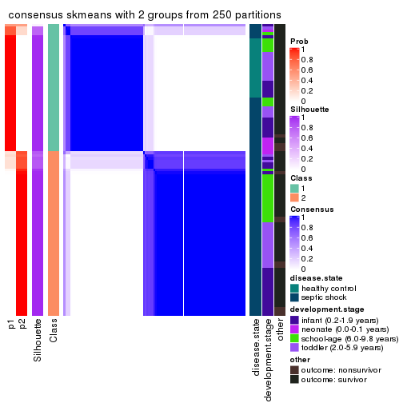</p>

</div>
<div id='tab-CV-skmeans-consensus-heatmap-2'>
<pre><code class="r">consensus_heatmap(res, k = 3)
</code></pre>

<p>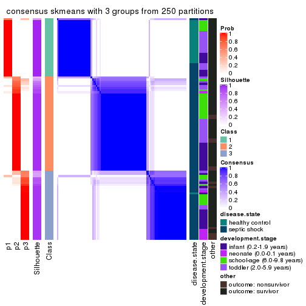</p>

</div>
<div id='tab-CV-skmeans-consensus-heatmap-3'>
<pre><code class="r">consensus_heatmap(res, k = 4)
</code></pre>

<p>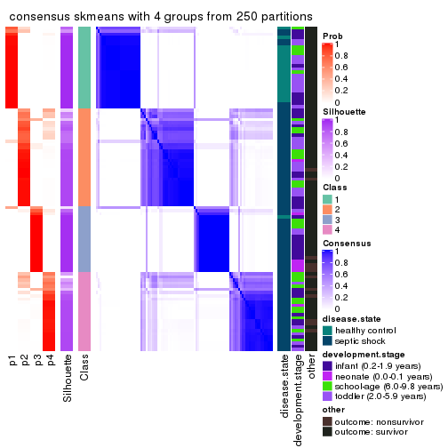</p>

</div>
<div id='tab-CV-skmeans-consensus-heatmap-4'>
<pre><code class="r">consensus_heatmap(res, k = 5)
</code></pre>

<p>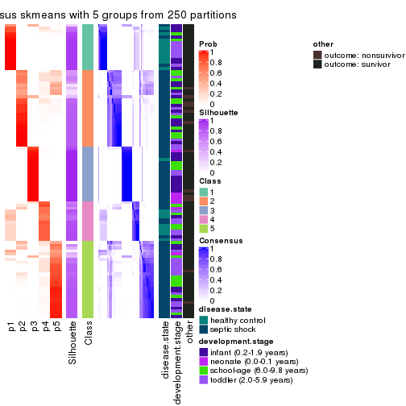</p>

</div>
<div id='tab-CV-skmeans-consensus-heatmap-5'>
<pre><code class="r">consensus_heatmap(res, k = 6)
</code></pre>

<p>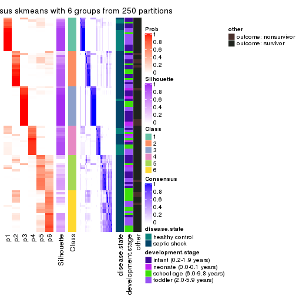</p>

</div>
</div>

Heatmaps for the membership of samples in all partitions to see how consistent they are:


<script>
$( function() {
	$( '#tabs-CV-skmeans-membership-heatmap' ).tabs();
} );
</script>
<div id='tabs-CV-skmeans-membership-heatmap'>
<ul>
<li><a href='#tab-CV-skmeans-membership-heatmap-1'>k = 2</a></li>
<li><a href='#tab-CV-skmeans-membership-heatmap-2'>k = 3</a></li>
<li><a href='#tab-CV-skmeans-membership-heatmap-3'>k = 4</a></li>
<li><a href='#tab-CV-skmeans-membership-heatmap-4'>k = 5</a></li>
<li><a href='#tab-CV-skmeans-membership-heatmap-5'>k = 6</a></li>
</ul>
<div id='tab-CV-skmeans-membership-heatmap-1'>
<pre><code class="r">membership_heatmap(res, k = 2)
</code></pre>

<p>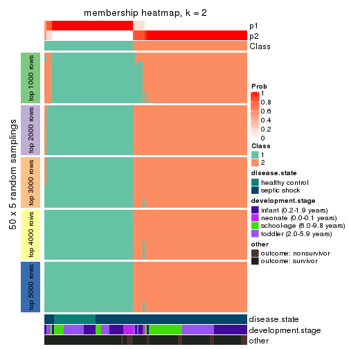</p>

</div>
<div id='tab-CV-skmeans-membership-heatmap-2'>
<pre><code class="r">membership_heatmap(res, k = 3)
</code></pre>

<p>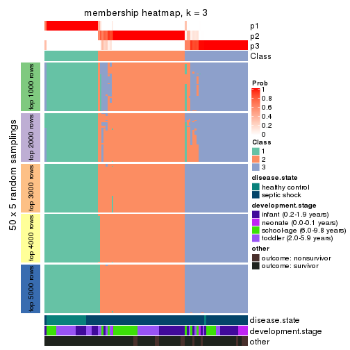</p>

</div>
<div id='tab-CV-skmeans-membership-heatmap-3'>
<pre><code class="r">membership_heatmap(res, k = 4)
</code></pre>

<p>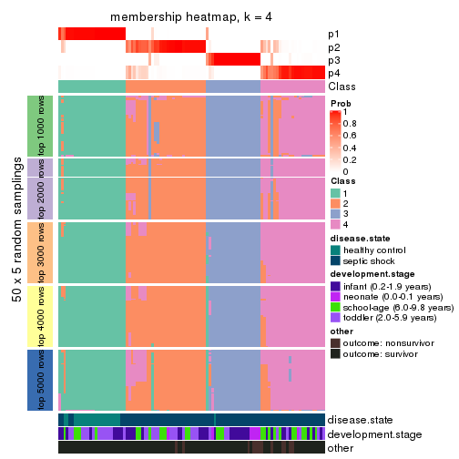</p>

</div>
<div id='tab-CV-skmeans-membership-heatmap-4'>
<pre><code class="r">membership_heatmap(res, k = 5)
</code></pre>

<p>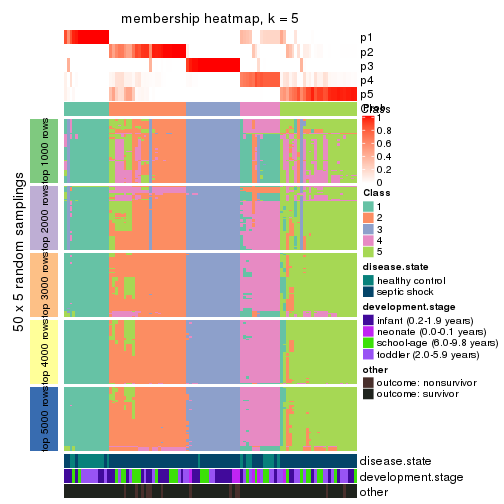</p>

</div>
<div id='tab-CV-skmeans-membership-heatmap-5'>
<pre><code class="r">membership_heatmap(res, k = 6)
</code></pre>

<p>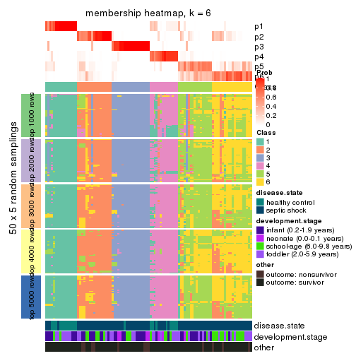</p>

</div>
</div>

As soon as we have had the classes for columns, we can look for signatures
which are significantly different between classes which can be candidate marks
for certain classes. Following are the heatmaps for signatures.


Signature heatmaps where rows are scaled:


<script>
$( function() {
	$( '#tabs-CV-skmeans-get-signatures' ).tabs();
} );
</script>
<div id='tabs-CV-skmeans-get-signatures'>
<ul>
<li><a href='#tab-CV-skmeans-get-signatures-1'>k = 2</a></li>
<li><a href='#tab-CV-skmeans-get-signatures-2'>k = 3</a></li>
<li><a href='#tab-CV-skmeans-get-signatures-3'>k = 4</a></li>
<li><a href='#tab-CV-skmeans-get-signatures-4'>k = 5</a></li>
<li><a href='#tab-CV-skmeans-get-signatures-5'>k = 6</a></li>
</ul>
<div id='tab-CV-skmeans-get-signatures-1'>
<pre><code class="r">get_signatures(res, k = 2)
</code></pre>

<p>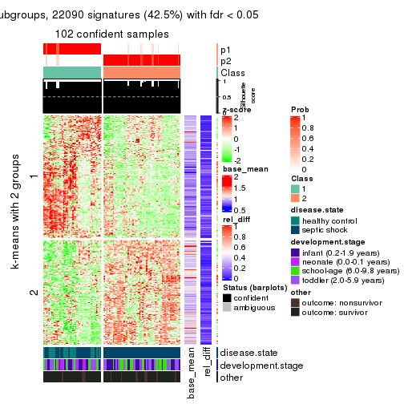</p>

</div>
<div id='tab-CV-skmeans-get-signatures-2'>
<pre><code class="r">get_signatures(res, k = 3)
</code></pre>

<p>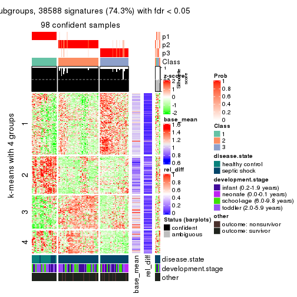</p>

</div>
<div id='tab-CV-skmeans-get-signatures-3'>
<pre><code class="r">get_signatures(res, k = 4)
</code></pre>

<p>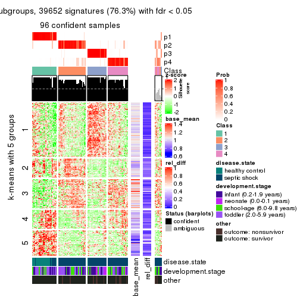</p>

</div>
<div id='tab-CV-skmeans-get-signatures-4'>
<pre><code class="r">get_signatures(res, k = 5)
</code></pre>

<p>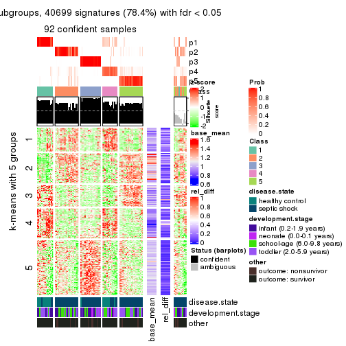</p>

</div>
<div id='tab-CV-skmeans-get-signatures-5'>
<pre><code class="r">get_signatures(res, k = 6)
</code></pre>

<p>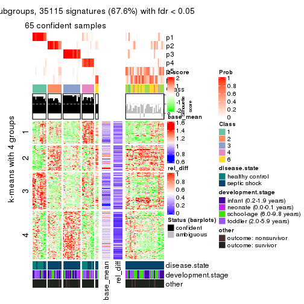</p>

</div>
</div>


Signature heatmaps where rows are not scaled:


<script>
$( function() {
	$( '#tabs-CV-skmeans-get-signatures-no-scale' ).tabs();
} );
</script>
<div id='tabs-CV-skmeans-get-signatures-no-scale'>
<ul>
<li><a href='#tab-CV-skmeans-get-signatures-no-scale-1'>k = 2</a></li>
<li><a href='#tab-CV-skmeans-get-signatures-no-scale-2'>k = 3</a></li>
<li><a href='#tab-CV-skmeans-get-signatures-no-scale-3'>k = 4</a></li>
<li><a href='#tab-CV-skmeans-get-signatures-no-scale-4'>k = 5</a></li>
<li><a href='#tab-CV-skmeans-get-signatures-no-scale-5'>k = 6</a></li>
</ul>
<div id='tab-CV-skmeans-get-signatures-no-scale-1'>
<pre><code class="r">get_signatures(res, k = 2, scale_rows = FALSE)
</code></pre>

<p>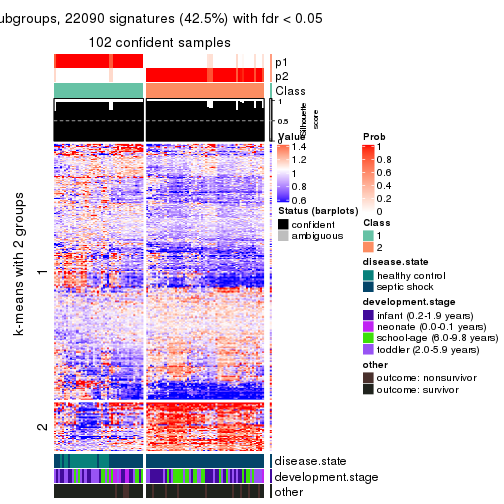</p>

</div>
<div id='tab-CV-skmeans-get-signatures-no-scale-2'>
<pre><code class="r">get_signatures(res, k = 3, scale_rows = FALSE)
</code></pre>

<p>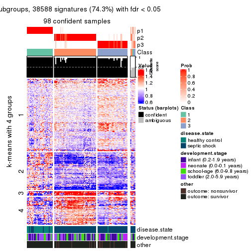</p>

</div>
<div id='tab-CV-skmeans-get-signatures-no-scale-3'>
<pre><code class="r">get_signatures(res, k = 4, scale_rows = FALSE)
</code></pre>

<p>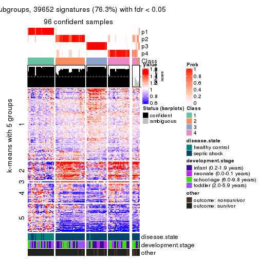</p>

</div>
<div id='tab-CV-skmeans-get-signatures-no-scale-4'>
<pre><code class="r">get_signatures(res, k = 5, scale_rows = FALSE)
</code></pre>

<p>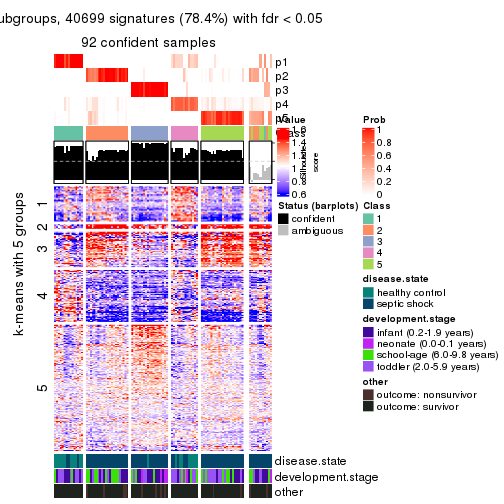</p>

</div>
<div id='tab-CV-skmeans-get-signatures-no-scale-5'>
<pre><code class="r">get_signatures(res, k = 6, scale_rows = FALSE)
</code></pre>

<p>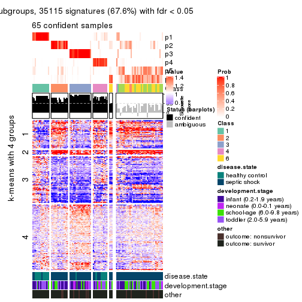</p>

</div>
</div>


Compare the overlap of signatures from different k:

```r
compare_signatures(res)
```

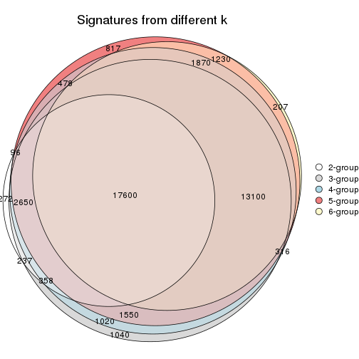

`get_signature()` returns a data frame invisibly. TO get the list of signatures, the function
call should be assigned to a variable explicitly. In following code, if `plot` argument is set
to `FALSE`, no heatmap is plotted while only the differential analysis is performed.

```r
# code only for demonstration
tb = get_signature(res, k = ..., plot = FALSE)
```

An example of the output of `tb` is:

```
#>   which_row         fdr    mean_1    mean_2 scaled_mean_1 scaled_mean_2 km
#> 1        38 0.042760348  8.373488  9.131774    -0.5533452     0.5164555  1
#> 2        40 0.018707592  7.106213  8.469186    -0.6173731     0.5762149  1
#> 3        55 0.019134737 10.221463 11.207825    -0.6159697     0.5749050  1
#> 4        59 0.006059896  5.921854  7.869574    -0.6899429     0.6439467  1
#> 5        60 0.018055526  8.928898 10.211722    -0.6204761     0.5791110  1
#> 6        98 0.009384629 15.714769 14.887706     0.6635654    -0.6193277  2
...
```

The columns in `tb` are:

1. `which_row`: row indices corresponding to the input matrix.
2. `fdr`: FDR for the differential test. 
3. `mean_x`: The mean value in group x.
4. `scaled_mean_x`: The mean value in group x after rows are scaled.
5. `km`: Row groups if k-means clustering is applied to rows.


UMAP plot which shows how samples are separated.


<script>
$( function() {
	$( '#tabs-CV-skmeans-dimension-reduction' ).tabs();
} );
</script>
<div id='tabs-CV-skmeans-dimension-reduction'>
<ul>
<li><a href='#tab-CV-skmeans-dimension-reduction-1'>k = 2</a></li>
<li><a href='#tab-CV-skmeans-dimension-reduction-2'>k = 3</a></li>
<li><a href='#tab-CV-skmeans-dimension-reduction-3'>k = 4</a></li>
<li><a href='#tab-CV-skmeans-dimension-reduction-4'>k = 5</a></li>
<li><a href='#tab-CV-skmeans-dimension-reduction-5'>k = 6</a></li>
</ul>
<div id='tab-CV-skmeans-dimension-reduction-1'>
<pre><code class="r">dimension_reduction(res, k = 2, method = &quot;UMAP&quot;)
</code></pre>

<p>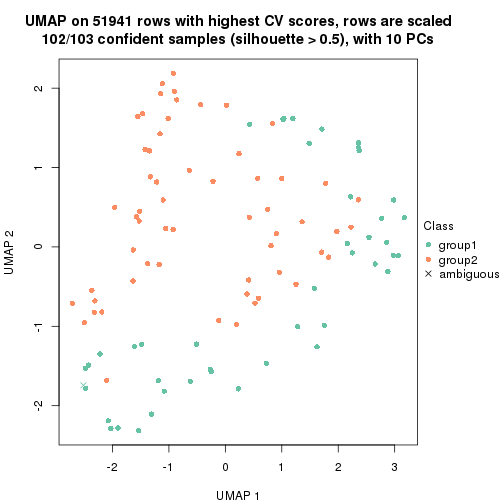</p>

</div>
<div id='tab-CV-skmeans-dimension-reduction-2'>
<pre><code class="r">dimension_reduction(res, k = 3, method = &quot;UMAP&quot;)
</code></pre>

<p>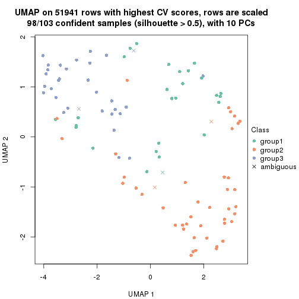</p>

</div>
<div id='tab-CV-skmeans-dimension-reduction-3'>
<pre><code class="r">dimension_reduction(res, k = 4, method = &quot;UMAP&quot;)
</code></pre>

<p>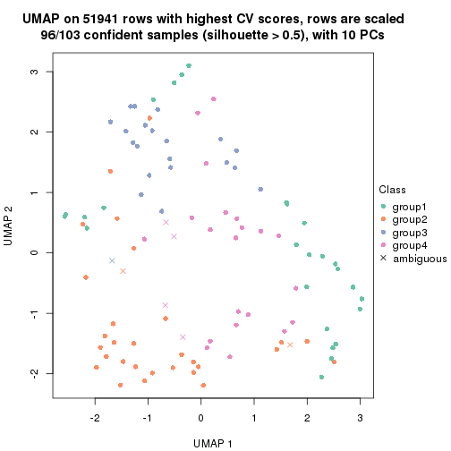</p>

</div>
<div id='tab-CV-skmeans-dimension-reduction-4'>
<pre><code class="r">dimension_reduction(res, k = 5, method = &quot;UMAP&quot;)
</code></pre>

<p>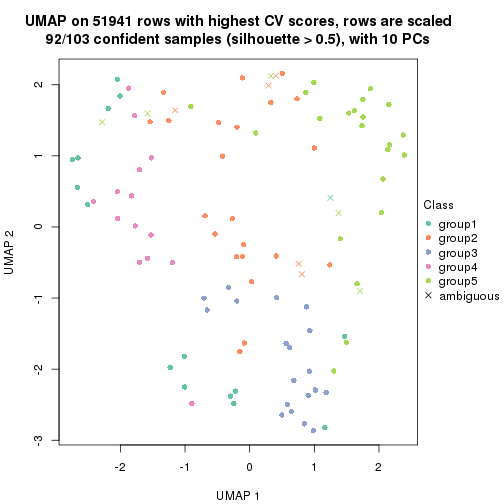</p>

</div>
<div id='tab-CV-skmeans-dimension-reduction-5'>
<pre><code class="r">dimension_reduction(res, k = 6, method = &quot;UMAP&quot;)
</code></pre>

<p>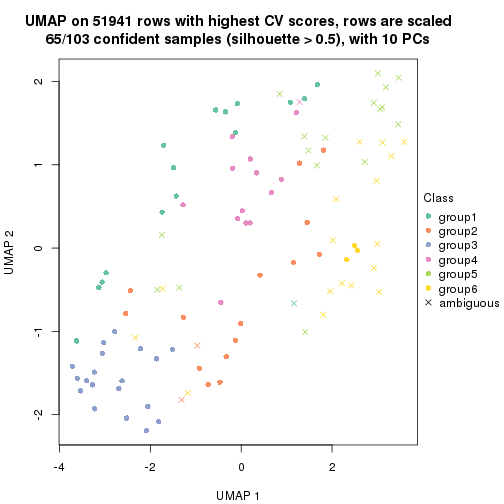</p>

</div>
</div>


Following heatmap shows how subgroups are split when increasing `k`:

```r
collect_classes(res)
```

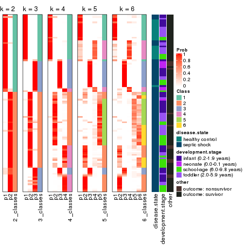


Test correlation between subgroups and known annotations. If the known
annotation is numeric, one-way ANOVA test is applied, and if the known
annotation is discrete, chi-squared contingency table test is applied.

```r
test_to_known_factors(res)
```

```
#>              n disease.state(p) development.stage(p) other(p) k
#> CV:skmeans 102         1.54e-08               0.0919   0.6747 2
#> CV:skmeans  98         8.30e-15               0.0127   0.0649 3
#> CV:skmeans  96         1.08e-13               0.0184   0.0702 4
#> CV:skmeans  92         6.59e-11               0.0313   0.1437 5
#> CV:skmeans  65         3.46e-07               0.3305   0.1276 6
```


If matrix rows can be associated to genes, consider to use `functional_enrichment(res,
...)` to perform function enrichment for the signature genes. See [this vignette](http://bioconductor.org/packages/devel/bioc/vignettes/cola/inst/doc/functional_enrichment.html) for more detailed explanations.


 

---------------------------------------------------


### CV:pam


The object with results only for a single top-value method and a single partition method 
can be extracted as:

```r
res = res_list["CV", "pam"]
# you can also extract it by
# res = res_list["CV:pam"]
```

A summary of `res` and all the functions that can be applied to it:

```r
res
```

```
#> A 'ConsensusPartition' object with k = 2, 3, 4, 5, 6.
#>   On a matrix with 51941 rows and 103 columns.
#>   Top rows (1000, 2000, 3000, 4000, 5000) are extracted by 'CV' method.
#>   Subgroups are detected by 'pam' method.
#>   Performed in total 1250 partitions by row resampling.
#>   Best k for subgroups seems to be 4.
#> 
#> Following methods can be applied to this 'ConsensusPartition' object:
#>  [1] "cola_report"             "collect_classes"         "collect_plots"          
#>  [4] "collect_stats"           "colnames"                "compare_signatures"     
#>  [7] "consensus_heatmap"       "dimension_reduction"     "functional_enrichment"  
#> [10] "get_anno_col"            "get_anno"                "get_classes"            
#> [13] "get_consensus"           "get_matrix"              "get_membership"         
#> [16] "get_param"               "get_signatures"          "get_stats"              
#> [19] "is_best_k"               "is_stable_k"             "membership_heatmap"     
#> [22] "ncol"                    "nrow"                    "plot_ecdf"              
#> [25] "rownames"                "select_partition_number" "show"                   
#> [28] "suggest_best_k"          "test_to_known_factors"
```

`collect_plots()` function collects all the plots made from `res` for all `k` (number of partitions)
into one single page to provide an easy and fast comparison between different `k`.

```r
collect_plots(res)
```

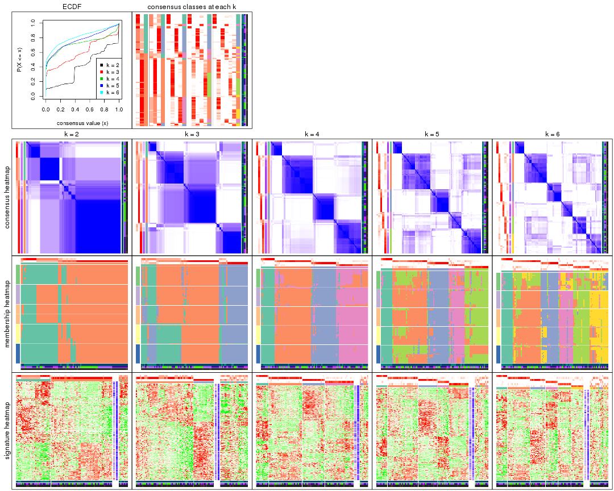

The plots are:

- The first row: a plot of the ECDF (empirical cumulative distribution
  function) curves of the consensus matrix for each `k` and the heatmap of
  predicted classes for each `k`.
- The second row: heatmaps of the consensus matrix for each `k`.
- The third row: heatmaps of the membership matrix for each `k`.
- The fouth row: heatmaps of the signatures for each `k`.

All the plots in panels can be made by individual functions and they are
plotted later in this section.

`select_partition_number()` produces several plots showing different
statistics for choosing "optimized" `k`. There are following statistics:

- ECDF curves of the consensus matrix for each `k`;
- 1-PAC. [The PAC
  score](https://en.wikipedia.org/wiki/Consensus_clustering#Over-interpretation_potential_of_consensus_clustering)
  measures the proportion of the ambiguous subgrouping.
- Mean silhouette score.
- Concordance. The mean probability of fiting the consensus class ids in all
  partitions.
- Area increased. Denote $A_k$ as the area under the ECDF curve for current
  `k`, the area increased is defined as $A_k - A_{k-1}$.
- Rand index. The percent of pairs of samples that are both in a same cluster
  or both are not in a same cluster in the partition of k and k-1.
- Jaccard index. The ratio of pairs of samples are both in a same cluster in
  the partition of k and k-1 and the pairs of samples are both in a same
  cluster in the partition k or k-1.

The detailed explanations of these statistics can be found in [the _cola_
vignette](http://bioconductor.org/packages/devel/bioc/vignettes/cola/inst/doc/cola.html#toc_13).

Generally speaking, lower PAC score, higher mean silhouette score or higher
concordance corresponds to better partition. Rand index and Jaccard index
measure how similar the current partition is compared to partition with `k-1`.
If they are too similar, we won't accept `k` is better than `k-1`.

```r
select_partition_number(res)
```

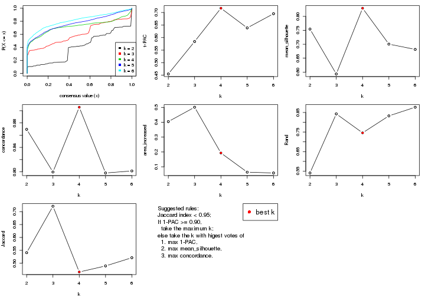

The numeric values for all these statistics can be obtained by `get_stats()`.

```r
get_stats(res)
```

```
#>   k 1-PAC mean_silhouette concordance area_increased  Rand Jaccard
#> 2 2 0.455           0.754       0.870         0.4045 0.541   0.541
#> 3 3 0.584           0.593       0.800         0.5012 0.843   0.721
#> 4 4 0.717           0.829       0.906         0.1930 0.746   0.466
#> 5 5 0.639           0.701       0.798         0.0639 0.833   0.490
#> 6 6 0.695           0.681       0.801         0.0585 0.877   0.521
```

`suggest_best_k()` suggests the best $k$ based on these statistics. The rules are as follows:

- All $k$ with Jaccard index larger than 0.95 are removed because increasing
  $k$ does not provide enough extra information. If all $k$ are removed, it is
  marked as no subgroup is detected.
- For all $k$ with 1-PAC score larger than 0.9, the maximal $k$ is taken as
  the best $k$, and other $k$ are marked as optional $k$.
- If it does not fit the second rule. The $k$ with the maximal vote of the
  highest 1-PAC score, highest mean silhouette, and highest concordance is
  taken as the best $k$.

```r
suggest_best_k(res)
```

```
#> [1] 4
```


Following shows the table of the partitions (You need to click the **show/hide
code output** link to see it). The membership matrix (columns with name `p*`)
is inferred by
[`clue::cl_consensus()`](https://www.rdocumentation.org/link/cl_consensus?package=clue)
function with the `SE` method. Basically the value in the membership matrix
represents the probability to belong to a certain group. The finall class
label for an item is determined with the group with highest probability it
belongs to.

In `get_classes()` function, the entropy is calculated from the membership
matrix and the silhouette score is calculated from the consensus matrix.


<script>
$( function() {
	$( '#tabs-CV-pam-get-classes' ).tabs();
} );
</script>
<div id='tabs-CV-pam-get-classes'>
<ul>
<li><a href='#tab-CV-pam-get-classes-1'>k = 2</a></li>
<li><a href='#tab-CV-pam-get-classes-2'>k = 3</a></li>
<li><a href='#tab-CV-pam-get-classes-3'>k = 4</a></li>
<li><a href='#tab-CV-pam-get-classes-4'>k = 5</a></li>
<li><a href='#tab-CV-pam-get-classes-5'>k = 6</a></li>
</ul>

<div id='tab-CV-pam-get-classes-1'>
<p><a id='tab-CV-pam-get-classes-1-a' style='color:#0366d6' href='#'>show/hide code output</a></p>
<pre><code class="r">cbind(get_classes(res, k = 2), get_membership(res, k = 2))
</code></pre>

<pre><code>#&gt;           class entropy silhouette    p1    p2
#&gt; GSM647569     1  0.9635      0.697 0.612 0.388
#&gt; GSM647574     1  0.9635      0.697 0.612 0.388
#&gt; GSM647577     1  0.9635      0.697 0.612 0.388
#&gt; GSM647547     1  0.9635      0.697 0.612 0.388
#&gt; GSM647552     2  0.6438      0.685 0.164 0.836
#&gt; GSM647553     1  0.9635      0.697 0.612 0.388
#&gt; GSM647565     2  0.8081      0.486 0.248 0.752
#&gt; GSM647545     2  0.0000      0.902 0.000 1.000
#&gt; GSM647549     2  0.0000      0.902 0.000 1.000
#&gt; GSM647550     2  0.7139      0.625 0.196 0.804
#&gt; GSM647560     2  0.0672      0.895 0.008 0.992
#&gt; GSM647617     1  0.9635      0.697 0.612 0.388
#&gt; GSM647528     2  0.0000      0.902 0.000 1.000
#&gt; GSM647529     2  0.9635      0.298 0.388 0.612
#&gt; GSM647531     2  0.0000      0.902 0.000 1.000
#&gt; GSM647540     2  0.9460      0.106 0.364 0.636
#&gt; GSM647541     2  0.0000      0.902 0.000 1.000
#&gt; GSM647546     1  0.9635      0.697 0.612 0.388
#&gt; GSM647557     2  0.0000      0.902 0.000 1.000
#&gt; GSM647561     2  0.0000      0.902 0.000 1.000
#&gt; GSM647567     1  0.9635      0.697 0.612 0.388
#&gt; GSM647568     2  0.7453      0.579 0.212 0.788
#&gt; GSM647570     2  0.0000      0.902 0.000 1.000
#&gt; GSM647573     2  0.8144      0.480 0.252 0.748
#&gt; GSM647576     1  0.9635      0.697 0.612 0.388
#&gt; GSM647579     1  0.9635      0.697 0.612 0.388
#&gt; GSM647580     1  0.9635      0.697 0.612 0.388
#&gt; GSM647583     1  0.9635      0.697 0.612 0.388
#&gt; GSM647592     2  0.0000      0.902 0.000 1.000
#&gt; GSM647593     2  0.0000      0.902 0.000 1.000
#&gt; GSM647595     2  0.0000      0.902 0.000 1.000
#&gt; GSM647597     2  0.9608      0.305 0.384 0.616
#&gt; GSM647598     2  0.0000      0.902 0.000 1.000
#&gt; GSM647613     2  0.0000      0.902 0.000 1.000
#&gt; GSM647615     2  0.0000      0.902 0.000 1.000
#&gt; GSM647616     1  0.9635      0.697 0.612 0.388
#&gt; GSM647619     2  0.0000      0.902 0.000 1.000
#&gt; GSM647582     2  0.0000      0.902 0.000 1.000
#&gt; GSM647591     2  0.0000      0.902 0.000 1.000
#&gt; GSM647527     2  0.0000      0.902 0.000 1.000
#&gt; GSM647530     2  0.0000      0.902 0.000 1.000
#&gt; GSM647532     1  0.9580      0.365 0.620 0.380
#&gt; GSM647544     2  0.0000      0.902 0.000 1.000
#&gt; GSM647551     2  0.0000      0.902 0.000 1.000
#&gt; GSM647556     1  0.9635      0.697 0.612 0.388
#&gt; GSM647558     2  0.0000      0.902 0.000 1.000
#&gt; GSM647572     1  0.9635      0.697 0.612 0.388
#&gt; GSM647578     2  0.7219      0.617 0.200 0.800
#&gt; GSM647581     2  0.0000      0.902 0.000 1.000
#&gt; GSM647594     2  0.0000      0.902 0.000 1.000
#&gt; GSM647599     1  0.5408      0.677 0.876 0.124
#&gt; GSM647600     2  0.6438      0.685 0.164 0.836
#&gt; GSM647601     2  0.0000      0.902 0.000 1.000
#&gt; GSM647603     2  0.0376      0.899 0.004 0.996
#&gt; GSM647610     2  0.4161      0.811 0.084 0.916
#&gt; GSM647611     2  0.0000      0.902 0.000 1.000
#&gt; GSM647612     2  0.0000      0.902 0.000 1.000
#&gt; GSM647614     2  0.0000      0.902 0.000 1.000
#&gt; GSM647618     2  0.0000      0.902 0.000 1.000
#&gt; GSM647629     2  0.6623      0.674 0.172 0.828
#&gt; GSM647535     2  0.0000      0.902 0.000 1.000
#&gt; GSM647563     2  0.0000      0.902 0.000 1.000
#&gt; GSM647542     2  0.0000      0.902 0.000 1.000
#&gt; GSM647543     2  0.7219      0.607 0.200 0.800
#&gt; GSM647548     2  0.0376      0.899 0.004 0.996
#&gt; GSM647554     2  0.7056      0.634 0.192 0.808
#&gt; GSM647555     2  0.0000      0.902 0.000 1.000
#&gt; GSM647559     2  0.0000      0.902 0.000 1.000
#&gt; GSM647562     2  0.0000      0.902 0.000 1.000
#&gt; GSM647564     1  0.9635      0.697 0.612 0.388
#&gt; GSM647571     2  0.0000      0.902 0.000 1.000
#&gt; GSM647584     2  0.0000      0.902 0.000 1.000
#&gt; GSM647585     1  0.9635      0.697 0.612 0.388
#&gt; GSM647586     2  0.0000      0.902 0.000 1.000
#&gt; GSM647587     2  0.0000      0.902 0.000 1.000
#&gt; GSM647588     2  0.0000      0.902 0.000 1.000
#&gt; GSM647596     2  0.0000      0.902 0.000 1.000
#&gt; GSM647602     1  0.9635      0.697 0.612 0.388
#&gt; GSM647609     2  0.0000      0.902 0.000 1.000
#&gt; GSM647620     2  0.0000      0.902 0.000 1.000
#&gt; GSM647627     2  0.0000      0.902 0.000 1.000
#&gt; GSM647628     2  0.0000      0.902 0.000 1.000
#&gt; GSM647533     1  0.0000      0.664 1.000 0.000
#&gt; GSM647536     2  0.9635      0.298 0.388 0.612
#&gt; GSM647537     1  0.0000      0.664 1.000 0.000
#&gt; GSM647606     1  0.0000      0.664 1.000 0.000
#&gt; GSM647621     1  0.0000      0.664 1.000 0.000
#&gt; GSM647626     1  0.9635      0.697 0.612 0.388
#&gt; GSM647538     1  0.0000      0.664 1.000 0.000
#&gt; GSM647575     2  0.6712      0.661 0.176 0.824
#&gt; GSM647590     1  0.2948      0.647 0.948 0.052
#&gt; GSM647605     1  0.0376      0.663 0.996 0.004
#&gt; GSM647607     1  0.9460      0.273 0.636 0.364
#&gt; GSM647608     1  0.9635      0.697 0.612 0.388
#&gt; GSM647622     1  0.0000      0.664 1.000 0.000
#&gt; GSM647623     1  0.0000      0.664 1.000 0.000
#&gt; GSM647624     1  0.0000      0.664 1.000 0.000
#&gt; GSM647625     1  0.0000      0.664 1.000 0.000
#&gt; GSM647534     2  0.6712      0.673 0.176 0.824
#&gt; GSM647539     2  0.0000      0.902 0.000 1.000
#&gt; GSM647566     2  0.8909      0.421 0.308 0.692
#&gt; GSM647589     1  0.9635      0.697 0.612 0.388
#&gt; GSM647604     1  0.4161      0.630 0.916 0.084
</code></pre>

<script>
$('#tab-CV-pam-get-classes-1-a').parent().next().next().hide();
$('#tab-CV-pam-get-classes-1-a').click(function(){
  $('#tab-CV-pam-get-classes-1-a').parent().next().next().toggle();
  return(false);
});
</script>
</div>

<div id='tab-CV-pam-get-classes-2'>
<p><a id='tab-CV-pam-get-classes-2-a' style='color:#0366d6' href='#'>show/hide code output</a></p>
<pre><code class="r">cbind(get_classes(res, k = 3), get_membership(res, k = 3))
</code></pre>

<pre><code>#&gt;           class entropy silhouette    p1    p2    p3
#&gt; GSM647569     3  0.0000      0.813 0.000 0.000 1.000
#&gt; GSM647574     3  0.0000      0.813 0.000 0.000 1.000
#&gt; GSM647577     3  0.0000      0.813 0.000 0.000 1.000
#&gt; GSM647547     3  0.6111      0.178 0.396 0.000 0.604
#&gt; GSM647552     3  0.6302     -0.103 0.000 0.480 0.520
#&gt; GSM647553     3  0.0000      0.813 0.000 0.000 1.000
#&gt; GSM647565     1  0.9786     -0.188 0.400 0.364 0.236
#&gt; GSM647545     2  0.6126      0.605 0.400 0.600 0.000
#&gt; GSM647549     2  0.6126      0.605 0.400 0.600 0.000
#&gt; GSM647550     1  0.9863     -0.166 0.400 0.340 0.260
#&gt; GSM647560     2  0.8693      0.497 0.232 0.592 0.176
#&gt; GSM647617     3  0.0000      0.813 0.000 0.000 1.000
#&gt; GSM647528     2  0.0000      0.756 0.000 1.000 0.000
#&gt; GSM647529     2  0.4842      0.504 0.224 0.776 0.000
#&gt; GSM647531     2  0.0000      0.756 0.000 1.000 0.000
#&gt; GSM647540     3  0.0000      0.813 0.000 0.000 1.000
#&gt; GSM647541     2  0.6111      0.608 0.396 0.604 0.000
#&gt; GSM647546     3  0.0237      0.809 0.004 0.000 0.996
#&gt; GSM647557     2  0.0424      0.755 0.008 0.992 0.000
#&gt; GSM647561     2  0.0424      0.755 0.008 0.992 0.000
#&gt; GSM647567     3  0.0592      0.796 0.000 0.012 0.988
#&gt; GSM647568     2  0.9217      0.343 0.400 0.448 0.152
#&gt; GSM647570     2  0.6126      0.605 0.400 0.600 0.000
#&gt; GSM647573     1  0.9315      0.183 0.520 0.220 0.260
#&gt; GSM647576     3  0.0237      0.809 0.004 0.000 0.996
#&gt; GSM647579     3  0.0000      0.813 0.000 0.000 1.000
#&gt; GSM647580     3  0.0000      0.813 0.000 0.000 1.000
#&gt; GSM647583     3  0.0000      0.813 0.000 0.000 1.000
#&gt; GSM647592     2  0.0000      0.756 0.000 1.000 0.000
#&gt; GSM647593     2  0.0000      0.756 0.000 1.000 0.000
#&gt; GSM647595     2  0.0000      0.756 0.000 1.000 0.000
#&gt; GSM647597     2  0.1411      0.729 0.036 0.964 0.000
#&gt; GSM647598     2  0.0000      0.756 0.000 1.000 0.000
#&gt; GSM647613     2  0.6026      0.617 0.376 0.624 0.000
#&gt; GSM647615     2  0.7156      0.575 0.400 0.572 0.028
#&gt; GSM647616     3  0.0000      0.813 0.000 0.000 1.000
#&gt; GSM647619     2  0.0000      0.756 0.000 1.000 0.000
#&gt; GSM647582     2  0.0000      0.756 0.000 1.000 0.000
#&gt; GSM647591     2  0.0000      0.756 0.000 1.000 0.000
#&gt; GSM647527     2  0.0000      0.756 0.000 1.000 0.000
#&gt; GSM647530     2  0.6111      0.608 0.396 0.604 0.000
#&gt; GSM647532     1  0.8624      0.137 0.596 0.240 0.164
#&gt; GSM647544     2  0.6111      0.608 0.396 0.604 0.000
#&gt; GSM647551     2  0.0000      0.756 0.000 1.000 0.000
#&gt; GSM647556     3  0.0000      0.813 0.000 0.000 1.000
#&gt; GSM647558     2  0.6661      0.595 0.400 0.588 0.012
#&gt; GSM647572     3  0.0237      0.809 0.004 0.000 0.996
#&gt; GSM647578     3  0.7940      0.186 0.332 0.076 0.592
#&gt; GSM647581     2  0.6126      0.605 0.400 0.600 0.000
#&gt; GSM647594     2  0.0000      0.756 0.000 1.000 0.000
#&gt; GSM647599     3  0.5591      0.344 0.304 0.000 0.696
#&gt; GSM647600     2  0.0237      0.753 0.000 0.996 0.004
#&gt; GSM647601     2  0.0000      0.756 0.000 1.000 0.000
#&gt; GSM647603     2  0.0237      0.753 0.000 0.996 0.004
#&gt; GSM647610     2  0.2796      0.670 0.000 0.908 0.092
#&gt; GSM647611     2  0.0000      0.756 0.000 1.000 0.000
#&gt; GSM647612     2  0.9293      0.324 0.400 0.440 0.160
#&gt; GSM647614     2  0.6513      0.599 0.400 0.592 0.008
#&gt; GSM647618     2  0.0000      0.756 0.000 1.000 0.000
#&gt; GSM647629     2  0.4291      0.549 0.000 0.820 0.180
#&gt; GSM647535     2  0.0000      0.756 0.000 1.000 0.000
#&gt; GSM647563     2  0.6111      0.608 0.396 0.604 0.000
#&gt; GSM647542     2  0.6661      0.595 0.400 0.588 0.012
#&gt; GSM647543     2  0.6661      0.595 0.400 0.588 0.012
#&gt; GSM647548     2  0.6661      0.595 0.400 0.588 0.012
#&gt; GSM647554     2  0.5254      0.405 0.000 0.736 0.264
#&gt; GSM647555     2  0.6661      0.595 0.400 0.588 0.012
#&gt; GSM647559     2  0.0592      0.754 0.012 0.988 0.000
#&gt; GSM647562     2  0.6111      0.608 0.396 0.604 0.000
#&gt; GSM647564     3  0.0000      0.813 0.000 0.000 1.000
#&gt; GSM647571     2  0.6661      0.595 0.400 0.588 0.012
#&gt; GSM647584     2  0.0000      0.756 0.000 1.000 0.000
#&gt; GSM647585     3  0.0000      0.813 0.000 0.000 1.000
#&gt; GSM647586     2  0.0000      0.756 0.000 1.000 0.000
#&gt; GSM647587     2  0.0000      0.756 0.000 1.000 0.000
#&gt; GSM647588     2  0.0000      0.756 0.000 1.000 0.000
#&gt; GSM647596     2  0.0000      0.756 0.000 1.000 0.000
#&gt; GSM647602     3  0.0000      0.813 0.000 0.000 1.000
#&gt; GSM647609     2  0.0000      0.756 0.000 1.000 0.000
#&gt; GSM647620     2  0.0000      0.756 0.000 1.000 0.000
#&gt; GSM647627     2  0.0000      0.756 0.000 1.000 0.000
#&gt; GSM647628     2  0.6126      0.605 0.400 0.600 0.000
#&gt; GSM647533     3  0.5621      0.346 0.308 0.000 0.692
#&gt; GSM647536     2  0.4589      0.577 0.172 0.820 0.008
#&gt; GSM647537     3  0.5560      0.361 0.300 0.000 0.700
#&gt; GSM647606     1  0.6126      0.323 0.600 0.000 0.400
#&gt; GSM647621     3  0.5650      0.326 0.312 0.000 0.688
#&gt; GSM647626     3  0.0000      0.813 0.000 0.000 1.000
#&gt; GSM647538     1  0.6126      0.323 0.600 0.000 0.400
#&gt; GSM647575     2  0.6937      0.582 0.404 0.576 0.020
#&gt; GSM647590     1  0.6095      0.326 0.608 0.000 0.392
#&gt; GSM647605     1  0.8631      0.340 0.600 0.180 0.220
#&gt; GSM647607     1  0.6053      0.227 0.720 0.020 0.260
#&gt; GSM647608     3  0.0000      0.813 0.000 0.000 1.000
#&gt; GSM647622     1  0.6126      0.323 0.600 0.000 0.400
#&gt; GSM647623     1  0.6126      0.323 0.600 0.000 0.400
#&gt; GSM647624     1  0.6111      0.324 0.604 0.000 0.396
#&gt; GSM647625     1  0.6126      0.323 0.600 0.000 0.400
#&gt; GSM647534     2  0.5656      0.544 0.068 0.804 0.128
#&gt; GSM647539     2  0.6661      0.595 0.400 0.588 0.012
#&gt; GSM647566     1  0.7634      0.274 0.668 0.100 0.232
#&gt; GSM647589     3  0.6111      0.178 0.396 0.000 0.604
#&gt; GSM647604     1  0.8643      0.335 0.600 0.212 0.188
</code></pre>

<script>
$('#tab-CV-pam-get-classes-2-a').parent().next().next().hide();
$('#tab-CV-pam-get-classes-2-a').click(function(){
  $('#tab-CV-pam-get-classes-2-a').parent().next().next().toggle();
  return(false);
});
</script>
</div>

<div id='tab-CV-pam-get-classes-3'>
<p><a id='tab-CV-pam-get-classes-3-a' style='color:#0366d6' href='#'>show/hide code output</a></p>
<pre><code class="r">cbind(get_classes(res, k = 4), get_membership(res, k = 4))
</code></pre>

<pre><code>#&gt;           class entropy silhouette    p1    p2    p3    p4
#&gt; GSM647569     3  0.0000     0.9270 0.000 0.000 1.000 0.000
#&gt; GSM647574     3  0.0000     0.9270 0.000 0.000 1.000 0.000
#&gt; GSM647577     3  0.0000     0.9270 0.000 0.000 1.000 0.000
#&gt; GSM647547     4  0.4996    -0.0174 0.000 0.000 0.484 0.516
#&gt; GSM647552     2  0.6338     0.5607 0.000 0.644 0.236 0.120
#&gt; GSM647553     3  0.0469     0.9206 0.000 0.000 0.988 0.012
#&gt; GSM647565     4  0.0336     0.8336 0.000 0.000 0.008 0.992
#&gt; GSM647545     4  0.0921     0.8502 0.000 0.028 0.000 0.972
#&gt; GSM647549     4  0.1118     0.8507 0.000 0.036 0.000 0.964
#&gt; GSM647550     4  0.3958     0.7642 0.000 0.024 0.160 0.816
#&gt; GSM647560     4  0.3649     0.8133 0.000 0.204 0.000 0.796
#&gt; GSM647617     3  0.0000     0.9270 0.000 0.000 1.000 0.000
#&gt; GSM647528     2  0.1022     0.9160 0.000 0.968 0.000 0.032
#&gt; GSM647529     1  0.5436     0.4644 0.620 0.356 0.000 0.024
#&gt; GSM647531     2  0.3444     0.8028 0.000 0.816 0.000 0.184
#&gt; GSM647540     3  0.0524     0.9212 0.000 0.004 0.988 0.008
#&gt; GSM647541     4  0.3356     0.8347 0.000 0.176 0.000 0.824
#&gt; GSM647546     3  0.0000     0.9270 0.000 0.000 1.000 0.000
#&gt; GSM647557     2  0.4992     0.2213 0.000 0.524 0.000 0.476
#&gt; GSM647561     2  0.4933     0.3460 0.000 0.568 0.000 0.432
#&gt; GSM647567     3  0.2799     0.8139 0.000 0.108 0.884 0.008
#&gt; GSM647568     4  0.0921     0.8502 0.000 0.028 0.000 0.972
#&gt; GSM647570     4  0.2408     0.8552 0.000 0.104 0.000 0.896
#&gt; GSM647573     4  0.0469     0.8312 0.000 0.000 0.012 0.988
#&gt; GSM647576     3  0.1118     0.9064 0.000 0.000 0.964 0.036
#&gt; GSM647579     3  0.0524     0.9212 0.000 0.004 0.988 0.008
#&gt; GSM647580     3  0.0000     0.9270 0.000 0.000 1.000 0.000
#&gt; GSM647583     3  0.0000     0.9270 0.000 0.000 1.000 0.000
#&gt; GSM647592     2  0.0000     0.9115 0.000 1.000 0.000 0.000
#&gt; GSM647593     2  0.0000     0.9115 0.000 1.000 0.000 0.000
#&gt; GSM647595     2  0.0000     0.9115 0.000 1.000 0.000 0.000
#&gt; GSM647597     2  0.0000     0.9115 0.000 1.000 0.000 0.000
#&gt; GSM647598     2  0.0817     0.9179 0.000 0.976 0.000 0.024
#&gt; GSM647613     4  0.3649     0.8002 0.000 0.204 0.000 0.796
#&gt; GSM647615     4  0.1211     0.8525 0.000 0.040 0.000 0.960
#&gt; GSM647616     3  0.0000     0.9270 0.000 0.000 1.000 0.000
#&gt; GSM647619     2  0.0000     0.9115 0.000 1.000 0.000 0.000
#&gt; GSM647582     2  0.1022     0.9160 0.000 0.968 0.000 0.032
#&gt; GSM647591     2  0.2281     0.8490 0.000 0.904 0.000 0.096
#&gt; GSM647527     2  0.1022     0.9160 0.000 0.968 0.000 0.032
#&gt; GSM647530     4  0.0707     0.8458 0.000 0.020 0.000 0.980
#&gt; GSM647532     4  0.6683     0.4240 0.072 0.024 0.276 0.628
#&gt; GSM647544     4  0.3444     0.8311 0.000 0.184 0.000 0.816
#&gt; GSM647551     2  0.2530     0.8537 0.000 0.888 0.000 0.112
#&gt; GSM647556     3  0.0000     0.9270 0.000 0.000 1.000 0.000
#&gt; GSM647558     4  0.1022     0.8508 0.000 0.032 0.000 0.968
#&gt; GSM647572     3  0.0000     0.9270 0.000 0.000 1.000 0.000
#&gt; GSM647578     3  0.7188     0.3938 0.000 0.292 0.536 0.172
#&gt; GSM647581     4  0.1022     0.8500 0.000 0.032 0.000 0.968
#&gt; GSM647594     2  0.1716     0.8771 0.000 0.936 0.000 0.064
#&gt; GSM647599     3  0.6637     0.4685 0.144 0.240 0.616 0.000
#&gt; GSM647600     2  0.1004     0.9147 0.000 0.972 0.004 0.024
#&gt; GSM647601     2  0.0817     0.9179 0.000 0.976 0.000 0.024
#&gt; GSM647603     2  0.1488     0.9130 0.000 0.956 0.012 0.032
#&gt; GSM647610     2  0.0672     0.9055 0.000 0.984 0.008 0.008
#&gt; GSM647611     2  0.0817     0.9179 0.000 0.976 0.000 0.024
#&gt; GSM647612     4  0.2868     0.8489 0.000 0.136 0.000 0.864
#&gt; GSM647614     4  0.2973     0.8480 0.000 0.144 0.000 0.856
#&gt; GSM647618     2  0.0336     0.9127 0.000 0.992 0.000 0.008
#&gt; GSM647629     2  0.1411     0.9085 0.000 0.960 0.020 0.020
#&gt; GSM647535     2  0.0817     0.9179 0.000 0.976 0.000 0.024
#&gt; GSM647563     4  0.3444     0.8311 0.000 0.184 0.000 0.816
#&gt; GSM647542     4  0.3123     0.8450 0.000 0.156 0.000 0.844
#&gt; GSM647543     4  0.0921     0.8502 0.000 0.028 0.000 0.972
#&gt; GSM647548     4  0.0336     0.8393 0.000 0.008 0.000 0.992
#&gt; GSM647554     2  0.4776     0.6089 0.000 0.712 0.272 0.016
#&gt; GSM647555     4  0.3356     0.8332 0.000 0.176 0.000 0.824
#&gt; GSM647559     2  0.2814     0.8237 0.000 0.868 0.000 0.132
#&gt; GSM647562     4  0.3074     0.8469 0.000 0.152 0.000 0.848
#&gt; GSM647564     3  0.0000     0.9270 0.000 0.000 1.000 0.000
#&gt; GSM647571     4  0.3444     0.8311 0.000 0.184 0.000 0.816
#&gt; GSM647584     2  0.0817     0.9179 0.000 0.976 0.000 0.024
#&gt; GSM647585     3  0.0000     0.9270 0.000 0.000 1.000 0.000
#&gt; GSM647586     2  0.1022     0.9160 0.000 0.968 0.000 0.032
#&gt; GSM647587     2  0.1022     0.9160 0.000 0.968 0.000 0.032
#&gt; GSM647588     2  0.2704     0.8574 0.000 0.876 0.000 0.124
#&gt; GSM647596     2  0.0817     0.9179 0.000 0.976 0.000 0.024
#&gt; GSM647602     3  0.0000     0.9270 0.000 0.000 1.000 0.000
#&gt; GSM647609     2  0.0817     0.9179 0.000 0.976 0.000 0.024
#&gt; GSM647620     2  0.0817     0.9179 0.000 0.976 0.000 0.024
#&gt; GSM647627     2  0.0817     0.9179 0.000 0.976 0.000 0.024
#&gt; GSM647628     4  0.3610     0.8186 0.000 0.200 0.000 0.800
#&gt; GSM647533     1  0.2921     0.8139 0.860 0.000 0.140 0.000
#&gt; GSM647536     1  0.5159     0.7657 0.756 0.088 0.000 0.156
#&gt; GSM647537     1  0.2973     0.8096 0.856 0.000 0.144 0.000
#&gt; GSM647606     1  0.0000     0.9202 1.000 0.000 0.000 0.000
#&gt; GSM647621     3  0.3913     0.7720 0.148 0.000 0.824 0.028
#&gt; GSM647626     3  0.0000     0.9270 0.000 0.000 1.000 0.000
#&gt; GSM647538     1  0.0188     0.9191 0.996 0.004 0.000 0.000
#&gt; GSM647575     4  0.2921     0.8433 0.000 0.140 0.000 0.860
#&gt; GSM647590     1  0.0469     0.9154 0.988 0.000 0.000 0.012
#&gt; GSM647605     1  0.0000     0.9202 1.000 0.000 0.000 0.000
#&gt; GSM647607     4  0.3730     0.7560 0.144 0.004 0.016 0.836
#&gt; GSM647608     3  0.1211     0.9037 0.000 0.000 0.960 0.040
#&gt; GSM647622     1  0.0000     0.9202 1.000 0.000 0.000 0.000
#&gt; GSM647623     1  0.0469     0.9145 0.988 0.000 0.012 0.000
#&gt; GSM647624     1  0.0000     0.9202 1.000 0.000 0.000 0.000
#&gt; GSM647625     1  0.0000     0.9202 1.000 0.000 0.000 0.000
#&gt; GSM647534     2  0.1114     0.8967 0.004 0.972 0.016 0.008
#&gt; GSM647539     4  0.0000     0.8367 0.000 0.000 0.000 1.000
#&gt; GSM647566     4  0.6214     0.2514 0.052 0.004 0.368 0.576
#&gt; GSM647589     3  0.4008     0.6525 0.000 0.000 0.756 0.244
#&gt; GSM647604     1  0.0000     0.9202 1.000 0.000 0.000 0.000
</code></pre>

<script>
$('#tab-CV-pam-get-classes-3-a').parent().next().next().hide();
$('#tab-CV-pam-get-classes-3-a').click(function(){
  $('#tab-CV-pam-get-classes-3-a').parent().next().next().toggle();
  return(false);
});
</script>
</div>

<div id='tab-CV-pam-get-classes-4'>
<p><a id='tab-CV-pam-get-classes-4-a' style='color:#0366d6' href='#'>show/hide code output</a></p>
<pre><code class="r">cbind(get_classes(res, k = 5), get_membership(res, k = 5))
</code></pre>

<pre><code>#&gt;           class entropy silhouette    p1    p2    p3    p4    p5
#&gt; GSM647569     3  0.0162      0.871 0.000 0.000 0.996 0.004 0.000
#&gt; GSM647574     3  0.2280      0.775 0.000 0.000 0.880 0.120 0.000
#&gt; GSM647577     3  0.0162      0.871 0.000 0.000 0.996 0.004 0.000
#&gt; GSM647547     4  0.4219      0.750 0.000 0.116 0.104 0.780 0.000
#&gt; GSM647552     5  0.7902      0.148 0.000 0.220 0.248 0.100 0.432
#&gt; GSM647553     3  0.3242      0.643 0.000 0.000 0.784 0.216 0.000
#&gt; GSM647565     4  0.3534      0.715 0.000 0.256 0.000 0.744 0.000
#&gt; GSM647545     2  0.1281      0.748 0.000 0.956 0.000 0.012 0.032
#&gt; GSM647549     2  0.0162      0.740 0.000 0.996 0.000 0.000 0.004
#&gt; GSM647550     2  0.3294      0.679 0.000 0.844 0.124 0.024 0.008
#&gt; GSM647560     2  0.3342      0.756 0.000 0.836 0.008 0.020 0.136
#&gt; GSM647617     3  0.0162      0.871 0.000 0.000 0.996 0.004 0.000
#&gt; GSM647528     2  0.4150      0.572 0.000 0.612 0.000 0.000 0.388
#&gt; GSM647529     4  0.5938      0.160 0.360 0.028 0.000 0.556 0.056
#&gt; GSM647531     2  0.5357      0.381 0.000 0.588 0.000 0.068 0.344
#&gt; GSM647540     3  0.3061      0.755 0.000 0.136 0.844 0.020 0.000
#&gt; GSM647541     2  0.2919      0.752 0.000 0.868 0.004 0.024 0.104
#&gt; GSM647546     3  0.0162      0.871 0.000 0.000 0.996 0.004 0.000
#&gt; GSM647557     2  0.3012      0.728 0.000 0.860 0.000 0.036 0.104
#&gt; GSM647561     2  0.3662      0.663 0.000 0.744 0.000 0.004 0.252
#&gt; GSM647567     3  0.5710      0.589 0.000 0.120 0.668 0.020 0.192
#&gt; GSM647568     2  0.2270      0.669 0.000 0.904 0.076 0.020 0.000
#&gt; GSM647570     2  0.1043      0.753 0.000 0.960 0.000 0.000 0.040
#&gt; GSM647573     4  0.3160      0.743 0.000 0.188 0.004 0.808 0.000
#&gt; GSM647576     3  0.3675      0.708 0.000 0.188 0.788 0.024 0.000
#&gt; GSM647579     3  0.3061      0.755 0.000 0.136 0.844 0.020 0.000
#&gt; GSM647580     3  0.0162      0.871 0.000 0.000 0.996 0.004 0.000
#&gt; GSM647583     3  0.0162      0.871 0.000 0.000 0.996 0.004 0.000
#&gt; GSM647592     5  0.0000      0.804 0.000 0.000 0.000 0.000 1.000
#&gt; GSM647593     5  0.0000      0.804 0.000 0.000 0.000 0.000 1.000
#&gt; GSM647595     5  0.0162      0.804 0.000 0.004 0.000 0.000 0.996
#&gt; GSM647597     5  0.1965      0.747 0.000 0.000 0.000 0.096 0.904
#&gt; GSM647598     5  0.0880      0.801 0.000 0.032 0.000 0.000 0.968
#&gt; GSM647613     2  0.3596      0.727 0.000 0.784 0.000 0.016 0.200
#&gt; GSM647615     2  0.3504      0.570 0.000 0.816 0.160 0.016 0.008
#&gt; GSM647616     3  0.0162      0.871 0.000 0.000 0.996 0.004 0.000
#&gt; GSM647619     5  0.0000      0.804 0.000 0.000 0.000 0.000 1.000
#&gt; GSM647582     2  0.4383      0.506 0.000 0.572 0.000 0.004 0.424
#&gt; GSM647591     5  0.1410      0.776 0.000 0.060 0.000 0.000 0.940
#&gt; GSM647527     2  0.4150      0.572 0.000 0.612 0.000 0.000 0.388
#&gt; GSM647530     4  0.4060      0.393 0.000 0.360 0.000 0.640 0.000
#&gt; GSM647532     4  0.1059      0.726 0.000 0.008 0.004 0.968 0.020
#&gt; GSM647544     2  0.3884      0.677 0.000 0.708 0.000 0.004 0.288
#&gt; GSM647551     5  0.1608      0.778 0.000 0.072 0.000 0.000 0.928
#&gt; GSM647556     3  0.0162      0.869 0.000 0.000 0.996 0.004 0.000
#&gt; GSM647558     2  0.0404      0.735 0.000 0.988 0.000 0.012 0.000
#&gt; GSM647572     3  0.0290      0.869 0.000 0.000 0.992 0.008 0.000
#&gt; GSM647578     3  0.7198      0.193 0.000 0.268 0.436 0.024 0.272
#&gt; GSM647581     2  0.0000      0.737 0.000 1.000 0.000 0.000 0.000
#&gt; GSM647594     5  0.1043      0.789 0.000 0.040 0.000 0.000 0.960
#&gt; GSM647599     3  0.5641      0.499 0.136 0.000 0.644 0.004 0.216
#&gt; GSM647600     5  0.0798      0.804 0.000 0.008 0.000 0.016 0.976
#&gt; GSM647601     5  0.1608      0.782 0.000 0.072 0.000 0.000 0.928
#&gt; GSM647603     2  0.4039      0.683 0.000 0.720 0.004 0.008 0.268
#&gt; GSM647610     5  0.1197      0.792 0.000 0.048 0.000 0.000 0.952
#&gt; GSM647611     5  0.3452      0.562 0.000 0.244 0.000 0.000 0.756
#&gt; GSM647612     2  0.4058      0.703 0.000 0.816 0.092 0.020 0.072
#&gt; GSM647614     2  0.1704      0.756 0.000 0.928 0.000 0.004 0.068
#&gt; GSM647618     2  0.4437      0.450 0.000 0.532 0.000 0.004 0.464
#&gt; GSM647629     5  0.3642      0.668 0.000 0.144 0.016 0.020 0.820
#&gt; GSM647535     5  0.4242      0.199 0.000 0.428 0.000 0.000 0.572
#&gt; GSM647563     2  0.3333      0.736 0.000 0.788 0.000 0.004 0.208
#&gt; GSM647542     2  0.1892      0.759 0.000 0.916 0.000 0.004 0.080
#&gt; GSM647543     2  0.0609      0.727 0.000 0.980 0.000 0.020 0.000
#&gt; GSM647548     4  0.3305      0.736 0.000 0.224 0.000 0.776 0.000
#&gt; GSM647554     5  0.6335      0.475 0.000 0.204 0.180 0.020 0.596
#&gt; GSM647555     2  0.2833      0.757 0.000 0.864 0.004 0.012 0.120
#&gt; GSM647559     2  0.4114      0.589 0.000 0.624 0.000 0.000 0.376
#&gt; GSM647562     2  0.3550      0.709 0.000 0.760 0.000 0.004 0.236
#&gt; GSM647564     3  0.0162      0.869 0.000 0.000 0.996 0.004 0.000
#&gt; GSM647571     2  0.2997      0.752 0.000 0.840 0.000 0.012 0.148
#&gt; GSM647584     5  0.0794      0.802 0.000 0.028 0.000 0.000 0.972
#&gt; GSM647585     3  0.0000      0.870 0.000 0.000 1.000 0.000 0.000
#&gt; GSM647586     2  0.4150      0.572 0.000 0.612 0.000 0.000 0.388
#&gt; GSM647587     2  0.4288      0.575 0.000 0.612 0.000 0.004 0.384
#&gt; GSM647588     2  0.4658      0.251 0.000 0.576 0.000 0.016 0.408
#&gt; GSM647596     5  0.4101      0.195 0.000 0.372 0.000 0.000 0.628
#&gt; GSM647602     3  0.0162      0.869 0.000 0.000 0.996 0.004 0.000
#&gt; GSM647609     5  0.2127      0.753 0.000 0.108 0.000 0.000 0.892
#&gt; GSM647620     5  0.3508      0.549 0.000 0.252 0.000 0.000 0.748
#&gt; GSM647627     5  0.3508      0.549 0.000 0.252 0.000 0.000 0.748
#&gt; GSM647628     2  0.5074      0.697 0.000 0.700 0.000 0.132 0.168
#&gt; GSM647533     1  0.1082      0.926 0.964 0.000 0.028 0.008 0.000
#&gt; GSM647536     4  0.2864      0.685 0.064 0.008 0.000 0.884 0.044
#&gt; GSM647537     1  0.1106      0.928 0.964 0.000 0.024 0.012 0.000
#&gt; GSM647606     1  0.0000      0.944 1.000 0.000 0.000 0.000 0.000
#&gt; GSM647621     4  0.4898      0.450 0.032 0.004 0.332 0.632 0.000
#&gt; GSM647626     3  0.0162      0.871 0.000 0.000 0.996 0.004 0.000
#&gt; GSM647538     1  0.2773      0.830 0.836 0.000 0.000 0.164 0.000
#&gt; GSM647575     4  0.2790      0.738 0.000 0.068 0.000 0.880 0.052
#&gt; GSM647590     1  0.3684      0.623 0.720 0.000 0.000 0.280 0.000
#&gt; GSM647605     1  0.0000      0.944 1.000 0.000 0.000 0.000 0.000
#&gt; GSM647607     4  0.2104      0.733 0.044 0.024 0.008 0.924 0.000
#&gt; GSM647608     4  0.3365      0.740 0.000 0.044 0.120 0.836 0.000
#&gt; GSM647622     1  0.0000      0.944 1.000 0.000 0.000 0.000 0.000
#&gt; GSM647623     1  0.0794      0.927 0.972 0.000 0.028 0.000 0.000
#&gt; GSM647624     1  0.0000      0.944 1.000 0.000 0.000 0.000 0.000
#&gt; GSM647625     1  0.0000      0.944 1.000 0.000 0.000 0.000 0.000
#&gt; GSM647534     5  0.0000      0.804 0.000 0.000 0.000 0.000 1.000
#&gt; GSM647539     4  0.2329      0.755 0.000 0.124 0.000 0.876 0.000
#&gt; GSM647566     4  0.7183      0.106 0.028 0.200 0.368 0.404 0.000
#&gt; GSM647589     4  0.4098      0.726 0.000 0.064 0.156 0.780 0.000
#&gt; GSM647604     1  0.0000      0.944 1.000 0.000 0.000 0.000 0.000
</code></pre>

<script>
$('#tab-CV-pam-get-classes-4-a').parent().next().next().hide();
$('#tab-CV-pam-get-classes-4-a').click(function(){
  $('#tab-CV-pam-get-classes-4-a').parent().next().next().toggle();
  return(false);
});
</script>
</div>

<div id='tab-CV-pam-get-classes-5'>
<p><a id='tab-CV-pam-get-classes-5-a' style='color:#0366d6' href='#'>show/hide code output</a></p>
<pre><code class="r">cbind(get_classes(res, k = 6), get_membership(res, k = 6))
</code></pre>

<pre><code>#&gt;           class entropy silhouette    p1    p2    p3    p4    p5    p6
#&gt; GSM647569     3  0.0000     0.8239 0.000 0.000 1.000 0.000 0.000 0.000
#&gt; GSM647574     3  0.1411     0.7893 0.000 0.000 0.936 0.060 0.000 0.004
#&gt; GSM647577     3  0.0000     0.8239 0.000 0.000 1.000 0.000 0.000 0.000
#&gt; GSM647547     4  0.2915     0.8017 0.000 0.008 0.024 0.848 0.000 0.120
#&gt; GSM647552     5  0.4985     0.4801 0.000 0.016 0.048 0.028 0.696 0.212
#&gt; GSM647553     3  0.2823     0.6301 0.000 0.000 0.796 0.204 0.000 0.000
#&gt; GSM647565     4  0.3279     0.7678 0.000 0.028 0.000 0.796 0.000 0.176
#&gt; GSM647545     6  0.4261     0.3576 0.000 0.408 0.000 0.000 0.020 0.572
#&gt; GSM647549     2  0.2581     0.7232 0.000 0.860 0.000 0.000 0.020 0.120
#&gt; GSM647550     6  0.2358     0.6207 0.000 0.016 0.108 0.000 0.000 0.876
#&gt; GSM647560     6  0.2838     0.6615 0.000 0.188 0.004 0.000 0.000 0.808
#&gt; GSM647617     3  0.0000     0.8239 0.000 0.000 1.000 0.000 0.000 0.000
#&gt; GSM647528     2  0.0713     0.8032 0.000 0.972 0.000 0.000 0.028 0.000
#&gt; GSM647529     4  0.6598     0.1810 0.304 0.008 0.000 0.432 0.236 0.020
#&gt; GSM647531     2  0.5778     0.2318 0.000 0.508 0.000 0.020 0.360 0.112
#&gt; GSM647540     6  0.2854     0.5233 0.000 0.000 0.208 0.000 0.000 0.792
#&gt; GSM647541     6  0.2147     0.6734 0.000 0.084 0.000 0.000 0.020 0.896
#&gt; GSM647546     3  0.0146     0.8220 0.000 0.000 0.996 0.000 0.000 0.004
#&gt; GSM647557     2  0.3123     0.7402 0.000 0.832 0.000 0.000 0.056 0.112
#&gt; GSM647561     2  0.2651     0.7578 0.000 0.860 0.000 0.000 0.028 0.112
#&gt; GSM647567     3  0.5313     0.3261 0.000 0.000 0.508 0.000 0.108 0.384
#&gt; GSM647568     6  0.3672     0.5203 0.000 0.304 0.008 0.000 0.000 0.688
#&gt; GSM647570     2  0.2048     0.7404 0.000 0.880 0.000 0.000 0.000 0.120
#&gt; GSM647573     4  0.2949     0.7984 0.000 0.028 0.000 0.848 0.008 0.116
#&gt; GSM647576     6  0.3789     0.3028 0.000 0.000 0.416 0.000 0.000 0.584
#&gt; GSM647579     6  0.2941     0.5082 0.000 0.000 0.220 0.000 0.000 0.780
#&gt; GSM647580     3  0.0000     0.8239 0.000 0.000 1.000 0.000 0.000 0.000
#&gt; GSM647583     3  0.0000     0.8239 0.000 0.000 1.000 0.000 0.000 0.000
#&gt; GSM647592     5  0.2260     0.8378 0.000 0.140 0.000 0.000 0.860 0.000
#&gt; GSM647593     5  0.2048     0.8449 0.000 0.120 0.000 0.000 0.880 0.000
#&gt; GSM647595     5  0.2053     0.8454 0.000 0.108 0.000 0.000 0.888 0.004
#&gt; GSM647597     5  0.1921     0.7985 0.000 0.056 0.000 0.012 0.920 0.012
#&gt; GSM647598     5  0.3023     0.7683 0.000 0.232 0.000 0.000 0.768 0.000
#&gt; GSM647613     6  0.5034     0.1866 0.000 0.460 0.000 0.000 0.072 0.468
#&gt; GSM647615     6  0.1701     0.6645 0.000 0.072 0.008 0.000 0.000 0.920
#&gt; GSM647616     3  0.0000     0.8239 0.000 0.000 1.000 0.000 0.000 0.000
#&gt; GSM647619     5  0.1957     0.8453 0.000 0.112 0.000 0.000 0.888 0.000
#&gt; GSM647582     2  0.3456     0.6715 0.000 0.788 0.000 0.000 0.172 0.040
#&gt; GSM647591     5  0.2390     0.8171 0.000 0.056 0.000 0.000 0.888 0.056
#&gt; GSM647527     2  0.0713     0.8032 0.000 0.972 0.000 0.000 0.028 0.000
#&gt; GSM647530     4  0.5680     0.5009 0.000 0.268 0.000 0.600 0.072 0.060
#&gt; GSM647532     4  0.2122     0.7769 0.000 0.000 0.000 0.900 0.076 0.024
#&gt; GSM647544     2  0.0000     0.8013 0.000 1.000 0.000 0.000 0.000 0.000
#&gt; GSM647551     5  0.2568     0.8231 0.000 0.068 0.000 0.000 0.876 0.056
#&gt; GSM647556     3  0.3288     0.6638 0.000 0.000 0.724 0.000 0.000 0.276
#&gt; GSM647558     6  0.3695     0.4324 0.000 0.376 0.000 0.000 0.000 0.624
#&gt; GSM647572     3  0.3405     0.6676 0.000 0.000 0.724 0.004 0.000 0.272
#&gt; GSM647578     6  0.3031     0.6232 0.000 0.044 0.108 0.000 0.004 0.844
#&gt; GSM647581     2  0.2618     0.7242 0.000 0.860 0.000 0.000 0.024 0.116
#&gt; GSM647594     5  0.2365     0.8305 0.000 0.072 0.000 0.000 0.888 0.040
#&gt; GSM647599     3  0.6372     0.2877 0.104 0.140 0.572 0.000 0.184 0.000
#&gt; GSM647600     5  0.3883     0.7923 0.000 0.144 0.000 0.000 0.768 0.088
#&gt; GSM647601     5  0.3409     0.6862 0.000 0.300 0.000 0.000 0.700 0.000
#&gt; GSM647603     2  0.3748     0.4323 0.000 0.688 0.000 0.000 0.012 0.300
#&gt; GSM647610     5  0.5480     0.3963 0.000 0.144 0.000 0.000 0.528 0.328
#&gt; GSM647611     2  0.3737     0.2472 0.000 0.608 0.000 0.000 0.392 0.000
#&gt; GSM647612     6  0.2668     0.6758 0.000 0.168 0.004 0.000 0.000 0.828
#&gt; GSM647614     2  0.1957     0.7483 0.000 0.888 0.000 0.000 0.000 0.112
#&gt; GSM647618     2  0.3592     0.4371 0.000 0.656 0.000 0.000 0.344 0.000
#&gt; GSM647629     6  0.5704    -0.0711 0.000 0.140 0.004 0.000 0.400 0.456
#&gt; GSM647535     2  0.1610     0.7737 0.000 0.916 0.000 0.000 0.084 0.000
#&gt; GSM647563     2  0.0000     0.8013 0.000 1.000 0.000 0.000 0.000 0.000
#&gt; GSM647542     2  0.1765     0.7620 0.000 0.904 0.000 0.000 0.000 0.096
#&gt; GSM647543     6  0.3464     0.5112 0.000 0.312 0.000 0.000 0.000 0.688
#&gt; GSM647548     4  0.2843     0.7962 0.000 0.036 0.000 0.848 0.000 0.116
#&gt; GSM647554     6  0.3801     0.5909 0.000 0.012 0.132 0.000 0.064 0.792
#&gt; GSM647555     2  0.3747     0.2472 0.000 0.604 0.000 0.000 0.000 0.396
#&gt; GSM647559     2  0.0713     0.8037 0.000 0.972 0.000 0.000 0.028 0.000
#&gt; GSM647562     2  0.1204     0.7744 0.000 0.944 0.000 0.000 0.000 0.056
#&gt; GSM647564     3  0.3076     0.6977 0.000 0.000 0.760 0.000 0.000 0.240
#&gt; GSM647571     2  0.0000     0.8013 0.000 1.000 0.000 0.000 0.000 0.000
#&gt; GSM647584     5  0.2854     0.7934 0.000 0.208 0.000 0.000 0.792 0.000
#&gt; GSM647585     3  0.2340     0.7639 0.000 0.000 0.852 0.000 0.000 0.148
#&gt; GSM647586     2  0.0713     0.8032 0.000 0.972 0.000 0.000 0.028 0.000
#&gt; GSM647587     2  0.0713     0.8032 0.000 0.972 0.000 0.000 0.028 0.000
#&gt; GSM647588     6  0.4305     0.6020 0.000 0.216 0.000 0.000 0.076 0.708
#&gt; GSM647596     2  0.3050     0.6149 0.000 0.764 0.000 0.000 0.236 0.000
#&gt; GSM647602     3  0.3244     0.6704 0.000 0.000 0.732 0.000 0.000 0.268
#&gt; GSM647609     5  0.3810     0.3988 0.000 0.428 0.000 0.000 0.572 0.000
#&gt; GSM647620     2  0.3076     0.6099 0.000 0.760 0.000 0.000 0.240 0.000
#&gt; GSM647627     2  0.3076     0.6099 0.000 0.760 0.000 0.000 0.240 0.000
#&gt; GSM647628     2  0.0547     0.8028 0.000 0.980 0.000 0.000 0.020 0.000
#&gt; GSM647533     1  0.2143     0.9148 0.916 0.000 0.008 0.012 0.048 0.016
#&gt; GSM647536     4  0.3679     0.7056 0.012 0.000 0.000 0.772 0.192 0.024
#&gt; GSM647537     1  0.2143     0.9148 0.916 0.000 0.008 0.012 0.048 0.016
#&gt; GSM647606     1  0.0000     0.9431 1.000 0.000 0.000 0.000 0.000 0.000
#&gt; GSM647621     4  0.5497     0.1431 0.036 0.000 0.436 0.488 0.028 0.012
#&gt; GSM647626     3  0.0000     0.8239 0.000 0.000 1.000 0.000 0.000 0.000
#&gt; GSM647538     1  0.4066     0.8311 0.788 0.000 0.000 0.064 0.112 0.036
#&gt; GSM647575     4  0.1285     0.7930 0.000 0.052 0.000 0.944 0.000 0.004
#&gt; GSM647590     1  0.4072     0.7483 0.772 0.000 0.000 0.148 0.060 0.020
#&gt; GSM647605     1  0.0000     0.9431 1.000 0.000 0.000 0.000 0.000 0.000
#&gt; GSM647607     4  0.1387     0.7717 0.068 0.000 0.000 0.932 0.000 0.000
#&gt; GSM647608     4  0.1845     0.8024 0.000 0.000 0.028 0.920 0.000 0.052
#&gt; GSM647622     1  0.0000     0.9431 1.000 0.000 0.000 0.000 0.000 0.000
#&gt; GSM647623     1  0.0937     0.9184 0.960 0.000 0.040 0.000 0.000 0.000
#&gt; GSM647624     1  0.0000     0.9431 1.000 0.000 0.000 0.000 0.000 0.000
#&gt; GSM647625     1  0.0000     0.9431 1.000 0.000 0.000 0.000 0.000 0.000
#&gt; GSM647534     5  0.1957     0.8457 0.000 0.112 0.000 0.000 0.888 0.000
#&gt; GSM647539     4  0.2355     0.8046 0.000 0.008 0.000 0.876 0.004 0.112
#&gt; GSM647566     6  0.4256     0.4181 0.004 0.008 0.012 0.276 0.008 0.692
#&gt; GSM647589     4  0.1829     0.8028 0.000 0.000 0.024 0.920 0.000 0.056
#&gt; GSM647604     1  0.0000     0.9431 1.000 0.000 0.000 0.000 0.000 0.000
</code></pre>

<script>
$('#tab-CV-pam-get-classes-5-a').parent().next().next().hide();
$('#tab-CV-pam-get-classes-5-a').click(function(){
  $('#tab-CV-pam-get-classes-5-a').parent().next().next().toggle();
  return(false);
});
</script>
</div>
</div>

Heatmaps for the consensus matrix. It visualizes the probability of two
samples to be in a same group.


<script>
$( function() {
	$( '#tabs-CV-pam-consensus-heatmap' ).tabs();
} );
</script>
<div id='tabs-CV-pam-consensus-heatmap'>
<ul>
<li><a href='#tab-CV-pam-consensus-heatmap-1'>k = 2</a></li>
<li><a href='#tab-CV-pam-consensus-heatmap-2'>k = 3</a></li>
<li><a href='#tab-CV-pam-consensus-heatmap-3'>k = 4</a></li>
<li><a href='#tab-CV-pam-consensus-heatmap-4'>k = 5</a></li>
<li><a href='#tab-CV-pam-consensus-heatmap-5'>k = 6</a></li>
</ul>
<div id='tab-CV-pam-consensus-heatmap-1'>
<pre><code class="r">consensus_heatmap(res, k = 2)
</code></pre>

<p>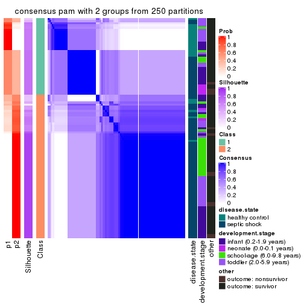</p>

</div>
<div id='tab-CV-pam-consensus-heatmap-2'>
<pre><code class="r">consensus_heatmap(res, k = 3)
</code></pre>

<p>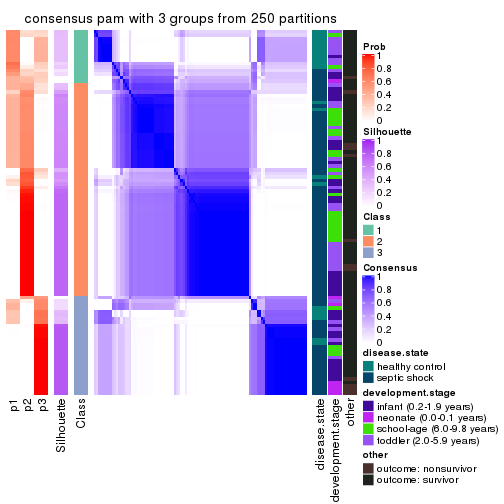</p>

</div>
<div id='tab-CV-pam-consensus-heatmap-3'>
<pre><code class="r">consensus_heatmap(res, k = 4)
</code></pre>

<p>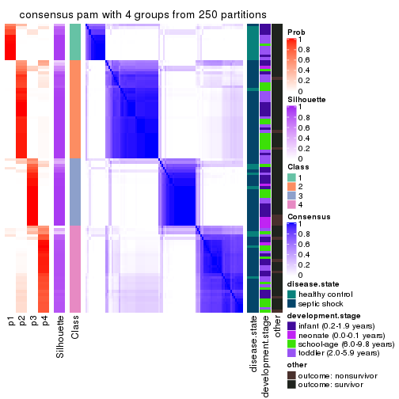</p>

</div>
<div id='tab-CV-pam-consensus-heatmap-4'>
<pre><code class="r">consensus_heatmap(res, k = 5)
</code></pre>

<p>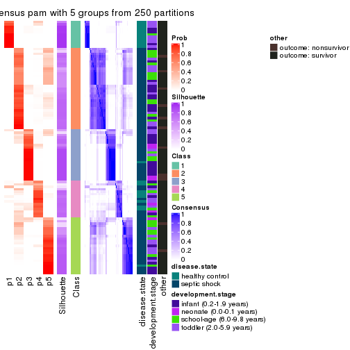</p>

</div>
<div id='tab-CV-pam-consensus-heatmap-5'>
<pre><code class="r">consensus_heatmap(res, k = 6)
</code></pre>

<p>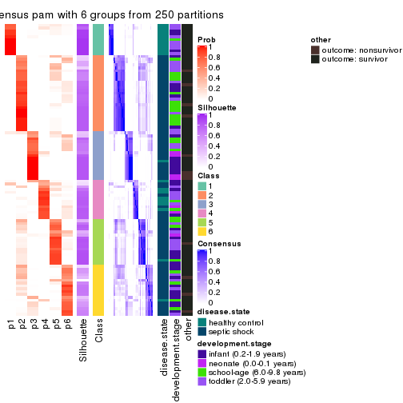</p>

</div>
</div>

Heatmaps for the membership of samples in all partitions to see how consistent they are:


<script>
$( function() {
	$( '#tabs-CV-pam-membership-heatmap' ).tabs();
} );
</script>
<div id='tabs-CV-pam-membership-heatmap'>
<ul>
<li><a href='#tab-CV-pam-membership-heatmap-1'>k = 2</a></li>
<li><a href='#tab-CV-pam-membership-heatmap-2'>k = 3</a></li>
<li><a href='#tab-CV-pam-membership-heatmap-3'>k = 4</a></li>
<li><a href='#tab-CV-pam-membership-heatmap-4'>k = 5</a></li>
<li><a href='#tab-CV-pam-membership-heatmap-5'>k = 6</a></li>
</ul>
<div id='tab-CV-pam-membership-heatmap-1'>
<pre><code class="r">membership_heatmap(res, k = 2)
</code></pre>

<p>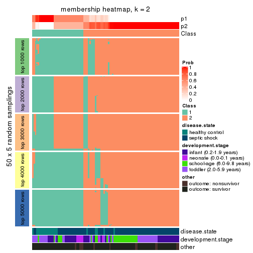</p>

</div>
<div id='tab-CV-pam-membership-heatmap-2'>
<pre><code class="r">membership_heatmap(res, k = 3)
</code></pre>

<p>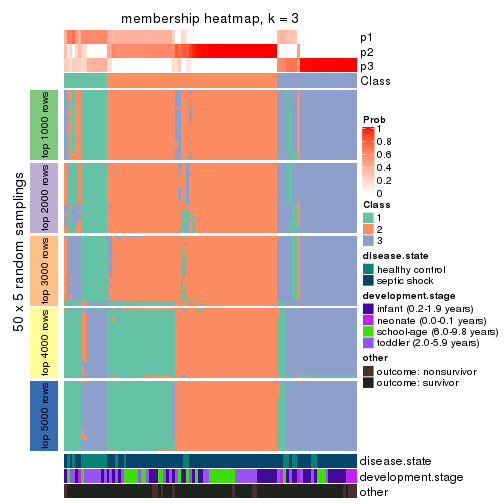</p>

</div>
<div id='tab-CV-pam-membership-heatmap-3'>
<pre><code class="r">membership_heatmap(res, k = 4)
</code></pre>

<p>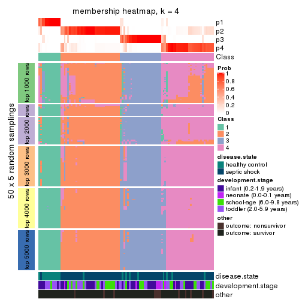</p>

</div>
<div id='tab-CV-pam-membership-heatmap-4'>
<pre><code class="r">membership_heatmap(res, k = 5)
</code></pre>

<p>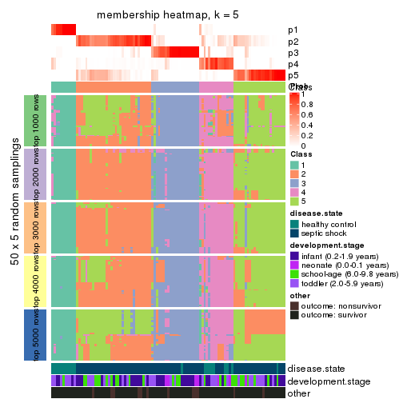</p>

</div>
<div id='tab-CV-pam-membership-heatmap-5'>
<pre><code class="r">membership_heatmap(res, k = 6)
</code></pre>

<p>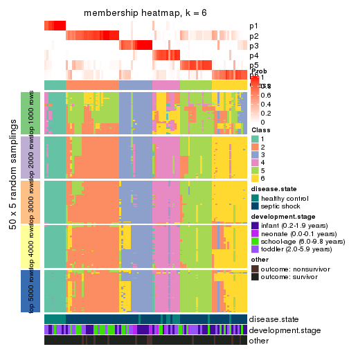</p>

</div>
</div>

As soon as we have had the classes for columns, we can look for signatures
which are significantly different between classes which can be candidate marks
for certain classes. Following are the heatmaps for signatures.


Signature heatmaps where rows are scaled:


<script>
$( function() {
	$( '#tabs-CV-pam-get-signatures' ).tabs();
} );
</script>
<div id='tabs-CV-pam-get-signatures'>
<ul>
<li><a href='#tab-CV-pam-get-signatures-1'>k = 2</a></li>
<li><a href='#tab-CV-pam-get-signatures-2'>k = 3</a></li>
<li><a href='#tab-CV-pam-get-signatures-3'>k = 4</a></li>
<li><a href='#tab-CV-pam-get-signatures-4'>k = 5</a></li>
<li><a href='#tab-CV-pam-get-signatures-5'>k = 6</a></li>
</ul>
<div id='tab-CV-pam-get-signatures-1'>
<pre><code class="r">get_signatures(res, k = 2)
</code></pre>

<p>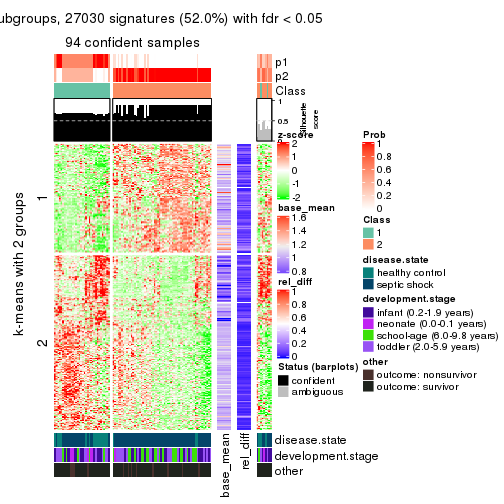</p>

</div>
<div id='tab-CV-pam-get-signatures-2'>
<pre><code class="r">get_signatures(res, k = 3)
</code></pre>

<p>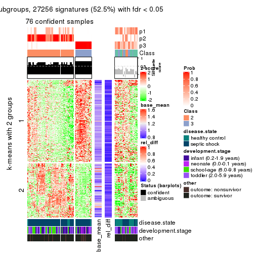</p>

</div>
<div id='tab-CV-pam-get-signatures-3'>
<pre><code class="r">get_signatures(res, k = 4)
</code></pre>

<p>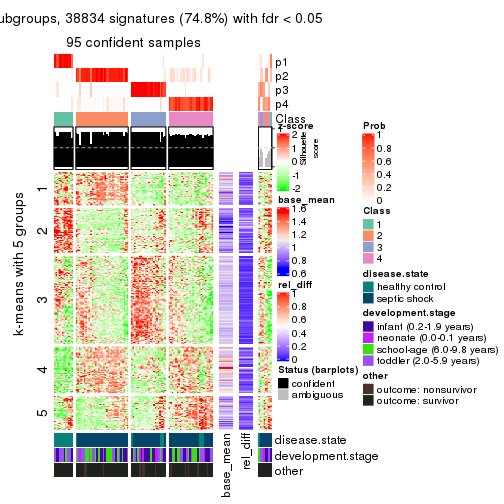</p>

</div>
<div id='tab-CV-pam-get-signatures-4'>
<pre><code class="r">get_signatures(res, k = 5)
</code></pre>

<p>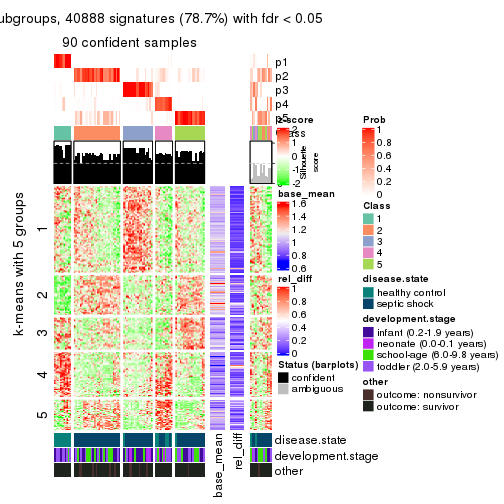</p>

</div>
<div id='tab-CV-pam-get-signatures-5'>
<pre><code class="r">get_signatures(res, k = 6)
</code></pre>

<p>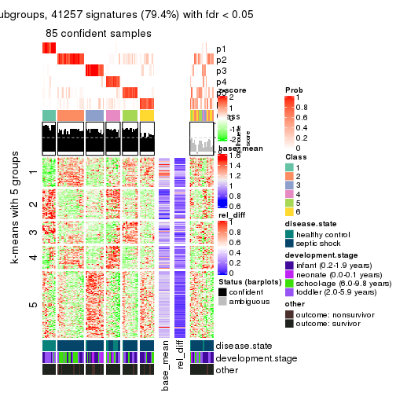</p>

</div>
</div>


Signature heatmaps where rows are not scaled:


<script>
$( function() {
	$( '#tabs-CV-pam-get-signatures-no-scale' ).tabs();
} );
</script>
<div id='tabs-CV-pam-get-signatures-no-scale'>
<ul>
<li><a href='#tab-CV-pam-get-signatures-no-scale-1'>k = 2</a></li>
<li><a href='#tab-CV-pam-get-signatures-no-scale-2'>k = 3</a></li>
<li><a href='#tab-CV-pam-get-signatures-no-scale-3'>k = 4</a></li>
<li><a href='#tab-CV-pam-get-signatures-no-scale-4'>k = 5</a></li>
<li><a href='#tab-CV-pam-get-signatures-no-scale-5'>k = 6</a></li>
</ul>
<div id='tab-CV-pam-get-signatures-no-scale-1'>
<pre><code class="r">get_signatures(res, k = 2, scale_rows = FALSE)
</code></pre>

<p>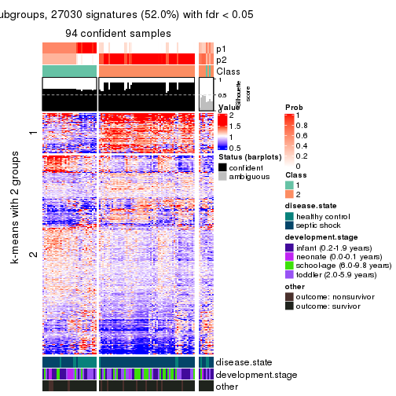</p>

</div>
<div id='tab-CV-pam-get-signatures-no-scale-2'>
<pre><code class="r">get_signatures(res, k = 3, scale_rows = FALSE)
</code></pre>

<p>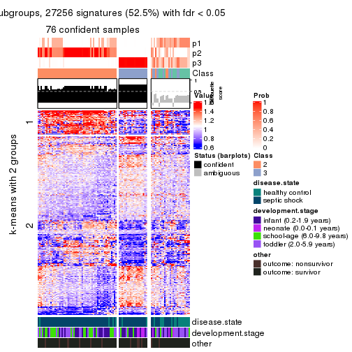</p>

</div>
<div id='tab-CV-pam-get-signatures-no-scale-3'>
<pre><code class="r">get_signatures(res, k = 4, scale_rows = FALSE)
</code></pre>

<p>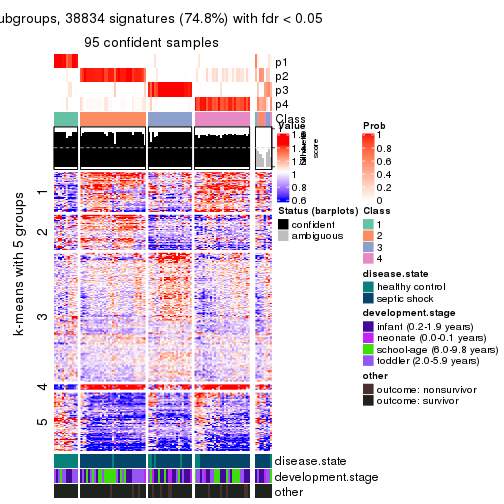</p>

</div>
<div id='tab-CV-pam-get-signatures-no-scale-4'>
<pre><code class="r">get_signatures(res, k = 5, scale_rows = FALSE)
</code></pre>

<p>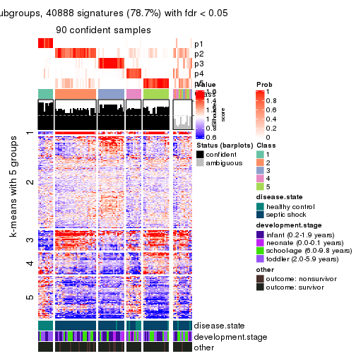</p>

</div>
<div id='tab-CV-pam-get-signatures-no-scale-5'>
<pre><code class="r">get_signatures(res, k = 6, scale_rows = FALSE)
</code></pre>

<p>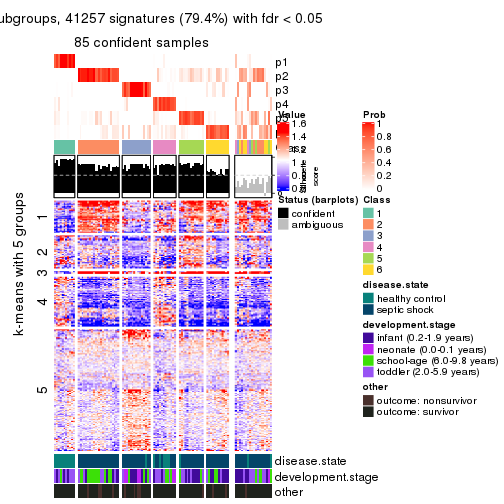</p>

</div>
</div>


Compare the overlap of signatures from different k:

```r
compare_signatures(res)
```

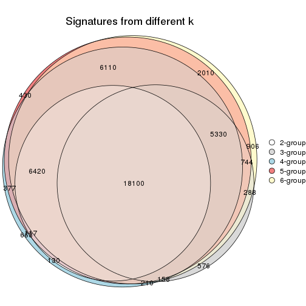

`get_signature()` returns a data frame invisibly. TO get the list of signatures, the function
call should be assigned to a variable explicitly. In following code, if `plot` argument is set
to `FALSE`, no heatmap is plotted while only the differential analysis is performed.

```r
# code only for demonstration
tb = get_signature(res, k = ..., plot = FALSE)
```

An example of the output of `tb` is:

```
#>   which_row         fdr    mean_1    mean_2 scaled_mean_1 scaled_mean_2 km
#> 1        38 0.042760348  8.373488  9.131774    -0.5533452     0.5164555  1
#> 2        40 0.018707592  7.106213  8.469186    -0.6173731     0.5762149  1
#> 3        55 0.019134737 10.221463 11.207825    -0.6159697     0.5749050  1
#> 4        59 0.006059896  5.921854  7.869574    -0.6899429     0.6439467  1
#> 5        60 0.018055526  8.928898 10.211722    -0.6204761     0.5791110  1
#> 6        98 0.009384629 15.714769 14.887706     0.6635654    -0.6193277  2
...
```

The columns in `tb` are:

1. `which_row`: row indices corresponding to the input matrix.
2. `fdr`: FDR for the differential test. 
3. `mean_x`: The mean value in group x.
4. `scaled_mean_x`: The mean value in group x after rows are scaled.
5. `km`: Row groups if k-means clustering is applied to rows.


UMAP plot which shows how samples are separated.


<script>
$( function() {
	$( '#tabs-CV-pam-dimension-reduction' ).tabs();
} );
</script>
<div id='tabs-CV-pam-dimension-reduction'>
<ul>
<li><a href='#tab-CV-pam-dimension-reduction-1'>k = 2</a></li>
<li><a href='#tab-CV-pam-dimension-reduction-2'>k = 3</a></li>
<li><a href='#tab-CV-pam-dimension-reduction-3'>k = 4</a></li>
<li><a href='#tab-CV-pam-dimension-reduction-4'>k = 5</a></li>
<li><a href='#tab-CV-pam-dimension-reduction-5'>k = 6</a></li>
</ul>
<div id='tab-CV-pam-dimension-reduction-1'>
<pre><code class="r">dimension_reduction(res, k = 2, method = &quot;UMAP&quot;)
</code></pre>

<p>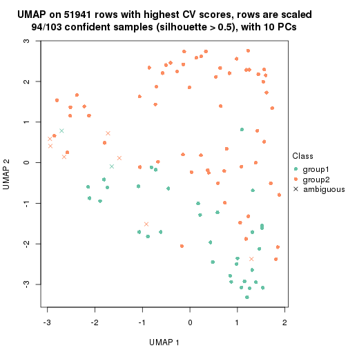</p>

</div>
<div id='tab-CV-pam-dimension-reduction-2'>
<pre><code class="r">dimension_reduction(res, k = 3, method = &quot;UMAP&quot;)
</code></pre>

<p>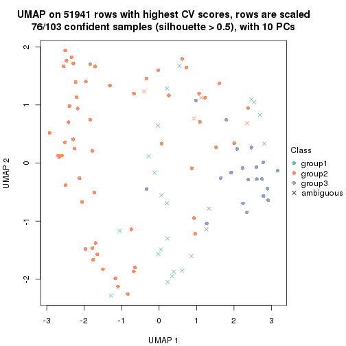</p>

</div>
<div id='tab-CV-pam-dimension-reduction-3'>
<pre><code class="r">dimension_reduction(res, k = 4, method = &quot;UMAP&quot;)
</code></pre>

<p>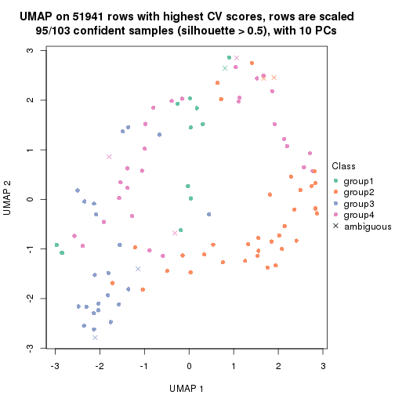</p>

</div>
<div id='tab-CV-pam-dimension-reduction-4'>
<pre><code class="r">dimension_reduction(res, k = 5, method = &quot;UMAP&quot;)
</code></pre>

<p>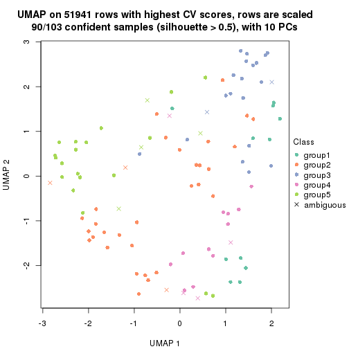</p>

</div>
<div id='tab-CV-pam-dimension-reduction-5'>
<pre><code class="r">dimension_reduction(res, k = 6, method = &quot;UMAP&quot;)
</code></pre>

<p>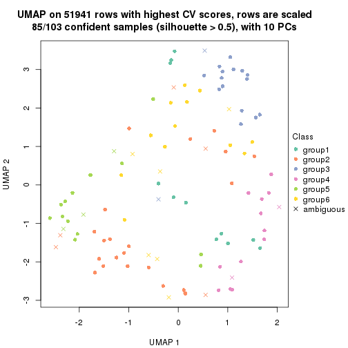</p>

</div>
</div>


Following heatmap shows how subgroups are split when increasing `k`:

```r
collect_classes(res)
```

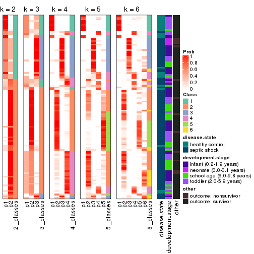


Test correlation between subgroups and known annotations. If the known
annotation is numeric, one-way ANOVA test is applied, and if the known
annotation is discrete, chi-squared contingency table test is applied.

```r
test_to_known_factors(res)
```

```
#>         n disease.state(p) development.stage(p) other(p) k
#> CV:pam 94         1.31e-05              0.02371    1.000 2
#> CV:pam 76         1.00e+00              0.00107    0.503 3
#> CV:pam 95         1.54e-11              0.03690    0.332 4
#> CV:pam 90         9.77e-13              0.01650    0.136 5
#> CV:pam 85         5.01e-11              0.00338    0.226 6
```


If matrix rows can be associated to genes, consider to use `functional_enrichment(res,
...)` to perform function enrichment for the signature genes. See [this vignette](http://bioconductor.org/packages/devel/bioc/vignettes/cola/inst/doc/functional_enrichment.html) for more detailed explanations.


 

---------------------------------------------------


### CV:mclust**


The object with results only for a single top-value method and a single partition method 
can be extracted as:

```r
res = res_list["CV", "mclust"]
# you can also extract it by
# res = res_list["CV:mclust"]
```

A summary of `res` and all the functions that can be applied to it:

```r
res
```

```
#> A 'ConsensusPartition' object with k = 2, 3, 4, 5, 6.
#>   On a matrix with 51941 rows and 103 columns.
#>   Top rows (1000, 2000, 3000, 4000, 5000) are extracted by 'CV' method.
#>   Subgroups are detected by 'mclust' method.
#>   Performed in total 1250 partitions by row resampling.
#>   Best k for subgroups seems to be 3.
#> 
#> Following methods can be applied to this 'ConsensusPartition' object:
#>  [1] "cola_report"             "collect_classes"         "collect_plots"          
#>  [4] "collect_stats"           "colnames"                "compare_signatures"     
#>  [7] "consensus_heatmap"       "dimension_reduction"     "functional_enrichment"  
#> [10] "get_anno_col"            "get_anno"                "get_classes"            
#> [13] "get_consensus"           "get_matrix"              "get_membership"         
#> [16] "get_param"               "get_signatures"          "get_stats"              
#> [19] "is_best_k"               "is_stable_k"             "membership_heatmap"     
#> [22] "ncol"                    "nrow"                    "plot_ecdf"              
#> [25] "rownames"                "select_partition_number" "show"                   
#> [28] "suggest_best_k"          "test_to_known_factors"
```

`collect_plots()` function collects all the plots made from `res` for all `k` (number of partitions)
into one single page to provide an easy and fast comparison between different `k`.

```r
collect_plots(res)
```

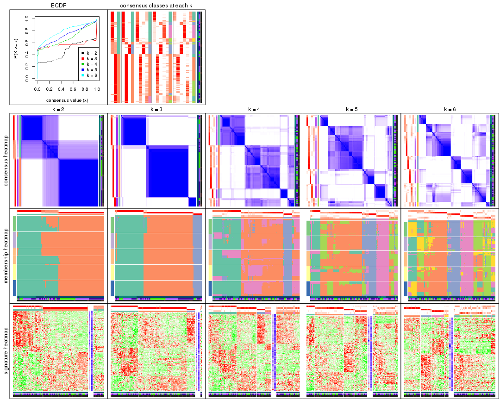

The plots are:

- The first row: a plot of the ECDF (empirical cumulative distribution
  function) curves of the consensus matrix for each `k` and the heatmap of
  predicted classes for each `k`.
- The second row: heatmaps of the consensus matrix for each `k`.
- The third row: heatmaps of the membership matrix for each `k`.
- The fouth row: heatmaps of the signatures for each `k`.

All the plots in panels can be made by individual functions and they are
plotted later in this section.

`select_partition_number()` produces several plots showing different
statistics for choosing "optimized" `k`. There are following statistics:

- ECDF curves of the consensus matrix for each `k`;
- 1-PAC. [The PAC
  score](https://en.wikipedia.org/wiki/Consensus_clustering#Over-interpretation_potential_of_consensus_clustering)
  measures the proportion of the ambiguous subgrouping.
- Mean silhouette score.
- Concordance. The mean probability of fiting the consensus class ids in all
  partitions.
- Area increased. Denote $A_k$ as the area under the ECDF curve for current
  `k`, the area increased is defined as $A_k - A_{k-1}$.
- Rand index. The percent of pairs of samples that are both in a same cluster
  or both are not in a same cluster in the partition of k and k-1.
- Jaccard index. The ratio of pairs of samples are both in a same cluster in
  the partition of k and k-1 and the pairs of samples are both in a same
  cluster in the partition k or k-1.

The detailed explanations of these statistics can be found in [the _cola_
vignette](http://bioconductor.org/packages/devel/bioc/vignettes/cola/inst/doc/cola.html#toc_13).

Generally speaking, lower PAC score, higher mean silhouette score or higher
concordance corresponds to better partition. Rand index and Jaccard index
measure how similar the current partition is compared to partition with `k-1`.
If they are too similar, we won't accept `k` is better than `k-1`.

```r
select_partition_number(res)
```

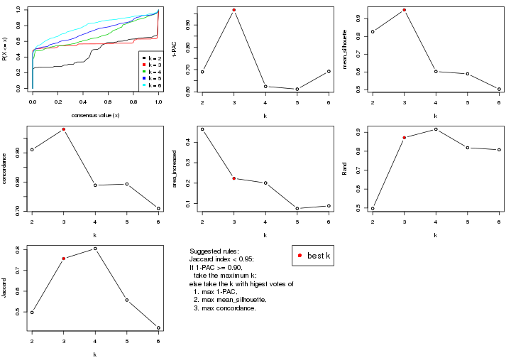

The numeric values for all these statistics can be obtained by `get_stats()`.

```r
get_stats(res)
```

```
#>   k 1-PAC mean_silhouette concordance area_increased  Rand Jaccard
#> 2 2 0.689           0.826       0.911         0.4638 0.497   0.497
#> 3 3 0.968           0.949       0.981         0.2232 0.872   0.757
#> 4 4 0.624           0.603       0.789         0.2008 0.916   0.806
#> 5 5 0.612           0.589       0.793         0.0759 0.818   0.557
#> 6 6 0.692           0.503       0.709         0.0887 0.808   0.423
```

`suggest_best_k()` suggests the best $k$ based on these statistics. The rules are as follows:

- All $k$ with Jaccard index larger than 0.95 are removed because increasing
  $k$ does not provide enough extra information. If all $k$ are removed, it is
  marked as no subgroup is detected.
- For all $k$ with 1-PAC score larger than 0.9, the maximal $k$ is taken as
  the best $k$, and other $k$ are marked as optional $k$.
- If it does not fit the second rule. The $k$ with the maximal vote of the
  highest 1-PAC score, highest mean silhouette, and highest concordance is
  taken as the best $k$.

```r
suggest_best_k(res)
```

```
#> [1] 3
```


Following shows the table of the partitions (You need to click the **show/hide
code output** link to see it). The membership matrix (columns with name `p*`)
is inferred by
[`clue::cl_consensus()`](https://www.rdocumentation.org/link/cl_consensus?package=clue)
function with the `SE` method. Basically the value in the membership matrix
represents the probability to belong to a certain group. The finall class
label for an item is determined with the group with highest probability it
belongs to.

In `get_classes()` function, the entropy is calculated from the membership
matrix and the silhouette score is calculated from the consensus matrix.


<script>
$( function() {
	$( '#tabs-CV-mclust-get-classes' ).tabs();
} );
</script>
<div id='tabs-CV-mclust-get-classes'>
<ul>
<li><a href='#tab-CV-mclust-get-classes-1'>k = 2</a></li>
<li><a href='#tab-CV-mclust-get-classes-2'>k = 3</a></li>
<li><a href='#tab-CV-mclust-get-classes-3'>k = 4</a></li>
<li><a href='#tab-CV-mclust-get-classes-4'>k = 5</a></li>
<li><a href='#tab-CV-mclust-get-classes-5'>k = 6</a></li>
</ul>

<div id='tab-CV-mclust-get-classes-1'>
<p><a id='tab-CV-mclust-get-classes-1-a' style='color:#0366d6' href='#'>show/hide code output</a></p>
<pre><code class="r">cbind(get_classes(res, k = 2), get_membership(res, k = 2))
</code></pre>

<pre><code>#&gt;           class entropy silhouette    p1    p2
#&gt; GSM647569     1  0.9922      0.484 0.552 0.448
#&gt; GSM647574     1  0.9922      0.485 0.552 0.448
#&gt; GSM647577     1  0.9963      0.453 0.536 0.464
#&gt; GSM647547     1  0.1414      0.798 0.980 0.020
#&gt; GSM647552     1  0.9954      0.461 0.540 0.460
#&gt; GSM647553     1  0.9087      0.635 0.676 0.324
#&gt; GSM647565     1  0.8555      0.672 0.720 0.280
#&gt; GSM647545     2  0.0000      0.982 0.000 1.000
#&gt; GSM647549     2  0.0000      0.982 0.000 1.000
#&gt; GSM647550     2  0.0000      0.982 0.000 1.000
#&gt; GSM647560     2  0.0000      0.982 0.000 1.000
#&gt; GSM647617     1  0.9970      0.443 0.532 0.468
#&gt; GSM647528     2  0.0000      0.982 0.000 1.000
#&gt; GSM647529     1  0.0000      0.803 1.000 0.000
#&gt; GSM647531     2  0.0000      0.982 0.000 1.000
#&gt; GSM647540     2  0.0000      0.982 0.000 1.000
#&gt; GSM647541     2  0.0000      0.982 0.000 1.000
#&gt; GSM647546     1  0.9970      0.443 0.532 0.468
#&gt; GSM647557     2  0.0000      0.982 0.000 1.000
#&gt; GSM647561     2  0.0000      0.982 0.000 1.000
#&gt; GSM647567     1  0.9286      0.617 0.656 0.344
#&gt; GSM647568     2  0.0000      0.982 0.000 1.000
#&gt; GSM647570     2  0.0000      0.982 0.000 1.000
#&gt; GSM647573     1  0.0000      0.803 1.000 0.000
#&gt; GSM647576     2  0.2603      0.925 0.044 0.956
#&gt; GSM647579     2  0.9983     -0.307 0.476 0.524
#&gt; GSM647580     1  0.9896      0.498 0.560 0.440
#&gt; GSM647583     1  0.9963      0.453 0.536 0.464
#&gt; GSM647592     2  0.8081      0.576 0.248 0.752
#&gt; GSM647593     2  0.0000      0.982 0.000 1.000
#&gt; GSM647595     2  0.0000      0.982 0.000 1.000
#&gt; GSM647597     1  0.0672      0.801 0.992 0.008
#&gt; GSM647598     2  0.0000      0.982 0.000 1.000
#&gt; GSM647613     2  0.0000      0.982 0.000 1.000
#&gt; GSM647615     2  0.0000      0.982 0.000 1.000
#&gt; GSM647616     1  0.9944      0.469 0.544 0.456
#&gt; GSM647619     2  0.0000      0.982 0.000 1.000
#&gt; GSM647582     2  0.0000      0.982 0.000 1.000
#&gt; GSM647591     2  0.0000      0.982 0.000 1.000
#&gt; GSM647527     2  0.0000      0.982 0.000 1.000
#&gt; GSM647530     1  0.0000      0.803 1.000 0.000
#&gt; GSM647532     1  0.0000      0.803 1.000 0.000
#&gt; GSM647544     2  0.0000      0.982 0.000 1.000
#&gt; GSM647551     2  0.0000      0.982 0.000 1.000
#&gt; GSM647556     1  0.9833      0.523 0.576 0.424
#&gt; GSM647558     2  0.0000      0.982 0.000 1.000
#&gt; GSM647572     1  0.9933      0.477 0.548 0.452
#&gt; GSM647578     2  0.0000      0.982 0.000 1.000
#&gt; GSM647581     2  0.0000      0.982 0.000 1.000
#&gt; GSM647594     1  0.7883      0.701 0.764 0.236
#&gt; GSM647599     1  0.0000      0.803 1.000 0.000
#&gt; GSM647600     2  0.0000      0.982 0.000 1.000
#&gt; GSM647601     2  0.0000      0.982 0.000 1.000
#&gt; GSM647603     2  0.0000      0.982 0.000 1.000
#&gt; GSM647610     1  0.9850      0.491 0.572 0.428
#&gt; GSM647611     2  0.0000      0.982 0.000 1.000
#&gt; GSM647612     2  0.0000      0.982 0.000 1.000
#&gt; GSM647614     2  0.0000      0.982 0.000 1.000
#&gt; GSM647618     2  0.0000      0.982 0.000 1.000
#&gt; GSM647629     2  0.0000      0.982 0.000 1.000
#&gt; GSM647535     2  0.0000      0.982 0.000 1.000
#&gt; GSM647563     2  0.0000      0.982 0.000 1.000
#&gt; GSM647542     2  0.0000      0.982 0.000 1.000
#&gt; GSM647543     2  0.0000      0.982 0.000 1.000
#&gt; GSM647548     1  0.0000      0.803 1.000 0.000
#&gt; GSM647554     2  0.0000      0.982 0.000 1.000
#&gt; GSM647555     2  0.0000      0.982 0.000 1.000
#&gt; GSM647559     2  0.0000      0.982 0.000 1.000
#&gt; GSM647562     2  0.0000      0.982 0.000 1.000
#&gt; GSM647564     1  0.9963      0.453 0.536 0.464
#&gt; GSM647571     2  0.0000      0.982 0.000 1.000
#&gt; GSM647584     2  0.0000      0.982 0.000 1.000
#&gt; GSM647585     1  0.9754      0.544 0.592 0.408
#&gt; GSM647586     2  0.0000      0.982 0.000 1.000
#&gt; GSM647587     2  0.0000      0.982 0.000 1.000
#&gt; GSM647588     2  0.0000      0.982 0.000 1.000
#&gt; GSM647596     2  0.0000      0.982 0.000 1.000
#&gt; GSM647602     1  0.9833      0.523 0.576 0.424
#&gt; GSM647609     2  0.0000      0.982 0.000 1.000
#&gt; GSM647620     2  0.0000      0.982 0.000 1.000
#&gt; GSM647627     2  0.0000      0.982 0.000 1.000
#&gt; GSM647628     2  0.0000      0.982 0.000 1.000
#&gt; GSM647533     1  0.0000      0.803 1.000 0.000
#&gt; GSM647536     1  0.0000      0.803 1.000 0.000
#&gt; GSM647537     1  0.0000      0.803 1.000 0.000
#&gt; GSM647606     1  0.0000      0.803 1.000 0.000
#&gt; GSM647621     1  0.0000      0.803 1.000 0.000
#&gt; GSM647626     1  0.9129      0.631 0.672 0.328
#&gt; GSM647538     1  0.0000      0.803 1.000 0.000
#&gt; GSM647575     1  0.0000      0.803 1.000 0.000
#&gt; GSM647590     1  0.0000      0.803 1.000 0.000
#&gt; GSM647605     1  0.0000      0.803 1.000 0.000
#&gt; GSM647607     1  0.0000      0.803 1.000 0.000
#&gt; GSM647608     1  0.0000      0.803 1.000 0.000
#&gt; GSM647622     1  0.0000      0.803 1.000 0.000
#&gt; GSM647623     1  0.0000      0.803 1.000 0.000
#&gt; GSM647624     1  0.0000      0.803 1.000 0.000
#&gt; GSM647625     1  0.0000      0.803 1.000 0.000
#&gt; GSM647534     1  0.6438      0.740 0.836 0.164
#&gt; GSM647539     1  0.0000      0.803 1.000 0.000
#&gt; GSM647566     1  0.0000      0.803 1.000 0.000
#&gt; GSM647589     1  0.0000      0.803 1.000 0.000
#&gt; GSM647604     1  0.0000      0.803 1.000 0.000
</code></pre>

<script>
$('#tab-CV-mclust-get-classes-1-a').parent().next().next().hide();
$('#tab-CV-mclust-get-classes-1-a').click(function(){
  $('#tab-CV-mclust-get-classes-1-a').parent().next().next().toggle();
  return(false);
});
</script>
</div>

<div id='tab-CV-mclust-get-classes-2'>
<p><a id='tab-CV-mclust-get-classes-2-a' style='color:#0366d6' href='#'>show/hide code output</a></p>
<pre><code class="r">cbind(get_classes(res, k = 3), get_membership(res, k = 3))
</code></pre>

<pre><code>#&gt;           class entropy silhouette    p1    p2    p3
#&gt; GSM647569     3  0.0000      0.954 0.000 0.000 1.000
#&gt; GSM647574     1  0.4555      0.730 0.800 0.000 0.200
#&gt; GSM647577     3  0.0000      0.954 0.000 0.000 1.000
#&gt; GSM647547     1  0.0000      0.967 1.000 0.000 0.000
#&gt; GSM647552     2  0.4291      0.763 0.180 0.820 0.000
#&gt; GSM647553     1  0.1860      0.918 0.948 0.000 0.052
#&gt; GSM647565     1  0.0747      0.949 0.984 0.016 0.000
#&gt; GSM647545     2  0.0000      0.984 0.000 1.000 0.000
#&gt; GSM647549     2  0.0000      0.984 0.000 1.000 0.000
#&gt; GSM647550     2  0.0000      0.984 0.000 1.000 0.000
#&gt; GSM647560     2  0.0000      0.984 0.000 1.000 0.000
#&gt; GSM647617     3  0.0000      0.954 0.000 0.000 1.000
#&gt; GSM647528     2  0.0000      0.984 0.000 1.000 0.000
#&gt; GSM647529     1  0.0000      0.967 1.000 0.000 0.000
#&gt; GSM647531     2  0.0000      0.984 0.000 1.000 0.000
#&gt; GSM647540     2  0.0237      0.981 0.000 0.996 0.004
#&gt; GSM647541     2  0.0000      0.984 0.000 1.000 0.000
#&gt; GSM647546     3  0.5948      0.421 0.000 0.360 0.640
#&gt; GSM647557     2  0.0237      0.980 0.004 0.996 0.000
#&gt; GSM647561     2  0.0000      0.984 0.000 1.000 0.000
#&gt; GSM647567     1  0.6126      0.409 0.644 0.352 0.004
#&gt; GSM647568     2  0.0000      0.984 0.000 1.000 0.000
#&gt; GSM647570     2  0.0000      0.984 0.000 1.000 0.000
#&gt; GSM647573     1  0.0000      0.967 1.000 0.000 0.000
#&gt; GSM647576     2  0.0000      0.984 0.000 1.000 0.000
#&gt; GSM647579     2  0.0237      0.981 0.000 0.996 0.004
#&gt; GSM647580     3  0.0000      0.954 0.000 0.000 1.000
#&gt; GSM647583     3  0.0000      0.954 0.000 0.000 1.000
#&gt; GSM647592     2  0.4555      0.735 0.200 0.800 0.000
#&gt; GSM647593     2  0.0000      0.984 0.000 1.000 0.000
#&gt; GSM647595     2  0.0000      0.984 0.000 1.000 0.000
#&gt; GSM647597     1  0.0000      0.967 1.000 0.000 0.000
#&gt; GSM647598     2  0.0000      0.984 0.000 1.000 0.000
#&gt; GSM647613     2  0.0000      0.984 0.000 1.000 0.000
#&gt; GSM647615     2  0.0000      0.984 0.000 1.000 0.000
#&gt; GSM647616     3  0.0000      0.954 0.000 0.000 1.000
#&gt; GSM647619     2  0.0000      0.984 0.000 1.000 0.000
#&gt; GSM647582     2  0.0000      0.984 0.000 1.000 0.000
#&gt; GSM647591     2  0.0000      0.984 0.000 1.000 0.000
#&gt; GSM647527     2  0.0000      0.984 0.000 1.000 0.000
#&gt; GSM647530     1  0.0000      0.967 1.000 0.000 0.000
#&gt; GSM647532     1  0.0000      0.967 1.000 0.000 0.000
#&gt; GSM647544     2  0.0000      0.984 0.000 1.000 0.000
#&gt; GSM647551     2  0.0000      0.984 0.000 1.000 0.000
#&gt; GSM647556     3  0.0000      0.954 0.000 0.000 1.000
#&gt; GSM647558     2  0.0000      0.984 0.000 1.000 0.000
#&gt; GSM647572     2  0.5696      0.759 0.064 0.800 0.136
#&gt; GSM647578     2  0.0237      0.981 0.000 0.996 0.004
#&gt; GSM647581     2  0.0000      0.984 0.000 1.000 0.000
#&gt; GSM647594     1  0.4605      0.668 0.796 0.204 0.000
#&gt; GSM647599     1  0.0000      0.967 1.000 0.000 0.000
#&gt; GSM647600     2  0.0000      0.984 0.000 1.000 0.000
#&gt; GSM647601     2  0.0000      0.984 0.000 1.000 0.000
#&gt; GSM647603     2  0.0000      0.984 0.000 1.000 0.000
#&gt; GSM647610     2  0.4555      0.735 0.200 0.800 0.000
#&gt; GSM647611     2  0.0000      0.984 0.000 1.000 0.000
#&gt; GSM647612     2  0.0000      0.984 0.000 1.000 0.000
#&gt; GSM647614     2  0.0000      0.984 0.000 1.000 0.000
#&gt; GSM647618     2  0.0000      0.984 0.000 1.000 0.000
#&gt; GSM647629     2  0.0000      0.984 0.000 1.000 0.000
#&gt; GSM647535     2  0.0000      0.984 0.000 1.000 0.000
#&gt; GSM647563     2  0.0000      0.984 0.000 1.000 0.000
#&gt; GSM647542     2  0.0000      0.984 0.000 1.000 0.000
#&gt; GSM647543     2  0.0000      0.984 0.000 1.000 0.000
#&gt; GSM647548     1  0.0000      0.967 1.000 0.000 0.000
#&gt; GSM647554     2  0.0000      0.984 0.000 1.000 0.000
#&gt; GSM647555     2  0.0000      0.984 0.000 1.000 0.000
#&gt; GSM647559     2  0.0000      0.984 0.000 1.000 0.000
#&gt; GSM647562     2  0.0000      0.984 0.000 1.000 0.000
#&gt; GSM647564     3  0.0000      0.954 0.000 0.000 1.000
#&gt; GSM647571     2  0.0000      0.984 0.000 1.000 0.000
#&gt; GSM647584     2  0.0000      0.984 0.000 1.000 0.000
#&gt; GSM647585     3  0.0000      0.954 0.000 0.000 1.000
#&gt; GSM647586     2  0.0000      0.984 0.000 1.000 0.000
#&gt; GSM647587     2  0.0000      0.984 0.000 1.000 0.000
#&gt; GSM647588     2  0.0000      0.984 0.000 1.000 0.000
#&gt; GSM647596     2  0.0000      0.984 0.000 1.000 0.000
#&gt; GSM647602     3  0.0000      0.954 0.000 0.000 1.000
#&gt; GSM647609     2  0.0000      0.984 0.000 1.000 0.000
#&gt; GSM647620     2  0.0000      0.984 0.000 1.000 0.000
#&gt; GSM647627     2  0.0000      0.984 0.000 1.000 0.000
#&gt; GSM647628     2  0.0000      0.984 0.000 1.000 0.000
#&gt; GSM647533     1  0.0000      0.967 1.000 0.000 0.000
#&gt; GSM647536     1  0.0000      0.967 1.000 0.000 0.000
#&gt; GSM647537     1  0.0000      0.967 1.000 0.000 0.000
#&gt; GSM647606     1  0.0000      0.967 1.000 0.000 0.000
#&gt; GSM647621     1  0.0000      0.967 1.000 0.000 0.000
#&gt; GSM647626     1  0.0000      0.967 1.000 0.000 0.000
#&gt; GSM647538     1  0.0000      0.967 1.000 0.000 0.000
#&gt; GSM647575     1  0.0000      0.967 1.000 0.000 0.000
#&gt; GSM647590     1  0.0000      0.967 1.000 0.000 0.000
#&gt; GSM647605     1  0.0000      0.967 1.000 0.000 0.000
#&gt; GSM647607     1  0.0000      0.967 1.000 0.000 0.000
#&gt; GSM647608     1  0.0000      0.967 1.000 0.000 0.000
#&gt; GSM647622     1  0.0000      0.967 1.000 0.000 0.000
#&gt; GSM647623     1  0.0000      0.967 1.000 0.000 0.000
#&gt; GSM647624     1  0.0000      0.967 1.000 0.000 0.000
#&gt; GSM647625     1  0.0000      0.967 1.000 0.000 0.000
#&gt; GSM647534     1  0.0000      0.967 1.000 0.000 0.000
#&gt; GSM647539     1  0.0000      0.967 1.000 0.000 0.000
#&gt; GSM647566     1  0.0000      0.967 1.000 0.000 0.000
#&gt; GSM647589     1  0.0000      0.967 1.000 0.000 0.000
#&gt; GSM647604     1  0.0000      0.967 1.000 0.000 0.000
</code></pre>

<script>
$('#tab-CV-mclust-get-classes-2-a').parent().next().next().hide();
$('#tab-CV-mclust-get-classes-2-a').click(function(){
  $('#tab-CV-mclust-get-classes-2-a').parent().next().next().toggle();
  return(false);
});
</script>
</div>

<div id='tab-CV-mclust-get-classes-3'>
<p><a id='tab-CV-mclust-get-classes-3-a' style='color:#0366d6' href='#'>show/hide code output</a></p>
<pre><code class="r">cbind(get_classes(res, k = 4), get_membership(res, k = 4))
</code></pre>

<pre><code>#&gt;           class entropy silhouette    p1    p2    p3    p4
#&gt; GSM647569     3  0.0000    0.94559 0.000 0.000 1.000 0.000
#&gt; GSM647574     1  0.4697    0.53716 0.644 0.000 0.356 0.000
#&gt; GSM647577     3  0.0000    0.94559 0.000 0.000 1.000 0.000
#&gt; GSM647547     1  0.0188    0.86571 0.996 0.000 0.004 0.000
#&gt; GSM647552     2  0.8649   -0.25563 0.092 0.436 0.116 0.356
#&gt; GSM647553     1  0.4134    0.69839 0.740 0.000 0.260 0.000
#&gt; GSM647565     1  0.2466    0.79039 0.900 0.096 0.000 0.004
#&gt; GSM647545     2  0.0188    0.59971 0.000 0.996 0.004 0.000
#&gt; GSM647549     2  0.0592    0.60172 0.000 0.984 0.016 0.000
#&gt; GSM647550     2  0.5269    0.29614 0.000 0.620 0.016 0.364
#&gt; GSM647560     2  0.5269    0.29614 0.000 0.620 0.016 0.364
#&gt; GSM647617     3  0.0000    0.94559 0.000 0.000 1.000 0.000
#&gt; GSM647528     2  0.2081    0.52855 0.000 0.916 0.000 0.084
#&gt; GSM647529     1  0.0779    0.86396 0.980 0.016 0.000 0.004
#&gt; GSM647531     2  0.0000    0.59805 0.000 1.000 0.000 0.000
#&gt; GSM647540     2  0.7042    0.05004 0.000 0.516 0.132 0.352
#&gt; GSM647541     2  0.5269    0.29614 0.000 0.620 0.016 0.364
#&gt; GSM647546     3  0.8727    0.10772 0.172 0.072 0.460 0.296
#&gt; GSM647557     2  0.0524    0.59935 0.004 0.988 0.000 0.008
#&gt; GSM647561     2  0.0469    0.59359 0.000 0.988 0.000 0.012
#&gt; GSM647567     1  0.5862    0.75709 0.748 0.068 0.140 0.044
#&gt; GSM647568     2  0.4054    0.51798 0.000 0.796 0.016 0.188
#&gt; GSM647570     2  0.0000    0.59805 0.000 1.000 0.000 0.000
#&gt; GSM647573     1  0.0000    0.86592 1.000 0.000 0.000 0.000
#&gt; GSM647576     2  0.5269    0.29614 0.000 0.620 0.016 0.364
#&gt; GSM647579     2  0.7318   -0.00901 0.000 0.476 0.160 0.364
#&gt; GSM647580     3  0.0000    0.94559 0.000 0.000 1.000 0.000
#&gt; GSM647583     3  0.0000    0.94559 0.000 0.000 1.000 0.000
#&gt; GSM647592     4  0.7539    0.45676 0.252 0.256 0.000 0.492
#&gt; GSM647593     4  0.4679    0.75297 0.000 0.352 0.000 0.648
#&gt; GSM647595     4  0.4679    0.75297 0.000 0.352 0.000 0.648
#&gt; GSM647597     1  0.2111    0.86067 0.932 0.024 0.000 0.044
#&gt; GSM647598     2  0.4643   -0.02957 0.000 0.656 0.000 0.344
#&gt; GSM647613     2  0.1118    0.57775 0.000 0.964 0.000 0.036
#&gt; GSM647615     2  0.4980    0.35331 0.000 0.680 0.016 0.304
#&gt; GSM647616     3  0.0000    0.94559 0.000 0.000 1.000 0.000
#&gt; GSM647619     4  0.4679    0.75297 0.000 0.352 0.000 0.648
#&gt; GSM647582     2  0.4730    0.17626 0.000 0.636 0.000 0.364
#&gt; GSM647591     4  0.4679    0.75297 0.000 0.352 0.000 0.648
#&gt; GSM647527     2  0.2345    0.51058 0.000 0.900 0.000 0.100
#&gt; GSM647530     1  0.0592    0.86340 0.984 0.016 0.000 0.000
#&gt; GSM647532     1  0.0000    0.86592 1.000 0.000 0.000 0.000
#&gt; GSM647544     2  0.0592    0.59217 0.000 0.984 0.000 0.016
#&gt; GSM647551     4  0.4866    0.69575 0.000 0.404 0.000 0.596
#&gt; GSM647556     3  0.0000    0.94559 0.000 0.000 1.000 0.000
#&gt; GSM647558     2  0.0592    0.60172 0.000 0.984 0.016 0.000
#&gt; GSM647572     2  0.8060   -0.19869 0.004 0.368 0.312 0.316
#&gt; GSM647578     2  0.6909    0.07335 0.000 0.520 0.116 0.364
#&gt; GSM647581     2  0.0592    0.59217 0.000 0.984 0.000 0.016
#&gt; GSM647594     1  0.3910    0.75271 0.820 0.156 0.000 0.024
#&gt; GSM647599     1  0.3996    0.83158 0.836 0.000 0.104 0.060
#&gt; GSM647600     2  0.5253    0.26079 0.000 0.624 0.016 0.360
#&gt; GSM647601     2  0.4961   -0.29815 0.000 0.552 0.000 0.448
#&gt; GSM647603     2  0.5269    0.29614 0.000 0.620 0.016 0.364
#&gt; GSM647610     4  0.7812    0.33256 0.256 0.348 0.000 0.396
#&gt; GSM647611     2  0.4713   -0.07012 0.000 0.640 0.000 0.360
#&gt; GSM647612     2  0.2730    0.58025 0.000 0.896 0.016 0.088
#&gt; GSM647614     2  0.1975    0.58888 0.000 0.936 0.016 0.048
#&gt; GSM647618     2  0.1940    0.54600 0.000 0.924 0.000 0.076
#&gt; GSM647629     2  0.5269    0.29614 0.000 0.620 0.016 0.364
#&gt; GSM647535     2  0.5186    0.32869 0.000 0.640 0.016 0.344
#&gt; GSM647563     2  0.0592    0.60172 0.000 0.984 0.016 0.000
#&gt; GSM647542     2  0.4136    0.51192 0.000 0.788 0.016 0.196
#&gt; GSM647543     2  0.4831    0.42090 0.000 0.704 0.016 0.280
#&gt; GSM647548     1  0.0000    0.86592 1.000 0.000 0.000 0.000
#&gt; GSM647554     2  0.5269    0.29614 0.000 0.620 0.016 0.364
#&gt; GSM647555     2  0.4857    0.42059 0.000 0.700 0.016 0.284
#&gt; GSM647559     2  0.0927    0.60225 0.000 0.976 0.016 0.008
#&gt; GSM647562     2  0.0927    0.58720 0.008 0.976 0.000 0.016
#&gt; GSM647564     3  0.0188    0.94274 0.000 0.000 0.996 0.004
#&gt; GSM647571     2  0.4136    0.51192 0.000 0.788 0.016 0.196
#&gt; GSM647584     4  0.4916    0.65810 0.000 0.424 0.000 0.576
#&gt; GSM647585     3  0.0188    0.94258 0.004 0.000 0.996 0.000
#&gt; GSM647586     2  0.2589    0.48912 0.000 0.884 0.000 0.116
#&gt; GSM647587     2  0.2530    0.49492 0.000 0.888 0.000 0.112
#&gt; GSM647588     2  0.3280    0.56738 0.000 0.860 0.016 0.124
#&gt; GSM647596     2  0.1488    0.58946 0.000 0.956 0.012 0.032
#&gt; GSM647602     3  0.0000    0.94559 0.000 0.000 1.000 0.000
#&gt; GSM647609     4  0.4916    0.67870 0.000 0.424 0.000 0.576
#&gt; GSM647620     2  0.4957    0.26480 0.000 0.684 0.016 0.300
#&gt; GSM647627     2  0.3649    0.37440 0.000 0.796 0.000 0.204
#&gt; GSM647628     2  0.0592    0.60172 0.000 0.984 0.016 0.000
#&gt; GSM647533     1  0.4331    0.81411 0.712 0.000 0.000 0.288
#&gt; GSM647536     1  0.0000    0.86592 1.000 0.000 0.000 0.000
#&gt; GSM647537     1  0.4331    0.81411 0.712 0.000 0.000 0.288
#&gt; GSM647606     1  0.4331    0.81411 0.712 0.000 0.000 0.288
#&gt; GSM647621     1  0.0707    0.86655 0.980 0.000 0.000 0.020
#&gt; GSM647626     1  0.3494    0.79927 0.824 0.000 0.172 0.004
#&gt; GSM647538     1  0.4331    0.81411 0.712 0.000 0.000 0.288
#&gt; GSM647575     1  0.0000    0.86592 1.000 0.000 0.000 0.000
#&gt; GSM647590     1  0.3486    0.83880 0.812 0.000 0.000 0.188
#&gt; GSM647605     1  0.4331    0.81411 0.712 0.000 0.000 0.288
#&gt; GSM647607     1  0.0000    0.86592 1.000 0.000 0.000 0.000
#&gt; GSM647608     1  0.0000    0.86592 1.000 0.000 0.000 0.000
#&gt; GSM647622     1  0.4331    0.81411 0.712 0.000 0.000 0.288
#&gt; GSM647623     1  0.4331    0.81411 0.712 0.000 0.000 0.288
#&gt; GSM647624     1  0.4040    0.82116 0.752 0.000 0.000 0.248
#&gt; GSM647625     1  0.4331    0.81411 0.712 0.000 0.000 0.288
#&gt; GSM647534     1  0.4623    0.82105 0.812 0.012 0.116 0.060
#&gt; GSM647539     1  0.0000    0.86592 1.000 0.000 0.000 0.000
#&gt; GSM647566     1  0.0000    0.86592 1.000 0.000 0.000 0.000
#&gt; GSM647589     1  0.0000    0.86592 1.000 0.000 0.000 0.000
#&gt; GSM647604     1  0.4331    0.81411 0.712 0.000 0.000 0.288
</code></pre>

<script>
$('#tab-CV-mclust-get-classes-3-a').parent().next().next().hide();
$('#tab-CV-mclust-get-classes-3-a').click(function(){
  $('#tab-CV-mclust-get-classes-3-a').parent().next().next().toggle();
  return(false);
});
</script>
</div>

<div id='tab-CV-mclust-get-classes-4'>
<p><a id='tab-CV-mclust-get-classes-4-a' style='color:#0366d6' href='#'>show/hide code output</a></p>
<pre><code class="r">cbind(get_classes(res, k = 5), get_membership(res, k = 5))
</code></pre>

<pre><code>#&gt;           class entropy silhouette    p1    p2    p3    p4    p5
#&gt; GSM647569     3  0.0000     0.7940 0.000 0.000 1.000 0.000 0.000
#&gt; GSM647574     3  0.5104     0.5176 0.116 0.000 0.692 0.192 0.000
#&gt; GSM647577     3  0.0000     0.7940 0.000 0.000 1.000 0.000 0.000
#&gt; GSM647547     4  0.2377     0.9443 0.128 0.000 0.000 0.872 0.000
#&gt; GSM647552     5  0.4458     0.3655 0.000 0.192 0.056 0.004 0.748
#&gt; GSM647553     3  0.5525     0.4138 0.124 0.000 0.636 0.240 0.000
#&gt; GSM647565     4  0.5324     0.5855 0.128 0.204 0.000 0.668 0.000
#&gt; GSM647545     2  0.0000     0.7094 0.000 1.000 0.000 0.000 0.000
#&gt; GSM647549     2  0.0162     0.7096 0.000 0.996 0.000 0.000 0.004
#&gt; GSM647550     2  0.3563     0.6819 0.000 0.780 0.012 0.000 0.208
#&gt; GSM647560     2  0.4088     0.5234 0.000 0.632 0.000 0.000 0.368
#&gt; GSM647617     3  0.0000     0.7940 0.000 0.000 1.000 0.000 0.000
#&gt; GSM647528     2  0.2771     0.6865 0.000 0.860 0.000 0.128 0.012
#&gt; GSM647529     4  0.4890     0.5837 0.332 0.000 0.000 0.628 0.040
#&gt; GSM647531     2  0.0794     0.7102 0.000 0.972 0.000 0.000 0.028
#&gt; GSM647540     3  0.6593     0.1003 0.000 0.220 0.440 0.000 0.340
#&gt; GSM647541     2  0.3274     0.6802 0.000 0.780 0.000 0.000 0.220
#&gt; GSM647546     3  0.3048     0.7115 0.000 0.000 0.820 0.004 0.176
#&gt; GSM647557     2  0.1205     0.7071 0.000 0.956 0.000 0.004 0.040
#&gt; GSM647561     2  0.0290     0.7079 0.000 0.992 0.000 0.000 0.008
#&gt; GSM647567     5  0.8322    -0.0887 0.104 0.008 0.288 0.232 0.368
#&gt; GSM647568     2  0.3074     0.6894 0.000 0.804 0.000 0.000 0.196
#&gt; GSM647570     2  0.0162     0.7096 0.000 0.996 0.000 0.000 0.004
#&gt; GSM647573     4  0.2377     0.9443 0.128 0.000 0.000 0.872 0.000
#&gt; GSM647576     2  0.5480     0.4332 0.000 0.560 0.072 0.000 0.368
#&gt; GSM647579     3  0.6539     0.1202 0.000 0.200 0.432 0.000 0.368
#&gt; GSM647580     3  0.0000     0.7940 0.000 0.000 1.000 0.000 0.000
#&gt; GSM647583     3  0.0000     0.7940 0.000 0.000 1.000 0.000 0.000
#&gt; GSM647592     5  0.6886     0.1772 0.020 0.344 0.000 0.176 0.460
#&gt; GSM647593     2  0.6132    -0.0271 0.000 0.444 0.000 0.128 0.428
#&gt; GSM647595     2  0.6130    -0.0186 0.000 0.448 0.000 0.128 0.424
#&gt; GSM647597     5  0.5810     0.0800 0.152 0.000 0.000 0.244 0.604
#&gt; GSM647598     2  0.6088     0.0589 0.000 0.492 0.000 0.128 0.380
#&gt; GSM647613     2  0.0404     0.7071 0.000 0.988 0.000 0.000 0.012
#&gt; GSM647615     2  0.3949     0.5552 0.000 0.668 0.000 0.000 0.332
#&gt; GSM647616     3  0.0000     0.7940 0.000 0.000 1.000 0.000 0.000
#&gt; GSM647619     5  0.6133    -0.0722 0.000 0.436 0.000 0.128 0.436
#&gt; GSM647582     2  0.3731     0.6948 0.000 0.800 0.000 0.040 0.160
#&gt; GSM647591     2  0.6130    -0.0186 0.000 0.448 0.000 0.128 0.424
#&gt; GSM647527     2  0.2771     0.6865 0.000 0.860 0.000 0.128 0.012
#&gt; GSM647530     4  0.2377     0.9443 0.128 0.000 0.000 0.872 0.000
#&gt; GSM647532     4  0.2377     0.9443 0.128 0.000 0.000 0.872 0.000
#&gt; GSM647544     2  0.0290     0.7079 0.000 0.992 0.000 0.000 0.008
#&gt; GSM647551     5  0.5519     0.1675 0.000 0.332 0.000 0.084 0.584
#&gt; GSM647556     3  0.0000     0.7940 0.000 0.000 1.000 0.000 0.000
#&gt; GSM647558     2  0.0162     0.7096 0.000 0.996 0.000 0.000 0.004
#&gt; GSM647572     3  0.3895     0.5823 0.000 0.000 0.680 0.000 0.320
#&gt; GSM647578     2  0.6157     0.3221 0.000 0.496 0.140 0.000 0.364
#&gt; GSM647581     2  0.0579     0.7074 0.000 0.984 0.000 0.008 0.008
#&gt; GSM647594     5  0.6315     0.1462 0.148 0.028 0.000 0.216 0.608
#&gt; GSM647599     1  0.6666     0.2900 0.520 0.000 0.012 0.232 0.236
#&gt; GSM647600     5  0.4161    -0.0111 0.000 0.392 0.000 0.000 0.608
#&gt; GSM647601     2  0.6118     0.0208 0.000 0.468 0.000 0.128 0.404
#&gt; GSM647603     2  0.4415     0.4994 0.000 0.604 0.008 0.000 0.388
#&gt; GSM647610     5  0.5087     0.3369 0.024 0.216 0.000 0.052 0.708
#&gt; GSM647611     2  0.6066     0.1053 0.000 0.504 0.000 0.128 0.368
#&gt; GSM647612     2  0.2929     0.6943 0.000 0.820 0.000 0.000 0.180
#&gt; GSM647614     2  0.2891     0.6949 0.000 0.824 0.000 0.000 0.176
#&gt; GSM647618     2  0.4845     0.5509 0.000 0.724 0.000 0.128 0.148
#&gt; GSM647629     2  0.4302     0.3728 0.000 0.520 0.000 0.000 0.480
#&gt; GSM647535     2  0.3143     0.6883 0.000 0.796 0.000 0.000 0.204
#&gt; GSM647563     2  0.0000     0.7094 0.000 1.000 0.000 0.000 0.000
#&gt; GSM647542     2  0.2929     0.6943 0.000 0.820 0.000 0.000 0.180
#&gt; GSM647543     2  0.3177     0.6862 0.000 0.792 0.000 0.000 0.208
#&gt; GSM647548     4  0.2660     0.9352 0.128 0.008 0.000 0.864 0.000
#&gt; GSM647554     2  0.5587     0.3443 0.000 0.500 0.072 0.000 0.428
#&gt; GSM647555     2  0.3003     0.6941 0.000 0.812 0.000 0.000 0.188
#&gt; GSM647559     2  0.0579     0.7123 0.000 0.984 0.000 0.008 0.008
#&gt; GSM647562     2  0.0451     0.7068 0.000 0.988 0.000 0.004 0.008
#&gt; GSM647564     3  0.2605     0.7311 0.000 0.000 0.852 0.000 0.148
#&gt; GSM647571     2  0.3039     0.6907 0.000 0.808 0.000 0.000 0.192
#&gt; GSM647584     2  0.6031     0.1581 0.000 0.520 0.000 0.128 0.352
#&gt; GSM647585     3  0.0000     0.7940 0.000 0.000 1.000 0.000 0.000
#&gt; GSM647586     2  0.2873     0.6842 0.000 0.856 0.000 0.128 0.016
#&gt; GSM647587     2  0.2969     0.6820 0.000 0.852 0.000 0.128 0.020
#&gt; GSM647588     2  0.3003     0.6942 0.000 0.812 0.000 0.000 0.188
#&gt; GSM647596     2  0.1628     0.6933 0.000 0.936 0.000 0.008 0.056
#&gt; GSM647602     3  0.0000     0.7940 0.000 0.000 1.000 0.000 0.000
#&gt; GSM647609     2  0.6100     0.0652 0.000 0.484 0.000 0.128 0.388
#&gt; GSM647620     2  0.4255     0.6327 0.000 0.776 0.000 0.128 0.096
#&gt; GSM647627     2  0.5201     0.4890 0.000 0.684 0.000 0.128 0.188
#&gt; GSM647628     2  0.0162     0.7096 0.000 0.996 0.000 0.000 0.004
#&gt; GSM647533     1  0.0000     0.8726 1.000 0.000 0.000 0.000 0.000
#&gt; GSM647536     4  0.2471     0.9381 0.136 0.000 0.000 0.864 0.000
#&gt; GSM647537     1  0.0000     0.8726 1.000 0.000 0.000 0.000 0.000
#&gt; GSM647606     1  0.0000     0.8726 1.000 0.000 0.000 0.000 0.000
#&gt; GSM647621     4  0.2813     0.9034 0.168 0.000 0.000 0.832 0.000
#&gt; GSM647626     3  0.5211     0.4974 0.100 0.000 0.668 0.232 0.000
#&gt; GSM647538     1  0.1197     0.8428 0.952 0.000 0.000 0.048 0.000
#&gt; GSM647575     4  0.2377     0.9443 0.128 0.000 0.000 0.872 0.000
#&gt; GSM647590     1  0.4307    -0.1721 0.504 0.000 0.000 0.496 0.000
#&gt; GSM647605     1  0.0404     0.8692 0.988 0.000 0.000 0.012 0.000
#&gt; GSM647607     4  0.2377     0.9443 0.128 0.000 0.000 0.872 0.000
#&gt; GSM647608     4  0.2377     0.9443 0.128 0.000 0.000 0.872 0.000
#&gt; GSM647622     1  0.0000     0.8726 1.000 0.000 0.000 0.000 0.000
#&gt; GSM647623     1  0.2471     0.7342 0.864 0.000 0.000 0.136 0.000
#&gt; GSM647624     1  0.0703     0.8628 0.976 0.000 0.000 0.024 0.000
#&gt; GSM647625     1  0.0000     0.8726 1.000 0.000 0.000 0.000 0.000
#&gt; GSM647534     5  0.6582     0.0182 0.220 0.000 0.012 0.232 0.536
#&gt; GSM647539     4  0.2377     0.9443 0.128 0.000 0.000 0.872 0.000
#&gt; GSM647566     4  0.2377     0.9443 0.128 0.000 0.000 0.872 0.000
#&gt; GSM647589     4  0.2377     0.9443 0.128 0.000 0.000 0.872 0.000
#&gt; GSM647604     1  0.0000     0.8726 1.000 0.000 0.000 0.000 0.000
</code></pre>

<script>
$('#tab-CV-mclust-get-classes-4-a').parent().next().next().hide();
$('#tab-CV-mclust-get-classes-4-a').click(function(){
  $('#tab-CV-mclust-get-classes-4-a').parent().next().next().toggle();
  return(false);
});
</script>
</div>

<div id='tab-CV-mclust-get-classes-5'>
<p><a id='tab-CV-mclust-get-classes-5-a' style='color:#0366d6' href='#'>show/hide code output</a></p>
<pre><code class="r">cbind(get_classes(res, k = 6), get_membership(res, k = 6))
</code></pre>

<pre><code>#&gt;           class entropy silhouette    p1    p2    p3    p4    p5    p6
#&gt; GSM647569     3  0.0458   0.858616 0.000 0.000 0.984 0.000 0.016 0.000
#&gt; GSM647574     3  0.3974   0.603075 0.000 0.000 0.728 0.224 0.048 0.000
#&gt; GSM647577     3  0.0000   0.859961 0.000 0.000 1.000 0.000 0.000 0.000
#&gt; GSM647547     4  0.0146   0.893740 0.000 0.000 0.000 0.996 0.004 0.000
#&gt; GSM647552     5  0.7528   0.092831 0.124 0.180 0.000 0.068 0.508 0.120
#&gt; GSM647553     3  0.4455   0.510109 0.000 0.000 0.680 0.264 0.048 0.008
#&gt; GSM647565     4  0.1168   0.837533 0.000 0.028 0.000 0.956 0.016 0.000
#&gt; GSM647545     2  0.0000   0.777686 0.000 1.000 0.000 0.000 0.000 0.000
#&gt; GSM647549     2  0.0000   0.777686 0.000 1.000 0.000 0.000 0.000 0.000
#&gt; GSM647550     5  0.5152   0.326240 0.000 0.400 0.000 0.000 0.512 0.088
#&gt; GSM647560     5  0.3482   0.432813 0.000 0.316 0.000 0.000 0.684 0.000
#&gt; GSM647617     3  0.0000   0.859961 0.000 0.000 1.000 0.000 0.000 0.000
#&gt; GSM647528     2  0.1663   0.749279 0.088 0.912 0.000 0.000 0.000 0.000
#&gt; GSM647529     4  0.2969   0.508755 0.000 0.000 0.000 0.776 0.000 0.224
#&gt; GSM647531     2  0.0632   0.766797 0.000 0.976 0.000 0.000 0.024 0.000
#&gt; GSM647540     5  0.3460   0.323887 0.000 0.020 0.220 0.000 0.760 0.000
#&gt; GSM647541     5  0.3706   0.365060 0.000 0.380 0.000 0.000 0.620 0.000
#&gt; GSM647546     3  0.3278   0.743101 0.000 0.000 0.808 0.040 0.152 0.000
#&gt; GSM647557     2  0.0713   0.764190 0.000 0.972 0.000 0.000 0.028 0.000
#&gt; GSM647561     2  0.0000   0.777686 0.000 1.000 0.000 0.000 0.000 0.000
#&gt; GSM647567     6  0.7441   0.713976 0.072 0.000 0.024 0.344 0.196 0.364
#&gt; GSM647568     5  0.5359   0.286710 0.000 0.432 0.000 0.000 0.460 0.108
#&gt; GSM647570     2  0.0000   0.777686 0.000 1.000 0.000 0.000 0.000 0.000
#&gt; GSM647573     4  0.0146   0.893740 0.000 0.000 0.000 0.996 0.004 0.000
#&gt; GSM647576     5  0.4141   0.457871 0.000 0.092 0.168 0.000 0.740 0.000
#&gt; GSM647579     5  0.3221   0.281120 0.000 0.000 0.264 0.000 0.736 0.000
#&gt; GSM647580     3  0.0000   0.859961 0.000 0.000 1.000 0.000 0.000 0.000
#&gt; GSM647583     3  0.0000   0.859961 0.000 0.000 1.000 0.000 0.000 0.000
#&gt; GSM647592     5  0.8394  -0.120118 0.264 0.152 0.000 0.104 0.352 0.128
#&gt; GSM647593     1  0.5834   0.164061 0.468 0.204 0.000 0.000 0.328 0.000
#&gt; GSM647595     1  0.5844   0.165274 0.468 0.208 0.000 0.000 0.324 0.000
#&gt; GSM647597     6  0.5439   0.784810 0.080 0.000 0.000 0.380 0.016 0.524
#&gt; GSM647598     2  0.5052   0.332200 0.388 0.532 0.000 0.000 0.080 0.000
#&gt; GSM647613     2  0.0146   0.777081 0.004 0.996 0.000 0.000 0.000 0.000
#&gt; GSM647615     2  0.4101   0.080043 0.000 0.580 0.000 0.000 0.408 0.012
#&gt; GSM647616     3  0.0000   0.859961 0.000 0.000 1.000 0.000 0.000 0.000
#&gt; GSM647619     1  0.5811   0.158920 0.468 0.196 0.000 0.000 0.336 0.000
#&gt; GSM647582     2  0.5301   0.319595 0.132 0.568 0.000 0.000 0.300 0.000
#&gt; GSM647591     1  0.5854   0.165848 0.468 0.212 0.000 0.000 0.320 0.000
#&gt; GSM647527     2  0.1663   0.749279 0.088 0.912 0.000 0.000 0.000 0.000
#&gt; GSM647530     4  0.1285   0.858603 0.000 0.000 0.000 0.944 0.004 0.052
#&gt; GSM647532     4  0.0458   0.889287 0.000 0.000 0.000 0.984 0.000 0.016
#&gt; GSM647544     2  0.0000   0.777686 0.000 1.000 0.000 0.000 0.000 0.000
#&gt; GSM647551     5  0.4847   0.038215 0.376 0.064 0.000 0.000 0.560 0.000
#&gt; GSM647556     3  0.0458   0.858616 0.000 0.000 0.984 0.000 0.016 0.000
#&gt; GSM647558     2  0.0000   0.777686 0.000 1.000 0.000 0.000 0.000 0.000
#&gt; GSM647572     3  0.4300   0.330508 0.000 0.000 0.548 0.020 0.432 0.000
#&gt; GSM647578     5  0.3490   0.468711 0.000 0.268 0.008 0.000 0.724 0.000
#&gt; GSM647581     2  0.0000   0.777686 0.000 1.000 0.000 0.000 0.000 0.000
#&gt; GSM647594     6  0.5999   0.778388 0.128 0.000 0.000 0.376 0.024 0.472
#&gt; GSM647599     6  0.5888   0.670449 0.036 0.000 0.028 0.412 0.036 0.488
#&gt; GSM647600     5  0.3352   0.337561 0.172 0.012 0.000 0.016 0.800 0.000
#&gt; GSM647601     1  0.5834   0.102178 0.480 0.304 0.000 0.000 0.216 0.000
#&gt; GSM647603     5  0.2488   0.485083 0.044 0.076 0.000 0.000 0.880 0.000
#&gt; GSM647610     5  0.5612   0.014460 0.124 0.000 0.000 0.116 0.664 0.096
#&gt; GSM647611     1  0.5414  -0.174093 0.468 0.416 0.000 0.000 0.116 0.000
#&gt; GSM647612     5  0.5359   0.286710 0.000 0.432 0.000 0.000 0.460 0.108
#&gt; GSM647614     2  0.5350  -0.226020 0.000 0.476 0.000 0.000 0.416 0.108
#&gt; GSM647618     2  0.3284   0.659986 0.168 0.800 0.000 0.000 0.032 0.000
#&gt; GSM647629     5  0.1958   0.407707 0.100 0.004 0.000 0.000 0.896 0.000
#&gt; GSM647535     2  0.4800  -0.119236 0.052 0.500 0.000 0.000 0.448 0.000
#&gt; GSM647563     2  0.0000   0.777686 0.000 1.000 0.000 0.000 0.000 0.000
#&gt; GSM647542     5  0.5357   0.294933 0.000 0.428 0.000 0.000 0.464 0.108
#&gt; GSM647543     5  0.5357   0.294933 0.000 0.428 0.000 0.000 0.464 0.108
#&gt; GSM647548     4  0.0291   0.891861 0.000 0.004 0.000 0.992 0.004 0.000
#&gt; GSM647554     5  0.1668   0.430259 0.060 0.008 0.004 0.000 0.928 0.000
#&gt; GSM647555     5  0.5216   0.304515 0.000 0.424 0.000 0.000 0.484 0.092
#&gt; GSM647559     2  0.0000   0.777686 0.000 1.000 0.000 0.000 0.000 0.000
#&gt; GSM647562     2  0.0000   0.777686 0.000 1.000 0.000 0.000 0.000 0.000
#&gt; GSM647564     3  0.0865   0.844433 0.000 0.000 0.964 0.000 0.036 0.000
#&gt; GSM647571     5  0.5359   0.287291 0.000 0.432 0.000 0.000 0.460 0.108
#&gt; GSM647584     1  0.5901   0.173609 0.472 0.256 0.000 0.000 0.272 0.000
#&gt; GSM647585     3  0.0458   0.858616 0.000 0.000 0.984 0.000 0.016 0.000
#&gt; GSM647586     2  0.3231   0.659891 0.200 0.784 0.000 0.000 0.016 0.000
#&gt; GSM647587     2  0.2019   0.742517 0.088 0.900 0.000 0.000 0.012 0.000
#&gt; GSM647588     2  0.3851  -0.064701 0.000 0.540 0.000 0.000 0.460 0.000
#&gt; GSM647596     2  0.3738   0.548010 0.280 0.704 0.000 0.000 0.016 0.000
#&gt; GSM647602     3  0.0000   0.859961 0.000 0.000 1.000 0.000 0.000 0.000
#&gt; GSM647609     1  0.5888   0.170960 0.476 0.268 0.000 0.000 0.256 0.000
#&gt; GSM647620     1  0.5422  -0.215254 0.448 0.436 0.000 0.000 0.116 0.000
#&gt; GSM647627     2  0.5002   0.320497 0.412 0.516 0.000 0.000 0.072 0.000
#&gt; GSM647628     2  0.0363   0.772114 0.000 0.988 0.000 0.000 0.012 0.000
#&gt; GSM647533     1  0.4184   0.238134 0.504 0.000 0.000 0.012 0.000 0.484
#&gt; GSM647536     4  0.1387   0.842752 0.000 0.000 0.000 0.932 0.000 0.068
#&gt; GSM647537     1  0.4184   0.238134 0.504 0.000 0.000 0.012 0.000 0.484
#&gt; GSM647606     1  0.5216   0.168580 0.484 0.000 0.000 0.092 0.000 0.424
#&gt; GSM647621     4  0.1556   0.775062 0.000 0.000 0.000 0.920 0.000 0.080
#&gt; GSM647626     3  0.4963   0.482941 0.000 0.000 0.672 0.216 0.016 0.096
#&gt; GSM647538     1  0.5054   0.164444 0.504 0.000 0.000 0.076 0.000 0.420
#&gt; GSM647575     4  0.0146   0.894037 0.000 0.000 0.000 0.996 0.000 0.004
#&gt; GSM647590     4  0.4476   0.118898 0.308 0.000 0.000 0.640 0.000 0.052
#&gt; GSM647605     1  0.5901   0.000614 0.408 0.000 0.000 0.204 0.000 0.388
#&gt; GSM647607     4  0.0146   0.894037 0.000 0.000 0.000 0.996 0.000 0.004
#&gt; GSM647608     4  0.0000   0.893617 0.000 0.000 0.000 1.000 0.000 0.000
#&gt; GSM647622     1  0.4184   0.238134 0.504 0.000 0.000 0.012 0.000 0.484
#&gt; GSM647623     1  0.4337   0.233077 0.500 0.000 0.000 0.020 0.000 0.480
#&gt; GSM647624     1  0.5937  -0.025901 0.416 0.000 0.000 0.216 0.000 0.368
#&gt; GSM647625     1  0.4184   0.238134 0.504 0.000 0.000 0.012 0.000 0.484
#&gt; GSM647534     6  0.6468   0.799059 0.080 0.000 0.000 0.344 0.104 0.472
#&gt; GSM647539     4  0.0146   0.894037 0.000 0.000 0.000 0.996 0.000 0.004
#&gt; GSM647566     4  0.0363   0.887789 0.000 0.000 0.000 0.988 0.000 0.012
#&gt; GSM647589     4  0.0146   0.893740 0.000 0.000 0.000 0.996 0.004 0.000
#&gt; GSM647604     1  0.5784   0.054337 0.420 0.000 0.000 0.176 0.000 0.404
</code></pre>

<script>
$('#tab-CV-mclust-get-classes-5-a').parent().next().next().hide();
$('#tab-CV-mclust-get-classes-5-a').click(function(){
  $('#tab-CV-mclust-get-classes-5-a').parent().next().next().toggle();
  return(false);
});
</script>
</div>
</div>

Heatmaps for the consensus matrix. It visualizes the probability of two
samples to be in a same group.


<script>
$( function() {
	$( '#tabs-CV-mclust-consensus-heatmap' ).tabs();
} );
</script>
<div id='tabs-CV-mclust-consensus-heatmap'>
<ul>
<li><a href='#tab-CV-mclust-consensus-heatmap-1'>k = 2</a></li>
<li><a href='#tab-CV-mclust-consensus-heatmap-2'>k = 3</a></li>
<li><a href='#tab-CV-mclust-consensus-heatmap-3'>k = 4</a></li>
<li><a href='#tab-CV-mclust-consensus-heatmap-4'>k = 5</a></li>
<li><a href='#tab-CV-mclust-consensus-heatmap-5'>k = 6</a></li>
</ul>
<div id='tab-CV-mclust-consensus-heatmap-1'>
<pre><code class="r">consensus_heatmap(res, k = 2)
</code></pre>

<p>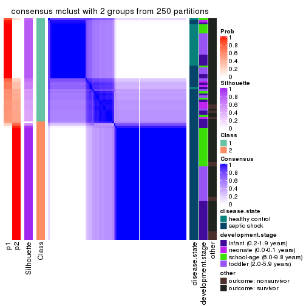</p>

</div>
<div id='tab-CV-mclust-consensus-heatmap-2'>
<pre><code class="r">consensus_heatmap(res, k = 3)
</code></pre>

<p>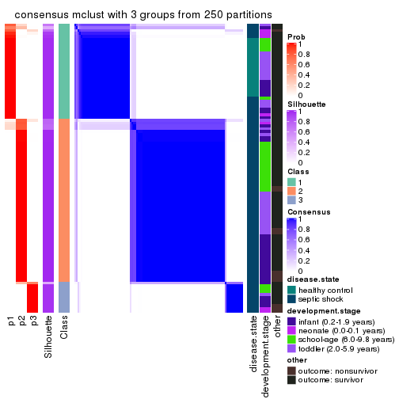</p>

</div>
<div id='tab-CV-mclust-consensus-heatmap-3'>
<pre><code class="r">consensus_heatmap(res, k = 4)
</code></pre>

<p>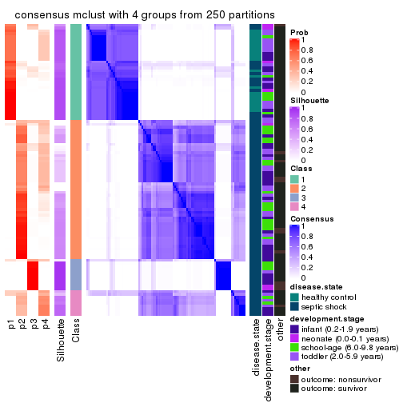</p>

</div>
<div id='tab-CV-mclust-consensus-heatmap-4'>
<pre><code class="r">consensus_heatmap(res, k = 5)
</code></pre>

<p>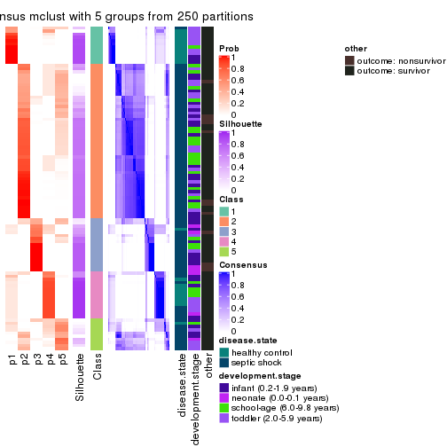</p>

</div>
<div id='tab-CV-mclust-consensus-heatmap-5'>
<pre><code class="r">consensus_heatmap(res, k = 6)
</code></pre>

<p>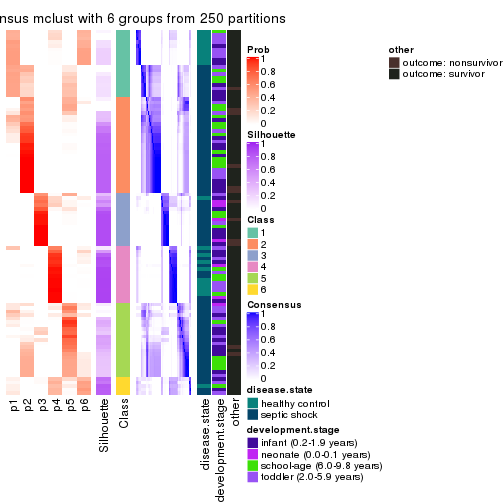</p>

</div>
</div>

Heatmaps for the membership of samples in all partitions to see how consistent they are:


<script>
$( function() {
	$( '#tabs-CV-mclust-membership-heatmap' ).tabs();
} );
</script>
<div id='tabs-CV-mclust-membership-heatmap'>
<ul>
<li><a href='#tab-CV-mclust-membership-heatmap-1'>k = 2</a></li>
<li><a href='#tab-CV-mclust-membership-heatmap-2'>k = 3</a></li>
<li><a href='#tab-CV-mclust-membership-heatmap-3'>k = 4</a></li>
<li><a href='#tab-CV-mclust-membership-heatmap-4'>k = 5</a></li>
<li><a href='#tab-CV-mclust-membership-heatmap-5'>k = 6</a></li>
</ul>
<div id='tab-CV-mclust-membership-heatmap-1'>
<pre><code class="r">membership_heatmap(res, k = 2)
</code></pre>

<p>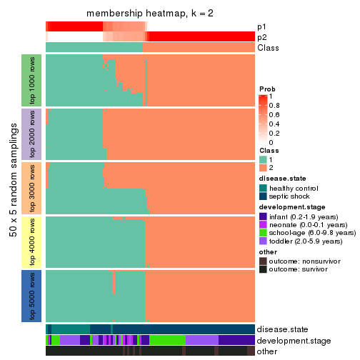</p>

</div>
<div id='tab-CV-mclust-membership-heatmap-2'>
<pre><code class="r">membership_heatmap(res, k = 3)
</code></pre>

<p>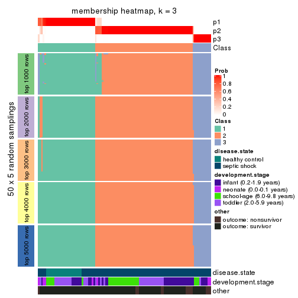</p>

</div>
<div id='tab-CV-mclust-membership-heatmap-3'>
<pre><code class="r">membership_heatmap(res, k = 4)
</code></pre>

<p>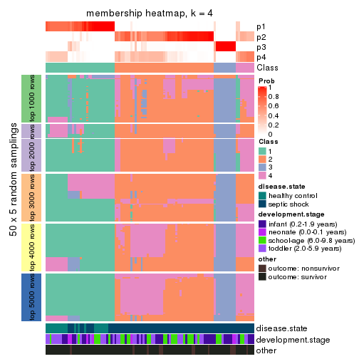</p>

</div>
<div id='tab-CV-mclust-membership-heatmap-4'>
<pre><code class="r">membership_heatmap(res, k = 5)
</code></pre>

<p>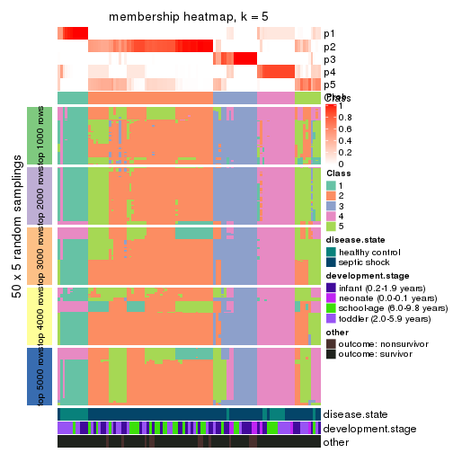</p>

</div>
<div id='tab-CV-mclust-membership-heatmap-5'>
<pre><code class="r">membership_heatmap(res, k = 6)
</code></pre>

<p>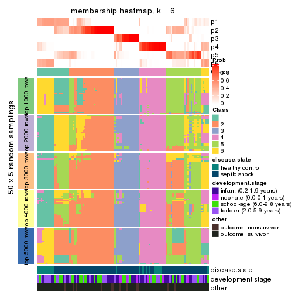</p>

</div>
</div>

As soon as we have had the classes for columns, we can look for signatures
which are significantly different between classes which can be candidate marks
for certain classes. Following are the heatmaps for signatures.


Signature heatmaps where rows are scaled:


<script>
$( function() {
	$( '#tabs-CV-mclust-get-signatures' ).tabs();
} );
</script>
<div id='tabs-CV-mclust-get-signatures'>
<ul>
<li><a href='#tab-CV-mclust-get-signatures-1'>k = 2</a></li>
<li><a href='#tab-CV-mclust-get-signatures-2'>k = 3</a></li>
<li><a href='#tab-CV-mclust-get-signatures-3'>k = 4</a></li>
<li><a href='#tab-CV-mclust-get-signatures-4'>k = 5</a></li>
<li><a href='#tab-CV-mclust-get-signatures-5'>k = 6</a></li>
</ul>
<div id='tab-CV-mclust-get-signatures-1'>
<pre><code class="r">get_signatures(res, k = 2)
</code></pre>

<p>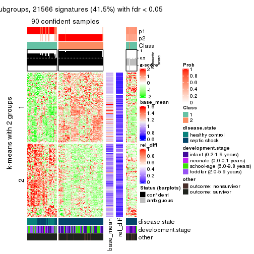</p>

</div>
<div id='tab-CV-mclust-get-signatures-2'>
<pre><code class="r">get_signatures(res, k = 3)
</code></pre>

<p>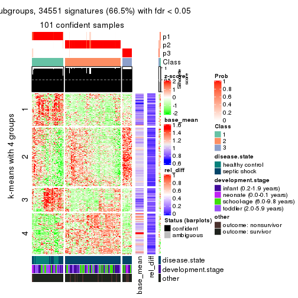</p>

</div>
<div id='tab-CV-mclust-get-signatures-3'>
<pre><code class="r">get_signatures(res, k = 4)
</code></pre>

<p>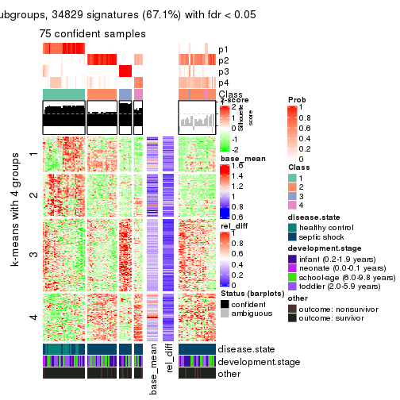</p>

</div>
<div id='tab-CV-mclust-get-signatures-4'>
<pre><code class="r">get_signatures(res, k = 5)
</code></pre>

<p>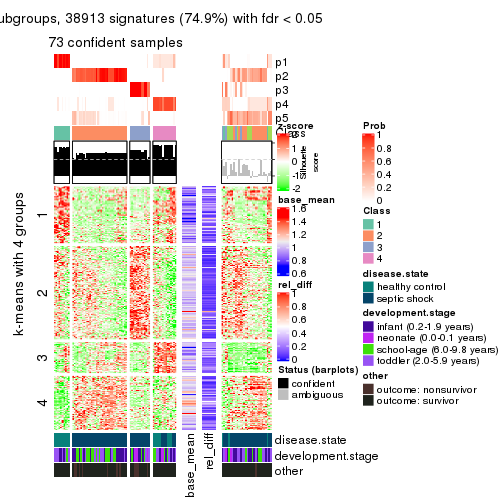</p>

</div>
<div id='tab-CV-mclust-get-signatures-5'>
<pre><code class="r">get_signatures(res, k = 6)
</code></pre>

<p>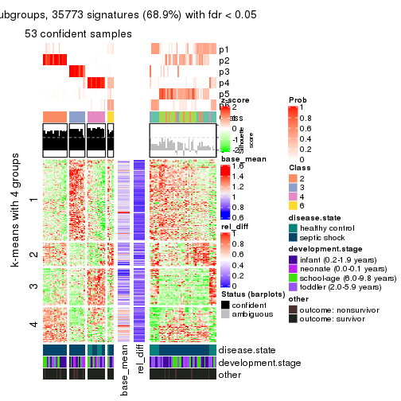</p>

</div>
</div>


Signature heatmaps where rows are not scaled:


<script>
$( function() {
	$( '#tabs-CV-mclust-get-signatures-no-scale' ).tabs();
} );
</script>
<div id='tabs-CV-mclust-get-signatures-no-scale'>
<ul>
<li><a href='#tab-CV-mclust-get-signatures-no-scale-1'>k = 2</a></li>
<li><a href='#tab-CV-mclust-get-signatures-no-scale-2'>k = 3</a></li>
<li><a href='#tab-CV-mclust-get-signatures-no-scale-3'>k = 4</a></li>
<li><a href='#tab-CV-mclust-get-signatures-no-scale-4'>k = 5</a></li>
<li><a href='#tab-CV-mclust-get-signatures-no-scale-5'>k = 6</a></li>
</ul>
<div id='tab-CV-mclust-get-signatures-no-scale-1'>
<pre><code class="r">get_signatures(res, k = 2, scale_rows = FALSE)
</code></pre>

<p>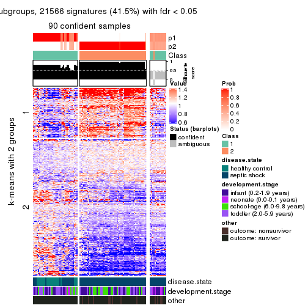</p>

</div>
<div id='tab-CV-mclust-get-signatures-no-scale-2'>
<pre><code class="r">get_signatures(res, k = 3, scale_rows = FALSE)
</code></pre>

<p>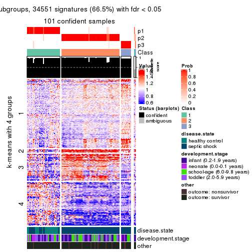</p>

</div>
<div id='tab-CV-mclust-get-signatures-no-scale-3'>
<pre><code class="r">get_signatures(res, k = 4, scale_rows = FALSE)
</code></pre>

<p>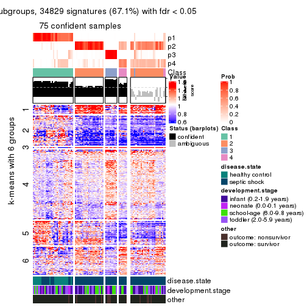</p>

</div>
<div id='tab-CV-mclust-get-signatures-no-scale-4'>
<pre><code class="r">get_signatures(res, k = 5, scale_rows = FALSE)
</code></pre>

<pre><code>#&gt; Error in mat[ceiling(1:nr/h_ratio), ceiling(1:nc/w_ratio), drop = FALSE]: subscript out of bounds
</code></pre>

<p>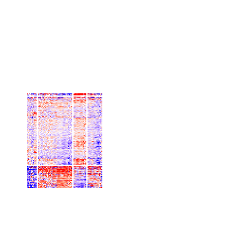</p>

</div>
<div id='tab-CV-mclust-get-signatures-no-scale-5'>
<pre><code class="r">get_signatures(res, k = 6, scale_rows = FALSE)
</code></pre>

<pre><code>#&gt; Error in mat[ceiling(1:nr/h_ratio), ceiling(1:nc/w_ratio), drop = FALSE]: subscript out of bounds
</code></pre>

<p>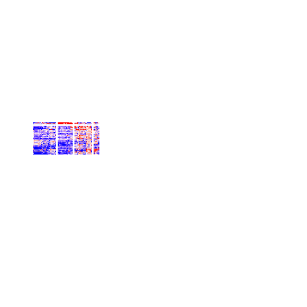</p>

</div>
</div>


Compare the overlap of signatures from different k:

```r
compare_signatures(res)
```

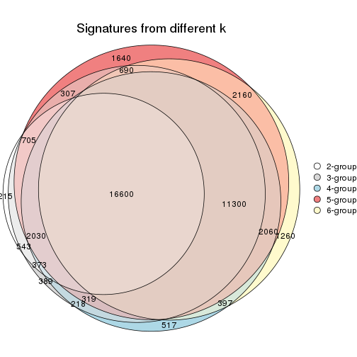

`get_signature()` returns a data frame invisibly. TO get the list of signatures, the function
call should be assigned to a variable explicitly. In following code, if `plot` argument is set
to `FALSE`, no heatmap is plotted while only the differential analysis is performed.

```r
# code only for demonstration
tb = get_signature(res, k = ..., plot = FALSE)
```

An example of the output of `tb` is:

```
#>   which_row         fdr    mean_1    mean_2 scaled_mean_1 scaled_mean_2 km
#> 1        38 0.042760348  8.373488  9.131774    -0.5533452     0.5164555  1
#> 2        40 0.018707592  7.106213  8.469186    -0.6173731     0.5762149  1
#> 3        55 0.019134737 10.221463 11.207825    -0.6159697     0.5749050  1
#> 4        59 0.006059896  5.921854  7.869574    -0.6899429     0.6439467  1
#> 5        60 0.018055526  8.928898 10.211722    -0.6204761     0.5791110  1
#> 6        98 0.009384629 15.714769 14.887706     0.6635654    -0.6193277  2
...
```

The columns in `tb` are:

1. `which_row`: row indices corresponding to the input matrix.
2. `fdr`: FDR for the differential test. 
3. `mean_x`: The mean value in group x.
4. `scaled_mean_x`: The mean value in group x after rows are scaled.
5. `km`: Row groups if k-means clustering is applied to rows.


UMAP plot which shows how samples are separated.


<script>
$( function() {
	$( '#tabs-CV-mclust-dimension-reduction' ).tabs();
} );
</script>
<div id='tabs-CV-mclust-dimension-reduction'>
<ul>
<li><a href='#tab-CV-mclust-dimension-reduction-1'>k = 2</a></li>
<li><a href='#tab-CV-mclust-dimension-reduction-2'>k = 3</a></li>
<li><a href='#tab-CV-mclust-dimension-reduction-3'>k = 4</a></li>
<li><a href='#tab-CV-mclust-dimension-reduction-4'>k = 5</a></li>
<li><a href='#tab-CV-mclust-dimension-reduction-5'>k = 6</a></li>
</ul>
<div id='tab-CV-mclust-dimension-reduction-1'>
<pre><code class="r">dimension_reduction(res, k = 2, method = &quot;UMAP&quot;)
</code></pre>

<p>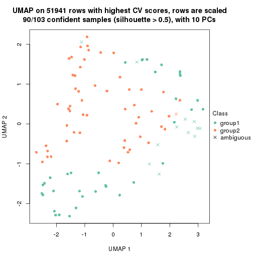</p>

</div>
<div id='tab-CV-mclust-dimension-reduction-2'>
<pre><code class="r">dimension_reduction(res, k = 3, method = &quot;UMAP&quot;)
</code></pre>

<p>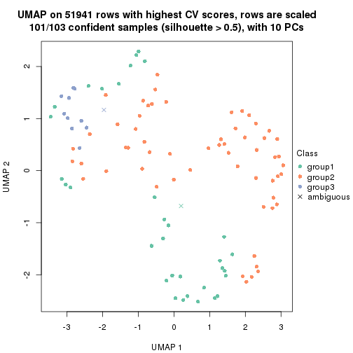</p>

</div>
<div id='tab-CV-mclust-dimension-reduction-3'>
<pre><code class="r">dimension_reduction(res, k = 4, method = &quot;UMAP&quot;)
</code></pre>

<p>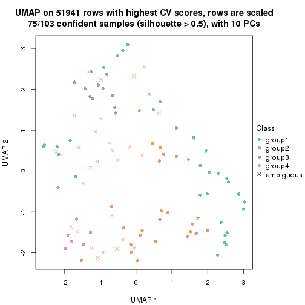</p>

</div>
<div id='tab-CV-mclust-dimension-reduction-4'>
<pre><code class="r">dimension_reduction(res, k = 5, method = &quot;UMAP&quot;)
</code></pre>

<p>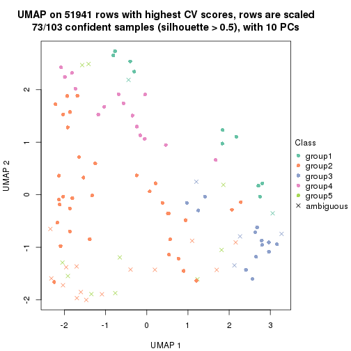</p>

</div>
<div id='tab-CV-mclust-dimension-reduction-5'>
<pre><code class="r">dimension_reduction(res, k = 6, method = &quot;UMAP&quot;)
</code></pre>

<p>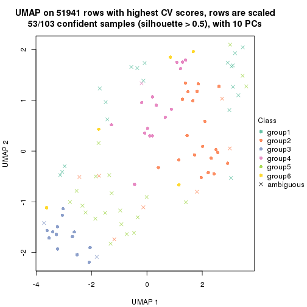</p>

</div>
</div>


Following heatmap shows how subgroups are split when increasing `k`:

```r
collect_classes(res)
```

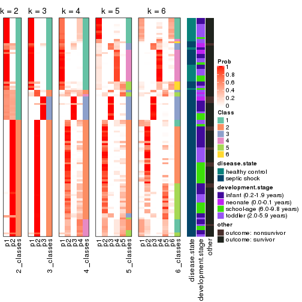


Test correlation between subgroups and known annotations. If the known
annotation is numeric, one-way ANOVA test is applied, and if the known
annotation is discrete, chi-squared contingency table test is applied.

```r
test_to_known_factors(res)
```

```
#>             n disease.state(p) development.stage(p) other(p) k
#> CV:mclust  90         7.48e-10               0.0756   0.0412 2
#> CV:mclust 101         1.37e-12               0.1025   0.0548 3
#> CV:mclust  75         1.12e-07               0.3983   0.1008 4
#> CV:mclust  73         1.92e-11               0.0496   0.0549 5
#> CV:mclust  53         1.13e-04               0.2918   0.0859 6
```


If matrix rows can be associated to genes, consider to use `functional_enrichment(res,
...)` to perform function enrichment for the signature genes. See [this vignette](http://bioconductor.org/packages/devel/bioc/vignettes/cola/inst/doc/functional_enrichment.html) for more detailed explanations.


 

---------------------------------------------------


### CV:NMF**


The object with results only for a single top-value method and a single partition method 
can be extracted as:

```r
res = res_list["CV", "NMF"]
# you can also extract it by
# res = res_list["CV:NMF"]
```

A summary of `res` and all the functions that can be applied to it:

```r
res
```

```
#> A 'ConsensusPartition' object with k = 2, 3, 4, 5, 6.
#>   On a matrix with 51941 rows and 103 columns.
#>   Top rows (1000, 2000, 3000, 4000, 5000) are extracted by 'CV' method.
#>   Subgroups are detected by 'NMF' method.
#>   Performed in total 1250 partitions by row resampling.
#>   Best k for subgroups seems to be 2.
#> 
#> Following methods can be applied to this 'ConsensusPartition' object:
#>  [1] "cola_report"             "collect_classes"         "collect_plots"          
#>  [4] "collect_stats"           "colnames"                "compare_signatures"     
#>  [7] "consensus_heatmap"       "dimension_reduction"     "functional_enrichment"  
#> [10] "get_anno_col"            "get_anno"                "get_classes"            
#> [13] "get_consensus"           "get_matrix"              "get_membership"         
#> [16] "get_param"               "get_signatures"          "get_stats"              
#> [19] "is_best_k"               "is_stable_k"             "membership_heatmap"     
#> [22] "ncol"                    "nrow"                    "plot_ecdf"              
#> [25] "rownames"                "select_partition_number" "show"                   
#> [28] "suggest_best_k"          "test_to_known_factors"
```

`collect_plots()` function collects all the plots made from `res` for all `k` (number of partitions)
into one single page to provide an easy and fast comparison between different `k`.

```r
collect_plots(res)
```

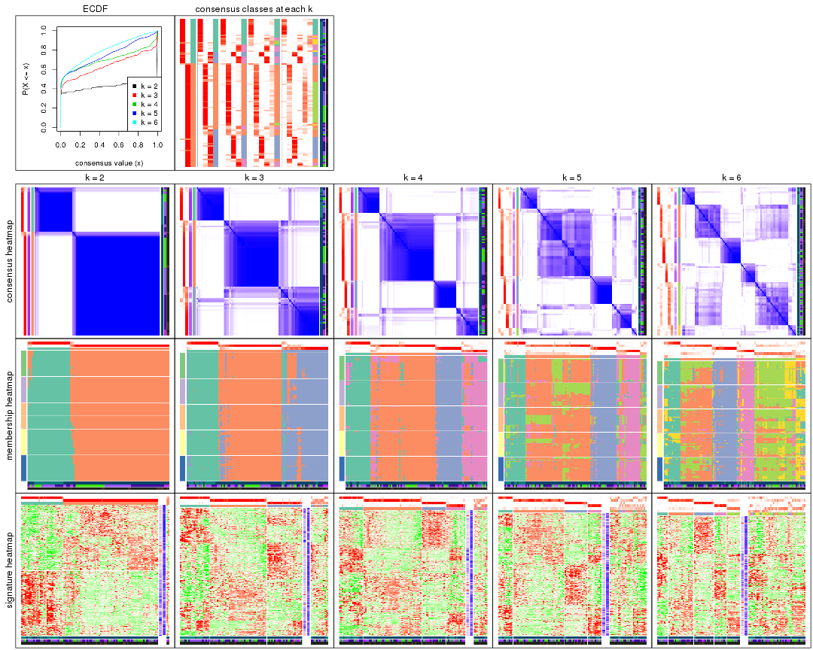

The plots are:

- The first row: a plot of the ECDF (empirical cumulative distribution
  function) curves of the consensus matrix for each `k` and the heatmap of
  predicted classes for each `k`.
- The second row: heatmaps of the consensus matrix for each `k`.
- The third row: heatmaps of the membership matrix for each `k`.
- The fouth row: heatmaps of the signatures for each `k`.

All the plots in panels can be made by individual functions and they are
plotted later in this section.

`select_partition_number()` produces several plots showing different
statistics for choosing "optimized" `k`. There are following statistics:

- ECDF curves of the consensus matrix for each `k`;
- 1-PAC. [The PAC
  score](https://en.wikipedia.org/wiki/Consensus_clustering#Over-interpretation_potential_of_consensus_clustering)
  measures the proportion of the ambiguous subgrouping.
- Mean silhouette score.
- Concordance. The mean probability of fiting the consensus class ids in all
  partitions.
- Area increased. Denote $A_k$ as the area under the ECDF curve for current
  `k`, the area increased is defined as $A_k - A_{k-1}$.
- Rand index. The percent of pairs of samples that are both in a same cluster
  or both are not in a same cluster in the partition of k and k-1.
- Jaccard index. The ratio of pairs of samples are both in a same cluster in
  the partition of k and k-1 and the pairs of samples are both in a same
  cluster in the partition k or k-1.

The detailed explanations of these statistics can be found in [the _cola_
vignette](http://bioconductor.org/packages/devel/bioc/vignettes/cola/inst/doc/cola.html#toc_13).

Generally speaking, lower PAC score, higher mean silhouette score or higher
concordance corresponds to better partition. Rand index and Jaccard index
measure how similar the current partition is compared to partition with `k-1`.
If they are too similar, we won't accept `k` is better than `k-1`.

```r
select_partition_number(res)
```

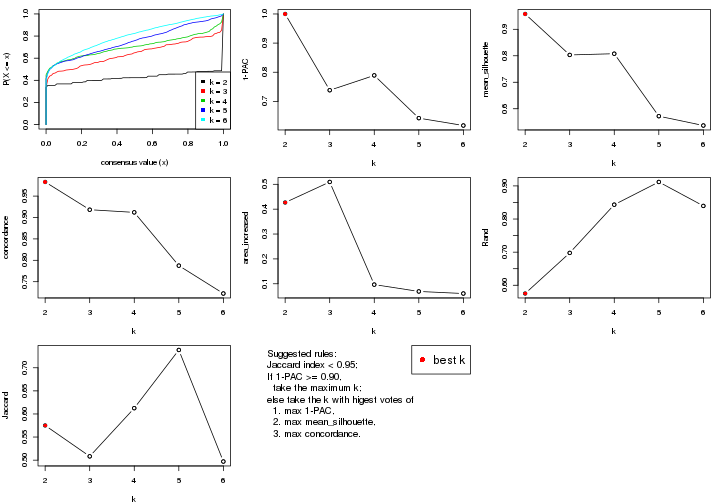

The numeric values for all these statistics can be obtained by `get_stats()`.

```r
get_stats(res)
```

```
#>   k 1-PAC mean_silhouette concordance area_increased  Rand Jaccard
#> 2 2 1.000           0.958       0.983         0.4267 0.575   0.575
#> 3 3 0.738           0.803       0.918         0.5093 0.698   0.508
#> 4 4 0.789           0.808       0.912         0.0967 0.843   0.613
#> 5 5 0.642           0.572       0.787         0.0692 0.912   0.739
#> 6 6 0.617           0.537       0.722         0.0608 0.840   0.497
```

`suggest_best_k()` suggests the best $k$ based on these statistics. The rules are as follows:

- All $k$ with Jaccard index larger than 0.95 are removed because increasing
  $k$ does not provide enough extra information. If all $k$ are removed, it is
  marked as no subgroup is detected.
- For all $k$ with 1-PAC score larger than 0.9, the maximal $k$ is taken as
  the best $k$, and other $k$ are marked as optional $k$.
- If it does not fit the second rule. The $k$ with the maximal vote of the
  highest 1-PAC score, highest mean silhouette, and highest concordance is
  taken as the best $k$.

```r
suggest_best_k(res)
```

```
#> [1] 2
```


Following shows the table of the partitions (You need to click the **show/hide
code output** link to see it). The membership matrix (columns with name `p*`)
is inferred by
[`clue::cl_consensus()`](https://www.rdocumentation.org/link/cl_consensus?package=clue)
function with the `SE` method. Basically the value in the membership matrix
represents the probability to belong to a certain group. The finall class
label for an item is determined with the group with highest probability it
belongs to.

In `get_classes()` function, the entropy is calculated from the membership
matrix and the silhouette score is calculated from the consensus matrix.


<script>
$( function() {
	$( '#tabs-CV-NMF-get-classes' ).tabs();
} );
</script>
<div id='tabs-CV-NMF-get-classes'>
<ul>
<li><a href='#tab-CV-NMF-get-classes-1'>k = 2</a></li>
<li><a href='#tab-CV-NMF-get-classes-2'>k = 3</a></li>
<li><a href='#tab-CV-NMF-get-classes-3'>k = 4</a></li>
<li><a href='#tab-CV-NMF-get-classes-4'>k = 5</a></li>
<li><a href='#tab-CV-NMF-get-classes-5'>k = 6</a></li>
</ul>

<div id='tab-CV-NMF-get-classes-1'>
<p><a id='tab-CV-NMF-get-classes-1-a' style='color:#0366d6' href='#'>show/hide code output</a></p>
<pre><code class="r">cbind(get_classes(res, k = 2), get_membership(res, k = 2))
</code></pre>

<pre><code>#&gt;           class entropy silhouette    p1    p2
#&gt; GSM647569     2  0.0000      0.985 0.000 1.000
#&gt; GSM647574     2  0.9850      0.228 0.428 0.572
#&gt; GSM647577     2  0.0000      0.985 0.000 1.000
#&gt; GSM647547     1  0.2948      0.930 0.948 0.052
#&gt; GSM647552     2  0.0000      0.985 0.000 1.000
#&gt; GSM647553     1  0.5946      0.831 0.856 0.144
#&gt; GSM647565     2  0.0000      0.985 0.000 1.000
#&gt; GSM647545     2  0.0000      0.985 0.000 1.000
#&gt; GSM647549     2  0.0000      0.985 0.000 1.000
#&gt; GSM647550     2  0.0000      0.985 0.000 1.000
#&gt; GSM647560     2  0.0000      0.985 0.000 1.000
#&gt; GSM647617     2  0.0000      0.985 0.000 1.000
#&gt; GSM647528     2  0.0000      0.985 0.000 1.000
#&gt; GSM647529     1  0.0000      0.975 1.000 0.000
#&gt; GSM647531     2  0.0000      0.985 0.000 1.000
#&gt; GSM647540     2  0.0000      0.985 0.000 1.000
#&gt; GSM647541     2  0.0000      0.985 0.000 1.000
#&gt; GSM647546     2  0.0000      0.985 0.000 1.000
#&gt; GSM647557     2  0.0000      0.985 0.000 1.000
#&gt; GSM647561     2  0.0000      0.985 0.000 1.000
#&gt; GSM647567     1  0.9000      0.550 0.684 0.316
#&gt; GSM647568     2  0.0000      0.985 0.000 1.000
#&gt; GSM647570     2  0.0000      0.985 0.000 1.000
#&gt; GSM647573     1  0.0000      0.975 1.000 0.000
#&gt; GSM647576     2  0.0000      0.985 0.000 1.000
#&gt; GSM647579     2  0.0000      0.985 0.000 1.000
#&gt; GSM647580     2  0.0000      0.985 0.000 1.000
#&gt; GSM647583     2  0.0000      0.985 0.000 1.000
#&gt; GSM647592     2  0.0672      0.977 0.008 0.992
#&gt; GSM647593     2  0.0000      0.985 0.000 1.000
#&gt; GSM647595     2  0.0000      0.985 0.000 1.000
#&gt; GSM647597     1  0.0000      0.975 1.000 0.000
#&gt; GSM647598     2  0.0000      0.985 0.000 1.000
#&gt; GSM647613     2  0.0000      0.985 0.000 1.000
#&gt; GSM647615     2  0.0000      0.985 0.000 1.000
#&gt; GSM647616     2  0.7376      0.725 0.208 0.792
#&gt; GSM647619     2  0.0000      0.985 0.000 1.000
#&gt; GSM647582     2  0.0000      0.985 0.000 1.000
#&gt; GSM647591     2  0.0000      0.985 0.000 1.000
#&gt; GSM647527     2  0.0000      0.985 0.000 1.000
#&gt; GSM647530     1  0.0376      0.971 0.996 0.004
#&gt; GSM647532     1  0.0000      0.975 1.000 0.000
#&gt; GSM647544     2  0.0000      0.985 0.000 1.000
#&gt; GSM647551     2  0.0000      0.985 0.000 1.000
#&gt; GSM647556     2  0.0000      0.985 0.000 1.000
#&gt; GSM647558     2  0.0000      0.985 0.000 1.000
#&gt; GSM647572     2  0.0000      0.985 0.000 1.000
#&gt; GSM647578     2  0.0000      0.985 0.000 1.000
#&gt; GSM647581     2  0.0000      0.985 0.000 1.000
#&gt; GSM647594     2  0.9460      0.415 0.364 0.636
#&gt; GSM647599     1  0.0000      0.975 1.000 0.000
#&gt; GSM647600     2  0.0000      0.985 0.000 1.000
#&gt; GSM647601     2  0.0000      0.985 0.000 1.000
#&gt; GSM647603     2  0.0000      0.985 0.000 1.000
#&gt; GSM647610     2  0.0000      0.985 0.000 1.000
#&gt; GSM647611     2  0.0000      0.985 0.000 1.000
#&gt; GSM647612     2  0.0000      0.985 0.000 1.000
#&gt; GSM647614     2  0.0000      0.985 0.000 1.000
#&gt; GSM647618     2  0.0000      0.985 0.000 1.000
#&gt; GSM647629     2  0.0000      0.985 0.000 1.000
#&gt; GSM647535     2  0.0000      0.985 0.000 1.000
#&gt; GSM647563     2  0.0000      0.985 0.000 1.000
#&gt; GSM647542     2  0.0000      0.985 0.000 1.000
#&gt; GSM647543     2  0.0000      0.985 0.000 1.000
#&gt; GSM647548     2  0.0000      0.985 0.000 1.000
#&gt; GSM647554     2  0.0000      0.985 0.000 1.000
#&gt; GSM647555     2  0.0000      0.985 0.000 1.000
#&gt; GSM647559     2  0.0000      0.985 0.000 1.000
#&gt; GSM647562     2  0.0000      0.985 0.000 1.000
#&gt; GSM647564     2  0.0000      0.985 0.000 1.000
#&gt; GSM647571     2  0.0000      0.985 0.000 1.000
#&gt; GSM647584     2  0.0000      0.985 0.000 1.000
#&gt; GSM647585     1  0.7745      0.713 0.772 0.228
#&gt; GSM647586     2  0.0000      0.985 0.000 1.000
#&gt; GSM647587     2  0.0000      0.985 0.000 1.000
#&gt; GSM647588     2  0.0000      0.985 0.000 1.000
#&gt; GSM647596     2  0.0000      0.985 0.000 1.000
#&gt; GSM647602     2  0.0000      0.985 0.000 1.000
#&gt; GSM647609     2  0.0000      0.985 0.000 1.000
#&gt; GSM647620     2  0.0000      0.985 0.000 1.000
#&gt; GSM647627     2  0.0000      0.985 0.000 1.000
#&gt; GSM647628     2  0.0000      0.985 0.000 1.000
#&gt; GSM647533     1  0.0000      0.975 1.000 0.000
#&gt; GSM647536     1  0.0000      0.975 1.000 0.000
#&gt; GSM647537     1  0.0000      0.975 1.000 0.000
#&gt; GSM647606     1  0.0000      0.975 1.000 0.000
#&gt; GSM647621     1  0.0000      0.975 1.000 0.000
#&gt; GSM647626     1  0.0000      0.975 1.000 0.000
#&gt; GSM647538     1  0.0000      0.975 1.000 0.000
#&gt; GSM647575     1  0.0000      0.975 1.000 0.000
#&gt; GSM647590     1  0.0000      0.975 1.000 0.000
#&gt; GSM647605     1  0.0000      0.975 1.000 0.000
#&gt; GSM647607     1  0.0000      0.975 1.000 0.000
#&gt; GSM647608     1  0.0000      0.975 1.000 0.000
#&gt; GSM647622     1  0.0000      0.975 1.000 0.000
#&gt; GSM647623     1  0.0000      0.975 1.000 0.000
#&gt; GSM647624     1  0.0000      0.975 1.000 0.000
#&gt; GSM647625     1  0.0000      0.975 1.000 0.000
#&gt; GSM647534     1  0.0000      0.975 1.000 0.000
#&gt; GSM647539     1  0.0000      0.975 1.000 0.000
#&gt; GSM647566     1  0.0000      0.975 1.000 0.000
#&gt; GSM647589     1  0.0000      0.975 1.000 0.000
#&gt; GSM647604     1  0.0000      0.975 1.000 0.000
</code></pre>

<script>
$('#tab-CV-NMF-get-classes-1-a').parent().next().next().hide();
$('#tab-CV-NMF-get-classes-1-a').click(function(){
  $('#tab-CV-NMF-get-classes-1-a').parent().next().next().toggle();
  return(false);
});
</script>
</div>

<div id='tab-CV-NMF-get-classes-2'>
<p><a id='tab-CV-NMF-get-classes-2-a' style='color:#0366d6' href='#'>show/hide code output</a></p>
<pre><code class="r">cbind(get_classes(res, k = 3), get_membership(res, k = 3))
</code></pre>

<pre><code>#&gt;           class entropy silhouette    p1    p2    p3
#&gt; GSM647569     3  0.0424     0.8164 0.000 0.008 0.992
#&gt; GSM647574     3  0.0000     0.8158 0.000 0.000 1.000
#&gt; GSM647577     3  0.0000     0.8158 0.000 0.000 1.000
#&gt; GSM647547     3  0.0000     0.8158 0.000 0.000 1.000
#&gt; GSM647552     2  0.0747     0.9216 0.016 0.984 0.000
#&gt; GSM647553     3  0.0000     0.8158 0.000 0.000 1.000
#&gt; GSM647565     3  0.4346     0.7272 0.000 0.184 0.816
#&gt; GSM647545     2  0.0000     0.9324 0.000 1.000 0.000
#&gt; GSM647549     2  0.1289     0.9083 0.000 0.968 0.032
#&gt; GSM647550     3  0.3116     0.7856 0.000 0.108 0.892
#&gt; GSM647560     2  0.4178     0.7447 0.000 0.828 0.172
#&gt; GSM647617     3  0.0000     0.8158 0.000 0.000 1.000
#&gt; GSM647528     2  0.0000     0.9324 0.000 1.000 0.000
#&gt; GSM647529     1  0.0000     0.9583 1.000 0.000 0.000
#&gt; GSM647531     2  0.0000     0.9324 0.000 1.000 0.000
#&gt; GSM647540     3  0.4399     0.7135 0.000 0.188 0.812
#&gt; GSM647541     2  0.0000     0.9324 0.000 1.000 0.000
#&gt; GSM647546     3  0.0237     0.8166 0.000 0.004 0.996
#&gt; GSM647557     2  0.0000     0.9324 0.000 1.000 0.000
#&gt; GSM647561     2  0.0000     0.9324 0.000 1.000 0.000
#&gt; GSM647567     1  0.5948     0.4398 0.640 0.000 0.360
#&gt; GSM647568     3  0.0747     0.8159 0.000 0.016 0.984
#&gt; GSM647570     2  0.6280     0.0442 0.000 0.540 0.460
#&gt; GSM647573     3  0.4605     0.6557 0.204 0.000 0.796
#&gt; GSM647576     3  0.1031     0.8140 0.000 0.024 0.976
#&gt; GSM647579     3  0.6126     0.3513 0.000 0.400 0.600
#&gt; GSM647580     3  0.0000     0.8158 0.000 0.000 1.000
#&gt; GSM647583     3  0.0000     0.8158 0.000 0.000 1.000
#&gt; GSM647592     2  0.0592     0.9252 0.012 0.988 0.000
#&gt; GSM647593     2  0.0237     0.9302 0.004 0.996 0.000
#&gt; GSM647595     2  0.0237     0.9302 0.004 0.996 0.000
#&gt; GSM647597     1  0.0424     0.9535 0.992 0.008 0.000
#&gt; GSM647598     2  0.0000     0.9324 0.000 1.000 0.000
#&gt; GSM647613     2  0.0000     0.9324 0.000 1.000 0.000
#&gt; GSM647615     2  0.5785     0.4453 0.000 0.668 0.332
#&gt; GSM647616     3  0.0000     0.8158 0.000 0.000 1.000
#&gt; GSM647619     2  0.0424     0.9276 0.008 0.992 0.000
#&gt; GSM647582     2  0.0000     0.9324 0.000 1.000 0.000
#&gt; GSM647591     2  0.0237     0.9302 0.004 0.996 0.000
#&gt; GSM647527     2  0.0000     0.9324 0.000 1.000 0.000
#&gt; GSM647530     1  0.1877     0.9290 0.956 0.032 0.012
#&gt; GSM647532     1  0.0424     0.9563 0.992 0.000 0.008
#&gt; GSM647544     2  0.2066     0.8818 0.000 0.940 0.060
#&gt; GSM647551     2  0.0424     0.9276 0.008 0.992 0.000
#&gt; GSM647556     3  0.0237     0.8166 0.000 0.004 0.996
#&gt; GSM647558     3  0.6308     0.1010 0.000 0.492 0.508
#&gt; GSM647572     3  0.0237     0.8166 0.000 0.004 0.996
#&gt; GSM647578     3  0.5810     0.4924 0.000 0.336 0.664
#&gt; GSM647581     2  0.4452     0.7179 0.000 0.808 0.192
#&gt; GSM647594     2  0.5058     0.6728 0.244 0.756 0.000
#&gt; GSM647599     1  0.0000     0.9583 1.000 0.000 0.000
#&gt; GSM647600     2  0.0000     0.9324 0.000 1.000 0.000
#&gt; GSM647601     2  0.0000     0.9324 0.000 1.000 0.000
#&gt; GSM647603     2  0.0000     0.9324 0.000 1.000 0.000
#&gt; GSM647610     2  0.2297     0.8895 0.020 0.944 0.036
#&gt; GSM647611     2  0.0000     0.9324 0.000 1.000 0.000
#&gt; GSM647612     3  0.5905     0.4921 0.000 0.352 0.648
#&gt; GSM647614     3  0.6235     0.2857 0.000 0.436 0.564
#&gt; GSM647618     2  0.0000     0.9324 0.000 1.000 0.000
#&gt; GSM647629     2  0.0000     0.9324 0.000 1.000 0.000
#&gt; GSM647535     2  0.0000     0.9324 0.000 1.000 0.000
#&gt; GSM647563     2  0.0237     0.9298 0.000 0.996 0.004
#&gt; GSM647542     3  0.2165     0.8024 0.000 0.064 0.936
#&gt; GSM647543     3  0.5178     0.6532 0.000 0.256 0.744
#&gt; GSM647548     3  0.5291     0.6299 0.000 0.268 0.732
#&gt; GSM647554     2  0.4291     0.7222 0.000 0.820 0.180
#&gt; GSM647555     2  0.6260     0.0791 0.000 0.552 0.448
#&gt; GSM647559     2  0.0000     0.9324 0.000 1.000 0.000
#&gt; GSM647562     2  0.0000     0.9324 0.000 1.000 0.000
#&gt; GSM647564     3  0.0424     0.8164 0.000 0.008 0.992
#&gt; GSM647571     3  0.5529     0.5934 0.000 0.296 0.704
#&gt; GSM647584     2  0.0000     0.9324 0.000 1.000 0.000
#&gt; GSM647585     3  0.1860     0.7837 0.052 0.000 0.948
#&gt; GSM647586     2  0.0000     0.9324 0.000 1.000 0.000
#&gt; GSM647587     2  0.0000     0.9324 0.000 1.000 0.000
#&gt; GSM647588     2  0.0000     0.9324 0.000 1.000 0.000
#&gt; GSM647596     2  0.0000     0.9324 0.000 1.000 0.000
#&gt; GSM647602     3  0.0237     0.8166 0.000 0.004 0.996
#&gt; GSM647609     2  0.0000     0.9324 0.000 1.000 0.000
#&gt; GSM647620     2  0.0000     0.9324 0.000 1.000 0.000
#&gt; GSM647627     2  0.0000     0.9324 0.000 1.000 0.000
#&gt; GSM647628     2  0.5760     0.4559 0.000 0.672 0.328
#&gt; GSM647533     1  0.0000     0.9583 1.000 0.000 0.000
#&gt; GSM647536     1  0.0237     0.9576 0.996 0.000 0.004
#&gt; GSM647537     1  0.0000     0.9583 1.000 0.000 0.000
#&gt; GSM647606     1  0.0000     0.9583 1.000 0.000 0.000
#&gt; GSM647621     1  0.3879     0.8125 0.848 0.000 0.152
#&gt; GSM647626     3  0.6026     0.2796 0.376 0.000 0.624
#&gt; GSM647538     1  0.0000     0.9583 1.000 0.000 0.000
#&gt; GSM647575     1  0.4121     0.7859 0.832 0.000 0.168
#&gt; GSM647590     1  0.0747     0.9519 0.984 0.000 0.016
#&gt; GSM647605     1  0.0000     0.9583 1.000 0.000 0.000
#&gt; GSM647607     1  0.1964     0.9199 0.944 0.000 0.056
#&gt; GSM647608     3  0.6260     0.1792 0.448 0.000 0.552
#&gt; GSM647622     1  0.0237     0.9576 0.996 0.000 0.004
#&gt; GSM647623     1  0.0000     0.9583 1.000 0.000 0.000
#&gt; GSM647624     1  0.0424     0.9563 0.992 0.000 0.008
#&gt; GSM647625     1  0.0000     0.9583 1.000 0.000 0.000
#&gt; GSM647534     1  0.0424     0.9535 0.992 0.008 0.000
#&gt; GSM647539     3  0.6307     0.0624 0.488 0.000 0.512
#&gt; GSM647566     1  0.0424     0.9563 0.992 0.000 0.008
#&gt; GSM647589     3  0.0000     0.8158 0.000 0.000 1.000
#&gt; GSM647604     1  0.0000     0.9583 1.000 0.000 0.000
</code></pre>

<script>
$('#tab-CV-NMF-get-classes-2-a').parent().next().next().hide();
$('#tab-CV-NMF-get-classes-2-a').click(function(){
  $('#tab-CV-NMF-get-classes-2-a').parent().next().next().toggle();
  return(false);
});
</script>
</div>

<div id='tab-CV-NMF-get-classes-3'>
<p><a id='tab-CV-NMF-get-classes-3-a' style='color:#0366d6' href='#'>show/hide code output</a></p>
<pre><code class="r">cbind(get_classes(res, k = 4), get_membership(res, k = 4))
</code></pre>

<pre><code>#&gt;           class entropy silhouette    p1    p2    p3    p4
#&gt; GSM647569     3  0.0000      0.952 0.000 0.000 1.000 0.000
#&gt; GSM647574     3  0.3311      0.762 0.000 0.000 0.828 0.172
#&gt; GSM647577     3  0.0000      0.952 0.000 0.000 1.000 0.000
#&gt; GSM647547     4  0.0000      0.772 0.000 0.000 0.000 1.000
#&gt; GSM647552     2  0.2654      0.821 0.108 0.888 0.000 0.004
#&gt; GSM647553     3  0.0469      0.943 0.000 0.000 0.988 0.012
#&gt; GSM647565     4  0.0000      0.772 0.000 0.000 0.000 1.000
#&gt; GSM647545     2  0.1867      0.878 0.000 0.928 0.000 0.072
#&gt; GSM647549     2  0.2011      0.873 0.000 0.920 0.000 0.080
#&gt; GSM647550     2  0.6160      0.488 0.000 0.612 0.316 0.072
#&gt; GSM647560     2  0.2670      0.865 0.000 0.908 0.052 0.040
#&gt; GSM647617     3  0.0000      0.952 0.000 0.000 1.000 0.000
#&gt; GSM647528     2  0.0817      0.896 0.000 0.976 0.000 0.024
#&gt; GSM647529     1  0.1389      0.907 0.952 0.000 0.000 0.048
#&gt; GSM647531     2  0.1716      0.882 0.000 0.936 0.000 0.064
#&gt; GSM647540     3  0.0000      0.952 0.000 0.000 1.000 0.000
#&gt; GSM647541     2  0.1557      0.885 0.000 0.944 0.000 0.056
#&gt; GSM647546     3  0.0000      0.952 0.000 0.000 1.000 0.000
#&gt; GSM647557     2  0.2469      0.859 0.000 0.892 0.000 0.108
#&gt; GSM647561     2  0.1211      0.891 0.000 0.960 0.000 0.040
#&gt; GSM647567     1  0.3768      0.757 0.808 0.008 0.184 0.000
#&gt; GSM647568     4  0.4624      0.661 0.000 0.052 0.164 0.784
#&gt; GSM647570     4  0.4679      0.441 0.000 0.352 0.000 0.648
#&gt; GSM647573     4  0.1118      0.770 0.036 0.000 0.000 0.964
#&gt; GSM647576     3  0.2256      0.879 0.000 0.020 0.924 0.056
#&gt; GSM647579     3  0.0000      0.952 0.000 0.000 1.000 0.000
#&gt; GSM647580     3  0.0000      0.952 0.000 0.000 1.000 0.000
#&gt; GSM647583     3  0.0000      0.952 0.000 0.000 1.000 0.000
#&gt; GSM647592     2  0.2973      0.783 0.144 0.856 0.000 0.000
#&gt; GSM647593     2  0.0000      0.901 0.000 1.000 0.000 0.000
#&gt; GSM647595     2  0.0000      0.901 0.000 1.000 0.000 0.000
#&gt; GSM647597     1  0.1022      0.907 0.968 0.032 0.000 0.000
#&gt; GSM647598     2  0.0000      0.901 0.000 1.000 0.000 0.000
#&gt; GSM647613     2  0.1302      0.890 0.000 0.956 0.000 0.044
#&gt; GSM647615     2  0.2081      0.871 0.000 0.916 0.000 0.084
#&gt; GSM647616     3  0.0000      0.952 0.000 0.000 1.000 0.000
#&gt; GSM647619     2  0.0000      0.901 0.000 1.000 0.000 0.000
#&gt; GSM647582     2  0.0000      0.901 0.000 1.000 0.000 0.000
#&gt; GSM647591     2  0.0000      0.901 0.000 1.000 0.000 0.000
#&gt; GSM647527     2  0.0707      0.897 0.000 0.980 0.000 0.020
#&gt; GSM647530     4  0.1474      0.766 0.052 0.000 0.000 0.948
#&gt; GSM647532     4  0.4679      0.313 0.352 0.000 0.000 0.648
#&gt; GSM647544     4  0.4999      0.102 0.000 0.492 0.000 0.508
#&gt; GSM647551     2  0.0000      0.901 0.000 1.000 0.000 0.000
#&gt; GSM647556     3  0.0000      0.952 0.000 0.000 1.000 0.000
#&gt; GSM647558     4  0.4304      0.577 0.000 0.284 0.000 0.716
#&gt; GSM647572     3  0.1118      0.922 0.000 0.000 0.964 0.036
#&gt; GSM647578     3  0.4790      0.343 0.000 0.380 0.620 0.000
#&gt; GSM647581     4  0.3975      0.642 0.000 0.240 0.000 0.760
#&gt; GSM647594     2  0.4564      0.525 0.328 0.672 0.000 0.000
#&gt; GSM647599     1  0.0188      0.931 0.996 0.004 0.000 0.000
#&gt; GSM647600     2  0.0000      0.901 0.000 1.000 0.000 0.000
#&gt; GSM647601     2  0.0000      0.901 0.000 1.000 0.000 0.000
#&gt; GSM647603     2  0.0000      0.901 0.000 1.000 0.000 0.000
#&gt; GSM647610     2  0.4004      0.739 0.164 0.812 0.024 0.000
#&gt; GSM647611     2  0.0000      0.901 0.000 1.000 0.000 0.000
#&gt; GSM647612     2  0.4677      0.542 0.000 0.680 0.004 0.316
#&gt; GSM647614     2  0.4961      0.191 0.000 0.552 0.000 0.448
#&gt; GSM647618     2  0.0000      0.901 0.000 1.000 0.000 0.000
#&gt; GSM647629     2  0.0000      0.901 0.000 1.000 0.000 0.000
#&gt; GSM647535     2  0.0188      0.901 0.000 0.996 0.000 0.004
#&gt; GSM647563     2  0.1637      0.885 0.000 0.940 0.000 0.060
#&gt; GSM647542     4  0.6570      0.463 0.000 0.116 0.280 0.604
#&gt; GSM647543     2  0.7576      0.182 0.000 0.472 0.308 0.220
#&gt; GSM647548     4  0.0000      0.772 0.000 0.000 0.000 1.000
#&gt; GSM647554     2  0.3266      0.762 0.000 0.832 0.168 0.000
#&gt; GSM647555     2  0.1978      0.879 0.000 0.928 0.004 0.068
#&gt; GSM647559     2  0.0336      0.900 0.000 0.992 0.000 0.008
#&gt; GSM647562     2  0.4898      0.236 0.000 0.584 0.000 0.416
#&gt; GSM647564     3  0.0000      0.952 0.000 0.000 1.000 0.000
#&gt; GSM647571     4  0.3547      0.725 0.000 0.144 0.016 0.840
#&gt; GSM647584     2  0.0000      0.901 0.000 1.000 0.000 0.000
#&gt; GSM647585     3  0.0000      0.952 0.000 0.000 1.000 0.000
#&gt; GSM647586     2  0.0000      0.901 0.000 1.000 0.000 0.000
#&gt; GSM647587     2  0.0000      0.901 0.000 1.000 0.000 0.000
#&gt; GSM647588     2  0.1474      0.887 0.000 0.948 0.000 0.052
#&gt; GSM647596     2  0.0000      0.901 0.000 1.000 0.000 0.000
#&gt; GSM647602     3  0.0000      0.952 0.000 0.000 1.000 0.000
#&gt; GSM647609     2  0.0000      0.901 0.000 1.000 0.000 0.000
#&gt; GSM647620     2  0.0000      0.901 0.000 1.000 0.000 0.000
#&gt; GSM647627     2  0.0000      0.901 0.000 1.000 0.000 0.000
#&gt; GSM647628     2  0.3942      0.692 0.000 0.764 0.000 0.236
#&gt; GSM647533     1  0.0000      0.934 1.000 0.000 0.000 0.000
#&gt; GSM647536     1  0.3569      0.773 0.804 0.000 0.000 0.196
#&gt; GSM647537     1  0.0000      0.934 1.000 0.000 0.000 0.000
#&gt; GSM647606     1  0.0000      0.934 1.000 0.000 0.000 0.000
#&gt; GSM647621     4  0.4454      0.446 0.308 0.000 0.000 0.692
#&gt; GSM647626     3  0.0000      0.952 0.000 0.000 1.000 0.000
#&gt; GSM647538     1  0.0188      0.933 0.996 0.000 0.000 0.004
#&gt; GSM647575     4  0.1792      0.758 0.068 0.000 0.000 0.932
#&gt; GSM647590     1  0.4164      0.687 0.736 0.000 0.000 0.264
#&gt; GSM647605     1  0.0000      0.934 1.000 0.000 0.000 0.000
#&gt; GSM647607     4  0.1940      0.752 0.076 0.000 0.000 0.924
#&gt; GSM647608     4  0.1867      0.755 0.072 0.000 0.000 0.928
#&gt; GSM647622     1  0.0000      0.934 1.000 0.000 0.000 0.000
#&gt; GSM647623     1  0.0000      0.934 1.000 0.000 0.000 0.000
#&gt; GSM647624     1  0.0469      0.929 0.988 0.000 0.000 0.012
#&gt; GSM647625     1  0.0000      0.934 1.000 0.000 0.000 0.000
#&gt; GSM647534     1  0.0707      0.919 0.980 0.020 0.000 0.000
#&gt; GSM647539     4  0.1557      0.764 0.056 0.000 0.000 0.944
#&gt; GSM647566     1  0.4164      0.688 0.736 0.000 0.000 0.264
#&gt; GSM647589     4  0.1398      0.769 0.040 0.000 0.004 0.956
#&gt; GSM647604     1  0.0000      0.934 1.000 0.000 0.000 0.000
</code></pre>

<script>
$('#tab-CV-NMF-get-classes-3-a').parent().next().next().hide();
$('#tab-CV-NMF-get-classes-3-a').click(function(){
  $('#tab-CV-NMF-get-classes-3-a').parent().next().next().toggle();
  return(false);
});
</script>
</div>

<div id='tab-CV-NMF-get-classes-4'>
<p><a id='tab-CV-NMF-get-classes-4-a' style='color:#0366d6' href='#'>show/hide code output</a></p>
<pre><code class="r">cbind(get_classes(res, k = 5), get_membership(res, k = 5))
</code></pre>

<pre><code>#&gt;           class entropy silhouette    p1    p2    p3    p4    p5
#&gt; GSM647569     3  0.0000   0.888572 0.000 0.000 1.000 0.000 0.000
#&gt; GSM647574     3  0.3757   0.675874 0.000 0.000 0.772 0.208 0.020
#&gt; GSM647577     3  0.0000   0.888572 0.000 0.000 1.000 0.000 0.000
#&gt; GSM647547     4  0.0609   0.702931 0.000 0.000 0.000 0.980 0.020
#&gt; GSM647552     5  0.6285   0.361781 0.140 0.356 0.000 0.004 0.500
#&gt; GSM647553     3  0.1942   0.835804 0.000 0.000 0.920 0.068 0.012
#&gt; GSM647565     4  0.3123   0.598823 0.000 0.012 0.000 0.828 0.160
#&gt; GSM647545     2  0.3662   0.650022 0.000 0.744 0.000 0.004 0.252
#&gt; GSM647549     2  0.4026   0.645765 0.000 0.736 0.000 0.020 0.244
#&gt; GSM647550     2  0.6012   0.512774 0.000 0.612 0.168 0.008 0.212
#&gt; GSM647560     2  0.3521   0.656652 0.000 0.764 0.000 0.004 0.232
#&gt; GSM647617     3  0.0000   0.888572 0.000 0.000 1.000 0.000 0.000
#&gt; GSM647528     2  0.1410   0.701803 0.000 0.940 0.000 0.000 0.060
#&gt; GSM647529     5  0.6148  -0.061317 0.304 0.000 0.000 0.160 0.536
#&gt; GSM647531     5  0.5039  -0.358113 0.000 0.456 0.000 0.032 0.512
#&gt; GSM647540     3  0.0000   0.888572 0.000 0.000 1.000 0.000 0.000
#&gt; GSM647541     2  0.3521   0.657384 0.000 0.764 0.000 0.004 0.232
#&gt; GSM647546     3  0.1792   0.821416 0.000 0.000 0.916 0.000 0.084
#&gt; GSM647557     2  0.5216   0.361982 0.000 0.520 0.000 0.044 0.436
#&gt; GSM647561     2  0.3336   0.660683 0.000 0.772 0.000 0.000 0.228
#&gt; GSM647567     5  0.6721   0.018548 0.392 0.036 0.092 0.004 0.476
#&gt; GSM647568     4  0.6495   0.223263 0.000 0.232 0.004 0.520 0.244
#&gt; GSM647570     2  0.6304   0.412519 0.000 0.532 0.000 0.220 0.248
#&gt; GSM647573     4  0.0510   0.705022 0.000 0.000 0.000 0.984 0.016
#&gt; GSM647576     3  0.6740   0.092761 0.000 0.272 0.484 0.008 0.236
#&gt; GSM647579     3  0.0162   0.885823 0.000 0.004 0.996 0.000 0.000
#&gt; GSM647580     3  0.0000   0.888572 0.000 0.000 1.000 0.000 0.000
#&gt; GSM647583     3  0.0000   0.888572 0.000 0.000 1.000 0.000 0.000
#&gt; GSM647592     2  0.5382   0.346576 0.212 0.660 0.000 0.000 0.128
#&gt; GSM647593     2  0.1544   0.679622 0.000 0.932 0.000 0.000 0.068
#&gt; GSM647595     2  0.1341   0.686386 0.000 0.944 0.000 0.000 0.056
#&gt; GSM647597     1  0.2408   0.714277 0.892 0.016 0.000 0.000 0.092
#&gt; GSM647598     2  0.0290   0.699145 0.000 0.992 0.000 0.000 0.008
#&gt; GSM647613     2  0.3395   0.657981 0.000 0.764 0.000 0.000 0.236
#&gt; GSM647615     2  0.4114   0.640529 0.000 0.732 0.000 0.024 0.244
#&gt; GSM647616     3  0.0000   0.888572 0.000 0.000 1.000 0.000 0.000
#&gt; GSM647619     2  0.3940   0.525466 0.024 0.756 0.000 0.000 0.220
#&gt; GSM647582     2  0.3242   0.622581 0.000 0.784 0.000 0.000 0.216
#&gt; GSM647591     2  0.1544   0.678080 0.000 0.932 0.000 0.000 0.068
#&gt; GSM647527     2  0.1270   0.702060 0.000 0.948 0.000 0.000 0.052
#&gt; GSM647530     4  0.1701   0.688605 0.048 0.000 0.000 0.936 0.016
#&gt; GSM647532     4  0.5714   0.266176 0.292 0.000 0.000 0.592 0.116
#&gt; GSM647544     4  0.6166   0.315799 0.000 0.200 0.000 0.556 0.244
#&gt; GSM647551     2  0.3932   0.307774 0.000 0.672 0.000 0.000 0.328
#&gt; GSM647556     3  0.0000   0.888572 0.000 0.000 1.000 0.000 0.000
#&gt; GSM647558     2  0.6538   0.328868 0.000 0.480 0.000 0.272 0.248
#&gt; GSM647572     3  0.5273   0.600322 0.000 0.004 0.692 0.164 0.140
#&gt; GSM647578     3  0.4588   0.262432 0.000 0.380 0.604 0.000 0.016
#&gt; GSM647581     4  0.6590   0.130606 0.000 0.288 0.000 0.464 0.248
#&gt; GSM647594     1  0.4088  -0.027568 0.632 0.368 0.000 0.000 0.000
#&gt; GSM647599     1  0.3636   0.634025 0.844 0.040 0.004 0.016 0.096
#&gt; GSM647600     2  0.2690   0.607288 0.000 0.844 0.000 0.000 0.156
#&gt; GSM647601     2  0.0794   0.692949 0.000 0.972 0.000 0.000 0.028
#&gt; GSM647603     2  0.3452   0.530088 0.000 0.756 0.000 0.000 0.244
#&gt; GSM647610     2  0.6496   0.042167 0.232 0.488 0.000 0.000 0.280
#&gt; GSM647611     2  0.3039   0.583140 0.000 0.808 0.000 0.000 0.192
#&gt; GSM647612     2  0.4563   0.625151 0.000 0.708 0.000 0.048 0.244
#&gt; GSM647614     2  0.5215   0.582827 0.000 0.664 0.000 0.096 0.240
#&gt; GSM647618     2  0.3508   0.536304 0.000 0.748 0.000 0.000 0.252
#&gt; GSM647629     2  0.2773   0.684198 0.000 0.836 0.000 0.000 0.164
#&gt; GSM647535     2  0.0510   0.699720 0.000 0.984 0.000 0.000 0.016
#&gt; GSM647563     2  0.3462   0.676589 0.000 0.792 0.000 0.012 0.196
#&gt; GSM647542     2  0.6965   0.343425 0.000 0.484 0.020 0.248 0.248
#&gt; GSM647543     2  0.5240   0.606971 0.000 0.684 0.036 0.036 0.244
#&gt; GSM647548     4  0.0609   0.703048 0.000 0.000 0.000 0.980 0.020
#&gt; GSM647554     2  0.4777   0.321717 0.000 0.664 0.044 0.000 0.292
#&gt; GSM647555     2  0.3607   0.652563 0.000 0.752 0.000 0.004 0.244
#&gt; GSM647559     2  0.4141   0.511935 0.000 0.728 0.000 0.024 0.248
#&gt; GSM647562     2  0.6630   0.189321 0.000 0.444 0.000 0.316 0.240
#&gt; GSM647564     3  0.0000   0.888572 0.000 0.000 1.000 0.000 0.000
#&gt; GSM647571     4  0.6637   0.183441 0.000 0.268 0.000 0.452 0.280
#&gt; GSM647584     2  0.1544   0.677857 0.000 0.932 0.000 0.000 0.068
#&gt; GSM647585     3  0.0000   0.888572 0.000 0.000 1.000 0.000 0.000
#&gt; GSM647586     2  0.0609   0.695985 0.000 0.980 0.000 0.000 0.020
#&gt; GSM647587     2  0.3728   0.527232 0.000 0.748 0.000 0.008 0.244
#&gt; GSM647588     2  0.3010   0.643951 0.000 0.824 0.000 0.004 0.172
#&gt; GSM647596     2  0.0955   0.699015 0.000 0.968 0.000 0.004 0.028
#&gt; GSM647602     3  0.0000   0.888572 0.000 0.000 1.000 0.000 0.000
#&gt; GSM647609     2  0.0794   0.692949 0.000 0.972 0.000 0.000 0.028
#&gt; GSM647620     2  0.0794   0.692949 0.000 0.972 0.000 0.000 0.028
#&gt; GSM647627     2  0.0609   0.695208 0.000 0.980 0.000 0.000 0.020
#&gt; GSM647628     2  0.4238   0.668785 0.000 0.768 0.000 0.068 0.164
#&gt; GSM647533     1  0.3487   0.585769 0.780 0.000 0.000 0.008 0.212
#&gt; GSM647536     4  0.6700  -0.052082 0.324 0.000 0.000 0.420 0.256
#&gt; GSM647537     1  0.3093   0.635169 0.824 0.000 0.000 0.008 0.168
#&gt; GSM647606     1  0.0898   0.740015 0.972 0.000 0.000 0.008 0.020
#&gt; GSM647621     1  0.6646   0.000303 0.396 0.000 0.000 0.380 0.224
#&gt; GSM647626     3  0.0162   0.886092 0.004 0.000 0.996 0.000 0.000
#&gt; GSM647538     1  0.4329   0.421554 0.672 0.000 0.000 0.016 0.312
#&gt; GSM647575     4  0.0671   0.702790 0.016 0.000 0.000 0.980 0.004
#&gt; GSM647590     1  0.5129   0.388325 0.616 0.000 0.000 0.328 0.056
#&gt; GSM647605     1  0.0404   0.743536 0.988 0.000 0.000 0.000 0.012
#&gt; GSM647607     4  0.0955   0.700113 0.028 0.000 0.000 0.968 0.004
#&gt; GSM647608     4  0.1211   0.693819 0.024 0.000 0.000 0.960 0.016
#&gt; GSM647622     1  0.0609   0.742188 0.980 0.000 0.000 0.000 0.020
#&gt; GSM647623     1  0.0404   0.743364 0.988 0.000 0.000 0.000 0.012
#&gt; GSM647624     1  0.0992   0.740383 0.968 0.000 0.000 0.024 0.008
#&gt; GSM647625     1  0.0609   0.740733 0.980 0.000 0.000 0.000 0.020
#&gt; GSM647534     5  0.6172   0.150964 0.356 0.144 0.000 0.000 0.500
#&gt; GSM647539     4  0.0324   0.705099 0.004 0.000 0.000 0.992 0.004
#&gt; GSM647566     4  0.4960   0.424063 0.064 0.000 0.000 0.668 0.268
#&gt; GSM647589     4  0.0324   0.704893 0.000 0.000 0.004 0.992 0.004
#&gt; GSM647604     1  0.0510   0.743142 0.984 0.000 0.000 0.000 0.016
</code></pre>

<script>
$('#tab-CV-NMF-get-classes-4-a').parent().next().next().hide();
$('#tab-CV-NMF-get-classes-4-a').click(function(){
  $('#tab-CV-NMF-get-classes-4-a').parent().next().next().toggle();
  return(false);
});
</script>
</div>

<div id='tab-CV-NMF-get-classes-5'>
<p><a id='tab-CV-NMF-get-classes-5-a' style='color:#0366d6' href='#'>show/hide code output</a></p>
<pre><code class="r">cbind(get_classes(res, k = 6), get_membership(res, k = 6))
</code></pre>

<pre><code>#&gt;           class entropy silhouette    p1    p2    p3    p4    p5    p6
#&gt; GSM647569     3  0.0000     0.8679 0.000 0.000 1.000 0.000 0.000 0.000
#&gt; GSM647574     3  0.5029     0.4774 0.000 0.112 0.612 0.276 0.000 0.000
#&gt; GSM647577     3  0.0000     0.8679 0.000 0.000 1.000 0.000 0.000 0.000
#&gt; GSM647547     4  0.1637     0.7484 0.004 0.056 0.004 0.932 0.004 0.000
#&gt; GSM647552     6  0.6340     0.4525 0.092 0.148 0.000 0.000 0.188 0.572
#&gt; GSM647553     3  0.2890     0.7807 0.000 0.124 0.848 0.016 0.000 0.012
#&gt; GSM647565     4  0.4171     0.3909 0.000 0.380 0.000 0.604 0.004 0.012
#&gt; GSM647545     2  0.1644     0.7014 0.000 0.920 0.000 0.004 0.076 0.000
#&gt; GSM647549     2  0.1700     0.6969 0.000 0.916 0.000 0.000 0.080 0.004
#&gt; GSM647550     2  0.5145     0.4582 0.000 0.624 0.200 0.000 0.176 0.000
#&gt; GSM647560     2  0.3261     0.6652 0.000 0.780 0.016 0.000 0.204 0.000
#&gt; GSM647617     3  0.0000     0.8679 0.000 0.000 1.000 0.000 0.000 0.000
#&gt; GSM647528     5  0.3833     0.2784 0.000 0.444 0.000 0.000 0.556 0.000
#&gt; GSM647529     6  0.6468     0.3933 0.220 0.004 0.000 0.152 0.072 0.552
#&gt; GSM647531     2  0.3000     0.6595 0.000 0.856 0.000 0.012 0.088 0.044
#&gt; GSM647540     3  0.0146     0.8670 0.000 0.000 0.996 0.000 0.004 0.000
#&gt; GSM647541     2  0.2969     0.6311 0.000 0.776 0.000 0.000 0.224 0.000
#&gt; GSM647546     3  0.2823     0.7162 0.000 0.204 0.796 0.000 0.000 0.000
#&gt; GSM647557     2  0.2955     0.6658 0.000 0.860 0.000 0.016 0.088 0.036
#&gt; GSM647561     2  0.2762     0.6728 0.000 0.804 0.000 0.000 0.196 0.000
#&gt; GSM647567     6  0.5747     0.4821 0.056 0.008 0.092 0.004 0.184 0.656
#&gt; GSM647568     2  0.2377     0.6087 0.000 0.868 0.004 0.124 0.004 0.000
#&gt; GSM647570     2  0.3566     0.6614 0.000 0.788 0.000 0.056 0.156 0.000
#&gt; GSM647573     4  0.0405     0.7680 0.000 0.008 0.000 0.988 0.004 0.000
#&gt; GSM647576     2  0.2900     0.6388 0.000 0.856 0.112 0.004 0.016 0.012
#&gt; GSM647579     3  0.0622     0.8599 0.000 0.012 0.980 0.000 0.008 0.000
#&gt; GSM647580     3  0.0000     0.8679 0.000 0.000 1.000 0.000 0.000 0.000
#&gt; GSM647583     3  0.2520     0.7758 0.000 0.152 0.844 0.000 0.000 0.004
#&gt; GSM647592     5  0.4153     0.4747 0.248 0.020 0.000 0.000 0.712 0.020
#&gt; GSM647593     5  0.4039     0.5512 0.000 0.208 0.000 0.000 0.732 0.060
#&gt; GSM647595     5  0.5178     0.4596 0.000 0.304 0.000 0.000 0.580 0.116
#&gt; GSM647597     1  0.5036     0.3115 0.632 0.000 0.000 0.000 0.140 0.228
#&gt; GSM647598     5  0.3807     0.4227 0.004 0.368 0.000 0.000 0.628 0.000
#&gt; GSM647613     2  0.3076     0.6321 0.000 0.760 0.000 0.000 0.240 0.000
#&gt; GSM647615     2  0.1910     0.7054 0.000 0.892 0.000 0.000 0.108 0.000
#&gt; GSM647616     3  0.1556     0.8346 0.000 0.080 0.920 0.000 0.000 0.000
#&gt; GSM647619     5  0.4085     0.5284 0.000 0.120 0.000 0.000 0.752 0.128
#&gt; GSM647582     5  0.5868     0.2610 0.000 0.348 0.000 0.000 0.448 0.204
#&gt; GSM647591     5  0.4630     0.3893 0.000 0.372 0.000 0.000 0.580 0.048
#&gt; GSM647527     5  0.3823     0.3025 0.000 0.436 0.000 0.000 0.564 0.000
#&gt; GSM647530     4  0.4102     0.5808 0.016 0.028 0.000 0.744 0.004 0.208
#&gt; GSM647532     6  0.6379     0.3574 0.316 0.016 0.000 0.216 0.004 0.448
#&gt; GSM647544     5  0.6203    -0.0941 0.000 0.080 0.000 0.412 0.440 0.068
#&gt; GSM647551     5  0.5202     0.4248 0.000 0.140 0.000 0.000 0.600 0.260
#&gt; GSM647556     3  0.0820     0.8587 0.000 0.000 0.972 0.000 0.012 0.016
#&gt; GSM647558     2  0.1933     0.6943 0.000 0.920 0.000 0.044 0.032 0.004
#&gt; GSM647572     3  0.6616     0.4441 0.000 0.020 0.584 0.128 0.168 0.100
#&gt; GSM647578     3  0.6079     0.1431 0.000 0.116 0.508 0.000 0.336 0.040
#&gt; GSM647581     2  0.2679     0.6662 0.000 0.868 0.000 0.096 0.032 0.004
#&gt; GSM647594     1  0.5128     0.3081 0.692 0.176 0.000 0.000 0.072 0.060
#&gt; GSM647599     1  0.2309     0.6014 0.888 0.000 0.000 0.000 0.084 0.028
#&gt; GSM647600     5  0.4513     0.5181 0.000 0.172 0.000 0.000 0.704 0.124
#&gt; GSM647601     5  0.3426     0.5344 0.000 0.276 0.000 0.000 0.720 0.004
#&gt; GSM647603     5  0.5231     0.4393 0.000 0.168 0.000 0.000 0.608 0.224
#&gt; GSM647610     5  0.5779     0.2744 0.192 0.012 0.000 0.000 0.560 0.236
#&gt; GSM647611     5  0.3580     0.5510 0.004 0.196 0.000 0.000 0.772 0.028
#&gt; GSM647612     2  0.3163     0.6039 0.000 0.764 0.000 0.004 0.232 0.000
#&gt; GSM647614     2  0.4127     0.5191 0.000 0.680 0.000 0.036 0.284 0.000
#&gt; GSM647618     5  0.5111     0.4389 0.000 0.152 0.000 0.000 0.624 0.224
#&gt; GSM647629     2  0.3817     0.1650 0.000 0.568 0.000 0.000 0.432 0.000
#&gt; GSM647535     5  0.3833     0.4873 0.000 0.344 0.000 0.000 0.648 0.008
#&gt; GSM647563     2  0.4070     0.1072 0.000 0.568 0.000 0.004 0.424 0.004
#&gt; GSM647542     2  0.3499     0.6898 0.000 0.816 0.020 0.036 0.128 0.000
#&gt; GSM647543     2  0.1682     0.6994 0.000 0.928 0.052 0.000 0.020 0.000
#&gt; GSM647548     4  0.0858     0.7668 0.000 0.028 0.000 0.968 0.004 0.000
#&gt; GSM647554     5  0.5045     0.4449 0.000 0.112 0.008 0.000 0.648 0.232
#&gt; GSM647555     2  0.2981     0.6756 0.000 0.820 0.020 0.000 0.160 0.000
#&gt; GSM647559     5  0.5683     0.4203 0.000 0.172 0.000 0.020 0.596 0.212
#&gt; GSM647562     5  0.7420     0.0270 0.000 0.132 0.000 0.292 0.352 0.224
#&gt; GSM647564     3  0.0000     0.8679 0.000 0.000 1.000 0.000 0.000 0.000
#&gt; GSM647571     5  0.7452    -0.0433 0.000 0.136 0.000 0.308 0.332 0.224
#&gt; GSM647584     5  0.4932     0.5139 0.000 0.228 0.000 0.000 0.644 0.128
#&gt; GSM647585     3  0.0713     0.8579 0.000 0.000 0.972 0.000 0.000 0.028
#&gt; GSM647586     5  0.3707     0.5166 0.000 0.312 0.000 0.000 0.680 0.008
#&gt; GSM647587     5  0.4582     0.4903 0.000 0.160 0.000 0.008 0.716 0.116
#&gt; GSM647588     5  0.5438     0.4350 0.000 0.260 0.000 0.000 0.568 0.172
#&gt; GSM647596     5  0.5547     0.4757 0.152 0.244 0.000 0.000 0.592 0.012
#&gt; GSM647602     3  0.0000     0.8679 0.000 0.000 1.000 0.000 0.000 0.000
#&gt; GSM647609     5  0.3834     0.5379 0.000 0.268 0.000 0.000 0.708 0.024
#&gt; GSM647620     5  0.3797     0.5300 0.000 0.292 0.000 0.000 0.692 0.016
#&gt; GSM647627     5  0.3835     0.5080 0.000 0.320 0.000 0.000 0.668 0.012
#&gt; GSM647628     2  0.5162     0.0586 0.000 0.504 0.000 0.088 0.408 0.000
#&gt; GSM647533     1  0.4315    -0.1697 0.492 0.000 0.000 0.004 0.012 0.492
#&gt; GSM647536     6  0.5501     0.3954 0.320 0.008 0.000 0.120 0.000 0.552
#&gt; GSM647537     1  0.3995    -0.0958 0.516 0.000 0.000 0.000 0.004 0.480
#&gt; GSM647606     1  0.2462     0.6496 0.860 0.000 0.000 0.004 0.004 0.132
#&gt; GSM647621     4  0.6625     0.2015 0.300 0.000 0.000 0.436 0.040 0.224
#&gt; GSM647626     3  0.0260     0.8657 0.008 0.000 0.992 0.000 0.000 0.000
#&gt; GSM647538     6  0.4470     0.2174 0.408 0.004 0.000 0.008 0.012 0.568
#&gt; GSM647575     4  0.1053     0.7685 0.000 0.020 0.000 0.964 0.004 0.012
#&gt; GSM647590     4  0.6142    -0.0128 0.304 0.004 0.000 0.460 0.004 0.228
#&gt; GSM647605     1  0.0717     0.7029 0.976 0.000 0.000 0.000 0.008 0.016
#&gt; GSM647607     4  0.0924     0.7657 0.008 0.008 0.000 0.972 0.004 0.008
#&gt; GSM647608     4  0.0777     0.7659 0.000 0.004 0.000 0.972 0.000 0.024
#&gt; GSM647622     1  0.0777     0.7082 0.972 0.000 0.000 0.000 0.004 0.024
#&gt; GSM647623     1  0.0291     0.7072 0.992 0.004 0.000 0.000 0.000 0.004
#&gt; GSM647624     1  0.2541     0.6683 0.884 0.004 0.000 0.028 0.004 0.080
#&gt; GSM647625     1  0.0000     0.7081 1.000 0.000 0.000 0.000 0.000 0.000
#&gt; GSM647534     6  0.5399     0.4658 0.176 0.000 0.000 0.004 0.220 0.600
#&gt; GSM647539     4  0.2675     0.7332 0.004 0.036 0.000 0.888 0.020 0.052
#&gt; GSM647566     4  0.5004     0.3892 0.012 0.004 0.000 0.608 0.052 0.324
#&gt; GSM647589     4  0.0405     0.7689 0.000 0.008 0.000 0.988 0.004 0.000
#&gt; GSM647604     1  0.0858     0.7091 0.968 0.000 0.000 0.000 0.004 0.028
</code></pre>

<script>
$('#tab-CV-NMF-get-classes-5-a').parent().next().next().hide();
$('#tab-CV-NMF-get-classes-5-a').click(function(){
  $('#tab-CV-NMF-get-classes-5-a').parent().next().next().toggle();
  return(false);
});
</script>
</div>
</div>

Heatmaps for the consensus matrix. It visualizes the probability of two
samples to be in a same group.


<script>
$( function() {
	$( '#tabs-CV-NMF-consensus-heatmap' ).tabs();
} );
</script>
<div id='tabs-CV-NMF-consensus-heatmap'>
<ul>
<li><a href='#tab-CV-NMF-consensus-heatmap-1'>k = 2</a></li>
<li><a href='#tab-CV-NMF-consensus-heatmap-2'>k = 3</a></li>
<li><a href='#tab-CV-NMF-consensus-heatmap-3'>k = 4</a></li>
<li><a href='#tab-CV-NMF-consensus-heatmap-4'>k = 5</a></li>
<li><a href='#tab-CV-NMF-consensus-heatmap-5'>k = 6</a></li>
</ul>
<div id='tab-CV-NMF-consensus-heatmap-1'>
<pre><code class="r">consensus_heatmap(res, k = 2)
</code></pre>

<p>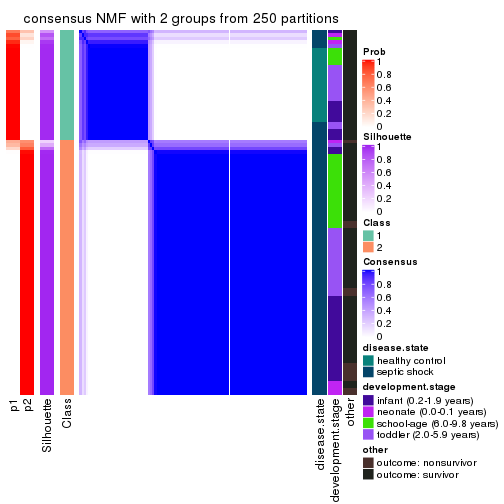</p>

</div>
<div id='tab-CV-NMF-consensus-heatmap-2'>
<pre><code class="r">consensus_heatmap(res, k = 3)
</code></pre>

<p>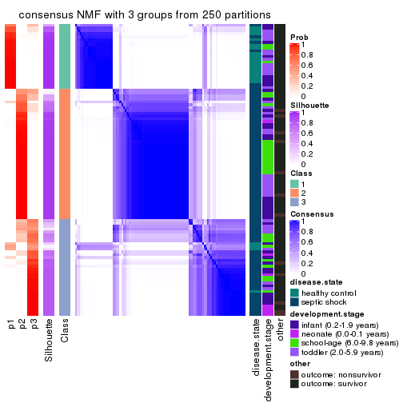</p>

</div>
<div id='tab-CV-NMF-consensus-heatmap-3'>
<pre><code class="r">consensus_heatmap(res, k = 4)
</code></pre>

<p>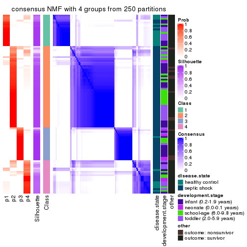</p>

</div>
<div id='tab-CV-NMF-consensus-heatmap-4'>
<pre><code class="r">consensus_heatmap(res, k = 5)
</code></pre>

<p>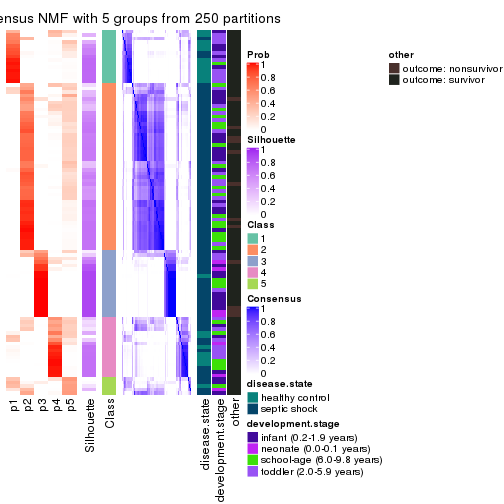</p>

</div>
<div id='tab-CV-NMF-consensus-heatmap-5'>
<pre><code class="r">consensus_heatmap(res, k = 6)
</code></pre>

<p>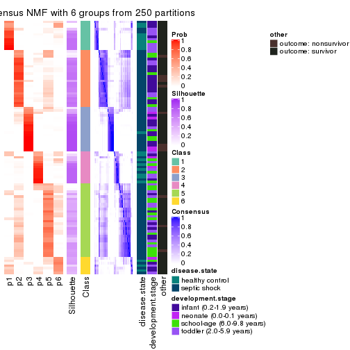</p>

</div>
</div>

Heatmaps for the membership of samples in all partitions to see how consistent they are:


<script>
$( function() {
	$( '#tabs-CV-NMF-membership-heatmap' ).tabs();
} );
</script>
<div id='tabs-CV-NMF-membership-heatmap'>
<ul>
<li><a href='#tab-CV-NMF-membership-heatmap-1'>k = 2</a></li>
<li><a href='#tab-CV-NMF-membership-heatmap-2'>k = 3</a></li>
<li><a href='#tab-CV-NMF-membership-heatmap-3'>k = 4</a></li>
<li><a href='#tab-CV-NMF-membership-heatmap-4'>k = 5</a></li>
<li><a href='#tab-CV-NMF-membership-heatmap-5'>k = 6</a></li>
</ul>
<div id='tab-CV-NMF-membership-heatmap-1'>
<pre><code class="r">membership_heatmap(res, k = 2)
</code></pre>

<p>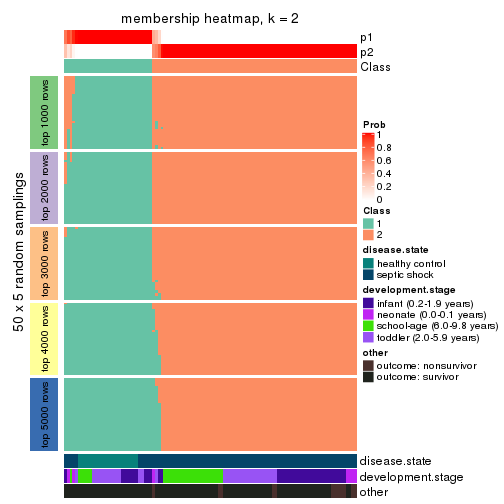</p>

</div>
<div id='tab-CV-NMF-membership-heatmap-2'>
<pre><code class="r">membership_heatmap(res, k = 3)
</code></pre>

<p>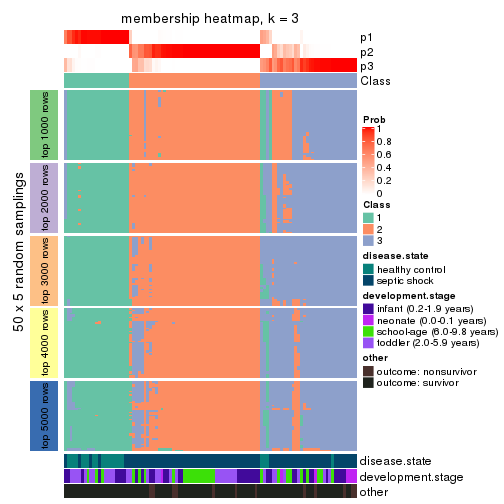</p>

</div>
<div id='tab-CV-NMF-membership-heatmap-3'>
<pre><code class="r">membership_heatmap(res, k = 4)
</code></pre>

<p>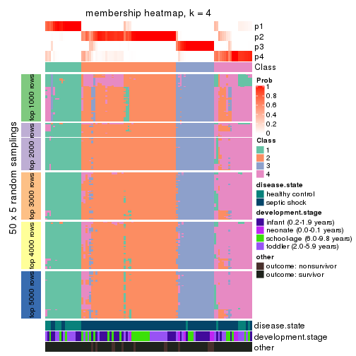</p>

</div>
<div id='tab-CV-NMF-membership-heatmap-4'>
<pre><code class="r">membership_heatmap(res, k = 5)
</code></pre>

<p>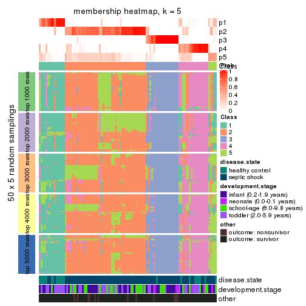</p>

</div>
<div id='tab-CV-NMF-membership-heatmap-5'>
<pre><code class="r">membership_heatmap(res, k = 6)
</code></pre>

<p>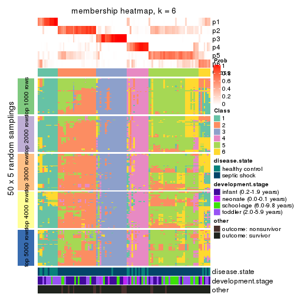</p>

</div>
</div>

As soon as we have had the classes for columns, we can look for signatures
which are significantly different between classes which can be candidate marks
for certain classes. Following are the heatmaps for signatures.


Signature heatmaps where rows are scaled:


<script>
$( function() {
	$( '#tabs-CV-NMF-get-signatures' ).tabs();
} );
</script>
<div id='tabs-CV-NMF-get-signatures'>
<ul>
<li><a href='#tab-CV-NMF-get-signatures-1'>k = 2</a></li>
<li><a href='#tab-CV-NMF-get-signatures-2'>k = 3</a></li>
<li><a href='#tab-CV-NMF-get-signatures-3'>k = 4</a></li>
<li><a href='#tab-CV-NMF-get-signatures-4'>k = 5</a></li>
<li><a href='#tab-CV-NMF-get-signatures-5'>k = 6</a></li>
</ul>
<div id='tab-CV-NMF-get-signatures-1'>
<pre><code class="r">get_signatures(res, k = 2)
</code></pre>

<p>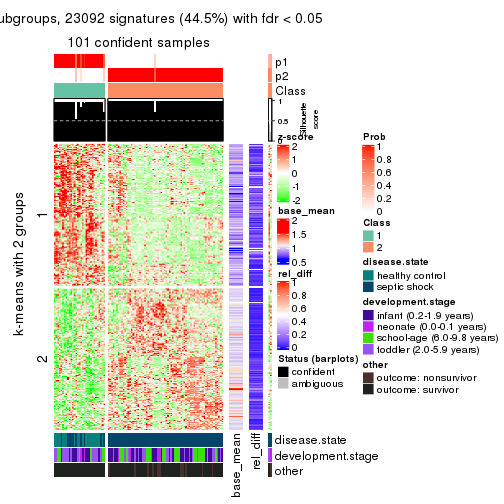</p>

</div>
<div id='tab-CV-NMF-get-signatures-2'>
<pre><code class="r">get_signatures(res, k = 3)
</code></pre>

<p>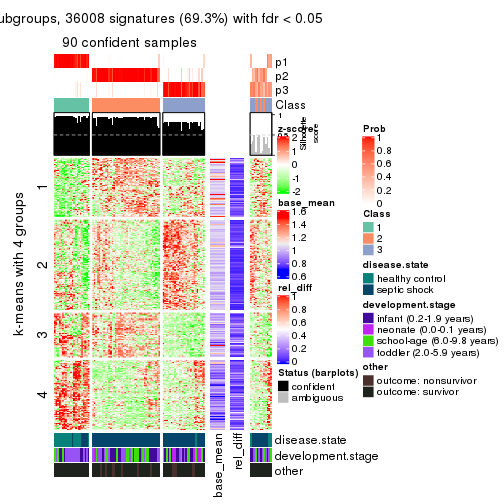</p>

</div>
<div id='tab-CV-NMF-get-signatures-3'>
<pre><code class="r">get_signatures(res, k = 4)
</code></pre>

<p>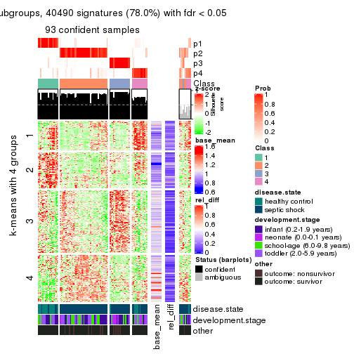</p>

</div>
<div id='tab-CV-NMF-get-signatures-4'>
<pre><code class="r">get_signatures(res, k = 5)
</code></pre>

<p>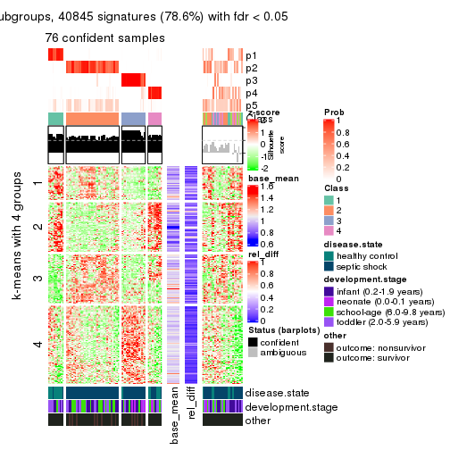</p>

</div>
<div id='tab-CV-NMF-get-signatures-5'>
<pre><code class="r">get_signatures(res, k = 6)
</code></pre>

<p>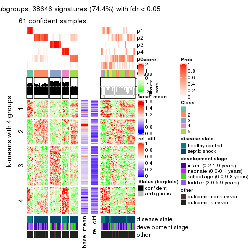</p>

</div>
</div>


Signature heatmaps where rows are not scaled:


<script>
$( function() {
	$( '#tabs-CV-NMF-get-signatures-no-scale' ).tabs();
} );
</script>
<div id='tabs-CV-NMF-get-signatures-no-scale'>
<ul>
<li><a href='#tab-CV-NMF-get-signatures-no-scale-1'>k = 2</a></li>
<li><a href='#tab-CV-NMF-get-signatures-no-scale-2'>k = 3</a></li>
<li><a href='#tab-CV-NMF-get-signatures-no-scale-3'>k = 4</a></li>
<li><a href='#tab-CV-NMF-get-signatures-no-scale-4'>k = 5</a></li>
<li><a href='#tab-CV-NMF-get-signatures-no-scale-5'>k = 6</a></li>
</ul>
<div id='tab-CV-NMF-get-signatures-no-scale-1'>
<pre><code class="r">get_signatures(res, k = 2, scale_rows = FALSE)
</code></pre>

<p>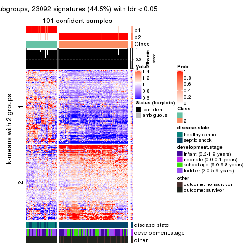</p>

</div>
<div id='tab-CV-NMF-get-signatures-no-scale-2'>
<pre><code class="r">get_signatures(res, k = 3, scale_rows = FALSE)
</code></pre>

<p>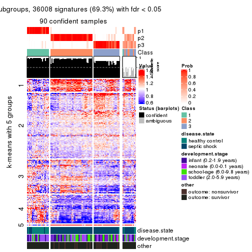</p>

</div>
<div id='tab-CV-NMF-get-signatures-no-scale-3'>
<pre><code class="r">get_signatures(res, k = 4, scale_rows = FALSE)
</code></pre>

<p>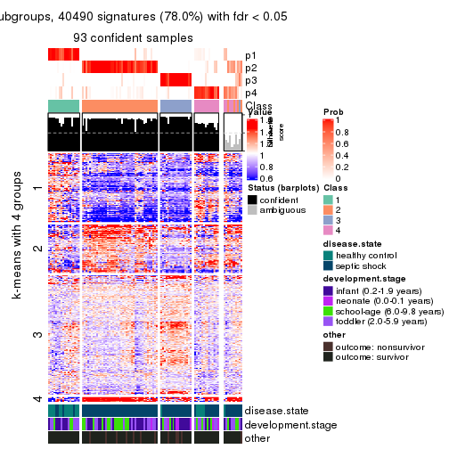</p>

</div>
<div id='tab-CV-NMF-get-signatures-no-scale-4'>
<pre><code class="r">get_signatures(res, k = 5, scale_rows = FALSE)
</code></pre>

<pre><code>#&gt; Error in mat[ceiling(1:nr/h_ratio), ceiling(1:nc/w_ratio), drop = FALSE]: subscript out of bounds
</code></pre>

<p></p>

</div>
<div id='tab-CV-NMF-get-signatures-no-scale-5'>
<pre><code class="r">get_signatures(res, k = 6, scale_rows = FALSE)
</code></pre>

<p>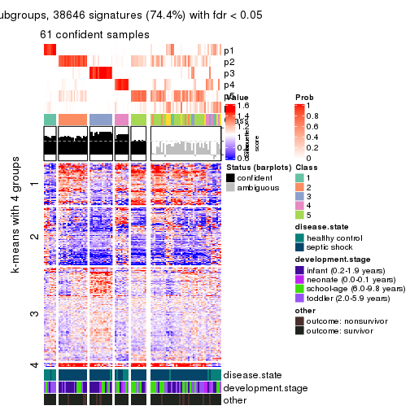</p>

</div>
</div>


Compare the overlap of signatures from different k:

```r
compare_signatures(res)
```

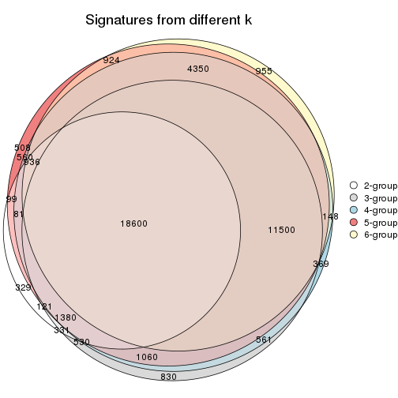

`get_signature()` returns a data frame invisibly. TO get the list of signatures, the function
call should be assigned to a variable explicitly. In following code, if `plot` argument is set
to `FALSE`, no heatmap is plotted while only the differential analysis is performed.

```r
# code only for demonstration
tb = get_signature(res, k = ..., plot = FALSE)
```

An example of the output of `tb` is:

```
#>   which_row         fdr    mean_1    mean_2 scaled_mean_1 scaled_mean_2 km
#> 1        38 0.042760348  8.373488  9.131774    -0.5533452     0.5164555  1
#> 2        40 0.018707592  7.106213  8.469186    -0.6173731     0.5762149  1
#> 3        55 0.019134737 10.221463 11.207825    -0.6159697     0.5749050  1
#> 4        59 0.006059896  5.921854  7.869574    -0.6899429     0.6439467  1
#> 5        60 0.018055526  8.928898 10.211722    -0.6204761     0.5791110  1
#> 6        98 0.009384629 15.714769 14.887706     0.6635654    -0.6193277  2
...
```

The columns in `tb` are:

1. `which_row`: row indices corresponding to the input matrix.
2. `fdr`: FDR for the differential test. 
3. `mean_x`: The mean value in group x.
4. `scaled_mean_x`: The mean value in group x after rows are scaled.
5. `km`: Row groups if k-means clustering is applied to rows.


UMAP plot which shows how samples are separated.


<script>
$( function() {
	$( '#tabs-CV-NMF-dimension-reduction' ).tabs();
} );
</script>
<div id='tabs-CV-NMF-dimension-reduction'>
<ul>
<li><a href='#tab-CV-NMF-dimension-reduction-1'>k = 2</a></li>
<li><a href='#tab-CV-NMF-dimension-reduction-2'>k = 3</a></li>
<li><a href='#tab-CV-NMF-dimension-reduction-3'>k = 4</a></li>
<li><a href='#tab-CV-NMF-dimension-reduction-4'>k = 5</a></li>
<li><a href='#tab-CV-NMF-dimension-reduction-5'>k = 6</a></li>
</ul>
<div id='tab-CV-NMF-dimension-reduction-1'>
<pre><code class="r">dimension_reduction(res, k = 2, method = &quot;UMAP&quot;)
</code></pre>

<p>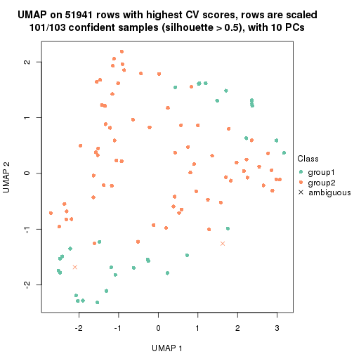</p>

</div>
<div id='tab-CV-NMF-dimension-reduction-2'>
<pre><code class="r">dimension_reduction(res, k = 3, method = &quot;UMAP&quot;)
</code></pre>

<p>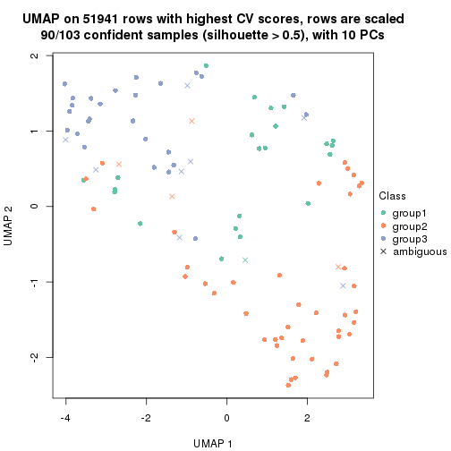</p>

</div>
<div id='tab-CV-NMF-dimension-reduction-3'>
<pre><code class="r">dimension_reduction(res, k = 4, method = &quot;UMAP&quot;)
</code></pre>

<p>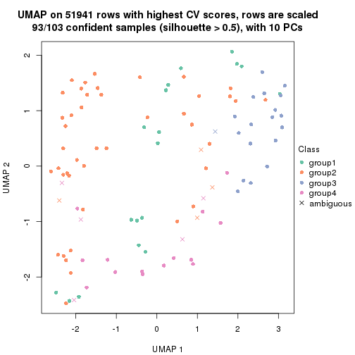</p>

</div>
<div id='tab-CV-NMF-dimension-reduction-4'>
<pre><code class="r">dimension_reduction(res, k = 5, method = &quot;UMAP&quot;)
</code></pre>

<p>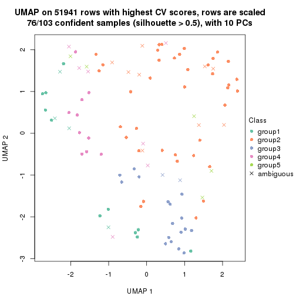</p>

</div>
<div id='tab-CV-NMF-dimension-reduction-5'>
<pre><code class="r">dimension_reduction(res, k = 6, method = &quot;UMAP&quot;)
</code></pre>

<p>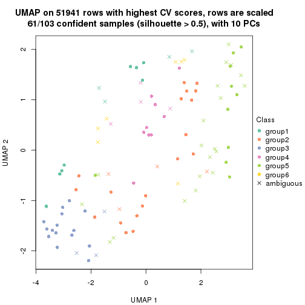</p>

</div>
</div>


Following heatmap shows how subgroups are split when increasing `k`:

```r
collect_classes(res)
```

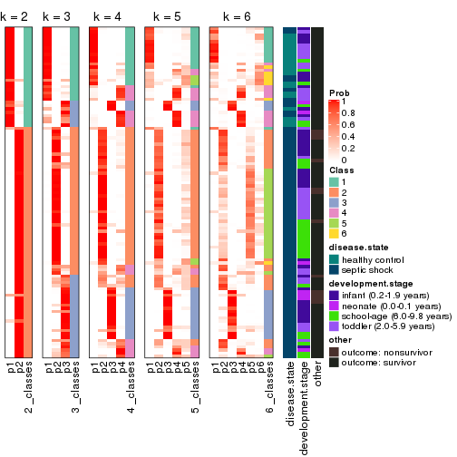


Test correlation between subgroups and known annotations. If the known
annotation is numeric, one-way ANOVA test is applied, and if the known
annotation is discrete, chi-squared contingency table test is applied.

```r
test_to_known_factors(res)
```

```
#>          n disease.state(p) development.stage(p) other(p) k
#> CV:NMF 101         7.92e-14              0.46488   0.0464 2
#> CV:NMF  90         1.01e-13              0.00139   0.1017 3
#> CV:NMF  93         8.25e-11              0.03818   0.0727 4
#> CV:NMF  76         1.55e-09              0.01219   0.1389 5
#> CV:NMF  61         1.83e-07              0.00538   0.2440 6
```


If matrix rows can be associated to genes, consider to use `functional_enrichment(res,
...)` to perform function enrichment for the signature genes. See [this vignette](http://bioconductor.org/packages/devel/bioc/vignettes/cola/inst/doc/functional_enrichment.html) for more detailed explanations.


 

---------------------------------------------------


### MAD:hclust


The object with results only for a single top-value method and a single partition method 
can be extracted as:

```r
res = res_list["MAD", "hclust"]
# you can also extract it by
# res = res_list["MAD:hclust"]
```

A summary of `res` and all the functions that can be applied to it:

```r
res
```

```
#> A 'ConsensusPartition' object with k = 2, 3, 4, 5, 6.
#>   On a matrix with 51941 rows and 103 columns.
#>   Top rows (1000, 2000, 3000, 4000, 5000) are extracted by 'MAD' method.
#>   Subgroups are detected by 'hclust' method.
#>   Performed in total 1250 partitions by row resampling.
#>   Best k for subgroups seems to be 2.
#> 
#> Following methods can be applied to this 'ConsensusPartition' object:
#>  [1] "cola_report"             "collect_classes"         "collect_plots"          
#>  [4] "collect_stats"           "colnames"                "compare_signatures"     
#>  [7] "consensus_heatmap"       "dimension_reduction"     "functional_enrichment"  
#> [10] "get_anno_col"            "get_anno"                "get_classes"            
#> [13] "get_consensus"           "get_matrix"              "get_membership"         
#> [16] "get_param"               "get_signatures"          "get_stats"              
#> [19] "is_best_k"               "is_stable_k"             "membership_heatmap"     
#> [22] "ncol"                    "nrow"                    "plot_ecdf"              
#> [25] "rownames"                "select_partition_number" "show"                   
#> [28] "suggest_best_k"          "test_to_known_factors"
```

`collect_plots()` function collects all the plots made from `res` for all `k` (number of partitions)
into one single page to provide an easy and fast comparison between different `k`.

```r
collect_plots(res)
```

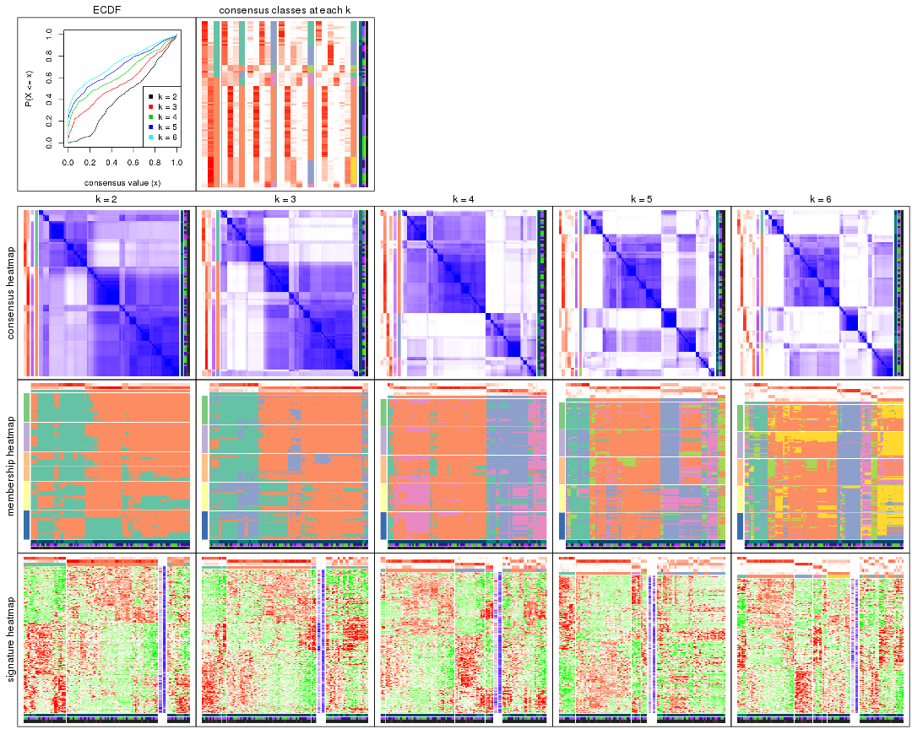

The plots are:

- The first row: a plot of the ECDF (empirical cumulative distribution
  function) curves of the consensus matrix for each `k` and the heatmap of
  predicted classes for each `k`.
- The second row: heatmaps of the consensus matrix for each `k`.
- The third row: heatmaps of the membership matrix for each `k`.
- The fouth row: heatmaps of the signatures for each `k`.

All the plots in panels can be made by individual functions and they are
plotted later in this section.

`select_partition_number()` produces several plots showing different
statistics for choosing "optimized" `k`. There are following statistics:

- ECDF curves of the consensus matrix for each `k`;
- 1-PAC. [The PAC
  score](https://en.wikipedia.org/wiki/Consensus_clustering#Over-interpretation_potential_of_consensus_clustering)
  measures the proportion of the ambiguous subgrouping.
- Mean silhouette score.
- Concordance. The mean probability of fiting the consensus class ids in all
  partitions.
- Area increased. Denote $A_k$ as the area under the ECDF curve for current
  `k`, the area increased is defined as $A_k - A_{k-1}$.
- Rand index. The percent of pairs of samples that are both in a same cluster
  or both are not in a same cluster in the partition of k and k-1.
- Jaccard index. The ratio of pairs of samples are both in a same cluster in
  the partition of k and k-1 and the pairs of samples are both in a same
  cluster in the partition k or k-1.

The detailed explanations of these statistics can be found in [the _cola_
vignette](http://bioconductor.org/packages/devel/bioc/vignettes/cola/inst/doc/cola.html#toc_13).

Generally speaking, lower PAC score, higher mean silhouette score or higher
concordance corresponds to better partition. Rand index and Jaccard index
measure how similar the current partition is compared to partition with `k-1`.
If they are too similar, we won't accept `k` is better than `k-1`.

```r
select_partition_number(res)
```

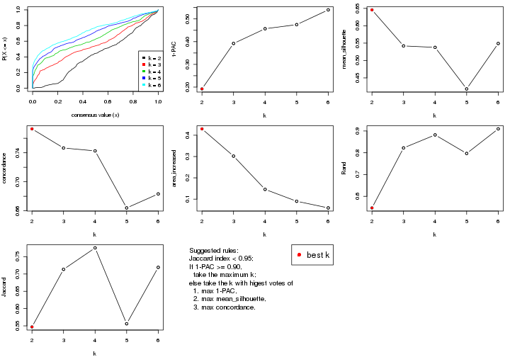

The numeric values for all these statistics can be obtained by `get_stats()`.

```r
get_stats(res)
```

```
#>   k 1-PAC mean_silhouette concordance area_increased  Rand Jaccard
#> 2 2 0.192           0.646       0.773         0.4297 0.547   0.547
#> 3 3 0.392           0.542       0.747         0.3019 0.822   0.713
#> 4 4 0.457           0.538       0.743         0.1458 0.882   0.776
#> 5 5 0.475           0.418       0.664         0.0901 0.797   0.556
#> 6 6 0.540           0.549       0.683         0.0589 0.910   0.719
```

`suggest_best_k()` suggests the best $k$ based on these statistics. The rules are as follows:

- All $k$ with Jaccard index larger than 0.95 are removed because increasing
  $k$ does not provide enough extra information. If all $k$ are removed, it is
  marked as no subgroup is detected.
- For all $k$ with 1-PAC score larger than 0.9, the maximal $k$ is taken as
  the best $k$, and other $k$ are marked as optional $k$.
- If it does not fit the second rule. The $k$ with the maximal vote of the
  highest 1-PAC score, highest mean silhouette, and highest concordance is
  taken as the best $k$.

```r
suggest_best_k(res)
```

```
#> [1] 2
```


Following shows the table of the partitions (You need to click the **show/hide
code output** link to see it). The membership matrix (columns with name `p*`)
is inferred by
[`clue::cl_consensus()`](https://www.rdocumentation.org/link/cl_consensus?package=clue)
function with the `SE` method. Basically the value in the membership matrix
represents the probability to belong to a certain group. The finall class
label for an item is determined with the group with highest probability it
belongs to.

In `get_classes()` function, the entropy is calculated from the membership
matrix and the silhouette score is calculated from the consensus matrix.


<script>
$( function() {
	$( '#tabs-MAD-hclust-get-classes' ).tabs();
} );
</script>
<div id='tabs-MAD-hclust-get-classes'>
<ul>
<li><a href='#tab-MAD-hclust-get-classes-1'>k = 2</a></li>
<li><a href='#tab-MAD-hclust-get-classes-2'>k = 3</a></li>
<li><a href='#tab-MAD-hclust-get-classes-3'>k = 4</a></li>
<li><a href='#tab-MAD-hclust-get-classes-4'>k = 5</a></li>
<li><a href='#tab-MAD-hclust-get-classes-5'>k = 6</a></li>
</ul>

<div id='tab-MAD-hclust-get-classes-1'>
<p><a id='tab-MAD-hclust-get-classes-1-a' style='color:#0366d6' href='#'>show/hide code output</a></p>
<pre><code class="r">cbind(get_classes(res, k = 2), get_membership(res, k = 2))
</code></pre>

<pre><code>#&gt;           class entropy silhouette    p1    p2
#&gt; GSM647569     1  0.9358    0.68379 0.648 0.352
#&gt; GSM647574     1  0.9580    0.65677 0.620 0.380
#&gt; GSM647577     1  0.9358    0.68379 0.648 0.352
#&gt; GSM647547     2  0.5842    0.56059 0.140 0.860
#&gt; GSM647552     1  0.9710   -0.00125 0.600 0.400
#&gt; GSM647553     1  0.9358    0.68379 0.648 0.352
#&gt; GSM647565     2  0.1843    0.71796 0.028 0.972
#&gt; GSM647545     2  0.7056    0.78546 0.192 0.808
#&gt; GSM647549     2  0.7056    0.78546 0.192 0.808
#&gt; GSM647550     2  0.8081    0.76432 0.248 0.752
#&gt; GSM647560     2  0.5519    0.75469 0.128 0.872
#&gt; GSM647617     1  0.9323    0.68528 0.652 0.348
#&gt; GSM647528     2  0.6887    0.78610 0.184 0.816
#&gt; GSM647529     1  0.9754    0.37063 0.592 0.408
#&gt; GSM647531     2  0.7056    0.78546 0.192 0.808
#&gt; GSM647540     2  0.7745    0.77447 0.228 0.772
#&gt; GSM647541     2  0.8081    0.76432 0.248 0.752
#&gt; GSM647546     2  0.0000    0.72964 0.000 1.000
#&gt; GSM647557     2  0.7815    0.77567 0.232 0.768
#&gt; GSM647561     2  0.7056    0.78546 0.192 0.808
#&gt; GSM647567     2  0.9896    0.41228 0.440 0.560
#&gt; GSM647568     2  0.0000    0.72964 0.000 1.000
#&gt; GSM647570     2  0.0000    0.72964 0.000 1.000
#&gt; GSM647573     2  0.5842    0.56059 0.140 0.860
#&gt; GSM647576     2  0.0000    0.72964 0.000 1.000
#&gt; GSM647579     2  0.5519    0.75469 0.128 0.872
#&gt; GSM647580     1  0.9323    0.68528 0.652 0.348
#&gt; GSM647583     1  0.9358    0.68379 0.648 0.352
#&gt; GSM647592     2  0.9909    0.47442 0.444 0.556
#&gt; GSM647593     2  0.8909    0.71510 0.308 0.692
#&gt; GSM647595     2  0.8909    0.71510 0.308 0.692
#&gt; GSM647597     1  0.9881   -0.11682 0.564 0.436
#&gt; GSM647598     2  0.7219    0.78235 0.200 0.800
#&gt; GSM647613     2  0.7219    0.78235 0.200 0.800
#&gt; GSM647615     2  0.0376    0.72760 0.004 0.996
#&gt; GSM647616     1  0.9358    0.68379 0.648 0.352
#&gt; GSM647619     2  0.8909    0.71510 0.308 0.692
#&gt; GSM647582     2  0.7602    0.77655 0.220 0.780
#&gt; GSM647591     2  0.8909    0.71510 0.308 0.692
#&gt; GSM647527     2  0.6887    0.78610 0.184 0.816
#&gt; GSM647530     2  0.4815    0.77481 0.104 0.896
#&gt; GSM647532     1  0.9754    0.37063 0.592 0.408
#&gt; GSM647544     2  0.5629    0.78370 0.132 0.868
#&gt; GSM647551     1  0.9850   -0.11907 0.572 0.428
#&gt; GSM647556     1  0.7528    0.72060 0.784 0.216
#&gt; GSM647558     2  0.0938    0.73656 0.012 0.988
#&gt; GSM647572     2  0.2948    0.70613 0.052 0.948
#&gt; GSM647578     2  0.8144    0.76457 0.252 0.748
#&gt; GSM647581     2  0.0938    0.73656 0.012 0.988
#&gt; GSM647594     2  0.8144    0.75450 0.252 0.748
#&gt; GSM647599     1  0.5408    0.73899 0.876 0.124
#&gt; GSM647600     1  0.9850   -0.11907 0.572 0.428
#&gt; GSM647601     2  0.8661    0.73521 0.288 0.712
#&gt; GSM647603     2  0.5629    0.75981 0.132 0.868
#&gt; GSM647610     2  0.9970    0.42071 0.468 0.532
#&gt; GSM647611     2  0.8443    0.75173 0.272 0.728
#&gt; GSM647612     2  0.0000    0.72964 0.000 1.000
#&gt; GSM647614     2  0.0000    0.72964 0.000 1.000
#&gt; GSM647618     2  0.7376    0.78156 0.208 0.792
#&gt; GSM647629     2  0.8386    0.75242 0.268 0.732
#&gt; GSM647535     2  0.7950    0.76920 0.240 0.760
#&gt; GSM647563     2  0.5629    0.78370 0.132 0.868
#&gt; GSM647542     2  0.0000    0.72964 0.000 1.000
#&gt; GSM647543     2  0.0000    0.72964 0.000 1.000
#&gt; GSM647548     2  0.3584    0.66569 0.068 0.932
#&gt; GSM647554     2  0.9732    0.56644 0.404 0.596
#&gt; GSM647555     2  0.0672    0.73248 0.008 0.992
#&gt; GSM647559     2  0.5842    0.78490 0.140 0.860
#&gt; GSM647562     2  0.5629    0.78370 0.132 0.868
#&gt; GSM647564     1  0.9358    0.68379 0.648 0.352
#&gt; GSM647571     2  0.1184    0.72008 0.016 0.984
#&gt; GSM647584     2  0.8909    0.71510 0.308 0.692
#&gt; GSM647585     1  0.7528    0.72060 0.784 0.216
#&gt; GSM647586     2  0.6887    0.78610 0.184 0.816
#&gt; GSM647587     2  0.6887    0.78610 0.184 0.816
#&gt; GSM647588     2  0.8144    0.76457 0.252 0.748
#&gt; GSM647596     2  0.6887    0.78688 0.184 0.816
#&gt; GSM647602     1  0.9323    0.68528 0.652 0.348
#&gt; GSM647609     2  0.8661    0.73521 0.288 0.712
#&gt; GSM647620     2  0.8081    0.76358 0.248 0.752
#&gt; GSM647627     2  0.6887    0.78610 0.184 0.816
#&gt; GSM647628     2  0.0000    0.72964 0.000 1.000
#&gt; GSM647533     1  0.1414    0.71335 0.980 0.020
#&gt; GSM647536     1  0.9552    0.45476 0.624 0.376
#&gt; GSM647537     1  0.1414    0.71335 0.980 0.020
#&gt; GSM647606     1  0.3733    0.73802 0.928 0.072
#&gt; GSM647621     1  0.9944    0.55517 0.544 0.456
#&gt; GSM647626     1  0.5294    0.74025 0.880 0.120
#&gt; GSM647538     1  0.4161    0.74160 0.916 0.084
#&gt; GSM647575     2  0.8909    0.11651 0.308 0.692
#&gt; GSM647590     1  0.5178    0.74221 0.884 0.116
#&gt; GSM647605     1  0.1414    0.71335 0.980 0.020
#&gt; GSM647607     2  0.8909    0.11651 0.308 0.692
#&gt; GSM647608     2  0.9635   -0.18950 0.388 0.612
#&gt; GSM647622     1  0.4431    0.74232 0.908 0.092
#&gt; GSM647623     1  0.4431    0.74232 0.908 0.092
#&gt; GSM647624     1  0.4431    0.74232 0.908 0.092
#&gt; GSM647625     1  0.3733    0.73802 0.928 0.072
#&gt; GSM647534     1  0.4298    0.66628 0.912 0.088
#&gt; GSM647539     2  0.9460    0.15265 0.364 0.636
#&gt; GSM647566     1  0.4431    0.74182 0.908 0.092
#&gt; GSM647589     2  0.9635   -0.18950 0.388 0.612
#&gt; GSM647604     1  0.1414    0.71335 0.980 0.020
</code></pre>

<script>
$('#tab-MAD-hclust-get-classes-1-a').parent().next().next().hide();
$('#tab-MAD-hclust-get-classes-1-a').click(function(){
  $('#tab-MAD-hclust-get-classes-1-a').parent().next().next().toggle();
  return(false);
});
</script>
</div>

<div id='tab-MAD-hclust-get-classes-2'>
<p><a id='tab-MAD-hclust-get-classes-2-a' style='color:#0366d6' href='#'>show/hide code output</a></p>
<pre><code class="r">cbind(get_classes(res, k = 3), get_membership(res, k = 3))
</code></pre>

<pre><code>#&gt;           class entropy silhouette    p1    p2    p3
#&gt; GSM647569     1  0.6158    0.59057 0.760 0.052 0.188
#&gt; GSM647574     1  0.6491    0.56473 0.732 0.052 0.216
#&gt; GSM647577     1  0.6158    0.59057 0.760 0.052 0.188
#&gt; GSM647547     2  0.9789   -0.14429 0.236 0.396 0.368
#&gt; GSM647552     2  0.8100   -0.02974 0.068 0.512 0.420
#&gt; GSM647553     1  0.6158    0.59057 0.760 0.052 0.188
#&gt; GSM647565     2  0.7238    0.47053 0.044 0.628 0.328
#&gt; GSM647545     2  0.0747    0.73941 0.000 0.984 0.016
#&gt; GSM647549     2  0.0747    0.73941 0.000 0.984 0.016
#&gt; GSM647550     2  0.2400    0.72580 0.004 0.932 0.064
#&gt; GSM647560     2  0.6096    0.65767 0.040 0.752 0.208
#&gt; GSM647617     1  0.6107    0.59122 0.764 0.052 0.184
#&gt; GSM647528     2  0.0661    0.73866 0.004 0.988 0.008
#&gt; GSM647529     3  0.9865    0.69226 0.332 0.264 0.404
#&gt; GSM647531     2  0.0592    0.73884 0.000 0.988 0.012
#&gt; GSM647540     2  0.3120    0.73118 0.012 0.908 0.080
#&gt; GSM647541     2  0.2400    0.72580 0.004 0.932 0.064
#&gt; GSM647546     2  0.6703    0.57177 0.040 0.692 0.268
#&gt; GSM647557     2  0.2165    0.73422 0.000 0.936 0.064
#&gt; GSM647561     2  0.0747    0.73941 0.000 0.984 0.016
#&gt; GSM647567     2  0.7745    0.39214 0.092 0.648 0.260
#&gt; GSM647568     2  0.5992    0.59403 0.016 0.716 0.268
#&gt; GSM647570     2  0.6161    0.57531 0.016 0.696 0.288
#&gt; GSM647573     2  0.9789   -0.14429 0.236 0.396 0.368
#&gt; GSM647576     2  0.6703    0.57177 0.040 0.692 0.268
#&gt; GSM647579     2  0.6142    0.65591 0.040 0.748 0.212
#&gt; GSM647580     1  0.6107    0.59122 0.764 0.052 0.184
#&gt; GSM647583     1  0.6158    0.59057 0.760 0.052 0.188
#&gt; GSM647592     2  0.6322    0.44286 0.024 0.700 0.276
#&gt; GSM647593     2  0.3349    0.69121 0.004 0.888 0.108
#&gt; GSM647595     2  0.3349    0.69121 0.004 0.888 0.108
#&gt; GSM647597     2  0.8661   -0.00053 0.116 0.536 0.348
#&gt; GSM647598     2  0.0237    0.73703 0.000 0.996 0.004
#&gt; GSM647613     2  0.0424    0.73808 0.000 0.992 0.008
#&gt; GSM647615     2  0.6475    0.56982 0.028 0.692 0.280
#&gt; GSM647616     1  0.6158    0.59057 0.760 0.052 0.188
#&gt; GSM647619     2  0.3349    0.69121 0.004 0.888 0.108
#&gt; GSM647582     2  0.3755    0.72564 0.008 0.872 0.120
#&gt; GSM647591     2  0.3349    0.69121 0.004 0.888 0.108
#&gt; GSM647527     2  0.0661    0.73866 0.004 0.988 0.008
#&gt; GSM647530     2  0.4411    0.68918 0.016 0.844 0.140
#&gt; GSM647532     3  0.9865    0.69226 0.332 0.264 0.404
#&gt; GSM647544     2  0.3030    0.71792 0.004 0.904 0.092
#&gt; GSM647551     2  0.7945    0.08767 0.064 0.548 0.388
#&gt; GSM647556     1  0.7138    0.43350 0.720 0.160 0.120
#&gt; GSM647558     2  0.5763    0.59507 0.008 0.716 0.276
#&gt; GSM647572     2  0.7416    0.51849 0.068 0.656 0.276
#&gt; GSM647578     2  0.2682    0.72447 0.004 0.920 0.076
#&gt; GSM647581     2  0.5763    0.59507 0.008 0.716 0.276
#&gt; GSM647594     2  0.1964    0.72292 0.000 0.944 0.056
#&gt; GSM647599     1  0.2116    0.55813 0.948 0.012 0.040
#&gt; GSM647600     2  0.7945    0.08767 0.064 0.548 0.388
#&gt; GSM647601     2  0.2945    0.70586 0.004 0.908 0.088
#&gt; GSM647603     2  0.6247    0.65170 0.044 0.744 0.212
#&gt; GSM647610     2  0.6621    0.41958 0.032 0.684 0.284
#&gt; GSM647611     2  0.2939    0.71862 0.012 0.916 0.072
#&gt; GSM647612     2  0.5992    0.59403 0.016 0.716 0.268
#&gt; GSM647614     2  0.5992    0.59403 0.016 0.716 0.268
#&gt; GSM647618     2  0.1267    0.73690 0.004 0.972 0.024
#&gt; GSM647629     2  0.3193    0.71691 0.004 0.896 0.100
#&gt; GSM647535     2  0.2400    0.72906 0.004 0.932 0.064
#&gt; GSM647563     2  0.3030    0.71792 0.004 0.904 0.092
#&gt; GSM647542     2  0.5992    0.59403 0.016 0.716 0.268
#&gt; GSM647543     2  0.5992    0.59403 0.016 0.716 0.268
#&gt; GSM647548     2  0.8179    0.33258 0.084 0.564 0.352
#&gt; GSM647554     2  0.5115    0.56007 0.004 0.768 0.228
#&gt; GSM647555     2  0.5803    0.60873 0.016 0.736 0.248
#&gt; GSM647559     2  0.2860    0.72091 0.004 0.912 0.084
#&gt; GSM647562     2  0.3030    0.71792 0.004 0.904 0.092
#&gt; GSM647564     1  0.6158    0.59057 0.760 0.052 0.188
#&gt; GSM647571     2  0.6229    0.57873 0.020 0.700 0.280
#&gt; GSM647584     2  0.3349    0.69121 0.004 0.888 0.108
#&gt; GSM647585     1  0.7138    0.43350 0.720 0.160 0.120
#&gt; GSM647586     2  0.0661    0.73866 0.004 0.988 0.008
#&gt; GSM647587     2  0.0661    0.73866 0.004 0.988 0.008
#&gt; GSM647588     2  0.2682    0.72447 0.004 0.920 0.076
#&gt; GSM647596     2  0.0892    0.73967 0.000 0.980 0.020
#&gt; GSM647602     1  0.6107    0.59122 0.764 0.052 0.184
#&gt; GSM647609     2  0.2945    0.70586 0.004 0.908 0.088
#&gt; GSM647620     2  0.1989    0.72536 0.004 0.948 0.048
#&gt; GSM647627     2  0.0661    0.73866 0.004 0.988 0.008
#&gt; GSM647628     2  0.6082    0.57068 0.012 0.692 0.296
#&gt; GSM647533     1  0.5070    0.36797 0.772 0.004 0.224
#&gt; GSM647536     3  0.9773    0.64807 0.352 0.236 0.412
#&gt; GSM647537     1  0.5070    0.36797 0.772 0.004 0.224
#&gt; GSM647606     1  0.3193    0.49810 0.896 0.004 0.100
#&gt; GSM647621     1  0.7181    0.46821 0.648 0.048 0.304
#&gt; GSM647626     1  0.1751    0.55914 0.960 0.012 0.028
#&gt; GSM647538     1  0.6793    0.38004 0.740 0.100 0.160
#&gt; GSM647575     1  0.9808   -0.05947 0.392 0.240 0.368
#&gt; GSM647590     1  0.2165    0.54017 0.936 0.000 0.064
#&gt; GSM647605     1  0.5070    0.36797 0.772 0.004 0.224
#&gt; GSM647607     1  0.9808   -0.05947 0.392 0.240 0.368
#&gt; GSM647608     1  0.9423    0.11910 0.484 0.196 0.320
#&gt; GSM647622     1  0.2096    0.53283 0.944 0.004 0.052
#&gt; GSM647623     1  0.1878    0.53728 0.952 0.004 0.044
#&gt; GSM647624     1  0.2096    0.53283 0.944 0.004 0.052
#&gt; GSM647625     1  0.3193    0.49810 0.896 0.004 0.100
#&gt; GSM647534     3  0.8433    0.34462 0.176 0.204 0.620
#&gt; GSM647539     1  0.9984   -0.27142 0.360 0.328 0.312
#&gt; GSM647566     1  0.6920    0.36893 0.732 0.104 0.164
#&gt; GSM647589     1  0.9423    0.11910 0.484 0.196 0.320
#&gt; GSM647604     1  0.5070    0.36797 0.772 0.004 0.224
</code></pre>

<script>
$('#tab-MAD-hclust-get-classes-2-a').parent().next().next().hide();
$('#tab-MAD-hclust-get-classes-2-a').click(function(){
  $('#tab-MAD-hclust-get-classes-2-a').parent().next().next().toggle();
  return(false);
});
</script>
</div>

<div id='tab-MAD-hclust-get-classes-3'>
<p><a id='tab-MAD-hclust-get-classes-3-a' style='color:#0366d6' href='#'>show/hide code output</a></p>
<pre><code class="r">cbind(get_classes(res, k = 4), get_membership(res, k = 4))
</code></pre>

<pre><code>#&gt;           class entropy silhouette    p1    p2    p3    p4
#&gt; GSM647569     3  0.5346     0.5918 0.004 0.032 0.692 0.272
#&gt; GSM647574     3  0.5454     0.5480 0.004 0.028 0.664 0.304
#&gt; GSM647577     3  0.5346     0.5918 0.004 0.032 0.692 0.272
#&gt; GSM647547     4  0.3266     0.5947 0.000 0.040 0.084 0.876
#&gt; GSM647552     1  0.5244     0.7155 0.600 0.388 0.000 0.012
#&gt; GSM647553     3  0.5346     0.5918 0.004 0.032 0.692 0.272
#&gt; GSM647565     4  0.4608     0.2319 0.004 0.304 0.000 0.692
#&gt; GSM647545     2  0.1022     0.6888 0.000 0.968 0.000 0.032
#&gt; GSM647549     2  0.1022     0.6888 0.000 0.968 0.000 0.032
#&gt; GSM647550     2  0.2844     0.6733 0.052 0.900 0.000 0.048
#&gt; GSM647560     2  0.5625     0.5823 0.056 0.720 0.012 0.212
#&gt; GSM647617     3  0.5169     0.5927 0.000 0.032 0.696 0.272
#&gt; GSM647528     2  0.1022     0.6879 0.000 0.968 0.000 0.032
#&gt; GSM647529     4  0.8792     0.3715 0.292 0.068 0.192 0.448
#&gt; GSM647531     2  0.1398     0.6894 0.004 0.956 0.000 0.040
#&gt; GSM647540     2  0.3266     0.6757 0.048 0.884 0.004 0.064
#&gt; GSM647541     2  0.2844     0.6733 0.052 0.900 0.000 0.048
#&gt; GSM647546     2  0.5417     0.4836 0.000 0.572 0.016 0.412
#&gt; GSM647557     2  0.2408     0.6768 0.044 0.920 0.000 0.036
#&gt; GSM647561     2  0.1022     0.6888 0.000 0.968 0.000 0.032
#&gt; GSM647567     2  0.6827    -0.2354 0.380 0.544 0.032 0.044
#&gt; GSM647568     2  0.4866     0.5130 0.000 0.596 0.000 0.404
#&gt; GSM647570     2  0.4933     0.4750 0.000 0.568 0.000 0.432
#&gt; GSM647573     4  0.3266     0.5947 0.000 0.040 0.084 0.876
#&gt; GSM647576     2  0.5417     0.4836 0.000 0.572 0.016 0.412
#&gt; GSM647579     2  0.5800     0.5742 0.060 0.704 0.012 0.224
#&gt; GSM647580     3  0.5169     0.5927 0.000 0.032 0.696 0.272
#&gt; GSM647583     3  0.5346     0.5918 0.004 0.032 0.692 0.272
#&gt; GSM647592     2  0.4800    -0.0419 0.340 0.656 0.000 0.004
#&gt; GSM647593     2  0.2469     0.6056 0.108 0.892 0.000 0.000
#&gt; GSM647595     2  0.2469     0.6056 0.108 0.892 0.000 0.000
#&gt; GSM647597     2  0.7192    -0.5538 0.420 0.480 0.080 0.020
#&gt; GSM647598     2  0.0524     0.6815 0.004 0.988 0.000 0.008
#&gt; GSM647613     2  0.0817     0.6865 0.000 0.976 0.000 0.024
#&gt; GSM647615     2  0.5438     0.4197 0.004 0.536 0.008 0.452
#&gt; GSM647616     3  0.5346     0.5918 0.004 0.032 0.692 0.272
#&gt; GSM647619     2  0.2469     0.6056 0.108 0.892 0.000 0.000
#&gt; GSM647582     2  0.3508     0.6667 0.060 0.872 0.004 0.064
#&gt; GSM647591     2  0.2469     0.6056 0.108 0.892 0.000 0.000
#&gt; GSM647527     2  0.1022     0.6879 0.000 0.968 0.000 0.032
#&gt; GSM647530     2  0.4401     0.5892 0.004 0.724 0.000 0.272
#&gt; GSM647532     4  0.8792     0.3715 0.292 0.068 0.192 0.448
#&gt; GSM647544     2  0.2973     0.6648 0.000 0.856 0.000 0.144
#&gt; GSM647551     1  0.4925     0.7021 0.572 0.428 0.000 0.000
#&gt; GSM647556     3  0.7776     0.5268 0.168 0.072 0.608 0.152
#&gt; GSM647558     2  0.4933     0.4748 0.000 0.568 0.000 0.432
#&gt; GSM647572     2  0.5950     0.4263 0.000 0.544 0.040 0.416
#&gt; GSM647578     2  0.3168     0.6675 0.060 0.884 0.000 0.056
#&gt; GSM647581     2  0.4933     0.4748 0.000 0.568 0.000 0.432
#&gt; GSM647594     2  0.1970     0.6540 0.060 0.932 0.000 0.008
#&gt; GSM647599     3  0.1792     0.6381 0.000 0.000 0.932 0.068
#&gt; GSM647600     1  0.4925     0.7021 0.572 0.428 0.000 0.000
#&gt; GSM647601     2  0.2149     0.6261 0.088 0.912 0.000 0.000
#&gt; GSM647603     2  0.5804     0.5664 0.036 0.676 0.016 0.272
#&gt; GSM647610     2  0.5525    -0.0829 0.328 0.644 0.008 0.020
#&gt; GSM647611     2  0.2271     0.6426 0.076 0.916 0.000 0.008
#&gt; GSM647612     2  0.4866     0.5130 0.000 0.596 0.000 0.404
#&gt; GSM647614     2  0.4866     0.5130 0.000 0.596 0.000 0.404
#&gt; GSM647618     2  0.1520     0.6817 0.020 0.956 0.000 0.024
#&gt; GSM647629     2  0.3176     0.6469 0.084 0.880 0.000 0.036
#&gt; GSM647535     2  0.2483     0.6712 0.052 0.916 0.000 0.032
#&gt; GSM647563     2  0.3074     0.6623 0.000 0.848 0.000 0.152
#&gt; GSM647542     2  0.4866     0.5130 0.000 0.596 0.000 0.404
#&gt; GSM647543     2  0.4866     0.5130 0.000 0.596 0.000 0.404
#&gt; GSM647548     4  0.3400     0.4758 0.000 0.180 0.000 0.820
#&gt; GSM647554     2  0.4252     0.3274 0.252 0.744 0.000 0.004
#&gt; GSM647555     2  0.4776     0.5297 0.000 0.624 0.000 0.376
#&gt; GSM647559     2  0.2921     0.6665 0.000 0.860 0.000 0.140
#&gt; GSM647562     2  0.3024     0.6639 0.000 0.852 0.000 0.148
#&gt; GSM647564     3  0.5346     0.5918 0.004 0.032 0.692 0.272
#&gt; GSM647571     2  0.5088     0.4897 0.000 0.572 0.004 0.424
#&gt; GSM647584     2  0.2469     0.6056 0.108 0.892 0.000 0.000
#&gt; GSM647585     3  0.7776     0.5268 0.168 0.072 0.608 0.152
#&gt; GSM647586     2  0.1022     0.6879 0.000 0.968 0.000 0.032
#&gt; GSM647587     2  0.1022     0.6879 0.000 0.968 0.000 0.032
#&gt; GSM647588     2  0.3168     0.6675 0.060 0.884 0.000 0.056
#&gt; GSM647596     2  0.1867     0.6882 0.000 0.928 0.000 0.072
#&gt; GSM647602     3  0.5169     0.5927 0.000 0.032 0.696 0.272
#&gt; GSM647609     2  0.2149     0.6261 0.088 0.912 0.000 0.000
#&gt; GSM647620     2  0.1807     0.6597 0.052 0.940 0.000 0.008
#&gt; GSM647627     2  0.1209     0.6873 0.004 0.964 0.000 0.032
#&gt; GSM647628     2  0.4977     0.4291 0.000 0.540 0.000 0.460
#&gt; GSM647533     3  0.5025     0.4850 0.252 0.000 0.716 0.032
#&gt; GSM647536     4  0.8757     0.3391 0.308 0.056 0.208 0.428
#&gt; GSM647537     3  0.5025     0.4850 0.252 0.000 0.716 0.032
#&gt; GSM647606     3  0.2924     0.5992 0.100 0.000 0.884 0.016
#&gt; GSM647621     3  0.4933     0.3078 0.000 0.000 0.568 0.432
#&gt; GSM647626     3  0.1637     0.6397 0.000 0.000 0.940 0.060
#&gt; GSM647538     3  0.6732     0.4490 0.336 0.000 0.556 0.108
#&gt; GSM647575     4  0.4616     0.5214 0.020 0.004 0.216 0.760
#&gt; GSM647590     3  0.4483     0.5953 0.104 0.000 0.808 0.088
#&gt; GSM647605     3  0.5055     0.4836 0.256 0.000 0.712 0.032
#&gt; GSM647607     4  0.4616     0.5214 0.020 0.004 0.216 0.760
#&gt; GSM647608     4  0.5134     0.3604 0.012 0.004 0.320 0.664
#&gt; GSM647622     3  0.2021     0.6199 0.056 0.000 0.932 0.012
#&gt; GSM647623     3  0.1938     0.6237 0.052 0.000 0.936 0.012
#&gt; GSM647624     3  0.2021     0.6199 0.056 0.000 0.932 0.012
#&gt; GSM647625     3  0.2924     0.5992 0.100 0.000 0.884 0.016
#&gt; GSM647534     1  0.1821     0.1946 0.948 0.032 0.012 0.008
#&gt; GSM647539     4  0.6972     0.5122 0.120 0.044 0.172 0.664
#&gt; GSM647566     3  0.6732     0.4410 0.336 0.000 0.556 0.108
#&gt; GSM647589     4  0.5134     0.3604 0.012 0.004 0.320 0.664
#&gt; GSM647604     3  0.5055     0.4836 0.256 0.000 0.712 0.032
</code></pre>

<script>
$('#tab-MAD-hclust-get-classes-3-a').parent().next().next().hide();
$('#tab-MAD-hclust-get-classes-3-a').click(function(){
  $('#tab-MAD-hclust-get-classes-3-a').parent().next().next().toggle();
  return(false);
});
</script>
</div>

<div id='tab-MAD-hclust-get-classes-4'>
<p><a id='tab-MAD-hclust-get-classes-4-a' style='color:#0366d6' href='#'>show/hide code output</a></p>
<pre><code class="r">cbind(get_classes(res, k = 5), get_membership(res, k = 5))
</code></pre>

<pre><code>#&gt;           class entropy silhouette    p1    p2    p3    p4    p5
#&gt; GSM647569     3  0.6634   -0.03421 0.376 0.000 0.472 0.132 0.020
#&gt; GSM647574     3  0.6819   -0.04319 0.348 0.000 0.468 0.164 0.020
#&gt; GSM647577     3  0.6634   -0.03421 0.376 0.000 0.472 0.132 0.020
#&gt; GSM647547     4  0.5383    0.63942 0.036 0.012 0.292 0.648 0.012
#&gt; GSM647552     5  0.4235    0.74068 0.000 0.336 0.000 0.008 0.656
#&gt; GSM647553     3  0.6634   -0.03421 0.376 0.000 0.472 0.132 0.020
#&gt; GSM647565     3  0.6409   -0.12566 0.000 0.152 0.516 0.324 0.008
#&gt; GSM647545     2  0.1798    0.74841 0.000 0.928 0.064 0.004 0.004
#&gt; GSM647549     2  0.1864    0.74773 0.000 0.924 0.068 0.004 0.004
#&gt; GSM647550     2  0.3400    0.70871 0.000 0.840 0.116 0.004 0.040
#&gt; GSM647560     2  0.6220    0.44023 0.008 0.584 0.304 0.020 0.084
#&gt; GSM647617     3  0.6710   -0.03703 0.376 0.000 0.468 0.132 0.024
#&gt; GSM647528     2  0.1671    0.74426 0.000 0.924 0.076 0.000 0.000
#&gt; GSM647529     4  0.8866    0.40532 0.184 0.040 0.144 0.396 0.236
#&gt; GSM647531     2  0.2054    0.74976 0.000 0.916 0.072 0.004 0.008
#&gt; GSM647540     2  0.3875    0.70186 0.004 0.820 0.120 0.008 0.048
#&gt; GSM647541     2  0.3449    0.70589 0.000 0.836 0.120 0.004 0.040
#&gt; GSM647546     3  0.4962    0.11651 0.008 0.432 0.544 0.016 0.000
#&gt; GSM647557     2  0.2122    0.74226 0.000 0.924 0.032 0.008 0.036
#&gt; GSM647561     2  0.1798    0.74841 0.000 0.928 0.064 0.004 0.004
#&gt; GSM647567     2  0.6541   -0.38961 0.012 0.472 0.088 0.016 0.412
#&gt; GSM647568     3  0.4397    0.11053 0.000 0.432 0.564 0.004 0.000
#&gt; GSM647570     3  0.5483    0.08989 0.000 0.424 0.512 0.064 0.000
#&gt; GSM647573     4  0.5383    0.63942 0.036 0.012 0.292 0.648 0.012
#&gt; GSM647576     3  0.4962    0.11651 0.008 0.432 0.544 0.016 0.000
#&gt; GSM647579     2  0.6251    0.43599 0.008 0.584 0.300 0.020 0.088
#&gt; GSM647580     3  0.6710   -0.03703 0.376 0.000 0.468 0.132 0.024
#&gt; GSM647583     3  0.6634   -0.03421 0.376 0.000 0.472 0.132 0.020
#&gt; GSM647592     2  0.4288   -0.16147 0.000 0.612 0.004 0.000 0.384
#&gt; GSM647593     2  0.2074    0.67402 0.000 0.896 0.000 0.000 0.104
#&gt; GSM647595     2  0.2074    0.67402 0.000 0.896 0.000 0.000 0.104
#&gt; GSM647597     5  0.6218    0.55918 0.076 0.428 0.016 0.004 0.476
#&gt; GSM647598     2  0.1124    0.74500 0.000 0.960 0.036 0.000 0.004
#&gt; GSM647613     2  0.1502    0.74840 0.000 0.940 0.056 0.004 0.000
#&gt; GSM647615     3  0.5253    0.16060 0.000 0.384 0.572 0.036 0.008
#&gt; GSM647616     3  0.6634   -0.03421 0.376 0.000 0.472 0.132 0.020
#&gt; GSM647619     2  0.2074    0.67402 0.000 0.896 0.000 0.000 0.104
#&gt; GSM647582     2  0.3197    0.71696 0.000 0.864 0.076 0.008 0.052
#&gt; GSM647591     2  0.2074    0.67402 0.000 0.896 0.000 0.000 0.104
#&gt; GSM647527     2  0.1671    0.74426 0.000 0.924 0.076 0.000 0.000
#&gt; GSM647530     2  0.5608    0.52965 0.000 0.652 0.224 0.116 0.008
#&gt; GSM647532     4  0.8866    0.40532 0.184 0.040 0.144 0.396 0.236
#&gt; GSM647544     2  0.3656    0.66511 0.000 0.800 0.168 0.032 0.000
#&gt; GSM647551     5  0.4114    0.73300 0.000 0.376 0.000 0.000 0.624
#&gt; GSM647556     3  0.8817   -0.19782 0.300 0.040 0.360 0.116 0.184
#&gt; GSM647558     2  0.6130   -0.00291 0.000 0.448 0.424 0.128 0.000
#&gt; GSM647572     3  0.5515    0.14213 0.012 0.404 0.548 0.028 0.008
#&gt; GSM647578     2  0.3693    0.69866 0.000 0.824 0.124 0.008 0.044
#&gt; GSM647581     2  0.6121    0.03018 0.000 0.464 0.408 0.128 0.000
#&gt; GSM647594     2  0.2616    0.71677 0.000 0.888 0.036 0.000 0.076
#&gt; GSM647599     1  0.5028    0.50180 0.744 0.000 0.140 0.088 0.028
#&gt; GSM647600     5  0.4114    0.73300 0.000 0.376 0.000 0.000 0.624
#&gt; GSM647601     2  0.1732    0.69486 0.000 0.920 0.000 0.000 0.080
#&gt; GSM647603     2  0.5955    0.33851 0.008 0.552 0.372 0.020 0.048
#&gt; GSM647610     2  0.4759   -0.19595 0.000 0.600 0.012 0.008 0.380
#&gt; GSM647611     2  0.1942    0.71867 0.000 0.920 0.012 0.000 0.068
#&gt; GSM647612     3  0.4397    0.11053 0.000 0.432 0.564 0.004 0.000
#&gt; GSM647614     3  0.4397    0.11053 0.000 0.432 0.564 0.004 0.000
#&gt; GSM647618     2  0.1670    0.74719 0.000 0.936 0.052 0.000 0.012
#&gt; GSM647629     2  0.3748    0.68165 0.000 0.824 0.080 0.004 0.092
#&gt; GSM647535     2  0.2650    0.73147 0.000 0.892 0.068 0.004 0.036
#&gt; GSM647563     2  0.3883    0.65658 0.000 0.780 0.184 0.036 0.000
#&gt; GSM647542     3  0.4397    0.11053 0.000 0.432 0.564 0.004 0.000
#&gt; GSM647543     3  0.4397    0.11053 0.000 0.432 0.564 0.004 0.000
#&gt; GSM647548     3  0.5947   -0.37749 0.000 0.072 0.476 0.440 0.012
#&gt; GSM647554     2  0.4468    0.30737 0.000 0.696 0.024 0.004 0.276
#&gt; GSM647555     3  0.4437    0.03956 0.000 0.464 0.532 0.004 0.000
#&gt; GSM647559     2  0.3656    0.66835 0.000 0.800 0.168 0.032 0.000
#&gt; GSM647562     2  0.3694    0.66349 0.000 0.796 0.172 0.032 0.000
#&gt; GSM647564     3  0.6634   -0.03421 0.376 0.000 0.472 0.132 0.020
#&gt; GSM647571     3  0.4858    0.11135 0.000 0.424 0.556 0.012 0.008
#&gt; GSM647584     2  0.2074    0.67402 0.000 0.896 0.000 0.000 0.104
#&gt; GSM647585     3  0.8817   -0.19782 0.300 0.040 0.360 0.116 0.184
#&gt; GSM647586     2  0.1671    0.74426 0.000 0.924 0.076 0.000 0.000
#&gt; GSM647587     2  0.1671    0.74426 0.000 0.924 0.076 0.000 0.000
#&gt; GSM647588     2  0.3693    0.69866 0.000 0.824 0.124 0.008 0.044
#&gt; GSM647596     2  0.2813    0.70194 0.000 0.832 0.168 0.000 0.000
#&gt; GSM647602     3  0.6710   -0.03703 0.376 0.000 0.468 0.132 0.024
#&gt; GSM647609     2  0.1732    0.69486 0.000 0.920 0.000 0.000 0.080
#&gt; GSM647620     2  0.1646    0.73316 0.000 0.944 0.020 0.004 0.032
#&gt; GSM647627     2  0.1831    0.74441 0.000 0.920 0.076 0.000 0.004
#&gt; GSM647628     3  0.5928    0.11010 0.000 0.392 0.500 0.108 0.000
#&gt; GSM647533     1  0.4714    0.58944 0.756 0.000 0.044 0.032 0.168
#&gt; GSM647536     4  0.8956    0.37529 0.212 0.040 0.140 0.372 0.236
#&gt; GSM647537     1  0.4714    0.58944 0.756 0.000 0.044 0.032 0.168
#&gt; GSM647606     1  0.1106    0.66738 0.964 0.000 0.000 0.012 0.024
#&gt; GSM647621     1  0.7409   -0.15900 0.360 0.000 0.312 0.300 0.028
#&gt; GSM647626     1  0.5631    0.41962 0.672 0.000 0.216 0.084 0.028
#&gt; GSM647538     1  0.7622    0.34914 0.464 0.000 0.076 0.248 0.212
#&gt; GSM647575     4  0.5521    0.65107 0.124 0.000 0.216 0.656 0.004
#&gt; GSM647590     1  0.5682    0.52253 0.668 0.000 0.088 0.216 0.028
#&gt; GSM647605     1  0.4751    0.58768 0.752 0.000 0.044 0.032 0.172
#&gt; GSM647607     4  0.5521    0.65107 0.124 0.000 0.216 0.656 0.004
#&gt; GSM647608     4  0.6437    0.57237 0.212 0.000 0.232 0.548 0.008
#&gt; GSM647622     1  0.0671    0.66316 0.980 0.000 0.016 0.000 0.004
#&gt; GSM647623     1  0.1282    0.65170 0.952 0.000 0.044 0.000 0.004
#&gt; GSM647624     1  0.0671    0.66316 0.980 0.000 0.016 0.000 0.004
#&gt; GSM647625     1  0.1106    0.66738 0.964 0.000 0.000 0.012 0.024
#&gt; GSM647534     5  0.3515    0.14080 0.068 0.020 0.028 0.020 0.864
#&gt; GSM647539     4  0.5738    0.48934 0.060 0.016 0.236 0.668 0.020
#&gt; GSM647566     1  0.7680    0.33752 0.448 0.000 0.076 0.264 0.212
#&gt; GSM647589     4  0.6437    0.57237 0.212 0.000 0.232 0.548 0.008
#&gt; GSM647604     1  0.4751    0.58768 0.752 0.000 0.044 0.032 0.172
</code></pre>

<script>
$('#tab-MAD-hclust-get-classes-4-a').parent().next().next().hide();
$('#tab-MAD-hclust-get-classes-4-a').click(function(){
  $('#tab-MAD-hclust-get-classes-4-a').parent().next().next().toggle();
  return(false);
});
</script>
</div>

<div id='tab-MAD-hclust-get-classes-5'>
<p><a id='tab-MAD-hclust-get-classes-5-a' style='color:#0366d6' href='#'>show/hide code output</a></p>
<pre><code class="r">cbind(get_classes(res, k = 6), get_membership(res, k = 6))
</code></pre>

<pre><code>#&gt;           class entropy silhouette    p1    p2    p3    p4    p5    p6
#&gt; GSM647569     3   0.139    0.83660 0.000 0.000 0.932 0.000 0.000 0.068
#&gt; GSM647574     3   0.236    0.80750 0.000 0.000 0.888 0.040 0.000 0.072
#&gt; GSM647577     3   0.139    0.83660 0.000 0.000 0.932 0.000 0.000 0.068
#&gt; GSM647547     4   0.502    0.74928 0.004 0.000 0.096 0.680 0.016 0.204
#&gt; GSM647552     5   0.371    0.74521 0.004 0.340 0.000 0.000 0.656 0.000
#&gt; GSM647553     3   0.139    0.83660 0.000 0.000 0.932 0.000 0.000 0.068
#&gt; GSM647565     6   0.465    0.27634 0.004 0.040 0.008 0.236 0.012 0.700
#&gt; GSM647545     2   0.209    0.69658 0.000 0.876 0.000 0.000 0.000 0.124
#&gt; GSM647549     2   0.214    0.69487 0.000 0.872 0.000 0.000 0.000 0.128
#&gt; GSM647550     2   0.371    0.62266 0.000 0.792 0.004 0.008 0.040 0.156
#&gt; GSM647560     2   0.658    0.02089 0.000 0.500 0.108 0.004 0.084 0.304
#&gt; GSM647617     3   0.144    0.83559 0.000 0.000 0.928 0.000 0.000 0.072
#&gt; GSM647528     2   0.256    0.67092 0.000 0.840 0.000 0.004 0.000 0.156
#&gt; GSM647529     1   0.836   -0.06523 0.332 0.036 0.028 0.328 0.148 0.128
#&gt; GSM647531     2   0.238    0.69780 0.004 0.868 0.000 0.000 0.004 0.124
#&gt; GSM647540     2   0.433    0.60804 0.000 0.764 0.028 0.008 0.048 0.152
#&gt; GSM647541     2   0.374    0.61748 0.000 0.788 0.004 0.008 0.040 0.160
#&gt; GSM647546     6   0.504    0.79884 0.000 0.288 0.108 0.000 0.000 0.604
#&gt; GSM647557     2   0.238    0.71662 0.000 0.892 0.004 0.000 0.036 0.068
#&gt; GSM647561     2   0.209    0.69658 0.000 0.876 0.000 0.000 0.000 0.124
#&gt; GSM647567     2   0.604   -0.39790 0.000 0.456 0.084 0.004 0.416 0.040
#&gt; GSM647568     6   0.451    0.82054 0.000 0.280 0.064 0.000 0.000 0.656
#&gt; GSM647570     6   0.449    0.79221 0.000 0.272 0.016 0.036 0.000 0.676
#&gt; GSM647573     4   0.502    0.74928 0.004 0.000 0.096 0.680 0.016 0.204
#&gt; GSM647576     6   0.504    0.79884 0.000 0.288 0.108 0.000 0.000 0.604
#&gt; GSM647579     2   0.660    0.01312 0.000 0.504 0.108 0.004 0.088 0.296
#&gt; GSM647580     3   0.144    0.83559 0.000 0.000 0.928 0.000 0.000 0.072
#&gt; GSM647583     3   0.139    0.83660 0.000 0.000 0.932 0.000 0.000 0.068
#&gt; GSM647592     2   0.403   -0.18026 0.000 0.612 0.000 0.000 0.376 0.012
#&gt; GSM647593     2   0.150    0.65079 0.000 0.924 0.000 0.000 0.076 0.000
#&gt; GSM647595     2   0.144    0.65466 0.000 0.928 0.000 0.000 0.072 0.000
#&gt; GSM647597     2   0.642   -0.54093 0.136 0.420 0.000 0.008 0.404 0.032
#&gt; GSM647598     2   0.161    0.70647 0.000 0.916 0.000 0.000 0.000 0.084
#&gt; GSM647613     2   0.214    0.69409 0.000 0.872 0.000 0.000 0.000 0.128
#&gt; GSM647615     6   0.531    0.79806 0.004 0.244 0.088 0.016 0.004 0.644
#&gt; GSM647616     3   0.139    0.83660 0.000 0.000 0.932 0.000 0.000 0.068
#&gt; GSM647619     2   0.150    0.65079 0.000 0.924 0.000 0.000 0.076 0.000
#&gt; GSM647582     2   0.343    0.67987 0.000 0.844 0.036 0.004 0.056 0.060
#&gt; GSM647591     2   0.144    0.65466 0.000 0.928 0.000 0.000 0.072 0.000
#&gt; GSM647527     2   0.256    0.67092 0.000 0.840 0.000 0.004 0.000 0.156
#&gt; GSM647530     2   0.538    0.25033 0.004 0.572 0.000 0.072 0.016 0.336
#&gt; GSM647532     1   0.836   -0.06523 0.332 0.036 0.028 0.328 0.148 0.128
#&gt; GSM647544     2   0.371    0.48658 0.000 0.704 0.000 0.008 0.004 0.284
#&gt; GSM647551     5   0.385    0.73725 0.004 0.384 0.000 0.000 0.612 0.000
#&gt; GSM647556     3   0.394    0.65794 0.000 0.024 0.772 0.004 0.176 0.024
#&gt; GSM647558     6   0.497    0.61231 0.000 0.336 0.000 0.064 0.008 0.592
#&gt; GSM647572     6   0.565    0.77581 0.008 0.276 0.128 0.008 0.000 0.580
#&gt; GSM647578     2   0.394    0.62056 0.000 0.784 0.008 0.012 0.044 0.152
#&gt; GSM647581     6   0.503    0.57659 0.000 0.356 0.000 0.064 0.008 0.572
#&gt; GSM647594     2   0.263    0.69611 0.000 0.872 0.000 0.000 0.064 0.064
#&gt; GSM647599     3   0.534   -0.00560 0.396 0.000 0.532 0.044 0.008 0.020
#&gt; GSM647600     5   0.385    0.73725 0.004 0.384 0.000 0.000 0.612 0.000
#&gt; GSM647601     2   0.127    0.68087 0.000 0.948 0.000 0.000 0.044 0.008
#&gt; GSM647603     2   0.644   -0.37053 0.008 0.448 0.100 0.008 0.036 0.400
#&gt; GSM647610     2   0.478   -0.22230 0.008 0.592 0.000 0.008 0.364 0.028
#&gt; GSM647611     2   0.245    0.70995 0.000 0.884 0.000 0.000 0.052 0.064
#&gt; GSM647612     6   0.451    0.82054 0.000 0.280 0.064 0.000 0.000 0.656
#&gt; GSM647614     6   0.451    0.82054 0.000 0.280 0.064 0.000 0.000 0.656
#&gt; GSM647618     2   0.191    0.70717 0.000 0.900 0.000 0.000 0.004 0.096
#&gt; GSM647629     2   0.377    0.63879 0.000 0.808 0.012 0.004 0.084 0.092
#&gt; GSM647535     2   0.281    0.69152 0.000 0.876 0.012 0.008 0.028 0.076
#&gt; GSM647563     2   0.381    0.46797 0.000 0.684 0.000 0.008 0.004 0.304
#&gt; GSM647542     6   0.451    0.82054 0.000 0.280 0.064 0.000 0.000 0.656
#&gt; GSM647543     6   0.451    0.82054 0.000 0.280 0.064 0.000 0.000 0.656
#&gt; GSM647548     6   0.465   -0.16551 0.004 0.000 0.016 0.372 0.016 0.592
#&gt; GSM647554     2   0.429    0.27579 0.000 0.692 0.008 0.004 0.268 0.028
#&gt; GSM647555     6   0.465    0.78857 0.000 0.312 0.064 0.000 0.000 0.624
#&gt; GSM647559     2   0.371    0.49363 0.000 0.704 0.000 0.008 0.004 0.284
#&gt; GSM647562     2   0.373    0.48575 0.000 0.700 0.000 0.008 0.004 0.288
#&gt; GSM647564     3   0.139    0.83660 0.000 0.000 0.932 0.000 0.000 0.068
#&gt; GSM647571     6   0.505    0.80949 0.008 0.280 0.068 0.008 0.000 0.636
#&gt; GSM647584     2   0.144    0.65442 0.000 0.928 0.000 0.000 0.072 0.000
#&gt; GSM647585     3   0.394    0.65794 0.000 0.024 0.772 0.004 0.176 0.024
#&gt; GSM647586     2   0.256    0.67092 0.000 0.840 0.000 0.004 0.000 0.156
#&gt; GSM647587     2   0.256    0.67092 0.000 0.840 0.000 0.004 0.000 0.156
#&gt; GSM647588     2   0.394    0.62056 0.000 0.784 0.008 0.012 0.044 0.152
#&gt; GSM647596     2   0.343    0.50579 0.000 0.720 0.000 0.004 0.000 0.276
#&gt; GSM647602     3   0.144    0.83559 0.000 0.000 0.928 0.000 0.000 0.072
#&gt; GSM647609     2   0.127    0.68087 0.000 0.948 0.000 0.000 0.044 0.008
#&gt; GSM647620     2   0.131    0.70700 0.000 0.952 0.000 0.004 0.016 0.028
#&gt; GSM647627     2   0.248    0.67660 0.000 0.848 0.000 0.004 0.000 0.148
#&gt; GSM647628     6   0.491    0.76094 0.000 0.252 0.012 0.080 0.000 0.656
#&gt; GSM647533     1   0.218    0.57117 0.908 0.000 0.064 0.008 0.016 0.004
#&gt; GSM647536     1   0.827   -0.04126 0.356 0.036 0.028 0.320 0.144 0.116
#&gt; GSM647537     1   0.218    0.57117 0.908 0.000 0.064 0.008 0.016 0.004
#&gt; GSM647606     1   0.375    0.51804 0.696 0.000 0.292 0.008 0.000 0.004
#&gt; GSM647621     3   0.674   -0.00234 0.140 0.000 0.456 0.336 0.008 0.060
#&gt; GSM647626     3   0.369    0.38721 0.288 0.000 0.700 0.000 0.000 0.012
#&gt; GSM647538     1   0.830    0.24456 0.352 0.000 0.152 0.220 0.216 0.060
#&gt; GSM647575     4   0.380    0.77776 0.020 0.000 0.108 0.812 0.008 0.052
#&gt; GSM647590     1   0.737    0.39857 0.460 0.000 0.236 0.204 0.056 0.044
#&gt; GSM647605     1   0.227    0.57026 0.904 0.000 0.064 0.008 0.020 0.004
#&gt; GSM647607     4   0.380    0.77776 0.020 0.000 0.108 0.812 0.008 0.052
#&gt; GSM647608     4   0.541    0.72026 0.080 0.000 0.176 0.680 0.008 0.056
#&gt; GSM647622     1   0.405    0.46459 0.644 0.000 0.340 0.012 0.000 0.004
#&gt; GSM647623     1   0.417    0.39993 0.604 0.000 0.380 0.012 0.000 0.004
#&gt; GSM647624     1   0.405    0.46459 0.644 0.000 0.340 0.012 0.000 0.004
#&gt; GSM647625     1   0.375    0.51804 0.696 0.000 0.292 0.008 0.000 0.004
#&gt; GSM647534     5   0.477    0.16048 0.136 0.028 0.000 0.024 0.748 0.064
#&gt; GSM647539     4   0.640    0.46251 0.052 0.000 0.048 0.572 0.064 0.264
#&gt; GSM647566     1   0.833    0.22948 0.336 0.000 0.152 0.236 0.216 0.060
#&gt; GSM647589     4   0.541    0.72026 0.080 0.000 0.176 0.680 0.008 0.056
#&gt; GSM647604     1   0.227    0.57026 0.904 0.000 0.064 0.008 0.020 0.004
</code></pre>

<script>
$('#tab-MAD-hclust-get-classes-5-a').parent().next().next().hide();
$('#tab-MAD-hclust-get-classes-5-a').click(function(){
  $('#tab-MAD-hclust-get-classes-5-a').parent().next().next().toggle();
  return(false);
});
</script>
</div>
</div>

Heatmaps for the consensus matrix. It visualizes the probability of two
samples to be in a same group.


<script>
$( function() {
	$( '#tabs-MAD-hclust-consensus-heatmap' ).tabs();
} );
</script>
<div id='tabs-MAD-hclust-consensus-heatmap'>
<ul>
<li><a href='#tab-MAD-hclust-consensus-heatmap-1'>k = 2</a></li>
<li><a href='#tab-MAD-hclust-consensus-heatmap-2'>k = 3</a></li>
<li><a href='#tab-MAD-hclust-consensus-heatmap-3'>k = 4</a></li>
<li><a href='#tab-MAD-hclust-consensus-heatmap-4'>k = 5</a></li>
<li><a href='#tab-MAD-hclust-consensus-heatmap-5'>k = 6</a></li>
</ul>
<div id='tab-MAD-hclust-consensus-heatmap-1'>
<pre><code class="r">consensus_heatmap(res, k = 2)
</code></pre>

<p>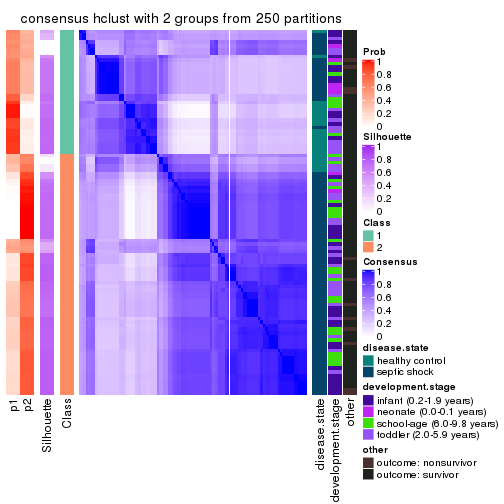</p>

</div>
<div id='tab-MAD-hclust-consensus-heatmap-2'>
<pre><code class="r">consensus_heatmap(res, k = 3)
</code></pre>

<p>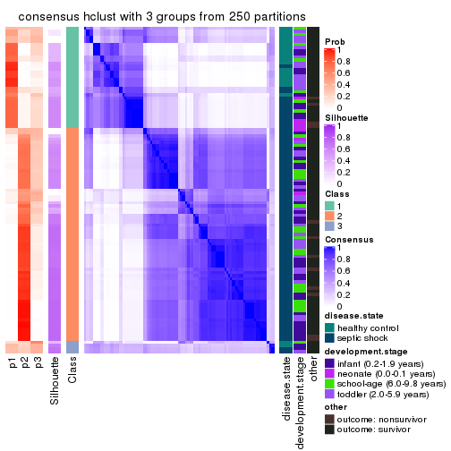</p>

</div>
<div id='tab-MAD-hclust-consensus-heatmap-3'>
<pre><code class="r">consensus_heatmap(res, k = 4)
</code></pre>

<p>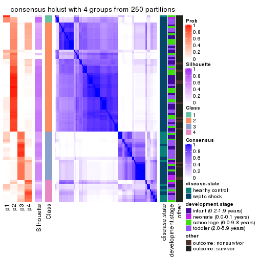</p>

</div>
<div id='tab-MAD-hclust-consensus-heatmap-4'>
<pre><code class="r">consensus_heatmap(res, k = 5)
</code></pre>

<p>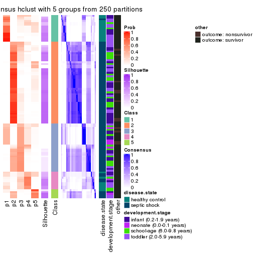</p>

</div>
<div id='tab-MAD-hclust-consensus-heatmap-5'>
<pre><code class="r">consensus_heatmap(res, k = 6)
</code></pre>

<p>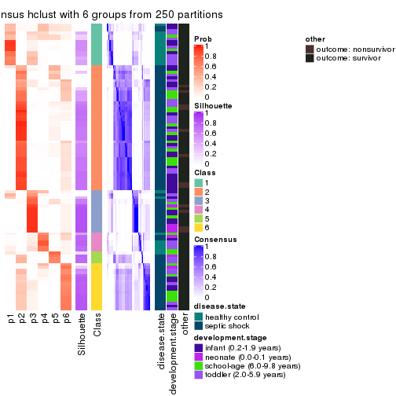</p>

</div>
</div>

Heatmaps for the membership of samples in all partitions to see how consistent they are:


<script>
$( function() {
	$( '#tabs-MAD-hclust-membership-heatmap' ).tabs();
} );
</script>
<div id='tabs-MAD-hclust-membership-heatmap'>
<ul>
<li><a href='#tab-MAD-hclust-membership-heatmap-1'>k = 2</a></li>
<li><a href='#tab-MAD-hclust-membership-heatmap-2'>k = 3</a></li>
<li><a href='#tab-MAD-hclust-membership-heatmap-3'>k = 4</a></li>
<li><a href='#tab-MAD-hclust-membership-heatmap-4'>k = 5</a></li>
<li><a href='#tab-MAD-hclust-membership-heatmap-5'>k = 6</a></li>
</ul>
<div id='tab-MAD-hclust-membership-heatmap-1'>
<pre><code class="r">membership_heatmap(res, k = 2)
</code></pre>

<p>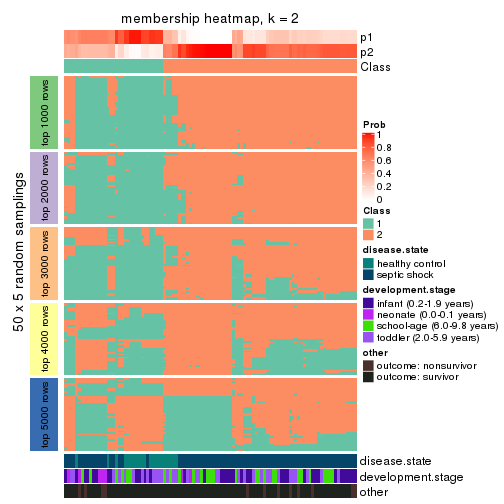</p>

</div>
<div id='tab-MAD-hclust-membership-heatmap-2'>
<pre><code class="r">membership_heatmap(res, k = 3)
</code></pre>

<p>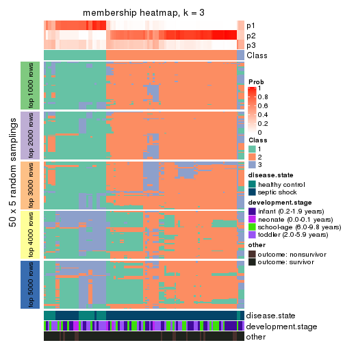</p>

</div>
<div id='tab-MAD-hclust-membership-heatmap-3'>
<pre><code class="r">membership_heatmap(res, k = 4)
</code></pre>

<p>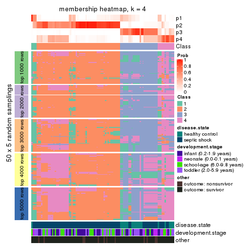</p>

</div>
<div id='tab-MAD-hclust-membership-heatmap-4'>
<pre><code class="r">membership_heatmap(res, k = 5)
</code></pre>

<p>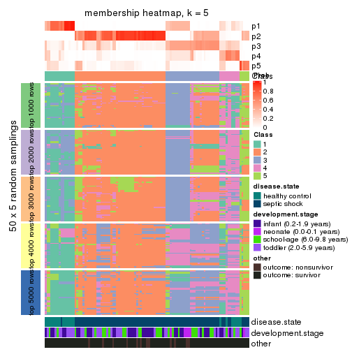</p>

</div>
<div id='tab-MAD-hclust-membership-heatmap-5'>
<pre><code class="r">membership_heatmap(res, k = 6)
</code></pre>

<p>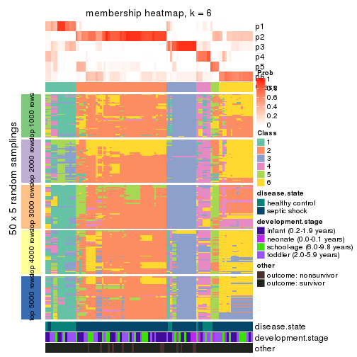</p>

</div>
</div>

As soon as we have had the classes for columns, we can look for signatures
which are significantly different between classes which can be candidate marks
for certain classes. Following are the heatmaps for signatures.


Signature heatmaps where rows are scaled:


<script>
$( function() {
	$( '#tabs-MAD-hclust-get-signatures' ).tabs();
} );
</script>
<div id='tabs-MAD-hclust-get-signatures'>
<ul>
<li><a href='#tab-MAD-hclust-get-signatures-1'>k = 2</a></li>
<li><a href='#tab-MAD-hclust-get-signatures-2'>k = 3</a></li>
<li><a href='#tab-MAD-hclust-get-signatures-3'>k = 4</a></li>
<li><a href='#tab-MAD-hclust-get-signatures-4'>k = 5</a></li>
<li><a href='#tab-MAD-hclust-get-signatures-5'>k = 6</a></li>
</ul>
<div id='tab-MAD-hclust-get-signatures-1'>
<pre><code class="r">get_signatures(res, k = 2)
</code></pre>

<p>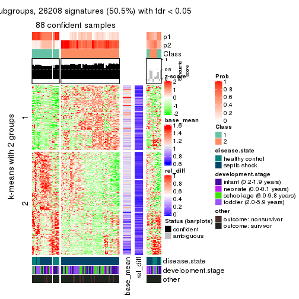</p>

</div>
<div id='tab-MAD-hclust-get-signatures-2'>
<pre><code class="r">get_signatures(res, k = 3)
</code></pre>

<p>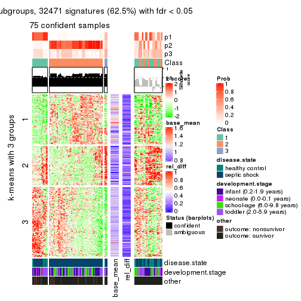</p>

</div>
<div id='tab-MAD-hclust-get-signatures-3'>
<pre><code class="r">get_signatures(res, k = 4)
</code></pre>

<p>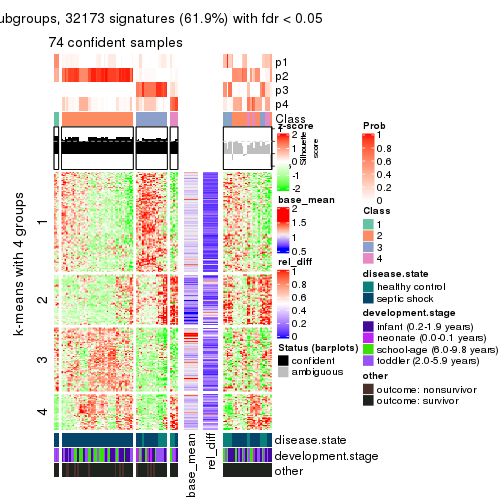</p>

</div>
<div id='tab-MAD-hclust-get-signatures-4'>
<pre><code class="r">get_signatures(res, k = 5)
</code></pre>

<p>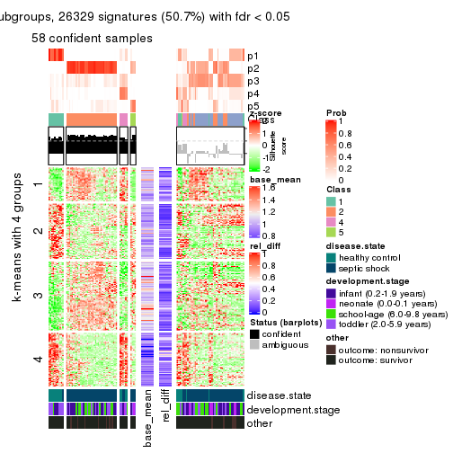</p>

</div>
<div id='tab-MAD-hclust-get-signatures-5'>
<pre><code class="r">get_signatures(res, k = 6)
</code></pre>

<p>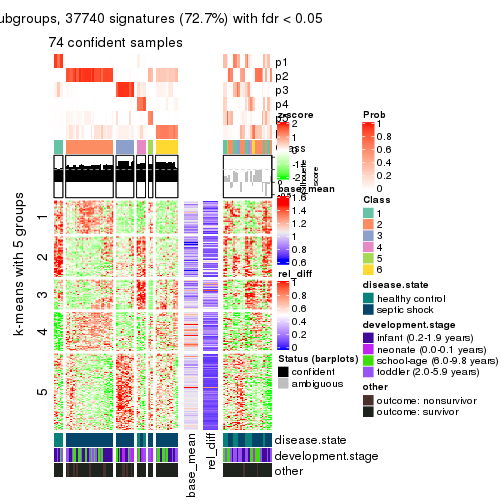</p>

</div>
</div>


Signature heatmaps where rows are not scaled:


<script>
$( function() {
	$( '#tabs-MAD-hclust-get-signatures-no-scale' ).tabs();
} );
</script>
<div id='tabs-MAD-hclust-get-signatures-no-scale'>
<ul>
<li><a href='#tab-MAD-hclust-get-signatures-no-scale-1'>k = 2</a></li>
<li><a href='#tab-MAD-hclust-get-signatures-no-scale-2'>k = 3</a></li>
<li><a href='#tab-MAD-hclust-get-signatures-no-scale-3'>k = 4</a></li>
<li><a href='#tab-MAD-hclust-get-signatures-no-scale-4'>k = 5</a></li>
<li><a href='#tab-MAD-hclust-get-signatures-no-scale-5'>k = 6</a></li>
</ul>
<div id='tab-MAD-hclust-get-signatures-no-scale-1'>
<pre><code class="r">get_signatures(res, k = 2, scale_rows = FALSE)
</code></pre>

<p>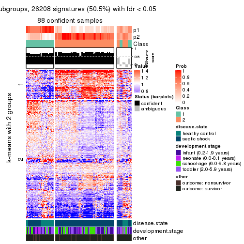</p>

</div>
<div id='tab-MAD-hclust-get-signatures-no-scale-2'>
<pre><code class="r">get_signatures(res, k = 3, scale_rows = FALSE)
</code></pre>

<p>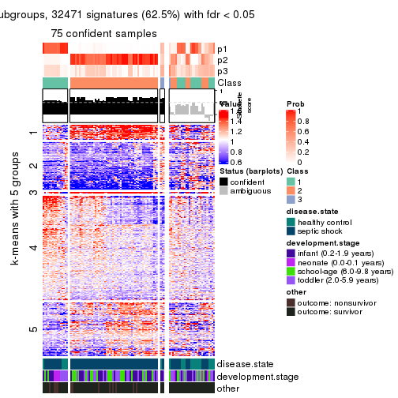</p>

</div>
<div id='tab-MAD-hclust-get-signatures-no-scale-3'>
<pre><code class="r">get_signatures(res, k = 4, scale_rows = FALSE)
</code></pre>

<p>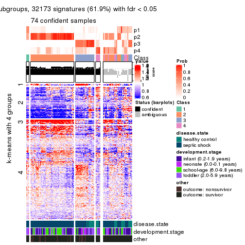</p>

</div>
<div id='tab-MAD-hclust-get-signatures-no-scale-4'>
<pre><code class="r">get_signatures(res, k = 5, scale_rows = FALSE)
</code></pre>

<p>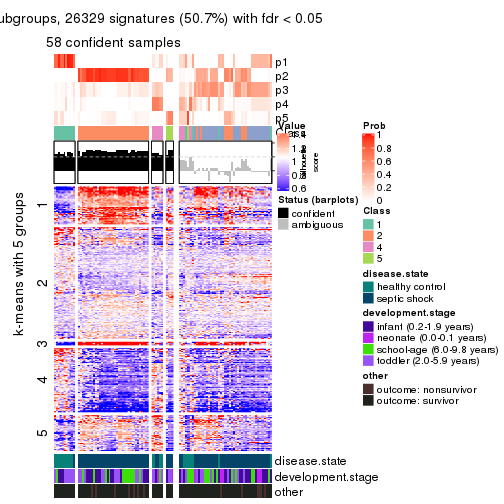</p>

</div>
<div id='tab-MAD-hclust-get-signatures-no-scale-5'>
<pre><code class="r">get_signatures(res, k = 6, scale_rows = FALSE)
</code></pre>

<p>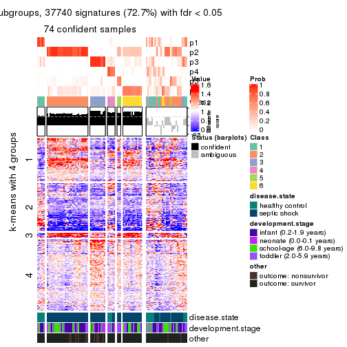</p>

</div>
</div>


Compare the overlap of signatures from different k:

```r
compare_signatures(res)
```

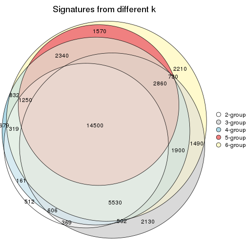

`get_signature()` returns a data frame invisibly. TO get the list of signatures, the function
call should be assigned to a variable explicitly. In following code, if `plot` argument is set
to `FALSE`, no heatmap is plotted while only the differential analysis is performed.

```r
# code only for demonstration
tb = get_signature(res, k = ..., plot = FALSE)
```

An example of the output of `tb` is:

```
#>   which_row         fdr    mean_1    mean_2 scaled_mean_1 scaled_mean_2 km
#> 1        38 0.042760348  8.373488  9.131774    -0.5533452     0.5164555  1
#> 2        40 0.018707592  7.106213  8.469186    -0.6173731     0.5762149  1
#> 3        55 0.019134737 10.221463 11.207825    -0.6159697     0.5749050  1
#> 4        59 0.006059896  5.921854  7.869574    -0.6899429     0.6439467  1
#> 5        60 0.018055526  8.928898 10.211722    -0.6204761     0.5791110  1
#> 6        98 0.009384629 15.714769 14.887706     0.6635654    -0.6193277  2
...
```

The columns in `tb` are:

1. `which_row`: row indices corresponding to the input matrix.
2. `fdr`: FDR for the differential test. 
3. `mean_x`: The mean value in group x.
4. `scaled_mean_x`: The mean value in group x after rows are scaled.
5. `km`: Row groups if k-means clustering is applied to rows.


UMAP plot which shows how samples are separated.


<script>
$( function() {
	$( '#tabs-MAD-hclust-dimension-reduction' ).tabs();
} );
</script>
<div id='tabs-MAD-hclust-dimension-reduction'>
<ul>
<li><a href='#tab-MAD-hclust-dimension-reduction-1'>k = 2</a></li>
<li><a href='#tab-MAD-hclust-dimension-reduction-2'>k = 3</a></li>
<li><a href='#tab-MAD-hclust-dimension-reduction-3'>k = 4</a></li>
<li><a href='#tab-MAD-hclust-dimension-reduction-4'>k = 5</a></li>
<li><a href='#tab-MAD-hclust-dimension-reduction-5'>k = 6</a></li>
</ul>
<div id='tab-MAD-hclust-dimension-reduction-1'>
<pre><code class="r">dimension_reduction(res, k = 2, method = &quot;UMAP&quot;)
</code></pre>

<p>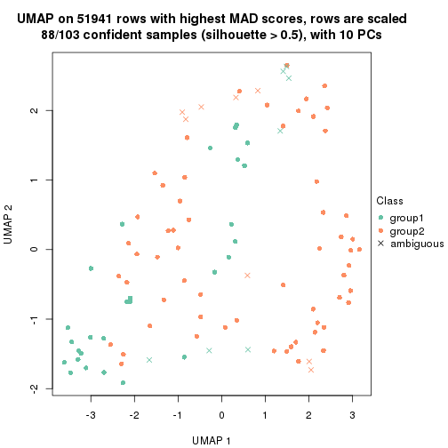</p>

</div>
<div id='tab-MAD-hclust-dimension-reduction-2'>
<pre><code class="r">dimension_reduction(res, k = 3, method = &quot;UMAP&quot;)
</code></pre>

<p>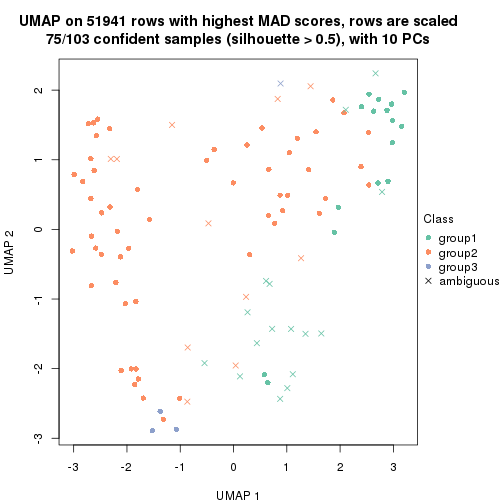</p>

</div>
<div id='tab-MAD-hclust-dimension-reduction-3'>
<pre><code class="r">dimension_reduction(res, k = 4, method = &quot;UMAP&quot;)
</code></pre>

<p>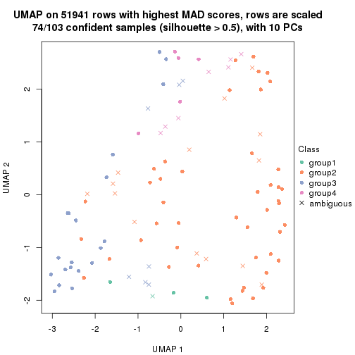</p>

</div>
<div id='tab-MAD-hclust-dimension-reduction-4'>
<pre><code class="r">dimension_reduction(res, k = 5, method = &quot;UMAP&quot;)
</code></pre>

<p>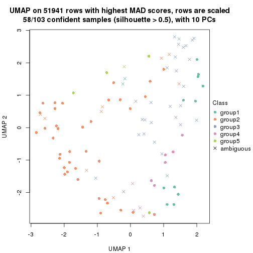</p>

</div>
<div id='tab-MAD-hclust-dimension-reduction-5'>
<pre><code class="r">dimension_reduction(res, k = 6, method = &quot;UMAP&quot;)
</code></pre>

<p>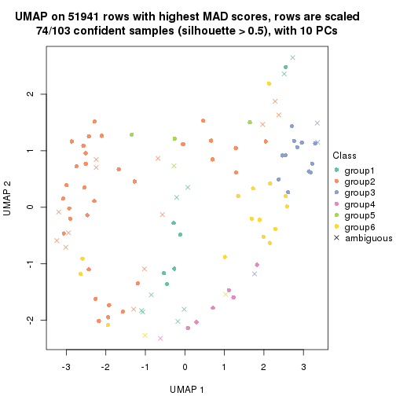</p>

</div>
</div>


Following heatmap shows how subgroups are split when increasing `k`:

```r
collect_classes(res)
```

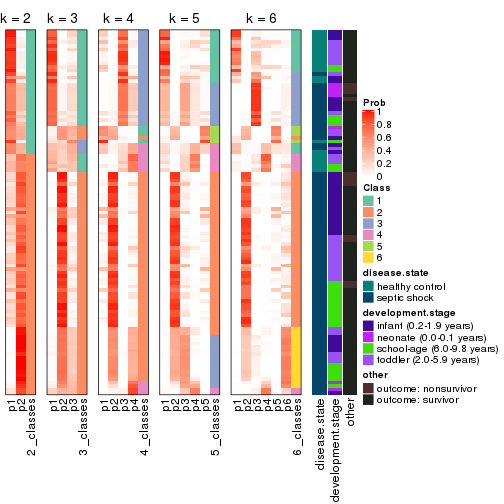


Test correlation between subgroups and known annotations. If the known
annotation is numeric, one-way ANOVA test is applied, and if the known
annotation is discrete, chi-squared contingency table test is applied.

```r
test_to_known_factors(res)
```

```
#>             n disease.state(p) development.stage(p) other(p) k
#> MAD:hclust 88         3.21e-09              0.23396   1.0000 2
#> MAD:hclust 75         6.65e-05              0.00565   0.4364 3
#> MAD:hclust 74         1.70e-05              0.07244   0.6137 4
#> MAD:hclust 58         6.40e-10              0.04874   0.2107 5
#> MAD:hclust 74         3.54e-12              0.05088   0.0917 6
```


If matrix rows can be associated to genes, consider to use `functional_enrichment(res,
...)` to perform function enrichment for the signature genes. See [this vignette](http://bioconductor.org/packages/devel/bioc/vignettes/cola/inst/doc/functional_enrichment.html) for more detailed explanations.


 

---------------------------------------------------


### MAD:kmeans**


The object with results only for a single top-value method and a single partition method 
can be extracted as:

```r
res = res_list["MAD", "kmeans"]
# you can also extract it by
# res = res_list["MAD:kmeans"]
```

A summary of `res` and all the functions that can be applied to it:

```r
res
```

```
#> A 'ConsensusPartition' object with k = 2, 3, 4, 5, 6.
#>   On a matrix with 51941 rows and 103 columns.
#>   Top rows (1000, 2000, 3000, 4000, 5000) are extracted by 'MAD' method.
#>   Subgroups are detected by 'kmeans' method.
#>   Performed in total 1250 partitions by row resampling.
#>   Best k for subgroups seems to be 2.
#> 
#> Following methods can be applied to this 'ConsensusPartition' object:
#>  [1] "cola_report"             "collect_classes"         "collect_plots"          
#>  [4] "collect_stats"           "colnames"                "compare_signatures"     
#>  [7] "consensus_heatmap"       "dimension_reduction"     "functional_enrichment"  
#> [10] "get_anno_col"            "get_anno"                "get_classes"            
#> [13] "get_consensus"           "get_matrix"              "get_membership"         
#> [16] "get_param"               "get_signatures"          "get_stats"              
#> [19] "is_best_k"               "is_stable_k"             "membership_heatmap"     
#> [22] "ncol"                    "nrow"                    "plot_ecdf"              
#> [25] "rownames"                "select_partition_number" "show"                   
#> [28] "suggest_best_k"          "test_to_known_factors"
```

`collect_plots()` function collects all the plots made from `res` for all `k` (number of partitions)
into one single page to provide an easy and fast comparison between different `k`.

```r
collect_plots(res)
```

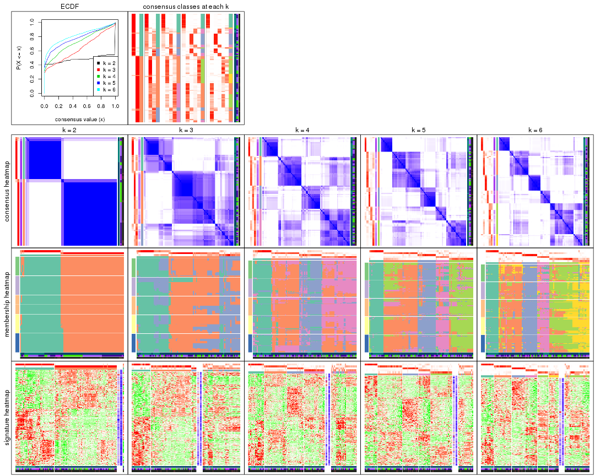

The plots are:

- The first row: a plot of the ECDF (empirical cumulative distribution
  function) curves of the consensus matrix for each `k` and the heatmap of
  predicted classes for each `k`.
- The second row: heatmaps of the consensus matrix for each `k`.
- The third row: heatmaps of the membership matrix for each `k`.
- The fouth row: heatmaps of the signatures for each `k`.

All the plots in panels can be made by individual functions and they are
plotted later in this section.

`select_partition_number()` produces several plots showing different
statistics for choosing "optimized" `k`. There are following statistics:

- ECDF curves of the consensus matrix for each `k`;
- 1-PAC. [The PAC
  score](https://en.wikipedia.org/wiki/Consensus_clustering#Over-interpretation_potential_of_consensus_clustering)
  measures the proportion of the ambiguous subgrouping.
- Mean silhouette score.
- Concordance. The mean probability of fiting the consensus class ids in all
  partitions.
- Area increased. Denote $A_k$ as the area under the ECDF curve for current
  `k`, the area increased is defined as $A_k - A_{k-1}$.
- Rand index. The percent of pairs of samples that are both in a same cluster
  or both are not in a same cluster in the partition of k and k-1.
- Jaccard index. The ratio of pairs of samples are both in a same cluster in
  the partition of k and k-1 and the pairs of samples are both in a same
  cluster in the partition k or k-1.

The detailed explanations of these statistics can be found in [the _cola_
vignette](http://bioconductor.org/packages/devel/bioc/vignettes/cola/inst/doc/cola.html#toc_13).

Generally speaking, lower PAC score, higher mean silhouette score or higher
concordance corresponds to better partition. Rand index and Jaccard index
measure how similar the current partition is compared to partition with `k-1`.
If they are too similar, we won't accept `k` is better than `k-1`.

```r
select_partition_number(res)
```

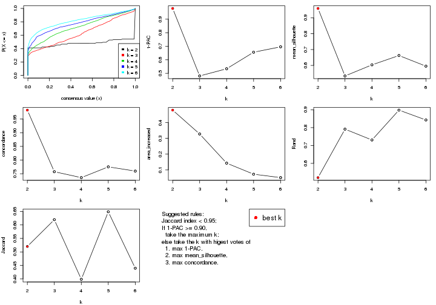

The numeric values for all these statistics can be obtained by `get_stats()`.

```r
get_stats(res)
```

```
#>   k 1-PAC mean_silhouette concordance area_increased  Rand Jaccard
#> 2 2 0.979           0.959       0.983         0.4787 0.520   0.520
#> 3 3 0.480           0.534       0.757         0.3275 0.791   0.619
#> 4 4 0.534           0.604       0.736         0.1429 0.731   0.399
#> 5 5 0.656           0.662       0.775         0.0730 0.898   0.649
#> 6 6 0.696           0.595       0.760         0.0513 0.843   0.440
```

`suggest_best_k()` suggests the best $k$ based on these statistics. The rules are as follows:

- All $k$ with Jaccard index larger than 0.95 are removed because increasing
  $k$ does not provide enough extra information. If all $k$ are removed, it is
  marked as no subgroup is detected.
- For all $k$ with 1-PAC score larger than 0.9, the maximal $k$ is taken as
  the best $k$, and other $k$ are marked as optional $k$.
- If it does not fit the second rule. The $k$ with the maximal vote of the
  highest 1-PAC score, highest mean silhouette, and highest concordance is
  taken as the best $k$.

```r
suggest_best_k(res)
```

```
#> [1] 2
```


Following shows the table of the partitions (You need to click the **show/hide
code output** link to see it). The membership matrix (columns with name `p*`)
is inferred by
[`clue::cl_consensus()`](https://www.rdocumentation.org/link/cl_consensus?package=clue)
function with the `SE` method. Basically the value in the membership matrix
represents the probability to belong to a certain group. The finall class
label for an item is determined with the group with highest probability it
belongs to.

In `get_classes()` function, the entropy is calculated from the membership
matrix and the silhouette score is calculated from the consensus matrix.


<script>
$( function() {
	$( '#tabs-MAD-kmeans-get-classes' ).tabs();
} );
</script>
<div id='tabs-MAD-kmeans-get-classes'>
<ul>
<li><a href='#tab-MAD-kmeans-get-classes-1'>k = 2</a></li>
<li><a href='#tab-MAD-kmeans-get-classes-2'>k = 3</a></li>
<li><a href='#tab-MAD-kmeans-get-classes-3'>k = 4</a></li>
<li><a href='#tab-MAD-kmeans-get-classes-4'>k = 5</a></li>
<li><a href='#tab-MAD-kmeans-get-classes-5'>k = 6</a></li>
</ul>

<div id='tab-MAD-kmeans-get-classes-1'>
<p><a id='tab-MAD-kmeans-get-classes-1-a' style='color:#0366d6' href='#'>show/hide code output</a></p>
<pre><code class="r">cbind(get_classes(res, k = 2), get_membership(res, k = 2))
</code></pre>

<pre><code>#&gt;           class entropy silhouette    p1    p2
#&gt; GSM647569     1   0.000      0.973 1.000 0.000
#&gt; GSM647574     1   0.000      0.973 1.000 0.000
#&gt; GSM647577     1   0.000      0.973 1.000 0.000
#&gt; GSM647547     1   0.000      0.973 1.000 0.000
#&gt; GSM647552     1   0.745      0.731 0.788 0.212
#&gt; GSM647553     1   0.000      0.973 1.000 0.000
#&gt; GSM647565     2   0.000      0.987 0.000 1.000
#&gt; GSM647545     2   0.000      0.987 0.000 1.000
#&gt; GSM647549     2   0.000      0.987 0.000 1.000
#&gt; GSM647550     2   0.000      0.987 0.000 1.000
#&gt; GSM647560     2   0.000      0.987 0.000 1.000
#&gt; GSM647617     1   0.000      0.973 1.000 0.000
#&gt; GSM647528     2   0.000      0.987 0.000 1.000
#&gt; GSM647529     1   0.949      0.425 0.632 0.368
#&gt; GSM647531     2   0.000      0.987 0.000 1.000
#&gt; GSM647540     2   0.000      0.987 0.000 1.000
#&gt; GSM647541     2   0.000      0.987 0.000 1.000
#&gt; GSM647546     1   0.541      0.849 0.876 0.124
#&gt; GSM647557     2   0.000      0.987 0.000 1.000
#&gt; GSM647561     2   0.000      0.987 0.000 1.000
#&gt; GSM647567     2   0.844      0.622 0.272 0.728
#&gt; GSM647568     2   0.000      0.987 0.000 1.000
#&gt; GSM647570     2   0.000      0.987 0.000 1.000
#&gt; GSM647573     1   0.000      0.973 1.000 0.000
#&gt; GSM647576     2   0.000      0.987 0.000 1.000
#&gt; GSM647579     2   0.827      0.644 0.260 0.740
#&gt; GSM647580     1   0.000      0.973 1.000 0.000
#&gt; GSM647583     1   0.000      0.973 1.000 0.000
#&gt; GSM647592     2   0.000      0.987 0.000 1.000
#&gt; GSM647593     2   0.000      0.987 0.000 1.000
#&gt; GSM647595     2   0.000      0.987 0.000 1.000
#&gt; GSM647597     2   0.000      0.987 0.000 1.000
#&gt; GSM647598     2   0.000      0.987 0.000 1.000
#&gt; GSM647613     2   0.000      0.987 0.000 1.000
#&gt; GSM647615     2   0.000      0.987 0.000 1.000
#&gt; GSM647616     1   0.000      0.973 1.000 0.000
#&gt; GSM647619     2   0.000      0.987 0.000 1.000
#&gt; GSM647582     2   0.000      0.987 0.000 1.000
#&gt; GSM647591     2   0.000      0.987 0.000 1.000
#&gt; GSM647527     2   0.000      0.987 0.000 1.000
#&gt; GSM647530     2   0.000      0.987 0.000 1.000
#&gt; GSM647532     1   0.000      0.973 1.000 0.000
#&gt; GSM647544     2   0.000      0.987 0.000 1.000
#&gt; GSM647551     2   0.000      0.987 0.000 1.000
#&gt; GSM647556     1   0.000      0.973 1.000 0.000
#&gt; GSM647558     2   0.000      0.987 0.000 1.000
#&gt; GSM647572     2   0.802      0.672 0.244 0.756
#&gt; GSM647578     2   0.000      0.987 0.000 1.000
#&gt; GSM647581     2   0.000      0.987 0.000 1.000
#&gt; GSM647594     2   0.000      0.987 0.000 1.000
#&gt; GSM647599     1   0.000      0.973 1.000 0.000
#&gt; GSM647600     2   0.000      0.987 0.000 1.000
#&gt; GSM647601     2   0.000      0.987 0.000 1.000
#&gt; GSM647603     2   0.000      0.987 0.000 1.000
#&gt; GSM647610     2   0.000      0.987 0.000 1.000
#&gt; GSM647611     2   0.000      0.987 0.000 1.000
#&gt; GSM647612     2   0.000      0.987 0.000 1.000
#&gt; GSM647614     2   0.000      0.987 0.000 1.000
#&gt; GSM647618     2   0.000      0.987 0.000 1.000
#&gt; GSM647629     2   0.000      0.987 0.000 1.000
#&gt; GSM647535     2   0.000      0.987 0.000 1.000
#&gt; GSM647563     2   0.000      0.987 0.000 1.000
#&gt; GSM647542     2   0.000      0.987 0.000 1.000
#&gt; GSM647543     2   0.000      0.987 0.000 1.000
#&gt; GSM647548     2   0.000      0.987 0.000 1.000
#&gt; GSM647554     2   0.000      0.987 0.000 1.000
#&gt; GSM647555     2   0.000      0.987 0.000 1.000
#&gt; GSM647559     2   0.000      0.987 0.000 1.000
#&gt; GSM647562     2   0.000      0.987 0.000 1.000
#&gt; GSM647564     1   0.000      0.973 1.000 0.000
#&gt; GSM647571     2   0.000      0.987 0.000 1.000
#&gt; GSM647584     2   0.000      0.987 0.000 1.000
#&gt; GSM647585     1   0.000      0.973 1.000 0.000
#&gt; GSM647586     2   0.000      0.987 0.000 1.000
#&gt; GSM647587     2   0.000      0.987 0.000 1.000
#&gt; GSM647588     2   0.000      0.987 0.000 1.000
#&gt; GSM647596     2   0.000      0.987 0.000 1.000
#&gt; GSM647602     1   0.000      0.973 1.000 0.000
#&gt; GSM647609     2   0.000      0.987 0.000 1.000
#&gt; GSM647620     2   0.000      0.987 0.000 1.000
#&gt; GSM647627     2   0.000      0.987 0.000 1.000
#&gt; GSM647628     2   0.000      0.987 0.000 1.000
#&gt; GSM647533     1   0.000      0.973 1.000 0.000
#&gt; GSM647536     1   0.000      0.973 1.000 0.000
#&gt; GSM647537     1   0.000      0.973 1.000 0.000
#&gt; GSM647606     1   0.000      0.973 1.000 0.000
#&gt; GSM647621     1   0.000      0.973 1.000 0.000
#&gt; GSM647626     1   0.000      0.973 1.000 0.000
#&gt; GSM647538     1   0.000      0.973 1.000 0.000
#&gt; GSM647575     1   0.000      0.973 1.000 0.000
#&gt; GSM647590     1   0.000      0.973 1.000 0.000
#&gt; GSM647605     1   0.000      0.973 1.000 0.000
#&gt; GSM647607     1   0.000      0.973 1.000 0.000
#&gt; GSM647608     1   0.000      0.973 1.000 0.000
#&gt; GSM647622     1   0.000      0.973 1.000 0.000
#&gt; GSM647623     1   0.000      0.973 1.000 0.000
#&gt; GSM647624     1   0.000      0.973 1.000 0.000
#&gt; GSM647625     1   0.000      0.973 1.000 0.000
#&gt; GSM647534     1   0.000      0.973 1.000 0.000
#&gt; GSM647539     1   0.886      0.573 0.696 0.304
#&gt; GSM647566     1   0.000      0.973 1.000 0.000
#&gt; GSM647589     1   0.000      0.973 1.000 0.000
#&gt; GSM647604     1   0.000      0.973 1.000 0.000
</code></pre>

<script>
$('#tab-MAD-kmeans-get-classes-1-a').parent().next().next().hide();
$('#tab-MAD-kmeans-get-classes-1-a').click(function(){
  $('#tab-MAD-kmeans-get-classes-1-a').parent().next().next().toggle();
  return(false);
});
</script>
</div>

<div id='tab-MAD-kmeans-get-classes-2'>
<p><a id='tab-MAD-kmeans-get-classes-2-a' style='color:#0366d6' href='#'>show/hide code output</a></p>
<pre><code class="r">cbind(get_classes(res, k = 3), get_membership(res, k = 3))
</code></pre>

<pre><code>#&gt;           class entropy silhouette    p1    p2    p3
#&gt; GSM647569     1  0.6309     0.4738 0.500 0.000 0.500
#&gt; GSM647574     3  0.6204    -0.4168 0.424 0.000 0.576
#&gt; GSM647577     1  0.6309     0.4767 0.504 0.000 0.496
#&gt; GSM647547     3  0.5098    -0.0224 0.248 0.000 0.752
#&gt; GSM647552     2  0.6936     0.0147 0.460 0.524 0.016
#&gt; GSM647553     1  0.6305     0.4902 0.516 0.000 0.484
#&gt; GSM647565     3  0.1289     0.5287 0.000 0.032 0.968
#&gt; GSM647545     2  0.6062     0.5257 0.000 0.616 0.384
#&gt; GSM647549     2  0.6062     0.5257 0.000 0.616 0.384
#&gt; GSM647550     2  0.6252     0.4160 0.000 0.556 0.444
#&gt; GSM647560     3  0.6026     0.2075 0.000 0.376 0.624
#&gt; GSM647617     3  0.6260    -0.4182 0.448 0.000 0.552
#&gt; GSM647528     2  0.4750     0.7088 0.000 0.784 0.216
#&gt; GSM647529     1  0.8203     0.1068 0.484 0.444 0.072
#&gt; GSM647531     2  0.3482     0.7355 0.000 0.872 0.128
#&gt; GSM647540     3  0.6192     0.1024 0.000 0.420 0.580
#&gt; GSM647541     2  0.5650     0.6206 0.000 0.688 0.312
#&gt; GSM647546     3  0.0475     0.5007 0.004 0.004 0.992
#&gt; GSM647557     2  0.1289     0.7383 0.000 0.968 0.032
#&gt; GSM647561     2  0.4750     0.7088 0.000 0.784 0.216
#&gt; GSM647567     2  0.6054     0.4956 0.052 0.768 0.180
#&gt; GSM647568     3  0.5216     0.4701 0.000 0.260 0.740
#&gt; GSM647570     2  0.6274     0.3854 0.000 0.544 0.456
#&gt; GSM647573     3  0.3619     0.3083 0.136 0.000 0.864
#&gt; GSM647576     3  0.4555     0.5224 0.000 0.200 0.800
#&gt; GSM647579     3  0.8518     0.3335 0.104 0.356 0.540
#&gt; GSM647580     1  0.6309     0.4767 0.504 0.000 0.496
#&gt; GSM647583     1  0.6309     0.4767 0.504 0.000 0.496
#&gt; GSM647592     2  0.0000     0.7401 0.000 1.000 0.000
#&gt; GSM647593     2  0.0000     0.7401 0.000 1.000 0.000
#&gt; GSM647595     2  0.0000     0.7401 0.000 1.000 0.000
#&gt; GSM647597     2  0.6205     0.2988 0.336 0.656 0.008
#&gt; GSM647598     2  0.0000     0.7401 0.000 1.000 0.000
#&gt; GSM647613     2  0.4974     0.6952 0.000 0.764 0.236
#&gt; GSM647615     3  0.5254     0.4640 0.000 0.264 0.736
#&gt; GSM647616     1  0.6309     0.4767 0.504 0.000 0.496
#&gt; GSM647619     2  0.0000     0.7401 0.000 1.000 0.000
#&gt; GSM647582     2  0.0000     0.7401 0.000 1.000 0.000
#&gt; GSM647591     2  0.0000     0.7401 0.000 1.000 0.000
#&gt; GSM647527     2  0.4750     0.7088 0.000 0.784 0.216
#&gt; GSM647530     2  0.5560     0.6386 0.000 0.700 0.300
#&gt; GSM647532     1  0.4062     0.6104 0.836 0.000 0.164
#&gt; GSM647544     2  0.5529     0.6376 0.000 0.704 0.296
#&gt; GSM647551     2  0.0237     0.7378 0.000 0.996 0.004
#&gt; GSM647556     1  0.6305     0.4927 0.516 0.000 0.484
#&gt; GSM647558     2  0.6267     0.3954 0.000 0.548 0.452
#&gt; GSM647572     3  0.0592     0.5088 0.000 0.012 0.988
#&gt; GSM647578     2  0.6299     0.2993 0.000 0.524 0.476
#&gt; GSM647581     2  0.6079     0.5228 0.000 0.612 0.388
#&gt; GSM647594     2  0.0000     0.7401 0.000 1.000 0.000
#&gt; GSM647599     1  0.0000     0.7068 1.000 0.000 0.000
#&gt; GSM647600     2  0.1170     0.7230 0.016 0.976 0.008
#&gt; GSM647601     2  0.0000     0.7401 0.000 1.000 0.000
#&gt; GSM647603     2  0.3752     0.6941 0.000 0.856 0.144
#&gt; GSM647610     2  0.1753     0.7216 0.000 0.952 0.048
#&gt; GSM647611     2  0.0424     0.7416 0.000 0.992 0.008
#&gt; GSM647612     3  0.6267    -0.1201 0.000 0.452 0.548
#&gt; GSM647614     3  0.5882     0.3005 0.000 0.348 0.652
#&gt; GSM647618     2  0.0000     0.7401 0.000 1.000 0.000
#&gt; GSM647629     2  0.2165     0.7281 0.000 0.936 0.064
#&gt; GSM647535     2  0.4399     0.7200 0.000 0.812 0.188
#&gt; GSM647563     2  0.5968     0.5564 0.000 0.636 0.364
#&gt; GSM647542     3  0.5905     0.2914 0.000 0.352 0.648
#&gt; GSM647543     3  0.5905     0.2914 0.000 0.352 0.648
#&gt; GSM647548     3  0.3551     0.5626 0.000 0.132 0.868
#&gt; GSM647554     2  0.1529     0.7311 0.000 0.960 0.040
#&gt; GSM647555     2  0.6305     0.3110 0.000 0.516 0.484
#&gt; GSM647559     2  0.4931     0.6981 0.000 0.768 0.232
#&gt; GSM647562     2  0.5529     0.6376 0.000 0.704 0.296
#&gt; GSM647564     3  0.6095    -0.3168 0.392 0.000 0.608
#&gt; GSM647571     3  0.5363     0.4483 0.000 0.276 0.724
#&gt; GSM647584     2  0.0000     0.7401 0.000 1.000 0.000
#&gt; GSM647585     1  0.5988     0.5810 0.632 0.000 0.368
#&gt; GSM647586     2  0.3879     0.7313 0.000 0.848 0.152
#&gt; GSM647587     2  0.4750     0.7088 0.000 0.784 0.216
#&gt; GSM647588     2  0.4974     0.6961 0.000 0.764 0.236
#&gt; GSM647596     2  0.4750     0.7088 0.000 0.784 0.216
#&gt; GSM647602     1  0.6309     0.4767 0.504 0.000 0.496
#&gt; GSM647609     2  0.0000     0.7401 0.000 1.000 0.000
#&gt; GSM647620     2  0.0424     0.7416 0.000 0.992 0.008
#&gt; GSM647627     2  0.3879     0.7313 0.000 0.848 0.152
#&gt; GSM647628     2  0.6295     0.3420 0.000 0.528 0.472
#&gt; GSM647533     1  0.0000     0.7068 1.000 0.000 0.000
#&gt; GSM647536     1  0.4068     0.6233 0.864 0.016 0.120
#&gt; GSM647537     1  0.0000     0.7068 1.000 0.000 0.000
#&gt; GSM647606     1  0.0000     0.7068 1.000 0.000 0.000
#&gt; GSM647621     1  0.6140     0.5503 0.596 0.000 0.404
#&gt; GSM647626     1  0.5363     0.6316 0.724 0.000 0.276
#&gt; GSM647538     1  0.0000     0.7068 1.000 0.000 0.000
#&gt; GSM647575     1  0.6280     0.4584 0.540 0.000 0.460
#&gt; GSM647590     1  0.0747     0.7022 0.984 0.000 0.016
#&gt; GSM647605     1  0.0000     0.7068 1.000 0.000 0.000
#&gt; GSM647607     1  0.6260     0.4777 0.552 0.000 0.448
#&gt; GSM647608     1  0.5905     0.5856 0.648 0.000 0.352
#&gt; GSM647622     1  0.0000     0.7068 1.000 0.000 0.000
#&gt; GSM647623     1  0.0000     0.7068 1.000 0.000 0.000
#&gt; GSM647624     1  0.0747     0.7022 0.984 0.000 0.016
#&gt; GSM647625     1  0.0000     0.7068 1.000 0.000 0.000
#&gt; GSM647534     1  0.5588     0.4296 0.720 0.276 0.004
#&gt; GSM647539     3  0.5404     0.2679 0.256 0.004 0.740
#&gt; GSM647566     1  0.0237     0.7051 0.996 0.000 0.004
#&gt; GSM647589     1  0.6299     0.4661 0.524 0.000 0.476
#&gt; GSM647604     1  0.0000     0.7068 1.000 0.000 0.000
</code></pre>

<script>
$('#tab-MAD-kmeans-get-classes-2-a').parent().next().next().hide();
$('#tab-MAD-kmeans-get-classes-2-a').click(function(){
  $('#tab-MAD-kmeans-get-classes-2-a').parent().next().next().toggle();
  return(false);
});
</script>
</div>

<div id='tab-MAD-kmeans-get-classes-3'>
<p><a id='tab-MAD-kmeans-get-classes-3-a' style='color:#0366d6' href='#'>show/hide code output</a></p>
<pre><code class="r">cbind(get_classes(res, k = 4), get_membership(res, k = 4))
</code></pre>

<pre><code>#&gt;           class entropy silhouette    p1    p2    p3    p4
#&gt; GSM647569     3  0.3494    0.76527 0.172 0.004 0.824 0.000
#&gt; GSM647574     3  0.3077    0.73023 0.068 0.004 0.892 0.036
#&gt; GSM647577     3  0.3311    0.76640 0.172 0.000 0.828 0.000
#&gt; GSM647547     3  0.4888    0.62444 0.004 0.072 0.784 0.140
#&gt; GSM647552     2  0.6281    0.49055 0.184 0.704 0.080 0.032
#&gt; GSM647553     3  0.3569    0.75219 0.196 0.000 0.804 0.000
#&gt; GSM647565     4  0.5314    0.47704 0.000 0.084 0.176 0.740
#&gt; GSM647545     4  0.3217    0.67143 0.000 0.128 0.012 0.860
#&gt; GSM647549     4  0.3088    0.67024 0.000 0.128 0.008 0.864
#&gt; GSM647550     4  0.2984    0.68308 0.000 0.084 0.028 0.888
#&gt; GSM647560     4  0.5496    0.44698 0.000 0.036 0.312 0.652
#&gt; GSM647617     3  0.3450    0.76534 0.156 0.000 0.836 0.008
#&gt; GSM647528     4  0.5112    0.19761 0.000 0.436 0.004 0.560
#&gt; GSM647529     2  0.7594   -0.37057 0.436 0.440 0.092 0.032
#&gt; GSM647531     2  0.5588    0.35048 0.004 0.600 0.020 0.376
#&gt; GSM647540     3  0.6337   -0.02098 0.000 0.060 0.476 0.464
#&gt; GSM647541     4  0.4059    0.60425 0.000 0.200 0.012 0.788
#&gt; GSM647546     3  0.2589    0.70693 0.000 0.000 0.884 0.116
#&gt; GSM647557     2  0.3730    0.73064 0.004 0.836 0.016 0.144
#&gt; GSM647561     4  0.5060    0.26221 0.000 0.412 0.004 0.584
#&gt; GSM647567     2  0.6373    0.50909 0.012 0.656 0.248 0.084
#&gt; GSM647568     4  0.2773    0.65757 0.000 0.004 0.116 0.880
#&gt; GSM647570     4  0.1706    0.68644 0.000 0.036 0.016 0.948
#&gt; GSM647573     3  0.7152    0.42501 0.024 0.088 0.564 0.324
#&gt; GSM647576     4  0.5088    0.21839 0.000 0.004 0.424 0.572
#&gt; GSM647579     3  0.6557    0.60163 0.020 0.140 0.680 0.160
#&gt; GSM647580     3  0.3311    0.76640 0.172 0.000 0.828 0.000
#&gt; GSM647583     3  0.3311    0.76640 0.172 0.000 0.828 0.000
#&gt; GSM647592     2  0.2831    0.77825 0.000 0.876 0.004 0.120
#&gt; GSM647593     2  0.2760    0.77963 0.000 0.872 0.000 0.128
#&gt; GSM647595     2  0.2814    0.77933 0.000 0.868 0.000 0.132
#&gt; GSM647597     2  0.5096    0.57835 0.168 0.772 0.020 0.040
#&gt; GSM647598     2  0.4188    0.70385 0.000 0.752 0.004 0.244
#&gt; GSM647613     4  0.4720    0.46267 0.000 0.324 0.004 0.672
#&gt; GSM647615     4  0.4677    0.56918 0.000 0.040 0.192 0.768
#&gt; GSM647616     3  0.3311    0.76640 0.172 0.000 0.828 0.000
#&gt; GSM647619     2  0.2704    0.77924 0.000 0.876 0.000 0.124
#&gt; GSM647582     2  0.3335    0.77769 0.000 0.856 0.016 0.128
#&gt; GSM647591     2  0.2760    0.77963 0.000 0.872 0.000 0.128
#&gt; GSM647527     4  0.5112    0.19761 0.000 0.436 0.004 0.560
#&gt; GSM647530     4  0.5290    0.55609 0.004 0.292 0.024 0.680
#&gt; GSM647532     1  0.6666    0.66088 0.696 0.104 0.148 0.052
#&gt; GSM647544     4  0.4252    0.56910 0.000 0.252 0.004 0.744
#&gt; GSM647551     2  0.3219    0.77122 0.000 0.868 0.020 0.112
#&gt; GSM647556     3  0.3895    0.75126 0.184 0.012 0.804 0.000
#&gt; GSM647558     4  0.2376    0.68545 0.000 0.068 0.016 0.916
#&gt; GSM647572     3  0.4164    0.61685 0.000 0.000 0.736 0.264
#&gt; GSM647578     4  0.6723    0.52341 0.000 0.196 0.188 0.616
#&gt; GSM647581     4  0.3402    0.66604 0.000 0.164 0.004 0.832
#&gt; GSM647594     2  0.3668    0.75853 0.000 0.808 0.004 0.188
#&gt; GSM647599     1  0.1807    0.82583 0.940 0.008 0.052 0.000
#&gt; GSM647600     2  0.3996    0.74677 0.000 0.836 0.060 0.104
#&gt; GSM647601     2  0.3751    0.75401 0.000 0.800 0.004 0.196
#&gt; GSM647603     2  0.6571    0.51815 0.000 0.612 0.124 0.264
#&gt; GSM647610     2  0.3708    0.75279 0.000 0.832 0.020 0.148
#&gt; GSM647611     2  0.3982    0.73322 0.000 0.776 0.004 0.220
#&gt; GSM647612     4  0.1913    0.68390 0.000 0.020 0.040 0.940
#&gt; GSM647614     4  0.2530    0.66170 0.000 0.000 0.112 0.888
#&gt; GSM647618     2  0.3626    0.75918 0.000 0.812 0.004 0.184
#&gt; GSM647629     2  0.4576    0.69239 0.000 0.728 0.012 0.260
#&gt; GSM647535     4  0.5119    0.14494 0.000 0.440 0.004 0.556
#&gt; GSM647563     4  0.2999    0.66322 0.000 0.132 0.004 0.864
#&gt; GSM647542     4  0.2714    0.66327 0.000 0.004 0.112 0.884
#&gt; GSM647543     4  0.2714    0.66327 0.000 0.004 0.112 0.884
#&gt; GSM647548     4  0.5653    0.46948 0.000 0.096 0.192 0.712
#&gt; GSM647554     2  0.3790    0.74683 0.000 0.820 0.016 0.164
#&gt; GSM647555     4  0.2644    0.68679 0.000 0.060 0.032 0.908
#&gt; GSM647559     4  0.4761    0.45635 0.000 0.332 0.004 0.664
#&gt; GSM647562     4  0.4283    0.56542 0.000 0.256 0.004 0.740
#&gt; GSM647564     3  0.3216    0.74768 0.076 0.000 0.880 0.044
#&gt; GSM647571     4  0.2714    0.66095 0.000 0.004 0.112 0.884
#&gt; GSM647584     2  0.2814    0.77933 0.000 0.868 0.000 0.132
#&gt; GSM647585     3  0.4059    0.74748 0.200 0.012 0.788 0.000
#&gt; GSM647586     2  0.5168   -0.00634 0.000 0.500 0.004 0.496
#&gt; GSM647587     4  0.5147    0.12726 0.000 0.460 0.004 0.536
#&gt; GSM647588     4  0.4761    0.41763 0.000 0.332 0.004 0.664
#&gt; GSM647596     4  0.5050    0.27001 0.000 0.408 0.004 0.588
#&gt; GSM647602     3  0.3494    0.76599 0.172 0.004 0.824 0.000
#&gt; GSM647609     2  0.3751    0.75401 0.000 0.800 0.004 0.196
#&gt; GSM647620     2  0.4343    0.67941 0.000 0.732 0.004 0.264
#&gt; GSM647627     2  0.5168   -0.00634 0.000 0.500 0.004 0.496
#&gt; GSM647628     4  0.1733    0.68485 0.000 0.028 0.024 0.948
#&gt; GSM647533     1  0.0469    0.85798 0.988 0.000 0.012 0.000
#&gt; GSM647536     1  0.6351    0.67805 0.716 0.112 0.132 0.040
#&gt; GSM647537     1  0.0469    0.85798 0.988 0.000 0.012 0.000
#&gt; GSM647606     1  0.0336    0.85862 0.992 0.000 0.008 0.000
#&gt; GSM647621     3  0.7410    0.35930 0.308 0.052 0.568 0.072
#&gt; GSM647626     3  0.4509    0.66196 0.288 0.004 0.708 0.000
#&gt; GSM647538     1  0.0336    0.85854 0.992 0.000 0.008 0.000
#&gt; GSM647575     1  0.8919    0.10243 0.392 0.076 0.356 0.176
#&gt; GSM647590     1  0.1488    0.84646 0.956 0.012 0.032 0.000
#&gt; GSM647605     1  0.0000    0.85814 1.000 0.000 0.000 0.000
#&gt; GSM647607     1  0.8584    0.33030 0.492 0.076 0.276 0.156
#&gt; GSM647608     3  0.7336    0.29259 0.336 0.052 0.552 0.060
#&gt; GSM647622     1  0.0657    0.85757 0.984 0.004 0.012 0.000
#&gt; GSM647623     1  0.0469    0.85798 0.988 0.000 0.012 0.000
#&gt; GSM647624     1  0.1388    0.84813 0.960 0.012 0.028 0.000
#&gt; GSM647625     1  0.0469    0.85798 0.988 0.000 0.012 0.000
#&gt; GSM647534     1  0.5143    0.59559 0.708 0.256 0.036 0.000
#&gt; GSM647539     4  0.8564    0.20909 0.196 0.108 0.160 0.536
#&gt; GSM647566     1  0.1411    0.85138 0.960 0.020 0.020 0.000
#&gt; GSM647589     3  0.7624    0.42032 0.248 0.052 0.588 0.112
#&gt; GSM647604     1  0.0000    0.85814 1.000 0.000 0.000 0.000
</code></pre>

<script>
$('#tab-MAD-kmeans-get-classes-3-a').parent().next().next().hide();
$('#tab-MAD-kmeans-get-classes-3-a').click(function(){
  $('#tab-MAD-kmeans-get-classes-3-a').parent().next().next().toggle();
  return(false);
});
</script>
</div>

<div id='tab-MAD-kmeans-get-classes-4'>
<p><a id='tab-MAD-kmeans-get-classes-4-a' style='color:#0366d6' href='#'>show/hide code output</a></p>
<pre><code class="r">cbind(get_classes(res, k = 5), get_membership(res, k = 5))
</code></pre>

<pre><code>#&gt;           class entropy silhouette    p1    p2    p3    p4    p5
#&gt; GSM647569     3  0.1864     0.8351 0.068 0.000 0.924 0.004 0.004
#&gt; GSM647574     3  0.2077     0.7792 0.008 0.000 0.908 0.084 0.000
#&gt; GSM647577     3  0.1704     0.8371 0.068 0.000 0.928 0.004 0.000
#&gt; GSM647547     4  0.4339     0.5910 0.000 0.020 0.296 0.684 0.000
#&gt; GSM647552     5  0.5104     0.6106 0.028 0.004 0.036 0.224 0.708
#&gt; GSM647553     3  0.1704     0.8371 0.068 0.000 0.928 0.004 0.000
#&gt; GSM647565     4  0.5262     0.3264 0.000 0.460 0.020 0.504 0.016
#&gt; GSM647545     2  0.2625     0.6933 0.000 0.900 0.016 0.028 0.056
#&gt; GSM647549     2  0.2243     0.6933 0.000 0.916 0.012 0.016 0.056
#&gt; GSM647550     2  0.2511     0.6721 0.000 0.892 0.028 0.080 0.000
#&gt; GSM647560     2  0.5939     0.3443 0.000 0.608 0.252 0.132 0.008
#&gt; GSM647617     3  0.1357     0.8334 0.048 0.000 0.948 0.004 0.000
#&gt; GSM647528     2  0.5370     0.4969 0.000 0.584 0.000 0.068 0.348
#&gt; GSM647529     4  0.6049     0.5513 0.148 0.004 0.016 0.640 0.192
#&gt; GSM647531     2  0.6385     0.2867 0.000 0.468 0.016 0.108 0.408
#&gt; GSM647540     3  0.6397     0.4713 0.000 0.248 0.588 0.136 0.028
#&gt; GSM647541     2  0.3880     0.6578 0.000 0.828 0.024 0.096 0.052
#&gt; GSM647546     3  0.2473     0.7611 0.000 0.072 0.896 0.032 0.000
#&gt; GSM647557     5  0.4060     0.7305 0.000 0.068 0.016 0.104 0.812
#&gt; GSM647561     2  0.5002     0.5514 0.000 0.636 0.000 0.052 0.312
#&gt; GSM647567     5  0.6516     0.5301 0.004 0.032 0.168 0.188 0.608
#&gt; GSM647568     2  0.2754     0.6344 0.000 0.880 0.040 0.080 0.000
#&gt; GSM647570     2  0.1901     0.6708 0.000 0.928 0.012 0.056 0.004
#&gt; GSM647573     4  0.4670     0.6643 0.000 0.200 0.076 0.724 0.000
#&gt; GSM647576     3  0.6232     0.3141 0.000 0.380 0.488 0.128 0.004
#&gt; GSM647579     3  0.6016     0.5804 0.000 0.112 0.680 0.136 0.072
#&gt; GSM647580     3  0.1704     0.8371 0.068 0.000 0.928 0.004 0.000
#&gt; GSM647583     3  0.1704     0.8371 0.068 0.000 0.928 0.004 0.000
#&gt; GSM647592     5  0.2227     0.7737 0.004 0.048 0.000 0.032 0.916
#&gt; GSM647593     5  0.2067     0.7737 0.000 0.048 0.000 0.032 0.920
#&gt; GSM647595     5  0.1430     0.7682 0.000 0.052 0.000 0.004 0.944
#&gt; GSM647597     5  0.4466     0.6682 0.080 0.008 0.016 0.100 0.796
#&gt; GSM647598     5  0.5288    -0.0122 0.000 0.404 0.000 0.052 0.544
#&gt; GSM647613     2  0.4730     0.6017 0.000 0.688 0.000 0.052 0.260
#&gt; GSM647615     2  0.4832     0.4757 0.000 0.740 0.168 0.080 0.012
#&gt; GSM647616     3  0.1704     0.8371 0.068 0.000 0.928 0.004 0.000
#&gt; GSM647619     5  0.2067     0.7736 0.000 0.048 0.000 0.032 0.920
#&gt; GSM647582     5  0.3030     0.7707 0.000 0.040 0.004 0.088 0.868
#&gt; GSM647591     5  0.1444     0.7720 0.000 0.040 0.000 0.012 0.948
#&gt; GSM647527     2  0.5370     0.4969 0.000 0.584 0.000 0.068 0.348
#&gt; GSM647530     2  0.5757     0.5806 0.000 0.640 0.008 0.136 0.216
#&gt; GSM647532     4  0.5078     0.5970 0.272 0.004 0.016 0.676 0.032
#&gt; GSM647544     2  0.4930     0.6008 0.000 0.684 0.000 0.072 0.244
#&gt; GSM647551     5  0.3911     0.7545 0.004 0.036 0.020 0.116 0.824
#&gt; GSM647556     3  0.1717     0.8302 0.052 0.000 0.936 0.008 0.004
#&gt; GSM647558     2  0.1412     0.6803 0.000 0.952 0.008 0.036 0.004
#&gt; GSM647572     3  0.5403     0.5045 0.000 0.248 0.644 0.108 0.000
#&gt; GSM647578     2  0.6646     0.4740 0.000 0.604 0.200 0.132 0.064
#&gt; GSM647581     2  0.3239     0.6829 0.000 0.852 0.000 0.068 0.080
#&gt; GSM647594     5  0.3365     0.6988 0.000 0.120 0.000 0.044 0.836
#&gt; GSM647599     1  0.1934     0.8831 0.928 0.000 0.016 0.052 0.004
#&gt; GSM647600     5  0.4188     0.7469 0.004 0.036 0.024 0.132 0.804
#&gt; GSM647601     5  0.4098     0.6564 0.000 0.156 0.000 0.064 0.780
#&gt; GSM647603     5  0.7181     0.5069 0.000 0.220 0.088 0.144 0.548
#&gt; GSM647610     5  0.4710     0.7409 0.004 0.064 0.020 0.144 0.768
#&gt; GSM647611     5  0.4495     0.5953 0.000 0.200 0.000 0.064 0.736
#&gt; GSM647612     2  0.2504     0.6470 0.000 0.896 0.040 0.064 0.000
#&gt; GSM647614     2  0.2754     0.6344 0.000 0.880 0.040 0.080 0.000
#&gt; GSM647618     5  0.3593     0.6923 0.000 0.116 0.000 0.060 0.824
#&gt; GSM647629     5  0.5460     0.6880 0.000 0.140 0.028 0.124 0.708
#&gt; GSM647535     2  0.5375     0.5206 0.000 0.604 0.000 0.076 0.320
#&gt; GSM647563     2  0.3731     0.6679 0.000 0.816 0.000 0.072 0.112
#&gt; GSM647542     2  0.2754     0.6344 0.000 0.880 0.040 0.080 0.000
#&gt; GSM647543     2  0.2754     0.6344 0.000 0.880 0.040 0.080 0.000
#&gt; GSM647548     4  0.4624     0.6067 0.000 0.296 0.012 0.676 0.016
#&gt; GSM647554     5  0.4941     0.7263 0.000 0.076 0.024 0.156 0.744
#&gt; GSM647555     2  0.2359     0.6581 0.000 0.904 0.036 0.060 0.000
#&gt; GSM647559     2  0.5200     0.5552 0.000 0.628 0.000 0.068 0.304
#&gt; GSM647562     2  0.4877     0.6064 0.000 0.692 0.000 0.072 0.236
#&gt; GSM647564     3  0.0609     0.8071 0.000 0.020 0.980 0.000 0.000
#&gt; GSM647571     2  0.2983     0.6373 0.000 0.864 0.040 0.096 0.000
#&gt; GSM647584     5  0.1430     0.7682 0.000 0.052 0.000 0.004 0.944
#&gt; GSM647585     3  0.1990     0.8340 0.068 0.000 0.920 0.008 0.004
#&gt; GSM647586     2  0.5423     0.4262 0.000 0.548 0.000 0.064 0.388
#&gt; GSM647587     2  0.5395     0.4852 0.000 0.576 0.000 0.068 0.356
#&gt; GSM647588     2  0.5261     0.6137 0.000 0.696 0.012 0.092 0.200
#&gt; GSM647596     2  0.5069     0.5366 0.000 0.620 0.000 0.052 0.328
#&gt; GSM647602     3  0.1704     0.8371 0.068 0.000 0.928 0.004 0.000
#&gt; GSM647609     5  0.4098     0.6564 0.000 0.156 0.000 0.064 0.780
#&gt; GSM647620     5  0.5555    -0.1995 0.000 0.452 0.000 0.068 0.480
#&gt; GSM647627     2  0.5423     0.4262 0.000 0.548 0.000 0.064 0.388
#&gt; GSM647628     2  0.2208     0.6583 0.000 0.908 0.020 0.072 0.000
#&gt; GSM647533     1  0.0566     0.9230 0.984 0.000 0.012 0.004 0.000
#&gt; GSM647536     4  0.5261     0.5521 0.308 0.004 0.016 0.640 0.032
#&gt; GSM647537     1  0.0566     0.9230 0.984 0.000 0.012 0.004 0.000
#&gt; GSM647606     1  0.0404     0.9232 0.988 0.000 0.012 0.000 0.000
#&gt; GSM647621     4  0.5857     0.6752 0.160 0.000 0.216 0.620 0.004
#&gt; GSM647626     3  0.3047     0.7493 0.160 0.000 0.832 0.004 0.004
#&gt; GSM647538     1  0.0867     0.9202 0.976 0.000 0.008 0.008 0.008
#&gt; GSM647575     4  0.5638     0.7014 0.192 0.044 0.076 0.688 0.000
#&gt; GSM647590     1  0.1492     0.8974 0.948 0.000 0.004 0.040 0.008
#&gt; GSM647605     1  0.0162     0.9207 0.996 0.000 0.000 0.004 0.000
#&gt; GSM647607     4  0.5658     0.6743 0.232 0.040 0.052 0.672 0.004
#&gt; GSM647608     4  0.5715     0.6735 0.152 0.000 0.228 0.620 0.000
#&gt; GSM647622     1  0.0566     0.9225 0.984 0.000 0.012 0.004 0.000
#&gt; GSM647623     1  0.0566     0.9225 0.984 0.000 0.012 0.004 0.000
#&gt; GSM647624     1  0.1124     0.9024 0.960 0.000 0.004 0.036 0.000
#&gt; GSM647625     1  0.0404     0.9232 0.988 0.000 0.012 0.000 0.000
#&gt; GSM647534     1  0.6381     0.2424 0.504 0.000 0.028 0.088 0.380
#&gt; GSM647539     4  0.4950     0.6943 0.088 0.164 0.004 0.736 0.008
#&gt; GSM647566     1  0.2703     0.8562 0.896 0.000 0.024 0.060 0.020
#&gt; GSM647589     4  0.5979     0.6812 0.124 0.020 0.224 0.632 0.000
#&gt; GSM647604     1  0.0162     0.9207 0.996 0.000 0.000 0.004 0.000
</code></pre>

<script>
$('#tab-MAD-kmeans-get-classes-4-a').parent().next().next().hide();
$('#tab-MAD-kmeans-get-classes-4-a').click(function(){
  $('#tab-MAD-kmeans-get-classes-4-a').parent().next().next().toggle();
  return(false);
});
</script>
</div>

<div id='tab-MAD-kmeans-get-classes-5'>
<p><a id='tab-MAD-kmeans-get-classes-5-a' style='color:#0366d6' href='#'>show/hide code output</a></p>
<pre><code class="r">cbind(get_classes(res, k = 6), get_membership(res, k = 6))
</code></pre>

<pre><code>#&gt;           class entropy silhouette    p1    p2    p3    p4    p5    p6
#&gt; GSM647569     3  0.0363     0.9371 0.012 0.000 0.988 0.000 0.000 0.000
#&gt; GSM647574     3  0.1364     0.9038 0.000 0.004 0.944 0.048 0.000 0.004
#&gt; GSM647577     3  0.0653     0.9371 0.012 0.000 0.980 0.004 0.000 0.004
#&gt; GSM647547     4  0.2809     0.8045 0.000 0.020 0.128 0.848 0.000 0.004
#&gt; GSM647552     6  0.3557     0.6476 0.000 0.000 0.004 0.056 0.140 0.800
#&gt; GSM647553     3  0.0881     0.9361 0.012 0.000 0.972 0.008 0.000 0.008
#&gt; GSM647565     2  0.4471     0.1586 0.000 0.556 0.004 0.420 0.004 0.016
#&gt; GSM647545     2  0.3149     0.6366 0.000 0.836 0.000 0.024 0.124 0.016
#&gt; GSM647549     2  0.3627     0.5906 0.000 0.796 0.000 0.028 0.156 0.020
#&gt; GSM647550     2  0.3876     0.6905 0.000 0.804 0.000 0.032 0.072 0.092
#&gt; GSM647560     2  0.4277     0.6765 0.000 0.776 0.076 0.016 0.012 0.120
#&gt; GSM647617     3  0.0291     0.9349 0.004 0.004 0.992 0.000 0.000 0.000
#&gt; GSM647528     5  0.3595     0.5532 0.000 0.288 0.000 0.008 0.704 0.000
#&gt; GSM647529     4  0.4625     0.6554 0.028 0.000 0.008 0.656 0.012 0.296
#&gt; GSM647531     5  0.7311     0.3117 0.004 0.216 0.008 0.072 0.396 0.304
#&gt; GSM647540     2  0.6652     0.2534 0.000 0.448 0.312 0.016 0.020 0.204
#&gt; GSM647541     2  0.4473     0.6404 0.000 0.748 0.000 0.024 0.120 0.108
#&gt; GSM647546     3  0.2706     0.8060 0.000 0.124 0.852 0.024 0.000 0.000
#&gt; GSM647557     6  0.5830     0.5419 0.004 0.076 0.008 0.068 0.200 0.644
#&gt; GSM647561     5  0.4498     0.5162 0.000 0.320 0.000 0.024 0.640 0.016
#&gt; GSM647567     6  0.4574     0.6018 0.004 0.048 0.076 0.016 0.076 0.780
#&gt; GSM647568     2  0.1007     0.7397 0.000 0.968 0.004 0.016 0.004 0.008
#&gt; GSM647570     2  0.2358     0.6687 0.000 0.876 0.000 0.016 0.108 0.000
#&gt; GSM647573     4  0.2629     0.8072 0.000 0.092 0.040 0.868 0.000 0.000
#&gt; GSM647576     2  0.5540     0.5101 0.000 0.624 0.216 0.028 0.000 0.132
#&gt; GSM647579     3  0.5928     0.3879 0.000 0.208 0.556 0.020 0.000 0.216
#&gt; GSM647580     3  0.0653     0.9371 0.012 0.000 0.980 0.004 0.000 0.004
#&gt; GSM647583     3  0.0653     0.9371 0.012 0.000 0.980 0.004 0.000 0.004
#&gt; GSM647592     5  0.4117    -0.4767 0.004 0.000 0.000 0.004 0.528 0.464
#&gt; GSM647593     5  0.3989    -0.4780 0.004 0.000 0.000 0.000 0.528 0.468
#&gt; GSM647595     5  0.4098    -0.4502 0.004 0.000 0.000 0.004 0.548 0.444
#&gt; GSM647597     6  0.4973     0.6059 0.016 0.000 0.004 0.064 0.260 0.656
#&gt; GSM647598     5  0.2152     0.5142 0.000 0.068 0.000 0.004 0.904 0.024
#&gt; GSM647613     5  0.4528     0.4354 0.000 0.380 0.000 0.020 0.588 0.012
#&gt; GSM647615     2  0.2867     0.7164 0.000 0.872 0.040 0.024 0.000 0.064
#&gt; GSM647616     3  0.0653     0.9371 0.012 0.000 0.980 0.004 0.000 0.004
#&gt; GSM647619     5  0.3979    -0.4700 0.004 0.000 0.000 0.000 0.540 0.456
#&gt; GSM647582     6  0.3817     0.5915 0.000 0.000 0.000 0.000 0.432 0.568
#&gt; GSM647591     5  0.4120    -0.4808 0.004 0.000 0.000 0.004 0.524 0.468
#&gt; GSM647527     5  0.3595     0.5532 0.000 0.288 0.000 0.008 0.704 0.000
#&gt; GSM647530     5  0.7368     0.3594 0.004 0.216 0.008 0.120 0.460 0.192
#&gt; GSM647532     4  0.4472     0.7240 0.064 0.000 0.008 0.700 0.000 0.228
#&gt; GSM647544     5  0.4734     0.4235 0.000 0.372 0.000 0.028 0.584 0.016
#&gt; GSM647551     6  0.3706     0.6415 0.000 0.000 0.000 0.000 0.380 0.620
#&gt; GSM647556     3  0.0870     0.9357 0.012 0.000 0.972 0.004 0.000 0.012
#&gt; GSM647558     2  0.2771     0.6539 0.000 0.852 0.000 0.032 0.116 0.000
#&gt; GSM647572     2  0.5677     0.3166 0.000 0.544 0.336 0.028 0.000 0.092
#&gt; GSM647578     2  0.6494     0.5410 0.000 0.584 0.080 0.032 0.080 0.224
#&gt; GSM647581     2  0.5555    -0.0982 0.000 0.512 0.004 0.052 0.400 0.032
#&gt; GSM647594     5  0.2913     0.2566 0.004 0.000 0.000 0.004 0.812 0.180
#&gt; GSM647599     1  0.2964     0.8681 0.856 0.000 0.020 0.100 0.000 0.024
#&gt; GSM647600     6  0.3714     0.6720 0.000 0.004 0.000 0.000 0.340 0.656
#&gt; GSM647601     5  0.0935     0.4369 0.000 0.004 0.000 0.000 0.964 0.032
#&gt; GSM647603     2  0.7054    -0.0104 0.000 0.404 0.028 0.024 0.276 0.268
#&gt; GSM647610     6  0.5234     0.6373 0.004 0.032 0.004 0.024 0.380 0.556
#&gt; GSM647611     5  0.1485     0.4640 0.000 0.024 0.000 0.004 0.944 0.028
#&gt; GSM647612     2  0.0810     0.7391 0.000 0.976 0.004 0.004 0.008 0.008
#&gt; GSM647614     2  0.1026     0.7398 0.000 0.968 0.004 0.012 0.008 0.008
#&gt; GSM647618     5  0.2146     0.3496 0.000 0.000 0.000 0.004 0.880 0.116
#&gt; GSM647629     6  0.5693     0.5991 0.000 0.116 0.000 0.016 0.340 0.528
#&gt; GSM647535     5  0.3834     0.5541 0.000 0.268 0.000 0.000 0.708 0.024
#&gt; GSM647563     5  0.4405     0.2267 0.000 0.472 0.000 0.024 0.504 0.000
#&gt; GSM647542     2  0.1026     0.7398 0.000 0.968 0.004 0.012 0.008 0.008
#&gt; GSM647543     2  0.0982     0.7385 0.000 0.968 0.004 0.020 0.004 0.004
#&gt; GSM647548     4  0.3476     0.6270 0.000 0.260 0.000 0.732 0.004 0.004
#&gt; GSM647554     6  0.4827     0.6518 0.000 0.048 0.000 0.012 0.328 0.612
#&gt; GSM647555     2  0.0810     0.7390 0.000 0.976 0.004 0.004 0.008 0.008
#&gt; GSM647559     5  0.4380     0.5180 0.000 0.312 0.000 0.024 0.652 0.012
#&gt; GSM647562     5  0.4680     0.4101 0.000 0.384 0.000 0.028 0.576 0.012
#&gt; GSM647564     3  0.0547     0.9231 0.000 0.020 0.980 0.000 0.000 0.000
#&gt; GSM647571     2  0.2026     0.7345 0.000 0.924 0.004 0.020 0.028 0.024
#&gt; GSM647584     5  0.3961    -0.4450 0.000 0.000 0.000 0.004 0.556 0.440
#&gt; GSM647585     3  0.0767     0.9364 0.012 0.000 0.976 0.004 0.000 0.008
#&gt; GSM647586     5  0.2527     0.5770 0.000 0.168 0.000 0.000 0.832 0.000
#&gt; GSM647587     5  0.3905     0.5641 0.000 0.264 0.000 0.012 0.712 0.012
#&gt; GSM647588     5  0.5787     0.2810 0.000 0.400 0.000 0.044 0.488 0.068
#&gt; GSM647596     5  0.4466     0.5347 0.000 0.312 0.000 0.016 0.648 0.024
#&gt; GSM647602     3  0.0653     0.9371 0.012 0.000 0.980 0.004 0.000 0.004
#&gt; GSM647609     5  0.1152     0.4222 0.000 0.004 0.000 0.000 0.952 0.044
#&gt; GSM647620     5  0.2165     0.5428 0.000 0.108 0.000 0.000 0.884 0.008
#&gt; GSM647627     5  0.2562     0.5783 0.000 0.172 0.000 0.000 0.828 0.000
#&gt; GSM647628     2  0.2060     0.6909 0.000 0.900 0.000 0.016 0.084 0.000
#&gt; GSM647533     1  0.0717     0.9557 0.976 0.000 0.016 0.000 0.000 0.008
#&gt; GSM647536     4  0.4808     0.7093 0.072 0.000 0.008 0.672 0.004 0.244
#&gt; GSM647537     1  0.0717     0.9557 0.976 0.000 0.016 0.000 0.000 0.008
#&gt; GSM647606     1  0.0622     0.9558 0.980 0.000 0.012 0.000 0.000 0.008
#&gt; GSM647621     4  0.3726     0.8194 0.072 0.000 0.092 0.812 0.000 0.024
#&gt; GSM647626     3  0.1649     0.9062 0.040 0.000 0.936 0.008 0.000 0.016
#&gt; GSM647538     1  0.1390     0.9444 0.948 0.000 0.016 0.004 0.000 0.032
#&gt; GSM647575     4  0.2819     0.8237 0.104 0.008 0.016 0.864 0.000 0.008
#&gt; GSM647590     1  0.2022     0.9255 0.916 0.000 0.008 0.052 0.000 0.024
#&gt; GSM647605     1  0.0405     0.9536 0.988 0.000 0.004 0.000 0.000 0.008
#&gt; GSM647607     4  0.3001     0.8135 0.120 0.008 0.016 0.848 0.000 0.008
#&gt; GSM647608     4  0.3477     0.8221 0.092 0.000 0.080 0.820 0.000 0.008
#&gt; GSM647622     1  0.0964     0.9533 0.968 0.000 0.016 0.004 0.000 0.012
#&gt; GSM647623     1  0.0964     0.9533 0.968 0.000 0.016 0.004 0.000 0.012
#&gt; GSM647624     1  0.1666     0.9374 0.936 0.000 0.008 0.036 0.000 0.020
#&gt; GSM647625     1  0.0603     0.9556 0.980 0.000 0.016 0.000 0.000 0.004
#&gt; GSM647534     6  0.5336     0.0405 0.444 0.000 0.000 0.024 0.052 0.480
#&gt; GSM647539     4  0.2945     0.8239 0.064 0.040 0.000 0.868 0.000 0.028
#&gt; GSM647566     1  0.3693     0.8353 0.800 0.000 0.016 0.048 0.000 0.136
#&gt; GSM647589     4  0.3501     0.8246 0.060 0.008 0.096 0.828 0.000 0.008
#&gt; GSM647604     1  0.0405     0.9536 0.988 0.000 0.004 0.000 0.000 0.008
</code></pre>

<script>
$('#tab-MAD-kmeans-get-classes-5-a').parent().next().next().hide();
$('#tab-MAD-kmeans-get-classes-5-a').click(function(){
  $('#tab-MAD-kmeans-get-classes-5-a').parent().next().next().toggle();
  return(false);
});
</script>
</div>
</div>

Heatmaps for the consensus matrix. It visualizes the probability of two
samples to be in a same group.


<script>
$( function() {
	$( '#tabs-MAD-kmeans-consensus-heatmap' ).tabs();
} );
</script>
<div id='tabs-MAD-kmeans-consensus-heatmap'>
<ul>
<li><a href='#tab-MAD-kmeans-consensus-heatmap-1'>k = 2</a></li>
<li><a href='#tab-MAD-kmeans-consensus-heatmap-2'>k = 3</a></li>
<li><a href='#tab-MAD-kmeans-consensus-heatmap-3'>k = 4</a></li>
<li><a href='#tab-MAD-kmeans-consensus-heatmap-4'>k = 5</a></li>
<li><a href='#tab-MAD-kmeans-consensus-heatmap-5'>k = 6</a></li>
</ul>
<div id='tab-MAD-kmeans-consensus-heatmap-1'>
<pre><code class="r">consensus_heatmap(res, k = 2)
</code></pre>

<p>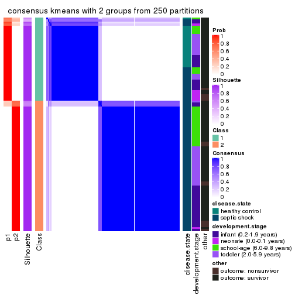</p>

</div>
<div id='tab-MAD-kmeans-consensus-heatmap-2'>
<pre><code class="r">consensus_heatmap(res, k = 3)
</code></pre>

<p>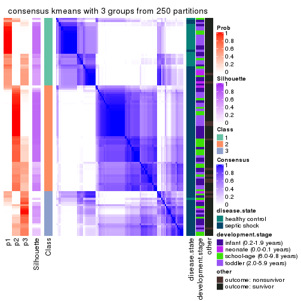</p>

</div>
<div id='tab-MAD-kmeans-consensus-heatmap-3'>
<pre><code class="r">consensus_heatmap(res, k = 4)
</code></pre>

<p>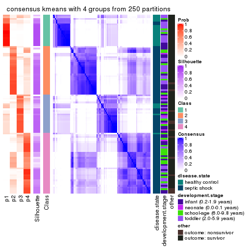</p>

</div>
<div id='tab-MAD-kmeans-consensus-heatmap-4'>
<pre><code class="r">consensus_heatmap(res, k = 5)
</code></pre>

<p>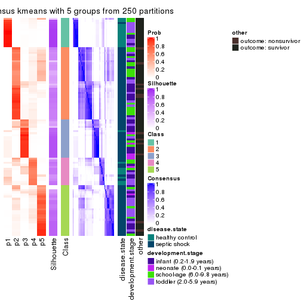</p>

</div>
<div id='tab-MAD-kmeans-consensus-heatmap-5'>
<pre><code class="r">consensus_heatmap(res, k = 6)
</code></pre>

<p>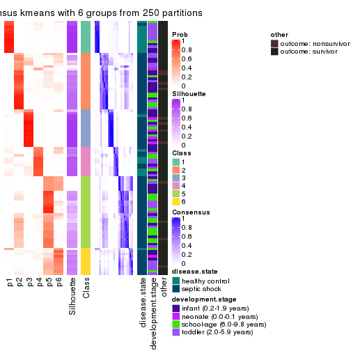</p>

</div>
</div>

Heatmaps for the membership of samples in all partitions to see how consistent they are:


<script>
$( function() {
	$( '#tabs-MAD-kmeans-membership-heatmap' ).tabs();
} );
</script>
<div id='tabs-MAD-kmeans-membership-heatmap'>
<ul>
<li><a href='#tab-MAD-kmeans-membership-heatmap-1'>k = 2</a></li>
<li><a href='#tab-MAD-kmeans-membership-heatmap-2'>k = 3</a></li>
<li><a href='#tab-MAD-kmeans-membership-heatmap-3'>k = 4</a></li>
<li><a href='#tab-MAD-kmeans-membership-heatmap-4'>k = 5</a></li>
<li><a href='#tab-MAD-kmeans-membership-heatmap-5'>k = 6</a></li>
</ul>
<div id='tab-MAD-kmeans-membership-heatmap-1'>
<pre><code class="r">membership_heatmap(res, k = 2)
</code></pre>

<p>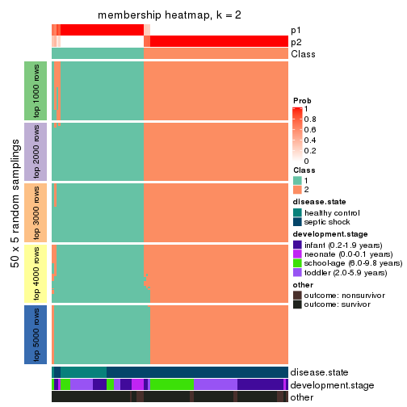</p>

</div>
<div id='tab-MAD-kmeans-membership-heatmap-2'>
<pre><code class="r">membership_heatmap(res, k = 3)
</code></pre>

<p>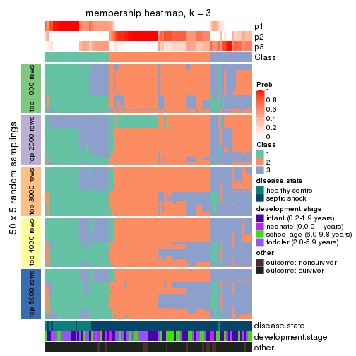</p>

</div>
<div id='tab-MAD-kmeans-membership-heatmap-3'>
<pre><code class="r">membership_heatmap(res, k = 4)
</code></pre>

<p>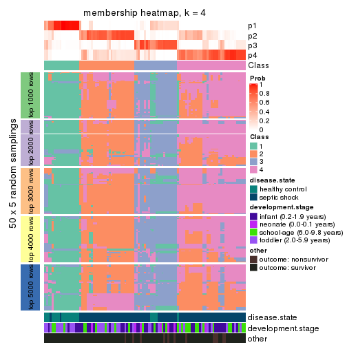</p>

</div>
<div id='tab-MAD-kmeans-membership-heatmap-4'>
<pre><code class="r">membership_heatmap(res, k = 5)
</code></pre>

<p>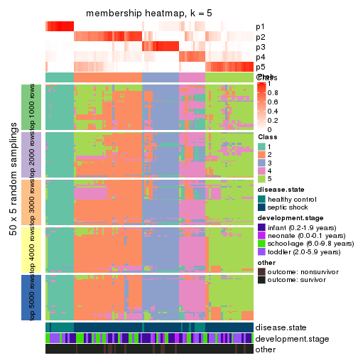</p>

</div>
<div id='tab-MAD-kmeans-membership-heatmap-5'>
<pre><code class="r">membership_heatmap(res, k = 6)
</code></pre>

<p>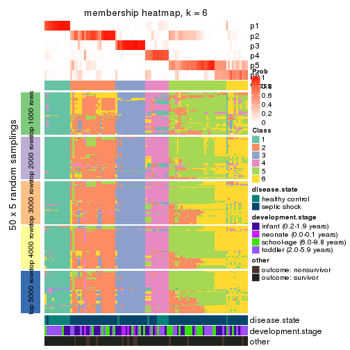</p>

</div>
</div>

As soon as we have had the classes for columns, we can look for signatures
which are significantly different between classes which can be candidate marks
for certain classes. Following are the heatmaps for signatures.


Signature heatmaps where rows are scaled:


<script>
$( function() {
	$( '#tabs-MAD-kmeans-get-signatures' ).tabs();
} );
</script>
<div id='tabs-MAD-kmeans-get-signatures'>
<ul>
<li><a href='#tab-MAD-kmeans-get-signatures-1'>k = 2</a></li>
<li><a href='#tab-MAD-kmeans-get-signatures-2'>k = 3</a></li>
<li><a href='#tab-MAD-kmeans-get-signatures-3'>k = 4</a></li>
<li><a href='#tab-MAD-kmeans-get-signatures-4'>k = 5</a></li>
<li><a href='#tab-MAD-kmeans-get-signatures-5'>k = 6</a></li>
</ul>
<div id='tab-MAD-kmeans-get-signatures-1'>
<pre><code class="r">get_signatures(res, k = 2)
</code></pre>

<p>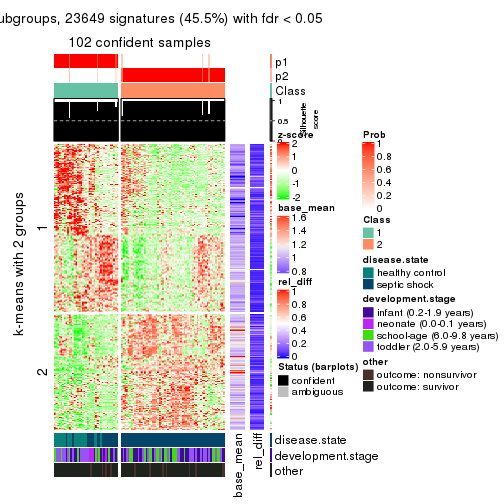</p>

</div>
<div id='tab-MAD-kmeans-get-signatures-2'>
<pre><code class="r">get_signatures(res, k = 3)
</code></pre>

<p>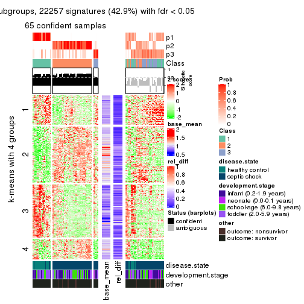</p>

</div>
<div id='tab-MAD-kmeans-get-signatures-3'>
<pre><code class="r">get_signatures(res, k = 4)
</code></pre>

<p>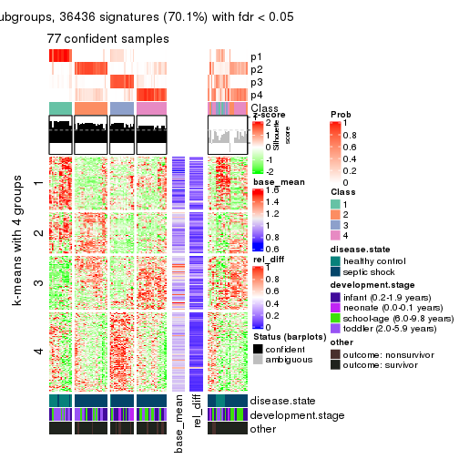</p>

</div>
<div id='tab-MAD-kmeans-get-signatures-4'>
<pre><code class="r">get_signatures(res, k = 5)
</code></pre>

<p>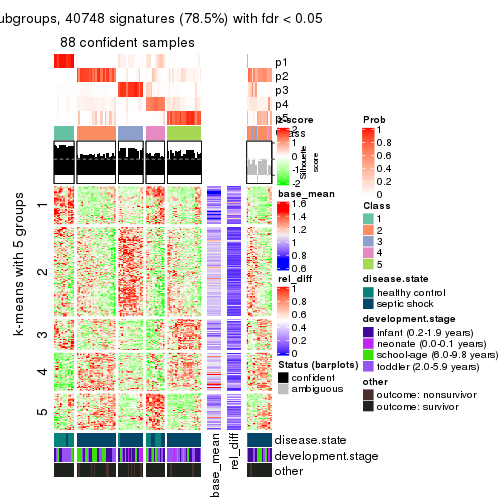</p>

</div>
<div id='tab-MAD-kmeans-get-signatures-5'>
<pre><code class="r">get_signatures(res, k = 6)
</code></pre>

<p>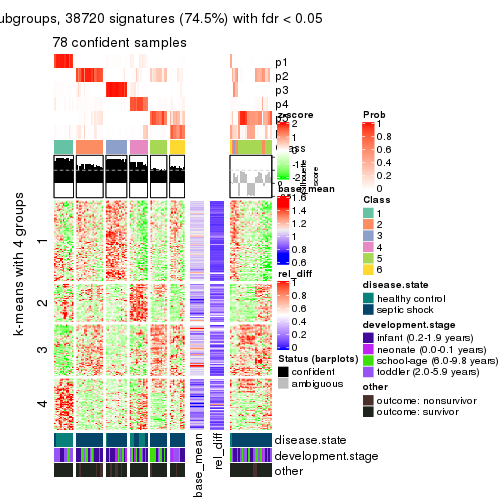</p>

</div>
</div>


Signature heatmaps where rows are not scaled:


<script>
$( function() {
	$( '#tabs-MAD-kmeans-get-signatures-no-scale' ).tabs();
} );
</script>
<div id='tabs-MAD-kmeans-get-signatures-no-scale'>
<ul>
<li><a href='#tab-MAD-kmeans-get-signatures-no-scale-1'>k = 2</a></li>
<li><a href='#tab-MAD-kmeans-get-signatures-no-scale-2'>k = 3</a></li>
<li><a href='#tab-MAD-kmeans-get-signatures-no-scale-3'>k = 4</a></li>
<li><a href='#tab-MAD-kmeans-get-signatures-no-scale-4'>k = 5</a></li>
<li><a href='#tab-MAD-kmeans-get-signatures-no-scale-5'>k = 6</a></li>
</ul>
<div id='tab-MAD-kmeans-get-signatures-no-scale-1'>
<pre><code class="r">get_signatures(res, k = 2, scale_rows = FALSE)
</code></pre>

<p>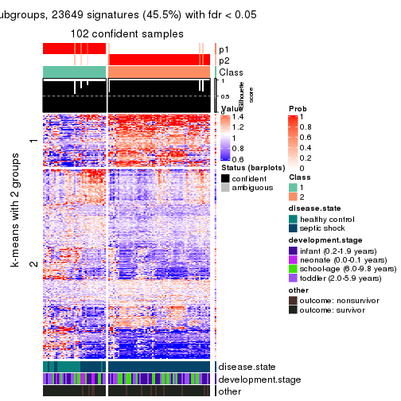</p>

</div>
<div id='tab-MAD-kmeans-get-signatures-no-scale-2'>
<pre><code class="r">get_signatures(res, k = 3, scale_rows = FALSE)
</code></pre>

<p>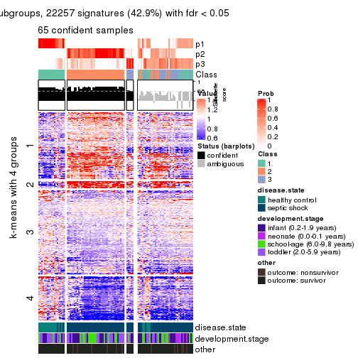</p>

</div>
<div id='tab-MAD-kmeans-get-signatures-no-scale-3'>
<pre><code class="r">get_signatures(res, k = 4, scale_rows = FALSE)
</code></pre>

<p>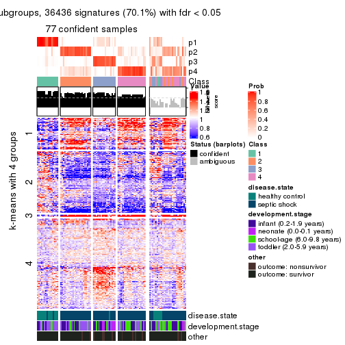</p>

</div>
<div id='tab-MAD-kmeans-get-signatures-no-scale-4'>
<pre><code class="r">get_signatures(res, k = 5, scale_rows = FALSE)
</code></pre>

<p>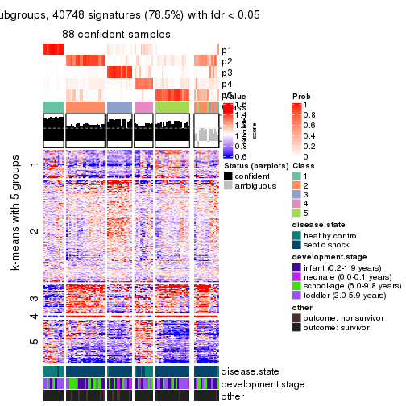</p>

</div>
<div id='tab-MAD-kmeans-get-signatures-no-scale-5'>
<pre><code class="r">get_signatures(res, k = 6, scale_rows = FALSE)
</code></pre>

<p>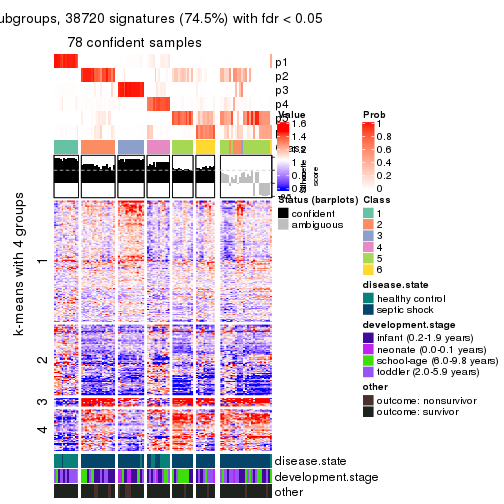</p>

</div>
</div>


Compare the overlap of signatures from different k:

```r
compare_signatures(res)
```

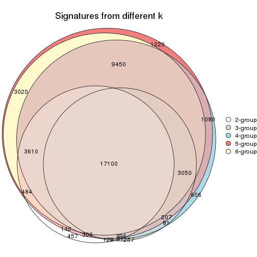

`get_signature()` returns a data frame invisibly. TO get the list of signatures, the function
call should be assigned to a variable explicitly. In following code, if `plot` argument is set
to `FALSE`, no heatmap is plotted while only the differential analysis is performed.

```r
# code only for demonstration
tb = get_signature(res, k = ..., plot = FALSE)
```

An example of the output of `tb` is:

```
#>   which_row         fdr    mean_1    mean_2 scaled_mean_1 scaled_mean_2 km
#> 1        38 0.042760348  8.373488  9.131774    -0.5533452     0.5164555  1
#> 2        40 0.018707592  7.106213  8.469186    -0.6173731     0.5762149  1
#> 3        55 0.019134737 10.221463 11.207825    -0.6159697     0.5749050  1
#> 4        59 0.006059896  5.921854  7.869574    -0.6899429     0.6439467  1
#> 5        60 0.018055526  8.928898 10.211722    -0.6204761     0.5791110  1
#> 6        98 0.009384629 15.714769 14.887706     0.6635654    -0.6193277  2
...
```

The columns in `tb` are:

1. `which_row`: row indices corresponding to the input matrix.
2. `fdr`: FDR for the differential test. 
3. `mean_x`: The mean value in group x.
4. `scaled_mean_x`: The mean value in group x after rows are scaled.
5. `km`: Row groups if k-means clustering is applied to rows.


UMAP plot which shows how samples are separated.


<script>
$( function() {
	$( '#tabs-MAD-kmeans-dimension-reduction' ).tabs();
} );
</script>
<div id='tabs-MAD-kmeans-dimension-reduction'>
<ul>
<li><a href='#tab-MAD-kmeans-dimension-reduction-1'>k = 2</a></li>
<li><a href='#tab-MAD-kmeans-dimension-reduction-2'>k = 3</a></li>
<li><a href='#tab-MAD-kmeans-dimension-reduction-3'>k = 4</a></li>
<li><a href='#tab-MAD-kmeans-dimension-reduction-4'>k = 5</a></li>
<li><a href='#tab-MAD-kmeans-dimension-reduction-5'>k = 6</a></li>
</ul>
<div id='tab-MAD-kmeans-dimension-reduction-1'>
<pre><code class="r">dimension_reduction(res, k = 2, method = &quot;UMAP&quot;)
</code></pre>

<p>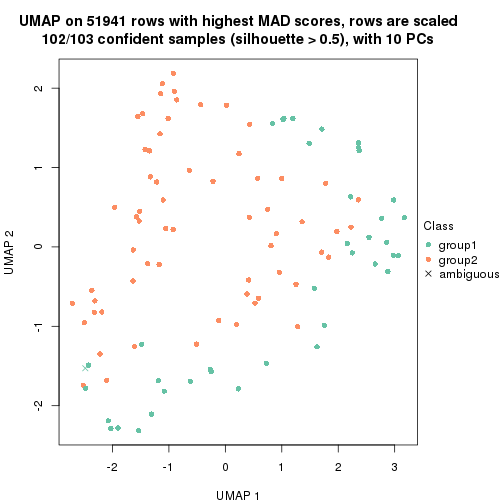</p>

</div>
<div id='tab-MAD-kmeans-dimension-reduction-2'>
<pre><code class="r">dimension_reduction(res, k = 3, method = &quot;UMAP&quot;)
</code></pre>

<p>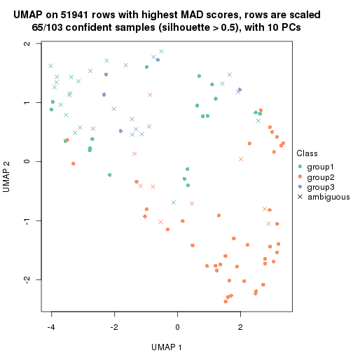</p>

</div>
<div id='tab-MAD-kmeans-dimension-reduction-3'>
<pre><code class="r">dimension_reduction(res, k = 4, method = &quot;UMAP&quot;)
</code></pre>

<p>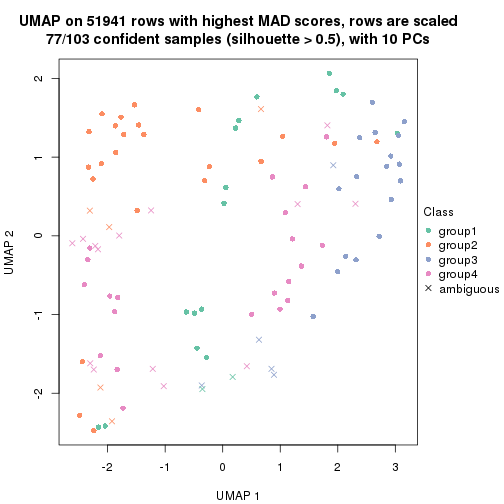</p>

</div>
<div id='tab-MAD-kmeans-dimension-reduction-4'>
<pre><code class="r">dimension_reduction(res, k = 5, method = &quot;UMAP&quot;)
</code></pre>

<p>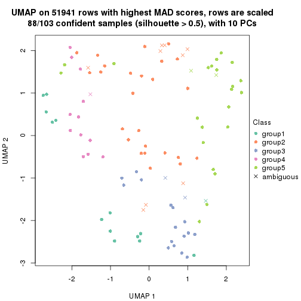</p>

</div>
<div id='tab-MAD-kmeans-dimension-reduction-5'>
<pre><code class="r">dimension_reduction(res, k = 6, method = &quot;UMAP&quot;)
</code></pre>

<p>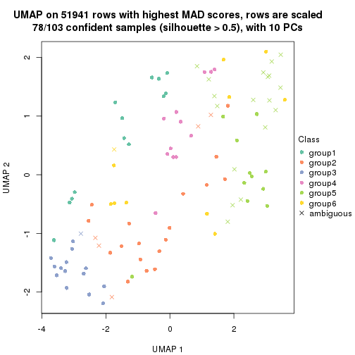</p>

</div>
</div>


Following heatmap shows how subgroups are split when increasing `k`:

```r
collect_classes(res)
```

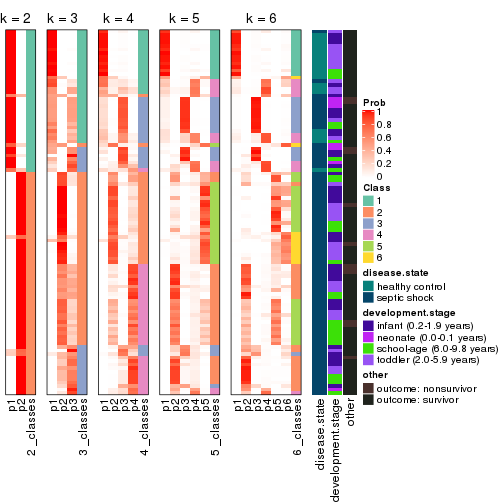


Test correlation between subgroups and known annotations. If the known
annotation is numeric, one-way ANOVA test is applied, and if the known
annotation is discrete, chi-squared contingency table test is applied.

```r
test_to_known_factors(res)
```

```
#>              n disease.state(p) development.stage(p) other(p) k
#> MAD:kmeans 102         3.30e-10              0.05082    0.956 2
#> MAD:kmeans  65         6.95e-12              0.02176    0.144 3
#> MAD:kmeans  77         6.35e-13              0.00277    0.163 4
#> MAD:kmeans  88         1.97e-12              0.01929    0.117 5
#> MAD:kmeans  78         3.38e-10              0.00873    0.135 6
```


If matrix rows can be associated to genes, consider to use `functional_enrichment(res,
...)` to perform function enrichment for the signature genes. See [this vignette](http://bioconductor.org/packages/devel/bioc/vignettes/cola/inst/doc/functional_enrichment.html) for more detailed explanations.


 

---------------------------------------------------


### MAD:skmeans**


The object with results only for a single top-value method and a single partition method 
can be extracted as:

```r
res = res_list["MAD", "skmeans"]
# you can also extract it by
# res = res_list["MAD:skmeans"]
```

A summary of `res` and all the functions that can be applied to it:

```r
res
```

```
#> A 'ConsensusPartition' object with k = 2, 3, 4, 5, 6.
#>   On a matrix with 51941 rows and 103 columns.
#>   Top rows (1000, 2000, 3000, 4000, 5000) are extracted by 'MAD' method.
#>   Subgroups are detected by 'skmeans' method.
#>   Performed in total 1250 partitions by row resampling.
#>   Best k for subgroups seems to be 2.
#> 
#> Following methods can be applied to this 'ConsensusPartition' object:
#>  [1] "cola_report"             "collect_classes"         "collect_plots"          
#>  [4] "collect_stats"           "colnames"                "compare_signatures"     
#>  [7] "consensus_heatmap"       "dimension_reduction"     "functional_enrichment"  
#> [10] "get_anno_col"            "get_anno"                "get_classes"            
#> [13] "get_consensus"           "get_matrix"              "get_membership"         
#> [16] "get_param"               "get_signatures"          "get_stats"              
#> [19] "is_best_k"               "is_stable_k"             "membership_heatmap"     
#> [22] "ncol"                    "nrow"                    "plot_ecdf"              
#> [25] "rownames"                "select_partition_number" "show"                   
#> [28] "suggest_best_k"          "test_to_known_factors"
```

`collect_plots()` function collects all the plots made from `res` for all `k` (number of partitions)
into one single page to provide an easy and fast comparison between different `k`.

```r
collect_plots(res)
```

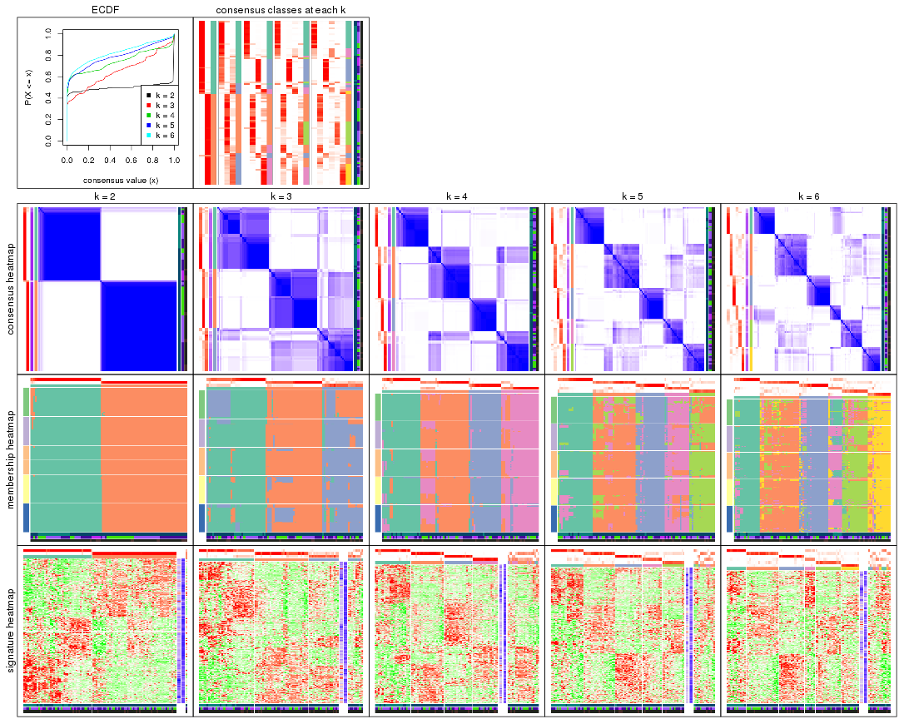

The plots are:

- The first row: a plot of the ECDF (empirical cumulative distribution
  function) curves of the consensus matrix for each `k` and the heatmap of
  predicted classes for each `k`.
- The second row: heatmaps of the consensus matrix for each `k`.
- The third row: heatmaps of the membership matrix for each `k`.
- The fouth row: heatmaps of the signatures for each `k`.

All the plots in panels can be made by individual functions and they are
plotted later in this section.

`select_partition_number()` produces several plots showing different
statistics for choosing "optimized" `k`. There are following statistics:

- ECDF curves of the consensus matrix for each `k`;
- 1-PAC. [The PAC
  score](https://en.wikipedia.org/wiki/Consensus_clustering#Over-interpretation_potential_of_consensus_clustering)
  measures the proportion of the ambiguous subgrouping.
- Mean silhouette score.
- Concordance. The mean probability of fiting the consensus class ids in all
  partitions.
- Area increased. Denote $A_k$ as the area under the ECDF curve for current
  `k`, the area increased is defined as $A_k - A_{k-1}$.
- Rand index. The percent of pairs of samples that are both in a same cluster
  or both are not in a same cluster in the partition of k and k-1.
- Jaccard index. The ratio of pairs of samples are both in a same cluster in
  the partition of k and k-1 and the pairs of samples are both in a same
  cluster in the partition k or k-1.

The detailed explanations of these statistics can be found in [the _cola_
vignette](http://bioconductor.org/packages/devel/bioc/vignettes/cola/inst/doc/cola.html#toc_13).

Generally speaking, lower PAC score, higher mean silhouette score or higher
concordance corresponds to better partition. Rand index and Jaccard index
measure how similar the current partition is compared to partition with `k-1`.
If they are too similar, we won't accept `k` is better than `k-1`.

```r
select_partition_number(res)
```

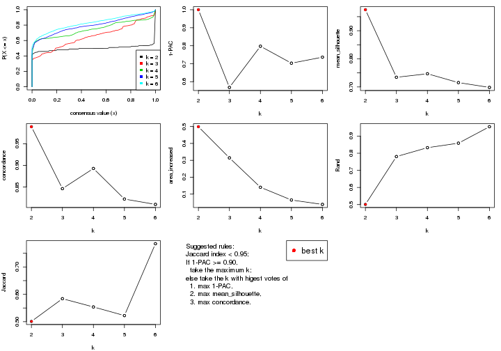

The numeric values for all these statistics can be obtained by `get_stats()`.

```r
get_stats(res)
```

```
#>   k 1-PAC mean_silhouette concordance area_increased  Rand Jaccard
#> 2 2 1.000           0.975       0.989          0.499 0.501   0.501
#> 3 3 0.569           0.734       0.846          0.315 0.781   0.584
#> 4 4 0.797           0.747       0.893          0.140 0.832   0.554
#> 5 5 0.703           0.715       0.822          0.065 0.859   0.522
#> 6 6 0.737           0.698       0.810          0.039 0.955   0.785
```

`suggest_best_k()` suggests the best $k$ based on these statistics. The rules are as follows:

- All $k$ with Jaccard index larger than 0.95 are removed because increasing
  $k$ does not provide enough extra information. If all $k$ are removed, it is
  marked as no subgroup is detected.
- For all $k$ with 1-PAC score larger than 0.9, the maximal $k$ is taken as
  the best $k$, and other $k$ are marked as optional $k$.
- If it does not fit the second rule. The $k$ with the maximal vote of the
  highest 1-PAC score, highest mean silhouette, and highest concordance is
  taken as the best $k$.

```r
suggest_best_k(res)
```

```
#> [1] 2
```


Following shows the table of the partitions (You need to click the **show/hide
code output** link to see it). The membership matrix (columns with name `p*`)
is inferred by
[`clue::cl_consensus()`](https://www.rdocumentation.org/link/cl_consensus?package=clue)
function with the `SE` method. Basically the value in the membership matrix
represents the probability to belong to a certain group. The finall class
label for an item is determined with the group with highest probability it
belongs to.

In `get_classes()` function, the entropy is calculated from the membership
matrix and the silhouette score is calculated from the consensus matrix.


<script>
$( function() {
	$( '#tabs-MAD-skmeans-get-classes' ).tabs();
} );
</script>
<div id='tabs-MAD-skmeans-get-classes'>
<ul>
<li><a href='#tab-MAD-skmeans-get-classes-1'>k = 2</a></li>
<li><a href='#tab-MAD-skmeans-get-classes-2'>k = 3</a></li>
<li><a href='#tab-MAD-skmeans-get-classes-3'>k = 4</a></li>
<li><a href='#tab-MAD-skmeans-get-classes-4'>k = 5</a></li>
<li><a href='#tab-MAD-skmeans-get-classes-5'>k = 6</a></li>
</ul>

<div id='tab-MAD-skmeans-get-classes-1'>
<p><a id='tab-MAD-skmeans-get-classes-1-a' style='color:#0366d6' href='#'>show/hide code output</a></p>
<pre><code class="r">cbind(get_classes(res, k = 2), get_membership(res, k = 2))
</code></pre>

<pre><code>#&gt;           class entropy silhouette    p1    p2
#&gt; GSM647569     1  0.0000      0.985 1.000 0.000
#&gt; GSM647574     1  0.0000      0.985 1.000 0.000
#&gt; GSM647577     1  0.0000      0.985 1.000 0.000
#&gt; GSM647547     1  0.0000      0.985 1.000 0.000
#&gt; GSM647552     1  0.0000      0.985 1.000 0.000
#&gt; GSM647553     1  0.0000      0.985 1.000 0.000
#&gt; GSM647565     1  0.0672      0.978 0.992 0.008
#&gt; GSM647545     2  0.0000      0.992 0.000 1.000
#&gt; GSM647549     2  0.0000      0.992 0.000 1.000
#&gt; GSM647550     2  0.0000      0.992 0.000 1.000
#&gt; GSM647560     2  0.0000      0.992 0.000 1.000
#&gt; GSM647617     1  0.0000      0.985 1.000 0.000
#&gt; GSM647528     2  0.0000      0.992 0.000 1.000
#&gt; GSM647529     1  0.0000      0.985 1.000 0.000
#&gt; GSM647531     2  0.0000      0.992 0.000 1.000
#&gt; GSM647540     2  0.0000      0.992 0.000 1.000
#&gt; GSM647541     2  0.0000      0.992 0.000 1.000
#&gt; GSM647546     1  0.0000      0.985 1.000 0.000
#&gt; GSM647557     2  0.0000      0.992 0.000 1.000
#&gt; GSM647561     2  0.0000      0.992 0.000 1.000
#&gt; GSM647567     1  0.2603      0.945 0.956 0.044
#&gt; GSM647568     2  0.0000      0.992 0.000 1.000
#&gt; GSM647570     2  0.0000      0.992 0.000 1.000
#&gt; GSM647573     1  0.0000      0.985 1.000 0.000
#&gt; GSM647576     2  0.9552      0.375 0.376 0.624
#&gt; GSM647579     1  0.7219      0.756 0.800 0.200
#&gt; GSM647580     1  0.0000      0.985 1.000 0.000
#&gt; GSM647583     1  0.0000      0.985 1.000 0.000
#&gt; GSM647592     2  0.0000      0.992 0.000 1.000
#&gt; GSM647593     2  0.0000      0.992 0.000 1.000
#&gt; GSM647595     2  0.0000      0.992 0.000 1.000
#&gt; GSM647597     2  0.0672      0.985 0.008 0.992
#&gt; GSM647598     2  0.0000      0.992 0.000 1.000
#&gt; GSM647613     2  0.0000      0.992 0.000 1.000
#&gt; GSM647615     1  0.8763      0.591 0.704 0.296
#&gt; GSM647616     1  0.0000      0.985 1.000 0.000
#&gt; GSM647619     2  0.0000      0.992 0.000 1.000
#&gt; GSM647582     2  0.0000      0.992 0.000 1.000
#&gt; GSM647591     2  0.0000      0.992 0.000 1.000
#&gt; GSM647527     2  0.0000      0.992 0.000 1.000
#&gt; GSM647530     2  0.0000      0.992 0.000 1.000
#&gt; GSM647532     1  0.0000      0.985 1.000 0.000
#&gt; GSM647544     2  0.0000      0.992 0.000 1.000
#&gt; GSM647551     2  0.0000      0.992 0.000 1.000
#&gt; GSM647556     1  0.0000      0.985 1.000 0.000
#&gt; GSM647558     2  0.0000      0.992 0.000 1.000
#&gt; GSM647572     1  0.0000      0.985 1.000 0.000
#&gt; GSM647578     2  0.1633      0.969 0.024 0.976
#&gt; GSM647581     2  0.0000      0.992 0.000 1.000
#&gt; GSM647594     2  0.0000      0.992 0.000 1.000
#&gt; GSM647599     1  0.0000      0.985 1.000 0.000
#&gt; GSM647600     2  0.0000      0.992 0.000 1.000
#&gt; GSM647601     2  0.0000      0.992 0.000 1.000
#&gt; GSM647603     2  0.0000      0.992 0.000 1.000
#&gt; GSM647610     2  0.0938      0.981 0.012 0.988
#&gt; GSM647611     2  0.0000      0.992 0.000 1.000
#&gt; GSM647612     2  0.0000      0.992 0.000 1.000
#&gt; GSM647614     2  0.0000      0.992 0.000 1.000
#&gt; GSM647618     2  0.0000      0.992 0.000 1.000
#&gt; GSM647629     2  0.0000      0.992 0.000 1.000
#&gt; GSM647535     2  0.0000      0.992 0.000 1.000
#&gt; GSM647563     2  0.0000      0.992 0.000 1.000
#&gt; GSM647542     2  0.0000      0.992 0.000 1.000
#&gt; GSM647543     2  0.0000      0.992 0.000 1.000
#&gt; GSM647548     1  0.5629      0.849 0.868 0.132
#&gt; GSM647554     2  0.0000      0.992 0.000 1.000
#&gt; GSM647555     2  0.0000      0.992 0.000 1.000
#&gt; GSM647559     2  0.0000      0.992 0.000 1.000
#&gt; GSM647562     2  0.0000      0.992 0.000 1.000
#&gt; GSM647564     1  0.0000      0.985 1.000 0.000
#&gt; GSM647571     2  0.0000      0.992 0.000 1.000
#&gt; GSM647584     2  0.0000      0.992 0.000 1.000
#&gt; GSM647585     1  0.0000      0.985 1.000 0.000
#&gt; GSM647586     2  0.0000      0.992 0.000 1.000
#&gt; GSM647587     2  0.0000      0.992 0.000 1.000
#&gt; GSM647588     2  0.0000      0.992 0.000 1.000
#&gt; GSM647596     2  0.0000      0.992 0.000 1.000
#&gt; GSM647602     1  0.0000      0.985 1.000 0.000
#&gt; GSM647609     2  0.0000      0.992 0.000 1.000
#&gt; GSM647620     2  0.0000      0.992 0.000 1.000
#&gt; GSM647627     2  0.0000      0.992 0.000 1.000
#&gt; GSM647628     2  0.0000      0.992 0.000 1.000
#&gt; GSM647533     1  0.0000      0.985 1.000 0.000
#&gt; GSM647536     1  0.0000      0.985 1.000 0.000
#&gt; GSM647537     1  0.0000      0.985 1.000 0.000
#&gt; GSM647606     1  0.0000      0.985 1.000 0.000
#&gt; GSM647621     1  0.0000      0.985 1.000 0.000
#&gt; GSM647626     1  0.0000      0.985 1.000 0.000
#&gt; GSM647538     1  0.0000      0.985 1.000 0.000
#&gt; GSM647575     1  0.0000      0.985 1.000 0.000
#&gt; GSM647590     1  0.0000      0.985 1.000 0.000
#&gt; GSM647605     1  0.0000      0.985 1.000 0.000
#&gt; GSM647607     1  0.0000      0.985 1.000 0.000
#&gt; GSM647608     1  0.0000      0.985 1.000 0.000
#&gt; GSM647622     1  0.0000      0.985 1.000 0.000
#&gt; GSM647623     1  0.0000      0.985 1.000 0.000
#&gt; GSM647624     1  0.0000      0.985 1.000 0.000
#&gt; GSM647625     1  0.0000      0.985 1.000 0.000
#&gt; GSM647534     1  0.0000      0.985 1.000 0.000
#&gt; GSM647539     1  0.0000      0.985 1.000 0.000
#&gt; GSM647566     1  0.0000      0.985 1.000 0.000
#&gt; GSM647589     1  0.0000      0.985 1.000 0.000
#&gt; GSM647604     1  0.0000      0.985 1.000 0.000
</code></pre>

<script>
$('#tab-MAD-skmeans-get-classes-1-a').parent().next().next().hide();
$('#tab-MAD-skmeans-get-classes-1-a').click(function(){
  $('#tab-MAD-skmeans-get-classes-1-a').parent().next().next().toggle();
  return(false);
});
</script>
</div>

<div id='tab-MAD-skmeans-get-classes-2'>
<p><a id='tab-MAD-skmeans-get-classes-2-a' style='color:#0366d6' href='#'>show/hide code output</a></p>
<pre><code class="r">cbind(get_classes(res, k = 3), get_membership(res, k = 3))
</code></pre>

<pre><code>#&gt;           class entropy silhouette    p1    p2    p3
#&gt; GSM647569     1  0.5254     0.7784 0.736 0.000 0.264
#&gt; GSM647574     1  0.5291     0.7763 0.732 0.000 0.268
#&gt; GSM647577     1  0.5254     0.7784 0.736 0.000 0.264
#&gt; GSM647547     3  0.6192    -0.2010 0.420 0.000 0.580
#&gt; GSM647552     1  0.4062     0.7273 0.836 0.164 0.000
#&gt; GSM647553     1  0.4796     0.7991 0.780 0.000 0.220
#&gt; GSM647565     3  0.0892     0.6600 0.020 0.000 0.980
#&gt; GSM647545     3  0.5859     0.6053 0.000 0.344 0.656
#&gt; GSM647549     3  0.5905     0.5922 0.000 0.352 0.648
#&gt; GSM647550     3  0.5291     0.7002 0.000 0.268 0.732
#&gt; GSM647560     3  0.5285     0.7222 0.004 0.244 0.752
#&gt; GSM647617     1  0.5254     0.7784 0.736 0.000 0.264
#&gt; GSM647528     2  0.4062     0.7997 0.000 0.836 0.164
#&gt; GSM647529     1  0.5926     0.4484 0.644 0.356 0.000
#&gt; GSM647531     2  0.3340     0.8234 0.000 0.880 0.120
#&gt; GSM647540     3  0.5404     0.4935 0.004 0.256 0.740
#&gt; GSM647541     3  0.6260     0.3579 0.000 0.448 0.552
#&gt; GSM647546     3  0.4062     0.4460 0.164 0.000 0.836
#&gt; GSM647557     2  0.0000     0.8634 0.000 1.000 0.000
#&gt; GSM647561     2  0.4062     0.7997 0.000 0.836 0.164
#&gt; GSM647567     1  0.8717     0.6220 0.592 0.220 0.188
#&gt; GSM647568     3  0.4399     0.7463 0.000 0.188 0.812
#&gt; GSM647570     3  0.5254     0.7037 0.000 0.264 0.736
#&gt; GSM647573     1  0.6305     0.0558 0.516 0.000 0.484
#&gt; GSM647576     3  0.3116     0.5376 0.108 0.000 0.892
#&gt; GSM647579     1  0.7699     0.5306 0.532 0.048 0.420
#&gt; GSM647580     1  0.5254     0.7784 0.736 0.000 0.264
#&gt; GSM647583     1  0.5254     0.7784 0.736 0.000 0.264
#&gt; GSM647592     2  0.0000     0.8634 0.000 1.000 0.000
#&gt; GSM647593     2  0.0000     0.8634 0.000 1.000 0.000
#&gt; GSM647595     2  0.0000     0.8634 0.000 1.000 0.000
#&gt; GSM647597     2  0.5216     0.5105 0.260 0.740 0.000
#&gt; GSM647598     2  0.1643     0.8518 0.000 0.956 0.044
#&gt; GSM647613     2  0.4062     0.7997 0.000 0.836 0.164
#&gt; GSM647615     3  0.6696     0.7197 0.076 0.188 0.736
#&gt; GSM647616     1  0.5254     0.7784 0.736 0.000 0.264
#&gt; GSM647619     2  0.0000     0.8634 0.000 1.000 0.000
#&gt; GSM647582     2  0.0000     0.8634 0.000 1.000 0.000
#&gt; GSM647591     2  0.0000     0.8634 0.000 1.000 0.000
#&gt; GSM647527     2  0.4062     0.7997 0.000 0.836 0.164
#&gt; GSM647530     2  0.5431     0.5996 0.000 0.716 0.284
#&gt; GSM647532     1  0.0237     0.8496 0.996 0.000 0.004
#&gt; GSM647544     2  0.5431     0.5996 0.000 0.716 0.284
#&gt; GSM647551     2  0.0000     0.8634 0.000 1.000 0.000
#&gt; GSM647556     1  0.4399     0.8091 0.812 0.000 0.188
#&gt; GSM647558     3  0.5254     0.7037 0.000 0.264 0.736
#&gt; GSM647572     3  0.4062     0.4460 0.164 0.000 0.836
#&gt; GSM647578     3  0.5810     0.4032 0.000 0.336 0.664
#&gt; GSM647581     3  0.5926     0.5850 0.000 0.356 0.644
#&gt; GSM647594     2  0.0000     0.8634 0.000 1.000 0.000
#&gt; GSM647599     1  0.0000     0.8511 1.000 0.000 0.000
#&gt; GSM647600     2  0.0237     0.8604 0.004 0.996 0.000
#&gt; GSM647601     2  0.0000     0.8634 0.000 1.000 0.000
#&gt; GSM647603     2  0.3983     0.6988 0.004 0.852 0.144
#&gt; GSM647610     2  0.5243     0.6546 0.100 0.828 0.072
#&gt; GSM647611     2  0.0000     0.8634 0.000 1.000 0.000
#&gt; GSM647612     3  0.4399     0.7463 0.000 0.188 0.812
#&gt; GSM647614     3  0.4399     0.7463 0.000 0.188 0.812
#&gt; GSM647618     2  0.0000     0.8634 0.000 1.000 0.000
#&gt; GSM647629     2  0.0000     0.8634 0.000 1.000 0.000
#&gt; GSM647535     2  0.3941     0.8056 0.000 0.844 0.156
#&gt; GSM647563     3  0.6095     0.5105 0.000 0.392 0.608
#&gt; GSM647542     3  0.4399     0.7463 0.000 0.188 0.812
#&gt; GSM647543     3  0.4399     0.7463 0.000 0.188 0.812
#&gt; GSM647548     3  0.5235     0.7373 0.036 0.152 0.812
#&gt; GSM647554     2  0.0000     0.8634 0.000 1.000 0.000
#&gt; GSM647555     3  0.5016     0.7216 0.000 0.240 0.760
#&gt; GSM647559     2  0.4062     0.7997 0.000 0.836 0.164
#&gt; GSM647562     2  0.5785     0.4789 0.000 0.668 0.332
#&gt; GSM647564     1  0.5254     0.7784 0.736 0.000 0.264
#&gt; GSM647571     3  0.4399     0.7463 0.000 0.188 0.812
#&gt; GSM647584     2  0.0000     0.8634 0.000 1.000 0.000
#&gt; GSM647585     1  0.4399     0.8091 0.812 0.000 0.188
#&gt; GSM647586     2  0.3941     0.8056 0.000 0.844 0.156
#&gt; GSM647587     2  0.4062     0.7997 0.000 0.836 0.164
#&gt; GSM647588     2  0.4002     0.8030 0.000 0.840 0.160
#&gt; GSM647596     2  0.4062     0.7997 0.000 0.836 0.164
#&gt; GSM647602     1  0.5254     0.7784 0.736 0.000 0.264
#&gt; GSM647609     2  0.0000     0.8634 0.000 1.000 0.000
#&gt; GSM647620     2  0.0000     0.8634 0.000 1.000 0.000
#&gt; GSM647627     2  0.3941     0.8056 0.000 0.844 0.156
#&gt; GSM647628     3  0.5216     0.7073 0.000 0.260 0.740
#&gt; GSM647533     1  0.0000     0.8511 1.000 0.000 0.000
#&gt; GSM647536     1  0.0000     0.8511 1.000 0.000 0.000
#&gt; GSM647537     1  0.0000     0.8511 1.000 0.000 0.000
#&gt; GSM647606     1  0.0000     0.8511 1.000 0.000 0.000
#&gt; GSM647621     1  0.1163     0.8461 0.972 0.000 0.028
#&gt; GSM647626     1  0.4399     0.8091 0.812 0.000 0.188
#&gt; GSM647538     1  0.0000     0.8511 1.000 0.000 0.000
#&gt; GSM647575     1  0.2261     0.8126 0.932 0.000 0.068
#&gt; GSM647590     1  0.0000     0.8511 1.000 0.000 0.000
#&gt; GSM647605     1  0.0000     0.8511 1.000 0.000 0.000
#&gt; GSM647607     1  0.2261     0.8126 0.932 0.000 0.068
#&gt; GSM647608     1  0.0000     0.8511 1.000 0.000 0.000
#&gt; GSM647622     1  0.0000     0.8511 1.000 0.000 0.000
#&gt; GSM647623     1  0.0000     0.8511 1.000 0.000 0.000
#&gt; GSM647624     1  0.0000     0.8511 1.000 0.000 0.000
#&gt; GSM647625     1  0.0000     0.8511 1.000 0.000 0.000
#&gt; GSM647534     1  0.4062     0.7273 0.836 0.164 0.000
#&gt; GSM647539     3  0.6267     0.2113 0.452 0.000 0.548
#&gt; GSM647566     1  0.0000     0.8511 1.000 0.000 0.000
#&gt; GSM647589     1  0.2959     0.8064 0.900 0.000 0.100
#&gt; GSM647604     1  0.0000     0.8511 1.000 0.000 0.000
</code></pre>

<script>
$('#tab-MAD-skmeans-get-classes-2-a').parent().next().next().hide();
$('#tab-MAD-skmeans-get-classes-2-a').click(function(){
  $('#tab-MAD-skmeans-get-classes-2-a').parent().next().next().toggle();
  return(false);
});
</script>
</div>

<div id='tab-MAD-skmeans-get-classes-3'>
<p><a id='tab-MAD-skmeans-get-classes-3-a' style='color:#0366d6' href='#'>show/hide code output</a></p>
<pre><code class="r">cbind(get_classes(res, k = 4), get_membership(res, k = 4))
</code></pre>

<pre><code>#&gt;           class entropy silhouette    p1    p2    p3    p4
#&gt; GSM647569     3  0.0469     0.9360 0.012 0.000 0.988 0.000
#&gt; GSM647574     3  0.0592     0.9303 0.016 0.000 0.984 0.000
#&gt; GSM647577     3  0.0336     0.9373 0.008 0.000 0.992 0.000
#&gt; GSM647547     3  0.2489     0.8673 0.020 0.000 0.912 0.068
#&gt; GSM647552     1  0.4990     0.5109 0.640 0.352 0.008 0.000
#&gt; GSM647553     3  0.0336     0.9373 0.008 0.000 0.992 0.000
#&gt; GSM647565     4  0.1059     0.8246 0.012 0.000 0.016 0.972
#&gt; GSM647545     4  0.0188     0.8290 0.000 0.004 0.000 0.996
#&gt; GSM647549     4  0.0336     0.8276 0.000 0.008 0.000 0.992
#&gt; GSM647550     4  0.0000     0.8294 0.000 0.000 0.000 1.000
#&gt; GSM647560     4  0.4916     0.1835 0.000 0.000 0.424 0.576
#&gt; GSM647617     3  0.0336     0.9373 0.008 0.000 0.992 0.000
#&gt; GSM647528     2  0.4898     0.3753 0.000 0.584 0.000 0.416
#&gt; GSM647529     1  0.0188     0.9221 0.996 0.004 0.000 0.000
#&gt; GSM647531     2  0.4543     0.5353 0.000 0.676 0.000 0.324
#&gt; GSM647540     3  0.1284     0.9212 0.000 0.012 0.964 0.024
#&gt; GSM647541     4  0.4522     0.4145 0.000 0.320 0.000 0.680
#&gt; GSM647546     3  0.0336     0.9299 0.000 0.000 0.992 0.008
#&gt; GSM647557     2  0.1389     0.7890 0.000 0.952 0.000 0.048
#&gt; GSM647561     2  0.4967     0.2818 0.000 0.548 0.000 0.452
#&gt; GSM647567     3  0.7542     0.3090 0.212 0.312 0.476 0.000
#&gt; GSM647568     4  0.0469     0.8301 0.000 0.000 0.012 0.988
#&gt; GSM647570     4  0.0188     0.8302 0.000 0.000 0.004 0.996
#&gt; GSM647573     1  0.5599     0.4651 0.616 0.000 0.032 0.352
#&gt; GSM647576     3  0.4605     0.4880 0.000 0.000 0.664 0.336
#&gt; GSM647579     3  0.0469     0.9322 0.000 0.012 0.988 0.000
#&gt; GSM647580     3  0.0336     0.9373 0.008 0.000 0.992 0.000
#&gt; GSM647583     3  0.0336     0.9373 0.008 0.000 0.992 0.000
#&gt; GSM647592     2  0.0000     0.8109 0.000 1.000 0.000 0.000
#&gt; GSM647593     2  0.0000     0.8109 0.000 1.000 0.000 0.000
#&gt; GSM647595     2  0.0000     0.8109 0.000 1.000 0.000 0.000
#&gt; GSM647597     2  0.4746     0.2722 0.368 0.632 0.000 0.000
#&gt; GSM647598     2  0.0707     0.8080 0.000 0.980 0.000 0.020
#&gt; GSM647613     4  0.4989    -0.0834 0.000 0.472 0.000 0.528
#&gt; GSM647615     4  0.4776     0.2697 0.000 0.000 0.376 0.624
#&gt; GSM647616     3  0.0336     0.9373 0.008 0.000 0.992 0.000
#&gt; GSM647619     2  0.0000     0.8109 0.000 1.000 0.000 0.000
#&gt; GSM647582     2  0.0000     0.8109 0.000 1.000 0.000 0.000
#&gt; GSM647591     2  0.0000     0.8109 0.000 1.000 0.000 0.000
#&gt; GSM647527     2  0.4898     0.3753 0.000 0.584 0.000 0.416
#&gt; GSM647530     4  0.4585     0.3860 0.000 0.332 0.000 0.668
#&gt; GSM647532     1  0.0000     0.9231 1.000 0.000 0.000 0.000
#&gt; GSM647544     4  0.4679     0.3329 0.000 0.352 0.000 0.648
#&gt; GSM647551     2  0.0000     0.8109 0.000 1.000 0.000 0.000
#&gt; GSM647556     3  0.0469     0.9360 0.012 0.000 0.988 0.000
#&gt; GSM647558     4  0.0000     0.8294 0.000 0.000 0.000 1.000
#&gt; GSM647572     3  0.0524     0.9288 0.004 0.000 0.988 0.008
#&gt; GSM647578     3  0.4008     0.7802 0.000 0.148 0.820 0.032
#&gt; GSM647581     4  0.0592     0.8232 0.000 0.016 0.000 0.984
#&gt; GSM647594     2  0.0469     0.8104 0.000 0.988 0.000 0.012
#&gt; GSM647599     1  0.0469     0.9248 0.988 0.000 0.012 0.000
#&gt; GSM647600     2  0.0336     0.8064 0.000 0.992 0.008 0.000
#&gt; GSM647601     2  0.0336     0.8109 0.000 0.992 0.000 0.008
#&gt; GSM647603     2  0.3946     0.6630 0.000 0.812 0.168 0.020
#&gt; GSM647610     2  0.0188     0.8103 0.000 0.996 0.000 0.004
#&gt; GSM647611     2  0.0469     0.8106 0.000 0.988 0.000 0.012
#&gt; GSM647612     4  0.0336     0.8306 0.000 0.000 0.008 0.992
#&gt; GSM647614     4  0.0469     0.8301 0.000 0.000 0.012 0.988
#&gt; GSM647618     2  0.0469     0.8104 0.000 0.988 0.000 0.012
#&gt; GSM647629     2  0.1211     0.7889 0.000 0.960 0.000 0.040
#&gt; GSM647535     2  0.4730     0.4690 0.000 0.636 0.000 0.364
#&gt; GSM647563     4  0.1118     0.8074 0.000 0.036 0.000 0.964
#&gt; GSM647542     4  0.0469     0.8301 0.000 0.000 0.012 0.988
#&gt; GSM647543     4  0.0469     0.8301 0.000 0.000 0.012 0.988
#&gt; GSM647548     4  0.0937     0.8259 0.012 0.000 0.012 0.976
#&gt; GSM647554     2  0.0000     0.8109 0.000 1.000 0.000 0.000
#&gt; GSM647555     4  0.0336     0.8306 0.000 0.000 0.008 0.992
#&gt; GSM647559     2  0.4989     0.2224 0.000 0.528 0.000 0.472
#&gt; GSM647562     4  0.4543     0.4023 0.000 0.324 0.000 0.676
#&gt; GSM647564     3  0.0336     0.9373 0.008 0.000 0.992 0.000
#&gt; GSM647571     4  0.0469     0.8301 0.000 0.000 0.012 0.988
#&gt; GSM647584     2  0.0000     0.8109 0.000 1.000 0.000 0.000
#&gt; GSM647585     3  0.0469     0.9360 0.012 0.000 0.988 0.000
#&gt; GSM647586     2  0.4661     0.4953 0.000 0.652 0.000 0.348
#&gt; GSM647587     2  0.4888     0.3839 0.000 0.588 0.000 0.412
#&gt; GSM647588     4  0.4967     0.0285 0.000 0.452 0.000 0.548
#&gt; GSM647596     2  0.4843     0.4132 0.000 0.604 0.000 0.396
#&gt; GSM647602     3  0.0336     0.9373 0.008 0.000 0.992 0.000
#&gt; GSM647609     2  0.0336     0.8109 0.000 0.992 0.000 0.008
#&gt; GSM647620     2  0.0592     0.8098 0.000 0.984 0.000 0.016
#&gt; GSM647627     2  0.4661     0.4953 0.000 0.652 0.000 0.348
#&gt; GSM647628     4  0.0336     0.8306 0.000 0.000 0.008 0.992
#&gt; GSM647533     1  0.0469     0.9248 0.988 0.000 0.012 0.000
#&gt; GSM647536     1  0.0000     0.9231 1.000 0.000 0.000 0.000
#&gt; GSM647537     1  0.0469     0.9248 0.988 0.000 0.012 0.000
#&gt; GSM647606     1  0.0469     0.9248 0.988 0.000 0.012 0.000
#&gt; GSM647621     1  0.1022     0.9084 0.968 0.000 0.032 0.000
#&gt; GSM647626     3  0.0469     0.9360 0.012 0.000 0.988 0.000
#&gt; GSM647538     1  0.0469     0.9248 0.988 0.000 0.012 0.000
#&gt; GSM647575     1  0.1807     0.8896 0.940 0.000 0.008 0.052
#&gt; GSM647590     1  0.0000     0.9231 1.000 0.000 0.000 0.000
#&gt; GSM647605     1  0.0336     0.9244 0.992 0.000 0.008 0.000
#&gt; GSM647607     1  0.1722     0.8926 0.944 0.000 0.008 0.048
#&gt; GSM647608     1  0.0188     0.9221 0.996 0.000 0.004 0.000
#&gt; GSM647622     1  0.0469     0.9248 0.988 0.000 0.012 0.000
#&gt; GSM647623     1  0.0469     0.9248 0.988 0.000 0.012 0.000
#&gt; GSM647624     1  0.0000     0.9231 1.000 0.000 0.000 0.000
#&gt; GSM647625     1  0.0469     0.9248 0.988 0.000 0.012 0.000
#&gt; GSM647534     1  0.4262     0.6975 0.756 0.236 0.008 0.000
#&gt; GSM647539     1  0.4360     0.6670 0.744 0.000 0.008 0.248
#&gt; GSM647566     1  0.0469     0.9248 0.988 0.000 0.012 0.000
#&gt; GSM647589     1  0.4880     0.7090 0.760 0.000 0.188 0.052
#&gt; GSM647604     1  0.0469     0.9248 0.988 0.000 0.012 0.000
</code></pre>

<script>
$('#tab-MAD-skmeans-get-classes-3-a').parent().next().next().hide();
$('#tab-MAD-skmeans-get-classes-3-a').click(function(){
  $('#tab-MAD-skmeans-get-classes-3-a').parent().next().next().toggle();
  return(false);
});
</script>
</div>

<div id='tab-MAD-skmeans-get-classes-4'>
<p><a id='tab-MAD-skmeans-get-classes-4-a' style='color:#0366d6' href='#'>show/hide code output</a></p>
<pre><code class="r">cbind(get_classes(res, k = 5), get_membership(res, k = 5))
</code></pre>

<pre><code>#&gt;           class entropy silhouette    p1    p2    p3    p4    p5
#&gt; GSM647569     3  0.0000     0.9131 0.000 0.000 1.000 0.000 0.000
#&gt; GSM647574     3  0.3265     0.7940 0.012 0.000 0.848 0.120 0.020
#&gt; GSM647577     3  0.0000     0.9131 0.000 0.000 1.000 0.000 0.000
#&gt; GSM647547     4  0.5633     0.1084 0.020 0.000 0.372 0.564 0.044
#&gt; GSM647552     5  0.4126     0.3468 0.380 0.000 0.000 0.000 0.620
#&gt; GSM647553     3  0.0000     0.9131 0.000 0.000 1.000 0.000 0.000
#&gt; GSM647565     4  0.1787     0.7078 0.012 0.016 0.000 0.940 0.032
#&gt; GSM647545     4  0.4436     0.4724 0.000 0.396 0.000 0.596 0.008
#&gt; GSM647549     2  0.4547     0.1505 0.000 0.588 0.000 0.400 0.012
#&gt; GSM647550     2  0.4855     0.5347 0.000 0.720 0.000 0.168 0.112
#&gt; GSM647560     4  0.5768     0.5317 0.000 0.076 0.268 0.632 0.024
#&gt; GSM647617     3  0.0000     0.9131 0.000 0.000 1.000 0.000 0.000
#&gt; GSM647528     2  0.0609     0.7613 0.000 0.980 0.000 0.000 0.020
#&gt; GSM647529     1  0.2054     0.8677 0.920 0.000 0.000 0.052 0.028
#&gt; GSM647531     2  0.3488     0.6770 0.000 0.808 0.000 0.024 0.168
#&gt; GSM647540     3  0.3276     0.8166 0.000 0.000 0.836 0.032 0.132
#&gt; GSM647541     2  0.4887     0.6041 0.000 0.720 0.000 0.132 0.148
#&gt; GSM647546     3  0.0794     0.8979 0.000 0.000 0.972 0.028 0.000
#&gt; GSM647557     5  0.4339     0.6925 0.000 0.296 0.000 0.020 0.684
#&gt; GSM647561     2  0.1668     0.7549 0.000 0.940 0.000 0.028 0.032
#&gt; GSM647567     5  0.5723     0.4018 0.124 0.000 0.248 0.004 0.624
#&gt; GSM647568     4  0.2813     0.7882 0.000 0.168 0.000 0.832 0.000
#&gt; GSM647570     4  0.3636     0.7200 0.000 0.272 0.000 0.728 0.000
#&gt; GSM647573     4  0.5601     0.3044 0.236 0.000 0.052 0.668 0.044
#&gt; GSM647576     3  0.5317     0.4056 0.000 0.008 0.604 0.340 0.048
#&gt; GSM647579     3  0.2818     0.8279 0.000 0.000 0.856 0.012 0.132
#&gt; GSM647580     3  0.0000     0.9131 0.000 0.000 1.000 0.000 0.000
#&gt; GSM647583     3  0.0000     0.9131 0.000 0.000 1.000 0.000 0.000
#&gt; GSM647592     5  0.3336     0.7861 0.000 0.228 0.000 0.000 0.772
#&gt; GSM647593     5  0.3177     0.8010 0.000 0.208 0.000 0.000 0.792
#&gt; GSM647595     5  0.3210     0.7990 0.000 0.212 0.000 0.000 0.788
#&gt; GSM647597     5  0.4482     0.7143 0.160 0.088 0.000 0.000 0.752
#&gt; GSM647598     2  0.3242     0.5996 0.000 0.784 0.000 0.000 0.216
#&gt; GSM647613     2  0.1830     0.7385 0.000 0.924 0.000 0.068 0.008
#&gt; GSM647615     4  0.3155     0.7047 0.000 0.020 0.120 0.852 0.008
#&gt; GSM647616     3  0.0000     0.9131 0.000 0.000 1.000 0.000 0.000
#&gt; GSM647619     5  0.3210     0.8000 0.000 0.212 0.000 0.000 0.788
#&gt; GSM647582     5  0.3003     0.8077 0.000 0.188 0.000 0.000 0.812
#&gt; GSM647591     5  0.3074     0.8029 0.000 0.196 0.000 0.000 0.804
#&gt; GSM647527     2  0.0609     0.7613 0.000 0.980 0.000 0.000 0.020
#&gt; GSM647530     2  0.2927     0.7299 0.000 0.872 0.000 0.068 0.060
#&gt; GSM647532     1  0.2628     0.8555 0.884 0.000 0.000 0.088 0.028
#&gt; GSM647544     2  0.1300     0.7608 0.000 0.956 0.000 0.016 0.028
#&gt; GSM647551     5  0.2773     0.8081 0.000 0.164 0.000 0.000 0.836
#&gt; GSM647556     3  0.0000     0.9131 0.000 0.000 1.000 0.000 0.000
#&gt; GSM647558     2  0.4287    -0.0738 0.000 0.540 0.000 0.460 0.000
#&gt; GSM647572     3  0.4527     0.6052 0.000 0.000 0.692 0.272 0.036
#&gt; GSM647578     3  0.5638     0.6469 0.000 0.132 0.680 0.020 0.168
#&gt; GSM647581     2  0.4211     0.2689 0.000 0.636 0.000 0.360 0.004
#&gt; GSM647594     2  0.4262     0.1376 0.000 0.560 0.000 0.000 0.440
#&gt; GSM647599     1  0.0566     0.8881 0.984 0.000 0.012 0.000 0.004
#&gt; GSM647600     5  0.1732     0.7818 0.000 0.080 0.000 0.000 0.920
#&gt; GSM647601     2  0.3752     0.4745 0.000 0.708 0.000 0.000 0.292
#&gt; GSM647603     5  0.6338     0.5492 0.000 0.172 0.180 0.032 0.616
#&gt; GSM647610     5  0.2605     0.7647 0.000 0.148 0.000 0.000 0.852
#&gt; GSM647611     2  0.3707     0.5070 0.000 0.716 0.000 0.000 0.284
#&gt; GSM647612     4  0.3210     0.7728 0.000 0.212 0.000 0.788 0.000
#&gt; GSM647614     4  0.2852     0.7880 0.000 0.172 0.000 0.828 0.000
#&gt; GSM647618     2  0.4138     0.3539 0.000 0.616 0.000 0.000 0.384
#&gt; GSM647629     5  0.3452     0.7506 0.000 0.148 0.000 0.032 0.820
#&gt; GSM647535     2  0.2011     0.7475 0.000 0.908 0.000 0.004 0.088
#&gt; GSM647563     2  0.2773     0.6243 0.000 0.836 0.000 0.164 0.000
#&gt; GSM647542     4  0.3039     0.7849 0.000 0.192 0.000 0.808 0.000
#&gt; GSM647543     4  0.2891     0.7858 0.000 0.176 0.000 0.824 0.000
#&gt; GSM647548     4  0.1869     0.7056 0.012 0.016 0.000 0.936 0.036
#&gt; GSM647554     5  0.2753     0.7656 0.000 0.136 0.000 0.008 0.856
#&gt; GSM647555     4  0.3424     0.7516 0.000 0.240 0.000 0.760 0.000
#&gt; GSM647559     2  0.0955     0.7618 0.000 0.968 0.000 0.004 0.028
#&gt; GSM647562     2  0.1981     0.7460 0.000 0.924 0.000 0.048 0.028
#&gt; GSM647564     3  0.0000     0.9131 0.000 0.000 1.000 0.000 0.000
#&gt; GSM647571     4  0.3391     0.7771 0.000 0.188 0.000 0.800 0.012
#&gt; GSM647584     5  0.3210     0.7990 0.000 0.212 0.000 0.000 0.788
#&gt; GSM647585     3  0.0000     0.9131 0.000 0.000 1.000 0.000 0.000
#&gt; GSM647586     2  0.1341     0.7503 0.000 0.944 0.000 0.000 0.056
#&gt; GSM647587     2  0.0794     0.7617 0.000 0.972 0.000 0.000 0.028
#&gt; GSM647588     2  0.4270     0.6950 0.000 0.776 0.000 0.112 0.112
#&gt; GSM647596     2  0.1364     0.7621 0.000 0.952 0.000 0.012 0.036
#&gt; GSM647602     3  0.0000     0.9131 0.000 0.000 1.000 0.000 0.000
#&gt; GSM647609     2  0.3932     0.3952 0.000 0.672 0.000 0.000 0.328
#&gt; GSM647620     2  0.3300     0.6083 0.000 0.792 0.000 0.004 0.204
#&gt; GSM647627     2  0.1544     0.7452 0.000 0.932 0.000 0.000 0.068
#&gt; GSM647628     4  0.3274     0.7720 0.000 0.220 0.000 0.780 0.000
#&gt; GSM647533     1  0.0404     0.8882 0.988 0.000 0.012 0.000 0.000
#&gt; GSM647536     1  0.1845     0.8698 0.928 0.000 0.000 0.056 0.016
#&gt; GSM647537     1  0.0404     0.8882 0.988 0.000 0.012 0.000 0.000
#&gt; GSM647606     1  0.0404     0.8882 0.988 0.000 0.012 0.000 0.000
#&gt; GSM647621     1  0.5431     0.7314 0.696 0.000 0.060 0.204 0.040
#&gt; GSM647626     3  0.0794     0.8952 0.028 0.000 0.972 0.000 0.000
#&gt; GSM647538     1  0.0404     0.8882 0.988 0.000 0.012 0.000 0.000
#&gt; GSM647575     1  0.4384     0.7558 0.728 0.000 0.000 0.228 0.044
#&gt; GSM647590     1  0.1299     0.8849 0.960 0.000 0.012 0.020 0.008
#&gt; GSM647605     1  0.0404     0.8882 0.988 0.000 0.012 0.000 0.000
#&gt; GSM647607     1  0.4355     0.7591 0.732 0.000 0.000 0.224 0.044
#&gt; GSM647608     1  0.4484     0.7762 0.752 0.000 0.012 0.192 0.044
#&gt; GSM647622     1  0.0404     0.8882 0.988 0.000 0.012 0.000 0.000
#&gt; GSM647623     1  0.0404     0.8882 0.988 0.000 0.012 0.000 0.000
#&gt; GSM647624     1  0.1299     0.8849 0.960 0.000 0.012 0.020 0.008
#&gt; GSM647625     1  0.0404     0.8882 0.988 0.000 0.012 0.000 0.000
#&gt; GSM647534     1  0.4126     0.2926 0.620 0.000 0.000 0.000 0.380
#&gt; GSM647539     1  0.5024     0.6551 0.640 0.004 0.000 0.312 0.044
#&gt; GSM647566     1  0.0693     0.8877 0.980 0.000 0.012 0.000 0.008
#&gt; GSM647589     1  0.5936     0.6688 0.636 0.000 0.068 0.252 0.044
#&gt; GSM647604     1  0.0404     0.8882 0.988 0.000 0.012 0.000 0.000
</code></pre>

<script>
$('#tab-MAD-skmeans-get-classes-4-a').parent().next().next().hide();
$('#tab-MAD-skmeans-get-classes-4-a').click(function(){
  $('#tab-MAD-skmeans-get-classes-4-a').parent().next().next().toggle();
  return(false);
});
</script>
</div>

<div id='tab-MAD-skmeans-get-classes-5'>
<p><a id='tab-MAD-skmeans-get-classes-5-a' style='color:#0366d6' href='#'>show/hide code output</a></p>
<pre><code class="r">cbind(get_classes(res, k = 6), get_membership(res, k = 6))
</code></pre>

<pre><code>#&gt;           class entropy silhouette    p1    p2    p3    p4    p5    p6
#&gt; GSM647569     3  0.0000     0.8715 0.000 0.000 1.000 0.000 0.000 0.000
#&gt; GSM647574     3  0.2871     0.6903 0.000 0.000 0.804 0.192 0.000 0.004
#&gt; GSM647577     3  0.0000     0.8715 0.000 0.000 1.000 0.000 0.000 0.000
#&gt; GSM647547     4  0.5046     0.4556 0.004 0.000 0.276 0.620 0.000 0.100
#&gt; GSM647552     5  0.4740     0.5250 0.260 0.004 0.000 0.060 0.668 0.008
#&gt; GSM647553     3  0.0146     0.8698 0.000 0.000 0.996 0.004 0.000 0.000
#&gt; GSM647565     6  0.3866     0.0516 0.000 0.000 0.000 0.484 0.000 0.516
#&gt; GSM647545     6  0.4757     0.6503 0.000 0.192 0.000 0.100 0.012 0.696
#&gt; GSM647549     6  0.5468     0.4418 0.000 0.304 0.000 0.112 0.012 0.572
#&gt; GSM647550     2  0.6731     0.2624 0.000 0.468 0.000 0.172 0.072 0.288
#&gt; GSM647560     6  0.4088     0.6532 0.000 0.016 0.160 0.032 0.016 0.776
#&gt; GSM647617     3  0.0000     0.8715 0.000 0.000 1.000 0.000 0.000 0.000
#&gt; GSM647528     2  0.1552     0.7873 0.000 0.940 0.000 0.004 0.020 0.036
#&gt; GSM647529     1  0.4718     0.3624 0.640 0.008 0.000 0.308 0.036 0.008
#&gt; GSM647531     2  0.5547     0.5953 0.000 0.636 0.000 0.160 0.172 0.032
#&gt; GSM647540     3  0.5456     0.6604 0.000 0.008 0.672 0.172 0.108 0.040
#&gt; GSM647541     2  0.6756     0.2827 0.000 0.472 0.000 0.148 0.088 0.292
#&gt; GSM647546     3  0.0713     0.8587 0.000 0.000 0.972 0.000 0.000 0.028
#&gt; GSM647557     5  0.5666     0.5304 0.000 0.228 0.000 0.168 0.588 0.016
#&gt; GSM647561     2  0.3843     0.7448 0.000 0.808 0.000 0.088 0.036 0.068
#&gt; GSM647567     5  0.6790     0.5259 0.092 0.012 0.132 0.164 0.584 0.016
#&gt; GSM647568     6  0.0777     0.8245 0.000 0.024 0.000 0.004 0.000 0.972
#&gt; GSM647570     6  0.2147     0.8037 0.000 0.084 0.000 0.020 0.000 0.896
#&gt; GSM647573     4  0.5664     0.6668 0.180 0.000 0.032 0.620 0.000 0.168
#&gt; GSM647576     3  0.5098     0.2084 0.000 0.000 0.512 0.052 0.012 0.424
#&gt; GSM647579     3  0.4704     0.7039 0.000 0.000 0.724 0.144 0.108 0.024
#&gt; GSM647580     3  0.0000     0.8715 0.000 0.000 1.000 0.000 0.000 0.000
#&gt; GSM647583     3  0.0000     0.8715 0.000 0.000 1.000 0.000 0.000 0.000
#&gt; GSM647592     5  0.3046     0.7709 0.000 0.188 0.000 0.012 0.800 0.000
#&gt; GSM647593     5  0.2595     0.7899 0.000 0.160 0.000 0.004 0.836 0.000
#&gt; GSM647595     5  0.2778     0.7844 0.000 0.168 0.000 0.008 0.824 0.000
#&gt; GSM647597     5  0.4503     0.7136 0.128 0.048 0.000 0.052 0.764 0.008
#&gt; GSM647598     2  0.2302     0.7536 0.000 0.872 0.000 0.008 0.120 0.000
#&gt; GSM647613     2  0.3850     0.7374 0.000 0.800 0.000 0.084 0.020 0.096
#&gt; GSM647615     6  0.2088     0.7831 0.000 0.000 0.028 0.068 0.000 0.904
#&gt; GSM647616     3  0.0000     0.8715 0.000 0.000 1.000 0.000 0.000 0.000
#&gt; GSM647619     5  0.2668     0.7878 0.000 0.168 0.000 0.004 0.828 0.000
#&gt; GSM647582     5  0.2669     0.7963 0.000 0.156 0.000 0.008 0.836 0.000
#&gt; GSM647591     5  0.2841     0.7883 0.000 0.164 0.000 0.012 0.824 0.000
#&gt; GSM647527     2  0.1552     0.7873 0.000 0.940 0.000 0.004 0.020 0.036
#&gt; GSM647530     2  0.4146     0.7010 0.000 0.752 0.000 0.180 0.052 0.016
#&gt; GSM647532     1  0.4750    -0.0381 0.544 0.008 0.000 0.420 0.020 0.008
#&gt; GSM647544     2  0.2187     0.7832 0.000 0.912 0.000 0.024 0.024 0.040
#&gt; GSM647551     5  0.2358     0.7994 0.000 0.108 0.000 0.016 0.876 0.000
#&gt; GSM647556     3  0.0146     0.8705 0.000 0.000 0.996 0.004 0.000 0.000
#&gt; GSM647558     6  0.4950     0.3878 0.000 0.344 0.000 0.080 0.000 0.576
#&gt; GSM647572     3  0.4702     0.7022 0.000 0.004 0.732 0.080 0.028 0.156
#&gt; GSM647578     3  0.7819     0.3434 0.000 0.188 0.440 0.192 0.136 0.044
#&gt; GSM647581     2  0.5544     0.3270 0.000 0.556 0.000 0.116 0.012 0.316
#&gt; GSM647594     2  0.4463     0.3512 0.000 0.588 0.000 0.036 0.376 0.000
#&gt; GSM647599     1  0.0146     0.8594 0.996 0.000 0.000 0.004 0.000 0.000
#&gt; GSM647600     5  0.2209     0.7873 0.000 0.052 0.000 0.040 0.904 0.004
#&gt; GSM647601     2  0.2941     0.6552 0.000 0.780 0.000 0.000 0.220 0.000
#&gt; GSM647603     5  0.6539     0.6127 0.000 0.160 0.080 0.080 0.616 0.064
#&gt; GSM647610     5  0.3852     0.7472 0.000 0.116 0.000 0.088 0.788 0.008
#&gt; GSM647611     2  0.3171     0.6645 0.000 0.784 0.000 0.012 0.204 0.000
#&gt; GSM647612     6  0.0632     0.8248 0.000 0.024 0.000 0.000 0.000 0.976
#&gt; GSM647614     6  0.0777     0.8245 0.000 0.024 0.000 0.004 0.000 0.972
#&gt; GSM647618     2  0.3819     0.5178 0.000 0.672 0.000 0.012 0.316 0.000
#&gt; GSM647629     5  0.4726     0.7267 0.000 0.100 0.000 0.140 0.728 0.032
#&gt; GSM647535     2  0.2384     0.7728 0.000 0.900 0.000 0.040 0.044 0.016
#&gt; GSM647563     2  0.2740     0.7391 0.000 0.852 0.000 0.028 0.000 0.120
#&gt; GSM647542     6  0.0777     0.8245 0.000 0.024 0.000 0.004 0.000 0.972
#&gt; GSM647543     6  0.0547     0.8241 0.000 0.020 0.000 0.000 0.000 0.980
#&gt; GSM647548     4  0.3804     0.1346 0.000 0.000 0.000 0.576 0.000 0.424
#&gt; GSM647554     5  0.4075     0.7131 0.000 0.060 0.000 0.168 0.760 0.012
#&gt; GSM647555     6  0.1333     0.8224 0.000 0.048 0.000 0.008 0.000 0.944
#&gt; GSM647559     2  0.1851     0.7839 0.000 0.928 0.000 0.012 0.024 0.036
#&gt; GSM647562     2  0.2216     0.7806 0.000 0.908 0.000 0.016 0.024 0.052
#&gt; GSM647564     3  0.0000     0.8715 0.000 0.000 1.000 0.000 0.000 0.000
#&gt; GSM647571     6  0.2349     0.7946 0.000 0.080 0.000 0.020 0.008 0.892
#&gt; GSM647584     5  0.2946     0.7818 0.000 0.176 0.000 0.012 0.812 0.000
#&gt; GSM647585     3  0.0146     0.8705 0.000 0.000 0.996 0.004 0.000 0.000
#&gt; GSM647586     2  0.1049     0.7836 0.000 0.960 0.000 0.000 0.032 0.008
#&gt; GSM647587     2  0.1630     0.7843 0.000 0.940 0.000 0.016 0.024 0.020
#&gt; GSM647588     2  0.4498     0.7060 0.000 0.744 0.000 0.152 0.072 0.032
#&gt; GSM647596     2  0.2084     0.7837 0.000 0.916 0.000 0.016 0.044 0.024
#&gt; GSM647602     3  0.0000     0.8715 0.000 0.000 1.000 0.000 0.000 0.000
#&gt; GSM647609     2  0.3390     0.5342 0.000 0.704 0.000 0.000 0.296 0.000
#&gt; GSM647620     2  0.2455     0.7396 0.000 0.872 0.000 0.012 0.112 0.004
#&gt; GSM647627     2  0.1265     0.7810 0.000 0.948 0.000 0.000 0.044 0.008
#&gt; GSM647628     6  0.1528     0.8210 0.000 0.048 0.000 0.016 0.000 0.936
#&gt; GSM647533     1  0.0000     0.8614 1.000 0.000 0.000 0.000 0.000 0.000
#&gt; GSM647536     1  0.4245     0.4707 0.696 0.008 0.000 0.268 0.020 0.008
#&gt; GSM647537     1  0.0000     0.8614 1.000 0.000 0.000 0.000 0.000 0.000
#&gt; GSM647606     1  0.0000     0.8614 1.000 0.000 0.000 0.000 0.000 0.000
#&gt; GSM647621     4  0.4575     0.7013 0.352 0.000 0.048 0.600 0.000 0.000
#&gt; GSM647626     3  0.2135     0.7681 0.128 0.000 0.872 0.000 0.000 0.000
#&gt; GSM647538     1  0.0260     0.8568 0.992 0.000 0.000 0.008 0.000 0.000
#&gt; GSM647575     4  0.4004     0.6991 0.368 0.000 0.000 0.620 0.000 0.012
#&gt; GSM647590     1  0.1387     0.8027 0.932 0.000 0.000 0.068 0.000 0.000
#&gt; GSM647605     1  0.0000     0.8614 1.000 0.000 0.000 0.000 0.000 0.000
#&gt; GSM647607     4  0.3934     0.6918 0.376 0.000 0.000 0.616 0.000 0.008
#&gt; GSM647608     4  0.3955     0.6813 0.384 0.000 0.008 0.608 0.000 0.000
#&gt; GSM647622     1  0.0000     0.8614 1.000 0.000 0.000 0.000 0.000 0.000
#&gt; GSM647623     1  0.0000     0.8614 1.000 0.000 0.000 0.000 0.000 0.000
#&gt; GSM647624     1  0.1327     0.8065 0.936 0.000 0.000 0.064 0.000 0.000
#&gt; GSM647625     1  0.0000     0.8614 1.000 0.000 0.000 0.000 0.000 0.000
#&gt; GSM647534     1  0.3916     0.4289 0.680 0.000 0.000 0.020 0.300 0.000
#&gt; GSM647539     4  0.4249     0.7156 0.328 0.000 0.000 0.640 0.000 0.032
#&gt; GSM647566     1  0.0547     0.8521 0.980 0.000 0.000 0.020 0.000 0.000
#&gt; GSM647589     4  0.5001     0.7187 0.308 0.000 0.060 0.616 0.000 0.016
#&gt; GSM647604     1  0.0000     0.8614 1.000 0.000 0.000 0.000 0.000 0.000
</code></pre>

<script>
$('#tab-MAD-skmeans-get-classes-5-a').parent().next().next().hide();
$('#tab-MAD-skmeans-get-classes-5-a').click(function(){
  $('#tab-MAD-skmeans-get-classes-5-a').parent().next().next().toggle();
  return(false);
});
</script>
</div>
</div>

Heatmaps for the consensus matrix. It visualizes the probability of two
samples to be in a same group.


<script>
$( function() {
	$( '#tabs-MAD-skmeans-consensus-heatmap' ).tabs();
} );
</script>
<div id='tabs-MAD-skmeans-consensus-heatmap'>
<ul>
<li><a href='#tab-MAD-skmeans-consensus-heatmap-1'>k = 2</a></li>
<li><a href='#tab-MAD-skmeans-consensus-heatmap-2'>k = 3</a></li>
<li><a href='#tab-MAD-skmeans-consensus-heatmap-3'>k = 4</a></li>
<li><a href='#tab-MAD-skmeans-consensus-heatmap-4'>k = 5</a></li>
<li><a href='#tab-MAD-skmeans-consensus-heatmap-5'>k = 6</a></li>
</ul>
<div id='tab-MAD-skmeans-consensus-heatmap-1'>
<pre><code class="r">consensus_heatmap(res, k = 2)
</code></pre>

<p>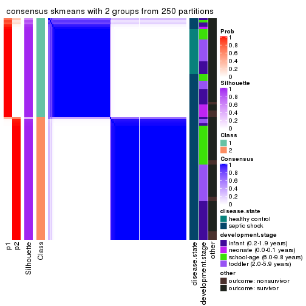</p>

</div>
<div id='tab-MAD-skmeans-consensus-heatmap-2'>
<pre><code class="r">consensus_heatmap(res, k = 3)
</code></pre>

<p>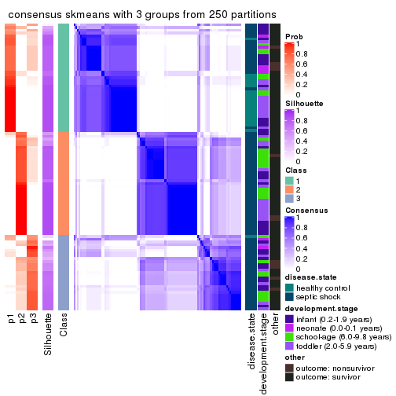</p>

</div>
<div id='tab-MAD-skmeans-consensus-heatmap-3'>
<pre><code class="r">consensus_heatmap(res, k = 4)
</code></pre>

<p>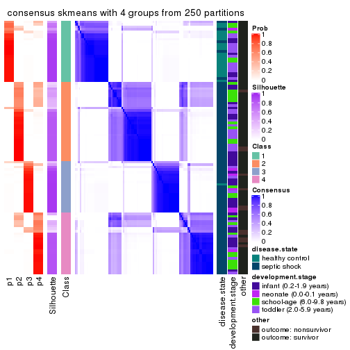</p>

</div>
<div id='tab-MAD-skmeans-consensus-heatmap-4'>
<pre><code class="r">consensus_heatmap(res, k = 5)
</code></pre>

<p>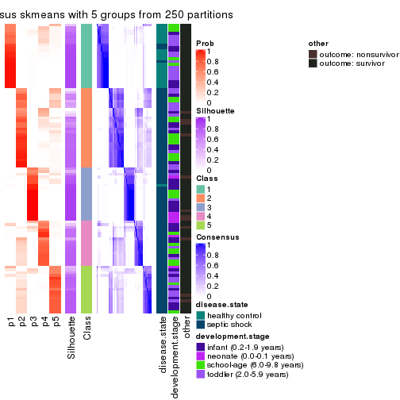</p>

</div>
<div id='tab-MAD-skmeans-consensus-heatmap-5'>
<pre><code class="r">consensus_heatmap(res, k = 6)
</code></pre>

<p>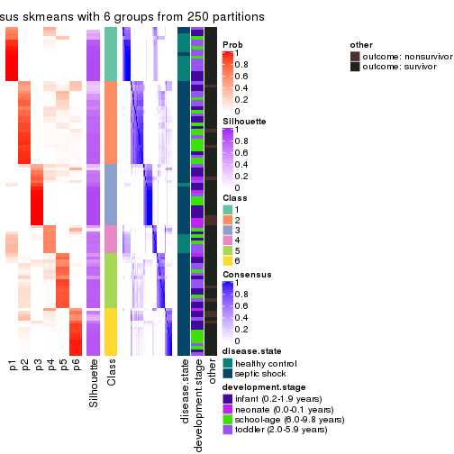</p>

</div>
</div>

Heatmaps for the membership of samples in all partitions to see how consistent they are:


<script>
$( function() {
	$( '#tabs-MAD-skmeans-membership-heatmap' ).tabs();
} );
</script>
<div id='tabs-MAD-skmeans-membership-heatmap'>
<ul>
<li><a href='#tab-MAD-skmeans-membership-heatmap-1'>k = 2</a></li>
<li><a href='#tab-MAD-skmeans-membership-heatmap-2'>k = 3</a></li>
<li><a href='#tab-MAD-skmeans-membership-heatmap-3'>k = 4</a></li>
<li><a href='#tab-MAD-skmeans-membership-heatmap-4'>k = 5</a></li>
<li><a href='#tab-MAD-skmeans-membership-heatmap-5'>k = 6</a></li>
</ul>
<div id='tab-MAD-skmeans-membership-heatmap-1'>
<pre><code class="r">membership_heatmap(res, k = 2)
</code></pre>

<p>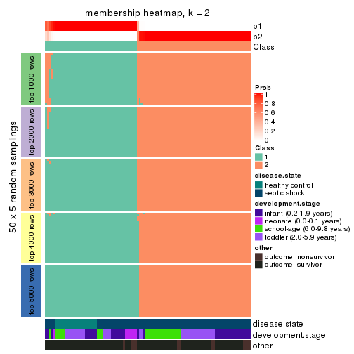</p>

</div>
<div id='tab-MAD-skmeans-membership-heatmap-2'>
<pre><code class="r">membership_heatmap(res, k = 3)
</code></pre>

<p>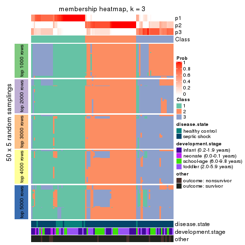</p>

</div>
<div id='tab-MAD-skmeans-membership-heatmap-3'>
<pre><code class="r">membership_heatmap(res, k = 4)
</code></pre>

<p>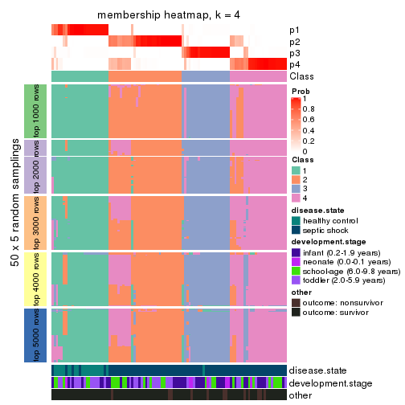</p>

</div>
<div id='tab-MAD-skmeans-membership-heatmap-4'>
<pre><code class="r">membership_heatmap(res, k = 5)
</code></pre>

<p>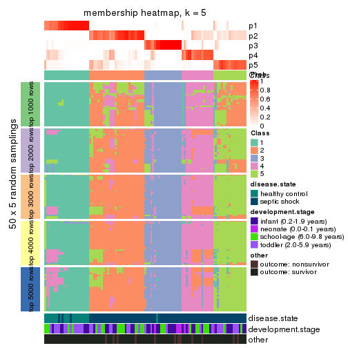</p>

</div>
<div id='tab-MAD-skmeans-membership-heatmap-5'>
<pre><code class="r">membership_heatmap(res, k = 6)
</code></pre>

<p>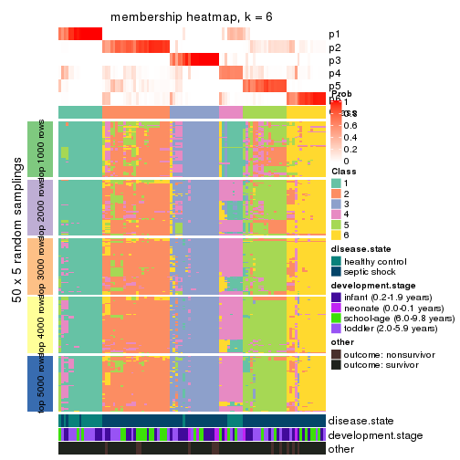</p>

</div>
</div>

As soon as we have had the classes for columns, we can look for signatures
which are significantly different between classes which can be candidate marks
for certain classes. Following are the heatmaps for signatures.


Signature heatmaps where rows are scaled:


<script>
$( function() {
	$( '#tabs-MAD-skmeans-get-signatures' ).tabs();
} );
</script>
<div id='tabs-MAD-skmeans-get-signatures'>
<ul>
<li><a href='#tab-MAD-skmeans-get-signatures-1'>k = 2</a></li>
<li><a href='#tab-MAD-skmeans-get-signatures-2'>k = 3</a></li>
<li><a href='#tab-MAD-skmeans-get-signatures-3'>k = 4</a></li>
<li><a href='#tab-MAD-skmeans-get-signatures-4'>k = 5</a></li>
<li><a href='#tab-MAD-skmeans-get-signatures-5'>k = 6</a></li>
</ul>
<div id='tab-MAD-skmeans-get-signatures-1'>
<pre><code class="r">get_signatures(res, k = 2)
</code></pre>

<p>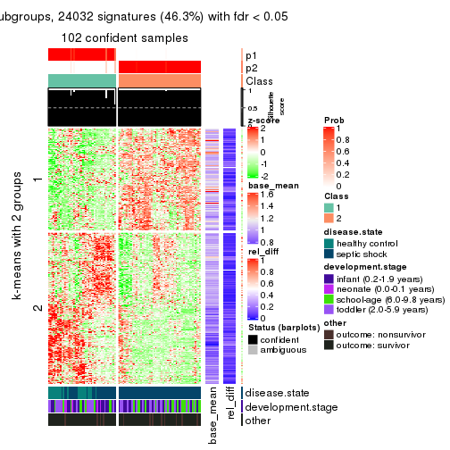</p>

</div>
<div id='tab-MAD-skmeans-get-signatures-2'>
<pre><code class="r">get_signatures(res, k = 3)
</code></pre>

<p>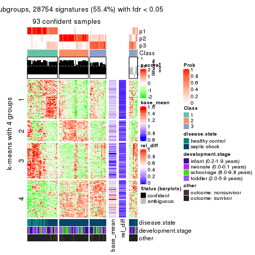</p>

</div>
<div id='tab-MAD-skmeans-get-signatures-3'>
<pre><code class="r">get_signatures(res, k = 4)
</code></pre>

<p>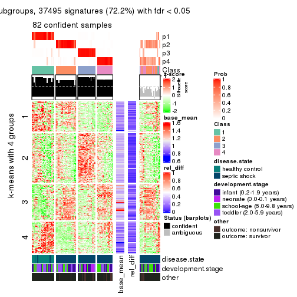</p>

</div>
<div id='tab-MAD-skmeans-get-signatures-4'>
<pre><code class="r">get_signatures(res, k = 5)
</code></pre>

<p>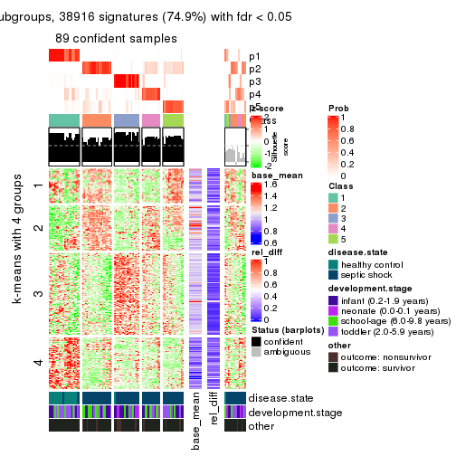</p>

</div>
<div id='tab-MAD-skmeans-get-signatures-5'>
<pre><code class="r">get_signatures(res, k = 6)
</code></pre>

<p>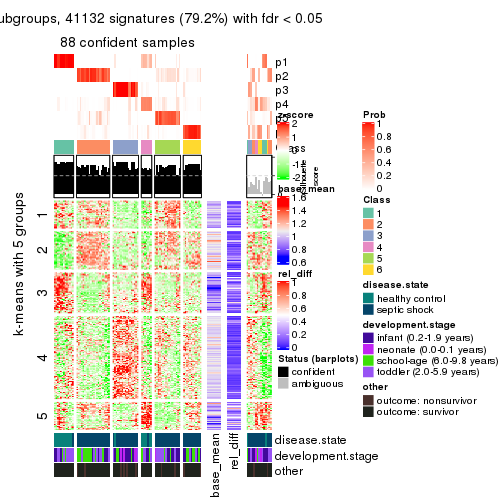</p>

</div>
</div>


Signature heatmaps where rows are not scaled:


<script>
$( function() {
	$( '#tabs-MAD-skmeans-get-signatures-no-scale' ).tabs();
} );
</script>
<div id='tabs-MAD-skmeans-get-signatures-no-scale'>
<ul>
<li><a href='#tab-MAD-skmeans-get-signatures-no-scale-1'>k = 2</a></li>
<li><a href='#tab-MAD-skmeans-get-signatures-no-scale-2'>k = 3</a></li>
<li><a href='#tab-MAD-skmeans-get-signatures-no-scale-3'>k = 4</a></li>
<li><a href='#tab-MAD-skmeans-get-signatures-no-scale-4'>k = 5</a></li>
<li><a href='#tab-MAD-skmeans-get-signatures-no-scale-5'>k = 6</a></li>
</ul>
<div id='tab-MAD-skmeans-get-signatures-no-scale-1'>
<pre><code class="r">get_signatures(res, k = 2, scale_rows = FALSE)
</code></pre>

<p>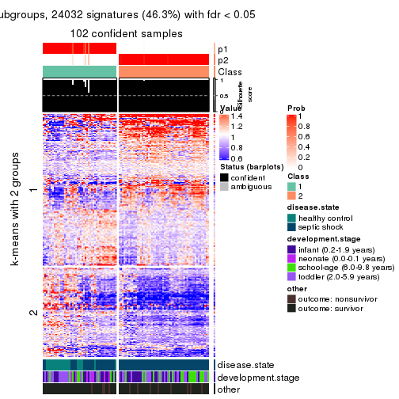</p>

</div>
<div id='tab-MAD-skmeans-get-signatures-no-scale-2'>
<pre><code class="r">get_signatures(res, k = 3, scale_rows = FALSE)
</code></pre>

<p>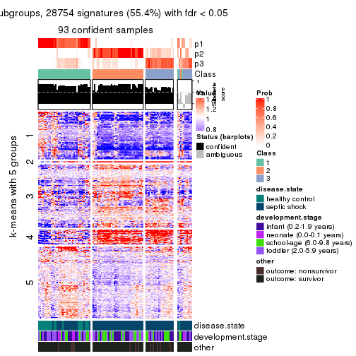</p>

</div>
<div id='tab-MAD-skmeans-get-signatures-no-scale-3'>
<pre><code class="r">get_signatures(res, k = 4, scale_rows = FALSE)
</code></pre>

<p>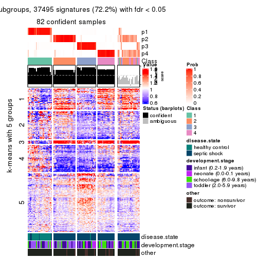</p>

</div>
<div id='tab-MAD-skmeans-get-signatures-no-scale-4'>
<pre><code class="r">get_signatures(res, k = 5, scale_rows = FALSE)
</code></pre>

<p>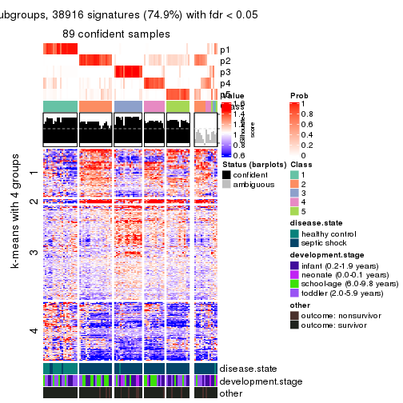</p>

</div>
<div id='tab-MAD-skmeans-get-signatures-no-scale-5'>
<pre><code class="r">get_signatures(res, k = 6, scale_rows = FALSE)
</code></pre>

<p>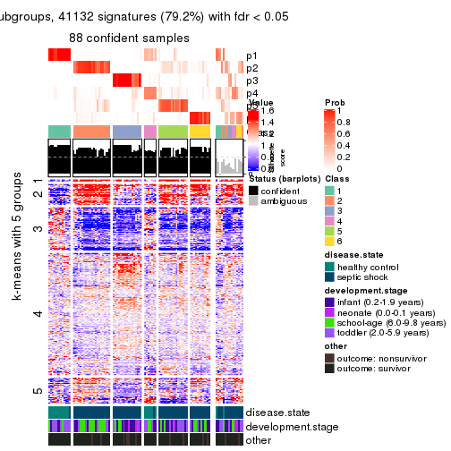</p>

</div>
</div>


Compare the overlap of signatures from different k:

```r
compare_signatures(res)
```

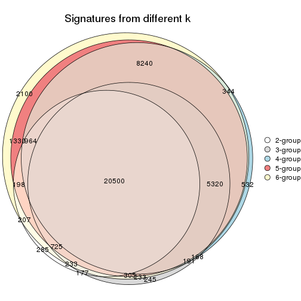

`get_signature()` returns a data frame invisibly. TO get the list of signatures, the function
call should be assigned to a variable explicitly. In following code, if `plot` argument is set
to `FALSE`, no heatmap is plotted while only the differential analysis is performed.

```r
# code only for demonstration
tb = get_signature(res, k = ..., plot = FALSE)
```

An example of the output of `tb` is:

```
#>   which_row         fdr    mean_1    mean_2 scaled_mean_1 scaled_mean_2 km
#> 1        38 0.042760348  8.373488  9.131774    -0.5533452     0.5164555  1
#> 2        40 0.018707592  7.106213  8.469186    -0.6173731     0.5762149  1
#> 3        55 0.019134737 10.221463 11.207825    -0.6159697     0.5749050  1
#> 4        59 0.006059896  5.921854  7.869574    -0.6899429     0.6439467  1
#> 5        60 0.018055526  8.928898 10.211722    -0.6204761     0.5791110  1
#> 6        98 0.009384629 15.714769 14.887706     0.6635654    -0.6193277  2
...
```

The columns in `tb` are:

1. `which_row`: row indices corresponding to the input matrix.
2. `fdr`: FDR for the differential test. 
3. `mean_x`: The mean value in group x.
4. `scaled_mean_x`: The mean value in group x after rows are scaled.
5. `km`: Row groups if k-means clustering is applied to rows.


UMAP plot which shows how samples are separated.


<script>
$( function() {
	$( '#tabs-MAD-skmeans-dimension-reduction' ).tabs();
} );
</script>
<div id='tabs-MAD-skmeans-dimension-reduction'>
<ul>
<li><a href='#tab-MAD-skmeans-dimension-reduction-1'>k = 2</a></li>
<li><a href='#tab-MAD-skmeans-dimension-reduction-2'>k = 3</a></li>
<li><a href='#tab-MAD-skmeans-dimension-reduction-3'>k = 4</a></li>
<li><a href='#tab-MAD-skmeans-dimension-reduction-4'>k = 5</a></li>
<li><a href='#tab-MAD-skmeans-dimension-reduction-5'>k = 6</a></li>
</ul>
<div id='tab-MAD-skmeans-dimension-reduction-1'>
<pre><code class="r">dimension_reduction(res, k = 2, method = &quot;UMAP&quot;)
</code></pre>

<p>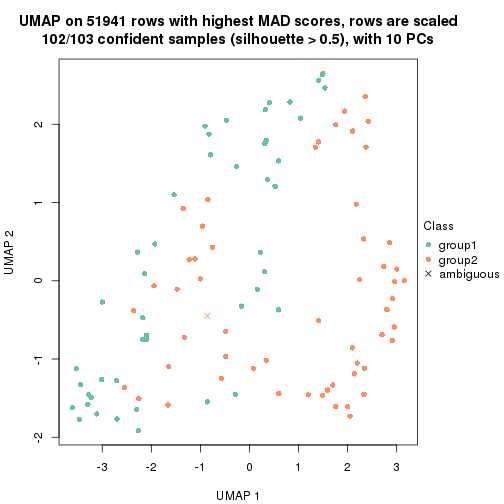</p>

</div>
<div id='tab-MAD-skmeans-dimension-reduction-2'>
<pre><code class="r">dimension_reduction(res, k = 3, method = &quot;UMAP&quot;)
</code></pre>

<p>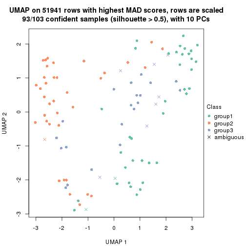</p>

</div>
<div id='tab-MAD-skmeans-dimension-reduction-3'>
<pre><code class="r">dimension_reduction(res, k = 4, method = &quot;UMAP&quot;)
</code></pre>

<p>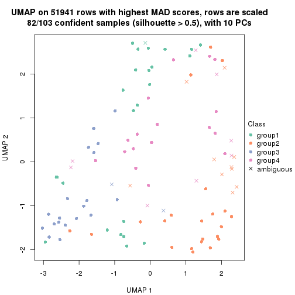</p>

</div>
<div id='tab-MAD-skmeans-dimension-reduction-4'>
<pre><code class="r">dimension_reduction(res, k = 5, method = &quot;UMAP&quot;)
</code></pre>

<p>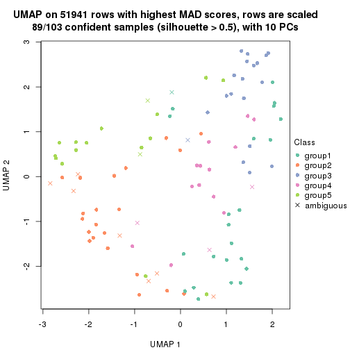</p>

</div>
<div id='tab-MAD-skmeans-dimension-reduction-5'>
<pre><code class="r">dimension_reduction(res, k = 6, method = &quot;UMAP&quot;)
</code></pre>

<p>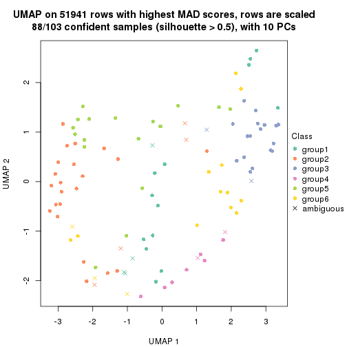</p>

</div>
</div>


Following heatmap shows how subgroups are split when increasing `k`:

```r
collect_classes(res)
```

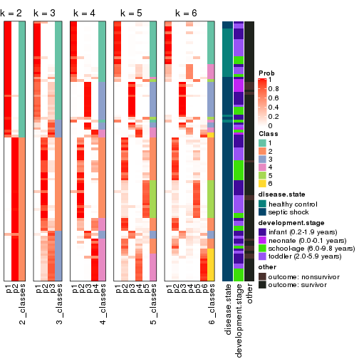


Test correlation between subgroups and known annotations. If the known
annotation is numeric, one-way ANOVA test is applied, and if the known
annotation is discrete, chi-squared contingency table test is applied.

```r
test_to_known_factors(res)
```

```
#>               n disease.state(p) development.stage(p) other(p) k
#> MAD:skmeans 102         5.70e-08              0.01748   0.5734 2
#> MAD:skmeans  93         4.23e-09              0.19818   0.1811 3
#> MAD:skmeans  82         7.41e-13              0.02497   0.0731 4
#> MAD:skmeans  89         4.25e-14              0.00463   0.2497 5
#> MAD:skmeans  88         4.07e-14              0.01111   0.3566 6
```


If matrix rows can be associated to genes, consider to use `functional_enrichment(res,
...)` to perform function enrichment for the signature genes. See [this vignette](http://bioconductor.org/packages/devel/bioc/vignettes/cola/inst/doc/functional_enrichment.html) for more detailed explanations.


 

---------------------------------------------------


### MAD:pam


The object with results only for a single top-value method and a single partition method 
can be extracted as:

```r
res = res_list["MAD", "pam"]
# you can also extract it by
# res = res_list["MAD:pam"]
```

A summary of `res` and all the functions that can be applied to it:

```r
res
```

```
#> A 'ConsensusPartition' object with k = 2, 3, 4, 5, 6.
#>   On a matrix with 51941 rows and 103 columns.
#>   Top rows (1000, 2000, 3000, 4000, 5000) are extracted by 'MAD' method.
#>   Subgroups are detected by 'pam' method.
#>   Performed in total 1250 partitions by row resampling.
#>   Best k for subgroups seems to be 3.
#> 
#> Following methods can be applied to this 'ConsensusPartition' object:
#>  [1] "cola_report"             "collect_classes"         "collect_plots"          
#>  [4] "collect_stats"           "colnames"                "compare_signatures"     
#>  [7] "consensus_heatmap"       "dimension_reduction"     "functional_enrichment"  
#> [10] "get_anno_col"            "get_anno"                "get_classes"            
#> [13] "get_consensus"           "get_matrix"              "get_membership"         
#> [16] "get_param"               "get_signatures"          "get_stats"              
#> [19] "is_best_k"               "is_stable_k"             "membership_heatmap"     
#> [22] "ncol"                    "nrow"                    "plot_ecdf"              
#> [25] "rownames"                "select_partition_number" "show"                   
#> [28] "suggest_best_k"          "test_to_known_factors"
```

`collect_plots()` function collects all the plots made from `res` for all `k` (number of partitions)
into one single page to provide an easy and fast comparison between different `k`.

```r
collect_plots(res)
```

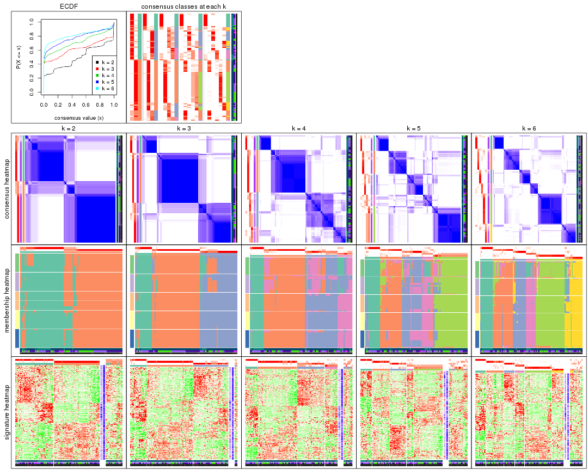

The plots are:

- The first row: a plot of the ECDF (empirical cumulative distribution
  function) curves of the consensus matrix for each `k` and the heatmap of
  predicted classes for each `k`.
- The second row: heatmaps of the consensus matrix for each `k`.
- The third row: heatmaps of the membership matrix for each `k`.
- The fouth row: heatmaps of the signatures for each `k`.

All the plots in panels can be made by individual functions and they are
plotted later in this section.

`select_partition_number()` produces several plots showing different
statistics for choosing "optimized" `k`. There are following statistics:

- ECDF curves of the consensus matrix for each `k`;
- 1-PAC. [The PAC
  score](https://en.wikipedia.org/wiki/Consensus_clustering#Over-interpretation_potential_of_consensus_clustering)
  measures the proportion of the ambiguous subgrouping.
- Mean silhouette score.
- Concordance. The mean probability of fiting the consensus class ids in all
  partitions.
- Area increased. Denote $A_k$ as the area under the ECDF curve for current
  `k`, the area increased is defined as $A_k - A_{k-1}$.
- Rand index. The percent of pairs of samples that are both in a same cluster
  or both are not in a same cluster in the partition of k and k-1.
- Jaccard index. The ratio of pairs of samples are both in a same cluster in
  the partition of k and k-1 and the pairs of samples are both in a same
  cluster in the partition k or k-1.

The detailed explanations of these statistics can be found in [the _cola_
vignette](http://bioconductor.org/packages/devel/bioc/vignettes/cola/inst/doc/cola.html#toc_13).

Generally speaking, lower PAC score, higher mean silhouette score or higher
concordance corresponds to better partition. Rand index and Jaccard index
measure how similar the current partition is compared to partition with `k-1`.
If they are too similar, we won't accept `k` is better than `k-1`.

```r
select_partition_number(res)
```

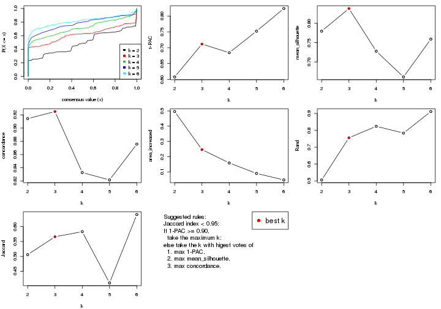

The numeric values for all these statistics can be obtained by `get_stats()`.

```r
get_stats(res)
```

```
#>   k 1-PAC mean_silhouette concordance area_increased  Rand Jaccard
#> 2 2 0.608           0.780       0.914         0.4959 0.506   0.506
#> 3 3 0.712           0.838       0.925         0.2462 0.756   0.566
#> 4 4 0.684           0.728       0.833         0.1587 0.824   0.583
#> 5 5 0.752           0.661       0.822         0.0900 0.784   0.411
#> 6 6 0.824           0.759       0.876         0.0472 0.911   0.640
```

`suggest_best_k()` suggests the best $k$ based on these statistics. The rules are as follows:

- All $k$ with Jaccard index larger than 0.95 are removed because increasing
  $k$ does not provide enough extra information. If all $k$ are removed, it is
  marked as no subgroup is detected.
- For all $k$ with 1-PAC score larger than 0.9, the maximal $k$ is taken as
  the best $k$, and other $k$ are marked as optional $k$.
- If it does not fit the second rule. The $k$ with the maximal vote of the
  highest 1-PAC score, highest mean silhouette, and highest concordance is
  taken as the best $k$.

```r
suggest_best_k(res)
```

```
#> [1] 3
```


Following shows the table of the partitions (You need to click the **show/hide
code output** link to see it). The membership matrix (columns with name `p*`)
is inferred by
[`clue::cl_consensus()`](https://www.rdocumentation.org/link/cl_consensus?package=clue)
function with the `SE` method. Basically the value in the membership matrix
represents the probability to belong to a certain group. The finall class
label for an item is determined with the group with highest probability it
belongs to.

In `get_classes()` function, the entropy is calculated from the membership
matrix and the silhouette score is calculated from the consensus matrix.


<script>
$( function() {
	$( '#tabs-MAD-pam-get-classes' ).tabs();
} );
</script>
<div id='tabs-MAD-pam-get-classes'>
<ul>
<li><a href='#tab-MAD-pam-get-classes-1'>k = 2</a></li>
<li><a href='#tab-MAD-pam-get-classes-2'>k = 3</a></li>
<li><a href='#tab-MAD-pam-get-classes-3'>k = 4</a></li>
<li><a href='#tab-MAD-pam-get-classes-4'>k = 5</a></li>
<li><a href='#tab-MAD-pam-get-classes-5'>k = 6</a></li>
</ul>

<div id='tab-MAD-pam-get-classes-1'>
<p><a id='tab-MAD-pam-get-classes-1-a' style='color:#0366d6' href='#'>show/hide code output</a></p>
<pre><code class="r">cbind(get_classes(res, k = 2), get_membership(res, k = 2))
</code></pre>

<pre><code>#&gt;           class entropy silhouette    p1    p2
#&gt; GSM647569     1  0.0000     0.9030 1.000 0.000
#&gt; GSM647574     1  0.0000     0.9030 1.000 0.000
#&gt; GSM647577     1  0.0000     0.9030 1.000 0.000
#&gt; GSM647547     1  0.0000     0.9030 1.000 0.000
#&gt; GSM647552     1  0.5946     0.8047 0.856 0.144
#&gt; GSM647553     1  0.0000     0.9030 1.000 0.000
#&gt; GSM647565     2  0.9954     0.1541 0.460 0.540
#&gt; GSM647545     2  0.0000     0.8919 0.000 1.000
#&gt; GSM647549     2  0.0000     0.8919 0.000 1.000
#&gt; GSM647550     2  0.0000     0.8919 0.000 1.000
#&gt; GSM647560     1  0.9754     0.2924 0.592 0.408
#&gt; GSM647617     1  0.0000     0.9030 1.000 0.000
#&gt; GSM647528     2  0.0000     0.8919 0.000 1.000
#&gt; GSM647529     2  0.4562     0.8034 0.096 0.904
#&gt; GSM647531     2  0.0000     0.8919 0.000 1.000
#&gt; GSM647540     1  0.5737     0.8077 0.864 0.136
#&gt; GSM647541     2  0.0000     0.8919 0.000 1.000
#&gt; GSM647546     1  0.5737     0.8077 0.864 0.136
#&gt; GSM647557     2  0.0000     0.8919 0.000 1.000
#&gt; GSM647561     2  0.0000     0.8919 0.000 1.000
#&gt; GSM647567     2  0.9970     0.0394 0.468 0.532
#&gt; GSM647568     2  0.9732     0.3177 0.404 0.596
#&gt; GSM647570     2  0.0000     0.8919 0.000 1.000
#&gt; GSM647573     1  0.2236     0.8819 0.964 0.036
#&gt; GSM647576     1  0.5737     0.8077 0.864 0.136
#&gt; GSM647579     1  0.5737     0.8077 0.864 0.136
#&gt; GSM647580     1  0.0000     0.9030 1.000 0.000
#&gt; GSM647583     1  0.0000     0.9030 1.000 0.000
#&gt; GSM647592     2  0.0000     0.8919 0.000 1.000
#&gt; GSM647593     2  0.0000     0.8919 0.000 1.000
#&gt; GSM647595     2  0.0000     0.8919 0.000 1.000
#&gt; GSM647597     2  0.0000     0.8919 0.000 1.000
#&gt; GSM647598     2  0.0000     0.8919 0.000 1.000
#&gt; GSM647613     2  0.0000     0.8919 0.000 1.000
#&gt; GSM647615     1  0.9686     0.3225 0.604 0.396
#&gt; GSM647616     1  0.0000     0.9030 1.000 0.000
#&gt; GSM647619     2  0.0000     0.8919 0.000 1.000
#&gt; GSM647582     2  0.0000     0.8919 0.000 1.000
#&gt; GSM647591     2  0.0000     0.8919 0.000 1.000
#&gt; GSM647527     2  0.0000     0.8919 0.000 1.000
#&gt; GSM647530     2  0.0000     0.8919 0.000 1.000
#&gt; GSM647532     1  0.0672     0.8989 0.992 0.008
#&gt; GSM647544     2  0.0000     0.8919 0.000 1.000
#&gt; GSM647551     2  0.0000     0.8919 0.000 1.000
#&gt; GSM647556     1  0.0000     0.9030 1.000 0.000
#&gt; GSM647558     2  0.0000     0.8919 0.000 1.000
#&gt; GSM647572     1  0.5737     0.8077 0.864 0.136
#&gt; GSM647578     1  0.9944     0.1793 0.544 0.456
#&gt; GSM647581     2  0.0000     0.8919 0.000 1.000
#&gt; GSM647594     2  0.0000     0.8919 0.000 1.000
#&gt; GSM647599     1  0.0000     0.9030 1.000 0.000
#&gt; GSM647600     2  0.9954     0.0660 0.460 0.540
#&gt; GSM647601     2  0.0000     0.8919 0.000 1.000
#&gt; GSM647603     2  0.6247     0.7350 0.156 0.844
#&gt; GSM647610     2  0.4939     0.7918 0.108 0.892
#&gt; GSM647611     2  0.0000     0.8919 0.000 1.000
#&gt; GSM647612     2  0.9732     0.3177 0.404 0.596
#&gt; GSM647614     2  0.9732     0.3177 0.404 0.596
#&gt; GSM647618     2  0.0000     0.8919 0.000 1.000
#&gt; GSM647629     2  0.0000     0.8919 0.000 1.000
#&gt; GSM647535     2  0.0000     0.8919 0.000 1.000
#&gt; GSM647563     2  0.0000     0.8919 0.000 1.000
#&gt; GSM647542     2  0.9393     0.4248 0.356 0.644
#&gt; GSM647543     2  0.9732     0.3177 0.404 0.596
#&gt; GSM647548     2  0.9732     0.3177 0.404 0.596
#&gt; GSM647554     2  0.0000     0.8919 0.000 1.000
#&gt; GSM647555     2  0.0000     0.8919 0.000 1.000
#&gt; GSM647559     2  0.0000     0.8919 0.000 1.000
#&gt; GSM647562     2  0.0000     0.8919 0.000 1.000
#&gt; GSM647564     1  0.5629     0.8114 0.868 0.132
#&gt; GSM647571     2  0.9686     0.3370 0.396 0.604
#&gt; GSM647584     2  0.0000     0.8919 0.000 1.000
#&gt; GSM647585     1  0.0000     0.9030 1.000 0.000
#&gt; GSM647586     2  0.0000     0.8919 0.000 1.000
#&gt; GSM647587     2  0.0000     0.8919 0.000 1.000
#&gt; GSM647588     2  0.0000     0.8919 0.000 1.000
#&gt; GSM647596     2  0.0000     0.8919 0.000 1.000
#&gt; GSM647602     1  0.0000     0.9030 1.000 0.000
#&gt; GSM647609     2  0.0000     0.8919 0.000 1.000
#&gt; GSM647620     2  0.0000     0.8919 0.000 1.000
#&gt; GSM647627     2  0.0000     0.8919 0.000 1.000
#&gt; GSM647628     2  0.0000     0.8919 0.000 1.000
#&gt; GSM647533     1  0.0000     0.9030 1.000 0.000
#&gt; GSM647536     2  0.9661     0.3170 0.392 0.608
#&gt; GSM647537     1  0.0000     0.9030 1.000 0.000
#&gt; GSM647606     1  0.0000     0.9030 1.000 0.000
#&gt; GSM647621     1  0.0000     0.9030 1.000 0.000
#&gt; GSM647626     1  0.0000     0.9030 1.000 0.000
#&gt; GSM647538     1  0.0000     0.9030 1.000 0.000
#&gt; GSM647575     1  0.6973     0.7179 0.812 0.188
#&gt; GSM647590     1  0.0000     0.9030 1.000 0.000
#&gt; GSM647605     1  0.9661     0.3131 0.608 0.392
#&gt; GSM647607     1  0.2236     0.8819 0.964 0.036
#&gt; GSM647608     1  0.0000     0.9030 1.000 0.000
#&gt; GSM647622     1  0.0000     0.9030 1.000 0.000
#&gt; GSM647623     1  0.0000     0.9030 1.000 0.000
#&gt; GSM647624     1  0.0000     0.9030 1.000 0.000
#&gt; GSM647625     1  0.0000     0.9030 1.000 0.000
#&gt; GSM647534     1  0.9732     0.2820 0.596 0.404
#&gt; GSM647539     2  0.9686     0.3700 0.396 0.604
#&gt; GSM647566     1  0.0000     0.9030 1.000 0.000
#&gt; GSM647589     1  0.0000     0.9030 1.000 0.000
#&gt; GSM647604     1  0.7950     0.6336 0.760 0.240
</code></pre>

<script>
$('#tab-MAD-pam-get-classes-1-a').parent().next().next().hide();
$('#tab-MAD-pam-get-classes-1-a').click(function(){
  $('#tab-MAD-pam-get-classes-1-a').parent().next().next().toggle();
  return(false);
});
</script>
</div>

<div id='tab-MAD-pam-get-classes-2'>
<p><a id='tab-MAD-pam-get-classes-2-a' style='color:#0366d6' href='#'>show/hide code output</a></p>
<pre><code class="r">cbind(get_classes(res, k = 3), get_membership(res, k = 3))
</code></pre>

<pre><code>#&gt;           class entropy silhouette    p1    p2    p3
#&gt; GSM647569     3  0.0000      0.824 0.000 0.000 1.000
#&gt; GSM647574     3  0.0000      0.824 0.000 0.000 1.000
#&gt; GSM647577     3  0.0000      0.824 0.000 0.000 1.000
#&gt; GSM647547     3  0.0000      0.824 0.000 0.000 1.000
#&gt; GSM647552     1  0.8843      0.513 0.564 0.276 0.160
#&gt; GSM647553     3  0.0237      0.823 0.004 0.000 0.996
#&gt; GSM647565     3  0.1163      0.816 0.000 0.028 0.972
#&gt; GSM647545     2  0.0000      0.968 0.000 1.000 0.000
#&gt; GSM647549     2  0.0000      0.968 0.000 1.000 0.000
#&gt; GSM647550     2  0.6111      0.173 0.000 0.604 0.396
#&gt; GSM647560     3  0.6026      0.545 0.000 0.376 0.624
#&gt; GSM647617     3  0.0000      0.824 0.000 0.000 1.000
#&gt; GSM647528     2  0.0000      0.968 0.000 1.000 0.000
#&gt; GSM647529     2  0.3941      0.787 0.156 0.844 0.000
#&gt; GSM647531     2  0.0000      0.968 0.000 1.000 0.000
#&gt; GSM647540     3  0.0000      0.824 0.000 0.000 1.000
#&gt; GSM647541     2  0.0000      0.968 0.000 1.000 0.000
#&gt; GSM647546     3  0.0000      0.824 0.000 0.000 1.000
#&gt; GSM647557     2  0.0000      0.968 0.000 1.000 0.000
#&gt; GSM647561     2  0.0000      0.968 0.000 1.000 0.000
#&gt; GSM647567     2  0.5621      0.550 0.000 0.692 0.308
#&gt; GSM647568     3  0.5465      0.662 0.000 0.288 0.712
#&gt; GSM647570     2  0.0000      0.968 0.000 1.000 0.000
#&gt; GSM647573     3  0.0000      0.824 0.000 0.000 1.000
#&gt; GSM647576     3  0.0000      0.824 0.000 0.000 1.000
#&gt; GSM647579     3  0.0000      0.824 0.000 0.000 1.000
#&gt; GSM647580     3  0.0000      0.824 0.000 0.000 1.000
#&gt; GSM647583     3  0.0000      0.824 0.000 0.000 1.000
#&gt; GSM647592     2  0.0000      0.968 0.000 1.000 0.000
#&gt; GSM647593     2  0.0000      0.968 0.000 1.000 0.000
#&gt; GSM647595     2  0.0000      0.968 0.000 1.000 0.000
#&gt; GSM647597     2  0.3482      0.825 0.128 0.872 0.000
#&gt; GSM647598     2  0.0000      0.968 0.000 1.000 0.000
#&gt; GSM647613     2  0.0000      0.968 0.000 1.000 0.000
#&gt; GSM647615     3  0.3192      0.777 0.000 0.112 0.888
#&gt; GSM647616     3  0.0000      0.824 0.000 0.000 1.000
#&gt; GSM647619     2  0.0000      0.968 0.000 1.000 0.000
#&gt; GSM647582     2  0.0000      0.968 0.000 1.000 0.000
#&gt; GSM647591     2  0.0000      0.968 0.000 1.000 0.000
#&gt; GSM647527     2  0.0000      0.968 0.000 1.000 0.000
#&gt; GSM647530     2  0.0000      0.968 0.000 1.000 0.000
#&gt; GSM647532     3  0.6095      0.431 0.392 0.000 0.608
#&gt; GSM647544     2  0.0000      0.968 0.000 1.000 0.000
#&gt; GSM647551     2  0.0000      0.968 0.000 1.000 0.000
#&gt; GSM647556     3  0.0000      0.824 0.000 0.000 1.000
#&gt; GSM647558     2  0.0000      0.968 0.000 1.000 0.000
#&gt; GSM647572     3  0.0000      0.824 0.000 0.000 1.000
#&gt; GSM647578     3  0.5254      0.571 0.000 0.264 0.736
#&gt; GSM647581     2  0.0000      0.968 0.000 1.000 0.000
#&gt; GSM647594     2  0.0000      0.968 0.000 1.000 0.000
#&gt; GSM647599     1  0.0424      0.901 0.992 0.000 0.008
#&gt; GSM647600     2  0.3192      0.847 0.000 0.888 0.112
#&gt; GSM647601     2  0.0000      0.968 0.000 1.000 0.000
#&gt; GSM647603     2  0.0000      0.968 0.000 1.000 0.000
#&gt; GSM647610     2  0.4002      0.787 0.000 0.840 0.160
#&gt; GSM647611     2  0.0000      0.968 0.000 1.000 0.000
#&gt; GSM647612     3  0.5560      0.652 0.000 0.300 0.700
#&gt; GSM647614     3  0.5678      0.638 0.000 0.316 0.684
#&gt; GSM647618     2  0.0000      0.968 0.000 1.000 0.000
#&gt; GSM647629     2  0.0000      0.968 0.000 1.000 0.000
#&gt; GSM647535     2  0.0000      0.968 0.000 1.000 0.000
#&gt; GSM647563     2  0.0000      0.968 0.000 1.000 0.000
#&gt; GSM647542     3  0.5835      0.608 0.000 0.340 0.660
#&gt; GSM647543     3  0.5560      0.652 0.000 0.300 0.700
#&gt; GSM647548     3  0.5216      0.683 0.000 0.260 0.740
#&gt; GSM647554     2  0.0000      0.968 0.000 1.000 0.000
#&gt; GSM647555     3  0.5835      0.608 0.000 0.340 0.660
#&gt; GSM647559     2  0.0000      0.968 0.000 1.000 0.000
#&gt; GSM647562     2  0.0000      0.968 0.000 1.000 0.000
#&gt; GSM647564     3  0.0000      0.824 0.000 0.000 1.000
#&gt; GSM647571     3  0.5835      0.608 0.000 0.340 0.660
#&gt; GSM647584     2  0.0000      0.968 0.000 1.000 0.000
#&gt; GSM647585     3  0.0000      0.824 0.000 0.000 1.000
#&gt; GSM647586     2  0.0000      0.968 0.000 1.000 0.000
#&gt; GSM647587     2  0.0000      0.968 0.000 1.000 0.000
#&gt; GSM647588     2  0.0000      0.968 0.000 1.000 0.000
#&gt; GSM647596     2  0.0000      0.968 0.000 1.000 0.000
#&gt; GSM647602     3  0.0000      0.824 0.000 0.000 1.000
#&gt; GSM647609     2  0.0000      0.968 0.000 1.000 0.000
#&gt; GSM647620     2  0.0000      0.968 0.000 1.000 0.000
#&gt; GSM647627     2  0.0000      0.968 0.000 1.000 0.000
#&gt; GSM647628     2  0.0000      0.968 0.000 1.000 0.000
#&gt; GSM647533     1  0.0000      0.907 1.000 0.000 0.000
#&gt; GSM647536     1  0.4654      0.724 0.792 0.208 0.000
#&gt; GSM647537     1  0.0000      0.907 1.000 0.000 0.000
#&gt; GSM647606     1  0.0000      0.907 1.000 0.000 0.000
#&gt; GSM647621     3  0.4555      0.699 0.200 0.000 0.800
#&gt; GSM647626     1  0.4931      0.677 0.768 0.000 0.232
#&gt; GSM647538     1  0.0000      0.907 1.000 0.000 0.000
#&gt; GSM647575     3  0.5016      0.659 0.240 0.000 0.760
#&gt; GSM647590     1  0.0000      0.907 1.000 0.000 0.000
#&gt; GSM647605     1  0.0000      0.907 1.000 0.000 0.000
#&gt; GSM647607     3  0.5058      0.652 0.244 0.000 0.756
#&gt; GSM647608     3  0.6309      0.127 0.496 0.000 0.504
#&gt; GSM647622     1  0.0000      0.907 1.000 0.000 0.000
#&gt; GSM647623     1  0.0000      0.907 1.000 0.000 0.000
#&gt; GSM647624     1  0.0000      0.907 1.000 0.000 0.000
#&gt; GSM647625     1  0.0000      0.907 1.000 0.000 0.000
#&gt; GSM647534     1  0.4702      0.722 0.788 0.212 0.000
#&gt; GSM647539     3  0.3454      0.773 0.104 0.008 0.888
#&gt; GSM647566     1  0.4796      0.655 0.780 0.000 0.220
#&gt; GSM647589     3  0.4555      0.699 0.200 0.000 0.800
#&gt; GSM647604     1  0.0000      0.907 1.000 0.000 0.000
</code></pre>

<script>
$('#tab-MAD-pam-get-classes-2-a').parent().next().next().hide();
$('#tab-MAD-pam-get-classes-2-a').click(function(){
  $('#tab-MAD-pam-get-classes-2-a').parent().next().next().toggle();
  return(false);
});
</script>
</div>

<div id='tab-MAD-pam-get-classes-3'>
<p><a id='tab-MAD-pam-get-classes-3-a' style='color:#0366d6' href='#'>show/hide code output</a></p>
<pre><code class="r">cbind(get_classes(res, k = 4), get_membership(res, k = 4))
</code></pre>

<pre><code>#&gt;           class entropy silhouette    p1    p2    p3    p4
#&gt; GSM647569     3  0.4843      0.665 0.000 0.000 0.604 0.396
#&gt; GSM647574     4  0.0000      0.583 0.000 0.000 0.000 1.000
#&gt; GSM647577     3  0.4985      0.627 0.000 0.000 0.532 0.468
#&gt; GSM647547     4  0.3975      0.672 0.000 0.000 0.240 0.760
#&gt; GSM647552     3  0.6656      0.641 0.100 0.008 0.616 0.276
#&gt; GSM647553     4  0.0000      0.583 0.000 0.000 0.000 1.000
#&gt; GSM647565     4  0.4804      0.639 0.000 0.000 0.384 0.616
#&gt; GSM647545     2  0.3219      0.813 0.000 0.836 0.164 0.000
#&gt; GSM647549     2  0.4866      0.490 0.000 0.596 0.404 0.000
#&gt; GSM647550     3  0.3074      0.587 0.000 0.152 0.848 0.000
#&gt; GSM647560     3  0.1209      0.605 0.000 0.004 0.964 0.032
#&gt; GSM647617     3  0.4941      0.653 0.000 0.000 0.564 0.436
#&gt; GSM647528     2  0.0188      0.924 0.000 0.996 0.004 0.000
#&gt; GSM647529     2  0.2706      0.857 0.080 0.900 0.000 0.020
#&gt; GSM647531     2  0.0188      0.923 0.000 0.996 0.004 0.000
#&gt; GSM647540     3  0.4804      0.668 0.000 0.000 0.616 0.384
#&gt; GSM647541     3  0.4103      0.541 0.000 0.256 0.744 0.000
#&gt; GSM647546     3  0.3528      0.613 0.000 0.000 0.808 0.192
#&gt; GSM647557     2  0.0188      0.923 0.000 0.996 0.004 0.000
#&gt; GSM647561     2  0.0188      0.924 0.000 0.996 0.004 0.000
#&gt; GSM647567     3  0.5986      0.663 0.000 0.060 0.620 0.320
#&gt; GSM647568     4  0.5212      0.603 0.000 0.008 0.420 0.572
#&gt; GSM647570     2  0.4817      0.513 0.000 0.612 0.388 0.000
#&gt; GSM647573     4  0.4193      0.671 0.000 0.000 0.268 0.732
#&gt; GSM647576     3  0.3311      0.608 0.000 0.000 0.828 0.172
#&gt; GSM647579     3  0.4804      0.668 0.000 0.000 0.616 0.384
#&gt; GSM647580     3  0.4941      0.653 0.000 0.000 0.564 0.436
#&gt; GSM647583     3  0.4985      0.627 0.000 0.000 0.532 0.468
#&gt; GSM647592     2  0.0188      0.923 0.000 0.996 0.004 0.000
#&gt; GSM647593     2  0.0188      0.923 0.000 0.996 0.004 0.000
#&gt; GSM647595     2  0.0188      0.923 0.000 0.996 0.004 0.000
#&gt; GSM647597     2  0.0188      0.923 0.000 0.996 0.004 0.000
#&gt; GSM647598     2  0.0188      0.923 0.000 0.996 0.004 0.000
#&gt; GSM647613     2  0.2408      0.863 0.000 0.896 0.104 0.000
#&gt; GSM647615     3  0.1792      0.581 0.000 0.000 0.932 0.068
#&gt; GSM647616     4  0.3444      0.211 0.000 0.000 0.184 0.816
#&gt; GSM647619     2  0.0188      0.923 0.000 0.996 0.004 0.000
#&gt; GSM647582     2  0.0188      0.924 0.000 0.996 0.004 0.000
#&gt; GSM647591     2  0.0188      0.923 0.000 0.996 0.004 0.000
#&gt; GSM647527     2  0.0188      0.924 0.000 0.996 0.004 0.000
#&gt; GSM647530     2  0.1557      0.896 0.000 0.944 0.056 0.000
#&gt; GSM647532     4  0.5510      0.464 0.376 0.000 0.024 0.600
#&gt; GSM647544     2  0.0592      0.919 0.000 0.984 0.016 0.000
#&gt; GSM647551     2  0.0188      0.923 0.000 0.996 0.004 0.000
#&gt; GSM647556     3  0.4843      0.665 0.000 0.000 0.604 0.396
#&gt; GSM647558     2  0.4454      0.639 0.000 0.692 0.308 0.000
#&gt; GSM647572     3  0.4222      0.642 0.000 0.000 0.728 0.272
#&gt; GSM647578     3  0.4244      0.658 0.000 0.036 0.804 0.160
#&gt; GSM647581     2  0.4697      0.566 0.000 0.644 0.356 0.000
#&gt; GSM647594     2  0.0188      0.923 0.000 0.996 0.004 0.000
#&gt; GSM647599     1  0.1118      0.898 0.964 0.000 0.000 0.036
#&gt; GSM647600     3  0.5920      0.521 0.000 0.336 0.612 0.052
#&gt; GSM647601     2  0.0000      0.923 0.000 1.000 0.000 0.000
#&gt; GSM647603     3  0.5467      0.502 0.000 0.364 0.612 0.024
#&gt; GSM647610     2  0.3356      0.731 0.000 0.824 0.176 0.000
#&gt; GSM647611     2  0.0188      0.924 0.000 0.996 0.004 0.000
#&gt; GSM647612     3  0.0188      0.584 0.000 0.004 0.996 0.000
#&gt; GSM647614     3  0.5150     -0.357 0.000 0.008 0.596 0.396
#&gt; GSM647618     2  0.0188      0.924 0.000 0.996 0.004 0.000
#&gt; GSM647629     3  0.4790      0.488 0.000 0.380 0.620 0.000
#&gt; GSM647535     2  0.0188      0.924 0.000 0.996 0.004 0.000
#&gt; GSM647563     2  0.2760      0.842 0.000 0.872 0.128 0.000
#&gt; GSM647542     3  0.1545      0.567 0.000 0.008 0.952 0.040
#&gt; GSM647543     3  0.1545      0.567 0.000 0.008 0.952 0.040
#&gt; GSM647548     4  0.5125      0.631 0.000 0.008 0.388 0.604
#&gt; GSM647554     3  0.4790      0.488 0.000 0.380 0.620 0.000
#&gt; GSM647555     3  0.0188      0.584 0.000 0.004 0.996 0.000
#&gt; GSM647559     2  0.0188      0.924 0.000 0.996 0.004 0.000
#&gt; GSM647562     2  0.2647      0.849 0.000 0.880 0.120 0.000
#&gt; GSM647564     3  0.4843      0.665 0.000 0.000 0.604 0.396
#&gt; GSM647571     3  0.1545      0.567 0.000 0.008 0.952 0.040
#&gt; GSM647584     2  0.0188      0.923 0.000 0.996 0.004 0.000
#&gt; GSM647585     3  0.4830      0.666 0.000 0.000 0.608 0.392
#&gt; GSM647586     2  0.0188      0.924 0.000 0.996 0.004 0.000
#&gt; GSM647587     2  0.0188      0.924 0.000 0.996 0.004 0.000
#&gt; GSM647588     2  0.1557      0.889 0.000 0.944 0.056 0.000
#&gt; GSM647596     2  0.0188      0.924 0.000 0.996 0.004 0.000
#&gt; GSM647602     3  0.4941      0.653 0.000 0.000 0.564 0.436
#&gt; GSM647609     2  0.0188      0.923 0.000 0.996 0.004 0.000
#&gt; GSM647620     2  0.0188      0.924 0.000 0.996 0.004 0.000
#&gt; GSM647627     2  0.0188      0.924 0.000 0.996 0.004 0.000
#&gt; GSM647628     2  0.4804      0.518 0.000 0.616 0.384 0.000
#&gt; GSM647533     1  0.0000      0.933 1.000 0.000 0.000 0.000
#&gt; GSM647536     1  0.4988      0.461 0.692 0.288 0.000 0.020
#&gt; GSM647537     1  0.0000      0.933 1.000 0.000 0.000 0.000
#&gt; GSM647606     1  0.0000      0.933 1.000 0.000 0.000 0.000
#&gt; GSM647621     4  0.4797      0.632 0.260 0.000 0.020 0.720
#&gt; GSM647626     1  0.4008      0.600 0.756 0.000 0.000 0.244
#&gt; GSM647538     1  0.0000      0.933 1.000 0.000 0.000 0.000
#&gt; GSM647575     4  0.5169      0.625 0.272 0.000 0.032 0.696
#&gt; GSM647590     1  0.0000      0.933 1.000 0.000 0.000 0.000
#&gt; GSM647605     1  0.0000      0.933 1.000 0.000 0.000 0.000
#&gt; GSM647607     4  0.5228      0.629 0.268 0.000 0.036 0.696
#&gt; GSM647608     4  0.4406      0.549 0.300 0.000 0.000 0.700
#&gt; GSM647622     1  0.0000      0.933 1.000 0.000 0.000 0.000
#&gt; GSM647623     1  0.0000      0.933 1.000 0.000 0.000 0.000
#&gt; GSM647624     1  0.0000      0.933 1.000 0.000 0.000 0.000
#&gt; GSM647625     1  0.0000      0.933 1.000 0.000 0.000 0.000
#&gt; GSM647534     3  0.5980      0.386 0.396 0.000 0.560 0.044
#&gt; GSM647539     4  0.4978      0.640 0.004 0.000 0.384 0.612
#&gt; GSM647566     3  0.6121      0.389 0.396 0.000 0.552 0.052
#&gt; GSM647589     4  0.4387      0.657 0.200 0.000 0.024 0.776
#&gt; GSM647604     1  0.0000      0.933 1.000 0.000 0.000 0.000
</code></pre>

<script>
$('#tab-MAD-pam-get-classes-3-a').parent().next().next().hide();
$('#tab-MAD-pam-get-classes-3-a').click(function(){
  $('#tab-MAD-pam-get-classes-3-a').parent().next().next().toggle();
  return(false);
});
</script>
</div>

<div id='tab-MAD-pam-get-classes-4'>
<p><a id='tab-MAD-pam-get-classes-4-a' style='color:#0366d6' href='#'>show/hide code output</a></p>
<pre><code class="r">cbind(get_classes(res, k = 5), get_membership(res, k = 5))
</code></pre>

<pre><code>#&gt;           class entropy silhouette    p1    p2    p3    p4    p5
#&gt; GSM647569     3  0.0000      0.689 0.000 0.000 1.000 0.000 0.000
#&gt; GSM647574     4  0.4306      0.440 0.000 0.000 0.492 0.508 0.000
#&gt; GSM647577     3  0.0000      0.689 0.000 0.000 1.000 0.000 0.000
#&gt; GSM647547     4  0.5386      0.566 0.000 0.064 0.372 0.564 0.000
#&gt; GSM647552     3  0.5491      0.606 0.004 0.000 0.616 0.080 0.300
#&gt; GSM647553     3  0.0162      0.686 0.000 0.000 0.996 0.004 0.000
#&gt; GSM647565     2  0.1768      0.767 0.000 0.924 0.004 0.072 0.000
#&gt; GSM647545     2  0.3620      0.725 0.000 0.824 0.000 0.108 0.068
#&gt; GSM647549     2  0.0703      0.799 0.000 0.976 0.000 0.024 0.000
#&gt; GSM647550     2  0.4443      0.393 0.000 0.524 0.000 0.004 0.472
#&gt; GSM647560     3  0.6215      0.499 0.000 0.140 0.448 0.000 0.412
#&gt; GSM647617     3  0.0000      0.689 0.000 0.000 1.000 0.000 0.000
#&gt; GSM647528     5  0.4833      0.871 0.000 0.024 0.000 0.412 0.564
#&gt; GSM647529     5  0.5757      0.749 0.064 0.008 0.000 0.448 0.480
#&gt; GSM647531     5  0.4610      0.864 0.000 0.012 0.000 0.432 0.556
#&gt; GSM647540     3  0.4909      0.586 0.000 0.028 0.560 0.000 0.412
#&gt; GSM647541     5  0.4452     -0.542 0.000 0.496 0.000 0.004 0.500
#&gt; GSM647546     3  0.6333     -0.505 0.000 0.136 0.432 0.428 0.004
#&gt; GSM647557     5  0.4249      0.864 0.000 0.000 0.000 0.432 0.568
#&gt; GSM647561     5  0.4833      0.871 0.000 0.024 0.000 0.412 0.564
#&gt; GSM647567     3  0.4390      0.592 0.000 0.004 0.568 0.000 0.428
#&gt; GSM647568     2  0.0404      0.794 0.000 0.988 0.000 0.012 0.000
#&gt; GSM647570     2  0.0162      0.800 0.000 0.996 0.000 0.004 0.000
#&gt; GSM647573     4  0.4497      0.376 0.000 0.424 0.008 0.568 0.000
#&gt; GSM647576     3  0.4787      0.541 0.000 0.208 0.712 0.000 0.080
#&gt; GSM647579     3  0.4359      0.599 0.000 0.004 0.584 0.000 0.412
#&gt; GSM647580     3  0.0000      0.689 0.000 0.000 1.000 0.000 0.000
#&gt; GSM647583     3  0.0000      0.689 0.000 0.000 1.000 0.000 0.000
#&gt; GSM647592     5  0.4210      0.873 0.000 0.000 0.000 0.412 0.588
#&gt; GSM647593     5  0.4210      0.873 0.000 0.000 0.000 0.412 0.588
#&gt; GSM647595     5  0.4210      0.873 0.000 0.000 0.000 0.412 0.588
#&gt; GSM647597     5  0.4210      0.873 0.000 0.000 0.000 0.412 0.588
#&gt; GSM647598     5  0.4359      0.873 0.000 0.004 0.000 0.412 0.584
#&gt; GSM647613     2  0.4528      0.656 0.000 0.752 0.000 0.144 0.104
#&gt; GSM647615     2  0.3264      0.663 0.000 0.840 0.132 0.024 0.004
#&gt; GSM647616     3  0.0000      0.689 0.000 0.000 1.000 0.000 0.000
#&gt; GSM647619     5  0.4210      0.873 0.000 0.000 0.000 0.412 0.588
#&gt; GSM647582     5  0.4574      0.873 0.000 0.012 0.000 0.412 0.576
#&gt; GSM647591     5  0.4210      0.873 0.000 0.000 0.000 0.412 0.588
#&gt; GSM647527     5  0.4833      0.871 0.000 0.024 0.000 0.412 0.564
#&gt; GSM647530     2  0.6128      0.378 0.000 0.564 0.000 0.232 0.204
#&gt; GSM647532     4  0.5825      0.548 0.320 0.000 0.116 0.564 0.000
#&gt; GSM647544     2  0.6023      0.385 0.000 0.576 0.000 0.248 0.176
#&gt; GSM647551     5  0.4210      0.873 0.000 0.000 0.000 0.412 0.588
#&gt; GSM647556     3  0.3837      0.645 0.000 0.000 0.692 0.000 0.308
#&gt; GSM647558     2  0.1282      0.799 0.000 0.952 0.000 0.044 0.004
#&gt; GSM647572     4  0.7595      0.379 0.000 0.080 0.172 0.456 0.292
#&gt; GSM647578     5  0.2873      0.257 0.000 0.120 0.020 0.000 0.860
#&gt; GSM647581     2  0.1386      0.799 0.000 0.952 0.000 0.032 0.016
#&gt; GSM647594     5  0.4210      0.873 0.000 0.000 0.000 0.412 0.588
#&gt; GSM647599     1  0.3210      0.589 0.788 0.000 0.212 0.000 0.000
#&gt; GSM647600     3  0.6248      0.441 0.000 0.000 0.468 0.148 0.384
#&gt; GSM647601     5  0.4473      0.873 0.000 0.008 0.000 0.412 0.580
#&gt; GSM647603     5  0.4422     -0.393 0.000 0.012 0.320 0.004 0.664
#&gt; GSM647610     5  0.2536      0.632 0.000 0.000 0.004 0.128 0.868
#&gt; GSM647611     5  0.4574      0.873 0.000 0.012 0.000 0.412 0.576
#&gt; GSM647612     2  0.0162      0.799 0.000 0.996 0.000 0.000 0.004
#&gt; GSM647614     2  0.0404      0.794 0.000 0.988 0.000 0.012 0.000
#&gt; GSM647618     5  0.4833      0.871 0.000 0.024 0.000 0.412 0.564
#&gt; GSM647629     5  0.0794      0.428 0.000 0.028 0.000 0.000 0.972
#&gt; GSM647535     5  0.4833      0.871 0.000 0.024 0.000 0.412 0.564
#&gt; GSM647563     2  0.4016      0.698 0.000 0.796 0.000 0.092 0.112
#&gt; GSM647542     2  0.0000      0.800 0.000 1.000 0.000 0.000 0.000
#&gt; GSM647543     2  0.0000      0.800 0.000 1.000 0.000 0.000 0.000
#&gt; GSM647548     4  0.4219      0.362 0.000 0.416 0.000 0.584 0.000
#&gt; GSM647554     5  0.0794      0.428 0.000 0.028 0.000 0.000 0.972
#&gt; GSM647555     2  0.4074      0.452 0.000 0.636 0.000 0.000 0.364
#&gt; GSM647559     5  0.4833      0.871 0.000 0.024 0.000 0.412 0.564
#&gt; GSM647562     2  0.4221      0.685 0.000 0.780 0.000 0.108 0.112
#&gt; GSM647564     3  0.0609      0.690 0.000 0.000 0.980 0.000 0.020
#&gt; GSM647571     2  0.0000      0.800 0.000 1.000 0.000 0.000 0.000
#&gt; GSM647584     5  0.4210      0.873 0.000 0.000 0.000 0.412 0.588
#&gt; GSM647585     3  0.3816      0.647 0.000 0.000 0.696 0.000 0.304
#&gt; GSM647586     5  0.4833      0.871 0.000 0.024 0.000 0.412 0.564
#&gt; GSM647587     5  0.4833      0.871 0.000 0.024 0.000 0.412 0.564
#&gt; GSM647588     5  0.3876      0.643 0.000 0.032 0.000 0.192 0.776
#&gt; GSM647596     5  0.4752      0.872 0.000 0.020 0.000 0.412 0.568
#&gt; GSM647602     3  0.0000      0.689 0.000 0.000 1.000 0.000 0.000
#&gt; GSM647609     5  0.4210      0.873 0.000 0.000 0.000 0.412 0.588
#&gt; GSM647620     5  0.4833      0.871 0.000 0.024 0.000 0.412 0.564
#&gt; GSM647627     5  0.4833      0.871 0.000 0.024 0.000 0.412 0.564
#&gt; GSM647628     2  0.0865      0.798 0.000 0.972 0.000 0.004 0.024
#&gt; GSM647533     1  0.0000      0.831 1.000 0.000 0.000 0.000 0.000
#&gt; GSM647536     1  0.5647      0.390 0.660 0.008 0.000 0.160 0.172
#&gt; GSM647537     1  0.0000      0.831 1.000 0.000 0.000 0.000 0.000
#&gt; GSM647606     1  0.0000      0.831 1.000 0.000 0.000 0.000 0.000
#&gt; GSM647621     4  0.6073      0.669 0.172 0.000 0.264 0.564 0.000
#&gt; GSM647626     3  0.2966      0.522 0.184 0.000 0.816 0.000 0.000
#&gt; GSM647538     1  0.0000      0.831 1.000 0.000 0.000 0.000 0.000
#&gt; GSM647575     4  0.6621      0.548 0.276 0.116 0.000 0.564 0.044
#&gt; GSM647590     1  0.0000      0.831 1.000 0.000 0.000 0.000 0.000
#&gt; GSM647605     1  0.0000      0.831 1.000 0.000 0.000 0.000 0.000
#&gt; GSM647607     4  0.6726      0.580 0.272 0.116 0.052 0.560 0.000
#&gt; GSM647608     4  0.6199      0.653 0.212 0.000 0.236 0.552 0.000
#&gt; GSM647622     1  0.0000      0.831 1.000 0.000 0.000 0.000 0.000
#&gt; GSM647623     1  0.0000      0.831 1.000 0.000 0.000 0.000 0.000
#&gt; GSM647624     1  0.0000      0.831 1.000 0.000 0.000 0.000 0.000
#&gt; GSM647625     1  0.0000      0.831 1.000 0.000 0.000 0.000 0.000
#&gt; GSM647534     1  0.6373     -0.118 0.424 0.000 0.412 0.000 0.164
#&gt; GSM647539     2  0.2124      0.753 0.004 0.900 0.000 0.096 0.000
#&gt; GSM647566     1  0.6247     -0.112 0.432 0.000 0.424 0.000 0.144
#&gt; GSM647589     4  0.6022      0.663 0.156 0.000 0.280 0.564 0.000
#&gt; GSM647604     1  0.0000      0.831 1.000 0.000 0.000 0.000 0.000
</code></pre>

<script>
$('#tab-MAD-pam-get-classes-4-a').parent().next().next().hide();
$('#tab-MAD-pam-get-classes-4-a').click(function(){
  $('#tab-MAD-pam-get-classes-4-a').parent().next().next().toggle();
  return(false);
});
</script>
</div>

<div id='tab-MAD-pam-get-classes-5'>
<p><a id='tab-MAD-pam-get-classes-5-a' style='color:#0366d6' href='#'>show/hide code output</a></p>
<pre><code class="r">cbind(get_classes(res, k = 6), get_membership(res, k = 6))
</code></pre>

<pre><code>#&gt;           class entropy silhouette    p1    p2    p3    p4    p5    p6
#&gt; GSM647569     3  0.0000     0.8499 0.000 0.000 1.000 0.000 0.000 0.000
#&gt; GSM647574     4  0.3482     0.5923 0.000 0.000 0.316 0.684 0.000 0.000
#&gt; GSM647577     3  0.0000     0.8499 0.000 0.000 1.000 0.000 0.000 0.000
#&gt; GSM647547     4  0.3062     0.7829 0.000 0.032 0.144 0.824 0.000 0.000
#&gt; GSM647552     6  0.5973     0.3569 0.000 0.000 0.328 0.120 0.032 0.520
#&gt; GSM647553     3  0.0632     0.8337 0.000 0.000 0.976 0.024 0.000 0.000
#&gt; GSM647565     2  0.2300     0.7566 0.000 0.856 0.000 0.144 0.000 0.000
#&gt; GSM647545     2  0.3979     0.7638 0.000 0.772 0.000 0.160 0.052 0.016
#&gt; GSM647549     2  0.3030     0.7721 0.000 0.816 0.000 0.168 0.008 0.008
#&gt; GSM647550     6  0.0260     0.7732 0.000 0.000 0.000 0.000 0.008 0.992
#&gt; GSM647560     6  0.0363     0.7722 0.000 0.012 0.000 0.000 0.000 0.988
#&gt; GSM647617     3  0.0000     0.8499 0.000 0.000 1.000 0.000 0.000 0.000
#&gt; GSM647528     5  0.1141     0.9302 0.000 0.052 0.000 0.000 0.948 0.000
#&gt; GSM647529     5  0.4602     0.6389 0.032 0.024 0.000 0.276 0.668 0.000
#&gt; GSM647531     5  0.3534     0.7935 0.000 0.032 0.000 0.168 0.792 0.008
#&gt; GSM647540     6  0.0260     0.7729 0.000 0.000 0.008 0.000 0.000 0.992
#&gt; GSM647541     6  0.0260     0.7732 0.000 0.000 0.000 0.000 0.008 0.992
#&gt; GSM647546     3  0.4405     0.5844 0.000 0.072 0.688 0.000 0.000 0.240
#&gt; GSM647557     5  0.3030     0.7965 0.000 0.008 0.000 0.168 0.816 0.008
#&gt; GSM647561     5  0.1141     0.9302 0.000 0.052 0.000 0.000 0.948 0.000
#&gt; GSM647567     6  0.0858     0.7673 0.000 0.000 0.028 0.004 0.000 0.968
#&gt; GSM647568     2  0.1088     0.7891 0.000 0.960 0.000 0.024 0.000 0.016
#&gt; GSM647570     2  0.0260     0.8054 0.000 0.992 0.000 0.000 0.000 0.008
#&gt; GSM647573     4  0.2597     0.7867 0.000 0.176 0.000 0.824 0.000 0.000
#&gt; GSM647576     3  0.5705     0.4094 0.000 0.204 0.516 0.000 0.000 0.280
#&gt; GSM647579     6  0.0713     0.7672 0.000 0.000 0.028 0.000 0.000 0.972
#&gt; GSM647580     3  0.0000     0.8499 0.000 0.000 1.000 0.000 0.000 0.000
#&gt; GSM647583     3  0.0000     0.8499 0.000 0.000 1.000 0.000 0.000 0.000
#&gt; GSM647592     5  0.0260     0.9351 0.000 0.000 0.000 0.000 0.992 0.008
#&gt; GSM647593     5  0.0260     0.9351 0.000 0.000 0.000 0.000 0.992 0.008
#&gt; GSM647595     5  0.0260     0.9351 0.000 0.000 0.000 0.000 0.992 0.008
#&gt; GSM647597     5  0.0405     0.9342 0.000 0.000 0.000 0.004 0.988 0.008
#&gt; GSM647598     5  0.0260     0.9351 0.000 0.000 0.000 0.000 0.992 0.008
#&gt; GSM647613     2  0.3872     0.6724 0.000 0.712 0.000 0.004 0.264 0.020
#&gt; GSM647615     2  0.5337    -0.0626 0.000 0.476 0.448 0.052 0.000 0.024
#&gt; GSM647616     3  0.0000     0.8499 0.000 0.000 1.000 0.000 0.000 0.000
#&gt; GSM647619     5  0.0260     0.9351 0.000 0.000 0.000 0.000 0.992 0.008
#&gt; GSM647582     5  0.1949     0.9158 0.000 0.020 0.000 0.036 0.924 0.020
#&gt; GSM647591     5  0.0260     0.9351 0.000 0.000 0.000 0.000 0.992 0.008
#&gt; GSM647527     5  0.1141     0.9302 0.000 0.052 0.000 0.000 0.948 0.000
#&gt; GSM647530     2  0.5507     0.5208 0.000 0.548 0.000 0.168 0.284 0.000
#&gt; GSM647532     4  0.0865     0.8068 0.036 0.000 0.000 0.964 0.000 0.000
#&gt; GSM647544     2  0.3907     0.4086 0.000 0.588 0.000 0.004 0.408 0.000
#&gt; GSM647551     5  0.0405     0.9342 0.000 0.000 0.000 0.004 0.988 0.008
#&gt; GSM647556     6  0.3747     0.3796 0.000 0.000 0.396 0.000 0.000 0.604
#&gt; GSM647558     2  0.2556     0.8016 0.000 0.888 0.000 0.052 0.048 0.012
#&gt; GSM647572     3  0.4263     0.1995 0.000 0.016 0.504 0.000 0.000 0.480
#&gt; GSM647578     6  0.0260     0.7723 0.000 0.008 0.000 0.000 0.000 0.992
#&gt; GSM647581     2  0.3219     0.7704 0.000 0.808 0.000 0.168 0.016 0.008
#&gt; GSM647594     5  0.0260     0.9351 0.000 0.000 0.000 0.000 0.992 0.008
#&gt; GSM647599     1  0.3867    -0.0145 0.512 0.000 0.488 0.000 0.000 0.000
#&gt; GSM647600     6  0.2996     0.6055 0.000 0.000 0.000 0.000 0.228 0.772
#&gt; GSM647601     5  0.0458     0.9354 0.000 0.016 0.000 0.000 0.984 0.000
#&gt; GSM647603     6  0.0806     0.7704 0.000 0.020 0.000 0.000 0.008 0.972
#&gt; GSM647610     6  0.3851     0.0180 0.000 0.000 0.000 0.000 0.460 0.540
#&gt; GSM647611     5  0.0547     0.9352 0.000 0.020 0.000 0.000 0.980 0.000
#&gt; GSM647612     2  0.1267     0.7807 0.000 0.940 0.000 0.000 0.000 0.060
#&gt; GSM647614     2  0.0993     0.7906 0.000 0.964 0.000 0.024 0.000 0.012
#&gt; GSM647618     5  0.1007     0.9321 0.000 0.044 0.000 0.000 0.956 0.000
#&gt; GSM647629     6  0.0790     0.7611 0.000 0.000 0.000 0.000 0.032 0.968
#&gt; GSM647535     5  0.1075     0.9314 0.000 0.048 0.000 0.000 0.952 0.000
#&gt; GSM647563     2  0.3052     0.7146 0.000 0.780 0.000 0.004 0.216 0.000
#&gt; GSM647542     2  0.0000     0.8049 0.000 1.000 0.000 0.000 0.000 0.000
#&gt; GSM647543     2  0.0363     0.8024 0.000 0.988 0.000 0.000 0.000 0.012
#&gt; GSM647548     4  0.2135     0.7967 0.000 0.128 0.000 0.872 0.000 0.000
#&gt; GSM647554     6  0.0000     0.7727 0.000 0.000 0.000 0.000 0.000 1.000
#&gt; GSM647555     6  0.2278     0.7070 0.000 0.128 0.000 0.000 0.004 0.868
#&gt; GSM647559     5  0.1075     0.9314 0.000 0.048 0.000 0.000 0.952 0.000
#&gt; GSM647562     2  0.2969     0.7092 0.000 0.776 0.000 0.000 0.224 0.000
#&gt; GSM647564     3  0.1204     0.8133 0.000 0.000 0.944 0.000 0.000 0.056
#&gt; GSM647571     2  0.0000     0.8049 0.000 1.000 0.000 0.000 0.000 0.000
#&gt; GSM647584     5  0.0260     0.9351 0.000 0.000 0.000 0.000 0.992 0.008
#&gt; GSM647585     6  0.3592     0.4607 0.000 0.000 0.344 0.000 0.000 0.656
#&gt; GSM647586     5  0.1141     0.9302 0.000 0.052 0.000 0.000 0.948 0.000
#&gt; GSM647587     5  0.1141     0.9302 0.000 0.052 0.000 0.000 0.948 0.000
#&gt; GSM647588     5  0.4493     0.4773 0.000 0.000 0.000 0.052 0.636 0.312
#&gt; GSM647596     5  0.0713     0.9347 0.000 0.028 0.000 0.000 0.972 0.000
#&gt; GSM647602     3  0.0000     0.8499 0.000 0.000 1.000 0.000 0.000 0.000
#&gt; GSM647609     5  0.0260     0.9351 0.000 0.000 0.000 0.000 0.992 0.008
#&gt; GSM647620     5  0.1007     0.9321 0.000 0.044 0.000 0.000 0.956 0.000
#&gt; GSM647627     5  0.1141     0.9302 0.000 0.052 0.000 0.000 0.948 0.000
#&gt; GSM647628     2  0.0260     0.8054 0.000 0.992 0.000 0.000 0.008 0.000
#&gt; GSM647533     1  0.0000     0.8980 1.000 0.000 0.000 0.000 0.000 0.000
#&gt; GSM647536     1  0.5894     0.2864 0.500 0.004 0.000 0.216 0.280 0.000
#&gt; GSM647537     1  0.0000     0.8980 1.000 0.000 0.000 0.000 0.000 0.000
#&gt; GSM647606     1  0.0000     0.8980 1.000 0.000 0.000 0.000 0.000 0.000
#&gt; GSM647621     4  0.2778     0.8464 0.168 0.000 0.008 0.824 0.000 0.000
#&gt; GSM647626     3  0.2664     0.6659 0.184 0.000 0.816 0.000 0.000 0.000
#&gt; GSM647538     1  0.0000     0.8980 1.000 0.000 0.000 0.000 0.000 0.000
#&gt; GSM647575     4  0.2527     0.8461 0.168 0.000 0.000 0.832 0.000 0.000
#&gt; GSM647590     1  0.0000     0.8980 1.000 0.000 0.000 0.000 0.000 0.000
#&gt; GSM647605     1  0.0000     0.8980 1.000 0.000 0.000 0.000 0.000 0.000
#&gt; GSM647607     4  0.2668     0.8466 0.168 0.004 0.000 0.828 0.000 0.000
#&gt; GSM647608     4  0.2915     0.8325 0.184 0.000 0.008 0.808 0.000 0.000
#&gt; GSM647622     1  0.0000     0.8980 1.000 0.000 0.000 0.000 0.000 0.000
#&gt; GSM647623     1  0.0000     0.8980 1.000 0.000 0.000 0.000 0.000 0.000
#&gt; GSM647624     1  0.0000     0.8980 1.000 0.000 0.000 0.000 0.000 0.000
#&gt; GSM647625     1  0.0000     0.8980 1.000 0.000 0.000 0.000 0.000 0.000
#&gt; GSM647534     6  0.5445     0.2348 0.404 0.000 0.064 0.000 0.024 0.508
#&gt; GSM647539     2  0.2762     0.7598 0.000 0.804 0.000 0.196 0.000 0.000
#&gt; GSM647566     6  0.5556     0.1301 0.412 0.000 0.136 0.000 0.000 0.452
#&gt; GSM647589     4  0.3073     0.8517 0.152 0.008 0.016 0.824 0.000 0.000
#&gt; GSM647604     1  0.0000     0.8980 1.000 0.000 0.000 0.000 0.000 0.000
</code></pre>

<script>
$('#tab-MAD-pam-get-classes-5-a').parent().next().next().hide();
$('#tab-MAD-pam-get-classes-5-a').click(function(){
  $('#tab-MAD-pam-get-classes-5-a').parent().next().next().toggle();
  return(false);
});
</script>
</div>
</div>

Heatmaps for the consensus matrix. It visualizes the probability of two
samples to be in a same group.


<script>
$( function() {
	$( '#tabs-MAD-pam-consensus-heatmap' ).tabs();
} );
</script>
<div id='tabs-MAD-pam-consensus-heatmap'>
<ul>
<li><a href='#tab-MAD-pam-consensus-heatmap-1'>k = 2</a></li>
<li><a href='#tab-MAD-pam-consensus-heatmap-2'>k = 3</a></li>
<li><a href='#tab-MAD-pam-consensus-heatmap-3'>k = 4</a></li>
<li><a href='#tab-MAD-pam-consensus-heatmap-4'>k = 5</a></li>
<li><a href='#tab-MAD-pam-consensus-heatmap-5'>k = 6</a></li>
</ul>
<div id='tab-MAD-pam-consensus-heatmap-1'>
<pre><code class="r">consensus_heatmap(res, k = 2)
</code></pre>

<p>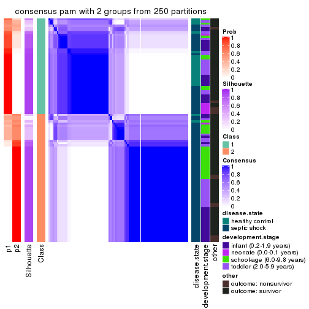</p>

</div>
<div id='tab-MAD-pam-consensus-heatmap-2'>
<pre><code class="r">consensus_heatmap(res, k = 3)
</code></pre>

<p>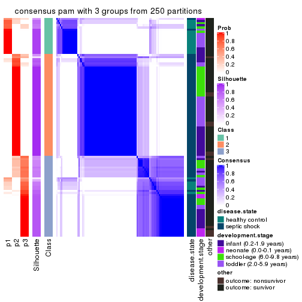</p>

</div>
<div id='tab-MAD-pam-consensus-heatmap-3'>
<pre><code class="r">consensus_heatmap(res, k = 4)
</code></pre>

<p>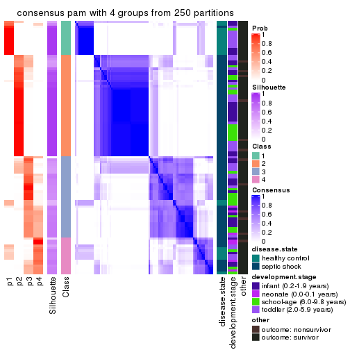</p>

</div>
<div id='tab-MAD-pam-consensus-heatmap-4'>
<pre><code class="r">consensus_heatmap(res, k = 5)
</code></pre>

<p>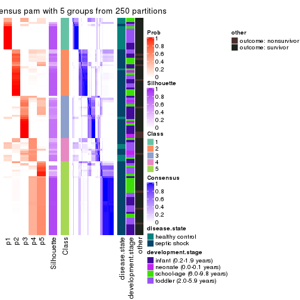</p>

</div>
<div id='tab-MAD-pam-consensus-heatmap-5'>
<pre><code class="r">consensus_heatmap(res, k = 6)
</code></pre>

<p>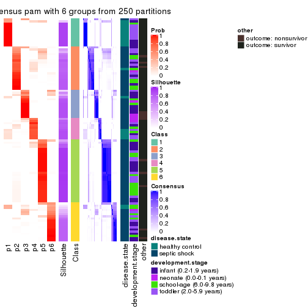</p>

</div>
</div>

Heatmaps for the membership of samples in all partitions to see how consistent they are:


<script>
$( function() {
	$( '#tabs-MAD-pam-membership-heatmap' ).tabs();
} );
</script>
<div id='tabs-MAD-pam-membership-heatmap'>
<ul>
<li><a href='#tab-MAD-pam-membership-heatmap-1'>k = 2</a></li>
<li><a href='#tab-MAD-pam-membership-heatmap-2'>k = 3</a></li>
<li><a href='#tab-MAD-pam-membership-heatmap-3'>k = 4</a></li>
<li><a href='#tab-MAD-pam-membership-heatmap-4'>k = 5</a></li>
<li><a href='#tab-MAD-pam-membership-heatmap-5'>k = 6</a></li>
</ul>
<div id='tab-MAD-pam-membership-heatmap-1'>
<pre><code class="r">membership_heatmap(res, k = 2)
</code></pre>

<p>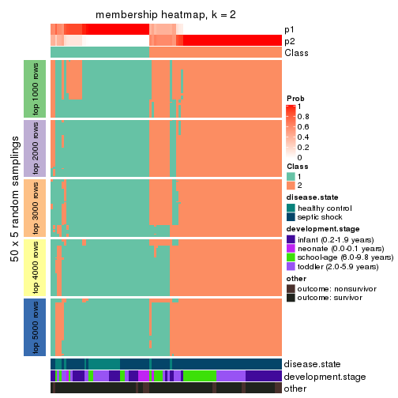</p>

</div>
<div id='tab-MAD-pam-membership-heatmap-2'>
<pre><code class="r">membership_heatmap(res, k = 3)
</code></pre>

<p>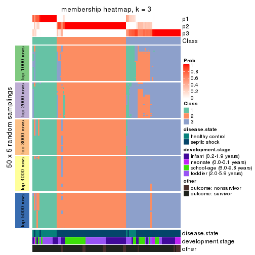</p>

</div>
<div id='tab-MAD-pam-membership-heatmap-3'>
<pre><code class="r">membership_heatmap(res, k = 4)
</code></pre>

<p>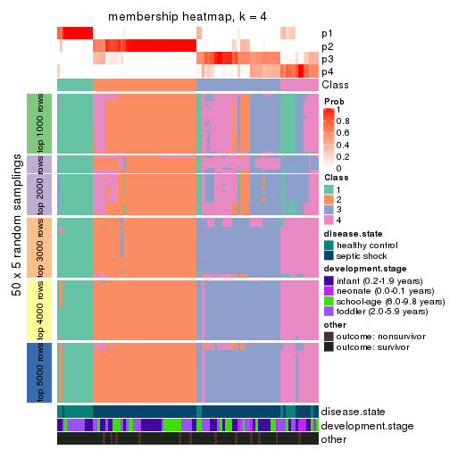</p>

</div>
<div id='tab-MAD-pam-membership-heatmap-4'>
<pre><code class="r">membership_heatmap(res, k = 5)
</code></pre>

<p>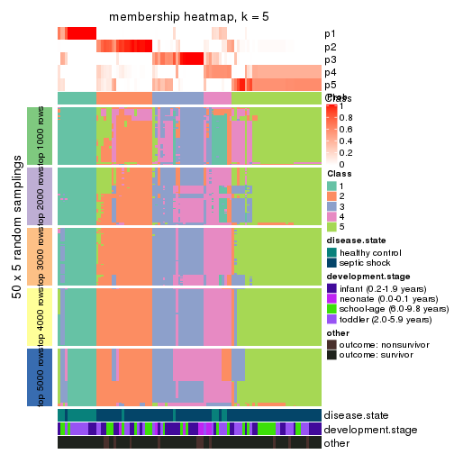</p>

</div>
<div id='tab-MAD-pam-membership-heatmap-5'>
<pre><code class="r">membership_heatmap(res, k = 6)
</code></pre>

<p>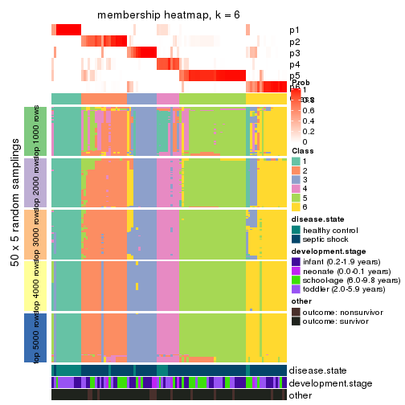</p>

</div>
</div>

As soon as we have had the classes for columns, we can look for signatures
which are significantly different between classes which can be candidate marks
for certain classes. Following are the heatmaps for signatures.


Signature heatmaps where rows are scaled:


<script>
$( function() {
	$( '#tabs-MAD-pam-get-signatures' ).tabs();
} );
</script>
<div id='tabs-MAD-pam-get-signatures'>
<ul>
<li><a href='#tab-MAD-pam-get-signatures-1'>k = 2</a></li>
<li><a href='#tab-MAD-pam-get-signatures-2'>k = 3</a></li>
<li><a href='#tab-MAD-pam-get-signatures-3'>k = 4</a></li>
<li><a href='#tab-MAD-pam-get-signatures-4'>k = 5</a></li>
<li><a href='#tab-MAD-pam-get-signatures-5'>k = 6</a></li>
</ul>
<div id='tab-MAD-pam-get-signatures-1'>
<pre><code class="r">get_signatures(res, k = 2)
</code></pre>

<p>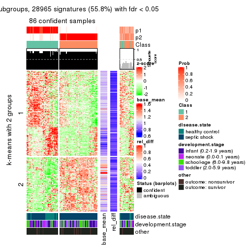</p>

</div>
<div id='tab-MAD-pam-get-signatures-2'>
<pre><code class="r">get_signatures(res, k = 3)
</code></pre>

<p>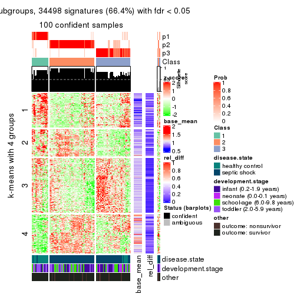</p>

</div>
<div id='tab-MAD-pam-get-signatures-3'>
<pre><code class="r">get_signatures(res, k = 4)
</code></pre>

<p>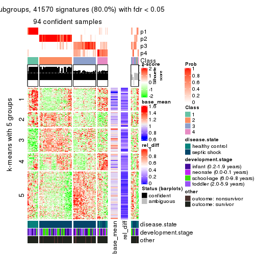</p>

</div>
<div id='tab-MAD-pam-get-signatures-4'>
<pre><code class="r">get_signatures(res, k = 5)
</code></pre>

<p>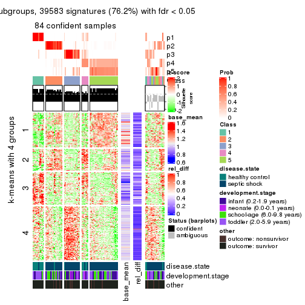</p>

</div>
<div id='tab-MAD-pam-get-signatures-5'>
<pre><code class="r">get_signatures(res, k = 6)
</code></pre>

<p>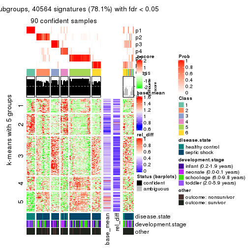</p>

</div>
</div>


Signature heatmaps where rows are not scaled:


<script>
$( function() {
	$( '#tabs-MAD-pam-get-signatures-no-scale' ).tabs();
} );
</script>
<div id='tabs-MAD-pam-get-signatures-no-scale'>
<ul>
<li><a href='#tab-MAD-pam-get-signatures-no-scale-1'>k = 2</a></li>
<li><a href='#tab-MAD-pam-get-signatures-no-scale-2'>k = 3</a></li>
<li><a href='#tab-MAD-pam-get-signatures-no-scale-3'>k = 4</a></li>
<li><a href='#tab-MAD-pam-get-signatures-no-scale-4'>k = 5</a></li>
<li><a href='#tab-MAD-pam-get-signatures-no-scale-5'>k = 6</a></li>
</ul>
<div id='tab-MAD-pam-get-signatures-no-scale-1'>
<pre><code class="r">get_signatures(res, k = 2, scale_rows = FALSE)
</code></pre>

<p>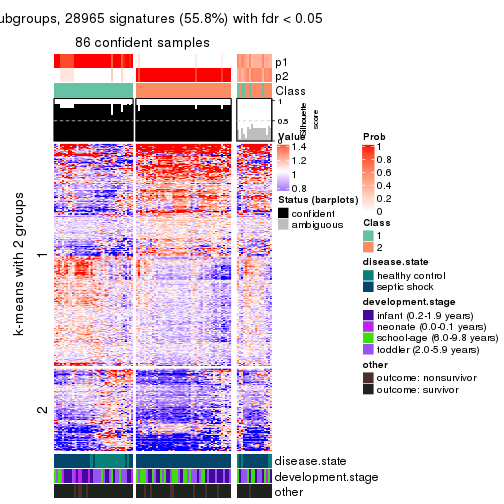</p>

</div>
<div id='tab-MAD-pam-get-signatures-no-scale-2'>
<pre><code class="r">get_signatures(res, k = 3, scale_rows = FALSE)
</code></pre>

<p>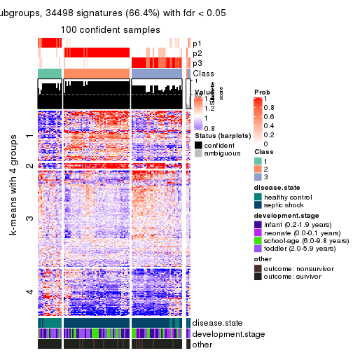</p>

</div>
<div id='tab-MAD-pam-get-signatures-no-scale-3'>
<pre><code class="r">get_signatures(res, k = 4, scale_rows = FALSE)
</code></pre>

<p>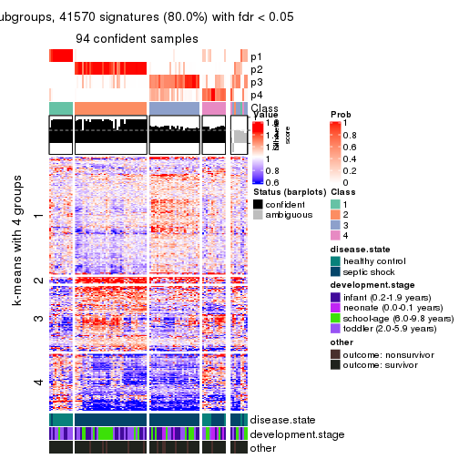</p>

</div>
<div id='tab-MAD-pam-get-signatures-no-scale-4'>
<pre><code class="r">get_signatures(res, k = 5, scale_rows = FALSE)
</code></pre>

<p>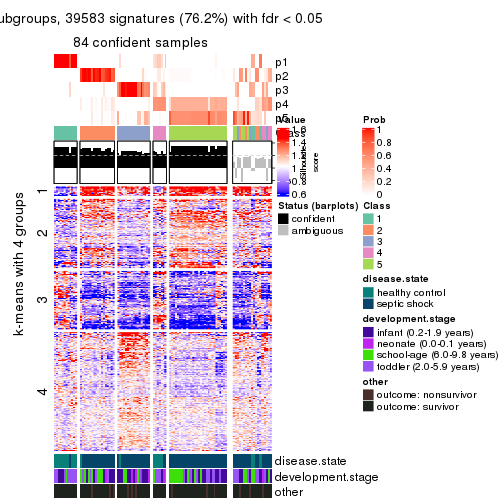</p>

</div>
<div id='tab-MAD-pam-get-signatures-no-scale-5'>
<pre><code class="r">get_signatures(res, k = 6, scale_rows = FALSE)
</code></pre>

<p>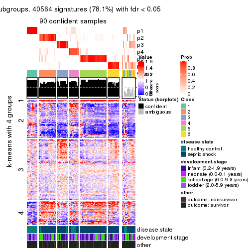</p>

</div>
</div>


Compare the overlap of signatures from different k:

```r
compare_signatures(res)
```

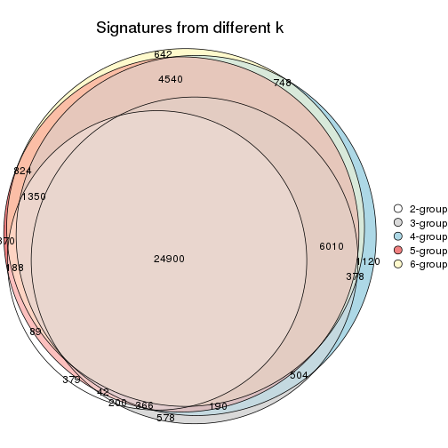

`get_signature()` returns a data frame invisibly. TO get the list of signatures, the function
call should be assigned to a variable explicitly. In following code, if `plot` argument is set
to `FALSE`, no heatmap is plotted while only the differential analysis is performed.

```r
# code only for demonstration
tb = get_signature(res, k = ..., plot = FALSE)
```

An example of the output of `tb` is:

```
#>   which_row         fdr    mean_1    mean_2 scaled_mean_1 scaled_mean_2 km
#> 1        38 0.042760348  8.373488  9.131774    -0.5533452     0.5164555  1
#> 2        40 0.018707592  7.106213  8.469186    -0.6173731     0.5762149  1
#> 3        55 0.019134737 10.221463 11.207825    -0.6159697     0.5749050  1
#> 4        59 0.006059896  5.921854  7.869574    -0.6899429     0.6439467  1
#> 5        60 0.018055526  8.928898 10.211722    -0.6204761     0.5791110  1
#> 6        98 0.009384629 15.714769 14.887706     0.6635654    -0.6193277  2
...
```

The columns in `tb` are:

1. `which_row`: row indices corresponding to the input matrix.
2. `fdr`: FDR for the differential test. 
3. `mean_x`: The mean value in group x.
4. `scaled_mean_x`: The mean value in group x after rows are scaled.
5. `km`: Row groups if k-means clustering is applied to rows.


UMAP plot which shows how samples are separated.


<script>
$( function() {
	$( '#tabs-MAD-pam-dimension-reduction' ).tabs();
} );
</script>
<div id='tabs-MAD-pam-dimension-reduction'>
<ul>
<li><a href='#tab-MAD-pam-dimension-reduction-1'>k = 2</a></li>
<li><a href='#tab-MAD-pam-dimension-reduction-2'>k = 3</a></li>
<li><a href='#tab-MAD-pam-dimension-reduction-3'>k = 4</a></li>
<li><a href='#tab-MAD-pam-dimension-reduction-4'>k = 5</a></li>
<li><a href='#tab-MAD-pam-dimension-reduction-5'>k = 6</a></li>
</ul>
<div id='tab-MAD-pam-dimension-reduction-1'>
<pre><code class="r">dimension_reduction(res, k = 2, method = &quot;UMAP&quot;)
</code></pre>

<p>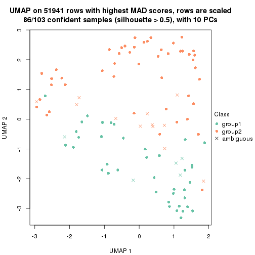</p>

</div>
<div id='tab-MAD-pam-dimension-reduction-2'>
<pre><code class="r">dimension_reduction(res, k = 3, method = &quot;UMAP&quot;)
</code></pre>

<p>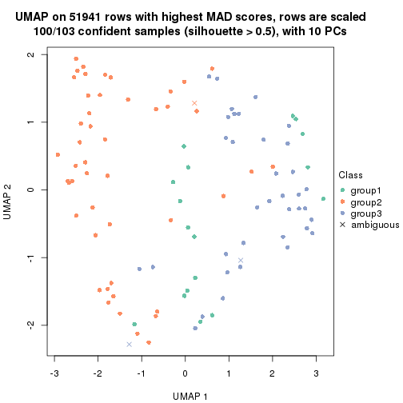</p>

</div>
<div id='tab-MAD-pam-dimension-reduction-3'>
<pre><code class="r">dimension_reduction(res, k = 4, method = &quot;UMAP&quot;)
</code></pre>

<p>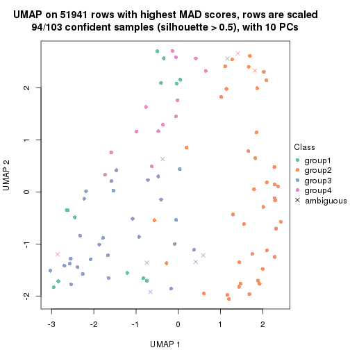</p>

</div>
<div id='tab-MAD-pam-dimension-reduction-4'>
<pre><code class="r">dimension_reduction(res, k = 5, method = &quot;UMAP&quot;)
</code></pre>

<p>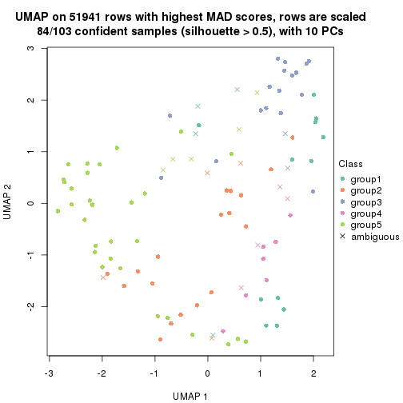</p>

</div>
<div id='tab-MAD-pam-dimension-reduction-5'>
<pre><code class="r">dimension_reduction(res, k = 6, method = &quot;UMAP&quot;)
</code></pre>

<p>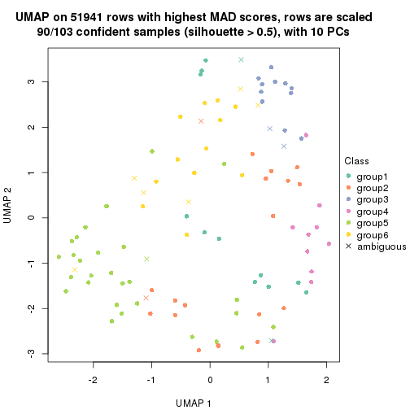</p>

</div>
</div>


Following heatmap shows how subgroups are split when increasing `k`:

```r
collect_classes(res)
```

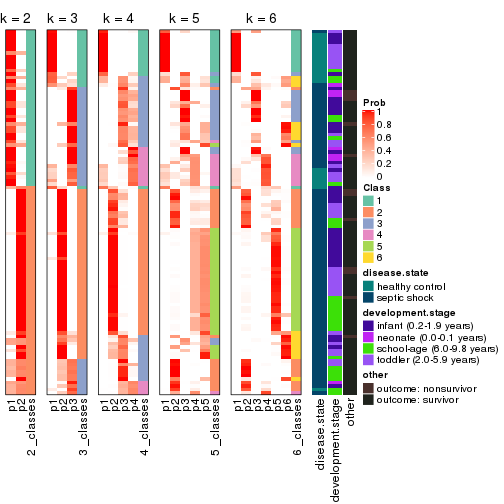


Test correlation between subgroups and known annotations. If the known
annotation is numeric, one-way ANOVA test is applied, and if the known
annotation is discrete, chi-squared contingency table test is applied.

```r
test_to_known_factors(res)
```

```
#>           n disease.state(p) development.stage(p) other(p) k
#> MAD:pam  86         1.74e-06              0.02199    0.751 2
#> MAD:pam 100         3.34e-14              0.05960    0.278 3
#> MAD:pam  94         1.72e-14              0.00825    0.395 4
#> MAD:pam  84         5.01e-12              0.00749    0.431 5
#> MAD:pam  90         3.22e-12              0.02648    0.536 6
```


If matrix rows can be associated to genes, consider to use `functional_enrichment(res,
...)` to perform function enrichment for the signature genes. See [this vignette](http://bioconductor.org/packages/devel/bioc/vignettes/cola/inst/doc/functional_enrichment.html) for more detailed explanations.


 

---------------------------------------------------


### MAD:mclust


The object with results only for a single top-value method and a single partition method 
can be extracted as:

```r
res = res_list["MAD", "mclust"]
# you can also extract it by
# res = res_list["MAD:mclust"]
```

A summary of `res` and all the functions that can be applied to it:

```r
res
```

```
#> A 'ConsensusPartition' object with k = 2, 3, 4, 5, 6.
#>   On a matrix with 51941 rows and 103 columns.
#>   Top rows (1000, 2000, 3000, 4000, 5000) are extracted by 'MAD' method.
#>   Subgroups are detected by 'mclust' method.
#>   Performed in total 1250 partitions by row resampling.
#>   Best k for subgroups seems to be 2.
#> 
#> Following methods can be applied to this 'ConsensusPartition' object:
#>  [1] "cola_report"             "collect_classes"         "collect_plots"          
#>  [4] "collect_stats"           "colnames"                "compare_signatures"     
#>  [7] "consensus_heatmap"       "dimension_reduction"     "functional_enrichment"  
#> [10] "get_anno_col"            "get_anno"                "get_classes"            
#> [13] "get_consensus"           "get_matrix"              "get_membership"         
#> [16] "get_param"               "get_signatures"          "get_stats"              
#> [19] "is_best_k"               "is_stable_k"             "membership_heatmap"     
#> [22] "ncol"                    "nrow"                    "plot_ecdf"              
#> [25] "rownames"                "select_partition_number" "show"                   
#> [28] "suggest_best_k"          "test_to_known_factors"
```

`collect_plots()` function collects all the plots made from `res` for all `k` (number of partitions)
into one single page to provide an easy and fast comparison between different `k`.

```r
collect_plots(res)
```

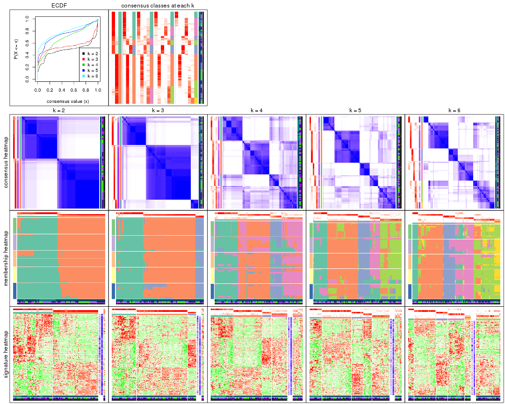

The plots are:

- The first row: a plot of the ECDF (empirical cumulative distribution
  function) curves of the consensus matrix for each `k` and the heatmap of
  predicted classes for each `k`.
- The second row: heatmaps of the consensus matrix for each `k`.
- The third row: heatmaps of the membership matrix for each `k`.
- The fouth row: heatmaps of the signatures for each `k`.

All the plots in panels can be made by individual functions and they are
plotted later in this section.

`select_partition_number()` produces several plots showing different
statistics for choosing "optimized" `k`. There are following statistics:

- ECDF curves of the consensus matrix for each `k`;
- 1-PAC. [The PAC
  score](https://en.wikipedia.org/wiki/Consensus_clustering#Over-interpretation_potential_of_consensus_clustering)
  measures the proportion of the ambiguous subgrouping.
- Mean silhouette score.
- Concordance. The mean probability of fiting the consensus class ids in all
  partitions.
- Area increased. Denote $A_k$ as the area under the ECDF curve for current
  `k`, the area increased is defined as $A_k - A_{k-1}$.
- Rand index. The percent of pairs of samples that are both in a same cluster
  or both are not in a same cluster in the partition of k and k-1.
- Jaccard index. The ratio of pairs of samples are both in a same cluster in
  the partition of k and k-1 and the pairs of samples are both in a same
  cluster in the partition k or k-1.

The detailed explanations of these statistics can be found in [the _cola_
vignette](http://bioconductor.org/packages/devel/bioc/vignettes/cola/inst/doc/cola.html#toc_13).

Generally speaking, lower PAC score, higher mean silhouette score or higher
concordance corresponds to better partition. Rand index and Jaccard index
measure how similar the current partition is compared to partition with `k-1`.
If they are too similar, we won't accept `k` is better than `k-1`.

```r
select_partition_number(res)
```

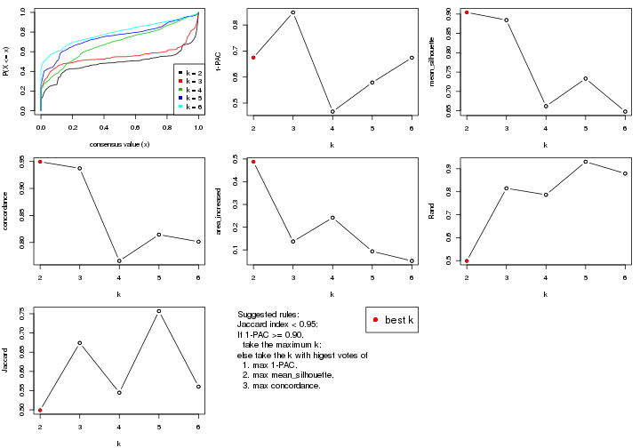

The numeric values for all these statistics can be obtained by `get_stats()`.

```r
get_stats(res)
```

```
#>   k 1-PAC mean_silhouette concordance area_increased  Rand Jaccard
#> 2 2 0.675           0.904       0.950         0.4879 0.499   0.499
#> 3 3 0.848           0.885       0.937         0.1371 0.815   0.674
#> 4 4 0.467           0.662       0.766         0.2419 0.787   0.545
#> 5 5 0.579           0.733       0.814         0.0935 0.931   0.757
#> 6 6 0.674           0.648       0.801         0.0515 0.879   0.560
```

`suggest_best_k()` suggests the best $k$ based on these statistics. The rules are as follows:

- All $k$ with Jaccard index larger than 0.95 are removed because increasing
  $k$ does not provide enough extra information. If all $k$ are removed, it is
  marked as no subgroup is detected.
- For all $k$ with 1-PAC score larger than 0.9, the maximal $k$ is taken as
  the best $k$, and other $k$ are marked as optional $k$.
- If it does not fit the second rule. The $k$ with the maximal vote of the
  highest 1-PAC score, highest mean silhouette, and highest concordance is
  taken as the best $k$.

```r
suggest_best_k(res)
```

```
#> [1] 2
```


Following shows the table of the partitions (You need to click the **show/hide
code output** link to see it). The membership matrix (columns with name `p*`)
is inferred by
[`clue::cl_consensus()`](https://www.rdocumentation.org/link/cl_consensus?package=clue)
function with the `SE` method. Basically the value in the membership matrix
represents the probability to belong to a certain group. The finall class
label for an item is determined with the group with highest probability it
belongs to.

In `get_classes()` function, the entropy is calculated from the membership
matrix and the silhouette score is calculated from the consensus matrix.


<script>
$( function() {
	$( '#tabs-MAD-mclust-get-classes' ).tabs();
} );
</script>
<div id='tabs-MAD-mclust-get-classes'>
<ul>
<li><a href='#tab-MAD-mclust-get-classes-1'>k = 2</a></li>
<li><a href='#tab-MAD-mclust-get-classes-2'>k = 3</a></li>
<li><a href='#tab-MAD-mclust-get-classes-3'>k = 4</a></li>
<li><a href='#tab-MAD-mclust-get-classes-4'>k = 5</a></li>
<li><a href='#tab-MAD-mclust-get-classes-5'>k = 6</a></li>
</ul>

<div id='tab-MAD-mclust-get-classes-1'>
<p><a id='tab-MAD-mclust-get-classes-1-a' style='color:#0366d6' href='#'>show/hide code output</a></p>
<pre><code class="r">cbind(get_classes(res, k = 2), get_membership(res, k = 2))
</code></pre>

<pre><code>#&gt;           class entropy silhouette    p1    p2
#&gt; GSM647569     1  0.4939     0.9035 0.892 0.108
#&gt; GSM647574     1  0.4939     0.9035 0.892 0.108
#&gt; GSM647577     1  0.4939     0.9035 0.892 0.108
#&gt; GSM647547     1  0.0672     0.9289 0.992 0.008
#&gt; GSM647552     1  0.5737     0.8797 0.864 0.136
#&gt; GSM647553     1  0.4298     0.9105 0.912 0.088
#&gt; GSM647565     1  0.5408     0.8910 0.876 0.124
#&gt; GSM647545     2  0.0000     0.9576 0.000 1.000
#&gt; GSM647549     2  0.0000     0.9576 0.000 1.000
#&gt; GSM647550     2  0.1414     0.9523 0.020 0.980
#&gt; GSM647560     2  0.6531     0.7927 0.168 0.832
#&gt; GSM647617     1  0.4939     0.9035 0.892 0.108
#&gt; GSM647528     2  0.0000     0.9576 0.000 1.000
#&gt; GSM647529     1  0.1184     0.9259 0.984 0.016
#&gt; GSM647531     2  0.0376     0.9567 0.004 0.996
#&gt; GSM647540     2  0.8955     0.5280 0.312 0.688
#&gt; GSM647541     2  0.1414     0.9523 0.020 0.980
#&gt; GSM647546     1  0.5408     0.8910 0.876 0.124
#&gt; GSM647557     2  0.1414     0.9523 0.020 0.980
#&gt; GSM647561     2  0.0000     0.9576 0.000 1.000
#&gt; GSM647567     1  0.8909     0.6318 0.692 0.308
#&gt; GSM647568     2  0.3431     0.9190 0.064 0.936
#&gt; GSM647570     2  0.0000     0.9576 0.000 1.000
#&gt; GSM647573     1  0.0376     0.9290 0.996 0.004
#&gt; GSM647576     2  0.9977     0.0168 0.472 0.528
#&gt; GSM647579     1  0.8386     0.7047 0.732 0.268
#&gt; GSM647580     1  0.4939     0.9035 0.892 0.108
#&gt; GSM647583     1  0.4939     0.9035 0.892 0.108
#&gt; GSM647592     2  0.1184     0.9536 0.016 0.984
#&gt; GSM647593     2  0.0000     0.9576 0.000 1.000
#&gt; GSM647595     2  0.0000     0.9576 0.000 1.000
#&gt; GSM647597     1  0.1843     0.9220 0.972 0.028
#&gt; GSM647598     2  0.0000     0.9576 0.000 1.000
#&gt; GSM647613     2  0.0000     0.9576 0.000 1.000
#&gt; GSM647615     2  0.9491     0.3846 0.368 0.632
#&gt; GSM647616     1  0.4939     0.9035 0.892 0.108
#&gt; GSM647619     2  0.0000     0.9576 0.000 1.000
#&gt; GSM647582     2  0.1414     0.9523 0.020 0.980
#&gt; GSM647591     2  0.0000     0.9576 0.000 1.000
#&gt; GSM647527     2  0.0000     0.9576 0.000 1.000
#&gt; GSM647530     2  0.6048     0.8368 0.148 0.852
#&gt; GSM647532     1  0.0000     0.9289 1.000 0.000
#&gt; GSM647544     2  0.0000     0.9576 0.000 1.000
#&gt; GSM647551     2  0.2778     0.9337 0.048 0.952
#&gt; GSM647556     1  0.4939     0.9035 0.892 0.108
#&gt; GSM647558     2  0.0000     0.9576 0.000 1.000
#&gt; GSM647572     1  0.8016     0.7435 0.756 0.244
#&gt; GSM647578     2  0.2778     0.9341 0.048 0.952
#&gt; GSM647581     2  0.0000     0.9576 0.000 1.000
#&gt; GSM647594     2  0.1414     0.9523 0.020 0.980
#&gt; GSM647599     1  0.0000     0.9289 1.000 0.000
#&gt; GSM647600     1  0.9427     0.5183 0.640 0.360
#&gt; GSM647601     2  0.0000     0.9576 0.000 1.000
#&gt; GSM647603     2  0.5408     0.8519 0.124 0.876
#&gt; GSM647610     2  0.2948     0.9310 0.052 0.948
#&gt; GSM647611     2  0.0000     0.9576 0.000 1.000
#&gt; GSM647612     2  0.1414     0.9523 0.020 0.980
#&gt; GSM647614     2  0.1843     0.9481 0.028 0.972
#&gt; GSM647618     2  0.0000     0.9576 0.000 1.000
#&gt; GSM647629     2  0.2236     0.9427 0.036 0.964
#&gt; GSM647535     2  0.0000     0.9576 0.000 1.000
#&gt; GSM647563     2  0.0000     0.9576 0.000 1.000
#&gt; GSM647542     2  0.1633     0.9503 0.024 0.976
#&gt; GSM647543     2  0.2423     0.9401 0.040 0.960
#&gt; GSM647548     1  0.1843     0.9253 0.972 0.028
#&gt; GSM647554     2  0.1414     0.9523 0.020 0.980
#&gt; GSM647555     2  0.1414     0.9523 0.020 0.980
#&gt; GSM647559     2  0.0000     0.9576 0.000 1.000
#&gt; GSM647562     2  0.0000     0.9576 0.000 1.000
#&gt; GSM647564     1  0.4939     0.9035 0.892 0.108
#&gt; GSM647571     2  0.2423     0.9401 0.040 0.960
#&gt; GSM647584     2  0.0000     0.9576 0.000 1.000
#&gt; GSM647585     1  0.4939     0.9035 0.892 0.108
#&gt; GSM647586     2  0.0000     0.9576 0.000 1.000
#&gt; GSM647587     2  0.0000     0.9576 0.000 1.000
#&gt; GSM647588     2  0.0000     0.9576 0.000 1.000
#&gt; GSM647596     2  0.0000     0.9576 0.000 1.000
#&gt; GSM647602     1  0.4939     0.9035 0.892 0.108
#&gt; GSM647609     2  0.0000     0.9576 0.000 1.000
#&gt; GSM647620     2  0.0000     0.9576 0.000 1.000
#&gt; GSM647627     2  0.0000     0.9576 0.000 1.000
#&gt; GSM647628     2  0.0000     0.9576 0.000 1.000
#&gt; GSM647533     1  0.0000     0.9289 1.000 0.000
#&gt; GSM647536     1  0.0000     0.9289 1.000 0.000
#&gt; GSM647537     1  0.0000     0.9289 1.000 0.000
#&gt; GSM647606     1  0.0000     0.9289 1.000 0.000
#&gt; GSM647621     1  0.0000     0.9289 1.000 0.000
#&gt; GSM647626     1  0.4815     0.9049 0.896 0.104
#&gt; GSM647538     1  0.0000     0.9289 1.000 0.000
#&gt; GSM647575     1  0.0000     0.9289 1.000 0.000
#&gt; GSM647590     1  0.0000     0.9289 1.000 0.000
#&gt; GSM647605     1  0.0000     0.9289 1.000 0.000
#&gt; GSM647607     1  0.0000     0.9289 1.000 0.000
#&gt; GSM647608     1  0.0000     0.9289 1.000 0.000
#&gt; GSM647622     1  0.0000     0.9289 1.000 0.000
#&gt; GSM647623     1  0.0000     0.9289 1.000 0.000
#&gt; GSM647624     1  0.0000     0.9289 1.000 0.000
#&gt; GSM647625     1  0.0000     0.9289 1.000 0.000
#&gt; GSM647534     1  0.0938     0.9286 0.988 0.012
#&gt; GSM647539     1  0.0000     0.9289 1.000 0.000
#&gt; GSM647566     1  0.0376     0.9291 0.996 0.004
#&gt; GSM647589     1  0.0000     0.9289 1.000 0.000
#&gt; GSM647604     1  0.0000     0.9289 1.000 0.000
</code></pre>

<script>
$('#tab-MAD-mclust-get-classes-1-a').parent().next().next().hide();
$('#tab-MAD-mclust-get-classes-1-a').click(function(){
  $('#tab-MAD-mclust-get-classes-1-a').parent().next().next().toggle();
  return(false);
});
</script>
</div>

<div id='tab-MAD-mclust-get-classes-2'>
<p><a id='tab-MAD-mclust-get-classes-2-a' style='color:#0366d6' href='#'>show/hide code output</a></p>
<pre><code class="r">cbind(get_classes(res, k = 3), get_membership(res, k = 3))
</code></pre>

<pre><code>#&gt;           class entropy silhouette    p1    p2    p3
#&gt; GSM647569     3  0.3116      0.943 0.108 0.000 0.892
#&gt; GSM647574     1  0.5882      0.432 0.652 0.000 0.348
#&gt; GSM647577     3  0.1643      0.961 0.044 0.000 0.956
#&gt; GSM647547     1  0.1753      0.859 0.952 0.000 0.048
#&gt; GSM647552     2  0.7576      0.556 0.276 0.648 0.076
#&gt; GSM647553     1  0.5591      0.524 0.696 0.000 0.304
#&gt; GSM647565     1  0.6168      0.320 0.588 0.412 0.000
#&gt; GSM647545     2  0.0000      0.948 0.000 1.000 0.000
#&gt; GSM647549     2  0.0000      0.948 0.000 1.000 0.000
#&gt; GSM647550     2  0.2066      0.936 0.000 0.940 0.060
#&gt; GSM647560     2  0.3670      0.909 0.020 0.888 0.092
#&gt; GSM647617     3  0.1643      0.961 0.044 0.000 0.956
#&gt; GSM647528     2  0.0000      0.948 0.000 1.000 0.000
#&gt; GSM647529     1  0.0237      0.886 0.996 0.004 0.000
#&gt; GSM647531     2  0.0000      0.948 0.000 1.000 0.000
#&gt; GSM647540     2  0.4316      0.890 0.044 0.868 0.088
#&gt; GSM647541     2  0.2200      0.936 0.004 0.940 0.056
#&gt; GSM647546     2  0.8298      0.530 0.152 0.628 0.220
#&gt; GSM647557     2  0.0000      0.948 0.000 1.000 0.000
#&gt; GSM647561     2  0.0000      0.948 0.000 1.000 0.000
#&gt; GSM647567     2  0.2955      0.914 0.080 0.912 0.008
#&gt; GSM647568     2  0.3572      0.916 0.040 0.900 0.060
#&gt; GSM647570     2  0.0237      0.948 0.000 0.996 0.004
#&gt; GSM647573     1  0.1643      0.862 0.956 0.000 0.044
#&gt; GSM647576     2  0.4316      0.890 0.044 0.868 0.088
#&gt; GSM647579     2  0.5737      0.818 0.104 0.804 0.092
#&gt; GSM647580     3  0.1643      0.961 0.044 0.000 0.956
#&gt; GSM647583     3  0.1643      0.961 0.044 0.000 0.956
#&gt; GSM647592     2  0.1315      0.945 0.008 0.972 0.020
#&gt; GSM647593     2  0.0892      0.946 0.000 0.980 0.020
#&gt; GSM647595     2  0.0892      0.946 0.000 0.980 0.020
#&gt; GSM647597     1  0.4605      0.636 0.796 0.204 0.000
#&gt; GSM647598     2  0.0000      0.948 0.000 1.000 0.000
#&gt; GSM647613     2  0.0000      0.948 0.000 1.000 0.000
#&gt; GSM647615     2  0.3481      0.917 0.044 0.904 0.052
#&gt; GSM647616     3  0.1643      0.961 0.044 0.000 0.956
#&gt; GSM647619     2  0.0892      0.946 0.000 0.980 0.020
#&gt; GSM647582     2  0.2599      0.935 0.016 0.932 0.052
#&gt; GSM647591     2  0.0892      0.946 0.000 0.980 0.020
#&gt; GSM647527     2  0.0000      0.948 0.000 1.000 0.000
#&gt; GSM647530     1  0.6260      0.225 0.552 0.448 0.000
#&gt; GSM647532     1  0.0000      0.887 1.000 0.000 0.000
#&gt; GSM647544     2  0.0000      0.948 0.000 1.000 0.000
#&gt; GSM647551     2  0.1860      0.942 0.000 0.948 0.052
#&gt; GSM647556     3  0.3619      0.913 0.136 0.000 0.864
#&gt; GSM647558     2  0.0237      0.948 0.000 0.996 0.004
#&gt; GSM647572     2  0.5435      0.827 0.048 0.808 0.144
#&gt; GSM647578     2  0.2846      0.930 0.020 0.924 0.056
#&gt; GSM647581     2  0.0000      0.948 0.000 1.000 0.000
#&gt; GSM647594     2  0.2261      0.923 0.068 0.932 0.000
#&gt; GSM647599     1  0.0000      0.887 1.000 0.000 0.000
#&gt; GSM647600     2  0.4316      0.890 0.044 0.868 0.088
#&gt; GSM647601     2  0.0892      0.946 0.000 0.980 0.020
#&gt; GSM647603     2  0.3587      0.910 0.020 0.892 0.088
#&gt; GSM647610     2  0.2176      0.939 0.020 0.948 0.032
#&gt; GSM647611     2  0.0237      0.948 0.000 0.996 0.004
#&gt; GSM647612     2  0.2947      0.929 0.020 0.920 0.060
#&gt; GSM647614     2  0.2846      0.931 0.020 0.924 0.056
#&gt; GSM647618     2  0.0000      0.948 0.000 1.000 0.000
#&gt; GSM647629     2  0.2846      0.930 0.020 0.924 0.056
#&gt; GSM647535     2  0.0237      0.948 0.000 0.996 0.004
#&gt; GSM647563     2  0.0000      0.948 0.000 1.000 0.000
#&gt; GSM647542     2  0.2947      0.929 0.020 0.920 0.060
#&gt; GSM647543     2  0.2947      0.929 0.020 0.920 0.060
#&gt; GSM647548     1  0.4887      0.606 0.772 0.228 0.000
#&gt; GSM647554     2  0.2448      0.934 0.000 0.924 0.076
#&gt; GSM647555     2  0.2066      0.936 0.000 0.940 0.060
#&gt; GSM647559     2  0.0000      0.948 0.000 1.000 0.000
#&gt; GSM647562     2  0.0000      0.948 0.000 1.000 0.000
#&gt; GSM647564     3  0.3116      0.943 0.108 0.000 0.892
#&gt; GSM647571     2  0.3356      0.922 0.036 0.908 0.056
#&gt; GSM647584     2  0.0892      0.946 0.000 0.980 0.020
#&gt; GSM647585     3  0.3192      0.940 0.112 0.000 0.888
#&gt; GSM647586     2  0.0000      0.948 0.000 1.000 0.000
#&gt; GSM647587     2  0.0000      0.948 0.000 1.000 0.000
#&gt; GSM647588     2  0.0000      0.948 0.000 1.000 0.000
#&gt; GSM647596     2  0.0000      0.948 0.000 1.000 0.000
#&gt; GSM647602     3  0.1964      0.960 0.056 0.000 0.944
#&gt; GSM647609     2  0.0892      0.946 0.000 0.980 0.020
#&gt; GSM647620     2  0.0000      0.948 0.000 1.000 0.000
#&gt; GSM647627     2  0.0000      0.948 0.000 1.000 0.000
#&gt; GSM647628     2  0.0237      0.948 0.000 0.996 0.004
#&gt; GSM647533     1  0.0892      0.880 0.980 0.000 0.020
#&gt; GSM647536     1  0.0000      0.887 1.000 0.000 0.000
#&gt; GSM647537     1  0.0892      0.880 0.980 0.000 0.020
#&gt; GSM647606     1  0.0892      0.880 0.980 0.000 0.020
#&gt; GSM647621     1  0.0000      0.887 1.000 0.000 0.000
#&gt; GSM647626     1  0.4504      0.693 0.804 0.000 0.196
#&gt; GSM647538     1  0.0892      0.880 0.980 0.000 0.020
#&gt; GSM647575     1  0.0000      0.887 1.000 0.000 0.000
#&gt; GSM647590     1  0.0000      0.887 1.000 0.000 0.000
#&gt; GSM647605     1  0.0000      0.887 1.000 0.000 0.000
#&gt; GSM647607     1  0.0000      0.887 1.000 0.000 0.000
#&gt; GSM647608     1  0.0000      0.887 1.000 0.000 0.000
#&gt; GSM647622     1  0.0892      0.880 0.980 0.000 0.020
#&gt; GSM647623     1  0.0892      0.880 0.980 0.000 0.020
#&gt; GSM647624     1  0.0000      0.887 1.000 0.000 0.000
#&gt; GSM647625     1  0.0892      0.880 0.980 0.000 0.020
#&gt; GSM647534     1  0.1964      0.839 0.944 0.056 0.000
#&gt; GSM647539     1  0.1163      0.869 0.972 0.028 0.000
#&gt; GSM647566     1  0.0000      0.887 1.000 0.000 0.000
#&gt; GSM647589     1  0.0000      0.887 1.000 0.000 0.000
#&gt; GSM647604     1  0.0000      0.887 1.000 0.000 0.000
</code></pre>

<script>
$('#tab-MAD-mclust-get-classes-2-a').parent().next().next().hide();
$('#tab-MAD-mclust-get-classes-2-a').click(function(){
  $('#tab-MAD-mclust-get-classes-2-a').parent().next().next().toggle();
  return(false);
});
</script>
</div>

<div id='tab-MAD-mclust-get-classes-3'>
<p><a id='tab-MAD-mclust-get-classes-3-a' style='color:#0366d6' href='#'>show/hide code output</a></p>
<pre><code class="r">cbind(get_classes(res, k = 4), get_membership(res, k = 4))
</code></pre>

<pre><code>#&gt;           class entropy silhouette    p1    p2    p3    p4
#&gt; GSM647569     3  0.5770     0.7621 0.148 0.000 0.712 0.140
#&gt; GSM647574     3  0.7307     0.3418 0.404 0.000 0.444 0.152
#&gt; GSM647577     3  0.3377     0.7725 0.012 0.000 0.848 0.140
#&gt; GSM647547     1  0.6916     0.5807 0.588 0.000 0.176 0.236
#&gt; GSM647552     4  0.9229     0.1776 0.224 0.220 0.116 0.440
#&gt; GSM647553     3  0.7313     0.3051 0.416 0.000 0.432 0.152
#&gt; GSM647565     4  0.6074    -0.3808 0.456 0.044 0.000 0.500
#&gt; GSM647545     2  0.4040     0.6051 0.000 0.752 0.000 0.248
#&gt; GSM647549     2  0.4250     0.5635 0.000 0.724 0.000 0.276
#&gt; GSM647550     4  0.4331     0.6367 0.000 0.288 0.000 0.712
#&gt; GSM647560     4  0.5627     0.7391 0.032 0.200 0.036 0.732
#&gt; GSM647617     3  0.3377     0.7725 0.012 0.000 0.848 0.140
#&gt; GSM647528     2  0.1118     0.7982 0.000 0.964 0.000 0.036
#&gt; GSM647529     1  0.3873     0.8211 0.772 0.000 0.000 0.228
#&gt; GSM647531     2  0.1211     0.7975 0.000 0.960 0.000 0.040
#&gt; GSM647540     4  0.5641     0.6767 0.056 0.096 0.076 0.772
#&gt; GSM647541     4  0.4955     0.5788 0.000 0.344 0.008 0.648
#&gt; GSM647546     4  0.7867    -0.1707 0.148 0.024 0.344 0.484
#&gt; GSM647557     2  0.1211     0.7975 0.000 0.960 0.000 0.040
#&gt; GSM647561     2  0.1118     0.7982 0.000 0.964 0.000 0.036
#&gt; GSM647567     4  0.7652     0.4425 0.288 0.156 0.020 0.536
#&gt; GSM647568     4  0.4004     0.7478 0.024 0.164 0.000 0.812
#&gt; GSM647570     2  0.4431     0.5256 0.000 0.696 0.000 0.304
#&gt; GSM647573     1  0.6613     0.6236 0.596 0.000 0.116 0.288
#&gt; GSM647576     4  0.5342     0.6789 0.044 0.092 0.076 0.788
#&gt; GSM647579     4  0.6721     0.5355 0.148 0.068 0.088 0.696
#&gt; GSM647580     3  0.3377     0.7725 0.012 0.000 0.848 0.140
#&gt; GSM647583     3  0.3377     0.7725 0.012 0.000 0.848 0.140
#&gt; GSM647592     2  0.5325     0.7072 0.044 0.788 0.100 0.068
#&gt; GSM647593     2  0.4405     0.7026 0.000 0.800 0.152 0.048
#&gt; GSM647595     2  0.4405     0.7026 0.000 0.800 0.152 0.048
#&gt; GSM647597     1  0.7001     0.5037 0.580 0.224 0.000 0.196
#&gt; GSM647598     2  0.0000     0.7937 0.000 1.000 0.000 0.000
#&gt; GSM647613     2  0.1302     0.7969 0.000 0.956 0.000 0.044
#&gt; GSM647615     4  0.4956     0.7434 0.044 0.168 0.012 0.776
#&gt; GSM647616     3  0.3377     0.7725 0.012 0.000 0.848 0.140
#&gt; GSM647619     2  0.4322     0.7046 0.000 0.804 0.152 0.044
#&gt; GSM647582     2  0.5773    -0.0672 0.004 0.564 0.024 0.408
#&gt; GSM647591     2  0.4237     0.7068 0.000 0.808 0.152 0.040
#&gt; GSM647527     2  0.1118     0.7982 0.000 0.964 0.000 0.036
#&gt; GSM647530     2  0.7710    -0.1484 0.368 0.408 0.000 0.224
#&gt; GSM647532     1  0.3873     0.8211 0.772 0.000 0.000 0.228
#&gt; GSM647544     2  0.1557     0.7928 0.000 0.944 0.000 0.056
#&gt; GSM647551     2  0.7111    -0.1139 0.004 0.480 0.112 0.404
#&gt; GSM647556     3  0.6698     0.6644 0.256 0.000 0.604 0.140
#&gt; GSM647558     2  0.4331     0.5513 0.000 0.712 0.000 0.288
#&gt; GSM647572     4  0.5401     0.6936 0.052 0.104 0.060 0.784
#&gt; GSM647578     4  0.4745     0.7487 0.036 0.176 0.008 0.780
#&gt; GSM647581     2  0.2281     0.7721 0.000 0.904 0.000 0.096
#&gt; GSM647594     2  0.2732     0.7448 0.076 0.904 0.008 0.012
#&gt; GSM647599     1  0.3105     0.8323 0.856 0.000 0.004 0.140
#&gt; GSM647600     4  0.8357     0.4445 0.148 0.244 0.076 0.532
#&gt; GSM647601     2  0.2335     0.7732 0.000 0.920 0.060 0.020
#&gt; GSM647603     4  0.5752     0.7386 0.036 0.204 0.036 0.724
#&gt; GSM647610     4  0.6442     0.3962 0.068 0.440 0.000 0.492
#&gt; GSM647611     2  0.1398     0.7859 0.000 0.956 0.040 0.004
#&gt; GSM647612     4  0.4008     0.6932 0.000 0.244 0.000 0.756
#&gt; GSM647614     4  0.4262     0.7069 0.008 0.236 0.000 0.756
#&gt; GSM647618     2  0.0592     0.7974 0.000 0.984 0.000 0.016
#&gt; GSM647629     4  0.5772     0.6614 0.024 0.312 0.016 0.648
#&gt; GSM647535     2  0.4679     0.3920 0.000 0.648 0.000 0.352
#&gt; GSM647563     2  0.3311     0.6999 0.000 0.828 0.000 0.172
#&gt; GSM647542     4  0.4137     0.7306 0.012 0.208 0.000 0.780
#&gt; GSM647543     4  0.4284     0.7168 0.012 0.224 0.000 0.764
#&gt; GSM647548     1  0.5088     0.5543 0.572 0.004 0.000 0.424
#&gt; GSM647554     4  0.5634     0.6302 0.008 0.312 0.028 0.652
#&gt; GSM647555     4  0.4406     0.6208 0.000 0.300 0.000 0.700
#&gt; GSM647559     2  0.2469     0.7624 0.000 0.892 0.000 0.108
#&gt; GSM647562     2  0.1557     0.7928 0.000 0.944 0.000 0.056
#&gt; GSM647564     3  0.7216     0.5966 0.148 0.004 0.540 0.308
#&gt; GSM647571     4  0.4054     0.7452 0.016 0.188 0.000 0.796
#&gt; GSM647584     2  0.4405     0.7026 0.000 0.800 0.152 0.048
#&gt; GSM647585     3  0.5770     0.7621 0.148 0.000 0.712 0.140
#&gt; GSM647586     2  0.0707     0.7969 0.000 0.980 0.000 0.020
#&gt; GSM647587     2  0.0707     0.7978 0.000 0.980 0.000 0.020
#&gt; GSM647588     2  0.3801     0.6361 0.000 0.780 0.000 0.220
#&gt; GSM647596     2  0.1389     0.7954 0.000 0.952 0.000 0.048
#&gt; GSM647602     3  0.3999     0.7756 0.036 0.000 0.824 0.140
#&gt; GSM647609     2  0.3013     0.7595 0.000 0.888 0.080 0.032
#&gt; GSM647620     2  0.1677     0.7846 0.000 0.948 0.040 0.012
#&gt; GSM647627     2  0.0188     0.7928 0.000 0.996 0.000 0.004
#&gt; GSM647628     2  0.4406     0.5333 0.000 0.700 0.000 0.300
#&gt; GSM647533     1  0.0188     0.7771 0.996 0.000 0.000 0.004
#&gt; GSM647536     1  0.3873     0.8211 0.772 0.000 0.000 0.228
#&gt; GSM647537     1  0.0188     0.7771 0.996 0.000 0.000 0.004
#&gt; GSM647606     1  0.0188     0.7771 0.996 0.000 0.000 0.004
#&gt; GSM647621     1  0.4284     0.8213 0.780 0.000 0.020 0.200
#&gt; GSM647626     3  0.7142     0.5467 0.324 0.000 0.524 0.152
#&gt; GSM647538     1  0.0188     0.7771 0.996 0.000 0.000 0.004
#&gt; GSM647575     1  0.3873     0.8211 0.772 0.000 0.000 0.228
#&gt; GSM647590     1  0.2345     0.8276 0.900 0.000 0.000 0.100
#&gt; GSM647605     1  0.2345     0.8276 0.900 0.000 0.000 0.100
#&gt; GSM647607     1  0.3873     0.8211 0.772 0.000 0.000 0.228
#&gt; GSM647608     1  0.3123     0.8329 0.844 0.000 0.000 0.156
#&gt; GSM647622     1  0.0188     0.7771 0.996 0.000 0.000 0.004
#&gt; GSM647623     1  0.0188     0.7771 0.996 0.000 0.000 0.004
#&gt; GSM647624     1  0.2345     0.8276 0.900 0.000 0.000 0.100
#&gt; GSM647625     1  0.0188     0.7771 0.996 0.000 0.000 0.004
#&gt; GSM647534     1  0.3754     0.8219 0.852 0.008 0.028 0.112
#&gt; GSM647539     1  0.3942     0.8176 0.764 0.000 0.000 0.236
#&gt; GSM647566     1  0.3999     0.8210 0.824 0.000 0.036 0.140
#&gt; GSM647589     1  0.6753     0.6141 0.608 0.000 0.164 0.228
#&gt; GSM647604     1  0.2345     0.8276 0.900 0.000 0.000 0.100
</code></pre>

<script>
$('#tab-MAD-mclust-get-classes-3-a').parent().next().next().hide();
$('#tab-MAD-mclust-get-classes-3-a').click(function(){
  $('#tab-MAD-mclust-get-classes-3-a').parent().next().next().toggle();
  return(false);
});
</script>
</div>

<div id='tab-MAD-mclust-get-classes-4'>
<p><a id='tab-MAD-mclust-get-classes-4-a' style='color:#0366d6' href='#'>show/hide code output</a></p>
<pre><code class="r">cbind(get_classes(res, k = 5), get_membership(res, k = 5))
</code></pre>

<pre><code>#&gt;           class entropy silhouette    p1    p2    p3    p4    p5
#&gt; GSM647569     3  0.2889      0.896 0.084 0.000 0.880 0.020 0.016
#&gt; GSM647574     3  0.2981      0.894 0.084 0.000 0.876 0.024 0.016
#&gt; GSM647577     3  0.0162      0.860 0.000 0.000 0.996 0.000 0.004
#&gt; GSM647547     4  0.4568      0.614 0.304 0.000 0.012 0.672 0.012
#&gt; GSM647552     5  0.5931      0.563 0.084 0.140 0.000 0.088 0.688
#&gt; GSM647553     3  0.2981      0.894 0.084 0.000 0.876 0.024 0.016
#&gt; GSM647565     4  0.5777      0.573 0.104 0.008 0.000 0.612 0.276
#&gt; GSM647545     2  0.3911      0.734 0.000 0.796 0.000 0.060 0.144
#&gt; GSM647549     2  0.4179      0.715 0.000 0.776 0.000 0.072 0.152
#&gt; GSM647550     5  0.4841      0.684 0.000 0.208 0.000 0.084 0.708
#&gt; GSM647560     5  0.4007      0.661 0.084 0.020 0.076 0.000 0.820
#&gt; GSM647617     3  0.0162      0.860 0.000 0.000 0.996 0.000 0.004
#&gt; GSM647528     2  0.0451      0.851 0.000 0.988 0.000 0.004 0.008
#&gt; GSM647529     4  0.2522      0.817 0.108 0.000 0.000 0.880 0.012
#&gt; GSM647531     2  0.0794      0.845 0.000 0.972 0.000 0.000 0.028
#&gt; GSM647540     5  0.4155      0.638 0.084 0.000 0.080 0.024 0.812
#&gt; GSM647541     5  0.2690      0.708 0.000 0.156 0.000 0.000 0.844
#&gt; GSM647546     3  0.5782      0.588 0.084 0.000 0.640 0.024 0.252
#&gt; GSM647557     2  0.2011      0.839 0.004 0.908 0.000 0.000 0.088
#&gt; GSM647561     2  0.0290      0.850 0.000 0.992 0.000 0.000 0.008
#&gt; GSM647567     5  0.4297      0.647 0.084 0.060 0.008 0.032 0.816
#&gt; GSM647568     5  0.4637      0.692 0.000 0.160 0.000 0.100 0.740
#&gt; GSM647570     2  0.4049      0.743 0.000 0.792 0.000 0.084 0.124
#&gt; GSM647573     4  0.3544      0.787 0.164 0.000 0.008 0.812 0.016
#&gt; GSM647576     5  0.4212      0.637 0.084 0.000 0.084 0.024 0.808
#&gt; GSM647579     5  0.5052      0.581 0.084 0.000 0.156 0.024 0.736
#&gt; GSM647580     3  0.0162      0.860 0.000 0.000 0.996 0.000 0.004
#&gt; GSM647583     3  0.0162      0.860 0.000 0.000 0.996 0.000 0.004
#&gt; GSM647592     2  0.3805      0.778 0.008 0.784 0.000 0.016 0.192
#&gt; GSM647593     2  0.3866      0.772 0.000 0.780 0.004 0.024 0.192
#&gt; GSM647595     2  0.3866      0.772 0.000 0.780 0.004 0.024 0.192
#&gt; GSM647597     4  0.6885      0.466 0.112 0.228 0.000 0.576 0.084
#&gt; GSM647598     2  0.0451      0.849 0.000 0.988 0.000 0.008 0.004
#&gt; GSM647613     2  0.0609      0.848 0.000 0.980 0.000 0.000 0.020
#&gt; GSM647615     5  0.5544      0.672 0.084 0.168 0.000 0.044 0.704
#&gt; GSM647616     3  0.0162      0.860 0.000 0.000 0.996 0.000 0.004
#&gt; GSM647619     2  0.3866      0.772 0.000 0.780 0.004 0.024 0.192
#&gt; GSM647582     5  0.4464      0.218 0.000 0.408 0.000 0.008 0.584
#&gt; GSM647591     2  0.3583      0.777 0.000 0.792 0.004 0.012 0.192
#&gt; GSM647527     2  0.0451      0.851 0.000 0.988 0.000 0.004 0.008
#&gt; GSM647530     2  0.6132      0.283 0.092 0.580 0.000 0.304 0.024
#&gt; GSM647532     4  0.2574      0.818 0.112 0.000 0.000 0.876 0.012
#&gt; GSM647544     2  0.0510      0.849 0.000 0.984 0.000 0.000 0.016
#&gt; GSM647551     5  0.4508      0.334 0.000 0.332 0.000 0.020 0.648
#&gt; GSM647556     3  0.2889      0.896 0.084 0.000 0.880 0.020 0.016
#&gt; GSM647558     2  0.4049      0.742 0.000 0.792 0.000 0.084 0.124
#&gt; GSM647572     5  0.4571      0.642 0.084 0.012 0.076 0.028 0.800
#&gt; GSM647578     5  0.3815      0.688 0.080 0.088 0.000 0.008 0.824
#&gt; GSM647581     2  0.2127      0.791 0.000 0.892 0.000 0.000 0.108
#&gt; GSM647594     2  0.3678      0.782 0.040 0.816 0.000 0.004 0.140
#&gt; GSM647599     1  0.3383      0.777 0.856 0.000 0.072 0.060 0.012
#&gt; GSM647600     5  0.4463      0.634 0.076 0.112 0.000 0.024 0.788
#&gt; GSM647601     2  0.3438      0.788 0.000 0.808 0.000 0.020 0.172
#&gt; GSM647603     5  0.2913      0.678 0.080 0.032 0.004 0.004 0.880
#&gt; GSM647610     5  0.2864      0.641 0.000 0.112 0.000 0.024 0.864
#&gt; GSM647611     2  0.2763      0.810 0.000 0.848 0.000 0.004 0.148
#&gt; GSM647612     5  0.5505      0.563 0.000 0.304 0.000 0.092 0.604
#&gt; GSM647614     5  0.5717      0.434 0.000 0.368 0.000 0.092 0.540
#&gt; GSM647618     2  0.0290      0.850 0.000 0.992 0.000 0.000 0.008
#&gt; GSM647629     5  0.2230      0.658 0.000 0.116 0.000 0.000 0.884
#&gt; GSM647535     2  0.3039      0.746 0.000 0.808 0.000 0.000 0.192
#&gt; GSM647563     2  0.2127      0.791 0.000 0.892 0.000 0.000 0.108
#&gt; GSM647542     5  0.5216      0.640 0.000 0.248 0.000 0.092 0.660
#&gt; GSM647543     5  0.4535      0.692 0.000 0.160 0.000 0.092 0.748
#&gt; GSM647548     4  0.4841      0.701 0.104 0.004 0.000 0.732 0.160
#&gt; GSM647554     5  0.2674      0.643 0.000 0.120 0.000 0.012 0.868
#&gt; GSM647555     5  0.5599      0.521 0.000 0.328 0.000 0.092 0.580
#&gt; GSM647559     2  0.1851      0.809 0.000 0.912 0.000 0.000 0.088
#&gt; GSM647562     2  0.0404      0.850 0.000 0.988 0.000 0.000 0.012
#&gt; GSM647564     3  0.2889      0.896 0.084 0.000 0.880 0.020 0.016
#&gt; GSM647571     5  0.5707      0.450 0.000 0.364 0.000 0.092 0.544
#&gt; GSM647584     2  0.3866      0.772 0.000 0.780 0.004 0.024 0.192
#&gt; GSM647585     3  0.2889      0.896 0.084 0.000 0.880 0.020 0.016
#&gt; GSM647586     2  0.0451      0.850 0.000 0.988 0.000 0.008 0.004
#&gt; GSM647587     2  0.0162      0.850 0.000 0.996 0.000 0.000 0.004
#&gt; GSM647588     2  0.3550      0.687 0.000 0.760 0.000 0.004 0.236
#&gt; GSM647596     2  0.0510      0.849 0.000 0.984 0.000 0.000 0.016
#&gt; GSM647602     3  0.2233      0.893 0.080 0.000 0.904 0.000 0.016
#&gt; GSM647609     2  0.3513      0.783 0.000 0.800 0.000 0.020 0.180
#&gt; GSM647620     2  0.2522      0.827 0.000 0.880 0.000 0.012 0.108
#&gt; GSM647627     2  0.0566      0.850 0.000 0.984 0.000 0.012 0.004
#&gt; GSM647628     2  0.4226      0.728 0.000 0.776 0.000 0.084 0.140
#&gt; GSM647533     1  0.0000      0.823 1.000 0.000 0.000 0.000 0.000
#&gt; GSM647536     4  0.2574      0.818 0.112 0.000 0.000 0.876 0.012
#&gt; GSM647537     1  0.0000      0.823 1.000 0.000 0.000 0.000 0.000
#&gt; GSM647606     1  0.0162      0.824 0.996 0.000 0.000 0.004 0.000
#&gt; GSM647621     1  0.3863      0.670 0.740 0.000 0.000 0.248 0.012
#&gt; GSM647626     3  0.3038      0.891 0.088 0.000 0.872 0.024 0.016
#&gt; GSM647538     1  0.0162      0.824 0.996 0.000 0.000 0.004 0.000
#&gt; GSM647575     4  0.2771      0.814 0.128 0.000 0.000 0.860 0.012
#&gt; GSM647590     1  0.3280      0.751 0.812 0.000 0.000 0.176 0.012
#&gt; GSM647605     1  0.3659      0.677 0.768 0.000 0.000 0.220 0.012
#&gt; GSM647607     4  0.2771      0.814 0.128 0.000 0.000 0.860 0.012
#&gt; GSM647608     1  0.3863      0.670 0.740 0.000 0.000 0.248 0.012
#&gt; GSM647622     1  0.0000      0.823 1.000 0.000 0.000 0.000 0.000
#&gt; GSM647623     1  0.0000      0.823 1.000 0.000 0.000 0.000 0.000
#&gt; GSM647624     1  0.2953      0.774 0.844 0.000 0.000 0.144 0.012
#&gt; GSM647625     1  0.0000      0.823 1.000 0.000 0.000 0.000 0.000
#&gt; GSM647534     1  0.6846      0.207 0.476 0.012 0.000 0.232 0.280
#&gt; GSM647539     4  0.2574      0.818 0.112 0.000 0.000 0.876 0.012
#&gt; GSM647566     1  0.5097      0.679 0.728 0.000 0.108 0.148 0.016
#&gt; GSM647589     4  0.4723      0.490 0.368 0.000 0.008 0.612 0.012
#&gt; GSM647604     1  0.2997      0.766 0.840 0.000 0.000 0.148 0.012
</code></pre>

<script>
$('#tab-MAD-mclust-get-classes-4-a').parent().next().next().hide();
$('#tab-MAD-mclust-get-classes-4-a').click(function(){
  $('#tab-MAD-mclust-get-classes-4-a').parent().next().next().toggle();
  return(false);
});
</script>
</div>

<div id='tab-MAD-mclust-get-classes-5'>
<p><a id='tab-MAD-mclust-get-classes-5-a' style='color:#0366d6' href='#'>show/hide code output</a></p>
<pre><code class="r">cbind(get_classes(res, k = 6), get_membership(res, k = 6))
</code></pre>

<pre><code>#&gt;           class entropy silhouette    p1    p2    p3    p4    p5    p6
#&gt; GSM647569     3  0.2260     0.8701 0.000 0.000 0.860 0.140 0.000 0.000
#&gt; GSM647574     3  0.2664     0.8300 0.000 0.000 0.816 0.184 0.000 0.000
#&gt; GSM647577     3  0.0000     0.8508 0.000 0.000 1.000 0.000 0.000 0.000
#&gt; GSM647547     4  0.2156     0.7498 0.020 0.000 0.048 0.912 0.000 0.020
#&gt; GSM647552     5  0.6351     0.3559 0.000 0.056 0.000 0.180 0.540 0.224
#&gt; GSM647553     3  0.2631     0.8345 0.000 0.000 0.820 0.180 0.000 0.000
#&gt; GSM647565     4  0.3254     0.6829 0.000 0.000 0.000 0.820 0.056 0.124
#&gt; GSM647545     2  0.1387     0.8252 0.000 0.932 0.000 0.000 0.000 0.068
#&gt; GSM647549     2  0.2554     0.7771 0.000 0.876 0.000 0.000 0.048 0.076
#&gt; GSM647550     5  0.4118    -0.0205 0.000 0.028 0.000 0.000 0.660 0.312
#&gt; GSM647560     5  0.4039     0.2092 0.000 0.000 0.004 0.040 0.724 0.232
#&gt; GSM647617     3  0.0000     0.8508 0.000 0.000 1.000 0.000 0.000 0.000
#&gt; GSM647528     2  0.0146     0.8464 0.000 0.996 0.000 0.000 0.000 0.004
#&gt; GSM647529     4  0.1471     0.7512 0.000 0.000 0.000 0.932 0.004 0.064
#&gt; GSM647531     2  0.0547     0.8453 0.000 0.980 0.000 0.000 0.000 0.020
#&gt; GSM647540     5  0.4210     0.3414 0.000 0.000 0.044 0.136 0.772 0.048
#&gt; GSM647541     5  0.3936     0.2914 0.000 0.060 0.000 0.004 0.760 0.176
#&gt; GSM647546     3  0.5874     0.5962 0.000 0.000 0.616 0.156 0.172 0.056
#&gt; GSM647557     2  0.1225     0.8345 0.000 0.952 0.000 0.000 0.036 0.012
#&gt; GSM647561     2  0.0260     0.8469 0.000 0.992 0.000 0.000 0.000 0.008
#&gt; GSM647567     5  0.4141     0.3843 0.000 0.000 0.000 0.168 0.740 0.092
#&gt; GSM647568     6  0.3482     0.9712 0.000 0.000 0.000 0.000 0.316 0.684
#&gt; GSM647570     2  0.3746     0.6866 0.000 0.760 0.000 0.000 0.048 0.192
#&gt; GSM647573     4  0.0692     0.7573 0.000 0.000 0.004 0.976 0.000 0.020
#&gt; GSM647576     5  0.5164     0.1064 0.000 0.000 0.072 0.040 0.664 0.224
#&gt; GSM647579     5  0.5154     0.2269 0.000 0.000 0.140 0.136 0.688 0.036
#&gt; GSM647580     3  0.0000     0.8508 0.000 0.000 1.000 0.000 0.000 0.000
#&gt; GSM647583     3  0.0000     0.8508 0.000 0.000 1.000 0.000 0.000 0.000
#&gt; GSM647592     5  0.5036     0.1276 0.004 0.432 0.000 0.016 0.516 0.032
#&gt; GSM647593     5  0.5056     0.1563 0.004 0.424 0.000 0.000 0.508 0.064
#&gt; GSM647595     5  0.5060     0.1480 0.004 0.428 0.000 0.000 0.504 0.064
#&gt; GSM647597     4  0.5436     0.6231 0.000 0.084 0.000 0.648 0.052 0.216
#&gt; GSM647598     2  0.0405     0.8443 0.000 0.988 0.000 0.000 0.008 0.004
#&gt; GSM647613     2  0.0260     0.8475 0.000 0.992 0.000 0.000 0.000 0.008
#&gt; GSM647615     5  0.5415     0.1886 0.000 0.012 0.000 0.164 0.620 0.204
#&gt; GSM647616     3  0.0000     0.8508 0.000 0.000 1.000 0.000 0.000 0.000
#&gt; GSM647619     5  0.5056     0.1563 0.004 0.424 0.000 0.000 0.508 0.064
#&gt; GSM647582     5  0.3314     0.4658 0.000 0.256 0.000 0.000 0.740 0.004
#&gt; GSM647591     5  0.4313     0.0385 0.004 0.480 0.000 0.000 0.504 0.012
#&gt; GSM647527     2  0.0146     0.8464 0.000 0.996 0.000 0.000 0.000 0.004
#&gt; GSM647530     4  0.4064     0.4215 0.000 0.360 0.000 0.624 0.000 0.016
#&gt; GSM647532     4  0.0146     0.7589 0.000 0.000 0.000 0.996 0.000 0.004
#&gt; GSM647544     2  0.0260     0.8469 0.000 0.992 0.000 0.000 0.000 0.008
#&gt; GSM647551     5  0.3121     0.4753 0.004 0.192 0.000 0.000 0.796 0.008
#&gt; GSM647556     3  0.2260     0.8701 0.000 0.000 0.860 0.140 0.000 0.000
#&gt; GSM647558     2  0.3551     0.7085 0.000 0.784 0.000 0.000 0.048 0.168
#&gt; GSM647572     5  0.5110     0.0981 0.000 0.000 0.044 0.056 0.660 0.240
#&gt; GSM647578     5  0.3372     0.3716 0.000 0.000 0.000 0.100 0.816 0.084
#&gt; GSM647581     2  0.1444     0.8227 0.000 0.928 0.000 0.000 0.000 0.072
#&gt; GSM647594     2  0.4462     0.6036 0.000 0.712 0.000 0.136 0.152 0.000
#&gt; GSM647599     4  0.3911     0.5922 0.368 0.000 0.008 0.624 0.000 0.000
#&gt; GSM647600     5  0.2390     0.4815 0.000 0.044 0.000 0.052 0.896 0.008
#&gt; GSM647601     2  0.2838     0.7057 0.000 0.808 0.000 0.000 0.188 0.004
#&gt; GSM647603     5  0.2680     0.4176 0.000 0.000 0.000 0.076 0.868 0.056
#&gt; GSM647610     5  0.1251     0.4663 0.000 0.012 0.000 0.024 0.956 0.008
#&gt; GSM647611     2  0.1686     0.8121 0.000 0.924 0.000 0.000 0.064 0.012
#&gt; GSM647612     6  0.3482     0.9712 0.000 0.000 0.000 0.000 0.316 0.684
#&gt; GSM647614     6  0.3652     0.9667 0.000 0.004 0.000 0.000 0.324 0.672
#&gt; GSM647618     2  0.0520     0.8465 0.000 0.984 0.000 0.000 0.008 0.008
#&gt; GSM647629     5  0.1230     0.4426 0.000 0.008 0.000 0.008 0.956 0.028
#&gt; GSM647535     2  0.3982    -0.0459 0.000 0.536 0.000 0.000 0.460 0.004
#&gt; GSM647563     2  0.1387     0.8252 0.000 0.932 0.000 0.000 0.000 0.068
#&gt; GSM647542     6  0.3482     0.9712 0.000 0.000 0.000 0.000 0.316 0.684
#&gt; GSM647543     6  0.3482     0.9712 0.000 0.000 0.000 0.000 0.316 0.684
#&gt; GSM647548     4  0.3113     0.6975 0.000 0.008 0.000 0.844 0.048 0.100
#&gt; GSM647554     5  0.0146     0.4476 0.000 0.000 0.000 0.000 0.996 0.004
#&gt; GSM647555     6  0.4052     0.9098 0.000 0.016 0.000 0.000 0.356 0.628
#&gt; GSM647559     2  0.1141     0.8336 0.000 0.948 0.000 0.000 0.000 0.052
#&gt; GSM647562     2  0.0260     0.8469 0.000 0.992 0.000 0.000 0.000 0.008
#&gt; GSM647564     3  0.2260     0.8701 0.000 0.000 0.860 0.140 0.000 0.000
#&gt; GSM647571     6  0.4412     0.9245 0.000 0.024 0.000 0.012 0.320 0.644
#&gt; GSM647584     5  0.4659     0.0853 0.004 0.460 0.000 0.000 0.504 0.032
#&gt; GSM647585     3  0.2260     0.8701 0.000 0.000 0.860 0.140 0.000 0.000
#&gt; GSM647586     2  0.0405     0.8443 0.000 0.988 0.000 0.000 0.008 0.004
#&gt; GSM647587     2  0.0260     0.8469 0.000 0.992 0.000 0.000 0.000 0.008
#&gt; GSM647588     2  0.4614     0.5838 0.000 0.676 0.000 0.000 0.228 0.096
#&gt; GSM647596     2  0.0260     0.8475 0.000 0.992 0.000 0.000 0.000 0.008
#&gt; GSM647602     3  0.0146     0.8523 0.000 0.000 0.996 0.004 0.000 0.000
#&gt; GSM647609     2  0.4184    -0.0540 0.000 0.500 0.000 0.000 0.488 0.012
#&gt; GSM647620     2  0.4116     0.1821 0.000 0.572 0.000 0.000 0.416 0.012
#&gt; GSM647627     2  0.1010     0.8319 0.000 0.960 0.000 0.000 0.036 0.004
#&gt; GSM647628     2  0.3920     0.6602 0.000 0.736 0.000 0.000 0.048 0.216
#&gt; GSM647533     1  0.0146     0.9788 0.996 0.000 0.000 0.004 0.000 0.000
#&gt; GSM647536     4  0.0146     0.7589 0.000 0.000 0.000 0.996 0.000 0.004
#&gt; GSM647537     1  0.0146     0.9788 0.996 0.000 0.000 0.004 0.000 0.000
#&gt; GSM647606     1  0.1007     0.9431 0.956 0.000 0.000 0.044 0.000 0.000
#&gt; GSM647621     4  0.3023     0.6997 0.232 0.000 0.000 0.768 0.000 0.000
#&gt; GSM647626     3  0.2378     0.8614 0.000 0.000 0.848 0.152 0.000 0.000
#&gt; GSM647538     1  0.1141     0.9306 0.948 0.000 0.000 0.052 0.000 0.000
#&gt; GSM647575     4  0.0000     0.7588 0.000 0.000 0.000 1.000 0.000 0.000
#&gt; GSM647590     4  0.3659     0.6042 0.364 0.000 0.000 0.636 0.000 0.000
#&gt; GSM647605     4  0.3804     0.5351 0.424 0.000 0.000 0.576 0.000 0.000
#&gt; GSM647607     4  0.0000     0.7588 0.000 0.000 0.000 1.000 0.000 0.000
#&gt; GSM647608     4  0.3175     0.6852 0.256 0.000 0.000 0.744 0.000 0.000
#&gt; GSM647622     1  0.0146     0.9788 0.996 0.000 0.000 0.004 0.000 0.000
#&gt; GSM647623     1  0.0146     0.9788 0.996 0.000 0.000 0.004 0.000 0.000
#&gt; GSM647624     4  0.3797     0.5404 0.420 0.000 0.000 0.580 0.000 0.000
#&gt; GSM647625     1  0.0146     0.9788 0.996 0.000 0.000 0.004 0.000 0.000
#&gt; GSM647534     4  0.7575     0.2454 0.204 0.000 0.000 0.348 0.256 0.192
#&gt; GSM647539     4  0.0000     0.7588 0.000 0.000 0.000 1.000 0.000 0.000
#&gt; GSM647566     4  0.4533     0.6850 0.208 0.000 0.004 0.700 0.000 0.088
#&gt; GSM647589     4  0.1956     0.7540 0.080 0.000 0.008 0.908 0.000 0.004
#&gt; GSM647604     4  0.3804     0.5351 0.424 0.000 0.000 0.576 0.000 0.000
</code></pre>

<script>
$('#tab-MAD-mclust-get-classes-5-a').parent().next().next().hide();
$('#tab-MAD-mclust-get-classes-5-a').click(function(){
  $('#tab-MAD-mclust-get-classes-5-a').parent().next().next().toggle();
  return(false);
});
</script>
</div>
</div>

Heatmaps for the consensus matrix. It visualizes the probability of two
samples to be in a same group.


<script>
$( function() {
	$( '#tabs-MAD-mclust-consensus-heatmap' ).tabs();
} );
</script>
<div id='tabs-MAD-mclust-consensus-heatmap'>
<ul>
<li><a href='#tab-MAD-mclust-consensus-heatmap-1'>k = 2</a></li>
<li><a href='#tab-MAD-mclust-consensus-heatmap-2'>k = 3</a></li>
<li><a href='#tab-MAD-mclust-consensus-heatmap-3'>k = 4</a></li>
<li><a href='#tab-MAD-mclust-consensus-heatmap-4'>k = 5</a></li>
<li><a href='#tab-MAD-mclust-consensus-heatmap-5'>k = 6</a></li>
</ul>
<div id='tab-MAD-mclust-consensus-heatmap-1'>
<pre><code class="r">consensus_heatmap(res, k = 2)
</code></pre>

<p></p>

</div>
<div id='tab-MAD-mclust-consensus-heatmap-2'>
<pre><code class="r">consensus_heatmap(res, k = 3)
</code></pre>

<p>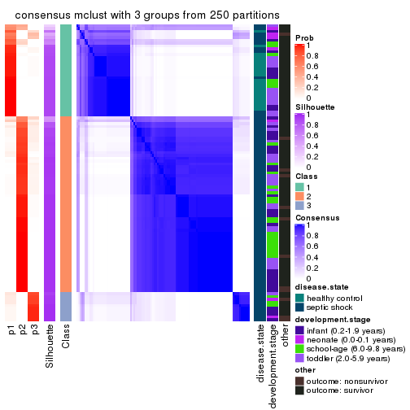</p>

</div>
<div id='tab-MAD-mclust-consensus-heatmap-3'>
<pre><code class="r">consensus_heatmap(res, k = 4)
</code></pre>

<p>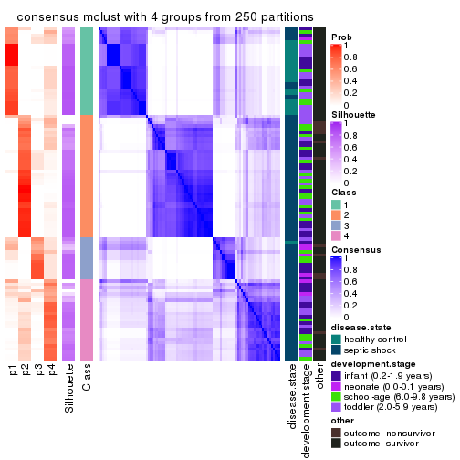</p>

</div>
<div id='tab-MAD-mclust-consensus-heatmap-4'>
<pre><code class="r">consensus_heatmap(res, k = 5)
</code></pre>

<p>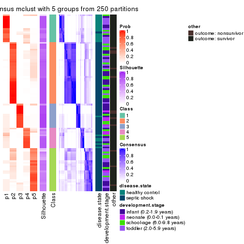</p>

</div>
<div id='tab-MAD-mclust-consensus-heatmap-5'>
<pre><code class="r">consensus_heatmap(res, k = 6)
</code></pre>

<p>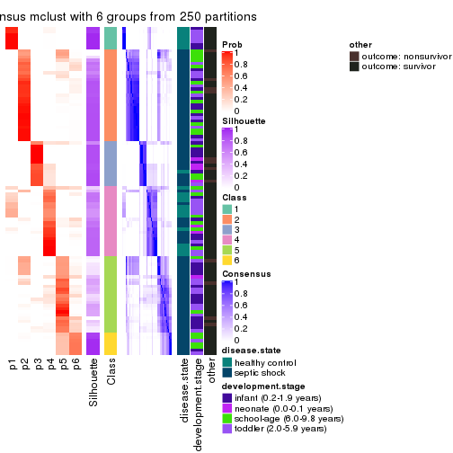</p>

</div>
</div>

Heatmaps for the membership of samples in all partitions to see how consistent they are:


<script>
$( function() {
	$( '#tabs-MAD-mclust-membership-heatmap' ).tabs();
} );
</script>
<div id='tabs-MAD-mclust-membership-heatmap'>
<ul>
<li><a href='#tab-MAD-mclust-membership-heatmap-1'>k = 2</a></li>
<li><a href='#tab-MAD-mclust-membership-heatmap-2'>k = 3</a></li>
<li><a href='#tab-MAD-mclust-membership-heatmap-3'>k = 4</a></li>
<li><a href='#tab-MAD-mclust-membership-heatmap-4'>k = 5</a></li>
<li><a href='#tab-MAD-mclust-membership-heatmap-5'>k = 6</a></li>
</ul>
<div id='tab-MAD-mclust-membership-heatmap-1'>
<pre><code class="r">membership_heatmap(res, k = 2)
</code></pre>

<p>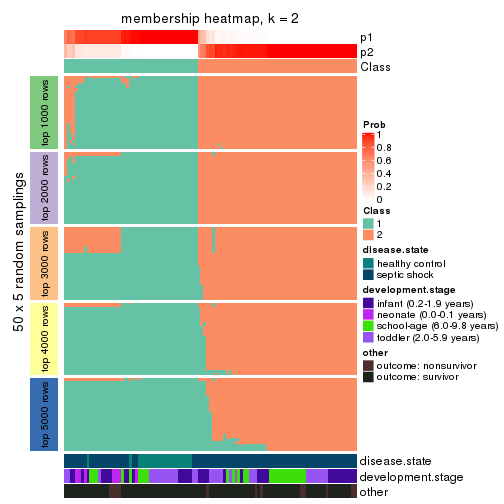</p>

</div>
<div id='tab-MAD-mclust-membership-heatmap-2'>
<pre><code class="r">membership_heatmap(res, k = 3)
</code></pre>

<p>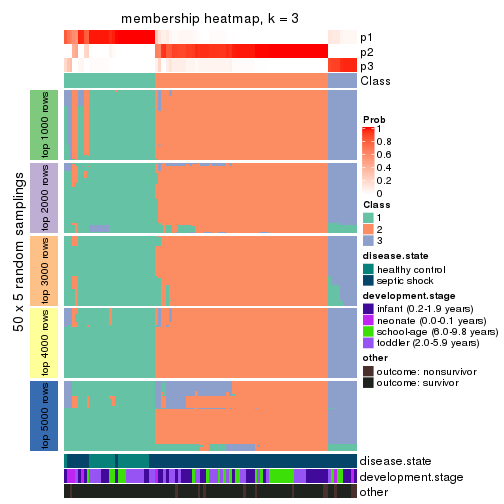</p>

</div>
<div id='tab-MAD-mclust-membership-heatmap-3'>
<pre><code class="r">membership_heatmap(res, k = 4)
</code></pre>

<p>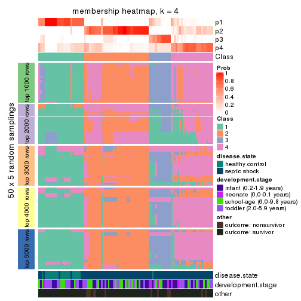</p>

</div>
<div id='tab-MAD-mclust-membership-heatmap-4'>
<pre><code class="r">membership_heatmap(res, k = 5)
</code></pre>

<p>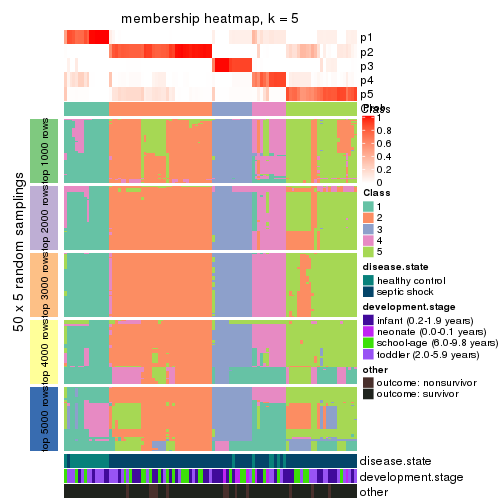</p>

</div>
<div id='tab-MAD-mclust-membership-heatmap-5'>
<pre><code class="r">membership_heatmap(res, k = 6)
</code></pre>

<p>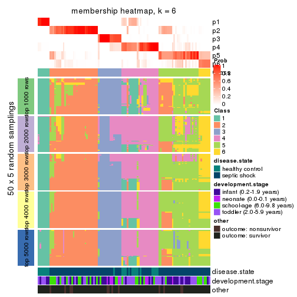</p>

</div>
</div>

As soon as we have had the classes for columns, we can look for signatures
which are significantly different between classes which can be candidate marks
for certain classes. Following are the heatmaps for signatures.


Signature heatmaps where rows are scaled:


<script>
$( function() {
	$( '#tabs-MAD-mclust-get-signatures' ).tabs();
} );
</script>
<div id='tabs-MAD-mclust-get-signatures'>
<ul>
<li><a href='#tab-MAD-mclust-get-signatures-1'>k = 2</a></li>
<li><a href='#tab-MAD-mclust-get-signatures-2'>k = 3</a></li>
<li><a href='#tab-MAD-mclust-get-signatures-3'>k = 4</a></li>
<li><a href='#tab-MAD-mclust-get-signatures-4'>k = 5</a></li>
<li><a href='#tab-MAD-mclust-get-signatures-5'>k = 6</a></li>
</ul>
<div id='tab-MAD-mclust-get-signatures-1'>
<pre><code class="r">get_signatures(res, k = 2)
</code></pre>

<p>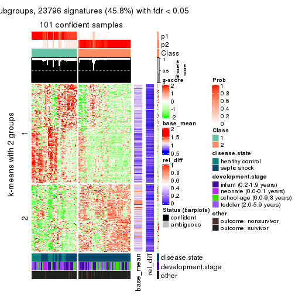</p>

</div>
<div id='tab-MAD-mclust-get-signatures-2'>
<pre><code class="r">get_signatures(res, k = 3)
</code></pre>

<p>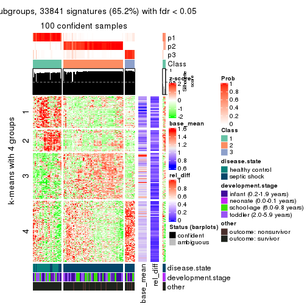</p>

</div>
<div id='tab-MAD-mclust-get-signatures-3'>
<pre><code class="r">get_signatures(res, k = 4)
</code></pre>

<p>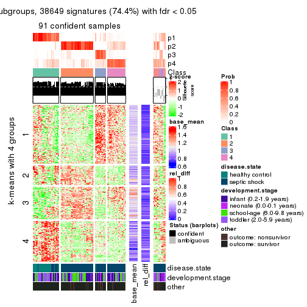</p>

</div>
<div id='tab-MAD-mclust-get-signatures-4'>
<pre><code class="r">get_signatures(res, k = 5)
</code></pre>

<p>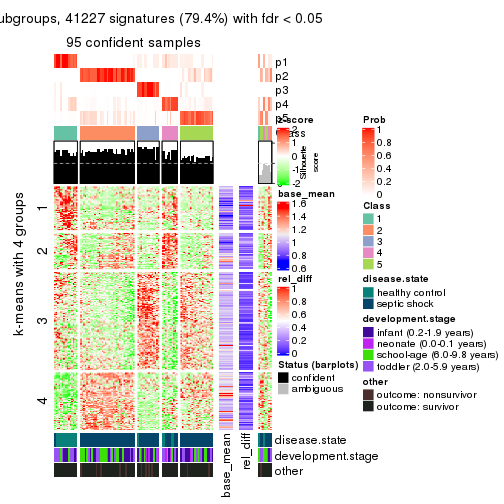</p>

</div>
<div id='tab-MAD-mclust-get-signatures-5'>
<pre><code class="r">get_signatures(res, k = 6)
</code></pre>

<p>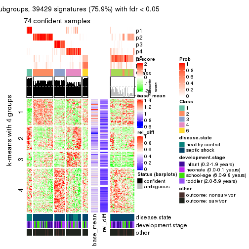</p>

</div>
</div>


Signature heatmaps where rows are not scaled:


<script>
$( function() {
	$( '#tabs-MAD-mclust-get-signatures-no-scale' ).tabs();
} );
</script>
<div id='tabs-MAD-mclust-get-signatures-no-scale'>
<ul>
<li><a href='#tab-MAD-mclust-get-signatures-no-scale-1'>k = 2</a></li>
<li><a href='#tab-MAD-mclust-get-signatures-no-scale-2'>k = 3</a></li>
<li><a href='#tab-MAD-mclust-get-signatures-no-scale-3'>k = 4</a></li>
<li><a href='#tab-MAD-mclust-get-signatures-no-scale-4'>k = 5</a></li>
<li><a href='#tab-MAD-mclust-get-signatures-no-scale-5'>k = 6</a></li>
</ul>
<div id='tab-MAD-mclust-get-signatures-no-scale-1'>
<pre><code class="r">get_signatures(res, k = 2, scale_rows = FALSE)
</code></pre>

<p>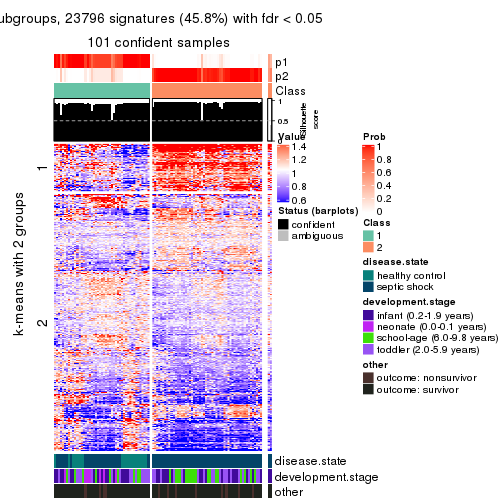</p>

</div>
<div id='tab-MAD-mclust-get-signatures-no-scale-2'>
<pre><code class="r">get_signatures(res, k = 3, scale_rows = FALSE)
</code></pre>

<pre><code>#&gt; Error in mat[ceiling(1:nr/h_ratio), ceiling(1:nc/w_ratio), drop = FALSE]: subscript out of bounds
</code></pre>

<p>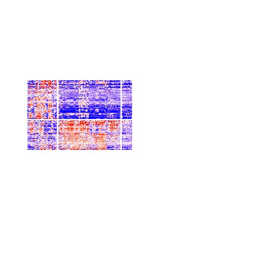</p>

</div>
<div id='tab-MAD-mclust-get-signatures-no-scale-3'>
<pre><code class="r">get_signatures(res, k = 4, scale_rows = FALSE)
</code></pre>

<p>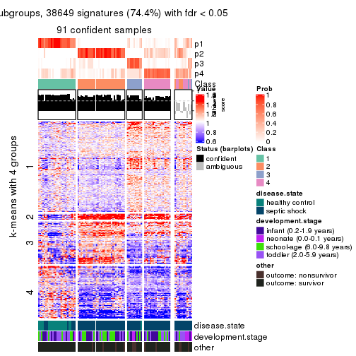</p>

</div>
<div id='tab-MAD-mclust-get-signatures-no-scale-4'>
<pre><code class="r">get_signatures(res, k = 5, scale_rows = FALSE)
</code></pre>

<p>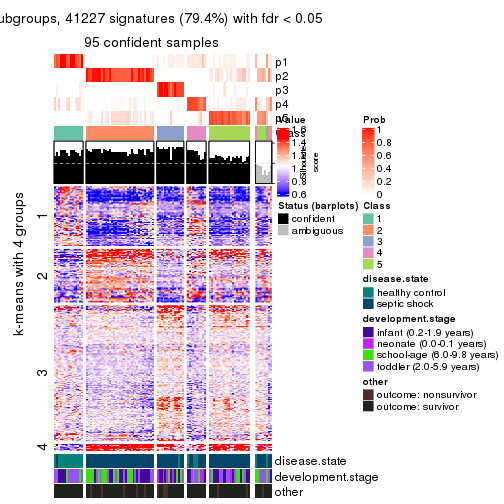</p>

</div>
<div id='tab-MAD-mclust-get-signatures-no-scale-5'>
<pre><code class="r">get_signatures(res, k = 6, scale_rows = FALSE)
</code></pre>

<pre><code>#&gt; Error in mat[ceiling(1:nr/h_ratio), ceiling(1:nc/w_ratio), drop = FALSE]: subscript out of bounds
</code></pre>

<p></p>

</div>
</div>


Compare the overlap of signatures from different k:

```r
compare_signatures(res)
```

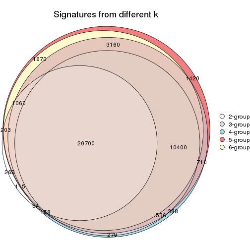

`get_signature()` returns a data frame invisibly. TO get the list of signatures, the function
call should be assigned to a variable explicitly. In following code, if `plot` argument is set
to `FALSE`, no heatmap is plotted while only the differential analysis is performed.

```r
# code only for demonstration
tb = get_signature(res, k = ..., plot = FALSE)
```

An example of the output of `tb` is:

```
#>   which_row         fdr    mean_1    mean_2 scaled_mean_1 scaled_mean_2 km
#> 1        38 0.042760348  8.373488  9.131774    -0.5533452     0.5164555  1
#> 2        40 0.018707592  7.106213  8.469186    -0.6173731     0.5762149  1
#> 3        55 0.019134737 10.221463 11.207825    -0.6159697     0.5749050  1
#> 4        59 0.006059896  5.921854  7.869574    -0.6899429     0.6439467  1
#> 5        60 0.018055526  8.928898 10.211722    -0.6204761     0.5791110  1
#> 6        98 0.009384629 15.714769 14.887706     0.6635654    -0.6193277  2
...
```

The columns in `tb` are:

1. `which_row`: row indices corresponding to the input matrix.
2. `fdr`: FDR for the differential test. 
3. `mean_x`: The mean value in group x.
4. `scaled_mean_x`: The mean value in group x after rows are scaled.
5. `km`: Row groups if k-means clustering is applied to rows.


UMAP plot which shows how samples are separated.


<script>
$( function() {
	$( '#tabs-MAD-mclust-dimension-reduction' ).tabs();
} );
</script>
<div id='tabs-MAD-mclust-dimension-reduction'>
<ul>
<li><a href='#tab-MAD-mclust-dimension-reduction-1'>k = 2</a></li>
<li><a href='#tab-MAD-mclust-dimension-reduction-2'>k = 3</a></li>
<li><a href='#tab-MAD-mclust-dimension-reduction-3'>k = 4</a></li>
<li><a href='#tab-MAD-mclust-dimension-reduction-4'>k = 5</a></li>
<li><a href='#tab-MAD-mclust-dimension-reduction-5'>k = 6</a></li>
</ul>
<div id='tab-MAD-mclust-dimension-reduction-1'>
<pre><code class="r">dimension_reduction(res, k = 2, method = &quot;UMAP&quot;)
</code></pre>

<p>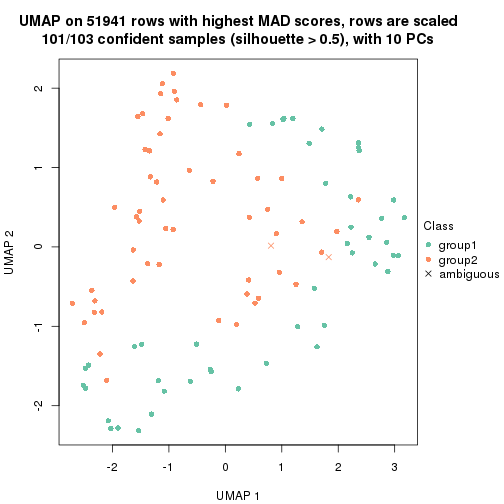</p>

</div>
<div id='tab-MAD-mclust-dimension-reduction-2'>
<pre><code class="r">dimension_reduction(res, k = 3, method = &quot;UMAP&quot;)
</code></pre>

<p>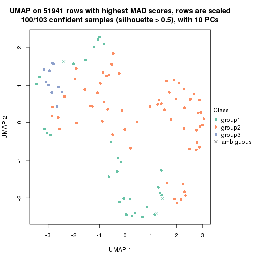</p>

</div>
<div id='tab-MAD-mclust-dimension-reduction-3'>
<pre><code class="r">dimension_reduction(res, k = 4, method = &quot;UMAP&quot;)
</code></pre>

<p>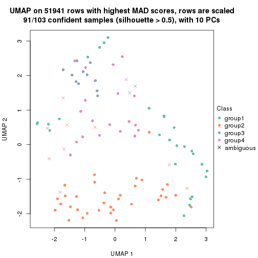</p>

</div>
<div id='tab-MAD-mclust-dimension-reduction-4'>
<pre><code class="r">dimension_reduction(res, k = 5, method = &quot;UMAP&quot;)
</code></pre>

<p>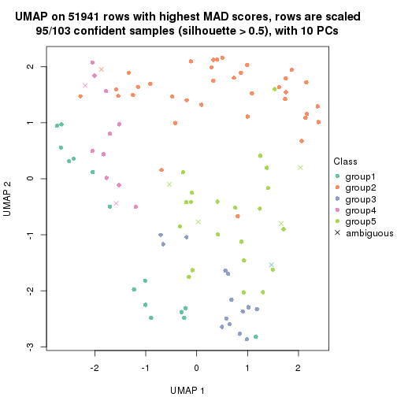</p>

</div>
<div id='tab-MAD-mclust-dimension-reduction-5'>
<pre><code class="r">dimension_reduction(res, k = 6, method = &quot;UMAP&quot;)
</code></pre>

<p>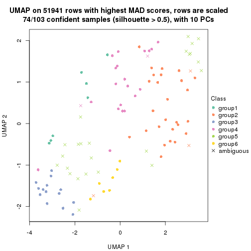</p>

</div>
</div>


Following heatmap shows how subgroups are split when increasing `k`:

```r
collect_classes(res)
```

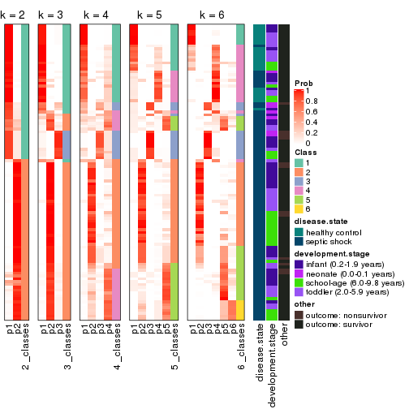


Test correlation between subgroups and known annotations. If the known
annotation is numeric, one-way ANOVA test is applied, and if the known
annotation is discrete, chi-squared contingency table test is applied.

```r
test_to_known_factors(res)
```

```
#>              n disease.state(p) development.stage(p) other(p) k
#> MAD:mclust 101         1.34e-07               0.0190   0.5039 2
#> MAD:mclust 100         7.38e-15               0.1571   0.0229 3
#> MAD:mclust  91         3.02e-12               0.1092   0.0773 4
#> MAD:mclust  95         5.03e-14               0.0111   0.1091 5
#> MAD:mclust  74         4.06e-09               0.0411   0.0467 6
```


If matrix rows can be associated to genes, consider to use `functional_enrichment(res,
...)` to perform function enrichment for the signature genes. See [this vignette](http://bioconductor.org/packages/devel/bioc/vignettes/cola/inst/doc/functional_enrichment.html) for more detailed explanations.


 

---------------------------------------------------


### MAD:NMF


The object with results only for a single top-value method and a single partition method 
can be extracted as:

```r
res = res_list["MAD", "NMF"]
# you can also extract it by
# res = res_list["MAD:NMF"]
```

A summary of `res` and all the functions that can be applied to it:

```r
res
```

```
#> A 'ConsensusPartition' object with k = 2, 3, 4, 5, 6.
#>   On a matrix with 51941 rows and 103 columns.
#>   Top rows (1000, 2000, 3000, 4000, 5000) are extracted by 'MAD' method.
#>   Subgroups are detected by 'NMF' method.
#>   Performed in total 1250 partitions by row resampling.
#>   Best k for subgroups seems to be 2.
#> 
#> Following methods can be applied to this 'ConsensusPartition' object:
#>  [1] "cola_report"             "collect_classes"         "collect_plots"          
#>  [4] "collect_stats"           "colnames"                "compare_signatures"     
#>  [7] "consensus_heatmap"       "dimension_reduction"     "functional_enrichment"  
#> [10] "get_anno_col"            "get_anno"                "get_classes"            
#> [13] "get_consensus"           "get_matrix"              "get_membership"         
#> [16] "get_param"               "get_signatures"          "get_stats"              
#> [19] "is_best_k"               "is_stable_k"             "membership_heatmap"     
#> [22] "ncol"                    "nrow"                    "plot_ecdf"              
#> [25] "rownames"                "select_partition_number" "show"                   
#> [28] "suggest_best_k"          "test_to_known_factors"
```

`collect_plots()` function collects all the plots made from `res` for all `k` (number of partitions)
into one single page to provide an easy and fast comparison between different `k`.

```r
collect_plots(res)
```

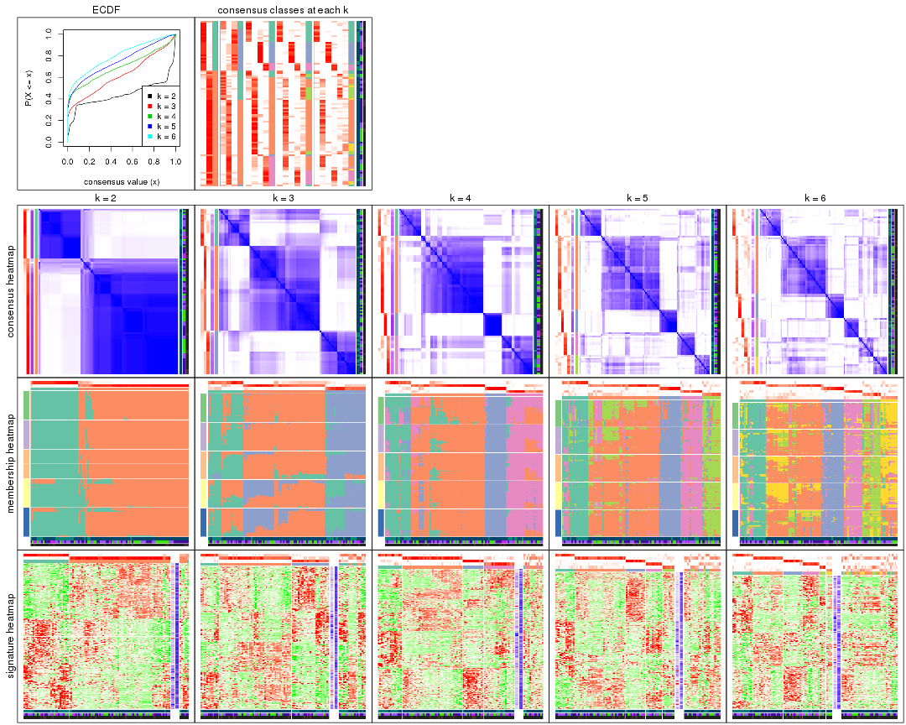

The plots are:

- The first row: a plot of the ECDF (empirical cumulative distribution
  function) curves of the consensus matrix for each `k` and the heatmap of
  predicted classes for each `k`.
- The second row: heatmaps of the consensus matrix for each `k`.
- The third row: heatmaps of the membership matrix for each `k`.
- The fouth row: heatmaps of the signatures for each `k`.

All the plots in panels can be made by individual functions and they are
plotted later in this section.

`select_partition_number()` produces several plots showing different
statistics for choosing "optimized" `k`. There are following statistics:

- ECDF curves of the consensus matrix for each `k`;
- 1-PAC. [The PAC
  score](https://en.wikipedia.org/wiki/Consensus_clustering#Over-interpretation_potential_of_consensus_clustering)
  measures the proportion of the ambiguous subgrouping.
- Mean silhouette score.
- Concordance. The mean probability of fiting the consensus class ids in all
  partitions.
- Area increased. Denote $A_k$ as the area under the ECDF curve for current
  `k`, the area increased is defined as $A_k - A_{k-1}$.
- Rand index. The percent of pairs of samples that are both in a same cluster
  or both are not in a same cluster in the partition of k and k-1.
- Jaccard index. The ratio of pairs of samples are both in a same cluster in
  the partition of k and k-1 and the pairs of samples are both in a same
  cluster in the partition k or k-1.

The detailed explanations of these statistics can be found in [the _cola_
vignette](http://bioconductor.org/packages/devel/bioc/vignettes/cola/inst/doc/cola.html#toc_13).

Generally speaking, lower PAC score, higher mean silhouette score or higher
concordance corresponds to better partition. Rand index and Jaccard index
measure how similar the current partition is compared to partition with `k-1`.
If they are too similar, we won't accept `k` is better than `k-1`.

```r
select_partition_number(res)
```

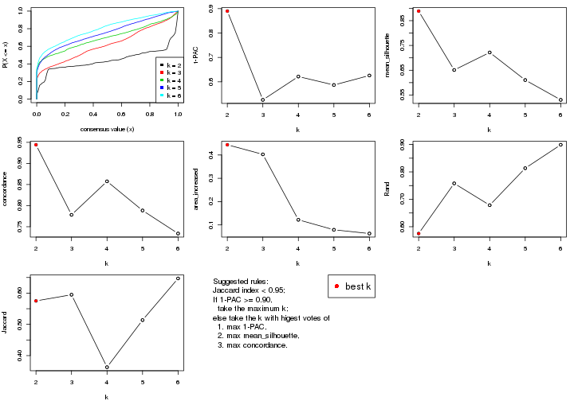

The numeric values for all these statistics can be obtained by `get_stats()`.

```r
get_stats(res)
```

```
#>   k 1-PAC mean_silhouette concordance area_increased  Rand Jaccard
#> 2 2 0.890           0.888       0.944         0.4438 0.575   0.575
#> 3 3 0.526           0.651       0.778         0.4027 0.758   0.595
#> 4 4 0.622           0.722       0.858         0.1220 0.678   0.363
#> 5 5 0.587           0.610       0.788         0.0791 0.813   0.514
#> 6 6 0.626           0.531       0.734         0.0631 0.899   0.647
```

`suggest_best_k()` suggests the best $k$ based on these statistics. The rules are as follows:

- All $k$ with Jaccard index larger than 0.95 are removed because increasing
  $k$ does not provide enough extra information. If all $k$ are removed, it is
  marked as no subgroup is detected.
- For all $k$ with 1-PAC score larger than 0.9, the maximal $k$ is taken as
  the best $k$, and other $k$ are marked as optional $k$.
- If it does not fit the second rule. The $k$ with the maximal vote of the
  highest 1-PAC score, highest mean silhouette, and highest concordance is
  taken as the best $k$.

```r
suggest_best_k(res)
```

```
#> [1] 2
```


Following shows the table of the partitions (You need to click the **show/hide
code output** link to see it). The membership matrix (columns with name `p*`)
is inferred by
[`clue::cl_consensus()`](https://www.rdocumentation.org/link/cl_consensus?package=clue)
function with the `SE` method. Basically the value in the membership matrix
represents the probability to belong to a certain group. The finall class
label for an item is determined with the group with highest probability it
belongs to.

In `get_classes()` function, the entropy is calculated from the membership
matrix and the silhouette score is calculated from the consensus matrix.


<script>
$( function() {
	$( '#tabs-MAD-NMF-get-classes' ).tabs();
} );
</script>
<div id='tabs-MAD-NMF-get-classes'>
<ul>
<li><a href='#tab-MAD-NMF-get-classes-1'>k = 2</a></li>
<li><a href='#tab-MAD-NMF-get-classes-2'>k = 3</a></li>
<li><a href='#tab-MAD-NMF-get-classes-3'>k = 4</a></li>
<li><a href='#tab-MAD-NMF-get-classes-4'>k = 5</a></li>
<li><a href='#tab-MAD-NMF-get-classes-5'>k = 6</a></li>
</ul>

<div id='tab-MAD-NMF-get-classes-1'>
<p><a id='tab-MAD-NMF-get-classes-1-a' style='color:#0366d6' href='#'>show/hide code output</a></p>
<pre><code class="r">cbind(get_classes(res, k = 2), get_membership(res, k = 2))
</code></pre>

<pre><code>#&gt;           class entropy silhouette    p1    p2
#&gt; GSM647569     1  0.2423     0.9478 0.960 0.040
#&gt; GSM647574     1  0.3431     0.9457 0.936 0.064
#&gt; GSM647577     1  0.3431     0.9457 0.936 0.064
#&gt; GSM647547     1  0.3584     0.9429 0.932 0.068
#&gt; GSM647552     2  0.3431     0.9064 0.064 0.936
#&gt; GSM647553     1  0.3431     0.9457 0.936 0.064
#&gt; GSM647565     2  0.1633     0.9296 0.024 0.976
#&gt; GSM647545     2  0.0000     0.9379 0.000 1.000
#&gt; GSM647549     2  0.0000     0.9379 0.000 1.000
#&gt; GSM647550     2  0.0672     0.9364 0.008 0.992
#&gt; GSM647560     2  0.0000     0.9379 0.000 1.000
#&gt; GSM647617     1  0.3431     0.9457 0.936 0.064
#&gt; GSM647528     2  0.0000     0.9379 0.000 1.000
#&gt; GSM647529     2  0.9522     0.4800 0.372 0.628
#&gt; GSM647531     2  0.0000     0.9379 0.000 1.000
#&gt; GSM647540     2  0.0672     0.9363 0.008 0.992
#&gt; GSM647541     2  0.0000     0.9379 0.000 1.000
#&gt; GSM647546     2  0.9580     0.3802 0.380 0.620
#&gt; GSM647557     2  0.0000     0.9379 0.000 1.000
#&gt; GSM647561     2  0.0000     0.9379 0.000 1.000
#&gt; GSM647567     2  0.8386     0.6838 0.268 0.732
#&gt; GSM647568     2  0.0938     0.9352 0.012 0.988
#&gt; GSM647570     2  0.0938     0.9352 0.012 0.988
#&gt; GSM647573     2  0.9286     0.4692 0.344 0.656
#&gt; GSM647576     2  0.0938     0.9352 0.012 0.988
#&gt; GSM647579     2  0.0000     0.9379 0.000 1.000
#&gt; GSM647580     1  0.3431     0.9457 0.936 0.064
#&gt; GSM647583     1  0.3431     0.9457 0.936 0.064
#&gt; GSM647592     2  0.3431     0.9064 0.064 0.936
#&gt; GSM647593     2  0.3431     0.9064 0.064 0.936
#&gt; GSM647595     2  0.3114     0.9116 0.056 0.944
#&gt; GSM647597     2  0.3733     0.9031 0.072 0.928
#&gt; GSM647598     2  0.0672     0.9363 0.008 0.992
#&gt; GSM647613     2  0.0000     0.9379 0.000 1.000
#&gt; GSM647615     2  0.0938     0.9352 0.012 0.988
#&gt; GSM647616     1  0.3431     0.9457 0.936 0.064
#&gt; GSM647619     2  0.3431     0.9064 0.064 0.936
#&gt; GSM647582     2  0.0672     0.9363 0.008 0.992
#&gt; GSM647591     2  0.3431     0.9064 0.064 0.936
#&gt; GSM647527     2  0.0000     0.9379 0.000 1.000
#&gt; GSM647530     2  0.0376     0.9373 0.004 0.996
#&gt; GSM647532     2  0.9996     0.0426 0.488 0.512
#&gt; GSM647544     2  0.0000     0.9379 0.000 1.000
#&gt; GSM647551     2  0.3431     0.9064 0.064 0.936
#&gt; GSM647556     1  0.0000     0.9450 1.000 0.000
#&gt; GSM647558     2  0.0938     0.9352 0.012 0.988
#&gt; GSM647572     2  0.4939     0.8585 0.108 0.892
#&gt; GSM647578     2  0.1414     0.9301 0.020 0.980
#&gt; GSM647581     2  0.0376     0.9373 0.004 0.996
#&gt; GSM647594     2  0.3114     0.9116 0.056 0.944
#&gt; GSM647599     1  0.0000     0.9450 1.000 0.000
#&gt; GSM647600     2  0.3431     0.9064 0.064 0.936
#&gt; GSM647601     2  0.1184     0.9334 0.016 0.984
#&gt; GSM647603     2  0.0000     0.9379 0.000 1.000
#&gt; GSM647610     2  0.7528     0.7586 0.216 0.784
#&gt; GSM647611     2  0.0938     0.9349 0.012 0.988
#&gt; GSM647612     2  0.0938     0.9352 0.012 0.988
#&gt; GSM647614     2  0.0938     0.9352 0.012 0.988
#&gt; GSM647618     2  0.0672     0.9363 0.008 0.992
#&gt; GSM647629     2  0.0672     0.9363 0.008 0.992
#&gt; GSM647535     2  0.0000     0.9379 0.000 1.000
#&gt; GSM647563     2  0.0000     0.9379 0.000 1.000
#&gt; GSM647542     2  0.0938     0.9352 0.012 0.988
#&gt; GSM647543     2  0.0938     0.9352 0.012 0.988
#&gt; GSM647548     2  0.1184     0.9336 0.016 0.984
#&gt; GSM647554     2  0.2603     0.9188 0.044 0.956
#&gt; GSM647555     2  0.0938     0.9352 0.012 0.988
#&gt; GSM647559     2  0.0000     0.9379 0.000 1.000
#&gt; GSM647562     2  0.0000     0.9379 0.000 1.000
#&gt; GSM647564     1  0.5737     0.8737 0.864 0.136
#&gt; GSM647571     2  0.0938     0.9352 0.012 0.988
#&gt; GSM647584     2  0.2778     0.9165 0.048 0.952
#&gt; GSM647585     1  0.0000     0.9450 1.000 0.000
#&gt; GSM647586     2  0.0000     0.9379 0.000 1.000
#&gt; GSM647587     2  0.0000     0.9379 0.000 1.000
#&gt; GSM647588     2  0.0000     0.9379 0.000 1.000
#&gt; GSM647596     2  0.0000     0.9379 0.000 1.000
#&gt; GSM647602     1  0.3431     0.9457 0.936 0.064
#&gt; GSM647609     2  0.1633     0.9297 0.024 0.976
#&gt; GSM647620     2  0.0672     0.9363 0.008 0.992
#&gt; GSM647627     2  0.0000     0.9379 0.000 1.000
#&gt; GSM647628     2  0.0938     0.9352 0.012 0.988
#&gt; GSM647533     1  0.0938     0.9421 0.988 0.012
#&gt; GSM647536     1  0.9732     0.2368 0.596 0.404
#&gt; GSM647537     1  0.0672     0.9435 0.992 0.008
#&gt; GSM647606     1  0.0000     0.9450 1.000 0.000
#&gt; GSM647621     1  0.3431     0.9457 0.936 0.064
#&gt; GSM647626     1  0.0000     0.9450 1.000 0.000
#&gt; GSM647538     1  0.0938     0.9421 0.988 0.012
#&gt; GSM647575     2  0.8955     0.5411 0.312 0.688
#&gt; GSM647590     1  0.1633     0.9477 0.976 0.024
#&gt; GSM647605     1  0.0938     0.9421 0.988 0.012
#&gt; GSM647607     1  0.3431     0.9457 0.936 0.064
#&gt; GSM647608     1  0.3431     0.9457 0.936 0.064
#&gt; GSM647622     1  0.0000     0.9450 1.000 0.000
#&gt; GSM647623     1  0.0376     0.9443 0.996 0.004
#&gt; GSM647624     1  0.0672     0.9461 0.992 0.008
#&gt; GSM647625     1  0.0938     0.9421 0.988 0.012
#&gt; GSM647534     2  0.9775     0.3819 0.412 0.588
#&gt; GSM647539     2  0.1633     0.9296 0.024 0.976
#&gt; GSM647566     2  0.8267     0.6927 0.260 0.740
#&gt; GSM647589     1  0.3431     0.9457 0.936 0.064
#&gt; GSM647604     1  0.0938     0.9421 0.988 0.012
</code></pre>

<script>
$('#tab-MAD-NMF-get-classes-1-a').parent().next().next().hide();
$('#tab-MAD-NMF-get-classes-1-a').click(function(){
  $('#tab-MAD-NMF-get-classes-1-a').parent().next().next().toggle();
  return(false);
});
</script>
</div>

<div id='tab-MAD-NMF-get-classes-2'>
<p><a id='tab-MAD-NMF-get-classes-2-a' style='color:#0366d6' href='#'>show/hide code output</a></p>
<pre><code class="r">cbind(get_classes(res, k = 3), get_membership(res, k = 3))
</code></pre>

<pre><code>#&gt;           class entropy silhouette    p1    p2    p3
#&gt; GSM647569     3  0.1315     0.7249 0.020 0.008 0.972
#&gt; GSM647574     3  0.5621     0.7433 0.000 0.308 0.692
#&gt; GSM647577     3  0.5327     0.7662 0.000 0.272 0.728
#&gt; GSM647547     3  0.5882     0.7010 0.000 0.348 0.652
#&gt; GSM647552     1  0.0237     0.6999 0.996 0.004 0.000
#&gt; GSM647553     3  0.5098     0.7717 0.000 0.248 0.752
#&gt; GSM647565     2  0.2878     0.6582 0.000 0.904 0.096
#&gt; GSM647545     2  0.4346     0.7640 0.184 0.816 0.000
#&gt; GSM647549     2  0.3941     0.7630 0.156 0.844 0.000
#&gt; GSM647550     2  0.0983     0.7336 0.016 0.980 0.004
#&gt; GSM647560     2  0.2165     0.7479 0.064 0.936 0.000
#&gt; GSM647617     3  0.5497     0.7548 0.000 0.292 0.708
#&gt; GSM647528     2  0.5216     0.7493 0.260 0.740 0.000
#&gt; GSM647529     1  0.5244     0.5445 0.756 0.004 0.240
#&gt; GSM647531     2  0.5397     0.7376 0.280 0.720 0.000
#&gt; GSM647540     2  0.4634     0.7617 0.164 0.824 0.012
#&gt; GSM647541     2  0.5098     0.7541 0.248 0.752 0.000
#&gt; GSM647546     2  0.5016     0.4006 0.000 0.760 0.240
#&gt; GSM647557     2  0.5591     0.7152 0.304 0.696 0.000
#&gt; GSM647561     2  0.5291     0.7449 0.268 0.732 0.000
#&gt; GSM647567     1  0.7945     0.5816 0.652 0.124 0.224
#&gt; GSM647568     2  0.2261     0.6847 0.000 0.932 0.068
#&gt; GSM647570     2  0.0424     0.7317 0.008 0.992 0.000
#&gt; GSM647573     2  0.4931     0.4253 0.000 0.768 0.232
#&gt; GSM647576     2  0.1411     0.7100 0.000 0.964 0.036
#&gt; GSM647579     2  0.5864     0.7328 0.288 0.704 0.008
#&gt; GSM647580     3  0.5216     0.7708 0.000 0.260 0.740
#&gt; GSM647583     3  0.5254     0.7698 0.000 0.264 0.736
#&gt; GSM647592     1  0.1529     0.7047 0.960 0.040 0.000
#&gt; GSM647593     1  0.2625     0.6848 0.916 0.084 0.000
#&gt; GSM647595     1  0.5016     0.4948 0.760 0.240 0.000
#&gt; GSM647597     1  0.2200     0.6794 0.940 0.004 0.056
#&gt; GSM647598     2  0.5810     0.6760 0.336 0.664 0.000
#&gt; GSM647613     2  0.5138     0.7525 0.252 0.748 0.000
#&gt; GSM647615     2  0.0237     0.7303 0.004 0.996 0.000
#&gt; GSM647616     3  0.5216     0.7708 0.000 0.260 0.740
#&gt; GSM647619     1  0.2261     0.6947 0.932 0.068 0.000
#&gt; GSM647582     2  0.5810     0.6758 0.336 0.664 0.000
#&gt; GSM647591     1  0.2356     0.6926 0.928 0.072 0.000
#&gt; GSM647527     2  0.5254     0.7473 0.264 0.736 0.000
#&gt; GSM647530     2  0.4346     0.7618 0.184 0.816 0.000
#&gt; GSM647532     3  0.9614    -0.0947 0.356 0.208 0.436
#&gt; GSM647544     2  0.4121     0.7638 0.168 0.832 0.000
#&gt; GSM647551     1  0.4235     0.5931 0.824 0.176 0.000
#&gt; GSM647556     3  0.1411     0.7145 0.036 0.000 0.964
#&gt; GSM647558     2  0.0475     0.7284 0.004 0.992 0.004
#&gt; GSM647572     2  0.3116     0.6454 0.000 0.892 0.108
#&gt; GSM647578     2  0.5292     0.7596 0.228 0.764 0.008
#&gt; GSM647581     2  0.2448     0.7503 0.076 0.924 0.000
#&gt; GSM647594     1  0.5327     0.4313 0.728 0.272 0.000
#&gt; GSM647599     3  0.3340     0.6612 0.120 0.000 0.880
#&gt; GSM647600     1  0.2356     0.6940 0.928 0.072 0.000
#&gt; GSM647601     2  0.6260     0.4661 0.448 0.552 0.000
#&gt; GSM647603     2  0.5529     0.7230 0.296 0.704 0.000
#&gt; GSM647610     1  0.0829     0.6969 0.984 0.004 0.012
#&gt; GSM647611     2  0.6140     0.5677 0.404 0.596 0.000
#&gt; GSM647612     2  0.0892     0.7190 0.000 0.980 0.020
#&gt; GSM647614     2  0.1529     0.7068 0.000 0.960 0.040
#&gt; GSM647618     1  0.6008     0.0966 0.628 0.372 0.000
#&gt; GSM647629     2  0.5650     0.7063 0.312 0.688 0.000
#&gt; GSM647535     2  0.5254     0.7473 0.264 0.736 0.000
#&gt; GSM647563     2  0.4974     0.7575 0.236 0.764 0.000
#&gt; GSM647542     2  0.1643     0.7043 0.000 0.956 0.044
#&gt; GSM647543     2  0.1643     0.7043 0.000 0.956 0.044
#&gt; GSM647548     2  0.2356     0.6808 0.000 0.928 0.072
#&gt; GSM647554     1  0.6252    -0.1490 0.556 0.444 0.000
#&gt; GSM647555     2  0.0475     0.7289 0.004 0.992 0.004
#&gt; GSM647559     2  0.5098     0.7541 0.248 0.752 0.000
#&gt; GSM647562     2  0.5098     0.7543 0.248 0.752 0.000
#&gt; GSM647564     3  0.5650     0.7396 0.000 0.312 0.688
#&gt; GSM647571     2  0.1529     0.7068 0.000 0.960 0.040
#&gt; GSM647584     1  0.6045     0.1165 0.620 0.380 0.000
#&gt; GSM647585     3  0.1989     0.7109 0.048 0.004 0.948
#&gt; GSM647586     2  0.5497     0.7270 0.292 0.708 0.000
#&gt; GSM647587     2  0.5363     0.7396 0.276 0.724 0.000
#&gt; GSM647588     2  0.5397     0.7367 0.280 0.720 0.000
#&gt; GSM647596     2  0.5216     0.7493 0.260 0.740 0.000
#&gt; GSM647602     3  0.5254     0.7698 0.000 0.264 0.736
#&gt; GSM647609     2  0.6235     0.4912 0.436 0.564 0.000
#&gt; GSM647620     2  0.5650     0.7062 0.312 0.688 0.000
#&gt; GSM647627     2  0.5465     0.7303 0.288 0.712 0.000
#&gt; GSM647628     2  0.1129     0.7207 0.004 0.976 0.020
#&gt; GSM647533     3  0.5098     0.4850 0.248 0.000 0.752
#&gt; GSM647536     1  0.5465     0.4915 0.712 0.000 0.288
#&gt; GSM647537     3  0.4654     0.5489 0.208 0.000 0.792
#&gt; GSM647606     3  0.2878     0.6752 0.096 0.000 0.904
#&gt; GSM647621     3  0.4883     0.7693 0.004 0.208 0.788
#&gt; GSM647626     3  0.1289     0.7170 0.032 0.000 0.968
#&gt; GSM647538     1  0.5560     0.4778 0.700 0.000 0.300
#&gt; GSM647575     2  0.6431     0.4679 0.084 0.760 0.156
#&gt; GSM647590     3  0.0661     0.7269 0.008 0.004 0.988
#&gt; GSM647605     1  0.5678     0.4560 0.684 0.000 0.316
#&gt; GSM647607     3  0.6019     0.7578 0.012 0.288 0.700
#&gt; GSM647608     3  0.5138     0.7716 0.000 0.252 0.748
#&gt; GSM647622     3  0.2448     0.6901 0.076 0.000 0.924
#&gt; GSM647623     3  0.4002     0.6134 0.160 0.000 0.840
#&gt; GSM647624     3  0.1289     0.7175 0.032 0.000 0.968
#&gt; GSM647625     1  0.5706     0.4504 0.680 0.000 0.320
#&gt; GSM647534     1  0.3879     0.6163 0.848 0.000 0.152
#&gt; GSM647539     2  0.2261     0.6844 0.000 0.932 0.068
#&gt; GSM647566     1  0.8977     0.3467 0.564 0.232 0.204
#&gt; GSM647589     3  0.5621     0.7433 0.000 0.308 0.692
#&gt; GSM647604     1  0.5560     0.4777 0.700 0.000 0.300
</code></pre>

<script>
$('#tab-MAD-NMF-get-classes-2-a').parent().next().next().hide();
$('#tab-MAD-NMF-get-classes-2-a').click(function(){
  $('#tab-MAD-NMF-get-classes-2-a').parent().next().next().toggle();
  return(false);
});
</script>
</div>

<div id='tab-MAD-NMF-get-classes-3'>
<p><a id='tab-MAD-NMF-get-classes-3-a' style='color:#0366d6' href='#'>show/hide code output</a></p>
<pre><code class="r">cbind(get_classes(res, k = 4), get_membership(res, k = 4))
</code></pre>

<pre><code>#&gt;           class entropy silhouette    p1    p2    p3    p4
#&gt; GSM647569     3  0.0000     0.9689 0.000 0.000 1.000 0.000
#&gt; GSM647574     3  0.1398     0.9204 0.000 0.004 0.956 0.040
#&gt; GSM647577     3  0.0000     0.9689 0.000 0.000 1.000 0.000
#&gt; GSM647547     4  0.0188     0.6990 0.000 0.004 0.000 0.996
#&gt; GSM647552     2  0.4898     0.3944 0.416 0.584 0.000 0.000
#&gt; GSM647553     3  0.0000     0.9689 0.000 0.000 1.000 0.000
#&gt; GSM647565     4  0.1792     0.7171 0.000 0.068 0.000 0.932
#&gt; GSM647545     2  0.2530     0.7675 0.000 0.888 0.000 0.112
#&gt; GSM647549     2  0.2647     0.7593 0.000 0.880 0.000 0.120
#&gt; GSM647550     2  0.2271     0.7971 0.000 0.916 0.008 0.076
#&gt; GSM647560     2  0.1452     0.8262 0.000 0.956 0.036 0.008
#&gt; GSM647617     3  0.0000     0.9689 0.000 0.000 1.000 0.000
#&gt; GSM647528     2  0.0336     0.8372 0.000 0.992 0.000 0.008
#&gt; GSM647529     1  0.2814     0.7857 0.868 0.000 0.000 0.132
#&gt; GSM647531     2  0.4040     0.6113 0.000 0.752 0.000 0.248
#&gt; GSM647540     2  0.4608     0.5350 0.000 0.692 0.304 0.004
#&gt; GSM647541     2  0.0188     0.8378 0.000 0.996 0.000 0.004
#&gt; GSM647546     3  0.5174     0.6425 0.000 0.124 0.760 0.116
#&gt; GSM647557     2  0.0779     0.8364 0.004 0.980 0.000 0.016
#&gt; GSM647561     2  0.0336     0.8372 0.000 0.992 0.000 0.008
#&gt; GSM647567     2  0.4855     0.4193 0.400 0.600 0.000 0.000
#&gt; GSM647568     4  0.4331     0.6700 0.000 0.288 0.000 0.712
#&gt; GSM647570     4  0.4761     0.5624 0.000 0.372 0.000 0.628
#&gt; GSM647573     4  0.0469     0.7036 0.000 0.012 0.000 0.988
#&gt; GSM647576     2  0.5853     0.1469 0.000 0.508 0.460 0.032
#&gt; GSM647579     2  0.4624     0.4873 0.000 0.660 0.340 0.000
#&gt; GSM647580     3  0.0000     0.9689 0.000 0.000 1.000 0.000
#&gt; GSM647583     3  0.0000     0.9689 0.000 0.000 1.000 0.000
#&gt; GSM647592     2  0.4994     0.2499 0.480 0.520 0.000 0.000
#&gt; GSM647593     2  0.2868     0.7784 0.136 0.864 0.000 0.000
#&gt; GSM647595     2  0.1716     0.8208 0.064 0.936 0.000 0.000
#&gt; GSM647597     1  0.1022     0.7811 0.968 0.032 0.000 0.000
#&gt; GSM647598     2  0.0707     0.8365 0.020 0.980 0.000 0.000
#&gt; GSM647613     2  0.0707     0.8329 0.000 0.980 0.000 0.020
#&gt; GSM647615     2  0.4356     0.4737 0.000 0.708 0.000 0.292
#&gt; GSM647616     3  0.0000     0.9689 0.000 0.000 1.000 0.000
#&gt; GSM647619     2  0.4134     0.6629 0.260 0.740 0.000 0.000
#&gt; GSM647582     2  0.0188     0.8380 0.004 0.996 0.000 0.000
#&gt; GSM647591     2  0.4040     0.6793 0.248 0.752 0.000 0.000
#&gt; GSM647527     2  0.0336     0.8372 0.000 0.992 0.000 0.008
#&gt; GSM647530     4  0.0336     0.7017 0.000 0.008 0.000 0.992
#&gt; GSM647532     4  0.4730     0.0112 0.364 0.000 0.000 0.636
#&gt; GSM647544     4  0.3688     0.7204 0.000 0.208 0.000 0.792
#&gt; GSM647551     2  0.2216     0.8058 0.092 0.908 0.000 0.000
#&gt; GSM647556     3  0.0000     0.9689 0.000 0.000 1.000 0.000
#&gt; GSM647558     4  0.4564     0.6240 0.000 0.328 0.000 0.672
#&gt; GSM647572     4  0.7336     0.5367 0.000 0.256 0.216 0.528
#&gt; GSM647578     2  0.1398     0.8276 0.000 0.956 0.040 0.004
#&gt; GSM647581     4  0.3172     0.7261 0.000 0.160 0.000 0.840
#&gt; GSM647594     2  0.3837     0.7086 0.224 0.776 0.000 0.000
#&gt; GSM647599     1  0.5220     0.7526 0.752 0.000 0.156 0.092
#&gt; GSM647600     2  0.2469     0.7966 0.108 0.892 0.000 0.000
#&gt; GSM647601     2  0.1211     0.8307 0.040 0.960 0.000 0.000
#&gt; GSM647603     2  0.0524     0.8369 0.000 0.988 0.008 0.004
#&gt; GSM647610     2  0.4888     0.4267 0.412 0.588 0.000 0.000
#&gt; GSM647611     2  0.1022     0.8344 0.032 0.968 0.000 0.000
#&gt; GSM647612     4  0.4955     0.4059 0.000 0.444 0.000 0.556
#&gt; GSM647614     4  0.4746     0.5688 0.000 0.368 0.000 0.632
#&gt; GSM647618     2  0.3569     0.7447 0.196 0.804 0.000 0.000
#&gt; GSM647629     2  0.0000     0.8380 0.000 1.000 0.000 0.000
#&gt; GSM647535     2  0.0188     0.8378 0.000 0.996 0.000 0.004
#&gt; GSM647563     2  0.3837     0.6150 0.000 0.776 0.000 0.224
#&gt; GSM647542     4  0.5279     0.5023 0.000 0.400 0.012 0.588
#&gt; GSM647543     4  0.6354     0.4202 0.000 0.416 0.064 0.520
#&gt; GSM647548     4  0.0469     0.7036 0.000 0.012 0.000 0.988
#&gt; GSM647554     2  0.0817     0.8355 0.024 0.976 0.000 0.000
#&gt; GSM647555     2  0.3710     0.6641 0.000 0.804 0.004 0.192
#&gt; GSM647559     2  0.2149     0.7925 0.000 0.912 0.000 0.088
#&gt; GSM647562     2  0.4605     0.3825 0.000 0.664 0.000 0.336
#&gt; GSM647564     3  0.0000     0.9689 0.000 0.000 1.000 0.000
#&gt; GSM647571     4  0.3610     0.7236 0.000 0.200 0.000 0.800
#&gt; GSM647584     2  0.1022     0.8336 0.032 0.968 0.000 0.000
#&gt; GSM647585     3  0.0000     0.9689 0.000 0.000 1.000 0.000
#&gt; GSM647586     2  0.0188     0.8378 0.000 0.996 0.000 0.004
#&gt; GSM647587     2  0.0469     0.8374 0.000 0.988 0.000 0.012
#&gt; GSM647588     2  0.0188     0.8378 0.000 0.996 0.000 0.004
#&gt; GSM647596     2  0.0336     0.8372 0.000 0.992 0.000 0.008
#&gt; GSM647602     3  0.0000     0.9689 0.000 0.000 1.000 0.000
#&gt; GSM647609     2  0.1022     0.8336 0.032 0.968 0.000 0.000
#&gt; GSM647620     2  0.0336     0.8377 0.008 0.992 0.000 0.000
#&gt; GSM647627     2  0.0188     0.8378 0.000 0.996 0.000 0.004
#&gt; GSM647628     4  0.3764     0.7193 0.000 0.216 0.000 0.784
#&gt; GSM647533     1  0.3688     0.7415 0.792 0.000 0.208 0.000
#&gt; GSM647536     1  0.4277     0.6899 0.720 0.000 0.000 0.280
#&gt; GSM647537     1  0.3172     0.7717 0.840 0.000 0.160 0.000
#&gt; GSM647606     1  0.3907     0.7259 0.768 0.000 0.232 0.000
#&gt; GSM647621     4  0.5172     0.3828 0.188 0.000 0.068 0.744
#&gt; GSM647626     3  0.0188     0.9644 0.004 0.000 0.996 0.000
#&gt; GSM647538     1  0.0469     0.7975 0.988 0.000 0.000 0.012
#&gt; GSM647575     4  0.0592     0.6846 0.016 0.000 0.000 0.984
#&gt; GSM647590     1  0.5847     0.5098 0.560 0.000 0.036 0.404
#&gt; GSM647605     1  0.0000     0.7952 1.000 0.000 0.000 0.000
#&gt; GSM647607     4  0.1867     0.6290 0.072 0.000 0.000 0.928
#&gt; GSM647608     4  0.1888     0.6550 0.044 0.000 0.016 0.940
#&gt; GSM647622     1  0.4661     0.5764 0.652 0.000 0.348 0.000
#&gt; GSM647623     1  0.3649     0.7478 0.796 0.000 0.204 0.000
#&gt; GSM647624     1  0.5995     0.6927 0.660 0.000 0.084 0.256
#&gt; GSM647625     1  0.0895     0.7989 0.976 0.000 0.020 0.004
#&gt; GSM647534     1  0.1637     0.7603 0.940 0.060 0.000 0.000
#&gt; GSM647539     4  0.0188     0.6927 0.004 0.000 0.000 0.996
#&gt; GSM647566     1  0.7330     0.3944 0.512 0.304 0.000 0.184
#&gt; GSM647589     4  0.0469     0.6962 0.000 0.000 0.012 0.988
#&gt; GSM647604     1  0.0000     0.7952 1.000 0.000 0.000 0.000
</code></pre>

<script>
$('#tab-MAD-NMF-get-classes-3-a').parent().next().next().hide();
$('#tab-MAD-NMF-get-classes-3-a').click(function(){
  $('#tab-MAD-NMF-get-classes-3-a').parent().next().next().toggle();
  return(false);
});
</script>
</div>

<div id='tab-MAD-NMF-get-classes-4'>
<p><a id='tab-MAD-NMF-get-classes-4-a' style='color:#0366d6' href='#'>show/hide code output</a></p>
<pre><code class="r">cbind(get_classes(res, k = 5), get_membership(res, k = 5))
</code></pre>

<pre><code>#&gt;           class entropy silhouette    p1    p2    p3    p4    p5
#&gt; GSM647569     3  0.0000     0.9119 0.000 0.000 1.000 0.000 0.000
#&gt; GSM647574     3  0.4253     0.8009 0.000 0.080 0.812 0.064 0.044
#&gt; GSM647577     3  0.0865     0.9049 0.000 0.024 0.972 0.000 0.004
#&gt; GSM647547     4  0.3002     0.7628 0.008 0.068 0.000 0.876 0.048
#&gt; GSM647552     5  0.5211     0.5237 0.232 0.100 0.000 0.000 0.668
#&gt; GSM647553     3  0.2394     0.8776 0.004 0.004 0.912 0.036 0.044
#&gt; GSM647565     4  0.3640     0.7270 0.008 0.108 0.000 0.832 0.052
#&gt; GSM647545     2  0.1012     0.7083 0.000 0.968 0.000 0.012 0.020
#&gt; GSM647549     2  0.2554     0.6916 0.000 0.892 0.000 0.036 0.072
#&gt; GSM647550     2  0.4038     0.6867 0.000 0.812 0.012 0.088 0.088
#&gt; GSM647560     2  0.0451     0.7096 0.000 0.988 0.004 0.000 0.008
#&gt; GSM647617     3  0.0000     0.9119 0.000 0.000 1.000 0.000 0.000
#&gt; GSM647528     2  0.1809     0.7073 0.000 0.928 0.000 0.012 0.060
#&gt; GSM647529     1  0.4734     0.6660 0.732 0.000 0.000 0.160 0.108
#&gt; GSM647531     2  0.6541    -0.0187 0.000 0.480 0.000 0.256 0.264
#&gt; GSM647540     2  0.4876     0.2766 0.000 0.576 0.396 0.000 0.028
#&gt; GSM647541     2  0.0609     0.7079 0.000 0.980 0.000 0.000 0.020
#&gt; GSM647546     3  0.5209     0.4225 0.000 0.368 0.588 0.008 0.036
#&gt; GSM647557     2  0.4141     0.4725 0.000 0.736 0.000 0.028 0.236
#&gt; GSM647561     2  0.0609     0.7077 0.000 0.980 0.000 0.000 0.020
#&gt; GSM647567     5  0.2848     0.6785 0.028 0.104 0.000 0.000 0.868
#&gt; GSM647568     2  0.4337     0.5623 0.000 0.748 0.000 0.196 0.056
#&gt; GSM647570     2  0.3090     0.6825 0.000 0.856 0.000 0.104 0.040
#&gt; GSM647573     4  0.0771     0.7881 0.000 0.020 0.000 0.976 0.004
#&gt; GSM647576     2  0.2670     0.6757 0.000 0.888 0.080 0.004 0.028
#&gt; GSM647579     2  0.5289     0.3705 0.000 0.616 0.312 0.000 0.072
#&gt; GSM647580     3  0.0000     0.9119 0.000 0.000 1.000 0.000 0.000
#&gt; GSM647583     3  0.2574     0.8386 0.000 0.112 0.876 0.000 0.012
#&gt; GSM647592     5  0.5294     0.2128 0.380 0.056 0.000 0.000 0.564
#&gt; GSM647593     2  0.4627     0.2202 0.012 0.544 0.000 0.000 0.444
#&gt; GSM647595     2  0.3774     0.5274 0.000 0.704 0.000 0.000 0.296
#&gt; GSM647597     1  0.3461     0.5883 0.772 0.004 0.000 0.000 0.224
#&gt; GSM647598     2  0.3741     0.5936 0.000 0.732 0.000 0.004 0.264
#&gt; GSM647613     2  0.0771     0.7091 0.000 0.976 0.000 0.004 0.020
#&gt; GSM647615     2  0.2304     0.6938 0.000 0.908 0.000 0.044 0.048
#&gt; GSM647616     3  0.2189     0.8640 0.000 0.084 0.904 0.000 0.012
#&gt; GSM647619     5  0.4674     0.2006 0.016 0.416 0.000 0.000 0.568
#&gt; GSM647582     2  0.2020     0.6937 0.000 0.900 0.000 0.000 0.100
#&gt; GSM647591     2  0.4321     0.3476 0.004 0.600 0.000 0.000 0.396
#&gt; GSM647527     2  0.1764     0.7062 0.000 0.928 0.000 0.008 0.064
#&gt; GSM647530     4  0.2568     0.7879 0.016 0.032 0.000 0.904 0.048
#&gt; GSM647532     1  0.4659     0.0060 0.496 0.000 0.000 0.492 0.012
#&gt; GSM647544     4  0.3142     0.7294 0.004 0.076 0.000 0.864 0.056
#&gt; GSM647551     5  0.3242     0.6698 0.000 0.216 0.000 0.000 0.784
#&gt; GSM647556     3  0.0963     0.8932 0.000 0.000 0.964 0.000 0.036
#&gt; GSM647558     2  0.3401     0.6599 0.000 0.840 0.000 0.096 0.064
#&gt; GSM647572     4  0.7119     0.0166 0.004 0.356 0.144 0.460 0.036
#&gt; GSM647578     5  0.5951     0.5271 0.000 0.140 0.224 0.012 0.624
#&gt; GSM647581     4  0.5069     0.4692 0.000 0.328 0.000 0.620 0.052
#&gt; GSM647594     2  0.6365     0.1594 0.252 0.520 0.000 0.000 0.228
#&gt; GSM647599     1  0.6038     0.5664 0.656 0.000 0.164 0.144 0.036
#&gt; GSM647600     5  0.3508     0.6234 0.000 0.252 0.000 0.000 0.748
#&gt; GSM647601     2  0.3752     0.5626 0.000 0.708 0.000 0.000 0.292
#&gt; GSM647603     2  0.4179     0.6667 0.000 0.776 0.000 0.072 0.152
#&gt; GSM647610     1  0.8160    -0.2539 0.336 0.240 0.000 0.108 0.316
#&gt; GSM647611     2  0.5506     0.5101 0.000 0.616 0.000 0.100 0.284
#&gt; GSM647612     2  0.1965     0.7030 0.000 0.924 0.000 0.052 0.024
#&gt; GSM647614     2  0.2920     0.6827 0.000 0.852 0.000 0.132 0.016
#&gt; GSM647618     2  0.4737     0.5998 0.068 0.708 0.000 0.000 0.224
#&gt; GSM647629     2  0.1478     0.7024 0.000 0.936 0.000 0.000 0.064
#&gt; GSM647535     2  0.3596     0.6460 0.000 0.784 0.000 0.016 0.200
#&gt; GSM647563     2  0.3012     0.6924 0.000 0.860 0.000 0.104 0.036
#&gt; GSM647542     2  0.2719     0.6850 0.000 0.884 0.000 0.068 0.048
#&gt; GSM647543     2  0.2520     0.6879 0.000 0.896 0.000 0.056 0.048
#&gt; GSM647548     4  0.1211     0.7902 0.000 0.024 0.000 0.960 0.016
#&gt; GSM647554     5  0.2773     0.6979 0.000 0.164 0.000 0.000 0.836
#&gt; GSM647555     2  0.0566     0.7096 0.000 0.984 0.000 0.012 0.004
#&gt; GSM647559     2  0.5762     0.4807 0.004 0.588 0.000 0.308 0.100
#&gt; GSM647562     2  0.5303     0.4514 0.004 0.576 0.000 0.372 0.048
#&gt; GSM647564     3  0.0000     0.9119 0.000 0.000 1.000 0.000 0.000
#&gt; GSM647571     2  0.5357     0.3265 0.004 0.520 0.000 0.432 0.044
#&gt; GSM647584     5  0.4227     0.2718 0.000 0.420 0.000 0.000 0.580
#&gt; GSM647585     3  0.0162     0.9106 0.000 0.000 0.996 0.000 0.004
#&gt; GSM647586     2  0.3819     0.6246 0.000 0.756 0.000 0.016 0.228
#&gt; GSM647587     2  0.6084     0.4733 0.000 0.572 0.000 0.220 0.208
#&gt; GSM647588     5  0.4201     0.6413 0.000 0.204 0.000 0.044 0.752
#&gt; GSM647596     2  0.3845     0.6435 0.000 0.768 0.000 0.024 0.208
#&gt; GSM647602     3  0.0000     0.9119 0.000 0.000 1.000 0.000 0.000
#&gt; GSM647609     2  0.3857     0.5358 0.000 0.688 0.000 0.000 0.312
#&gt; GSM647620     2  0.3790     0.5823 0.000 0.724 0.000 0.004 0.272
#&gt; GSM647627     2  0.3521     0.6238 0.000 0.764 0.000 0.004 0.232
#&gt; GSM647628     2  0.4902     0.3556 0.000 0.564 0.000 0.408 0.028
#&gt; GSM647533     1  0.2915     0.7234 0.860 0.000 0.116 0.000 0.024
#&gt; GSM647536     1  0.4269     0.4844 0.684 0.000 0.000 0.300 0.016
#&gt; GSM647537     1  0.1597     0.7525 0.940 0.000 0.048 0.000 0.012
#&gt; GSM647606     1  0.1282     0.7540 0.952 0.000 0.044 0.004 0.000
#&gt; GSM647621     4  0.5231     0.2621 0.356 0.000 0.020 0.600 0.024
#&gt; GSM647626     3  0.0000     0.9119 0.000 0.000 1.000 0.000 0.000
#&gt; GSM647538     1  0.3689     0.6119 0.740 0.000 0.000 0.004 0.256
#&gt; GSM647575     4  0.1485     0.7774 0.020 0.000 0.000 0.948 0.032
#&gt; GSM647590     1  0.4798     0.2731 0.580 0.000 0.000 0.396 0.024
#&gt; GSM647605     1  0.2929     0.6719 0.820 0.000 0.000 0.000 0.180
#&gt; GSM647607     4  0.2233     0.7378 0.104 0.000 0.000 0.892 0.004
#&gt; GSM647608     4  0.3368     0.7402 0.080 0.000 0.028 0.860 0.032
#&gt; GSM647622     1  0.1205     0.7548 0.956 0.000 0.040 0.004 0.000
#&gt; GSM647623     1  0.0865     0.7543 0.972 0.000 0.024 0.000 0.004
#&gt; GSM647624     1  0.1569     0.7456 0.944 0.000 0.004 0.044 0.008
#&gt; GSM647625     1  0.0703     0.7501 0.976 0.000 0.000 0.000 0.024
#&gt; GSM647534     5  0.2612     0.5715 0.124 0.008 0.000 0.000 0.868
#&gt; GSM647539     4  0.1970     0.7778 0.004 0.012 0.000 0.924 0.060
#&gt; GSM647566     5  0.5732     0.3331 0.128 0.008 0.000 0.224 0.640
#&gt; GSM647589     4  0.1446     0.7830 0.004 0.004 0.036 0.952 0.004
#&gt; GSM647604     1  0.1410     0.7454 0.940 0.000 0.000 0.000 0.060
</code></pre>

<script>
$('#tab-MAD-NMF-get-classes-4-a').parent().next().next().hide();
$('#tab-MAD-NMF-get-classes-4-a').click(function(){
  $('#tab-MAD-NMF-get-classes-4-a').parent().next().next().toggle();
  return(false);
});
</script>
</div>

<div id='tab-MAD-NMF-get-classes-5'>
<p><a id='tab-MAD-NMF-get-classes-5-a' style='color:#0366d6' href='#'>show/hide code output</a></p>
<pre><code class="r">cbind(get_classes(res, k = 6), get_membership(res, k = 6))
</code></pre>

<pre><code>#&gt;           class entropy silhouette    p1    p2    p3    p4    p5    p6
#&gt; GSM647569     3  0.0291     0.8257 0.000 0.004 0.992 0.000 0.000 0.004
#&gt; GSM647574     3  0.4592     0.5303 0.000 0.020 0.668 0.276 0.000 0.036
#&gt; GSM647577     3  0.0909     0.8214 0.000 0.012 0.968 0.000 0.000 0.020
#&gt; GSM647547     4  0.0922     0.8197 0.004 0.004 0.000 0.968 0.000 0.024
#&gt; GSM647552     5  0.6331     0.1727 0.320 0.120 0.000 0.000 0.500 0.060
#&gt; GSM647553     3  0.3283     0.7160 0.000 0.000 0.804 0.160 0.000 0.036
#&gt; GSM647565     4  0.1895     0.8031 0.000 0.016 0.000 0.912 0.000 0.072
#&gt; GSM647545     2  0.2257     0.6334 0.000 0.904 0.000 0.008 0.040 0.048
#&gt; GSM647549     2  0.3273     0.6039 0.000 0.848 0.000 0.032 0.052 0.068
#&gt; GSM647550     2  0.7260    -0.0208 0.000 0.432 0.004 0.176 0.124 0.264
#&gt; GSM647560     2  0.1390     0.6553 0.000 0.948 0.004 0.000 0.016 0.032
#&gt; GSM647617     3  0.0000     0.8256 0.000 0.000 1.000 0.000 0.000 0.000
#&gt; GSM647528     2  0.3230     0.5372 0.000 0.776 0.000 0.000 0.012 0.212
#&gt; GSM647529     1  0.6034     0.5578 0.548 0.000 0.000 0.156 0.032 0.264
#&gt; GSM647531     2  0.6873     0.0573 0.004 0.484 0.000 0.272 0.144 0.096
#&gt; GSM647540     3  0.4306     0.0586 0.000 0.464 0.520 0.000 0.012 0.004
#&gt; GSM647541     2  0.0909     0.6532 0.000 0.968 0.000 0.000 0.012 0.020
#&gt; GSM647546     3  0.4312     0.1533 0.000 0.476 0.508 0.004 0.000 0.012
#&gt; GSM647557     2  0.4713     0.4720 0.000 0.732 0.000 0.044 0.148 0.076
#&gt; GSM647561     2  0.1528     0.6463 0.000 0.936 0.000 0.000 0.048 0.016
#&gt; GSM647567     5  0.1038     0.6110 0.004 0.004 0.004 0.004 0.968 0.016
#&gt; GSM647568     2  0.1845     0.6395 0.000 0.920 0.000 0.052 0.000 0.028
#&gt; GSM647570     2  0.3017     0.5821 0.000 0.816 0.000 0.020 0.000 0.164
#&gt; GSM647573     4  0.1757     0.8223 0.000 0.008 0.000 0.916 0.000 0.076
#&gt; GSM647576     2  0.2927     0.6112 0.000 0.872 0.064 0.008 0.012 0.044
#&gt; GSM647579     2  0.4133     0.4978 0.000 0.720 0.236 0.000 0.032 0.012
#&gt; GSM647580     3  0.0000     0.8256 0.000 0.000 1.000 0.000 0.000 0.000
#&gt; GSM647583     3  0.3485     0.7023 0.000 0.152 0.800 0.004 0.000 0.044
#&gt; GSM647592     6  0.6535     0.0274 0.192 0.036 0.000 0.000 0.372 0.400
#&gt; GSM647593     5  0.5284     0.1357 0.000 0.388 0.000 0.000 0.508 0.104
#&gt; GSM647595     2  0.3929     0.4881 0.000 0.700 0.000 0.000 0.272 0.028
#&gt; GSM647597     1  0.3835     0.6513 0.748 0.000 0.000 0.000 0.048 0.204
#&gt; GSM647598     2  0.5701     0.2439 0.000 0.524 0.000 0.000 0.248 0.228
#&gt; GSM647613     2  0.1010     0.6536 0.000 0.960 0.000 0.000 0.036 0.004
#&gt; GSM647615     2  0.1320     0.6512 0.000 0.948 0.000 0.016 0.000 0.036
#&gt; GSM647616     3  0.2066     0.7969 0.000 0.052 0.908 0.000 0.000 0.040
#&gt; GSM647619     5  0.5197     0.4550 0.020 0.176 0.000 0.000 0.664 0.140
#&gt; GSM647582     2  0.2230     0.6427 0.000 0.892 0.000 0.000 0.084 0.024
#&gt; GSM647591     2  0.4840     0.3395 0.012 0.620 0.000 0.000 0.316 0.052
#&gt; GSM647527     2  0.3460     0.5230 0.000 0.760 0.000 0.000 0.020 0.220
#&gt; GSM647530     4  0.2729     0.7924 0.004 0.008 0.000 0.876 0.080 0.032
#&gt; GSM647532     1  0.5417     0.4014 0.532 0.000 0.000 0.352 0.004 0.112
#&gt; GSM647544     6  0.4991     0.1665 0.000 0.072 0.000 0.404 0.000 0.524
#&gt; GSM647551     5  0.2946     0.6038 0.000 0.176 0.000 0.000 0.812 0.012
#&gt; GSM647556     3  0.1586     0.8019 0.004 0.000 0.940 0.004 0.040 0.012
#&gt; GSM647558     2  0.2860     0.6248 0.000 0.852 0.000 0.048 0.000 0.100
#&gt; GSM647572     6  0.6389     0.4901 0.000 0.100 0.132 0.204 0.000 0.564
#&gt; GSM647578     5  0.6802     0.3579 0.000 0.024 0.260 0.036 0.496 0.184
#&gt; GSM647581     4  0.4038     0.5425 0.000 0.216 0.000 0.728 0.000 0.056
#&gt; GSM647594     2  0.6728     0.1327 0.268 0.456 0.000 0.000 0.220 0.056
#&gt; GSM647599     1  0.4220     0.2807 0.520 0.000 0.008 0.004 0.000 0.468
#&gt; GSM647600     5  0.4378     0.4076 0.000 0.328 0.000 0.000 0.632 0.040
#&gt; GSM647601     2  0.5575     0.2179 0.000 0.532 0.000 0.000 0.172 0.296
#&gt; GSM647603     6  0.4493     0.3196 0.000 0.424 0.004 0.000 0.024 0.548
#&gt; GSM647610     6  0.5278     0.3930 0.256 0.072 0.000 0.000 0.036 0.636
#&gt; GSM647611     6  0.4753     0.4706 0.004 0.348 0.000 0.000 0.052 0.596
#&gt; GSM647612     2  0.2783     0.5924 0.000 0.836 0.000 0.016 0.000 0.148
#&gt; GSM647614     2  0.3585     0.5527 0.000 0.780 0.000 0.048 0.000 0.172
#&gt; GSM647618     6  0.6269     0.2295 0.076 0.388 0.000 0.000 0.080 0.456
#&gt; GSM647629     2  0.1838     0.6467 0.000 0.916 0.000 0.000 0.068 0.016
#&gt; GSM647535     2  0.4845     0.4434 0.000 0.660 0.000 0.000 0.132 0.208
#&gt; GSM647563     2  0.4783     0.2667 0.000 0.616 0.000 0.076 0.000 0.308
#&gt; GSM647542     2  0.2266     0.6193 0.000 0.880 0.000 0.012 0.000 0.108
#&gt; GSM647543     2  0.1820     0.6396 0.000 0.924 0.012 0.008 0.000 0.056
#&gt; GSM647548     4  0.1701     0.8234 0.000 0.008 0.000 0.920 0.000 0.072
#&gt; GSM647554     5  0.0725     0.6225 0.000 0.012 0.000 0.000 0.976 0.012
#&gt; GSM647555     2  0.1845     0.6350 0.000 0.916 0.004 0.008 0.000 0.072
#&gt; GSM647559     6  0.5164     0.6486 0.004 0.220 0.000 0.108 0.012 0.656
#&gt; GSM647562     6  0.5206     0.6076 0.000 0.284 0.000 0.128 0.000 0.588
#&gt; GSM647564     3  0.0000     0.8256 0.000 0.000 1.000 0.000 0.000 0.000
#&gt; GSM647571     6  0.5473     0.6191 0.000 0.240 0.000 0.192 0.000 0.568
#&gt; GSM647584     5  0.3876     0.4789 0.000 0.276 0.000 0.000 0.700 0.024
#&gt; GSM647585     3  0.0551     0.8219 0.004 0.000 0.984 0.000 0.008 0.004
#&gt; GSM647586     2  0.5257     0.0764 0.000 0.524 0.000 0.000 0.104 0.372
#&gt; GSM647587     6  0.5515     0.6432 0.000 0.224 0.000 0.092 0.048 0.636
#&gt; GSM647588     5  0.4940     0.4764 0.000 0.008 0.000 0.172 0.676 0.144
#&gt; GSM647596     2  0.6429     0.1568 0.000 0.496 0.000 0.040 0.208 0.256
#&gt; GSM647602     3  0.0146     0.8253 0.000 0.000 0.996 0.000 0.000 0.004
#&gt; GSM647609     2  0.5830     0.1975 0.000 0.488 0.000 0.000 0.284 0.228
#&gt; GSM647620     2  0.5738     0.1723 0.000 0.508 0.000 0.000 0.208 0.284
#&gt; GSM647627     2  0.4838     0.0925 0.000 0.544 0.000 0.000 0.060 0.396
#&gt; GSM647628     4  0.5896    -0.3097 0.000 0.220 0.000 0.456 0.000 0.324
#&gt; GSM647533     1  0.3824     0.6601 0.780 0.000 0.164 0.000 0.016 0.040
#&gt; GSM647536     1  0.5041     0.5452 0.624 0.000 0.000 0.280 0.008 0.088
#&gt; GSM647537     1  0.1718     0.7392 0.932 0.000 0.016 0.000 0.008 0.044
#&gt; GSM647606     1  0.0508     0.7433 0.984 0.000 0.000 0.000 0.004 0.012
#&gt; GSM647621     1  0.5886     0.1936 0.412 0.000 0.000 0.388 0.000 0.200
#&gt; GSM647626     3  0.1461     0.8000 0.044 0.000 0.940 0.000 0.000 0.016
#&gt; GSM647538     1  0.5171     0.5124 0.628 0.000 0.000 0.004 0.228 0.140
#&gt; GSM647575     4  0.1644     0.8239 0.000 0.000 0.000 0.920 0.004 0.076
#&gt; GSM647590     1  0.4789     0.5447 0.640 0.000 0.000 0.268 0.000 0.092
#&gt; GSM647605     1  0.4284     0.5615 0.688 0.000 0.000 0.000 0.256 0.056
#&gt; GSM647607     4  0.1789     0.8205 0.032 0.000 0.000 0.924 0.000 0.044
#&gt; GSM647608     4  0.0912     0.8256 0.004 0.000 0.008 0.972 0.004 0.012
#&gt; GSM647622     1  0.0713     0.7434 0.972 0.000 0.000 0.000 0.000 0.028
#&gt; GSM647623     1  0.0858     0.7429 0.968 0.000 0.000 0.000 0.004 0.028
#&gt; GSM647624     1  0.2058     0.7314 0.908 0.000 0.000 0.036 0.000 0.056
#&gt; GSM647625     1  0.1219     0.7398 0.948 0.000 0.000 0.000 0.004 0.048
#&gt; GSM647534     5  0.1802     0.5889 0.012 0.000 0.000 0.000 0.916 0.072
#&gt; GSM647539     4  0.4390     0.6935 0.016 0.004 0.000 0.720 0.040 0.220
#&gt; GSM647566     5  0.6387     0.2355 0.032 0.004 0.000 0.276 0.504 0.184
#&gt; GSM647589     4  0.1333     0.8288 0.000 0.000 0.008 0.944 0.000 0.048
#&gt; GSM647604     1  0.1500     0.7383 0.936 0.000 0.000 0.000 0.012 0.052
</code></pre>

<script>
$('#tab-MAD-NMF-get-classes-5-a').parent().next().next().hide();
$('#tab-MAD-NMF-get-classes-5-a').click(function(){
  $('#tab-MAD-NMF-get-classes-5-a').parent().next().next().toggle();
  return(false);
});
</script>
</div>
</div>

Heatmaps for the consensus matrix. It visualizes the probability of two
samples to be in a same group.


<script>
$( function() {
	$( '#tabs-MAD-NMF-consensus-heatmap' ).tabs();
} );
</script>
<div id='tabs-MAD-NMF-consensus-heatmap'>
<ul>
<li><a href='#tab-MAD-NMF-consensus-heatmap-1'>k = 2</a></li>
<li><a href='#tab-MAD-NMF-consensus-heatmap-2'>k = 3</a></li>
<li><a href='#tab-MAD-NMF-consensus-heatmap-3'>k = 4</a></li>
<li><a href='#tab-MAD-NMF-consensus-heatmap-4'>k = 5</a></li>
<li><a href='#tab-MAD-NMF-consensus-heatmap-5'>k = 6</a></li>
</ul>
<div id='tab-MAD-NMF-consensus-heatmap-1'>
<pre><code class="r">consensus_heatmap(res, k = 2)
</code></pre>

<p>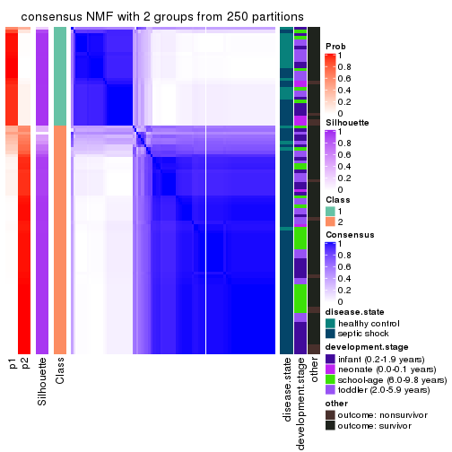</p>

</div>
<div id='tab-MAD-NMF-consensus-heatmap-2'>
<pre><code class="r">consensus_heatmap(res, k = 3)
</code></pre>

<p>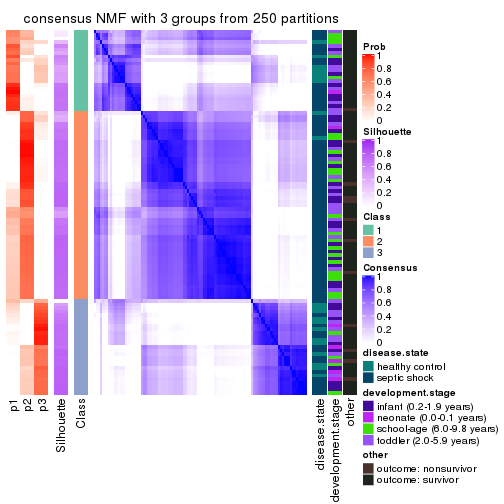</p>

</div>
<div id='tab-MAD-NMF-consensus-heatmap-3'>
<pre><code class="r">consensus_heatmap(res, k = 4)
</code></pre>

<p>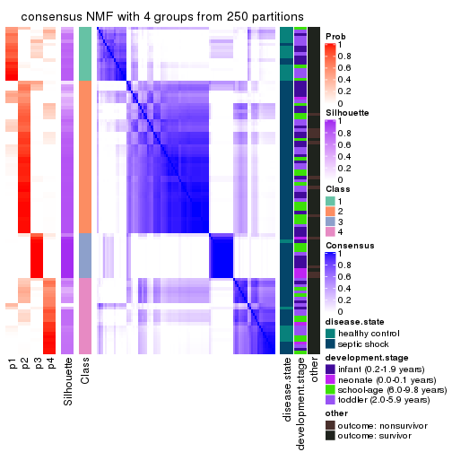</p>

</div>
<div id='tab-MAD-NMF-consensus-heatmap-4'>
<pre><code class="r">consensus_heatmap(res, k = 5)
</code></pre>

<p>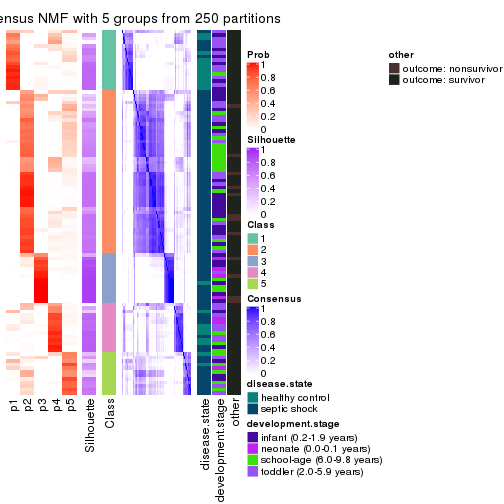</p>

</div>
<div id='tab-MAD-NMF-consensus-heatmap-5'>
<pre><code class="r">consensus_heatmap(res, k = 6)
</code></pre>

<p>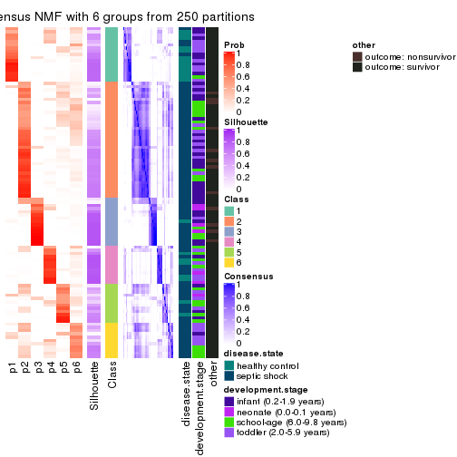</p>

</div>
</div>

Heatmaps for the membership of samples in all partitions to see how consistent they are:


<script>
$( function() {
	$( '#tabs-MAD-NMF-membership-heatmap' ).tabs();
} );
</script>
<div id='tabs-MAD-NMF-membership-heatmap'>
<ul>
<li><a href='#tab-MAD-NMF-membership-heatmap-1'>k = 2</a></li>
<li><a href='#tab-MAD-NMF-membership-heatmap-2'>k = 3</a></li>
<li><a href='#tab-MAD-NMF-membership-heatmap-3'>k = 4</a></li>
<li><a href='#tab-MAD-NMF-membership-heatmap-4'>k = 5</a></li>
<li><a href='#tab-MAD-NMF-membership-heatmap-5'>k = 6</a></li>
</ul>
<div id='tab-MAD-NMF-membership-heatmap-1'>
<pre><code class="r">membership_heatmap(res, k = 2)
</code></pre>

<p>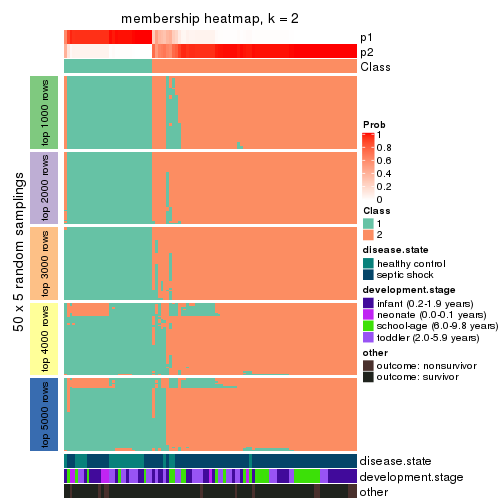</p>

</div>
<div id='tab-MAD-NMF-membership-heatmap-2'>
<pre><code class="r">membership_heatmap(res, k = 3)
</code></pre>

<p>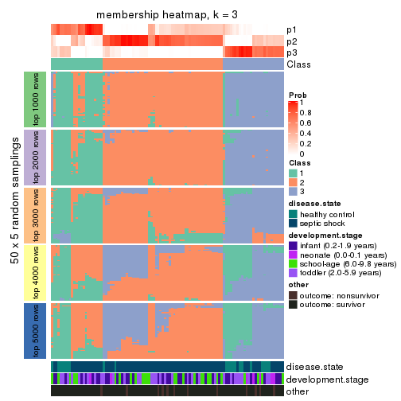</p>

</div>
<div id='tab-MAD-NMF-membership-heatmap-3'>
<pre><code class="r">membership_heatmap(res, k = 4)
</code></pre>

<p>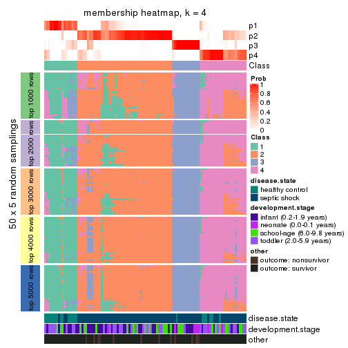</p>

</div>
<div id='tab-MAD-NMF-membership-heatmap-4'>
<pre><code class="r">membership_heatmap(res, k = 5)
</code></pre>

<p>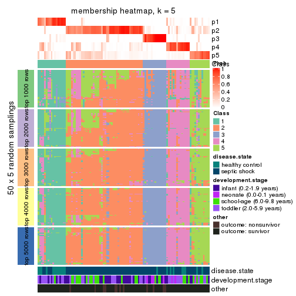</p>

</div>
<div id='tab-MAD-NMF-membership-heatmap-5'>
<pre><code class="r">membership_heatmap(res, k = 6)
</code></pre>

<p>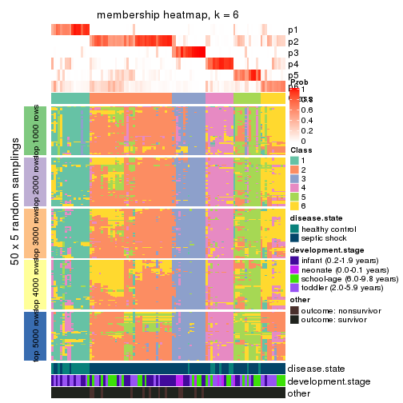</p>

</div>
</div>

As soon as we have had the classes for columns, we can look for signatures
which are significantly different between classes which can be candidate marks
for certain classes. Following are the heatmaps for signatures.


Signature heatmaps where rows are scaled:


<script>
$( function() {
	$( '#tabs-MAD-NMF-get-signatures' ).tabs();
} );
</script>
<div id='tabs-MAD-NMF-get-signatures'>
<ul>
<li><a href='#tab-MAD-NMF-get-signatures-1'>k = 2</a></li>
<li><a href='#tab-MAD-NMF-get-signatures-2'>k = 3</a></li>
<li><a href='#tab-MAD-NMF-get-signatures-3'>k = 4</a></li>
<li><a href='#tab-MAD-NMF-get-signatures-4'>k = 5</a></li>
<li><a href='#tab-MAD-NMF-get-signatures-5'>k = 6</a></li>
</ul>
<div id='tab-MAD-NMF-get-signatures-1'>
<pre><code class="r">get_signatures(res, k = 2)
</code></pre>

<p>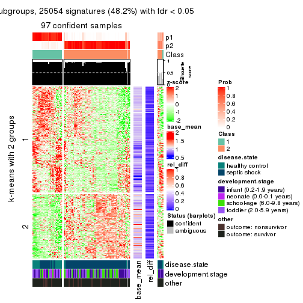</p>

</div>
<div id='tab-MAD-NMF-get-signatures-2'>
<pre><code class="r">get_signatures(res, k = 3)
</code></pre>

<p>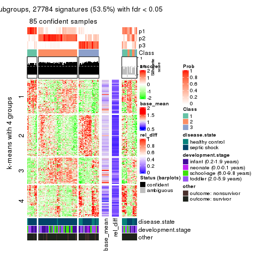</p>

</div>
<div id='tab-MAD-NMF-get-signatures-3'>
<pre><code class="r">get_signatures(res, k = 4)
</code></pre>

<p>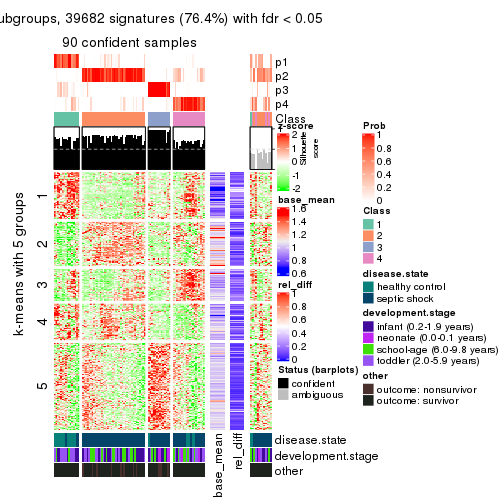</p>

</div>
<div id='tab-MAD-NMF-get-signatures-4'>
<pre><code class="r">get_signatures(res, k = 5)
</code></pre>

<p>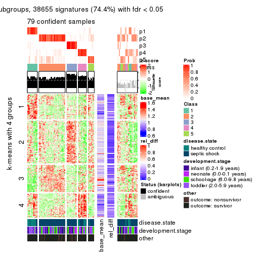</p>

</div>
<div id='tab-MAD-NMF-get-signatures-5'>
<pre><code class="r">get_signatures(res, k = 6)
</code></pre>

<p>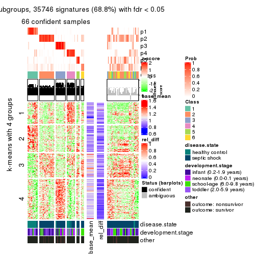</p>

</div>
</div>


Signature heatmaps where rows are not scaled:


<script>
$( function() {
	$( '#tabs-MAD-NMF-get-signatures-no-scale' ).tabs();
} );
</script>
<div id='tabs-MAD-NMF-get-signatures-no-scale'>
<ul>
<li><a href='#tab-MAD-NMF-get-signatures-no-scale-1'>k = 2</a></li>
<li><a href='#tab-MAD-NMF-get-signatures-no-scale-2'>k = 3</a></li>
<li><a href='#tab-MAD-NMF-get-signatures-no-scale-3'>k = 4</a></li>
<li><a href='#tab-MAD-NMF-get-signatures-no-scale-4'>k = 5</a></li>
<li><a href='#tab-MAD-NMF-get-signatures-no-scale-5'>k = 6</a></li>
</ul>
<div id='tab-MAD-NMF-get-signatures-no-scale-1'>
<pre><code class="r">get_signatures(res, k = 2, scale_rows = FALSE)
</code></pre>

<p>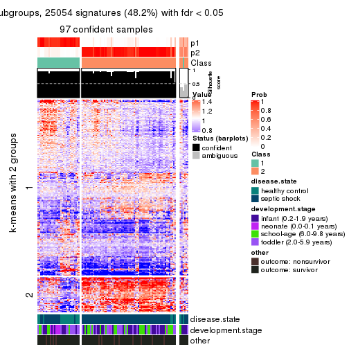</p>

</div>
<div id='tab-MAD-NMF-get-signatures-no-scale-2'>
<pre><code class="r">get_signatures(res, k = 3, scale_rows = FALSE)
</code></pre>

<p>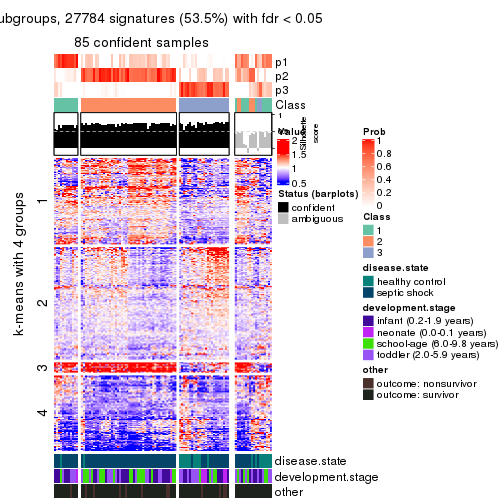</p>

</div>
<div id='tab-MAD-NMF-get-signatures-no-scale-3'>
<pre><code class="r">get_signatures(res, k = 4, scale_rows = FALSE)
</code></pre>

<p>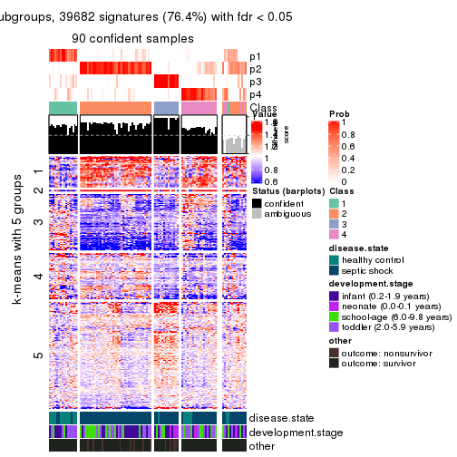</p>

</div>
<div id='tab-MAD-NMF-get-signatures-no-scale-4'>
<pre><code class="r">get_signatures(res, k = 5, scale_rows = FALSE)
</code></pre>

<p>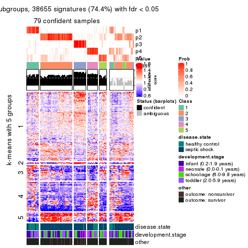</p>

</div>
<div id='tab-MAD-NMF-get-signatures-no-scale-5'>
<pre><code class="r">get_signatures(res, k = 6, scale_rows = FALSE)
</code></pre>

<pre><code>#&gt; Error in mat[ceiling(1:nr/h_ratio), ceiling(1:nc/w_ratio), drop = FALSE]: subscript out of bounds
</code></pre>

<p>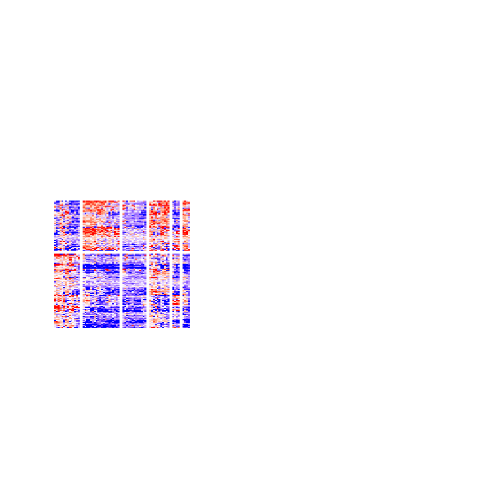</p>

</div>
</div>


Compare the overlap of signatures from different k:

```r
compare_signatures(res)
```

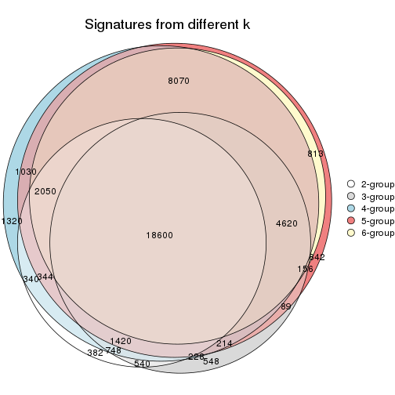

`get_signature()` returns a data frame invisibly. TO get the list of signatures, the function
call should be assigned to a variable explicitly. In following code, if `plot` argument is set
to `FALSE`, no heatmap is plotted while only the differential analysis is performed.

```r
# code only for demonstration
tb = get_signature(res, k = ..., plot = FALSE)
```

An example of the output of `tb` is:

```
#>   which_row         fdr    mean_1    mean_2 scaled_mean_1 scaled_mean_2 km
#> 1        38 0.042760348  8.373488  9.131774    -0.5533452     0.5164555  1
#> 2        40 0.018707592  7.106213  8.469186    -0.6173731     0.5762149  1
#> 3        55 0.019134737 10.221463 11.207825    -0.6159697     0.5749050  1
#> 4        59 0.006059896  5.921854  7.869574    -0.6899429     0.6439467  1
#> 5        60 0.018055526  8.928898 10.211722    -0.6204761     0.5791110  1
#> 6        98 0.009384629 15.714769 14.887706     0.6635654    -0.6193277  2
...
```

The columns in `tb` are:

1. `which_row`: row indices corresponding to the input matrix.
2. `fdr`: FDR for the differential test. 
3. `mean_x`: The mean value in group x.
4. `scaled_mean_x`: The mean value in group x after rows are scaled.
5. `km`: Row groups if k-means clustering is applied to rows.


UMAP plot which shows how samples are separated.


<script>
$( function() {
	$( '#tabs-MAD-NMF-dimension-reduction' ).tabs();
} );
</script>
<div id='tabs-MAD-NMF-dimension-reduction'>
<ul>
<li><a href='#tab-MAD-NMF-dimension-reduction-1'>k = 2</a></li>
<li><a href='#tab-MAD-NMF-dimension-reduction-2'>k = 3</a></li>
<li><a href='#tab-MAD-NMF-dimension-reduction-3'>k = 4</a></li>
<li><a href='#tab-MAD-NMF-dimension-reduction-4'>k = 5</a></li>
<li><a href='#tab-MAD-NMF-dimension-reduction-5'>k = 6</a></li>
</ul>
<div id='tab-MAD-NMF-dimension-reduction-1'>
<pre><code class="r">dimension_reduction(res, k = 2, method = &quot;UMAP&quot;)
</code></pre>

<p>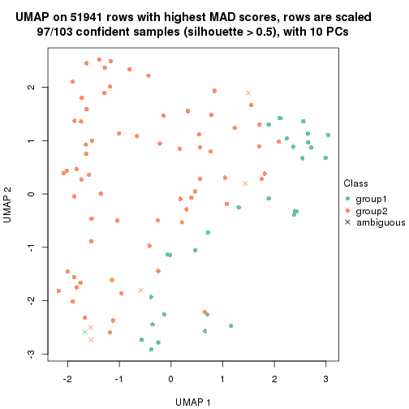</p>

</div>
<div id='tab-MAD-NMF-dimension-reduction-2'>
<pre><code class="r">dimension_reduction(res, k = 3, method = &quot;UMAP&quot;)
</code></pre>

<p>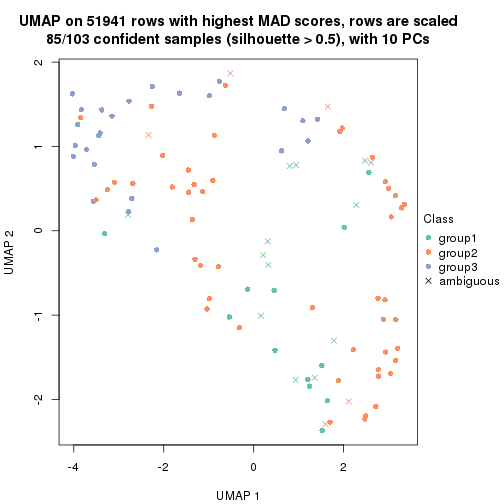</p>

</div>
<div id='tab-MAD-NMF-dimension-reduction-3'>
<pre><code class="r">dimension_reduction(res, k = 4, method = &quot;UMAP&quot;)
</code></pre>

<p>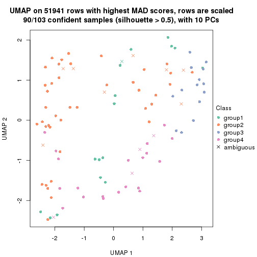</p>

</div>
<div id='tab-MAD-NMF-dimension-reduction-4'>
<pre><code class="r">dimension_reduction(res, k = 5, method = &quot;UMAP&quot;)
</code></pre>

<p>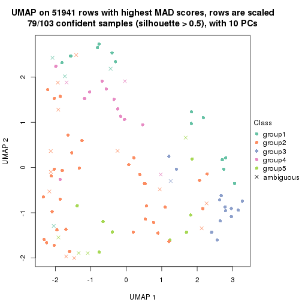</p>

</div>
<div id='tab-MAD-NMF-dimension-reduction-5'>
<pre><code class="r">dimension_reduction(res, k = 6, method = &quot;UMAP&quot;)
</code></pre>

<p>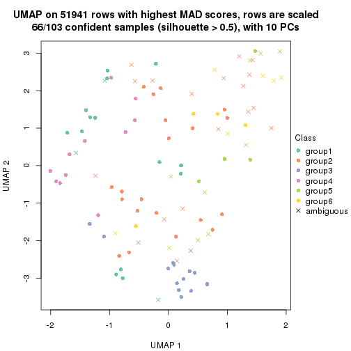</p>

</div>
</div>


Following heatmap shows how subgroups are split when increasing `k`:

```r
collect_classes(res)
```

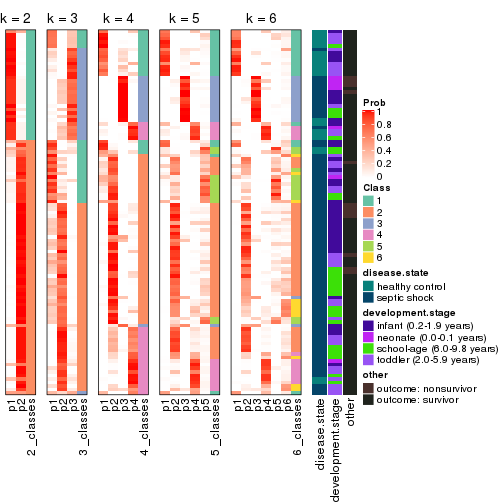


Test correlation between subgroups and known annotations. If the known
annotation is numeric, one-way ANOVA test is applied, and if the known
annotation is discrete, chi-squared contingency table test is applied.

```r
test_to_known_factors(res)
```

```
#>          n disease.state(p) development.stage(p) other(p) k
#> MAD:NMF 97         9.99e-08              0.06193   1.0000 2
#> MAD:NMF 85         1.11e-05              0.07605   0.8135 3
#> MAD:NMF 90         3.04e-10              0.00440   0.0195 4
#> MAD:NMF 79         8.67e-08              0.02346   0.0495 5
#> MAD:NMF 66         8.77e-07              0.00147   0.0763 6
```


If matrix rows can be associated to genes, consider to use `functional_enrichment(res,
...)` to perform function enrichment for the signature genes. See [this vignette](http://bioconductor.org/packages/devel/bioc/vignettes/cola/inst/doc/functional_enrichment.html) for more detailed explanations.


 

---------------------------------------------------


### ATC:hclust


The object with results only for a single top-value method and a single partition method 
can be extracted as:

```r
res = res_list["ATC", "hclust"]
# you can also extract it by
# res = res_list["ATC:hclust"]
```

A summary of `res` and all the functions that can be applied to it:

```r
res
```

```
#> A 'ConsensusPartition' object with k = 2, 3, 4, 5, 6.
#>   On a matrix with 51941 rows and 103 columns.
#>   Top rows (1000, 2000, 3000, 4000, 5000) are extracted by 'ATC' method.
#>   Subgroups are detected by 'hclust' method.
#>   Performed in total 1250 partitions by row resampling.
#>   Best k for subgroups seems to be 3.
#> 
#> Following methods can be applied to this 'ConsensusPartition' object:
#>  [1] "cola_report"             "collect_classes"         "collect_plots"          
#>  [4] "collect_stats"           "colnames"                "compare_signatures"     
#>  [7] "consensus_heatmap"       "dimension_reduction"     "functional_enrichment"  
#> [10] "get_anno_col"            "get_anno"                "get_classes"            
#> [13] "get_consensus"           "get_matrix"              "get_membership"         
#> [16] "get_param"               "get_signatures"          "get_stats"              
#> [19] "is_best_k"               "is_stable_k"             "membership_heatmap"     
#> [22] "ncol"                    "nrow"                    "plot_ecdf"              
#> [25] "rownames"                "select_partition_number" "show"                   
#> [28] "suggest_best_k"          "test_to_known_factors"
```

`collect_plots()` function collects all the plots made from `res` for all `k` (number of partitions)
into one single page to provide an easy and fast comparison between different `k`.

```r
collect_plots(res)
```

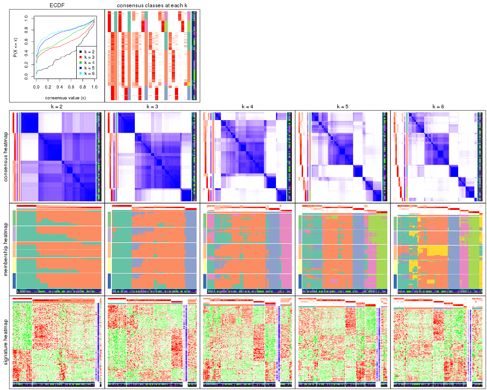

The plots are:

- The first row: a plot of the ECDF (empirical cumulative distribution
  function) curves of the consensus matrix for each `k` and the heatmap of
  predicted classes for each `k`.
- The second row: heatmaps of the consensus matrix for each `k`.
- The third row: heatmaps of the membership matrix for each `k`.
- The fouth row: heatmaps of the signatures for each `k`.

All the plots in panels can be made by individual functions and they are
plotted later in this section.

`select_partition_number()` produces several plots showing different
statistics for choosing "optimized" `k`. There are following statistics:

- ECDF curves of the consensus matrix for each `k`;
- 1-PAC. [The PAC
  score](https://en.wikipedia.org/wiki/Consensus_clustering#Over-interpretation_potential_of_consensus_clustering)
  measures the proportion of the ambiguous subgrouping.
- Mean silhouette score.
- Concordance. The mean probability of fiting the consensus class ids in all
  partitions.
- Area increased. Denote $A_k$ as the area under the ECDF curve for current
  `k`, the area increased is defined as $A_k - A_{k-1}$.
- Rand index. The percent of pairs of samples that are both in a same cluster
  or both are not in a same cluster in the partition of k and k-1.
- Jaccard index. The ratio of pairs of samples are both in a same cluster in
  the partition of k and k-1 and the pairs of samples are both in a same
  cluster in the partition k or k-1.

The detailed explanations of these statistics can be found in [the _cola_
vignette](http://bioconductor.org/packages/devel/bioc/vignettes/cola/inst/doc/cola.html#toc_13).

Generally speaking, lower PAC score, higher mean silhouette score or higher
concordance corresponds to better partition. Rand index and Jaccard index
measure how similar the current partition is compared to partition with `k-1`.
If they are too similar, we won't accept `k` is better than `k-1`.

```r
select_partition_number(res)
```

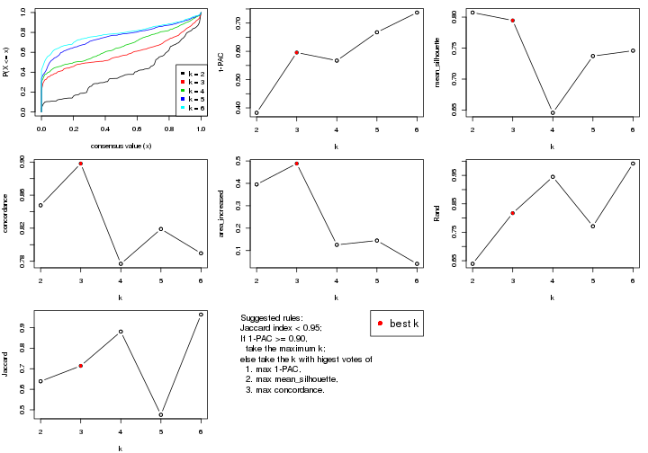

The numeric values for all these statistics can be obtained by `get_stats()`.

```r
get_stats(res)
```

```
#>   k 1-PAC mean_silhouette concordance area_increased  Rand Jaccard
#> 2 2 0.382           0.807       0.848         0.3951 0.639   0.639
#> 3 3 0.596           0.795       0.898         0.4884 0.817   0.714
#> 4 4 0.567           0.646       0.777         0.1254 0.945   0.881
#> 5 5 0.667           0.737       0.819         0.1447 0.771   0.476
#> 6 6 0.737           0.746       0.790         0.0407 0.992   0.964
```

`suggest_best_k()` suggests the best $k$ based on these statistics. The rules are as follows:

- All $k$ with Jaccard index larger than 0.95 are removed because increasing
  $k$ does not provide enough extra information. If all $k$ are removed, it is
  marked as no subgroup is detected.
- For all $k$ with 1-PAC score larger than 0.9, the maximal $k$ is taken as
  the best $k$, and other $k$ are marked as optional $k$.
- If it does not fit the second rule. The $k$ with the maximal vote of the
  highest 1-PAC score, highest mean silhouette, and highest concordance is
  taken as the best $k$.

```r
suggest_best_k(res)
```

```
#> [1] 3
```


Following shows the table of the partitions (You need to click the **show/hide
code output** link to see it). The membership matrix (columns with name `p*`)
is inferred by
[`clue::cl_consensus()`](https://www.rdocumentation.org/link/cl_consensus?package=clue)
function with the `SE` method. Basically the value in the membership matrix
represents the probability to belong to a certain group. The finall class
label for an item is determined with the group with highest probability it
belongs to.

In `get_classes()` function, the entropy is calculated from the membership
matrix and the silhouette score is calculated from the consensus matrix.


<script>
$( function() {
	$( '#tabs-ATC-hclust-get-classes' ).tabs();
} );
</script>
<div id='tabs-ATC-hclust-get-classes'>
<ul>
<li><a href='#tab-ATC-hclust-get-classes-1'>k = 2</a></li>
<li><a href='#tab-ATC-hclust-get-classes-2'>k = 3</a></li>
<li><a href='#tab-ATC-hclust-get-classes-3'>k = 4</a></li>
<li><a href='#tab-ATC-hclust-get-classes-4'>k = 5</a></li>
<li><a href='#tab-ATC-hclust-get-classes-5'>k = 6</a></li>
</ul>

<div id='tab-ATC-hclust-get-classes-1'>
<p><a id='tab-ATC-hclust-get-classes-1-a' style='color:#0366d6' href='#'>show/hide code output</a></p>
<pre><code class="r">cbind(get_classes(res, k = 2), get_membership(res, k = 2))
</code></pre>

<pre><code>#&gt;           class entropy silhouette    p1    p2
#&gt; GSM647569     2  0.0000      0.764 0.000 1.000
#&gt; GSM647574     2  0.4431      0.798 0.092 0.908
#&gt; GSM647577     2  0.0000      0.764 0.000 1.000
#&gt; GSM647547     2  0.9998      0.497 0.492 0.508
#&gt; GSM647552     2  0.3274      0.788 0.060 0.940
#&gt; GSM647553     2  0.6343      0.810 0.160 0.840
#&gt; GSM647565     1  0.0000      0.985 1.000 0.000
#&gt; GSM647545     2  0.9815      0.663 0.420 0.580
#&gt; GSM647549     1  0.0672      0.979 0.992 0.008
#&gt; GSM647550     2  0.8661      0.797 0.288 0.712
#&gt; GSM647560     2  0.0672      0.769 0.008 0.992
#&gt; GSM647617     2  0.0000      0.764 0.000 1.000
#&gt; GSM647528     2  0.9815      0.663 0.420 0.580
#&gt; GSM647529     1  0.0000      0.985 1.000 0.000
#&gt; GSM647531     1  0.0000      0.985 1.000 0.000
#&gt; GSM647540     2  0.0000      0.764 0.000 1.000
#&gt; GSM647541     2  0.7883      0.810 0.236 0.764
#&gt; GSM647546     2  0.1414      0.774 0.020 0.980
#&gt; GSM647557     1  0.0672      0.979 0.992 0.008
#&gt; GSM647561     1  0.0000      0.985 1.000 0.000
#&gt; GSM647567     2  0.9044      0.779 0.320 0.680
#&gt; GSM647568     2  0.7219      0.813 0.200 0.800
#&gt; GSM647570     2  0.9815      0.663 0.420 0.580
#&gt; GSM647573     1  0.0000      0.985 1.000 0.000
#&gt; GSM647576     2  0.1414      0.774 0.020 0.980
#&gt; GSM647579     2  0.0000      0.764 0.000 1.000
#&gt; GSM647580     2  0.0000      0.764 0.000 1.000
#&gt; GSM647583     2  0.0000      0.764 0.000 1.000
#&gt; GSM647592     2  0.8661      0.797 0.288 0.712
#&gt; GSM647593     2  0.8713      0.795 0.292 0.708
#&gt; GSM647595     2  0.9044      0.778 0.320 0.680
#&gt; GSM647597     1  0.0000      0.985 1.000 0.000
#&gt; GSM647598     2  0.9427      0.740 0.360 0.640
#&gt; GSM647613     1  0.0000      0.985 1.000 0.000
#&gt; GSM647615     2  0.8386      0.804 0.268 0.732
#&gt; GSM647616     2  0.0000      0.764 0.000 1.000
#&gt; GSM647619     2  0.8713      0.795 0.292 0.708
#&gt; GSM647582     2  0.5842      0.808 0.140 0.860
#&gt; GSM647591     2  0.9044      0.778 0.320 0.680
#&gt; GSM647527     2  0.9815      0.663 0.420 0.580
#&gt; GSM647530     1  0.0000      0.985 1.000 0.000
#&gt; GSM647532     1  0.0000      0.985 1.000 0.000
#&gt; GSM647544     2  0.9686      0.695 0.396 0.604
#&gt; GSM647551     2  0.8713      0.795 0.292 0.708
#&gt; GSM647556     2  0.0376      0.767 0.004 0.996
#&gt; GSM647558     2  0.9815      0.663 0.420 0.580
#&gt; GSM647572     2  0.4939      0.801 0.108 0.892
#&gt; GSM647578     2  0.0376      0.767 0.004 0.996
#&gt; GSM647581     1  0.0000      0.985 1.000 0.000
#&gt; GSM647594     1  0.0000      0.985 1.000 0.000
#&gt; GSM647599     2  0.0376      0.767 0.004 0.996
#&gt; GSM647600     2  0.0000      0.764 0.000 1.000
#&gt; GSM647601     2  0.9000      0.781 0.316 0.684
#&gt; GSM647603     2  0.0000      0.764 0.000 1.000
#&gt; GSM647610     2  0.7883      0.810 0.236 0.764
#&gt; GSM647611     2  0.8661      0.797 0.288 0.712
#&gt; GSM647612     2  0.8499      0.801 0.276 0.724
#&gt; GSM647614     2  0.7219      0.813 0.200 0.800
#&gt; GSM647618     2  0.9044      0.778 0.320 0.680
#&gt; GSM647629     2  0.7745      0.812 0.228 0.772
#&gt; GSM647535     2  0.1414      0.774 0.020 0.980
#&gt; GSM647563     2  0.9393      0.741 0.356 0.644
#&gt; GSM647542     2  0.7219      0.813 0.200 0.800
#&gt; GSM647543     2  0.7219      0.813 0.200 0.800
#&gt; GSM647548     1  0.0938      0.973 0.988 0.012
#&gt; GSM647554     2  0.7883      0.810 0.236 0.764
#&gt; GSM647555     2  0.1414      0.774 0.020 0.980
#&gt; GSM647559     2  0.8813      0.791 0.300 0.700
#&gt; GSM647562     1  0.0000      0.985 1.000 0.000
#&gt; GSM647564     2  0.0376      0.767 0.004 0.996
#&gt; GSM647571     2  0.1414      0.774 0.020 0.980
#&gt; GSM647584     2  0.8713      0.795 0.292 0.708
#&gt; GSM647585     2  0.0000      0.764 0.000 1.000
#&gt; GSM647586     2  0.9000      0.781 0.316 0.684
#&gt; GSM647587     2  0.9815      0.663 0.420 0.580
#&gt; GSM647588     2  0.8763      0.793 0.296 0.704
#&gt; GSM647596     2  0.9815      0.663 0.420 0.580
#&gt; GSM647602     2  0.0000      0.764 0.000 1.000
#&gt; GSM647609     2  0.8713      0.795 0.292 0.708
#&gt; GSM647620     2  0.8608      0.798 0.284 0.716
#&gt; GSM647627     2  0.8713      0.795 0.292 0.708
#&gt; GSM647628     2  0.9661      0.699 0.392 0.608
#&gt; GSM647533     2  0.7219      0.813 0.200 0.800
#&gt; GSM647536     1  0.0000      0.985 1.000 0.000
#&gt; GSM647537     2  0.7219      0.813 0.200 0.800
#&gt; GSM647606     1  0.7139      0.639 0.804 0.196
#&gt; GSM647621     2  0.9998      0.497 0.492 0.508
#&gt; GSM647626     2  0.0000      0.764 0.000 1.000
#&gt; GSM647538     2  0.8713      0.795 0.292 0.708
#&gt; GSM647575     1  0.0376      0.983 0.996 0.004
#&gt; GSM647590     1  0.0376      0.983 0.996 0.004
#&gt; GSM647605     1  0.0376      0.983 0.996 0.004
#&gt; GSM647607     1  0.0000      0.985 1.000 0.000
#&gt; GSM647608     2  0.9993      0.517 0.484 0.516
#&gt; GSM647622     2  0.5408      0.804 0.124 0.876
#&gt; GSM647623     2  0.4431      0.798 0.092 0.908
#&gt; GSM647624     1  0.0000      0.985 1.000 0.000
#&gt; GSM647625     2  0.4431      0.798 0.092 0.908
#&gt; GSM647534     2  0.0376      0.767 0.004 0.996
#&gt; GSM647539     1  0.0000      0.985 1.000 0.000
#&gt; GSM647566     2  0.8713      0.795 0.292 0.708
#&gt; GSM647589     2  0.9993      0.517 0.484 0.516
#&gt; GSM647604     1  0.0376      0.983 0.996 0.004
</code></pre>

<script>
$('#tab-ATC-hclust-get-classes-1-a').parent().next().next().hide();
$('#tab-ATC-hclust-get-classes-1-a').click(function(){
  $('#tab-ATC-hclust-get-classes-1-a').parent().next().next().toggle();
  return(false);
});
</script>
</div>

<div id='tab-ATC-hclust-get-classes-2'>
<p><a id='tab-ATC-hclust-get-classes-2-a' style='color:#0366d6' href='#'>show/hide code output</a></p>
<pre><code class="r">cbind(get_classes(res, k = 3), get_membership(res, k = 3))
</code></pre>

<pre><code>#&gt;           class entropy silhouette    p1    p2    p3
#&gt; GSM647569     3  0.0000      0.934 0.000 0.000 1.000
#&gt; GSM647574     2  0.5291      0.678 0.000 0.732 0.268
#&gt; GSM647577     3  0.0000      0.934 0.000 0.000 1.000
#&gt; GSM647547     2  0.5024      0.686 0.220 0.776 0.004
#&gt; GSM647552     2  0.5650      0.602 0.000 0.688 0.312
#&gt; GSM647553     2  0.3482      0.794 0.000 0.872 0.128
#&gt; GSM647565     1  0.0000      0.962 1.000 0.000 0.000
#&gt; GSM647545     2  0.3686      0.779 0.140 0.860 0.000
#&gt; GSM647549     1  0.1411      0.943 0.964 0.036 0.000
#&gt; GSM647550     2  0.0000      0.835 0.000 1.000 0.000
#&gt; GSM647560     2  0.6267      0.321 0.000 0.548 0.452
#&gt; GSM647617     3  0.0000      0.934 0.000 0.000 1.000
#&gt; GSM647528     2  0.3686      0.779 0.140 0.860 0.000
#&gt; GSM647529     1  0.0000      0.962 1.000 0.000 0.000
#&gt; GSM647531     1  0.0000      0.962 1.000 0.000 0.000
#&gt; GSM647540     3  0.0000      0.934 0.000 0.000 1.000
#&gt; GSM647541     2  0.1860      0.828 0.000 0.948 0.052
#&gt; GSM647546     2  0.6215      0.380 0.000 0.572 0.428
#&gt; GSM647557     1  0.1411      0.943 0.964 0.036 0.000
#&gt; GSM647561     1  0.0424      0.961 0.992 0.008 0.000
#&gt; GSM647567     2  0.1529      0.832 0.040 0.960 0.000
#&gt; GSM647568     2  0.3030      0.815 0.004 0.904 0.092
#&gt; GSM647570     2  0.3686      0.779 0.140 0.860 0.000
#&gt; GSM647573     1  0.0000      0.962 1.000 0.000 0.000
#&gt; GSM647576     2  0.6204      0.389 0.000 0.576 0.424
#&gt; GSM647579     3  0.0000      0.934 0.000 0.000 1.000
#&gt; GSM647580     3  0.0000      0.934 0.000 0.000 1.000
#&gt; GSM647583     3  0.0000      0.934 0.000 0.000 1.000
#&gt; GSM647592     2  0.0000      0.835 0.000 1.000 0.000
#&gt; GSM647593     2  0.0237      0.835 0.004 0.996 0.000
#&gt; GSM647595     2  0.1289      0.833 0.032 0.968 0.000
#&gt; GSM647597     1  0.0000      0.962 1.000 0.000 0.000
#&gt; GSM647598     2  0.2537      0.814 0.080 0.920 0.000
#&gt; GSM647613     1  0.0424      0.961 0.992 0.008 0.000
#&gt; GSM647615     2  0.1031      0.836 0.000 0.976 0.024
#&gt; GSM647616     3  0.0000      0.934 0.000 0.000 1.000
#&gt; GSM647619     2  0.0237      0.835 0.004 0.996 0.000
#&gt; GSM647582     2  0.4702      0.725 0.000 0.788 0.212
#&gt; GSM647591     2  0.1289      0.833 0.032 0.968 0.000
#&gt; GSM647527     2  0.3686      0.779 0.140 0.860 0.000
#&gt; GSM647530     1  0.0000      0.962 1.000 0.000 0.000
#&gt; GSM647532     1  0.0000      0.962 1.000 0.000 0.000
#&gt; GSM647544     2  0.3267      0.794 0.116 0.884 0.000
#&gt; GSM647551     2  0.0661      0.837 0.004 0.988 0.008
#&gt; GSM647556     3  0.4605      0.653 0.000 0.204 0.796
#&gt; GSM647558     2  0.3686      0.779 0.140 0.860 0.000
#&gt; GSM647572     2  0.4346      0.752 0.000 0.816 0.184
#&gt; GSM647578     2  0.6308      0.200 0.000 0.508 0.492
#&gt; GSM647581     1  0.0000      0.962 1.000 0.000 0.000
#&gt; GSM647594     1  0.0000      0.962 1.000 0.000 0.000
#&gt; GSM647599     2  0.6307      0.214 0.000 0.512 0.488
#&gt; GSM647600     3  0.0000      0.934 0.000 0.000 1.000
#&gt; GSM647601     2  0.1289      0.833 0.032 0.968 0.000
#&gt; GSM647603     3  0.0000      0.934 0.000 0.000 1.000
#&gt; GSM647610     2  0.1860      0.828 0.000 0.948 0.052
#&gt; GSM647611     2  0.0000      0.835 0.000 1.000 0.000
#&gt; GSM647612     2  0.0592      0.835 0.000 0.988 0.012
#&gt; GSM647614     2  0.3030      0.815 0.004 0.904 0.092
#&gt; GSM647618     2  0.1289      0.833 0.032 0.968 0.000
#&gt; GSM647629     2  0.2066      0.827 0.000 0.940 0.060
#&gt; GSM647535     2  0.6215      0.380 0.000 0.572 0.428
#&gt; GSM647563     2  0.2356      0.816 0.072 0.928 0.000
#&gt; GSM647542     2  0.3030      0.815 0.004 0.904 0.092
#&gt; GSM647543     2  0.3030      0.815 0.004 0.904 0.092
#&gt; GSM647548     1  0.0892      0.952 0.980 0.020 0.000
#&gt; GSM647554     2  0.1860      0.828 0.000 0.948 0.052
#&gt; GSM647555     2  0.6215      0.380 0.000 0.572 0.428
#&gt; GSM647559     2  0.0747      0.836 0.016 0.984 0.000
#&gt; GSM647562     1  0.0424      0.961 0.992 0.008 0.000
#&gt; GSM647564     3  0.6280     -0.101 0.000 0.460 0.540
#&gt; GSM647571     2  0.6215      0.380 0.000 0.572 0.428
#&gt; GSM647584     2  0.0237      0.835 0.004 0.996 0.000
#&gt; GSM647585     3  0.0592      0.924 0.000 0.012 0.988
#&gt; GSM647586     2  0.1289      0.833 0.032 0.968 0.000
#&gt; GSM647587     2  0.3686      0.779 0.140 0.860 0.000
#&gt; GSM647588     2  0.0592      0.836 0.012 0.988 0.000
#&gt; GSM647596     2  0.3686      0.779 0.140 0.860 0.000
#&gt; GSM647602     3  0.0000      0.934 0.000 0.000 1.000
#&gt; GSM647609     2  0.0237      0.835 0.004 0.996 0.000
#&gt; GSM647620     2  0.0237      0.835 0.000 0.996 0.004
#&gt; GSM647627     2  0.0237      0.835 0.004 0.996 0.000
#&gt; GSM647628     2  0.3349      0.797 0.108 0.888 0.004
#&gt; GSM647533     2  0.2878      0.813 0.000 0.904 0.096
#&gt; GSM647536     1  0.0000      0.962 1.000 0.000 0.000
#&gt; GSM647537     2  0.2878      0.813 0.000 0.904 0.096
#&gt; GSM647606     1  0.5835      0.489 0.660 0.340 0.000
#&gt; GSM647621     2  0.5024      0.686 0.220 0.776 0.004
#&gt; GSM647626     3  0.0000      0.934 0.000 0.000 1.000
#&gt; GSM647538     2  0.0424      0.836 0.008 0.992 0.000
#&gt; GSM647575     1  0.1643      0.938 0.956 0.044 0.000
#&gt; GSM647590     1  0.1964      0.929 0.944 0.056 0.000
#&gt; GSM647605     1  0.2261      0.918 0.932 0.068 0.000
#&gt; GSM647607     1  0.0000      0.962 1.000 0.000 0.000
#&gt; GSM647608     2  0.4931      0.696 0.212 0.784 0.004
#&gt; GSM647622     2  0.4235      0.759 0.000 0.824 0.176
#&gt; GSM647623     2  0.5138      0.682 0.000 0.748 0.252
#&gt; GSM647624     1  0.0000      0.962 1.000 0.000 0.000
#&gt; GSM647625     2  0.5138      0.682 0.000 0.748 0.252
#&gt; GSM647534     2  0.6180      0.415 0.000 0.584 0.416
#&gt; GSM647539     1  0.0000      0.962 1.000 0.000 0.000
#&gt; GSM647566     2  0.0424      0.836 0.008 0.992 0.000
#&gt; GSM647589     2  0.4931      0.696 0.212 0.784 0.004
#&gt; GSM647604     1  0.2356      0.913 0.928 0.072 0.000
</code></pre>

<script>
$('#tab-ATC-hclust-get-classes-2-a').parent().next().next().hide();
$('#tab-ATC-hclust-get-classes-2-a').click(function(){
  $('#tab-ATC-hclust-get-classes-2-a').parent().next().next().toggle();
  return(false);
});
</script>
</div>

<div id='tab-ATC-hclust-get-classes-3'>
<p><a id='tab-ATC-hclust-get-classes-3-a' style='color:#0366d6' href='#'>show/hide code output</a></p>
<pre><code class="r">cbind(get_classes(res, k = 4), get_membership(res, k = 4))
</code></pre>

<pre><code>#&gt;           class entropy silhouette    p1    p2    p3    p4
#&gt; GSM647569     3  0.0000     0.8330 0.000 0.000 1.000 0.000
#&gt; GSM647574     2  0.7203     0.5024 0.312 0.524 0.164 0.000
#&gt; GSM647577     3  0.0000     0.8330 0.000 0.000 1.000 0.000
#&gt; GSM647547     2  0.4713     0.5036 0.360 0.640 0.000 0.000
#&gt; GSM647552     2  0.7429     0.4130 0.316 0.492 0.192 0.000
#&gt; GSM647553     2  0.5882     0.6157 0.344 0.608 0.048 0.000
#&gt; GSM647565     4  0.5000    -0.7088 0.496 0.000 0.000 0.504
#&gt; GSM647545     2  0.3587     0.7091 0.088 0.860 0.000 0.052
#&gt; GSM647549     4  0.1820     0.7946 0.020 0.036 0.000 0.944
#&gt; GSM647550     2  0.1022     0.7725 0.032 0.968 0.000 0.000
#&gt; GSM647560     2  0.7896     0.0441 0.292 0.360 0.348 0.000
#&gt; GSM647617     3  0.0000     0.8330 0.000 0.000 1.000 0.000
#&gt; GSM647528     2  0.3587     0.7091 0.088 0.860 0.000 0.052
#&gt; GSM647529     4  0.0000     0.8479 0.000 0.000 0.000 1.000
#&gt; GSM647531     4  0.0000     0.8479 0.000 0.000 0.000 1.000
#&gt; GSM647540     3  0.0000     0.8330 0.000 0.000 1.000 0.000
#&gt; GSM647541     2  0.2814     0.7551 0.132 0.868 0.000 0.000
#&gt; GSM647546     2  0.7910     0.1097 0.320 0.364 0.316 0.000
#&gt; GSM647557     4  0.1820     0.7946 0.020 0.036 0.000 0.944
#&gt; GSM647561     4  0.1042     0.8346 0.020 0.008 0.000 0.972
#&gt; GSM647567     2  0.2149     0.7618 0.088 0.912 0.000 0.000
#&gt; GSM647568     2  0.4804     0.6896 0.276 0.708 0.016 0.000
#&gt; GSM647570     2  0.3587     0.7091 0.088 0.860 0.000 0.052
#&gt; GSM647573     1  0.4972     0.7533 0.544 0.000 0.000 0.456
#&gt; GSM647576     2  0.7905     0.1215 0.320 0.368 0.312 0.000
#&gt; GSM647579     3  0.0000     0.8330 0.000 0.000 1.000 0.000
#&gt; GSM647580     3  0.0000     0.8330 0.000 0.000 1.000 0.000
#&gt; GSM647583     3  0.0000     0.8330 0.000 0.000 1.000 0.000
#&gt; GSM647592     2  0.1022     0.7725 0.032 0.968 0.000 0.000
#&gt; GSM647593     2  0.0000     0.7690 0.000 1.000 0.000 0.000
#&gt; GSM647595     2  0.1174     0.7646 0.020 0.968 0.000 0.012
#&gt; GSM647597     4  0.0336     0.8452 0.008 0.000 0.000 0.992
#&gt; GSM647598     2  0.2385     0.7472 0.028 0.920 0.000 0.052
#&gt; GSM647613     4  0.1042     0.8346 0.020 0.008 0.000 0.972
#&gt; GSM647615     2  0.2198     0.7698 0.072 0.920 0.008 0.000
#&gt; GSM647616     3  0.0000     0.8330 0.000 0.000 1.000 0.000
#&gt; GSM647619     2  0.0000     0.7690 0.000 1.000 0.000 0.000
#&gt; GSM647582     2  0.5993     0.6423 0.160 0.692 0.148 0.000
#&gt; GSM647591     2  0.1174     0.7646 0.020 0.968 0.000 0.012
#&gt; GSM647527     2  0.3587     0.7091 0.088 0.860 0.000 0.052
#&gt; GSM647530     4  0.0000     0.8479 0.000 0.000 0.000 1.000
#&gt; GSM647532     4  0.0000     0.8479 0.000 0.000 0.000 1.000
#&gt; GSM647544     2  0.3107     0.7222 0.080 0.884 0.000 0.036
#&gt; GSM647551     2  0.0469     0.7713 0.012 0.988 0.000 0.000
#&gt; GSM647556     3  0.5434     0.6405 0.188 0.084 0.728 0.000
#&gt; GSM647558     2  0.3587     0.7091 0.088 0.860 0.000 0.052
#&gt; GSM647572     2  0.6409     0.5634 0.364 0.560 0.076 0.000
#&gt; GSM647578     3  0.7841     0.0230 0.272 0.332 0.396 0.000
#&gt; GSM647581     4  0.0000     0.8479 0.000 0.000 0.000 1.000
#&gt; GSM647594     4  0.0000     0.8479 0.000 0.000 0.000 1.000
#&gt; GSM647599     3  0.7824    -0.0140 0.260 0.348 0.392 0.000
#&gt; GSM647600     3  0.0000     0.8330 0.000 0.000 1.000 0.000
#&gt; GSM647601     2  0.1151     0.7642 0.024 0.968 0.000 0.008
#&gt; GSM647603     3  0.0000     0.8330 0.000 0.000 1.000 0.000
#&gt; GSM647610     2  0.2760     0.7560 0.128 0.872 0.000 0.000
#&gt; GSM647611     2  0.1022     0.7725 0.032 0.968 0.000 0.000
#&gt; GSM647612     2  0.1716     0.7706 0.064 0.936 0.000 0.000
#&gt; GSM647614     2  0.4804     0.6896 0.276 0.708 0.016 0.000
#&gt; GSM647618     2  0.1174     0.7646 0.020 0.968 0.000 0.012
#&gt; GSM647629     2  0.3196     0.7520 0.136 0.856 0.008 0.000
#&gt; GSM647535     2  0.7910     0.1097 0.320 0.364 0.316 0.000
#&gt; GSM647563     2  0.1978     0.7424 0.068 0.928 0.000 0.004
#&gt; GSM647542     2  0.4804     0.6896 0.276 0.708 0.016 0.000
#&gt; GSM647543     2  0.4804     0.6896 0.276 0.708 0.016 0.000
#&gt; GSM647548     1  0.5607     0.6937 0.496 0.020 0.000 0.484
#&gt; GSM647554     2  0.2760     0.7560 0.128 0.872 0.000 0.000
#&gt; GSM647555     2  0.7910     0.1097 0.320 0.364 0.316 0.000
#&gt; GSM647559     2  0.0657     0.7677 0.012 0.984 0.000 0.004
#&gt; GSM647562     4  0.1151     0.8305 0.024 0.008 0.000 0.968
#&gt; GSM647564     3  0.7710     0.1571 0.256 0.296 0.448 0.000
#&gt; GSM647571     2  0.7910     0.1097 0.320 0.364 0.316 0.000
#&gt; GSM647584     2  0.0000     0.7690 0.000 1.000 0.000 0.000
#&gt; GSM647585     3  0.1557     0.8016 0.056 0.000 0.944 0.000
#&gt; GSM647586     2  0.1151     0.7642 0.024 0.968 0.000 0.008
#&gt; GSM647587     2  0.3587     0.7091 0.088 0.860 0.000 0.052
#&gt; GSM647588     2  0.0524     0.7685 0.008 0.988 0.000 0.004
#&gt; GSM647596     2  0.3587     0.7091 0.088 0.860 0.000 0.052
#&gt; GSM647602     3  0.0000     0.8330 0.000 0.000 1.000 0.000
#&gt; GSM647609     2  0.0000     0.7690 0.000 1.000 0.000 0.000
#&gt; GSM647620     2  0.1389     0.7728 0.048 0.952 0.000 0.000
#&gt; GSM647627     2  0.0469     0.7705 0.012 0.988 0.000 0.000
#&gt; GSM647628     2  0.3266     0.7095 0.168 0.832 0.000 0.000
#&gt; GSM647533     2  0.5159     0.6366 0.364 0.624 0.012 0.000
#&gt; GSM647536     4  0.0000     0.8479 0.000 0.000 0.000 1.000
#&gt; GSM647537     2  0.5159     0.6366 0.364 0.624 0.012 0.000
#&gt; GSM647606     1  0.6783     0.4094 0.572 0.304 0.000 0.124
#&gt; GSM647621     2  0.4713     0.5036 0.360 0.640 0.000 0.000
#&gt; GSM647626     3  0.0469     0.8255 0.012 0.000 0.988 0.000
#&gt; GSM647538     2  0.1474     0.7694 0.052 0.948 0.000 0.000
#&gt; GSM647575     1  0.5933     0.7913 0.552 0.040 0.000 0.408
#&gt; GSM647590     1  0.6111     0.7912 0.556 0.052 0.000 0.392
#&gt; GSM647605     1  0.6276     0.7824 0.556 0.064 0.000 0.380
#&gt; GSM647607     1  0.4972     0.7533 0.544 0.000 0.000 0.456
#&gt; GSM647608     2  0.4804     0.5063 0.384 0.616 0.000 0.000
#&gt; GSM647622     2  0.6306     0.5504 0.392 0.544 0.064 0.000
#&gt; GSM647623     2  0.6936     0.5135 0.320 0.548 0.132 0.000
#&gt; GSM647624     1  0.4972     0.7533 0.544 0.000 0.000 0.456
#&gt; GSM647625     2  0.6936     0.5135 0.320 0.548 0.132 0.000
#&gt; GSM647534     2  0.7875     0.1620 0.316 0.388 0.296 0.000
#&gt; GSM647539     4  0.5000    -0.7088 0.496 0.000 0.000 0.504
#&gt; GSM647566     2  0.1474     0.7694 0.052 0.948 0.000 0.000
#&gt; GSM647589     2  0.4804     0.5063 0.384 0.616 0.000 0.000
#&gt; GSM647604     1  0.6326     0.7767 0.556 0.068 0.000 0.376
</code></pre>

<script>
$('#tab-ATC-hclust-get-classes-3-a').parent().next().next().hide();
$('#tab-ATC-hclust-get-classes-3-a').click(function(){
  $('#tab-ATC-hclust-get-classes-3-a').parent().next().next().toggle();
  return(false);
});
</script>
</div>

<div id='tab-ATC-hclust-get-classes-4'>
<p><a id='tab-ATC-hclust-get-classes-4-a' style='color:#0366d6' href='#'>show/hide code output</a></p>
<pre><code class="r">cbind(get_classes(res, k = 5), get_membership(res, k = 5))
</code></pre>

<pre><code>#&gt;           class entropy silhouette    p1    p2    p3    p4    p5
#&gt; GSM647569     3  0.0000      0.960 0.000 0.000 1.000 0.000 0.000
#&gt; GSM647574     1  0.4211      0.655 0.792 0.032 0.148 0.028 0.000
#&gt; GSM647577     3  0.0000      0.960 0.000 0.000 1.000 0.000 0.000
#&gt; GSM647547     4  0.6100      0.204 0.388 0.128 0.000 0.484 0.000
#&gt; GSM647552     1  0.5673      0.697 0.676 0.132 0.172 0.020 0.000
#&gt; GSM647553     1  0.3806      0.665 0.840 0.056 0.040 0.064 0.000
#&gt; GSM647565     4  0.4350      0.513 0.000 0.004 0.000 0.588 0.408
#&gt; GSM647545     2  0.2946      0.824 0.000 0.868 0.000 0.088 0.044
#&gt; GSM647549     5  0.1741      0.917 0.000 0.040 0.000 0.024 0.936
#&gt; GSM647550     2  0.2286      0.817 0.108 0.888 0.000 0.004 0.000
#&gt; GSM647560     1  0.5024      0.625 0.628 0.040 0.328 0.004 0.000
#&gt; GSM647617     3  0.0000      0.960 0.000 0.000 1.000 0.000 0.000
#&gt; GSM647528     2  0.2946      0.824 0.000 0.868 0.000 0.088 0.044
#&gt; GSM647529     5  0.0000      0.969 0.000 0.000 0.000 0.000 1.000
#&gt; GSM647531     5  0.0000      0.969 0.000 0.000 0.000 0.000 1.000
#&gt; GSM647540     3  0.0000      0.960 0.000 0.000 1.000 0.000 0.000
#&gt; GSM647541     2  0.3906      0.587 0.292 0.704 0.000 0.004 0.000
#&gt; GSM647546     1  0.4880      0.662 0.660 0.040 0.296 0.004 0.000
#&gt; GSM647557     5  0.1741      0.917 0.000 0.040 0.000 0.024 0.936
#&gt; GSM647561     5  0.1106      0.954 0.000 0.012 0.000 0.024 0.964
#&gt; GSM647567     2  0.5136      0.648 0.116 0.688 0.000 0.196 0.000
#&gt; GSM647568     1  0.5241      0.524 0.672 0.252 0.012 0.064 0.000
#&gt; GSM647570     2  0.2946      0.824 0.000 0.868 0.000 0.088 0.044
#&gt; GSM647573     4  0.4196      0.576 0.000 0.004 0.000 0.640 0.356
#&gt; GSM647576     1  0.4929      0.665 0.660 0.044 0.292 0.004 0.000
#&gt; GSM647579     3  0.0000      0.960 0.000 0.000 1.000 0.000 0.000
#&gt; GSM647580     3  0.0000      0.960 0.000 0.000 1.000 0.000 0.000
#&gt; GSM647583     3  0.0000      0.960 0.000 0.000 1.000 0.000 0.000
#&gt; GSM647592     2  0.1430      0.845 0.052 0.944 0.000 0.004 0.000
#&gt; GSM647593     2  0.0510      0.854 0.016 0.984 0.000 0.000 0.000
#&gt; GSM647595     2  0.0798      0.855 0.000 0.976 0.000 0.016 0.008
#&gt; GSM647597     5  0.0290      0.966 0.000 0.000 0.000 0.008 0.992
#&gt; GSM647598     2  0.1907      0.844 0.000 0.928 0.000 0.028 0.044
#&gt; GSM647613     5  0.1106      0.954 0.000 0.012 0.000 0.024 0.964
#&gt; GSM647615     2  0.3170      0.772 0.160 0.828 0.008 0.004 0.000
#&gt; GSM647616     3  0.0000      0.960 0.000 0.000 1.000 0.000 0.000
#&gt; GSM647619     2  0.0510      0.854 0.016 0.984 0.000 0.000 0.000
#&gt; GSM647582     1  0.6659      0.374 0.472 0.372 0.136 0.020 0.000
#&gt; GSM647591     2  0.0798      0.855 0.000 0.976 0.000 0.016 0.008
#&gt; GSM647527     2  0.2946      0.824 0.000 0.868 0.000 0.088 0.044
#&gt; GSM647530     5  0.0000      0.969 0.000 0.000 0.000 0.000 1.000
#&gt; GSM647532     5  0.0000      0.969 0.000 0.000 0.000 0.000 1.000
#&gt; GSM647544     2  0.2535      0.835 0.000 0.892 0.000 0.076 0.032
#&gt; GSM647551     2  0.3106      0.779 0.140 0.840 0.000 0.020 0.000
#&gt; GSM647556     3  0.3968      0.468 0.276 0.004 0.716 0.004 0.000
#&gt; GSM647558     2  0.2946      0.824 0.000 0.868 0.000 0.088 0.044
#&gt; GSM647572     1  0.3581      0.702 0.848 0.072 0.060 0.020 0.000
#&gt; GSM647578     1  0.5118      0.556 0.584 0.036 0.376 0.004 0.000
#&gt; GSM647581     5  0.0000      0.969 0.000 0.000 0.000 0.000 1.000
#&gt; GSM647594     5  0.0000      0.969 0.000 0.000 0.000 0.000 1.000
#&gt; GSM647599     1  0.5106      0.562 0.588 0.036 0.372 0.004 0.000
#&gt; GSM647600     3  0.0000      0.960 0.000 0.000 1.000 0.000 0.000
#&gt; GSM647601     2  0.0703      0.855 0.000 0.976 0.000 0.024 0.000
#&gt; GSM647603     3  0.0000      0.960 0.000 0.000 1.000 0.000 0.000
#&gt; GSM647610     2  0.3861      0.602 0.284 0.712 0.000 0.004 0.000
#&gt; GSM647611     2  0.1430      0.845 0.052 0.944 0.000 0.004 0.000
#&gt; GSM647612     2  0.2806      0.784 0.152 0.844 0.000 0.004 0.000
#&gt; GSM647614     1  0.5241      0.524 0.672 0.252 0.012 0.064 0.000
#&gt; GSM647618     2  0.0798      0.855 0.000 0.976 0.000 0.016 0.008
#&gt; GSM647629     2  0.4240      0.550 0.304 0.684 0.008 0.004 0.000
#&gt; GSM647535     1  0.4880      0.662 0.660 0.040 0.296 0.004 0.000
#&gt; GSM647563     2  0.1704      0.848 0.004 0.928 0.000 0.068 0.000
#&gt; GSM647542     1  0.5241      0.524 0.672 0.252 0.012 0.064 0.000
#&gt; GSM647543     1  0.5241      0.524 0.672 0.252 0.012 0.064 0.000
#&gt; GSM647548     4  0.4798      0.518 0.000 0.024 0.000 0.580 0.396
#&gt; GSM647554     2  0.3861      0.602 0.284 0.712 0.000 0.004 0.000
#&gt; GSM647555     1  0.4880      0.662 0.660 0.040 0.296 0.004 0.000
#&gt; GSM647559     2  0.0566      0.856 0.004 0.984 0.000 0.012 0.000
#&gt; GSM647562     5  0.1106      0.953 0.000 0.012 0.000 0.024 0.964
#&gt; GSM647564     1  0.5155      0.458 0.536 0.032 0.428 0.004 0.000
#&gt; GSM647571     1  0.4880      0.662 0.660 0.040 0.296 0.004 0.000
#&gt; GSM647584     2  0.0510      0.854 0.016 0.984 0.000 0.000 0.000
#&gt; GSM647585     3  0.1638      0.889 0.064 0.000 0.932 0.004 0.000
#&gt; GSM647586     2  0.0703      0.855 0.000 0.976 0.000 0.024 0.000
#&gt; GSM647587     2  0.2946      0.824 0.000 0.868 0.000 0.088 0.044
#&gt; GSM647588     2  0.0451      0.855 0.004 0.988 0.000 0.008 0.000
#&gt; GSM647596     2  0.2946      0.824 0.000 0.868 0.000 0.088 0.044
#&gt; GSM647602     3  0.0000      0.960 0.000 0.000 1.000 0.000 0.000
#&gt; GSM647609     2  0.0671      0.854 0.016 0.980 0.000 0.004 0.000
#&gt; GSM647620     2  0.2930      0.768 0.164 0.832 0.000 0.004 0.000
#&gt; GSM647627     2  0.0671      0.855 0.016 0.980 0.000 0.004 0.000
#&gt; GSM647628     2  0.6371      0.352 0.200 0.508 0.000 0.292 0.000
#&gt; GSM647533     1  0.2790      0.631 0.880 0.052 0.000 0.068 0.000
#&gt; GSM647536     5  0.0000      0.969 0.000 0.000 0.000 0.000 1.000
#&gt; GSM647537     1  0.2790      0.631 0.880 0.052 0.000 0.068 0.000
#&gt; GSM647606     4  0.2845      0.529 0.032 0.048 0.000 0.892 0.028
#&gt; GSM647621     4  0.6100      0.204 0.388 0.128 0.000 0.484 0.000
#&gt; GSM647626     3  0.1670      0.908 0.012 0.000 0.936 0.052 0.000
#&gt; GSM647538     2  0.4437      0.729 0.140 0.760 0.000 0.100 0.000
#&gt; GSM647575     4  0.3990      0.601 0.000 0.004 0.000 0.688 0.308
#&gt; GSM647590     4  0.3906      0.605 0.000 0.004 0.000 0.704 0.292
#&gt; GSM647605     4  0.3838      0.606 0.000 0.004 0.000 0.716 0.280
#&gt; GSM647607     4  0.4196      0.576 0.000 0.004 0.000 0.640 0.356
#&gt; GSM647608     4  0.5601      0.160 0.448 0.072 0.000 0.480 0.000
#&gt; GSM647622     1  0.2993      0.691 0.884 0.048 0.044 0.024 0.000
#&gt; GSM647623     1  0.4940      0.717 0.748 0.120 0.112 0.020 0.000
#&gt; GSM647624     4  0.4196      0.576 0.000 0.004 0.000 0.640 0.356
#&gt; GSM647625     1  0.4940      0.717 0.748 0.120 0.112 0.020 0.000
#&gt; GSM647534     1  0.5618      0.665 0.636 0.068 0.276 0.020 0.000
#&gt; GSM647539     4  0.4350      0.513 0.000 0.004 0.000 0.588 0.408
#&gt; GSM647566     2  0.4437      0.729 0.140 0.760 0.000 0.100 0.000
#&gt; GSM647589     4  0.5601      0.160 0.448 0.072 0.000 0.480 0.000
#&gt; GSM647604     4  0.3814      0.606 0.000 0.004 0.000 0.720 0.276
</code></pre>

<script>
$('#tab-ATC-hclust-get-classes-4-a').parent().next().next().hide();
$('#tab-ATC-hclust-get-classes-4-a').click(function(){
  $('#tab-ATC-hclust-get-classes-4-a').parent().next().next().toggle();
  return(false);
});
</script>
</div>

<div id='tab-ATC-hclust-get-classes-5'>
<p><a id='tab-ATC-hclust-get-classes-5-a' style='color:#0366d6' href='#'>show/hide code output</a></p>
<pre><code class="r">cbind(get_classes(res, k = 6), get_membership(res, k = 6))
</code></pre>

<pre><code>#&gt;           class entropy silhouette    p1    p2    p3    p4    p5    p6
#&gt; GSM647569     3  0.0000     0.9462 0.000 0.000 1.000 0.000 0.000 0.000
#&gt; GSM647574     1  0.4992     0.4216 0.620 0.000 0.112 0.000 0.000 0.268
#&gt; GSM647577     3  0.0000     0.9462 0.000 0.000 1.000 0.000 0.000 0.000
#&gt; GSM647547     6  0.4278     0.9198 0.084 0.076 0.000 0.060 0.000 0.780
#&gt; GSM647552     1  0.3128     0.6285 0.848 0.052 0.088 0.000 0.000 0.012
#&gt; GSM647553     1  0.3972     0.4026 0.664 0.012 0.004 0.000 0.000 0.320
#&gt; GSM647565     4  0.2730     0.8596 0.000 0.000 0.000 0.808 0.192 0.000
#&gt; GSM647545     2  0.3006     0.8074 0.000 0.864 0.000 0.056 0.024 0.056
#&gt; GSM647549     5  0.1930     0.9112 0.000 0.036 0.000 0.048 0.916 0.000
#&gt; GSM647550     2  0.2624     0.7914 0.124 0.856 0.000 0.000 0.000 0.020
#&gt; GSM647560     1  0.3240     0.6313 0.752 0.000 0.244 0.000 0.000 0.004
#&gt; GSM647617     3  0.0000     0.9462 0.000 0.000 1.000 0.000 0.000 0.000
#&gt; GSM647528     2  0.3006     0.8074 0.000 0.864 0.000 0.056 0.024 0.056
#&gt; GSM647529     5  0.0146     0.9579 0.000 0.000 0.000 0.004 0.996 0.000
#&gt; GSM647531     5  0.0146     0.9579 0.000 0.000 0.000 0.004 0.996 0.000
#&gt; GSM647540     3  0.0000     0.9462 0.000 0.000 1.000 0.000 0.000 0.000
#&gt; GSM647541     2  0.3835     0.5912 0.320 0.668 0.000 0.000 0.000 0.012
#&gt; GSM647546     1  0.3301     0.6599 0.772 0.004 0.216 0.000 0.000 0.008
#&gt; GSM647557     5  0.1930     0.9112 0.000 0.036 0.000 0.048 0.916 0.000
#&gt; GSM647561     5  0.1333     0.9355 0.000 0.008 0.000 0.048 0.944 0.000
#&gt; GSM647567     2  0.5008     0.5536 0.044 0.672 0.000 0.052 0.000 0.232
#&gt; GSM647568     1  0.5827     0.1261 0.476 0.208 0.000 0.000 0.000 0.316
#&gt; GSM647570     2  0.3006     0.8074 0.000 0.864 0.000 0.056 0.024 0.056
#&gt; GSM647573     4  0.2092     0.8993 0.000 0.000 0.000 0.876 0.124 0.000
#&gt; GSM647576     1  0.3133     0.6604 0.780 0.008 0.212 0.000 0.000 0.000
#&gt; GSM647579     3  0.0000     0.9462 0.000 0.000 1.000 0.000 0.000 0.000
#&gt; GSM647580     3  0.0000     0.9462 0.000 0.000 1.000 0.000 0.000 0.000
#&gt; GSM647583     3  0.0000     0.9462 0.000 0.000 1.000 0.000 0.000 0.000
#&gt; GSM647592     2  0.1745     0.8244 0.056 0.924 0.000 0.000 0.000 0.020
#&gt; GSM647593     2  0.0909     0.8338 0.020 0.968 0.000 0.000 0.000 0.012
#&gt; GSM647595     2  0.0713     0.8370 0.000 0.972 0.000 0.028 0.000 0.000
#&gt; GSM647597     5  0.0458     0.9552 0.000 0.000 0.000 0.016 0.984 0.000
#&gt; GSM647598     2  0.1765     0.8257 0.000 0.924 0.000 0.052 0.024 0.000
#&gt; GSM647613     5  0.1333     0.9355 0.000 0.008 0.000 0.048 0.944 0.000
#&gt; GSM647615     2  0.3221     0.7468 0.188 0.792 0.000 0.000 0.000 0.020
#&gt; GSM647616     3  0.0000     0.9462 0.000 0.000 1.000 0.000 0.000 0.000
#&gt; GSM647619     2  0.0909     0.8338 0.020 0.968 0.000 0.000 0.000 0.012
#&gt; GSM647582     1  0.4797     0.3612 0.640 0.292 0.056 0.000 0.000 0.012
#&gt; GSM647591     2  0.0713     0.8370 0.000 0.972 0.000 0.028 0.000 0.000
#&gt; GSM647527     2  0.3006     0.8074 0.000 0.864 0.000 0.056 0.024 0.056
#&gt; GSM647530     5  0.0146     0.9579 0.000 0.000 0.000 0.004 0.996 0.000
#&gt; GSM647532     5  0.0146     0.9579 0.000 0.000 0.000 0.004 0.996 0.000
#&gt; GSM647544     2  0.2665     0.8137 0.000 0.884 0.000 0.032 0.024 0.060
#&gt; GSM647551     2  0.3290     0.7166 0.208 0.776 0.000 0.000 0.000 0.016
#&gt; GSM647556     3  0.3464     0.4549 0.312 0.000 0.688 0.000 0.000 0.000
#&gt; GSM647558     2  0.3006     0.8074 0.000 0.864 0.000 0.056 0.024 0.056
#&gt; GSM647572     1  0.4260     0.5088 0.720 0.028 0.024 0.000 0.000 0.228
#&gt; GSM647578     1  0.3390     0.5732 0.704 0.000 0.296 0.000 0.000 0.000
#&gt; GSM647581     5  0.0146     0.9579 0.000 0.000 0.000 0.004 0.996 0.000
#&gt; GSM647594     5  0.0146     0.9579 0.000 0.000 0.000 0.004 0.996 0.000
#&gt; GSM647599     1  0.3595     0.5808 0.704 0.000 0.288 0.000 0.000 0.008
#&gt; GSM647600     3  0.0000     0.9462 0.000 0.000 1.000 0.000 0.000 0.000
#&gt; GSM647601     2  0.0777     0.8372 0.000 0.972 0.000 0.024 0.004 0.000
#&gt; GSM647603     3  0.0000     0.9462 0.000 0.000 1.000 0.000 0.000 0.000
#&gt; GSM647610     2  0.3802     0.6039 0.312 0.676 0.000 0.000 0.000 0.012
#&gt; GSM647611     2  0.1745     0.8244 0.056 0.924 0.000 0.000 0.000 0.020
#&gt; GSM647612     2  0.3088     0.7579 0.172 0.808 0.000 0.000 0.000 0.020
#&gt; GSM647614     1  0.5827     0.1261 0.476 0.208 0.000 0.000 0.000 0.316
#&gt; GSM647618     2  0.0713     0.8370 0.000 0.972 0.000 0.028 0.000 0.000
#&gt; GSM647629     2  0.4124     0.5574 0.332 0.648 0.008 0.000 0.000 0.012
#&gt; GSM647535     1  0.3052     0.6594 0.780 0.004 0.216 0.000 0.000 0.000
#&gt; GSM647563     2  0.1606     0.8270 0.000 0.932 0.000 0.008 0.004 0.056
#&gt; GSM647542     1  0.5827     0.1261 0.476 0.208 0.000 0.000 0.000 0.316
#&gt; GSM647543     1  0.5827     0.1261 0.476 0.208 0.000 0.000 0.000 0.316
#&gt; GSM647548     4  0.4485     0.8084 0.000 0.020 0.000 0.728 0.184 0.068
#&gt; GSM647554     2  0.3802     0.6039 0.312 0.676 0.000 0.000 0.000 0.012
#&gt; GSM647555     1  0.3052     0.6594 0.780 0.004 0.216 0.000 0.000 0.000
#&gt; GSM647559     2  0.0405     0.8374 0.000 0.988 0.000 0.008 0.004 0.000
#&gt; GSM647562     5  0.2020     0.8991 0.000 0.008 0.000 0.096 0.896 0.000
#&gt; GSM647564     1  0.3607     0.4938 0.652 0.000 0.348 0.000 0.000 0.000
#&gt; GSM647571     1  0.3052     0.6594 0.780 0.004 0.216 0.000 0.000 0.000
#&gt; GSM647584     2  0.0909     0.8338 0.020 0.968 0.000 0.000 0.000 0.012
#&gt; GSM647585     3  0.1387     0.8795 0.068 0.000 0.932 0.000 0.000 0.000
#&gt; GSM647586     2  0.0777     0.8372 0.000 0.972 0.000 0.024 0.004 0.000
#&gt; GSM647587     2  0.3006     0.8074 0.000 0.864 0.000 0.056 0.024 0.056
#&gt; GSM647588     2  0.0291     0.8370 0.000 0.992 0.000 0.004 0.004 0.000
#&gt; GSM647596     2  0.3006     0.8074 0.000 0.864 0.000 0.056 0.024 0.056
#&gt; GSM647602     3  0.0000     0.9462 0.000 0.000 1.000 0.000 0.000 0.000
#&gt; GSM647609     2  0.1088     0.8324 0.024 0.960 0.000 0.000 0.000 0.016
#&gt; GSM647620     2  0.3253     0.7451 0.192 0.788 0.000 0.000 0.000 0.020
#&gt; GSM647627     2  0.0725     0.8368 0.012 0.976 0.000 0.000 0.000 0.012
#&gt; GSM647628     2  0.5464    -0.0736 0.032 0.468 0.000 0.052 0.000 0.448
#&gt; GSM647533     1  0.3874     0.3409 0.636 0.008 0.000 0.000 0.000 0.356
#&gt; GSM647536     5  0.0146     0.9579 0.000 0.000 0.000 0.004 0.996 0.000
#&gt; GSM647537     1  0.3874     0.3409 0.636 0.008 0.000 0.000 0.000 0.356
#&gt; GSM647606     4  0.4327     0.5064 0.020 0.032 0.000 0.708 0.000 0.240
#&gt; GSM647621     6  0.4278     0.9198 0.084 0.076 0.000 0.060 0.000 0.780
#&gt; GSM647626     3  0.4337     0.7061 0.028 0.000 0.756 0.068 0.000 0.148
#&gt; GSM647538     2  0.4215     0.6636 0.080 0.724 0.000 0.000 0.000 0.196
#&gt; GSM647575     4  0.1501     0.8926 0.000 0.000 0.000 0.924 0.076 0.000
#&gt; GSM647590     4  0.1584     0.8872 0.000 0.000 0.000 0.928 0.064 0.008
#&gt; GSM647605     4  0.1807     0.8829 0.000 0.000 0.000 0.920 0.060 0.020
#&gt; GSM647607     4  0.2092     0.8993 0.000 0.000 0.000 0.876 0.124 0.000
#&gt; GSM647608     6  0.3214     0.9183 0.116 0.016 0.000 0.032 0.000 0.836
#&gt; GSM647622     1  0.3596     0.4881 0.740 0.008 0.008 0.000 0.000 0.244
#&gt; GSM647623     1  0.2024     0.6152 0.920 0.036 0.028 0.000 0.000 0.016
#&gt; GSM647624     4  0.2092     0.8993 0.000 0.000 0.000 0.876 0.124 0.000
#&gt; GSM647625     1  0.2024     0.6152 0.920 0.036 0.028 0.000 0.000 0.016
#&gt; GSM647534     1  0.2871     0.6486 0.804 0.000 0.192 0.000 0.000 0.004
#&gt; GSM647539     4  0.2730     0.8596 0.000 0.000 0.000 0.808 0.192 0.000
#&gt; GSM647566     2  0.4215     0.6636 0.080 0.724 0.000 0.000 0.000 0.196
#&gt; GSM647589     6  0.3214     0.9183 0.116 0.016 0.000 0.032 0.000 0.836
#&gt; GSM647604     4  0.1829     0.8792 0.000 0.000 0.000 0.920 0.056 0.024
</code></pre>

<script>
$('#tab-ATC-hclust-get-classes-5-a').parent().next().next().hide();
$('#tab-ATC-hclust-get-classes-5-a').click(function(){
  $('#tab-ATC-hclust-get-classes-5-a').parent().next().next().toggle();
  return(false);
});
</script>
</div>
</div>

Heatmaps for the consensus matrix. It visualizes the probability of two
samples to be in a same group.


<script>
$( function() {
	$( '#tabs-ATC-hclust-consensus-heatmap' ).tabs();
} );
</script>
<div id='tabs-ATC-hclust-consensus-heatmap'>
<ul>
<li><a href='#tab-ATC-hclust-consensus-heatmap-1'>k = 2</a></li>
<li><a href='#tab-ATC-hclust-consensus-heatmap-2'>k = 3</a></li>
<li><a href='#tab-ATC-hclust-consensus-heatmap-3'>k = 4</a></li>
<li><a href='#tab-ATC-hclust-consensus-heatmap-4'>k = 5</a></li>
<li><a href='#tab-ATC-hclust-consensus-heatmap-5'>k = 6</a></li>
</ul>
<div id='tab-ATC-hclust-consensus-heatmap-1'>
<pre><code class="r">consensus_heatmap(res, k = 2)
</code></pre>

<p>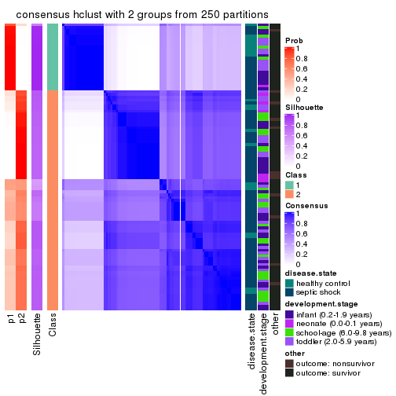</p>

</div>
<div id='tab-ATC-hclust-consensus-heatmap-2'>
<pre><code class="r">consensus_heatmap(res, k = 3)
</code></pre>

<p>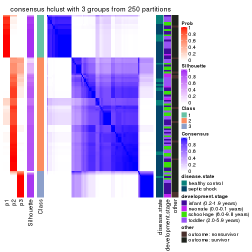</p>

</div>
<div id='tab-ATC-hclust-consensus-heatmap-3'>
<pre><code class="r">consensus_heatmap(res, k = 4)
</code></pre>

<p>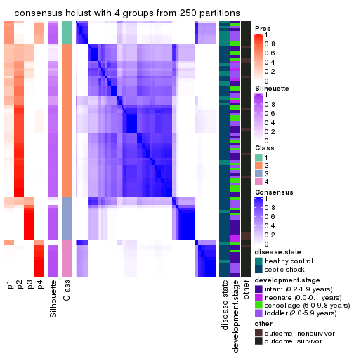</p>

</div>
<div id='tab-ATC-hclust-consensus-heatmap-4'>
<pre><code class="r">consensus_heatmap(res, k = 5)
</code></pre>

<p>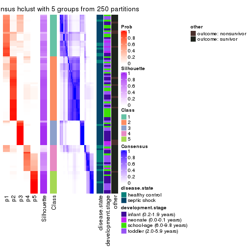</p>

</div>
<div id='tab-ATC-hclust-consensus-heatmap-5'>
<pre><code class="r">consensus_heatmap(res, k = 6)
</code></pre>

<p>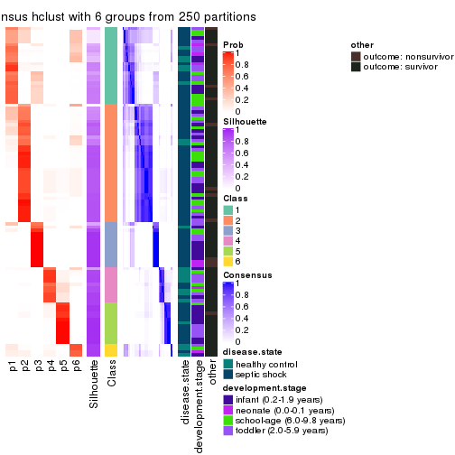</p>

</div>
</div>

Heatmaps for the membership of samples in all partitions to see how consistent they are:


<script>
$( function() {
	$( '#tabs-ATC-hclust-membership-heatmap' ).tabs();
} );
</script>
<div id='tabs-ATC-hclust-membership-heatmap'>
<ul>
<li><a href='#tab-ATC-hclust-membership-heatmap-1'>k = 2</a></li>
<li><a href='#tab-ATC-hclust-membership-heatmap-2'>k = 3</a></li>
<li><a href='#tab-ATC-hclust-membership-heatmap-3'>k = 4</a></li>
<li><a href='#tab-ATC-hclust-membership-heatmap-4'>k = 5</a></li>
<li><a href='#tab-ATC-hclust-membership-heatmap-5'>k = 6</a></li>
</ul>
<div id='tab-ATC-hclust-membership-heatmap-1'>
<pre><code class="r">membership_heatmap(res, k = 2)
</code></pre>

<p>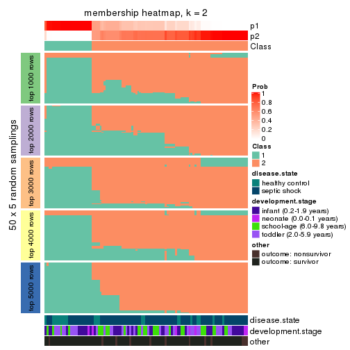</p>

</div>
<div id='tab-ATC-hclust-membership-heatmap-2'>
<pre><code class="r">membership_heatmap(res, k = 3)
</code></pre>

<p>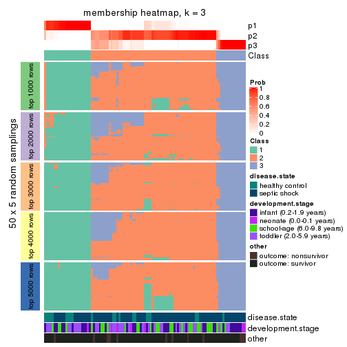</p>

</div>
<div id='tab-ATC-hclust-membership-heatmap-3'>
<pre><code class="r">membership_heatmap(res, k = 4)
</code></pre>

<p>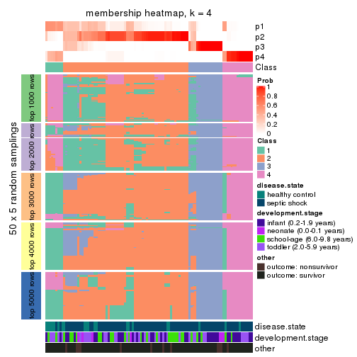</p>

</div>
<div id='tab-ATC-hclust-membership-heatmap-4'>
<pre><code class="r">membership_heatmap(res, k = 5)
</code></pre>

<p>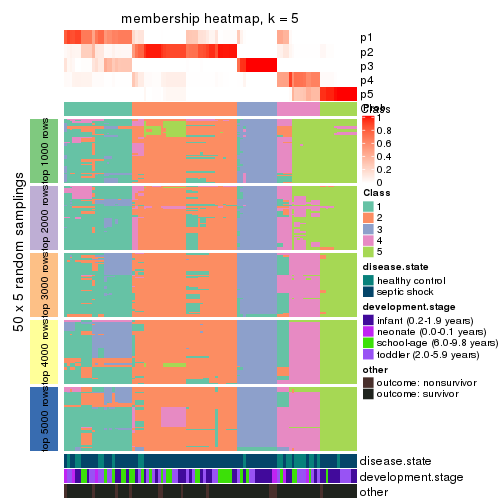</p>

</div>
<div id='tab-ATC-hclust-membership-heatmap-5'>
<pre><code class="r">membership_heatmap(res, k = 6)
</code></pre>

<p>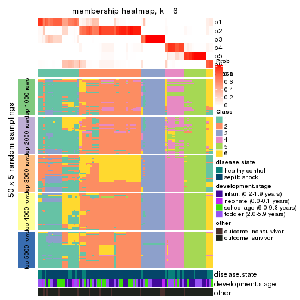</p>

</div>
</div>

As soon as we have had the classes for columns, we can look for signatures
which are significantly different between classes which can be candidate marks
for certain classes. Following are the heatmaps for signatures.


Signature heatmaps where rows are scaled:


<script>
$( function() {
	$( '#tabs-ATC-hclust-get-signatures' ).tabs();
} );
</script>
<div id='tabs-ATC-hclust-get-signatures'>
<ul>
<li><a href='#tab-ATC-hclust-get-signatures-1'>k = 2</a></li>
<li><a href='#tab-ATC-hclust-get-signatures-2'>k = 3</a></li>
<li><a href='#tab-ATC-hclust-get-signatures-3'>k = 4</a></li>
<li><a href='#tab-ATC-hclust-get-signatures-4'>k = 5</a></li>
<li><a href='#tab-ATC-hclust-get-signatures-5'>k = 6</a></li>
</ul>
<div id='tab-ATC-hclust-get-signatures-1'>
<pre><code class="r">get_signatures(res, k = 2)
</code></pre>

<p>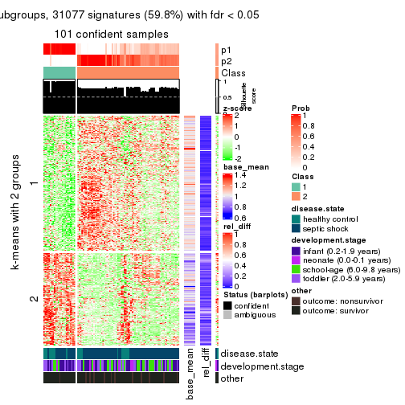</p>

</div>
<div id='tab-ATC-hclust-get-signatures-2'>
<pre><code class="r">get_signatures(res, k = 3)
</code></pre>

<p>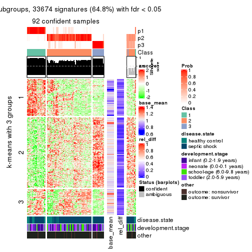</p>

</div>
<div id='tab-ATC-hclust-get-signatures-3'>
<pre><code class="r">get_signatures(res, k = 4)
</code></pre>

<p>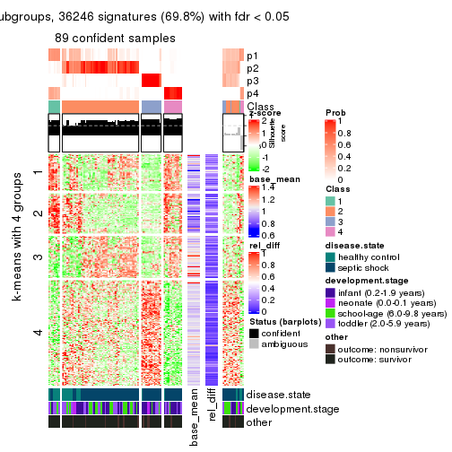</p>

</div>
<div id='tab-ATC-hclust-get-signatures-4'>
<pre><code class="r">get_signatures(res, k = 5)
</code></pre>

<p>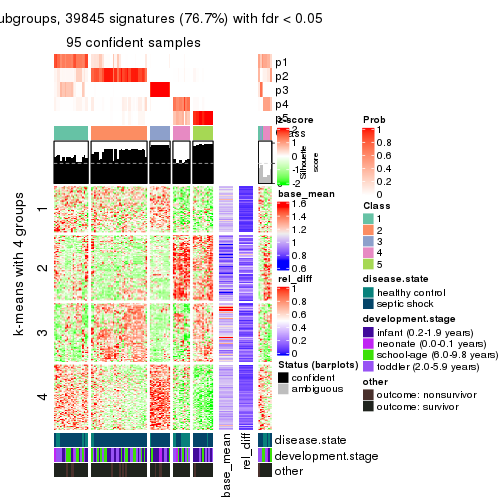</p>

</div>
<div id='tab-ATC-hclust-get-signatures-5'>
<pre><code class="r">get_signatures(res, k = 6)
</code></pre>

<p>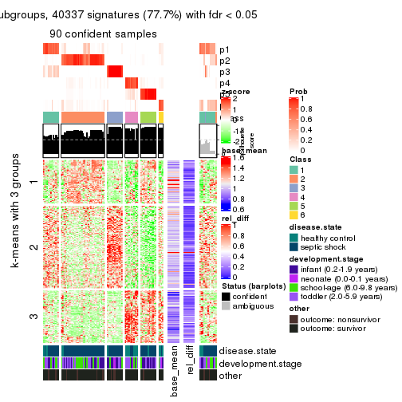</p>

</div>
</div>


Signature heatmaps where rows are not scaled:


<script>
$( function() {
	$( '#tabs-ATC-hclust-get-signatures-no-scale' ).tabs();
} );
</script>
<div id='tabs-ATC-hclust-get-signatures-no-scale'>
<ul>
<li><a href='#tab-ATC-hclust-get-signatures-no-scale-1'>k = 2</a></li>
<li><a href='#tab-ATC-hclust-get-signatures-no-scale-2'>k = 3</a></li>
<li><a href='#tab-ATC-hclust-get-signatures-no-scale-3'>k = 4</a></li>
<li><a href='#tab-ATC-hclust-get-signatures-no-scale-4'>k = 5</a></li>
<li><a href='#tab-ATC-hclust-get-signatures-no-scale-5'>k = 6</a></li>
</ul>
<div id='tab-ATC-hclust-get-signatures-no-scale-1'>
<pre><code class="r">get_signatures(res, k = 2, scale_rows = FALSE)
</code></pre>

<p>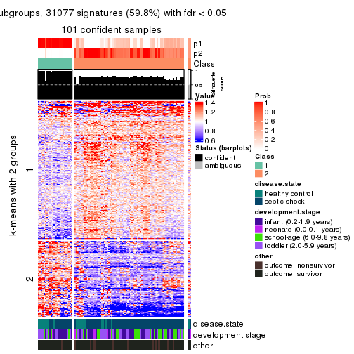</p>

</div>
<div id='tab-ATC-hclust-get-signatures-no-scale-2'>
<pre><code class="r">get_signatures(res, k = 3, scale_rows = FALSE)
</code></pre>

<p>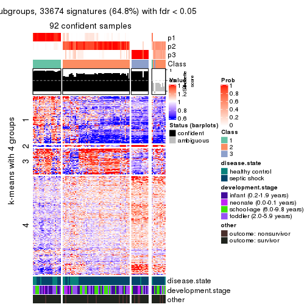</p>

</div>
<div id='tab-ATC-hclust-get-signatures-no-scale-3'>
<pre><code class="r">get_signatures(res, k = 4, scale_rows = FALSE)
</code></pre>

<p>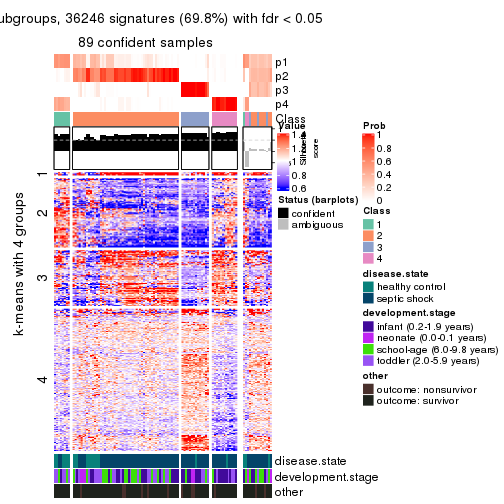</p>

</div>
<div id='tab-ATC-hclust-get-signatures-no-scale-4'>
<pre><code class="r">get_signatures(res, k = 5, scale_rows = FALSE)
</code></pre>

<p>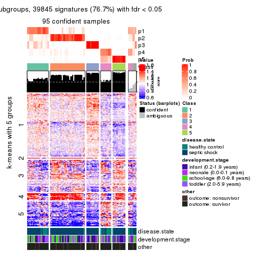</p>

</div>
<div id='tab-ATC-hclust-get-signatures-no-scale-5'>
<pre><code class="r">get_signatures(res, k = 6, scale_rows = FALSE)
</code></pre>

<p>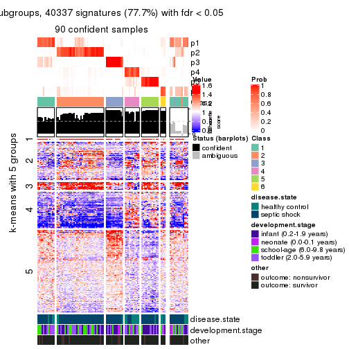</p>

</div>
</div>


Compare the overlap of signatures from different k:

```r
compare_signatures(res)
```

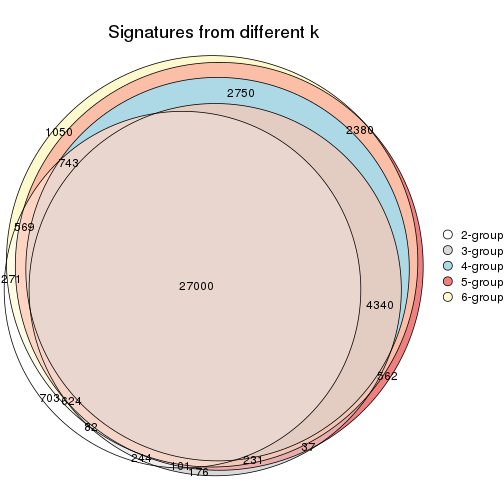

`get_signature()` returns a data frame invisibly. TO get the list of signatures, the function
call should be assigned to a variable explicitly. In following code, if `plot` argument is set
to `FALSE`, no heatmap is plotted while only the differential analysis is performed.

```r
# code only for demonstration
tb = get_signature(res, k = ..., plot = FALSE)
```

An example of the output of `tb` is:

```
#>   which_row         fdr    mean_1    mean_2 scaled_mean_1 scaled_mean_2 km
#> 1        38 0.042760348  8.373488  9.131774    -0.5533452     0.5164555  1
#> 2        40 0.018707592  7.106213  8.469186    -0.6173731     0.5762149  1
#> 3        55 0.019134737 10.221463 11.207825    -0.6159697     0.5749050  1
#> 4        59 0.006059896  5.921854  7.869574    -0.6899429     0.6439467  1
#> 5        60 0.018055526  8.928898 10.211722    -0.6204761     0.5791110  1
#> 6        98 0.009384629 15.714769 14.887706     0.6635654    -0.6193277  2
...
```

The columns in `tb` are:

1. `which_row`: row indices corresponding to the input matrix.
2. `fdr`: FDR for the differential test. 
3. `mean_x`: The mean value in group x.
4. `scaled_mean_x`: The mean value in group x after rows are scaled.
5. `km`: Row groups if k-means clustering is applied to rows.


UMAP plot which shows how samples are separated.


<script>
$( function() {
	$( '#tabs-ATC-hclust-dimension-reduction' ).tabs();
} );
</script>
<div id='tabs-ATC-hclust-dimension-reduction'>
<ul>
<li><a href='#tab-ATC-hclust-dimension-reduction-1'>k = 2</a></li>
<li><a href='#tab-ATC-hclust-dimension-reduction-2'>k = 3</a></li>
<li><a href='#tab-ATC-hclust-dimension-reduction-3'>k = 4</a></li>
<li><a href='#tab-ATC-hclust-dimension-reduction-4'>k = 5</a></li>
<li><a href='#tab-ATC-hclust-dimension-reduction-5'>k = 6</a></li>
</ul>
<div id='tab-ATC-hclust-dimension-reduction-1'>
<pre><code class="r">dimension_reduction(res, k = 2, method = &quot;UMAP&quot;)
</code></pre>

<p>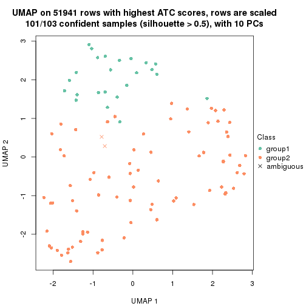</p>

</div>
<div id='tab-ATC-hclust-dimension-reduction-2'>
<pre><code class="r">dimension_reduction(res, k = 3, method = &quot;UMAP&quot;)
</code></pre>

<p>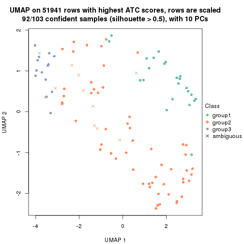</p>

</div>
<div id='tab-ATC-hclust-dimension-reduction-3'>
<pre><code class="r">dimension_reduction(res, k = 4, method = &quot;UMAP&quot;)
</code></pre>

<p>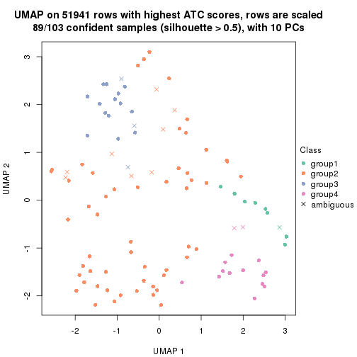</p>

</div>
<div id='tab-ATC-hclust-dimension-reduction-4'>
<pre><code class="r">dimension_reduction(res, k = 5, method = &quot;UMAP&quot;)
</code></pre>

<p>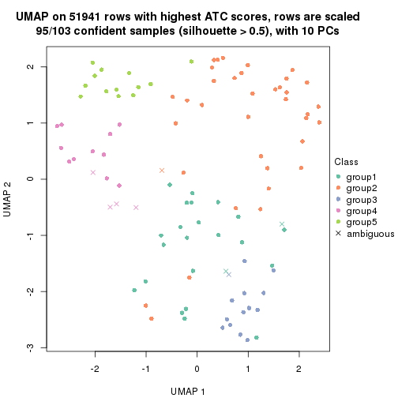</p>

</div>
<div id='tab-ATC-hclust-dimension-reduction-5'>
<pre><code class="r">dimension_reduction(res, k = 6, method = &quot;UMAP&quot;)
</code></pre>

<p>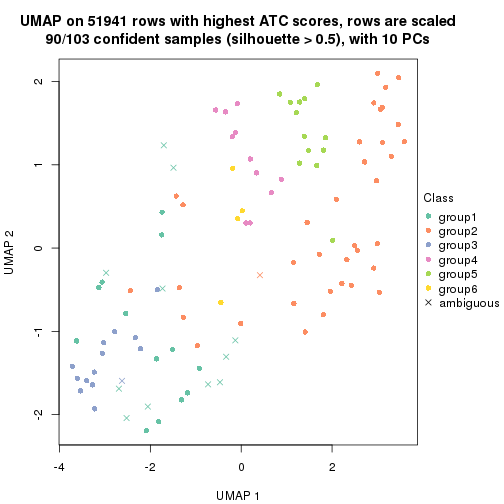</p>

</div>
</div>


Following heatmap shows how subgroups are split when increasing `k`:

```r
collect_classes(res)
```

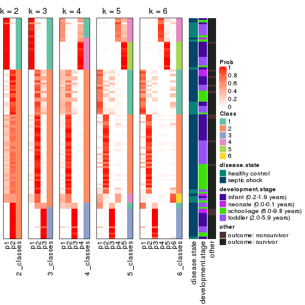


Test correlation between subgroups and known annotations. If the known
annotation is numeric, one-way ANOVA test is applied, and if the known
annotation is discrete, chi-squared contingency table test is applied.

```r
test_to_known_factors(res)
```

```
#>              n disease.state(p) development.stage(p) other(p) k
#> ATC:hclust 101         2.79e-02                0.566    0.329 2
#> ATC:hclust  92         1.02e-01                0.528    0.270 3
#> ATC:hclust  89         5.01e-04                0.149    0.451 4
#> ATC:hclust  95         1.21e-05                0.168    0.492 5
#> ATC:hclust  90         2.48e-06                0.243    0.527 6
```


If matrix rows can be associated to genes, consider to use `functional_enrichment(res,
...)` to perform function enrichment for the signature genes. See [this vignette](http://bioconductor.org/packages/devel/bioc/vignettes/cola/inst/doc/functional_enrichment.html) for more detailed explanations.


 

---------------------------------------------------


### ATC:kmeans**


The object with results only for a single top-value method and a single partition method 
can be extracted as:

```r
res = res_list["ATC", "kmeans"]
# you can also extract it by
# res = res_list["ATC:kmeans"]
```

A summary of `res` and all the functions that can be applied to it:

```r
res
```

```
#> A 'ConsensusPartition' object with k = 2, 3, 4, 5, 6.
#>   On a matrix with 51941 rows and 103 columns.
#>   Top rows (1000, 2000, 3000, 4000, 5000) are extracted by 'ATC' method.
#>   Subgroups are detected by 'kmeans' method.
#>   Performed in total 1250 partitions by row resampling.
#>   Best k for subgroups seems to be 2.
#> 
#> Following methods can be applied to this 'ConsensusPartition' object:
#>  [1] "cola_report"             "collect_classes"         "collect_plots"          
#>  [4] "collect_stats"           "colnames"                "compare_signatures"     
#>  [7] "consensus_heatmap"       "dimension_reduction"     "functional_enrichment"  
#> [10] "get_anno_col"            "get_anno"                "get_classes"            
#> [13] "get_consensus"           "get_matrix"              "get_membership"         
#> [16] "get_param"               "get_signatures"          "get_stats"              
#> [19] "is_best_k"               "is_stable_k"             "membership_heatmap"     
#> [22] "ncol"                    "nrow"                    "plot_ecdf"              
#> [25] "rownames"                "select_partition_number" "show"                   
#> [28] "suggest_best_k"          "test_to_known_factors"
```

`collect_plots()` function collects all the plots made from `res` for all `k` (number of partitions)
into one single page to provide an easy and fast comparison between different `k`.

```r
collect_plots(res)
```

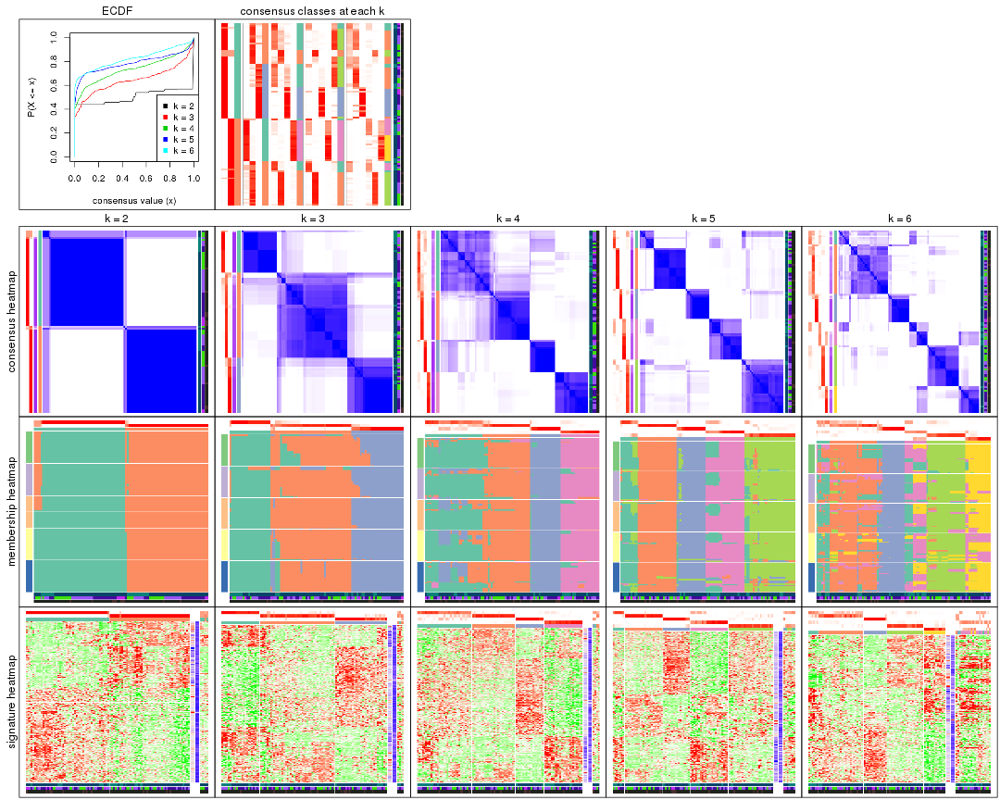

The plots are:

- The first row: a plot of the ECDF (empirical cumulative distribution
  function) curves of the consensus matrix for each `k` and the heatmap of
  predicted classes for each `k`.
- The second row: heatmaps of the consensus matrix for each `k`.
- The third row: heatmaps of the membership matrix for each `k`.
- The fouth row: heatmaps of the signatures for each `k`.

All the plots in panels can be made by individual functions and they are
plotted later in this section.

`select_partition_number()` produces several plots showing different
statistics for choosing "optimized" `k`. There are following statistics:

- ECDF curves of the consensus matrix for each `k`;
- 1-PAC. [The PAC
  score](https://en.wikipedia.org/wiki/Consensus_clustering#Over-interpretation_potential_of_consensus_clustering)
  measures the proportion of the ambiguous subgrouping.
- Mean silhouette score.
- Concordance. The mean probability of fiting the consensus class ids in all
  partitions.
- Area increased. Denote $A_k$ as the area under the ECDF curve for current
  `k`, the area increased is defined as $A_k - A_{k-1}$.
- Rand index. The percent of pairs of samples that are both in a same cluster
  or both are not in a same cluster in the partition of k and k-1.
- Jaccard index. The ratio of pairs of samples are both in a same cluster in
  the partition of k and k-1 and the pairs of samples are both in a same
  cluster in the partition k or k-1.

The detailed explanations of these statistics can be found in [the _cola_
vignette](http://bioconductor.org/packages/devel/bioc/vignettes/cola/inst/doc/cola.html#toc_13).

Generally speaking, lower PAC score, higher mean silhouette score or higher
concordance corresponds to better partition. Rand index and Jaccard index
measure how similar the current partition is compared to partition with `k-1`.
If they are too similar, we won't accept `k` is better than `k-1`.

```r
select_partition_number(res)
```

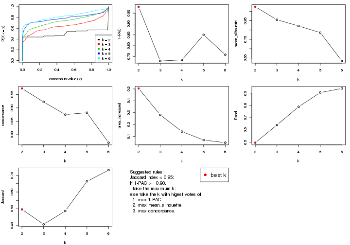

The numeric values for all these statistics can be obtained by `get_stats()`.

```r
get_stats(res)
```

```
#>   k 1-PAC mean_silhouette concordance area_increased  Rand Jaccard
#> 2 2 0.979           0.924       0.972         0.5041 0.496   0.496
#> 3 3 0.729           0.855       0.922         0.2811 0.641   0.407
#> 4 4 0.735           0.822       0.875         0.1406 0.789   0.487
#> 5 5 0.850           0.786       0.882         0.0693 0.905   0.664
#> 6 6 0.758           0.634       0.770         0.0469 0.938   0.731
```

`suggest_best_k()` suggests the best $k$ based on these statistics. The rules are as follows:

- All $k$ with Jaccard index larger than 0.95 are removed because increasing
  $k$ does not provide enough extra information. If all $k$ are removed, it is
  marked as no subgroup is detected.
- For all $k$ with 1-PAC score larger than 0.9, the maximal $k$ is taken as
  the best $k$, and other $k$ are marked as optional $k$.
- If it does not fit the second rule. The $k$ with the maximal vote of the
  highest 1-PAC score, highest mean silhouette, and highest concordance is
  taken as the best $k$.

```r
suggest_best_k(res)
```

```
#> [1] 2
```


Following shows the table of the partitions (You need to click the **show/hide
code output** link to see it). The membership matrix (columns with name `p*`)
is inferred by
[`clue::cl_consensus()`](https://www.rdocumentation.org/link/cl_consensus?package=clue)
function with the `SE` method. Basically the value in the membership matrix
represents the probability to belong to a certain group. The finall class
label for an item is determined with the group with highest probability it
belongs to.

In `get_classes()` function, the entropy is calculated from the membership
matrix and the silhouette score is calculated from the consensus matrix.


<script>
$( function() {
	$( '#tabs-ATC-kmeans-get-classes' ).tabs();
} );
</script>
<div id='tabs-ATC-kmeans-get-classes'>
<ul>
<li><a href='#tab-ATC-kmeans-get-classes-1'>k = 2</a></li>
<li><a href='#tab-ATC-kmeans-get-classes-2'>k = 3</a></li>
<li><a href='#tab-ATC-kmeans-get-classes-3'>k = 4</a></li>
<li><a href='#tab-ATC-kmeans-get-classes-4'>k = 5</a></li>
<li><a href='#tab-ATC-kmeans-get-classes-5'>k = 6</a></li>
</ul>

<div id='tab-ATC-kmeans-get-classes-1'>
<p><a id='tab-ATC-kmeans-get-classes-1-a' style='color:#0366d6' href='#'>show/hide code output</a></p>
<pre><code class="r">cbind(get_classes(res, k = 2), get_membership(res, k = 2))
</code></pre>

<pre><code>#&gt;           class entropy silhouette    p1    p2
#&gt; GSM647569     1   0.000     0.9568 1.000 0.000
#&gt; GSM647574     1   0.000     0.9568 1.000 0.000
#&gt; GSM647577     1   0.000     0.9568 1.000 0.000
#&gt; GSM647547     2   0.000     0.9859 0.000 1.000
#&gt; GSM647552     1   0.000     0.9568 1.000 0.000
#&gt; GSM647553     1   0.000     0.9568 1.000 0.000
#&gt; GSM647565     2   0.000     0.9859 0.000 1.000
#&gt; GSM647545     2   0.000     0.9859 0.000 1.000
#&gt; GSM647549     2   0.000     0.9859 0.000 1.000
#&gt; GSM647550     1   0.000     0.9568 1.000 0.000
#&gt; GSM647560     1   0.000     0.9568 1.000 0.000
#&gt; GSM647617     1   0.000     0.9568 1.000 0.000
#&gt; GSM647528     2   0.000     0.9859 0.000 1.000
#&gt; GSM647529     2   0.000     0.9859 0.000 1.000
#&gt; GSM647531     2   0.000     0.9859 0.000 1.000
#&gt; GSM647540     1   0.000     0.9568 1.000 0.000
#&gt; GSM647541     1   0.000     0.9568 1.000 0.000
#&gt; GSM647546     1   0.000     0.9568 1.000 0.000
#&gt; GSM647557     2   0.000     0.9859 0.000 1.000
#&gt; GSM647561     2   0.000     0.9859 0.000 1.000
#&gt; GSM647567     2   0.000     0.9859 0.000 1.000
#&gt; GSM647568     1   0.000     0.9568 1.000 0.000
#&gt; GSM647570     2   0.000     0.9859 0.000 1.000
#&gt; GSM647573     2   0.000     0.9859 0.000 1.000
#&gt; GSM647576     1   0.000     0.9568 1.000 0.000
#&gt; GSM647579     1   0.000     0.9568 1.000 0.000
#&gt; GSM647580     1   0.000     0.9568 1.000 0.000
#&gt; GSM647583     1   0.000     0.9568 1.000 0.000
#&gt; GSM647592     1   0.000     0.9568 1.000 0.000
#&gt; GSM647593     2   0.955     0.3472 0.376 0.624
#&gt; GSM647595     2   0.000     0.9859 0.000 1.000
#&gt; GSM647597     2   0.000     0.9859 0.000 1.000
#&gt; GSM647598     2   0.000     0.9859 0.000 1.000
#&gt; GSM647613     2   0.000     0.9859 0.000 1.000
#&gt; GSM647615     1   0.000     0.9568 1.000 0.000
#&gt; GSM647616     1   0.000     0.9568 1.000 0.000
#&gt; GSM647619     1   1.000     0.0933 0.512 0.488
#&gt; GSM647582     1   0.000     0.9568 1.000 0.000
#&gt; GSM647591     2   0.000     0.9859 0.000 1.000
#&gt; GSM647527     2   0.000     0.9859 0.000 1.000
#&gt; GSM647530     2   0.000     0.9859 0.000 1.000
#&gt; GSM647532     2   0.000     0.9859 0.000 1.000
#&gt; GSM647544     2   0.000     0.9859 0.000 1.000
#&gt; GSM647551     1   0.000     0.9568 1.000 0.000
#&gt; GSM647556     1   0.000     0.9568 1.000 0.000
#&gt; GSM647558     2   0.000     0.9859 0.000 1.000
#&gt; GSM647572     1   0.000     0.9568 1.000 0.000
#&gt; GSM647578     1   0.000     0.9568 1.000 0.000
#&gt; GSM647581     2   0.000     0.9859 0.000 1.000
#&gt; GSM647594     2   0.000     0.9859 0.000 1.000
#&gt; GSM647599     1   0.000     0.9568 1.000 0.000
#&gt; GSM647600     1   0.000     0.9568 1.000 0.000
#&gt; GSM647601     2   0.000     0.9859 0.000 1.000
#&gt; GSM647603     1   0.000     0.9568 1.000 0.000
#&gt; GSM647610     1   0.000     0.9568 1.000 0.000
#&gt; GSM647611     1   0.000     0.9568 1.000 0.000
#&gt; GSM647612     1   0.000     0.9568 1.000 0.000
#&gt; GSM647614     1   0.000     0.9568 1.000 0.000
#&gt; GSM647618     2   0.000     0.9859 0.000 1.000
#&gt; GSM647629     1   0.000     0.9568 1.000 0.000
#&gt; GSM647535     1   0.000     0.9568 1.000 0.000
#&gt; GSM647563     2   0.000     0.9859 0.000 1.000
#&gt; GSM647542     1   0.000     0.9568 1.000 0.000
#&gt; GSM647543     1   0.000     0.9568 1.000 0.000
#&gt; GSM647548     2   0.000     0.9859 0.000 1.000
#&gt; GSM647554     1   0.000     0.9568 1.000 0.000
#&gt; GSM647555     1   0.000     0.9568 1.000 0.000
#&gt; GSM647559     2   0.000     0.9859 0.000 1.000
#&gt; GSM647562     2   0.000     0.9859 0.000 1.000
#&gt; GSM647564     1   0.000     0.9568 1.000 0.000
#&gt; GSM647571     1   0.000     0.9568 1.000 0.000
#&gt; GSM647584     1   1.000     0.0794 0.508 0.492
#&gt; GSM647585     1   0.000     0.9568 1.000 0.000
#&gt; GSM647586     2   0.000     0.9859 0.000 1.000
#&gt; GSM647587     2   0.000     0.9859 0.000 1.000
#&gt; GSM647588     2   0.000     0.9859 0.000 1.000
#&gt; GSM647596     2   0.000     0.9859 0.000 1.000
#&gt; GSM647602     1   0.000     0.9568 1.000 0.000
#&gt; GSM647609     1   1.000     0.0794 0.508 0.492
#&gt; GSM647620     1   0.000     0.9568 1.000 0.000
#&gt; GSM647627     1   1.000     0.0794 0.508 0.492
#&gt; GSM647628     2   0.000     0.9859 0.000 1.000
#&gt; GSM647533     1   0.000     0.9568 1.000 0.000
#&gt; GSM647536     2   0.000     0.9859 0.000 1.000
#&gt; GSM647537     1   0.000     0.9568 1.000 0.000
#&gt; GSM647606     2   0.000     0.9859 0.000 1.000
#&gt; GSM647621     2   0.000     0.9859 0.000 1.000
#&gt; GSM647626     1   0.000     0.9568 1.000 0.000
#&gt; GSM647538     1   0.802     0.6633 0.756 0.244
#&gt; GSM647575     2   0.000     0.9859 0.000 1.000
#&gt; GSM647590     2   0.000     0.9859 0.000 1.000
#&gt; GSM647605     2   0.000     0.9859 0.000 1.000
#&gt; GSM647607     2   0.000     0.9859 0.000 1.000
#&gt; GSM647608     2   0.000     0.9859 0.000 1.000
#&gt; GSM647622     1   0.000     0.9568 1.000 0.000
#&gt; GSM647623     1   0.000     0.9568 1.000 0.000
#&gt; GSM647624     2   0.000     0.9859 0.000 1.000
#&gt; GSM647625     1   0.000     0.9568 1.000 0.000
#&gt; GSM647534     1   0.000     0.9568 1.000 0.000
#&gt; GSM647539     2   0.000     0.9859 0.000 1.000
#&gt; GSM647566     2   0.000     0.9859 0.000 1.000
#&gt; GSM647589     2   0.814     0.6388 0.252 0.748
#&gt; GSM647604     2   0.000     0.9859 0.000 1.000
</code></pre>

<script>
$('#tab-ATC-kmeans-get-classes-1-a').parent().next().next().hide();
$('#tab-ATC-kmeans-get-classes-1-a').click(function(){
  $('#tab-ATC-kmeans-get-classes-1-a').parent().next().next().toggle();
  return(false);
});
</script>
</div>

<div id='tab-ATC-kmeans-get-classes-2'>
<p><a id='tab-ATC-kmeans-get-classes-2-a' style='color:#0366d6' href='#'>show/hide code output</a></p>
<pre><code class="r">cbind(get_classes(res, k = 3), get_membership(res, k = 3))
</code></pre>

<pre><code>#&gt;           class entropy silhouette    p1    p2    p3
#&gt; GSM647569     3  0.0000      0.927 0.000 0.000 1.000
#&gt; GSM647574     3  0.0747      0.916 0.000 0.016 0.984
#&gt; GSM647577     3  0.0000      0.927 0.000 0.000 1.000
#&gt; GSM647547     2  0.1411      0.882 0.036 0.964 0.000
#&gt; GSM647552     3  0.5098      0.715 0.000 0.248 0.752
#&gt; GSM647553     2  0.5882      0.436 0.000 0.652 0.348
#&gt; GSM647565     1  0.0000      0.957 1.000 0.000 0.000
#&gt; GSM647545     2  0.4062      0.786 0.164 0.836 0.000
#&gt; GSM647549     1  0.1411      0.962 0.964 0.036 0.000
#&gt; GSM647550     2  0.1860      0.882 0.000 0.948 0.052
#&gt; GSM647560     3  0.0237      0.926 0.000 0.004 0.996
#&gt; GSM647617     3  0.0000      0.927 0.000 0.000 1.000
#&gt; GSM647528     2  0.3038      0.841 0.104 0.896 0.000
#&gt; GSM647529     1  0.1411      0.962 0.964 0.036 0.000
#&gt; GSM647531     1  0.1411      0.962 0.964 0.036 0.000
#&gt; GSM647540     3  0.0000      0.927 0.000 0.000 1.000
#&gt; GSM647541     2  0.2066      0.878 0.000 0.940 0.060
#&gt; GSM647546     3  0.2711      0.890 0.000 0.088 0.912
#&gt; GSM647557     1  0.1411      0.962 0.964 0.036 0.000
#&gt; GSM647561     1  0.1411      0.962 0.964 0.036 0.000
#&gt; GSM647567     2  0.1411      0.882 0.036 0.964 0.000
#&gt; GSM647568     2  0.1411      0.883 0.000 0.964 0.036
#&gt; GSM647570     2  0.4062      0.786 0.164 0.836 0.000
#&gt; GSM647573     1  0.0000      0.957 1.000 0.000 0.000
#&gt; GSM647576     3  0.3116      0.875 0.000 0.108 0.892
#&gt; GSM647579     3  0.0000      0.927 0.000 0.000 1.000
#&gt; GSM647580     3  0.0000      0.927 0.000 0.000 1.000
#&gt; GSM647583     3  0.0000      0.927 0.000 0.000 1.000
#&gt; GSM647592     2  0.1860      0.882 0.000 0.948 0.052
#&gt; GSM647593     2  0.0829      0.888 0.004 0.984 0.012
#&gt; GSM647595     2  0.2878      0.847 0.096 0.904 0.000
#&gt; GSM647597     1  0.1411      0.962 0.964 0.036 0.000
#&gt; GSM647598     2  0.3267      0.832 0.116 0.884 0.000
#&gt; GSM647613     1  0.1411      0.962 0.964 0.036 0.000
#&gt; GSM647615     2  0.1860      0.882 0.000 0.948 0.052
#&gt; GSM647616     3  0.0000      0.927 0.000 0.000 1.000
#&gt; GSM647619     2  0.0747      0.888 0.000 0.984 0.016
#&gt; GSM647582     2  0.5216      0.644 0.000 0.740 0.260
#&gt; GSM647591     2  0.2878      0.847 0.096 0.904 0.000
#&gt; GSM647527     2  0.3267      0.832 0.116 0.884 0.000
#&gt; GSM647530     1  0.1411      0.962 0.964 0.036 0.000
#&gt; GSM647532     1  0.1411      0.962 0.964 0.036 0.000
#&gt; GSM647544     2  0.3267      0.832 0.116 0.884 0.000
#&gt; GSM647551     2  0.1860      0.882 0.000 0.948 0.052
#&gt; GSM647556     3  0.0000      0.927 0.000 0.000 1.000
#&gt; GSM647558     2  0.3267      0.832 0.116 0.884 0.000
#&gt; GSM647572     3  0.5397      0.663 0.000 0.280 0.720
#&gt; GSM647578     3  0.0000      0.927 0.000 0.000 1.000
#&gt; GSM647581     1  0.1411      0.962 0.964 0.036 0.000
#&gt; GSM647594     1  0.1411      0.962 0.964 0.036 0.000
#&gt; GSM647599     3  0.0000      0.927 0.000 0.000 1.000
#&gt; GSM647600     3  0.0000      0.927 0.000 0.000 1.000
#&gt; GSM647601     2  0.0747      0.885 0.016 0.984 0.000
#&gt; GSM647603     3  0.0000      0.927 0.000 0.000 1.000
#&gt; GSM647610     2  0.3619      0.815 0.000 0.864 0.136
#&gt; GSM647611     2  0.1860      0.882 0.000 0.948 0.052
#&gt; GSM647612     2  0.1860      0.882 0.000 0.948 0.052
#&gt; GSM647614     2  0.1411      0.883 0.000 0.964 0.036
#&gt; GSM647618     2  0.2711      0.852 0.088 0.912 0.000
#&gt; GSM647629     2  0.6309     -0.035 0.000 0.504 0.496
#&gt; GSM647535     3  0.2711      0.890 0.000 0.088 0.912
#&gt; GSM647563     2  0.0747      0.885 0.016 0.984 0.000
#&gt; GSM647542     2  0.1643      0.883 0.000 0.956 0.044
#&gt; GSM647543     2  0.1529      0.883 0.000 0.960 0.040
#&gt; GSM647548     1  0.0000      0.957 1.000 0.000 0.000
#&gt; GSM647554     2  0.2066      0.878 0.000 0.940 0.060
#&gt; GSM647555     3  0.5254      0.691 0.000 0.264 0.736
#&gt; GSM647559     2  0.0747      0.885 0.016 0.984 0.000
#&gt; GSM647562     1  0.1411      0.962 0.964 0.036 0.000
#&gt; GSM647564     3  0.0000      0.927 0.000 0.000 1.000
#&gt; GSM647571     3  0.2165      0.902 0.000 0.064 0.936
#&gt; GSM647584     2  0.0747      0.888 0.000 0.984 0.016
#&gt; GSM647585     3  0.0000      0.927 0.000 0.000 1.000
#&gt; GSM647586     2  0.0747      0.885 0.016 0.984 0.000
#&gt; GSM647587     2  0.5291      0.634 0.268 0.732 0.000
#&gt; GSM647588     2  0.0747      0.885 0.016 0.984 0.000
#&gt; GSM647596     2  0.4062      0.786 0.164 0.836 0.000
#&gt; GSM647602     3  0.0000      0.927 0.000 0.000 1.000
#&gt; GSM647609     2  0.0747      0.888 0.000 0.984 0.016
#&gt; GSM647620     2  0.1860      0.882 0.000 0.948 0.052
#&gt; GSM647627     2  0.0747      0.888 0.000 0.984 0.016
#&gt; GSM647628     2  0.1529      0.882 0.040 0.960 0.000
#&gt; GSM647533     2  0.4270      0.811 0.024 0.860 0.116
#&gt; GSM647536     1  0.1411      0.962 0.964 0.036 0.000
#&gt; GSM647537     3  0.3116      0.884 0.000 0.108 0.892
#&gt; GSM647606     1  0.6235      0.145 0.564 0.436 0.000
#&gt; GSM647621     2  0.5835      0.523 0.340 0.660 0.000
#&gt; GSM647626     3  0.0000      0.927 0.000 0.000 1.000
#&gt; GSM647538     2  0.1411      0.882 0.036 0.964 0.000
#&gt; GSM647575     1  0.0000      0.957 1.000 0.000 0.000
#&gt; GSM647590     1  0.0237      0.954 0.996 0.004 0.000
#&gt; GSM647605     1  0.0000      0.957 1.000 0.000 0.000
#&gt; GSM647607     1  0.0000      0.957 1.000 0.000 0.000
#&gt; GSM647608     2  0.5948      0.480 0.360 0.640 0.000
#&gt; GSM647622     3  0.3038      0.887 0.000 0.104 0.896
#&gt; GSM647623     3  0.5291      0.684 0.000 0.268 0.732
#&gt; GSM647624     1  0.0000      0.957 1.000 0.000 0.000
#&gt; GSM647625     3  0.5650      0.599 0.000 0.312 0.688
#&gt; GSM647534     3  0.0000      0.927 0.000 0.000 1.000
#&gt; GSM647539     1  0.0000      0.957 1.000 0.000 0.000
#&gt; GSM647566     2  0.1411      0.882 0.036 0.964 0.000
#&gt; GSM647589     2  0.5835      0.523 0.340 0.660 0.000
#&gt; GSM647604     1  0.0000      0.957 1.000 0.000 0.000
</code></pre>

<script>
$('#tab-ATC-kmeans-get-classes-2-a').parent().next().next().hide();
$('#tab-ATC-kmeans-get-classes-2-a').click(function(){
  $('#tab-ATC-kmeans-get-classes-2-a').parent().next().next().toggle();
  return(false);
});
</script>
</div>

<div id='tab-ATC-kmeans-get-classes-3'>
<p><a id='tab-ATC-kmeans-get-classes-3-a' style='color:#0366d6' href='#'>show/hide code output</a></p>
<pre><code class="r">cbind(get_classes(res, k = 4), get_membership(res, k = 4))
</code></pre>

<pre><code>#&gt;           class entropy silhouette    p1    p2    p3    p4
#&gt; GSM647569     3  0.0000      0.959 0.000 0.000 1.000 0.000
#&gt; GSM647574     3  0.4955      0.158 0.444 0.000 0.556 0.000
#&gt; GSM647577     3  0.0000      0.959 0.000 0.000 1.000 0.000
#&gt; GSM647547     1  0.2402      0.690 0.912 0.076 0.000 0.012
#&gt; GSM647552     1  0.5733      0.667 0.640 0.048 0.312 0.000
#&gt; GSM647553     1  0.3587      0.756 0.860 0.052 0.088 0.000
#&gt; GSM647565     4  0.2124      0.937 0.068 0.008 0.000 0.924
#&gt; GSM647545     2  0.1489      0.897 0.004 0.952 0.000 0.044
#&gt; GSM647549     4  0.1302      0.936 0.000 0.044 0.000 0.956
#&gt; GSM647550     1  0.4746      0.584 0.632 0.368 0.000 0.000
#&gt; GSM647560     1  0.4817      0.567 0.612 0.000 0.388 0.000
#&gt; GSM647617     3  0.0000      0.959 0.000 0.000 1.000 0.000
#&gt; GSM647528     2  0.1398      0.900 0.004 0.956 0.000 0.040
#&gt; GSM647529     4  0.0336      0.950 0.000 0.008 0.000 0.992
#&gt; GSM647531     4  0.0469      0.949 0.000 0.012 0.000 0.988
#&gt; GSM647540     3  0.0000      0.959 0.000 0.000 1.000 0.000
#&gt; GSM647541     1  0.5764      0.672 0.644 0.304 0.052 0.000
#&gt; GSM647546     1  0.5203      0.624 0.636 0.016 0.348 0.000
#&gt; GSM647557     4  0.1302      0.936 0.000 0.044 0.000 0.956
#&gt; GSM647561     4  0.1302      0.936 0.000 0.044 0.000 0.956
#&gt; GSM647567     2  0.5055      0.471 0.368 0.624 0.000 0.008
#&gt; GSM647568     1  0.3161      0.753 0.864 0.124 0.012 0.000
#&gt; GSM647570     2  0.1489      0.897 0.004 0.952 0.000 0.044
#&gt; GSM647573     4  0.1109      0.946 0.028 0.004 0.000 0.968
#&gt; GSM647576     1  0.5636      0.670 0.648 0.044 0.308 0.000
#&gt; GSM647579     3  0.0000      0.959 0.000 0.000 1.000 0.000
#&gt; GSM647580     3  0.0000      0.959 0.000 0.000 1.000 0.000
#&gt; GSM647583     3  0.0000      0.959 0.000 0.000 1.000 0.000
#&gt; GSM647592     2  0.3688      0.680 0.208 0.792 0.000 0.000
#&gt; GSM647593     2  0.0921      0.908 0.028 0.972 0.000 0.000
#&gt; GSM647595     2  0.1182      0.908 0.016 0.968 0.000 0.016
#&gt; GSM647597     4  0.0469      0.949 0.000 0.012 0.000 0.988
#&gt; GSM647598     2  0.1398      0.900 0.004 0.956 0.000 0.040
#&gt; GSM647613     4  0.1211      0.939 0.000 0.040 0.000 0.960
#&gt; GSM647615     1  0.5517      0.658 0.648 0.316 0.036 0.000
#&gt; GSM647616     3  0.0000      0.959 0.000 0.000 1.000 0.000
#&gt; GSM647619     2  0.0921      0.908 0.028 0.972 0.000 0.000
#&gt; GSM647582     1  0.6404      0.732 0.644 0.220 0.136 0.000
#&gt; GSM647591     2  0.1488      0.905 0.012 0.956 0.000 0.032
#&gt; GSM647527     2  0.1398      0.900 0.004 0.956 0.000 0.040
#&gt; GSM647530     4  0.0336      0.950 0.000 0.008 0.000 0.992
#&gt; GSM647532     4  0.0336      0.950 0.000 0.008 0.000 0.992
#&gt; GSM647544     2  0.1545      0.897 0.008 0.952 0.000 0.040
#&gt; GSM647551     2  0.2281      0.848 0.096 0.904 0.000 0.000
#&gt; GSM647556     3  0.1302      0.922 0.044 0.000 0.956 0.000
#&gt; GSM647558     2  0.1398      0.900 0.004 0.956 0.000 0.040
#&gt; GSM647572     1  0.4719      0.743 0.772 0.048 0.180 0.000
#&gt; GSM647578     3  0.1637      0.905 0.060 0.000 0.940 0.000
#&gt; GSM647581     4  0.0469      0.949 0.000 0.012 0.000 0.988
#&gt; GSM647594     4  0.0469      0.949 0.000 0.012 0.000 0.988
#&gt; GSM647599     1  0.4948      0.462 0.560 0.000 0.440 0.000
#&gt; GSM647600     3  0.0000      0.959 0.000 0.000 1.000 0.000
#&gt; GSM647601     2  0.0921      0.908 0.028 0.972 0.000 0.000
#&gt; GSM647603     3  0.0000      0.959 0.000 0.000 1.000 0.000
#&gt; GSM647610     1  0.5861      0.680 0.644 0.296 0.060 0.000
#&gt; GSM647611     2  0.3649      0.688 0.204 0.796 0.000 0.000
#&gt; GSM647612     1  0.4713      0.598 0.640 0.360 0.000 0.000
#&gt; GSM647614     1  0.4250      0.685 0.724 0.276 0.000 0.000
#&gt; GSM647618     2  0.0937      0.909 0.012 0.976 0.000 0.012
#&gt; GSM647629     1  0.6393      0.737 0.652 0.160 0.188 0.000
#&gt; GSM647535     1  0.5530      0.640 0.632 0.032 0.336 0.000
#&gt; GSM647563     2  0.0707      0.908 0.020 0.980 0.000 0.000
#&gt; GSM647542     1  0.4606      0.701 0.724 0.264 0.012 0.000
#&gt; GSM647543     1  0.4277      0.684 0.720 0.280 0.000 0.000
#&gt; GSM647548     4  0.3443      0.904 0.136 0.016 0.000 0.848
#&gt; GSM647554     1  0.5764      0.672 0.644 0.304 0.052 0.000
#&gt; GSM647555     1  0.5867      0.736 0.688 0.096 0.216 0.000
#&gt; GSM647559     2  0.0921      0.908 0.028 0.972 0.000 0.000
#&gt; GSM647562     4  0.0707      0.948 0.000 0.020 0.000 0.980
#&gt; GSM647564     3  0.0336      0.953 0.008 0.000 0.992 0.000
#&gt; GSM647571     1  0.5174      0.598 0.620 0.012 0.368 0.000
#&gt; GSM647584     2  0.0921      0.908 0.028 0.972 0.000 0.000
#&gt; GSM647585     3  0.0000      0.959 0.000 0.000 1.000 0.000
#&gt; GSM647586     2  0.0921      0.908 0.028 0.972 0.000 0.000
#&gt; GSM647587     2  0.1576      0.894 0.004 0.948 0.000 0.048
#&gt; GSM647588     2  0.0921      0.908 0.028 0.972 0.000 0.000
#&gt; GSM647596     2  0.1489      0.897 0.004 0.952 0.000 0.044
#&gt; GSM647602     3  0.0000      0.959 0.000 0.000 1.000 0.000
#&gt; GSM647609     2  0.0921      0.908 0.028 0.972 0.000 0.000
#&gt; GSM647620     2  0.4713      0.295 0.360 0.640 0.000 0.000
#&gt; GSM647627     2  0.0921      0.908 0.028 0.972 0.000 0.000
#&gt; GSM647628     2  0.2589      0.838 0.116 0.884 0.000 0.000
#&gt; GSM647533     1  0.1302      0.741 0.956 0.044 0.000 0.000
#&gt; GSM647536     4  0.0336      0.950 0.000 0.008 0.000 0.992
#&gt; GSM647537     1  0.3377      0.733 0.848 0.012 0.140 0.000
#&gt; GSM647606     1  0.3239      0.665 0.880 0.068 0.000 0.052
#&gt; GSM647621     1  0.3229      0.665 0.880 0.072 0.000 0.048
#&gt; GSM647626     3  0.0000      0.959 0.000 0.000 1.000 0.000
#&gt; GSM647538     1  0.2149      0.739 0.912 0.088 0.000 0.000
#&gt; GSM647575     4  0.3052      0.908 0.136 0.004 0.000 0.860
#&gt; GSM647590     4  0.3052      0.908 0.136 0.004 0.000 0.860
#&gt; GSM647605     4  0.3052      0.908 0.136 0.004 0.000 0.860
#&gt; GSM647607     4  0.1211      0.943 0.040 0.000 0.000 0.960
#&gt; GSM647608     1  0.3229      0.665 0.880 0.072 0.000 0.048
#&gt; GSM647622     1  0.3123      0.721 0.844 0.000 0.156 0.000
#&gt; GSM647623     1  0.5067      0.731 0.736 0.048 0.216 0.000
#&gt; GSM647624     4  0.3052      0.908 0.136 0.004 0.000 0.860
#&gt; GSM647625     1  0.5109      0.734 0.736 0.052 0.212 0.000
#&gt; GSM647534     3  0.1389      0.919 0.048 0.000 0.952 0.000
#&gt; GSM647539     4  0.1792      0.936 0.068 0.000 0.000 0.932
#&gt; GSM647566     1  0.2589      0.722 0.884 0.116 0.000 0.000
#&gt; GSM647589     1  0.1975      0.683 0.936 0.016 0.000 0.048
#&gt; GSM647604     4  0.3052      0.908 0.136 0.004 0.000 0.860
</code></pre>

<script>
$('#tab-ATC-kmeans-get-classes-3-a').parent().next().next().hide();
$('#tab-ATC-kmeans-get-classes-3-a').click(function(){
  $('#tab-ATC-kmeans-get-classes-3-a').parent().next().next().toggle();
  return(false);
});
</script>
</div>

<div id='tab-ATC-kmeans-get-classes-4'>
<p><a id='tab-ATC-kmeans-get-classes-4-a' style='color:#0366d6' href='#'>show/hide code output</a></p>
<pre><code class="r">cbind(get_classes(res, k = 5), get_membership(res, k = 5))
</code></pre>

<pre><code>#&gt;           class entropy silhouette    p1    p2    p3    p4    p5
#&gt; GSM647569     3  0.0162      0.927 0.000 0.000 0.996 0.000 0.004
#&gt; GSM647574     3  0.5188      0.376 0.328 0.000 0.612 0.000 0.060
#&gt; GSM647577     3  0.0162      0.927 0.000 0.000 0.996 0.000 0.004
#&gt; GSM647547     1  0.2130      0.723 0.908 0.012 0.000 0.000 0.080
#&gt; GSM647552     5  0.2054      0.839 0.008 0.004 0.072 0.000 0.916
#&gt; GSM647553     1  0.4561      0.269 0.504 0.000 0.008 0.000 0.488
#&gt; GSM647565     4  0.4735      0.676 0.352 0.000 0.004 0.624 0.020
#&gt; GSM647545     2  0.0807      0.965 0.012 0.976 0.000 0.012 0.000
#&gt; GSM647549     4  0.1106      0.807 0.012 0.024 0.000 0.964 0.000
#&gt; GSM647550     5  0.1952      0.819 0.004 0.084 0.000 0.000 0.912
#&gt; GSM647560     5  0.2293      0.828 0.016 0.000 0.084 0.000 0.900
#&gt; GSM647617     3  0.0162      0.927 0.000 0.000 0.996 0.000 0.004
#&gt; GSM647528     2  0.0693      0.967 0.008 0.980 0.000 0.012 0.000
#&gt; GSM647529     4  0.0290      0.817 0.008 0.000 0.000 0.992 0.000
#&gt; GSM647531     4  0.0000      0.816 0.000 0.000 0.000 1.000 0.000
#&gt; GSM647540     3  0.0162      0.927 0.000 0.000 0.996 0.000 0.004
#&gt; GSM647541     5  0.1885      0.841 0.004 0.044 0.020 0.000 0.932
#&gt; GSM647546     5  0.2110      0.835 0.016 0.000 0.072 0.000 0.912
#&gt; GSM647557     4  0.1106      0.807 0.012 0.024 0.000 0.964 0.000
#&gt; GSM647561     4  0.1106      0.807 0.012 0.024 0.000 0.964 0.000
#&gt; GSM647567     1  0.4046      0.613 0.780 0.180 0.000 0.008 0.032
#&gt; GSM647568     5  0.4276      0.111 0.380 0.004 0.000 0.000 0.616
#&gt; GSM647570     2  0.0807      0.965 0.012 0.976 0.000 0.012 0.000
#&gt; GSM647573     4  0.2932      0.789 0.112 0.000 0.004 0.864 0.020
#&gt; GSM647576     5  0.2110      0.835 0.016 0.000 0.072 0.000 0.912
#&gt; GSM647579     3  0.0162      0.927 0.000 0.000 0.996 0.000 0.004
#&gt; GSM647580     3  0.0162      0.927 0.000 0.000 0.996 0.000 0.004
#&gt; GSM647583     3  0.0162      0.927 0.000 0.000 0.996 0.000 0.004
#&gt; GSM647592     5  0.3461      0.668 0.004 0.224 0.000 0.000 0.772
#&gt; GSM647593     2  0.0865      0.965 0.004 0.972 0.000 0.000 0.024
#&gt; GSM647595     2  0.0566      0.971 0.000 0.984 0.000 0.004 0.012
#&gt; GSM647597     4  0.0000      0.816 0.000 0.000 0.000 1.000 0.000
#&gt; GSM647598     2  0.0324      0.969 0.004 0.992 0.000 0.004 0.000
#&gt; GSM647613     4  0.0912      0.811 0.012 0.016 0.000 0.972 0.000
#&gt; GSM647615     5  0.1885      0.841 0.004 0.044 0.020 0.000 0.932
#&gt; GSM647616     3  0.0162      0.927 0.000 0.000 0.996 0.000 0.004
#&gt; GSM647619     2  0.0865      0.965 0.004 0.972 0.000 0.000 0.024
#&gt; GSM647582     5  0.1901      0.844 0.004 0.024 0.040 0.000 0.932
#&gt; GSM647591     2  0.0566      0.971 0.000 0.984 0.000 0.004 0.012
#&gt; GSM647527     2  0.0693      0.967 0.008 0.980 0.000 0.012 0.000
#&gt; GSM647530     4  0.0290      0.817 0.008 0.000 0.000 0.992 0.000
#&gt; GSM647532     4  0.0290      0.817 0.008 0.000 0.000 0.992 0.000
#&gt; GSM647544     2  0.0798      0.965 0.016 0.976 0.000 0.008 0.000
#&gt; GSM647551     5  0.3814      0.593 0.004 0.276 0.000 0.000 0.720
#&gt; GSM647556     3  0.3727      0.694 0.016 0.000 0.768 0.000 0.216
#&gt; GSM647558     2  0.0693      0.967 0.008 0.980 0.000 0.012 0.000
#&gt; GSM647572     5  0.1399      0.829 0.020 0.000 0.028 0.000 0.952
#&gt; GSM647578     5  0.3934      0.643 0.016 0.000 0.244 0.000 0.740
#&gt; GSM647581     4  0.0000      0.816 0.000 0.000 0.000 1.000 0.000
#&gt; GSM647594     4  0.0000      0.816 0.000 0.000 0.000 1.000 0.000
#&gt; GSM647599     5  0.2351      0.826 0.016 0.000 0.088 0.000 0.896
#&gt; GSM647600     3  0.0162      0.927 0.000 0.000 0.996 0.000 0.004
#&gt; GSM647601     2  0.0510      0.970 0.000 0.984 0.000 0.000 0.016
#&gt; GSM647603     3  0.0162      0.927 0.000 0.000 0.996 0.000 0.004
#&gt; GSM647610     5  0.1885      0.841 0.004 0.044 0.020 0.000 0.932
#&gt; GSM647611     5  0.3662      0.632 0.004 0.252 0.000 0.000 0.744
#&gt; GSM647612     5  0.1704      0.826 0.004 0.068 0.000 0.000 0.928
#&gt; GSM647614     5  0.2824      0.749 0.096 0.032 0.000 0.000 0.872
#&gt; GSM647618     2  0.0566      0.971 0.000 0.984 0.000 0.004 0.012
#&gt; GSM647629     5  0.1885      0.844 0.004 0.020 0.044 0.000 0.932
#&gt; GSM647535     5  0.2172      0.833 0.016 0.000 0.076 0.000 0.908
#&gt; GSM647563     2  0.0451      0.970 0.008 0.988 0.000 0.000 0.004
#&gt; GSM647542     5  0.1041      0.831 0.004 0.032 0.000 0.000 0.964
#&gt; GSM647543     5  0.1915      0.806 0.040 0.032 0.000 0.000 0.928
#&gt; GSM647548     4  0.4945      0.606 0.440 0.000 0.004 0.536 0.020
#&gt; GSM647554     5  0.1885      0.841 0.004 0.044 0.020 0.000 0.932
#&gt; GSM647555     5  0.1913      0.843 0.016 0.008 0.044 0.000 0.932
#&gt; GSM647559     2  0.0510      0.970 0.000 0.984 0.000 0.000 0.016
#&gt; GSM647562     4  0.0807      0.812 0.012 0.012 0.000 0.976 0.000
#&gt; GSM647564     3  0.2110      0.860 0.016 0.000 0.912 0.000 0.072
#&gt; GSM647571     5  0.2172      0.833 0.016 0.000 0.076 0.000 0.908
#&gt; GSM647584     2  0.0865      0.965 0.004 0.972 0.000 0.000 0.024
#&gt; GSM647585     3  0.0162      0.927 0.000 0.000 0.996 0.000 0.004
#&gt; GSM647586     2  0.0510      0.970 0.000 0.984 0.000 0.000 0.016
#&gt; GSM647587     2  0.0807      0.965 0.012 0.976 0.000 0.012 0.000
#&gt; GSM647588     2  0.0510      0.970 0.000 0.984 0.000 0.000 0.016
#&gt; GSM647596     2  0.0807      0.965 0.012 0.976 0.000 0.012 0.000
#&gt; GSM647602     3  0.0162      0.927 0.000 0.000 0.996 0.000 0.004
#&gt; GSM647609     2  0.0865      0.965 0.004 0.972 0.000 0.000 0.024
#&gt; GSM647620     5  0.2068      0.813 0.004 0.092 0.000 0.000 0.904
#&gt; GSM647627     2  0.0771      0.967 0.004 0.976 0.000 0.000 0.020
#&gt; GSM647628     2  0.4373      0.699 0.176 0.764 0.000 0.008 0.052
#&gt; GSM647533     1  0.4235      0.435 0.576 0.000 0.000 0.000 0.424
#&gt; GSM647536     4  0.0290      0.817 0.008 0.000 0.000 0.992 0.000
#&gt; GSM647537     5  0.4561     -0.262 0.488 0.000 0.008 0.000 0.504
#&gt; GSM647606     1  0.1808      0.707 0.936 0.012 0.000 0.008 0.044
#&gt; GSM647621     1  0.2162      0.715 0.916 0.012 0.000 0.008 0.064
#&gt; GSM647626     3  0.0932      0.914 0.020 0.004 0.972 0.000 0.004
#&gt; GSM647538     1  0.4390      0.430 0.568 0.004 0.000 0.000 0.428
#&gt; GSM647575     4  0.4945      0.605 0.440 0.000 0.004 0.536 0.020
#&gt; GSM647590     4  0.4949      0.599 0.444 0.000 0.004 0.532 0.020
#&gt; GSM647605     4  0.4940      0.609 0.436 0.000 0.004 0.540 0.020
#&gt; GSM647607     4  0.3670      0.764 0.180 0.000 0.004 0.796 0.020
#&gt; GSM647608     1  0.2095      0.714 0.920 0.012 0.000 0.008 0.060
#&gt; GSM647622     5  0.4528     -0.116 0.444 0.000 0.008 0.000 0.548
#&gt; GSM647623     5  0.1740      0.838 0.012 0.000 0.056 0.000 0.932
#&gt; GSM647624     4  0.4940      0.609 0.436 0.000 0.004 0.540 0.020
#&gt; GSM647625     5  0.1740      0.838 0.012 0.000 0.056 0.000 0.932
#&gt; GSM647534     3  0.4114      0.609 0.016 0.000 0.712 0.000 0.272
#&gt; GSM647539     4  0.4721      0.677 0.348 0.000 0.004 0.628 0.020
#&gt; GSM647566     1  0.4173      0.620 0.688 0.012 0.000 0.000 0.300
#&gt; GSM647589     1  0.1894      0.715 0.920 0.000 0.000 0.008 0.072
#&gt; GSM647604     4  0.4945      0.605 0.440 0.000 0.004 0.536 0.020
</code></pre>

<script>
$('#tab-ATC-kmeans-get-classes-4-a').parent().next().next().hide();
$('#tab-ATC-kmeans-get-classes-4-a').click(function(){
  $('#tab-ATC-kmeans-get-classes-4-a').parent().next().next().toggle();
  return(false);
});
</script>
</div>

<div id='tab-ATC-kmeans-get-classes-5'>
<p><a id='tab-ATC-kmeans-get-classes-5-a' style='color:#0366d6' href='#'>show/hide code output</a></p>
<pre><code class="r">cbind(get_classes(res, k = 6), get_membership(res, k = 6))
</code></pre>

<pre><code>#&gt;           class entropy silhouette    p1    p2    p3    p4    p5    p6
#&gt; GSM647569     3  0.0000      0.891 0.000 0.000 1.000 0.000 0.000 0.000
#&gt; GSM647574     3  0.7447     -0.175 0.236 0.292 0.340 0.132 0.000 0.000
#&gt; GSM647577     3  0.0000      0.891 0.000 0.000 1.000 0.000 0.000 0.000
#&gt; GSM647547     4  0.3961     -0.249 0.440 0.004 0.000 0.556 0.000 0.000
#&gt; GSM647552     2  0.3221      0.716 0.264 0.736 0.000 0.000 0.000 0.000
#&gt; GSM647553     1  0.5399      0.695 0.584 0.208 0.000 0.208 0.000 0.000
#&gt; GSM647565     4  0.4199      0.291 0.008 0.000 0.000 0.544 0.004 0.444
#&gt; GSM647545     5  0.1531      0.856 0.000 0.000 0.000 0.068 0.928 0.004
#&gt; GSM647549     6  0.4135      0.696 0.016 0.000 0.000 0.068 0.152 0.764
#&gt; GSM647550     2  0.4396      0.654 0.352 0.612 0.000 0.000 0.036 0.000
#&gt; GSM647560     2  0.1890      0.621 0.008 0.924 0.024 0.044 0.000 0.000
#&gt; GSM647617     3  0.0000      0.891 0.000 0.000 1.000 0.000 0.000 0.000
#&gt; GSM647528     5  0.1327      0.859 0.000 0.000 0.000 0.064 0.936 0.000
#&gt; GSM647529     6  0.0508      0.810 0.012 0.000 0.000 0.004 0.000 0.984
#&gt; GSM647531     6  0.0291      0.812 0.004 0.000 0.000 0.000 0.004 0.992
#&gt; GSM647540     3  0.0363      0.888 0.000 0.000 0.988 0.012 0.000 0.000
#&gt; GSM647541     2  0.3351      0.713 0.288 0.712 0.000 0.000 0.000 0.000
#&gt; GSM647546     2  0.2015      0.620 0.016 0.916 0.012 0.056 0.000 0.000
#&gt; GSM647557     6  0.4135      0.696 0.016 0.000 0.000 0.068 0.152 0.764
#&gt; GSM647561     6  0.3930      0.710 0.016 0.000 0.000 0.064 0.136 0.784
#&gt; GSM647567     1  0.5313      0.327 0.508 0.000 0.000 0.384 0.108 0.000
#&gt; GSM647568     1  0.5803      0.325 0.412 0.408 0.000 0.180 0.000 0.000
#&gt; GSM647570     5  0.1531      0.856 0.000 0.000 0.000 0.068 0.928 0.004
#&gt; GSM647573     6  0.3899      0.207 0.008 0.000 0.000 0.364 0.000 0.628
#&gt; GSM647576     2  0.0622      0.655 0.012 0.980 0.008 0.000 0.000 0.000
#&gt; GSM647579     3  0.0000      0.891 0.000 0.000 1.000 0.000 0.000 0.000
#&gt; GSM647580     3  0.0000      0.891 0.000 0.000 1.000 0.000 0.000 0.000
#&gt; GSM647583     3  0.0000      0.891 0.000 0.000 1.000 0.000 0.000 0.000
#&gt; GSM647592     2  0.5468      0.540 0.380 0.492 0.000 0.000 0.128 0.000
#&gt; GSM647593     5  0.3500      0.784 0.204 0.028 0.000 0.000 0.768 0.000
#&gt; GSM647595     5  0.1895      0.866 0.072 0.016 0.000 0.000 0.912 0.000
#&gt; GSM647597     6  0.0964      0.807 0.016 0.000 0.000 0.012 0.004 0.968
#&gt; GSM647598     5  0.1327      0.859 0.000 0.000 0.000 0.064 0.936 0.000
#&gt; GSM647613     6  0.3591      0.737 0.016 0.000 0.000 0.064 0.104 0.816
#&gt; GSM647615     2  0.3371      0.711 0.292 0.708 0.000 0.000 0.000 0.000
#&gt; GSM647616     3  0.0000      0.891 0.000 0.000 1.000 0.000 0.000 0.000
#&gt; GSM647619     5  0.3841      0.744 0.244 0.032 0.000 0.000 0.724 0.000
#&gt; GSM647582     2  0.3351      0.713 0.288 0.712 0.000 0.000 0.000 0.000
#&gt; GSM647591     5  0.1895      0.866 0.072 0.016 0.000 0.000 0.912 0.000
#&gt; GSM647527     5  0.1327      0.859 0.000 0.000 0.000 0.064 0.936 0.000
#&gt; GSM647530     6  0.0508      0.810 0.012 0.000 0.000 0.004 0.000 0.984
#&gt; GSM647532     6  0.0508      0.810 0.012 0.000 0.000 0.004 0.000 0.984
#&gt; GSM647544     5  0.1531      0.856 0.000 0.000 0.000 0.068 0.928 0.004
#&gt; GSM647551     2  0.5582      0.519 0.380 0.476 0.000 0.000 0.144 0.000
#&gt; GSM647556     3  0.4695      0.301 0.000 0.448 0.508 0.044 0.000 0.000
#&gt; GSM647558     5  0.1327      0.859 0.000 0.000 0.000 0.064 0.936 0.000
#&gt; GSM647572     2  0.2006      0.608 0.016 0.904 0.000 0.080 0.000 0.000
#&gt; GSM647578     2  0.2595      0.587 0.000 0.872 0.084 0.044 0.000 0.000
#&gt; GSM647581     6  0.0291      0.812 0.004 0.000 0.000 0.000 0.004 0.992
#&gt; GSM647594     6  0.0363      0.811 0.012 0.000 0.000 0.000 0.000 0.988
#&gt; GSM647599     2  0.1890      0.621 0.008 0.924 0.024 0.044 0.000 0.000
#&gt; GSM647600     3  0.0363      0.888 0.000 0.000 0.988 0.012 0.000 0.000
#&gt; GSM647601     5  0.1895      0.866 0.072 0.016 0.000 0.000 0.912 0.000
#&gt; GSM647603     3  0.0363      0.888 0.000 0.000 0.988 0.012 0.000 0.000
#&gt; GSM647610     2  0.3351      0.713 0.288 0.712 0.000 0.000 0.000 0.000
#&gt; GSM647611     2  0.5468      0.542 0.380 0.492 0.000 0.000 0.128 0.000
#&gt; GSM647612     2  0.4397      0.698 0.296 0.664 0.000 0.024 0.016 0.000
#&gt; GSM647614     2  0.4892      0.579 0.272 0.628 0.000 0.100 0.000 0.000
#&gt; GSM647618     5  0.1895      0.866 0.072 0.016 0.000 0.000 0.912 0.000
#&gt; GSM647629     2  0.3221      0.716 0.264 0.736 0.000 0.000 0.000 0.000
#&gt; GSM647535     2  0.1426      0.646 0.008 0.948 0.016 0.028 0.000 0.000
#&gt; GSM647563     5  0.1642      0.866 0.028 0.004 0.000 0.032 0.936 0.000
#&gt; GSM647542     2  0.3829      0.677 0.180 0.760 0.000 0.060 0.000 0.000
#&gt; GSM647543     2  0.4507      0.654 0.268 0.664 0.000 0.068 0.000 0.000
#&gt; GSM647548     4  0.3684      0.447 0.000 0.000 0.000 0.628 0.000 0.372
#&gt; GSM647554     2  0.3351      0.713 0.288 0.712 0.000 0.000 0.000 0.000
#&gt; GSM647555     2  0.1341      0.654 0.024 0.948 0.000 0.028 0.000 0.000
#&gt; GSM647559     5  0.1838      0.866 0.068 0.016 0.000 0.000 0.916 0.000
#&gt; GSM647562     6  0.2765      0.772 0.016 0.000 0.000 0.044 0.064 0.876
#&gt; GSM647564     3  0.4377      0.539 0.000 0.312 0.644 0.044 0.000 0.000
#&gt; GSM647571     2  0.1826      0.626 0.004 0.924 0.020 0.052 0.000 0.000
#&gt; GSM647584     5  0.3816      0.748 0.240 0.032 0.000 0.000 0.728 0.000
#&gt; GSM647585     3  0.0713      0.879 0.000 0.000 0.972 0.028 0.000 0.000
#&gt; GSM647586     5  0.1719      0.867 0.060 0.016 0.000 0.000 0.924 0.000
#&gt; GSM647587     5  0.1531      0.856 0.000 0.000 0.000 0.068 0.928 0.004
#&gt; GSM647588     5  0.2163      0.859 0.092 0.016 0.000 0.000 0.892 0.000
#&gt; GSM647596     5  0.1531      0.856 0.000 0.000 0.000 0.068 0.928 0.004
#&gt; GSM647602     3  0.0000      0.891 0.000 0.000 1.000 0.000 0.000 0.000
#&gt; GSM647609     5  0.3745      0.752 0.240 0.028 0.000 0.000 0.732 0.000
#&gt; GSM647620     2  0.4903      0.604 0.380 0.552 0.000 0.000 0.068 0.000
#&gt; GSM647627     5  0.3269      0.802 0.184 0.024 0.000 0.000 0.792 0.000
#&gt; GSM647628     5  0.5279      0.429 0.196 0.000 0.000 0.200 0.604 0.000
#&gt; GSM647533     1  0.4979      0.696 0.640 0.136 0.000 0.224 0.000 0.000
#&gt; GSM647536     6  0.0508      0.810 0.012 0.000 0.000 0.004 0.000 0.984
#&gt; GSM647537     1  0.5255      0.653 0.548 0.340 0.000 0.112 0.000 0.000
#&gt; GSM647606     4  0.3860     -0.224 0.472 0.000 0.000 0.528 0.000 0.000
#&gt; GSM647621     4  0.3982     -0.241 0.460 0.004 0.000 0.536 0.000 0.000
#&gt; GSM647626     3  0.0405      0.885 0.008 0.000 0.988 0.004 0.000 0.000
#&gt; GSM647538     1  0.4675      0.684 0.672 0.104 0.000 0.224 0.000 0.000
#&gt; GSM647575     4  0.3684      0.447 0.000 0.000 0.000 0.628 0.000 0.372
#&gt; GSM647590     4  0.3607      0.459 0.000 0.000 0.000 0.652 0.000 0.348
#&gt; GSM647605     4  0.3695      0.442 0.000 0.000 0.000 0.624 0.000 0.376
#&gt; GSM647607     6  0.3984      0.104 0.008 0.000 0.000 0.396 0.000 0.596
#&gt; GSM647608     4  0.3854     -0.225 0.464 0.000 0.000 0.536 0.000 0.000
#&gt; GSM647622     1  0.5189      0.511 0.468 0.444 0.000 0.088 0.000 0.000
#&gt; GSM647623     2  0.3050      0.645 0.236 0.764 0.000 0.000 0.000 0.000
#&gt; GSM647624     4  0.3695      0.442 0.000 0.000 0.000 0.624 0.000 0.376
#&gt; GSM647625     2  0.3050      0.645 0.236 0.764 0.000 0.000 0.000 0.000
#&gt; GSM647534     2  0.4832     -0.230 0.004 0.492 0.460 0.044 0.000 0.000
#&gt; GSM647539     4  0.4067      0.298 0.008 0.000 0.000 0.548 0.000 0.444
#&gt; GSM647566     1  0.4473      0.650 0.676 0.072 0.000 0.252 0.000 0.000
#&gt; GSM647589     4  0.3986     -0.247 0.464 0.004 0.000 0.532 0.000 0.000
#&gt; GSM647604     4  0.3607      0.459 0.000 0.000 0.000 0.652 0.000 0.348
</code></pre>

<script>
$('#tab-ATC-kmeans-get-classes-5-a').parent().next().next().hide();
$('#tab-ATC-kmeans-get-classes-5-a').click(function(){
  $('#tab-ATC-kmeans-get-classes-5-a').parent().next().next().toggle();
  return(false);
});
</script>
</div>
</div>

Heatmaps for the consensus matrix. It visualizes the probability of two
samples to be in a same group.


<script>
$( function() {
	$( '#tabs-ATC-kmeans-consensus-heatmap' ).tabs();
} );
</script>
<div id='tabs-ATC-kmeans-consensus-heatmap'>
<ul>
<li><a href='#tab-ATC-kmeans-consensus-heatmap-1'>k = 2</a></li>
<li><a href='#tab-ATC-kmeans-consensus-heatmap-2'>k = 3</a></li>
<li><a href='#tab-ATC-kmeans-consensus-heatmap-3'>k = 4</a></li>
<li><a href='#tab-ATC-kmeans-consensus-heatmap-4'>k = 5</a></li>
<li><a href='#tab-ATC-kmeans-consensus-heatmap-5'>k = 6</a></li>
</ul>
<div id='tab-ATC-kmeans-consensus-heatmap-1'>
<pre><code class="r">consensus_heatmap(res, k = 2)
</code></pre>

<p>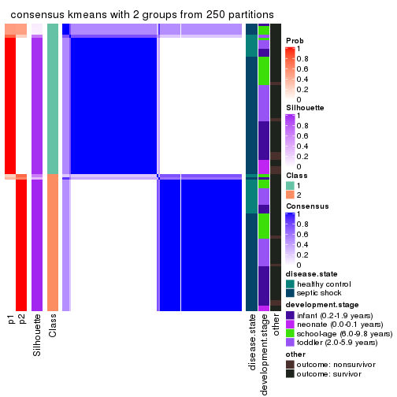</p>

</div>
<div id='tab-ATC-kmeans-consensus-heatmap-2'>
<pre><code class="r">consensus_heatmap(res, k = 3)
</code></pre>

<p>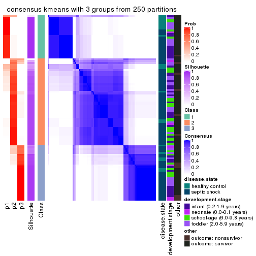</p>

</div>
<div id='tab-ATC-kmeans-consensus-heatmap-3'>
<pre><code class="r">consensus_heatmap(res, k = 4)
</code></pre>

<p>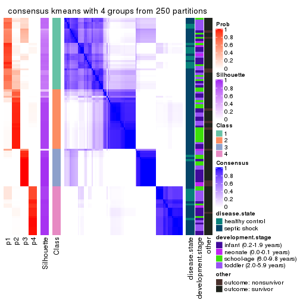</p>

</div>
<div id='tab-ATC-kmeans-consensus-heatmap-4'>
<pre><code class="r">consensus_heatmap(res, k = 5)
</code></pre>

<p>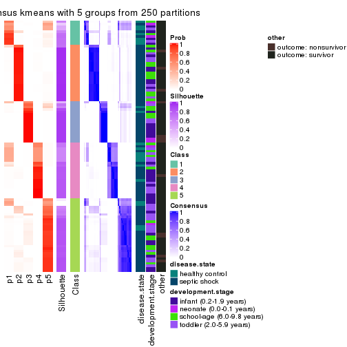</p>

</div>
<div id='tab-ATC-kmeans-consensus-heatmap-5'>
<pre><code class="r">consensus_heatmap(res, k = 6)
</code></pre>

<p>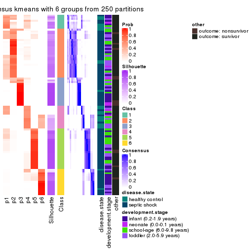</p>

</div>
</div>

Heatmaps for the membership of samples in all partitions to see how consistent they are:


<script>
$( function() {
	$( '#tabs-ATC-kmeans-membership-heatmap' ).tabs();
} );
</script>
<div id='tabs-ATC-kmeans-membership-heatmap'>
<ul>
<li><a href='#tab-ATC-kmeans-membership-heatmap-1'>k = 2</a></li>
<li><a href='#tab-ATC-kmeans-membership-heatmap-2'>k = 3</a></li>
<li><a href='#tab-ATC-kmeans-membership-heatmap-3'>k = 4</a></li>
<li><a href='#tab-ATC-kmeans-membership-heatmap-4'>k = 5</a></li>
<li><a href='#tab-ATC-kmeans-membership-heatmap-5'>k = 6</a></li>
</ul>
<div id='tab-ATC-kmeans-membership-heatmap-1'>
<pre><code class="r">membership_heatmap(res, k = 2)
</code></pre>

<p>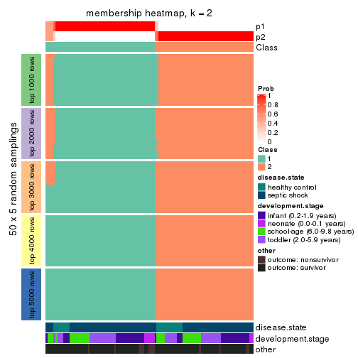</p>

</div>
<div id='tab-ATC-kmeans-membership-heatmap-2'>
<pre><code class="r">membership_heatmap(res, k = 3)
</code></pre>

<p>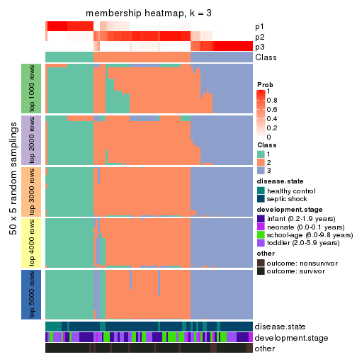</p>

</div>
<div id='tab-ATC-kmeans-membership-heatmap-3'>
<pre><code class="r">membership_heatmap(res, k = 4)
</code></pre>

<p>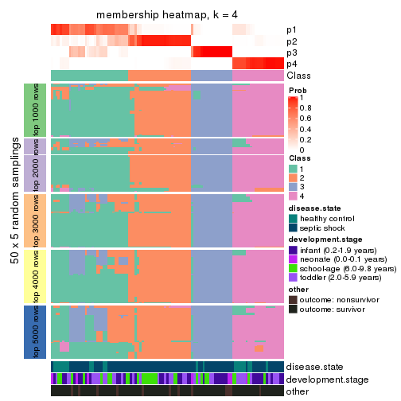</p>

</div>
<div id='tab-ATC-kmeans-membership-heatmap-4'>
<pre><code class="r">membership_heatmap(res, k = 5)
</code></pre>

<p>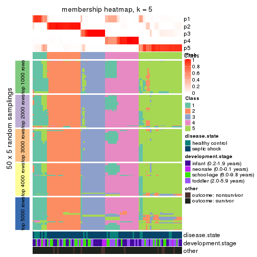</p>

</div>
<div id='tab-ATC-kmeans-membership-heatmap-5'>
<pre><code class="r">membership_heatmap(res, k = 6)
</code></pre>

<p>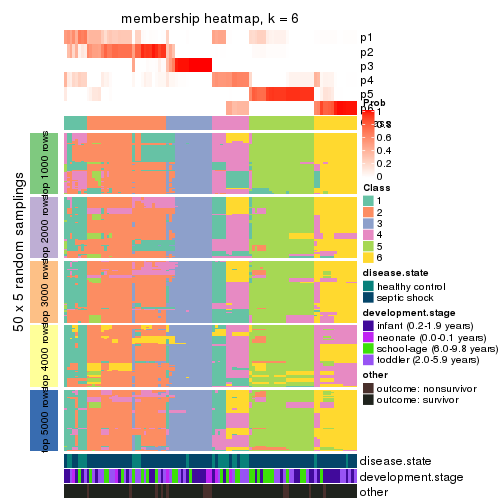</p>

</div>
</div>

As soon as we have had the classes for columns, we can look for signatures
which are significantly different between classes which can be candidate marks
for certain classes. Following are the heatmaps for signatures.


Signature heatmaps where rows are scaled:


<script>
$( function() {
	$( '#tabs-ATC-kmeans-get-signatures' ).tabs();
} );
</script>
<div id='tabs-ATC-kmeans-get-signatures'>
<ul>
<li><a href='#tab-ATC-kmeans-get-signatures-1'>k = 2</a></li>
<li><a href='#tab-ATC-kmeans-get-signatures-2'>k = 3</a></li>
<li><a href='#tab-ATC-kmeans-get-signatures-3'>k = 4</a></li>
<li><a href='#tab-ATC-kmeans-get-signatures-4'>k = 5</a></li>
<li><a href='#tab-ATC-kmeans-get-signatures-5'>k = 6</a></li>
</ul>
<div id='tab-ATC-kmeans-get-signatures-1'>
<pre><code class="r">get_signatures(res, k = 2)
</code></pre>

<p>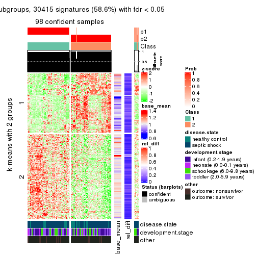</p>

</div>
<div id='tab-ATC-kmeans-get-signatures-2'>
<pre><code class="r">get_signatures(res, k = 3)
</code></pre>

<p>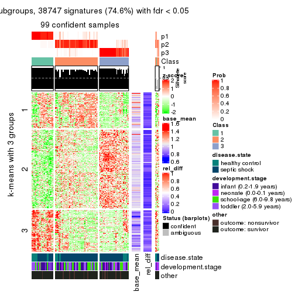</p>

</div>
<div id='tab-ATC-kmeans-get-signatures-3'>
<pre><code class="r">get_signatures(res, k = 4)
</code></pre>

<p>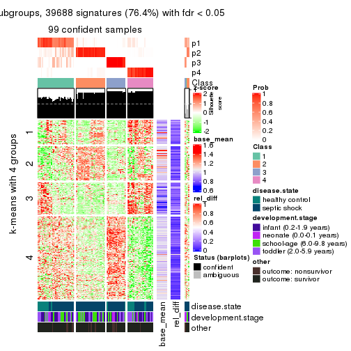</p>

</div>
<div id='tab-ATC-kmeans-get-signatures-4'>
<pre><code class="r">get_signatures(res, k = 5)
</code></pre>

<p>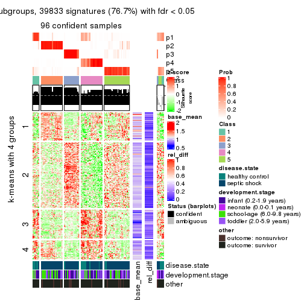</p>

</div>
<div id='tab-ATC-kmeans-get-signatures-5'>
<pre><code class="r">get_signatures(res, k = 6)
</code></pre>

<p>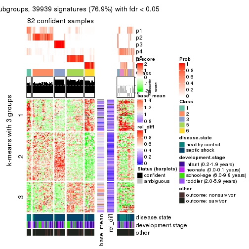</p>

</div>
</div>


Signature heatmaps where rows are not scaled:


<script>
$( function() {
	$( '#tabs-ATC-kmeans-get-signatures-no-scale' ).tabs();
} );
</script>
<div id='tabs-ATC-kmeans-get-signatures-no-scale'>
<ul>
<li><a href='#tab-ATC-kmeans-get-signatures-no-scale-1'>k = 2</a></li>
<li><a href='#tab-ATC-kmeans-get-signatures-no-scale-2'>k = 3</a></li>
<li><a href='#tab-ATC-kmeans-get-signatures-no-scale-3'>k = 4</a></li>
<li><a href='#tab-ATC-kmeans-get-signatures-no-scale-4'>k = 5</a></li>
<li><a href='#tab-ATC-kmeans-get-signatures-no-scale-5'>k = 6</a></li>
</ul>
<div id='tab-ATC-kmeans-get-signatures-no-scale-1'>
<pre><code class="r">get_signatures(res, k = 2, scale_rows = FALSE)
</code></pre>

<p>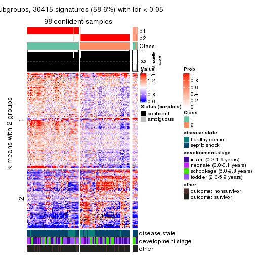</p>

</div>
<div id='tab-ATC-kmeans-get-signatures-no-scale-2'>
<pre><code class="r">get_signatures(res, k = 3, scale_rows = FALSE)
</code></pre>

<p>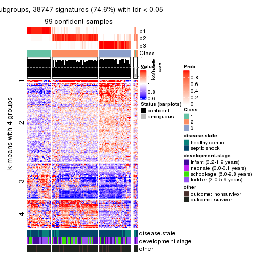</p>

</div>
<div id='tab-ATC-kmeans-get-signatures-no-scale-3'>
<pre><code class="r">get_signatures(res, k = 4, scale_rows = FALSE)
</code></pre>

<p>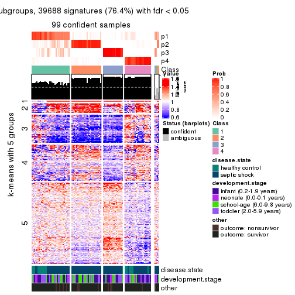</p>

</div>
<div id='tab-ATC-kmeans-get-signatures-no-scale-4'>
<pre><code class="r">get_signatures(res, k = 5, scale_rows = FALSE)
</code></pre>

<pre><code>#&gt; Error in mat[ceiling(1:nr/h_ratio), ceiling(1:nc/w_ratio), drop = FALSE]: subscript out of bounds
</code></pre>

<p>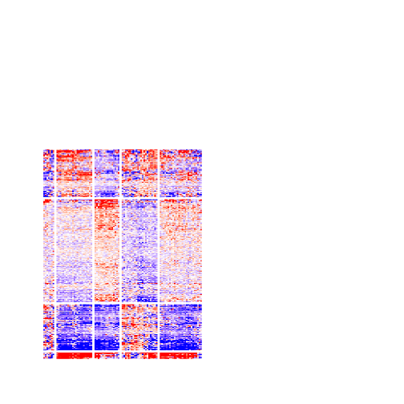</p>

</div>
<div id='tab-ATC-kmeans-get-signatures-no-scale-5'>
<pre><code class="r">get_signatures(res, k = 6, scale_rows = FALSE)
</code></pre>

<p>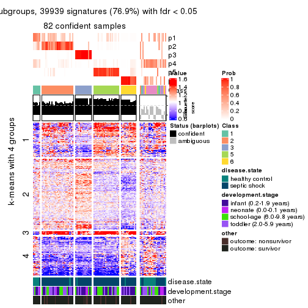</p>

</div>
</div>


Compare the overlap of signatures from different k:

```r
compare_signatures(res)
```

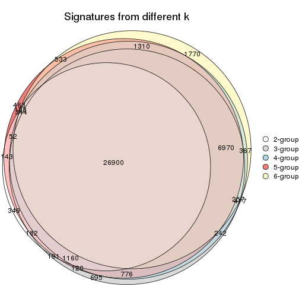

`get_signature()` returns a data frame invisibly. TO get the list of signatures, the function
call should be assigned to a variable explicitly. In following code, if `plot` argument is set
to `FALSE`, no heatmap is plotted while only the differential analysis is performed.

```r
# code only for demonstration
tb = get_signature(res, k = ..., plot = FALSE)
```

An example of the output of `tb` is:

```
#>   which_row         fdr    mean_1    mean_2 scaled_mean_1 scaled_mean_2 km
#> 1        38 0.042760348  8.373488  9.131774    -0.5533452     0.5164555  1
#> 2        40 0.018707592  7.106213  8.469186    -0.6173731     0.5762149  1
#> 3        55 0.019134737 10.221463 11.207825    -0.6159697     0.5749050  1
#> 4        59 0.006059896  5.921854  7.869574    -0.6899429     0.6439467  1
#> 5        60 0.018055526  8.928898 10.211722    -0.6204761     0.5791110  1
#> 6        98 0.009384629 15.714769 14.887706     0.6635654    -0.6193277  2
...
```

The columns in `tb` are:

1. `which_row`: row indices corresponding to the input matrix.
2. `fdr`: FDR for the differential test. 
3. `mean_x`: The mean value in group x.
4. `scaled_mean_x`: The mean value in group x after rows are scaled.
5. `km`: Row groups if k-means clustering is applied to rows.


UMAP plot which shows how samples are separated.


<script>
$( function() {
	$( '#tabs-ATC-kmeans-dimension-reduction' ).tabs();
} );
</script>
<div id='tabs-ATC-kmeans-dimension-reduction'>
<ul>
<li><a href='#tab-ATC-kmeans-dimension-reduction-1'>k = 2</a></li>
<li><a href='#tab-ATC-kmeans-dimension-reduction-2'>k = 3</a></li>
<li><a href='#tab-ATC-kmeans-dimension-reduction-3'>k = 4</a></li>
<li><a href='#tab-ATC-kmeans-dimension-reduction-4'>k = 5</a></li>
<li><a href='#tab-ATC-kmeans-dimension-reduction-5'>k = 6</a></li>
</ul>
<div id='tab-ATC-kmeans-dimension-reduction-1'>
<pre><code class="r">dimension_reduction(res, k = 2, method = &quot;UMAP&quot;)
</code></pre>

<p>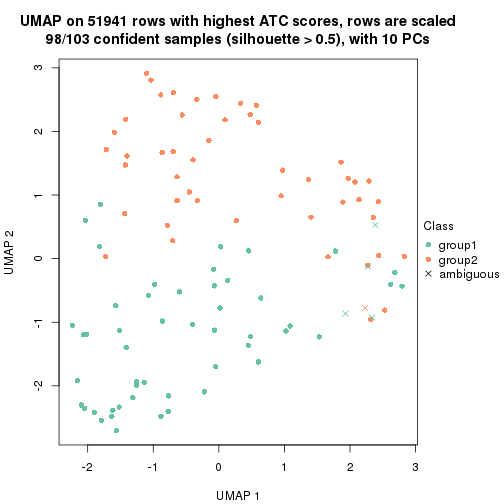</p>

</div>
<div id='tab-ATC-kmeans-dimension-reduction-2'>
<pre><code class="r">dimension_reduction(res, k = 3, method = &quot;UMAP&quot;)
</code></pre>

<p>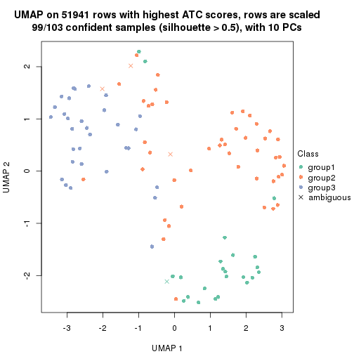</p>

</div>
<div id='tab-ATC-kmeans-dimension-reduction-3'>
<pre><code class="r">dimension_reduction(res, k = 4, method = &quot;UMAP&quot;)
</code></pre>

<p>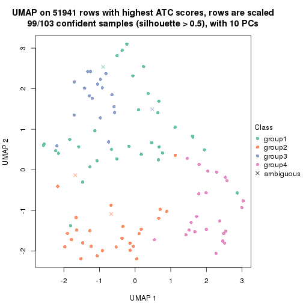</p>

</div>
<div id='tab-ATC-kmeans-dimension-reduction-4'>
<pre><code class="r">dimension_reduction(res, k = 5, method = &quot;UMAP&quot;)
</code></pre>

<p>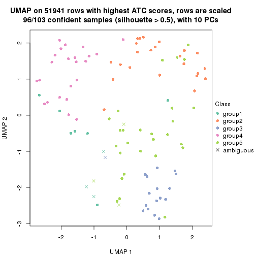</p>

</div>
<div id='tab-ATC-kmeans-dimension-reduction-5'>
<pre><code class="r">dimension_reduction(res, k = 6, method = &quot;UMAP&quot;)
</code></pre>

<p>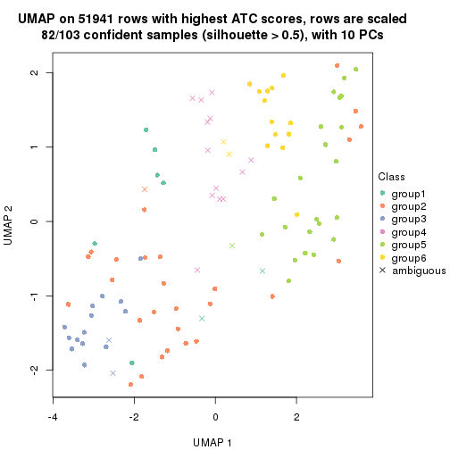</p>

</div>
</div>


Following heatmap shows how subgroups are split when increasing `k`:

```r
collect_classes(res)
```

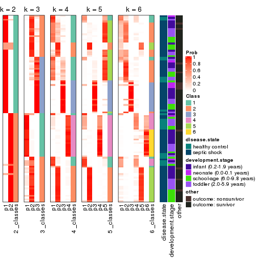


Test correlation between subgroups and known annotations. If the known
annotation is numeric, one-way ANOVA test is applied, and if the known
annotation is discrete, chi-squared contingency table test is applied.

```r
test_to_known_factors(res)
```

```
#>             n disease.state(p) development.stage(p) other(p) k
#> ATC:kmeans 98         2.76e-01                0.696    0.396 2
#> ATC:kmeans 99         6.39e-02                0.366    0.238 3
#> ATC:kmeans 99         3.95e-03                0.681    0.606 4
#> ATC:kmeans 96         3.68e-05                0.455    0.517 5
#> ATC:kmeans 82         3.55e-07                0.167    0.714 6
```


If matrix rows can be associated to genes, consider to use `functional_enrichment(res,
...)` to perform function enrichment for the signature genes. See [this vignette](http://bioconductor.org/packages/devel/bioc/vignettes/cola/inst/doc/functional_enrichment.html) for more detailed explanations.


 

---------------------------------------------------


### ATC:skmeans*


The object with results only for a single top-value method and a single partition method 
can be extracted as:

```r
res = res_list["ATC", "skmeans"]
# you can also extract it by
# res = res_list["ATC:skmeans"]
```

A summary of `res` and all the functions that can be applied to it:

```r
res
```

```
#> A 'ConsensusPartition' object with k = 2, 3, 4, 5, 6.
#>   On a matrix with 51941 rows and 103 columns.
#>   Top rows (1000, 2000, 3000, 4000, 5000) are extracted by 'ATC' method.
#>   Subgroups are detected by 'skmeans' method.
#>   Performed in total 1250 partitions by row resampling.
#>   Best k for subgroups seems to be 4.
#> 
#> Following methods can be applied to this 'ConsensusPartition' object:
#>  [1] "cola_report"             "collect_classes"         "collect_plots"          
#>  [4] "collect_stats"           "colnames"                "compare_signatures"     
#>  [7] "consensus_heatmap"       "dimension_reduction"     "functional_enrichment"  
#> [10] "get_anno_col"            "get_anno"                "get_classes"            
#> [13] "get_consensus"           "get_matrix"              "get_membership"         
#> [16] "get_param"               "get_signatures"          "get_stats"              
#> [19] "is_best_k"               "is_stable_k"             "membership_heatmap"     
#> [22] "ncol"                    "nrow"                    "plot_ecdf"              
#> [25] "rownames"                "select_partition_number" "show"                   
#> [28] "suggest_best_k"          "test_to_known_factors"
```

`collect_plots()` function collects all the plots made from `res` for all `k` (number of partitions)
into one single page to provide an easy and fast comparison between different `k`.

```r
collect_plots(res)
```

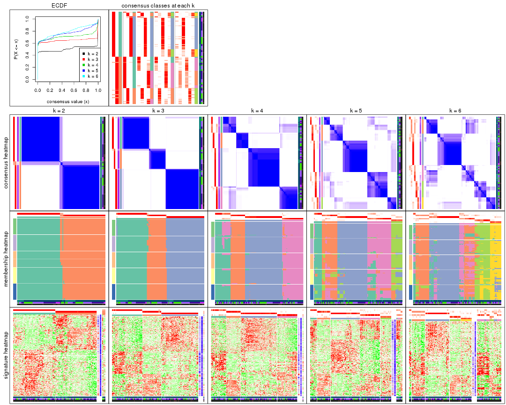

The plots are:

- The first row: a plot of the ECDF (empirical cumulative distribution
  function) curves of the consensus matrix for each `k` and the heatmap of
  predicted classes for each `k`.
- The second row: heatmaps of the consensus matrix for each `k`.
- The third row: heatmaps of the membership matrix for each `k`.
- The fouth row: heatmaps of the signatures for each `k`.

All the plots in panels can be made by individual functions and they are
plotted later in this section.

`select_partition_number()` produces several plots showing different
statistics for choosing "optimized" `k`. There are following statistics:

- ECDF curves of the consensus matrix for each `k`;
- 1-PAC. [The PAC
  score](https://en.wikipedia.org/wiki/Consensus_clustering#Over-interpretation_potential_of_consensus_clustering)
  measures the proportion of the ambiguous subgrouping.
- Mean silhouette score.
- Concordance. The mean probability of fiting the consensus class ids in all
  partitions.
- Area increased. Denote $A_k$ as the area under the ECDF curve for current
  `k`, the area increased is defined as $A_k - A_{k-1}$.
- Rand index. The percent of pairs of samples that are both in a same cluster
  or both are not in a same cluster in the partition of k and k-1.
- Jaccard index. The ratio of pairs of samples are both in a same cluster in
  the partition of k and k-1 and the pairs of samples are both in a same
  cluster in the partition k or k-1.

The detailed explanations of these statistics can be found in [the _cola_
vignette](http://bioconductor.org/packages/devel/bioc/vignettes/cola/inst/doc/cola.html#toc_13).

Generally speaking, lower PAC score, higher mean silhouette score or higher
concordance corresponds to better partition. Rand index and Jaccard index
measure how similar the current partition is compared to partition with `k-1`.
If they are too similar, we won't accept `k` is better than `k-1`.

```r
select_partition_number(res)
```

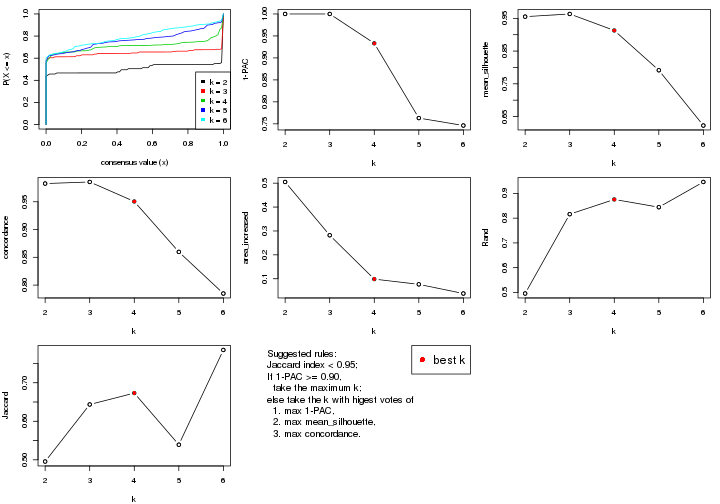

The numeric values for all these statistics can be obtained by `get_stats()`.

```r
get_stats(res)
```

```
#>   k 1-PAC mean_silhouette concordance area_increased  Rand Jaccard
#> 2 2 1.000           0.955       0.983         0.5051 0.496   0.496
#> 3 3 1.000           0.963       0.986         0.2820 0.816   0.644
#> 4 4 0.933           0.913       0.950         0.0984 0.876   0.673
#> 5 5 0.763           0.791       0.860         0.0764 0.844   0.539
#> 6 6 0.746           0.623       0.785         0.0381 0.946   0.785
```

`suggest_best_k()` suggests the best $k$ based on these statistics. The rules are as follows:

- All $k$ with Jaccard index larger than 0.95 are removed because increasing
  $k$ does not provide enough extra information. If all $k$ are removed, it is
  marked as no subgroup is detected.
- For all $k$ with 1-PAC score larger than 0.9, the maximal $k$ is taken as
  the best $k$, and other $k$ are marked as optional $k$.
- If it does not fit the second rule. The $k$ with the maximal vote of the
  highest 1-PAC score, highest mean silhouette, and highest concordance is
  taken as the best $k$.

```r
suggest_best_k(res)
```

```
#> [1] 4
#> attr(,"optional")
#> [1] 2 3
```

There is also optional best $k$ = 2 3 that is worth to check.

Following shows the table of the partitions (You need to click the **show/hide
code output** link to see it). The membership matrix (columns with name `p*`)
is inferred by
[`clue::cl_consensus()`](https://www.rdocumentation.org/link/cl_consensus?package=clue)
function with the `SE` method. Basically the value in the membership matrix
represents the probability to belong to a certain group. The finall class
label for an item is determined with the group with highest probability it
belongs to.

In `get_classes()` function, the entropy is calculated from the membership
matrix and the silhouette score is calculated from the consensus matrix.


<script>
$( function() {
	$( '#tabs-ATC-skmeans-get-classes' ).tabs();
} );
</script>
<div id='tabs-ATC-skmeans-get-classes'>
<ul>
<li><a href='#tab-ATC-skmeans-get-classes-1'>k = 2</a></li>
<li><a href='#tab-ATC-skmeans-get-classes-2'>k = 3</a></li>
<li><a href='#tab-ATC-skmeans-get-classes-3'>k = 4</a></li>
<li><a href='#tab-ATC-skmeans-get-classes-4'>k = 5</a></li>
<li><a href='#tab-ATC-skmeans-get-classes-5'>k = 6</a></li>
</ul>

<div id='tab-ATC-skmeans-get-classes-1'>
<p><a id='tab-ATC-skmeans-get-classes-1-a' style='color:#0366d6' href='#'>show/hide code output</a></p>
<pre><code class="r">cbind(get_classes(res, k = 2), get_membership(res, k = 2))
</code></pre>

<pre><code>#&gt;           class entropy silhouette    p1    p2
#&gt; GSM647569     1  0.0000      1.000 1.000 0.000
#&gt; GSM647574     1  0.0000      1.000 1.000 0.000
#&gt; GSM647577     1  0.0000      1.000 1.000 0.000
#&gt; GSM647547     2  0.0000      0.965 0.000 1.000
#&gt; GSM647552     1  0.0000      1.000 1.000 0.000
#&gt; GSM647553     1  0.0000      1.000 1.000 0.000
#&gt; GSM647565     2  0.0000      0.965 0.000 1.000
#&gt; GSM647545     2  0.0000      0.965 0.000 1.000
#&gt; GSM647549     2  0.0000      0.965 0.000 1.000
#&gt; GSM647550     1  0.0000      1.000 1.000 0.000
#&gt; GSM647560     1  0.0000      1.000 1.000 0.000
#&gt; GSM647617     1  0.0000      1.000 1.000 0.000
#&gt; GSM647528     2  0.0000      0.965 0.000 1.000
#&gt; GSM647529     2  0.0000      0.965 0.000 1.000
#&gt; GSM647531     2  0.0000      0.965 0.000 1.000
#&gt; GSM647540     1  0.0000      1.000 1.000 0.000
#&gt; GSM647541     1  0.0000      1.000 1.000 0.000
#&gt; GSM647546     1  0.0000      1.000 1.000 0.000
#&gt; GSM647557     2  0.0000      0.965 0.000 1.000
#&gt; GSM647561     2  0.0000      0.965 0.000 1.000
#&gt; GSM647567     2  0.0000      0.965 0.000 1.000
#&gt; GSM647568     1  0.0000      1.000 1.000 0.000
#&gt; GSM647570     2  0.0000      0.965 0.000 1.000
#&gt; GSM647573     2  0.0000      0.965 0.000 1.000
#&gt; GSM647576     1  0.0000      1.000 1.000 0.000
#&gt; GSM647579     1  0.0000      1.000 1.000 0.000
#&gt; GSM647580     1  0.0000      1.000 1.000 0.000
#&gt; GSM647583     1  0.0000      1.000 1.000 0.000
#&gt; GSM647592     1  0.0000      1.000 1.000 0.000
#&gt; GSM647593     2  0.1414      0.948 0.020 0.980
#&gt; GSM647595     2  0.0000      0.965 0.000 1.000
#&gt; GSM647597     2  0.0000      0.965 0.000 1.000
#&gt; GSM647598     2  0.0000      0.965 0.000 1.000
#&gt; GSM647613     2  0.0000      0.965 0.000 1.000
#&gt; GSM647615     1  0.0000      1.000 1.000 0.000
#&gt; GSM647616     1  0.0000      1.000 1.000 0.000
#&gt; GSM647619     2  0.9954      0.193 0.460 0.540
#&gt; GSM647582     1  0.0000      1.000 1.000 0.000
#&gt; GSM647591     2  0.0000      0.965 0.000 1.000
#&gt; GSM647527     2  0.0000      0.965 0.000 1.000
#&gt; GSM647530     2  0.0000      0.965 0.000 1.000
#&gt; GSM647532     2  0.0000      0.965 0.000 1.000
#&gt; GSM647544     2  0.0000      0.965 0.000 1.000
#&gt; GSM647551     1  0.0000      1.000 1.000 0.000
#&gt; GSM647556     1  0.0000      1.000 1.000 0.000
#&gt; GSM647558     2  0.0000      0.965 0.000 1.000
#&gt; GSM647572     1  0.0000      1.000 1.000 0.000
#&gt; GSM647578     1  0.0000      1.000 1.000 0.000
#&gt; GSM647581     2  0.0000      0.965 0.000 1.000
#&gt; GSM647594     2  0.0000      0.965 0.000 1.000
#&gt; GSM647599     1  0.0000      1.000 1.000 0.000
#&gt; GSM647600     1  0.0000      1.000 1.000 0.000
#&gt; GSM647601     2  0.0000      0.965 0.000 1.000
#&gt; GSM647603     1  0.0000      1.000 1.000 0.000
#&gt; GSM647610     1  0.0000      1.000 1.000 0.000
#&gt; GSM647611     1  0.0000      1.000 1.000 0.000
#&gt; GSM647612     1  0.0000      1.000 1.000 0.000
#&gt; GSM647614     1  0.0000      1.000 1.000 0.000
#&gt; GSM647618     2  0.0000      0.965 0.000 1.000
#&gt; GSM647629     1  0.0000      1.000 1.000 0.000
#&gt; GSM647535     1  0.0000      1.000 1.000 0.000
#&gt; GSM647563     2  0.0000      0.965 0.000 1.000
#&gt; GSM647542     1  0.0000      1.000 1.000 0.000
#&gt; GSM647543     1  0.0000      1.000 1.000 0.000
#&gt; GSM647548     2  0.0000      0.965 0.000 1.000
#&gt; GSM647554     1  0.0000      1.000 1.000 0.000
#&gt; GSM647555     1  0.0000      1.000 1.000 0.000
#&gt; GSM647559     2  0.0000      0.965 0.000 1.000
#&gt; GSM647562     2  0.0000      0.965 0.000 1.000
#&gt; GSM647564     1  0.0000      1.000 1.000 0.000
#&gt; GSM647571     1  0.0000      1.000 1.000 0.000
#&gt; GSM647584     2  0.9815      0.312 0.420 0.580
#&gt; GSM647585     1  0.0000      1.000 1.000 0.000
#&gt; GSM647586     2  0.0000      0.965 0.000 1.000
#&gt; GSM647587     2  0.0000      0.965 0.000 1.000
#&gt; GSM647588     2  0.0000      0.965 0.000 1.000
#&gt; GSM647596     2  0.0000      0.965 0.000 1.000
#&gt; GSM647602     1  0.0000      1.000 1.000 0.000
#&gt; GSM647609     2  0.9815      0.312 0.420 0.580
#&gt; GSM647620     1  0.0000      1.000 1.000 0.000
#&gt; GSM647627     2  0.3114      0.914 0.056 0.944
#&gt; GSM647628     2  0.0000      0.965 0.000 1.000
#&gt; GSM647533     1  0.0000      1.000 1.000 0.000
#&gt; GSM647536     2  0.0000      0.965 0.000 1.000
#&gt; GSM647537     1  0.0000      1.000 1.000 0.000
#&gt; GSM647606     2  0.0000      0.965 0.000 1.000
#&gt; GSM647621     2  0.0000      0.965 0.000 1.000
#&gt; GSM647626     1  0.0000      1.000 1.000 0.000
#&gt; GSM647538     1  0.0376      0.996 0.996 0.004
#&gt; GSM647575     2  0.0000      0.965 0.000 1.000
#&gt; GSM647590     2  0.0000      0.965 0.000 1.000
#&gt; GSM647605     2  0.0000      0.965 0.000 1.000
#&gt; GSM647607     2  0.0000      0.965 0.000 1.000
#&gt; GSM647608     2  0.0000      0.965 0.000 1.000
#&gt; GSM647622     1  0.0000      1.000 1.000 0.000
#&gt; GSM647623     1  0.0000      1.000 1.000 0.000
#&gt; GSM647624     2  0.0000      0.965 0.000 1.000
#&gt; GSM647625     1  0.0000      1.000 1.000 0.000
#&gt; GSM647534     1  0.0000      1.000 1.000 0.000
#&gt; GSM647539     2  0.0000      0.965 0.000 1.000
#&gt; GSM647566     2  0.0000      0.965 0.000 1.000
#&gt; GSM647589     2  0.9710      0.349 0.400 0.600
#&gt; GSM647604     2  0.0000      0.965 0.000 1.000
</code></pre>

<script>
$('#tab-ATC-skmeans-get-classes-1-a').parent().next().next().hide();
$('#tab-ATC-skmeans-get-classes-1-a').click(function(){
  $('#tab-ATC-skmeans-get-classes-1-a').parent().next().next().toggle();
  return(false);
});
</script>
</div>

<div id='tab-ATC-skmeans-get-classes-2'>
<p><a id='tab-ATC-skmeans-get-classes-2-a' style='color:#0366d6' href='#'>show/hide code output</a></p>
<pre><code class="r">cbind(get_classes(res, k = 3), get_membership(res, k = 3))
</code></pre>

<pre><code>#&gt;           class entropy silhouette    p1    p2    p3
#&gt; GSM647569     3  0.0000     0.9885 0.000 0.000 1.000
#&gt; GSM647574     3  0.0000     0.9885 0.000 0.000 1.000
#&gt; GSM647577     3  0.0000     0.9885 0.000 0.000 1.000
#&gt; GSM647547     1  0.0000     0.9871 1.000 0.000 0.000
#&gt; GSM647552     3  0.0000     0.9885 0.000 0.000 1.000
#&gt; GSM647553     3  0.0000     0.9885 0.000 0.000 1.000
#&gt; GSM647565     1  0.0000     0.9871 1.000 0.000 0.000
#&gt; GSM647545     1  0.0000     0.9871 1.000 0.000 0.000
#&gt; GSM647549     1  0.0000     0.9871 1.000 0.000 0.000
#&gt; GSM647550     3  0.6305     0.0509 0.000 0.484 0.516
#&gt; GSM647560     3  0.0000     0.9885 0.000 0.000 1.000
#&gt; GSM647617     3  0.0000     0.9885 0.000 0.000 1.000
#&gt; GSM647528     2  0.0237     0.9673 0.004 0.996 0.000
#&gt; GSM647529     1  0.0000     0.9871 1.000 0.000 0.000
#&gt; GSM647531     1  0.0000     0.9871 1.000 0.000 0.000
#&gt; GSM647540     3  0.0000     0.9885 0.000 0.000 1.000
#&gt; GSM647541     3  0.0000     0.9885 0.000 0.000 1.000
#&gt; GSM647546     3  0.0000     0.9885 0.000 0.000 1.000
#&gt; GSM647557     1  0.0000     0.9871 1.000 0.000 0.000
#&gt; GSM647561     1  0.0000     0.9871 1.000 0.000 0.000
#&gt; GSM647567     1  0.0000     0.9871 1.000 0.000 0.000
#&gt; GSM647568     3  0.0000     0.9885 0.000 0.000 1.000
#&gt; GSM647570     1  0.0000     0.9871 1.000 0.000 0.000
#&gt; GSM647573     1  0.0000     0.9871 1.000 0.000 0.000
#&gt; GSM647576     3  0.0000     0.9885 0.000 0.000 1.000
#&gt; GSM647579     3  0.0000     0.9885 0.000 0.000 1.000
#&gt; GSM647580     3  0.0000     0.9885 0.000 0.000 1.000
#&gt; GSM647583     3  0.0000     0.9885 0.000 0.000 1.000
#&gt; GSM647592     2  0.0000     0.9699 0.000 1.000 0.000
#&gt; GSM647593     2  0.0000     0.9699 0.000 1.000 0.000
#&gt; GSM647595     2  0.0000     0.9699 0.000 1.000 0.000
#&gt; GSM647597     1  0.0000     0.9871 1.000 0.000 0.000
#&gt; GSM647598     2  0.0000     0.9699 0.000 1.000 0.000
#&gt; GSM647613     1  0.0000     0.9871 1.000 0.000 0.000
#&gt; GSM647615     3  0.0000     0.9885 0.000 0.000 1.000
#&gt; GSM647616     3  0.0000     0.9885 0.000 0.000 1.000
#&gt; GSM647619     2  0.0000     0.9699 0.000 1.000 0.000
#&gt; GSM647582     3  0.0000     0.9885 0.000 0.000 1.000
#&gt; GSM647591     2  0.0000     0.9699 0.000 1.000 0.000
#&gt; GSM647527     2  0.0892     0.9551 0.020 0.980 0.000
#&gt; GSM647530     1  0.0000     0.9871 1.000 0.000 0.000
#&gt; GSM647532     1  0.0000     0.9871 1.000 0.000 0.000
#&gt; GSM647544     1  0.0000     0.9871 1.000 0.000 0.000
#&gt; GSM647551     2  0.0000     0.9699 0.000 1.000 0.000
#&gt; GSM647556     3  0.0000     0.9885 0.000 0.000 1.000
#&gt; GSM647558     2  0.5291     0.6555 0.268 0.732 0.000
#&gt; GSM647572     3  0.0000     0.9885 0.000 0.000 1.000
#&gt; GSM647578     3  0.0000     0.9885 0.000 0.000 1.000
#&gt; GSM647581     1  0.0000     0.9871 1.000 0.000 0.000
#&gt; GSM647594     1  0.0000     0.9871 1.000 0.000 0.000
#&gt; GSM647599     3  0.0000     0.9885 0.000 0.000 1.000
#&gt; GSM647600     3  0.0000     0.9885 0.000 0.000 1.000
#&gt; GSM647601     2  0.0000     0.9699 0.000 1.000 0.000
#&gt; GSM647603     3  0.0000     0.9885 0.000 0.000 1.000
#&gt; GSM647610     3  0.0000     0.9885 0.000 0.000 1.000
#&gt; GSM647611     2  0.0000     0.9699 0.000 1.000 0.000
#&gt; GSM647612     3  0.0237     0.9848 0.000 0.004 0.996
#&gt; GSM647614     3  0.0000     0.9885 0.000 0.000 1.000
#&gt; GSM647618     2  0.0000     0.9699 0.000 1.000 0.000
#&gt; GSM647629     3  0.0000     0.9885 0.000 0.000 1.000
#&gt; GSM647535     3  0.0000     0.9885 0.000 0.000 1.000
#&gt; GSM647563     2  0.0000     0.9699 0.000 1.000 0.000
#&gt; GSM647542     3  0.0000     0.9885 0.000 0.000 1.000
#&gt; GSM647543     3  0.0000     0.9885 0.000 0.000 1.000
#&gt; GSM647548     1  0.0000     0.9871 1.000 0.000 0.000
#&gt; GSM647554     3  0.0000     0.9885 0.000 0.000 1.000
#&gt; GSM647555     3  0.0000     0.9885 0.000 0.000 1.000
#&gt; GSM647559     2  0.0000     0.9699 0.000 1.000 0.000
#&gt; GSM647562     1  0.0000     0.9871 1.000 0.000 0.000
#&gt; GSM647564     3  0.0000     0.9885 0.000 0.000 1.000
#&gt; GSM647571     3  0.0000     0.9885 0.000 0.000 1.000
#&gt; GSM647584     2  0.0000     0.9699 0.000 1.000 0.000
#&gt; GSM647585     3  0.0000     0.9885 0.000 0.000 1.000
#&gt; GSM647586     2  0.0000     0.9699 0.000 1.000 0.000
#&gt; GSM647587     2  0.5465     0.6211 0.288 0.712 0.000
#&gt; GSM647588     2  0.0000     0.9699 0.000 1.000 0.000
#&gt; GSM647596     1  0.0000     0.9871 1.000 0.000 0.000
#&gt; GSM647602     3  0.0000     0.9885 0.000 0.000 1.000
#&gt; GSM647609     2  0.0000     0.9699 0.000 1.000 0.000
#&gt; GSM647620     2  0.1643     0.9293 0.000 0.956 0.044
#&gt; GSM647627     2  0.0000     0.9699 0.000 1.000 0.000
#&gt; GSM647628     1  0.0000     0.9871 1.000 0.000 0.000
#&gt; GSM647533     3  0.0424     0.9801 0.008 0.000 0.992
#&gt; GSM647536     1  0.0000     0.9871 1.000 0.000 0.000
#&gt; GSM647537     3  0.0000     0.9885 0.000 0.000 1.000
#&gt; GSM647606     1  0.0000     0.9871 1.000 0.000 0.000
#&gt; GSM647621     1  0.0000     0.9871 1.000 0.000 0.000
#&gt; GSM647626     3  0.0000     0.9885 0.000 0.000 1.000
#&gt; GSM647538     1  0.4504     0.7390 0.804 0.000 0.196
#&gt; GSM647575     1  0.0000     0.9871 1.000 0.000 0.000
#&gt; GSM647590     1  0.0000     0.9871 1.000 0.000 0.000
#&gt; GSM647605     1  0.0000     0.9871 1.000 0.000 0.000
#&gt; GSM647607     1  0.0000     0.9871 1.000 0.000 0.000
#&gt; GSM647608     1  0.0000     0.9871 1.000 0.000 0.000
#&gt; GSM647622     3  0.0000     0.9885 0.000 0.000 1.000
#&gt; GSM647623     3  0.0000     0.9885 0.000 0.000 1.000
#&gt; GSM647624     1  0.0000     0.9871 1.000 0.000 0.000
#&gt; GSM647625     3  0.0000     0.9885 0.000 0.000 1.000
#&gt; GSM647534     3  0.0000     0.9885 0.000 0.000 1.000
#&gt; GSM647539     1  0.0000     0.9871 1.000 0.000 0.000
#&gt; GSM647566     1  0.0000     0.9871 1.000 0.000 0.000
#&gt; GSM647589     1  0.4121     0.7780 0.832 0.000 0.168
#&gt; GSM647604     1  0.0000     0.9871 1.000 0.000 0.000
</code></pre>

<script>
$('#tab-ATC-skmeans-get-classes-2-a').parent().next().next().hide();
$('#tab-ATC-skmeans-get-classes-2-a').click(function(){
  $('#tab-ATC-skmeans-get-classes-2-a').parent().next().next().toggle();
  return(false);
});
</script>
</div>

<div id='tab-ATC-skmeans-get-classes-3'>
<p><a id='tab-ATC-skmeans-get-classes-3-a' style='color:#0366d6' href='#'>show/hide code output</a></p>
<pre><code class="r">cbind(get_classes(res, k = 4), get_membership(res, k = 4))
</code></pre>

<pre><code>#&gt;           class entropy silhouette    p1    p2    p3    p4
#&gt; GSM647569     3  0.0000      0.987 0.000 0.000 1.000 0.000
#&gt; GSM647574     3  0.1716      0.941 0.064 0.000 0.936 0.000
#&gt; GSM647577     3  0.0000      0.987 0.000 0.000 1.000 0.000
#&gt; GSM647547     1  0.0188      0.800 0.996 0.000 0.000 0.004
#&gt; GSM647552     3  0.0895      0.975 0.004 0.020 0.976 0.000
#&gt; GSM647553     3  0.2081      0.924 0.084 0.000 0.916 0.000
#&gt; GSM647565     4  0.4605      0.262 0.336 0.000 0.000 0.664
#&gt; GSM647545     4  0.0000      0.937 0.000 0.000 0.000 1.000
#&gt; GSM647549     4  0.0000      0.937 0.000 0.000 0.000 1.000
#&gt; GSM647550     2  0.3402      0.753 0.004 0.832 0.164 0.000
#&gt; GSM647560     3  0.0000      0.987 0.000 0.000 1.000 0.000
#&gt; GSM647617     3  0.0000      0.987 0.000 0.000 1.000 0.000
#&gt; GSM647528     4  0.2149      0.856 0.000 0.088 0.000 0.912
#&gt; GSM647529     4  0.0592      0.925 0.016 0.000 0.000 0.984
#&gt; GSM647531     4  0.0000      0.937 0.000 0.000 0.000 1.000
#&gt; GSM647540     3  0.0000      0.987 0.000 0.000 1.000 0.000
#&gt; GSM647541     3  0.0895      0.975 0.004 0.020 0.976 0.000
#&gt; GSM647546     3  0.0000      0.987 0.000 0.000 1.000 0.000
#&gt; GSM647557     4  0.0000      0.937 0.000 0.000 0.000 1.000
#&gt; GSM647561     4  0.0000      0.937 0.000 0.000 0.000 1.000
#&gt; GSM647567     1  0.4277      0.776 0.720 0.000 0.000 0.280
#&gt; GSM647568     3  0.1637      0.945 0.060 0.000 0.940 0.000
#&gt; GSM647570     4  0.0188      0.935 0.000 0.004 0.000 0.996
#&gt; GSM647573     1  0.4888      0.578 0.588 0.000 0.000 0.412
#&gt; GSM647576     3  0.0000      0.987 0.000 0.000 1.000 0.000
#&gt; GSM647579     3  0.0000      0.987 0.000 0.000 1.000 0.000
#&gt; GSM647580     3  0.0000      0.987 0.000 0.000 1.000 0.000
#&gt; GSM647583     3  0.0000      0.987 0.000 0.000 1.000 0.000
#&gt; GSM647592     2  0.0188      0.971 0.004 0.996 0.000 0.000
#&gt; GSM647593     2  0.0000      0.972 0.000 1.000 0.000 0.000
#&gt; GSM647595     2  0.0707      0.969 0.000 0.980 0.000 0.020
#&gt; GSM647597     4  0.0000      0.937 0.000 0.000 0.000 1.000
#&gt; GSM647598     4  0.3975      0.673 0.000 0.240 0.000 0.760
#&gt; GSM647613     4  0.0000      0.937 0.000 0.000 0.000 1.000
#&gt; GSM647615     3  0.0895      0.975 0.004 0.020 0.976 0.000
#&gt; GSM647616     3  0.0000      0.987 0.000 0.000 1.000 0.000
#&gt; GSM647619     2  0.0000      0.972 0.000 1.000 0.000 0.000
#&gt; GSM647582     3  0.0895      0.975 0.004 0.020 0.976 0.000
#&gt; GSM647591     2  0.0817      0.967 0.000 0.976 0.000 0.024
#&gt; GSM647527     4  0.2011      0.864 0.000 0.080 0.000 0.920
#&gt; GSM647530     4  0.0336      0.931 0.008 0.000 0.000 0.992
#&gt; GSM647532     4  0.1118      0.908 0.036 0.000 0.000 0.964
#&gt; GSM647544     4  0.0000      0.937 0.000 0.000 0.000 1.000
#&gt; GSM647551     2  0.0188      0.971 0.004 0.996 0.000 0.000
#&gt; GSM647556     3  0.0000      0.987 0.000 0.000 1.000 0.000
#&gt; GSM647558     4  0.0188      0.935 0.000 0.004 0.000 0.996
#&gt; GSM647572     3  0.0000      0.987 0.000 0.000 1.000 0.000
#&gt; GSM647578     3  0.0000      0.987 0.000 0.000 1.000 0.000
#&gt; GSM647581     4  0.0000      0.937 0.000 0.000 0.000 1.000
#&gt; GSM647594     4  0.0000      0.937 0.000 0.000 0.000 1.000
#&gt; GSM647599     3  0.0000      0.987 0.000 0.000 1.000 0.000
#&gt; GSM647600     3  0.0000      0.987 0.000 0.000 1.000 0.000
#&gt; GSM647601     2  0.0817      0.967 0.000 0.976 0.000 0.024
#&gt; GSM647603     3  0.0000      0.987 0.000 0.000 1.000 0.000
#&gt; GSM647610     3  0.0895      0.975 0.004 0.020 0.976 0.000
#&gt; GSM647611     2  0.0188      0.971 0.004 0.996 0.000 0.000
#&gt; GSM647612     3  0.1489      0.956 0.004 0.044 0.952 0.000
#&gt; GSM647614     3  0.0000      0.987 0.000 0.000 1.000 0.000
#&gt; GSM647618     2  0.1118      0.957 0.000 0.964 0.000 0.036
#&gt; GSM647629     3  0.0657      0.979 0.004 0.012 0.984 0.000
#&gt; GSM647535     3  0.0000      0.987 0.000 0.000 1.000 0.000
#&gt; GSM647563     4  0.3942      0.672 0.000 0.236 0.000 0.764
#&gt; GSM647542     3  0.0000      0.987 0.000 0.000 1.000 0.000
#&gt; GSM647543     3  0.0000      0.987 0.000 0.000 1.000 0.000
#&gt; GSM647548     1  0.4661      0.689 0.652 0.000 0.000 0.348
#&gt; GSM647554     3  0.0895      0.975 0.004 0.020 0.976 0.000
#&gt; GSM647555     3  0.0000      0.987 0.000 0.000 1.000 0.000
#&gt; GSM647559     2  0.0817      0.967 0.000 0.976 0.000 0.024
#&gt; GSM647562     4  0.0000      0.937 0.000 0.000 0.000 1.000
#&gt; GSM647564     3  0.0000      0.987 0.000 0.000 1.000 0.000
#&gt; GSM647571     3  0.0000      0.987 0.000 0.000 1.000 0.000
#&gt; GSM647584     2  0.0000      0.972 0.000 1.000 0.000 0.000
#&gt; GSM647585     3  0.0000      0.987 0.000 0.000 1.000 0.000
#&gt; GSM647586     2  0.0817      0.967 0.000 0.976 0.000 0.024
#&gt; GSM647587     4  0.0188      0.935 0.000 0.004 0.000 0.996
#&gt; GSM647588     2  0.0707      0.969 0.000 0.980 0.000 0.020
#&gt; GSM647596     4  0.0000      0.937 0.000 0.000 0.000 1.000
#&gt; GSM647602     3  0.0000      0.987 0.000 0.000 1.000 0.000
#&gt; GSM647609     2  0.0000      0.972 0.000 1.000 0.000 0.000
#&gt; GSM647620     2  0.0188      0.971 0.004 0.996 0.000 0.000
#&gt; GSM647627     2  0.0000      0.972 0.000 1.000 0.000 0.000
#&gt; GSM647628     4  0.1211      0.905 0.040 0.000 0.000 0.960
#&gt; GSM647533     1  0.1022      0.778 0.968 0.000 0.032 0.000
#&gt; GSM647536     4  0.1118      0.908 0.036 0.000 0.000 0.964
#&gt; GSM647537     3  0.2011      0.927 0.080 0.000 0.920 0.000
#&gt; GSM647606     1  0.0188      0.800 0.996 0.000 0.000 0.004
#&gt; GSM647621     1  0.0188      0.800 0.996 0.000 0.000 0.004
#&gt; GSM647626     3  0.0000      0.987 0.000 0.000 1.000 0.000
#&gt; GSM647538     1  0.0188      0.797 0.996 0.000 0.004 0.000
#&gt; GSM647575     1  0.4103      0.794 0.744 0.000 0.000 0.256
#&gt; GSM647590     1  0.3942      0.798 0.764 0.000 0.000 0.236
#&gt; GSM647605     1  0.4164      0.789 0.736 0.000 0.000 0.264
#&gt; GSM647607     1  0.4222      0.783 0.728 0.000 0.000 0.272
#&gt; GSM647608     1  0.0188      0.800 0.996 0.000 0.000 0.004
#&gt; GSM647622     3  0.1867      0.935 0.072 0.000 0.928 0.000
#&gt; GSM647623     3  0.0000      0.987 0.000 0.000 1.000 0.000
#&gt; GSM647624     1  0.4103      0.794 0.744 0.000 0.000 0.256
#&gt; GSM647625     3  0.0000      0.987 0.000 0.000 1.000 0.000
#&gt; GSM647534     3  0.0000      0.987 0.000 0.000 1.000 0.000
#&gt; GSM647539     1  0.4877      0.587 0.592 0.000 0.000 0.408
#&gt; GSM647566     1  0.0188      0.800 0.996 0.000 0.000 0.004
#&gt; GSM647589     1  0.0188      0.797 0.996 0.000 0.004 0.000
#&gt; GSM647604     1  0.4103      0.794 0.744 0.000 0.000 0.256
</code></pre>

<script>
$('#tab-ATC-skmeans-get-classes-3-a').parent().next().next().hide();
$('#tab-ATC-skmeans-get-classes-3-a').click(function(){
  $('#tab-ATC-skmeans-get-classes-3-a').parent().next().next().toggle();
  return(false);
});
</script>
</div>

<div id='tab-ATC-skmeans-get-classes-4'>
<p><a id='tab-ATC-skmeans-get-classes-4-a' style='color:#0366d6' href='#'>show/hide code output</a></p>
<pre><code class="r">cbind(get_classes(res, k = 5), get_membership(res, k = 5))
</code></pre>

<pre><code>#&gt;           class entropy silhouette    p1    p2    p3    p4    p5
#&gt; GSM647569     3  0.0000      0.950 0.000 0.000 1.000 0.000 0.000
#&gt; GSM647574     3  0.1357      0.915 0.048 0.000 0.948 0.000 0.004
#&gt; GSM647577     3  0.0000      0.950 0.000 0.000 1.000 0.000 0.000
#&gt; GSM647547     1  0.0671      0.890 0.980 0.000 0.000 0.004 0.016
#&gt; GSM647552     5  0.3612      0.803 0.000 0.000 0.268 0.000 0.732
#&gt; GSM647553     3  0.4675      0.690 0.164 0.000 0.736 0.000 0.100
#&gt; GSM647565     4  0.2929      0.764 0.152 0.000 0.000 0.840 0.008
#&gt; GSM647545     4  0.2179      0.759 0.000 0.100 0.000 0.896 0.004
#&gt; GSM647549     4  0.0000      0.821 0.000 0.000 0.000 1.000 0.000
#&gt; GSM647550     5  0.3596      0.678 0.000 0.200 0.016 0.000 0.784
#&gt; GSM647560     3  0.0000      0.950 0.000 0.000 1.000 0.000 0.000
#&gt; GSM647617     3  0.0000      0.950 0.000 0.000 1.000 0.000 0.000
#&gt; GSM647528     2  0.3461      0.703 0.000 0.772 0.000 0.224 0.004
#&gt; GSM647529     4  0.1357      0.814 0.048 0.000 0.000 0.948 0.004
#&gt; GSM647531     4  0.0000      0.821 0.000 0.000 0.000 1.000 0.000
#&gt; GSM647540     3  0.0000      0.950 0.000 0.000 1.000 0.000 0.000
#&gt; GSM647541     5  0.3534      0.811 0.000 0.000 0.256 0.000 0.744
#&gt; GSM647546     3  0.0000      0.950 0.000 0.000 1.000 0.000 0.000
#&gt; GSM647557     4  0.0000      0.821 0.000 0.000 0.000 1.000 0.000
#&gt; GSM647561     4  0.0324      0.819 0.000 0.004 0.000 0.992 0.004
#&gt; GSM647567     4  0.4425      0.497 0.392 0.000 0.000 0.600 0.008
#&gt; GSM647568     3  0.2905      0.851 0.036 0.000 0.868 0.000 0.096
#&gt; GSM647570     4  0.3010      0.678 0.000 0.172 0.000 0.824 0.004
#&gt; GSM647573     4  0.3487      0.721 0.212 0.000 0.000 0.780 0.008
#&gt; GSM647576     3  0.0000      0.950 0.000 0.000 1.000 0.000 0.000
#&gt; GSM647579     3  0.0000      0.950 0.000 0.000 1.000 0.000 0.000
#&gt; GSM647580     3  0.0000      0.950 0.000 0.000 1.000 0.000 0.000
#&gt; GSM647583     3  0.0000      0.950 0.000 0.000 1.000 0.000 0.000
#&gt; GSM647592     5  0.3274      0.658 0.000 0.220 0.000 0.000 0.780
#&gt; GSM647593     2  0.2966      0.683 0.000 0.816 0.000 0.000 0.184
#&gt; GSM647595     2  0.1270      0.784 0.000 0.948 0.000 0.000 0.052
#&gt; GSM647597     4  0.0000      0.821 0.000 0.000 0.000 1.000 0.000
#&gt; GSM647598     2  0.3266      0.716 0.000 0.796 0.000 0.200 0.004
#&gt; GSM647613     4  0.0162      0.820 0.000 0.000 0.000 0.996 0.004
#&gt; GSM647615     5  0.3752      0.781 0.000 0.000 0.292 0.000 0.708
#&gt; GSM647616     3  0.0000      0.950 0.000 0.000 1.000 0.000 0.000
#&gt; GSM647619     2  0.3707      0.545 0.000 0.716 0.000 0.000 0.284
#&gt; GSM647582     5  0.3534      0.811 0.000 0.000 0.256 0.000 0.744
#&gt; GSM647591     2  0.1121      0.788 0.000 0.956 0.000 0.000 0.044
#&gt; GSM647527     2  0.3579      0.691 0.000 0.756 0.000 0.240 0.004
#&gt; GSM647530     4  0.0000      0.821 0.000 0.000 0.000 1.000 0.000
#&gt; GSM647532     4  0.1502      0.812 0.056 0.000 0.000 0.940 0.004
#&gt; GSM647544     4  0.1952      0.772 0.000 0.084 0.000 0.912 0.004
#&gt; GSM647551     5  0.3274      0.658 0.000 0.220 0.000 0.000 0.780
#&gt; GSM647556     3  0.0000      0.950 0.000 0.000 1.000 0.000 0.000
#&gt; GSM647558     2  0.4321      0.456 0.000 0.600 0.000 0.396 0.004
#&gt; GSM647572     3  0.0000      0.950 0.000 0.000 1.000 0.000 0.000
#&gt; GSM647578     3  0.0000      0.950 0.000 0.000 1.000 0.000 0.000
#&gt; GSM647581     4  0.0000      0.821 0.000 0.000 0.000 1.000 0.000
#&gt; GSM647594     4  0.0000      0.821 0.000 0.000 0.000 1.000 0.000
#&gt; GSM647599     3  0.0000      0.950 0.000 0.000 1.000 0.000 0.000
#&gt; GSM647600     3  0.0000      0.950 0.000 0.000 1.000 0.000 0.000
#&gt; GSM647601     2  0.0963      0.791 0.000 0.964 0.000 0.000 0.036
#&gt; GSM647603     3  0.0000      0.950 0.000 0.000 1.000 0.000 0.000
#&gt; GSM647610     5  0.3534      0.811 0.000 0.000 0.256 0.000 0.744
#&gt; GSM647611     5  0.3274      0.658 0.000 0.220 0.000 0.000 0.780
#&gt; GSM647612     5  0.3353      0.780 0.000 0.008 0.196 0.000 0.796
#&gt; GSM647614     3  0.2124      0.875 0.004 0.000 0.900 0.000 0.096
#&gt; GSM647618     2  0.1124      0.792 0.000 0.960 0.000 0.004 0.036
#&gt; GSM647629     5  0.3932      0.737 0.000 0.000 0.328 0.000 0.672
#&gt; GSM647535     3  0.0162      0.948 0.000 0.000 0.996 0.000 0.004
#&gt; GSM647563     2  0.3430      0.705 0.000 0.776 0.000 0.220 0.004
#&gt; GSM647542     3  0.2124      0.875 0.004 0.000 0.900 0.000 0.096
#&gt; GSM647543     3  0.2179      0.873 0.004 0.000 0.896 0.000 0.100
#&gt; GSM647548     4  0.3642      0.705 0.232 0.000 0.000 0.760 0.008
#&gt; GSM647554     5  0.3534      0.811 0.000 0.000 0.256 0.000 0.744
#&gt; GSM647555     3  0.0162      0.948 0.000 0.000 0.996 0.000 0.004
#&gt; GSM647559     2  0.0000      0.789 0.000 1.000 0.000 0.000 0.000
#&gt; GSM647562     4  0.0162      0.820 0.000 0.000 0.000 0.996 0.004
#&gt; GSM647564     3  0.0000      0.950 0.000 0.000 1.000 0.000 0.000
#&gt; GSM647571     3  0.0000      0.950 0.000 0.000 1.000 0.000 0.000
#&gt; GSM647584     2  0.3586      0.579 0.000 0.736 0.000 0.000 0.264
#&gt; GSM647585     3  0.0000      0.950 0.000 0.000 1.000 0.000 0.000
#&gt; GSM647586     2  0.0000      0.789 0.000 1.000 0.000 0.000 0.000
#&gt; GSM647587     2  0.4350      0.427 0.000 0.588 0.000 0.408 0.004
#&gt; GSM647588     2  0.0880      0.792 0.000 0.968 0.000 0.000 0.032
#&gt; GSM647596     4  0.2233      0.756 0.000 0.104 0.000 0.892 0.004
#&gt; GSM647602     3  0.0000      0.950 0.000 0.000 1.000 0.000 0.000
#&gt; GSM647609     2  0.3074      0.671 0.000 0.804 0.000 0.000 0.196
#&gt; GSM647620     5  0.3366      0.666 0.000 0.212 0.004 0.000 0.784
#&gt; GSM647627     2  0.0880      0.792 0.000 0.968 0.000 0.000 0.032
#&gt; GSM647628     4  0.5204      0.716 0.064 0.092 0.000 0.748 0.096
#&gt; GSM647533     1  0.2625      0.842 0.876 0.000 0.016 0.000 0.108
#&gt; GSM647536     4  0.1502      0.812 0.056 0.000 0.000 0.940 0.004
#&gt; GSM647537     3  0.4797      0.674 0.172 0.000 0.724 0.000 0.104
#&gt; GSM647606     1  0.0162      0.894 0.996 0.000 0.000 0.004 0.000
#&gt; GSM647621     1  0.0324      0.893 0.992 0.000 0.000 0.004 0.004
#&gt; GSM647626     3  0.0000      0.950 0.000 0.000 1.000 0.000 0.000
#&gt; GSM647538     1  0.2286      0.855 0.888 0.000 0.000 0.004 0.108
#&gt; GSM647575     4  0.4517      0.408 0.436 0.000 0.000 0.556 0.008
#&gt; GSM647590     1  0.4298      0.211 0.640 0.000 0.000 0.352 0.008
#&gt; GSM647605     4  0.4354      0.539 0.368 0.000 0.000 0.624 0.008
#&gt; GSM647607     4  0.4127      0.617 0.312 0.000 0.000 0.680 0.008
#&gt; GSM647608     1  0.0290      0.893 0.992 0.000 0.000 0.008 0.000
#&gt; GSM647622     3  0.4266      0.742 0.120 0.000 0.776 0.000 0.104
#&gt; GSM647623     3  0.2068      0.876 0.004 0.000 0.904 0.000 0.092
#&gt; GSM647624     4  0.4510      0.417 0.432 0.000 0.000 0.560 0.008
#&gt; GSM647625     3  0.2233      0.867 0.004 0.000 0.892 0.000 0.104
#&gt; GSM647534     3  0.0000      0.950 0.000 0.000 1.000 0.000 0.000
#&gt; GSM647539     4  0.3582      0.712 0.224 0.000 0.000 0.768 0.008
#&gt; GSM647566     1  0.2286      0.859 0.888 0.000 0.000 0.004 0.108
#&gt; GSM647589     1  0.0324      0.894 0.992 0.000 0.000 0.004 0.004
#&gt; GSM647604     4  0.4504      0.426 0.428 0.000 0.000 0.564 0.008
</code></pre>

<script>
$('#tab-ATC-skmeans-get-classes-4-a').parent().next().next().hide();
$('#tab-ATC-skmeans-get-classes-4-a').click(function(){
  $('#tab-ATC-skmeans-get-classes-4-a').parent().next().next().toggle();
  return(false);
});
</script>
</div>

<div id='tab-ATC-skmeans-get-classes-5'>
<p><a id='tab-ATC-skmeans-get-classes-5-a' style='color:#0366d6' href='#'>show/hide code output</a></p>
<pre><code class="r">cbind(get_classes(res, k = 6), get_membership(res, k = 6))
</code></pre>

<pre><code>#&gt;           class entropy silhouette    p1    p2    p3    p4    p5    p6
#&gt; GSM647569     3  0.0000     0.8813 0.000 0.000 1.000 0.000 0.000 0.000
#&gt; GSM647574     3  0.1793     0.8345 0.036 0.032 0.928 0.000 0.000 0.004
#&gt; GSM647577     3  0.0000     0.8813 0.000 0.000 1.000 0.000 0.000 0.000
#&gt; GSM647547     4  0.6093    -0.1527 0.284 0.216 0.000 0.488 0.000 0.012
#&gt; GSM647552     6  0.2871     0.7935 0.000 0.004 0.192 0.000 0.000 0.804
#&gt; GSM647553     3  0.4090     0.5254 0.328 0.016 0.652 0.000 0.000 0.004
#&gt; GSM647565     4  0.3578    -0.3375 0.000 0.340 0.000 0.660 0.000 0.000
#&gt; GSM647545     2  0.5220     0.6953 0.000 0.596 0.000 0.264 0.140 0.000
#&gt; GSM647549     2  0.3804     0.8729 0.000 0.576 0.000 0.424 0.000 0.000
#&gt; GSM647550     6  0.2062     0.7660 0.000 0.004 0.008 0.000 0.088 0.900
#&gt; GSM647560     3  0.0000     0.8813 0.000 0.000 1.000 0.000 0.000 0.000
#&gt; GSM647617     3  0.0000     0.8813 0.000 0.000 1.000 0.000 0.000 0.000
#&gt; GSM647528     5  0.3337     0.6244 0.004 0.260 0.000 0.000 0.736 0.000
#&gt; GSM647529     2  0.3866     0.7824 0.000 0.516 0.000 0.484 0.000 0.000
#&gt; GSM647531     2  0.3804     0.8729 0.000 0.576 0.000 0.424 0.000 0.000
#&gt; GSM647540     3  0.0000     0.8813 0.000 0.000 1.000 0.000 0.000 0.000
#&gt; GSM647541     6  0.2558     0.8207 0.000 0.004 0.156 0.000 0.000 0.840
#&gt; GSM647546     3  0.0000     0.8813 0.000 0.000 1.000 0.000 0.000 0.000
#&gt; GSM647557     2  0.3804     0.8729 0.000 0.576 0.000 0.424 0.000 0.000
#&gt; GSM647561     2  0.3789     0.8685 0.000 0.584 0.000 0.416 0.000 0.000
#&gt; GSM647567     4  0.3141     0.1667 0.012 0.200 0.000 0.788 0.000 0.000
#&gt; GSM647568     3  0.6458     0.3966 0.128 0.248 0.536 0.000 0.000 0.088
#&gt; GSM647570     2  0.5383     0.5231 0.000 0.580 0.000 0.172 0.248 0.000
#&gt; GSM647573     4  0.3023     0.0766 0.000 0.232 0.000 0.768 0.000 0.000
#&gt; GSM647576     3  0.0146     0.8790 0.000 0.004 0.996 0.000 0.000 0.000
#&gt; GSM647579     3  0.0000     0.8813 0.000 0.000 1.000 0.000 0.000 0.000
#&gt; GSM647580     3  0.0000     0.8813 0.000 0.000 1.000 0.000 0.000 0.000
#&gt; GSM647583     3  0.0000     0.8813 0.000 0.000 1.000 0.000 0.000 0.000
#&gt; GSM647592     6  0.2752     0.7343 0.000 0.036 0.000 0.000 0.108 0.856
#&gt; GSM647593     5  0.4201     0.5114 0.000 0.036 0.000 0.000 0.664 0.300
#&gt; GSM647595     5  0.1866     0.7234 0.000 0.008 0.000 0.000 0.908 0.084
#&gt; GSM647597     2  0.3804     0.8729 0.000 0.576 0.000 0.424 0.000 0.000
#&gt; GSM647598     5  0.2668     0.6850 0.004 0.168 0.000 0.000 0.828 0.000
#&gt; GSM647613     2  0.3797     0.8711 0.000 0.580 0.000 0.420 0.000 0.000
#&gt; GSM647615     6  0.3584     0.6636 0.000 0.004 0.308 0.000 0.000 0.688
#&gt; GSM647616     3  0.0000     0.8813 0.000 0.000 1.000 0.000 0.000 0.000
#&gt; GSM647619     5  0.4443     0.3903 0.000 0.036 0.000 0.000 0.596 0.368
#&gt; GSM647582     6  0.2558     0.8207 0.000 0.004 0.156 0.000 0.000 0.840
#&gt; GSM647591     5  0.1701     0.7285 0.000 0.008 0.000 0.000 0.920 0.072
#&gt; GSM647527     5  0.3489     0.6008 0.004 0.288 0.000 0.000 0.708 0.000
#&gt; GSM647530     2  0.3823     0.8600 0.000 0.564 0.000 0.436 0.000 0.000
#&gt; GSM647532     4  0.3869    -0.7760 0.000 0.500 0.000 0.500 0.000 0.000
#&gt; GSM647544     2  0.5081     0.7398 0.000 0.588 0.000 0.308 0.104 0.000
#&gt; GSM647551     6  0.2658     0.7414 0.000 0.036 0.000 0.000 0.100 0.864
#&gt; GSM647556     3  0.0000     0.8813 0.000 0.000 1.000 0.000 0.000 0.000
#&gt; GSM647558     5  0.4350     0.3216 0.004 0.428 0.000 0.016 0.552 0.000
#&gt; GSM647572     3  0.0146     0.8794 0.000 0.000 0.996 0.000 0.000 0.004
#&gt; GSM647578     3  0.0000     0.8813 0.000 0.000 1.000 0.000 0.000 0.000
#&gt; GSM647581     2  0.3804     0.8729 0.000 0.576 0.000 0.424 0.000 0.000
#&gt; GSM647594     2  0.3810     0.8693 0.000 0.572 0.000 0.428 0.000 0.000
#&gt; GSM647599     3  0.0000     0.8813 0.000 0.000 1.000 0.000 0.000 0.000
#&gt; GSM647600     3  0.0000     0.8813 0.000 0.000 1.000 0.000 0.000 0.000
#&gt; GSM647601     5  0.0713     0.7429 0.000 0.000 0.000 0.000 0.972 0.028
#&gt; GSM647603     3  0.0000     0.8813 0.000 0.000 1.000 0.000 0.000 0.000
#&gt; GSM647610     6  0.2558     0.8207 0.000 0.004 0.156 0.000 0.000 0.840
#&gt; GSM647611     6  0.2491     0.7405 0.000 0.020 0.000 0.000 0.112 0.868
#&gt; GSM647612     6  0.3676     0.7573 0.020 0.052 0.120 0.000 0.000 0.808
#&gt; GSM647614     3  0.6475     0.3892 0.128 0.252 0.532 0.000 0.000 0.088
#&gt; GSM647618     5  0.0972     0.7436 0.000 0.008 0.000 0.000 0.964 0.028
#&gt; GSM647629     6  0.3652     0.6412 0.000 0.004 0.324 0.000 0.000 0.672
#&gt; GSM647535     3  0.0363     0.8733 0.000 0.000 0.988 0.000 0.000 0.012
#&gt; GSM647563     5  0.2738     0.6821 0.004 0.176 0.000 0.000 0.820 0.000
#&gt; GSM647542     3  0.6034     0.4969 0.120 0.204 0.600 0.000 0.000 0.076
#&gt; GSM647543     3  0.6103     0.4802 0.120 0.216 0.588 0.000 0.000 0.076
#&gt; GSM647548     4  0.2048     0.3358 0.000 0.120 0.000 0.880 0.000 0.000
#&gt; GSM647554     6  0.2558     0.8207 0.000 0.004 0.156 0.000 0.000 0.840
#&gt; GSM647555     3  0.0000     0.8813 0.000 0.000 1.000 0.000 0.000 0.000
#&gt; GSM647559     5  0.0777     0.7374 0.004 0.024 0.000 0.000 0.972 0.000
#&gt; GSM647562     2  0.3804     0.8729 0.000 0.576 0.000 0.424 0.000 0.000
#&gt; GSM647564     3  0.0000     0.8813 0.000 0.000 1.000 0.000 0.000 0.000
#&gt; GSM647571     3  0.0000     0.8813 0.000 0.000 1.000 0.000 0.000 0.000
#&gt; GSM647584     5  0.4344     0.4540 0.000 0.036 0.000 0.000 0.628 0.336
#&gt; GSM647585     3  0.0000     0.8813 0.000 0.000 1.000 0.000 0.000 0.000
#&gt; GSM647586     5  0.0692     0.7379 0.004 0.020 0.000 0.000 0.976 0.000
#&gt; GSM647587     5  0.4356     0.3106 0.004 0.432 0.000 0.016 0.548 0.000
#&gt; GSM647588     5  0.0692     0.7431 0.000 0.004 0.000 0.000 0.976 0.020
#&gt; GSM647596     2  0.5269     0.6693 0.000 0.596 0.000 0.248 0.156 0.000
#&gt; GSM647602     3  0.0000     0.8813 0.000 0.000 1.000 0.000 0.000 0.000
#&gt; GSM647609     5  0.4252     0.4944 0.000 0.036 0.000 0.000 0.652 0.312
#&gt; GSM647620     6  0.1663     0.7603 0.000 0.000 0.000 0.000 0.088 0.912
#&gt; GSM647627     5  0.1562     0.7424 0.004 0.032 0.000 0.000 0.940 0.024
#&gt; GSM647628     4  0.7371    -0.0426 0.156 0.352 0.000 0.388 0.028 0.076
#&gt; GSM647533     1  0.2933     0.9488 0.844 0.012 0.016 0.128 0.000 0.000
#&gt; GSM647536     2  0.3868     0.7655 0.000 0.508 0.000 0.492 0.000 0.000
#&gt; GSM647537     3  0.3999     0.1721 0.496 0.004 0.500 0.000 0.000 0.000
#&gt; GSM647606     4  0.5297    -0.2897 0.412 0.088 0.000 0.496 0.000 0.004
#&gt; GSM647621     4  0.6032    -0.1644 0.304 0.192 0.000 0.492 0.000 0.012
#&gt; GSM647626     3  0.0000     0.8813 0.000 0.000 1.000 0.000 0.000 0.000
#&gt; GSM647538     1  0.2513     0.9649 0.852 0.008 0.000 0.140 0.000 0.000
#&gt; GSM647575     4  0.0858     0.4746 0.028 0.004 0.000 0.968 0.000 0.000
#&gt; GSM647590     4  0.1610     0.4688 0.084 0.000 0.000 0.916 0.000 0.000
#&gt; GSM647605     4  0.1957     0.3604 0.000 0.112 0.000 0.888 0.000 0.000
#&gt; GSM647607     4  0.2416     0.2856 0.000 0.156 0.000 0.844 0.000 0.000
#&gt; GSM647608     4  0.5818    -0.2330 0.364 0.136 0.000 0.488 0.000 0.012
#&gt; GSM647622     3  0.3961     0.3269 0.440 0.004 0.556 0.000 0.000 0.000
#&gt; GSM647623     3  0.4165     0.5487 0.308 0.004 0.664 0.000 0.000 0.024
#&gt; GSM647624     4  0.0692     0.4677 0.020 0.004 0.000 0.976 0.000 0.000
#&gt; GSM647625     3  0.4323     0.5314 0.312 0.004 0.652 0.000 0.000 0.032
#&gt; GSM647534     3  0.0858     0.8581 0.000 0.004 0.968 0.000 0.000 0.028
#&gt; GSM647539     4  0.3221    -0.0433 0.000 0.264 0.000 0.736 0.000 0.000
#&gt; GSM647566     1  0.2743     0.9549 0.828 0.008 0.000 0.164 0.000 0.000
#&gt; GSM647589     4  0.6063    -0.1802 0.316 0.192 0.000 0.480 0.000 0.012
#&gt; GSM647604     4  0.1753     0.3981 0.004 0.084 0.000 0.912 0.000 0.000
</code></pre>

<script>
$('#tab-ATC-skmeans-get-classes-5-a').parent().next().next().hide();
$('#tab-ATC-skmeans-get-classes-5-a').click(function(){
  $('#tab-ATC-skmeans-get-classes-5-a').parent().next().next().toggle();
  return(false);
});
</script>
</div>
</div>

Heatmaps for the consensus matrix. It visualizes the probability of two
samples to be in a same group.


<script>
$( function() {
	$( '#tabs-ATC-skmeans-consensus-heatmap' ).tabs();
} );
</script>
<div id='tabs-ATC-skmeans-consensus-heatmap'>
<ul>
<li><a href='#tab-ATC-skmeans-consensus-heatmap-1'>k = 2</a></li>
<li><a href='#tab-ATC-skmeans-consensus-heatmap-2'>k = 3</a></li>
<li><a href='#tab-ATC-skmeans-consensus-heatmap-3'>k = 4</a></li>
<li><a href='#tab-ATC-skmeans-consensus-heatmap-4'>k = 5</a></li>
<li><a href='#tab-ATC-skmeans-consensus-heatmap-5'>k = 6</a></li>
</ul>
<div id='tab-ATC-skmeans-consensus-heatmap-1'>
<pre><code class="r">consensus_heatmap(res, k = 2)
</code></pre>

<p>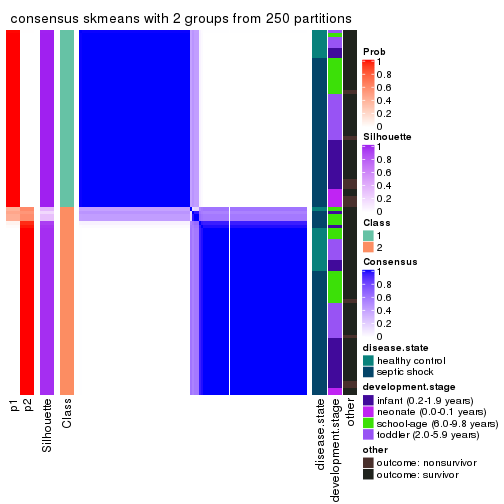</p>

</div>
<div id='tab-ATC-skmeans-consensus-heatmap-2'>
<pre><code class="r">consensus_heatmap(res, k = 3)
</code></pre>

<p>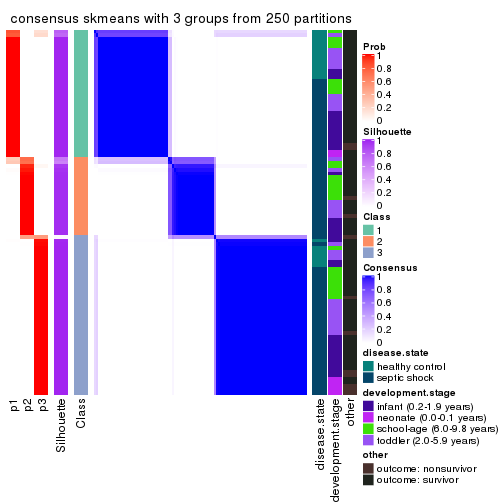</p>

</div>
<div id='tab-ATC-skmeans-consensus-heatmap-3'>
<pre><code class="r">consensus_heatmap(res, k = 4)
</code></pre>

<p>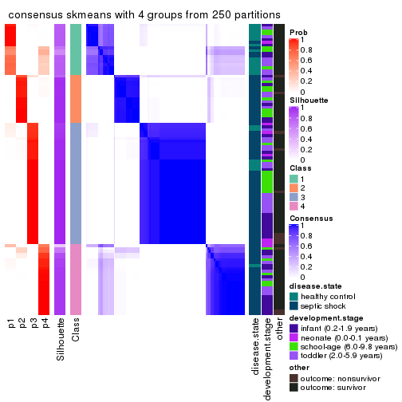</p>

</div>
<div id='tab-ATC-skmeans-consensus-heatmap-4'>
<pre><code class="r">consensus_heatmap(res, k = 5)
</code></pre>

<p>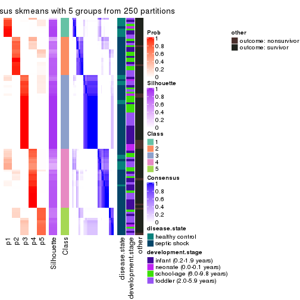</p>

</div>
<div id='tab-ATC-skmeans-consensus-heatmap-5'>
<pre><code class="r">consensus_heatmap(res, k = 6)
</code></pre>

<p>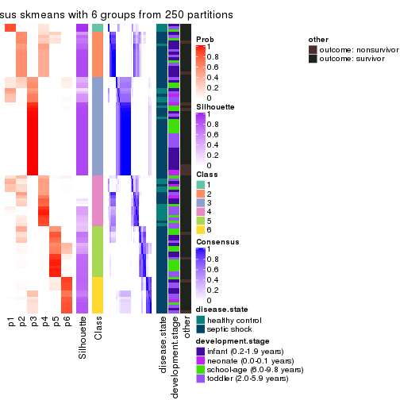</p>

</div>
</div>

Heatmaps for the membership of samples in all partitions to see how consistent they are:


<script>
$( function() {
	$( '#tabs-ATC-skmeans-membership-heatmap' ).tabs();
} );
</script>
<div id='tabs-ATC-skmeans-membership-heatmap'>
<ul>
<li><a href='#tab-ATC-skmeans-membership-heatmap-1'>k = 2</a></li>
<li><a href='#tab-ATC-skmeans-membership-heatmap-2'>k = 3</a></li>
<li><a href='#tab-ATC-skmeans-membership-heatmap-3'>k = 4</a></li>
<li><a href='#tab-ATC-skmeans-membership-heatmap-4'>k = 5</a></li>
<li><a href='#tab-ATC-skmeans-membership-heatmap-5'>k = 6</a></li>
</ul>
<div id='tab-ATC-skmeans-membership-heatmap-1'>
<pre><code class="r">membership_heatmap(res, k = 2)
</code></pre>

<p>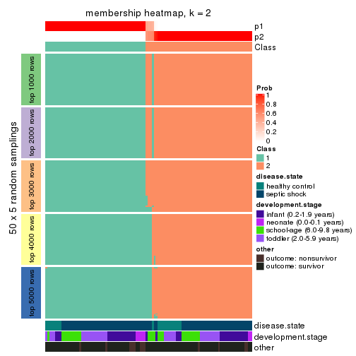</p>

</div>
<div id='tab-ATC-skmeans-membership-heatmap-2'>
<pre><code class="r">membership_heatmap(res, k = 3)
</code></pre>

<p>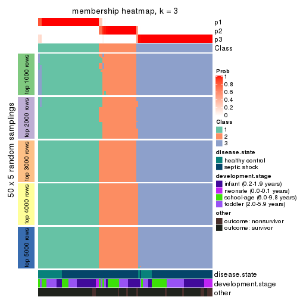</p>

</div>
<div id='tab-ATC-skmeans-membership-heatmap-3'>
<pre><code class="r">membership_heatmap(res, k = 4)
</code></pre>

<p>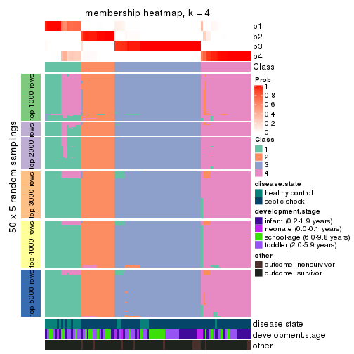</p>

</div>
<div id='tab-ATC-skmeans-membership-heatmap-4'>
<pre><code class="r">membership_heatmap(res, k = 5)
</code></pre>

<p>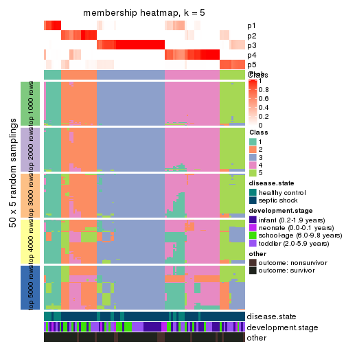</p>

</div>
<div id='tab-ATC-skmeans-membership-heatmap-5'>
<pre><code class="r">membership_heatmap(res, k = 6)
</code></pre>

<p>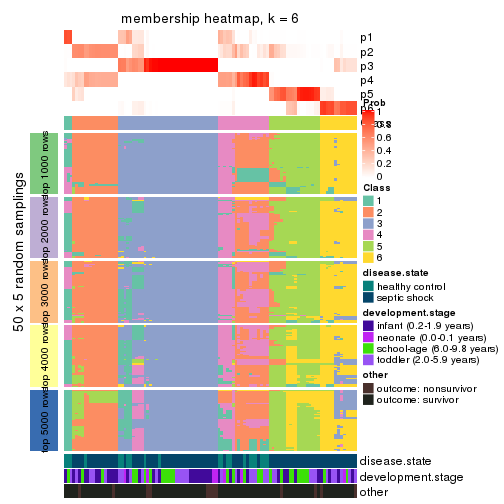</p>

</div>
</div>

As soon as we have had the classes for columns, we can look for signatures
which are significantly different between classes which can be candidate marks
for certain classes. Following are the heatmaps for signatures.


Signature heatmaps where rows are scaled:


<script>
$( function() {
	$( '#tabs-ATC-skmeans-get-signatures' ).tabs();
} );
</script>
<div id='tabs-ATC-skmeans-get-signatures'>
<ul>
<li><a href='#tab-ATC-skmeans-get-signatures-1'>k = 2</a></li>
<li><a href='#tab-ATC-skmeans-get-signatures-2'>k = 3</a></li>
<li><a href='#tab-ATC-skmeans-get-signatures-3'>k = 4</a></li>
<li><a href='#tab-ATC-skmeans-get-signatures-4'>k = 5</a></li>
<li><a href='#tab-ATC-skmeans-get-signatures-5'>k = 6</a></li>
</ul>
<div id='tab-ATC-skmeans-get-signatures-1'>
<pre><code class="r">get_signatures(res, k = 2)
</code></pre>

<p>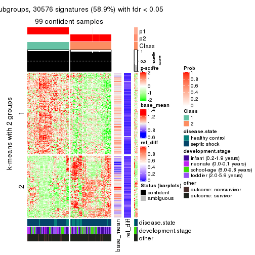</p>

</div>
<div id='tab-ATC-skmeans-get-signatures-2'>
<pre><code class="r">get_signatures(res, k = 3)
</code></pre>

<p>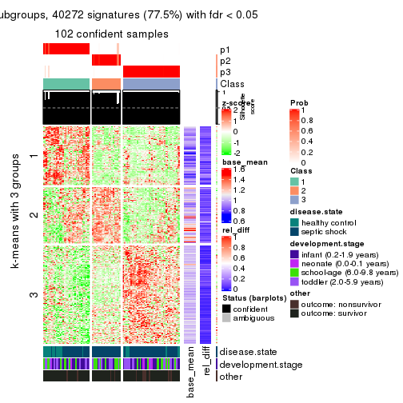</p>

</div>
<div id='tab-ATC-skmeans-get-signatures-3'>
<pre><code class="r">get_signatures(res, k = 4)
</code></pre>

<p>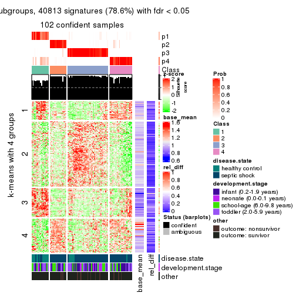</p>

</div>
<div id='tab-ATC-skmeans-get-signatures-4'>
<pre><code class="r">get_signatures(res, k = 5)
</code></pre>

<p>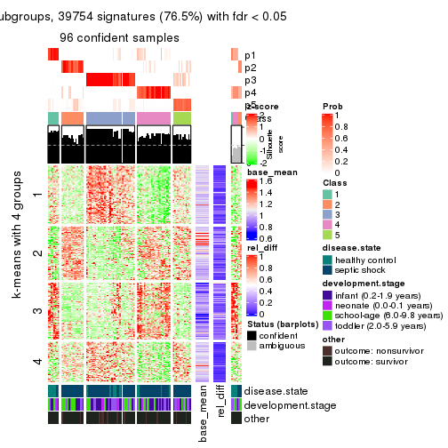</p>

</div>
<div id='tab-ATC-skmeans-get-signatures-5'>
<pre><code class="r">get_signatures(res, k = 6)
</code></pre>

<p>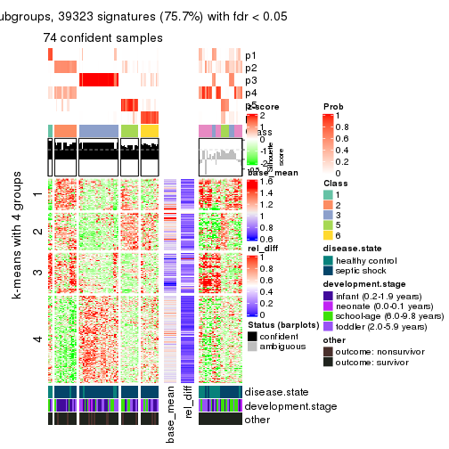</p>

</div>
</div>


Signature heatmaps where rows are not scaled:


<script>
$( function() {
	$( '#tabs-ATC-skmeans-get-signatures-no-scale' ).tabs();
} );
</script>
<div id='tabs-ATC-skmeans-get-signatures-no-scale'>
<ul>
<li><a href='#tab-ATC-skmeans-get-signatures-no-scale-1'>k = 2</a></li>
<li><a href='#tab-ATC-skmeans-get-signatures-no-scale-2'>k = 3</a></li>
<li><a href='#tab-ATC-skmeans-get-signatures-no-scale-3'>k = 4</a></li>
<li><a href='#tab-ATC-skmeans-get-signatures-no-scale-4'>k = 5</a></li>
<li><a href='#tab-ATC-skmeans-get-signatures-no-scale-5'>k = 6</a></li>
</ul>
<div id='tab-ATC-skmeans-get-signatures-no-scale-1'>
<pre><code class="r">get_signatures(res, k = 2, scale_rows = FALSE)
</code></pre>

<p>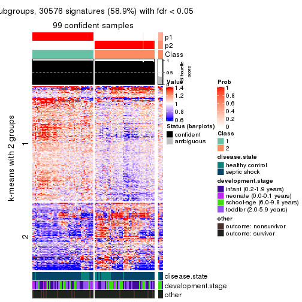</p>

</div>
<div id='tab-ATC-skmeans-get-signatures-no-scale-2'>
<pre><code class="r">get_signatures(res, k = 3, scale_rows = FALSE)
</code></pre>

<p>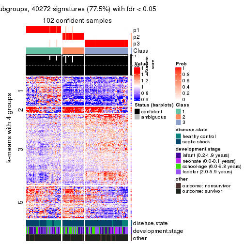</p>

</div>
<div id='tab-ATC-skmeans-get-signatures-no-scale-3'>
<pre><code class="r">get_signatures(res, k = 4, scale_rows = FALSE)
</code></pre>

<pre><code>#&gt; Error in mat[ceiling(1:nr/h_ratio), ceiling(1:nc/w_ratio), drop = FALSE]: subscript out of bounds
</code></pre>

<p>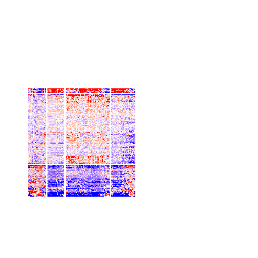</p>

</div>
<div id='tab-ATC-skmeans-get-signatures-no-scale-4'>
<pre><code class="r">get_signatures(res, k = 5, scale_rows = FALSE)
</code></pre>

<p>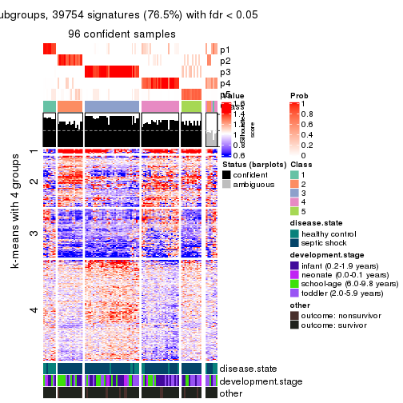</p>

</div>
<div id='tab-ATC-skmeans-get-signatures-no-scale-5'>
<pre><code class="r">get_signatures(res, k = 6, scale_rows = FALSE)
</code></pre>

<p>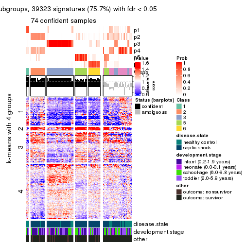</p>

</div>
</div>


Compare the overlap of signatures from different k:

```r
compare_signatures(res)
```

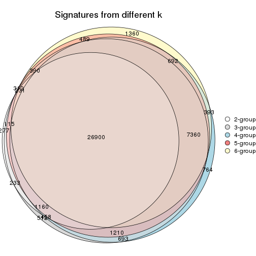

`get_signature()` returns a data frame invisibly. TO get the list of signatures, the function
call should be assigned to a variable explicitly. In following code, if `plot` argument is set
to `FALSE`, no heatmap is plotted while only the differential analysis is performed.

```r
# code only for demonstration
tb = get_signature(res, k = ..., plot = FALSE)
```

An example of the output of `tb` is:

```
#>   which_row         fdr    mean_1    mean_2 scaled_mean_1 scaled_mean_2 km
#> 1        38 0.042760348  8.373488  9.131774    -0.5533452     0.5164555  1
#> 2        40 0.018707592  7.106213  8.469186    -0.6173731     0.5762149  1
#> 3        55 0.019134737 10.221463 11.207825    -0.6159697     0.5749050  1
#> 4        59 0.006059896  5.921854  7.869574    -0.6899429     0.6439467  1
#> 5        60 0.018055526  8.928898 10.211722    -0.6204761     0.5791110  1
#> 6        98 0.009384629 15.714769 14.887706     0.6635654    -0.6193277  2
...
```

The columns in `tb` are:

1. `which_row`: row indices corresponding to the input matrix.
2. `fdr`: FDR for the differential test. 
3. `mean_x`: The mean value in group x.
4. `scaled_mean_x`: The mean value in group x after rows are scaled.
5. `km`: Row groups if k-means clustering is applied to rows.


UMAP plot which shows how samples are separated.


<script>
$( function() {
	$( '#tabs-ATC-skmeans-dimension-reduction' ).tabs();
} );
</script>
<div id='tabs-ATC-skmeans-dimension-reduction'>
<ul>
<li><a href='#tab-ATC-skmeans-dimension-reduction-1'>k = 2</a></li>
<li><a href='#tab-ATC-skmeans-dimension-reduction-2'>k = 3</a></li>
<li><a href='#tab-ATC-skmeans-dimension-reduction-3'>k = 4</a></li>
<li><a href='#tab-ATC-skmeans-dimension-reduction-4'>k = 5</a></li>
<li><a href='#tab-ATC-skmeans-dimension-reduction-5'>k = 6</a></li>
</ul>
<div id='tab-ATC-skmeans-dimension-reduction-1'>
<pre><code class="r">dimension_reduction(res, k = 2, method = &quot;UMAP&quot;)
</code></pre>

<p>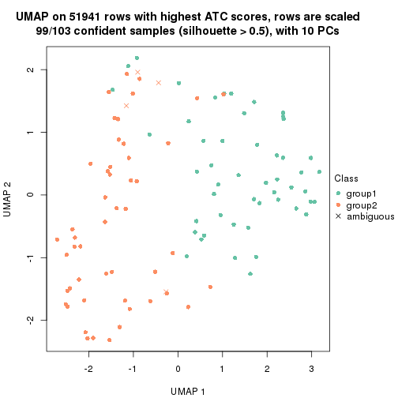</p>

</div>
<div id='tab-ATC-skmeans-dimension-reduction-2'>
<pre><code class="r">dimension_reduction(res, k = 3, method = &quot;UMAP&quot;)
</code></pre>

<p>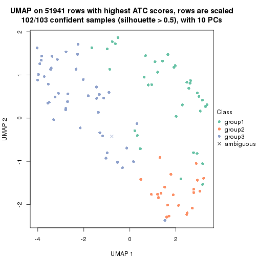</p>

</div>
<div id='tab-ATC-skmeans-dimension-reduction-3'>
<pre><code class="r">dimension_reduction(res, k = 4, method = &quot;UMAP&quot;)
</code></pre>

<p>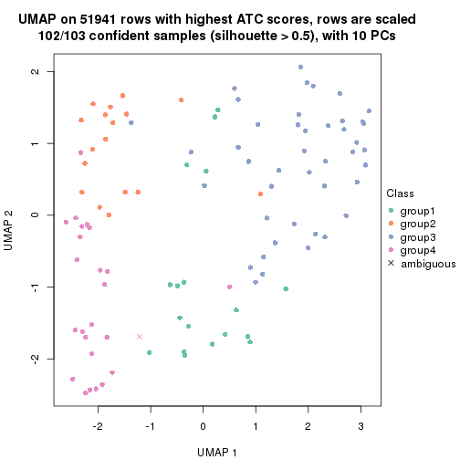</p>

</div>
<div id='tab-ATC-skmeans-dimension-reduction-4'>
<pre><code class="r">dimension_reduction(res, k = 5, method = &quot;UMAP&quot;)
</code></pre>

<p>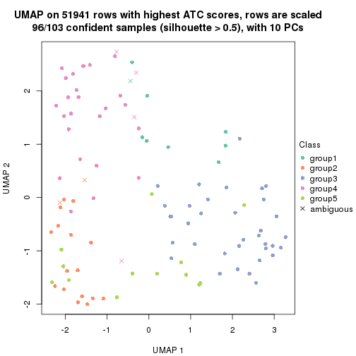</p>

</div>
<div id='tab-ATC-skmeans-dimension-reduction-5'>
<pre><code class="r">dimension_reduction(res, k = 6, method = &quot;UMAP&quot;)
</code></pre>

<p>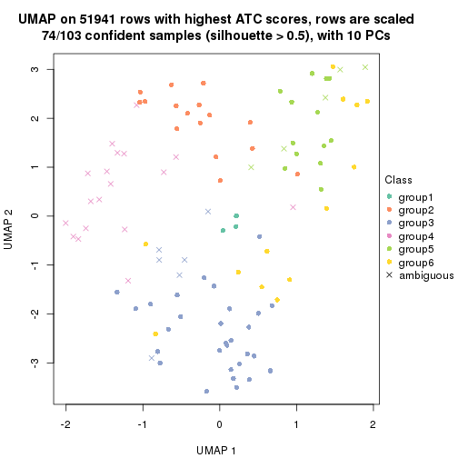</p>

</div>
</div>


Following heatmap shows how subgroups are split when increasing `k`:

```r
collect_classes(res)
```

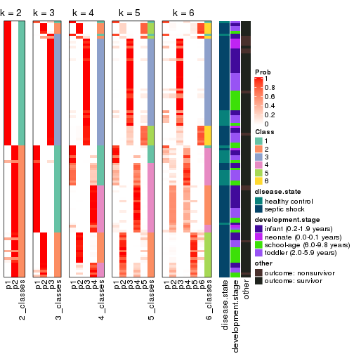


Test correlation between subgroups and known annotations. If the known
annotation is numeric, one-way ANOVA test is applied, and if the known
annotation is discrete, chi-squared contingency table test is applied.

```r
test_to_known_factors(res)
```

```
#>               n disease.state(p) development.stage(p) other(p) k
#> ATC:skmeans  99         4.23e-01                0.682    0.375 2
#> ATC:skmeans 102         1.08e-03                0.462    0.318 3
#> ATC:skmeans 102         7.13e-10                0.432    0.354 4
#> ATC:skmeans  96         1.19e-06                0.818    0.678 5
#> ATC:skmeans  74         9.81e-06                0.525    0.881 6
```


If matrix rows can be associated to genes, consider to use `functional_enrichment(res,
...)` to perform function enrichment for the signature genes. See [this vignette](http://bioconductor.org/packages/devel/bioc/vignettes/cola/inst/doc/functional_enrichment.html) for more detailed explanations.


 

---------------------------------------------------


### ATC:pam**


The object with results only for a single top-value method and a single partition method 
can be extracted as:

```r
res = res_list["ATC", "pam"]
# you can also extract it by
# res = res_list["ATC:pam"]
```

A summary of `res` and all the functions that can be applied to it:

```r
res
```

```
#> A 'ConsensusPartition' object with k = 2, 3, 4, 5, 6.
#>   On a matrix with 51941 rows and 103 columns.
#>   Top rows (1000, 2000, 3000, 4000, 5000) are extracted by 'ATC' method.
#>   Subgroups are detected by 'pam' method.
#>   Performed in total 1250 partitions by row resampling.
#>   Best k for subgroups seems to be 3.
#> 
#> Following methods can be applied to this 'ConsensusPartition' object:
#>  [1] "cola_report"             "collect_classes"         "collect_plots"          
#>  [4] "collect_stats"           "colnames"                "compare_signatures"     
#>  [7] "consensus_heatmap"       "dimension_reduction"     "functional_enrichment"  
#> [10] "get_anno_col"            "get_anno"                "get_classes"            
#> [13] "get_consensus"           "get_matrix"              "get_membership"         
#> [16] "get_param"               "get_signatures"          "get_stats"              
#> [19] "is_best_k"               "is_stable_k"             "membership_heatmap"     
#> [22] "ncol"                    "nrow"                    "plot_ecdf"              
#> [25] "rownames"                "select_partition_number" "show"                   
#> [28] "suggest_best_k"          "test_to_known_factors"
```

`collect_plots()` function collects all the plots made from `res` for all `k` (number of partitions)
into one single page to provide an easy and fast comparison between different `k`.

```r
collect_plots(res)
```

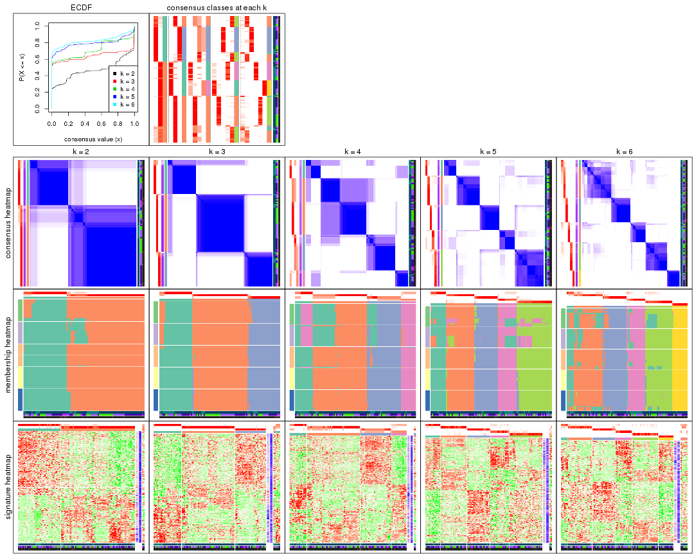

The plots are:

- The first row: a plot of the ECDF (empirical cumulative distribution
  function) curves of the consensus matrix for each `k` and the heatmap of
  predicted classes for each `k`.
- The second row: heatmaps of the consensus matrix for each `k`.
- The third row: heatmaps of the membership matrix for each `k`.
- The fouth row: heatmaps of the signatures for each `k`.

All the plots in panels can be made by individual functions and they are
plotted later in this section.

`select_partition_number()` produces several plots showing different
statistics for choosing "optimized" `k`. There are following statistics:

- ECDF curves of the consensus matrix for each `k`;
- 1-PAC. [The PAC
  score](https://en.wikipedia.org/wiki/Consensus_clustering#Over-interpretation_potential_of_consensus_clustering)
  measures the proportion of the ambiguous subgrouping.
- Mean silhouette score.
- Concordance. The mean probability of fiting the consensus class ids in all
  partitions.
- Area increased. Denote $A_k$ as the area under the ECDF curve for current
  `k`, the area increased is defined as $A_k - A_{k-1}$.
- Rand index. The percent of pairs of samples that are both in a same cluster
  or both are not in a same cluster in the partition of k and k-1.
- Jaccard index. The ratio of pairs of samples are both in a same cluster in
  the partition of k and k-1 and the pairs of samples are both in a same
  cluster in the partition k or k-1.

The detailed explanations of these statistics can be found in [the _cola_
vignette](http://bioconductor.org/packages/devel/bioc/vignettes/cola/inst/doc/cola.html#toc_13).

Generally speaking, lower PAC score, higher mean silhouette score or higher
concordance corresponds to better partition. Rand index and Jaccard index
measure how similar the current partition is compared to partition with `k-1`.
If they are too similar, we won't accept `k` is better than `k-1`.

```r
select_partition_number(res)
```

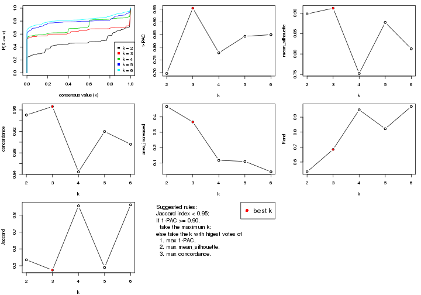

The numeric values for all these statistics can be obtained by `get_stats()`.

```r
get_stats(res)
```

```
#>   k 1-PAC mean_silhouette concordance area_increased  Rand Jaccard
#> 2 2 0.697           0.898       0.951         0.4677 0.535   0.535
#> 3 3 0.954           0.912       0.966         0.3670 0.684   0.474
#> 4 4 0.778           0.752       0.845         0.1172 0.949   0.856
#> 5 5 0.843           0.877       0.920         0.1103 0.822   0.490
#> 6 6 0.849           0.813       0.896         0.0425 0.971   0.861
```

`suggest_best_k()` suggests the best $k$ based on these statistics. The rules are as follows:

- All $k$ with Jaccard index larger than 0.95 are removed because increasing
  $k$ does not provide enough extra information. If all $k$ are removed, it is
  marked as no subgroup is detected.
- For all $k$ with 1-PAC score larger than 0.9, the maximal $k$ is taken as
  the best $k$, and other $k$ are marked as optional $k$.
- If it does not fit the second rule. The $k$ with the maximal vote of the
  highest 1-PAC score, highest mean silhouette, and highest concordance is
  taken as the best $k$.

```r
suggest_best_k(res)
```

```
#> [1] 3
```


Following shows the table of the partitions (You need to click the **show/hide
code output** link to see it). The membership matrix (columns with name `p*`)
is inferred by
[`clue::cl_consensus()`](https://www.rdocumentation.org/link/cl_consensus?package=clue)
function with the `SE` method. Basically the value in the membership matrix
represents the probability to belong to a certain group. The finall class
label for an item is determined with the group with highest probability it
belongs to.

In `get_classes()` function, the entropy is calculated from the membership
matrix and the silhouette score is calculated from the consensus matrix.


<script>
$( function() {
	$( '#tabs-ATC-pam-get-classes' ).tabs();
} );
</script>
<div id='tabs-ATC-pam-get-classes'>
<ul>
<li><a href='#tab-ATC-pam-get-classes-1'>k = 2</a></li>
<li><a href='#tab-ATC-pam-get-classes-2'>k = 3</a></li>
<li><a href='#tab-ATC-pam-get-classes-3'>k = 4</a></li>
<li><a href='#tab-ATC-pam-get-classes-4'>k = 5</a></li>
<li><a href='#tab-ATC-pam-get-classes-5'>k = 6</a></li>
</ul>

<div id='tab-ATC-pam-get-classes-1'>
<p><a id='tab-ATC-pam-get-classes-1-a' style='color:#0366d6' href='#'>show/hide code output</a></p>
<pre><code class="r">cbind(get_classes(res, k = 2), get_membership(res, k = 2))
</code></pre>

<pre><code>#&gt;           class entropy silhouette    p1    p2
#&gt; GSM647569     1   0.000      0.957 1.000 0.000
#&gt; GSM647574     1   0.000      0.957 1.000 0.000
#&gt; GSM647577     1   0.000      0.957 1.000 0.000
#&gt; GSM647547     2   0.443      0.876 0.092 0.908
#&gt; GSM647552     1   0.000      0.957 1.000 0.000
#&gt; GSM647553     2   0.978      0.370 0.412 0.588
#&gt; GSM647565     2   0.000      0.938 0.000 1.000
#&gt; GSM647545     2   0.000      0.938 0.000 1.000
#&gt; GSM647549     2   0.000      0.938 0.000 1.000
#&gt; GSM647550     2   0.781      0.738 0.232 0.768
#&gt; GSM647560     1   0.000      0.957 1.000 0.000
#&gt; GSM647617     1   0.000      0.957 1.000 0.000
#&gt; GSM647528     2   0.000      0.938 0.000 1.000
#&gt; GSM647529     2   0.000      0.938 0.000 1.000
#&gt; GSM647531     2   0.000      0.938 0.000 1.000
#&gt; GSM647540     1   0.000      0.957 1.000 0.000
#&gt; GSM647541     1   0.662      0.805 0.828 0.172
#&gt; GSM647546     1   0.000      0.957 1.000 0.000
#&gt; GSM647557     2   0.000      0.938 0.000 1.000
#&gt; GSM647561     2   0.000      0.938 0.000 1.000
#&gt; GSM647567     2   0.000      0.938 0.000 1.000
#&gt; GSM647568     2   0.781      0.738 0.232 0.768
#&gt; GSM647570     2   0.000      0.938 0.000 1.000
#&gt; GSM647573     2   0.000      0.938 0.000 1.000
#&gt; GSM647576     1   0.000      0.957 1.000 0.000
#&gt; GSM647579     1   0.000      0.957 1.000 0.000
#&gt; GSM647580     1   0.000      0.957 1.000 0.000
#&gt; GSM647583     1   0.000      0.957 1.000 0.000
#&gt; GSM647592     2   0.605      0.827 0.148 0.852
#&gt; GSM647593     2   0.000      0.938 0.000 1.000
#&gt; GSM647595     2   0.000      0.938 0.000 1.000
#&gt; GSM647597     2   0.000      0.938 0.000 1.000
#&gt; GSM647598     2   0.000      0.938 0.000 1.000
#&gt; GSM647613     2   0.000      0.938 0.000 1.000
#&gt; GSM647615     1   0.814      0.671 0.748 0.252
#&gt; GSM647616     1   0.000      0.957 1.000 0.000
#&gt; GSM647619     2   0.000      0.938 0.000 1.000
#&gt; GSM647582     1   0.662      0.805 0.828 0.172
#&gt; GSM647591     2   0.000      0.938 0.000 1.000
#&gt; GSM647527     2   0.000      0.938 0.000 1.000
#&gt; GSM647530     2   0.000      0.938 0.000 1.000
#&gt; GSM647532     2   0.000      0.938 0.000 1.000
#&gt; GSM647544     2   0.000      0.938 0.000 1.000
#&gt; GSM647551     2   0.871      0.617 0.292 0.708
#&gt; GSM647556     1   0.000      0.957 1.000 0.000
#&gt; GSM647558     2   0.000      0.938 0.000 1.000
#&gt; GSM647572     1   0.242      0.931 0.960 0.040
#&gt; GSM647578     1   0.000      0.957 1.000 0.000
#&gt; GSM647581     2   0.000      0.938 0.000 1.000
#&gt; GSM647594     2   0.000      0.938 0.000 1.000
#&gt; GSM647599     1   0.000      0.957 1.000 0.000
#&gt; GSM647600     1   0.000      0.957 1.000 0.000
#&gt; GSM647601     2   0.000      0.938 0.000 1.000
#&gt; GSM647603     1   0.000      0.957 1.000 0.000
#&gt; GSM647610     1   0.662      0.805 0.828 0.172
#&gt; GSM647611     2   0.574      0.838 0.136 0.864
#&gt; GSM647612     2   0.781      0.738 0.232 0.768
#&gt; GSM647614     2   0.781      0.738 0.232 0.768
#&gt; GSM647618     2   0.000      0.938 0.000 1.000
#&gt; GSM647629     1   0.662      0.805 0.828 0.172
#&gt; GSM647535     1   0.000      0.957 1.000 0.000
#&gt; GSM647563     2   0.000      0.938 0.000 1.000
#&gt; GSM647542     2   0.781      0.738 0.232 0.768
#&gt; GSM647543     2   0.781      0.738 0.232 0.768
#&gt; GSM647548     2   0.000      0.938 0.000 1.000
#&gt; GSM647554     1   0.662      0.805 0.828 0.172
#&gt; GSM647555     1   0.118      0.947 0.984 0.016
#&gt; GSM647559     2   0.000      0.938 0.000 1.000
#&gt; GSM647562     2   0.000      0.938 0.000 1.000
#&gt; GSM647564     1   0.000      0.957 1.000 0.000
#&gt; GSM647571     1   0.000      0.957 1.000 0.000
#&gt; GSM647584     2   0.000      0.938 0.000 1.000
#&gt; GSM647585     1   0.000      0.957 1.000 0.000
#&gt; GSM647586     2   0.000      0.938 0.000 1.000
#&gt; GSM647587     2   0.000      0.938 0.000 1.000
#&gt; GSM647588     2   0.000      0.938 0.000 1.000
#&gt; GSM647596     2   0.000      0.938 0.000 1.000
#&gt; GSM647602     1   0.000      0.957 1.000 0.000
#&gt; GSM647609     2   0.000      0.938 0.000 1.000
#&gt; GSM647620     2   0.781      0.738 0.232 0.768
#&gt; GSM647627     2   0.000      0.938 0.000 1.000
#&gt; GSM647628     2   0.000      0.938 0.000 1.000
#&gt; GSM647533     2   0.973      0.392 0.404 0.596
#&gt; GSM647536     2   0.000      0.938 0.000 1.000
#&gt; GSM647537     1   0.000      0.957 1.000 0.000
#&gt; GSM647606     2   0.295      0.905 0.052 0.948
#&gt; GSM647621     2   0.456      0.873 0.096 0.904
#&gt; GSM647626     1   0.000      0.957 1.000 0.000
#&gt; GSM647538     2   0.753      0.757 0.216 0.784
#&gt; GSM647575     2   0.000      0.938 0.000 1.000
#&gt; GSM647590     2   0.000      0.938 0.000 1.000
#&gt; GSM647605     2   0.000      0.938 0.000 1.000
#&gt; GSM647607     2   0.000      0.938 0.000 1.000
#&gt; GSM647608     2   0.000      0.938 0.000 1.000
#&gt; GSM647622     1   0.000      0.957 1.000 0.000
#&gt; GSM647623     1   0.224      0.934 0.964 0.036
#&gt; GSM647624     2   0.000      0.938 0.000 1.000
#&gt; GSM647625     1   0.653      0.810 0.832 0.168
#&gt; GSM647534     1   0.000      0.957 1.000 0.000
#&gt; GSM647539     2   0.000      0.938 0.000 1.000
#&gt; GSM647566     2   0.358      0.894 0.068 0.932
#&gt; GSM647589     2   0.680      0.797 0.180 0.820
#&gt; GSM647604     2   0.000      0.938 0.000 1.000
</code></pre>

<script>
$('#tab-ATC-pam-get-classes-1-a').parent().next().next().hide();
$('#tab-ATC-pam-get-classes-1-a').click(function(){
  $('#tab-ATC-pam-get-classes-1-a').parent().next().next().toggle();
  return(false);
});
</script>
</div>

<div id='tab-ATC-pam-get-classes-2'>
<p><a id='tab-ATC-pam-get-classes-2-a' style='color:#0366d6' href='#'>show/hide code output</a></p>
<pre><code class="r">cbind(get_classes(res, k = 3), get_membership(res, k = 3))
</code></pre>

<pre><code>#&gt;           class entropy silhouette    p1    p2    p3
#&gt; GSM647569     3  0.0000    0.95377 0.000 0.000 1.000
#&gt; GSM647574     3  0.0000    0.95377 0.000 0.000 1.000
#&gt; GSM647577     3  0.0000    0.95377 0.000 0.000 1.000
#&gt; GSM647547     1  0.6204    0.34286 0.576 0.424 0.000
#&gt; GSM647552     3  0.4555    0.73653 0.000 0.200 0.800
#&gt; GSM647553     2  0.0000    0.98622 0.000 1.000 0.000
#&gt; GSM647565     1  0.0000    0.91595 1.000 0.000 0.000
#&gt; GSM647545     2  0.0237    0.98294 0.004 0.996 0.000
#&gt; GSM647549     1  0.0000    0.91595 1.000 0.000 0.000
#&gt; GSM647550     2  0.0000    0.98622 0.000 1.000 0.000
#&gt; GSM647560     3  0.0000    0.95377 0.000 0.000 1.000
#&gt; GSM647617     3  0.0000    0.95377 0.000 0.000 1.000
#&gt; GSM647528     2  0.0000    0.98622 0.000 1.000 0.000
#&gt; GSM647529     1  0.0000    0.91595 1.000 0.000 0.000
#&gt; GSM647531     1  0.0000    0.91595 1.000 0.000 0.000
#&gt; GSM647540     3  0.0000    0.95377 0.000 0.000 1.000
#&gt; GSM647541     2  0.0000    0.98622 0.000 1.000 0.000
#&gt; GSM647546     3  0.0747    0.93986 0.000 0.016 0.984
#&gt; GSM647557     1  0.0000    0.91595 1.000 0.000 0.000
#&gt; GSM647561     1  0.0000    0.91595 1.000 0.000 0.000
#&gt; GSM647567     2  0.1643    0.94272 0.044 0.956 0.000
#&gt; GSM647568     2  0.0000    0.98622 0.000 1.000 0.000
#&gt; GSM647570     2  0.0424    0.97932 0.008 0.992 0.000
#&gt; GSM647573     1  0.0000    0.91595 1.000 0.000 0.000
#&gt; GSM647576     3  0.2796    0.86353 0.000 0.092 0.908
#&gt; GSM647579     3  0.0000    0.95377 0.000 0.000 1.000
#&gt; GSM647580     3  0.0000    0.95377 0.000 0.000 1.000
#&gt; GSM647583     3  0.0000    0.95377 0.000 0.000 1.000
#&gt; GSM647592     2  0.0000    0.98622 0.000 1.000 0.000
#&gt; GSM647593     2  0.0000    0.98622 0.000 1.000 0.000
#&gt; GSM647595     2  0.0000    0.98622 0.000 1.000 0.000
#&gt; GSM647597     1  0.0000    0.91595 1.000 0.000 0.000
#&gt; GSM647598     2  0.0000    0.98622 0.000 1.000 0.000
#&gt; GSM647613     1  0.0000    0.91595 1.000 0.000 0.000
#&gt; GSM647615     2  0.0000    0.98622 0.000 1.000 0.000
#&gt; GSM647616     3  0.0000    0.95377 0.000 0.000 1.000
#&gt; GSM647619     2  0.0000    0.98622 0.000 1.000 0.000
#&gt; GSM647582     2  0.1753    0.93862 0.000 0.952 0.048
#&gt; GSM647591     2  0.0000    0.98622 0.000 1.000 0.000
#&gt; GSM647527     2  0.0000    0.98622 0.000 1.000 0.000
#&gt; GSM647530     1  0.0000    0.91595 1.000 0.000 0.000
#&gt; GSM647532     1  0.0000    0.91595 1.000 0.000 0.000
#&gt; GSM647544     2  0.1753    0.93746 0.048 0.952 0.000
#&gt; GSM647551     2  0.0000    0.98622 0.000 1.000 0.000
#&gt; GSM647556     3  0.0000    0.95377 0.000 0.000 1.000
#&gt; GSM647558     2  0.0000    0.98622 0.000 1.000 0.000
#&gt; GSM647572     2  0.0000    0.98622 0.000 1.000 0.000
#&gt; GSM647578     3  0.0000    0.95377 0.000 0.000 1.000
#&gt; GSM647581     1  0.0000    0.91595 1.000 0.000 0.000
#&gt; GSM647594     1  0.0000    0.91595 1.000 0.000 0.000
#&gt; GSM647599     3  0.0000    0.95377 0.000 0.000 1.000
#&gt; GSM647600     3  0.0000    0.95377 0.000 0.000 1.000
#&gt; GSM647601     2  0.0000    0.98622 0.000 1.000 0.000
#&gt; GSM647603     3  0.0000    0.95377 0.000 0.000 1.000
#&gt; GSM647610     2  0.0000    0.98622 0.000 1.000 0.000
#&gt; GSM647611     2  0.0000    0.98622 0.000 1.000 0.000
#&gt; GSM647612     2  0.0000    0.98622 0.000 1.000 0.000
#&gt; GSM647614     2  0.0000    0.98622 0.000 1.000 0.000
#&gt; GSM647618     2  0.0000    0.98622 0.000 1.000 0.000
#&gt; GSM647629     2  0.0000    0.98622 0.000 1.000 0.000
#&gt; GSM647535     3  0.4702    0.72851 0.000 0.212 0.788
#&gt; GSM647563     2  0.0000    0.98622 0.000 1.000 0.000
#&gt; GSM647542     2  0.0000    0.98622 0.000 1.000 0.000
#&gt; GSM647543     2  0.0000    0.98622 0.000 1.000 0.000
#&gt; GSM647548     1  0.0000    0.91595 1.000 0.000 0.000
#&gt; GSM647554     2  0.0000    0.98622 0.000 1.000 0.000
#&gt; GSM647555     2  0.0000    0.98622 0.000 1.000 0.000
#&gt; GSM647559     2  0.0000    0.98622 0.000 1.000 0.000
#&gt; GSM647562     1  0.0000    0.91595 1.000 0.000 0.000
#&gt; GSM647564     3  0.0000    0.95377 0.000 0.000 1.000
#&gt; GSM647571     3  0.0000    0.95377 0.000 0.000 1.000
#&gt; GSM647584     2  0.0000    0.98622 0.000 1.000 0.000
#&gt; GSM647585     3  0.0000    0.95377 0.000 0.000 1.000
#&gt; GSM647586     2  0.0000    0.98622 0.000 1.000 0.000
#&gt; GSM647587     2  0.0424    0.97932 0.008 0.992 0.000
#&gt; GSM647588     2  0.0000    0.98622 0.000 1.000 0.000
#&gt; GSM647596     2  0.0000    0.98622 0.000 1.000 0.000
#&gt; GSM647602     3  0.0000    0.95377 0.000 0.000 1.000
#&gt; GSM647609     2  0.0000    0.98622 0.000 1.000 0.000
#&gt; GSM647620     2  0.0000    0.98622 0.000 1.000 0.000
#&gt; GSM647627     2  0.0000    0.98622 0.000 1.000 0.000
#&gt; GSM647628     2  0.0747    0.97208 0.016 0.984 0.000
#&gt; GSM647533     2  0.0000    0.98622 0.000 1.000 0.000
#&gt; GSM647536     1  0.0000    0.91595 1.000 0.000 0.000
#&gt; GSM647537     3  0.0000    0.95377 0.000 0.000 1.000
#&gt; GSM647606     1  0.4555    0.73157 0.800 0.200 0.000
#&gt; GSM647621     1  0.6204    0.34286 0.576 0.424 0.000
#&gt; GSM647626     3  0.0000    0.95377 0.000 0.000 1.000
#&gt; GSM647538     2  0.0000    0.98622 0.000 1.000 0.000
#&gt; GSM647575     1  0.0000    0.91595 1.000 0.000 0.000
#&gt; GSM647590     1  0.0000    0.91595 1.000 0.000 0.000
#&gt; GSM647605     1  0.0000    0.91595 1.000 0.000 0.000
#&gt; GSM647607     1  0.0000    0.91595 1.000 0.000 0.000
#&gt; GSM647608     1  0.6079    0.42649 0.612 0.388 0.000
#&gt; GSM647622     3  0.0000    0.95377 0.000 0.000 1.000
#&gt; GSM647623     3  0.6309    0.00371 0.000 0.500 0.500
#&gt; GSM647624     1  0.0000    0.91595 1.000 0.000 0.000
#&gt; GSM647625     2  0.6126    0.29642 0.000 0.600 0.400
#&gt; GSM647534     3  0.0000    0.95377 0.000 0.000 1.000
#&gt; GSM647539     1  0.0000    0.91595 1.000 0.000 0.000
#&gt; GSM647566     2  0.0000    0.98622 0.000 1.000 0.000
#&gt; GSM647589     1  0.6204    0.34286 0.576 0.424 0.000
#&gt; GSM647604     1  0.0000    0.91595 1.000 0.000 0.000
</code></pre>

<script>
$('#tab-ATC-pam-get-classes-2-a').parent().next().next().hide();
$('#tab-ATC-pam-get-classes-2-a').click(function(){
  $('#tab-ATC-pam-get-classes-2-a').parent().next().next().toggle();
  return(false);
});
</script>
</div>

<div id='tab-ATC-pam-get-classes-3'>
<p><a id='tab-ATC-pam-get-classes-3-a' style='color:#0366d6' href='#'>show/hide code output</a></p>
<pre><code class="r">cbind(get_classes(res, k = 4), get_membership(res, k = 4))
</code></pre>

<pre><code>#&gt;           class entropy silhouette    p1    p2    p3    p4
#&gt; GSM647569     3  0.4866      0.854 0.000 0.000 0.596 0.404
#&gt; GSM647574     3  0.4866      0.854 0.000 0.000 0.596 0.404
#&gt; GSM647577     3  0.4866      0.854 0.000 0.000 0.596 0.404
#&gt; GSM647547     1  0.5150      0.550 0.596 0.008 0.396 0.000
#&gt; GSM647552     3  0.3528      0.717 0.000 0.000 0.808 0.192
#&gt; GSM647553     2  0.4866      0.692 0.000 0.596 0.404 0.000
#&gt; GSM647565     1  0.0000      0.679 1.000 0.000 0.000 0.000
#&gt; GSM647545     2  0.0188      0.794 0.004 0.996 0.000 0.000
#&gt; GSM647549     4  0.5600      0.903 0.376 0.028 0.000 0.596
#&gt; GSM647550     2  0.4866      0.692 0.000 0.596 0.404 0.000
#&gt; GSM647560     3  0.4855      0.852 0.000 0.000 0.600 0.400
#&gt; GSM647617     3  0.4866      0.854 0.000 0.000 0.596 0.404
#&gt; GSM647528     2  0.0000      0.796 0.000 1.000 0.000 0.000
#&gt; GSM647529     4  0.4866      0.933 0.404 0.000 0.000 0.596
#&gt; GSM647531     4  0.4866      0.933 0.404 0.000 0.000 0.596
#&gt; GSM647540     3  0.4866      0.854 0.000 0.000 0.596 0.404
#&gt; GSM647541     2  0.4866      0.692 0.000 0.596 0.404 0.000
#&gt; GSM647546     3  0.0000      0.543 0.000 0.000 1.000 0.000
#&gt; GSM647557     4  0.6862      0.618 0.176 0.228 0.000 0.596
#&gt; GSM647561     4  0.6810      0.726 0.248 0.156 0.000 0.596
#&gt; GSM647567     2  0.2002      0.766 0.044 0.936 0.020 0.000
#&gt; GSM647568     2  0.4866      0.692 0.000 0.596 0.404 0.000
#&gt; GSM647570     2  0.0000      0.796 0.000 1.000 0.000 0.000
#&gt; GSM647573     1  0.0000      0.679 1.000 0.000 0.000 0.000
#&gt; GSM647576     3  0.0000      0.543 0.000 0.000 1.000 0.000
#&gt; GSM647579     3  0.4866      0.854 0.000 0.000 0.596 0.404
#&gt; GSM647580     3  0.4866      0.854 0.000 0.000 0.596 0.404
#&gt; GSM647583     3  0.4866      0.854 0.000 0.000 0.596 0.404
#&gt; GSM647592     2  0.0336      0.795 0.000 0.992 0.008 0.000
#&gt; GSM647593     2  0.0000      0.796 0.000 1.000 0.000 0.000
#&gt; GSM647595     2  0.0000      0.796 0.000 1.000 0.000 0.000
#&gt; GSM647597     4  0.4866      0.933 0.404 0.000 0.000 0.596
#&gt; GSM647598     2  0.0000      0.796 0.000 1.000 0.000 0.000
#&gt; GSM647613     4  0.4866      0.933 0.404 0.000 0.000 0.596
#&gt; GSM647615     2  0.4866      0.692 0.000 0.596 0.404 0.000
#&gt; GSM647616     3  0.4866      0.854 0.000 0.000 0.596 0.404
#&gt; GSM647619     2  0.0000      0.796 0.000 1.000 0.000 0.000
#&gt; GSM647582     2  0.4967      0.639 0.000 0.548 0.452 0.000
#&gt; GSM647591     2  0.0000      0.796 0.000 1.000 0.000 0.000
#&gt; GSM647527     2  0.0000      0.796 0.000 1.000 0.000 0.000
#&gt; GSM647530     4  0.4866      0.933 0.404 0.000 0.000 0.596
#&gt; GSM647532     4  0.4866      0.933 0.404 0.000 0.000 0.596
#&gt; GSM647544     2  0.1557      0.751 0.056 0.944 0.000 0.000
#&gt; GSM647551     2  0.0336      0.795 0.000 0.992 0.008 0.000
#&gt; GSM647556     3  0.4866      0.854 0.000 0.000 0.596 0.404
#&gt; GSM647558     2  0.0000      0.796 0.000 1.000 0.000 0.000
#&gt; GSM647572     2  0.4866      0.692 0.000 0.596 0.404 0.000
#&gt; GSM647578     3  0.4855      0.852 0.000 0.000 0.600 0.400
#&gt; GSM647581     4  0.4866      0.933 0.404 0.000 0.000 0.596
#&gt; GSM647594     4  0.4866      0.933 0.404 0.000 0.000 0.596
#&gt; GSM647599     3  0.4866      0.854 0.000 0.000 0.596 0.404
#&gt; GSM647600     3  0.4866      0.854 0.000 0.000 0.596 0.404
#&gt; GSM647601     2  0.0000      0.796 0.000 1.000 0.000 0.000
#&gt; GSM647603     3  0.4866      0.854 0.000 0.000 0.596 0.404
#&gt; GSM647610     2  0.4866      0.692 0.000 0.596 0.404 0.000
#&gt; GSM647611     2  0.0336      0.795 0.000 0.992 0.008 0.000
#&gt; GSM647612     2  0.4866      0.692 0.000 0.596 0.404 0.000
#&gt; GSM647614     2  0.4866      0.692 0.000 0.596 0.404 0.000
#&gt; GSM647618     2  0.0000      0.796 0.000 1.000 0.000 0.000
#&gt; GSM647629     2  0.4866      0.692 0.000 0.596 0.404 0.000
#&gt; GSM647535     3  0.4215      0.577 0.000 0.072 0.824 0.104
#&gt; GSM647563     2  0.0000      0.796 0.000 1.000 0.000 0.000
#&gt; GSM647542     2  0.4866      0.692 0.000 0.596 0.404 0.000
#&gt; GSM647543     2  0.4866      0.692 0.000 0.596 0.404 0.000
#&gt; GSM647548     1  0.0000      0.679 1.000 0.000 0.000 0.000
#&gt; GSM647554     2  0.4866      0.692 0.000 0.596 0.404 0.000
#&gt; GSM647555     2  0.4866      0.692 0.000 0.596 0.404 0.000
#&gt; GSM647559     2  0.0000      0.796 0.000 1.000 0.000 0.000
#&gt; GSM647562     4  0.4888      0.925 0.412 0.000 0.000 0.588
#&gt; GSM647564     3  0.4866      0.854 0.000 0.000 0.596 0.404
#&gt; GSM647571     3  0.3801      0.739 0.000 0.000 0.780 0.220
#&gt; GSM647584     2  0.0000      0.796 0.000 1.000 0.000 0.000
#&gt; GSM647585     3  0.4866      0.854 0.000 0.000 0.596 0.404
#&gt; GSM647586     2  0.0000      0.796 0.000 1.000 0.000 0.000
#&gt; GSM647587     2  0.0000      0.796 0.000 1.000 0.000 0.000
#&gt; GSM647588     2  0.0000      0.796 0.000 1.000 0.000 0.000
#&gt; GSM647596     2  0.0000      0.796 0.000 1.000 0.000 0.000
#&gt; GSM647602     3  0.4866      0.854 0.000 0.000 0.596 0.404
#&gt; GSM647609     2  0.0000      0.796 0.000 1.000 0.000 0.000
#&gt; GSM647620     2  0.2814      0.766 0.000 0.868 0.132 0.000
#&gt; GSM647627     2  0.0000      0.796 0.000 1.000 0.000 0.000
#&gt; GSM647628     2  0.5376      0.678 0.016 0.588 0.396 0.000
#&gt; GSM647533     2  0.4866      0.692 0.000 0.596 0.404 0.000
#&gt; GSM647536     4  0.4866      0.933 0.404 0.000 0.000 0.596
#&gt; GSM647537     3  0.0000      0.543 0.000 0.000 1.000 0.000
#&gt; GSM647606     1  0.4991      0.555 0.608 0.004 0.388 0.000
#&gt; GSM647621     1  0.5016      0.552 0.600 0.004 0.396 0.000
#&gt; GSM647626     3  0.4866      0.854 0.000 0.000 0.596 0.404
#&gt; GSM647538     2  0.4866      0.692 0.000 0.596 0.404 0.000
#&gt; GSM647575     1  0.0000      0.679 1.000 0.000 0.000 0.000
#&gt; GSM647590     1  0.0000      0.679 1.000 0.000 0.000 0.000
#&gt; GSM647605     1  0.0000      0.679 1.000 0.000 0.000 0.000
#&gt; GSM647607     1  0.0000      0.679 1.000 0.000 0.000 0.000
#&gt; GSM647608     1  0.5016      0.552 0.600 0.004 0.396 0.000
#&gt; GSM647622     3  0.0000      0.543 0.000 0.000 1.000 0.000
#&gt; GSM647623     3  0.2408      0.408 0.000 0.104 0.896 0.000
#&gt; GSM647624     1  0.0000      0.679 1.000 0.000 0.000 0.000
#&gt; GSM647625     3  0.3569      0.211 0.000 0.196 0.804 0.000
#&gt; GSM647534     3  0.4866      0.854 0.000 0.000 0.596 0.404
#&gt; GSM647539     1  0.0000      0.679 1.000 0.000 0.000 0.000
#&gt; GSM647566     2  0.4855      0.692 0.000 0.600 0.400 0.000
#&gt; GSM647589     1  0.4855      0.550 0.600 0.000 0.400 0.000
#&gt; GSM647604     1  0.0000      0.679 1.000 0.000 0.000 0.000
</code></pre>

<script>
$('#tab-ATC-pam-get-classes-3-a').parent().next().next().hide();
$('#tab-ATC-pam-get-classes-3-a').click(function(){
  $('#tab-ATC-pam-get-classes-3-a').parent().next().next().toggle();
  return(false);
});
</script>
</div>

<div id='tab-ATC-pam-get-classes-4'>
<p><a id='tab-ATC-pam-get-classes-4-a' style='color:#0366d6' href='#'>show/hide code output</a></p>
<pre><code class="r">cbind(get_classes(res, k = 5), get_membership(res, k = 5))
</code></pre>

<pre><code>#&gt;           class entropy silhouette    p1    p2    p3    p4    p5
#&gt; GSM647569     3  0.0000      0.965 0.000 0.000 1.000 0.000 0.000
#&gt; GSM647574     3  0.0671      0.953 0.000 0.000 0.980 0.016 0.004
#&gt; GSM647577     3  0.0000      0.965 0.000 0.000 1.000 0.000 0.000
#&gt; GSM647547     4  0.0000      0.813 0.000 0.000 0.000 1.000 0.000
#&gt; GSM647552     5  0.0000      0.903 0.000 0.000 0.000 0.000 1.000
#&gt; GSM647553     5  0.2648      0.866 0.000 0.000 0.000 0.152 0.848
#&gt; GSM647565     4  0.3074      0.887 0.196 0.000 0.000 0.804 0.000
#&gt; GSM647545     2  0.0000      0.921 0.000 1.000 0.000 0.000 0.000
#&gt; GSM647549     1  0.3983      0.822 0.784 0.164 0.000 0.052 0.000
#&gt; GSM647550     5  0.1121      0.901 0.000 0.000 0.000 0.044 0.956
#&gt; GSM647560     3  0.2732      0.810 0.000 0.000 0.840 0.000 0.160
#&gt; GSM647617     3  0.0000      0.965 0.000 0.000 1.000 0.000 0.000
#&gt; GSM647528     2  0.0000      0.921 0.000 1.000 0.000 0.000 0.000
#&gt; GSM647529     1  0.0000      0.908 1.000 0.000 0.000 0.000 0.000
#&gt; GSM647531     1  0.0000      0.908 1.000 0.000 0.000 0.000 0.000
#&gt; GSM647540     3  0.0000      0.965 0.000 0.000 1.000 0.000 0.000
#&gt; GSM647541     5  0.0510      0.904 0.000 0.000 0.000 0.016 0.984
#&gt; GSM647546     5  0.2561      0.869 0.000 0.000 0.000 0.144 0.856
#&gt; GSM647557     1  0.2852      0.834 0.828 0.172 0.000 0.000 0.000
#&gt; GSM647561     1  0.2813      0.838 0.832 0.168 0.000 0.000 0.000
#&gt; GSM647567     2  0.0290      0.920 0.000 0.992 0.000 0.008 0.000
#&gt; GSM647568     5  0.2648      0.866 0.000 0.000 0.000 0.152 0.848
#&gt; GSM647570     2  0.0000      0.921 0.000 1.000 0.000 0.000 0.000
#&gt; GSM647573     4  0.3074      0.887 0.196 0.000 0.000 0.804 0.000
#&gt; GSM647576     5  0.0404      0.904 0.000 0.000 0.000 0.012 0.988
#&gt; GSM647579     3  0.0000      0.965 0.000 0.000 1.000 0.000 0.000
#&gt; GSM647580     3  0.0000      0.965 0.000 0.000 1.000 0.000 0.000
#&gt; GSM647583     3  0.0000      0.965 0.000 0.000 1.000 0.000 0.000
#&gt; GSM647592     5  0.1121      0.901 0.000 0.000 0.000 0.044 0.956
#&gt; GSM647593     2  0.3216      0.848 0.000 0.848 0.000 0.044 0.108
#&gt; GSM647595     2  0.0000      0.921 0.000 1.000 0.000 0.000 0.000
#&gt; GSM647597     1  0.0290      0.907 0.992 0.008 0.000 0.000 0.000
#&gt; GSM647598     2  0.0000      0.921 0.000 1.000 0.000 0.000 0.000
#&gt; GSM647613     1  0.2732      0.844 0.840 0.160 0.000 0.000 0.000
#&gt; GSM647615     5  0.1121      0.901 0.000 0.000 0.000 0.044 0.956
#&gt; GSM647616     3  0.0000      0.965 0.000 0.000 1.000 0.000 0.000
#&gt; GSM647619     2  0.3365      0.839 0.000 0.836 0.000 0.044 0.120
#&gt; GSM647582     5  0.0510      0.904 0.000 0.000 0.000 0.016 0.984
#&gt; GSM647591     2  0.0000      0.921 0.000 1.000 0.000 0.000 0.000
#&gt; GSM647527     2  0.0000      0.921 0.000 1.000 0.000 0.000 0.000
#&gt; GSM647530     1  0.0000      0.908 1.000 0.000 0.000 0.000 0.000
#&gt; GSM647532     1  0.0000      0.908 1.000 0.000 0.000 0.000 0.000
#&gt; GSM647544     2  0.0290      0.917 0.000 0.992 0.000 0.008 0.000
#&gt; GSM647551     5  0.1121      0.901 0.000 0.000 0.000 0.044 0.956
#&gt; GSM647556     3  0.1121      0.935 0.000 0.000 0.956 0.000 0.044
#&gt; GSM647558     2  0.0000      0.921 0.000 1.000 0.000 0.000 0.000
#&gt; GSM647572     5  0.2561      0.869 0.000 0.000 0.000 0.144 0.856
#&gt; GSM647578     3  0.3816      0.571 0.000 0.000 0.696 0.000 0.304
#&gt; GSM647581     1  0.0000      0.908 1.000 0.000 0.000 0.000 0.000
#&gt; GSM647594     1  0.0000      0.908 1.000 0.000 0.000 0.000 0.000
#&gt; GSM647599     3  0.1043      0.939 0.000 0.000 0.960 0.000 0.040
#&gt; GSM647600     3  0.0000      0.965 0.000 0.000 1.000 0.000 0.000
#&gt; GSM647601     2  0.0000      0.921 0.000 1.000 0.000 0.000 0.000
#&gt; GSM647603     3  0.0000      0.965 0.000 0.000 1.000 0.000 0.000
#&gt; GSM647610     5  0.0162      0.903 0.000 0.000 0.000 0.004 0.996
#&gt; GSM647611     5  0.1408      0.898 0.000 0.008 0.000 0.044 0.948
#&gt; GSM647612     5  0.1121      0.901 0.000 0.000 0.000 0.044 0.956
#&gt; GSM647614     5  0.3231      0.862 0.000 0.004 0.000 0.196 0.800
#&gt; GSM647618     2  0.0000      0.921 0.000 1.000 0.000 0.000 0.000
#&gt; GSM647629     5  0.0404      0.904 0.000 0.000 0.000 0.012 0.988
#&gt; GSM647535     5  0.0000      0.903 0.000 0.000 0.000 0.000 1.000
#&gt; GSM647563     2  0.1121      0.907 0.000 0.956 0.000 0.044 0.000
#&gt; GSM647542     5  0.2966      0.866 0.000 0.000 0.000 0.184 0.816
#&gt; GSM647543     5  0.3074      0.863 0.000 0.000 0.000 0.196 0.804
#&gt; GSM647548     4  0.3074      0.887 0.196 0.000 0.000 0.804 0.000
#&gt; GSM647554     5  0.1121      0.901 0.000 0.000 0.000 0.044 0.956
#&gt; GSM647555     5  0.1608      0.895 0.000 0.000 0.000 0.072 0.928
#&gt; GSM647559     2  0.1121      0.907 0.000 0.956 0.000 0.044 0.000
#&gt; GSM647562     1  0.2411      0.871 0.884 0.108 0.000 0.008 0.000
#&gt; GSM647564     3  0.0290      0.961 0.000 0.000 0.992 0.000 0.008
#&gt; GSM647571     5  0.2624      0.842 0.000 0.000 0.116 0.012 0.872
#&gt; GSM647584     2  0.3365      0.839 0.000 0.836 0.000 0.044 0.120
#&gt; GSM647585     3  0.0000      0.965 0.000 0.000 1.000 0.000 0.000
#&gt; GSM647586     2  0.0880      0.912 0.000 0.968 0.000 0.032 0.000
#&gt; GSM647587     2  0.0000      0.921 0.000 1.000 0.000 0.000 0.000
#&gt; GSM647588     2  0.2708      0.872 0.000 0.884 0.000 0.044 0.072
#&gt; GSM647596     2  0.0000      0.921 0.000 1.000 0.000 0.000 0.000
#&gt; GSM647602     3  0.0000      0.965 0.000 0.000 1.000 0.000 0.000
#&gt; GSM647609     2  0.3365      0.839 0.000 0.836 0.000 0.044 0.120
#&gt; GSM647620     5  0.1121      0.901 0.000 0.000 0.000 0.044 0.956
#&gt; GSM647627     2  0.3365      0.839 0.000 0.836 0.000 0.044 0.120
#&gt; GSM647628     4  0.3636      0.597 0.000 0.272 0.000 0.728 0.000
#&gt; GSM647533     5  0.2648      0.866 0.000 0.000 0.000 0.152 0.848
#&gt; GSM647536     1  0.0000      0.908 1.000 0.000 0.000 0.000 0.000
#&gt; GSM647537     5  0.6224      0.320 0.000 0.000 0.352 0.152 0.496
#&gt; GSM647606     4  0.0000      0.813 0.000 0.000 0.000 1.000 0.000
#&gt; GSM647621     4  0.0000      0.813 0.000 0.000 0.000 1.000 0.000
#&gt; GSM647626     3  0.0000      0.965 0.000 0.000 1.000 0.000 0.000
#&gt; GSM647538     5  0.3074      0.863 0.000 0.000 0.000 0.196 0.804
#&gt; GSM647575     4  0.3074      0.887 0.196 0.000 0.000 0.804 0.000
#&gt; GSM647590     4  0.3074      0.887 0.196 0.000 0.000 0.804 0.000
#&gt; GSM647605     4  0.3074      0.887 0.196 0.000 0.000 0.804 0.000
#&gt; GSM647607     4  0.3074      0.887 0.196 0.000 0.000 0.804 0.000
#&gt; GSM647608     4  0.0000      0.813 0.000 0.000 0.000 1.000 0.000
#&gt; GSM647622     5  0.5583      0.641 0.000 0.000 0.208 0.152 0.640
#&gt; GSM647623     5  0.0290      0.904 0.000 0.000 0.000 0.008 0.992
#&gt; GSM647624     4  0.3074      0.887 0.196 0.000 0.000 0.804 0.000
#&gt; GSM647625     5  0.0000      0.903 0.000 0.000 0.000 0.000 1.000
#&gt; GSM647534     3  0.0000      0.965 0.000 0.000 1.000 0.000 0.000
#&gt; GSM647539     4  0.3074      0.887 0.196 0.000 0.000 0.804 0.000
#&gt; GSM647566     2  0.6452      0.157 0.000 0.476 0.000 0.196 0.328
#&gt; GSM647589     4  0.0510      0.809 0.000 0.000 0.000 0.984 0.016
#&gt; GSM647604     4  0.3074      0.887 0.196 0.000 0.000 0.804 0.000
</code></pre>

<script>
$('#tab-ATC-pam-get-classes-4-a').parent().next().next().hide();
$('#tab-ATC-pam-get-classes-4-a').click(function(){
  $('#tab-ATC-pam-get-classes-4-a').parent().next().next().toggle();
  return(false);
});
</script>
</div>

<div id='tab-ATC-pam-get-classes-5'>
<p><a id='tab-ATC-pam-get-classes-5-a' style='color:#0366d6' href='#'>show/hide code output</a></p>
<pre><code class="r">cbind(get_classes(res, k = 6), get_membership(res, k = 6))
</code></pre>

<pre><code>#&gt;           class entropy silhouette    p1    p2    p3    p4    p5    p6
#&gt; GSM647569     3  0.0000      0.937 0.000 0.000 1.000 0.000 0.000 0.000
#&gt; GSM647574     3  0.2170      0.855 0.100 0.012 0.888 0.000 0.000 0.000
#&gt; GSM647577     3  0.0000      0.937 0.000 0.000 1.000 0.000 0.000 0.000
#&gt; GSM647547     4  0.3390      0.587 0.296 0.000 0.000 0.704 0.000 0.000
#&gt; GSM647552     2  0.1285      0.750 0.004 0.944 0.052 0.000 0.000 0.000
#&gt; GSM647553     1  0.3620      0.553 0.648 0.352 0.000 0.000 0.000 0.000
#&gt; GSM647565     4  0.0000      0.883 0.000 0.000 0.000 1.000 0.000 0.000
#&gt; GSM647545     5  0.0000      0.890 0.000 0.000 0.000 0.000 1.000 0.000
#&gt; GSM647549     6  0.2869      0.802 0.000 0.000 0.000 0.020 0.148 0.832
#&gt; GSM647550     2  0.2260      0.748 0.140 0.860 0.000 0.000 0.000 0.000
#&gt; GSM647560     3  0.2814      0.783 0.008 0.172 0.820 0.000 0.000 0.000
#&gt; GSM647617     3  0.0000      0.937 0.000 0.000 1.000 0.000 0.000 0.000
#&gt; GSM647528     5  0.0000      0.890 0.000 0.000 0.000 0.000 1.000 0.000
#&gt; GSM647529     6  0.0000      0.982 0.000 0.000 0.000 0.000 0.000 1.000
#&gt; GSM647531     6  0.0000      0.982 0.000 0.000 0.000 0.000 0.000 1.000
#&gt; GSM647540     3  0.0000      0.937 0.000 0.000 1.000 0.000 0.000 0.000
#&gt; GSM647541     2  0.0790      0.777 0.032 0.968 0.000 0.000 0.000 0.000
#&gt; GSM647546     2  0.1714      0.746 0.092 0.908 0.000 0.000 0.000 0.000
#&gt; GSM647557     6  0.0547      0.965 0.000 0.000 0.000 0.000 0.020 0.980
#&gt; GSM647561     6  0.0000      0.982 0.000 0.000 0.000 0.000 0.000 1.000
#&gt; GSM647567     5  0.4011      0.521 0.304 0.000 0.000 0.024 0.672 0.000
#&gt; GSM647568     2  0.3620      0.393 0.352 0.648 0.000 0.000 0.000 0.000
#&gt; GSM647570     5  0.0000      0.890 0.000 0.000 0.000 0.000 1.000 0.000
#&gt; GSM647573     4  0.0000      0.883 0.000 0.000 0.000 1.000 0.000 0.000
#&gt; GSM647576     2  0.1204      0.761 0.056 0.944 0.000 0.000 0.000 0.000
#&gt; GSM647579     3  0.0000      0.937 0.000 0.000 1.000 0.000 0.000 0.000
#&gt; GSM647580     3  0.0000      0.937 0.000 0.000 1.000 0.000 0.000 0.000
#&gt; GSM647583     3  0.0000      0.937 0.000 0.000 1.000 0.000 0.000 0.000
#&gt; GSM647592     2  0.2631      0.722 0.180 0.820 0.000 0.000 0.000 0.000
#&gt; GSM647593     5  0.3712      0.817 0.180 0.052 0.000 0.000 0.768 0.000
#&gt; GSM647595     5  0.2001      0.873 0.040 0.048 0.000 0.000 0.912 0.000
#&gt; GSM647597     6  0.0000      0.982 0.000 0.000 0.000 0.000 0.000 1.000
#&gt; GSM647598     5  0.0000      0.890 0.000 0.000 0.000 0.000 1.000 0.000
#&gt; GSM647613     6  0.0000      0.982 0.000 0.000 0.000 0.000 0.000 1.000
#&gt; GSM647615     2  0.2260      0.748 0.140 0.860 0.000 0.000 0.000 0.000
#&gt; GSM647616     3  0.0000      0.937 0.000 0.000 1.000 0.000 0.000 0.000
#&gt; GSM647619     5  0.3771      0.813 0.180 0.056 0.000 0.000 0.764 0.000
#&gt; GSM647582     2  0.0547      0.776 0.020 0.980 0.000 0.000 0.000 0.000
#&gt; GSM647591     5  0.2001      0.873 0.040 0.048 0.000 0.000 0.912 0.000
#&gt; GSM647527     5  0.0000      0.890 0.000 0.000 0.000 0.000 1.000 0.000
#&gt; GSM647530     6  0.0000      0.982 0.000 0.000 0.000 0.000 0.000 1.000
#&gt; GSM647532     6  0.0000      0.982 0.000 0.000 0.000 0.000 0.000 1.000
#&gt; GSM647544     5  0.0713      0.875 0.000 0.000 0.000 0.028 0.972 0.000
#&gt; GSM647551     2  0.2631      0.722 0.180 0.820 0.000 0.000 0.000 0.000
#&gt; GSM647556     3  0.2431      0.825 0.008 0.132 0.860 0.000 0.000 0.000
#&gt; GSM647558     5  0.0000      0.890 0.000 0.000 0.000 0.000 1.000 0.000
#&gt; GSM647572     2  0.3244      0.558 0.268 0.732 0.000 0.000 0.000 0.000
#&gt; GSM647578     3  0.3789      0.523 0.008 0.332 0.660 0.000 0.000 0.000
#&gt; GSM647581     6  0.0000      0.982 0.000 0.000 0.000 0.000 0.000 1.000
#&gt; GSM647594     6  0.0000      0.982 0.000 0.000 0.000 0.000 0.000 1.000
#&gt; GSM647599     3  0.3416      0.770 0.056 0.140 0.804 0.000 0.000 0.000
#&gt; GSM647600     3  0.0000      0.937 0.000 0.000 1.000 0.000 0.000 0.000
#&gt; GSM647601     5  0.0937      0.887 0.040 0.000 0.000 0.000 0.960 0.000
#&gt; GSM647603     3  0.0000      0.937 0.000 0.000 1.000 0.000 0.000 0.000
#&gt; GSM647610     2  0.0000      0.772 0.000 1.000 0.000 0.000 0.000 0.000
#&gt; GSM647611     2  0.3523      0.681 0.180 0.780 0.000 0.000 0.040 0.000
#&gt; GSM647612     2  0.4122      0.674 0.248 0.704 0.000 0.000 0.048 0.000
#&gt; GSM647614     2  0.3864      0.405 0.480 0.520 0.000 0.000 0.000 0.000
#&gt; GSM647618     5  0.0865      0.888 0.036 0.000 0.000 0.000 0.964 0.000
#&gt; GSM647629     2  0.0458      0.776 0.016 0.984 0.000 0.000 0.000 0.000
#&gt; GSM647535     2  0.1297      0.763 0.040 0.948 0.012 0.000 0.000 0.000
#&gt; GSM647563     5  0.2402      0.852 0.140 0.004 0.000 0.000 0.856 0.000
#&gt; GSM647542     2  0.3851      0.439 0.460 0.540 0.000 0.000 0.000 0.000
#&gt; GSM647543     2  0.4520      0.393 0.448 0.520 0.000 0.000 0.032 0.000
#&gt; GSM647548     4  0.0000      0.883 0.000 0.000 0.000 1.000 0.000 0.000
#&gt; GSM647554     2  0.2300      0.746 0.144 0.856 0.000 0.000 0.000 0.000
#&gt; GSM647555     2  0.2912      0.633 0.216 0.784 0.000 0.000 0.000 0.000
#&gt; GSM647559     5  0.2402      0.852 0.140 0.004 0.000 0.000 0.856 0.000
#&gt; GSM647562     6  0.0260      0.975 0.000 0.000 0.000 0.008 0.000 0.992
#&gt; GSM647564     3  0.1594      0.893 0.052 0.016 0.932 0.000 0.000 0.000
#&gt; GSM647571     2  0.1462      0.759 0.056 0.936 0.008 0.000 0.000 0.000
#&gt; GSM647584     5  0.3712      0.817 0.180 0.052 0.000 0.000 0.768 0.000
#&gt; GSM647585     3  0.0000      0.937 0.000 0.000 1.000 0.000 0.000 0.000
#&gt; GSM647586     5  0.1556      0.879 0.080 0.000 0.000 0.000 0.920 0.000
#&gt; GSM647587     5  0.0000      0.890 0.000 0.000 0.000 0.000 1.000 0.000
#&gt; GSM647588     5  0.2772      0.844 0.180 0.004 0.000 0.000 0.816 0.000
#&gt; GSM647596     5  0.0000      0.890 0.000 0.000 0.000 0.000 1.000 0.000
#&gt; GSM647602     3  0.0000      0.937 0.000 0.000 1.000 0.000 0.000 0.000
#&gt; GSM647609     5  0.3712      0.817 0.180 0.052 0.000 0.000 0.768 0.000
#&gt; GSM647620     2  0.2300      0.746 0.144 0.856 0.000 0.000 0.000 0.000
#&gt; GSM647627     5  0.2668      0.847 0.168 0.004 0.000 0.000 0.828 0.000
#&gt; GSM647628     4  0.5614      0.310 0.300 0.004 0.000 0.540 0.156 0.000
#&gt; GSM647533     1  0.2631      0.809 0.820 0.180 0.000 0.000 0.000 0.000
#&gt; GSM647536     6  0.0000      0.982 0.000 0.000 0.000 0.000 0.000 1.000
#&gt; GSM647537     1  0.2631      0.809 0.820 0.180 0.000 0.000 0.000 0.000
#&gt; GSM647606     4  0.3817      0.277 0.432 0.000 0.000 0.568 0.000 0.000
#&gt; GSM647621     4  0.2454      0.778 0.160 0.000 0.000 0.840 0.000 0.000
#&gt; GSM647626     3  0.0000      0.937 0.000 0.000 1.000 0.000 0.000 0.000
#&gt; GSM647538     1  0.1556      0.706 0.920 0.080 0.000 0.000 0.000 0.000
#&gt; GSM647575     4  0.0000      0.883 0.000 0.000 0.000 1.000 0.000 0.000
#&gt; GSM647590     4  0.0000      0.883 0.000 0.000 0.000 1.000 0.000 0.000
#&gt; GSM647605     4  0.0000      0.883 0.000 0.000 0.000 1.000 0.000 0.000
#&gt; GSM647607     4  0.0000      0.883 0.000 0.000 0.000 1.000 0.000 0.000
#&gt; GSM647608     4  0.1501      0.843 0.076 0.000 0.000 0.924 0.000 0.000
#&gt; GSM647622     1  0.2631      0.809 0.820 0.180 0.000 0.000 0.000 0.000
#&gt; GSM647623     2  0.1204      0.761 0.056 0.944 0.000 0.000 0.000 0.000
#&gt; GSM647624     4  0.0000      0.883 0.000 0.000 0.000 1.000 0.000 0.000
#&gt; GSM647625     2  0.1204      0.761 0.056 0.944 0.000 0.000 0.000 0.000
#&gt; GSM647534     3  0.0000      0.937 0.000 0.000 1.000 0.000 0.000 0.000
#&gt; GSM647539     4  0.0000      0.883 0.000 0.000 0.000 1.000 0.000 0.000
#&gt; GSM647566     1  0.1462      0.696 0.936 0.056 0.000 0.000 0.008 0.000
#&gt; GSM647589     4  0.2378      0.785 0.152 0.000 0.000 0.848 0.000 0.000
#&gt; GSM647604     4  0.0000      0.883 0.000 0.000 0.000 1.000 0.000 0.000
</code></pre>

<script>
$('#tab-ATC-pam-get-classes-5-a').parent().next().next().hide();
$('#tab-ATC-pam-get-classes-5-a').click(function(){
  $('#tab-ATC-pam-get-classes-5-a').parent().next().next().toggle();
  return(false);
});
</script>
</div>
</div>

Heatmaps for the consensus matrix. It visualizes the probability of two
samples to be in a same group.


<script>
$( function() {
	$( '#tabs-ATC-pam-consensus-heatmap' ).tabs();
} );
</script>
<div id='tabs-ATC-pam-consensus-heatmap'>
<ul>
<li><a href='#tab-ATC-pam-consensus-heatmap-1'>k = 2</a></li>
<li><a href='#tab-ATC-pam-consensus-heatmap-2'>k = 3</a></li>
<li><a href='#tab-ATC-pam-consensus-heatmap-3'>k = 4</a></li>
<li><a href='#tab-ATC-pam-consensus-heatmap-4'>k = 5</a></li>
<li><a href='#tab-ATC-pam-consensus-heatmap-5'>k = 6</a></li>
</ul>
<div id='tab-ATC-pam-consensus-heatmap-1'>
<pre><code class="r">consensus_heatmap(res, k = 2)
</code></pre>

<p>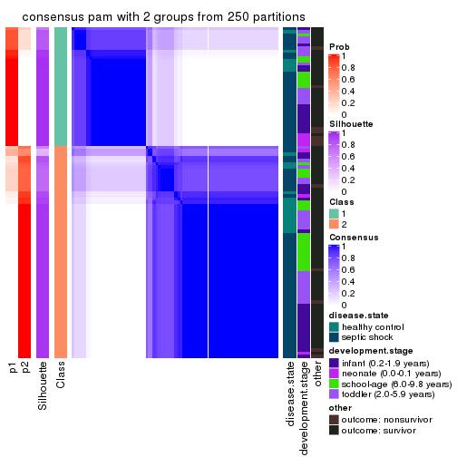</p>

</div>
<div id='tab-ATC-pam-consensus-heatmap-2'>
<pre><code class="r">consensus_heatmap(res, k = 3)
</code></pre>

<p>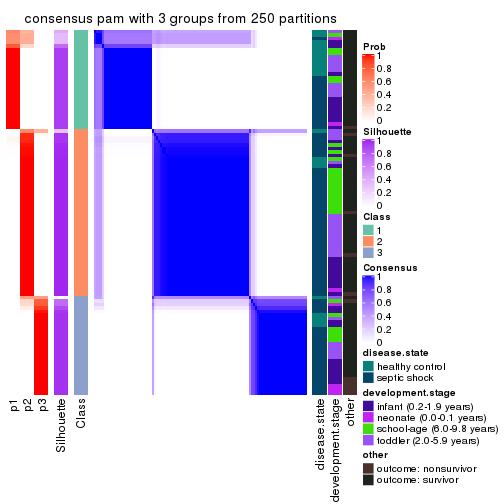</p>

</div>
<div id='tab-ATC-pam-consensus-heatmap-3'>
<pre><code class="r">consensus_heatmap(res, k = 4)
</code></pre>

<p>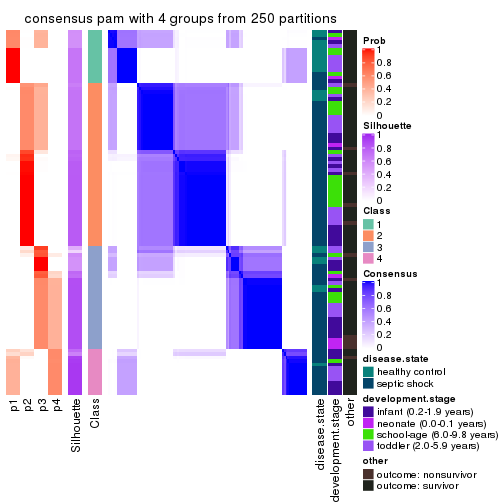</p>

</div>
<div id='tab-ATC-pam-consensus-heatmap-4'>
<pre><code class="r">consensus_heatmap(res, k = 5)
</code></pre>

<p>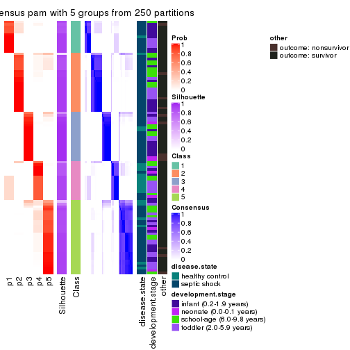</p>

</div>
<div id='tab-ATC-pam-consensus-heatmap-5'>
<pre><code class="r">consensus_heatmap(res, k = 6)
</code></pre>

<p>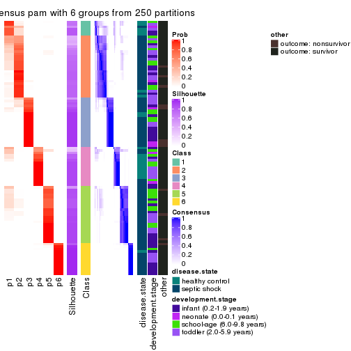</p>

</div>
</div>

Heatmaps for the membership of samples in all partitions to see how consistent they are:


<script>
$( function() {
	$( '#tabs-ATC-pam-membership-heatmap' ).tabs();
} );
</script>
<div id='tabs-ATC-pam-membership-heatmap'>
<ul>
<li><a href='#tab-ATC-pam-membership-heatmap-1'>k = 2</a></li>
<li><a href='#tab-ATC-pam-membership-heatmap-2'>k = 3</a></li>
<li><a href='#tab-ATC-pam-membership-heatmap-3'>k = 4</a></li>
<li><a href='#tab-ATC-pam-membership-heatmap-4'>k = 5</a></li>
<li><a href='#tab-ATC-pam-membership-heatmap-5'>k = 6</a></li>
</ul>
<div id='tab-ATC-pam-membership-heatmap-1'>
<pre><code class="r">membership_heatmap(res, k = 2)
</code></pre>

<p>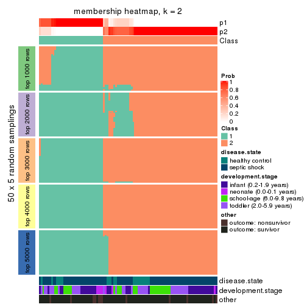</p>

</div>
<div id='tab-ATC-pam-membership-heatmap-2'>
<pre><code class="r">membership_heatmap(res, k = 3)
</code></pre>

<p>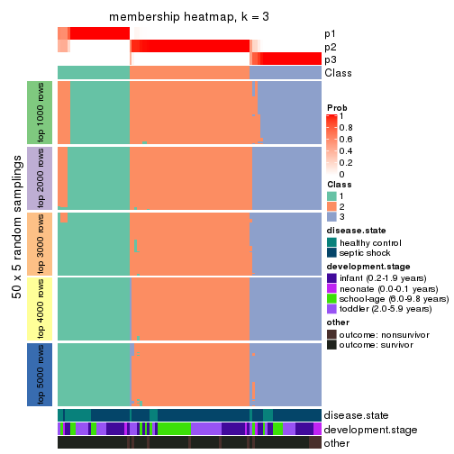</p>

</div>
<div id='tab-ATC-pam-membership-heatmap-3'>
<pre><code class="r">membership_heatmap(res, k = 4)
</code></pre>

<p>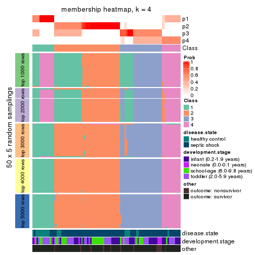</p>

</div>
<div id='tab-ATC-pam-membership-heatmap-4'>
<pre><code class="r">membership_heatmap(res, k = 5)
</code></pre>

<p>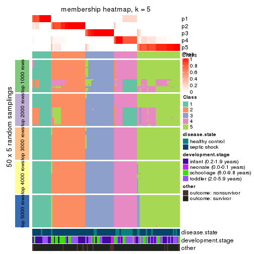</p>

</div>
<div id='tab-ATC-pam-membership-heatmap-5'>
<pre><code class="r">membership_heatmap(res, k = 6)
</code></pre>

<p>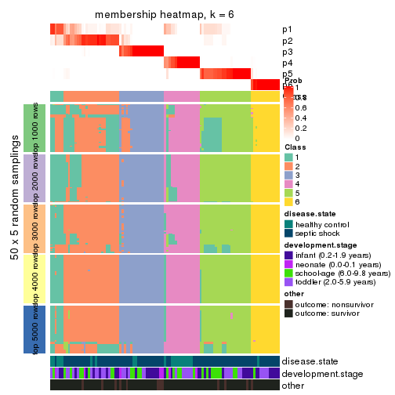</p>

</div>
</div>

As soon as we have had the classes for columns, we can look for signatures
which are significantly different between classes which can be candidate marks
for certain classes. Following are the heatmaps for signatures.


Signature heatmaps where rows are scaled:


<script>
$( function() {
	$( '#tabs-ATC-pam-get-signatures' ).tabs();
} );
</script>
<div id='tabs-ATC-pam-get-signatures'>
<ul>
<li><a href='#tab-ATC-pam-get-signatures-1'>k = 2</a></li>
<li><a href='#tab-ATC-pam-get-signatures-2'>k = 3</a></li>
<li><a href='#tab-ATC-pam-get-signatures-3'>k = 4</a></li>
<li><a href='#tab-ATC-pam-get-signatures-4'>k = 5</a></li>
<li><a href='#tab-ATC-pam-get-signatures-5'>k = 6</a></li>
</ul>
<div id='tab-ATC-pam-get-signatures-1'>
<pre><code class="r">get_signatures(res, k = 2)
</code></pre>

<p>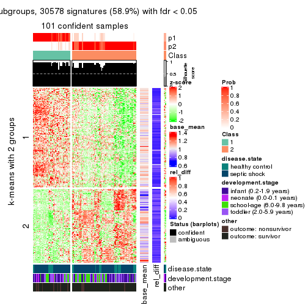</p>

</div>
<div id='tab-ATC-pam-get-signatures-2'>
<pre><code class="r">get_signatures(res, k = 3)
</code></pre>

<p>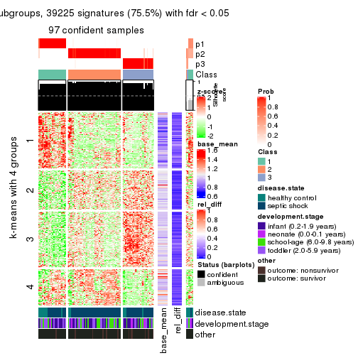</p>

</div>
<div id='tab-ATC-pam-get-signatures-3'>
<pre><code class="r">get_signatures(res, k = 4)
</code></pre>

<p>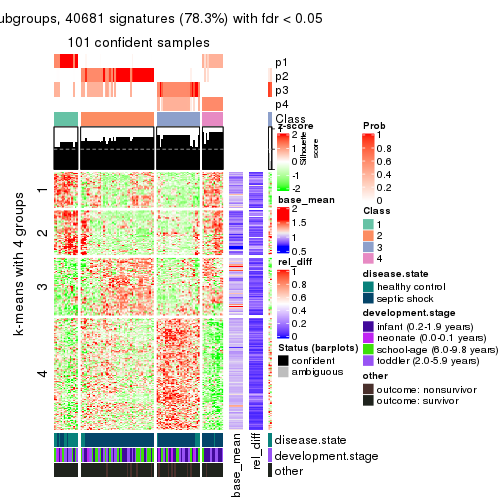</p>

</div>
<div id='tab-ATC-pam-get-signatures-4'>
<pre><code class="r">get_signatures(res, k = 5)
</code></pre>

<p>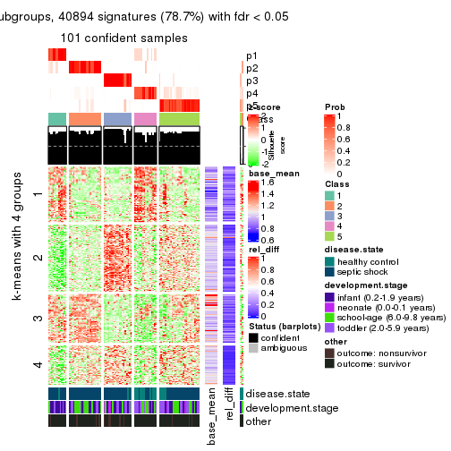</p>

</div>
<div id='tab-ATC-pam-get-signatures-5'>
<pre><code class="r">get_signatures(res, k = 6)
</code></pre>

<p>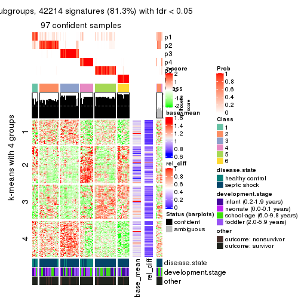</p>

</div>
</div>


Signature heatmaps where rows are not scaled:


<script>
$( function() {
	$( '#tabs-ATC-pam-get-signatures-no-scale' ).tabs();
} );
</script>
<div id='tabs-ATC-pam-get-signatures-no-scale'>
<ul>
<li><a href='#tab-ATC-pam-get-signatures-no-scale-1'>k = 2</a></li>
<li><a href='#tab-ATC-pam-get-signatures-no-scale-2'>k = 3</a></li>
<li><a href='#tab-ATC-pam-get-signatures-no-scale-3'>k = 4</a></li>
<li><a href='#tab-ATC-pam-get-signatures-no-scale-4'>k = 5</a></li>
<li><a href='#tab-ATC-pam-get-signatures-no-scale-5'>k = 6</a></li>
</ul>
<div id='tab-ATC-pam-get-signatures-no-scale-1'>
<pre><code class="r">get_signatures(res, k = 2, scale_rows = FALSE)
</code></pre>

<p>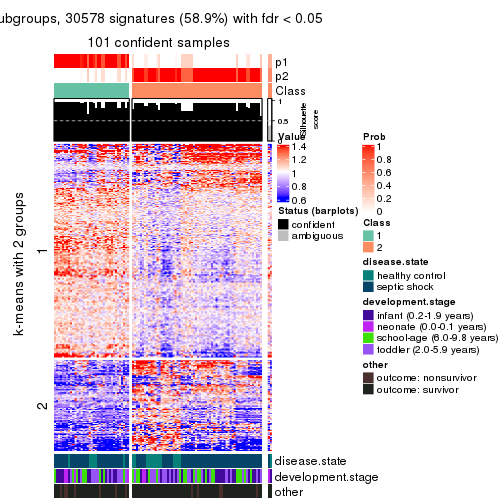</p>

</div>
<div id='tab-ATC-pam-get-signatures-no-scale-2'>
<pre><code class="r">get_signatures(res, k = 3, scale_rows = FALSE)
</code></pre>

<pre><code>#&gt; Error in mat[ceiling(1:nr/h_ratio), ceiling(1:nc/w_ratio), drop = FALSE]: subscript out of bounds
</code></pre>

<p>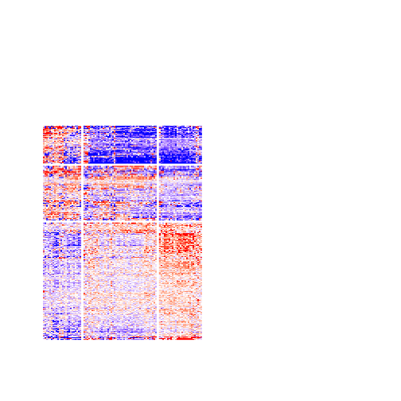</p>

</div>
<div id='tab-ATC-pam-get-signatures-no-scale-3'>
<pre><code class="r">get_signatures(res, k = 4, scale_rows = FALSE)
</code></pre>

<p>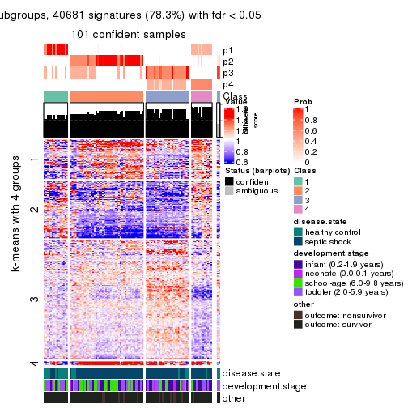</p>

</div>
<div id='tab-ATC-pam-get-signatures-no-scale-4'>
<pre><code class="r">get_signatures(res, k = 5, scale_rows = FALSE)
</code></pre>

<p>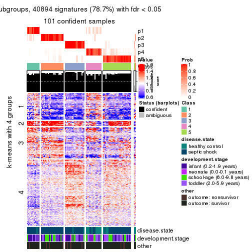</p>

</div>
<div id='tab-ATC-pam-get-signatures-no-scale-5'>
<pre><code class="r">get_signatures(res, k = 6, scale_rows = FALSE)
</code></pre>

<p>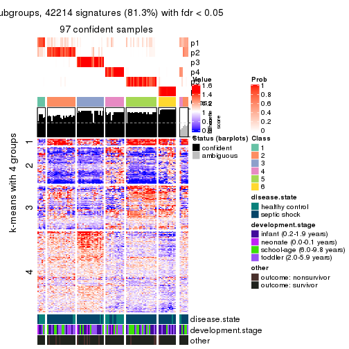</p>

</div>
</div>


Compare the overlap of signatures from different k:

```r
compare_signatures(res)
```

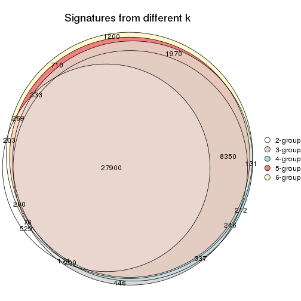

`get_signature()` returns a data frame invisibly. TO get the list of signatures, the function
call should be assigned to a variable explicitly. In following code, if `plot` argument is set
to `FALSE`, no heatmap is plotted while only the differential analysis is performed.

```r
# code only for demonstration
tb = get_signature(res, k = ..., plot = FALSE)
```

An example of the output of `tb` is:

```
#>   which_row         fdr    mean_1    mean_2 scaled_mean_1 scaled_mean_2 km
#> 1        38 0.042760348  8.373488  9.131774    -0.5533452     0.5164555  1
#> 2        40 0.018707592  7.106213  8.469186    -0.6173731     0.5762149  1
#> 3        55 0.019134737 10.221463 11.207825    -0.6159697     0.5749050  1
#> 4        59 0.006059896  5.921854  7.869574    -0.6899429     0.6439467  1
#> 5        60 0.018055526  8.928898 10.211722    -0.6204761     0.5791110  1
#> 6        98 0.009384629 15.714769 14.887706     0.6635654    -0.6193277  2
...
```

The columns in `tb` are:

1. `which_row`: row indices corresponding to the input matrix.
2. `fdr`: FDR for the differential test. 
3. `mean_x`: The mean value in group x.
4. `scaled_mean_x`: The mean value in group x after rows are scaled.
5. `km`: Row groups if k-means clustering is applied to rows.


UMAP plot which shows how samples are separated.


<script>
$( function() {
	$( '#tabs-ATC-pam-dimension-reduction' ).tabs();
} );
</script>
<div id='tabs-ATC-pam-dimension-reduction'>
<ul>
<li><a href='#tab-ATC-pam-dimension-reduction-1'>k = 2</a></li>
<li><a href='#tab-ATC-pam-dimension-reduction-2'>k = 3</a></li>
<li><a href='#tab-ATC-pam-dimension-reduction-3'>k = 4</a></li>
<li><a href='#tab-ATC-pam-dimension-reduction-4'>k = 5</a></li>
<li><a href='#tab-ATC-pam-dimension-reduction-5'>k = 6</a></li>
</ul>
<div id='tab-ATC-pam-dimension-reduction-1'>
<pre><code class="r">dimension_reduction(res, k = 2, method = &quot;UMAP&quot;)
</code></pre>

<p>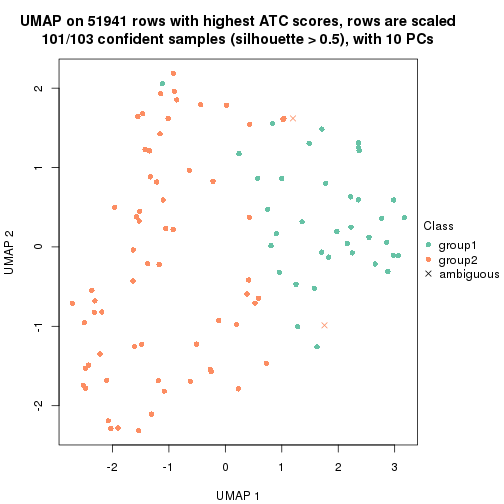</p>

</div>
<div id='tab-ATC-pam-dimension-reduction-2'>
<pre><code class="r">dimension_reduction(res, k = 3, method = &quot;UMAP&quot;)
</code></pre>

<p>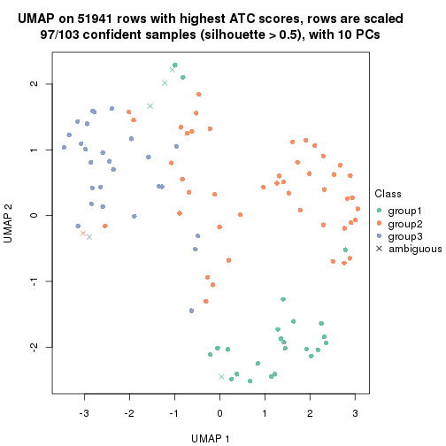</p>

</div>
<div id='tab-ATC-pam-dimension-reduction-3'>
<pre><code class="r">dimension_reduction(res, k = 4, method = &quot;UMAP&quot;)
</code></pre>

<p>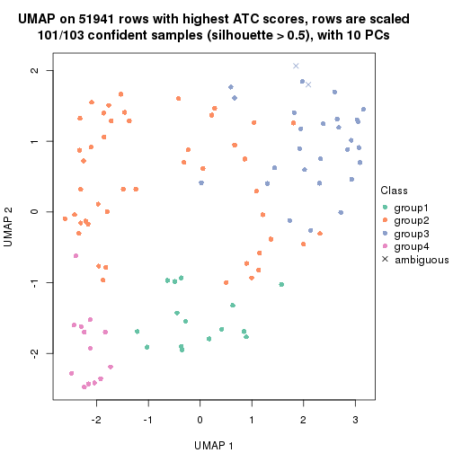</p>

</div>
<div id='tab-ATC-pam-dimension-reduction-4'>
<pre><code class="r">dimension_reduction(res, k = 5, method = &quot;UMAP&quot;)
</code></pre>

<p>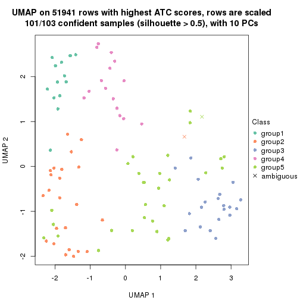</p>

</div>
<div id='tab-ATC-pam-dimension-reduction-5'>
<pre><code class="r">dimension_reduction(res, k = 6, method = &quot;UMAP&quot;)
</code></pre>

<p>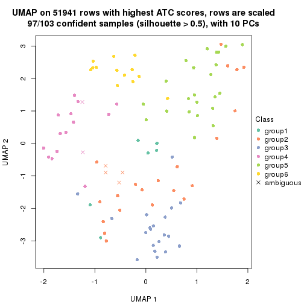</p>

</div>
</div>


Following heatmap shows how subgroups are split when increasing `k`:

```r
collect_classes(res)
```

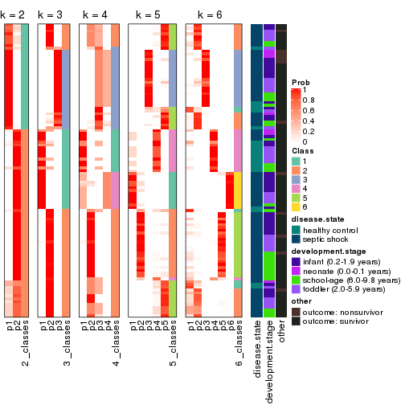


Test correlation between subgroups and known annotations. If the known
annotation is numeric, one-way ANOVA test is applied, and if the known
annotation is discrete, chi-squared contingency table test is applied.

```r
test_to_known_factors(res)
```

```
#>           n disease.state(p) development.stage(p) other(p) k
#> ATC:pam 101         6.68e-01                0.406    0.179 2
#> ATC:pam  97         3.96e-03                0.195    0.135 3
#> ATC:pam 101         1.17e-07                0.125    0.169 4
#> ATC:pam 101         9.13e-07                0.256    0.218 5
#> ATC:pam  97         6.36e-09                0.347    0.296 6
```


If matrix rows can be associated to genes, consider to use `functional_enrichment(res,
...)` to perform function enrichment for the signature genes. See [this vignette](http://bioconductor.org/packages/devel/bioc/vignettes/cola/inst/doc/functional_enrichment.html) for more detailed explanations.


 

---------------------------------------------------


### ATC:mclust


The object with results only for a single top-value method and a single partition method 
can be extracted as:

```r
res = res_list["ATC", "mclust"]
# you can also extract it by
# res = res_list["ATC:mclust"]
```

A summary of `res` and all the functions that can be applied to it:

```r
res
```

```
#> A 'ConsensusPartition' object with k = 2, 3, 4, 5, 6.
#>   On a matrix with 51941 rows and 103 columns.
#>   Top rows (1000, 2000, 3000, 4000, 5000) are extracted by 'ATC' method.
#>   Subgroups are detected by 'mclust' method.
#>   Performed in total 1250 partitions by row resampling.
#>   Best k for subgroups seems to be 2.
#> 
#> Following methods can be applied to this 'ConsensusPartition' object:
#>  [1] "cola_report"             "collect_classes"         "collect_plots"          
#>  [4] "collect_stats"           "colnames"                "compare_signatures"     
#>  [7] "consensus_heatmap"       "dimension_reduction"     "functional_enrichment"  
#> [10] "get_anno_col"            "get_anno"                "get_classes"            
#> [13] "get_consensus"           "get_matrix"              "get_membership"         
#> [16] "get_param"               "get_signatures"          "get_stats"              
#> [19] "is_best_k"               "is_stable_k"             "membership_heatmap"     
#> [22] "ncol"                    "nrow"                    "plot_ecdf"              
#> [25] "rownames"                "select_partition_number" "show"                   
#> [28] "suggest_best_k"          "test_to_known_factors"
```

`collect_plots()` function collects all the plots made from `res` for all `k` (number of partitions)
into one single page to provide an easy and fast comparison between different `k`.

```r
collect_plots(res)
```

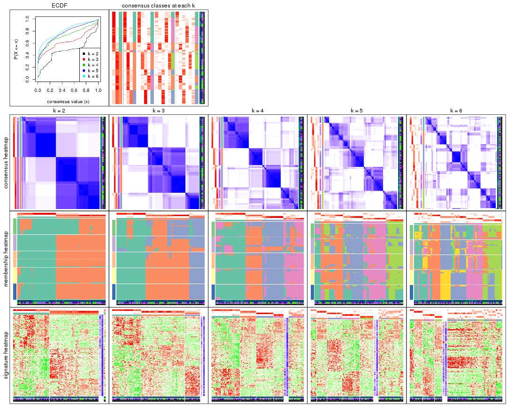

The plots are:

- The first row: a plot of the ECDF (empirical cumulative distribution
  function) curves of the consensus matrix for each `k` and the heatmap of
  predicted classes for each `k`.
- The second row: heatmaps of the consensus matrix for each `k`.
- The third row: heatmaps of the membership matrix for each `k`.
- The fouth row: heatmaps of the signatures for each `k`.

All the plots in panels can be made by individual functions and they are
plotted later in this section.

`select_partition_number()` produces several plots showing different
statistics for choosing "optimized" `k`. There are following statistics:

- ECDF curves of the consensus matrix for each `k`;
- 1-PAC. [The PAC
  score](https://en.wikipedia.org/wiki/Consensus_clustering#Over-interpretation_potential_of_consensus_clustering)
  measures the proportion of the ambiguous subgrouping.
- Mean silhouette score.
- Concordance. The mean probability of fiting the consensus class ids in all
  partitions.
- Area increased. Denote $A_k$ as the area under the ECDF curve for current
  `k`, the area increased is defined as $A_k - A_{k-1}$.
- Rand index. The percent of pairs of samples that are both in a same cluster
  or both are not in a same cluster in the partition of k and k-1.
- Jaccard index. The ratio of pairs of samples are both in a same cluster in
  the partition of k and k-1 and the pairs of samples are both in a same
  cluster in the partition k or k-1.

The detailed explanations of these statistics can be found in [the _cola_
vignette](http://bioconductor.org/packages/devel/bioc/vignettes/cola/inst/doc/cola.html#toc_13).

Generally speaking, lower PAC score, higher mean silhouette score or higher
concordance corresponds to better partition. Rand index and Jaccard index
measure how similar the current partition is compared to partition with `k-1`.
If they are too similar, we won't accept `k` is better than `k-1`.

```r
select_partition_number(res)
```

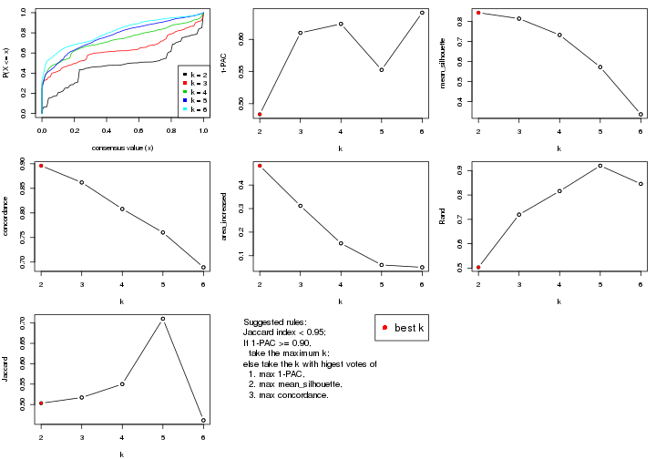

The numeric values for all these statistics can be obtained by `get_stats()`.

```r
get_stats(res)
```

```
#>   k 1-PAC mean_silhouette concordance area_increased  Rand Jaccard
#> 2 2 0.483           0.844       0.896         0.4821 0.503   0.503
#> 3 3 0.610           0.814       0.862         0.3118 0.719   0.517
#> 4 4 0.624           0.733       0.808         0.1524 0.816   0.550
#> 5 5 0.553           0.573       0.760         0.0606 0.920   0.711
#> 6 6 0.642           0.336       0.689         0.0506 0.845   0.461
```

`suggest_best_k()` suggests the best $k$ based on these statistics. The rules are as follows:

- All $k$ with Jaccard index larger than 0.95 are removed because increasing
  $k$ does not provide enough extra information. If all $k$ are removed, it is
  marked as no subgroup is detected.
- For all $k$ with 1-PAC score larger than 0.9, the maximal $k$ is taken as
  the best $k$, and other $k$ are marked as optional $k$.
- If it does not fit the second rule. The $k$ with the maximal vote of the
  highest 1-PAC score, highest mean silhouette, and highest concordance is
  taken as the best $k$.

```r
suggest_best_k(res)
```

```
#> [1] 2
```


Following shows the table of the partitions (You need to click the **show/hide
code output** link to see it). The membership matrix (columns with name `p*`)
is inferred by
[`clue::cl_consensus()`](https://www.rdocumentation.org/link/cl_consensus?package=clue)
function with the `SE` method. Basically the value in the membership matrix
represents the probability to belong to a certain group. The finall class
label for an item is determined with the group with highest probability it
belongs to.

In `get_classes()` function, the entropy is calculated from the membership
matrix and the silhouette score is calculated from the consensus matrix.


<script>
$( function() {
	$( '#tabs-ATC-mclust-get-classes' ).tabs();
} );
</script>
<div id='tabs-ATC-mclust-get-classes'>
<ul>
<li><a href='#tab-ATC-mclust-get-classes-1'>k = 2</a></li>
<li><a href='#tab-ATC-mclust-get-classes-2'>k = 3</a></li>
<li><a href='#tab-ATC-mclust-get-classes-3'>k = 4</a></li>
<li><a href='#tab-ATC-mclust-get-classes-4'>k = 5</a></li>
<li><a href='#tab-ATC-mclust-get-classes-5'>k = 6</a></li>
</ul>

<div id='tab-ATC-mclust-get-classes-1'>
<p><a id='tab-ATC-mclust-get-classes-1-a' style='color:#0366d6' href='#'>show/hide code output</a></p>
<pre><code class="r">cbind(get_classes(res, k = 2), get_membership(res, k = 2))
</code></pre>

<pre><code>#&gt;           class entropy silhouette    p1    p2
#&gt; GSM647569     2  0.7674      0.859 0.224 0.776
#&gt; GSM647574     1  0.0000      0.901 1.000 0.000
#&gt; GSM647577     2  0.7674      0.859 0.224 0.776
#&gt; GSM647547     1  0.0000      0.901 1.000 0.000
#&gt; GSM647552     2  0.7815      0.853 0.232 0.768
#&gt; GSM647553     1  0.0000      0.901 1.000 0.000
#&gt; GSM647565     1  0.0000      0.901 1.000 0.000
#&gt; GSM647545     1  0.8144      0.748 0.748 0.252
#&gt; GSM647549     1  0.5629      0.842 0.868 0.132
#&gt; GSM647550     2  0.2043      0.875 0.032 0.968
#&gt; GSM647560     2  0.7674      0.859 0.224 0.776
#&gt; GSM647617     2  0.7674      0.859 0.224 0.776
#&gt; GSM647528     2  0.0376      0.860 0.004 0.996
#&gt; GSM647529     1  0.5059      0.853 0.888 0.112
#&gt; GSM647531     1  0.5629      0.842 0.868 0.132
#&gt; GSM647540     2  0.7674      0.859 0.224 0.776
#&gt; GSM647541     2  0.2043      0.875 0.032 0.968
#&gt; GSM647546     2  0.7815      0.854 0.232 0.768
#&gt; GSM647557     1  0.7056      0.786 0.808 0.192
#&gt; GSM647561     1  0.7528      0.770 0.784 0.216
#&gt; GSM647567     1  0.0000      0.901 1.000 0.000
#&gt; GSM647568     1  0.8386      0.523 0.732 0.268
#&gt; GSM647570     2  0.2603      0.840 0.044 0.956
#&gt; GSM647573     1  0.0000      0.901 1.000 0.000
#&gt; GSM647576     2  0.7815      0.854 0.232 0.768
#&gt; GSM647579     2  0.7674      0.859 0.224 0.776
#&gt; GSM647580     2  0.7674      0.859 0.224 0.776
#&gt; GSM647583     2  0.7674      0.859 0.224 0.776
#&gt; GSM647592     2  0.4022      0.875 0.080 0.920
#&gt; GSM647593     2  0.2043      0.875 0.032 0.968
#&gt; GSM647595     2  0.2043      0.875 0.032 0.968
#&gt; GSM647597     1  0.5629      0.842 0.868 0.132
#&gt; GSM647598     2  0.0000      0.860 0.000 1.000
#&gt; GSM647613     1  0.6623      0.815 0.828 0.172
#&gt; GSM647615     2  0.3584      0.877 0.068 0.932
#&gt; GSM647616     2  0.7815      0.854 0.232 0.768
#&gt; GSM647619     2  0.2043      0.875 0.032 0.968
#&gt; GSM647582     2  0.5842      0.872 0.140 0.860
#&gt; GSM647591     2  0.2043      0.875 0.032 0.968
#&gt; GSM647527     2  0.0672      0.860 0.008 0.992
#&gt; GSM647530     1  0.5629      0.842 0.868 0.132
#&gt; GSM647532     1  0.0000      0.901 1.000 0.000
#&gt; GSM647544     1  0.6712      0.819 0.824 0.176
#&gt; GSM647551     2  0.2043      0.875 0.032 0.968
#&gt; GSM647556     2  0.7674      0.859 0.224 0.776
#&gt; GSM647558     2  0.0672      0.860 0.008 0.992
#&gt; GSM647572     2  0.7815      0.854 0.232 0.768
#&gt; GSM647578     2  0.7674      0.859 0.224 0.776
#&gt; GSM647581     1  0.5629      0.842 0.868 0.132
#&gt; GSM647594     1  0.5629      0.842 0.868 0.132
#&gt; GSM647599     1  0.6438      0.724 0.836 0.164
#&gt; GSM647600     2  0.7674      0.859 0.224 0.776
#&gt; GSM647601     2  0.0376      0.862 0.004 0.996
#&gt; GSM647603     2  0.7674      0.859 0.224 0.776
#&gt; GSM647610     2  0.2043      0.875 0.032 0.968
#&gt; GSM647611     2  0.2043      0.875 0.032 0.968
#&gt; GSM647612     2  0.2043      0.875 0.032 0.968
#&gt; GSM647614     2  0.8267      0.825 0.260 0.740
#&gt; GSM647618     2  0.0376      0.862 0.004 0.996
#&gt; GSM647629     2  0.2043      0.875 0.032 0.968
#&gt; GSM647535     2  0.7299      0.862 0.204 0.796
#&gt; GSM647563     2  0.0672      0.860 0.008 0.992
#&gt; GSM647542     2  0.7674      0.859 0.224 0.776
#&gt; GSM647543     2  0.7815      0.854 0.232 0.768
#&gt; GSM647548     1  0.0000      0.901 1.000 0.000
#&gt; GSM647554     2  0.2043      0.875 0.032 0.968
#&gt; GSM647555     2  0.7674      0.859 0.224 0.776
#&gt; GSM647559     2  0.0000      0.860 0.000 1.000
#&gt; GSM647562     1  0.5629      0.842 0.868 0.132
#&gt; GSM647564     2  0.7674      0.859 0.224 0.776
#&gt; GSM647571     2  0.7674      0.859 0.224 0.776
#&gt; GSM647584     2  0.2043      0.875 0.032 0.968
#&gt; GSM647585     1  0.9996     -0.273 0.512 0.488
#&gt; GSM647586     2  0.0000      0.860 0.000 1.000
#&gt; GSM647587     2  0.0672      0.860 0.008 0.992
#&gt; GSM647588     2  0.0000      0.860 0.000 1.000
#&gt; GSM647596     1  0.9732      0.511 0.596 0.404
#&gt; GSM647602     2  0.7674      0.859 0.224 0.776
#&gt; GSM647609     2  0.2043      0.875 0.032 0.968
#&gt; GSM647620     2  0.2043      0.875 0.032 0.968
#&gt; GSM647627     2  0.0000      0.860 0.000 1.000
#&gt; GSM647628     1  0.8861      0.431 0.696 0.304
#&gt; GSM647533     1  0.0000      0.901 1.000 0.000
#&gt; GSM647536     1  0.2043      0.889 0.968 0.032
#&gt; GSM647537     1  0.0000      0.901 1.000 0.000
#&gt; GSM647606     1  0.0000      0.901 1.000 0.000
#&gt; GSM647621     1  0.0000      0.901 1.000 0.000
#&gt; GSM647626     2  0.7674      0.859 0.224 0.776
#&gt; GSM647538     1  0.0000      0.901 1.000 0.000
#&gt; GSM647575     1  0.0000      0.901 1.000 0.000
#&gt; GSM647590     1  0.0000      0.901 1.000 0.000
#&gt; GSM647605     1  0.0000      0.901 1.000 0.000
#&gt; GSM647607     1  0.0000      0.901 1.000 0.000
#&gt; GSM647608     1  0.0000      0.901 1.000 0.000
#&gt; GSM647622     1  0.0000      0.901 1.000 0.000
#&gt; GSM647623     1  0.0000      0.901 1.000 0.000
#&gt; GSM647624     1  0.0000      0.901 1.000 0.000
#&gt; GSM647625     1  0.0000      0.901 1.000 0.000
#&gt; GSM647534     2  0.8327      0.818 0.264 0.736
#&gt; GSM647539     1  0.0000      0.901 1.000 0.000
#&gt; GSM647566     1  0.0000      0.901 1.000 0.000
#&gt; GSM647589     1  0.0000      0.901 1.000 0.000
#&gt; GSM647604     1  0.0000      0.901 1.000 0.000
</code></pre>

<script>
$('#tab-ATC-mclust-get-classes-1-a').parent().next().next().hide();
$('#tab-ATC-mclust-get-classes-1-a').click(function(){
  $('#tab-ATC-mclust-get-classes-1-a').parent().next().next().toggle();
  return(false);
});
</script>
</div>

<div id='tab-ATC-mclust-get-classes-2'>
<p><a id='tab-ATC-mclust-get-classes-2-a' style='color:#0366d6' href='#'>show/hide code output</a></p>
<pre><code class="r">cbind(get_classes(res, k = 3), get_membership(res, k = 3))
</code></pre>

<pre><code>#&gt;           class entropy silhouette    p1    p2    p3
#&gt; GSM647569     3  0.5397      0.910 0.000 0.280 0.720
#&gt; GSM647574     1  0.0000      0.925 1.000 0.000 0.000
#&gt; GSM647577     3  0.5397      0.910 0.000 0.280 0.720
#&gt; GSM647547     1  0.0000      0.925 1.000 0.000 0.000
#&gt; GSM647552     2  0.0592      0.812 0.000 0.988 0.012
#&gt; GSM647553     1  0.0237      0.923 0.996 0.000 0.004
#&gt; GSM647565     1  0.0000      0.925 1.000 0.000 0.000
#&gt; GSM647545     2  0.5687      0.760 0.020 0.756 0.224
#&gt; GSM647549     2  0.6853      0.721 0.064 0.712 0.224
#&gt; GSM647550     2  0.0000      0.814 0.000 1.000 0.000
#&gt; GSM647560     3  0.6172      0.865 0.012 0.308 0.680
#&gt; GSM647617     3  0.5397      0.910 0.000 0.280 0.720
#&gt; GSM647528     2  0.4842      0.774 0.000 0.776 0.224
#&gt; GSM647529     1  0.4399      0.808 0.812 0.000 0.188
#&gt; GSM647531     1  0.4842      0.779 0.776 0.000 0.224
#&gt; GSM647540     3  0.5397      0.910 0.000 0.280 0.720
#&gt; GSM647541     2  0.0000      0.814 0.000 1.000 0.000
#&gt; GSM647546     3  0.7633      0.751 0.184 0.132 0.684
#&gt; GSM647557     1  0.6673      0.716 0.720 0.056 0.224
#&gt; GSM647561     2  0.6578      0.732 0.052 0.724 0.224
#&gt; GSM647567     1  0.1289      0.919 0.968 0.000 0.032
#&gt; GSM647568     2  0.8624      0.509 0.240 0.596 0.164
#&gt; GSM647570     2  0.4842      0.774 0.000 0.776 0.224
#&gt; GSM647573     1  0.0000      0.925 1.000 0.000 0.000
#&gt; GSM647576     2  0.7361      0.594 0.124 0.704 0.172
#&gt; GSM647579     3  0.5397      0.910 0.000 0.280 0.720
#&gt; GSM647580     3  0.5397      0.910 0.000 0.280 0.720
#&gt; GSM647583     3  0.5397      0.910 0.000 0.280 0.720
#&gt; GSM647592     2  0.0237      0.814 0.000 0.996 0.004
#&gt; GSM647593     2  0.0237      0.814 0.000 0.996 0.004
#&gt; GSM647595     2  0.0237      0.814 0.000 0.996 0.004
#&gt; GSM647597     1  0.3267      0.884 0.884 0.000 0.116
#&gt; GSM647598     2  0.4842      0.774 0.000 0.776 0.224
#&gt; GSM647613     2  0.6276      0.744 0.040 0.736 0.224
#&gt; GSM647615     2  0.0000      0.814 0.000 1.000 0.000
#&gt; GSM647616     3  0.7138      0.815 0.120 0.160 0.720
#&gt; GSM647619     2  0.0237      0.814 0.000 0.996 0.004
#&gt; GSM647582     2  0.0237      0.814 0.000 0.996 0.004
#&gt; GSM647591     2  0.0237      0.814 0.000 0.996 0.004
#&gt; GSM647527     2  0.4842      0.774 0.000 0.776 0.224
#&gt; GSM647530     1  0.4842      0.779 0.776 0.000 0.224
#&gt; GSM647532     1  0.3116      0.868 0.892 0.000 0.108
#&gt; GSM647544     2  0.5874      0.765 0.032 0.760 0.208
#&gt; GSM647551     2  0.0237      0.814 0.000 0.996 0.004
#&gt; GSM647556     3  0.6722      0.868 0.060 0.220 0.720
#&gt; GSM647558     2  0.4842      0.774 0.000 0.776 0.224
#&gt; GSM647572     2  0.7844      0.506 0.120 0.660 0.220
#&gt; GSM647578     2  0.4291      0.624 0.000 0.820 0.180
#&gt; GSM647581     1  0.4842      0.779 0.776 0.000 0.224
#&gt; GSM647594     1  0.4750      0.787 0.784 0.000 0.216
#&gt; GSM647599     3  0.6984      0.504 0.304 0.040 0.656
#&gt; GSM647600     3  0.5397      0.910 0.000 0.280 0.720
#&gt; GSM647601     2  0.2625      0.813 0.000 0.916 0.084
#&gt; GSM647603     3  0.5397      0.910 0.000 0.280 0.720
#&gt; GSM647610     2  0.0000      0.814 0.000 1.000 0.000
#&gt; GSM647611     2  0.0000      0.814 0.000 1.000 0.000
#&gt; GSM647612     2  0.0000      0.814 0.000 1.000 0.000
#&gt; GSM647614     2  0.6918      0.657 0.136 0.736 0.128
#&gt; GSM647618     2  0.4399      0.788 0.000 0.812 0.188
#&gt; GSM647629     2  0.0000      0.814 0.000 1.000 0.000
#&gt; GSM647535     2  0.2878      0.736 0.000 0.904 0.096
#&gt; GSM647563     2  0.4750      0.778 0.000 0.784 0.216
#&gt; GSM647542     2  0.6662      0.667 0.120 0.752 0.128
#&gt; GSM647543     2  0.6597      0.672 0.120 0.756 0.124
#&gt; GSM647548     1  0.0000      0.925 1.000 0.000 0.000
#&gt; GSM647554     2  0.0000      0.814 0.000 1.000 0.000
#&gt; GSM647555     2  0.3482      0.699 0.000 0.872 0.128
#&gt; GSM647559     2  0.2625      0.814 0.000 0.916 0.084
#&gt; GSM647562     2  0.9150      0.537 0.232 0.544 0.224
#&gt; GSM647564     3  0.5397      0.910 0.000 0.280 0.720
#&gt; GSM647571     2  0.4178      0.637 0.000 0.828 0.172
#&gt; GSM647584     2  0.0237      0.814 0.000 0.996 0.004
#&gt; GSM647585     3  0.6597      0.571 0.268 0.036 0.696
#&gt; GSM647586     2  0.4842      0.774 0.000 0.776 0.224
#&gt; GSM647587     2  0.4842      0.774 0.000 0.776 0.224
#&gt; GSM647588     2  0.0592      0.816 0.000 0.988 0.012
#&gt; GSM647596     2  0.5070      0.771 0.004 0.772 0.224
#&gt; GSM647602     3  0.5397      0.910 0.000 0.280 0.720
#&gt; GSM647609     2  0.4062      0.796 0.000 0.836 0.164
#&gt; GSM647620     2  0.0000      0.814 0.000 1.000 0.000
#&gt; GSM647627     2  0.3267      0.808 0.000 0.884 0.116
#&gt; GSM647628     2  0.7026      0.657 0.152 0.728 0.120
#&gt; GSM647533     1  0.1860      0.915 0.948 0.000 0.052
#&gt; GSM647536     1  0.4399      0.808 0.812 0.000 0.188
#&gt; GSM647537     1  0.1860      0.915 0.948 0.000 0.052
#&gt; GSM647606     1  0.1860      0.915 0.948 0.000 0.052
#&gt; GSM647621     1  0.0000      0.925 1.000 0.000 0.000
#&gt; GSM647626     3  0.5397      0.910 0.000 0.280 0.720
#&gt; GSM647538     1  0.1860      0.915 0.948 0.000 0.052
#&gt; GSM647575     1  0.0000      0.925 1.000 0.000 0.000
#&gt; GSM647590     1  0.1860      0.915 0.948 0.000 0.052
#&gt; GSM647605     1  0.0000      0.925 1.000 0.000 0.000
#&gt; GSM647607     1  0.0237      0.924 0.996 0.000 0.004
#&gt; GSM647608     1  0.0000      0.925 1.000 0.000 0.000
#&gt; GSM647622     1  0.1860      0.915 0.948 0.000 0.052
#&gt; GSM647623     1  0.1860      0.915 0.948 0.000 0.052
#&gt; GSM647624     1  0.0237      0.924 0.996 0.000 0.004
#&gt; GSM647625     1  0.1860      0.915 0.948 0.000 0.052
#&gt; GSM647534     2  0.5307      0.693 0.056 0.820 0.124
#&gt; GSM647539     1  0.0000      0.925 1.000 0.000 0.000
#&gt; GSM647566     1  0.1860      0.915 0.948 0.000 0.052
#&gt; GSM647589     1  0.0000      0.925 1.000 0.000 0.000
#&gt; GSM647604     1  0.1860      0.915 0.948 0.000 0.052
</code></pre>

<script>
$('#tab-ATC-mclust-get-classes-2-a').parent().next().next().hide();
$('#tab-ATC-mclust-get-classes-2-a').click(function(){
  $('#tab-ATC-mclust-get-classes-2-a').parent().next().next().toggle();
  return(false);
});
</script>
</div>

<div id='tab-ATC-mclust-get-classes-3'>
<p><a id='tab-ATC-mclust-get-classes-3-a' style='color:#0366d6' href='#'>show/hide code output</a></p>
<pre><code class="r">cbind(get_classes(res, k = 4), get_membership(res, k = 4))
</code></pre>

<pre><code>#&gt;           class entropy silhouette    p1    p2    p3    p4
#&gt; GSM647569     3  0.0000     0.8815 0.000 0.000 1.000 0.000
#&gt; GSM647574     1  0.2089     0.8532 0.932 0.000 0.020 0.048
#&gt; GSM647577     3  0.0000     0.8815 0.000 0.000 1.000 0.000
#&gt; GSM647547     1  0.0921     0.8588 0.972 0.000 0.000 0.028
#&gt; GSM647552     2  0.5980     0.6001 0.040 0.592 0.364 0.004
#&gt; GSM647553     1  0.2400     0.8496 0.924 0.004 0.028 0.044
#&gt; GSM647565     1  0.1022     0.8587 0.968 0.000 0.000 0.032
#&gt; GSM647545     4  0.0469     0.6875 0.000 0.012 0.000 0.988
#&gt; GSM647549     4  0.5229    -0.2539 0.428 0.008 0.000 0.564
#&gt; GSM647550     4  0.7680     0.1125 0.000 0.324 0.232 0.444
#&gt; GSM647560     3  0.0524     0.8784 0.004 0.008 0.988 0.000
#&gt; GSM647617     3  0.0000     0.8815 0.000 0.000 1.000 0.000
#&gt; GSM647528     4  0.2345     0.6790 0.000 0.100 0.000 0.900
#&gt; GSM647529     1  0.3123     0.8225 0.844 0.000 0.000 0.156
#&gt; GSM647531     1  0.4697     0.6423 0.644 0.000 0.000 0.356
#&gt; GSM647540     3  0.0524     0.8784 0.004 0.000 0.988 0.008
#&gt; GSM647541     2  0.4466     0.9298 0.000 0.784 0.180 0.036
#&gt; GSM647546     3  0.0895     0.8723 0.020 0.004 0.976 0.000
#&gt; GSM647557     1  0.5285     0.4548 0.524 0.008 0.000 0.468
#&gt; GSM647561     4  0.3810     0.4818 0.188 0.008 0.000 0.804
#&gt; GSM647567     1  0.1545     0.8515 0.952 0.040 0.008 0.000
#&gt; GSM647568     4  0.7299     0.4486 0.184 0.004 0.260 0.552
#&gt; GSM647570     4  0.0592     0.6884 0.000 0.016 0.000 0.984
#&gt; GSM647573     1  0.1022     0.8584 0.968 0.000 0.000 0.032
#&gt; GSM647576     3  0.2266     0.7989 0.004 0.084 0.912 0.000
#&gt; GSM647579     3  0.0000     0.8815 0.000 0.000 1.000 0.000
#&gt; GSM647580     3  0.0000     0.8815 0.000 0.000 1.000 0.000
#&gt; GSM647583     3  0.0000     0.8815 0.000 0.000 1.000 0.000
#&gt; GSM647592     2  0.3969     0.9386 0.000 0.804 0.180 0.016
#&gt; GSM647593     2  0.3852     0.9374 0.000 0.808 0.180 0.012
#&gt; GSM647595     2  0.3852     0.9374 0.000 0.808 0.180 0.012
#&gt; GSM647597     1  0.4095     0.7893 0.792 0.016 0.000 0.192
#&gt; GSM647598     4  0.4728     0.5963 0.000 0.216 0.032 0.752
#&gt; GSM647613     4  0.3498     0.5307 0.160 0.008 0.000 0.832
#&gt; GSM647615     2  0.4808     0.8793 0.000 0.736 0.236 0.028
#&gt; GSM647616     3  0.0188     0.8798 0.004 0.000 0.996 0.000
#&gt; GSM647619     2  0.3852     0.9374 0.000 0.808 0.180 0.012
#&gt; GSM647582     2  0.4079     0.9386 0.000 0.800 0.180 0.020
#&gt; GSM647591     2  0.3852     0.9374 0.000 0.808 0.180 0.012
#&gt; GSM647527     4  0.2345     0.6790 0.000 0.100 0.000 0.900
#&gt; GSM647530     1  0.4522     0.6889 0.680 0.000 0.000 0.320
#&gt; GSM647532     1  0.2704     0.8354 0.876 0.000 0.000 0.124
#&gt; GSM647544     4  0.2262     0.6886 0.016 0.012 0.040 0.932
#&gt; GSM647551     2  0.3725     0.9360 0.000 0.812 0.180 0.008
#&gt; GSM647556     3  0.0524     0.8784 0.004 0.000 0.988 0.008
#&gt; GSM647558     4  0.0592     0.6884 0.000 0.016 0.000 0.984
#&gt; GSM647572     3  0.4746     0.4910 0.004 0.008 0.712 0.276
#&gt; GSM647578     3  0.0524     0.8784 0.004 0.000 0.988 0.008
#&gt; GSM647581     1  0.4697     0.6423 0.644 0.000 0.000 0.356
#&gt; GSM647594     1  0.4624     0.6609 0.660 0.000 0.000 0.340
#&gt; GSM647599     3  0.6844     0.4270 0.260 0.152 0.588 0.000
#&gt; GSM647600     3  0.0000     0.8815 0.000 0.000 1.000 0.000
#&gt; GSM647601     2  0.5771     0.8156 0.000 0.712 0.144 0.144
#&gt; GSM647603     3  0.0000     0.8815 0.000 0.000 1.000 0.000
#&gt; GSM647610     2  0.4079     0.9386 0.000 0.800 0.180 0.020
#&gt; GSM647611     2  0.4079     0.9386 0.000 0.800 0.180 0.020
#&gt; GSM647612     4  0.6919     0.4127 0.000 0.120 0.352 0.528
#&gt; GSM647614     4  0.5355     0.3628 0.004 0.008 0.408 0.580
#&gt; GSM647618     2  0.6289     0.6631 0.000 0.648 0.116 0.236
#&gt; GSM647629     2  0.4121     0.9377 0.000 0.796 0.184 0.020
#&gt; GSM647535     3  0.2115     0.8400 0.004 0.024 0.936 0.036
#&gt; GSM647563     4  0.2924     0.6775 0.000 0.100 0.016 0.884
#&gt; GSM647542     4  0.5524     0.3133 0.004 0.012 0.432 0.552
#&gt; GSM647543     4  0.5400     0.3226 0.004 0.008 0.428 0.560
#&gt; GSM647548     1  0.0921     0.8588 0.972 0.000 0.000 0.028
#&gt; GSM647554     2  0.4079     0.9386 0.000 0.800 0.180 0.020
#&gt; GSM647555     3  0.5837     0.0518 0.000 0.036 0.564 0.400
#&gt; GSM647559     4  0.6572     0.4209 0.000 0.272 0.120 0.608
#&gt; GSM647562     1  0.4916     0.5426 0.576 0.000 0.000 0.424
#&gt; GSM647564     3  0.0188     0.8805 0.004 0.000 0.996 0.000
#&gt; GSM647571     3  0.2123     0.8398 0.004 0.028 0.936 0.032
#&gt; GSM647584     2  0.3969     0.9382 0.000 0.804 0.180 0.016
#&gt; GSM647585     3  0.6635     0.4804 0.228 0.152 0.620 0.000
#&gt; GSM647586     4  0.5003     0.4997 0.000 0.308 0.016 0.676
#&gt; GSM647587     4  0.1211     0.6890 0.000 0.040 0.000 0.960
#&gt; GSM647588     4  0.7333     0.1604 0.000 0.332 0.172 0.496
#&gt; GSM647596     4  0.0469     0.6875 0.000 0.012 0.000 0.988
#&gt; GSM647602     3  0.0000     0.8815 0.000 0.000 1.000 0.000
#&gt; GSM647609     2  0.4655     0.8521 0.000 0.796 0.116 0.088
#&gt; GSM647620     2  0.4553     0.9266 0.000 0.780 0.180 0.040
#&gt; GSM647627     4  0.5993     0.4440 0.000 0.308 0.064 0.628
#&gt; GSM647628     4  0.5263     0.5588 0.032 0.004 0.260 0.704
#&gt; GSM647533     1  0.3444     0.8237 0.816 0.184 0.000 0.000
#&gt; GSM647536     1  0.2868     0.8311 0.864 0.000 0.000 0.136
#&gt; GSM647537     1  0.3123     0.8303 0.844 0.156 0.000 0.000
#&gt; GSM647606     1  0.3539     0.8259 0.820 0.176 0.000 0.004
#&gt; GSM647621     1  0.0921     0.8588 0.972 0.000 0.000 0.028
#&gt; GSM647626     3  0.0592     0.8722 0.016 0.000 0.984 0.000
#&gt; GSM647538     1  0.3486     0.8223 0.812 0.188 0.000 0.000
#&gt; GSM647575     1  0.1022     0.8584 0.968 0.000 0.000 0.032
#&gt; GSM647590     1  0.3448     0.8278 0.828 0.168 0.000 0.004
#&gt; GSM647605     1  0.1724     0.8606 0.948 0.020 0.000 0.032
#&gt; GSM647607     1  0.1833     0.8601 0.944 0.024 0.000 0.032
#&gt; GSM647608     1  0.0921     0.8588 0.972 0.000 0.000 0.028
#&gt; GSM647622     1  0.3444     0.8237 0.816 0.184 0.000 0.000
#&gt; GSM647623     1  0.5395     0.7584 0.736 0.172 0.092 0.000
#&gt; GSM647624     1  0.1833     0.8601 0.944 0.024 0.000 0.032
#&gt; GSM647625     1  0.5229     0.7718 0.748 0.168 0.084 0.000
#&gt; GSM647534     3  0.6310     0.1963 0.060 0.428 0.512 0.000
#&gt; GSM647539     1  0.0921     0.8588 0.972 0.000 0.000 0.028
#&gt; GSM647566     1  0.3486     0.8223 0.812 0.188 0.000 0.000
#&gt; GSM647589     1  0.1356     0.8581 0.960 0.000 0.008 0.032
#&gt; GSM647604     1  0.3626     0.8234 0.812 0.184 0.000 0.004
</code></pre>

<script>
$('#tab-ATC-mclust-get-classes-3-a').parent().next().next().hide();
$('#tab-ATC-mclust-get-classes-3-a').click(function(){
  $('#tab-ATC-mclust-get-classes-3-a').parent().next().next().toggle();
  return(false);
});
</script>
</div>

<div id='tab-ATC-mclust-get-classes-4'>
<p><a id='tab-ATC-mclust-get-classes-4-a' style='color:#0366d6' href='#'>show/hide code output</a></p>
<pre><code class="r">cbind(get_classes(res, k = 5), get_membership(res, k = 5))
</code></pre>

<pre><code>#&gt;           class entropy silhouette    p1    p2    p3    p4    p5
#&gt; GSM647569     3  0.1270     0.7807 0.000 0.000 0.948 0.000 0.052
#&gt; GSM647574     4  0.6648     0.4232 0.052 0.088 0.056 0.668 0.136
#&gt; GSM647577     3  0.0703     0.7832 0.000 0.000 0.976 0.000 0.024
#&gt; GSM647547     4  0.3311     0.7196 0.048 0.064 0.004 0.868 0.016
#&gt; GSM647552     5  0.6141     0.1882 0.248 0.000 0.172 0.004 0.576
#&gt; GSM647553     4  0.8645     0.0708 0.124 0.088 0.160 0.488 0.140
#&gt; GSM647565     4  0.1285     0.7600 0.036 0.004 0.004 0.956 0.000
#&gt; GSM647545     2  0.0867     0.6225 0.008 0.976 0.000 0.008 0.008
#&gt; GSM647549     2  0.4028     0.4616 0.040 0.768 0.000 0.192 0.000
#&gt; GSM647550     5  0.5929     0.1893 0.004 0.308 0.116 0.000 0.572
#&gt; GSM647560     3  0.4122     0.5807 0.004 0.004 0.688 0.000 0.304
#&gt; GSM647617     3  0.0703     0.7832 0.000 0.000 0.976 0.000 0.024
#&gt; GSM647528     2  0.2074     0.6156 0.000 0.896 0.000 0.000 0.104
#&gt; GSM647529     4  0.3689     0.7222 0.092 0.076 0.000 0.828 0.004
#&gt; GSM647531     4  0.5691     0.6193 0.128 0.236 0.000 0.632 0.004
#&gt; GSM647540     3  0.1608     0.7738 0.000 0.000 0.928 0.000 0.072
#&gt; GSM647541     5  0.2393     0.7393 0.004 0.016 0.080 0.000 0.900
#&gt; GSM647546     3  0.3449     0.7175 0.004 0.008 0.832 0.016 0.140
#&gt; GSM647557     4  0.5068     0.5219 0.040 0.388 0.000 0.572 0.000
#&gt; GSM647561     2  0.3691     0.5199 0.040 0.804 0.000 0.156 0.000
#&gt; GSM647567     4  0.5184     0.3670 0.348 0.020 0.004 0.612 0.016
#&gt; GSM647568     2  0.7892     0.2612 0.040 0.448 0.324 0.044 0.144
#&gt; GSM647570     2  0.0404     0.6261 0.000 0.988 0.000 0.000 0.012
#&gt; GSM647573     4  0.0324     0.7570 0.000 0.004 0.004 0.992 0.000
#&gt; GSM647576     3  0.4438     0.5085 0.004 0.004 0.648 0.004 0.340
#&gt; GSM647579     3  0.1270     0.7807 0.000 0.000 0.948 0.000 0.052
#&gt; GSM647580     3  0.0703     0.7832 0.000 0.000 0.976 0.000 0.024
#&gt; GSM647583     3  0.0703     0.7832 0.000 0.000 0.976 0.000 0.024
#&gt; GSM647592     5  0.2293     0.6833 0.016 0.000 0.084 0.000 0.900
#&gt; GSM647593     5  0.2966     0.6943 0.136 0.016 0.000 0.000 0.848
#&gt; GSM647595     5  0.2966     0.6943 0.136 0.016 0.000 0.000 0.848
#&gt; GSM647597     4  0.6308     0.4544 0.352 0.144 0.000 0.500 0.004
#&gt; GSM647598     2  0.4398     0.5031 0.040 0.720 0.000 0.000 0.240
#&gt; GSM647613     2  0.3731     0.5141 0.040 0.800 0.000 0.160 0.000
#&gt; GSM647615     5  0.3618     0.6342 0.004 0.012 0.196 0.000 0.788
#&gt; GSM647616     3  0.0290     0.7688 0.000 0.000 0.992 0.008 0.000
#&gt; GSM647619     5  0.2753     0.6984 0.136 0.008 0.000 0.000 0.856
#&gt; GSM647582     5  0.2170     0.6783 0.004 0.004 0.088 0.000 0.904
#&gt; GSM647591     5  0.3554     0.7017 0.136 0.016 0.020 0.000 0.828
#&gt; GSM647527     2  0.2074     0.6156 0.000 0.896 0.000 0.000 0.104
#&gt; GSM647530     4  0.4690     0.6804 0.092 0.160 0.000 0.744 0.004
#&gt; GSM647532     4  0.1731     0.7576 0.000 0.060 0.004 0.932 0.004
#&gt; GSM647544     2  0.2170     0.6091 0.004 0.904 0.088 0.004 0.000
#&gt; GSM647551     5  0.1116     0.7015 0.028 0.004 0.004 0.000 0.964
#&gt; GSM647556     3  0.3317     0.7126 0.004 0.004 0.804 0.000 0.188
#&gt; GSM647558     2  0.0703     0.6273 0.000 0.976 0.000 0.000 0.024
#&gt; GSM647572     2  0.7569     0.2621 0.052 0.452 0.332 0.012 0.152
#&gt; GSM647578     3  0.3715     0.6702 0.004 0.000 0.736 0.000 0.260
#&gt; GSM647581     4  0.5731     0.6180 0.132 0.236 0.000 0.628 0.004
#&gt; GSM647594     4  0.5033     0.6820 0.124 0.156 0.000 0.716 0.004
#&gt; GSM647599     3  0.7674     0.0950 0.256 0.000 0.468 0.092 0.184
#&gt; GSM647600     3  0.1608     0.7718 0.000 0.000 0.928 0.000 0.072
#&gt; GSM647601     5  0.7438     0.1528 0.136 0.328 0.080 0.000 0.456
#&gt; GSM647603     3  0.1270     0.7807 0.000 0.000 0.948 0.000 0.052
#&gt; GSM647610     5  0.2295     0.7386 0.004 0.008 0.088 0.000 0.900
#&gt; GSM647611     5  0.4612     0.7041 0.136 0.016 0.080 0.000 0.768
#&gt; GSM647612     2  0.7182     0.2834 0.024 0.416 0.224 0.000 0.336
#&gt; GSM647614     2  0.7541     0.2659 0.052 0.456 0.332 0.012 0.148
#&gt; GSM647618     2  0.7453     0.1548 0.136 0.448 0.080 0.000 0.336
#&gt; GSM647629     5  0.2984     0.7209 0.004 0.016 0.124 0.000 0.856
#&gt; GSM647535     3  0.7031     0.3669 0.012 0.188 0.488 0.012 0.300
#&gt; GSM647563     2  0.2984     0.6155 0.000 0.860 0.032 0.000 0.108
#&gt; GSM647542     2  0.7541     0.2659 0.052 0.456 0.332 0.012 0.148
#&gt; GSM647543     2  0.7541     0.2659 0.052 0.456 0.332 0.012 0.148
#&gt; GSM647548     4  0.1285     0.7600 0.036 0.004 0.004 0.956 0.000
#&gt; GSM647554     5  0.2177     0.7409 0.004 0.008 0.080 0.000 0.908
#&gt; GSM647555     3  0.6930     0.1164 0.024 0.328 0.472 0.000 0.176
#&gt; GSM647559     2  0.7057     0.2878 0.136 0.512 0.056 0.000 0.296
#&gt; GSM647562     2  0.6229    -0.1006 0.132 0.504 0.000 0.360 0.004
#&gt; GSM647564     3  0.2890     0.7254 0.004 0.000 0.836 0.000 0.160
#&gt; GSM647571     3  0.6727     0.3087 0.024 0.260 0.536 0.000 0.180
#&gt; GSM647584     5  0.4181     0.7059 0.136 0.016 0.052 0.000 0.796
#&gt; GSM647585     3  0.7239    -0.1602 0.364 0.000 0.452 0.084 0.100
#&gt; GSM647586     2  0.7187     0.2812 0.136 0.508 0.068 0.000 0.288
#&gt; GSM647587     2  0.1121     0.6271 0.000 0.956 0.000 0.000 0.044
#&gt; GSM647588     2  0.7487     0.0844 0.136 0.424 0.080 0.000 0.360
#&gt; GSM647596     2  0.0162     0.6201 0.004 0.996 0.000 0.000 0.000
#&gt; GSM647602     3  0.0880     0.7826 0.000 0.000 0.968 0.000 0.032
#&gt; GSM647609     5  0.5380     0.6798 0.136 0.056 0.080 0.000 0.728
#&gt; GSM647620     5  0.2393     0.7393 0.004 0.016 0.080 0.000 0.900
#&gt; GSM647627     2  0.7262     0.2339 0.136 0.484 0.068 0.000 0.312
#&gt; GSM647628     2  0.7501     0.3813 0.020 0.488 0.296 0.156 0.040
#&gt; GSM647533     1  0.5757     0.8788 0.640 0.000 0.008 0.216 0.136
#&gt; GSM647536     4  0.3574     0.7254 0.088 0.072 0.000 0.836 0.004
#&gt; GSM647537     1  0.5810     0.8724 0.632 0.000 0.008 0.224 0.136
#&gt; GSM647606     4  0.4015     0.3773 0.348 0.000 0.000 0.652 0.000
#&gt; GSM647621     4  0.1862     0.7492 0.048 0.000 0.004 0.932 0.016
#&gt; GSM647626     3  0.0992     0.7814 0.000 0.000 0.968 0.008 0.024
#&gt; GSM647538     1  0.5079     0.9011 0.700 0.000 0.000 0.164 0.136
#&gt; GSM647575     4  0.0162     0.7562 0.000 0.000 0.004 0.996 0.000
#&gt; GSM647590     4  0.3274     0.6031 0.220 0.000 0.000 0.780 0.000
#&gt; GSM647605     4  0.1357     0.7489 0.048 0.000 0.004 0.948 0.000
#&gt; GSM647607     4  0.0162     0.7563 0.004 0.000 0.000 0.996 0.000
#&gt; GSM647608     4  0.1525     0.7531 0.036 0.000 0.004 0.948 0.012
#&gt; GSM647622     1  0.5184     0.8988 0.688 0.000 0.000 0.176 0.136
#&gt; GSM647623     1  0.6220     0.8416 0.616 0.000 0.028 0.132 0.224
#&gt; GSM647624     4  0.1121     0.7497 0.044 0.000 0.000 0.956 0.000
#&gt; GSM647625     1  0.6669     0.7485 0.596 0.000 0.108 0.072 0.224
#&gt; GSM647534     5  0.7090    -0.2137 0.324 0.000 0.224 0.020 0.432
#&gt; GSM647539     4  0.1041     0.7589 0.032 0.000 0.004 0.964 0.000
#&gt; GSM647566     1  0.5079     0.9011 0.700 0.000 0.000 0.164 0.136
#&gt; GSM647589     4  0.2204     0.7496 0.048 0.000 0.016 0.920 0.016
#&gt; GSM647604     4  0.4227     0.2170 0.420 0.000 0.000 0.580 0.000
</code></pre>

<script>
$('#tab-ATC-mclust-get-classes-4-a').parent().next().next().hide();
$('#tab-ATC-mclust-get-classes-4-a').click(function(){
  $('#tab-ATC-mclust-get-classes-4-a').parent().next().next().toggle();
  return(false);
});
</script>
</div>

<div id='tab-ATC-mclust-get-classes-5'>
<p><a id='tab-ATC-mclust-get-classes-5-a' style='color:#0366d6' href='#'>show/hide code output</a></p>
<pre><code class="r">cbind(get_classes(res, k = 6), get_membership(res, k = 6))
</code></pre>

<pre><code>#&gt;           class entropy silhouette    p1    p2    p3    p4    p5    p6
#&gt; GSM647569     3  0.3717   -0.20878 0.000 0.000 0.616 0.000 0.000 0.384
#&gt; GSM647574     1  0.7283    0.48360 0.440 0.020 0.128 0.108 0.000 0.304
#&gt; GSM647577     3  0.3737   -0.21483 0.000 0.000 0.608 0.000 0.000 0.392
#&gt; GSM647547     1  0.5736    0.42542 0.440 0.004 0.000 0.144 0.000 0.412
#&gt; GSM647552     3  0.5475   -0.15194 0.056 0.000 0.516 0.004 0.400 0.024
#&gt; GSM647553     1  0.8143    0.03170 0.360 0.064 0.360 0.104 0.032 0.080
#&gt; GSM647565     4  0.4232    0.68320 0.116 0.000 0.000 0.736 0.000 0.148
#&gt; GSM647545     2  0.0260    0.74980 0.000 0.992 0.000 0.000 0.000 0.008
#&gt; GSM647549     2  0.4619    0.31409 0.000 0.600 0.000 0.348 0.000 0.052
#&gt; GSM647550     3  0.6016   -0.29968 0.000 0.244 0.404 0.000 0.352 0.000
#&gt; GSM647560     3  0.1176    0.25551 0.000 0.000 0.956 0.000 0.024 0.020
#&gt; GSM647617     3  0.3737   -0.21483 0.000 0.000 0.608 0.000 0.000 0.392
#&gt; GSM647528     2  0.1075    0.73450 0.000 0.952 0.000 0.000 0.048 0.000
#&gt; GSM647529     4  0.0632    0.70344 0.000 0.024 0.000 0.976 0.000 0.000
#&gt; GSM647531     4  0.2542    0.67077 0.000 0.080 0.000 0.876 0.000 0.044
#&gt; GSM647540     3  0.4206   -0.20645 0.000 0.000 0.620 0.000 0.024 0.356
#&gt; GSM647541     5  0.4482    0.41695 0.000 0.036 0.384 0.000 0.580 0.000
#&gt; GSM647546     3  0.0622    0.26284 0.000 0.000 0.980 0.000 0.008 0.012
#&gt; GSM647557     4  0.6372    0.23801 0.000 0.332 0.000 0.464 0.168 0.036
#&gt; GSM647561     2  0.4606    0.32458 0.000 0.604 0.000 0.344 0.000 0.052
#&gt; GSM647567     1  0.4031    0.52706 0.772 0.008 0.000 0.124 0.000 0.096
#&gt; GSM647568     1  0.8367    0.19234 0.328 0.108 0.252 0.008 0.056 0.248
#&gt; GSM647570     2  0.0260    0.75118 0.000 0.992 0.000 0.000 0.008 0.000
#&gt; GSM647573     4  0.3740    0.69224 0.096 0.000 0.000 0.784 0.000 0.120
#&gt; GSM647576     3  0.2673    0.25792 0.000 0.004 0.852 0.000 0.132 0.012
#&gt; GSM647579     3  0.3684   -0.19960 0.000 0.000 0.628 0.000 0.000 0.372
#&gt; GSM647580     3  0.3737   -0.21483 0.000 0.000 0.608 0.000 0.000 0.392
#&gt; GSM647583     3  0.3737   -0.21483 0.000 0.000 0.608 0.000 0.000 0.392
#&gt; GSM647592     5  0.2009    0.58446 0.000 0.008 0.084 0.000 0.904 0.004
#&gt; GSM647593     5  0.1897    0.60659 0.000 0.084 0.004 0.000 0.908 0.004
#&gt; GSM647595     5  0.1949    0.60440 0.000 0.088 0.004 0.000 0.904 0.004
#&gt; GSM647597     4  0.5259    0.48657 0.212 0.036 0.000 0.676 0.064 0.012
#&gt; GSM647598     2  0.2378    0.60362 0.000 0.848 0.000 0.000 0.152 0.000
#&gt; GSM647613     2  0.4619    0.31768 0.000 0.600 0.000 0.348 0.000 0.052
#&gt; GSM647615     5  0.4229    0.33838 0.000 0.016 0.436 0.000 0.548 0.000
#&gt; GSM647616     3  0.3747   -0.22295 0.000 0.000 0.604 0.000 0.000 0.396
#&gt; GSM647619     5  0.1843    0.60793 0.000 0.080 0.004 0.000 0.912 0.004
#&gt; GSM647582     5  0.4063    0.34293 0.000 0.004 0.420 0.000 0.572 0.004
#&gt; GSM647591     5  0.1806    0.60525 0.000 0.088 0.004 0.000 0.908 0.000
#&gt; GSM647527     2  0.1075    0.73450 0.000 0.952 0.000 0.000 0.048 0.000
#&gt; GSM647530     4  0.1010    0.70145 0.000 0.036 0.000 0.960 0.000 0.004
#&gt; GSM647532     4  0.2186    0.71136 0.056 0.024 0.000 0.908 0.000 0.012
#&gt; GSM647544     2  0.1480    0.73437 0.000 0.940 0.040 0.000 0.000 0.020
#&gt; GSM647551     5  0.3516    0.53572 0.000 0.016 0.220 0.000 0.760 0.004
#&gt; GSM647556     3  0.2207    0.30153 0.000 0.016 0.900 0.000 0.076 0.008
#&gt; GSM647558     2  0.0260    0.75118 0.000 0.992 0.000 0.000 0.008 0.000
#&gt; GSM647572     3  0.5034    0.27764 0.004 0.120 0.724 0.000 0.076 0.076
#&gt; GSM647578     3  0.1956    0.30019 0.000 0.008 0.908 0.000 0.080 0.004
#&gt; GSM647581     4  0.4212    0.44427 0.000 0.264 0.000 0.688 0.000 0.048
#&gt; GSM647594     4  0.1492    0.69717 0.000 0.036 0.000 0.940 0.000 0.024
#&gt; GSM647599     3  0.5670   -0.02997 0.204 0.000 0.640 0.004 0.052 0.100
#&gt; GSM647600     3  0.3684   -0.19960 0.000 0.000 0.628 0.000 0.000 0.372
#&gt; GSM647601     5  0.3969    0.41100 0.000 0.312 0.020 0.000 0.668 0.000
#&gt; GSM647603     3  0.3684   -0.19960 0.000 0.000 0.628 0.000 0.000 0.372
#&gt; GSM647610     5  0.4209    0.41632 0.000 0.020 0.384 0.000 0.596 0.000
#&gt; GSM647611     5  0.1334    0.61435 0.000 0.020 0.032 0.000 0.948 0.000
#&gt; GSM647612     3  0.6422   -0.11128 0.000 0.380 0.436 0.000 0.132 0.052
#&gt; GSM647614     2  0.8024    0.00594 0.328 0.332 0.188 0.000 0.076 0.076
#&gt; GSM647618     5  0.3927    0.36866 0.000 0.344 0.012 0.000 0.644 0.000
#&gt; GSM647629     5  0.4318    0.32539 0.000 0.020 0.448 0.000 0.532 0.000
#&gt; GSM647535     3  0.3475    0.30370 0.000 0.020 0.812 0.000 0.140 0.028
#&gt; GSM647563     2  0.1500    0.72904 0.000 0.936 0.012 0.000 0.052 0.000
#&gt; GSM647542     3  0.6256    0.13945 0.004 0.328 0.516 0.000 0.076 0.076
#&gt; GSM647543     3  0.6301    0.09358 0.004 0.348 0.496 0.000 0.076 0.076
#&gt; GSM647548     4  0.5353    0.47037 0.116 0.000 0.000 0.516 0.000 0.368
#&gt; GSM647554     5  0.4199    0.42113 0.000 0.020 0.380 0.000 0.600 0.000
#&gt; GSM647555     3  0.5016    0.29424 0.004 0.100 0.728 0.000 0.092 0.076
#&gt; GSM647559     5  0.4175    0.11069 0.000 0.464 0.012 0.000 0.524 0.000
#&gt; GSM647562     4  0.4876    0.15503 0.000 0.368 0.000 0.564 0.000 0.068
#&gt; GSM647564     3  0.0458    0.25628 0.000 0.000 0.984 0.000 0.000 0.016
#&gt; GSM647571     3  0.3167    0.30269 0.000 0.000 0.832 0.000 0.096 0.072
#&gt; GSM647584     5  0.2060    0.60921 0.000 0.084 0.016 0.000 0.900 0.000
#&gt; GSM647585     6  0.6646    0.00000 0.200 0.000 0.308 0.000 0.048 0.444
#&gt; GSM647586     5  0.4169    0.13676 0.000 0.456 0.012 0.000 0.532 0.000
#&gt; GSM647587     2  0.0260    0.75118 0.000 0.992 0.000 0.000 0.008 0.000
#&gt; GSM647588     5  0.4219    0.28361 0.000 0.388 0.020 0.000 0.592 0.000
#&gt; GSM647596     2  0.0458    0.74761 0.000 0.984 0.000 0.000 0.000 0.016
#&gt; GSM647602     3  0.3737   -0.21483 0.000 0.000 0.608 0.000 0.000 0.392
#&gt; GSM647609     5  0.2432    0.60294 0.000 0.100 0.024 0.000 0.876 0.000
#&gt; GSM647620     5  0.5438    0.37923 0.000 0.124 0.380 0.000 0.496 0.000
#&gt; GSM647627     5  0.4169    0.13676 0.000 0.456 0.012 0.000 0.532 0.000
#&gt; GSM647628     2  0.7553    0.08529 0.340 0.400 0.148 0.052 0.004 0.056
#&gt; GSM647533     1  0.1313    0.54828 0.952 0.000 0.028 0.016 0.000 0.004
#&gt; GSM647536     4  0.0777    0.70325 0.000 0.024 0.000 0.972 0.000 0.004
#&gt; GSM647537     1  0.1577    0.54817 0.940 0.000 0.036 0.016 0.000 0.008
#&gt; GSM647606     1  0.3503    0.51034 0.788 0.000 0.000 0.180 0.012 0.020
#&gt; GSM647621     1  0.5774    0.41442 0.440 0.000 0.000 0.176 0.000 0.384
#&gt; GSM647626     3  0.3747   -0.22320 0.000 0.000 0.604 0.000 0.000 0.396
#&gt; GSM647538     1  0.2349    0.48797 0.892 0.000 0.020 0.008 0.000 0.080
#&gt; GSM647575     4  0.5219    0.51590 0.116 0.000 0.000 0.568 0.000 0.316
#&gt; GSM647590     4  0.4378    0.58897 0.280 0.000 0.000 0.676 0.012 0.032
#&gt; GSM647605     4  0.4085    0.67989 0.128 0.000 0.000 0.752 0.000 0.120
#&gt; GSM647607     4  0.4180    0.68351 0.116 0.000 0.000 0.764 0.012 0.108
#&gt; GSM647608     1  0.5948    0.37742 0.440 0.000 0.000 0.232 0.000 0.328
#&gt; GSM647622     1  0.1167    0.53749 0.960 0.000 0.020 0.008 0.000 0.012
#&gt; GSM647623     1  0.6532   -0.03542 0.452 0.000 0.372 0.004 0.080 0.092
#&gt; GSM647624     4  0.4180    0.68351 0.116 0.000 0.000 0.764 0.012 0.108
#&gt; GSM647625     3  0.6435   -0.04764 0.388 0.000 0.448 0.004 0.084 0.076
#&gt; GSM647534     3  0.5677    0.09054 0.256 0.000 0.576 0.004 0.156 0.008
#&gt; GSM647539     4  0.3977    0.69007 0.096 0.000 0.000 0.760 0.000 0.144
#&gt; GSM647566     1  0.2349    0.48797 0.892 0.000 0.020 0.008 0.000 0.080
#&gt; GSM647589     1  0.5718    0.41927 0.440 0.000 0.000 0.164 0.000 0.396
#&gt; GSM647604     1  0.4165   -0.26346 0.536 0.000 0.000 0.452 0.012 0.000
</code></pre>

<script>
$('#tab-ATC-mclust-get-classes-5-a').parent().next().next().hide();
$('#tab-ATC-mclust-get-classes-5-a').click(function(){
  $('#tab-ATC-mclust-get-classes-5-a').parent().next().next().toggle();
  return(false);
});
</script>
</div>
</div>

Heatmaps for the consensus matrix. It visualizes the probability of two
samples to be in a same group.


<script>
$( function() {
	$( '#tabs-ATC-mclust-consensus-heatmap' ).tabs();
} );
</script>
<div id='tabs-ATC-mclust-consensus-heatmap'>
<ul>
<li><a href='#tab-ATC-mclust-consensus-heatmap-1'>k = 2</a></li>
<li><a href='#tab-ATC-mclust-consensus-heatmap-2'>k = 3</a></li>
<li><a href='#tab-ATC-mclust-consensus-heatmap-3'>k = 4</a></li>
<li><a href='#tab-ATC-mclust-consensus-heatmap-4'>k = 5</a></li>
<li><a href='#tab-ATC-mclust-consensus-heatmap-5'>k = 6</a></li>
</ul>
<div id='tab-ATC-mclust-consensus-heatmap-1'>
<pre><code class="r">consensus_heatmap(res, k = 2)
</code></pre>

<p>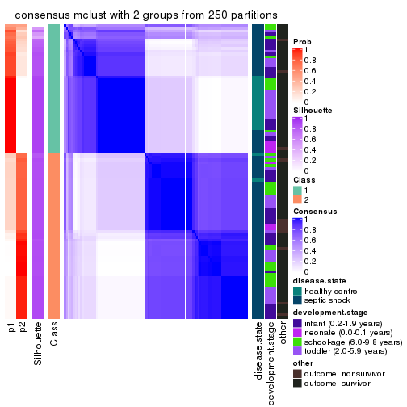</p>

</div>
<div id='tab-ATC-mclust-consensus-heatmap-2'>
<pre><code class="r">consensus_heatmap(res, k = 3)
</code></pre>

<p>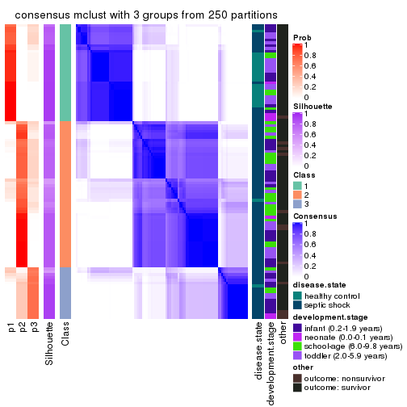</p>

</div>
<div id='tab-ATC-mclust-consensus-heatmap-3'>
<pre><code class="r">consensus_heatmap(res, k = 4)
</code></pre>

<p>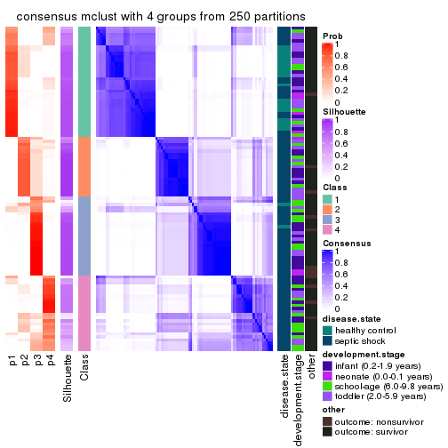</p>

</div>
<div id='tab-ATC-mclust-consensus-heatmap-4'>
<pre><code class="r">consensus_heatmap(res, k = 5)
</code></pre>

<p>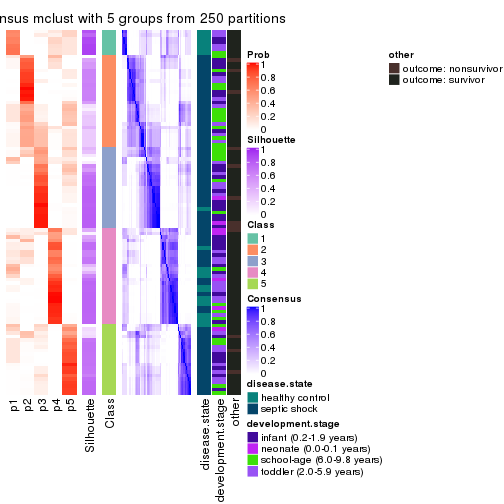</p>

</div>
<div id='tab-ATC-mclust-consensus-heatmap-5'>
<pre><code class="r">consensus_heatmap(res, k = 6)
</code></pre>

<p>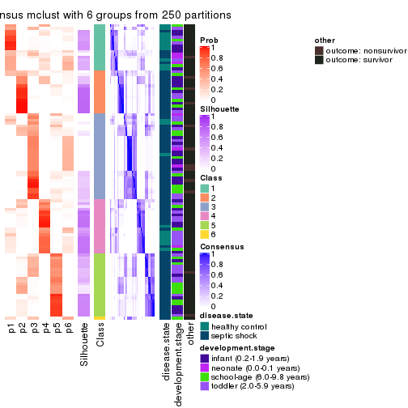</p>

</div>
</div>

Heatmaps for the membership of samples in all partitions to see how consistent they are:


<script>
$( function() {
	$( '#tabs-ATC-mclust-membership-heatmap' ).tabs();
} );
</script>
<div id='tabs-ATC-mclust-membership-heatmap'>
<ul>
<li><a href='#tab-ATC-mclust-membership-heatmap-1'>k = 2</a></li>
<li><a href='#tab-ATC-mclust-membership-heatmap-2'>k = 3</a></li>
<li><a href='#tab-ATC-mclust-membership-heatmap-3'>k = 4</a></li>
<li><a href='#tab-ATC-mclust-membership-heatmap-4'>k = 5</a></li>
<li><a href='#tab-ATC-mclust-membership-heatmap-5'>k = 6</a></li>
</ul>
<div id='tab-ATC-mclust-membership-heatmap-1'>
<pre><code class="r">membership_heatmap(res, k = 2)
</code></pre>

<p>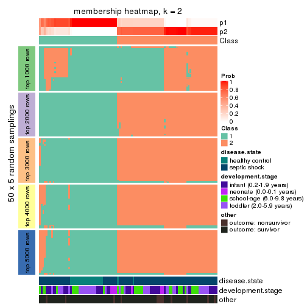</p>

</div>
<div id='tab-ATC-mclust-membership-heatmap-2'>
<pre><code class="r">membership_heatmap(res, k = 3)
</code></pre>

<p>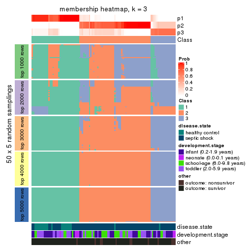</p>

</div>
<div id='tab-ATC-mclust-membership-heatmap-3'>
<pre><code class="r">membership_heatmap(res, k = 4)
</code></pre>

<p>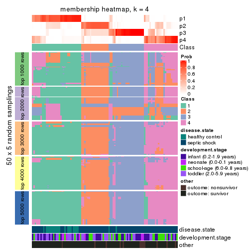</p>

</div>
<div id='tab-ATC-mclust-membership-heatmap-4'>
<pre><code class="r">membership_heatmap(res, k = 5)
</code></pre>

<p>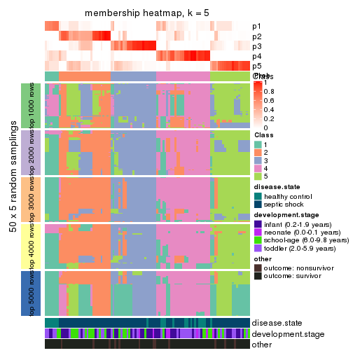</p>

</div>
<div id='tab-ATC-mclust-membership-heatmap-5'>
<pre><code class="r">membership_heatmap(res, k = 6)
</code></pre>

<p>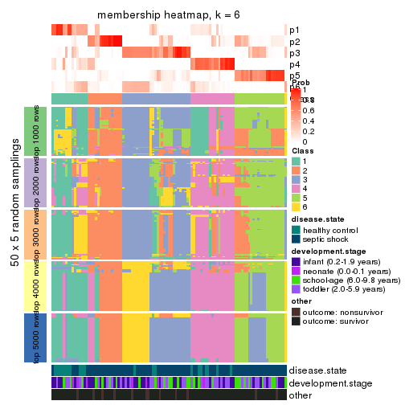</p>

</div>
</div>

As soon as we have had the classes for columns, we can look for signatures
which are significantly different between classes which can be candidate marks
for certain classes. Following are the heatmaps for signatures.


Signature heatmaps where rows are scaled:


<script>
$( function() {
	$( '#tabs-ATC-mclust-get-signatures' ).tabs();
} );
</script>
<div id='tabs-ATC-mclust-get-signatures'>
<ul>
<li><a href='#tab-ATC-mclust-get-signatures-1'>k = 2</a></li>
<li><a href='#tab-ATC-mclust-get-signatures-2'>k = 3</a></li>
<li><a href='#tab-ATC-mclust-get-signatures-3'>k = 4</a></li>
<li><a href='#tab-ATC-mclust-get-signatures-4'>k = 5</a></li>
<li><a href='#tab-ATC-mclust-get-signatures-5'>k = 6</a></li>
</ul>
<div id='tab-ATC-mclust-get-signatures-1'>
<pre><code class="r">get_signatures(res, k = 2)
</code></pre>

<p>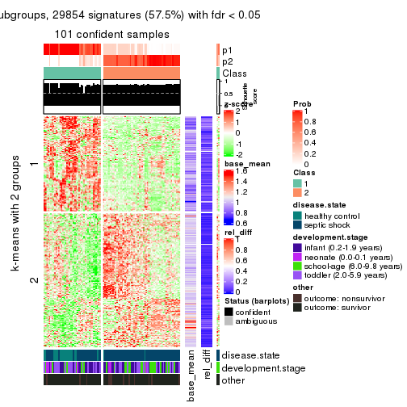</p>

</div>
<div id='tab-ATC-mclust-get-signatures-2'>
<pre><code class="r">get_signatures(res, k = 3)
</code></pre>

<p>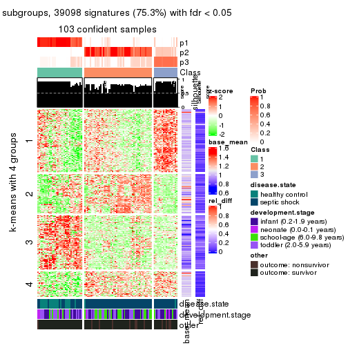</p>

</div>
<div id='tab-ATC-mclust-get-signatures-3'>
<pre><code class="r">get_signatures(res, k = 4)
</code></pre>

<p>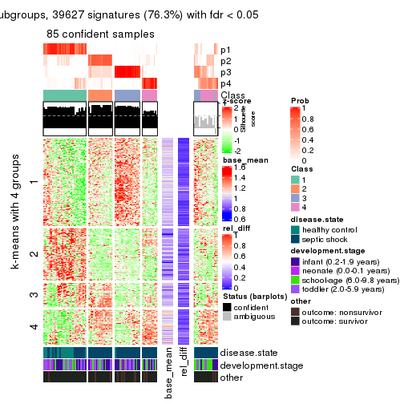</p>

</div>
<div id='tab-ATC-mclust-get-signatures-4'>
<pre><code class="r">get_signatures(res, k = 5)
</code></pre>

<p>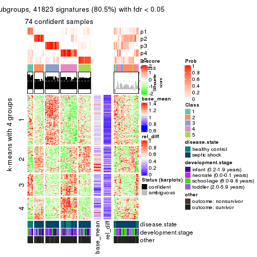</p>

</div>
<div id='tab-ATC-mclust-get-signatures-5'>
<pre><code class="r">get_signatures(res, k = 6)
</code></pre>

<p>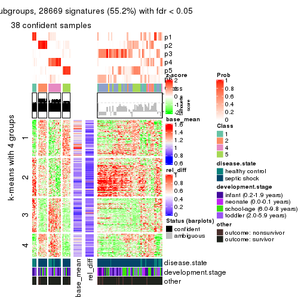</p>

</div>
</div>


Signature heatmaps where rows are not scaled:


<script>
$( function() {
	$( '#tabs-ATC-mclust-get-signatures-no-scale' ).tabs();
} );
</script>
<div id='tabs-ATC-mclust-get-signatures-no-scale'>
<ul>
<li><a href='#tab-ATC-mclust-get-signatures-no-scale-1'>k = 2</a></li>
<li><a href='#tab-ATC-mclust-get-signatures-no-scale-2'>k = 3</a></li>
<li><a href='#tab-ATC-mclust-get-signatures-no-scale-3'>k = 4</a></li>
<li><a href='#tab-ATC-mclust-get-signatures-no-scale-4'>k = 5</a></li>
<li><a href='#tab-ATC-mclust-get-signatures-no-scale-5'>k = 6</a></li>
</ul>
<div id='tab-ATC-mclust-get-signatures-no-scale-1'>
<pre><code class="r">get_signatures(res, k = 2, scale_rows = FALSE)
</code></pre>

<p>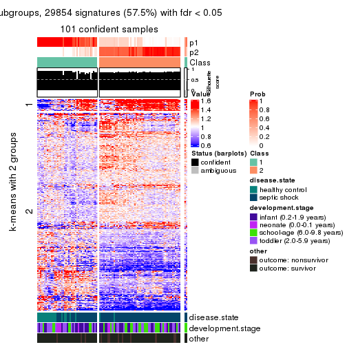</p>

</div>
<div id='tab-ATC-mclust-get-signatures-no-scale-2'>
<pre><code class="r">get_signatures(res, k = 3, scale_rows = FALSE)
</code></pre>

<pre><code>#&gt; Error in mat[ceiling(1:nr/h_ratio), ceiling(1:nc/w_ratio), drop = FALSE]: subscript out of bounds
</code></pre>

<p>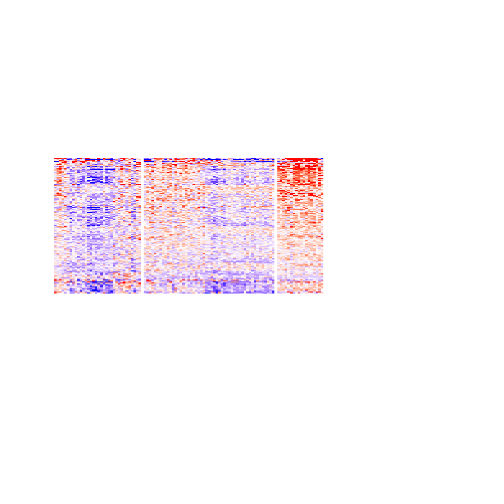</p>

</div>
<div id='tab-ATC-mclust-get-signatures-no-scale-3'>
<pre><code class="r">get_signatures(res, k = 4, scale_rows = FALSE)
</code></pre>

<p>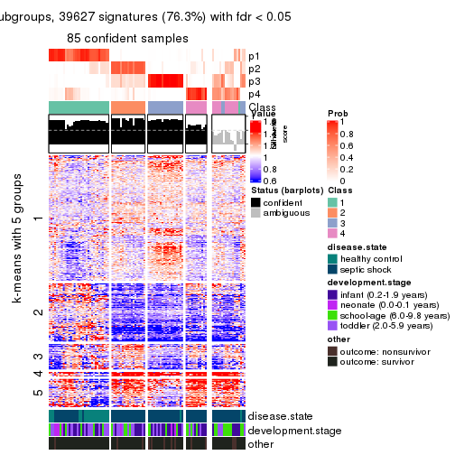</p>

</div>
<div id='tab-ATC-mclust-get-signatures-no-scale-4'>
<pre><code class="r">get_signatures(res, k = 5, scale_rows = FALSE)
</code></pre>

<p>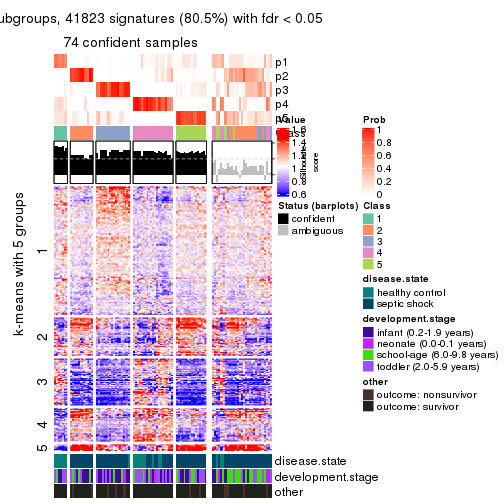</p>

</div>
<div id='tab-ATC-mclust-get-signatures-no-scale-5'>
<pre><code class="r">get_signatures(res, k = 6, scale_rows = FALSE)
</code></pre>

<p>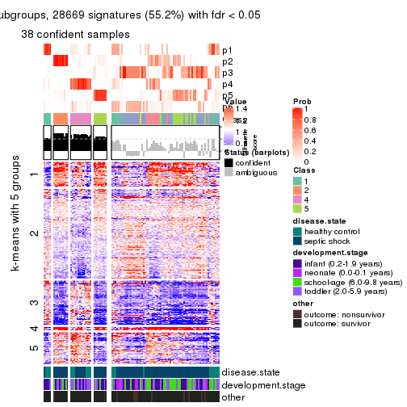</p>

</div>
</div>


Compare the overlap of signatures from different k:

```r
compare_signatures(res)
```

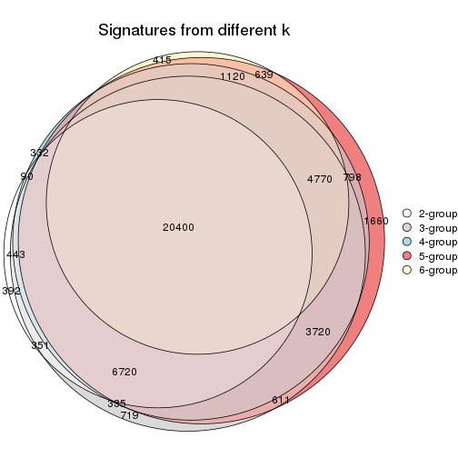

`get_signature()` returns a data frame invisibly. TO get the list of signatures, the function
call should be assigned to a variable explicitly. In following code, if `plot` argument is set
to `FALSE`, no heatmap is plotted while only the differential analysis is performed.

```r
# code only for demonstration
tb = get_signature(res, k = ..., plot = FALSE)
```

An example of the output of `tb` is:

```
#>   which_row         fdr    mean_1    mean_2 scaled_mean_1 scaled_mean_2 km
#> 1        38 0.042760348  8.373488  9.131774    -0.5533452     0.5164555  1
#> 2        40 0.018707592  7.106213  8.469186    -0.6173731     0.5762149  1
#> 3        55 0.019134737 10.221463 11.207825    -0.6159697     0.5749050  1
#> 4        59 0.006059896  5.921854  7.869574    -0.6899429     0.6439467  1
#> 5        60 0.018055526  8.928898 10.211722    -0.6204761     0.5791110  1
#> 6        98 0.009384629 15.714769 14.887706     0.6635654    -0.6193277  2
...
```

The columns in `tb` are:

1. `which_row`: row indices corresponding to the input matrix.
2. `fdr`: FDR for the differential test. 
3. `mean_x`: The mean value in group x.
4. `scaled_mean_x`: The mean value in group x after rows are scaled.
5. `km`: Row groups if k-means clustering is applied to rows.


UMAP plot which shows how samples are separated.


<script>
$( function() {
	$( '#tabs-ATC-mclust-dimension-reduction' ).tabs();
} );
</script>
<div id='tabs-ATC-mclust-dimension-reduction'>
<ul>
<li><a href='#tab-ATC-mclust-dimension-reduction-1'>k = 2</a></li>
<li><a href='#tab-ATC-mclust-dimension-reduction-2'>k = 3</a></li>
<li><a href='#tab-ATC-mclust-dimension-reduction-3'>k = 4</a></li>
<li><a href='#tab-ATC-mclust-dimension-reduction-4'>k = 5</a></li>
<li><a href='#tab-ATC-mclust-dimension-reduction-5'>k = 6</a></li>
</ul>
<div id='tab-ATC-mclust-dimension-reduction-1'>
<pre><code class="r">dimension_reduction(res, k = 2, method = &quot;UMAP&quot;)
</code></pre>

<p>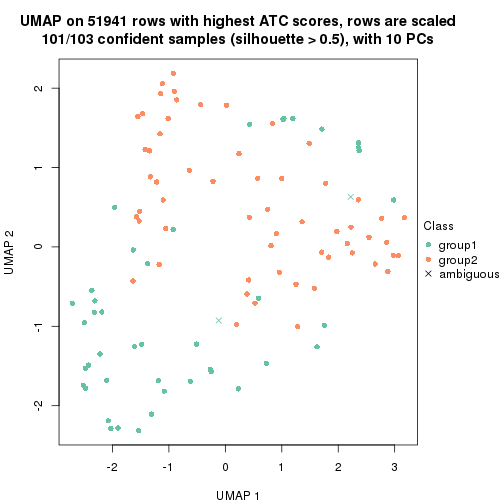</p>

</div>
<div id='tab-ATC-mclust-dimension-reduction-2'>
<pre><code class="r">dimension_reduction(res, k = 3, method = &quot;UMAP&quot;)
</code></pre>

<p>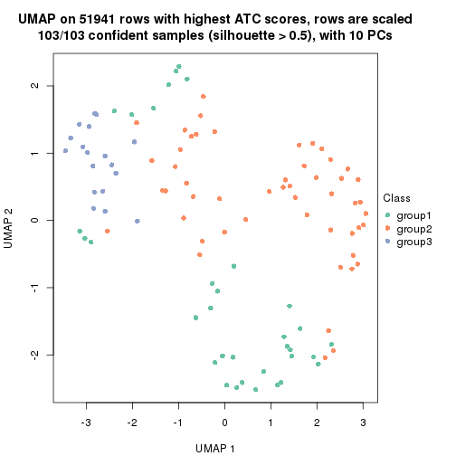</p>

</div>
<div id='tab-ATC-mclust-dimension-reduction-3'>
<pre><code class="r">dimension_reduction(res, k = 4, method = &quot;UMAP&quot;)
</code></pre>

<p>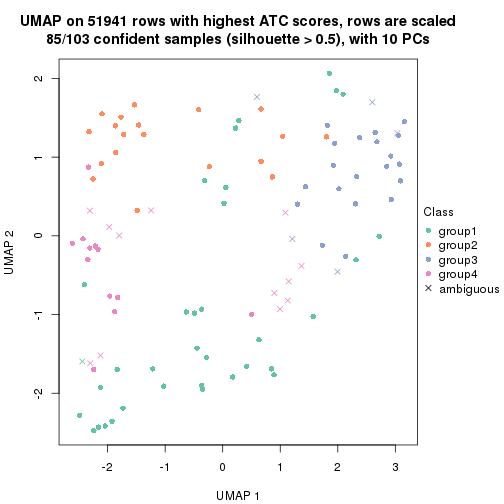</p>

</div>
<div id='tab-ATC-mclust-dimension-reduction-4'>
<pre><code class="r">dimension_reduction(res, k = 5, method = &quot;UMAP&quot;)
</code></pre>

<p>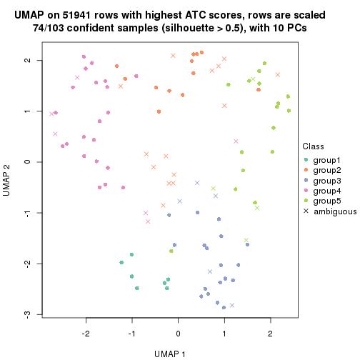</p>

</div>
<div id='tab-ATC-mclust-dimension-reduction-5'>
<pre><code class="r">dimension_reduction(res, k = 6, method = &quot;UMAP&quot;)
</code></pre>

<p>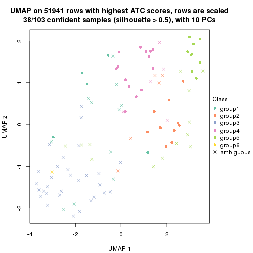</p>

</div>
</div>


Following heatmap shows how subgroups are split when increasing `k`:

```r
collect_classes(res)
```

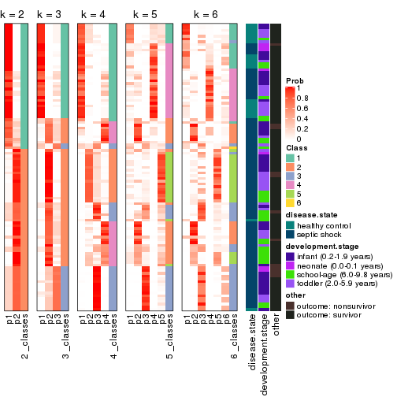


Test correlation between subgroups and known annotations. If the known
annotation is numeric, one-way ANOVA test is applied, and if the known
annotation is discrete, chi-squared contingency table test is applied.

```r
test_to_known_factors(res)
```

```
#>              n disease.state(p) development.stage(p) other(p) k
#> ATC:mclust 101         2.13e-06               0.3473   0.3170 2
#> ATC:mclust 103         2.65e-09               0.0837   0.0967 3
#> ATC:mclust  85         3.02e-07               0.6551   0.1009 4
#> ATC:mclust  74         3.56e-08               0.5827   0.1779 5
#> ATC:mclust  38         6.76e-04               0.4448   0.2872 6
```


If matrix rows can be associated to genes, consider to use `functional_enrichment(res,
...)` to perform function enrichment for the signature genes. See [this vignette](http://bioconductor.org/packages/devel/bioc/vignettes/cola/inst/doc/functional_enrichment.html) for more detailed explanations.


 

---------------------------------------------------


### ATC:NMF


The object with results only for a single top-value method and a single partition method 
can be extracted as:

```r
res = res_list["ATC", "NMF"]
# you can also extract it by
# res = res_list["ATC:NMF"]
```

A summary of `res` and all the functions that can be applied to it:

```r
res
```

```
#> A 'ConsensusPartition' object with k = 2, 3, 4, 5, 6.
#>   On a matrix with 51941 rows and 103 columns.
#>   Top rows (1000, 2000, 3000, 4000, 5000) are extracted by 'ATC' method.
#>   Subgroups are detected by 'NMF' method.
#>   Performed in total 1250 partitions by row resampling.
#>   Best k for subgroups seems to be 2.
#> 
#> Following methods can be applied to this 'ConsensusPartition' object:
#>  [1] "cola_report"             "collect_classes"         "collect_plots"          
#>  [4] "collect_stats"           "colnames"                "compare_signatures"     
#>  [7] "consensus_heatmap"       "dimension_reduction"     "functional_enrichment"  
#> [10] "get_anno_col"            "get_anno"                "get_classes"            
#> [13] "get_consensus"           "get_matrix"              "get_membership"         
#> [16] "get_param"               "get_signatures"          "get_stats"              
#> [19] "is_best_k"               "is_stable_k"             "membership_heatmap"     
#> [22] "ncol"                    "nrow"                    "plot_ecdf"              
#> [25] "rownames"                "select_partition_number" "show"                   
#> [28] "suggest_best_k"          "test_to_known_factors"
```

`collect_plots()` function collects all the plots made from `res` for all `k` (number of partitions)
into one single page to provide an easy and fast comparison between different `k`.

```r
collect_plots(res)
```

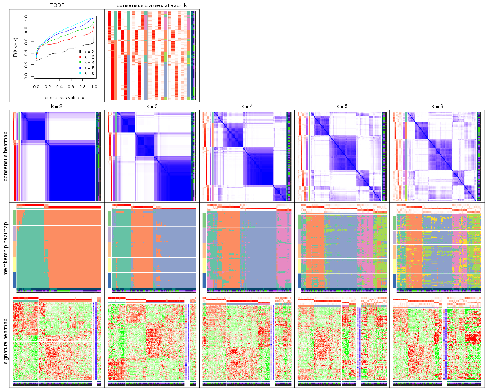

The plots are:

- The first row: a plot of the ECDF (empirical cumulative distribution
  function) curves of the consensus matrix for each `k` and the heatmap of
  predicted classes for each `k`.
- The second row: heatmaps of the consensus matrix for each `k`.
- The third row: heatmaps of the membership matrix for each `k`.
- The fouth row: heatmaps of the signatures for each `k`.

All the plots in panels can be made by individual functions and they are
plotted later in this section.

`select_partition_number()` produces several plots showing different
statistics for choosing "optimized" `k`. There are following statistics:

- ECDF curves of the consensus matrix for each `k`;
- 1-PAC. [The PAC
  score](https://en.wikipedia.org/wiki/Consensus_clustering#Over-interpretation_potential_of_consensus_clustering)
  measures the proportion of the ambiguous subgrouping.
- Mean silhouette score.
- Concordance. The mean probability of fiting the consensus class ids in all
  partitions.
- Area increased. Denote $A_k$ as the area under the ECDF curve for current
  `k`, the area increased is defined as $A_k - A_{k-1}$.
- Rand index. The percent of pairs of samples that are both in a same cluster
  or both are not in a same cluster in the partition of k and k-1.
- Jaccard index. The ratio of pairs of samples are both in a same cluster in
  the partition of k and k-1 and the pairs of samples are both in a same
  cluster in the partition k or k-1.

The detailed explanations of these statistics can be found in [the _cola_
vignette](http://bioconductor.org/packages/devel/bioc/vignettes/cola/inst/doc/cola.html#toc_13).

Generally speaking, lower PAC score, higher mean silhouette score or higher
concordance corresponds to better partition. Rand index and Jaccard index
measure how similar the current partition is compared to partition with `k-1`.
If they are too similar, we won't accept `k` is better than `k-1`.

```r
select_partition_number(res)
```

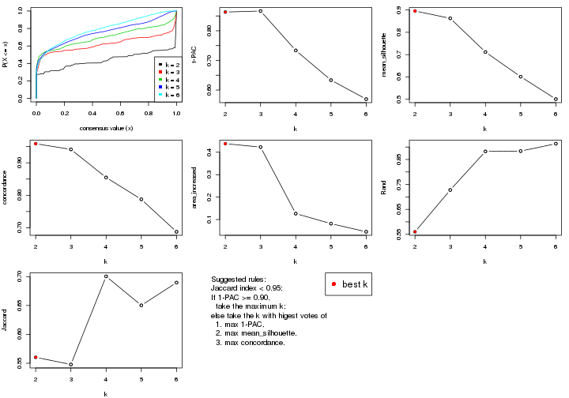

The numeric values for all these statistics can be obtained by `get_stats()`.

```r
get_stats(res)
```

```
#>   k 1-PAC mean_silhouette concordance area_increased  Rand Jaccard
#> 2 2 0.863           0.895       0.959         0.4380 0.560   0.560
#> 3 3 0.867           0.863       0.941         0.4229 0.728   0.548
#> 4 4 0.734           0.712       0.855         0.1265 0.882   0.700
#> 5 5 0.633           0.601       0.787         0.0818 0.884   0.650
#> 6 6 0.569           0.501       0.688         0.0455 0.913   0.690
```

`suggest_best_k()` suggests the best $k$ based on these statistics. The rules are as follows:

- All $k$ with Jaccard index larger than 0.95 are removed because increasing
  $k$ does not provide enough extra information. If all $k$ are removed, it is
  marked as no subgroup is detected.
- For all $k$ with 1-PAC score larger than 0.9, the maximal $k$ is taken as
  the best $k$, and other $k$ are marked as optional $k$.
- If it does not fit the second rule. The $k$ with the maximal vote of the
  highest 1-PAC score, highest mean silhouette, and highest concordance is
  taken as the best $k$.

```r
suggest_best_k(res)
```

```
#> [1] 2
```


Following shows the table of the partitions (You need to click the **show/hide
code output** link to see it). The membership matrix (columns with name `p*`)
is inferred by
[`clue::cl_consensus()`](https://www.rdocumentation.org/link/cl_consensus?package=clue)
function with the `SE` method. Basically the value in the membership matrix
represents the probability to belong to a certain group. The finall class
label for an item is determined with the group with highest probability it
belongs to.

In `get_classes()` function, the entropy is calculated from the membership
matrix and the silhouette score is calculated from the consensus matrix.


<script>
$( function() {
	$( '#tabs-ATC-NMF-get-classes' ).tabs();
} );
</script>
<div id='tabs-ATC-NMF-get-classes'>
<ul>
<li><a href='#tab-ATC-NMF-get-classes-1'>k = 2</a></li>
<li><a href='#tab-ATC-NMF-get-classes-2'>k = 3</a></li>
<li><a href='#tab-ATC-NMF-get-classes-3'>k = 4</a></li>
<li><a href='#tab-ATC-NMF-get-classes-4'>k = 5</a></li>
<li><a href='#tab-ATC-NMF-get-classes-5'>k = 6</a></li>
</ul>

<div id='tab-ATC-NMF-get-classes-1'>
<p><a id='tab-ATC-NMF-get-classes-1-a' style='color:#0366d6' href='#'>show/hide code output</a></p>
<pre><code class="r">cbind(get_classes(res, k = 2), get_membership(res, k = 2))
</code></pre>

<pre><code>#&gt;           class entropy silhouette    p1    p2
#&gt; GSM647569     2  0.0000     0.9633 0.000 1.000
#&gt; GSM647574     2  0.0000     0.9633 0.000 1.000
#&gt; GSM647577     2  0.0000     0.9633 0.000 1.000
#&gt; GSM647547     2  0.9996    -0.0362 0.488 0.512
#&gt; GSM647552     2  0.0000     0.9633 0.000 1.000
#&gt; GSM647553     2  0.0000     0.9633 0.000 1.000
#&gt; GSM647565     1  0.0000     0.9351 1.000 0.000
#&gt; GSM647545     1  0.6438     0.8142 0.836 0.164
#&gt; GSM647549     1  0.0000     0.9351 1.000 0.000
#&gt; GSM647550     2  0.0000     0.9633 0.000 1.000
#&gt; GSM647560     2  0.0000     0.9633 0.000 1.000
#&gt; GSM647617     2  0.0000     0.9633 0.000 1.000
#&gt; GSM647528     2  0.9286     0.4329 0.344 0.656
#&gt; GSM647529     1  0.0000     0.9351 1.000 0.000
#&gt; GSM647531     1  0.0000     0.9351 1.000 0.000
#&gt; GSM647540     2  0.0000     0.9633 0.000 1.000
#&gt; GSM647541     2  0.0000     0.9633 0.000 1.000
#&gt; GSM647546     2  0.0000     0.9633 0.000 1.000
#&gt; GSM647557     1  0.0000     0.9351 1.000 0.000
#&gt; GSM647561     1  0.0000     0.9351 1.000 0.000
#&gt; GSM647567     2  0.9963     0.0609 0.464 0.536
#&gt; GSM647568     2  0.0000     0.9633 0.000 1.000
#&gt; GSM647570     1  0.7376     0.7637 0.792 0.208
#&gt; GSM647573     1  0.0000     0.9351 1.000 0.000
#&gt; GSM647576     2  0.0000     0.9633 0.000 1.000
#&gt; GSM647579     2  0.0000     0.9633 0.000 1.000
#&gt; GSM647580     2  0.0000     0.9633 0.000 1.000
#&gt; GSM647583     2  0.0000     0.9633 0.000 1.000
#&gt; GSM647592     2  0.0000     0.9633 0.000 1.000
#&gt; GSM647593     2  0.0000     0.9633 0.000 1.000
#&gt; GSM647595     2  0.0000     0.9633 0.000 1.000
#&gt; GSM647597     1  0.0000     0.9351 1.000 0.000
#&gt; GSM647598     2  0.6623     0.7595 0.172 0.828
#&gt; GSM647613     1  0.0000     0.9351 1.000 0.000
#&gt; GSM647615     2  0.0000     0.9633 0.000 1.000
#&gt; GSM647616     2  0.0000     0.9633 0.000 1.000
#&gt; GSM647619     2  0.0000     0.9633 0.000 1.000
#&gt; GSM647582     2  0.0000     0.9633 0.000 1.000
#&gt; GSM647591     2  0.0000     0.9633 0.000 1.000
#&gt; GSM647527     1  0.9970     0.1657 0.532 0.468
#&gt; GSM647530     1  0.0000     0.9351 1.000 0.000
#&gt; GSM647532     1  0.0000     0.9351 1.000 0.000
#&gt; GSM647544     1  0.7139     0.7792 0.804 0.196
#&gt; GSM647551     2  0.0000     0.9633 0.000 1.000
#&gt; GSM647556     2  0.0000     0.9633 0.000 1.000
#&gt; GSM647558     2  0.9993    -0.0199 0.484 0.516
#&gt; GSM647572     2  0.0000     0.9633 0.000 1.000
#&gt; GSM647578     2  0.0000     0.9633 0.000 1.000
#&gt; GSM647581     1  0.0000     0.9351 1.000 0.000
#&gt; GSM647594     1  0.0000     0.9351 1.000 0.000
#&gt; GSM647599     2  0.0000     0.9633 0.000 1.000
#&gt; GSM647600     2  0.0000     0.9633 0.000 1.000
#&gt; GSM647601     2  0.0000     0.9633 0.000 1.000
#&gt; GSM647603     2  0.0000     0.9633 0.000 1.000
#&gt; GSM647610     2  0.0000     0.9633 0.000 1.000
#&gt; GSM647611     2  0.0000     0.9633 0.000 1.000
#&gt; GSM647612     2  0.0000     0.9633 0.000 1.000
#&gt; GSM647614     2  0.0000     0.9633 0.000 1.000
#&gt; GSM647618     2  0.0000     0.9633 0.000 1.000
#&gt; GSM647629     2  0.0000     0.9633 0.000 1.000
#&gt; GSM647535     2  0.0000     0.9633 0.000 1.000
#&gt; GSM647563     2  0.0376     0.9596 0.004 0.996
#&gt; GSM647542     2  0.0000     0.9633 0.000 1.000
#&gt; GSM647543     2  0.0000     0.9633 0.000 1.000
#&gt; GSM647548     1  0.0000     0.9351 1.000 0.000
#&gt; GSM647554     2  0.0000     0.9633 0.000 1.000
#&gt; GSM647555     2  0.0000     0.9633 0.000 1.000
#&gt; GSM647559     2  0.0000     0.9633 0.000 1.000
#&gt; GSM647562     1  0.0000     0.9351 1.000 0.000
#&gt; GSM647564     2  0.0000     0.9633 0.000 1.000
#&gt; GSM647571     2  0.0000     0.9633 0.000 1.000
#&gt; GSM647584     2  0.0000     0.9633 0.000 1.000
#&gt; GSM647585     2  0.0000     0.9633 0.000 1.000
#&gt; GSM647586     2  0.0000     0.9633 0.000 1.000
#&gt; GSM647587     1  0.2948     0.9070 0.948 0.052
#&gt; GSM647588     2  0.0000     0.9633 0.000 1.000
#&gt; GSM647596     1  0.7056     0.7840 0.808 0.192
#&gt; GSM647602     2  0.0000     0.9633 0.000 1.000
#&gt; GSM647609     2  0.0000     0.9633 0.000 1.000
#&gt; GSM647620     2  0.0000     0.9633 0.000 1.000
#&gt; GSM647627     2  0.0000     0.9633 0.000 1.000
#&gt; GSM647628     2  0.8861     0.5250 0.304 0.696
#&gt; GSM647533     2  0.0000     0.9633 0.000 1.000
#&gt; GSM647536     1  0.0000     0.9351 1.000 0.000
#&gt; GSM647537     2  0.0000     0.9633 0.000 1.000
#&gt; GSM647606     1  0.2948     0.9070 0.948 0.052
#&gt; GSM647621     1  0.8443     0.6650 0.728 0.272
#&gt; GSM647626     2  0.0000     0.9633 0.000 1.000
#&gt; GSM647538     2  0.0000     0.9633 0.000 1.000
#&gt; GSM647575     1  0.0000     0.9351 1.000 0.000
#&gt; GSM647590     1  0.0000     0.9351 1.000 0.000
#&gt; GSM647605     1  0.0000     0.9351 1.000 0.000
#&gt; GSM647607     1  0.0000     0.9351 1.000 0.000
#&gt; GSM647608     1  0.4562     0.8750 0.904 0.096
#&gt; GSM647622     2  0.0000     0.9633 0.000 1.000
#&gt; GSM647623     2  0.0000     0.9633 0.000 1.000
#&gt; GSM647624     1  0.0000     0.9351 1.000 0.000
#&gt; GSM647625     2  0.0000     0.9633 0.000 1.000
#&gt; GSM647534     2  0.0000     0.9633 0.000 1.000
#&gt; GSM647539     1  0.0000     0.9351 1.000 0.000
#&gt; GSM647566     2  0.1843     0.9361 0.028 0.972
#&gt; GSM647589     1  0.8016     0.7117 0.756 0.244
#&gt; GSM647604     1  0.0000     0.9351 1.000 0.000
</code></pre>

<script>
$('#tab-ATC-NMF-get-classes-1-a').parent().next().next().hide();
$('#tab-ATC-NMF-get-classes-1-a').click(function(){
  $('#tab-ATC-NMF-get-classes-1-a').parent().next().next().toggle();
  return(false);
});
</script>
</div>

<div id='tab-ATC-NMF-get-classes-2'>
<p><a id='tab-ATC-NMF-get-classes-2-a' style='color:#0366d6' href='#'>show/hide code output</a></p>
<pre><code class="r">cbind(get_classes(res, k = 3), get_membership(res, k = 3))
</code></pre>

<pre><code>#&gt;           class entropy silhouette    p1    p2    p3
#&gt; GSM647569     3  0.0000      0.942 0.000 0.000 1.000
#&gt; GSM647574     3  0.0000      0.942 0.000 0.000 1.000
#&gt; GSM647577     3  0.0000      0.942 0.000 0.000 1.000
#&gt; GSM647547     1  0.6295      0.169 0.528 0.000 0.472
#&gt; GSM647552     3  0.0000      0.942 0.000 0.000 1.000
#&gt; GSM647553     3  0.0237      0.939 0.004 0.000 0.996
#&gt; GSM647565     1  0.0000      0.899 1.000 0.000 0.000
#&gt; GSM647545     2  0.0237      0.935 0.000 0.996 0.004
#&gt; GSM647549     2  0.0000      0.932 0.000 1.000 0.000
#&gt; GSM647550     3  0.0892      0.932 0.000 0.020 0.980
#&gt; GSM647560     3  0.0000      0.942 0.000 0.000 1.000
#&gt; GSM647617     3  0.0000      0.942 0.000 0.000 1.000
#&gt; GSM647528     2  0.0892      0.940 0.000 0.980 0.020
#&gt; GSM647529     1  0.1031      0.896 0.976 0.024 0.000
#&gt; GSM647531     1  0.2448      0.859 0.924 0.076 0.000
#&gt; GSM647540     3  0.0000      0.942 0.000 0.000 1.000
#&gt; GSM647541     3  0.1289      0.924 0.000 0.032 0.968
#&gt; GSM647546     3  0.0000      0.942 0.000 0.000 1.000
#&gt; GSM647557     2  0.3038      0.835 0.104 0.896 0.000
#&gt; GSM647561     2  0.0000      0.932 0.000 1.000 0.000
#&gt; GSM647567     1  0.6260      0.245 0.552 0.000 0.448
#&gt; GSM647568     3  0.0424      0.939 0.000 0.008 0.992
#&gt; GSM647570     2  0.0237      0.935 0.000 0.996 0.004
#&gt; GSM647573     1  0.0000      0.899 1.000 0.000 0.000
#&gt; GSM647576     3  0.0000      0.942 0.000 0.000 1.000
#&gt; GSM647579     3  0.0000      0.942 0.000 0.000 1.000
#&gt; GSM647580     3  0.0000      0.942 0.000 0.000 1.000
#&gt; GSM647583     3  0.0000      0.942 0.000 0.000 1.000
#&gt; GSM647592     3  0.1163      0.927 0.000 0.028 0.972
#&gt; GSM647593     2  0.6204      0.256 0.000 0.576 0.424
#&gt; GSM647595     2  0.2066      0.911 0.000 0.940 0.060
#&gt; GSM647597     1  0.0892      0.897 0.980 0.020 0.000
#&gt; GSM647598     2  0.0892      0.940 0.000 0.980 0.020
#&gt; GSM647613     2  0.0000      0.932 0.000 1.000 0.000
#&gt; GSM647615     3  0.0747      0.934 0.000 0.016 0.984
#&gt; GSM647616     3  0.0000      0.942 0.000 0.000 1.000
#&gt; GSM647619     3  0.2796      0.870 0.000 0.092 0.908
#&gt; GSM647582     3  0.0237      0.940 0.000 0.004 0.996
#&gt; GSM647591     2  0.1163      0.938 0.000 0.972 0.028
#&gt; GSM647527     2  0.0747      0.939 0.000 0.984 0.016
#&gt; GSM647530     1  0.1031      0.896 0.976 0.024 0.000
#&gt; GSM647532     1  0.1031      0.896 0.976 0.024 0.000
#&gt; GSM647544     2  0.0237      0.935 0.000 0.996 0.004
#&gt; GSM647551     3  0.0747      0.934 0.000 0.016 0.984
#&gt; GSM647556     3  0.0000      0.942 0.000 0.000 1.000
#&gt; GSM647558     2  0.0892      0.940 0.000 0.980 0.020
#&gt; GSM647572     3  0.0000      0.942 0.000 0.000 1.000
#&gt; GSM647578     3  0.0000      0.942 0.000 0.000 1.000
#&gt; GSM647581     1  0.5591      0.560 0.696 0.304 0.000
#&gt; GSM647594     1  0.1031      0.896 0.976 0.024 0.000
#&gt; GSM647599     3  0.0000      0.942 0.000 0.000 1.000
#&gt; GSM647600     3  0.0000      0.942 0.000 0.000 1.000
#&gt; GSM647601     2  0.1031      0.940 0.000 0.976 0.024
#&gt; GSM647603     3  0.0000      0.942 0.000 0.000 1.000
#&gt; GSM647610     3  0.0000      0.942 0.000 0.000 1.000
#&gt; GSM647611     3  0.6204      0.274 0.000 0.424 0.576
#&gt; GSM647612     3  0.4291      0.766 0.000 0.180 0.820
#&gt; GSM647614     3  0.5733      0.532 0.000 0.324 0.676
#&gt; GSM647618     2  0.1163      0.938 0.000 0.972 0.028
#&gt; GSM647629     3  0.0000      0.942 0.000 0.000 1.000
#&gt; GSM647535     3  0.0747      0.935 0.000 0.016 0.984
#&gt; GSM647563     2  0.1031      0.940 0.000 0.976 0.024
#&gt; GSM647542     3  0.6079      0.386 0.000 0.388 0.612
#&gt; GSM647543     3  0.6079      0.385 0.000 0.388 0.612
#&gt; GSM647548     1  0.1031      0.896 0.976 0.024 0.000
#&gt; GSM647554     3  0.0000      0.942 0.000 0.000 1.000
#&gt; GSM647555     3  0.0892      0.932 0.000 0.020 0.980
#&gt; GSM647559     2  0.1031      0.940 0.000 0.976 0.024
#&gt; GSM647562     2  0.0000      0.932 0.000 1.000 0.000
#&gt; GSM647564     3  0.0000      0.942 0.000 0.000 1.000
#&gt; GSM647571     3  0.0747      0.935 0.000 0.016 0.984
#&gt; GSM647584     2  0.5988      0.416 0.000 0.632 0.368
#&gt; GSM647585     3  0.0000      0.942 0.000 0.000 1.000
#&gt; GSM647586     2  0.1031      0.940 0.000 0.976 0.024
#&gt; GSM647587     2  0.0000      0.932 0.000 1.000 0.000
#&gt; GSM647588     2  0.1643      0.926 0.000 0.956 0.044
#&gt; GSM647596     2  0.0237      0.935 0.000 0.996 0.004
#&gt; GSM647602     3  0.0000      0.942 0.000 0.000 1.000
#&gt; GSM647609     2  0.2448      0.894 0.000 0.924 0.076
#&gt; GSM647620     3  0.6045      0.398 0.000 0.380 0.620
#&gt; GSM647627     2  0.1289      0.935 0.000 0.968 0.032
#&gt; GSM647628     2  0.0892      0.940 0.000 0.980 0.020
#&gt; GSM647533     3  0.2878      0.853 0.096 0.000 0.904
#&gt; GSM647536     1  0.0892      0.897 0.980 0.020 0.000
#&gt; GSM647537     3  0.0424      0.936 0.008 0.000 0.992
#&gt; GSM647606     1  0.2537      0.847 0.920 0.000 0.080
#&gt; GSM647621     1  0.5254      0.650 0.736 0.000 0.264
#&gt; GSM647626     3  0.0000      0.942 0.000 0.000 1.000
#&gt; GSM647538     3  0.1860      0.899 0.052 0.000 0.948
#&gt; GSM647575     1  0.0000      0.899 1.000 0.000 0.000
#&gt; GSM647590     1  0.0000      0.899 1.000 0.000 0.000
#&gt; GSM647605     1  0.0000      0.899 1.000 0.000 0.000
#&gt; GSM647607     1  0.0000      0.899 1.000 0.000 0.000
#&gt; GSM647608     1  0.0747      0.892 0.984 0.000 0.016
#&gt; GSM647622     3  0.0424      0.936 0.008 0.000 0.992
#&gt; GSM647623     3  0.0000      0.942 0.000 0.000 1.000
#&gt; GSM647624     1  0.0000      0.899 1.000 0.000 0.000
#&gt; GSM647625     3  0.0000      0.942 0.000 0.000 1.000
#&gt; GSM647534     3  0.0000      0.942 0.000 0.000 1.000
#&gt; GSM647539     1  0.0000      0.899 1.000 0.000 0.000
#&gt; GSM647566     3  0.3752      0.793 0.144 0.000 0.856
#&gt; GSM647589     1  0.4346      0.752 0.816 0.000 0.184
#&gt; GSM647604     1  0.0000      0.899 1.000 0.000 0.000
</code></pre>

<script>
$('#tab-ATC-NMF-get-classes-2-a').parent().next().next().hide();
$('#tab-ATC-NMF-get-classes-2-a').click(function(){
  $('#tab-ATC-NMF-get-classes-2-a').parent().next().next().toggle();
  return(false);
});
</script>
</div>

<div id='tab-ATC-NMF-get-classes-3'>
<p><a id='tab-ATC-NMF-get-classes-3-a' style='color:#0366d6' href='#'>show/hide code output</a></p>
<pre><code class="r">cbind(get_classes(res, k = 4), get_membership(res, k = 4))
</code></pre>

<pre><code>#&gt;           class entropy silhouette    p1    p2    p3    p4
#&gt; GSM647569     3  0.0000     0.9168 0.000 0.000 1.000 0.000
#&gt; GSM647574     3  0.0000     0.9168 0.000 0.000 1.000 0.000
#&gt; GSM647577     3  0.0000     0.9168 0.000 0.000 1.000 0.000
#&gt; GSM647547     3  0.5389     0.4388 0.032 0.000 0.660 0.308
#&gt; GSM647552     1  0.5766     0.3051 0.564 0.032 0.404 0.000
#&gt; GSM647553     3  0.0000     0.9168 0.000 0.000 1.000 0.000
#&gt; GSM647565     4  0.1792     0.7724 0.068 0.000 0.000 0.932
#&gt; GSM647545     2  0.1211     0.8427 0.040 0.960 0.000 0.000
#&gt; GSM647549     2  0.0376     0.8473 0.004 0.992 0.000 0.004
#&gt; GSM647550     3  0.0937     0.9096 0.012 0.012 0.976 0.000
#&gt; GSM647560     3  0.0657     0.9131 0.012 0.004 0.984 0.000
#&gt; GSM647617     3  0.0000     0.9168 0.000 0.000 1.000 0.000
#&gt; GSM647528     2  0.0188     0.8475 0.004 0.996 0.000 0.000
#&gt; GSM647529     4  0.2530     0.7862 0.112 0.000 0.000 0.888
#&gt; GSM647531     4  0.2048     0.7893 0.064 0.008 0.000 0.928
#&gt; GSM647540     3  0.0000     0.9168 0.000 0.000 1.000 0.000
#&gt; GSM647541     3  0.0895     0.9058 0.004 0.020 0.976 0.000
#&gt; GSM647546     3  0.0592     0.9115 0.016 0.000 0.984 0.000
#&gt; GSM647557     2  0.4920     0.5248 0.368 0.628 0.000 0.004
#&gt; GSM647561     2  0.0672     0.8481 0.008 0.984 0.000 0.008
#&gt; GSM647567     1  0.7456     0.1937 0.460 0.000 0.180 0.360
#&gt; GSM647568     3  0.1706     0.8853 0.016 0.000 0.948 0.036
#&gt; GSM647570     2  0.1635     0.8359 0.044 0.948 0.000 0.008
#&gt; GSM647573     4  0.1022     0.7862 0.032 0.000 0.000 0.968
#&gt; GSM647576     3  0.0592     0.9115 0.016 0.000 0.984 0.000
#&gt; GSM647579     3  0.0188     0.9160 0.004 0.000 0.996 0.000
#&gt; GSM647580     3  0.0000     0.9168 0.000 0.000 1.000 0.000
#&gt; GSM647583     3  0.0000     0.9168 0.000 0.000 1.000 0.000
#&gt; GSM647592     1  0.7042     0.4615 0.572 0.188 0.240 0.000
#&gt; GSM647593     2  0.5498     0.4147 0.404 0.576 0.020 0.000
#&gt; GSM647595     2  0.5080     0.4170 0.420 0.576 0.004 0.000
#&gt; GSM647597     1  0.5028     0.1280 0.596 0.004 0.000 0.400
#&gt; GSM647598     2  0.1716     0.8348 0.064 0.936 0.000 0.000
#&gt; GSM647613     2  0.2363     0.8217 0.056 0.920 0.000 0.024
#&gt; GSM647615     3  0.1610     0.8855 0.032 0.016 0.952 0.000
#&gt; GSM647616     3  0.0000     0.9168 0.000 0.000 1.000 0.000
#&gt; GSM647619     1  0.7023     0.3471 0.564 0.272 0.164 0.000
#&gt; GSM647582     3  0.6355     0.2156 0.348 0.076 0.576 0.000
#&gt; GSM647591     2  0.4643     0.5585 0.344 0.656 0.000 0.000
#&gt; GSM647527     2  0.0336     0.8470 0.008 0.992 0.000 0.000
#&gt; GSM647530     4  0.1557     0.7864 0.056 0.000 0.000 0.944
#&gt; GSM647532     4  0.2760     0.7798 0.128 0.000 0.000 0.872
#&gt; GSM647544     2  0.3239     0.7969 0.068 0.880 0.000 0.052
#&gt; GSM647551     1  0.6098     0.5394 0.676 0.124 0.200 0.000
#&gt; GSM647556     3  0.0000     0.9168 0.000 0.000 1.000 0.000
#&gt; GSM647558     2  0.1545     0.8372 0.040 0.952 0.000 0.008
#&gt; GSM647572     3  0.0000     0.9168 0.000 0.000 1.000 0.000
#&gt; GSM647578     3  0.0000     0.9168 0.000 0.000 1.000 0.000
#&gt; GSM647581     4  0.6133     0.4131 0.088 0.268 0.000 0.644
#&gt; GSM647594     4  0.2647     0.7831 0.120 0.000 0.000 0.880
#&gt; GSM647599     3  0.1022     0.9023 0.032 0.000 0.968 0.000
#&gt; GSM647600     3  0.0188     0.9160 0.004 0.000 0.996 0.000
#&gt; GSM647601     2  0.2216     0.8214 0.092 0.908 0.000 0.000
#&gt; GSM647603     3  0.0188     0.9160 0.004 0.000 0.996 0.000
#&gt; GSM647610     3  0.0336     0.9142 0.008 0.000 0.992 0.000
#&gt; GSM647611     2  0.6574     0.1545 0.084 0.532 0.384 0.000
#&gt; GSM647612     3  0.0336     0.9140 0.000 0.008 0.992 0.000
#&gt; GSM647614     3  0.2558     0.8601 0.008 0.036 0.920 0.036
#&gt; GSM647618     2  0.2589     0.8066 0.116 0.884 0.000 0.000
#&gt; GSM647629     3  0.0188     0.9157 0.000 0.004 0.996 0.000
#&gt; GSM647535     3  0.0336     0.9141 0.000 0.008 0.992 0.000
#&gt; GSM647563     2  0.1854     0.8337 0.048 0.940 0.000 0.012
#&gt; GSM647542     3  0.0707     0.9044 0.000 0.000 0.980 0.020
#&gt; GSM647543     3  0.0657     0.9108 0.000 0.012 0.984 0.004
#&gt; GSM647548     4  0.1824     0.7513 0.060 0.004 0.000 0.936
#&gt; GSM647554     3  0.4595     0.6600 0.176 0.044 0.780 0.000
#&gt; GSM647555     3  0.0000     0.9168 0.000 0.000 1.000 0.000
#&gt; GSM647559     2  0.0336     0.8482 0.008 0.992 0.000 0.000
#&gt; GSM647562     2  0.1854     0.8343 0.048 0.940 0.000 0.012
#&gt; GSM647564     3  0.0000     0.9168 0.000 0.000 1.000 0.000
#&gt; GSM647571     3  0.0188     0.9157 0.000 0.004 0.996 0.000
#&gt; GSM647584     2  0.5069     0.5703 0.320 0.664 0.016 0.000
#&gt; GSM647585     3  0.0592     0.9115 0.016 0.000 0.984 0.000
#&gt; GSM647586     2  0.1302     0.8415 0.044 0.956 0.000 0.000
#&gt; GSM647587     2  0.0188     0.8478 0.004 0.996 0.000 0.000
#&gt; GSM647588     2  0.1724     0.8399 0.032 0.948 0.020 0.000
#&gt; GSM647596     2  0.3301     0.7946 0.076 0.876 0.000 0.048
#&gt; GSM647602     3  0.0000     0.9168 0.000 0.000 1.000 0.000
#&gt; GSM647609     2  0.2704     0.8012 0.124 0.876 0.000 0.000
#&gt; GSM647620     3  0.5546     0.4411 0.052 0.268 0.680 0.000
#&gt; GSM647627     2  0.0469     0.8472 0.012 0.988 0.000 0.000
#&gt; GSM647628     2  0.4313     0.7436 0.064 0.824 0.004 0.108
#&gt; GSM647533     1  0.5963     0.5265 0.688 0.000 0.196 0.116
#&gt; GSM647536     4  0.2647     0.7831 0.120 0.000 0.000 0.880
#&gt; GSM647537     3  0.5167    -0.1092 0.488 0.000 0.508 0.004
#&gt; GSM647606     1  0.5112    -0.0816 0.560 0.000 0.004 0.436
#&gt; GSM647621     4  0.5050     0.1349 0.004 0.000 0.408 0.588
#&gt; GSM647626     3  0.0000     0.9168 0.000 0.000 1.000 0.000
#&gt; GSM647538     1  0.3211     0.5436 0.892 0.012 0.040 0.056
#&gt; GSM647575     4  0.1022     0.7845 0.032 0.000 0.000 0.968
#&gt; GSM647590     1  0.4994    -0.2198 0.520 0.000 0.000 0.480
#&gt; GSM647605     4  0.3311     0.7603 0.172 0.000 0.000 0.828
#&gt; GSM647607     4  0.3172     0.7513 0.160 0.000 0.000 0.840
#&gt; GSM647608     4  0.3351     0.7764 0.148 0.000 0.008 0.844
#&gt; GSM647622     3  0.1940     0.8636 0.076 0.000 0.924 0.000
#&gt; GSM647623     3  0.4382     0.5349 0.296 0.000 0.704 0.000
#&gt; GSM647624     4  0.2647     0.7874 0.120 0.000 0.000 0.880
#&gt; GSM647625     1  0.4948     0.2416 0.560 0.000 0.440 0.000
#&gt; GSM647534     3  0.5040     0.3121 0.364 0.008 0.628 0.000
#&gt; GSM647539     4  0.3266     0.7135 0.168 0.000 0.000 0.832
#&gt; GSM647566     1  0.3468     0.5510 0.880 0.012 0.052 0.056
#&gt; GSM647589     4  0.4978     0.1833 0.004 0.000 0.384 0.612
#&gt; GSM647604     1  0.3486     0.4121 0.812 0.000 0.000 0.188
</code></pre>

<script>
$('#tab-ATC-NMF-get-classes-3-a').parent().next().next().hide();
$('#tab-ATC-NMF-get-classes-3-a').click(function(){
  $('#tab-ATC-NMF-get-classes-3-a').parent().next().next().toggle();
  return(false);
});
</script>
</div>

<div id='tab-ATC-NMF-get-classes-4'>
<p><a id='tab-ATC-NMF-get-classes-4-a' style='color:#0366d6' href='#'>show/hide code output</a></p>
<pre><code class="r">cbind(get_classes(res, k = 5), get_membership(res, k = 5))
</code></pre>

<pre><code>#&gt;           class entropy silhouette    p1    p2    p3    p4    p5
#&gt; GSM647569     3  0.1399     0.8463 0.020 0.000 0.952 0.000 0.028
#&gt; GSM647574     3  0.1012     0.8500 0.020 0.000 0.968 0.000 0.012
#&gt; GSM647577     3  0.0798     0.8490 0.008 0.000 0.976 0.000 0.016
#&gt; GSM647547     1  0.5844     0.3532 0.640 0.000 0.140 0.208 0.012
#&gt; GSM647552     5  0.4470     0.5843 0.036 0.012 0.208 0.000 0.744
#&gt; GSM647553     3  0.1628     0.8377 0.056 0.000 0.936 0.000 0.008
#&gt; GSM647565     1  0.4798     0.1078 0.512 0.004 0.000 0.472 0.012
#&gt; GSM647545     2  0.2068     0.8208 0.004 0.904 0.000 0.000 0.092
#&gt; GSM647549     2  0.5141     0.6924 0.036 0.736 0.000 0.152 0.076
#&gt; GSM647550     3  0.2573     0.8379 0.104 0.000 0.880 0.000 0.016
#&gt; GSM647560     3  0.3921     0.7798 0.072 0.000 0.800 0.000 0.128
#&gt; GSM647617     3  0.1168     0.8486 0.032 0.000 0.960 0.000 0.008
#&gt; GSM647528     2  0.0451     0.8539 0.008 0.988 0.000 0.000 0.004
#&gt; GSM647529     4  0.0794     0.6097 0.028 0.000 0.000 0.972 0.000
#&gt; GSM647531     4  0.2283     0.5917 0.036 0.040 0.000 0.916 0.008
#&gt; GSM647540     3  0.1216     0.8462 0.020 0.000 0.960 0.000 0.020
#&gt; GSM647541     3  0.3690     0.7964 0.052 0.008 0.828 0.000 0.112
#&gt; GSM647546     3  0.2677     0.8255 0.112 0.000 0.872 0.000 0.016
#&gt; GSM647557     5  0.6981     0.0837 0.032 0.396 0.000 0.148 0.424
#&gt; GSM647561     2  0.1854     0.8432 0.008 0.936 0.000 0.020 0.036
#&gt; GSM647567     4  0.6079     0.3564 0.108 0.000 0.136 0.676 0.080
#&gt; GSM647568     1  0.5935     0.1241 0.580 0.020 0.324 0.000 0.076
#&gt; GSM647570     2  0.2561     0.8228 0.144 0.856 0.000 0.000 0.000
#&gt; GSM647573     4  0.4173     0.3002 0.300 0.000 0.000 0.688 0.012
#&gt; GSM647576     3  0.4410     0.7583 0.112 0.000 0.764 0.000 0.124
#&gt; GSM647579     3  0.2409     0.8341 0.032 0.000 0.900 0.000 0.068
#&gt; GSM647580     3  0.0912     0.8507 0.012 0.000 0.972 0.000 0.016
#&gt; GSM647583     3  0.1211     0.8472 0.016 0.000 0.960 0.000 0.024
#&gt; GSM647592     5  0.5650     0.6219 0.068 0.100 0.120 0.000 0.712
#&gt; GSM647593     5  0.5071     0.5191 0.016 0.272 0.040 0.000 0.672
#&gt; GSM647595     5  0.4557     0.4292 0.012 0.324 0.008 0.000 0.656
#&gt; GSM647597     4  0.5336     0.3325 0.084 0.000 0.000 0.628 0.288
#&gt; GSM647598     2  0.2338     0.8016 0.004 0.884 0.000 0.000 0.112
#&gt; GSM647613     2  0.2122     0.8454 0.036 0.924 0.000 0.032 0.008
#&gt; GSM647615     3  0.5878     0.1665 0.068 0.012 0.504 0.000 0.416
#&gt; GSM647616     3  0.1282     0.8443 0.044 0.000 0.952 0.000 0.004
#&gt; GSM647619     5  0.4449     0.6241 0.020 0.140 0.060 0.000 0.780
#&gt; GSM647582     5  0.5704     0.5584 0.056 0.048 0.232 0.000 0.664
#&gt; GSM647591     5  0.4747     0.3366 0.008 0.376 0.012 0.000 0.604
#&gt; GSM647527     2  0.0162     0.8535 0.004 0.996 0.000 0.000 0.000
#&gt; GSM647530     4  0.1704     0.5892 0.068 0.000 0.000 0.928 0.004
#&gt; GSM647532     4  0.0404     0.6080 0.012 0.000 0.000 0.988 0.000
#&gt; GSM647544     2  0.2806     0.8112 0.152 0.844 0.000 0.000 0.004
#&gt; GSM647551     5  0.3651     0.6279 0.004 0.060 0.108 0.000 0.828
#&gt; GSM647556     3  0.1557     0.8356 0.052 0.000 0.940 0.000 0.008
#&gt; GSM647558     2  0.1831     0.8479 0.076 0.920 0.000 0.000 0.004
#&gt; GSM647572     3  0.2077     0.8304 0.084 0.000 0.908 0.000 0.008
#&gt; GSM647578     3  0.1197     0.8486 0.048 0.000 0.952 0.000 0.000
#&gt; GSM647581     4  0.5859     0.2467 0.144 0.220 0.000 0.628 0.008
#&gt; GSM647594     4  0.0671     0.6099 0.016 0.000 0.000 0.980 0.004
#&gt; GSM647599     3  0.5575     0.6293 0.212 0.000 0.640 0.000 0.148
#&gt; GSM647600     3  0.2735     0.8263 0.036 0.000 0.880 0.000 0.084
#&gt; GSM647601     2  0.2763     0.7649 0.004 0.848 0.000 0.000 0.148
#&gt; GSM647603     3  0.2491     0.8331 0.036 0.000 0.896 0.000 0.068
#&gt; GSM647610     3  0.1357     0.8463 0.048 0.000 0.948 0.000 0.004
#&gt; GSM647611     3  0.7684    -0.3032 0.052 0.256 0.356 0.000 0.336
#&gt; GSM647612     3  0.1774     0.8510 0.052 0.000 0.932 0.000 0.016
#&gt; GSM647614     3  0.6858     0.1113 0.412 0.064 0.444 0.000 0.080
#&gt; GSM647618     2  0.5034     0.3644 0.016 0.616 0.020 0.000 0.348
#&gt; GSM647629     3  0.1195     0.8469 0.028 0.000 0.960 0.000 0.012
#&gt; GSM647535     3  0.1648     0.8491 0.040 0.000 0.940 0.000 0.020
#&gt; GSM647563     2  0.2891     0.8019 0.176 0.824 0.000 0.000 0.000
#&gt; GSM647542     3  0.3466     0.8227 0.076 0.040 0.856 0.000 0.028
#&gt; GSM647543     3  0.4198     0.8052 0.068 0.044 0.816 0.000 0.072
#&gt; GSM647548     4  0.4470     0.1987 0.328 0.008 0.000 0.656 0.008
#&gt; GSM647554     3  0.2157     0.8404 0.036 0.004 0.920 0.000 0.040
#&gt; GSM647555     3  0.1168     0.8519 0.032 0.000 0.960 0.000 0.008
#&gt; GSM647559     2  0.1557     0.8543 0.052 0.940 0.000 0.000 0.008
#&gt; GSM647562     2  0.2976     0.8189 0.132 0.852 0.000 0.012 0.004
#&gt; GSM647564     3  0.2077     0.8327 0.084 0.000 0.908 0.000 0.008
#&gt; GSM647571     3  0.3297     0.8226 0.084 0.000 0.848 0.000 0.068
#&gt; GSM647584     5  0.5370     0.4918 0.024 0.296 0.040 0.000 0.640
#&gt; GSM647585     3  0.3339     0.8135 0.124 0.000 0.836 0.000 0.040
#&gt; GSM647586     2  0.1478     0.8350 0.000 0.936 0.000 0.000 0.064
#&gt; GSM647587     2  0.0880     0.8544 0.032 0.968 0.000 0.000 0.000
#&gt; GSM647588     2  0.2053     0.8296 0.004 0.924 0.048 0.000 0.024
#&gt; GSM647596     2  0.2136     0.8365 0.088 0.904 0.000 0.000 0.008
#&gt; GSM647602     3  0.0290     0.8497 0.008 0.000 0.992 0.000 0.000
#&gt; GSM647609     2  0.4959     0.4402 0.020 0.652 0.020 0.000 0.308
#&gt; GSM647620     3  0.6392     0.4903 0.052 0.200 0.624 0.000 0.124
#&gt; GSM647627     2  0.0968     0.8532 0.012 0.972 0.004 0.000 0.012
#&gt; GSM647628     2  0.4013     0.7380 0.224 0.756 0.008 0.008 0.004
#&gt; GSM647533     5  0.8175     0.0960 0.164 0.000 0.172 0.260 0.404
#&gt; GSM647536     4  0.1216     0.6080 0.020 0.000 0.000 0.960 0.020
#&gt; GSM647537     3  0.6697     0.3610 0.104 0.000 0.576 0.064 0.256
#&gt; GSM647606     4  0.5770     0.3478 0.256 0.000 0.000 0.604 0.140
#&gt; GSM647621     4  0.6724    -0.2415 0.380 0.000 0.208 0.408 0.004
#&gt; GSM647626     3  0.1251     0.8420 0.036 0.000 0.956 0.000 0.008
#&gt; GSM647538     5  0.3053     0.5153 0.128 0.000 0.008 0.012 0.852
#&gt; GSM647575     4  0.4801     0.1618 0.372 0.004 0.000 0.604 0.020
#&gt; GSM647590     4  0.6212     0.1638 0.324 0.000 0.000 0.516 0.160
#&gt; GSM647605     4  0.2659     0.5782 0.060 0.000 0.000 0.888 0.052
#&gt; GSM647607     1  0.5504     0.1153 0.488 0.000 0.000 0.448 0.064
#&gt; GSM647608     4  0.2153     0.6058 0.040 0.000 0.000 0.916 0.044
#&gt; GSM647622     3  0.6359     0.3892 0.220 0.000 0.520 0.000 0.260
#&gt; GSM647623     5  0.6054     0.4153 0.172 0.000 0.260 0.000 0.568
#&gt; GSM647624     4  0.3555     0.5336 0.124 0.000 0.000 0.824 0.052
#&gt; GSM647625     5  0.5057     0.5219 0.072 0.000 0.240 0.004 0.684
#&gt; GSM647534     5  0.4584     0.4941 0.028 0.000 0.312 0.000 0.660
#&gt; GSM647539     1  0.5869     0.2790 0.588 0.016 0.000 0.316 0.080
#&gt; GSM647566     5  0.3742     0.5008 0.188 0.000 0.020 0.004 0.788
#&gt; GSM647589     4  0.6290    -0.0437 0.148 0.000 0.332 0.516 0.004
#&gt; GSM647604     5  0.6468    -0.1632 0.188 0.000 0.000 0.360 0.452
</code></pre>

<script>
$('#tab-ATC-NMF-get-classes-4-a').parent().next().next().hide();
$('#tab-ATC-NMF-get-classes-4-a').click(function(){
  $('#tab-ATC-NMF-get-classes-4-a').parent().next().next().toggle();
  return(false);
});
</script>
</div>

<div id='tab-ATC-NMF-get-classes-5'>
<p><a id='tab-ATC-NMF-get-classes-5-a' style='color:#0366d6' href='#'>show/hide code output</a></p>
<pre><code class="r">cbind(get_classes(res, k = 6), get_membership(res, k = 6))
</code></pre>

<pre><code>#&gt;           class entropy silhouette    p1    p2    p3    p4    p5    p6
#&gt; GSM647569     3  0.2655    0.74008 0.004 0.000 0.848 0.000 0.140 0.008
#&gt; GSM647574     3  0.2066    0.74842 0.000 0.000 0.908 0.000 0.040 0.052
#&gt; GSM647577     3  0.3032    0.75389 0.012 0.000 0.852 0.000 0.096 0.040
#&gt; GSM647547     4  0.6640    0.01466 0.088 0.008 0.076 0.556 0.016 0.256
#&gt; GSM647552     5  0.5114    0.51430 0.048 0.004 0.144 0.000 0.708 0.096
#&gt; GSM647553     3  0.3905    0.63694 0.012 0.000 0.780 0.004 0.044 0.160
#&gt; GSM647565     4  0.4151    0.37748 0.052 0.012 0.000 0.744 0.000 0.192
#&gt; GSM647545     2  0.6089    0.50290 0.000 0.592 0.008 0.076 0.244 0.080
#&gt; GSM647549     4  0.7476    0.11662 0.004 0.188 0.000 0.412 0.172 0.224
#&gt; GSM647550     3  0.5600    0.58155 0.024 0.048 0.672 0.000 0.072 0.184
#&gt; GSM647560     3  0.5186    0.43345 0.020 0.000 0.548 0.000 0.380 0.052
#&gt; GSM647617     3  0.2113    0.74939 0.004 0.000 0.908 0.000 0.028 0.060
#&gt; GSM647528     2  0.0547    0.82238 0.000 0.980 0.000 0.000 0.020 0.000
#&gt; GSM647529     4  0.4284    0.48454 0.232 0.004 0.000 0.716 0.008 0.040
#&gt; GSM647531     4  0.4034    0.53072 0.128 0.000 0.000 0.784 0.028 0.060
#&gt; GSM647540     3  0.2555    0.75511 0.008 0.000 0.876 0.000 0.096 0.020
#&gt; GSM647541     3  0.4874    0.54085 0.004 0.024 0.620 0.000 0.324 0.028
#&gt; GSM647546     3  0.2414    0.74988 0.012 0.000 0.896 0.000 0.036 0.056
#&gt; GSM647557     5  0.8241    0.11359 0.068 0.108 0.000 0.248 0.340 0.236
#&gt; GSM647561     2  0.6124    0.56444 0.000 0.608 0.000 0.140 0.108 0.144
#&gt; GSM647567     1  0.7415    0.22298 0.420 0.000 0.256 0.224 0.020 0.080
#&gt; GSM647568     6  0.8377    0.17578 0.056 0.052 0.308 0.152 0.060 0.372
#&gt; GSM647570     2  0.3935    0.77668 0.000 0.792 0.000 0.056 0.028 0.124
#&gt; GSM647573     4  0.4102    0.47952 0.116 0.004 0.000 0.760 0.000 0.120
#&gt; GSM647576     3  0.4615    0.53663 0.004 0.000 0.612 0.000 0.340 0.044
#&gt; GSM647579     3  0.3950    0.64471 0.004 0.000 0.708 0.000 0.264 0.024
#&gt; GSM647580     3  0.1578    0.75715 0.004 0.000 0.936 0.000 0.048 0.012
#&gt; GSM647583     3  0.2673    0.73856 0.004 0.000 0.852 0.000 0.132 0.012
#&gt; GSM647592     5  0.6655    0.42210 0.140 0.052 0.192 0.000 0.576 0.040
#&gt; GSM647593     5  0.6564    0.49678 0.032 0.164 0.040 0.000 0.568 0.196
#&gt; GSM647595     5  0.6498    0.31930 0.052 0.248 0.000 0.000 0.504 0.196
#&gt; GSM647597     1  0.6938    0.06404 0.424 0.000 0.000 0.332 0.124 0.120
#&gt; GSM647598     2  0.3469    0.74328 0.000 0.808 0.000 0.000 0.104 0.088
#&gt; GSM647613     2  0.5991    0.58483 0.004 0.604 0.000 0.216 0.056 0.120
#&gt; GSM647615     5  0.5410    0.13958 0.016 0.012 0.348 0.000 0.568 0.056
#&gt; GSM647616     3  0.1367    0.74093 0.000 0.000 0.944 0.000 0.012 0.044
#&gt; GSM647619     5  0.6334    0.53587 0.052 0.080 0.076 0.000 0.632 0.160
#&gt; GSM647582     5  0.4122    0.48754 0.028 0.016 0.196 0.000 0.752 0.008
#&gt; GSM647591     5  0.6297    0.32642 0.024 0.252 0.004 0.000 0.512 0.208
#&gt; GSM647527     2  0.0508    0.82377 0.000 0.984 0.000 0.000 0.012 0.004
#&gt; GSM647530     4  0.2462    0.55917 0.132 0.004 0.000 0.860 0.000 0.004
#&gt; GSM647532     4  0.2955    0.54314 0.172 0.000 0.000 0.816 0.008 0.004
#&gt; GSM647544     2  0.2154    0.80225 0.004 0.908 0.004 0.020 0.000 0.064
#&gt; GSM647551     5  0.5385    0.52728 0.044 0.024 0.092 0.000 0.704 0.136
#&gt; GSM647556     3  0.3266    0.64870 0.008 0.000 0.824 0.000 0.036 0.132
#&gt; GSM647558     2  0.1410    0.82317 0.000 0.944 0.000 0.008 0.004 0.044
#&gt; GSM647572     3  0.3461    0.63633 0.008 0.000 0.804 0.000 0.036 0.152
#&gt; GSM647578     3  0.1624    0.74299 0.008 0.000 0.936 0.000 0.012 0.044
#&gt; GSM647581     4  0.3089    0.52496 0.020 0.104 0.000 0.848 0.000 0.028
#&gt; GSM647594     4  0.3568    0.51342 0.212 0.000 0.000 0.764 0.008 0.016
#&gt; GSM647599     3  0.6416    0.29929 0.088 0.000 0.472 0.000 0.352 0.088
#&gt; GSM647600     3  0.4253    0.60071 0.008 0.000 0.664 0.000 0.304 0.024
#&gt; GSM647601     2  0.3845    0.71595 0.000 0.772 0.000 0.000 0.140 0.088
#&gt; GSM647603     3  0.4193    0.63353 0.008 0.000 0.688 0.000 0.276 0.028
#&gt; GSM647610     3  0.2716    0.71578 0.008 0.000 0.868 0.000 0.028 0.096
#&gt; GSM647611     5  0.6766    0.45361 0.004 0.212 0.208 0.000 0.504 0.072
#&gt; GSM647612     3  0.4251    0.71175 0.004 0.024 0.776 0.000 0.084 0.112
#&gt; GSM647614     3  0.8780   -0.32316 0.028 0.080 0.312 0.116 0.164 0.300
#&gt; GSM647618     5  0.6828    0.32621 0.016 0.272 0.028 0.004 0.472 0.208
#&gt; GSM647629     3  0.3579    0.73882 0.008 0.000 0.808 0.000 0.120 0.064
#&gt; GSM647535     3  0.3054    0.75138 0.004 0.000 0.840 0.000 0.116 0.040
#&gt; GSM647563     2  0.2260    0.78568 0.000 0.860 0.000 0.000 0.000 0.140
#&gt; GSM647542     3  0.4889    0.63986 0.004 0.132 0.732 0.000 0.060 0.072
#&gt; GSM647543     3  0.5223    0.62713 0.004 0.044 0.668 0.004 0.232 0.048
#&gt; GSM647548     4  0.3161    0.51135 0.040 0.020 0.000 0.848 0.000 0.092
#&gt; GSM647554     3  0.2579    0.74811 0.008 0.000 0.884 0.000 0.060 0.048
#&gt; GSM647555     3  0.2781    0.75247 0.004 0.016 0.880 0.000 0.040 0.060
#&gt; GSM647559     2  0.1536    0.82326 0.000 0.940 0.004 0.000 0.016 0.040
#&gt; GSM647562     2  0.2876    0.78234 0.004 0.860 0.000 0.056 0.000 0.080
#&gt; GSM647564     3  0.3194    0.65827 0.008 0.000 0.828 0.000 0.032 0.132
#&gt; GSM647571     3  0.4757    0.62494 0.008 0.016 0.672 0.000 0.264 0.040
#&gt; GSM647584     5  0.6151    0.54243 0.004 0.152 0.072 0.000 0.604 0.168
#&gt; GSM647585     3  0.3821    0.72078 0.028 0.000 0.804 0.000 0.108 0.060
#&gt; GSM647586     2  0.1890    0.80888 0.000 0.916 0.000 0.000 0.060 0.024
#&gt; GSM647587     2  0.0725    0.82365 0.000 0.976 0.000 0.000 0.012 0.012
#&gt; GSM647588     2  0.2589    0.79207 0.000 0.888 0.060 0.000 0.028 0.024
#&gt; GSM647596     2  0.1706    0.81340 0.004 0.936 0.004 0.032 0.000 0.024
#&gt; GSM647602     3  0.1578    0.75739 0.004 0.000 0.936 0.000 0.048 0.012
#&gt; GSM647609     2  0.6267    0.05283 0.008 0.444 0.016 0.000 0.376 0.156
#&gt; GSM647620     3  0.6683    0.12251 0.008 0.192 0.452 0.000 0.312 0.036
#&gt; GSM647627     2  0.1555    0.81658 0.000 0.940 0.008 0.000 0.040 0.012
#&gt; GSM647628     2  0.3931    0.75272 0.012 0.808 0.004 0.040 0.020 0.116
#&gt; GSM647533     1  0.5247    0.42359 0.728 0.000 0.100 0.028 0.076 0.068
#&gt; GSM647536     4  0.4870    0.29155 0.380 0.004 0.000 0.572 0.012 0.032
#&gt; GSM647537     1  0.6094    0.24565 0.584 0.000 0.268 0.016 0.064 0.068
#&gt; GSM647606     1  0.3996    0.28269 0.760 0.000 0.000 0.180 0.012 0.048
#&gt; GSM647621     4  0.5808    0.19989 0.060 0.000 0.156 0.628 0.000 0.156
#&gt; GSM647626     3  0.2838    0.69393 0.004 0.000 0.852 0.000 0.028 0.116
#&gt; GSM647538     1  0.4934    0.28455 0.576 0.000 0.016 0.004 0.372 0.032
#&gt; GSM647575     4  0.6037    0.26506 0.244 0.012 0.000 0.532 0.004 0.208
#&gt; GSM647590     1  0.5801    0.06667 0.564 0.000 0.000 0.284 0.028 0.124
#&gt; GSM647605     1  0.4987    0.00159 0.584 0.000 0.000 0.352 0.016 0.048
#&gt; GSM647607     4  0.5908   -0.01186 0.248 0.000 0.000 0.468 0.000 0.284
#&gt; GSM647608     4  0.5100    0.36077 0.380 0.000 0.000 0.556 0.036 0.028
#&gt; GSM647622     1  0.7239   -0.06260 0.368 0.000 0.288 0.000 0.248 0.096
#&gt; GSM647623     5  0.6575    0.27100 0.168 0.000 0.260 0.000 0.504 0.068
#&gt; GSM647624     4  0.4648    0.42311 0.340 0.000 0.000 0.604 0.000 0.056
#&gt; GSM647625     5  0.6254    0.29425 0.220 0.000 0.260 0.000 0.496 0.024
#&gt; GSM647534     5  0.5048    0.21582 0.068 0.000 0.344 0.000 0.580 0.008
#&gt; GSM647539     6  0.6851   -0.15779 0.264 0.016 0.000 0.316 0.020 0.384
#&gt; GSM647566     1  0.5834    0.19569 0.492 0.000 0.004 0.016 0.380 0.108
#&gt; GSM647589     4  0.6396    0.20924 0.056 0.004 0.196 0.608 0.028 0.108
#&gt; GSM647604     1  0.3912    0.42455 0.796 0.000 0.000 0.072 0.108 0.024
</code></pre>

<script>
$('#tab-ATC-NMF-get-classes-5-a').parent().next().next().hide();
$('#tab-ATC-NMF-get-classes-5-a').click(function(){
  $('#tab-ATC-NMF-get-classes-5-a').parent().next().next().toggle();
  return(false);
});
</script>
</div>
</div>

Heatmaps for the consensus matrix. It visualizes the probability of two
samples to be in a same group.


<script>
$( function() {
	$( '#tabs-ATC-NMF-consensus-heatmap' ).tabs();
} );
</script>
<div id='tabs-ATC-NMF-consensus-heatmap'>
<ul>
<li><a href='#tab-ATC-NMF-consensus-heatmap-1'>k = 2</a></li>
<li><a href='#tab-ATC-NMF-consensus-heatmap-2'>k = 3</a></li>
<li><a href='#tab-ATC-NMF-consensus-heatmap-3'>k = 4</a></li>
<li><a href='#tab-ATC-NMF-consensus-heatmap-4'>k = 5</a></li>
<li><a href='#tab-ATC-NMF-consensus-heatmap-5'>k = 6</a></li>
</ul>
<div id='tab-ATC-NMF-consensus-heatmap-1'>
<pre><code class="r">consensus_heatmap(res, k = 2)
</code></pre>

<p>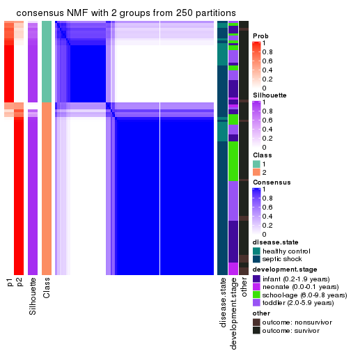</p>

</div>
<div id='tab-ATC-NMF-consensus-heatmap-2'>
<pre><code class="r">consensus_heatmap(res, k = 3)
</code></pre>

<p>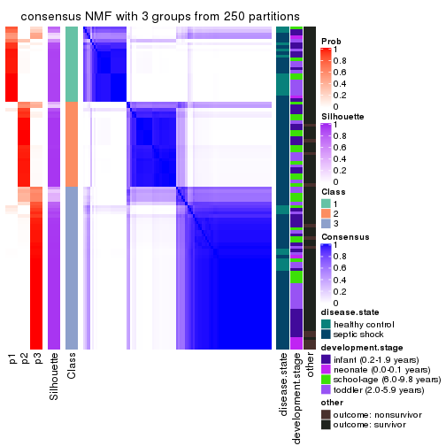</p>

</div>
<div id='tab-ATC-NMF-consensus-heatmap-3'>
<pre><code class="r">consensus_heatmap(res, k = 4)
</code></pre>

<p>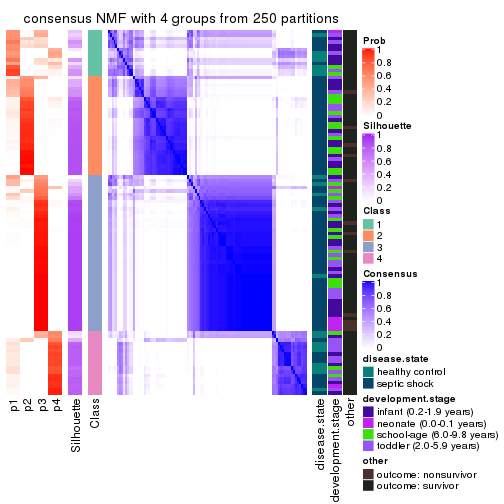</p>

</div>
<div id='tab-ATC-NMF-consensus-heatmap-4'>
<pre><code class="r">consensus_heatmap(res, k = 5)
</code></pre>

<p>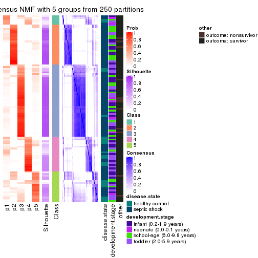</p>

</div>
<div id='tab-ATC-NMF-consensus-heatmap-5'>
<pre><code class="r">consensus_heatmap(res, k = 6)
</code></pre>

<p>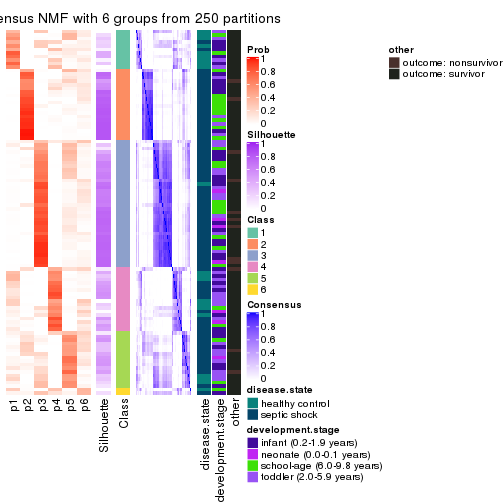</p>

</div>
</div>

Heatmaps for the membership of samples in all partitions to see how consistent they are:


<script>
$( function() {
	$( '#tabs-ATC-NMF-membership-heatmap' ).tabs();
} );
</script>
<div id='tabs-ATC-NMF-membership-heatmap'>
<ul>
<li><a href='#tab-ATC-NMF-membership-heatmap-1'>k = 2</a></li>
<li><a href='#tab-ATC-NMF-membership-heatmap-2'>k = 3</a></li>
<li><a href='#tab-ATC-NMF-membership-heatmap-3'>k = 4</a></li>
<li><a href='#tab-ATC-NMF-membership-heatmap-4'>k = 5</a></li>
<li><a href='#tab-ATC-NMF-membership-heatmap-5'>k = 6</a></li>
</ul>
<div id='tab-ATC-NMF-membership-heatmap-1'>
<pre><code class="r">membership_heatmap(res, k = 2)
</code></pre>

<p>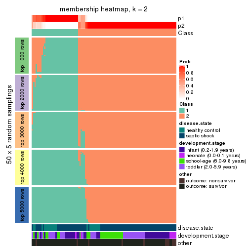</p>

</div>
<div id='tab-ATC-NMF-membership-heatmap-2'>
<pre><code class="r">membership_heatmap(res, k = 3)
</code></pre>

<p>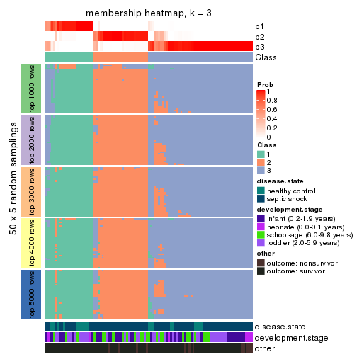</p>

</div>
<div id='tab-ATC-NMF-membership-heatmap-3'>
<pre><code class="r">membership_heatmap(res, k = 4)
</code></pre>

<p>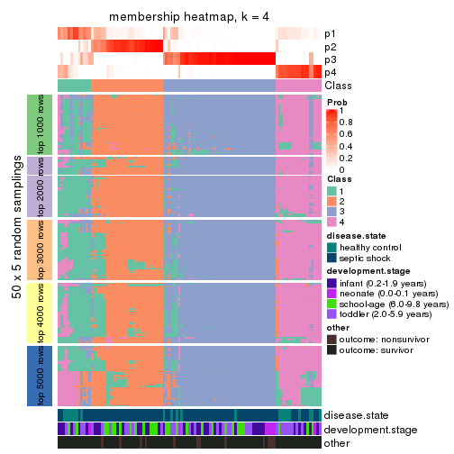</p>

</div>
<div id='tab-ATC-NMF-membership-heatmap-4'>
<pre><code class="r">membership_heatmap(res, k = 5)
</code></pre>

<p>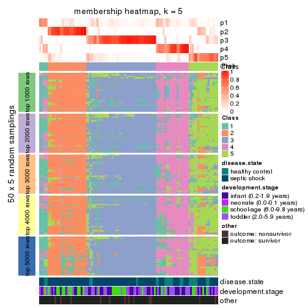</p>

</div>
<div id='tab-ATC-NMF-membership-heatmap-5'>
<pre><code class="r">membership_heatmap(res, k = 6)
</code></pre>

<p>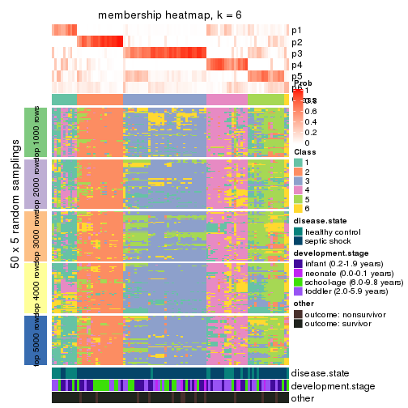</p>

</div>
</div>

As soon as we have had the classes for columns, we can look for signatures
which are significantly different between classes which can be candidate marks
for certain classes. Following are the heatmaps for signatures.


Signature heatmaps where rows are scaled:


<script>
$( function() {
	$( '#tabs-ATC-NMF-get-signatures' ).tabs();
} );
</script>
<div id='tabs-ATC-NMF-get-signatures'>
<ul>
<li><a href='#tab-ATC-NMF-get-signatures-1'>k = 2</a></li>
<li><a href='#tab-ATC-NMF-get-signatures-2'>k = 3</a></li>
<li><a href='#tab-ATC-NMF-get-signatures-3'>k = 4</a></li>
<li><a href='#tab-ATC-NMF-get-signatures-4'>k = 5</a></li>
<li><a href='#tab-ATC-NMF-get-signatures-5'>k = 6</a></li>
</ul>
<div id='tab-ATC-NMF-get-signatures-1'>
<pre><code class="r">get_signatures(res, k = 2)
</code></pre>

<p>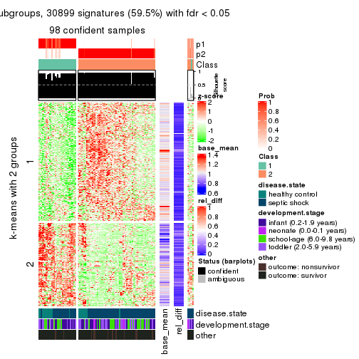</p>

</div>
<div id='tab-ATC-NMF-get-signatures-2'>
<pre><code class="r">get_signatures(res, k = 3)
</code></pre>

<p>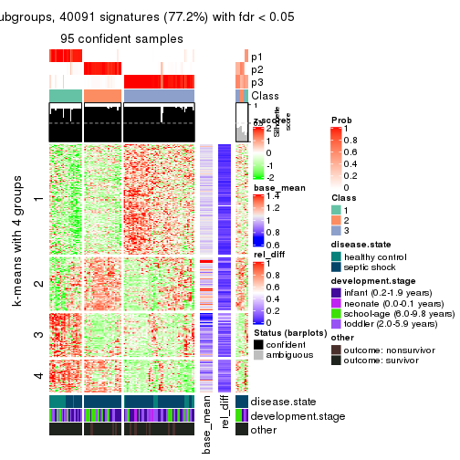</p>

</div>
<div id='tab-ATC-NMF-get-signatures-3'>
<pre><code class="r">get_signatures(res, k = 4)
</code></pre>

<p>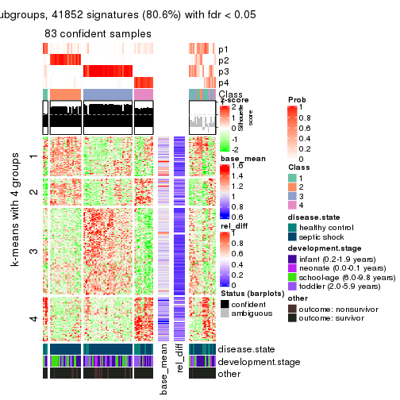</p>

</div>
<div id='tab-ATC-NMF-get-signatures-4'>
<pre><code class="r">get_signatures(res, k = 5)
</code></pre>

<p>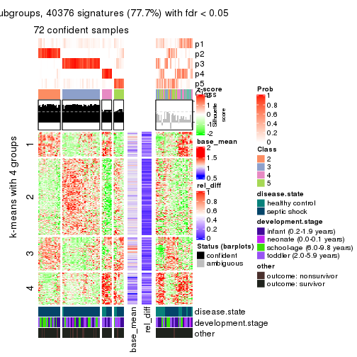</p>

</div>
<div id='tab-ATC-NMF-get-signatures-5'>
<pre><code class="r">get_signatures(res, k = 6)
</code></pre>

<p>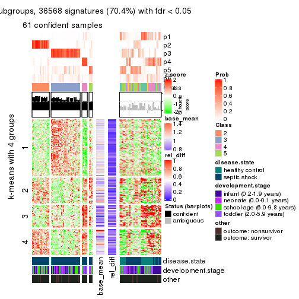</p>

</div>
</div>


Signature heatmaps where rows are not scaled:


<script>
$( function() {
	$( '#tabs-ATC-NMF-get-signatures-no-scale' ).tabs();
} );
</script>
<div id='tabs-ATC-NMF-get-signatures-no-scale'>
<ul>
<li><a href='#tab-ATC-NMF-get-signatures-no-scale-1'>k = 2</a></li>
<li><a href='#tab-ATC-NMF-get-signatures-no-scale-2'>k = 3</a></li>
<li><a href='#tab-ATC-NMF-get-signatures-no-scale-3'>k = 4</a></li>
<li><a href='#tab-ATC-NMF-get-signatures-no-scale-4'>k = 5</a></li>
<li><a href='#tab-ATC-NMF-get-signatures-no-scale-5'>k = 6</a></li>
</ul>
<div id='tab-ATC-NMF-get-signatures-no-scale-1'>
<pre><code class="r">get_signatures(res, k = 2, scale_rows = FALSE)
</code></pre>

<p>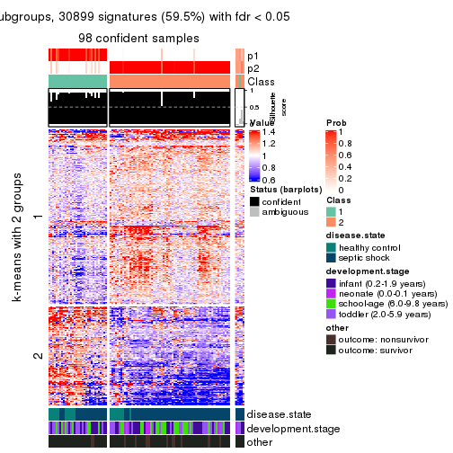</p>

</div>
<div id='tab-ATC-NMF-get-signatures-no-scale-2'>
<pre><code class="r">get_signatures(res, k = 3, scale_rows = FALSE)
</code></pre>

<p>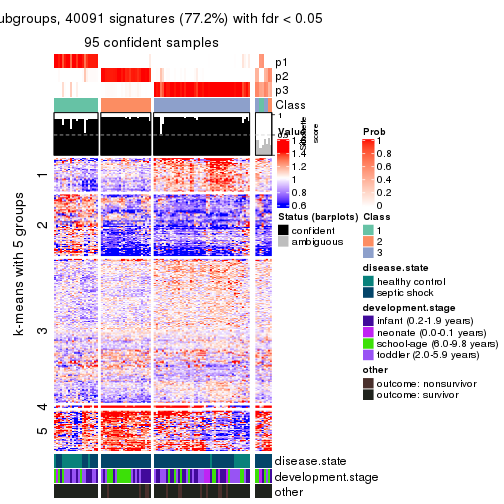</p>

</div>
<div id='tab-ATC-NMF-get-signatures-no-scale-3'>
<pre><code class="r">get_signatures(res, k = 4, scale_rows = FALSE)
</code></pre>

<p>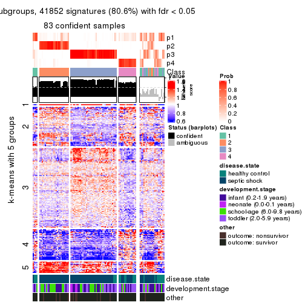</p>

</div>
<div id='tab-ATC-NMF-get-signatures-no-scale-4'>
<pre><code class="r">get_signatures(res, k = 5, scale_rows = FALSE)
</code></pre>

<p>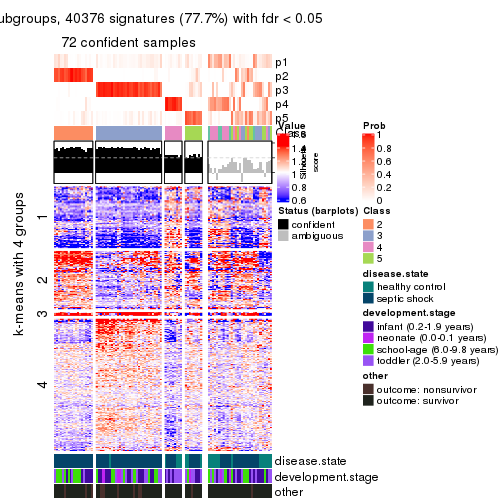</p>

</div>
<div id='tab-ATC-NMF-get-signatures-no-scale-5'>
<pre><code class="r">get_signatures(res, k = 6, scale_rows = FALSE)
</code></pre>

<p>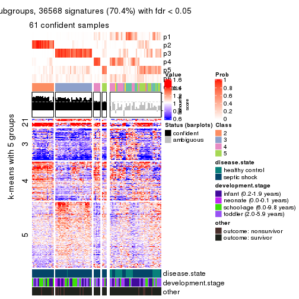</p>

</div>
</div>


Compare the overlap of signatures from different k:

```r
compare_signatures(res)
```

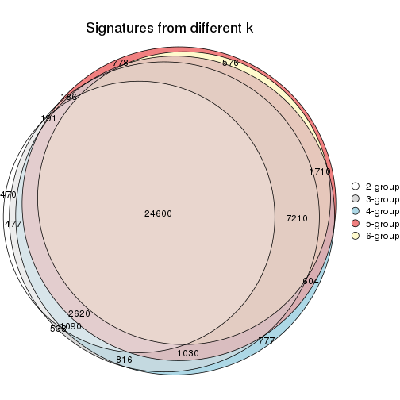

`get_signature()` returns a data frame invisibly. TO get the list of signatures, the function
call should be assigned to a variable explicitly. In following code, if `plot` argument is set
to `FALSE`, no heatmap is plotted while only the differential analysis is performed.

```r
# code only for demonstration
tb = get_signature(res, k = ..., plot = FALSE)
```

An example of the output of `tb` is:

```
#>   which_row         fdr    mean_1    mean_2 scaled_mean_1 scaled_mean_2 km
#> 1        38 0.042760348  8.373488  9.131774    -0.5533452     0.5164555  1
#> 2        40 0.018707592  7.106213  8.469186    -0.6173731     0.5762149  1
#> 3        55 0.019134737 10.221463 11.207825    -0.6159697     0.5749050  1
#> 4        59 0.006059896  5.921854  7.869574    -0.6899429     0.6439467  1
#> 5        60 0.018055526  8.928898 10.211722    -0.6204761     0.5791110  1
#> 6        98 0.009384629 15.714769 14.887706     0.6635654    -0.6193277  2
...
```

The columns in `tb` are:

1. `which_row`: row indices corresponding to the input matrix.
2. `fdr`: FDR for the differential test. 
3. `mean_x`: The mean value in group x.
4. `scaled_mean_x`: The mean value in group x after rows are scaled.
5. `km`: Row groups if k-means clustering is applied to rows.


UMAP plot which shows how samples are separated.


<script>
$( function() {
	$( '#tabs-ATC-NMF-dimension-reduction' ).tabs();
} );
</script>
<div id='tabs-ATC-NMF-dimension-reduction'>
<ul>
<li><a href='#tab-ATC-NMF-dimension-reduction-1'>k = 2</a></li>
<li><a href='#tab-ATC-NMF-dimension-reduction-2'>k = 3</a></li>
<li><a href='#tab-ATC-NMF-dimension-reduction-3'>k = 4</a></li>
<li><a href='#tab-ATC-NMF-dimension-reduction-4'>k = 5</a></li>
<li><a href='#tab-ATC-NMF-dimension-reduction-5'>k = 6</a></li>
</ul>
<div id='tab-ATC-NMF-dimension-reduction-1'>
<pre><code class="r">dimension_reduction(res, k = 2, method = &quot;UMAP&quot;)
</code></pre>

<p>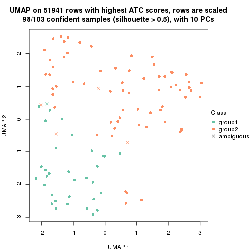</p>

</div>
<div id='tab-ATC-NMF-dimension-reduction-2'>
<pre><code class="r">dimension_reduction(res, k = 3, method = &quot;UMAP&quot;)
</code></pre>

<p>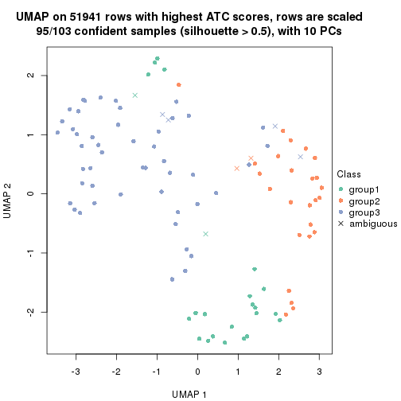</p>

</div>
<div id='tab-ATC-NMF-dimension-reduction-3'>
<pre><code class="r">dimension_reduction(res, k = 4, method = &quot;UMAP&quot;)
</code></pre>

<p>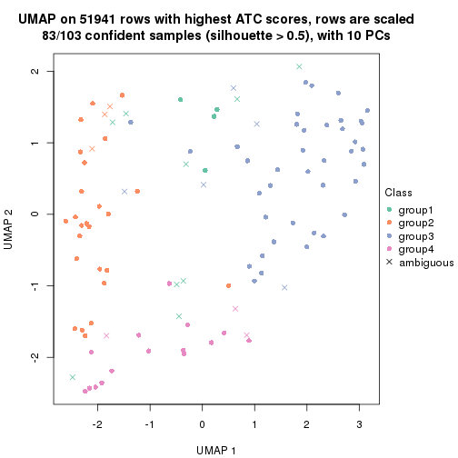</p>

</div>
<div id='tab-ATC-NMF-dimension-reduction-4'>
<pre><code class="r">dimension_reduction(res, k = 5, method = &quot;UMAP&quot;)
</code></pre>

<p>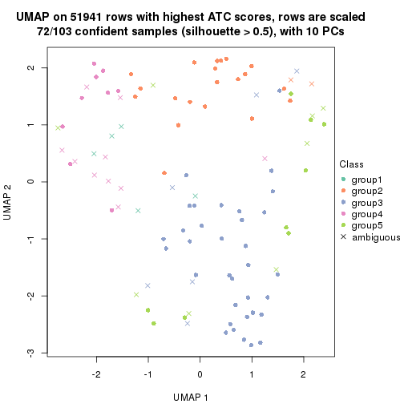</p>

</div>
<div id='tab-ATC-NMF-dimension-reduction-5'>
<pre><code class="r">dimension_reduction(res, k = 6, method = &quot;UMAP&quot;)
</code></pre>

<p>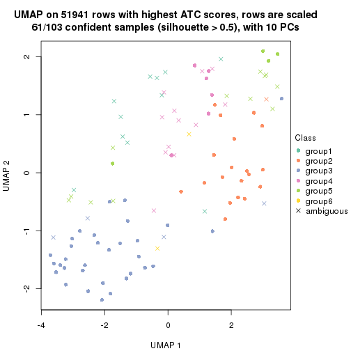</p>

</div>
</div>


Following heatmap shows how subgroups are split when increasing `k`:

```r
collect_classes(res)
```

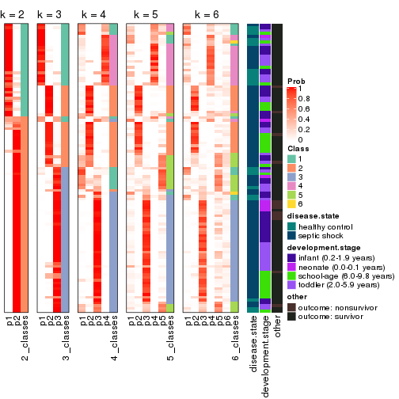


Test correlation between subgroups and known annotations. If the known
annotation is numeric, one-way ANOVA test is applied, and if the known
annotation is discrete, chi-squared contingency table test is applied.

```r
test_to_known_factors(res)
```

```
#>          n disease.state(p) development.stage(p) other(p) k
#> ATC:NMF 98         1.48e-02                0.605    0.351 2
#> ATC:NMF 95         2.96e-05                0.224    0.126 3
#> ATC:NMF 83         3.47e-06                0.356    0.282 4
#> ATC:NMF 72         2.24e-04                0.114    0.478 5
#> ATC:NMF 61         8.20e-01                0.322    0.473 6
```


If matrix rows can be associated to genes, consider to use `functional_enrichment(res,
...)` to perform function enrichment for the signature genes. See [this vignette](http://bioconductor.org/packages/devel/bioc/vignettes/cola/inst/doc/functional_enrichment.html) for more detailed explanations.


 

## Session info


```r
sessionInfo()
```

```
#> R version 3.6.0 (2019-04-26)
#> Platform: x86_64-pc-linux-gnu (64-bit)
#> Running under: CentOS Linux 7 (Core)
#> 
#> Matrix products: default
#> BLAS:   /usr/lib64/libblas.so.3.4.2
#> LAPACK: /usr/lib64/liblapack.so.3.4.2
#> 
#> locale:
#>  [1] LC_CTYPE=en_GB.UTF-8       LC_NUMERIC=C               LC_TIME=en_GB.UTF-8       
#>  [4] LC_COLLATE=en_GB.UTF-8     LC_MONETARY=en_GB.UTF-8    LC_MESSAGES=en_GB.UTF-8   
#>  [7] LC_PAPER=en_GB.UTF-8       LC_NAME=C                  LC_ADDRESS=C              
#> [10] LC_TELEPHONE=C             LC_MEASUREMENT=en_GB.UTF-8 LC_IDENTIFICATION=C       
#> 
#> attached base packages:
#> [1] grid      stats     graphics  grDevices utils     datasets  methods   base     
#> 
#> other attached packages:
#> [1] genefilter_1.66.0    ComplexHeatmap_2.3.1 markdown_1.1         knitr_1.26          
#> [5] GetoptLong_0.1.7     cola_1.3.2          
#> 
#> loaded via a namespace (and not attached):
#>  [1] circlize_0.4.8       shape_1.4.4          xfun_0.11            slam_0.1-46         
#>  [5] lattice_0.20-38      splines_3.6.0        colorspace_1.4-1     vctrs_0.2.0         
#>  [9] stats4_3.6.0         blob_1.2.0           XML_3.98-1.20        survival_2.44-1.1   
#> [13] rlang_0.4.2          pillar_1.4.2         DBI_1.0.0            BiocGenerics_0.30.0 
#> [17] bit64_0.9-7          RColorBrewer_1.1-2   matrixStats_0.55.0   stringr_1.4.0       
#> [21] GlobalOptions_0.1.1  evaluate_0.14        memoise_1.1.0        Biobase_2.44.0      
#> [25] IRanges_2.18.3       parallel_3.6.0       AnnotationDbi_1.46.1 highr_0.8           
#> [29] Rcpp_1.0.3           xtable_1.8-4         backports_1.1.5      S4Vectors_0.22.1    
#> [33] annotate_1.62.0      skmeans_0.2-11       bit_1.1-14           microbenchmark_1.4-7
#> [37] brew_1.0-6           impute_1.58.0        rjson_0.2.20         png_0.1-7           
#> [41] digest_0.6.23        stringi_1.4.3        polyclip_1.10-0      clue_0.3-57         
#> [45] tools_3.6.0          bitops_1.0-6         magrittr_1.5         eulerr_6.0.0        
#> [49] RCurl_1.95-4.12      RSQLite_2.1.4        tibble_2.1.3         cluster_2.1.0       
#> [53] crayon_1.3.4         pkgconfig_2.0.3      zeallot_0.1.0        Matrix_1.2-17       
#> [57] xml2_1.2.2           httr_1.4.1           R6_2.4.1             mclust_5.4.5        
#> [61] compiler_3.6.0
```


